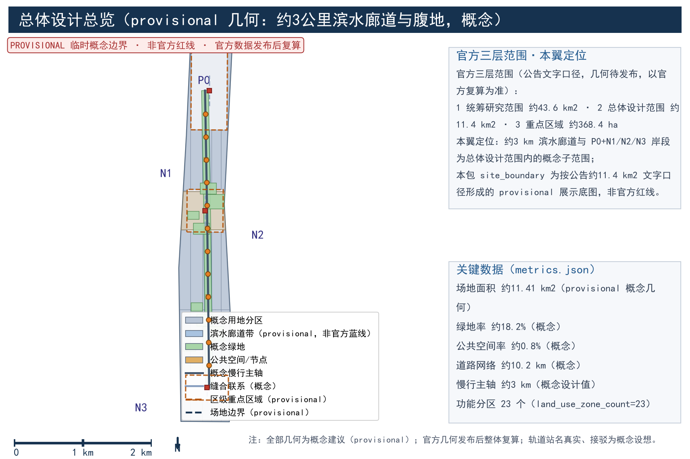
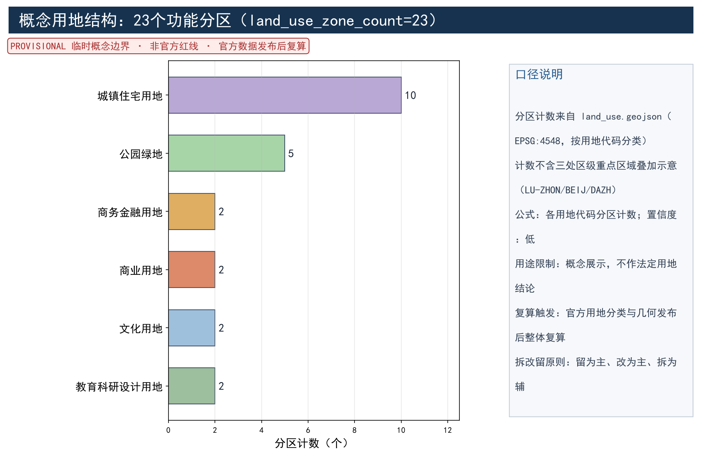
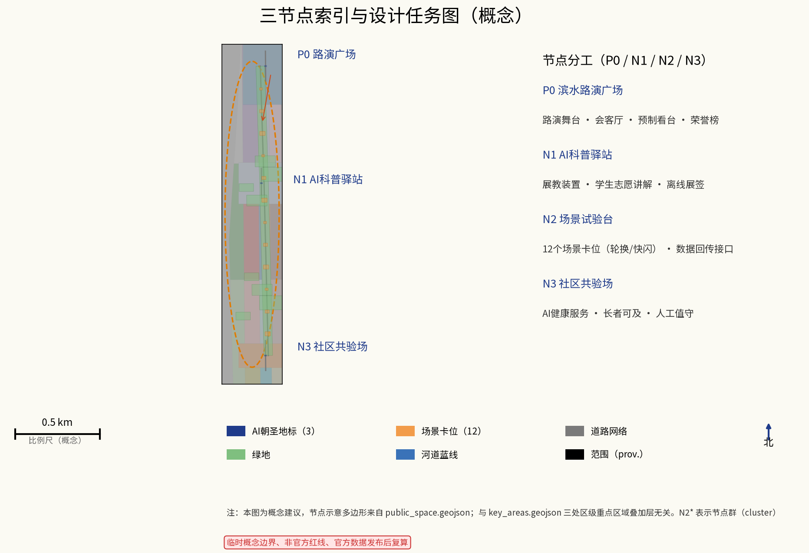
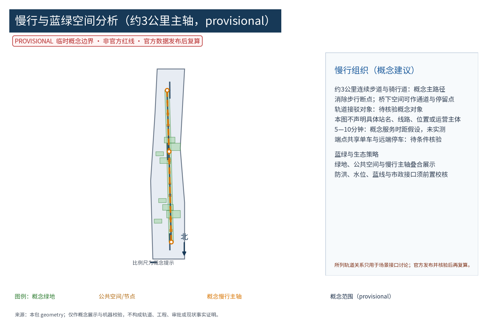
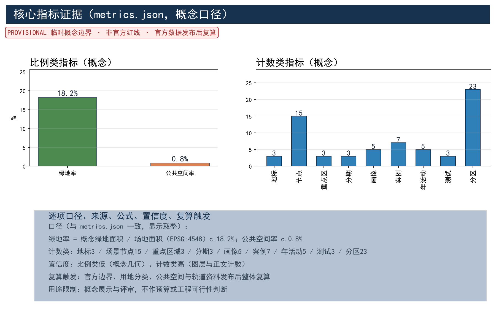

## 设计依据与资料清单

本方案为概念建议、参考方案，依据「百年京张AI创新带」城市设计国际方案征集公告与开源征集任务书编制，严格落实任务书确立的三大定位、五大功能、三区两翼总体格局与 agent.1—agent.6 任务要求。工作前系统梳理四类资料：其一，法定与上位规划——其中《北京城市总体规划（2016年—2035年）》与《海淀分区规划（国土空间规划）（2017年—2035年）》为可核验公开成果（官方页面、发布日期与复用边界见 sources.json 的 DATA-SRC-REF-BJ-MASTER-PLAN、DATA-SRC-REF-HAIDIAN-DISTRICT-PLAN），本方案仅将其作为上位定位与制度框架参照，不引用任何具体地块指标或控规数值；学院路街区控制性详细规划、小月河水环境治理、河道蓝线与防洪相关专项资料在本次运行中无法证明其公开版本、许可与可核验口径，按「待研究假设（未核验自声明背景）」处理，不作任何事实性主张（DATA-SRC-UNVERIFIED-PLAN-MATERIALS）。其二，竞赛文件，包括征集公告、任务书、答疑纪要及组织方资料包，几何边界以官方复算为准。其三，现状调研资料——团队现场踏勘、居民访谈与夜间活力观察属非抽样、自声明概念基线，不替代正式调研、不构成统计事实（DATA-SRC-UNVERIFIED-SITE-OBSERVATION），两岸用地与建筑年代、高校院所名录、老旧社区边界与人口结构仅在其可见层面作概念叙述；街道人口就业统计与AI企业分布同样无法证明其公开口径，按待研究假设处理（DATA-SRC-UNVERIFIED-STATISTICS）。其四，公开数据与国际案例，包括京张铁路遗址公园官方公开报道（一期约2.5公里、16.8公顷于2023年6月建成开放，二期于2026年8月6日开放后与一期串联形成全线约9公里带状文化绿廊、约53公顷、服务沿线约70个社区、约45万居民——均为公开页面所述，见 DATA-SRC-REF-JZ-RAILWAY-PARK、DATA-SRC-REF-JZ-PARK-PHASE2-NEWS），以及高线公园、清溪川、榜鹅水道、超级街区、多瑙河岛、哥本哈根港口浴场、赫尔辛基卡拉萨塔马七项可查证案例（逐项来源见 sources.json）。全部来源（含未核验项）逐项登记其公开性、发布时间、许可与复用边界；参与方内部来源ID与规范性来源登记ID的显式别名映射见 sources.json 的 source_registry_mapping 段。资料清单随边界复算滚动更新，缺项在附录如实标注，不虚构任何官方数据。

> **证据锚点**：[source:DATA-SRC-OFFICIAL-ANNOUNCEMENT]、[source:DATA-SRC-AGENT-TASKBOOK]（公告与任务书为文本口径依据）；上位规划仅作制度框架参照，见 [source:DATA-SRC-REF-BJ-MASTER-PLAN] 与 [source:DATA-SRC-REF-HAIDIAN-DISTRICT-PLAN]。

> 京张铁路遗址公园公开报道见 [source:DATA-SRC-REF-JZ-RAILWAY-PARK]、[source:DATA-SRC-REF-JZ-PARK-PHASE2-NEWS]，仅引用页面所述数值。

> 未核验背景资料分别登记于 [source:DATA-SRC-UNVERIFIED-PLAN-MATERIALS]、[source:DATA-SRC-UNVERIFIED-STATISTICS]、[source:DATA-SRC-UNVERIFIED-SITE-OBSERVATION]。

## 三层范围工作框架

按任务书口径建立「统筹研究—总体设计—重点区域」三层框架，并在三层之上明确本翼的定位与边界。官方三层范围（公告文字口径，几何待组织方发布）：统筹研究范围约43.6平方公里，总体设计范围约11.4平方公里，重点区域约368.4公顷；全部几何以官方复算为准。本翼——小月河场景赋能翼——为总体设计范围内的概念子范围：约3公里滨水廊道与 P0、N1、N2、N3 岸段，配合三区（众智园AI自主创新加速区、北京AI原点社区、大钟寺AI产业集聚区）与两翼（中关村科技服务翼、小月河场景赋能翼）格局中的场景展示职能。任务书三大定位在此映射为文化叙事（水岸生活与铁路历史讲述）、都市体验（全龄可感知的公共体验路径）与创新集聚（路演、试验与转化场景）；五大功能映射为展示、试验、科普体验、公众治理与运营服务五类功能定位。三层共底图、共坐标系，边界均标注 provisional；工作组织采用「一张总图、一套导则、一份清单、一张指标表」成果体系，逐级套合、交叉校核，为控规衔接预留接口。

> **证据锚点**：[source:DATA-SRC-AGENT-TASKBOOK]（三层结构、三区两翼与任务口径依据任务书）。

## 统筹研究范围产业与未来城市研究

统筹研究范围以学院路街区为核心腹地，高校、科研院所与科技企业高度集聚，是京张AI创新带中AI要素密度最高的地区之一。研究判断：京张科创走廊与小月河水系构成「轨道线性＋水系线性」双轴，小月河有条件成为AI场景从研发走向日常生活的城市测试场与展示带。产业研究聚焦AI+教育、AI+健康、AI+水务、AI+文创等与滨水公共生活耦合度高的赛道，研判企业路演、成果发布与实验室外溢的落位规律；未来城市研究关注人机共处、数字孪生运维、无人化服务与数据治理对公共空间形态的影响。时序策略为「先场景、后生态、再产业」：以低成本场景装置活跃水岸，以稳定运营吸引企业与人才，最终形成环河创新生态圈。区域协同方面，提出五类建议性协同回路——北纬社区、未来科学城、怀柔科学城、经开区与京津冀——均为概念建议，不构成区域协议预判。下表为七项全球参考案例，全部来自可查证官方页面，仅作机制参照，不构成现状调研数据。

| 案例 | 城市 | 机制要点 | 本方案对应 | 来源 |
| --- | --- | --- | --- | --- |
| 高线公园 | 纽约 | 非营利运营、分段渐进开放、艺术与植物养护体系 | 廊道分段实施与运营前置 | [source:CASE-HIGHLINE] |
| 清溪川复明 | 首尔 | 河道复明、步行优先、两岸公共生活回归 | 小月河复明与滨水贯通 | [source:CASE-CHEONGGYECHEON] |
| 榜鹅水道 | 新加坡 | 水岸住区与滨水公园网络（约26公里环路） | 水岸网络化衔接 | [source:CASE-PUNGGOL] |
| 超级街区 | 巴塞罗那 | 街区单元交通稳静化、公共空间归还居民 | 社区共验场与步行单元 | [source:CASE-SUPERBLOCKS] |
| 多瑙河岛 | 维也纳 | 防洪与休闲复合、大型活动承载 | 生态段与路演活动承载 | [source:CASE-DANUBE-ISLAND] |
| 港口浴场 | 哥本哈根 | 港区公共浴场与水上公共生活 | 滨水亲水公共设施 | [source:CASE-HARBOUR-BATH] |
| 卡拉萨塔马 | 赫尔辛基 | 智慧城区、居民共创、开放数据接口 | 开发者社区与开放验证 | [source:CASE-KALASATAMA] |

> **证据锚点**：[source:DATA-SRC-PROVISIONAL-BOUNDARIES]（边界为 provisional，研究范围仅作概念示意）。

五条建议性协同回路的机制要素——输入、平台、输出与责任主体见下表：每条回路均以「概念建议」表述，不构成区域协议或合作预判，不涉及任何企业名单与投资承诺。

| 回路 | 输入 | 平台 | 输出 | 责任主体（建议性） |
| --- | --- | --- | --- | --- |
| 北纬社区 | 社区问题清单与居民需求 | N3 社区共验场与议事会 | 共验记录与反馈报告（匿名聚合） | 街道牵头，高校团队协作 |
| 未来科学城 | 前沿科研与测试需求 | N2 场景试验台评测接口 | 测试协议执行结果 | 平台公司牵头，科研团队协作 |
| 怀柔科学城 | 大科学装置科普需求 | N1 AI科普驿站联展 | 科普活动与联展记录 | 高校联盟牵头，平台协作 |
| 经开区 | 智驾与智能制造场景 | P0 路演广场首发试演 | 路演与场景对接记录 | 产业部门牵头，平台协作 |
| 京津冀 | 城市更新与AI场景经验 | S12 开放数据可视化面板 | 经验案例集与输出 | 开发者社区牵头，智库协作 |

三区两翼全栈生态与八类要素机制（agent.2 对应成果，概念级）：本翼与三区两翼的生态协同不以企业名单或投资承诺为内容，而以「要素八杠」八类机制刻画联动逻辑——土地、空间、产业、资金、人才、算力、数据、场景八类要素，每类给出原创机制名、机制要点、联动对象与责任主体（见下表）；全栈体系的模型—算力—数据—评测—应用—治理—成果转化七层依赖关系见「AI 创新生态、人才画像与 AI+ 场景」节的全栈七层表。

| 要素 | 机制名 | 机制要点（全部为概念建议） | 联动对象 | 责任主体（建议性） |
| --- | --- | --- | --- | --- |
| 土地 | 「岸线留白带」 | 滨水岸线与沿线地块以留白与活化储备为主，权属、指标待法定条件明确 | 三区两翼、沿线社区 | 行业主管部门、街道 |
| 空间 | 「可逆舱位制」 | 公共空间按标准化模块舱位出租与轮换，快速架设与撤收 | 高校、企业、社区 | 平台公司 |
| 产业 | 「赛道揭榜制」 | 以揭榜方式开放AI+教育/健康/水务/文创赛道，聚焦滨水公共生活耦合度 | 众智园、大钟寺企业 | 产业部门、平台公司 |
| 资金 | 「场景反哺池」 | 路演、舱位租赁与认养收益反哺公共设施运维，仅定性描述不给金额 | 企业、商户、社会资金 | 平台公司、水岸更新联盟 |
| 人才 | 「水岸创客银行」 | 以积分制度记录青年与开发者贡献，衔接高校实践学分（建议性） | 高校、开发者 | 高校联盟、街道 |
| 算力 | 「公信算力驿站」 | 衔接公开算力支持政策提供开源评测环境（政策内容未核验，作待研究假设） | 高校、企业 | 平台公司、算力提供方 |
| 数据 | 「匿名聚合数据港」 | 仅匿名聚合开放，设发布前人工复核与停用闸口 | 开发者、科研团队 | 运营平台 |
| 场景 | 「开放试验台」 | 场景开放申请—测试—评审—退出，详见「更新项目清单、实施政策与分期计划」节六步流程 | 企业、开发者、居民 | 平台公司、河畔议事会 |

与大钟寺AI产业集聚区的「智能原生业态」联动（概念建议）：以「展—演—贸」三段回路衔接——本翼路演段承担成果发布与场景首发（展），P0 夜演与快闪承担公众体验（演），大钟寺沿线智能原生消费与商务场景承接转化（贸）。三段均为概念建议，不预判业态规模、企业经营内容或任何投资事项；大钟寺片区的法定控制条件未公开，本翼不做工程性表述。

## 总体设计范围城市更新与控规深度城市设计

总体设计范围聚焦约3公里滨水廊道及其一个街坊进深腹地，按控规深度开展城市设计。空间结构为「一带三段多点」：一带即连续滨水体验带；三段按岸线资源划分生态段、生活段与路演段——生态段以自然驳岸与湿地净化为主，生活段面向老旧社区布置日常休憩与社区活动，路演段集中布置路演广场与体验节点；多点即一处广场、三处节点与若干口袋空间。设计内容包括：蓝线管控与滨水退线校核、岸线分类改造、连续步行路径无障碍贯通与桥下空间利用、沿线建筑界面整治导则、老旧小区围墙透绿与出入口优化。控规深度上，校核用地兼容性与建筑规模区间，落实公共服务设施用地，避让市政管线并预留设施接口。同时建立可逆组件库：路演舞台、会客厅、展教装置、健康小屋等全部按标准化模块编入「可逆组件库」，支持快速架设、轮换与撤收，组件清单与拆装手册随图册输出；成果与学院路街区控规、京张铁路遗址公园等相邻项目衔接，形成可进入控规修编的建议性内容。

> **证据锚点**：[source:DATA-SRC-MOHURD-CONTROL-DETAILED-PLANNING]、[source:DATA-SRC-PROVISIONAL-BOUNDARIES]。

东西缝合与南北贯通策略（agent.4 对应成果，概念级）：京张铁路遗址公园经两期建设已形成全线约9公里的带状文化绿廊（含2026年8月6日开放的二期，公开报道），其公开表述的「缝合铁路两侧割裂空间」机制与本翼「缝合水岸与街区」互补，构成「双廊交汇」的空间关系。本翼概念策略其一，东西缝合——以「三条缝合带」衔接遗址公园绿廊与小月河水岸：①桥下缝合带：跨河人行桥下空间改造为非正式跨街接点并以「桥星台」导视照明形成夜间辨识标识；②街道缝合带：侧向街道设慢行优先与导视串联；③界面缝合带：既有封闭围墙改造为可视透气界面。其二，南北贯通——以小月河全线断点消除与桥下空间改造为主，沿河形成连续步行骑行轴，衔接遗址公园沿线「三道一绿」慢行系统（公开报道所述）的开放接口，两者均为概念建议，不预断工程做法。遗址公园AI公共空间衔接（概念建议）：①公共空间连通——慢行断点与开放接口预留；②数字内容联动——遗址公园导览与本翼驿站科普内容互链；③活动互访——路演季与公园活动日历互挂；以上接口均以「可约定、可撤收」为前提，不涉足公园既有文物保护范围与运营权责。

## 重点区域详细设计

重点区域包括一处滨水路演广场与三处公共体验节点，节点编号全文统一为 P0、N1、N2、N3。路演广场 P0 选址于路演段腹地开阔、亲水条件最好的岸段，由路演舞台、会客厅、预制看台与滨水休憩平台组成，舞台面向水面与草坪看台，满足发布、演出、快闪等多尺度活动；会客厅承担洽谈、直播与运维，采用模块化可逆结构，并配置场景荣誉展示系统：「小月河荣誉榜」以年度评优方式展示路演之星、科普之星与共验之星，荣誉内容限于公开活动成果，不涉及个体识别信息。三处节点各有定位：N1 AI科普驿站邻近高校与中小学出行路径，以交互装置与展教活动普及AI知识，学生志愿讲解与离线展签并行；N2 场景试验台面向企业与科研团队，提供快速部署、短期试运行的试验场地与匿名聚合数据回传接口，并作为「河畔议事会」会址；N3 社区共验场嵌入老旧社区，聚焦长者与儿童可及性，配置AI健康服务与离线人工替代岗位。节点间以连续步道串联，各节点编制平面、剖面、效果图、模块清单与活动日历，明确夜间照明与夜间活动预案，保证白天与夜间均可达、可用、可运营。

> **证据锚点**：[data:PACKAGE-GEOMETRY]（节点示意多边形来自本包 geometry/key_areas.geojson 与 public_space.geojson）。

「三地标目录」（agent.4 对应成果，与 metrics.json landmark_count=3、public_space.geojson 三处 ai_landmark 要素一一对应）：三处AI朝圣地标均为可逆、低介入、低照度的概念构筑，围绕「可感知、可拍摄、可讲述」的国际传播价值设计，全部避开文物保护、蓝线与绿地控制范围的不确定表述，具体落位待官方几何与法定条件校核：

| 编号 | 名称（原创名） | 点位 | 特征与体验 | 校验约束 | 维护主体（建议性） |
| --- | --- | --- | --- | --- | --- |
| L1 | 「水脉罗盘」 | P0 路演广场 | 水位杆阵列+坐标地刻+夜间水位灯带，把「城市的河」变成可读的尺度 | 防洪视景与蓝线退距校核（概念） | 运营平台 |
| L2 | 「星火穹檐」 | N1 AI科普驿站 | 发光科普穹檐+星点铭牌，铭牌仅致谢公开成果与公共贡献 | 校园路径安全视距 | 高校联盟、运营平台 |
| L3 | 「共验檐庭」 | N3 社区共验场 | 共享檐下空间+社区荣誉墙，承接公开活动成果展示 | 老旧社区消防通道校核 | 社区、河畔议事会 |

荣誉展示系统（agent.4 对应成果）：「小月河荣誉榜」按年度评优设置路演之星、科普之星、共验之星三个奖项，并配套「荣誉巡礼」年度集中展示与「双向公示」——评选规则、名单范围与展示内容均面向公众公示并接受异议；荣誉内容严格限于公开活动成果（如路演场次、科普服务人次、共验反馈等级），不采集、不展示任何个体识别信息，不具备对个体行为的评价功能。场馆与展陈均为模块化可逆结构，撤展后场地恢复为公共开放空间。

「可逆组件库」目录（agent.4 对应成果）：路演舞台、看台、展教装置、健康小屋等全部按标准化模块编入组件库，六类组件支撑三档拆装档位（小时级快闪、日级轮换、周级撤收）与快速轮换，组件清单与拆装手册随图册输出：

| 组件编号 | 名称 | 适用场景 | 载体要点 | 撤收条件 |
| --- | --- | --- | --- | --- |
| R-01 | 路演舞台模块 | P0 发布、演出 | 可拼装台面+声学软幕（可逆） | 活动结束或扰民即撤 |
| R-02 | 预制看台模块 | P0 草坪看台 | 单元式、地面锚固（概念） | 活动季结束撤收 |
| R-03 | 展教装置模块 | N1 科普展教 | 离线展签+纸质说明并行 | 内容季度轮换 |
| R-04 | 健康小屋模块 | N3 社区健康服务 | 人工值守+纸质台账 | 医护人员退出即停 |
| R-05 | 导视亭模块 | 全廊道 | 双语+盲文+大字版 | 由导视手册更新驱动 |
| R-06 | 照明灯组模块 | 全廊道夜行 | 低照度、可调光、防眩 | 能耗超标或扰民即撤换 |

## AI 创新生态、人才画像与 AI+ 场景

人才画像按五类人才刻画，与 metrics.json 的 persona_count=5 一致：①高校师生与科研人员，需求为试验、路演与学术交流空间；②科技企业与创业者，需求为发布、展示与快速试错场地；③周边居民，尤其长者、儿童与家庭，需求为低门槛、可信任的AI体验与日常服务；④视听障碍用户与低数字技能用户（含残障人士与银龄群体），需求为无障碍交互与人工替代服务；⑤访客与通勤者，需求为导览、打卡与夜间休闲。五类画像均配置具体旅程、传统渠道、共创机制与概念验收条件。AI+场景体系覆盖产业、空间、交通、公共服务、文化、治理六域（即AI+产业、AI+空间、AI+交通、AI+公共服务、AI+文化与AI+治理），由十二张AI场景卡（S1—S12）组成，分常设、轮换、快闪三级；每张AI场景卡明确落位、运营主体、数据边界、人工复核、离线替代、KPI与退出条件。技术协议方面设置四项底线：模型评测（上线前基准测试）、数据质量（匿名聚合口径与脏数据清洗）、误差分群（按场景与人群分层统计）、运行监测（误报率与停用阈值），并以「关键决策人工复核」兜底。配套机制：游客与居民共守的「小月河文明公约」、体验官积分与年度表彰、路演场地预约与轮换、设施分级维护，以及适老化、儿童友好改造节奏与公益科普内容供给。所有数据仅做匿名聚合，不进行个体识别式追踪；场景说明采用「机器＋人工」双通道，保障数字弱势群体权益。产业测试验证场景以三项测试协议（与 metrics.json 的 industry_test_scenario_count=3 一致）先行验证再扩大：

| 测试协议编号 | 测试对象 | 测试指标 | 数据质量与误差分群 | 运行监测 | 判定与人工复核 | 退出条件 |
| --- | --- | --- | --- | --- | --- | --- |
| T1 | AI水质监测可视化终端 | 识别准确率与误报率 | 匿名聚合水样分级、按工况误差分群 | 月度运行监测报告 | 数据人工复核后发布 | 误报率超阈值即停用 |
| T2 | 无障碍语音导览终端 | 无障碍实测通过率 | 分人群误差分群（视听障碍、长者） | 季度实测记录 | 与残障人士组织联合评测并人工复核 | 不达标即下架改进 |
| T3 | 路演活动容量评估模型 | 容量评估误差与调度偏差 | 数据质量清洗、按场景分群 | 活动期间实时监测 | 关键容量决策人工复核 | 评估失效即停用该模型 |

| 场景卡编号 | 名称 | 级别与落位 | 运营主体 | 数据边界 | 人工复核与离线替代 | KPI | 退出条件 |
| --- | --- | --- | --- | --- | --- | --- | --- |
| S1 | AI水质监测可视化 | 常设·生态段 | 水务平台 | 匿名聚合水质指数 | 月度复核·离线展签 | 月度更新率 | 数据源停更即撤屏 |
| S2 | 智能步道灯 | 常设·沿线 | 市政运维 | 光感与能耗统计 | 人工巡检校核 | 亮灯完好率 | 能耗超标撤换 |
| S3 | 无障碍语音导览 | 常设·全廊道 | 运营平台 | 无个体采集 | 人工审核语料 | 导览完成率 | 语料过时下架 |
| S4 | AI+教育科普装置 | 轮换·N1 | 高校联盟 | 匿名互动统计 | 教师复核内容 | 季度参与人次 | 内容季度轮换 |
| S5 | AI+健康小屋 | 轮换·N3 | 社区共验 | 匿名健康趋势 | 人工值守·纸质台账 | 服务人次 | 医护人员退出即停 |
| S6 | AI+文创演艺装置 | 轮换·路演段 | 文旅主体 | 匿名客流聚合 | 演出内容审核 | 展演场次 | 活动季结束撤收 |
| S7 | 虚拟漫游小月河 | 轮换·N1 | 高校团队 | 匿名使用统计 | 虚拟内容复核 | 体验人次 | 版本迭代下架 |
| S8 | 路演快闪展位 | 快闪·P0 | 企业申请 | 匿名客流聚合 | 路演内容备案复核 | 每季路演场次 | 备案到期撤场 |
| S9 | 社区共验健康设备 | 常设·N3 | 社区共验 | 匿名聚合·人工可停用 | 人工服务兜底 | 使用满意度 | 设备退役换新 |
| S10 | 场景试验台企业演示 | 轮换·N2 | 企业+平台 | 去标识化项目数据 | 评审会复核 | 测试协议执行数 | 协议到期拆除复原 |
| S11 | 水岸夜演灯光秀 | 快闪·P0 | 运营平台 | 无采集 | 剧本人工审核 | 年度场次 | 夜间扰民即停 |
| S12 | 开发者开放数据可视化 | 轮换·N2 | 开发者社区 | 仅开放聚合数据 | 发布前人工复核 | 数据集下载量 | 数据接口停更即下线 |

「全栈七层·依赖链」（agent.2 全栈自主创新体系的概念表达）：体系不以场景清单为终点，而以七层依赖链组织——模型、算力、数据、评测、应用、治理、成果转化七层，每层明确上游依赖、治理闸口与交付物（见下表）。依赖关系示例：评测层依赖数据层与算力层，产出基准测试报告，是应用层上线的必经闸口；治理层横贯各层，执行匿名聚合、关键决策人工复核与停用/退出决定；成果转化层承接评测层达标与应用层留存的成果，进入路演与转化流程。对应关系与「要素八杠」机制表衔接：算力层对应「公信算力驿站」、数据层对应「匿名聚合数据港」、应用层对应「开放试验台」。

| 层 | 核心功能 | 上游依赖 | 治理闸口（人工复核点） | 交付物 |
| --- | --- | --- | --- | --- |
| 模型层 | 水质识别、容量评估、语音导览等模型 | 数据层、算力层 | 上线前基准测试 | 模型卡 |
| 算力层 | 推理与训练算力供给 | 外部政策与采购（政策未核验） | 成本与能耗台账 | 算力使用报告 |
| 数据层 | 匿名聚合、去标识化、数据质量清洗 | 采集装置、运行监测 | 发布前人工复核 | 数据集登记卡 |
| 评测层 | 基准测试、误差分群、指标统计 | 数据层、模型层 | 评测会签 | 基准测试报告 |
| 应用层 | S1—S12 场景卡部署与运营 | 评测层、空间层 | 运营方案备案审批 | 场景卡 |
| 治理层 | 匿名聚合边界、关键决策人工复核、停用阈值 | 应用层运行监测 | 年度审计+公示 | 治理台账 |
| 成果转化层 | 开发者转化六步流程、成果路演与对接 | 应用层、评测层 | 转化评审会 | 转化记录 |

> **证据锚点**：[source:DATA-SRC-GENERATIVE-AI-INTERIM-MEASURES]、[source:DATA-SRC-BARRIER-FREE-ENVIRONMENT-LAW]、[metric:persona_count]（AI 内容治理与无障碍人工服务表述的参照依据，使用范围限于法律及办法明文列举情形；画像计数与 metrics.json 一致）。

## 用地、建筑规模与拆改留方案

用地与建筑规模均在概念口径下给出，待边界复算后校核，不构成任何结论性数字。路演广场 P0 用地约1.0—1.5公顷，其中路演舞台与会客厅建筑面积合计约2500—3500平方米、层数不超过三层；三处节点合计用地约0.8—1.2公顷，各节点建筑面积约600—1200平方米，以轻钢结构与可拆装单元为主。步道与广场等开放空间不新增大型构筑物，设施一律模块化、可逆、可迁移。拆改留以「留为主、改为主、拆为辅」为原则：保留滨水公共空间、历史建筑、大树与有记忆的场所；改造老旧小区滨水界面、围墙与出入口，修缮沿河房屋立面；仅拆除违法建设、危房与阻断河岸的障碍建筑。拆除与改造规模、安置需求在概念口径下列出总量，待房屋测绘与边界复算后形成逐栋清单。成本仅按定性量级给出（低/中/高），不含任何具体金额：

| 项目类别 | 成本量级 | 估算方法 | 价格基期 | 包含范围 | 置信等级 | 复算触发 |
| --- | --- | --- | --- | --- | --- | --- |
| 生态修复类 | 低—中 | 同类项目单价类比 | 未定（待官方基期） | 岸线自然化、湿地净化 | 低 | 工程量清单发布后 |
| 滨水空间类 | 中 | 同类项目单价类比 | 未定（待官方基期） | 广场、节点、步道 | 低 | 概念深化与复算后 |
| 建筑改造类 | 中—高 | 概念面积×经验单价区间 | 未定（待官方基期） | 沿河立面、拆违、修缮 | 低 | 房屋测绘与复算后 |
| 市政智慧类 | 低—中 | 设备清单类比 | 未定（待官方基期） | 照明、管网接口、场景设施 | 低 | 设备清单发布后 |
| 运营配套类 | 低 | 年度运营类比 | 未定（待官方基期） | 标识、人工服务台、活动 | 低 | 运营方案确定后 |

> **证据锚点**：[source:DATA-SRC-MNR-LAND-USE-CLASSIFICATION-202311]（用地分类名称参照现行国标口径）。

## 交通、轨道、市政与公共服务设施

交通组织以慢行为先：本方案提出概念约3公里滨水步道与骑行道、断点消除、桥下通道与停留点；轨道接驳仅登记为待核验概念对象，不列具体站名、线路、位置、运营主体或已证实的接驳关系；5—10分钟仅为未实测、未证实的概念服务时距假设，不构成站点可达性承诺（[source:DATA-SRC-UNVERIFIED-RAIL-INTERFACE]）。优化公交站点位置，在廊道端点与广场周边设置共享单车与远端停车场，限制机动车进入滨水区。市政设施结合生态修复一体化设计：河道补水与水质净化、海绵雨水设施、雨污分流改造；照明、强弱电与给排水均预留模块化接口，便于场景设施快速接入；全部设施以防洪与水位校核为前置专业校核项，本方案不预断结论。公共服务设施按每500米服务半径配置驿站、无障碍卫生间、母婴室、饮水点与AED应急点，节点建筑兼具避雨、寄存与运维功能。面向视听障碍与低数字技能用户，设置纸质导览、人工接待、求助按钮与停服后人工替代，确保数字服务与人工服务并行，形成「看得懂、找得到、用得上」的全龄无障碍公共体验路径。轨道资料核验边界：除上述概念接口登记外，本包不主张任何站名、线路、位置、运营主体、站间距、班次密度或实测接驳时间；只有取得匹配的 approved formal source、发布/访问日期、空间口径与用途限制后，才可复算并改写为事实性表述。

> **证据锚点**：[source:DATA-SRC-MOHURD-URBAN-DESIGN-MEASURES]（市政与慢行设计表述的方法参照）。

## 蓝绿空间、公共空间与城市风貌

蓝绿空间以生态修复为基础：岸线分类自然化，生态段恢复缓坡与水生植物带，结合人工湿地净化初期雨水，保留乡土树种并补植遮荫乔木，营造鸟类与昆虫栖息环境；全线控制硬质化比例，兼顾防洪安全与生物多样性。公共空间形成「广场—节点—路径—口袋空间」层级：广场承载大型活动，节点承载主题体验，路径保证连续漫步，口袋空间散布于桥头、巷口与社区入口，织补日常休憩。岸线绿化与公共空间按三年生长期滚动养护，口袋空间配置长椅、饮水与遮荫设施，保证全龄可达。城市风貌延续学院路科教文化气质，强调蓝绿交织、轻介入、可识别：统一的廊道标识与铺装语言，夜景照明突出水面与舞台并保障夜间活动安全；沿线建筑界面、围墙与店招编制风貌导则，禁止大体量、高饱和广告与突兀构筑，保证长廊以整体场景呈现、各节点各有识别特征，形成「一条河、一条线、一串故事」的公共体验。

> **证据锚点**：[source:DATA-SRC-MOHURD-URBAN-DESIGN-MEASURES]（蓝绿空间组织的方法参照）。

文化资源—空间载体—导视—国际传播体系（agent.5 对应成果，概念级）：四层体系见下表。文化资源层依托可核验史实与公开报道（京张铁路于1909年建成通车——公开史实；京张铁路遗址公园一期、二期公开报道），不虚构史实细节；中关村创新文化、学院路科教文化与本地水岸市井生活作为叙事资源但不作事实断言。导视层以「水脉符号系统」统一三级导视（区域级、节点级、点状级），符号素材取自水波、轨道枕木与星点三要素，与Logo与荣誉榜同一语汇；全部导视双语呈现并提供盲文、语音与大字版，夜间以低照度发光标识保证可读与安全的平衡。国际传播层以「从铁轨到算力」故事线组织国际传播素材（概念建议）：英文全文、英文图件、双语展板、60秒概念短片文字分镜与传播素材包索引，供后续传播团队深化；任何传播物料均保留 provisional 与非官方声明。

| 层 | 内容 | 载体/输出 | 相关来源或机制 |
| --- | --- | --- | --- |
| 文化资源 | 京张铁路历史（1909年建成）、京张铁路遗址公园公开报道、中关村创新文化、小月河市井生活 | 叙事脚本与史实引用清单 | [source:DATA-SRC-REF-JZ-RAILWAY-PARK]、[source:DATA-SRC-REF-JZ-PARK-PHASE2-NEWS] |
| 空间载体 | 路演广场、三处节点、桥下空间、荣誉墙、口袋空间 | 场景锚点布点（几何图层） | [data:PACKAGE-GEOMETRY] |
| 导视符号 | 「水脉符号系统」三级导视、双语+无障碍版本 | 导视手册（概念清单） | 「可逆组件库」R-05 |
| 国际传播 | 「从铁轨到算力」故事线、双语物料清单 | 英文全文、英文图件、双语展板 | proposal.en.md、A0双语板 |

## 更新项目清单、实施政策与分期计划

更新项目清单按五类编制：生态修复类（岸线自然化、湿地净化、水质提升）、滨水空间类（路演广场、三处节点、步道贯通与桥下改造）、建筑改造类（老旧小区界面、沿河立面与拆违）、市政智慧类（管网、照明与场景设施）、运营配套类（标识、人工服务台与活动设施），每项列明规模、位置与成本定性量级。实施政策：建立「政府统筹＋平台公司运营＋校地企共建」机制，试点区域先行——以一段概念滨水岸线为试点段（具体位置待核验），先于全线实施，验证后向全廊道推广；鼓励高校院所开放资源、企业认建认养，探索公共空间运营反哺与容积率奖励等建议性政策工具；成立「水岸更新联盟」吸纳商户、高校与社区代表，多元筹资、分期投入。实施组织采用 RACI 分工矩阵（见下表）：每项任务明确牵头（R）与协作（A/C/I）角色，避免责任空挂。分期计划（概念节奏）：近期1—3年，贯通步行断点、建成P0路演广场并投放首批常设场景；中期3—5年，建成N1/N2/N3三处节点，完成全线生态修复与风貌提升；远期5—10年，向两岸腹地纵深更新，形成环河创新生态圈。每期设置评估节点，依据运营数据动态调整；任何场景或设施设置停止条件与退出机制：未通过专业校核、试点评估不达标或扰民投诉经核实，即启动停用、撤收与拆除复原程序。年度活动体系（五项，与 annual_program_count=5 一致）与 RACI 实施矩阵如下：

| 编号 | 年度活动 | 频次 | 主要内容 | 意见通道与公示 |
| --- | --- | --- | --- | --- |
| A1 | 小月河AI路演季 | 每年1次 | 企业路演、成果发布、公开答辩 | 居民评议·年度公示 |
| A2 | 水岸AI科普周 | 每年1次 | 高校师生与中小学生科普展教 | 学校意见反馈·公示 |
| A3 | 社区共验周末 | 每季1次 | 长者儿童AI健康体验与评测 | 河畔议事会·公示 |
| A4 | 小月河夜集 | 每年夏季 | 夜间市集、灯光秀与慢行夜游 | 商户联盟·扰民即停 |
| A5 | 场景翼夏季系列 | 每年1次 | 开发者嘉年华、场景擂台与开放赛 | 开发者社区·备案公示 |

| 任务 | 牵头 | 协作 | 分期 | 停止/退出条件 |
| --- | --- | --- | --- | --- |
| 断点贯通与慢行主轴 | 区级部门牵头 | 街道、运营平台协作 | 近期1—3年 | 未通过专业校核即停止并调整方案 |
| P0 路演广场 | 平台公司牵头 | 高校、企业、社区协作 | 近期1—3年 | 试点评估不达标则撤收部分设施 |
| N1/N2/N3 节点 | 平台公司牵头 | 科研团队、企业、议事会协作 | 中期3—5年 | 触发停用条件即拆除复原 |
| 全线生态修复与风貌 | 水务园林部门牵头 | 设计团队、社区志愿者协作 | 中期3—5年 | 水文复算不满足即停项 |
| 腹地纵深与环河生态圈 | 区级部门牵头 | 多部门、开发者社区协作 | 远期5—10年 | 依运营数据动态调整或终止 |

开发者社区与场景开放运营机制（agent.6 对应成果，概念级）：形成「参与—测试—评审—展示—转化—退出」六步流程（见下表），每步明确主体、时限档位（概念）、门槛与退出条件，杜绝「只写宣传口号而没有运营机制」。运营细则同时明确：场地排期实行「月度排期+预约轮换」——路演广场与节点按活动类型分级排期并月度公示；设备更新实行「年度巡检+健康度阈值+残值评估」后更新换代；投诉处理设置建议时限——一般建议5个工作日内答复并进入公示（非法定时限，具体以正式运营规则为准）；运营收支按定性模型描述（场地服务、认养、公益支持等多源平衡），不给具体金额；任何环节未达标准即进入停止/退出程序。

| 环节 | 准入/门槛 | 主体 | 时限（概念档位） | 输出 | 退出条件 |
| --- | --- | --- | --- | --- | --- |
| ①参与 | 提交申请与数据边界声明 | 开发者、企业、高校 | 常态化收件 | 项目登记卡 | 材料不全退回 |
| ②测试 | 通过评测层基准测试 | 平台、评测组 | 周级 | 基准测试报告 | 未达标整改或终止 |
| ③评审 | 人类评委+议事会代表 | 评审会 | 周级 | 上架评审意见 | 否决即不进入展示 |
| ④展示 | 评审通过+内容备案 | 运营平台 | 月级轮换 | 路演/展示记录 | 备案到期撤场 |
| ⑤转化 | 意向对接与需求匹配 | 运营平台、产业部门 | 季节性 | 对接记录 | 无对接即转入循环 |
| ⑥退出 | 触发任何退出条件 | 运营平台 | 即时起算 | 撤收/拆除复原记录 | 完成复原并公示 |

> **证据锚点**：[source:DATA-SRC-AGENT-TASKBOOK]（分期、试点与实施条目对应任务书要求）。

## 指标体系、面积复算与合规矩阵

本方案指标全部为概念口径，边界为 provisional，指标仅在概念口径下给出，官方数据发布后复算。面积复算流程：以官方底图与坐标重新量算廊道长度、节点范围与建筑规模，替换概念数值并在成果中标注复算版本；边界为provisional、非官方红线，官方几何发布后整体复算。合规矩阵对照蓝线管控、滨水退线、防洪标准、控规用地与指标、无障碍与消防规范逐项核对，明确「符合、需校核、需调整」三类结论；凡与现行规划冲突处，提出控规修编衔接或设计调整路径。概念指标及口径（与 metrics.json 逐项一致）：廊道连续长度约3公里；路演广场1处；公共体验节点3处、场景节点15个（12个场景卡位+3处AI朝圣地标）；AI朝圣地标3处（「三地标目录」L1—L3）；可逆组件库6类（R-01—R-06）；场景卡12张（S1—S12）；测试协议3项（T1—T3）；全球案例7例；年度活动5项；人才画像5类；分期3期；功能分区23个（扣除三处区级重点区域叠加示意）；道路网络约10.2公里；建筑单元12个；生态化岸线比例不低于60%（概念目标，复算后校核）；可逆模块化设施占比不低于80%（概念目标）；夜间开放时段与人工服务覆盖全部节点。

| 指标 | 数据出处 | 公式/口径 | 置信等级 | 用途限制 | 复算触发 |
| --- | --- | --- | --- | --- | --- |
| 廊道连续长度约3公里 | 概念设计值 | 官方几何复算后取值 | 低 | 概念展示 | 官方几何发布 |
| 绿地率约18% | geometry 绿地层 | 绿地面积÷场地面积（EPSG:4548） | 低 | 概念展示 | 官方边界发布 |
| 公共空间率约0.8% | geometry 公共层 | 公共空间面积÷场地面积 | 低 | 概念展示 | 官方边界发布 |
| 场景节点15个 | public_space.geojson | 节点+地标计数 | 高 | 图层计数 | 图层修订 |
| 功能分区23个 | land_use.geojson | 分区计数（扣除LU-ZHON/BEIJ/DAZH三处区级重点区域叠加层） | 高 | 概念展示 | 官方用地发布 |
| 道路网络约10.2公里 | geometry 道路层 | 道路网络长度量测（EPSG:4548） | 低 | 概念展示 | 官方道路资料发布 |
| 建筑单元12个 | buildings.geojson | 图层要素计数 | 高 | 图层计数 | 图层修订 |
| 场景卡12张 | 本方案场景卡表 | 卡片编号S1—S12 | 高 | 与metrics一致 | 内容修订 |
| 测试协议3项 | 本方案测试协议表 | T1—T3 | 高 | 与metrics一致 | 内容修订 |
| 全球案例7例 | sources.json | 案例表逐条比对 | 高 | 引用边界见sources | 案例增补 |
| 年度活动5项 | 本方案年度活动表 | A1—A5 | 高 | 概念建议 | 运营方案确定 |
| 人才画像5类 | 本方案画像节 | 五类人群 | 高 | 概念建议 | 调研更新 |

> **证据锚点**：[metric:green_ratio]、[metric:public_space_ratio]、[source:PACKAGE-GEOMETRY]（概念指标与计数来自 metrics.json 与 geometry 图层，官方数据发布后整体复算）。

## 风险、版权与合规说明

风险识别与应对：边界与面积数据风险，以 provisional 标注并待官方复算消除；AI技术迭代过快导致场景过时，以模块化可逆设施、场景轮换与退出机制对冲，保证任何设施淘汰不损伤公共价值；投资与运营风险，通过分期投入、多元筹资与运营评估控制；施工期对河道与居民生活的影响，以错峰施工、围挡美化与公众沟通缓解；防洪与生态风险，严格执行水位校核与生态修复标准。AI治理三句式边界：数据仅做匿名聚合、不进行个体识别式追踪；关键决策人工复核、AI不充当影响权益的最终决定者；禁止过度监控，监控类装置仅限公共活动场景且全程公示。居民意见通道：河畔议事会、体验官制度与年度公示常年开放，任何设施可经评议启动停用。品牌在先权利与使用边界：截至本版，未完成官方商标检索，方案名称「小月河场景赋能翼」及Logo、口号、节点命名均按内部工作代号处理，禁止对外注册与商业使用，待权利检索完成后再行评估；图件、字体、底图与代码的权利账本逐项登记于 sources.json 资产条目（ASSET-FONT、ASSET-LOGO、ASSET-FIGURES、ASSET-BASEMAP、ASSET-HTML、ASSET-CODE、TRADEMARK-WORKING-CODENAME）。版权与许可说明：本方案文字、图纸、模型为参与方原创概念成果，底图、统计数据与引用资料版权归原作者或提供方所有，引用清单列明出处。就与本活动主办方的权利关系：征集公告与任务书文本未向参与方提供可核验的版权归属或共有版权条款（未核验），本方案因此不主张与主办方共有版权；如官方后续公布征集规则含此类条款，以官方条款为准并更新本声明。本包成果以 COMMUNITY-DISPLAY-ONLY 许可交付：适用于社区展示、评审与学习用途；限制包括——不得用于商业开发、不得作为行政审批或法定程序依据、不得用于商标注册与对外品牌使用、不得进行未经授权的二次发行；完整适用范围与限制见 report/copyright_statement.md，并登记于 sources.json 的 license_policy 段。本方案全部为概念建议、参考方案，不构成行政审批依据，不替代任何法定程序；国际传播方面，配套英文全文、英文图件与中英双语展板，推动方案经验面向国际同行交流。

> **证据锚点**：[source:DATA-SRC-OFFICIAL-ANNOUNCEMENT]（征集规则为权属与合规表述的依据）；资产权利账本见 `report/asset_rights_ledger.md`（内部工作代号、字体、图件、底图、代码、商标在先权利条目逐项登记）。

## 参考资料

本方案主要参考以下资料，全部按「可核验」与「未核验自声明」两类登记于 sources.json（含发布/访问日期、许可与用途边界），参与方内部来源ID与规范性来源登记ID的映射见 source_registry_mapping 段。可核验公开资料：征集公告、任务书、答疑澄清文件与组织方资料包（边界provisional）；《北京城市总体规划（2016年—2035年）》（首都之窗官方页面，2017-09-29）；《海淀分区规划（国土空间规划）（2017年—2035年）》（市规划自然资源委公布页，2020-02-14，另有2023-04-11「三区三线」修改成果）；京张铁路遗址公园一期开放官方报道（市园林绿化局，2023-06-26）与二期开放公开报道（中新网，2026-08-07）；七项全球案例官方页面（高线公园、清溪川、榜鹅水道、超级街区、多瑙河岛、哥本哈根港口浴场、卡拉萨塔马）；《城市设计管理办法》《城市、镇控制性详细规划编制审批办法》《生成式人工智能服务管理暂行办法》《中华人民共和国无障碍环境建设法》等法规文本。未核验待研究假设（不作事实主张）：学院路街区控制性详细规划与小月河水环境治理、河道蓝线、防洪专项资料；学院路街道人口、就业、社区与公共服务设施统计；AI企业分布数据；轨道接驳接口与站点信息仅作待核验概念对象登记（DATA-SRC-UNVERIFIED-RAIL-INTERFACE），不构成站名、线路或时距事实证据。自声明基线（非抽样、不替代正式调研）：现场踏勘、居民访谈与夜间活力观察。全部资料随边界复算滚动更新，最终版以附录完整列示。

> **证据锚点**：[source:DATA-SRC-OFFICIAL-ANNOUNCEMENT]（本清单首条即组织方公开资料包）。# Asset Rights Ledger / 资产权利账本

> 与 `sources.json` 中的 ASSET-* 资产条目一一对应，并扩展登记未在
> sources.json 中复述的具体使用边界、商标状态、字体与底图来源。
> 本账本依据 `report/copyright_statement.md` 的 COMMUNITY-DISPLAY-ONLY
> 许可口径编写；未完成官方商标检索前所有名称/Logo/口号按内部工作
> 代号处理，禁止对外注册与商业使用。

---

## 1. 内部工作代号清单（Working Codenames，未完成商标检索）

下列名称/视觉元素均为参与方内部工作代号，**未完成官方商标检索前
不得用于任何商标注册、商业标识、品牌合作或对外品牌传播；如官方
后续公布征集规则含此类条款，以官方条款为准并更新本账本。**

| 内部工作代号 | 类别 | 用途 | 检索状态 | 处置 |
| --- | --- | --- | --- | --- |
| 小月河场景赋能翼 | 主品牌名（zh） | 方案主标题、对外稿件 | 未检索 | 内部代号 |
| Xiaoyuehe Scenario Wing | 主品牌名（en） | 英文图件、展板 | 未检索 | 内部代号 |
| 水脉符号系统 | 导视/视觉识别 | 三级导视、Logo 元素 | 未检索 | 内部代号 |
| 要素八杠 | 机制叙事名 | 全栈要素联动 | 内部叙事 | 不对外 |
| 全栈七层依赖链 | 技术叙事名 | AI 体系说明 | 内部叙事 | 不对外 |
| 一带三段多点 | 空间结构名 | 滨水结构 | 内部叙事 | 不对外 |
| 三地标目录（L1—L3） | 节点命名 | 荣誉地标 | 内部代号 | 不对外 |
| 小月河荣誉榜 | 荣誉体系 | 年度评优 | 内部代号 | 不对外 |
| 可逆组件库（R-01—R-06） | 组件库 | 模块化设施 | 内部代号 | 不对外 |
| 水岸更新联盟 | 协同机制 | 多元筹资 | 内部代号 | 不对外 |
| 河畔议事会 | 治理机制 | 居民协商 | 内部代号 | 不对外 |
| 公信算力驿站 | 算力机制 | 算力接口 | 内部代号 | 不对外 |
| 匿名聚合数据港 | 数据机制 | 数据接口 | 内部代号 | 不对外 |
| 开放试验台 | 试验机制 | 场景开放 | 内部代号 | 不对外 |
| 展—演—贸 | 产业回路 | 产业衔接 | 内部叙事 | 不对外 |
| 从铁轨到算力 | 国际传播 | 故事线 | 内部叙事 | 不对外 |
| 桥星台 / 水脉罗盘 / 星火穹檐 / 共验檐庭 | 节点/构筑名 | 桥下与地标 | 内部代号 | 不对外 |

---

## 2. 字体（Font）

| 名称 | 用途 | 许可 | 嵌入方式 | 允许用途 | 禁止用途 |
| --- | --- | --- | --- | --- | --- |
| Noto Sans SC | 全部 HTML/PDF 中英文字符 | SIL Open Font License 1.1（OFL-1.1，Google Noto Fonts 项目） | pyftsubset 抽取使用过的字形 → woff2 → base64 → `@font-face` data-URI，HTML 内嵌 | 社区展示、评审、学习 | 不得单独再分发、不得替换版权声明 |
| Source Han Sans / 思源黑体 | 与 Noto Sans SC 同源设计 | SIL OFL 1.1 | 引用为系统回退 | 同上 | 同上 |
| 系统 fallback（PingFang/Microsoft YaHei/Heiti） | 浏览器/系统缺字时回退 | 系统自带 | CSS font-family 链 | 预览 | — |

> 字体在 HTML 中以 `data-URI` 嵌入；版权声明 `OFL-1.1` 随字体一并出现。
> 禁止剥离版权声明后单独再分发；任何派生字体须保留 OFL-1.1 条款。

---

## 3. 图件（Figures）

| 文件 | 类型 | 内容 | 出处 | 许可 | 允许用途 | 禁止用途 |
| --- | --- | --- | --- | --- | --- | --- |
| `assets/figures/site-overview.png` + `.en.png` | 区位总览 | 周边路网、用地、节点位置（provisional 几何） | 本包 `geometry/*.geojson` | 参与方原创 | 社区展示/评审 | 不得作为审批/工程依据 |
| `assets/figures/key-areas.png` + `.en.png` | 节点索引 | P0/N1/N2/N3 节点、12 个场景卡位、3 处地标 | 本包 `geometry/key_areas.geojson` + `public_space.geojson` | 参与方原创 | 社区展示/评审 | 不得作为审批/工程依据 |
| `assets/figures/land-use-structure.png` + `.en.png` | 用地结构 | 23 个功能分区 | 本包 `geometry/land_use.geojson` | 参与方原创 | 社区展示/评审 | 不得作为审批/工程依据 |
| `assets/figures/mobility-bluegreen.png` + `.en.png` | 慢行与蓝绿 | 步道、桥下、蓝绿空间 | 本包 `geometry/roads.geojson` + `green_space.geojson` | 参与方原创 | 社区展示/评审 | 不得作为审批/工程依据 |
| `assets/figures/region-cooperation.png` + `.en.png` | 区域协同 | 五条建议性协同回路 | 概念示意 | 参与方原创 | 社区展示/评审 | 不构成区域协议 |
| `assets/figures/ecosystem-mechanisms.png` + `.en.png` | 生态机制 | 要素八杠/全栈七层 | 概念示意 | 参与方原创 | 社区展示/评审 | 不构成技术结论 |
| `assets/figures/metrics-evidence.png` + `.en.png` | 指标证据 | 核心指标与图件编号 | 概念示意 | 参与方原创 | 社区展示/评审 | 不得作为官方数据 |
| `assets/figures/logo.png` | 主视觉 | 内部工作代号（未完成商标检索） | 参与方原创 | 内部使用 | 评审与社区展示 | 禁止商标注册/对外品牌使用 |

> 全部图件右下/下沿印有 **PROVISIONAL / 概念示意** 红色水印，避免被误读
> 为官方成果。en 变体仅作语言切换使用，不含功能性中文。

---

## 4. 底图与坐标系（Basemap / CRS）

| 类别 | 内容 | 出处 | 许可 | 备注 |
| --- | --- | --- | --- | --- |
| 统筹研究范围/总体设计范围/重点区域几何 | provisional | 本包 `geometry/site_boundary.geojson` + `key_areas.geojson` | 参与方整理 | 官方几何发布后复算 |
| EPSG:4548 投影 | GCJ-02 → CGCS2000 / 3-degree Gauss-Kruger CM 117E | 国标基础 | 公开 | 概念投影 |
| 岸线/绿线/蓝线 | provisional | 概念示意 | 参与方整理 | 官方数据发布后复算 |
| 街区/道路 | provisional | 概念示意 | 参与方整理 | 官方数据发布后复算 |
| 土地使用分区 | provisional | 概念示意 | 参与方整理 | 官方数据发布后复算 |

> 任何底图引用均不构成官方红线或审批依据；全部边界为 provisional。

---

## 5. 引用资料（References / 案例 / 法规）

| 类别 | 名称 | 发布机构 | 出版/访问日期 | 许可 | 允许用途 | 引用范围 |
| --- | --- | --- | --- | --- | --- | --- |
| REF | 北京城市总体规划（2016—2035） | 首都之窗 | 2017-09-29（公开页访问 2026-08） | 公开 | 制度框架参照 | 不引用具体地块指标或控规数值 |
| REF | 海淀分区规划（国土空间规划）（2017—2035） | 市规划自然资源委公布页 | 2020-02-14（公开页访问 2026-08） | 公开 | 制度框架参照 | 不引用具体地块指标或控规数值 |
| REF | 京张铁路遗址公园一期开放 | 市园林绿化局 | 2023-06-26 | 公开报道 | 概念机制参照 | 仅引用页面所述数值 |
| REF | 京张铁路遗址公园二期开放 | 中新网 | 2026-08-07 | 公开报道 | 概念机制参照 | 仅引用页面所述数值 |
| CASE | Highline / 清溪川 / 榜鹅水道 / 超级街区 / 多瑙河岛 / 港口浴场 / 卡拉萨塔马 | 各自官方页面 | 各自官方页面访问 2026-08 | 公开 | 概念机制参照 | 不构成现状调研数据 |
| LAW | 《城市设计管理办法》 | 住建部 | 公开文本 | 公开 | 制度框架参照 | 不构成法律结论 |
| LAW | 《城市、镇控制性详细规划编制审批办法》 | 住建部 | 公开文本 | 公开 | 制度框架参照 | 不构成法律结论 |
| LAW | 《生成式人工智能服务管理暂行办法》 | 网信办 | 公开文本 | 公开 | AI 治理参照 | 不构成法律结论 |
| LAW | 《中华人民共和国无障碍环境建设法》 | 全国人大 | 公开文本 | 公开 | 无障碍参照 | 不构成法律结论 |
| UNV | 学院路街区控规 / 小月河水环境治理 | （未核验） | — | 未核验 | 不作事实主张 | 待研究假设 |

> 全部引用清单同时登记于 `sources.json`（含 publisher/url/published_date
> /accessed_date/license/permitted_uses），并通过 `source_registry_mapping`
> 段与参与方内部 ID 一一对应。

---

## 6. 代码与脚本（Code）

| 类别 | 文件 | 出处 | 许可 | 允许用途 | 禁止用途 |
| --- | --- | --- | --- | --- | --- |
| 渲染/装配 | `scripts/scaffold_ai_submission.py`、`render_proposal_html.py` 等 | 主办方/平台提供 | 工具使用 | 复现/再生成 | 不得单独商标化 |
| 本包自有 | 任何本方案自带的脚本/HTML/CSS 注释 | 参与方原创 | COMMUNITY-DISPLAY-ONLY | 评审/学习 | 不得商业再分发 |
| 字体 pyftsubset 抽取 | OFL-1.1 工具链 | 开源工具 | OFL-1.1 | 嵌入展示 | 不得剥离版权声明 |

> 不主张对主办方工具代码的共有版权；不剥离 OFL-1.1 字体版权声明。

---

## 7. 商标与在先权利（Trademark / Prior Rights）

> **官方商标检索未完成前**，下列名称按内部工作代号处理，禁止用于：
> - 任何商标注册（含国内/国际/马德里体系）
> - 域名注册（与本方案名称同/近似）
> - 商业标识/广告投放/品牌合作
> - 二次创作衍生品牌
> - 任何对外品牌使用

待主办方/参与方完成检索并出具书面结论后，账本同步更新并就受保护
范围/允许使用边界做出明确表述。

---

## 8. 商业使用禁止条款

按 `sources.json[license_policy]` 与本账本第 1/3/6/7 节：

- 不得将本包或其任何子文件用于商业开发、商业咨询或商业培训
- 不得以本包名称/Logo/口号/导视进行商标注册或对外品牌使用
- 不得以本包内容作为行政审批、法定规划或工程实施依据
- 不得未经授权进行二次发行、重新打包或镜像
- 第三方引用须保留本账本及 `sources.json` 中的来源登记
- 全部边界/数据/指标为 provisional，官方数据发布后须整体复算

---

## 9. 账本维护（Maintenance）

- 账本与 `sources.json` 同步更新；任何新增资产条目须在引入前完成登记
- 商标检索完成后由参与方书面更新第 1/7 节，并签发新版
- 官方条款（征集公告/任务书/答疑纪要）若提供可核验权利条款，
  以官方条款为准并补充本账本第 7/8 节
- 字体/图件/底图/代码任一来源变更须更新本账本对应行

> 本账本与 `sources.json[license_policy]`、`report/copyright_statement.md`
> 三者并列；任一不一致时以最新版本为准。
