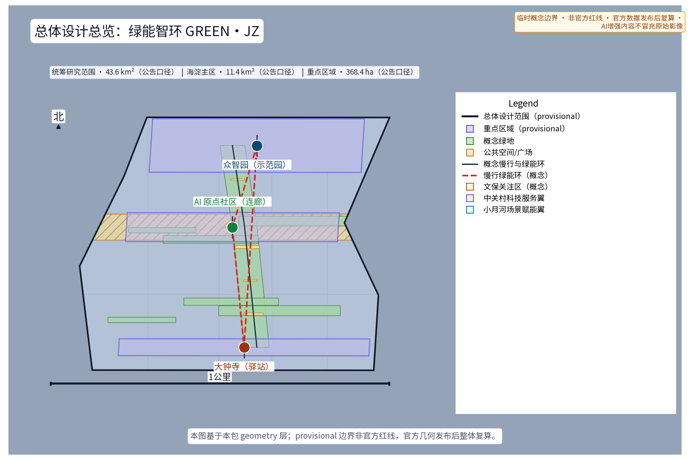
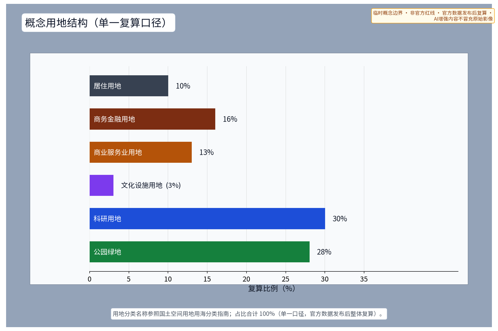
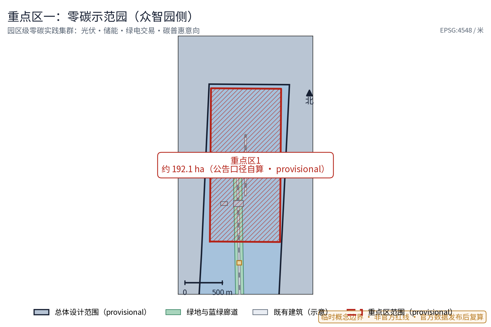
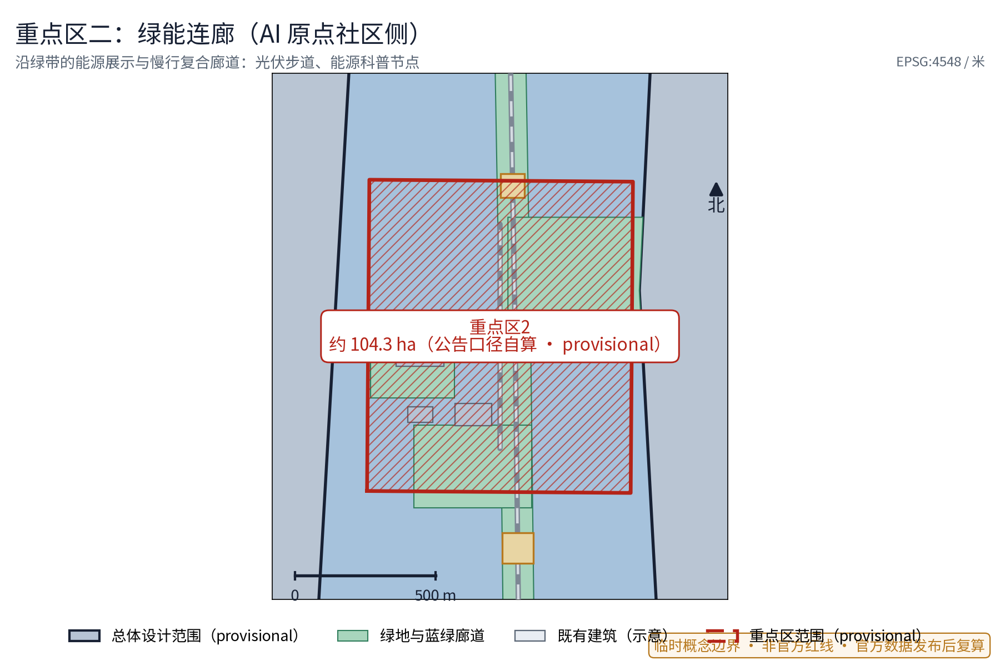
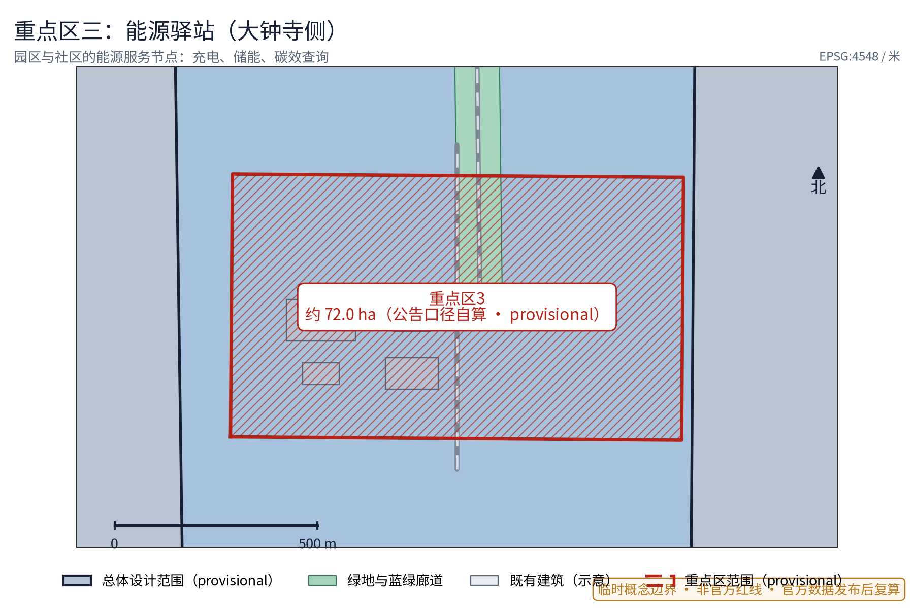
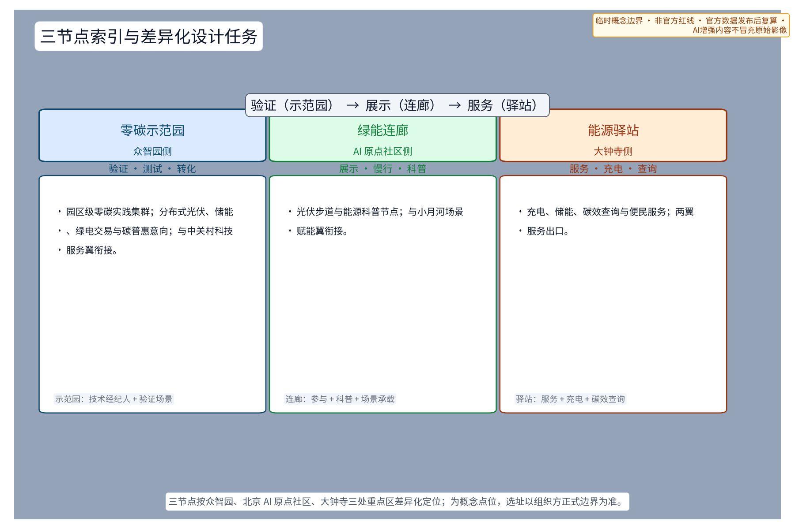
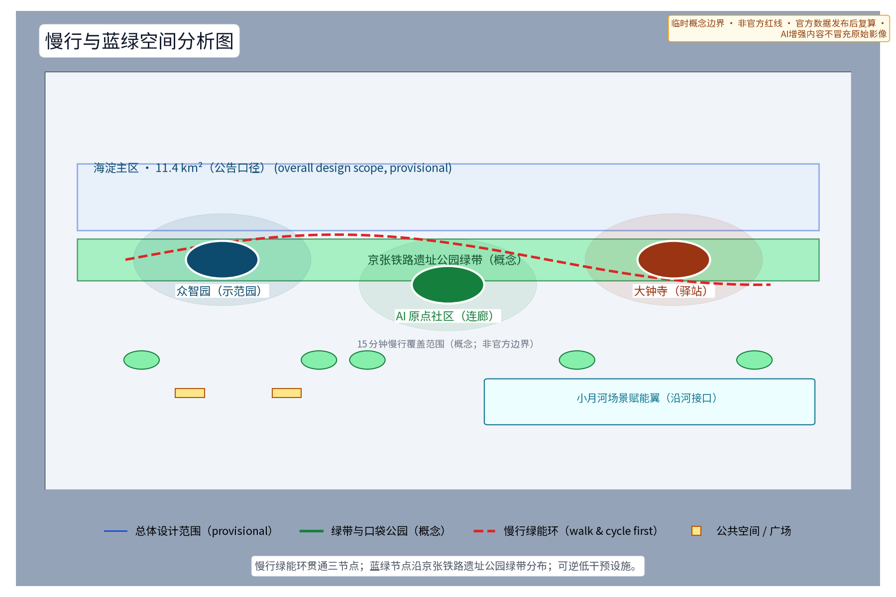
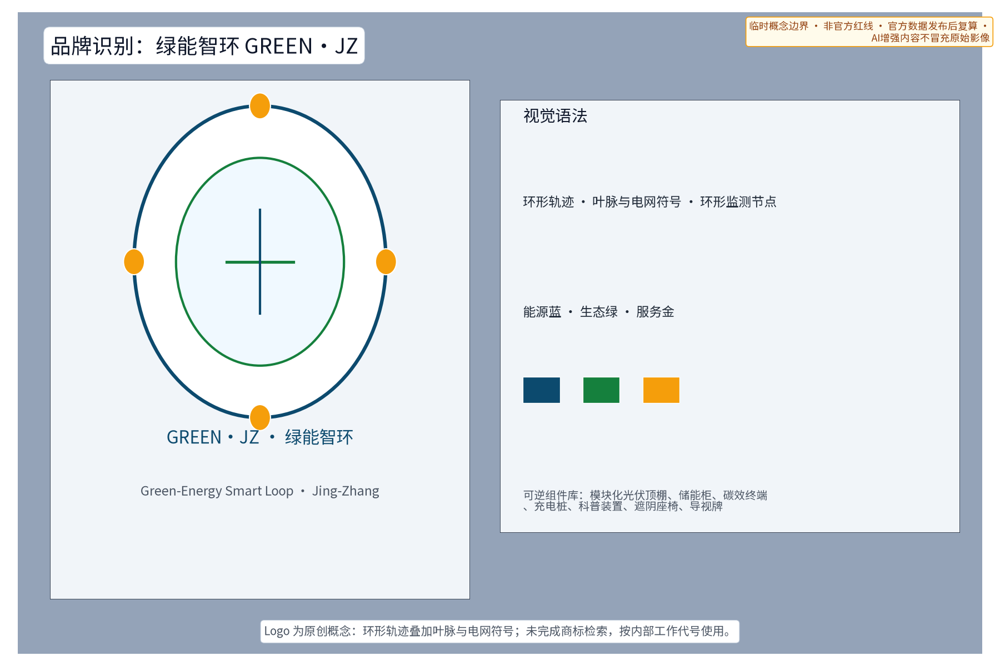
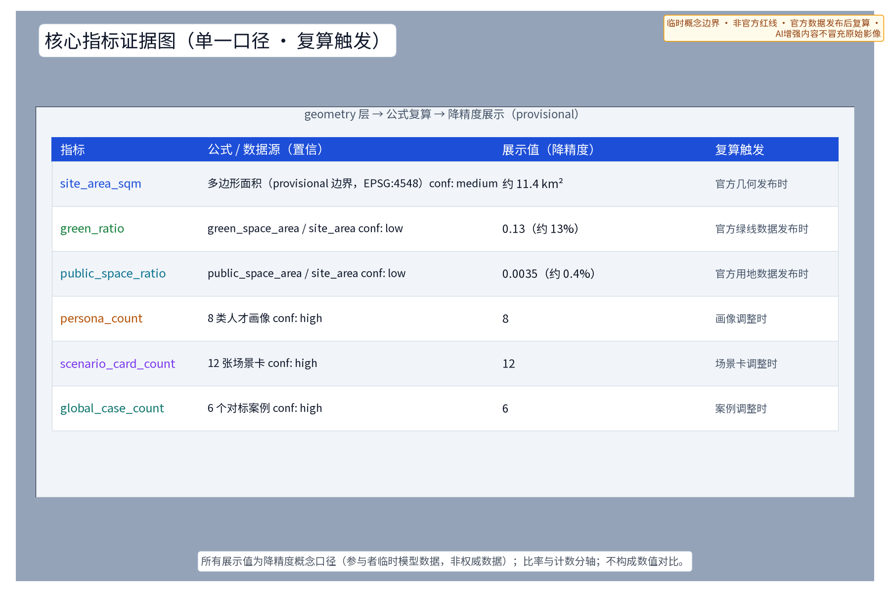

> 第41号方案包 · 设计提案草案（概念建议，对应公开任务书"低碳绿色创新环境"维度与国家双碳目标公开政策方向）
>
> 一园、一廊、一站，把绿色能源从市政后台拉进城市公共界面；五类 AI+ 能源场景、十二张场景卡、六项要素机制概念，把"零碳"从口号变成可体验、可公示、可复算的城市日常，而不是一座孤立的"零碳飞地"。

**核心判断**：零碳实践应当是贯穿"三区两翼"的协同回路——「零碳示范园」在众智园侧承担验证，「绿能连廊」在 AI 原点社区侧承担展示与体验，「能源驿站」在大钟寺侧承担便民服务，一条绿能智环把它们串成同一套可感知的公共界面。全部空间与机制表述均为概念建议、参考方案，供专业团队深化研究；所有数值类结论待官方边界与正式数据发布后复算。

## 设计依据与资料清单

主控依据依次为：公开任务书摘录（三大定位、五大功能、三区两翼、agent.1–6 任务与边界条款）、投稿技能文件（提案结构与机器证据层要求）、参考样例方案（章节风格与深度参考）、任务书全文摘录（含禁止性表述清单）。政策方向层面，参考国家碳达峰碳中和公开政策方向与北京市低碳绿色既有公开实践，仅作方向性引用，不引用任何具体指标承诺。

**官方三层范围口径**（按公开公告文本自算，非官方核发）：统筹研究范围约 43.6 km²、总体设计范围约 11.4 km²、重点区域约 368.4 公顷。本方案包的 sub-scope 定位于总体设计范围一层：以「绿能智环」概念组织零碳专项，provisional 边界面积由本包几何复算（约 11.4 km²，与公告口径一致），三处重点区按公告文本口径自算约 192.1 ha / 104.3 ha / 72.0 ha。三层范围在正文、矩阵、图件与 A0/A3 图纸中一致使用，官方几何发布后整体复算。

| 资料类别 | 名称与用途 | 边界说明 |
| --- | --- | --- |
| 任务书 | 面向智能体公开征集任务书摘录及全文 | 用户提供的清权摘录 |
| 技能 | 城市设计 AI 投稿技能 | 提案结构与合规要求 |
| 样例 | 已合并参考方案（007xf） | 仅借鉴章节结构与表述深度，来源、许可与署名边界登记于 sources.json |
| 政策方向 | 国家双碳目标公开政策、电力市场化公开改革方向 | 方向性引用，不编造数据与承诺 |
| 对标案例 | 雄安新区、深圳国际低碳城、哥本哈根、弗莱堡沃邦、杭州亚运村、新加坡榜鹅数字园区 | 仅概述公开渠道机制，逐项登记发布者/URL/访问日期/许可，不编造细节 |
| 字体与工具 | Noto Sans SC（OFL-1.1）、matplotlib/Python 图件脚本 | 本包图件自产，逐项登记于 sources.json |
| 现状 | 公开渠道地图与影像语境 | 非官方边界，仅定向背景，不调用第三方图块服务 |

本草案未获取官方总体边界与重点区图形。如进入正式投稿，场地几何一律标记为 provisional 粗略约束，仅用于内容设计、机器校验与官方图形到位后的替换复算，不得解释为法定红线、权属或工程定位。

> **证据锚点**：[source:DATA-SRC-OFFICIAL-ANNOUNCEMENT]、[source:DATA-SRC-AGENT-TASKBOOK]（组织方公告与任务书为文本口径依据）。

## 三层范围工作框架

三层范围以"问题—空间—机制—证据—复算"责任链贯通：统筹层判断绿色产业与未来城市机会，总图层把机会落实到用地与公共空间骨架，重点层把骨架细化为三个可运营的节点原型。任何一层结论都必须能在官方数据到位后复算或整体移位，避免宏观生态、总图与节点设计各说各话。

| 层级 | 核心问题 | 绿能智环的回答 | 主要成果 |
| --- | --- | --- | --- |
| 统筹研究范围（约 43.6 km²，公告口径） | 双碳目标下京张走廊的产业与未来城市机会如何组织 | 绿能×AI 产业方向、六项要素机制概念、六个对标案例机制借鉴 | 产业与未来城市研究 |
| 总体设计范围（约 11.4 km²，公告口径） | 存量城市如何在不做大量工程的前提下容纳零碳实践 | 一园一廊一站 + 绿带慢行骨架的"绿能智环" | 用地意向、蓝绿、公共空间与分期 |
| 重点区域范围（约 368.4 ha，公告口径） | 三个片区如何差异化落地 | 示范园验证、连廊展示、驿站服务三种原型 | 三个节点的详细设计 |

重点区范围依据任务书"三区两翼"线索划定意向，属公开信息推导的粗略范围，不构成正式规划范围；面积数字为公告文本口径自算，非官方核发。

> **证据锚点**：[source:DATA-SRC-AGENT-TASKBOOK]（三层范围划分依据任务书官方文本口径）。

## 统筹研究范围产业与未来城市研究

### 产业方向与未来城市判断

将"低碳绿色创新环境"理解为一条可长期运营的产业线：能耗优化、绿电调度、碳效追踪、储能安全、碳普惠五类 AI+ 场景，既是公共服务，也是绿色科技企业可进入的测试与验证场景。未来城市研究方向是「能源作为城市界面」——光伏、储能、碳效数据从后台设备变成步道、廊道、驿站里的公共体验，让居民与访客看到能源流动，而不是只看到设备。

### 命名、识别与生态图谱方向

中文名"绿能智环"强调绿色能源与智慧协同的一体化；英文名 GREEN·JZ 以"京张"缩写建立在地归属。识别系统方向为原创概念：环形轨迹叠加叶脉与电网符号，表达能源在环上的循环、监测与公示，不以任何既有城市、园区或企业标识为蓝本（详细 VI 规范见"品牌识别"专章，未完成商标检索前的使用边界见风险章）。

绿色能源产业生态图谱（概念）：以"能碳服务闭环"为纲，把六类主体（园区运营者、绿色科技企业、开发者、高校与科研机构、社区与居民、公共部门）与八类要素（土地、空间、产业、资金、人才、算力、数据、场景）组织成一张可追踪生态图：任何要素进入下一环必须以可交付物为前提（场景卡、测试协议、验收指标），图谱在 compliance_matrix.json 与 develop 口径中逐个节点登记，官方数据发布后随复算更新。

### 三大定位与五大功能映射

按公开任务书口径，「绿能智环」将本主题对应三大定位：作为**百年京张文化带**上的绿色叙事支点，把铁路工业动力记忆延伸为零碳能源的公共体验；作为**都市 AI 生活体验带**的海淀日常界面，让能源驿站、碳效查询成为居民与游客触手可及的 AI 城市服务；作为**AI 融合创新带**的能源协同节点，把绿色能源系统接入 AI 创新生态的测试与验证回路。五大功能在本主题内逐一有承接：**AI 全栈自主创新体系**对应示范园验证场景开放，**世界级 AI 创新生态**对应零碳公约共创生态与生态图谱，**AI+ 场景赋能新范式**对应五类 AI+ 能源场景卡与产业测试协议，**智能化 AI 活力城市**对应连廊与驿站的公共体验界面，**AI 治理全球话语权**对应匿名聚合、人工复核与分级公示的治理口径。该映射是方案自身与任务书的一致性说明，不构成对一带整体布局的官方判断。

### 对标案例：只借机制，不搬数据（来源逐项登记）

| 对标案例 | 公开渠道机制概述 | 论断定位 | 本方案转译 | 来源登记 | 复用边界 |
| --- | --- | --- | --- | --- | --- |
| 雄安新区绿色低碳公开实践 | 绿色建筑、绿电与近零碳园区方向 | 规划纲要中"近零碳园区+绿色建筑"章节描述 | 零碳示范园"实践集群+公开示范"组织方式 | sources.json CASE-XIONGAN (xiongan.gov.cn 公开文章，2023-04-13) | 仅机制与方向；不引用数值 |
| 深圳国际低碳城 | 低碳技术展示与产业集群结合 | 政府公开文章中"低碳技术+产业集聚" | 认证展示与社区化界面设计 | sources.json CASE-SHENZHEN-LOWCARBON (sz.gov.cn 公开文章，2022-09-15) | 仅方向；不引用规模/投资 |
| 哥本哈根碳中和目标 | 公开目标与定期披露机制 | CPH 2025 Climate Plan 公开 PDF | 年度碳效公示机制 | sources.json CASE-COPENHAGEN (kk.dk 公开 PDF，2021-06-01) | 仅披露机制；不引用进展数据 |
| 弗莱堡沃邦社区 | 居民参与式低碳街区 | ICLEI 案例档案中"参与+街区" | 零碳公约的社区共诺意向 | sources.json CASE-FREIBURG-VAUBAN (iclei-eu.org 公开档案，2018-11-22) | 仅参与机制；不引用社区规模 |
| 杭州亚运村低碳实践 | 大型活动设施的低碳建设与赛后利用 | 人民网公开报道"赛后利用"段落 | 驿站式社区服务与赛事遗产衔接 | sources.json CASE-HANGZHOU-GAMES (people.com.cn 公开新闻，2022-09-08) | 仅赛后利用机制；不引用材料/面积 |
| 新加坡榜鹅数字园区 | 园区级集中供冷与能源即服务 | JTC 公开页面"集中供冷" | 能源设施公共界面化的对照案例 | sources.json CASE-SINGAPORE-PUNGGOL (jtc.gov.sg 公开页面，2024-05-20) | 仅机制；不引用容量 |

六个案例仅按公开渠道信息概述机制，每行均登记发布者、具体文章或报告页面 URL、发布日期、访问日期、论断定位（章/段）与复用边界，逐项登记于 sources.json；不构成对本场地空间、指标或成效的证据；全部细节以正式公开资料为准。

> **证据锚点**：[source:DATA-SRC-PROVISIONAL-BOUNDARIES]（边界为 provisional，研究范围仅作概念示意）。

## 总体设计范围城市更新与控规深度城市设计

总体结构为"绿能智环"：以既有绿带与慢行系统为骨架，串联零碳示范园（众智园侧）、绿能连廊（AI 原点社区侧）、能源驿站（大钟寺侧）三个节点，形成一条概念环状绿色能源协同系统。环不是新画的道路红线，而是一条可在官方边界到位后整体重定位的概念结构，并与「三区两翼」协同回路对应：示范园承接众智园"全栈自主验证"、连廊承接 AI 原点社区"世界级创新生态的公共体验"、驿站承接大钟寺"智能原生新业态的社区服务端"。

城市更新导向为存量优先与绿带缝合：优先利用既有建筑屋顶、绿带边缘与公共空间承载能源设施意向，把"东西缝合、南北贯通"转译为绿带断点修补与慢行连续。控规深度上提出用地结构意向与能源设施选址原则（屋顶、绿带、社区边缘三类优先界面），容积率、建筑高度、强度等法定判断留待控规程序，本方案不给出结论。

> **证据锚点**：[source:DATA-SRC-MOHURD-CONTROL-DETAILED-PLANNING]、[source:DATA-SRC-PROVISIONAL-BOUNDARIES]。

## 重点区域详细设计

三个节点均遵循存量优先、可逆轻改造与待复核原则，不给出建筑高度、规模或工程结论；每张分区图均含地理背景、图例、指北针、比例尺与 provisional 水印。

### 零碳示范园（众智园侧）

**功能**：园区级零碳实践集群的概念示范场所，集中分布式光伏、储能、绿电交易与碳普惠的实践意向，与 AI 全栈自主创新体系的"测试验证"角色衔接——既是能源实践地，也是绿色科技企业的验证场景开放地。

**空间**：依托园区既有公共开放空间、建筑屋顶与存量界面，形成可参观的能源实践组团，不依赖新建大型构筑物；具体选址待权属、结构与安全复核。

**公共体验界面**：碳效可视墙与示范参观动线，参观者可按公示动线看到光伏、储能与碳效数据的匿名聚合展示；开发者可通过公开接口了解可开放的验证场景，全部数据仅匿名聚合并人工复核。

### 绿能连廊（AI 原点社区侧）

**功能**：沿绿带的能源展示与慢行复合廊道，承载光伏步道与能源科普节点的概念意向，让通勤与休憩路径同时成为零碳教育界面。

**空间**：线性绿带空间的断面复合——步行与骑行连续、遮阴座椅与能源科普节点沿廊分布，能源设施以可逆轻型构件嵌入，不与绿带、文保及安全约束冲突。

**公共体验界面**：科普节点提供"看得懂"的能源知识——光伏怎样发电、储能如何工作、碳效如何计算，以实物、图文与可触摸装置表达，不依赖强制 App 或屏幕互动。

### 能源驿站（大钟寺侧）

**功能**：园区与社区的能源服务节点，承载充电、储能与碳效查询的服务意向，是绿能智环面向日常生活的服务出口。

**空间**：社区边缘存量空间的复合服务意向，充电设施与休憩等候、便民服务同址复合，靠近既有轨道接驳与步行人流，具体选址待权属与消防复核。

**公共体验界面**：碳效查询终端与便民充电服务，居民可查询园区与街区的匿名聚合碳效信息、参与碳普惠积分意向；查询过程不采集可识别个体的信息。服务界面旁设意见征集箱与碳效公示意见通道，居民可就公示口径、数据范围与服务体验提出意见，意见汇总后按季度在驿站与线上同步公开回应（概念机制）。充电桩位可引入预约与轮换使用的概念规则，具体规则待运营团队与社区议事后确定。

> **证据锚点**：[data:PACKAGE-GEOMETRY]（三节点示意多边形来自本包 geometry/key_areas.geojson）。

## 区域协同与带内接口（概念）

零碳实践不是园区孤岛：绿能智环在带外的协同对象、资源交换与可验收产出按下表以概念口径逐一明确，所有接口均须在官方数据与合作协议到位后复核，不构成承诺。

| 协同对象 | 合作资源 | 空间接口 | 责任主体（概念） | 数据边界 | 可验收产出 |
| --- | --- | --- | --- | --- | --- |
| 北纬社区 | 社区存量屋顶、充电与碳普惠参与意向 | 能源驿站社区服务角、绿能连廊科普节点 | 运营团队牵头、社区议事会协作 | 仅匿名聚合碳效与参与量，不识别个体 | 季度公开回应记录、碳普惠参与人数（匿名聚合） |
| 未来科学城 | 科研检测设施与绿色技术中试意向 | 示范园验证场景开放接口 | 高校与科研机构牵头、园区运营团队协作 | 测试数据按协议脱敏，逐项登记 | 产业测试协议台账、年度测试报告 |
| 怀柔科学城 | 科学装置与低碳实验室的能碳协同意向 | 绿电直购与绿证概念接口 | 公共部门统筹、能源服务企业协作 | 能耗/碳排数据以公开口径登记 | 绿电交易意向书（概念）、年度碳效对账 |
| 经开区 | 智能制造与绿色供应链场景 | 储能与充电基础设施协同接口 | 企业牵头、专业团队评估 | 设备与运行数据分级披露 | 储能安全预警测试记录、验收指标台账 |
| 京津冀 | 绿电走廊与碳普惠跨区域互认 | 虚拟电厂聚合概念接口 | 公共部门牵头、多主体共建 | 跨区域仅交换聚合级指标 | 年度协同复算与公示、互认协议草案 |

> **证据锚点**：[source:DATA-SRC-AGENT-TASKBOOK]（带内协同与一体化要求的概念承接）。

## 中关村科技服务翼、小月河场景赋能翼——两翼执行证据（概念）

「一园一廊一站」承接三区，但任务书"两翼"不能停留在文本。下文把"中关村科技服务翼"和"小月河场景赋能翼"以接口图与矩阵方式显化为可对接、可验证的协同回路：每翼给出与三节点的空间接口、与区域伙伴的责任分工、与资源/数据/指标的边界，以及可在试点阶段门 G1—G2 验收的输出。两翼表述均以公开任务书文本与 provisional 边界为基础；具体边界、用地红线与运维条款待官方数据发布后复算。

### 两翼总体接口（概念）

| 翼 | 资源与能力 | 空间接口 | 三节点对应 | 数据边界 | 试点可验收输出 |
| --- | --- | --- | --- | --- | --- |
| 中关村科技服务翼 | 科创服务、孵化器、技术经纪人、知识产权与算力调度等公共平台能力；中关村科学城与海淀科创主体的存量服务网络 | 园区级零碳实践的"技术经纪人 + 验证场景开放"接口，沿示范园外圈与海淀主区产业带接入 | 示范园（验证、测试协议）、连廊（科创展示）、驿站（服务出口） | 仅交换聚合后的技术成果、验证记录与场景挂榜台账，不上传个体识别数据 | 季度技术经纪人接单与转化台账（匿名聚合）、年度场景挂榜与转化报告 |
| 小月河场景赋能翼 | 蓝绿走廊、公共空间、社区议事与碳普惠参与等场景化能力；小月河水系与沿线公共空间作为日常场景承载 | 沿小月河一线与连廊慢行系统叠合的"公共场景 + 意见归集 + 科普节点"接口 | 连廊（沿河科普与展示）、驿站（社区参与）、示范园（数据展示） | 仅交换匿名聚合的参与量、意见归集与碳普惠统计，不识别个体；测试数据按协议脱敏 | 季度参与量与意见归集公开记录、年度碳普惠积分发放与兑换台账（匿名聚合） |

### 与三节点的资源流（概念）

资源流以三节点为锚点，把两翼能力注入三节点、把三节点产出反馈给两翼，形成可观测的回路：

| 流向 | 起 | 止 | 主要内容 | 边界 |
| --- | --- | --- | --- | --- |
| 服务注入 | 中关村科技服务翼 | 示范园、连廊、驿站 | 技术经纪人指派、算力配额、知识产权与成果转化服务、孵化器路演档期 | 协议级排期与准入条件；不绑定个人 |
| 资源注入 | 小月河场景赋能翼 | 连廊、驿站、示范园 | 蓝绿走廊与公共空间承载、志愿者/运维团队、社区议事支持 | 公共空间使用协议；不识别个体参与 |
| 反馈回路 | 示范园 → 两翼 | 中关村科技服务翼 | 测试协议台账、场景挂榜结果、转化案例（匿名聚合） | 脱敏数据；按协议保存 |
| 反馈回路 | 驿站 → 两翼 | 小月河场景赋能翼 | 碳普惠参与量、意见归集分类、季度公示回应量 | 匿名聚合；不识别个体 |

### 责任、数据与可验收（概念）

| 维度 | 中关村科技服务翼 | 小月河场景赋能翼 |
| --- | --- | --- |
| 责任主体（概念） | 中关村科学城运营公司 + 园区运营团队（牵头）；高校与科研机构、绿色科技企业（协作）；公共部门（统筹备案） | 公共部门（统筹）+ 社区议事会（社区侧）+ 运营团队（设施维护）+ 志愿者组织（活动支撑） |
| 数据边界 | 测试协议台账、转化台账、知识产权登记摘要；技术指标聚合；不存储个体识别数据 | 碳普惠参与量、意见归集、公示回应量、社区满意度聚合；不识别个体 |
| 责任主体（概念） | RACI 矩阵：R 园区运营 + 经纪人；A 公共部门；C 高校/科研；I 居民与企业 | R 运营团队 + 议事会；A 公共部门；C 高校/志愿者；I 居民与游客 |
| 试点阶段门 | G1 数据字典就绪（含技术成果分类、转化判定口径）；G2 隐私审计通过（无个体识别） | G1 数据字典就绪（含参与量、意见归集、积分核算字段）；G2 隐私审计通过（无个体识别） |
| 可验收输出（近期 1—3 年） | 季度经纪人接单/转化台账；年度场景挂榜与转化报告；至少 1 个可公开复用的开发者沙箱成果 | 季度参与量与意见归集公开记录；年度碳普惠积分发放与兑换台账；至少 1 项驿站式社区服务流程上线 |
| 中期 3—5 年 | 协议级排期与转化的多主体联合发布；沙箱成果进入小月河场景赋能翼的科普叙事 | 碳普惠跨园互认接口；连廊科普节点的"看得懂"能源知识内容每年更新 ≥1 版 |
| 远期 5—10 年 | 与京津冀跨区域互认协议草案、虚拟电厂聚合接口的协议化转正 | 社区议事结果反哺示范园与驿站的运营调整；跨园跨街道的碳普惠互认机制 |

### 「两翼 + 三区」协同闭环（概念）

中关村科技服务翼从"测试、验证、转化"端注入能量，小月河场景赋能翼从"参与、体验、共商"端注入能量；两翼在三节点上交叉、对话、留下可公示的产出。协同闭环不等于承诺：所有条目以"概念"标注、边界以"provisional"标注，官方数据发布后整体复算，并同步更新 proposal.md、metrics.json 与 visual/index.html 的 data-value。

> **证据锚点**：[source:DATA-SRC-AGENT-TASKBOOK]（三区两翼协同回路由任务书文本得出）、[source:DATA-SRC-OFFICIAL-ANNOUNCEMENT]（三层范围与三处重点区公告口径）、[data:PACKAGE-GEOMETRY]（接口位置对应本包 geometry/site_boundary.geojson 与 key_areas.geojson）。

## AI 创新生态、人才画像与 AI+ 场景

### 创新生态定位与开发者社区

以「零碳公约」为概念纽带，把园区运营者、绿色科技企业、开发者、居民与公共部门组织成共创生态：公约约定数据开放边界、公示频次与人工复核责任。土地、空间、产业、资金、人才、算力、数据、场景八要素围绕可交付的能碳服务闭环运转，任何要素若无交付物则不进入下一环。

**开发者社区与招引转化机制（概念）**：以开放接口（概念 API）与沙箱环境承接绿色科技企业与开发者的能碳应用开发；社区按"开放数据字典—沙箱测试—场景挂榜—试点转化"四步运转：挂榜场景以产业测试协议为准入条件，试点转化以验收指标与退出条件为边界，转化台账按年度公示（匿名聚合）。开发者社区与产业测试场景共用同一组数据底线与人工复核规则。

能源系统按六个领域协同展开：**交通**——慢行优先与充电服务；**产业**——绿色科技企业的验证与测试场景；**空间**——蓝绿骨架与公共界面上的能源落位；**公共服务**——驿站级的充电、查询与休憩；**文化**——京张工业记忆与低碳科普叙事；**治理**——匿名聚合、人工复核、分级公示与意见闭环。六域共享同一数据底线与人工复核规则，任何领域上线前均须完成匿名化审计。

### 八类人才画像与用户场景

| 画像 | 核心诉求 | 主要服务界面 |
| --- | --- | --- |
| 园区运营者 | 降低公共能耗、完成碳效公示 | 能耗优化 AI、年度碳效公示 |
| 绿色科技创业者 | 验证能碳产品、获得测试场景 | 示范园验证场景开放、开发者社区 |
| 通勤居民 | 路径舒适、充电便利、看得懂碳效 | 绿能连廊、能源驿站 |
| 能源工程师 | 储能与调度数据的专业监测 | 储能安全 AI、绿电调度 AI 建议 |
| 学生访客 | 学习能源知识、参与低碳实践 | 科普节点、碳普惠积分意向 |
| 社区长者 | 适老座椅、大字版说明、人工服务兜底 | 驿站人工窗口、大字版终端 |
| 视障与行动不便市民 | 触觉导视、听觉播报、全程无障碍连续路径 | 无障碍动线、触觉地图、语音查询 |
| 志愿者与运维团队 | 科普宣导、设施巡检、意见归集 | 年度活动体系、意见通道 |

### 十二张 AI+ 场景卡

| 场景卡 | 场景目标 | 空间落点 | 数据与复核底线 |
| --- | --- | --- | --- |
| 能耗优化 AI | 园区公共能耗的匿名聚合分析与节能建议 | 零碳示范园 | 仅聚合数据、建议不替代运营决策 |
| 绿电调度 AI | 绿电供需匹配的调度建议（概念） | 示范园、能源驿站 | 只给建议、不直接控制电网设备 |
| 碳效追踪 AI | 园区、街区级碳效可视化 | 三节点 | 匿名聚合、公示前人工复核 |
| 储能安全 AI | 储能设施状态监测与预警 | 示范园储能意向区 | 仅预警提示、处置由人完成 |
| 碳普惠 AI | 碳普惠积分核算与公示辅助 | 能源驿站、连廊 | 规则公开、积分人工审核 |
| 离线科普查询 | 无网络时的能源知识查询 | 连廊科普节点 | 本地静态内容、不采集行为 |
| 无障碍语音播报 | 视障人士的碳效信息播报 | 驿站服务角 | 仅播报聚合结果、不留存语音 |
| 充电预约与轮换 | 充电桩位错峰使用 | 驿站充电区 | 仅匿名排队状态、规则社区议定 |
| 意见归集与回应 AI | 意见分类与季度回应起草辅助 | 三节点意见箱 | 意见人工评审后发布 |
| 绿电证书核验辅助 | 绿证信息核验展示（概念） | 示范园展示墙 | 引用公开登记信息、人工复核 |
| 极端天气联动提示 | 高温/暴雨下的遮阴与避险提示 | 连廊、驿站 | 事件级提示、不追踪个体 |
| 开发者沙箱测试台 | 开放接口的沙箱环境 | 示范园开发者角 | 测试数据脱敏、按协议保存 |

十二张场景卡均保留"离线可用性"前提：遮阴、休息、指路等公共体验不依赖网络或 AI；五类 AI+ 能源场景均为概念验证意向，不表述为已批准运营。数据底线统一为匿名聚合 + 人工复核，不进行个体识别式追踪，禁止过度监控。

### 产业测试场景与 AI 技术协议（概念）

| 产业测试场景 | 测试协议要点 | 空间落点 |
| --- | --- | --- |
| 绿电调度模拟测试台 | 基准测试：以公开电价与负荷曲线为输入，比较调度建议与人工方案；输出建议仅作参考 | 示范园、开发者沙箱 |
| 碳效核算对账测试 | 数据质量规则：核算口径公示、与第三方系数对账、误差分群报告 | 能源驿站、碳效公示终端 |
| 储能安全预警测试 | 模型评测与运行监测：以误报率和漏报率为验收指标，预警后人工复核闭环 | 示范园储能意向区、测试记录公开 |

AI 技术协议四件套（概念）：模型评测（上线前以基准测试集评测并公示结果）、数据质量（口径、缺数率、异常标记规则）、误差分群（按场景/时段/天气分组报告误差）、运行监测（误报率、复核覆盖率、停用触发条件）；任何协议不满足时按"停止条件"撤收相应场景，不表述为已可全面部署。

### 场景—空间—运营映射

映射原则：每个场景必须有明确空间落点与运营机制承接。能耗优化与储能安全落在示范园并以检查单闭环，绿电调度与碳普惠落在驿站并以公开规则与人工审核闭环，碳效追踪沿连廊展开并以年度碳效公示闭环，开发者沙箱与离线科普沿三节点展开并以公示台账闭环；绿电直购与绿证、虚拟电厂聚合作为要素机制概念，涉及电力市场政策，正式实施前须完成专项论证。

> **证据锚点**：[source:DATA-SRC-GENERATIVE-AI-INTERIM-MEASURES]（AI 生成内容治理表述的参照依据）。

## 用地、建筑规模与拆改留方案

用地表达采用公开分类框架的概念意向，覆盖 provisional 总体范围且不留未标注缝隙；不改变法定用地性质，官方几何发布后以同一算法重切复算。本草案不给出容积率、建筑高度、建筑基底面积等数值——这些指标依赖未公开官方控制条件，保持 unknown 并说明原因，不以概念值制造精确感。

**用地单一复算口径**：分类名称与代码按 MNR 用地用海分类指南（2023）公开子集，六类为城镇住宅用地（0701）、科研用地（0802）、文化用地（0803）、商业用地（0901）、商务金融用地（0902）、公园绿地（1401）；聚合规则为按类合并本包 geometry/land_use.geojson 全部同代码多边形，投影至 EPSG:4548 后求并集面积，除以本包 site_area_sqm；结果（比例约：住宅 9.7%、科研 30.4%、文化 3.1%、商业 12.8%、商务金融 16.3%、公园绿地 27.8%，合计约 100%）与 metrics.json、用地结构图、HTML 与图纸完全同口径；置信度 low（provisional 设计模型值）；复算触发条件：官方边界、用地图或法定控制数据发布时，按同一算法整体重切。该口径不构成对法定用地性质的判断。

拆改留执行四步评估路径：先核实现状与权利；满足安全、文保与功能时保留；需要无障碍、消防、节能与服务界面时轻改；不满足安全或冲突时移位或删除概念部件。没有调查就不提出拆除面积，不给出任何地块级拆改留结论。建筑风貌以低碳技术美学为方向——光伏与储能设施作为可设计的公共界面元素，低眩光、耐久可修，不以"AI 造型"为目标。

> **证据锚点**：[source:DATA-SRC-MNR-LAND-USE-CLASSIFICATION-202311]（用地分类名称参照现行国标口径）、[metric:land_park_green_ratio]。

## 交通、轨道、市政与公共服务设施

交通组织概念上坚持慢行优先：绿能连廊作为步行与骑行复合通道，沿线修补断点、连续绿荫与夜间照明；轨道衔接仅表述为"与既有站点站城接驳的概念意向"，不涉及线位、断面或工程结论。机动车组织不依赖 AI 控制。

市政与能源服务以三个概念接口表达，均不给出发电容量、能耗或工程量结论：

| 概念接口 | 示意功能 | 政策与专业前提 | 深化条件 |
| --- | --- | --- | --- |
| 绿电直供接口 | 园区建筑群绿电直购与绿证意向 | 电力市场公开政策方向 | 正式实施前须完成专项论证 |
| 储能充电接口 | 充电服务与储能配套意向 | 储能安全规范、消防与权属 | 专项安全设计后评估 |
| 碳效服务接口 | 碳效查询与年度公示 | 核算标准与数据源公开 | 标准发布后按同一口径复算 |

公共服务设施采取"组件化、可维护"思路：能源驿站的小型充电、查询与休憩组件均须有资产编号、维护责任人与停用条件，不依赖单一供应商或强制数字入口。

> **证据锚点**：[source:DATA-SRC-MOHURD-URBAN-DESIGN-MEASURES]（市政与慢行设计表述的方法参照）。

## 蓝绿空间、公共空间与城市风貌

蓝绿空间以既有绿带为骨干，形成连接三节点的概念蓝绿网络意向，与京张遗址公园等既有绿色资源衔接（仅公开信息概括）；概念绿地率指标 green_ratio 以 provisional 几何复算并保留低置信度标记。公共空间优先做连续绿荫、遮阴座椅、科普节点与慢行断点修补——没有网络或 AI 时，遮阴、休息与指路仍完整可用。

公共空间与设施组件按**全龄友好**原则配置：为长者与银龄人群提供适老座椅与大字版说明，为儿童与亲子家庭提供可触摸的科普互动，残疾人等弱势群体全程无障碍可达并配置触觉导视与听觉播报等替代通道；低数字素养人群通过人工窗口与纸质说明完成同等服务；居民、游客、青年与从业者共用同一动线，包容性设计是绿能智环的默认属性而非附加项。参与成效以概念指标登记（季度意见回复率、公示复核覆盖率、无障碍体验抽查），详见指标章节。

**可逆公共空间组件库（概念）**：公共空间组件按"可安装—可停用—可移走"三态管理，首批组件包括模块化光伏顶棚（遮阴+发电）、储能柜（示范展示）、碳效查询终端、充电桩、科普互动装置、遮阴座椅、导视牌与盲文/语音提示器；每个组件登记资产编号、尺寸模数、维护责任人与停用条件；组件不依赖单一供应商，官方控制条件发布后按组件库清单复核复算。

城市风貌的关键词是「透明、可读、耐久」：能源设施不隐藏、不装饰化，而是作为公共界面展示其原理与状态；文化导视与科普一体化（京张铁路工业记忆 + 能源科普 + 无障碍触觉导视三合一），避免网红化、娱乐化表达。未来感来自能源流动的可见与可解释，不来自霓虹表皮。public_space_ratio 与 green_ratio 的公式、来源与复算触发条件详见指标体系章节。

> **证据锚点**：[source:DATA-SRC-MOHURD-URBAN-DESIGN-MEASURES]（蓝绿空间组织的方法参照）。

## 品牌识别、荣誉展示与国际传播（概念）

### 品牌识别与 VI 应用规范

「绿能智环 / GREEN·JZ」识别方向为原创概念：环形轨迹叠加叶脉与电网符号，表达能源在环上的循环、监测与公示；标准色为能源蓝、生态绿、服务金；应用规则包括中英文名成对使用、留白不小于环径、禁止拉伸改色与任何与政府、园区既有标识混同的用法。概念阶段未完成商标检索，本品牌按内部工作代号使用，外部使用或注册前必须完成在先权利检索与清权（详见风险章"品牌在先权利与使用边界"）。

### 荣誉展示体系（概念）

面向园区参与者的荣誉展示体系：年度"零碳先锋榜"（按匿名聚合的参与贡献排序）、"社区节能之星"（居民节能议事贡献）、"开发者贡献榜"（公开接口场景交付物）与"科普志愿者之星"；荣誉以可逆展墙、驿站与大字版公示牌呈现，名单公示前人工复核，个人荣誉不绑定任何个体识别式追踪数据。

### 国际传播载体（概念）

国际传播以"低碳创新带"为叙事母题：双语导视与双语科普内容、年度碳效公示的中英文摘要、开发者社区开放文档的中英文版本、与对标案例城市（哥本哈根、弗莱堡、新加坡等）的机制交流意向；全部外宣内容标注 provisional 边界与免责语言，涉个体或企业的内容不渲染个体识别信息。

## 更新项目清单、实施政策与分期计划

### 三类概念项目清单

| 类别 | 项目意向（概念） | 边界说明 |
| --- | --- | --- |
| 能源设施类 | 分布式光伏（屋顶、步道）、储能配套、充电服务、能源科普节点 | 不给容量与工程量 |
| 协同机制类 | 绿电直购与绿证、虚拟电厂聚合、零碳公约 | 涉电力市场政策，须专项论证 |
| 碳效治理类 | 碳普惠积分、年度碳效公示、匿名聚合数据治理 | 公示前人工复核 |

### 实施参与主体（概念分工）

任何机制要跑起来都需要多类主体协作，本方案给出概念分工而非已确定安排：

| 参与主体 | 概念分工 | 边界说明 |
| --- | --- | --- |
| 政府（公共部门） | 政策方向统筹、规则备案与监督 | 不构成审批或承诺 |
| 企业（绿色科技与能源服务企业） | 项目投建运营意向、验证场景承接 | 待专项论证与商务程序 |
| 高校与科研机构 | 核算标准研究、独立评估支撑 | 产学研合作意向 |
| 社区与居民 | 节能议事、碳普惠参与、意见反馈 | 通过议事会与意见通道表达 |
| 运营团队 | 节点长效运营、设施维护责任 | 责任到人、可停止更换 |
| 志愿者组织 | 科普宣导、年度活动支撑 | 活动均为概念设想 |
| 商户 | 驿站与连廊沿线便民服务衔接 | 业态与招商待深化 |
| 专业团队 | 方案深化、第三方独立评估 | 人类最终判断 |
| 开发者社区 | 公开接口应用开发、测试反馈 | 按沙箱协议与转化台账运行 |

### 分期实施（概念节奏，非承诺时序）

| 分期 | 概念节奏 | 主要意向 |
| --- | --- | --- |
| 近期（1—3 年） | 试点验证 | 示范园零碳实践集群意向、零碳公约启动、数据与公示规则试点、G0—G1 阶段门 |
| 中期（3—5 年） | 骨架成型 | 绿能连廊与能源驿站意向成型、绿电与碳普惠机制深化、测试协议转正 |
| 远期（5—10 年） | 系统协同 | 智环全环贯通、虚拟电厂聚合与区域碳效协同推广、开发者生态转正 |

实施政策仅作方向性参考：国家双碳目标与电力市场化改革为绿电直购、绿证与虚拟电厂聚合提供公开政策窗口，具体可行性以正式政策文件与专项论证为准；存量更新依托北京市城市更新领域公开政策工具的方向，不引用未公开安排。

### 年度活动体系（概念设想）

| 年度活动品牌 | 周期 | 主要内容 |
| --- | --- | --- |
| 零碳科普周 | 周 | 连廊科普节点导览、志愿者宣导、亲子节能互动 |
| 绿电开放日 | 日 | 示范园参观动线开放、绿电交易与绿证知识展示 |
| 碳积分兑换季 | 季 | 碳普惠积分兑换、年度碳效公示发布会与意见回应 |

可视主题联动低碳生活节（节）与亲子节能月（月）等时段，围绕示范园、连廊与驿站构成可参与、可展示、可复算的年度公共界面。全部活动为概念设想与品牌意向，不构成已确定安排；排期、预算与场地使用待运营团队与社区议事后确定。

### 运营机制治理建议

在长期运营机制上，本方案提出三条治理机制建议，供公共部门、专业团队与社区讨论，均不表述为已确定安排：决策方面，建议按"政府统筹—运营主体执行—专业团队评估"分层承担决策与执行责任，重大事项由公共部门决策并留痕备案；公开方面，建议通过园区碳效公示、意见征集箱与居民节能议事会公开过程与结果，对居民的查询、反馈与异议设置限期回复与复议通道；监督方面，建议以年度复算、第三方独立评估与人工复核形成监督闭环，分级公示复核结论，接受居民、企业与开发者持续检视。

> **证据锚点**：[source:DATA-SRC-AGENT-TASKBOOK]（分期与实施条目对应任务书要求）。

## 试点阶段门与运维管理（概念）

面向近期试点的实施管理框架（概念），所有门槛与条件均为建议项，待公共部门审定的正式程序替代：

| 阶段门 | 通过条件（概念） |
| --- | --- |
| G0 立项前置 | 消防、电网接入与结构安全前置条件核查清单完成；官方边界与控规条件确认或登记为缺口 |
| G1 数据就绪 | 数据字典发布（字段、口径、单位、来源、置信度）；能耗/碳基线以公开口径登记，缺口列入清单 |
| G2 试点允许 | 隐私审计通过（匿名化 + 人工复核点就位，无个体识别式追踪）；RACI 责任矩阵签署 |
| G3 运行监控 | 运行监测、误报率与误差分群指标上线；故障降级预案演练 |
| G4 验收退出 | 验收指标（概念）达标：数据字典覆盖率、复核覆盖率、公示按时率、投诉按期回复率；年度复算通过；不达标按退出条件撤收或整改 |

**RACI 责任矩阵（概念，试点层）**：R（负责）：运营团队牵头试点执行与台账；A（批准）：公共部门审定阶段门放行与公示口径；C（咨询）：高校与科研机构支撑核算标准、专业团队支撑方案深化、社区议事会参与规则议定；I（知情）：居民、企业与开发者通过公示与意见通道知晓。矩阵在 compliance_matrix.json 与试点台账中逐项登记。

**数据字典（概念字段）**：场地面积与用地比例（几何复算口径）、绿地率、公共空间率、年度碳效公示值、场景卡与测试协议台账、意见回复统计——每项含公式/来源/置信度/复算触发条件，官方数据发布后整体复算。

**故障降级与投诉复议**：任何 AI 场景故障时降级为人工窗口与纸质流程，影响范围按"停止条件"公告；投诉与异议通过意见箱、线上通道与议事会提出，限期回复，复议由第三方专业团队复核并公开结论（概念）。

## 指标体系、面积复算与合规矩阵

概念指标体系分三组：空间指标（site_area_sqm、green_ratio、public_space_ratio 与用地六类比例，全部由本包几何按单一复算口径计算）、机制指标（零碳公约参与主体数、场景卡数量、案例数、画像数、年度活动数——仅概念计数，不编造现状数值）、治理指标（年度公示频次、人工复核覆盖、意见回复率——意向性表述）。

三项 formal 核心指标以 provisional 几何复算，说明如下：site_area_sqm 由提交的 site_boundary 几何投影至 EPSG:4548 后复算面积；green_ratio = 绿廊与绿地几何面积 ÷ 场地面积；public_space_ratio = 公共空间几何面积 ÷ 场地面积。三者均为低置信度设计模型值，保留 provisional 标记、来源与公式；官方边界、绿地与公共空间图形发布后立即复算，并同步更新视觉索引（visual/index.html）中的 data-value 数值，保证指标与几何一致。容积率、建筑高度等依赖未公开官方控制条件的指标保持 unknown，value 置空并说明原因。

合规矩阵覆盖：三大定位与五大功能逐条映射本方案七个章节；三区两翼协同回路由一园一廊一站承接；agent.1–6 任务均有对应章节（命名识别与 VI、创新生态与生态图谱、场景卡与测试协议、公共空间与荣誉展示及组件库、文化叙事与国际传播及导视、长期运营与开发者社区及阶段门）；边界条款要求的"概念建议"表述贯穿全文；禁止性表述清单逐项自查通过（无控规、拆改留、工程测算、投资与政策承诺结论）。

> **证据锚点**：[metric:green_ratio]、[metric:public_space_ratio]、[source:PACKAGE-GEOMETRY]。

## 风险、版权与合规说明

**政策风险**：绿电直购、绿证、虚拟电厂聚合涉及电力市场政策与市场准入，本方案仅为概念建议，正式实施前必须完成专项论证与政策合规研究，不表述为已确定安排。

**数据风险**：场地几何为 provisional 粗略约束，可能被误读为官方红线；全文以"概念建议""参考方案"表述，官方数据发布后按既定公式复算并更新，不制造精确感（比例、面积一律按约数或一位小数展示，公式、来源与置信度随 metrics.json 登记）。

**技术风险**：五类 AI+ 场景均处于概念验证意向，只提供建议、可视化与预警，不直接控制电网或设备，不表述为已可全面部署；任何场景上线前须通过模型评测、数据质量、误差分群与运行监测四件套协议，失败时按停止条件撤收。

**隐私与数据底线**：数据仅匿名聚合 + 人工复核，禁止过度监控（不进行个体识别式追踪）；默认不做人脸识别、个人画像、强制登录与强制 App；投诉、复议与停止使用机制先于试点落实；试点上线前完成隐私审计并公开审计摘要（概念）。

**品牌在先权利与使用边界**：概念阶段未完成商标检索，"绿能智环 / GREEN·JZ"及其识别图形按内部工作代号处理，仅限本方案展示；外部使用、登记申请或商业推广前必须完成在先权利检索与清权；本方案不主张任何未经验证的商标权利，不与其他城市、园区或企业标识构成混同使用。

**版权说明**：本文案文字、表格与识别方向由提交者与 AI 协作原创；六个对标案例仅按公开渠道信息概述机制并在 sources.json 逐项登记发布者、URL、访问日期、许可、署名与允许用途；参考样例 007xf 仅借鉴章节风格并在 sources.json 登记使用边界；字体（Noto Sans SC，OFL-1.1）、图件生成工具（matplotlib/Python 与自产脚本）与图标来源逐项登记；未经授权不使用任何真实企业商标、字体、图片或肖像；生成方法随正式投稿一并披露。

**合规声明**：本方案是开放共创概念建议，不替代正式规划，不构成政府审定结论、实施批准、投资承诺或工程可行性结论；一切空间落地建议均供专业团队深化研究。

> **证据锚点**：[source:DATA-SRC-OFFICIAL-ANNOUNCEMENT]（征集规则为权属与合规表述的依据）。

## 参考资料

| 类别 | 名称与用途 |
| --- | --- |
| 任务书 | 公开任务书摘录与全文（三大定位、五大功能、三区两翼、agent.1–6、边界条款与禁止性表述清单） |
| 技能 | 城市设计 AI 投稿技能（提案结构与机器证据层要求） |
| 样例 | 已合并参考方案 007xf（章节风格与表述深度，来源登记见 sources.json） |
| 政策方向 | 国家碳达峰碳中和公开政策文件、电力市场化公开改革方向（仅方向性引用） |
| 对标案例 | 雄安新区、深圳国际低碳城、哥本哈根、弗莱堡沃邦、杭州亚运村、新加坡榜鹅数字园区（公开渠道机制概述，逐项登记见 sources.json） |
| 标准 | 城市设计管理办法、控制性详细规划编制审批办法、国土空间调查规划用途管制用地用海分类指南、生成式人工智能服务管理暂行办法（方法参照） |
| 现状 | 公开渠道地图、影像与既有报道（定向背景，非官方边界） |
| 记录 | 本草案为 v3.0 概念建议稿；待官方边界、控规、测绘与能源政策资料齐备后按统一公式复算深化；迭代记录见 changelog.md |

正式深化前必须补齐：官方总体边界与重点区图形、权属与地形测绘、文保与绿地控制线、控规控制条件、储能与充电安全规范适用性、电力市场政策专项论证。详细来源登记随正式投稿的 sources、metrics、compliance_matrix 等机器文件一并提供。

> **证据锚点**：[source:DATA-SRC-OFFICIAL-ANNOUNCEMENT]（本清单首条即组织方公开资料包）。