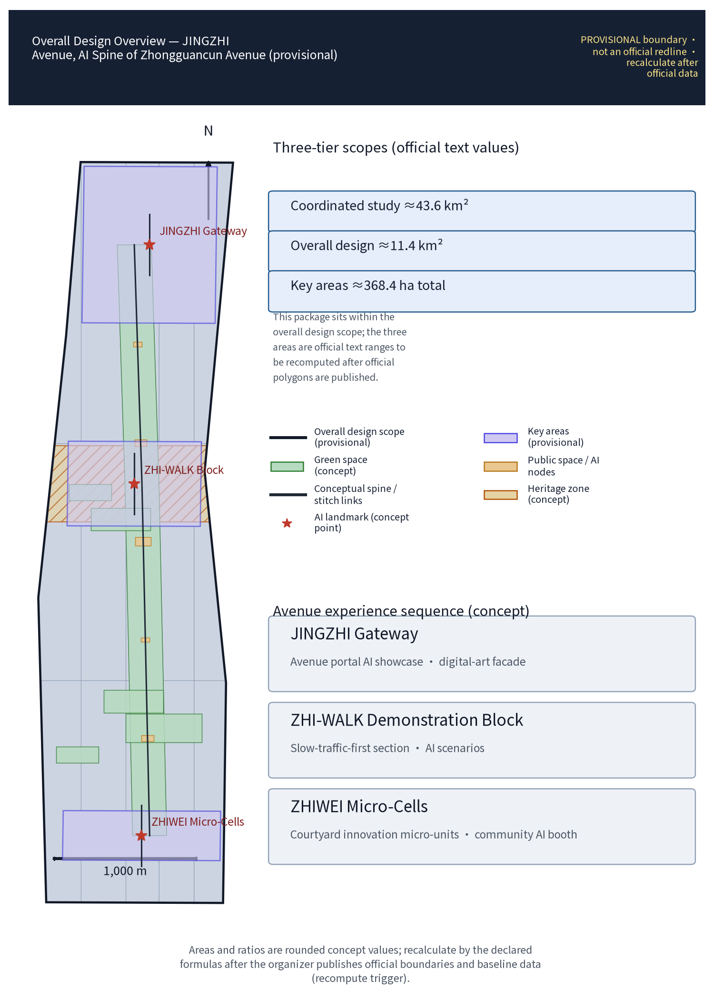
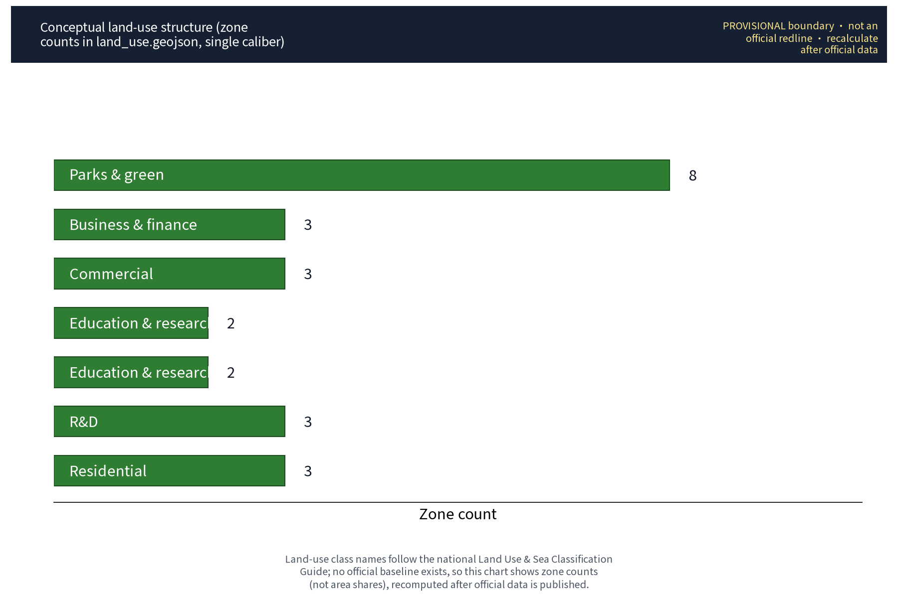
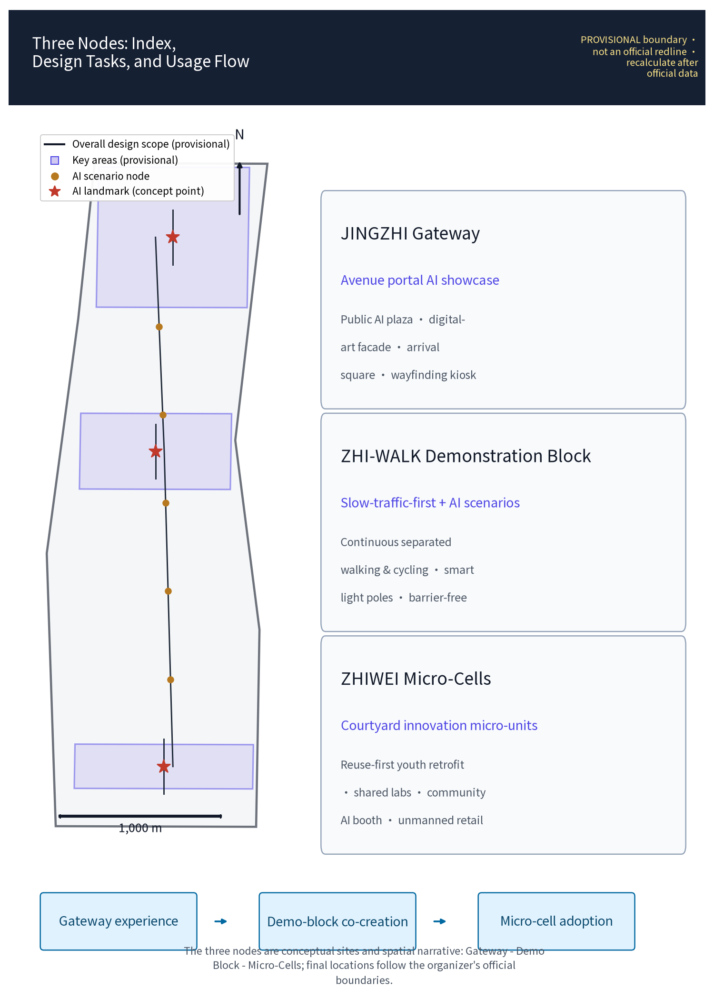
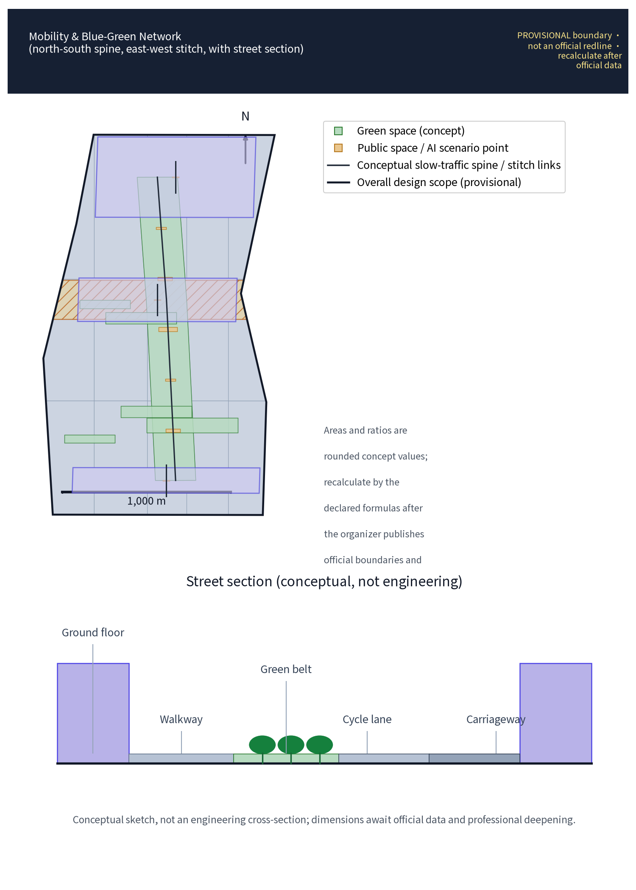
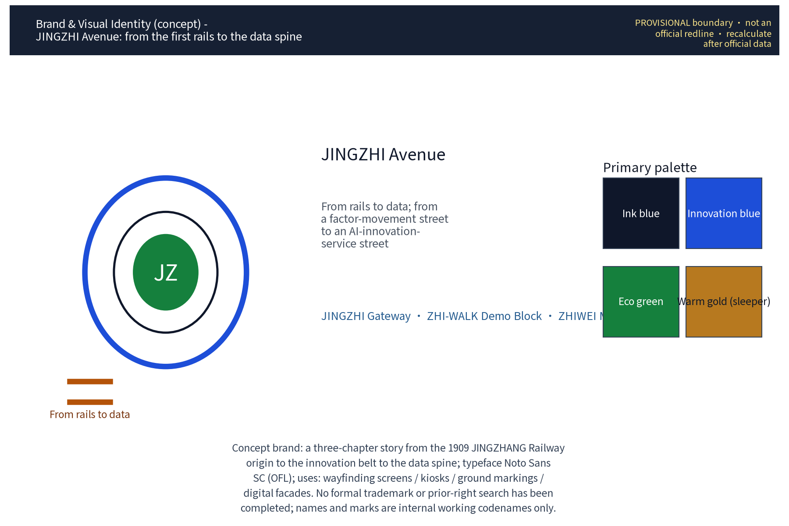
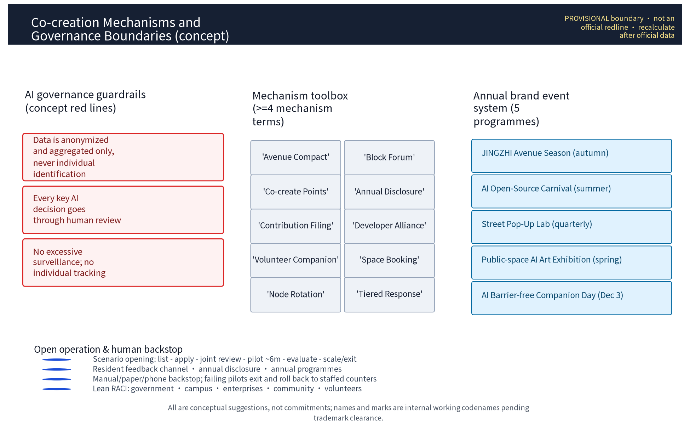
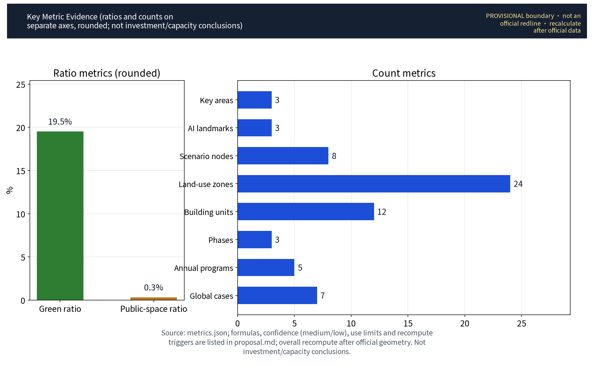

**Scheme name and overall concept (concept)**

The primary name of this scheme is "JINGZHI Avenue" ("京智长街"), with the subtitle "AI Innovation Spine of Zhongguancun Avenue", belonging to the Zhongguancun Technology Service Wing of the "three zones, two wings" structure. "JINGZHI" is a homophone of "JINGZHANG": the century-old Beijing–Zhangjiakou Railway is the cultural home, and "ZHI" (intelligence) is the contemporary spirit — a narrative of an avenue moving from the railway era to the intelligent era, with strong recognizability and no collision with real city, park or enterprise names. The overall concept is "one axis, three nodes, three kinds of scenarios, three phases": along Zhongguancun Avenue, the service functions of globally configured factors and Zhongguancun IP and capital empowerment are organized; three original concept nodes — "JINGZHI Gateway", "ZHI-WALK Demonstration Block" and "ZHIWEI Micro-Cells" — are proposed (all marked as concept points); AI+ lifestyle scenarios are embedded along the street under strict anonymized-aggregation and human-review boundaries, opposing excessive surveillance; implementation follows concept rhythms of near-, mid- and long-term phases. Statement of approach throughout: all areas quote official text values with their basis noted; all geometry is conceptual (provisional); all implementation proposals are reference schemes for professional teams to deepen — none constitutes a statutory planning conclusion.

## Design Basis and Source List

This scheme is based on the following materials: (1) the call-for-proposals taskbook and official statements of the three major positioning goals, five major functions, three zones two wings and three-level scope, including official text area values (coordinated research area 43.6 sq km, overall design area 11.4 sq km, key areas 368.4 ha total; Zhongzhi (Public Intelligence) Park ~192 ha, Beijing AI Origin Community ~104 ha, Dazhongsi AI Industry Cluster ~72 ha); (2) public planning and construction materials on the Beijing–Zhangjiakou Railway Heritage Park, as cultural context and spatial skeleton; (3) Haidian District zoning plan and street regulatory plans as public statutory documents, cited as background only, not replacing statutory planning conclusions; (4) field surveys, public imagery and street view materials along Zhongguancun Avenue; (5) AI industry research, open-source community and open-city-ai/haidian public materials; (6) publisher-level public documents of 7 global ecosystem mechanism cases (case list in the "Coordinated Research Area: Industry and Future City Research" chapter; per-case sources in sources.json). Because the organizer has not yet published official boundary polygons, all geometry in this scheme is conceptual and no precise coordinates or areas are claimed. Survey materials not used in the final deliverables (field notes, interview records) serve internal derivation only, are never cited as factual evidence in formal drawings; their purpose boundary is stated in the "Risk, Copyright, and Compliance" chapter and in the asset ledger in sources.json.

> **Evidence anchors**: [source:DATA-SRC-OFFICIAL-ANNOUNCEMENT-2026-05-09]、[source:DATA-SRC-AGENT-TASKBOOK-2026-05-18] (organizer announcement and taskbook are the textual basis).

## Three-Level Scope Framework

A three-level work framework is established, layer by layer with mutual cross-checks: the coordinated research area (official text value 43.6 sq km, conceptual) focuses on industry systems and future-city topics, examining the spatial network of the full-stack indigenous AI innovation system and the functional hinterland of the Zhongguancun Technology Service Wing; the overall design area (11.4 sq km, official text value) carries out the overall concept of urban renewal and regulatory-plan-level urban design, forming the spatial structure, street sections and renewal guidelines of JINGZHI Avenue; the key areas (368.4 ha total, official text value, including Zhongzhi Park, Beijing AI Origin Community and Dazhongsi AI Industry Cluster) receive detailed design, with this round's three concept nodes as deepening demonstrations. The research layer sets the logic, the design layer sets the form, the key-area layer sets the scenarios; all deliverables are framed as "conceptual suggestions, reference schemes" pending professional verification after the official boundary is published. A "scope—task—deliverable" correspondence is established between the three scope levels, the three zones two wings and the six agent tasks, so that every task has an explicit scope carrier and deliverable chapter (see compliance_matrix.json).

> **Evidence anchors**: [source:DATA-SRC-AGENT-TASKBOOK-2026-05-18] (three-level scope division per the taskbook's official text values).

## Coordinated Research Area: Industry and Future City Research

Industry research identifies the coordination opportunities between Zhongguancun Avenue and the Technology Service Wing, forming a future-city judgment of "globally configured factors + Zhongguancun IP and capital empowerment"; future-city research is only a directional prediction and constitutes no commitment on land use or investment.

Within the coordinated research area, along real nodes such as Qinghe, Shangdi and Zhongguancun Software Park, Zhichun Road, Zhongguancun Avenue and Xueyuan Road, a conceptual spatial mapping of the full-stack indigenous AI innovation system — "foundation layer, model layer, application layer, governance layer" — is sketched: the northern section relies on the software park to strengthen the clustering of basic software/hardware and large-model R&D; the middle section relies on the research institutes along Zhichun Road and Xueyuan Road to form an algorithm-source and interdisciplinary network; the Zhongguancun Avenue section carries the functions of display, service and capital-factor allocation, echoing the Technology Service Wing positioning of "globally configured factors, Zhongguancun IP and capital empowerment". The future-city research proposes a conceptual framework: digital twin base, city-level AI infrastructure, predictive governance and AI-native public services, examining employment-structure change and inclusive policies, producing an industry map and innovation corridor as reference schemes for professional teams. To calibrate the feasibility of the "open scenario operation" and "attraction and conversion" mechanisms, this scheme compiles 7 global ecosystem mechanism cases (all sourced from publisher-level public documents, itemized in sources.json) as a reference system for mechanism design — not an endorsement of any city's or company's results:

| Case name | City/Country | Year | Operator | Transferable mechanism (concept) | Source (publisher) |
|---|---|---|---|---|---|
| Barcelona Superilles | Barcelona/Spain | 2016– | Barcelona City Council | Slow-traffic cells and public-space redistribution; traffic calming and green replacement | Official Barcelona City Council publications (ajuntament.barcelona.cat) |
| Smart Kalasatama | Helsinki/Finland | 2013– | City of Helsinki, Forum Virium Helsinki | Agile pilots and open data; resident co-created "one-year pilot" mechanism | Forum Virium Helsinki and City of Helsinki public materials |
| Sidewalk Toronto (Quayside) | Toronto/Canada | 2017–2020 | Sidewalk Labs, Waterfront Toronto | Public data governance framework and community participation charter; the termination mechanism itself is a sample | Public statements of Waterfront Toronto and Sidewalk Labs |
| Punggol Digital District | Singapore | 2018– | JTC, IMDA | Open digital platform, district cooling and shared facilities; district-level integrated operation | JTC Corporation public materials |
| Songdo International Business District | Incheon/Korea | 2005– | Gale International, Cisco | City-level integrated operations center, underground logistics and centralized utility corridors | Songdo IBD and Gale International public materials |
| Amsterdam Smart City | Amsterdam/Netherlands | 2009– | City of Amsterdam and multi-party alliance | Urban living labs, open data and circular district pilots | Amsterdam Smart City alliance public materials |
| Nordhavn | Copenhagen/Denmark | 2009– | By & Havn, City of Copenhagen | Data-driven district energy and phased waterfront renewal | City of Copenhagen and By & Havn public materials |

> **Evidence anchors**: [source:DATA-SRC-PROVISIONAL-BOUNDARIES-2026-06-05] (boundaries are provisional; research scope is conceptual); publisher-level source entries of the 7 cases from [source:GLOBAL-CASE-BARCELONA-SUPERILLES] through [source:GLOBAL-CASE-COPENHAGEN-NORDHAVN].

## Overall Design Area: Urban Renewal and Regulatory-Plan-Level Urban Design

The overall design emphasizes gradual block-by-block renewal and precision incrementalism: functional replacement of inefficient buildings, opening and sharing of street-front interfaces, slow-traffic-first street sections; regulatory-plan indicators are only cross-check suggestions, no numerical conclusions are preset.

Within the overall design area, JINGZHI Avenue proposes three renewal strategies (conceptual): first, gradual block renewal — the block is the basic unit; existing property rights and urban grain are respected; "acupuncture-style" catalysts drive the renewal of inefficient buildings and old malls along the street, against large-scale demolition; second, street-section redesign and slow-traffic priority — a conceptual optimization of the Zhongguancun Avenue section proportions, compressing redundant vehicle space, securing continuous pedestrian and cycling space, and systematically optimizing crossing nodes and barrier-free paths; third, fifth facade and street furniture — unifying roof, equipment, signage, light poles and paving order along the street into a "Tech-Aesthetics" vocabulary. These strategies are organized as renewal guidelines at regulatory-plan-level urban design depth; they are reference schemes, not statutory regulatory-plan conclusions; geometric relations await professional verification after the official boundary is published. Drawing expression uniformly uses an "existing base + proposed scheme" layering: the existing layer shows only publicly verifiable street, station and building references; the proposal layer always uses concept colors and dashed lines, with legend, scale bar, north arrow and a "PROVISIONAL" watermark; scenario numbering and node zoom-ins are in the A0/A3 drawing set, and street-section drawings are in the demonstration-block sheets — no drawing claims official red lines or engineering conclusions.

> **Evidence anchors**: [source:DATA-SRC-MOHURD-CONTROL-DETAILED-PLANNING]、[source:DATA-SRC-PROVISIONAL-BOUNDARIES-2026-06-05].

## Detailed Design of Key Areas

The detailed design of key areas in this round focuses on three original concept nodes (all marked as concept points; final boundaries and coordinates subject to official publication and verification): (1) "JINGZHI Gateway" — the avenue portal AI showcase node, at the conceptual portal location of the southern section of Zhongguancun Avenue, organizing an arrival sequence with an AI public exhibition ground, digital art facade and gathering plaza, echoing the "starting point" imagery of the railway heritage; (2) "ZHI-WALK Demonstration Block" — the avenue's intelligent-axis demonstration block, selecting several consecutive street blocks mid-avenue, integrating AI+ scenarios, a slow-traffic section and a street renewal sample; (3) "ZHIWEI Micro-Cells" — backstreet innovation micro-units, relying on the street blocks in the Zhichun Road–Xueyuan Road junction hinterland, with courtyard-style micro-units carrying startup teams and a community AI station. The three nodes, the three zones and the Xiaoyue River scenario-enabled wing form a "three zones two wings + one axis" linked network; the detailed design deliverables are conceptual suggestions. Node sheets use "concept numbering + zoom-in pages": each node is numbered on the general plan (Node 1 JINGZHI Gateway, Node 2 Demonstration Block, Node 3 ZHIWEI Micro-Cells), refined with node zoom-ins and street-section drawings — no drawing claims official red lines or engineering conclusions.

**AGENT-4 spatial expression (concept; see the site-overview and key-areas drawings)**: for reviewability, the concept drawings explicitly present four spatial elements and their relations: (1) heritage-park AI public space — AI public grounds and a heritage-awareness zone along the north-south spine (JINGZHANG Railway Heritage Park section) delivering the "north-south through" continuous public experience and AI showcase function; (2) east-west stitching — 3 conceptual pedestrian stitch links (east-west, blue dashed lines in the drawings) connecting street blocks on both sides of the avenue to the park green spine; (3) the Dazhongsi AI Industry Cluster (southern key area) hosting AI-native business scenarios (unmanned retail, pop-up lab, community AI station — scenario cards "Smart Cabinet", "Container Lab", "Good Neighbor"); (4) three concept landmarks (marked star: JINGZHI Gateway, ZHI-WALK Block, ZHIWEI Micro-Cells) aligned north to south with the three key areas (Zhongzhi Park, Beijing AI Origin Community, Dazhongsi cluster) — the landmarks are independent smaller-scale concept points, clearly distinct from the three key areas' official text ranges and from the three nodes: nodes carry specific scenarios and facilities while key areas carry industry and functional agglomeration, mutually supporting rather than duplicating. All spatial relations are conceptual; nothing claims official red lines or engineering conclusions.

> **Evidence anchors**: [data:PACKAGE-GEOMETRY] (three-node schematic polygons come from geometry/key_areas.geojson in this package).

## AI Innovation Ecosystem, Personas, and AI+ Scenarios

Along the intelligent axis, a co-created AI innovation ecosystem of "key-chain enterprises + new R&D institutions + open-source communities + patient capital" is built, with conceptual allocation of shared compute, open data, pilot (test-bed) spaces and IP operation services, strengthening the Zhongguancun IP and capital empowerment function. Personas (concept): targeting 5 talent categories — algorithm engineers, large-model application developers, AI product managers, data governance and compliance specialists, and interdisciplinary young scientists (metric: persona_count in metrics.json); supporting concept suggestions include talent apartments, shared laboratories and youth co-creation spaces. To verify the inclusiveness of the scheme, a user-journey review is additionally carried out with 5 representative user groups (seniors, children, people with visual/hearing impairments, low-digital-skill users, and users without smart devices); their journeys, fallback and acceptance conditions follow:

| User group | Typical traits | Key journey segments | Traditional-channel fallback | Co-creation feedback path | Conceptual acceptance conditions |
|---|---|---|---|---|---|
| Seniors | Low digital skills; declining mobility and senses | Leaving home—resting along the street—errands—returning home | On-site human guidance, phone booking, large-print paper guidance | Community council, station message books, volunteer-relayed feedback | Human-fallback response time met; guidance legible (concept) |
| Children | Limited sight lines; weak independent judgment | School commute—crossing—playing—restroom | Parent accompaniment, crossing guards, low sight-line signage | School co-built classes, family questionnaires | Effective crossing safety prompts; play facilities without sharp edges (concept) |
| People with visual/hearing impairments | Rely on hearing/touch/vision substitution | Traveling—wayfinding—errands—events | Volunteer accompaniment, braille/voice signage, human counters | Disability federation roundtables, experience-day surveys | Accessibility companion response met; multimodal signage complete (concept) |
| Low-digital-skill users | No apps, no memberships | Transit—shopping—payments—enquiries | Cash and human counters, phone hotline, community agency service | Phone callbacks, station messages, family-assisted feedback | Offline channels reachable; no-divide service time (concept) |
| Users without smart devices | Feature phones or no phone | Arrival—tour—consumption—contact | Paper guides, public phones, human enquiry | On-site comment cards, public terminal messages | All core tasks completable without a phone (concept) |

Barrier-free compliance boundary: the on-site guidance and human-service requirements of Article 39 of the Law of the People's Republic of China on the Construction of a Barrier-Free Environment apply only to public service venues handling medical, social-security, financial and living-payment services; this scheme does not generalize them into compliance obligations for all public spaces or digital interfaces — venue-specific compliance requires dedicated assessment (see the barrier-free law entry in sources.json). Street AI+ scenarios (concept): smart light poles (lighting, environmental sensing, information publishing), AI guided tours (voice and augmented-reality tours), accessibility companion (audio guidance for the visually impaired, wheelchair route planning), unmanned retail (smart vending cabinets and unmanned convenience stores), and crowd sensing (district-level pedestrian-flow situation). Privacy and security boundary: all sensing data is anonymized at street level, only statistical aggregated results are output; no individually identifiable information is collected or stored; no facial recognition or individual tracking; human review accompanies every AI active decision together with a complaint channel; excessive surveillance and behavior profiling are prohibited; the scenario list awaits deepening by professional teams and compliance review.

**Scenario card index (concept, 10 cards)**: street AI+ scenarios are implemented as scenario cards, forming a reviewable, iterable operation index; 8 scenarios have fixed node positions (consistent with scenario_node_count=8 in geometry/public_space.geojson), and 2 are roving/temporary carriers:

| Scenario card | Location | Suggested operator | Data boundary | Human review | Offline fallback | KPIs (concept) | Exit conditions |
|---|---|---|---|---|---|---|---|
| "Ask the Street" AI tour | JINGZHI Gateway plaza info pillars and block guide screens | District cultural-tourism/park operator joint commission | On-device voice processing; no individual data kept | Monthly human review of content | Paper maps + human enquiry desk | Daily enquiry deflection rate; content update timeliness | Take pillars offline and keep human service if accuracy fails or complaints exceed |
| "Walk With Me" accessibility companion | Entire demonstration block and ZHIWEI entrances | Subdistrict office + disability federation + volunteers | Anonymized aggregation; no individually identifying tracking | Volunteer duty; human fallback | Phone/on-site human guidance | Response time; service completion rate | Revert to normal human guidance if volunteer coverage insufficient |
| "Smart Cabinet" unmanned retail | ZHIWEI street corners and block rest points | Retail enterprise pilot + points membership | Order aggregation statistics only; no excessive surveillance | Human review of order anomalies | Staffed convenience store/shelves | Repurchase rate; mis-take rate | Exit after pilot term if unmet, roll back to staffed counters |
| "Micro-Sense" crowd sensing | Key demonstration-block nodes | Operator commissions data service provider | Statistical aggregation; human review | Monthly sample review | Manual counting and surveys | Aggregation error; publication timeliness | Disable sensing and roll back to manual counting if audit fails |
| "Smart Light" light poles | Poles along the demonstration block | Municipal management + facility operator | Anonymized environmental sensing; no individual capture | Human review of faults and alarms | Regular timed lighting | Energy saving rate; fault response time | Revert to regular poles if energy savings or compliance fail |
| "Easy Handling" civic service station | Demonstration block and community AI stations | Subdistrict civic service center | Civic data stays in domain; permission logging | Human review of outcomes | Counter service by staff | Service time; satisfaction | Downgrade to human counter if interface compliance review fails |
| "Container Lab" pop-up lab | Modular temporary pavilions along the street | Operator + merchants + universities | Anonymized prototype data | Human review of exhibits | Traditional displays and roadshows | Site turnover; co-creation participation | Suspend slots if quarterly targets unmet |
| "Joy Realm" digital art wall | JINGZHI Gateway digital art facade | Cultural institutions + curators | On-device rendering; no visitor data kept | Human compliance review of content | Physical walls and catalogs | Exhibition sessions; public satisfaction | Suspend and fall back to physical exhibitions if review fails |
| "Good Neighbor" community AI station | ZHIWEI community | Community council + volunteer rotation | One-touch shutdown; on-device processing | Human handling of matters and tickets | Bulletin boards + offline reception | Usage rate; case closure rate | Close station and convert to community service point if usage persistently low |
| "Safe Crossing" junction prompts | Demonstration-block crossing nodes | Traffic authority + operator | Congestion/risk statistics only; no individual tracking | Manual calibration of alarm thresholds | Regular signals and crossing guards | Conflict rate; prompt accuracy | Disable prompts if traffic authority not onboard or false alarms high |

**Scenario–space–operation matrix (concept)**: the correspondence of six scenario domains with spatial carriers, operation modes and partners:

| Scenario domain | Spatial carrier | Suggested operation mode | Partners |
|---|---|---|---|
| AI transport | Block sections, crossing nodes, poles | Municipal operation + pilot commission | Traffic authority, municipal units |
| AI industry | ZHIWEI micro-units, pilot spaces | Park operation + incubators | Universities, key-chain enterprises, open-source communities |
| AI space | JINGZHI Gateway grounds, digital art facade | Curatorial commission | Cultural institutions, artists |
| AI public services | Community AI stations, civic stations | Subdistrict commission + volunteer rotation | Subdistrict office, disability federation, volunteer groups |
| AI culture | Art walls, honor windows, narrative points | Cultural institutions + co-creation | Schools, residents' councils |
| AI governance | Compliance display screens, complaint points | Operator + independent audit | Compliance reviewers, public |

**Technology Readiness Level (TRL) assessment table (concept estimates, for professional deepening)**:

| Scenario # | TRL (concept) | Readiness gap | Improvement path and evidence |
|---|---|---|---|
| 1 "Ask the Street" | TRL5 | Site corpus adaptation and offline fallback | Pilot corpus building within "Container Lab" experiments |
| 2 "Walk With Me" | TRL4–5 | Multimodal interaction with human fallback | Joint experience tests with disability federation; volunteer duty first |
| 3 "Smart Cabinet" | TRL8 | Integration and compliance adaptation | Mature commercial components; compliance retrofit only |
| 4 "Micro-Sense" | TRL6 | Anonymization boundary audit | Sample review mechanism and third-party audit template |
| 5 "Smart Light" | TRL7 | Municipal power and utility-corridor interface | Pre-provision with smart municipal composite corridors |
| 6 "Easy Handling" | TRL5 | Civic interface special approval | In-domain civic data pilot; human first, AI later |
| 7 "Container Lab" | TRL4 | Modular pavilion operation mechanism | One pilot session per quarter; expand after evaluation |
| 8 "Joy Realm" | TRL5 | Content compliance review framework | Curators + public review committee |
| 9 "Good Neighbor" | TRL4–5 | Community co-creation operation model | Council resolution to start; station pilot |
| 10 "Safe Crossing" | TRL5 | Traffic interface and false-alarm rate | Publish before prompting; manual threshold calibration |

**Industry test validation scenarios (concept, 3)**: validation-oriented test scenarios for industry engagement, consistent with industry_test_scenario_count=3 in metrics.json; all follow a "pilot—evaluate—expand or exit" loop:

| Test scenario | Test objective | Method and data boundary | Pass criteria | Human review and exit conditions |
|---|---|---|---|---|
| "Smart Cabinet" unmanned retail pilot | Verify self-checkout accuracy and supply-chain rotation | 3 pilot cabinets; order aggregation statistics only; no individually identifiable data kept | Mis-take rate below set threshold for 4 consecutive weeks; complaint response time met | Pilot term 6 months (concept); exit and roll back to staffed counters if unmet |
| "Ask the Street + Walk With Me" human-AI service | Verify voice/tactile guidance accuracy and human fallback handover | On-device voice processing; one-touch switch to human; no individual route records | Key-command recognition accuracy met; human fallback response time met | Expand only after volunteer duty targets met; otherwise keep human guidance without expansion |
| "Micro-Sense" aggregation accuracy | Verify statistical aggregation accuracy and anonymization boundary | District-level heat aggregation only; no individual tracking; human sample review | Aggregation error within acceptable range; zero compliance violations in spot checks | Disable sensing and roll back to manual counting if audits fail |

> **Evidence anchors**: [source:DATA-SRC-GENERATIVE-AI-INTERIM-MEASURES] (reference for generative-AI content governance wording); [source:DATA-SRC-BARRIER-FREE-ENVIRONMENT-LAW] (barrier-free fallback boundary limited to statutory enumerated scenarios).

## Land Use, Building Scale, and Retain-Renovate-Demolish Strategy

The retain-renovate-demolish strategy follows the order of retain, renovate, demolish: the heritage park and historical elements plus functionally sound buildings along the route are retained; inefficient buildings and old commerce along the street are renovated; only point-based infill new construction is considered, with strict control of increment and height; all areas are conceptual values pending recalculation after official data is published.

Land-use structure concept: street-front parcels are dominated by public management and commercial services and innovation-industry uses; hinterland parcels by mixed functions and residential improvement, forming a pattern of "prosperous street front, quiet hinterland, connected green arteries". Building scale: this scheme does not compute or publish its own area/capacity values; all scale figures follow official text values, and specific indicators are conceptual suggestions awaiting professional recalculation after the official boundary is published. Retain-renovate-demolish (concept): retain — the Beijing–Zhangjiakou Railway Heritage Park, historical elements, and functionally sound parks and buildings along the route; renovate — functional replacement and facade renewal of inefficient buildings, old commerce and vacant buildings along the street, forming the main body of renewal; new — only on well-justified scattered plots as point-based infill construction, strictly controlling increment and height and ensuring harmony with the block grain and the heritage-park interface. Land-use zone data is machine-based on the zones in geometry/land_use.geojson of this package; it contains 24 concept land-use zones (consistent with land_use_zone_count=24 in metrics.json and the "24 concept zones" figure label; the count caliber is unified). The text only summarizes, without publishing itemized values; any share-type expression is labeled as a concept caliber with an explicit recalculation rule.

> **Evidence anchors**: [source:DATA-SRC-MNR-LAND-USE-CLASSIFICATION-202311] (land-use classification names per current national standard).

## Transport, Rail, Municipal Infrastructure, and Public Services

Slow-traffic organization takes the avenue as the main axis with walking and cycling priority, optimizing crossings and connections; municipal works reserve smart utility lines and edge-computing composite corridors alongside renewal; public services are configured in a "avenue service + community service" double ring, and all AI decisions include human review.

Transport concept: existing rail transit stations form the backbone context, strengthening bus, slow-traffic and rail connections; the ZHI-WALK Demonstration Block promotes a slow-traffic-first section, conceptually setting continuous cycle lanes, widening pedestrian space and optimizing crossings, and studying time-separated and undergroundized freight along the street to ease pedestrian-vehicle conflicts. Municipal concept: smart utility lines, sensing networks and edge-computing node composite corridors are reserved alongside renewal to avoid repeated excavation. Public service concept: community AI stations, smart civic service stations, accessibility companion service points and emergency service systems are proposed, with the operation boundary and responsible parties of public data ("anonymized aggregation + human review") clearly stated. All of the above are conceptual suggestions; road red lines, station and facility siting must be deepened by professional teams per statutory plans and measured conditions; roads and stations in drawings are publicly verifiable references only (e.g., Zhichun Road Station, Xueyuan Road Station), not facility-siting conclusions.

> **Evidence anchors**: [source:DATA-SRC-MOHURD-URBAN-DESIGN-MEASURES] (methodological reference for municipal and slow-traffic design wording).

## Blue-Green Network, Public Space, and Urban Character

"One belt, one axis, multiple parks" integrates the blue-green network; the portal gathering plaza—tree-lined smart avenue—node courtyards—hinterland micro-gardens form the "long-street rhythm"; facilities are embedded as modular, reversible design; the character guideline expresses steel structures, old rails, red brick and restrained digital aesthetics.

Blue-green space: with the Beijing–Zhangjiakou Railway Heritage Park as the green spine, the Xiaoyue River scenario-enabled wing's water-green corridor and pocket parks along the route are conceptually linked into a "one belt, one axis, multiple parks" blue-green network; the three concept nodes each carry public green space and open interfaces. Public space sequence: portal gathering plaza—tree-lined smart avenue—node courtyards—hinterland micro-gardens, forming a perceptible "long-street rhythm" supporting large events and daily interaction. Urban character: "Tech-Aesthetics" is distilled, merging the historical vocabulary of the Beijing–Zhangjiakou Railway (steel structures, old rails, red brick) with contemporary digital aesthetics; digital media are used sparingly to eliminate light pollution and visual redundancy; the fifth facade unifies roofs, equipment and advertising order; street furniture is designed as a set, presenting Zhongguancun's distinctive innovative temperament. Character requirements are expressed as guidelines — conceptual suggestions for professional teams to deepen.

> **Evidence anchors**: [source:DATA-SRC-MOHURD-URBAN-DESIGN-MEASURES] (methodological reference for blue-green organization).

## Honor Display System and Public Space Component Library (Concept)

As a complement to the three landmark nodes, this scheme proposes a "non-landmark" honor display system and a reusable public-space component library, both conceptual: the honor display system includes: (1) an "Innovation Honor Window" strip along the street — using street-front shop windows and public interfaces, with publicly verifiable park and enterprise results (public releases, public award information) as content sources, in digital rotation + static display modes; (2) a community honor gallery — a small display area at community AI stations or shared street-block rooms, showing resident co-creation, volunteer and co-building unit results, with content reviewed by the community council; (3) digital honor pillars — interactive pillars at node plazas, rendered on-device with no visitor data kept, updated annually with the "JINGZHI Avenue Season"; (4) an annual results booklet — one public booklet per year recording the previous year's public activities and results with data and sources. Honor content is always based on public releases; no awards or endorsements are fabricated. Public-space component library: reversible street facilities are organized into modular components — canopy units, seating units, pole units, signage-pillar units, planter units, drinking/charging units, activity platform units (mobile stages/market counters), barrier-free ramp units, and children/pet facility units; each component class specifies a standard base, interface specification, reversible installation, responsible party and refresh cycle, supporting "pilot first, network later, removable anytime" progressive implementation; component sheets are included in the A3 booklet.

> **Evidence anchors**: [source:DATA-SRC-AGENT-TASKBOOK-2026-05-18] (basis for public-space and operation task requirements).

## Wayfinding, Symbol System, and International Communication Copy (Concept)

The wayfinding system is organized at three levels (concept): L1 area level — regional guidance near avenue entrances and rail stations; L2 block level — guidance at nodes and street-block intersections; L3 unit level — guidance to facilities, stations and activity points. Symbol system: the unified icon set uses publicly licensed or self-drawn symbols, without unauthorized commercial imagery; signage layouts are bilingual Chinese-English plus graphics, considering the visually/hearing-impaired (braille, voice) and low-digital-skill users; digital signage always renders on-device with paper/human fallback retained. The wayfinding system stays consistent with the application boundary of Article 39 of the Barrier-Free Environment Law: statutory human-service fallback covers only the enumerated service venues; the signage system itself implies no compliance obligation for all venues. International communication copy (concept; concise, verifiable, no over-promising): English — "JINGZHI Avenue: from the first rails to the smart spine (concept)"; "Open scenarios, anonymized data, human review — every AI service keeps an offline fallback (concept)". All slogans are labeled as concepts; nothing claims completed construction, awards, or official endorsement or recognition.

## Brand Identity and Visual Identity (Brand & VI, Concept)

Brand naming system: Chinese primary name "京智长街" (English primary name JINGZHI Avenue), subtitle "中关村大街AI创新主轴" (AI Innovation Spine of Zhongguancun Avenue); node English names: JINGZHI Gateway ("京智之门"), ZHI-WALK Demonstration Block ("智行长街示范段"), ZHIWEI Micro-Cells ("知微坊"); annual-event English names such as JINGZHI Avenue Season. English names are conceptual only; no registration and no exclusive trademark rights are claimed. Brand story (concept): a three-act narrative line — "tracks, innovation belt, data rails": in 1909 the Beijing–Zhangjiakou Railway marked the start of China's self-built trunk railways; in the 1980s Zhongguancun's "Electronics Street" opened the long-street narrative of technology commercialization; today the AI innovation belt continues a new chapter on this axis — "from steel rails to data rails". "JINGZHI" echoes "JINGZHANG" in the spirit of the century-old naming, borrowing no real institution's name. Logo direction (original generated asset at assets/figures/logo.png): (1) graphic — the Beijing–Zhangjiakou rail line abstracted into a "J–Z" connected ring mark ("JZ Loop"), with open ends signifying the handover "from rails to data rails"; (2) color — a "Steel-Rail Vermilion" and "JZ-Loop Blue" dual-color system with neutral grays and white; dark-background and monochrome versions coexist; (3) type — Chinese in Source Han Sans/Noto Sans SC family, Latin in Inter/Noto Sans family, both under free commercial licenses; (4) VI rules — minimum size, clear space, forbidden distortion, misuse examples (stretching/recoloring/shadows/rotation) and dark-background monochrome specifications; all brand elements are used as concepts, not as external commercial marks. Logo licensing and asset ownership are documented in the sources.json asset ledger (ASSET-LOGO, self-drawn original + OFL-1.1 typeface).

> **Evidence anchors**: [source:DATA-SRC-AGENT-TASKBOOK-2026-05-18] (basis for brand and external-communication task requirements); [source:ASSET-FONT-NOTO-SANS-SC] (OFL-1.1 license notes of the base typeface).

## Three Zones Two Wings Coordination and International Communication (Concept)

This scheme belongs to the Zhongguancun Technology Service Wing of "three zones, two wings" and establishes a conceptual coordination network with other units of the Beijing–Zhangjiakou AI innovation belt; all arrangements are suggestions and constitute no inter-regional coordination commitments. Coordination targets with factor exchange and cooperation interfaces:

(1) Beiwei Community (conceptual coordination unit): exchange resident-service and age-friendly scenario experience; interface via co-published community scenario lists and a volunteer mutual-aid network. (2) Future Science City: exchange compute and test scenarios linked to large-science-facility resources; interface via cross-region compute scheduling suggestions and a joint pilot-application channel. (3) Huairou Science City: exchange basic-research talent and open data; interface via a joint scientist exchange program and mutual recognition of anonymized aggregated datasets. (4) E-Town (Beijing Economic-Technological Development Area): exchange intelligent-manufacturing scenarios and supply-chain data; interface via joint open-scenario-operation pilots and industry-attraction linkage. (5) Jing-Jin-Ji (Beijing–Tianjin–Hebei regional coordination): exchange exhibition, capital and talent factors; interface via borderless exhibition linkage, joint investment-recommendation and complementary undertaking. Factor exchange adheres to three principles — "data anonymized and aggregated, results publicly verifiable, no target commitments"; cooperation interfaces all start as memoranda or joint releases subject to each party's own decision. The mechanism diagram (factor exchange and interface relations) is at assets/figures/cooperation-mechanism.en.png; communication copy (concise, verifiable, no over-promising): English — "JINGZHI Avenue coordinates with Future Science City, Huairou Science City, E-Town and the Jing-Jin-Ji region: share verifiable lessons, promise no cross-region targets (concept)".

> **Evidence anchors**: [source:DATA-SRC-AGENT-TASKBOOK-2026-05-18] (cross-region coordination and communication tasks); [source:GLOBAL-CASE-AMSTERDAM-SC] (international reference for coordination-network mechanism design).

## Developer Community, Open Scenario Operation, and Attraction-Conversion Mechanism (Concept)

Developer community mechanism (concept): (1) Open interfaces — anonymized aggregated datasets, reference implementations of scenario APIs and a data sandbox, published under open-source licenses with license boundaries stated; (2) Contribution mechanism — a four-step flow of submit, review, publish, archive; both code and content undergo compliance review; (3) Code of conduct — no individual capture, no tracking, no entry into formal systems without human review; violations revoke contribution eligibility. Open scenario operation mechanism (concept): scenario list publication — operator application — joint review (experts + community) — pilot operation (about 6 months) — evaluation — expansion or exit, with full publication; admission conditions include data-compliance capability, human-fallback arrangements and exit plans; operation rights are not perpetual. Attraction-conversion mechanism (concept): a proof-of-concept (POC) plan offers startups block pilots and pop-up space; training and roadshow activities link universities and open-source communities; the attraction service chain (showcase—pilot—landing) is limited to public policy interfaces, promising no specific policy incentives or settlement outcomes; cross-region attraction is linked with the three zones two wings coordination, staying verifiable and non-over-promising.

## Renewal Projects, Implementation Policy, and Phasing

Renewal project list (concept): JINGZHI Gateway node renewal, demonstration-block street-section redevelopment, functional replacement of buildings along the route, ZHIWEI micro-unit activation, alley and pocket-park improvement, and smart municipal renewal — all pending project approval and feasibility studies. Stop conditions and exit mechanism (concept): when any project or scenario persistently fails its evaluation thresholds (two consecutive evaluation cycles), fails compliance spot checks, or is judged inadvisable by community discussion and joint review, the stop condition triggers and the exit mechanism of the scenario cards / responsibility matrix applies — stop new investment, remove reversible facilities, roll back to human service, with full publication; stopping or exiting is not treated as failure but as a normal phase of the "pilot—evaluate—expand-or-exit" loop. Implementation policy (concept): government guidance, enterprise participation, university and research-institute coordination, community co-building and sharing; exploring urban-renewal pilots, land mixed use and flexible use management; volunteers and professional teams participate in renewal evaluation; attention is paid to the holding-operation balance of existing properties. Phasing (concept rhythm): near term about 1–3 years — start the JINGZHI Gateway and the first section of the demonstration block, landing quick-win AI+ scenarios; mid term about 3–5 years — full demonstration-block section redevelopment and ZHIWEI construction; long term about 5–10 years — full-axis connectivity and normalized mechanisms. Annual brand activity system (concept, 5 items, consistent with annual_program_count in metrics.json):

| Annual activity | Time (concept) | Carrier | IP elements | Public participation |
|---|---|---|---|---|
| JINGZHI Avenue Season | Every autumn (concept) | Avenue-wide public space | Opening ceremony, visual refresh, annual review exhibition | Open to all; markets; co-creation voting |
| AI Open-Source Carnival | Every summer (concept) | ZHIWEI and developer-community space | Open-source releases, hackathons, code reviews | Developer registration; public spectating; open-source roadshows |
| Street Pop-Up Lab | Every quarter (concept) | Modular pavilions and street furniture | Scenario prototype experiments; merchant co-branded pop-ups | On-site experience and feedback; online voting |
| Public-Space AI Art Exhibition | Every spring (concept) | JINGZHI Gateway grounds and digital art facade | Art open call; public art installations | Resident co-creation; guided tours; artwork publication |
| AI Barrier-Free Companion Open Day | Early December each year (concept) | Demonstration block and community AI stations | Accessibility companion experience; age-friendly training | Experience booking; volunteer duty; comment collection |

> **Evidence anchors**: [source:DATA-SRC-AGENT-TASKBOOK-2026-05-18] (phasing and implementation items per taskbook requirements).

## Phased Implementation and Long-Term Operation Responsibility Matrices (Concept)

The phased implementation matrix follows "one row per project, traceable responsibility"; all entries are conceptual suggestions — lead and partner parties are advisory judgments to be adjusted after project approval:

| Project | Phase | Suggested lead | Partners | Preconditions | Cost level | Approval/data dependence | Service level | Human fallback | Evaluation thresholds | Expansion conditions | Exit and rollback |
|---|---|---|---|---|---|---|---|---|---|---|---|
| JINGZHI Gateway grounds and gathering plaza | Near term | District platform company | Cultural tourism, cultural institutions | Clear site ownership; concept deepening | Medium | Land and temporary-construction permits | Open all day | Staffed grounds management | Year-one event count and satisfaction met | Then enter annual event plan | Rotate contracted player or revert to daily plaza if unmet |
| First section of the demonstration block | Near term | Subdistrict office and district urban-management dept. | Transport, municipal, enterprises | Section survey and utility mapping | High | Occupation and traffic-organization approvals | Slow-traffic first; barrier-free met | Traffic guards and volunteer duty | Slow-traffic flow and accident-rate targets met | Expand to full line after evaluation | Revert and restore original section; re-survey as needed if unmet |
| Full-line section network | Mid term | District renewal task force | Subdistrict, enterprises, residents' council | First-section evaluation passed | High | Regulatory plan and investment-plan linkage | Continuous slow-traffic network | Safety officers and emergency response along line | Coverage and satisfaction after networking | Then connect rail transfer optimization | Implement in stages; adjust later stages by evaluation |
| ZHIWEI micro-unit activation | Mid term | Park operating company | Universities, incubators, community | Property sorting and merchant survey | Medium | Property and leasing policy interfaces | Courtyard shared space | Community service point staffed | Occupancy and co-creation activity targets met | Then open more micro-units | Shrink to community-service function if vacancy exceeds |
| Building functional replacement along the route | Near–long term | Owners and platform company | Enterprises, financial institutions | Building assessment and tenant pipeline | High | Property and renewal approvals | No service interruption during replacement | Tenant relocation and transition services | Replacement rate and rent stability met | Promote after reproducible building sample | Keep status and adjust strategy if replacement fails |
| Alley and pocket-park improvement | Mid term | Subdistrict office | Landscaping, community, volunteers | Existing green and utility data | Low | Green-space and municipal approvals | Accessible all seasons; age-friendly | Community volunteer patrols | Usage and satisfaction met | Then include in blue-green network | Low-maintenance planting and simplified facilities if underused |
| Smart municipal and composite corridors | Long-term relay | Municipal department | Operators, energy enterprises | Utility census and routing studies | High | Municipal and utility-combined approvals | Reserve while renewing | Emergency repair plans with manual dispatch | Significant reduction of repeated excavation | Layer in with renewal projects | Corridors coordinated by municipal; no standalone investment |
| AI+ scenario scaled deployment | Whole course | Operating company | Enterprises, disability federation, schools, traffic authority | Industry test scenario evaluations passed | Low–medium | Data compliance evaluation and interface filing | Anonymized aggregation + human review | Human fallback for all scenarios | Scenario KPIs met consecutively | Expand per scenario cards after met | Any unmet scenario rolls back per its card's exit conditions |

Long-term operation responsibility matrix (concept): service level, human fallback, evaluation thresholds, expansion conditions and exit/rollback plans are mapped item by item to prevent "launching without responsibility":

| Operation object | Service level (concept) | Human fallback | Evaluation thresholds | Expansion conditions | Exit and rollback |
|---|---|---|---|---|---|
| AI scenario operations | Response-time and availability graded publication | Full-human replacement per card exit conditions | Continuous KPI tracking | Met or approved by joint review | Roll back per card exit conditions |
| Public space and component library | Facility integrity and cleanliness publication | Patroller and volunteer inspections | Integrity below threshold triggers warning | Add components after evaluation | Reversible disassembly; restore original state |
| Data and algorithms | Anonymized aggregation and review records auditable | Human sample review | Zero compliance violations in spot checks | Expand after compliance review | Disable sensing; roll back to manual counting |
| Annual activity system | Schedule and safety-plan publication | Activity volunteers and emergency teams | Participation and satisfaction evaluation | Qualified activities enter annual list | Unqualified activities not re-scheduled next year |
| Developer community | Review and publication time limits public | Community admins arbitrate manually | Contribution quality and compliance rate | Open more interfaces after compliance | Violating contributions revoked; rules published |

> **Evidence anchors**: [source:DATA-SRC-AGENT-TASKBOOK-2026-05-18] (implementation and operation task requirements); [source:GLOBAL-CASE-HELSINKI-KALASATAMA] (reference for the pilot–evaluate–expand-or-exit mechanism).

## Metrics, Area Recalculation, and Compliance Matrix

Indicator system (concept): slow-traffic-first attainment rate, barrier-free coverage, AI+ scenario rollout count, scenario-data anonymization rate 100%, human-review response time, green-visibility rate and street-furniture integrity rate, forming a quantifiable implementation monitoring table supporting phased evaluation. Area recalculation: this scheme strictly adopts official text values (43.6 sq km, 11.4 sq km, 368.4 ha, and Zhongzhi Park ~192 ha, Beijing AI Origin Community ~104 ha, Dazhongsi ~72 ha) and publishes no self-computed results; after the official boundary polygon is published, professional teams will recalculate and verify areas on the statutory mapping basis. Compliance matrix: a four-dimension cross-reference (data compliance, planning compliance, character/landscape compliance, barrier-free and safety compliance) with basis, responsible party and checkpoints per item for later deepening.

**Indicator display precision and recalculation trigger (concept basis)**: provisional indicators are displayed in text and front-ends at reasonable precision; machine precision stays in metrics.json only, preventing low-confidence values from being misread as official data:

| Indicator | Display basis (text/front-end) | Formula and basis | Confidence | Automatic recalculation trigger once official geometry is available |
|---|---|---|---|---|
| site_area_sqm | approx. 11.4 sq km | polygon_area(provisional_site_boundary, EPSG:4548) | Medium | Official boundary published → recalculate per statutory mapping and refresh display |
| green_ratio | approx. 19.5% | green_space_area_sqm / site_area_sqm | Low | Same; recalculate with new area denominator |
| public_space_ratio | approx. 0.3% | public_space_area_sqm / site_area_sqm | Low | Same; recalculate with new area denominator |
| Count metrics | integers shown directly (3 key areas (official text), 24 concept land-use zones, 3 landmarks, 8 scenario nodes, 5 personas, 7 cases, 5 programs, 3 tests, 3 phases) | count(geometry/ layer features) and proposal.md scenario/program lists | High | Machine validation script syncs after any feature addition or change |

> **Evidence anchors**: [metric:green_ratio]、[metric:public_space_ratio]、[source:PACKAGE-GEOMETRY].

## Risk, Copyright, and Compliance

Risk notes: (1) the official boundary polygon has not been published; all geometry in this scheme is provisional and may diverge from the final basis — the official release prevails; (2) industry and market cycles may affect phasing rhythm, so flexibility must be retained; (3) AI scenarios carry data-security and privacy risks; the anonymized-aggregation and human-review boundary must be strictly enforced; (4) renewal implementation is affected by property rights, funding and the policy environment; (5) cross-region coordination is advisory — whether any party starts depends on its own decision, and this scheme makes no commitments. Copyright and compliance: this scheme is original concept text; the primary name "JINGZHI Avenue" and the node/activity English names are self-created, not copying real city, park or enterprise names or trademarks; the Logo is a self-drawn original generated asset; cited official texts are background only and constitute no statutory planning conclusions; all landing suggestions are framed as "conceptual suggestions, reference schemes, open for professional deepening" and the final basis is the official published statutory documents and review requirements. **Prior brand rights and use boundary (honest statement)**: as of this concept stage no official trademark search has been completed (no prior-rights clearance has been run through a trademark office or agency), so "JINGZHI Avenue" ("京智长街") and the node/activity names are all treated as **internal working codenames**: they will not be used externally, not be applied as commercial marks, and not be submitted for registration until prior-rights clearance and compliance assessment is completed; if a conflict with a third party's prior rights is found later, the participant will proactively adjust or abandon the relevant name; this statement is mirrored in the sources.json brand asset entry (ASSET-BRAND-NAMES) and the visual pages, so reviewers can verify against this boundary; nothing here is a rights claim. Asset rights ledger: base maps (self-drawn schematic base from public geographic references), street views and site photos (not used in drawings; internal derivation only; no copying or redrawing), typefaces (Noto Sans SC and Source Han Sans, OFL-1.1), icons (publicly licensed or self-drawn), cases and data (publisher-level citations with factual scope only), code and generated assets (self-produced by the participant; display permission for this repository) — per-asset license, attribution, transformation and restriction entries are in the sources.json asset ledger; survey materials not used in deliverables are internal-use only: not public, not cited, not distributed; this package is displayed under the "COMMUNITY-DISPLAY-ONLY" scope, claims no co-copyright with the organizer or any third party, and is not used commercially. Substantive equivalence statement (declarative): proposal.md / proposal.en.md, the HTML reports, the five figures and their English counterparts, the A0/A3 drawings and their English counterparts, and the visual pages and their English counterparts were produced by the participant from the same data and claim system; substantive Chinese-English equivalence has been manually verified by the participant (declarative); where individual wording differs, the Chinese version prevails. Chinese-English claims, metrics, evidence and figure-position equivalence check table (declarative, manually verified):

| Equivalence item | Chinese version element | English version element | Check note (declarative; Chinese version prevails) |
|---|---|---|---|
| Claims | Primary name "京智长街", three node names, three scenario families, three phases | JINGZHI Avenue, English node names, three scenario families, three phases | Concept definitions and boundary statements consistent; English names are conceptual, no trademark claimed |
| Metrics | Display basis ~11.4 sq km / ~19.5% / ~0.3% and count integers | ~11.4 sq km / ~19.5% / ~0.3% and count integers | Display precision, formulas, confidence and recalc triggers consistent; machine precision only in metrics.json |
| Evidence anchors | [source:]/[data:]/[metric:] anchor ID set | Same anchor ID set | Anchor IDs correspond one-to-one |
| Figure positions | 5 figures + logo + mechanism diagram (zh) and their positions | Corresponding .en figures and positions | One-to-one positions; captions translated |
| Drawings | A0/A3 (zh) pages and content | A0/A3 (en) pages and content | Layout structure and notes translated |
| Visual pages | visual/index.html sections | visual/index.en.html sections | Sections correspond one-to-one; metric values identical |

> **Evidence anchors**: [source:DATA-SRC-OFFICIAL-ANNOUNCEMENT-2026-05-09] (the call rules are the basis for ownership and compliance wording).

## References

References follow the latest official versions; sources.json in this package contains only verifiable entries, and no official data or links are fabricated.

(1) The call-for-proposals taskbook of the "Centennial Jingzhang AI Innovation Belt International Urban Design Call" and its official texts (three major positioning goals, five major functions, three zones two wings, three-level scope and official area values); (2) public planning and construction materials on the Beijing–Zhangjiakou Railway Heritage Park; (3) Beijing Haidian District zoning plan and related street regulatory plans as public statutory documents (background citation only); (4) public materials and field-survey records of Zhongguancun Science Park and along Zhongguancun Avenue; (5) open-city-ai/haidian open-source call-related public materials; (6) publisher-level public documents of the 7 global ecosystem mechanism cases (Barcelona City Council; Forum Virium Helsinki and the City of Helsinki; Waterfront Toronto and Sidewalk Labs; JTC; Songdo IBD and Gale International; Amsterdam Smart City; City of Copenhagen and By & Havn — per GLOBAL-CASE-* entries in sources.json); (7) public research literature on AI industry and smart cities. The above materials are used for this concept study only; citations follow the latest official releases; survey materials not used in the deliverables (site records, interview notes, unpublished imagery) are treated as "hypotheses pending verification", not as factual citations.

> **Evidence anchors**: [source:DATA-SRC-OFFICIAL-ANNOUNCEMENT-2026-05-09] (the first item of this list is the organizer's public package).