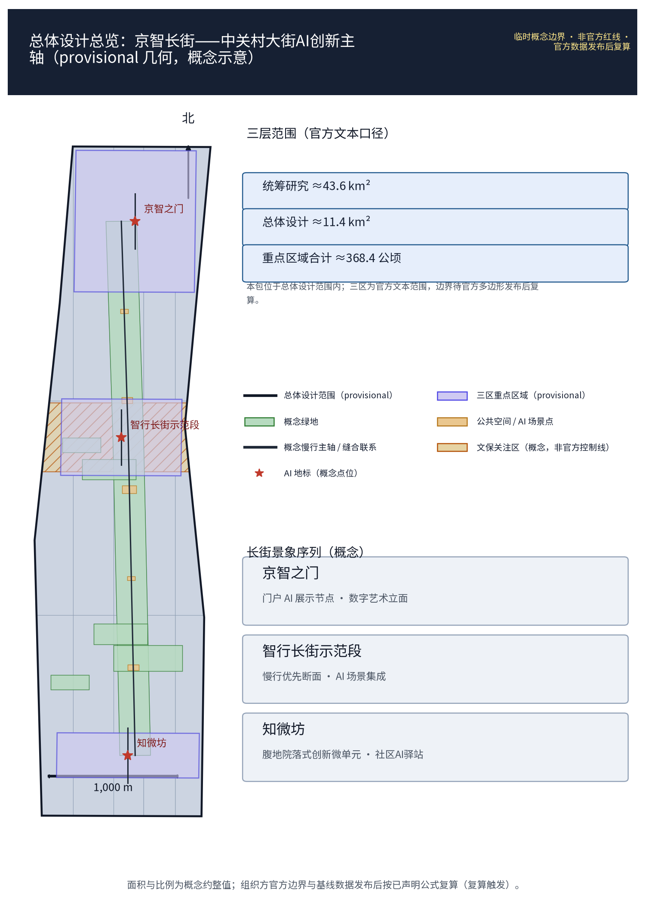
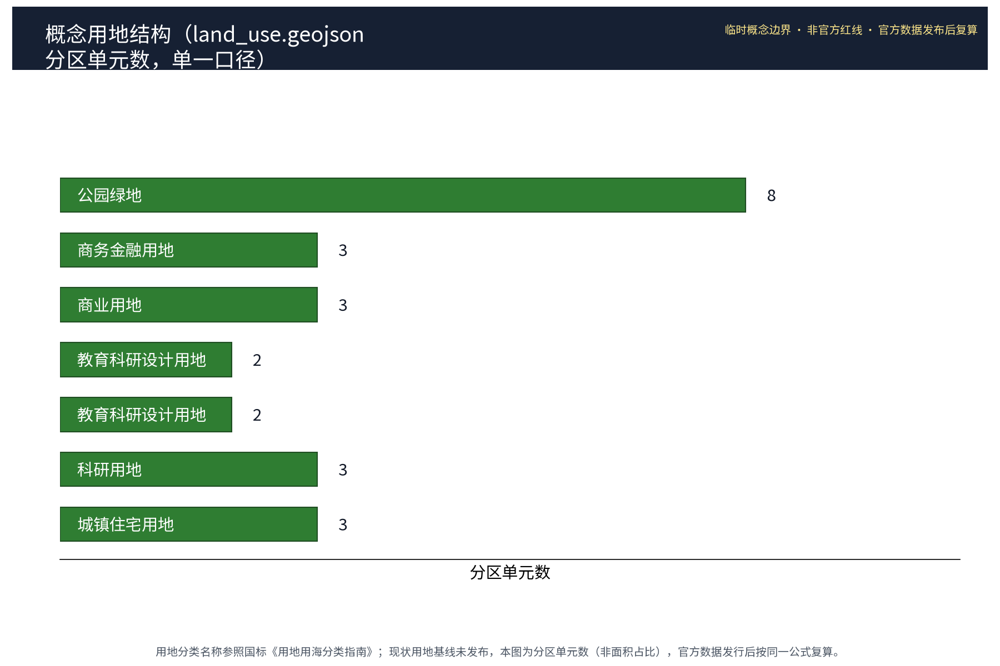
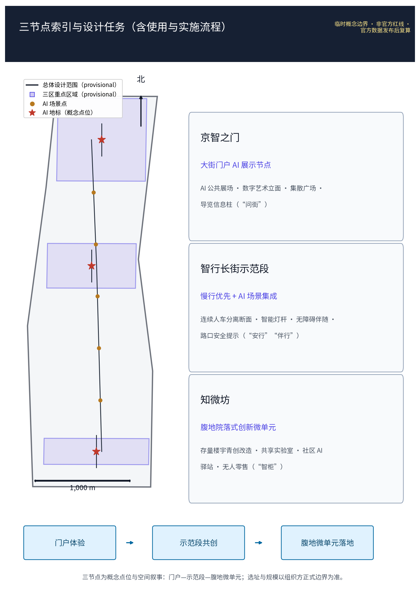
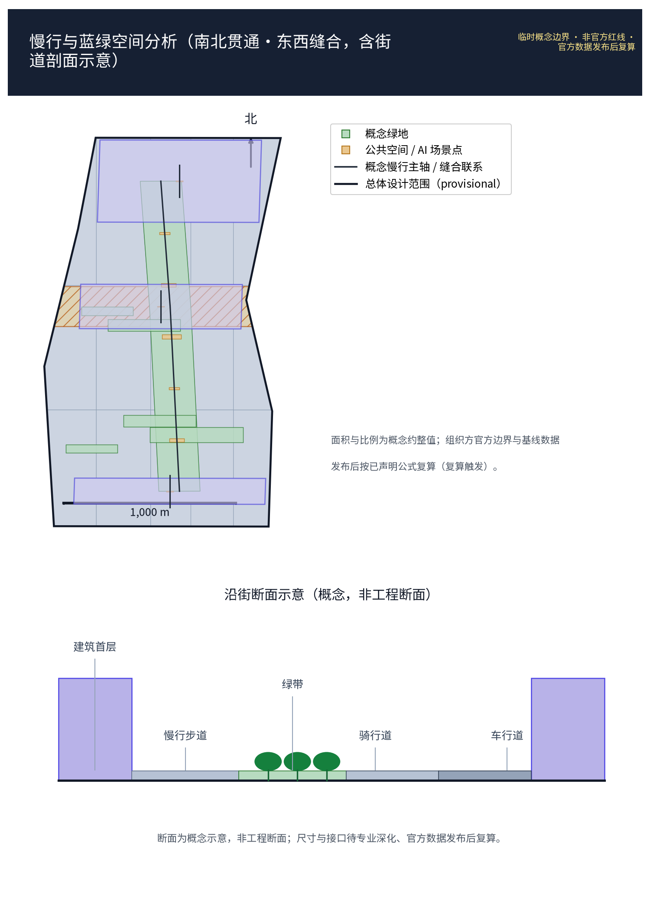
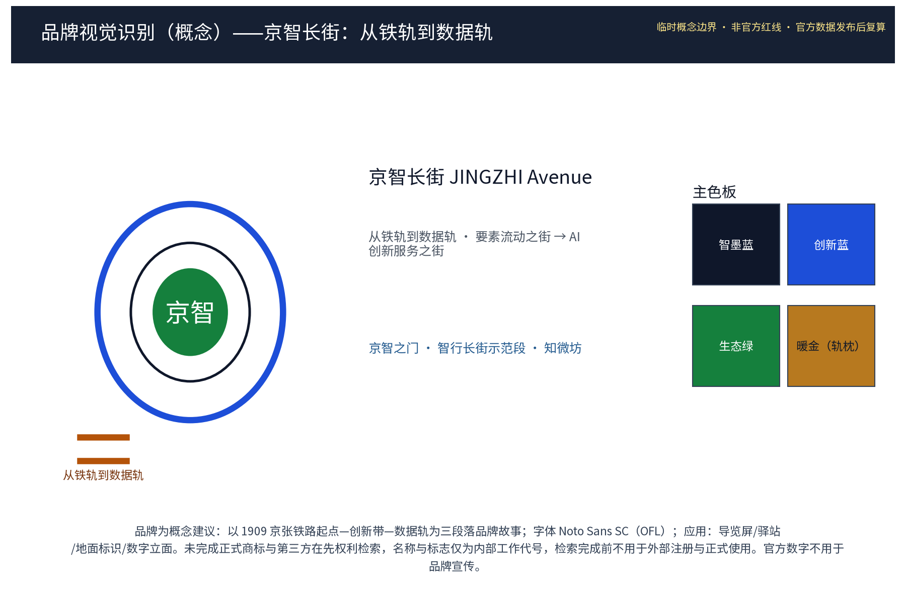
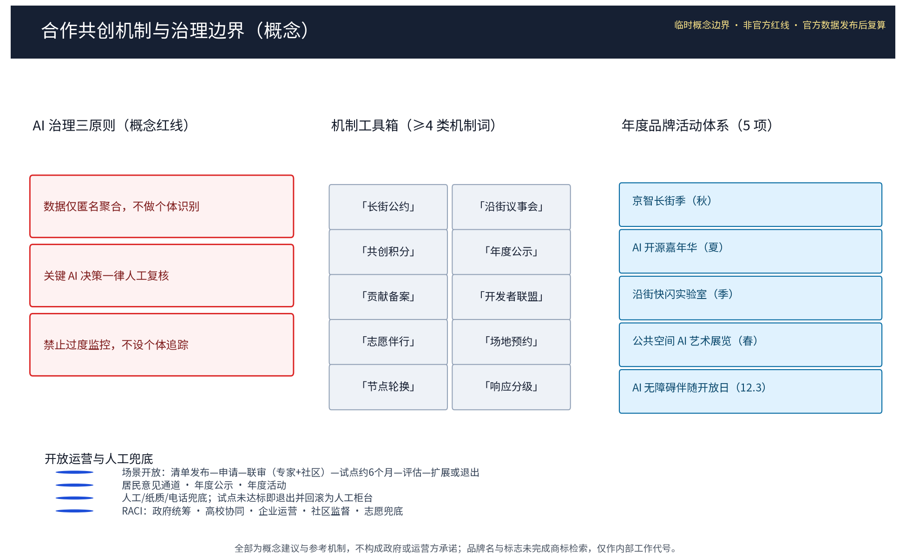
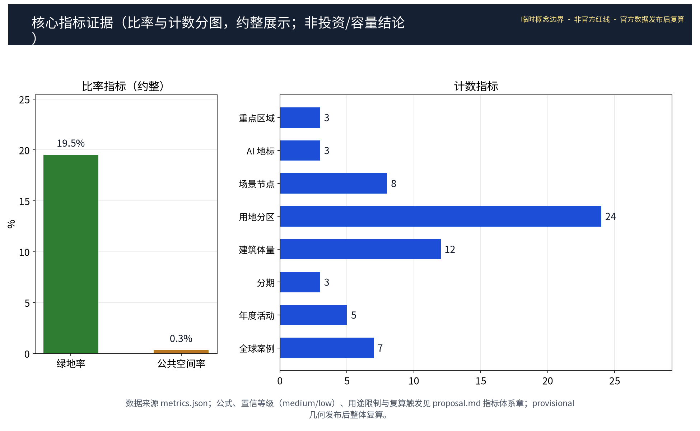

**方案名称与总体构想(概念)**

本方案主名称"京智长街"(JINGZHI Avenue),副题"中关村大街AI创新主轴",属三区两翼之中关村科技服务翼。"京智"取"京张"之谐音:以百年京张铁路为文化原乡,以"智"为当代精神,隐喻从铁路时代驶向智能时代的长街叙事,辨识度强且不与现实城市、园区、企业名称重复。总体构想为"一轴三节点、三类场景、三阶段":以中关村大街为轴,组织要素全球化配置、中关村IP与资本赋能的服务功能;自拟"京智之门""智行长街示范段""知微坊"三处概念节点(均标为概念点位);沿街落地AI+生活场景,坚守数据匿名聚合与人工复核边界,反对过度监控;按近期、中期、远期概念节奏实施。全篇口径:凡面积均引用官方文本数值并标注口径,凡几何均为概念示意(provisional),凡落地均为参考方案,供专业团队深化研究,不构成法定规划结论。

## 设计依据与资料清单

本方案依据以下资料开展概念设计:①征集任务书及官方发布的三大定位、五大功能、三区两翼与三层范围表述,含官方文本面积口径(统筹研究范围43.6平方公里、总体设计范围11.4平方公里、重点区域合计368.4公顷;众智园约192公顷、北京AI原点社区约104公顷、大钟寺AI产业集聚区约72公顷);②京张铁路遗址公园公开规划建设资料,作为文化脉络与空间骨架参照;③海淀区分区规划及街区控规等公开法定文件,仅作背景引用,不替代法定规划结论;④中关村大街沿线现状调研、公开影像与街景资料;⑤AI产业研究、开源社区及open-city-ai/haidian公开资料;⑥7个全球生态机制案例的发布主体公开文件(案例清单见"统筹研究范围产业与未来城市研究"章,逐条来源见 sources.json)。资料清单随文附后;因组织方尚未发布官方边界多边形,本方案涉及几何均为概念示意,不自行声称精确坐标与面积。未进入成果正文的调研材料(现状踏勘记录、访谈笔记等)仅用于本方案内部推导,不在任何正式图件中作为事实证据引用,其用途边界见"风险、版权与合规说明"章与 sources.json 资产台账。

> **证据锚点**：[source:DATA-SRC-OFFICIAL-ANNOUNCEMENT-2026-05-09]、[source:DATA-SRC-AGENT-TASKBOOK-2026-05-18]（组织方公告与任务书为文本口径依据）。

## 三层范围工作框架

按三层范围建立工作框架,层层递进、互为校核:统筹研究范围(官方文本口径43.6平方公里,概念示意)聚焦产业体系与未来城市议题,研判AI全栈自主创新体系的空间网络及中关村科技服务翼的职能腹地;总体设计范围(11.4平方公里,官方文本口径)开展城市更新与控规深度城市设计的总体概念,形成京智长街的空间结构、街道断面与更新导则;重点区域(合计368.4公顷,官方文本口径,含众智园、北京AI原点社区、大钟寺AI产业集聚区三区)展开详细设计,并以本期三处概念节点作为深化示范。研究层定逻辑、设计层定形态、重点层定场景;全部成果以"概念建议、参考方案"表述,待官方边界发布后由专业团队校核与深化。三层范围与三区两翼、六项agent任务之间建立"范围—任务—成果"对应关系,确保每一任务都有明确的范围载体与成果章节(见 compliance_matrix.json)。

> **证据锚点**：[source:DATA-SRC-AGENT-TASKBOOK-2026-05-18]（三层范围划分依据任务书官方文本口径）。

## 统筹研究范围产业与未来城市研究

产业研究识别中关村大街与科技服务翼的协同机会，形成「要素全球配置+中关村IP与资本赋能」的未来城市形态判断；未来城市研究仅作方向性预判，不构成对用地与投资的承诺。

在统筹研究范围内,沿清河、上地与中关村软件园、知春路、中关村大街、学院路等真实节点,概念性勾画"基础层—模型层—应用层—治理层"的AI全栈自主创新体系空间映射:北部段落依托软件园强化基础软硬件与大模型研发集聚,中部依托知春路、学院路科研院所形成算法策源与交叉学科网络,中关村大街段落承担展示、服务与资本要素配置职能,呼应科技服务翼"要素全球化配置、中关村IP与资本赋能"定位。未来城市研究提出概念框架:数字孪生底座、城市级AI基础设施、预测性治理与AI原生公共服务,研判就业结构变化与包容性政策,形成产业图谱与创新走廊的参考方案,供专业团队深化研究。为校准"场景开放运营"与"招引转化"机制的可行性,本方案整理7个全球生态机制案例(均以发布主体公开文件为来源,逐条见 sources.json),作为机制设计的参照系,不构成对任何城市或企业成果的背书:

| 案例名称 | 城市/国家 | 年份 | 运营主体 | 可迁移机制（概念） | 来源（发布主体） |
|---|---|---|---|---|---|
| 巴塞罗那超级街区（Superilles） | 巴塞罗那/西班牙 | 2016— | 巴塞罗那市议会 | 慢行单元格与公共空间再分配；交通降级与绿植置换 | 巴塞罗那市议会官方发布（ajuntament.barcelona.cat） |
| 卡拉萨塔马智慧区（Smart Kalasatama） | 赫尔辛基/芬兰 | 2013— | 赫尔辛基市政府、Forum Virium Helsinki | 敏捷试点与开放数据；居民共创的"一年试点"机制 | Forum Virium Helsinki 与赫尔辛基市公开资料 |
| 码头区智慧项目（Sidewalk Toronto） | 多伦多/加拿大 | 2017—2020 | Sidewalk Labs、滨水区管理局 | 公共数据治理框架与社区参与章程；因未达成共识而终止的机制本身亦为样本 | Waterfront Toronto 与 Sidewalk Labs 公开声明 |
| 榜鹅数码园区（Punggol Digital District） | 新加坡 | 2018— | 裕廊集团（JTC）、IMDA | 开放数字平台、集中供冷与共享设施；园区级集成运营 | JTC Corporation 公开资料 |
| 松岛国际商务区（Songdo IBD） | 仁川/韩国 | 2005— | Gale International、Cisco | 城市级集成运营中心、地下物流与集中管廊 | Songdo IBD 与 Gale International 公开资料 |
| 阿姆斯特丹智慧城市联盟（Amsterdam Smart City） | 阿姆斯特丹/荷兰 | 2009— | 阿姆斯特丹市与多方联盟 | 城市生活实验室、开放数据与循环街区试点 | Amsterdam Smart City 联盟公开资料 |
| 诺德港（Nordhavn） | 哥本哈根/丹麦 | 2009— | By & Havn、哥本哈根市政府 | 数据驱动区域能源与渐进式滨水更新 | 哥本哈根市与 By & Havn 公开资料 |

> **证据锚点**：[source:DATA-SRC-PROVISIONAL-BOUNDARIES-2026-06-05]（边界为 provisional，研究范围仅作概念示意）；7个案例的发布主体级来源条目见 [source:GLOBAL-CASE-BARCELONA-SUPERILLES] 至 [source:GLOBAL-CASE-COPENHAGEN-NORDHAVN]。

## 总体设计范围城市更新与控规深度城市设计

总体设计强调街廓渐进更新、增量做精：低效楼宇功能置换、临街界面开放共享、街道断面慢行优先；对控规指标只做校核建议，不预设数值结论。

在总体设计范围内,京智长街提出三条更新策略(概念建议):其一,街廓渐进更新——以地块为基本单元,尊重现状产权与肌理,采用"针灸式"触媒带动沿街低效楼宇与老旧商厦改造,反对大拆大建;其二,街道断面改造与慢行优先——概念性优化中关村大街断面比例,压缩机动车冗余空间,保障连续人行与骑行空间,系统优化过街节点与无障碍路径;其三,第五立面与街道家具——统一沿街屋顶、设备、广告、灯杆与铺装秩序,形成"科智美学"语汇。以上策略按控规深度城市设计的表达组织为更新导则,属参考方案,不构成法定控规结论,几何关系待官方边界发布后由专业团队深化校核。图件表达统一采用"现状底图+建议方案"分层:现状层仅表现公开可核验的街道、站点与建筑参照,建议层一律以概念色块与虚线表达,并配图例、比例尺、指北针与"PROVISIONAL"水印,场景编号与节点放大图见 A0/A3 图册,街段断面图见示范段图纸,全部图件不标称官方红线或工程结论。

> **证据锚点**：[source:DATA-SRC-MOHURD-CONTROL-DETAILED-PLANNING]、[source:DATA-SRC-PROVISIONAL-BOUNDARIES-2026-06-05]。

## 重点区域详细设计

本期重点区域详细设计聚焦三处原创概念节点(均标注为概念点位,具体边界与坐标待官方发布后校核):①"京智之门"(JINGZHI Gateway)——大街门户AI展示节点,位于中关村大街南段概念门户区位,以AI公共展场、数字艺术立面与集散广场组织到达序列,呼应铁路遗产的"起点"意象;②"智行长街示范段"(ZHI-WALK Demonstration Block)——大街智轴示范段,选取中关村大街中段若干连续街廓,集成AI+场景、慢行断面与街道更新样板;③"知微坊"(ZHIWEI Micro-Cells)——腹地创新微单元群,依托知春路—学院路交会腹地街坊,以院落式微单元承载初创团队与社区AI驿站。三节点与三区及小月河场景赋能翼形成"三区两翼+一轴"的联动网络,详细设计成果为概念建议。节点图纸采用"概念编号+放大内页"表达:每个节点在总图上编号(节点1京智之门、节点2示范段、节点3知微坊),并以节点放大图与街段断面图细化,所有图件不标称官方红线或工程结论。

**AGENT-4 空间关系表达(概念,见 site-overview 与 key-areas 图)**:为便于按空间评审,本方案在概念图中显式呈现四类空间要素及其相互关系——①京张遗址公园AI公共空间:沿南北主轴(京张遗址公园段)布置的AI公共展场与文保关注区,承担"南北贯通"的连续公共体验与AI展示功能;②东西缝合:3条概念人行缝合联系(见 roads 层 east-west stitch 与图上橙色主轴旁蓝色虚线),把大街东、西两侧街区端点与公园绿脊连接,形成"沿街繁华—绿脉安宁"的贯通;③大钟寺AI产业集聚区(南段重点片区)承担AI原生业态场景(无人零售、快闪实验室、社区AI驿站等,见场景卡「智柜」「厢创」「睦邻」);④三处概念地标(★,即京智之门、智行长街示范段、知微坊)自北向南依次对应三大重点片区(众智园、北京AI原点社区、大钟寺集聚区),但地标为独立概念点位(更小尺度,非片区边界),与三处重点区域的官方文本范围和"三节点"定位明确区分:节点承载具体场景与设施,片区承载产业与功能集聚,二者互为支撑而非重合。上述空间关系全部为概念表达,未标称官方红线或工程结论。

> **证据锚点**：[data:PACKAGE-GEOMETRY]（三节点示意多边形来自本包 geometry/key_areas.geojson）。

## AI 创新生态、人才画像与 AI+ 场景

沿智轴构建"链主企业+新型研发机构+开源社区+耐心资本"共创的AI创新生态,概念性配置共享算力、开放数据、中试空间与IP运营服务,强化中关村IP与资本赋能职能。人才画像(概念):面向5类人才——算法工程师、大模型应用开发者、AI产品经理、数据治理与合规师、交叉学科青年科学家(计量见 metrics.json persona_count);配套人才公寓、共享实验室与青年共创空间等概念建议。为校验方案的包容性,另以5类代表人群开展用户旅程复核(老人、儿童、视听障碍、低数字技能、非智能设备用户),其旅程、兜底与验收条件如下表:

| 人群 | 典型特征 | 关键旅程片段 | 传统渠道兜底 | 共创反馈路径 | 概念验收条件 |
|---|---|---|---|---|---|
| 老人（长者） | 低数字技能、行动与视听觉衰减 | 出门—沿街休憩—办事—回家 | 现场人工引导、电话预约、大字纸质指引 | 社区议事会、驿站留言簿、志愿者代反馈 | 人工兜底响应时限达标、指引字迹可读（概念） |
| 儿童 | 身高视线受限、自主判断弱 | 上下学—过街—玩耍—如厕 | 家长陪同、协管值守、低矮视线导视 | 学校共建课堂、家庭问卷 | 过街安全提示有效、游戏设施无尖锐角（概念） |
| 视听障碍人士 | 依赖听觉/触觉/视觉代替 | 出行—寻路—办事—参与活动 | 志愿者伴行、盲文/语音导视、人工柜台 | 残疾人联合会座谈、体验日问卷 | 无障碍伴随响应达标、导视多模态齐全（概念） |
| 低数字技能用户 | 不使用App、不办会员 | 乘车—购物—缴费—问询 | 现金与人工窗口、电话热线、社区代办 | 电话回访、驿站留言、亲属协助反馈 | 离线渠道可达、无差别服务时长（概念） |
| 非智能设备用户 | 仅功能手机或无手机 | 到达—导览—消费—联络 | 纸质导览、公共电话、人工问询 | 现场意见卡、公共终端留言 | 无手机可完成全部核心事项（概念） |

无障碍兜底合规边界:《中华人民共和国无障碍环境建设法》第39条的现场指导、人工办理要求仅适用于医疗、社会保障、金融、生活缴费等服务事项的公共服务场所,本方案不将其泛化为全部公共空间或数字界面的合规义务,具体场所合规以专项评估为准(见 sources.json 无障碍法条目)。沿街AI+场景(概念):智能灯杆(照明、环境感知与信息发布)、AI导览(语音与增强现实导览)、无障碍伴随(视障音频指引与轮椅路径规划)、无人零售(智能货柜与无人便利店)、客流感知(区域级人流态势)。隐私与安全边界:全部感知数据在街端匿名化,仅输出统计级聚合结果,不采集、不存储可识别个体身份的信息,不设人脸识别与个体追踪,不进行个体识别式追踪、禁止过度监控;所有AI主动决策均设人工复核环节与投诉处置通道,严禁过度监控与行为画像,场景清单供专业团队深化并接受合规审查。

**场景卡索引（概念，10张）**：沿街AI+场景以场景卡落地，形成可评审、可迭代的运营索引；其中8个场景有固定节点位（与 geometry/public_space.geojson 的 scenario_node_count=8 一致），2个为巡回/临时载体：

| 场景卡 | 落位空间 | 运营主体建议 | 数据边界 | 人工复核 | 离线替代 | KPI（概念） | 退出条件 |
|---|---|---|---|---|---|---|---|
| 「问街」AI导览 | 京智之门广场信息柱及示范段导览屏 | 区属文旅/园区运营公司联合委托 | 端侧语音处理，不留存个体信息 | 讲解内容月度人工复核 | 纸质地图+人工问询台 | 日均问询分流率、内容更新及时率 | 准确率不达标或投诉超标即下线信息柱，保留人工服务 |
| 「伴行」无障碍伴随 | 示范段全段与知微坊出入口 | 街道办+残联+志愿者组织 | 匿名聚合，不进行个体识别式追踪 | 志愿者值守、人工兜底 | 电话/现场人工引导 | 响应时限、服务完成率 | 志愿者覆盖率不足即恢复人工引导常态 |
| 「智柜」无人零售 | 知微坊街角及示范段休憩点 | 零售企业试点+积分会员平台 | 仅订单聚合统计，禁止过度监控 | 订单异常人工复核 | 有人值守便利店/货架 | 复购率、错拿率 | 试点期未达标即退出并回滚为人工柜台 |
| 「微感」客流感知 | 示范段关键节点 | 运营方委托数据服务商 | 统计级聚合，人工复核 | 月度抽样复核 | 人工计数与问卷 | 聚合误差、公示及时率 | 审计不通过即停用感知并回滚人工计数 |
| 「智灯」智能灯杆 | 示范段沿线灯杆 | 市政管理单位+设施运营商 | 环境感知匿名化，不采集个体 | 故障与告警人工复核 | 常规定时照明 | 节能率、故障响应时限 | 节能不达标或合规问题即退回常规灯杆 |
| 「易办」政务驿站 | 示范段与社区AI驿站 | 街道政务服务中心 | 政务数据不出域，权限留痕 | 办理结果人工复核 | 窗口人工办理 | 办理时限、满意度 | 接口合规审查不通过即降级为人工窗口 |
| 「厢创」快闪实验室 | 沿街模块化临时展亭 | 运营公司+商户+高校 | 原型数据匿名聚合 | 展品内容人工审核 | 传统展架与路演 | 场地周转率、共创参与数 | 季末未达成指标即暂停档期 |
| 「乐境」数字艺术展墙 | 京智之门数字艺术立面 | 文化机构+艺术策展人 | 端侧渲染，不留存观众信息 | 内容合规人工审查 | 实体展墙与画册 | 展览场次、公众满意度 | 内容审查不通过即停摆并回退实体展览 |
| 「睦邻」邻里AI驿站 | 知微坊社区 | 社区议事会+志愿者轮值 | 可一键关闭，端侧处理 | 议事与工单人工处理 | 社区公告栏+线下接待 | 使用率、事项办结率 | 使用率持续低下即撤站改为社区服务点 |
| 「安行」路口安全提示 | 示范段过街节点 | 交管部门+运营方 | 仅拥堵/风险统计，不追踪个体 | 告警阈值人工校准 | 常规信号灯与协管 | 过街冲突率、提示准确率 | 交管未接入或误报率高即关闭提示 |

**场景-空间-运营矩阵（概念）**：六域场景与空间载体、运营模式、协作对象的对应关系：

| 场景域 | 空间载体 | 运营模式建议 | 协作对象 |
|---|---|---|---|
| AI交通 | 示范段断面、过街节点、灯杆 | 市政运营+试点委托 | 交管部门、市政单位 |
| AI产业 | 知微坊微单元、中试空间 | 园区运营+孵化器 | 高校、链主企业、开源社区 |
| AI空间 | 京智之门展场、数字艺术立面 | 策展机构委托 | 文化机构、艺术家 |
| AI公共服务 | 社区AI驿站、政务驿站 | 街道委托+志愿者轮值 | 街道办、残联、志愿者组织 |
| AI文化 | 展墙、荣誉橱窗、长街叙事点 | 文化机构+共创 | 学校、居民议事会 |
| AI治理 | 数据合规公示屏、投诉处置点 | 运营方+独立审计 | 合规审查机构、公众 |

**技术就绪水平（TRL）评估表（概念估算，供专业团队深化）**：

| 场景编号 | TRL等级（概念） | 就绪短板 | 提升路径与证据 |
|---|---|---|---|
| 1「问街」 | TRL5 | 站点语料适配与离线回退 | 试点语料库建设，纳入「厢创」快闪实验 |
| 2「伴行」 | TRL4—5 | 多模态交互与人工兜底协同 | 与残联联合体验测试，志愿者值守先行 |
| 3「智柜」 | TRL8 | 集成与合规适配为主 | 参照成熟商业组件，仅做合规改造 |
| 4「微感」 | TRL6 | 匿名化边界审计 | 抽样复核机制与第三方审计模板 |
| 5「智灯」 | TRL7 | 市政供电与管沟接口 | 结合智慧市政复合管沟同步预留 |
| 6「易办」 | TRL5 | 政务接口专项审批 | 政务数据不出域试点，先人工后AI |
| 7「厢创」 | TRL4 | 模块化展亭运营机制 | 每季度试点一档，评估后扩展 |
| 8「乐境」 | TRL5 | 内容合规审查框架 | 策展人+公共审查委员会 |
| 9「睦邻」 | TRL4—5 | 社区共创运营模型 | 议事会决议启动，驿站试点 |
| 10「安行」 | TRL5 | 交管接口与误报率 | 先公示后提示，阈值人工校准 |

**产业测试验证场景（概念，3项）**：面向产业对接的验证性测试场景，与 metrics.json 的 industry_test_scenario_count=3 一致，均为"试点—评估—扩展或退出"闭环：

| 测试场景 | 测试目标 | 测试方法与数据边界 | 通过标准 | 人工复核与退出条件 |
|---|---|---|---|---|
| 「智柜」无人零售试点 | 验证自动结算准确率与供应链轮换机制 | 试点货柜3台，仅订单聚合统计，不留存个体身份信息 | 错拿率低于设定阈值且连续4周稳定；投诉响应时限达标 | 试点期6个月（概念）；未达标即退出并回滚为人工值守柜台 |
| 「问街+伴行」人机协同服务 | 验证语音/触觉指引准确率与人工兜底衔接 | 端侧语音处理，可一键切换人工服务，不记录个体路径 | 关键指令识别准确率达标；人工兜底响应时限达标 | 志愿者值守达标后扩展；未达标维持人工引导不扩展 |
| 「微感」客流感知聚合精度 | 验证统计级聚合精度与匿名化边界 | 仅区域级热力聚合，禁止个体追踪；人工复核抽样 | 聚合误差在可接受区间；合规抽检零违规 | 审计不通过即停用感知并回滚为人工计数 |

> **证据锚点**：[source:DATA-SRC-GENERATIVE-AI-INTERIM-MEASURES]（AI 生成内容治理表述的参照依据）、[source:DATA-SRC-BARRIER-FREE-ENVIRONMENT-LAW]（无障碍兜底边界仅限法定列举场景）。

## 用地、建筑规模与拆改留方案

拆改留坚持留改拆排序：保留遗址公园及沿线历史要素与功能完好建筑，改造沿街低效楼宇与老旧商业，仅作插入式点状新建并严控增量与高度；全部面积为概念口径，官方数据发布后复算。

用地结构概念:沿街以公共管理与商业服务、创新产业用地为主,腹地以混合功能与居住提升为主,形成"沿街繁华、腹地安宁、绿脉贯通"的格局。本包 geometry/land_use.geojson 共含24个概念用地分区(与 metrics.json 的 land_use_zone_count=24、图件"24 concept zones"一致,分区数量口径统一)。建筑规模:本方案不自行测算与发布面积、容量数值,凡涉及规模均以官方文本口径为准,具体指标属概念建议,待官方边界发布后由专业团队复算校核。拆改留方案(概念):保留——京张铁路遗址公园及沿线历史要素、功能完好的园区与建筑;改造——沿街低效楼宇、老旧商业与闲置楼宇的功能置换与立面更新,占更新主体;新建——仅在论证充分的零散地块作插入式点状建设,严格控制增量与高度,确保与街区肌理和遗址公园界面协调。用地分区数据以本包 geometry/land_use.geojson 的分区单元为机器口径,正文仅作文字概括,不发布细目数值;占比类表达(如有)一律标注概念口径并声明复算规则。

> **证据锚点**：[source:DATA-SRC-MNR-LAND-USE-CLASSIFICATION-202311]（用地分类名称参照现行国标口径）。

## 交通、轨道、市政与公共服务设施

慢行组织以大街为主轴，步行与骑行优先，优化过街与接驳；市政结合更新预留智慧市政管线与边缘算力节点复合管沟；公共服务按「大街服务+社区服务」双圈配置，AI决策均设人工复核。

交通概念:以既有轨道交通站点为骨干背景,强化公交、慢行与轨道接驳;智行长街示范段推行慢行优先断面,概念性设置连续骑行道、拓宽人行空间并优化过街,研究沿街货运错时与地下化组织,缓解人车交织。市政概念:结合更新同步预留智慧市政管线、感知网络与边缘算力节点的复合管沟,避免重复开挖。公共服务概念:配置社区AI驿站、智慧政务服务站、无障碍伴随服务点与应急服务体系,并明确公共数据"匿名聚合+人工复核"的运营边界与责任主体。以上均为概念建议,道路红线、站点与设施选址等须由专业团队依法定规划与实测条件深化研究;图件中的道路与站点仅作公开可核验参照(如知春路站、学院路站等),不构成设施选址结论。

> **证据锚点**：[source:DATA-SRC-MOHURD-URBAN-DESIGN-MEASURES]（市政与慢行设计表述的方法参照）。

## 蓝绿空间、公共空间与城市风貌

一带一轴多园整合蓝绿空间，门户集散广场—林荫智慧大道—节点庭院—腹地微花园形成「长街节奏」；设施以模块化、可逆设计嵌入大街，风貌导则以钢构、旧轨、红砖与数字审美克制表达。

蓝绿空间:以京张铁路遗址公园为绿色脊梁,概念性串联小月河场景赋能翼的水绿廊道与沿线口袋公园,形成"一带一轴多园"的蓝绿网络,三处概念节点均配公共绿地与开放界面。公共空间序列:门户集散广场—林荫智慧大道—节点庭院—腹地微花园,形成可感知的"长街节奏",支撑大型活动与日常交往。城市风貌:提炼"科智美学",融合京张铁路历史语汇(钢构、旧轨、红砖)与当代数字审美,克制使用数字媒介,杜绝光污染与视觉冗余;第五立面统一屋顶、设备与广告秩序;街道家具成套设计,呈现中关村独特的创新气质。风貌要求以导则形式表达,属概念建议,供专业团队深化研究。

> **证据锚点**：[source:DATA-SRC-MOHURD-URBAN-DESIGN-MEASURES]（蓝绿空间组织的方法参照）。

## 荣誉展示体系与公共空间组件库（概念建议）

作为对三处地标节点的补充,本方案提出"非地标"的荣誉展示体系与可复用的公共空间组件库,均属概念建议:荣誉展示体系包括——①沿街"创新荣誉橱窗"带:利用沿街商业橱窗与公共界面,以公开可核验的园区与企业公开成果(公开发布、公开获奖信息)为内容来源,数字化轮播+静态展陈双模式;②社区荣誉馆:依托社区AI驿站或街坊公共房间设置小型展示区,展示居民共创、志愿者与共建单位成果,内容由社区议事会审定;③数字荣誉柱:在节点广场设置可交互荣誉柱,端侧渲染、不留存观众信息,内容与"京智长街季"年度更新;④年度成果手册:每年一本公开手册,收录上一年度公开活动与成果,附数据与来源。荣誉内容一律以公开发布信息为准,不虚构奖项与背书。公共空间组件库:将沿街可逆设施归纳为模块化组件——遮阳棚单元、座椅单元、灯杆单元、导视柱单元、花池单元、饮水与充电单元、活动台座单元(移动舞台/市集台)、无障碍坡道单元、儿童与宠物设施单元;每类组件规定标准基座、接口规范、可逆安装方式、责任主体与更新周期,支持"先试点、后成网、可撤除"的渐进实施,组件图纸纳入 A3 图册。

> **证据锚点**：[source:DATA-SRC-AGENT-TASKBOOK-2026-05-18]（公共空间与运营类任务要求的对应依据）。

## 导视与符号系统、国际传播文案（概念建议）

导视系统按三级组织(概念):L1区域级——大街入口与轨道站点附近的区域引导;L2街区级——节点与街段交叉口的街区引导;L3单元级——设施、驿站与活动点位引导。符号系统:统一图标集采用公开许可或自绘符号,不引入未授权商业形象;导视版面中英双语+图形化,兼顾视障(盲文、语音)与低数字技能人群;数字导视一律端侧渲染并保留纸质/人工回退。导视与《无障碍环境建设法》第39条的适用边界保持一致:法定人工办理兜底仅限列举的服务场所,导视系统本身不引申为全部场所的合规义务。国际传播文案(概念,简洁可核验、不过度承诺):中文——"京智长街:从百年铁轨到智能数据轨,一条街读懂AI与城市如何共处(概念)";"场景开放、数据匿名、人工复核——每一次AI服务都有退出键(概念)"。英文——"JINGZHI Avenue: from the first rails to the smart spine (concept)";"Open scenarios, anonymized data, human review — every AI service keeps an offline fallback (concept)"。所有口号均标注概念属性,不宣称建成完工、获奖或获得官方背书与认可。

## 品牌形象与视觉识别（Brand & VI，概念建议）

品牌命名体系:中文主名"京智长街"(英文主名 JINGZHI Avenue),副题"中关村大街AI创新主轴"(AI Innovation Spine of Zhongguancun Avenue);节点英文名:JINGZHI Gateway(京智之门)、ZHI-WALK Demonstration Block(智行长街示范段)、ZHIWEI Micro-Cells(知微坊);年度活动英文名:JINGZHI Avenue Season 等,英文名仅为概念建议,不注册、不主张排他性商标权利。品牌故事(概念):以"轨道—创新带—数据轨"三段式为叙事主线——1909年京张铁路作为中国自主修建干线铁路的起点,1980年代中关村电子一条街开启科技市场化的长街叙事,当代AI创新带在这条轴线上续写"从铁轨到数据轨"的新篇章;"京智"以百年前辈命名精神呼应"京张",不借名、不攀附现实机构。Logo方向(原始生成资产见 assets/figures/logo.png):①图形——以京张轨道线抽象为"J—Z"连笔环识(智环),两端开放寓意"铁轨到数据轨"的接续;②色彩——主色"钢轨朱"与"智环蓝"双色系统,辅助中性灰阶与白色,深色底与单色版本并存;③字体——中文以思源黑体/Noto Sans SC 系列、西文以 Inter/Noto Sans 系列为基准字族,均采用可免费商用许可;④VI规则——规定最小使用尺寸、安全间距、禁用变形、错误用法示例(拉伸/换色/加阴影/旋转)与深色底单色版规范,所有品牌元素均以概念建议使用,不用于对外商业标识。Logo 使用许可与资产归属见 sources.json 资产台账(ASSET-LOGO,自绘原创+OFL-1.1字库)。

> **证据锚点**：[source:DATA-SRC-AGENT-TASKBOOK-2026-05-18]（品牌与对外传播任务要求的对应依据）；[source:ASSET-FONT-NOTO-SANS-SC]（基准字族 OFL-1.1 许可说明）。

## 三区两翼协同合作与国际化传播（概念建议）

本方案属三区两翼之"中关村科技服务翼"，与京张AI创新带其他协作单元建立概念性协同网络，全部为建议性安排、不构成跨区协调承诺。协同对象与要素交换、合作接口如下:

①北纬社区(概念协作单元):交换居民服务与适老化场景经验,接口为联合发布社区场景清单与志愿者互助网络;②未来科学城:交换大科学装置关联的算力与测试场景,接口为跨区算力调度建议与联合中试申报通道;③怀柔科学城:交换基础研究人才与开放数据,接口为联合科学家交流计划与匿名聚合数据集互认;④经开区(北京经济技术开发区):交换智能制造场景与供应链数据,接口为场景开放运营联合试点与产业招引联动;⑤京津冀(区域协作):交换会展、资本与人才要素,接口为无界会展联动、联合招商推荐与错位承接。要素交换坚持"数据匿名聚合、成果公开可核验、不承诺指标"三原则,合作接口均以备忘录或联合发布等形式启动,需经各方自行决策。

机制示意图(要素交换与接口关系)见 assets/figures/cooperation-mechanism.png;中英传播文案(简洁、可核验、不过度承诺):中文——"京智长街与未来科学城、怀柔科学城、经开区、京津冀协同:分享可核验的场景经验,不承诺跨区指标(概念)";英文——"JINGZHI Avenue coordinates with Future Science City, Huairou Science City, E-Town and the Jing-Jin-Ji region: share verifiable lessons, promise no cross-region targets (concept)"。

> **证据锚点**：[source:DATA-SRC-AGENT-TASKBOOK-2026-05-18]（跨区协作与传播任务要求）；[source:GLOBAL-CASE-AMSTERDAM-SC]（协同网络机制设计的国际参照）。

## 开发者社区、场景开放运营与招引转化机制（概念建议）

开发者社区机制(概念):①开放接口——匿名聚合数据集、场景API参考实现与数据沙盒,以开源协议发布并注明许可边界;②贡献机制——提交—评审—公示—备案四步流程,代码与内容均经合规审查;③守则——不采集个体、不追踪、不进入正式系统未做人工复核,违规即撤销贡献资格。场景开放运营机制(概念):场景清单发布—运营主体申请—联审(专家+社区)—试点运营(约6个月)—评估—扩展或退出,全程公示;运营准入条件含数据合规能力、人工兜底安排与退出预案,运营权不永久化。招引转化机制(概念):概念验证(POC)计划为初创企业提供街区试点与快闪场地;培训与路演活动对接高校与开源社区;招引服务链(展示—中试—落地)以公开政策接口为限,不承诺具体政策优惠或入驻结果;跨区招引与三区两翼协作联动,坚持可核验、不过度承诺。

## 更新项目清单、实施政策与分期计划

更新项目清单(概念):京智之门节点更新、示范段街道断面改造、沿线楼宇功能置换、知微坊微单元活化、街巷与口袋公园提升、智慧市政更新等项目,均待立项与可行性论证。实施政策(概念):政府引导、企业参与、高校与科研机构协同、社区共建共享,探索城市更新试点、土地复合利用与弹性用途管理,志愿者与专业团队参与更新评估,注重存量物业的持有与运营平衡。停止条件与退出机制(概念):任一项目或场景出现持续不达标(评估阈值连续两个评估周期未达)、合规抽检不合格、或经社区议事与联审裁定不宜继续时,触发停止条件并按场景卡/责任矩阵的退出机制执行——停止新增投入、撤收可逆设施、回滚人工服务,全过程公示;停止与退出不视为项目失败,而是"试点—评估—扩展或退出"闭环的正常环节。分期计划(概念节奏):近期约1—3年,启动京智之门与示范段首开段,落地快赢AI+场景;中期约3—5年,推进示范段全线断面改造与知微坊建设;远期约5—10年,实现全轴贯通、机制常态化。年度品牌活动体系(概念,5项,与 metrics.json annual_program_count 一致):

| 年度活动 | 时间（概念） | 载体 | IP要素 | 公众参与方式 |
|---|---|---|---|---|
| 京智长街季 | 每年秋季（概念） | 大街全线公共空间 | 开街仪式、主视觉焕新、年度回顾展 | 全民开放、市集与共创投票 |
| AI开源嘉年华 | 每年夏季（概念） | 知微坊与开发者社区空间 | 开源项目发布、黑客松、代码评审 | 开发者报名、公众观赛、开源路演 |
| 沿街快闪实验室 | 每季度（概念） | 沿街模块化展亭与街具 | 场景原型实验、商户联名快闪 | 现场体验与反馈、线上投票 |
| 公共空间AI艺术展览 | 每年春季（概念） | 京智之门展场与数字艺术立面 | 艺术征集、公共艺术装置 | 居民共创、展览导览、作品公示 |
| AI无障碍伴随开放日 | 每年12月3日前夕（概念） | 示范段与社区AI驿站 | 无障碍伴随体验、适老化培训 | 体验预约、志愿者值守、意见收集 |

> **证据锚点**：[source:DATA-SRC-AGENT-TASKBOOK-2026-05-18]（分期与实施条目对应任务书要求）。

## 分期实施与长期运营责任矩阵（概念建议）

分期实施矩阵按"一项目一行、责任可追踪"原则编制,全部为概念建议,牵头方与合作为建议性判断,待立项论证后调整:

| 项目 | 阶段 | 建议牵头方 | 合作方 | 前置条件 | 成本级别 | 审批与数据依赖 | 服务水平 | 人工兜底 | 评估阈值 | 扩展条件 | 退出与回滚方案 |
|---|---|---|---|---|---|---|---|---|---|---|---|
| 京智之门门户展场与集散广场 | 近期 | 区属平台公司 | 文旅、文化机构 | 场地权属明确、概念方案深化 | 中 | 用地与临建许可 | 全天开放 | 展场管理人工值守 | 首年活动场次与满意度达标 | 达标注入年度会展计划 | 未达标签约主体轮换或转为日常广场 |
| 示范段首开段街道断面改造 | 近期 | 街道办与区城管部门 | 交通、市政、企业 | 断面测绘与管线物探 | 高 | 占道与交通组织审批 | 慢行优先、无障碍达标 | 交通协管与志愿者值守 | 慢行流量与事故率改善达标 | 评估通过后扩展至全线 | 未达标准回退并恢复原断面按需复测 |
| 示范段全线断面成网 | 中期 | 区级更新专班 | 街道、企业、居民议事会 | 首开段评估通过 | 高 | 控规与投资计划衔接 | 全段连续慢行网络 | 沿线安全员与应急响应 | 成网后覆盖率与满意度达标 | 成网后接入轨道接驳优化 | 分阶段实施,后段按评估结果调整 |
| 知微坊微单元群活化 | 中期 | 园区运营公司 | 高校、孵化器、社区 | 产权梳理与商户摸底 | 中 | 产权与租赁政策接口 | 院落式共享空间 | 社区服务点人工接待 | 入驻率与共创活动数达标 | 达到后开放更多微单元 | 空置超标则收缩为社区服务功能 |
| 沿线楼宇功能置换 | 近期—远期 | 业主与平台公司 | 企业、金融机构 | 楼宇评估与招商储备 | 高 | 产权与更新审批 | 置换期不中断运营 | 商户安置与过渡服务 | 置换率与租金稳定达标 | 形成可复制楼宇样板后推广 | 置换失败即保留现状并调整招商策略 |
| 街巷与口袋公园提升 | 中期 | 街道办 | 园林、社区、志愿者 | 现状绿地与管网资料 | 低 | 绿地与市政审批 | 四季可达、适老化 | 社区志愿者巡查 | 使用率与满意度达标 | 达标后纳入蓝绿网络 | 使用不足则改种低维护植物并简化设施 |
| 智慧市政与复合管沟 | 远期中继 | 市政部门 | 运营商、能源企业 | 管线普查与路由论证 | 高 | 市政与管线综合审批 | 边更新边预留 | 应急抢修预案人工调度 | 重复开挖率显著降低 | 结合更新项目同步敷设 | 预留段由市政统筹,不单独追加投资 |
| AI+场景规模化部署 | 全程 | 运营公司 | 企业、残联、学校、交管 | 产业测试场景评估通过 | 低—中 | 数据合规评估与接口备案 | 匿名聚合+人工复核 | 全场景人工兜底 | 场景KPI连续达标 | 达标后按场景卡扩展 | 任一场景未达标准即按场景卡退出条件回滚 |

长期运营责任矩阵(概念):服务水平、人工兜底、评估阈值、扩展条件与退出/回滚方案逐项对应,防止"只上线、不负责":

| 运营对象 | 服务水平（概念） | 人工兜底 | 评估阈值 | 扩展条件 | 退出与回滚方案 |
|---|---|---|---|---|---|
| AI场景运营 | 响应时限与可用性分级公示 | 场景卡退出条件中的全人工替代 | 场景KPI连续跟踪 | 达标或经联审同意 | 按场景卡退出条件回滚 |
| 公共空间与组件库 | 设施完好率与清洁度公示 | 巡查员与志愿者巡检 | 完好率低于阈值预警 | 评估通过后新增组件 | 可逆拆装,撤除即恢复原状 |
| 数据与算法 | 匿名聚合与复核记录可查 | 人工复核抽样 | 合规抽检零违规 | 合规审查通过后扩展 | 停用感知并回滚人工计数 |
| 年度活动体系 | 活动排期与安全预案公示 | 活动志愿者与应急队伍 | 参与数与满意度评估 | 达标活动纳入年度清单 | 未达标活动下一年不再排期 |
| 开发者社区 | 评审与公示时限公开 | 社区管理员人工仲裁 | 贡献质量与合规率 | 合规达标后开放更多接口 | 违规贡献撤销并公示规则 |

> **证据锚点**：[source:DATA-SRC-AGENT-TASKBOOK-2026-05-18]（实施与运营任务要求）；[source:GLOBAL-CASE-HELSINKI-KALASATAMA]（"试点—评估—扩展或退出"机制的参照）。

## 指标体系、面积复算与合规矩阵

指标体系(概念):慢行优先达标率、无障碍覆盖率、AI+场景落地数量、场景数据匿名化率100%、人工复核响应时限、绿视率与街道家具完好率等,形成可量化的实施监测表,支撑分期评估。面积复算:本方案严格采用官方文本口径数值(43.6平方公里、11.4平方公里、368.4公顷,及众智园约192公顷、北京AI原点社区约104公顷、大钟寺约72公顷),不发布自行测算结果;待官方边界多边形发布后,由专业团队以法定图则为基础进行面积复算与校核。合规矩阵:从数据合规、规划合规、风貌与景观合规、无障碍与安全合规四个维度建立对照表,逐项注明依据、责任主体与校核节点,供后续深化使用。

**指标展示精度与复算触发（概念口径）**：临时指标在文本与前端一律按合理精度展示,机器精度仅保留于 metrics.json,避免低置信度数值被误读为官方数据:

| 指标 | 展示口径（文本/前端） | 公式与依据 | 置信度 | 官方几何到位后的自动重算触发 |
|---|---|---|---|---|
| site_area_sqm | 约11.4平方公里 | polygon_area(provisional_site_boundary, EPSG:4548) | 中 | 官方边界发布→依据法定图则复算并刷新展示 |
| green_ratio | 约19.5% | green_space_area_sqm / site_area_sqm | 低 | 同上,按新面积分母复算 |
| public_space_ratio | 约0.3% | public_space_area_sqm / site_area_sqm | 低 | 同上,按新面积分母复算 |
| 计数类指标 | 整数直示（3个重点区域(文本口径)、24个概念用地分区、8个场景节点、3个概念地标、5类人群、7个案例、5项活动、3项测试、3个分期） | count(geometry/ 各层要素) 与 proposal.md 场景/活动清单 | 高 | 新增或调整要素后由机器校验脚本同步 |

> **证据锚点**：[metric:green_ratio]、[metric:public_space_ratio]、[source:PACKAGE-GEOMETRY]。

## 风险、版权与合规说明

风险提示:①官方边界多边形尚未发布,本方案全部几何均为provisional概念示意,存在与最终口径不符的风险,须以官方发布为准;②产业与市场周期波动可能影响分期节奏,需保留弹性;③AI场景存在数据安全与隐私风险,须严格执行匿名聚合与人工复核边界;④更新实施受产权、资金与政策环境影响;⑤跨区协同合作属建议性安排,各方是否启动以其自主决策为准,本方案不作任何承诺。版权与合规:本方案为原创概念文本,主名称"京智长街"及各节点、活动英文名均为自拟原创,未照搬现实城市、园区、企业名称或商标,Logo为参与方自绘原始生成资产;文中引用官方文本仅作背景依据,不构成法定规划结论;全部落地建议均以"概念建议、参考方案、可供专业团队深化研究"表述,最终以官方发布的法定文件与评审要求为准。**品牌在先权利与使用边界(诚实声明)**:截至本概念阶段,参与方未开展官方商标检索(未在中国商标网或代理机构完成在先权利清查),因此"京智长街"/JINGZHI Avenue及各节点、活动名称均按**内部工作代号**处理:在完成在先权利清查与合规评估前,不对外部使用、不用于商业标识、不提交注册申请;若后续发现与第三方在先权利冲突,参与方将主动调整或放弃相关名称;本声明同步写入 sources.json 品牌资产条目(ASSET-BRAND-NAMES)与视觉页,评审人可按此边界核验,不将任何名称表述理解为权利主张。资产权利台账:底图(自绘示意底图,基于公开地理参照自绘)、街景与现状照片(未进入图件,仅作内部推导,不复制不重绘)、字体(Noto Sans SC 与思源黑体, OFL-1.1)、图标(公开许可或自绘)、案例与数据(发布主体级引用,仅摘录事实口径)、代码与生成资产(参与方自产,本仓展示许可)的逐项许可与限制见 sources.json 资产台账条目;未进入成果的调研材料仅限内部用途,明确不公开、不引用、不传播;本包按"COMMUNITY-DISPLAY-ONLY"范围展示,不主张与组织方或任何第三方的共同版权,不将任何提案内容用于商业用途。中英实质等值说明(声明式):本方案 proposal.md / proposal.en.md、HTML报告、五张图及其英文对应、A0/A3图纸及其英文对应、视觉页及其英文对应系由参与方基于同一数据与主张体系分别产出,中英实质等值已由参与方人工核对(声明式);如存在个别措辞差异,以中文版为准。中英主张、指标、证据与图位等价核对表(声明式,人工核对):

| 等价核对项 | 中文版本要素 | 英文版本要素 | 核对要点（声明式，以中文版为准） |
|---|---|---|---|
| 主张 | 主名称"京智长街"、三节点命名、三类场景、三阶段 | JINGZHI Avenue、三节点英文名、three scenario families、three phases | 概念定义与边界表述一致；英文名均为概念建议不注册商标 |
| 指标 | 展示口径约11.4平方公里/约19.5%/约0.3%及计数类整数 | ~11.4 sq km / ~19.5% / ~0.3% 及 count integers | 展示精度、公式、置信度与复算触发条件两版一致；机器精度仅存 metrics.json |
| 证据锚点 | [source:]/[data:]/[metric:] 锚点ID全集 | 同一组锚点ID全集 | 两版锚点ID 一一对应 |
| 图位 | 5张图+logo+机制图(zh)及其在正文的位置 | 对应 .en 图及其在正文的位置 | 图位一一对应、图题互译 |
| 图纸 | A0/A3(zh) 页码与图面内容 | A0/A3(en) 页码与图面内容 | 版面结构与说明文字互译 |
| 视觉页 | visual/index.html 各板块 | visual/index.en.html 各板块 | 板块一一对应、指标数值一致 |

> **证据锚点**：[source:DATA-SRC-OFFICIAL-ANNOUNCEMENT-2026-05-09]（征集规则为权属与合规表述的依据）。

## 参考资料

参考资料以政府正式发布版本为准；本包 sources.json 仅收录可查证条目，未虚构任何官方数据或链接。

①《百年京张AI创新带城市设计国际方案征集》任务书及官方发布文本(三大定位、五大功能、三区两翼、三层范围及官方面积口径);②京张铁路遗址公园公开规划建设资料;③北京市海淀区分区规划及相关街区控制性详细规划等公开法定文件(仅作背景引用);④中关村科技园区及中关村大街沿线公开资料与现状调研记录;⑤open-city-ai/haidian开源征集相关公开资料;⑥7个全球生态机制案例的发布主体公开文件(巴塞罗那市议会、Forum Virium Helsinki与赫尔辛基市、Waterfront Toronto与Sidewalk Labs、JTC、Songdo IBD与Gale International、Amsterdam Smart City、哥本哈根市与By & Havn,逐条见 sources.json GLOBAL-CASE-* 条目);⑦AI产业与智慧城市领域公开研究文献。以上资料仅用于本概念方案研究,引用内容以官方最新发布为准;未进入成果的调研材料(踏勘记录、访谈笔记、未公开影像)按"待验证假设"处理,不作为事实引用。

> **证据锚点**：[source:DATA-SRC-OFFICIAL-ANNOUNCEMENT-2026-05-09]（本清单首条即组织方公开资料包）。