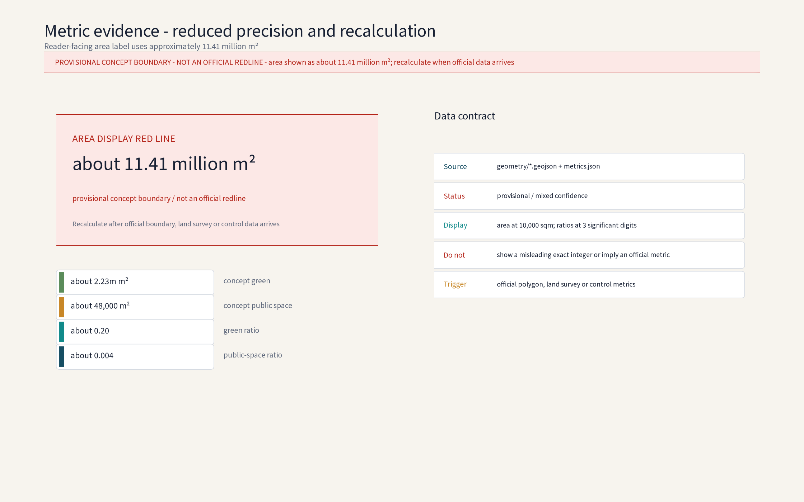

**Concept name and overall idea: ChainScape Valley (with the Chinese gloss "链驰谷")**

"Chain" refers to full-stack AI chain innovation; "Scape" carries the century-old speed DNA of the Jingzhang Railway and the idea of acceleration; "Valley" evokes an innovation cluster. Anchored on the Zhongguancun Science City in Haidian District, the concept organizes a "foundation models - compute - data - industry applications" chain along the Jingzhang Railway Heritage Park, responding to the three positioning statements (Century Jingzhang Cultural Belt, Urban AI Life Experience Belt, AI Integration Innovation Belt) and the five functions (full-stack AI self-innovation system, world-class AI innovation ecosystem, AI+ scenario empowerment paradigm, intelligent AI vitality city, global AI-governance discourse). The three nodes form a cross-three-area concept network: L1 Chain Harbor maps to the Zhongzhiyuan AI Autonomous Innovation Acceleration Area and is the package's deepening object; L2 Star-Track maps to the Beijing AI Origin Community as an interface node; L3 Compute-Pivot maps to the Dazhongsi AI Industry Cluster as an interface node. None is a confirmed site. The name family "ChainScape Valley" and the three node names are internal working codenames; no formal trademark search has been completed; brand prior-rights and reuse boundary are recorded in `report/copyright_statement.md`. All areas follow official text-based figures; geometry follows organizer publications; implementation advice is for professional teams to deepen.

## Design Basis and Source List

The listed plans and surveys are a concept working-reference list, not data already acquired by this package; all data actually used is recorded in `sources.json`, and gaps are declared honestly in the risk and missing-data section. Per-asset rights and reuse boundaries for figures, PDFs, the logo and self-generated geometry are registered in `report/copyright_statement.md` and `report/copyright_statement.md`; all HTML previews embed the license-clear open font Noto Sans SC (OFL) as a subsetted data URI.

Basis: (1) public announcement and taskbook - three positioning statements, five functions, three-tier scope, three zones/two wings and official text-based areas; (2) public Beijing and Haidian planning documents on Zhongguancun Science City and the Jingzhang Railway Heritage Park (conceptual citation, not a statutory basis); (3) Jingzhang railway history, heritage-park public material and concept-level field notes; (4) no official boundary polygon is published; all geometry here is provisional, and this proposal invents no precise coordinates or areas. Source list: taskbook, official area text, public maps, heritage-park image atlas, field notes and interview memos (concept level); exact versions follow organizer requirements. The five global benchmark cases are registered per case in `sources.json` `DATA-SRC-CASE-*` entries, each with publisher, URL, accessed date, transferability boundary and review status; case facts are now verified against project-specific pages; unstated publication dates are marked as not stated, and scale, partnerships and institutional conditions are not transferred.

> **Evidence anchor**: The five global cases are cited in the comparison table and `sources.json` using project-specific facts only; no partnership or official endorsement is implied.

## Three-Level Scope Framework

Deliverables cascade across three tiers: the coordinated research output constrains the overall design, which in turn calibrates land-use compatibility, building scale and infrastructure interfaces before detailed node design; every tier keeps machine-readable evidence anchors to its taskbook chapter.

All three scopes follow official text figures: coordinated research area 43.6 km² (industry and future-city research); overall design area 11.4 km² (urban renewal and regulatory-plan-level urban design at concept depth, non-statutory); key areas 368.4 ha in total. This package deepens the Zhongzhiyuan AI Autonomous Innovation Accelerator (~192 ha) within the key areas. The node network is intentionally cross-area: L1 is the Zhongzhiyuan deepening object, while L2 and L3 are interface concept nodes for the Beijing AI Origin Community and the Dazhongsi AI Industry Cluster; the three nodes are not all inside Zhongzhiyuan and none is a confirmed site. Recalculation awaits official boundary publication.

Regional coordination (concept): five interfaces - Beiwai Community (data-element and scenario-testing synergy on a shared anonymized-aggregate data base), Future Science City (foundation-model research interface, joint labs), Huairou Science City (compute and research-instrument sharing, compute vouchers), Economic-Technological Development Area (pilot-line scaling and manufacturing conversion), and the Jing-Jin-Ji region (talent and supply-chain gradient, joint roadshows). Resource exchange runs through compute-voucher interchange, scenario-announcement filing and annual joint roadshows; the project path is a four-stage relay: joint lab, public evaluation, open pilot line, industrial landing (concept).

> **Evidence anchor**: `[source:DATA-SRC-AGENT-TASKBOOK]`, `[source:DATA-SRC-PROVISIONAL-BOUNDARIES]`, `[data:PACKAGE-GEOMETRY]`.

## Coordinated Research Area: Industry and Future City Research

The industry study identifies synergies between the acceleration area and the full-stack AI self-innovation system, forming a "chain innovation + acceleration" future-city hypothesis; future-city research is directional only and makes no commitment on land or investment.

The 43.6 km² area runs north-south along the heritage park, linking real nodes such as Qinghe, Shangdi/Zhongguancun Software Park, Zhichunlu, Zhongguancun Avenue and Xueyuanlu in a "transit hub - software cluster - innovation source" gradient. Concept: the existing software-internet cluster evolves toward the full AI stack, strengthening foundation models, compute, data and industry applications; the future-city concept makes AI-governance global discourse the main thread through scenario pilots, a data-compliance sandbox and multi-party consultation (concept), while shaping the Urban AI Life Experience Belt and the century culture belt narrative. The industry synergy lists five measurable indicator names: (1) full-stack chain coverage (resident firms across the four rings); (2) joint-lab count; (3) cross-region compute-voucher mutual-recognition coverage; (4) open pilot conversion rate; (5) annual roadshow and scenario-filing count (names only; values computed after the operations baseline). No baseline is set in the concept stage.

> **Evidence anchor**: `[source:DATA-SRC-PROVISIONAL-BOUNDARIES]`, `[source:DATA-SRC-OFFICIAL-ANNOUNCEMENT]`, `[source:DATA-SRC-AGENT-TASKBOOK]`.

## Overall Design Area: Urban Renewal and Regulatory-Plan-Level Urban Design

The overall design emphasizes retain-led renewal and selective excellence: low-efficiency offices convert toward R&D and incubation under a retain-renovate-renew classification; regulatory-plan indicators are only checked as suggestions, never preset numerically.

The 11.4 km² area is renewal-led at concept depth, non-statutory: mixed and flexible land use, block scale and height boundaries, heritage-park interface and street vitality, skyline and view corridors. The acceleration area connects the Zhongguancun Technology Service Wing (global factor allocation, Zhongguancun IP and capital empowerment) and the Xiaoyuehe Scenario Empowerment Wing in an "innovation acceleration - service empowerment" loop. Design-guideline items are concept suggestions: interface continuity, ground-floor experiment and public functions, accessible public space, full barrier-free coverage, character element library.

### Spatial, operation, public-interest and approval boundaries (concept, non-engineering)

The following three mappings are for professional deepening only; they are not engineering designs, statutory redlines or approval conclusions. No new precise area is published before an official polygon is released.

| Concept | Spatial type, study area and area convention | Operator and mechanism | Public-interest boundary | Prerequisites and stop conditions |
| --- | --- | --- | --- | --- |
| East-west stitching | A crosswise slow-traffic green corridor, shared-lab promenade and public-node network; the interface between the Zhongzhiyuan AI Acceleration Area and Beijing AI Origin Community; no added area value, to be recalculated from official boundary and existing-survey polygons | Street office, park platform, property/community representatives; modular components, time-slot booking and human-service fallback | Free continuous passage, no walls or toll gates; all-age, all-time and barrier-free; pilots cannot displace residents’ passage, rest or offline alternatives | Verify official boundary, ownership, road/green/public-space, fire, utility and traffic conditions; stop the pilot, remove modules and restore the site if ownership conflicts, traffic/fire review fails, accessibility remains defective or complaints concentrate |
| North-south continuity | Heritage-park cultural wayfinding, slow-traffic vitality spine and culture/innovation public nodes; the north-south interface of the Jingzhang Heritage Park and its links to the three nodes; no corridor area published until heritage/rail-protection and survey data are available | Street office, heritage-park operator, park platform and cultural-content reviewer; segment-by-segment opening, registered wayfinding and human patrol | Preserve heritage legibility and public access; no obstruction of heritage interfaces or commercial occupation of the continuous route; large type, captions, human and offline alternatives | Verify heritage, rail-protection, traffic, fire, night-lighting and advertising conditions; pause the segment and remove additions if protection conflicts, wayfinding misleads, night safety fails or accessibility is not met |
| Dazhongsi smart-native consumption and business scene | A conceptual 1 km-radius study area around the station; station-city interface, public ground floors, bookable business-collaboration space and merchant pilots; no official area calculated from this radius | Street-company-merchant tri-party liaison with transport/park operators; small-area, short-cycle pilot and public evaluation before expansion | Retain public ground floors and offline human service; no individual identification or behavior profiles, no algorithmic exclusion of low-digital-literacy users; merchants cannot turn public service into forced consumption | Verify station-city integration, traffic, merchant/fire, advertising, data-compliance and accessibility conditions; stop and delete scene data if tracking, price/service discrimination, concentrated complaints, out-of-scope data use or missing human fallback occurs |

Two concept stitching axes (concept, non-engineering) therefore have explicit area conventions, operators, public-access boundaries and go/no-go gates rather than implied construction commitments. The Dazhongsi pilot follows the same scenario-card governance loop.

> **Evidence anchor**: `[source:DATA-SRC-MOHURD-CONTROL-DETAILED-PLANNING]`, `[source:DATA-SRC-PROVISIONAL-BOUNDARIES]`, `[source:DATA-SRC-MOHURD-URBAN-DESIGN-MEASURES]`.

## Detailed Design of Key Areas

The three nodes are a cross-three-area interface concept network rather than three confirmed sites inside Zhongzhiyuan: L1 maps to the Zhongzhiyuan AI Autonomous Innovation Acceleration Area and is the package's deepening object; L2 maps to the Beijing AI Origin Community; L3 maps to the Dazhongsi AI Industry Cluster. L2 and L3 are represented as coordination interfaces only. All node locations remain conceptual and subject to official-boundary, ownership and professional review before relocation; the "flagship - co-creation - foundation" chain forms the spatial narrative, with detailed plans and sections in the drawings and geometry layers.

Key areas total 368.4 ha (official text figure) including three zones and two wings. This package deepens the Zhongzhiyuan AI Acceleration Area (~192 ha) with a "one belt, two chains, three nodes" concept: the heritage-park vitality belt; the main chain along the belt and crosswise sub-chains. The three original concept nodes are distributed across the three areas: 1 Chain Harbor Full-Stack Flagship Park (L1), the Zhongzhiyuan deepening object for foundation models, compute, data, industry applications, acceleration and incubation; 2 Star-Track Co-creation Community (L2), an interface concept node for the Beijing AI Origin Community; 3 Compute-Pivot Chain Station (L3), an interface concept node for the Dazhongsi AI Industry Cluster with green dispatch, open pilot lines and public evaluation. Nodes are connected by slow-traffic chains, a shared-lab network and a shuttle loop; L2 and L3 do not indicate official siting or a construction commitment.

| Node (scenario ID) | Function | Operation mechanism | Human review points |
| --- | --- | --- | --- |
| Chain Harbor Flagship Park (L1) | Chain layout of foundation models, compute, data, applications; acceleration | "Zhongzhiyuan Acceleration Covenant" admission, mentor pairing, compute-point interchange | Admission, stage reviews, graduation attestation |
| Star-Track Community (L2) | Youth housing, co-working workshops, community spaces, AI training | Booking and rotation of workstations, volunteer pairing, community deliberation | Housing review, training certification |
| Compute-Pivot Chain Station (L3) | Green dispatch, open pilot lines, public evaluation, data sandbox | Evaluation booking, published results, algorithm filing support | Sample checks, conclusion sign-off |

### Brand identity and visual system (concept)

Name family: "ChainScape Valley" as the master brand; "Chain Harbor - Star-Track - Compute-Pivot" as an extensible node family; event sub-brands (Opening Season, Roadshow Week, Hackathon Month, Young Scientist Forum, Chain-Developer Day) share one word-root system. Logo direction: three converging chains forming an acceleration arrow (see figure), meaning the four rings (models, compute, data, applications) converge into an accelerator; symbol rule: "one belt, two wings, three nodes" glyph set, no standalone use of the master mark by a single node. Color system: deep-sea blue (flagship), star-track teal (co-creation), amber gold (compute pivot), with off-white base and dark-grey type; type system: Noto Sans SC for Chinese and Noto Sans for Latin, two type scales; wayfinding hierarchy H1-H4: district entry, node cluster, building/unit, barrier-free and emergency information.

### Honor display system (concept)

Each node hosts a "Honor Star-Track Board": the flagship park entry has an annual chain-innovation enterprise digital plaque, the community has a young-scientist honor wall (results reviewed and published by the "AI Governance Deliberation Hall"), and the compute-pivot station has an evaluation-certification display of products that passed public evaluation. Honors are filed, published and human-reviewed; no auto-generated honors; rewards are disclosed annually (concept).

> **Evidence anchor**: `[data:PACKAGE-GEOMETRY]`, `[data:PACKAGE-ASSETS]`, `[source:DATA-SRC-AGENT-TASKBOOK]`.

## AI Innovation Ecosystem, Personas, and AI+ Scenarios

Full-stack chain layout (concept): foundation-model R&D, green compute dispatch, data-element governance and opening, and industry-application acceleration as four interlocking rings, plus public evaluation, pilot lines and compliance-filing support; five services - acceleration, evaluation, investment match, conversion, training - form the daily operating skeleton across industry, space, public service, culture and governance (see ecosystem map). Personas (concept): five persona groups - young scientist founders, platform engineers, data analysts, open-source contributors, campus interns - plus inclusive design for existing residents, elderly users, children and families, persons with disabilities, visitors and users with low digital skills. AI+ scenarios (concept): twelve scenario cards covering traffic, industry, space, public services, culture and governance; all data anonymized and aggregated with human review; no individual tracking. AI technical protocols (concept): public evaluation runs model benchmarks and data-quality checks; operations run error stratification and false-positive monitoring, runtime monitoring and human takeover; new scenarios are tested before scaling.

Operation mechanisms (concept): shared lab workstations and pilot-line machine time run under "rotation-sharing of pilot-line workstations" with booking and rotation; expo and market spaces rotate; young scientists and founders pair with volunteer mentors; the deliberation hall receives resident opinions and replies publicly. AI governance three sentences (concept): only anonymized aggregated data is processed; key decisions always receive human review; no excessive monitoring (no individual-identifying tracking, no large-scale behavior profiling). Sensing data is edge-processed and anonymized before aggregation for service dispatch only. Scenario exits follow a "stop conditions first" rule: on sustained false-positive thresholds, concentrated public complaints or unrepaired accessibility defects, the deliberation hall decides to downgrade or withdraw; operational data is destroyed per published retention periods.

### 12 AI+ scenario cards (full fields)

Each scenario card has ten fields: location / target population / operation mechanism / input data / model capability / spatial facility / operation responsibility / failure fallback / evaluation indicator (concept name) / exit condition. Three cards are industry test scenarios (T1/T2/T3).

| # | Scenario card (location -> target population) | Operation mechanism | Input data | Model capability | Spatial facility | Operation responsibility | Failure fallback | Evaluation indicator (concept name) | Exit condition |
| --- | --- | --- | --- | --- | --- | --- | --- | --- | --- |
| S1 | Smart R&D collaboration and shared labs -> flagship incubation units (research teams / platform engineers) | Workstation booking, compute-point machine time | Booking records, lab data (de-identified) | Code completion, collaborative training | Shared lab benches, modular machine room | Operator + mentor | On-site duty + human takeover | Shared-lab booking rate, lab accident rate | Stop on unfixed safety defects |
| S2 | Model training and compute dispatch -> Compute-Pivot green dispatch center (platforms / enterprises) | Compute vouchers, published schedules | Training queue, power meters | Heterogeneous dispatch, energy optimization | Green compute modules, heat-recovery interface | Compute provider + operator | Offline training + human approval | Compute-schedule disclosure rate, energy disclosure rate | Stop dispatch on concentrated complaints |
| S3-T1 | Public evaluation and benchmarks (industry test protocol T1) -> Compute-Pivot evaluation area (enterprises / universities) | Evaluation booking, published results, algorithm filing | Candidate model (de-identified), benchmark set | Task evaluation, adversarial robustness | Evaluation cabinets, report room | Evaluation committee | Human spot-check + re-test | Spot-check consistency rate, error-stratification indicator | Withdraw after two consecutive fails |
| S4 | Data-element sandbox -> Compute-Pivot sandbox (enterprises / research) | Sandbox admission filing, disclosed purpose/term | De-identified samples, query logs | Privacy computing, differential privacy | Sandbox bench, compliance ledger | Data compliance officer + operator | Data destruction + human review | Sandbox compliance pass rate, destruction-record completeness | Suspend on unfixed defects |
| S5 | AI expo and roadshow center -> Flagship roadshow building (founders / investors) | Roadshow booking, point discounts | Project materials (de-identified) | Project summary, risk notes | Roadshow hall, negotiation area | Operator + venture capital | On-site rebooking + human match | Roadshow match count, disclosure compliance rate | Re-schedule on concentrated complaints |
| S6 | Logistics sorting and drone delivery -> Sorting nodes along the belt (logistics / residents) | Off-peak rotation, permit-front-loaded flights | Logistics orders (de-identified), route permits | Path planning, obstacle avoidance | Sorting shed, takeoff buffer | Logistics + sub-district | Pause route + human handling | Delivery anomaly rate, safety record rate | Stop on substandard safety |
| S7-T2 | Barrier-free accompaniment (industry test protocol T2) -> Whole campus network (elderly / disabled / low digital skills) | Volunteer pairing, human fallback | Help records (de-identified) | Voice guidance, captions | Accessible ramps, volunteer post | Sub-district + volunteers | On-site duty + phone fallback | Barrier-free coverage rate, complaint response rate | Downgrade on unfixed defects |
| S8 | Crowd-flow sensing dispatch -> Nodes and shuttle stops (operator / visitors) | Area-level anonymized aggregation, annual disclosure | Camera streams (edge processed) | Area counting, anomaly detection | Camera mounts, dispatch screen | Operator + property | Downgrade + human patrol | Aggregation-scope disclosure rate, alert-threshold accuracy | Stop on concentrated complaints |
| S9 | Campus shuttle and autonomous buses -> Shuttle loop (commuters / visitors) | Booking rides, human fallback | Booking records, vehicle status | Path planning, obstacle avoidance | Shuttle loop, waiting shelter | Operator + transport authority | Pause route + human duty | Slow-traffic and shuttle share, accident rate | Stop line on substandard safety |
| S10 | AI training and talent station -> Star-Track training workshops (students / career switchers) | Volunteer booking, mentor pairing | Course records (de-identified) | Learning recommendation, Q&A | Training room, shared dorm | University + operator | On-site tutoring + human Q&A | Training certification count, subsidy record accuracy | Rectify on concentrated complaints |
| S11-T3 | Cultural guide and century timeline (industry test protocol T3) -> Heritage-park culture nodes (visitors / residents) | Filed and published content, feedback channel | Exhibit text (after review) | Smart narration, cross-language | Wayfinding columns, interactive screens | Sub-district + volunteers | On-site correction + human guide | Correction response rate, content review pass rate | Take down on concentrated complaints |
| S12 | Community deliberation and resident services -> Star-Track deliberation space (residents / owners) | Resident deliberation, opinion channel, annual disclosure | Agenda records (de-identified) | Topic clustering, summarization | Deliberation hall, bulletin board | Sub-district + resident reps | On-site reception + timed reply | Agenda reply rate, annual disclosure rate | Rectify on overdue replies |

### Three industry test protocols

| Protocol | Purpose | Indicator (concept name) | Threshold (concept name, baseline pending) | Exit condition |
| --- | --- | --- | --- | --- |
| T1 model evaluation | Public benchmark of resident models | Error-stratification indicator, decision-explainability score | Error rate <= concept baseline, robustness >= concept baseline | Withdraw after two consecutive fails |
| T2 barrier-free accompaniment test | Verify all-age / barrier-free / age-friendly / child-friendly | Barrier-free coverage rate, complaint response rate | Coverage >= concept baseline, response = 100% | Downgrade or withdraw on unfixed defects |
| T3 long-term drift monitoring | Monitor long-term model drift and public feedback | Long-term drift indicator, content-correction rate | Drift <= concept baseline, correction rate >= concept baseline | Downgrade or withdraw on threshold breach |

### Scenario data governance checklist

| Scenario class | Data flow | Privacy boundary | Accessibility | Complaints and correction | Specialist review |
| --- | --- | --- | --- | --- | --- |
| Sensing (crowd / shuttle) | Edge processing, anonymized aggregation, dispatch | No identification, no profiling | Offline counters and phone fallback | Deliberation hall replies within term | Data sandbox + annual disclosure |
| Interactive (labs / training) | Booking records to aggregate | Limited retention, no cross-scenario use | Volunteer assistance for low digital skills | Open reply channel | Operations baseline + human review |
| Content (evaluation / roadshow / culture) | Content and reviews to filing | Anonymized reviews, no biometric collection | Subtitles, sign language, large print | Correction channel and removal | Content review and filing support |

### Six-step scenario opening process (concept)

(1) Demand release: real-world scenario demand lists published quarterly (concept, not enterprise RFP); (2) Respond: enterprises or teams respond and submit compliance commitments; (3) Sandbox: validate in the data-compliance sandbox; (4) Evaluate: pass public evaluation and benchmark tests; (5) File: complete algorithm filing under the Generative AI Interim Measures and industry norms; (6) Scale: enter daily operation per the RACI responsibility matrix after filing (all concept mechanisms).

> **Evidence anchor**: `[source:DATA-SRC-GENERATIVE-AI-INTERIM-MEASURES]`, `[source:DATA-SRC-BARRIER-FREE-ENVIRONMENT-LAW]`, `[source:DATA-SRC-AGENT-TASKBOOK]`, `[data:PACKAGE-ASSETS]`.

## Land Use, Building Scale, and Retain-Renovate-Demolish Strategy

Retain-renovate-demolish follows the retain-first ordering: structurally sound buildings and heritage elements are retained; low-efficiency offices and old buildings are renovated; new construction is concentrated in three "accents" - the flagship park gateway, pilot facilities and the expo-roadshow building - strictly controlled in scale; all areas are concept-level and recomputed when official data is published.

Concept scope: retain-led renewal with selective new construction; existing buildings convert to R&D/incubation; shared labs and flexible offices are inserted as bookable spaces; the Star-Track community clusters youth housing, workshops and community spaces. Retain-renovate-demolish is given only as concept ranges (roughly 60-70% retain, 10-20% renovate, 10-20% demolish, pending measured assessment), never as a commitment; FAR and heights are not preset and await official boundaries. Land-use shares are concept aggregate ranges (directional, not precise): R&D land first, green and blue space second, youth housing and community support alongside; the aggregation rule and recompute triggers are in the metrics section.

| Retain/renovate/demolish type | Concept range (directional) | Operation suggestion | Public-interest boundary |
| --- | --- | --- | --- |
| Retain | ~60-70% | Retain structurally sound buildings and heritage elements | All-age access, continuous cultural thread |
| Renovate | ~10-20% | Convert low-efficiency offices and old buildings to R&D/incubation | Temporary alternative space during renovation |
| Demolish | ~10-20% | Only case-by-case justified buildings | Heritage assessment and disclosure before demolition |
| New construction | three "accents" | Flagship gateway, pilot facilities, expo-roadshow building | Strict scale control, reversible, modular |

> **Evidence anchor**: `[source:DATA-SRC-MNR-LAND-USE-CLASSIFICATION-202311]`, `[source:DATA-SRC-MOHURD-CONTROL-DETAILED-PLANNING]`.

## Transport, Rail, Municipal Infrastructure, and Public Services

Connections center on rail stations plus a campus loop with autonomous buses and on-demand minibuses as concept carriers, slow traffic first; municipal works reserve green-compute supply and heat-recovery interfaces; public services follow a "shared lab network + youth housing + childcare" package; every AI decision has human review.

Transport concept: "rail + campus shuttle" around Qinghe, Zhichunlu and Dazhongsi stations (per public line information); rail protection zones and station-city control conditions are unpublished, so setbacks and cross-sections are not preset; freight uses sorting points and compliant low-altitude route research, with permits and approvals pending official review. Parking is a "shared, off-peak-open" direction, no space counts committed. Municipal concept: green-compute supply, heat recovery and green-power trading research, corridor intensification; existing municipal capacity and energy loads are unverified, so no engineering feasibility conclusions are made. Public services: shared lab network, expo-roadshow center, youth apartments, childcare, barrier-free systems (age-friendly and child-friendly), an AI governance dialogue space and offline human fallback channels. All locations require professional verification against official boundaries and measured utility lines; this proposal only provides a needs list and layout logic (concept). Monthly schedule (concept): shuttle lines, shared labs, cultural guides and AI training are published monthly. Equipment update and withdrawal mechanism (concept): sensing equipment (crowd / shuttle) is withdrawn annually per disclosure, with site restoration; reversible component library registers assemble-use-withdraw states. Failure-exit mechanism (concept): on sustained false-positive thresholds, concentrated complaints or unrepaired accessibility defects, the deliberation hall decides to downgrade or withdraw. Continuous maintenance model (concept): the operator runs annual update + quarterly review + monthly schedule, and reports every six months to the deliberation hall.

> **Evidence anchor**: `[source:DATA-SRC-MOHURD-URBAN-DESIGN-MEASURES]`, `[source:DATA-SRC-PROVISIONAL-BOUNDARIES]`, `[source:DATA-SRC-BARRIER-FREE-ENVIRONMENT-LAW]`.

## Blue-Green Network, Public Space, and Urban Character

The heritage park green spine plus the Xiaoyuehe green corridor integrates blue-green space; platform memories, sleeper paving and a century timeline shape the cultural thread; facilities are modular and reversible; the character guideline blends industrial-heritage vocabulary with light AI-era interfaces.

The Jingzhang Railway Heritage Park is the green spine through the three nodes and two wings; the Xiaoyuehe corridor echoes the scenario-empowerment wing. Low-cost concept devices - platform memories, sleeper paving, the century timeline - build a recognizable spatial culture system: cultural wayfinding uses a "sleeper symbol + station number + century timeline" motif, sharing color and type rules with the brand system, with bilingual signs for international visitors. Character: railway industrial-heritage vocabulary (trusses, signals, sleeper elements) coexists with light AI-era architecture; streets favor shaded slow traffic, section redesign and continuous accessibility; public spaces are activated by AI expos, weekend markets and youth co-creation (all concept).

### Reversible public-space component library (concept)

Standardized plug-and-play units, all modular, reversible and light-touch: shade canopies, movable market units, temporary stages, modular seating and planters, demountable accessible ramps, mobile charging and information columns, temporary signage. Components register in a "assemble - use - withdraw" state machine; the site returns to its original state after withdrawal; no permanent large structures; the component list and assembly rules are deepened by professional teams, piloted before rollout (concept).

### Cultural narrative, wayfinding and international communication (concept)

International communication uses "century-old Jingzhang x AI acceleration" as the core narrative, with short copy for global audiences: "Where a century-old railway learns to run at the speed of intelligence", and cross-cultural glosses: "chain innovation" as "a chain of innovation - models, compute, data, applications"; "acceleration" as "accelerate from idea to industry". English short copy, bilingual wayfinding and global case benchmarking form the international communication set (concept).

> **Evidence anchor**: `[source:DATA-SRC-MOHURD-URBAN-DESIGN-MEASURES]`, `[source:DATA-SRC-OFFICIAL-ANNOUNCEMENT]`.

## Renewal Projects, Implementation Policy, and Phasing

The three-phase project list (near 1-3 / mid 3-5 / far 5-10 years) is conceptual; scale and investment estimates are advisory; policy suggestions (flexible mixed use, renewal rewards, rent gradients) are not government or operator commitments.

### Implementation and long-term operation matrix (RACI + KPI baseline method)

The table below gives a concept-level RACI responsibility matrix (R=Responsible / A=Accountable / C=Consulted / I=Informed), with three stage gates (heritage / planning / operation) per item and KPI baseline generation methods (values set by the operations baseline, no numbers preset).

| Project | Phase | Actors | Heritage gate | Planning gate | Operation gate | Pilot scope | Cost tier | KPI (concept name) | KPI baseline method | Human takeover | Stop conditions | Public feedback | Conversion path |
| --- | --- | --- | --- | --- | --- | --- | --- | --- | --- | --- | --- | --- | --- |
| Flagship park gateway | Near 1-3y | Gov A, Enterprise R, Univ C, Residents I | Heritage initial review | Land-use compatibility | Operations baseline | Gateway | High | Accelerator graduations and conversion matches | 12-month post-launch baseline | Admission and graduation review | Stop on low conversion | Opinion meetings + annual disclosure | Graduates to campus buildings and industry funds |
| Star-Track community | Near 1-3y | Gov A, Operator R, Sub-district C, Residents I | Heritage initial review | Residential renewal | Operations baseline | Pilot clusters | Medium | Youth occupancy rate, training certifications | 6-month post-launch baseline | Housing review | Adjust uses on sustained vacancy | Deliberation + opinion channel | Trainees to resident teams and mentors |
| Compute-Pivot station | Mid 3-5y | Enterprise A, Univ R, Operator C, Gov I | Heritage assessment | Power review | Operations baseline | Station first | High | Public evaluations and pilot completions | 12-month post-launch baseline | Human sign-off of results | Stop testing on concentrated complaints | Published results and filings | Pilots to E-Town scaling |
| Shared lab network | Near 1-3y | Univ A, Enterprise R, Operator C, Residents I | Lab safety | Fire approval | Operations baseline | Flagship + Star-Track | Medium | Shared-lab booking rate | 3-month post-launch baseline | Human lab admission | Stop use on unfixed safety defects | Booking and fix disclosure | University results to open pilot lines |
| Shuttle loop and autonomous buses | Mid 3-5y | Operator A, Transport R, Sub-district C, Residents I | Shuttle approval | Low-altitude permit | Operations baseline | Pilot loop | High | Slow-traffic and shuttle share | 6-month post-launch baseline | Human dispatch takeover | Stop line on safety records | Annual disclosure + complaints | Data providers and operators nurtured |
| Resident deliberation and annual disclosure | All phases | Sub-district A, Residents R, Operator C, Gov I | - | Open mechanism | Resident supervision | All nodes | Low | Agenda reply rate, disclosure coverage | 3-month post-launch baseline | Timed reply | Rectify on overdue replies | On-site + online channel | Topic closed loop |
| International recruitment and developer community | Far 5-10y | Operator A, Gov R, Platform C, Residents I | Foreign-event filing | Cross-border data review | Operations baseline | Roadshow + developer day | Low | International roadshows, developer registrations | 12-month post-launch baseline | Human recruitment review | Suspend on failed compliance review | Event feedback + annual disclosure | Overseas projects land via announcement-filing |

### Three-phase project list

| Phase | Concept pilot area | Actors (>=3 types) | Measurable indicator names (concept) |
| --- | --- | --- | --- |
| Near 1-3 years | Flagship gateway + Star-Track pilot clusters | Government + enterprise + university + community + operator | Accelerator graduations and conversion matches; shared-lab booking rate; youth occupancy and training certifications; resident-deliberation reply rate; annual disclosure coverage |
| Mid 3-5 years | Compute-Pivot + shared lab network + shuttle loop | Enterprise + university + transport + operator + residents | Public evaluations and pilot completions; shuttle share; barrier-free coverage rate; sensing compliance rate (full anonymized aggregation, 100% human review - concept targets); annual activity count |
| Far 5-10 years | International recruitment and developer community + mature operations | Operator + government + platform + residents + international bodies | International roadshow count; developer registrations; governance dialogue platform MAU; honor board annual disclosure rate; long-term drift disclosure rate |

### Developer community, scenario opening and recruitment conversion (concept)

Developer community: monthly "Chain-Developer Day", routine open-source co-creation and hackathons, developer points exchangeable for compute time. Scenario opening: "scenario announcement and filing" - real demand lists published in batches, enterprises respond, validate in the compliance sandbox, pass public evaluation, then file and open: a six-step loop of publish - respond - sandbox - evaluate - file - scale. International recruitment: a project pool from roadshow weeks and international short copy, compliance-reviewed by the deliberation hall before local incubation. Talent conversion: certified trainees enter the acceleration camp via volunteer pairing and mentor recommendations; enterprise conversion via graduation attestation to industry funds and space; project conversion via open pilot lines scaling into the E-Town (concept mechanisms, not commitments).

### Annual programmes (concept)

| Annual programme | Frequency | Lead | Participants | Conversion path |
| --- | --- | --- | --- | --- |
| Opening Season | Annual | Government and operator | Residents, enterprises, universities, visitors | Awareness and leads |
| Roadshow Week | Annual | Operator and venture capital | Founders, investors, universities | Investment matches and incubation |
| Hackathon Month | Annual | Operator and developer community | Developers, students, open source | Results to training and announcements |
| Young Scientist Forum | Annual | Universities and operator | Young scientists, international scholars | Joint labs and talent stations |
| Chain-Developer Day | Monthly | Operator and developer community | Developers, engineers | Points exchange and scenario response |

> **Evidence anchor**: `[source:DATA-SRC-AGENT-TASKBOOK]`, `[source:DATA-SRC-GENERATIVE-AI-INTERIM-MEASURES]`, `[source:DATA-SRC-BARRIER-FREE-ENVIRONMENT-LAW]`, `[source:DATA-SRC-OFFICIAL-ANNOUNCEMENT]`.

## Metrics, Area Recalculation, and Compliance Matrix

A three-tier goal - indicator - check concept system lives in `metrics.json`; area recalculation uses this package's provisional geometry and is fully recomputed, with a recalculation version recorded, when official data arrives.

Concept indicators: R&D/incubation space share, shared-facility accessibility, slow-traffic and shuttle share, green building and renewable share, barrier-free coverage, sensing-data compliance rate (full anonymized aggregation, 100% human review - concept targets), values recomputed after the operations baseline. Areas follow official text figures only: 43.6 km², 11.4 km², 368.4 ha, ~192 ha, ~104 ha, ~72 ha - no new precise values are published. Metric basis table: all provisional model values are displayed at reduced precision per confidence (areas rounded to ten-thousand m², ratios to 3 significant digits), with geometry source, formula, assumption, confidence level, significant digits, use limits and recompute triggers per row; a full recalculation with a version label is triggered by any of: official polygon publication, official land-use survey publication, or statutory control disclosure.

| Metric | Source/formula | Assumption | Confidence | Precision | Use limit | Recompute trigger |
| --- | --- | --- | --- | --- | --- | --- |
| Site area (~11.41 million m²) | `geometry/site_boundary.geojson` polygon area, EPSG:4548 | Provisional boundary | Medium | 10,000 m² | Display only | Official boundary published |
| Green area (~2.23 million m²) | union of `geometry/green_space.geojson` | Concept greens | Low | 10,000 m² | Display only | Official green data published |
| Public space area (~48,000 m²) | union of `geometry/public_space.geojson` | Concept node plazas | Low | 10,000 m² | Display only | Official land data published |
| Green ratio (~0.20) | green area / site area | As above | Low | 3 significant digits | Display only | Official data published |
| Public-space ratio (~0.004) | public space area / site area | As above | Low | 3 significant digits | Display only | Official data published |

The compliance matrix maps every design measure to the three positioning statements and five functions; open items are marked "to deepen".

> **Evidence anchor**: `[metric:green_ratio]`, `[metric:public_space_ratio]`, `[source:PACKAGE-GEOMETRY]`, `[source:DATA-SRC-OFFICIAL-ANNOUNCEMENT]`.

## Risk, Copyright, and Compliance

This proposal is concept-level design research and is not an administrative approval basis; ownership coordination, low-altitude and shuttle approvals and safety assessments must be completed before implementation.

Geometry risk: official boundaries are unpublished; all geometry is provisional; no precise coordinates or areas are claimed; recalculation awaits official publication. Ownership and approval risk: building ownership, rail protection zones, control conditions and municipal capacity are unpublished; any construction or connection arrangement requires statutory approval and safety assessment. Low-altitude and shuttle risk: permits and approval paths are not settled; the concept presets no conclusions. Data-governance risk: the Interim Measures for Generative AI Services apply to services providing generated content to the public in mainland China and cannot replace personal-information, data-security or transport/low-altitude review; "compliance rate" and "100% human review" here are concept targets, not verified compliance conclusions. Name risk: "ChainScape Valley" and the node names are original concept names; any resemblance to existing names is coincidental. Brand prior-rights and use boundary: no formal trademark search has been completed at concept stage; all names and marks are treated as internal working codenames, restricted from external use or registration until clearance; design rights and per-asset reuse boundaries are in `report/copyright_statement.md` and `sources.json`. Compliance: concept text, not statutory planning conclusions; no statutory indicators are preset; implementation advice is phrased as "concept suggestion, reference solution, for professional teams to deepen"; AI and data use is bounded by anonymized aggregation, human review and a ban on excessive monitoring.

> **Evidence anchor**: `[source:DATA-SRC-OFFICIAL-ANNOUNCEMENT]`, `[source:DATA-SRC-GENERATIVE-AI-INTERIM-MEASURES]`, `[source:DATA-SRC-BARRIER-FREE-ENVIRONMENT-LAW]`, `[source:DATA-SRC-MOHURD-CONTROL-DETAILED-PLANNING]`, `[source:assumptions.json:A-CONTROLS-001]`, `[data:report/copyright_statement.md]`.

## References

References follow the government's officially published versions; `sources.json` only records verifiable entries and fabricates no official data or links.

1) Public announcement and taskbook (as published by the organizer); 2) Jingzhang railway history and heritage-park public material; 3) Beijing territorial spatial plans and public Haidian planning information (cited as public overview, not a statutory basis); 4) public material on Zhongguancun Science City and Shangdi Software Park; 5) public academic literature on railway heritage conservation and urban renewal; 6) per-case sources for the five global cases, registered in `sources.json` `DATA-SRC-CASE-*` entries, each with publisher, URL, accessed date, transferability boundary and review status; facts are verified against project-specific pages; cite with attribution, while images, logos, layouts and partnerships remain outside the reuse boundary; 7) concept-level field notes and interview memos. Listed by category; exact versions, codes and citation formats follow organizer requirements.

> **Evidence anchor**: The five global cases are cited in the comparison table and `sources.json` using project-specific facts only; no partnership or official endorsement is implied.

### Five global cases - project-level comparison (mechanism insights only)

Portal homepages do not support project facts. This table uses project-specific pages only. None of the five cases implies partnership, endorsement, rights clearance or replication.

| Project (source ID) | Authoritative project page / publisher / title / publication / access | Verified facts | License / citation boundary | Non-transferable conditions | Concrete mechanism insight for this proposal |
| --- | --- | --- | --- | --- | --- |
| LaunchPad @ one-north, Singapore `[source:DATA-SRC-CASE-SINGAPORE-LAUNCHPAD-ONE-NORTH]` | [LaunchPad @ one-north](https://www.jtc.gov.sg/find-land/jtc-key-estates/launchpad); JTC Corporation; publication: Not stated; page updated 2026-03-26; accessed: 2026-08-30. | 7 blocks; 2,400+ startups; 30+ incubators/accelerators/VCs; testbedding + community/showcases | The page grants no image, logo or layout reuse right; use only attributed factual paraphrase and mechanism comparison, with no JTC endorsement implied. | Singapore land/policy, scale and governance are non-transferable | Link L1-L3 as admission-testbed-evaluation-showcase |
| Maria 01 startup campus, Helsinki `[source:DATA-SRC-CASE-HELSINKI-MARIA-01]` | [Maria 01 campus](https://maria.io/campus/); Maria 01; publication: Not stated on page; accessed 2026-08-30; accessed: 2026-08-30. | Former hospital reuse; 6 buildings; about 20,000 sqm; about 1,500 members | Cite only explicit page facts with attribution; do not reuse photos, logo, interiors or layout, and do not present Maria 01 as a partner. | Ownership, membership, Finnish ecosystem and phasing are non-transferable | Open L2 shared/event spaces first, then phase by baselines |
| F/AI at STATION F, Paris `[source:DATA-SRC-CASE-PARIS-STATION-F-AI]` | [F/AI - The New Hub for AI at STATION F](https://stationf.co/news/f-ai); STATION F; publication: 2026-02-11; accessed: 2026-08-30. | Multi-party coalition; 20 AI startups in first batch; recommendation-based selection | Use only attributed news-page facts and concept-level mechanism comparison; do not copy STATION F/F/AI brands, images, partner marks or promotional copy. | Membership, selection, market and capacity are non-transferable | Contribute test resources before evaluation and human review |
| MaRS Centre, Toronto `[source:DATA-SRC-CASE-TORONTO-MARS-CENTRE]` | [MaRS Centre](https://hubs.marsdd.com/location/mars-centre/); MaRS Innovation Hubs; publication: Not stated on page; accessed 2026-08-30; accessed: 2026-08-30. | 4 buildings + shared atrium; about 120 tenants; labs/offices/events | The page grants no photo, architectural drawing or logo reuse right; cite project facts with attribution and do not imply MaRS participation. | Institutions, tenants, capital and transport are non-transferable | Use a common interface for research, translation and heritage |
| Mila LaSalle Sovereign AI Research Hub, Montreal `[source:DATA-SRC-CASE-MONTREAL-MILA-LASALLE-AI-HUB]` | [Mila, 5C and Hypertec announce $250 million LaSalle campus and Sovereign AI Research Hub](https://mila.quebec/en/news/mila-5c-and-hypertec-announce-250-million-lasalle-campus-and-sovereign-ai-research-hub-to); Mila - Quebec AI Institute, 5C and Hypertec; publication: 2025-09-24; accessed: 2026-08-30. | Announced/planned; up to 3 MW; liquid cooling/heat recovery/lab testing direction | The announcement supports attributed factual paraphrase only; do not reuse partner logos/images or turn an announced project into a delivered project or partnership commitment. | Planning status and compute/power/finance are not this proposal's commitments | Give L3 a compute-testbed-evaluation-energy loop; values await official data |

