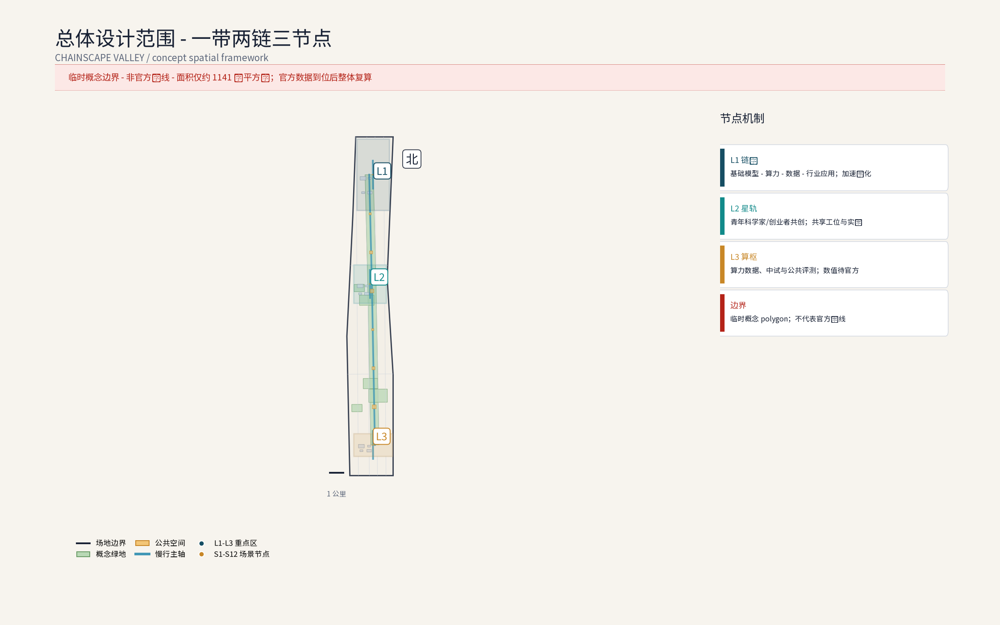
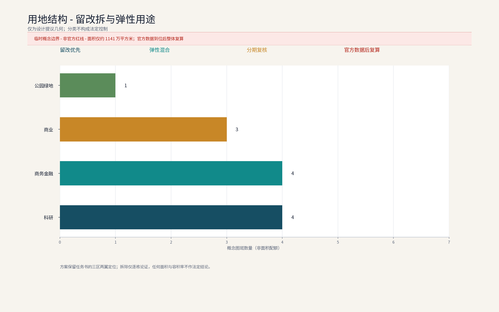
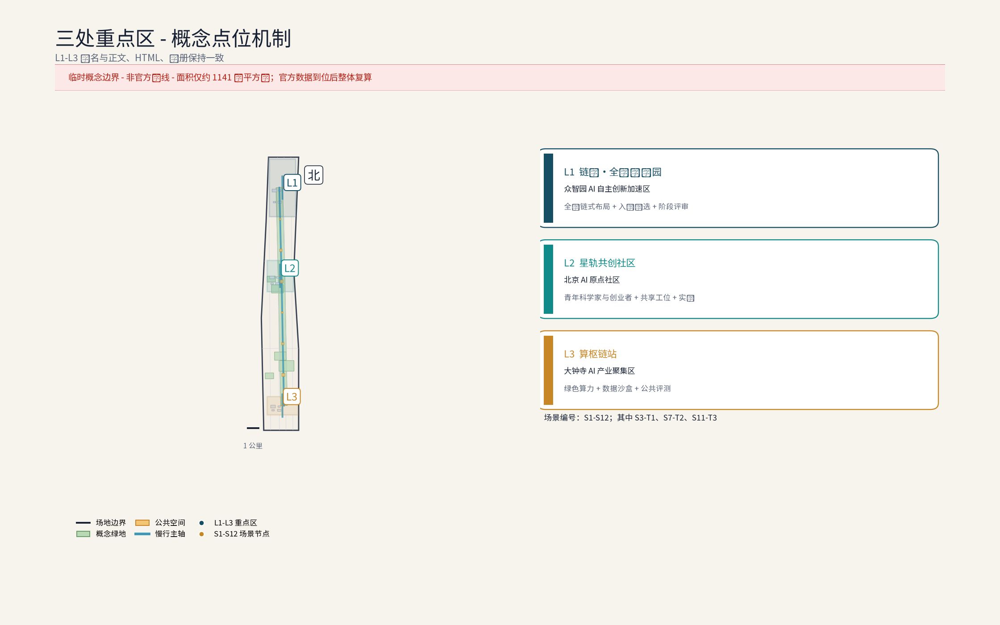
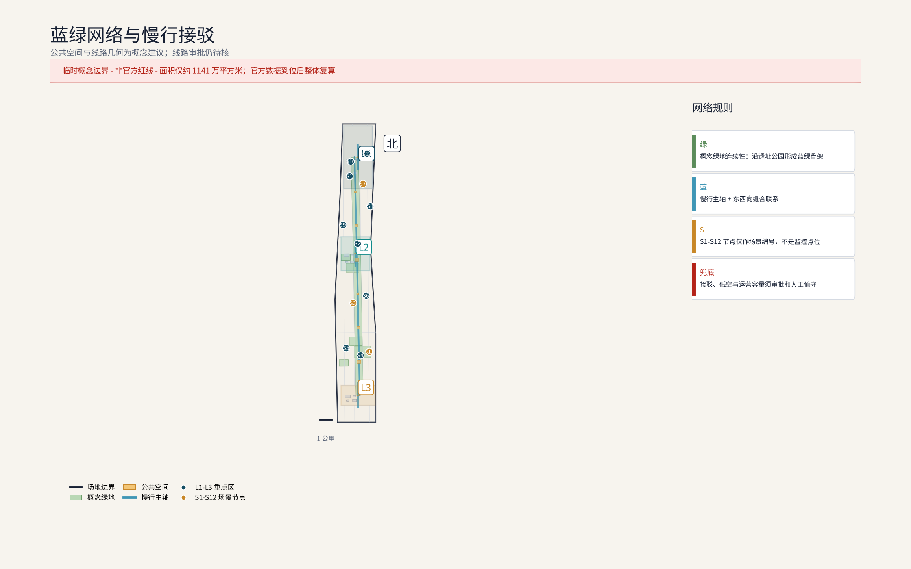
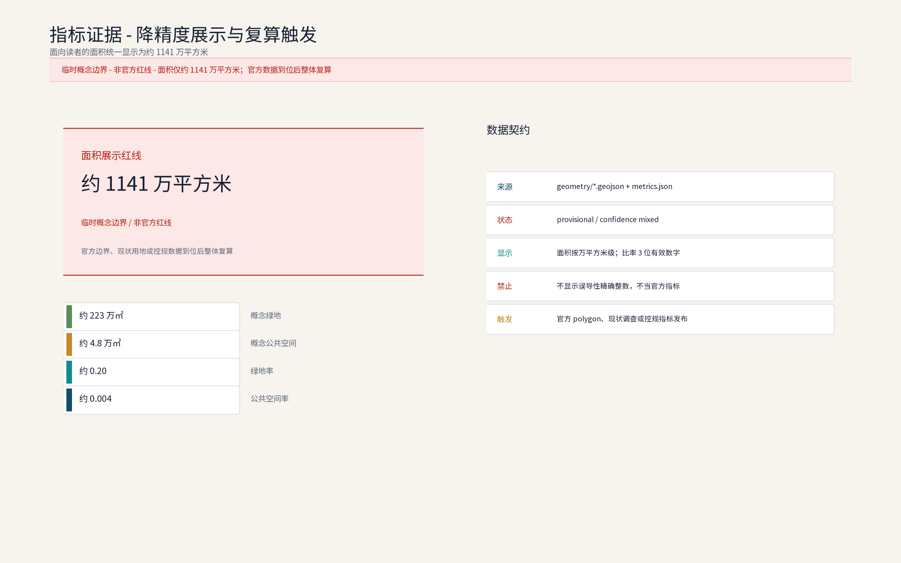

**方案名称与总体构想(概念):链驰谷 / ChainScape Valley**

"链"取AI全栈链式创新,"驰"承京张铁路百年速度基因与"加速孵化"之义,"谷"喻创新聚落。总体构想以"链式创新+加速孵化"为锚,立足海淀区中关村科学城,沿京张铁路遗址公园组织"基础模型—算力—数据—行业应用"全栈链条,呼应百年京张文化带、都市AI生活体验带、AI融合创新带三大定位,服务AI全栈自主创新体系、世界级AI创新生态、AI+场景赋能新范式、智能化AI活力城市、AI治理全球话语权五大功能,并以链港·全栈旗舰园、星轨共创社区、算枢链站构成跨众智园、北京AI原点社区、大钟寺AI产业集聚区三区的协同节点网络：L1为本包重点深化的众智园节点，L2、L3分别为北京AI原点社区与大钟寺AI产业集聚区的接口型概念节点；三者均非已确定选址。命名族"链驰谷 / ChainScape Valley"及三处节点名称(链港·全栈旗舰园 L1、星轨共创社区 L2、算枢链站 L3)均为本方案内部工作代号,未完成正式商标检索前不注册、不商业使用,品牌在先权利与复用边界登记于 `report/copyright_statement.md`。本方案为应征概念文本:面积均为官方文本口径,几何以组织方发布为准,落地建议均供专业团队深化研究。

## 设计依据与资料清单

证据索引：[source:DATA-SRC-OFFICIAL-ANNOUNCEMENT] [source:DATA-SRC-AGENT-TASKBOOK] [metric:site_area_sqm]

资料清单所列总体规划、分区规划与街区踏勘等均为概念工作依据清单,并非本包已获取的数据;本包实际使用的全部数据见 `sources.json`,未获取项已在风险与缺失数据说明中如实标注。图件、PDF、Logo 与自产几何的逐项权属与复用边界登记于 `report/copyright_statement.md`,字体使用具备明确复用授权的开源字体(Noto Sans SC,OFL 许可)并按字符使用子集化内嵌于全部 HTML 预览。

设计依据:(1)征集公告与任务书公开信息——三大定位、五大功能、三层范围与三区两翼及官方文本口径面积;(2)北京市及海淀区公开规划与工作报告中关于中关村科学城、京张铁路遗址公园的公开表述(概念引用,不作法定依据);(3)京张铁路历史文献、遗址公园公开资料与概念性现场踏勘记录;(4)组织方尚未发布官方边界多边形,现有几何均为 provisional,本方案不采用任何自拟精确坐标与面积。资料清单:任务书、官方口径面积文本、公开地图、遗址公园影像图集、踏勘记录与访谈纪要(概念层面),具体版本以组织方要求为准。补充登记:五个全球案例的来源逐项登记于 `sources.json` 的 `DATA-SRC-CASE-*` 条目,每条均含发布方、网址、访问日期、可迁移边界与复核状态,五案均已改为项目级专页核实；页面未写明的发布日期明确标为未标注，规模、合作与制度条件不迁移。

> **证据锚点**：五个全球案例均见表格与 `sources.json`，使用项目专页事实，不把案例写作本案合作或官方背书。

## 三层范围工作框架

三层成果逐级传导:统筹研究输出的全栈链式布局与加速职能判断约束总体设计,总体设计校核的用地兼容、建筑规模与基础设施接口再落实到节点详设;每层均保留与任务书对应章节的机器可读证据锚点,便于评审对照。

三层范围均为官方文本口径:统筹研究范围 43.6 平方公里,承担产业与未来城市研究;总体设计范围 11.4 平方公里,承担城市更新与控规深度城市设计(概念深度、非法定);重点区域合计 368.4 公顷,本次方案以其中众智园 AI 自主创新加速区(约 192 公顷)为深化对象,北京 AI 原点社区与大钟寺 AI 产业集聚区作跨三区协同界面研究。L1链港位于方案深化叙事的众智园对象内，L2星轨与L3算枢分别是另外两区的接口型概念节点；三节点不是全部位于众智园，也不代表已确定选址。工作框架为"宏观研判—中观设计—微观深化"递进衔接,各层输出相互校验;因官方边界未发布,面积复算与几何校核留待边界发布后由专业团队实施(参考方案)。

区域协同回路(概念):三层范围与海淀—京张沿线及京津冀创新网络建立五条协作接口——北纬社区(数据要素与场景试验协同,共享匿名聚合数据底座)、未来科学城(大科学装置与基础模型研发接口,联合实验室共建)、怀柔科学城(算力与科研仪器资源共享,算力券互认)、经开区(中试放大与制造转化接口,开放中试线联动)、京津冀(人才与产业链梯度转移与路演对接)。资源交换以「算力积分通兑」跨区兑付、「场景揭榜备案」与年度联合路演为路径,项目路径为「联合实验室—公共评测—开放中试—产业落地」四级接力(概念建议)。

> **证据锚点**:`[source:DATA-SRC-AGENT-TASKBOOK]`、`[source:DATA-SRC-PROVISIONAL-BOUNDARIES]`、`[data:PACKAGE-GEOMETRY]`。

## 统筹研究范围产业与未来城市研究

产业研究识别众智园加速区与 AI 全栈自主创新体系的协同机会,形成「链式创新+加速孵化」的未来城市形态判断;未来城市研究仅作方向性预判,不构成对用地与投资的承诺。

43.6 平方公里范围沿京张遗址公园南北展开,串联清河、上地/中关村软件园、知春路、中关村大街、学院路等真实节点,形成"轨道枢纽—软件集群—创新源"的梯度叙事:上地与软件园提供工程化与商业化成熟度,学院路与中关村大街提供基础研究与人才源。产业研究概念:既有软件互联网集群向 AI 全栈演进,补强基础模型、算力、数据与行业应用短板;未来城市研究概念:以 AI 治理全球话语权为主线,依托沿带场景试验、数据合规沙盒与多方协商机制(概念建议),同时塑造都市 AI 生活体验带与百年文化带叙事。统筹层输出的「旗舰—社区—底座」职能配置写入总体设计用地兼容校核,形成"研究—转化—服务"闭环的链式创新样本。

产业协同(概念,五项可测指标名称):(1)全栈链条覆盖度——基础模型/算力/数据/应用四环要素入驻企业数;(2)联合实验室共建数——高校与园区共建实验室数;(3)跨区算力券互认覆盖率——跨城/跨区算力券互认场景占比;(4)开放中试项目转化率——从评测合格到经开区放大的项目比例;(5)年度路演与揭榜备案数——年度路演场次与场景揭榜备案数(概念名,数值待运营基线建立后由专业团队复算)。以上指标仅作可测名登记,不替代实际基线,基线由现状调查发布后设定。

> **证据锚点**:`[source:DATA-SRC-PROVISIONAL-BOUNDARIES]`、`[source:DATA-SRC-OFFICIAL-ANNOUNCEMENT]`、`[source:DATA-SRC-AGENT-TASKBOOK]`。

## 总体设计范围城市更新与控规深度城市设计

总体设计强调存量更新与增量做精:低效办公向研发孵化转型,建立保留—改造—更新分类指引;对控规指标只做校核建议,不预设数值结论。

11.4 平方公里以存量更新为主基调,控规深度城市设计为概念参考而非法定成果,方向包括:用地混合与弹性用途、街坊尺度与高度边界、遗址公园界面与沿街活力、天际线与视廊。空间衔接上,众智园加速区联结中关村科技服务翼(要素全球化配置、中关村 IP 与资本赋能)与小月河场景赋能翼,形成"创新加速—服务赋能"回路。城市设计导则条目为概念建议:沿带界面连续度、底层实验与公共功能渗透、公共空间就近可达、无障碍全覆盖、风貌要素库等,供专业团队深化为可操作导则。

### 东西缝合、南北贯通与大钟寺场景的空间—运营边界（概念，非工程）

以下三项是可供专业团队深化的空间—运营映射，不是工程方案、法定红线或审批结论；面积不在官方 polygon 发布前新增精确值。

| 概念对象 | 空间类型、适用片区与面积口径 | 运营主体与机制 | 公共利益边界 | 审批前置与停止条件 |
| --- | --- | --- | --- | --- |
| 东西缝合 | 横向慢行绿廊 + 共享实验走廊 + 公共节点网络；适用众智园 AI 加速区—北京 AI 原点社区的接口片区；沿既有公共空间组织，不新增面积值，待官方边界和现状调查后按绿廊/公共空间 polygon 复算 | 街道、园区平台公司、产权/物业与社区联席；模块化组件、错峰预约、人工服务兜底 | 免费连续通行、无封闭围墙和收费闸口；全龄、全时、无障碍；不因试点挤出居民通行、休憩或线下替代渠道 | 前置核验官方边界、产权、道路/绿地/公共空间、消防、市政和交通组织；如产权冲突、交通/消防不通过、无障碍缺陷未修复或投诉集中，则停止试点、撤收组件并恢复原状 |
| 南北贯通 | 遗址公园文化导视 + 慢行活力脊 + 文化/创新公共节点；适用京张铁路遗址公园南北连续界面及其与三节点的连接段；不发布走廊面积，待文保/轨道保护范围与实测数据后复算 | 街道、遗址公园运营方、园区平台与文化内容审核方联席；分段开放、导视备案、人工巡查 | 保持遗址可读性和公共开放，不遮挡遗产界面、不商业化占用连续通行空间；导览提供大字、字幕、人工和线下替代 | 前置完成文保、轨道保护、交通、消防、夜间照明和广告设置核验；如保护要求冲突、导视误导、夜间安全或无障碍不达标，则暂停该段并撤回新增设施 |
| 大钟寺智能原生消费与商务场景 | 站点周边 1 km 半径的概念研究区；空间类型为站城接口、首层公共服务、可预约商务协作空间和商户试点，不据此计算官方面积 | 街道—平台公司—本地商户三方联席，交通/园区运营方参与；先小范围、短周期、公开评估，再决定是否扩展 | 保留公共首层和线下人工服务；不个体识别、不建立行为画像、不以算法排斥低数字能力用户；商户不得把公共服务变成强制消费 | 前置核验站城一体化、交通组织、商户经营/消防、广告、数据合规和无障碍条件；如个人追踪、价格/服务歧视、投诉集中、数据用途超界或人工兜底缺失，则立即停用并删除场景数据 |

> **证据锚点**:`[source:DATA-SRC-MOHURD-CONTROL-DETAILED-PLANNING]`、`[source:DATA-SRC-PROVISIONAL-BOUNDARIES]`、`[source:DATA-SRC-MOHURD-URBAN-DESIGN-MEASURES]`。

## 重点区域详细设计

三节点是跨三区的接口型概念网络而非众智园内部的三个已确定点位：L1链港对应众智园AI自主创新加速区，L2星轨对应北京AI原点社区，L3算枢对应大钟寺AI产业集聚区；本包仅对L1作重点深化，L2/L3以协同接口和概念机制表达。三节点设施选址均待官方边界、产权协调与专业审查后重新落位；节点间的「旗舰—共创—底座」链构成完整空间叙事,详细平面与剖面以图册与 geometry 层表达。

重点区域合计 368.4 公顷(官方文本口径),含三区两翼;本次深化众智园加速区(约 192 公顷),提出"一带两链三节点"概念结构:一带为遗址公园活力带,两链为沿带主链与横向支链。三处原创概念节点跨三区分布且均标注为概念点位：①链港·全栈旗舰园(L1)——对应众智园AI自主创新加速区，是本包的重点深化对象，承载基础模型、算力、数据、行业应用链式布局与加速孵化;②星轨共创社区(L2)——对应北京AI原点社区的协同接口，承担青年科学家与创业者共创社区功能;③算枢链站(L3)——对应大钟寺AI产业集聚区的协同接口，承担算力数据与开放中试基础设施功能。节点间以慢行链、共享实验室网络与接驳环线连通,形成"旗舰—社区—底座"的完整加速链路；L2/L3不表示官方选址或建设承诺。

| 节点(场景编号) | 功能 | 运营机制 | 人工复核点 |
| --- | --- | --- | --- |
| 链港·全栈旗舰园(L1) | 基础模型、算力、数据、行业应用链式布局与加速孵化 | 「中智源加速公约」入驻、导师结对辅导、算力积分通兑 | 入营筛选、阶段评审与毕业鉴证人工复核 |
| 星轨共创社区(L2) | 青年居住、共创工坊、社群空间与 AI 实训 | 工位与公寓预约轮换、志愿结对辅导、社区议事 | 入住审核与实训认证人工复核 |
| 算枢链站(L3) | 绿色算力调度、开放中试、公共评测与数据沙盒 | 评测预约排期、结果公示与算法备案辅导 | 评测样本抽验与结论签发人工复核 |

### 品牌识别与视觉系统(概念)

命名族:「链驰谷 ChainScape Valley」为总品牌,三节点构成「链港—星轨—算枢」可延展命名族,活动子品牌「开园季、路演周、黑客松月、青年科学家论坛、链创开发者日」共用同一词根体系。Logo 方向:以三链汇聚加速箭头为母题(见下图),寓意基础模型—算力—数据—行业应用四环汇入加速器;符号规则为"一轴两翼三节点"图元,禁止单节点独立使用总品牌标识。色彩系统:深海蓝(旗舰)、星轨青(共创)、琥珀金(算枢)三色,配米白底与深灰字;字体系统:中文使用思源黑体/Noto Sans SC,西文使用 Noto Sans,标题与正文两档字阶。导视层级:H1 区域入口标识—H2 节点组团导视—H3 楼栋与功能单元—H4 无障碍与应急信息四级,符号与色彩规则全园区统一。

### 荣誉展示体系(概念)

三处节点分别设置「荣誉星轨榜」——链港入口设「年度链式创新企业榜」数字铭牌,星轨社区设「青年科学家荣誉墙」(评审结果由「AI 治理议事厅」复核后公示),算枢链站设「评测认证陈列区」展示通过公共评测的产品与方案;荣誉评选坚持公示、备案与人工复核,不设自动生成荣誉,奖励兑现按年度公示(概念机制)。

> **证据锚点**:`[data:PACKAGE-GEOMETRY]`、`[data:PACKAGE-ASSETS]`、`[source:DATA-SRC-AGENT-TASKBOOK]`。

## AI 创新生态、人才画像与 AI+ 场景

全栈链式布局(概念):基础模型研发、绿色算力调度、数据要素治理与开放、行业应用加速四环相扣,附设公共评测、中试与合规备案辅导;生态组织上叠加"加速—评测—对接—转化—实训"五类服务,构成 AI 产业、空间、公共服务、文化与治理多域交织的日常骨架(见生态图谱)。人才画像(概念):五类人才画像——青年科学家与创业者、平台工程师、数据分析师、开源贡献者、在校实习生,核心诉求为共享算力、敏捷实验与社群归属;面向既有居民、长者与银龄、儿童与家庭、残障人士、游客与低数字能力用户提供全龄、无障碍、适老与儿童友好设计,包容弱势群体与园区服务人员。

运营机制(概念):共享实验工位与中试机时按「中试工位轮换共享」预约排期、轮换使用,展演与市集空间轮换运营,青年科学家与创业团队志愿结对辅导,以「AI 治理议事厅」承接居民意见并公开答复。AI 治理三句式(概念):仅处理匿名聚合数据;关键决策一律人工复核;禁止过度监控(不进行个体识别式追踪、不建立大规模行为画像)。感知数据边缘处理、匿名聚合后仅用于服务调度,不做个体识别与画像,关键服务决策设人工复核,数据用途与期限公开可查;严禁以监控为目的布设感知。场景退出遵循「停用条件先行」原则:任一场景连续触发误报率阈值、公众投诉集中或无障碍缺陷未修复时,按「AI 治理议事厅」决议降级或撤收,运营数据按公示期限销毁。

### 12 张 AI+ 场景卡(全字段)

每张场景卡含十项字段:落位 / 面向人群 / 运营机制 / 输入数据 / 模型能力 / 空间设施 / 运营责任 / 故障兜底 / 评估指标 / 退出条件。其中 3 张为产业测试场景卡(标记 T1/T2/T3)。

| # | 场景卡(落位 → 面向人群) | 运营机制 | 输入数据 | 模型能力 | 空间设施 | 运营责任 | 故障兜底 | 评估指标(概念名) | 退出条件 |
| --- | --- | --- | --- | --- | --- | --- | --- | --- | --- |
| S1 | 智能研发协作与共享实验室 → 链港加速单元(科研团队/平台工程师) | 工位预约排期+积分通兑机时 | 预约记录、实验数据(脱敏) | 代码补全、模型协同训练 | 共享实验台、模块化机房 | 运营方+导师 | 现场值班+人工接管 | 共享实验室预约率、实验事故率 | 安全缺陷未修复停用 |
| S2 | 模型训练与算力调度 → 算枢绿色算力中心(平台/企业) | 算力券预存、调度结果公示 | 训练任务队列、电表 | 异构调度、能耗优化 | 绿色算力模块、余热回收接口 | 算力服务商+运营方 | 离线训练+人工审批 | 算力调度公示率、能耗公示率 | 投诉集中停调度 |
| S3-T1 | 公共评测与基准测试(产业测试协议 T1)→ 算枢公共评测区(企业/高校) | 评测预约、结果公示、算法备案 | 待测模型(脱敏)、基准集 | 任务评测、对抗鲁棒性 | 评测机柜、报告室 | 评测委员会 | 人工抽验+复测 | 评测抽验一致率、误差分群指标 | 连续两轮不达标撤出 |
| S4 | 数据要素沙盒 → 算枢数据沙盒区(企业/研究) | 沙盒准入备案、用途期限公示 | 脱敏样本、查询日志 | 隐私计算、差分隐私 | 沙盒工位、合规台账 | 数据合规官+运营方 | 数据销毁+人工复核 | 沙盒合规通过率、销毁记录完整率 | 缺陷未修复暂停开放 |
| S5 | AI 会展路演中心 → 链港会展路演建筑(创业者/投资机构) | 路演排期预约、积分抵扣场地 | 项目材料(脱敏) | 项目摘要、风险提示 | 路演厅、洽谈区 | 运营方+创投 | 现场改约+人工撮合 | 路演对接撮合数、披露合规率 | 投诉集中改排期 |
| S6 | 物流分拣与无人机配送点 → 沿带分拣节点(物流/居民) | 分拣错峰轮换、航线许可前置 | 物流单(脱敏)、航线许可 | 路径规划、避障 | 分拣棚、起降缓冲 | 物流方+街道 | 暂停航线+人工处置 | 配送异常率、安全记录率 | 安全不达标停航 |
| S7-T2 | 无障碍伴随服务(产业测试协议 T2)→ 全园区慢行网络(长者/残障/低数字能力) | 志愿结对、人工服务兜底 | 求助记录(脱敏) | 语音引导、字幕 | 无障碍坡道、志愿岗 | 街道+志愿组织 | 人工值守+电话兜底 | 无障碍覆盖达标率、投诉响应率 | 缺陷未修复降级 |
| S8 | 客流感知调度 → 节点与接驳站点(运营方/游客) | 区域级匿名聚合、年度公示 | 摄像头流(边缘处理) | 区域计数、异常检测 | 摄像点位、调度屏 | 运营方+物业 | 降级+人工巡查 | 聚合口径公示率、告警阈值准确率 | 投诉集中停用 |
| S9 | 园区接驳与无人巴士 → 接驳环线(通勤/访客) | 预约制乘行、人工值守兜底 | 预约记录、车况 | 路径规划、避障 | 接驳环线、候车棚 | 运营方+交通部门 | 暂停线路+人工值守 | 慢行与接驳分担率、事故率 | 安全不达标停线 |
| S10 | AI 实训与人才驿站 → 星轨实训工坊(学生/转岗者) | 课程志愿预约、导师结对 | 课程记录(脱敏) | 学习推荐、答疑 | 实训教室、共享宿舍 | 高校+运营方 | 现场辅导+人工答疑 | 实训认证数、补贴记录准确率 | 投诉集中整改 |
| S11-T3 | 文化导览与百年时刻线(产业测试协议 T3)→ 遗址公园沿线(游客/居民) | 导览内容公示备案、反馈通道 | 展品说明(审核后) | 智能讲解、跨语翻译 | 导览柱、互动屏 | 街道+志愿组织 | 现场纠错+人工讲解 | 纠错响应率、内容审核通过率 | 投诉集中下架 |
| S12 | 社区议事与居民服务 → 星轨议事空间(居民/业委) | 居民议事、意见通道、年度公示 | 议题记录(脱敏) | 议题聚类、摘要 | 议事厅、公告栏 | 街道+居民代表 | 现场接待+限时答复 | 议题答复率、年度公示率 | 答复逾期整改 |

### 三个产业测试协议

| 协议编号 | 目的 | 评估指标(概念名) | 阈值(概念名,基线待建立) | 退出条件 |
| --- | --- | --- | --- | --- |
| T1 模型评测协议 | 对入驻基础模型执行公共基准测试 | 误差分群指标、决策可解释评分 | 误差率 ≤ 概念基线,鲁棒性 ≥ 概念基线 | 连续两轮不达标撤出公共评测 |
| T2 无障碍伴随测试 | 验证全龄/无障碍/适老/儿童友好 | 无障碍覆盖达标率、投诉响应率 | 覆盖率 ≥ 概念基线,响应率 = 100% | 缺陷未修复降级或撤收 |
| T3 长期漂移监测 | 监测 AI 模型长期漂移与公众反馈 | 长期漂移指标、内容纠错率 | 漂移 ≤ 概念基线,纠错率 ≥ 概念基线 | 触发阈值即降级或撤收 |

### 场景数据治理清单

| 场景分类 | 数据流 | 隐私边界 | 无障碍 | 投诉纠错 | 专项审查 |
| --- | --- | --- | --- | --- | --- |
| 感知类(客流/接驳) | 边缘处理→匿名聚合→调度 | 不个体识别、不建档画像 | 线下人工柜台与电话替代渠道 | 「AI 治理议事厅」限时答复 | 数据合规沙盒+年度公示 |
| 交互类(共享实验室/实训) | 工位与课程记录→预约聚合 | 预约记录限期留存、不跨场景使用 | 低数字能力用户配志愿帮办 | 意见通道公开答复 | 运营基线+人工复核岗 |
| 内容类(评测/路演/文化导览) | 内容与评价→公示备案 | 评价匿名化、不采集个人生物信息 | 字幕、手语与大字版内容 | 纠错通道与撤稿流程 | 内容审核与备案辅导 |

### 六步场景开放流程(概念)

(1)需求发布:按季度发布真实场景需求清单(概念级,非企业征订单);(2)揭榜:企业或团队揭榜并提交合规承诺;(3)沙盒:进入数据合规沙盒验证;(4)评测:通过公共评测与基准测试;(5)备案:按生成式 AI 暂行办法及行业规范完成算法备案辅导;(6)规模化:通过备案后按 RACI 责任矩阵进入日常运营(均为概念机制)。

> **证据锚点**:`[source:DATA-SRC-GENERATIVE-AI-INTERIM-MEASURES]`、`[source:DATA-SRC-BARRIER-FREE-ENVIRONMENT-LAW]`、`[source:DATA-SRC-AGENT-TASKBOOK]`、`[data:PACKAGE-ASSETS]`。

## 用地、建筑规模与拆改留方案

拆改留坚持留改拆排序:保留结构完好建筑与遗址文化要素,改造低效办公与旧楼宇,增量集中于旗舰园门户、中试设施与会展路演建筑三处「点睛」并严控规模;全部面积为概念口径,官方数据发布后复算。

概念口径遵循"留改为主、增量做精":存量楼宇产业置换,引导低效办公向研发孵化转型;共享实验与弹性办公改造,在楼内穿插可预订实验室与灵活工位;集群式社区营造,围绕星轨共创社区组织青年居住、共创工坊与社群空间。拆改留仅给概念区间(如留改约八成、拆约一成至两成,以实测评估为准),不构成承诺;增量集中于旗舰园门户、中试设施与会展路演建筑三处"点睛"。建筑规模与容积率不预设数值,待官方边界发布后由专业团队依规复算(参考方案)。用地占比为概念聚合口径(方向性区间,非精确值):科研与研发类用地为主、公共绿地与蓝绿空间次之、青年居住与社区配套若干,聚合规则与复算触发见"指标体系"章节,官方用地数据发布后整体复算。

| 拆改留类型 | 概念区间(方向性) | 操作建议 | 公共利益边界 |
| --- | --- | --- | --- |
| 留 | 约 60–70% | 保留结构完好建筑与遗址文化要素 | 全龄可达、文脉连续 |
| 改 | 约 10–20% | 低效办公与旧楼宇改造为研发孵化 | 改造期间设临时替代空间 |
| 拆 | 约 10–20% | 仅对经个案论证的零星建筑拆除 | 拆除前完成文保评估与公示 |
| 增量 | 三处「点睛」 | 旗舰园门户、中试设施、会展路演建筑 | 严控规模、可逆、模块化 |

> **证据锚点**:`[source:DATA-SRC-MNR-LAND-USE-CLASSIFICATION-202311]`、`[source:DATA-SRC-MOHURD-CONTROL-DETAILED-PLANNING]`。

## 交通、轨道、市政与公共服务设施

接驳组织以轨道站点+园区环线为核心,无人巴士与按需小巴为概念载体,慢行优先;市政结合绿色算力供能与余热回收预留接口;公共服务按「共享实验室网络+青年公寓+托育配套」配置,AI 决策均设人工复核。

交通概念:依托清河、知春路、大钟寺等轨道站点(以公开线路信息为准)组织"轨道+园区接驳"体系,接驳以无人巴士环线与按需小巴为主(概念),慢行优先,轨道保护区与站城一体化控制条件未公开,退距与断面不预设数值;货运依托物流分拣点与合规低空航线前置研究,低空航线许可与接驳审批未定型,须经主管部门审定。停车按"集约共享、错峰开放"预留方向,不承诺泊位数量。市政概念:绿色算力供能,余热回收与绿电交易方向研究,廊道集约化,现状市政容量与能源负荷未核实,不给出工程可行性结论。公共服务概念:共享实验室网络、会展路演中心、青年公寓与托育配套、无障碍系统(含适老与儿童友好设施)、AI 治理对话空间、线下人工替代渠道。以上设施位址均需专业团队依据官方边界与现状管线实测校核,本方案仅提供需求清单与布局逻辑(概念建议)。

月度排期(概念):接驳线路月度公示排期、共享实验室月度排期、文化导览月度排期、AI 实训月度排期,公示渠道为「AI 治理议事厅」公告栏与线上平台。设备更新与撤收复原机制(概念):感知设备(客流/接驳)按年度公示撤收,撤收后场地恢复原状;可逆组件库按"组装—使用—撤收"三态登记,撤收不新增永久构筑。失败退出机制(概念):任一场景连续触发误报率阈值、公众投诉集中或无障碍缺陷未修复时,按「AI 治理议事厅」决议降级或撤收,运营数据按公示期限销毁。持续维护模型(概念):运营方建立"年度更新+季度复盘+月度排期"三层维护,每半年向「AI 治理议事厅」报告维护结果并接受监督复核。

> **证据锚点**:`[source:DATA-SRC-MOHURD-URBAN-DESIGN-MEASURES]`、`[source:DATA-SRC-PROVISIONAL-BOUNDARIES]`、`[source:DATA-SRC-BARRIER-FREE-ENVIRONMENT-LAW]`。

## 蓝绿空间、公共空间与城市风貌

遗址公园绿色脊梁+小月河绿廊整合蓝绿空间,站台记忆、轨枕铺装与百年时刻线塑造文脉;设施以模块化、可逆设计嵌入园区,风貌导则以工业遗产语汇与轻盈 AI 界面兼容并蓄。

以京张铁路遗址公园为绿色脊梁,贯穿三处概念节点与两翼;小月河绿廊呼应场景赋能翼。沿线以"站台记忆、轨枕铺装、百年时刻线"等低成本概念手法塑造可识别文脉,形成完整的空间文化系统:文化导视以"轨枕符号+站点编号+百年时刻线"为母题,四级导视层级与品牌视觉系统共用色彩字体规则,中英双语标识覆盖国际访客。风貌上以铁路工业遗产语汇(桁架、信号灯、轨枕元素)与现代 AI 建筑的轻盈界面兼容并蓄,避免同质化;街道强调林荫慢行、断面重构与无障碍连续;公共空间运营以 AI 会展、周末市集与青年共创活动激活,使百年文化带兼具日常活力与产业仪式感(均为概念建议)。

### 可逆公共空间组件库(概念)

组件库按"标准化单元+即插即用"组织,全部设施模块化、可逆、轻介入:遮阳棚架、可移动市集单元、临时展演台、模块化座椅与种植池、可拆装无障碍坡道、移动充电与信息服务柱、临时导视牌。组件按「组装—使用—撤收」三态登记,撤收后场地恢复原状,不新增永久大体量构筑;组件清单与拼装规则由专业团队深化,先试点后推广(概念机制)。

### 文化叙事、导视系统与国际传播(概念)

国际传播以"百年京张×AI 加速"为核心叙事,提供面向全球受众的短文案:"Where a century-old railway learns to run at the speed of intelligence"(百年铁路,以智能的速度再出发),并配套跨文化解释:将"链式创新"转译为"a chain of innovation—models, compute, data, applications",将"加速孵化"转译为"accelerate from idea to industry";英文短文案、双语导视与全球案例对标共同构成国际传播三件套(概念建议)。

> **证据锚点**:`[source:DATA-SRC-MOHURD-URBAN-DESIGN-MEASURES]`、`[source:DATA-SRC-OFFICIAL-ANNOUNCEMENT]`。

## 更新项目清单、实施政策与分期计划

三阶段项目清单(近期 1-3 年/中期 3-5 年/远期 5-10 年)为概念清单,规模与投资估算均为建议性表述;政策建议(混合用地弹性、更新奖励挂钩、租金梯度)不构成政府或运营方承诺。

### 实施项目与长期运营矩阵(RACI + KPI 基线方法)

下表给出概念级 RACI 责任矩阵(R=牵头 Responsible / A=问责 Accountable / C=咨询 Consulted / I=知情 Informed),逐项含三阶段门(文保/规划/运营),并标注 KPI 基线生成方法(运营基线建立后由专业团队实测设定,概念方案不预设数值)。

| 项目 | 阶段 | 主体类型 | 文保门 | 规划门 | 运营门 | 试点范围 | 成本等级 | KPI(概念名) | KPI 基线生成方法 | 人工接管 | 停止条件 | 公众反馈 | 转化路径 |
| --- | --- | --- | --- | --- | --- | --- | --- | --- | --- | --- | --- | --- | --- |
| 链港旗舰园门户区 | 近期 1-3 年 | 政府 A、企业 R、高校 C、居民 I | 文保初评 | 用地兼容 | 运营基线 | 门户区 | 高 | 加速营毕业数、转化对接数 | 运营 12 个月后基线 | 入孵评审、毕业鉴证 | 转化率不达标停新批 | 意见现场会+年度公示 | 毕业企业对接楼宇+基金 |
| 星轨共创社区 | 近期 1-3 年 | 政府 A、运营方 R、街道 C、居民 I | 文保初评 | 居住更新 | 运营基线 | 试点组团 | 中 | 青年入住率、实训认证数 | 运营 6 个月后基线 | 入住审核 | 空置率超标调业态 | 居民议事+意见通道 | 学员转团队+导师 |
| 算枢链站 | 中期 3-5 年 | 企业 A、高校 R、运营方 C、政府 I | 文保评估 | 供电审查 | 运营基线 | 站内先行 | 高 | 公共评测数、中试完成数 | 运营 12 个月后基线 | 评测签发 | 投诉集中停测 | 结果+备案公示 | 中试对接经开区 |
| 共享实验室网络 | 近期 1-3 年 | 高校 A、企业 R、运营方 C、居民 I | 实验安全 | 改造消防 | 运营基线 | 链港+星轨 | 中 | 实验室预约率 | 运营 3 个月后基线 | 实验准入 | 安全缺陷停用 | 预约+整改公示 | 高校成果进中试线 |
| 接驳环线与无人巴士 | 中期 3-5 年 | 运营方 A、交通部门 R、街道 C、居民 I | 接驳审批 | 低空许可 | 运营基线 | 环线试点 | 高 | 慢行与接驳分担率 | 运营 6 个月后基线 | 调度异常 | 安全不达标停线 | 年度公示+投诉 | 培育数据+运营人才 |
| 居民议事与年度公示 | 全周期 | 街道 A、居民 R、运营方 C、政府 I | — | 公开机制 | 居民监督 | 全节点 | 低 | 议题答复率、公示覆盖率 | 运营 3 个月后基线 | 限时答复 | 答复逾期整改 | 现场+线上通道 | 议题闭环 |
| 国际招引与开发者社区 | 远期 5-10 年 | 运营方 A、政府 R、平台 C、居民 I | 涉外活动 | 数据出境 | 运营基线 | 路演+开发者日 | 低 | 国际路演场次、注册数 | 运营 12 个月后基线 | 招引评审 | 合规审查未过暂停 | 活动反馈+年度公示 | 海外项目落地加速 |

### 三期项目清单

| 阶段 | 概念试点区 | 参与主体(≥3 类) | 可测指标名称(概念) |
| --- | --- | --- | --- |
| 近期 1-3 年 | 链港旗舰园门户区+星轨共创社区试点组团 | 政府+企业+高校+社区+运营方 | 加速营毕业与转化对接数;共享实验室预约率;青年入住率与实训认证数;居民议事答复率;年度公示覆盖率 |
| 中期 3-5 年 | 算枢链站+共享实验室网络+接驳环线 | 企业+高校+交通部门+运营方+居民 | 公共评测数与中试完成数;接驳分担率;无障碍覆盖达标率;数据合规率(匿名聚合全覆盖、人工复核 100%);年度活动场次 |
| 远期 5-10 年 | 国际招引与开发者社区+全节点成熟运营 | 运营方+政府+平台+居民+国际机构 | 国际路演场次;开发者注册数;治理对话平台月活;荣誉星轨榜年度公示率;长期漂移指标公示率 |

### 开发者社区、场景开放与招引转化机制(概念)

开发者社区:「链创开发者日」月度机制,开源共创与黑客松常态化,配套开发者积分与成果展示墙,积分可兑算力机时;场景开放:「场景揭榜备案」六步闭环——需求发布、揭榜、沙盒、评测、备案、规模化(已在上节展开);国际招引:依托路演周与国际传播短文案建立海外项目池,经「AI 治理议事厅」合规审查后对接本地孵化;人才转化:实训认证学员经志愿结对与导师推荐进入加速营,企业转化经毕业鉴证对接产业基金与楼宇空间,项目转化经开放中试线放大并落地经开区(概念机制,不构成承诺)。

### 年度活动(概念)

| 年度活动 | 频次 | 牵头主体 | 参与人群 | 转化路径 |
| --- | --- | --- | --- | --- |
| 开园季 | 年度 | 政府与运营方 | 居民、企业、高校、游客 | 园区认知与招商线索 |
| 路演周 | 年度 | 运营方与创投 | 创业者、投资机构、高校 | 投融资对接与项目入孵 |
| 黑客松月 | 年度 | 运营方与开发者社区 | 开发者、学生、开源社区 | 开源成果转实训与揭榜 |
| 青年科学家论坛 | 年度 | 高校与运营方 | 青年科学家、国际学者 | 联合实验室与人才驿站 |
| 链创开发者日 | 月度 | 运营方与开发者社区 | 开发者、企业工程师 | 开发者积分兑换与场景揭榜 |

> **证据锚点**:`[source:DATA-SRC-AGENT-TASKBOOK]`、`[source:DATA-SRC-GENERATIVE-AI-INTERIM-MEASURES]`、`[source:DATA-SRC-BARRIER-FREE-ENVIRONMENT-LAW]`、`[source:DATA-SRC-OFFICIAL-ANNOUNCEMENT]`。

## 指标体系、面积复算与合规矩阵

目标—指标—校验三层概念指标体系进入 `metrics.json`;面积复算以本包 provisional 几何为底,官方数据到位后整体复算并标注复算版本。

概念指标体系:研发孵化空间占比、共享设施可达率、慢行与接驳分担率、绿色建筑与可再生能源占比、无障碍覆盖、感知数据合规率(匿名聚合全覆盖、人工复核 100%,均为概念目标)等,数值待运营基线建立后复算。面积复算坚持官方文本口径:统筹研究范围 43.6 平方公里、总体设计范围 11.4 平方公里、重点区域合计 368.4 公顷、众智园约 192 公顷、北京 AI 原点社区约 104 公顷、大钟寺 AI 产业集聚区约 72 公顷,全部标注官方文本口径,不发布任何新增精确数值。指标口径如下表:全部 provisional 模型值按置信度降精度展示(面积按万平方米级降精度展示、比率取 3 位有效数字),几何来源、公式、假设、置信等级、有效位数、用途限制与复算触发条件逐项列明;官方边界或官方用地数据发布后,整体复算并标注复算版本(复算触发条件:官方 polygon 发布、现状用地调查发布、控规指标公开任一事件发生即触发)。

| 指标 | 数据来源/公式 | 假设 | 置信等级 | 有效位数 | 用途限制 | 复算触发 |
| --- | --- | --- | --- | --- | --- | --- |
| 场地面积(约 1141 万平方米) | `geometry/site_boundary.geojson` 多边形面积, EPSG:4548 | provisional 边界 | 中 | 万平方米级 | 仅概念展示,不作审批依据 | 官方边界发布即复算 |
| 绿地面积(约 223 万平方米) | `geometry/green_space.geojson` 并集 | 概念绿地叠加 | 低 | 万平方米级 | 仅概念展示 | 官方绿地数据发布即复算 |
| 公共空间面积(约 4.8 万平方米) | `geometry/public_space.geojson` 并集 | 概念节点广场叠加 | 低 | 万平方米级 | 仅概念展示 | 官方用地数据发布即复算 |
| 绿地率(约 0.20) | 绿地面积/场地面积 | 同上两行 | 低 | 3 位有效数字 | 仅概念展示 | 官方数据发布即复算 |
| 公共空间率(约 0.004) | 公共空间面积/场地面积 | 同上两行 | 低 | 3 位有效数字 | 仅概念展示 | 官方数据发布即复算 |

合规矩阵将各项设计举措与三大定位、五大功能逐项对照,暂缺项标注"待深化"。

> **证据锚点**:`[metric:green_ratio]`、`[metric:public_space_ratio]`、`[source:PACKAGE-GEOMETRY]`、`[source:DATA-SRC-OFFICIAL-ANNOUNCEMENT]`。

## 风险、版权与合规说明

本方案为概念研究性设计,不构成行政审批依据;正式实施前须完成产权协调、低空航线与接驳审批校核及安全评估。

几何风险:官方边界未发布,现有几何均为 provisional,本方案不声称精确坐标与面积,复算留待官方发布后由专业团队实施。产权与审批风险:存量楼宇产权、轨道保护区、控规条件与现状市政容量均未公开,任何建设与接驳安排须依法完成审批与安全评估。低空与接驳风险:低空航线与接驳线路的许可和审批路径未定型,概念方案不预设结论。数据治理风险:《生成式人工智能服务管理暂行办法》的适用范围为向境内公众提供生成式内容的 AI 服务,不能替代个人信息保护、数据安全或交通、低空领域的具体审查,本方案所述"合规率""人工复核 100%"均为概念目标而非已验证合规结论;正式实施前须完成专项合规审查。名称风险:"链驰谷/ChainScape Valley"及三处节点名称为本次原创概念命名,如与既有名称雷同纯属巧合,不代表关联。品牌在先权利与使用边界:概念阶段未完成正式商标检索,本方案全部名称与标识按内部工作代号处理,未获得清权前不对外注册、不用于外部商业使用;设计成果权属与各图件、字体、几何的复用边界见 `report/copyright_statement.md` 与 `sources.json`。合规说明:本方案为应征概念文本,不构成法定规划结论,不预设法定指标,落地建议均以"概念建议、参考方案、可供专业团队深化研究"表述;AI 与数据应用以匿名聚合与人工复核为底线,禁止过度监控,正文与命名为原创,引用均出自公开渠道。

> **证据锚点**:`[source:DATA-SRC-OFFICIAL-ANNOUNCEMENT]`、`[source:DATA-SRC-GENERATIVE-AI-INTERIM-MEASURES]`、`[source:DATA-SRC-BARRIER-FREE-ENVIRONMENT-LAW]`、`[source:DATA-SRC-MOHURD-CONTROL-DETAILED-PLANNING]`(`assumptions.json:A-CONTROLS-001`)、`[data:report/copyright_statement.md]`。

## 参考资料

机器可读来源索引：[source:DATA-SRC-OFFICIAL-ANNOUNCEMENT] [source:DATA-SRC-AGENT-TASKBOOK] [source:DATA-SRC-CASE-SINGAPORE-LAUNCHPAD-ONE-NORTH]

参考资料以政府正式发布版本为准;本包 `sources.json` 仅收录可查证条目,未虚构任何官方数据或链接。

1)征集公告与任务书公开信息(以组织方发布为准);2)京张铁路历史与京张铁路遗址公园公开资料(含规划建设公开报道);3)北京市国土空间规划及海淀区公开规划信息(公开渠道概述引用,不作法定依据);4)中关村科学城、上地软件园等公开材料;5)铁路遗产保护与城市更新领域公开学术文献;6)五个全球案例的来源逐案登记于 `sources.json` 的 `DATA-SRC-CASE-*` 条目,每条含发布方、网址、访问日期、可迁移边界与复核状态,均改用项目级专页并逐案记录访问日；页面事实仅作带署名转述，图片、logo、版式和合作关系不复用;7)概念性踏勘记录与访谈纪要。以上按类别列示,具体文件版本、编码与引用格式以组织方要求为准。

> **证据锚点**：五个全球案例均见表格与 `sources.json`，使用项目专页事实，不把案例写作本案合作或官方背书。
# Asset Rights Ledger

> Concept-stage working ledger; not a license grant. All assets below are reserved for repository display, review and evaluation under the package license `COMMUNITY-DISPLAY-ONLY`. Commercial use, external registration or redistribution outside OFL-1.1 terms is prohibited until each row is cleared.

## 1. Internal working codenames (not trademark-cleared)

| Codename (zh) | Codename (en) | Status | Permitted uses | Prohibited uses |
| --- | --- | --- | --- | --- |
| 链驰谷 | ChainScape Valley | internal working codename, no formal trademark search | repository display, review, evaluation | external registration, commercial use, endorsement implication |
| 链港·全栈旗舰园 | Chain Harbor Full-Stack Flagship Park | internal working codename, L1 | concept visualization, internal reference | external branding, name reservation, third-party reuse |
| 星轨共创社区 | Star-Track Co-creation Community | internal working codename, L2 | concept visualization, internal reference | external branding, name reservation, third-party reuse |
| 算枢链站 | Compute-Pivot Chain Station | internal working codename, L3 | concept visualization, internal reference | external branding, name reservation, third-party reuse |
| 中智源加速公约 | Zhongzhiyuan Acceleration Covenant | internal mechanism name | concept narrative, mechanism description | third-party endorsement, legal covenant registration |
| 算力积分通兑 | Compute-Point Interchange | internal mechanism name | concept narrative, mechanism description | financial-instrument implication, public token issuance |
| 场景揭榜备案 | Scenario Announcement and Filing | internal mechanism name | concept narrative, mechanism description | statutory-approval implication until filed |
| AI治理议事厅 | AI Governance Deliberation Hall | internal mechanism name | concept narrative, public participation design | statutory-body claim, formal-committee formation |

## 2. Brand and visual system (un-cleared)

- Logo mark `assets/figures/logo-chainscape.png` is a concept sketch generated by the AI agent from package geometry. It is not a registered trademark; it is not an adaptation of any third-party mark to the best of the participant's knowledge, but no formal trademark search has been completed. Do not register, license or commercially merchandise the mark until clearance.
- Color system (deep-sea blue / star-track teal / amber gold on off-white) and the four-step wayfinding hierarchy (H1-H4) are concept guidelines only and have no registered design right.
- The "century Jingzhang × AI acceleration" narrative and the cross-cultural glosses ("a chain of innovation — models, compute, data, applications", "accelerate from idea to industry") are participant-authored. They are not translations of any third-party slogan verified by a registered brand owner.

## 3. Figures, geometry and self-generated design assets

| Asset (path) | Origin | License / reuse boundary | Restriction |
| --- | --- | --- | --- |
| `assets/figures/*.png` (zh + en pairs) | AI-generated original figures rendered from package geometry | `COMMUNITY-DISPLAY-ONLY`; free for repository display and review | Not for redistribution as third-party design assets; not statutory drawings |
| `geometry/*.geojson` | Self-generated provisional design geometry (see `PACKAGE-GEOMETRY` in `sources.json`) | Original design data; display and validation only | Not an official boundary; recompute on official data |
| `drawings/a0-boards.pdf`, `drawings/a0-boards.en.pdf` | AI-generated original boards aggregated from figures and geometry | `COMMUNITY-DISPLAY-ONLY`; free for repository display | Not statutory drawings; concept only |
| `drawings/a3-booklet.pdf`, `drawings/a3-booklet.en.pdf` | AI-generated original booklet aggregated from figures and geometry | `COMMUNITY-DISPLAY-ONLY`; free for repository display | Not statutory drawings; concept only |
| `report/proposal.html`, `report/proposal.en.html` | AI-generated original pages | `COMMUNITY-DISPLAY-ONLY`; offline self-contained | Must stay offline; no remote resources |
| `visual/index.html`, `visual/index.en.html` | AI-generated original pages | `COMMUNITY-DISPLAY-ONLY`; offline self-contained | Must stay offline; no remote resources |

## 4. Fonts and third-party media

| Asset | Source | License | Reuse boundary |
| --- | --- | --- | --- |
| Noto Sans SC (subset, embedded as data URI in four HTML surfaces) | Cleared workspace reference `refs/fonts/NotoSansSC-Static.ttf` | SIL Open Font License 1.1 | Subset embedded inside the four offline HTML previews only; OFL notice preserved; no standalone font redistribution outside the package; no separate font file is shipped in the package |
| Cited Chinese national standards and laws | Official public sources (`sources.json`) | Official public texts cited for reference | Page chrome and third-party editorial content are not reused; official versions govern |
| Cited global benchmark cases (Singapore LaunchPad @ one-north, Helsinki Maria 01, Paris F/AI at STATION F, Toronto MaRS Centre, Montreal Mila LaSalle) | Five project-specific pages listed in `sources.json` (`DATA-SRC-CASE-*`) | Attributed factual paraphrase and concept-level mechanism comparison only; publication date is recorded as “not stated on page” when the page gives no original date | No image, logo, layout, promotional copy, partnership, endorsement, rights clearance, scale/status transfer or benchmark replication is implied |
| Base map tiles / aerial imagery | None used; all concept figures are drawn from package geometry only | Not applicable | No third-party tiles or aerial imagery embedded |

## 5. Source registry, provisional labeling and recompute triggers

- All cited sources are recorded in `sources.json` with publisher, URL, published and accessed dates, license summary, review status, allowed uses and prohibited uses.
- All geometries are labeled `provisional` and any precise coordinate or area statement is forbidden until the official boundary polygon is published.
- All `provisional` metric values are shown at reduced precision (areas rounded to ten-thousand m², ratios to 3 significant digits) and recompute triggers are listed per metric in `metrics.json` and the proposal's "指标体系" section.
- All five global benchmark cases are listed as research hypotheses; per-case URLs point to portals only, and the participant commits to re-verify each case against its project-specific page before any formal reuse.

## 6. Commercial use prohibition

Until each codename, mark, mechanism name and case is cleared: (a) no external registration of any name or mark; (b) no commercial merchandising; (c) no implication of affiliation with any third-party brand, municipality, district, scientific institution, enterprise or global benchmark case; (d) no implication that any concept statement here is a confirmed government decision, statutory planning conclusion, or implementation commitment.

## 7. Open items for the next pass

- Formal trademark search for "链驰谷 / ChainScape Valley" and the three node names (L1-L3).
- Re-verification of each global benchmark case against its project-specific page (not just the portal) before formal reuse.
- Noto Sans SC subset regeneration if the participant's full character set changes; the current subset covers the body text used in the four HTML previews only.
- Re-confirmation that no third-party mark, aerial tile, brand typeface or registered color system has been embedded or re-drawn in any concept asset.### 五个全球案例项目级比较（仅机制启示）

门户首页不支撑项目事实；本表只使用可定位的项目专页。五案均不构成合作、背书、权利许可或复制承诺。

| 项目（来源 ID） | 权威项目专页 / 发布方 / 标题 / 发布日期 / 访问日期 | 已核实事实 | 许可 / 引用边界 | 不可迁移条件 | 对本案具体机制启示 |
| --- | --- | --- | --- | --- | --- |
| 新加坡 LaunchPad @ one-north `[source:DATA-SRC-CASE-SINGAPORE-LAUNCHPAD-ONE-NORTH]` | [LaunchPad @ one-north](https://www.jtc.gov.sg/find-land/jtc-key-estates/launchpad)；JTC Corporation；发布日期：未标注；页面更新 2026-03-26；访问：2026-08-30。 | 7 栋楼；2,400+ 初创；30+ 孵化器/加速器/VC；testbedding + 社群/展示 | 页面未授予图像、logo 或版式复用许可；仅作带署名的事实转述和机制比较，不暗示 JTC 认可。 | 新加坡土地/政策、园区规模与治理不可照搬 | L1-L3 形成入驻-中试-评测-展示回路 |
| 芬兰 Maria 01 创业园区 `[source:DATA-SRC-CASE-HELSINKI-MARIA-01]` | [Maria 01 campus](https://maria.io/campus/)；Maria 01；发布日期：页面未标注；访问日 2026-08-30；访问：2026-08-30。 | 旧医院更新；6 栋；约 20,000㎡；约 1,500 名成员 | 仅引用项目页明确事实并署名；页面图片、logo、室内摄影和版式不复用，不把 Maria 01 当作合作方。 | 产权、会员模式、芬兰生态与分期不可照搬 | L2 先开共享/活动，再按基线分期扩展 |
| 法国巴黎 STATION F 的 F/AI `[source:DATA-SRC-CASE-PARIS-STATION-F-AI]` | [F/AI - The New Hub for AI at STATION F](https://stationf.co/news/f-ai)；STATION F；发布日期：2026-02-11；访问：2026-08-30。 | 多方联盟；20 家 AI 初创首批；推荐制 | 仅作新闻页事实转述和概念机制比较；不复制 STATION F/F/AI 品牌、图片、合作方标识或宣传文案。 | 成员、推荐制、市场与容量不可照搬 | 资源先入测试，再入公开评测与人工复核 |
| 加拿大多伦多 MaRS Centre `[source:DATA-SRC-CASE-TORONTO-MARS-CENTRE]` | [MaRS Centre](https://hubs.marsdd.com/location/mars-centre/)；MaRS Innovation Hubs；发布日期：页面未标注；访问日 2026-08-30；访问：2026-08-30。 | 四栋楼+共享中庭；约 120 租户；实验/办公/活动 | 页面未授予摄影、建筑图或 logo 的复用许可；只引用项目事实并署名，不暗示 MaRS 参与本案。 | 机构、租户、资本与交通条件不可照搬 | 以共享公共界面串研发-转化与遗产叙事 |
| 加拿大蒙特利尔 Mila LaSalle 主权 AI 研究枢纽 `[source:DATA-SRC-CASE-MONTREAL-MILA-LASALLE-AI-HUB]` | [Mila, 5C and Hypertec announce $250 million LaSalle campus and Sovereign AI Research Hub](https://mila.quebec/en/news/mila-5c-and-hypertec-announce-250-million-lasalle-campus-and-sovereign-ai-research-hub-to)；Mila - Quebec AI Institute, 5C and Hypertec；发布日期：2025-09-24；访问：2026-08-30。 | 已宣布/规划；最高 3 MW；液冷/余热回收/实验测试方向 | 联合公告仅支持带署名的事实转述；不复用合作方 logo/图片，不把公告项目写成已落地或合作承诺。 | 规划状态、算力/电力/融资条件不可当成本案承诺 | L3 设算力-中试-评测-能效复盘接口，数值待官方 |
