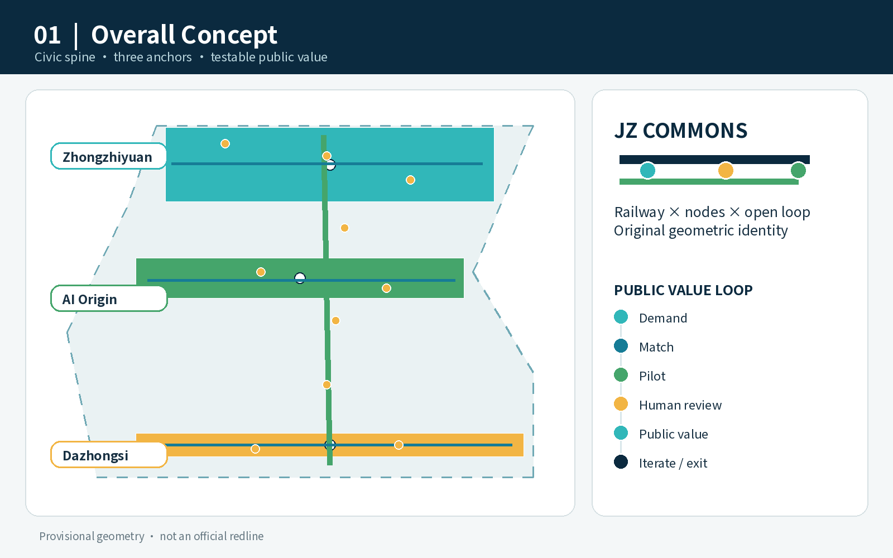
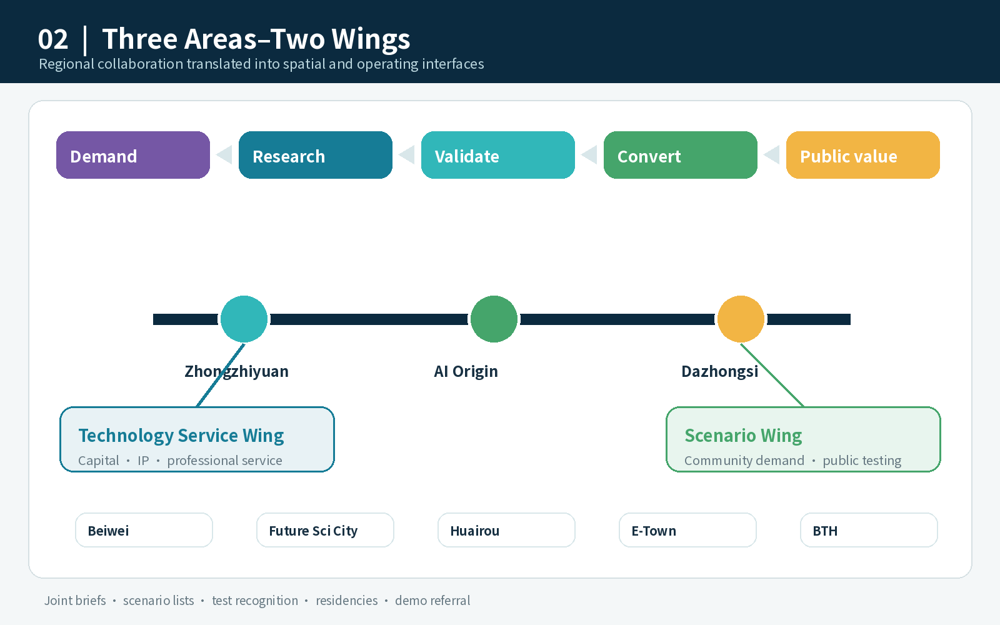
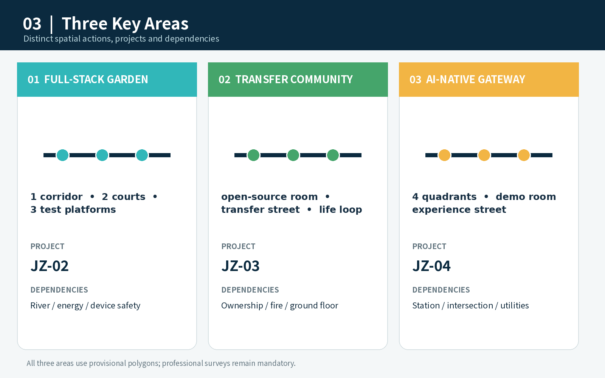
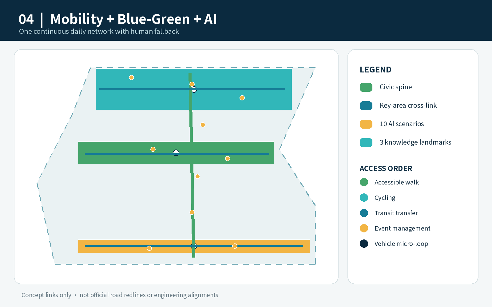
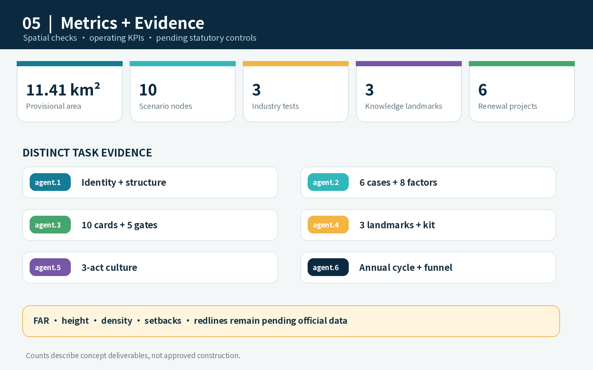

# Jing-Zhang AI Civic Commons: An Urban Public-Service and Innovation Living Lab

> **Design proposition:** A world-class AI district should shorten both the distance from research to enterprise and the distance from innovation to everyday life. The proposal turns the Jing-Zhang heritage park into a civic-service spine linking research, commercialization, neighbourhood service, public experience and international exchange.

> **Status:** This is an open co-creation concept and a brief for professional development. It is not a statutory plan or government approval. Repository-maintained provisional geometry is used throughout and must be replaced and recalculated when official files become available.

## Design Basis and Source List

The official announcement establishes the three scope levels, three key areas, required tasks and deliverable depth. The Agent taskbook supplies the three positionings, five functions, Three Areas–Two Wings structure and six Agent tasks. Local snapshots of official urban-design, regulatory-planning and land-use references guide terminology and method; provisional geometry supports visualization only [source:OFFICIAL-ANNOUNCEMENT] [source:AGENT-TASKBOOK] [standard:PROJECT-OFFICIAL-ANNOUNCEMENT].

Evidence is separated into official or cleared task sources, primary institutional websites used for case comparison, and provisional geometry. Missing regulatory, road, ownership, utility, fire-safety and heritage data are stated as pending official data rather than converted into false precision [source:SOURCE-REGISTRY] [depth:risk_missing_data].

The pale dashed outline is a provisional working constraint, not an official redline. The design emphasis is on the spine, three anchors, Two Wings interfaces, scenario nodes and implementation loop [data:geometry/site_boundary.geojson#SITE-001] [metric:site_area_sqm].

## Three-Level Scope Framework

The three levels form one chain: the 43.6 km² coordinated research area identifies ecosystem and regional interfaces; the approximately 11.4 km² overall design area organizes the civic spine, functional network and renewal projects; the three key areas test whether spatial, industrial, mobility, operational and governance ideas can be developed at identifiable spatial types [depth:three_level_scope_framework] [data:geometry/key_areas.geojson#PROV-KEY-001].

The structure is “**One Spine, Three Anchors, Two Wings, Ten Test Scenes and One Blue-Green Mobility Loop**.” The spine is the heritage-park civic commons; the anchors are Zhongzhiyuan, AI Origin Community and Dazhongsi; the wings connect technology services and scenario empowerment; all ten scenarios pass through pilot, human review, public evaluation and pause/exit gates.

Five proposed interfaces connect the belt with Beiwei Community, Future Science City, Huairou Science City, Beijing E-Town and the Beijing–Tianjin–Hebei region: joint briefs, shared scenario lists, mutual recognition of test resources, short-term talent residencies and demo referral. These are mechanisms for further agreement, not claims of existing partnerships [source:AGENT-TASKBOOK] [depth:overall_spatial_structure].

## Coordinated Research Area: Industry and Future City Research

### Six global cases and transferable mechanisms

| Case | Verified mechanism | Jing-Zhang translation |
| --- | --- | --- |
| Vector Institute, Toronto | Research–academia–industry connection and adoption | A three-party matching desk for research, enterprise problems and tests |
| Mila, Montréal | Multi-university research community and responsible AI | Cross-campus open-source and governance communities |
| AI Singapore | Research, industry, talent and experiment programmes | Time-bounded urban problem experiments |
| STATION F / F/ai, Paris | Multiple accelerators, soft landing and partner network | Landing, acceleration and market-validation stages |
| AI Sweden | Shared testbeds, talent programmes and regulatory pilots | Bookable testbeds and joint privacy/compliance review |
| Dubai AI Campus | Space, licensing, acceleration and corporate links | A one-stop international soft-landing interface at Dazhongsi |

Mechanisms are drawn only from institutional websites [source:CASE-VECTOR] [source:CASE-MILA] [source:CASE-AISG]. The remaining sources and limits are recorded in `sources.json` [source:CASE-STATIONF] [source:CASE-AISWEDEN] [source:CASE-DUBAI-AI-CAMPUS].

The ecosystem follows five stages—demand, research, validation, conversion and public value—and eight enabling factors: land, space, industry, finance, talent, compute, data and scenarios. Each has a spatial carrier and an operating rule. Funding, space and policy remain proposals subject to future formal decisions [standard:PROJECT-AGENT-OPEN-CALL-TASKBOOK] [depth:industry_future_city_strategy].

## Overall Design Area: Urban Renewal and Regulatory-Plan-Level Urban Design

The renewal sequence is retain usable space, repair public interfaces, insert shared services, test operations, and only then decide further investment. Four conceptual land-use bands cover the provisional boundary without claiming approved zoning [data:geometry/land_use.geojson#LU-001] [depth:land_use_layout].

Three section types guide the civic spine: transit gateways for interchange and international arrival; innovation streets for open ground floors, tests and talent service; and neighbourhood-park sections for accessibility, seating, human assistance and low-disturbance operation. FAR, height, setbacks, redlines and parcel-level retention decisions await official controls [standard:MOHURD-CONTROL-DETAILED-PLANNING] [depth:development_intensity_controls].

## Detailed Design of Key Areas

### Zhongzhiyuan: Full-Stack Validation Garden

One low-carbon river corridor, two collaborative courtyards and three test platforms support security evaluation, standards workshops, model red-teaming, edge-device interoperability and low-carbon compute demonstrations. Reversible facilities and programming come first; hydrology, energy and engineering require specialist studies [data:geometry/key_areas.geojson#PROV-KEY-001] [depth:three_key_area_detailed_design].

### AI Origin Community: University-Linked Transfer Neighbourhood

An open-source living room, transfer street and talent-life loop combine code contribution, demo release, IP/legal support, finance guidance, shared meeting and daily services. Ground-floor and courtyard adaptation is prioritized without pre-judging individual buildings [data:geometry/key_areas.geojson#PROV-KEY-002] [source:AGENT-TASKBOOK].

### Dazhongsi: AI-Native Urban Gateway

A reference scheme links four pedestrian quadrants around the station with an international demo living room and an AI-native experience street. Commuting, events and neighbourhood use are time-managed. Station, intersection, utility and ownership conditions need dedicated verification [data:geometry/key_areas.geojson#PROV-KEY-003] [metric:key_area_count].

## AI Innovation Ecosystem, Personas, and AI+ Scenarios

Six personas—open-source developers, start-ups, established firms and international visitors, university communities, local residents, and older/disabled users—receive an offline entry point, human fallback and appeal route. Smartphones are never the sole gateway and resident profiles are not used for commercial targeting [data:geometry/public_space.geojson#SCENE-09] [depth:ai_scenario_service_design].

| No./type | Scenario | Input and capability | Failure and human control | Pilot KPI |
| --- | --- | --- | --- | --- |
| 01 validation | Safety sandbox | Authorized test sets; model evaluation | False result/overreach; expert stop | findings, review and closure rate |
| 02 validation | Edge-device test garden | Device telemetry; edge-cloud coordination | disconnect/mis-action; safety takeover | failure, energy and takeover time |
| 03 | Open-source release hall | Voluntary project data; retrieval | attribution error; author confirmation | contributions, reuse and dispute time |
| 04 | Transfer street | Self-declared needs; service matching | poor match; specialist confirmation | referral completion and response |
| 05 | Accessible mobility guide | Public network and volunteered reports | stale data; signs and hotline | repaired gaps and handoff rate |
| 06 | Low-carbon corridor | Aggregated sensors; maintenance alerts | sensor drift; manual inspection | alert accuracy and closure |
| 07 | International demo room | Authorized material; bilingual aid | translation/fact error; host edit | qualified matches and corrections |
| 08 validation | Smart-device street | Anonymized feedback; interoperability | safety/exclusion; immediate suspension | takeover, reproducibility, accessibility |
| 09 | AI civic-service station | User-provided information; navigation | wrong advice; staff confirms action | clarity, handoff and satisfaction |
| 10 | Global AI Week route | Public event data; routing prompts | crowding/change; on-site dispatch | timed flow and response time |

Ten nodes are stored in the public-space GeoJSON. Three industry-validation scenarios pass technology, data, safety, human-impact and exit gates in a suggested 90-day cycle [metric:scenario_node_count] [data:geometry/public_space.geojson#SCENE-01].

## Land Use, Building Scale, and Retain-Renovate-Demolish Strategy

The four-level method is retain, light repair, reversible adaptive reuse and pending survey. The submitted building footprint demonstrates the method only; it is not a parcel-specific demolition decision [data:geometry/buildings.geojson#BLDG-001] [metric:building_footprint_area_sqm] [depth:retain_renovate_demolish].

The four land-use families are connected rather than isolated. Research fronts the civic spine with shared release and test interfaces; industry and commerce support enterprise growth and international exchange; community services protect daily life and offline public service; blue-green space supports mobility, rest, water management and low-disturbance pilots. Shared coordinates create a complete, non-overlapping conceptual partition. Official parcel and land-use data will trigger repartition and recalculation [data:geometry/land_use.geojson#LU-002] [standard:MNR-LAND-USE-CLASSIFICATION-GUIDE] [depth:development_intensity_controls].

Building scale is controlled qualitatively: accessible ground floors along the spine, lower operational disturbance toward neighbourhoods, and public legibility at transit gateways. Roof equipment, signs, night lighting, servicing, acoustics, height and massing require ownership, structural, fire-safety, daylight, landscape and operational surveys. FAR and height values remain absent because official controls are unavailable; this is risk control, not fabricated completeness.

## Transport, Rail, Municipal Infrastructure, and Public Services

A north–south civic spine, three cross-links and transit gateways prioritize accessible walking, cycling continuity, public-transport transfer, temporary event management and then vehicle micro-circulation. Every line is conceptual, not a road redline [data:geometry/roads.geojson#ROAD-001] [depth:traffic_rail_slow_parking].

Edge infrastructure is lightweight, modular and auditable, with data minimization, offline continuity and human switching. Energy, drainage, fire safety, communications and compute loads await specialist data [depth:municipal_new_infrastructure] [data:geometry/constraints.geojson#CONSTRAINTS].

## Blue-Green Network, Public Space, and Urban Character

The loop links river clues, the heritage park, three key areas and neighbourhood parks. Current green and public-space ratios are internal design checks under provisional geometry, not statutory ratios [metric:green_ratio] [metric:public_space_ratio] [depth:blue_green_public_space].

The identity uses two parallel lines for the railway legacy and AI era, civic nodes for participation, and an open loop for iteration and exit. The original geometric mark uses Jing-Zhang navy, civic green and validation orange; the English name is “Jing-Zhang AI Civic Commons,” and the short name is “JZ Commons.”

Three pilgrimage landmarks function as public knowledge infrastructure: the Trusted-AI Test Tower at Zhongzhiyuan, Open-Source Contribution Walk at AI Origin Community, and Human–AI Co-creation Living Room at Dazhongsi. A reversible component kit includes flip information signs, accessible service desks, mobile test pods, edge-data lights and contribution plaques [standard:MOHURD-URBAN-DESIGN-MEASURES] [depth:height_massing_character].

The cultural storyline has three acts: railway connects the city; Zhongguancun connects knowledge; AI connects public value. Heritage imagery, portraits and corporate marks require separate rights clearance.

## Renewal Projects, Implementation Policy, and Phasing

| Project | Suggested lead / partners | Prerequisites | Milestone and acceptance |
| --- | --- | --- | --- |
| JZ-01 Spine gap repair | area coordinator / transport, parks, district | redline and accessibility review | inventory–pilot–continuity audit |
| JZ-02 Test garden | area operator / research, firms, safety experts | river, energy, device safety | rules–first pilots–quarterly report |
| JZ-03 Transfer street | local/park service / universities, incubators | ownership, fire safety, ground floor | desk–coaching–release |
| JZ-04 Dazhongsi gateway | area coordinator / metro, traffic, commerce | station, intersection, utilities | flow diagnosis–temporary plan–design |
| JZ-05 Civic-service stations | service operator / community, firms | data and responsibility list | offline entry–90-day test–review |
| JZ-06 Annual operation | belt secretariat / developers, media, partners | permits, rights and safety | calendar–delivery–conversion review |

Near-term work uses rules, service and reversible components; medium-term work repairs public interfaces; fixed infrastructure waits for official planning and engineering conditions. Phasing is not a government commitment [data:geometry/phasing.geojson#PHASE-001] [metric:renewal_project_count] [depth:phasing_implementation].

Scenario opening follows public call, compliance screening, limited pilot, public/independent evaluation, and scale, pause or exit. The annual cycle includes a spring city-problem list, summer open-source and test season, autumn Global AI City Week and winter public-value audit. International conversion follows discover, short residency, scenario validation, enterprise service and long-term cooperation.

## Metrics, Area Recalculation, and Compliance Matrix

Spatial metrics are recalculated from GeoJSON; governance metrics come from future operations; statutory controls remain pending. Ten scenario nodes, three landmarks and six renewal projects check deliverable completeness but do not imply approved construction [metric:scenario_node_count] [metric:landmark_count] [metric:renewal_project_count].

Each Agent task now has distinct evidence: identity and structure for agent.1; six cases and eight factors for agent.2; ten cards and five gates for agent.3; landmarks and component kit for agent.4; three-act narrative for agent.5; annual operations and conversion funnel for agent.6.

## Risk, Copyright, and Compliance

Key risks include missing official geometry, regulatory and engineering inputs, incomplete industry baselines, future scenario data and operators, and the need for human bilingual, accessibility, reading-order, colour-vision and distance-legibility checks [depth:risk_missing_data] [source:BOUNDARY-SOURCE].

Figures are generated from structured submission data and original geometry. Case studies do not reuse institutional images, logos or layouts. Fonts, tools, per-path provenance and limitations are documented in `report/copyright_statement.md`.

## References

- Official announcement, cleared Agent taskbook and repository site package.
- Local official snapshots for urban design, regulatory planning and land-use classification.
- Institutional websites of Vector Institute, Mila, AI Singapore, STATION F, AI Sweden and Dubai AI Campus, used only for mechanism comparison.
- Complete dates, rights and use limits are recorded in `sources.json`; metrics, assumptions and task mappings are in the structured audit files.

Sources follow claim-adjacent, purpose-limited and traceable use. The announcement confirms tasks and approximate scope, not exact polygons. The Agent taskbook controls identity, scenarios, operations and public-compliance outputs, not statutory planning. Standards guide method but do not prove site-specific approval. Six international cases compare operating mechanisms only [source:OFFICIAL-ANNOUNCEMENT] [source:AGENT-TASKBOOK] [standard:MOHURD-URBAN-DESIGN-MEASURES].

GeoJSON, metrics and the three matrices form the audit layer. New official geometry, addenda or validation changes require boundary replacement; recalculation of land use, green space, public space, buildings, roads, phasing and metrics; and regeneration of all figures, PDFs and offline HTML [source:BOUNDARY-SOURCE] [depth:metrics_recalculation] [metric:site_area_sqm]. Current evidence cannot support exact redlines, FAR, height, engineering alignments, ownership or investment commitments.
