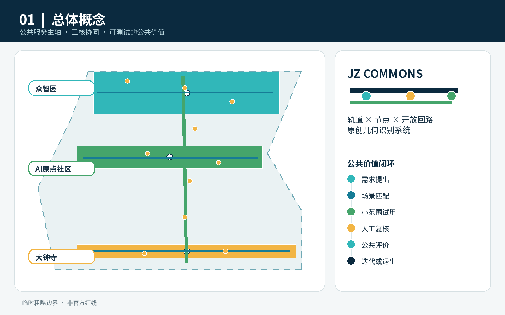
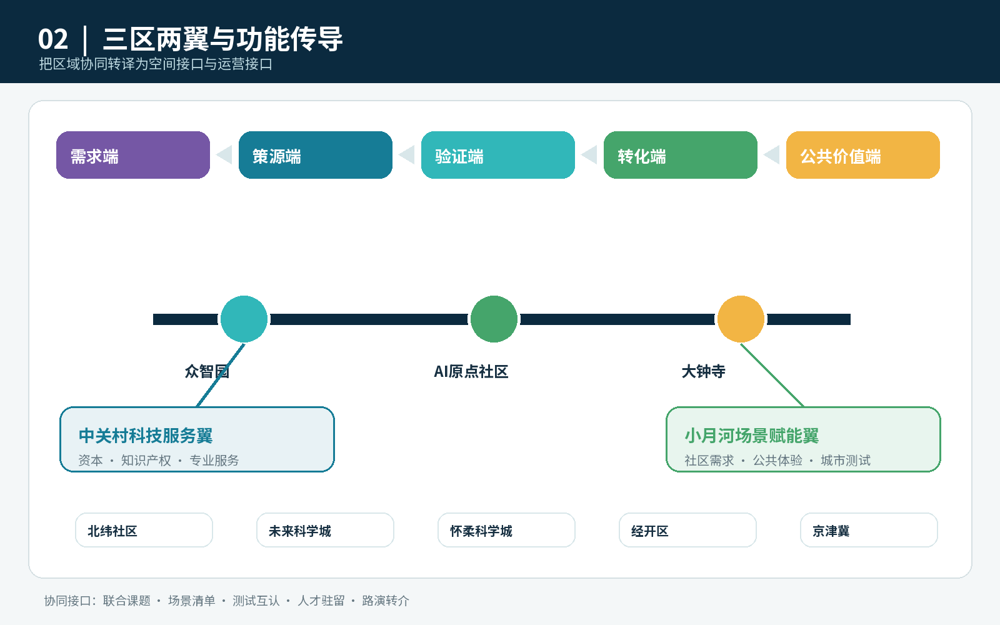
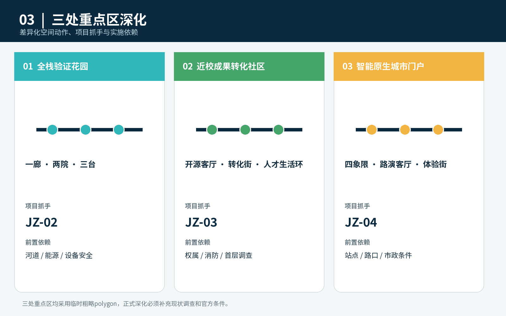
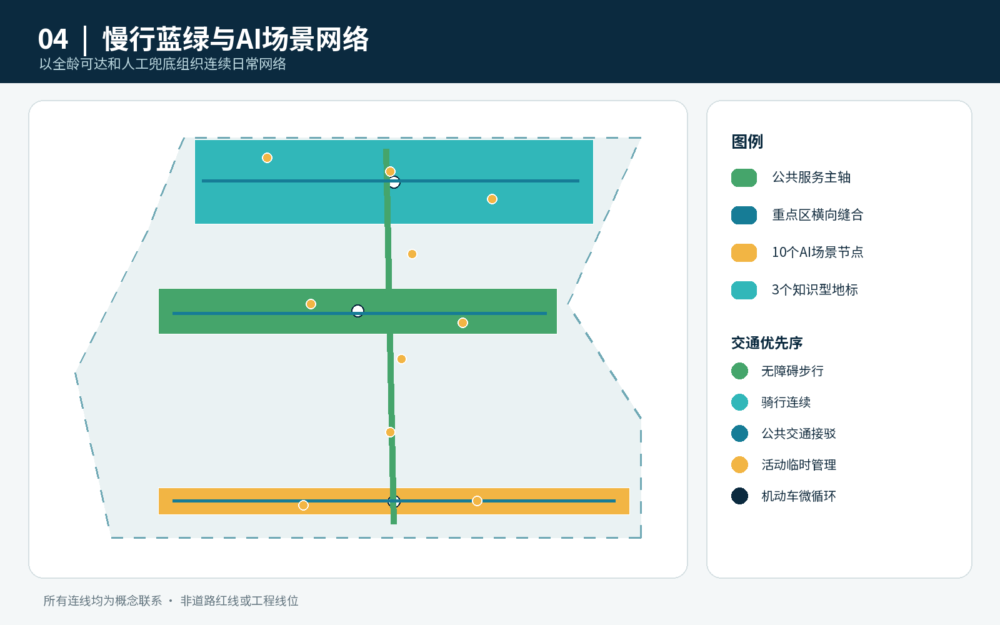
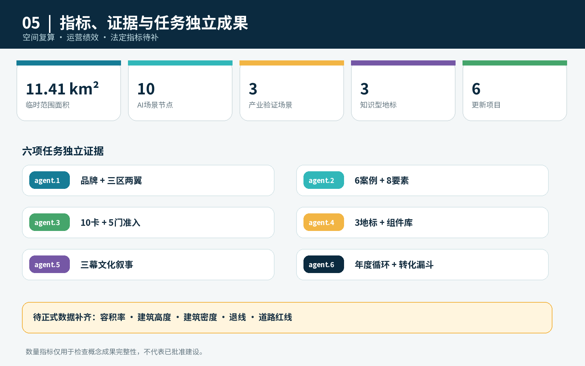

# 京张智惠共生带：AI城市公共服务与创新生活实验场

> **设计主张**：世界级AI创新带既要缩短技术从实验室到企业的距离，也要缩短创新与普通人的距离。本方案以“智惠而非智炫”为价值判断，把京张遗址公园转化为一条连接高校策源、企业转化、社区服务、公共体验和全球交流的城市公共服务主轴。

> **成果属性**：本稿为开放共创的概念建议和专业团队深化底稿，不替代正式规划，不构成政府审定结论。现阶段采用仓库维护的临时粗略边界；所有面积、道路、建筑和重点区位置均须在官方图件发布后统一复算。

## 设计依据与资料清单

方案以资格预审公告确认三层工作范围、三处重点区、设计任务及成果深度，以面向智能体任务书确认三大定位、五大功能、“三区两翼”和六项必答任务。城市设计、控规深度语言及用地分类分别遵循仓库保存的官方标准快照；临时几何仅用于概念生成、可视化和自检 [source:OFFICIAL-ANNOUNCEMENT] [source:AGENT-TASKBOOK] [standard:PROJECT-OFFICIAL-ANNOUNCEMENT]。

资料分为三类：官方或清权资料用于任务与方法依据；国际机构官网用于案例机制比较；临时边界只用于表达空间关系。任何缺少正式控规、道路红线、权属、市政、消防或文保资料的内容，都保留为“待正式数据补齐”，不以推测值制造精确感 [source:SOURCE-REGISTRY] [depth:risk_missing_data]。

当前提交边界为 `provisional_constraint`。图中淡色虚线仅代表工作范围约束，不能作为官方红线、审批依据或精确面积基础；设计重点是主轴、三核、两翼接口、场景节点和实施回路 [data:geometry/site_boundary.geojson#SITE-001] [metric:site_area_sqm]。

## 三层范围工作框架

三层范围不是三套彼此割裂的图纸，而是一条“区域协同—总体结构—片区验证”的传导链：43.6平方公里统筹研究范围识别创新生态与区域协同接口；约11.4平方公里总体设计范围组织公共服务主轴、功能网络和更新项目；三处重点区用于检验空间、产业、交通、运营与治理是否能够落到具体空间类型 [depth:three_level_scope_framework] [data:geometry/key_areas.geojson#PROV-KEY-001]。

总体结构概括为“**一带三核、两翼协同、十景共测、蓝绿慢行复合环**”：

- **一带**：京张遗址公园公共服务主轴，串联创新服务、公共生活与文化叙事。
- **三核**：众智园全栈自主创新核、AI原点近校转化核、大钟寺智能原生经济核。
- **两翼**：向中关村科技服务翼链接资本、知识产权和专业服务；向小月河场景赋能翼链接社区需求、公共体验和城市测试。
- **十景共测**：十类AI场景全部采用“小范围试用—人工复核—公众评价—暂停或退出”的治理流程。
- **复合环**：步行、骑行、轨道接驳、蓝绿空间和公共服务节点组成连续日常网络。

“三区两翼”进一步连接北纬社区的开放创新、未来科学城和怀柔科学城的科研转化、经开区的工程化与制造验证，以及京津冀的应用市场。方案不假定已经存在合作协议，而提出五类可执行接口：联合课题、场景需求清单、测试资源互认、人才短期驻留和成果路演转介 [source:AGENT-TASKBOOK] [depth:overall_spatial_structure]。

## 统筹研究范围产业与未来城市研究

### 六个全球案例与京张转译

案例只提取机构官网能够验证的运行机制，不复制其规模、投资或空间形态。

| 案例 | 可验证机制 | 京张转译 |
| --- | --- | --- |
| 多伦多 Vector Institute | 连接研究、学术与产业，推动研究向采用转化 | 建立“研究成果—企业问题—测试项目”三方配对台 |
| 蒙特利尔 Mila | 多校协作、研究共同体与负责任AI并行 | 在原点社区设置跨校开源协作与治理议题社区 |
| AI Singapore | 研究机构、企业、人才培养与100 Experiments联动 | 以限定周期的城市问题实验替代一次性展示 |
| 巴黎 STATION F / F/ai | 多类加速项目、国际落地与AI伙伴网络 | 设置“落地预备—加速—市场验证”分段服务 |
| AI Sweden | 合作伙伴共享测试床、人才项目和监管试验 | 建立可预约测试床与隐私/合规联合预审 |
| Dubai AI Campus | 物理空间、许可服务、加速和企业链接集成 | 在大钟寺形成一窗受理的国际企业软着陆界面 |

上述机制分别来自机构官网 [source:CASE-VECTOR] [source:CASE-MILA] [source:CASE-AISG]。其余案例和适用边界完整登记于 `sources.json` [source:CASE-STATIONF] [source:CASE-AISWEDEN] [source:CASE-DUBAI-AI-CAMPUS]。

### AI创新生态图谱与八类要素

方案把生态组织为“需求端—策源端—验证端—转化端—公共价值端”五段：社区、企业和城市运行提出问题；高校院所与开发者形成模型和工具；众智园提供安全、标准、算力与测试条件；原点社区和大钟寺承接孵化、专业服务、市场与国际链接；公众通过服务体验和评价决定场景是否继续。

八类要素不被简单堆成政策清单，而各有空间与运营载体：土地和空间对应可变共享场所；产业对应三核分工；资金对应分阶段里程碑；人才对应短期驻留和全周期生活服务；算力对应预约式端侧与共享入口；数据对应最小化、授权和审计；场景对应公开需求清单；治理对应准入、评测、暂停和退出。该体系是可供专业团队深化的机制建议，不是财政或招商承诺 [standard:PROJECT-AGENT-OPEN-CALL-TASKBOOK] [depth:industry_future_city_strategy]。

## 总体设计范围城市更新与控规深度城市设计

总体设计不以大拆大建为前提，而采用“保留可用空间、微改公共界面、嵌入共享服务、以运营验证再决定下一步”的更新顺序。四类概念用地分区完整覆盖临时工作边界，分别承载研发创新、蓝绿开敞、产业商业服务和社区配套；这是一套可复算的设计分区，不是审定用地 [data:geometry/land_use.geojson#LU-001] [depth:land_use_layout]。

公共服务主轴采用三种空间断面原型：轨道门户段强调换乘、导视与国际接待；创新街区段强调首层开放、共享测试和人才服务；社区公园段强调无障碍、可坐可停、人工服务和低扰动运行。道路红线、建筑高度、容积率、退线与拆改留对象均待正式控规和现状调查确认 [standard:MOHURD-CONTROL-DETAILED-PLANNING] [depth:development_intensity_controls]。

## 重点区域详细设计

### 众智园AI自主创新加速区：全栈验证花园

概念总图形成“一廊、两院、三台”：清河低碳创新廊连接慢行和开放展示；安全治理院与全栈协作院分别承载模型评测、标准工作坊和产业协作；模型红队台、端侧设备台、低碳算力台支持预约测试。首期以可逆设施和运营活动启动，桥隧、河道、能源和工程条件由专业团队另行论证 [data:geometry/key_areas.geojson#PROV-KEY-001] [depth:three_key_area_detailed_design]。

### 北京AI原点社区：近校成果转化社区

概念总图形成“开源客厅—成果转化街—人才生活环”：开源客厅发布代码贡献和科研成果；转化街聚合法务、知识产权、融资辅导和企业注册接口；生活环连接共享会议、短住服务、社区商业和慢行节点。空间策略优先改造首层和院落界面，不预设具体建筑拆改结论 [data:geometry/key_areas.geojson#PROV-KEY-002] [source:AGENT-TASKBOOK]。

### 大钟寺AI产业聚集区：智能原生城市门户

围绕轨道站点提出“四象限步行缝合+一座国际路演客厅+一条智能原生体验街”的参考方案。企业展示、智能终端、内容消费和数据要素服务共享一个可切换的公共界面；高峰通勤、活动客流和社区日常分时组织。站点、交叉口、市政和权属条件仍需专项核验 [data:geometry/key_areas.geojson#PROV-KEY-003] [metric:key_area_count]。

三处重点区统一采用“5分钟服务触点—15分钟场景网络—一带协同平台”三级运营：现场触点解决即时问题，片区网络组织场景和项目，一带平台负责规则、指标、资源转介与公开报告。

## AI 创新生态、人才画像与 AI+ 场景

六类核心用户包括开源开发者、初创团队、成熟企业与国际访客、高校师生、周边居民、老年人与无障碍使用者。每类用户都拥有线下入口、人工兜底和申诉渠道；不以智能手机为唯一入口，不以居民画像进行商业推荐 [data:geometry/public_space.geojson#SCENE-09] [depth:ai_scenario_service_design]。

| 编号与类型 | 场景/空间 | 输入与AI能力 | 失败模式与人工复核 | 试测指标 |
| --- | --- | --- | --- | --- |
| 01 产业验证 | 众智园安全治理沙盒 | 经授权测试集；模型安全评测 | 误判或越权；专家复核并可停止 | 风险发现率、人工复核率、修复闭环率 |
| 02 产业验证 | 众智园端侧设备测试园 | 设备遥测；边云协同 | 失联或误动作；现场安全员接管 | 失效率、能耗、人工接管时间 |
| 03 | 原点开源发布厅 | 自愿提交的项目资料；知识检索 | 归属错误；作者确认后发布 | 贡献数、复用数、异议处理时间 |
| 04 | 近校成果转化街 | 企业自报需求；政策与服务匹配 | 推荐不适配；专员二次确认 | 转介完成率、首次响应时间 |
| 05 | AI慢行无障碍导航 | 公开路网与用户主动反馈；路径建议 | 障碍更新滞后；线下导视和热线兜底 | 断点修复数、人工转接率 |
| 06 | 清河低碳创新廊 | 环境传感聚合值；维护提示 | 传感漂移；人工巡检校准 | 告警准确率、维护闭环率 |
| 07 | 大钟寺国际路演客厅 | 企业授权材料；双语内容辅助 | 翻译或事实错误；主办方校对 | 有效对接数、纠错率 |
| 08 产业验证 | 智能终端体验街 | 匿名化测试反馈；多设备互操作评估 | 安全风险或排斥效应；立即停测 | 接管时间、问题复现率、无障碍通过率 |
| 09 | AI生活服务驿站 | 办事人主动提供的信息；服务导航 | 错误建议；工作人员确认后办理 | 一次告知率、转人工率、满意度 |
| 10 | 全球AI活动周路线 | 活动公开信息；行程与拥挤提示 | 拥挤或活动变化；现场调度 | 分时客流、投诉响应时间 |

十个节点已写入公共空间图层，三项产业验证场景设置“技术成熟度、数据合规、安全、人本影响、退出条件”五门准入。场景试测以90天为一个建议周期：30天小样本验证、30天公开体验、30天评估；不达标则暂停、整改或退出 [metric:scenario_node_count] [data:geometry/public_space.geojson#SCENE-01]。

## 用地、建筑规模与拆改留方案

现阶段只提出“保留—微改—适配性再利用—待调查”四级方法：结构和使用状态良好的建筑优先保留；首层封闭、慢行断裂和公共界面不足处采用微改；适合共享研发、路演和服务的存量空间进行可逆适配；缺少结构、权属、消防和文保资料的对象一律待调查。提交中的建筑基底仅用于方法演示，不能识别为具体拆建对象 [data:geometry/buildings.geojson#BLDG-001] [metric:building_footprint_area_sqm] [depth:retain_renovate_demolish]。

四类用地的关系不是把研发、生活和公共空间彼此隔离，而是用公共服务主轴串联功能界面：研发创新带在面向主轴一侧设置共享发布和测试界面，产业商业服务带承接企业成长与国际交往，社区服务带保障日常生活和线下公共服务，蓝绿开敞带提供慢行、休憩、雨洪与低扰动试测空间。各分区面积来自同一组共享边界坐标，完整覆盖临时范围且不重叠；官方用地和地块数据到位后必须重新分区和复算 [data:geometry/land_use.geojson#LU-002] [standard:MNR-LAND-USE-CLASSIFICATION-GUIDE] [depth:development_intensity_controls]。

建筑尺度采用“沿主轴形成可进入首层、向社区降低活动扰动、在轨道门户提高公共识别”的定性控制。屋顶设备、广告标识、夜景亮度、物流装卸和活动声环境须在下一阶段结合建筑质量、产权、消防疏散、日照、景观和运营调查确定。现稿不提供总建筑规模、容积率或高度数值，因为相关官方条件尚未公开；这种留白是风险控制，而不是遗漏。

## 交通、轨道、市政与公共服务设施

交通网络由南北公共服务主轴、三条重点区横向缝合线和轨道门户接驳组成。优先级依次为步行无障碍、骑行连续、公共交通接驳、活动期间临时管理和机动车微循环；所有线路均是概念连线，不是道路红线或工程线位 [data:geometry/roads.geojson#ROAD-001] [depth:traffic_rail_slow_parking]。

市政与新基建采用“轻量、可插拔、可审计”原则：端侧节点不保存不必要的个人数据；设备运行、能耗与故障形成公开聚合指标；关键服务具备断网可用和人工切换。能源容量、排水防洪、消防、通信与算力负荷均待专项数据补齐 [depth:municipal_new_infrastructure] [data:geometry/constraints.geojson#CONSTRAINTS]。

## 蓝绿空间、公共空间与城市风貌

蓝绿复合环把清河、小月河线索、京张遗址公园、三处重点区和社区公园串为连续公共体验。绿色和公共空间比例仅为临时几何下的设计复算值，不等同于法定绿地率或批准指标 [metric:green_ratio] [metric:public_space_ratio] [depth:blue_green_public_space]。

品牌系统采用“轨道—节点—回路”构成：两条平行线象征百年京张与AI时代，圆形节点象征公众、人才与企业的共同参与，未闭合回路象征场景可以迭代和退出。主色为京张深蓝、公共青绿和验证橙；中文简称“京张智惠共生带”，英文名“Jing-Zhang AI Civic Commons”，缩写“JZ Commons”。Logo使用原创几何，不调用企业标识或外部图像。

三处“AI朝圣地标”均为公共知识与贡献展示设施，而非娱乐化雕塑：众智园“可信AI测试塔”公开测试标准与失败复盘；原点社区“开源贡献长廊”按授权展示贡献者与可复用成果；大钟寺“人机共创城市客厅”展示城市问题、原型和公众评价。配套组件库包含可翻转信息牌、无障碍服务台、可移动测试舱、端侧数据灯和贡献铭牌，均采用可逆安装 [standard:MOHURD-URBAN-DESIGN-MEASURES] [depth:height_massing_character]。

文化叙事不是给历史遗产贴AI标签，而以“铁路连接城市—中关村连接知识—AI连接公共价值”为三幕：轨枕尺度转译为导视节奏，代码贡献转译为公共荣誉，场景评估转译为城市共同学习。文化标识与整体Logo分开管理，涉及历史图像、人物和企业标识时另行清权。

## 更新项目清单、实施政策与分期计划

| 项目 | 建议牵头角色/协作方 | 资源级别与前置条件 | 里程碑与验收指标 |
| --- | --- | --- | --- |
| JZ-01 主轴断点缝合 | 街区更新统筹方 / 交通、园林、属地 | 中；红线、无障碍和交通核验 | 断点清单—样段—连续性复核；无障碍通过率 |
| JZ-02 众智园测试花园 | 片区运营方 / 科研、企业、安全专家 | 中；河道、能源、设备安全 | 测试规则—首批项目—季度报告；退出闭环率 |
| JZ-03 原点转化街 | 属地与园区服务方 / 高校、孵化、专业服务 | 中；权属、消防、首层条件 | 服务专窗—项目陪跑—成果发布；转介完成率 |
| JZ-04 大钟寺城市门户 | 片区统筹方 / 轨道、交通、商业主体 | 高；站点、路口、市政专项 | 人流诊断—临时组织—工程深化；换乘体验评价 |
| JZ-05 AI公共服务驿站 | 公共服务运营方 / 社区、企业、公益组织 | 低；数据和服务责任清单 | 线下入口—90天试测—评估；人工转接与纠错率 |
| JZ-06 JZ Commons年度运营 | 一带协同秘书处 / 开发者、媒体、国际伙伴 | 低；活动许可、版权和安全 | 年度日历—活动执行—转化复盘；持续参与率 |

近期以规则、服务和可逆设施为主，中期推进公共界面和片区更新，长期在官方规划、权属和工程条件明确后深化固定设施。分期不是政府实施时序承诺 [data:geometry/phasing.geojson#PHASE-001] [metric:renewal_project_count] [depth:phasing_implementation]。

场景开放实行“公开征集—合规预审—小范围试测—第三方/公众评估—扩大、暂停或退出”；每项场景明确责任人、数据清单、人工接管、投诉通道和退出触发器。年度活动形成四季循环：春季城市问题榜、夏季开源与测试季、秋季全球AI城市周、冬季公共价值审计。国际招引采用“线上了解—短期驻留—场景验证—企业服务—长期合作”漏斗，任何资金、空间或政策支持均以届时正式规则为准。

## 指标体系、面积复算与合规矩阵

指标分三组：空间指标从GeoJSON复算；治理指标来自场景运行记录；法定控规指标等待正式文件。当前临时边界面积、绿地和公共空间比例用于检查内部一致性；容积率、高度、建筑密度、退线等保持待补状态。新增的10个场景节点、3个贡献地标和6个更新项目用于检查成果完整性，不代表已批准建设数量 [metric:scenario_node_count] [metric:landmark_count] [metric:renewal_project_count]。

六项智能体任务分别拥有独立成果：agent.1对应品牌与三区两翼结构；agent.2对应六个案例和八要素生态；agent.3对应十张场景卡和五门准入；agent.4对应三地标与组件库；agent.5对应三幕文化叙事；agent.6对应年度运营和招引漏斗。详细映射存入任务覆盖矩阵，不再由同一组通用证据重复代替。

## 风险、版权与合规说明

主要风险包括：官方边界和重点区图件缺失；控规、道路、权属、建筑质量、市政、消防、防洪和文保资料缺失；产业与人才基线需持续核验；AI场景的真实数据和运营主体尚待合作；中英文实质等价、PDF阅读顺序、色觉可辨识性和远视距字号仍需人工复核 [depth:risk_missing_data] [source:BOUNDARY-SOURCE]。

所有图件由本方案结构化数据和原创几何生成；国际案例不复制官网图片、Logo或版式；字体、生成工具、路径级资产来源与限制详见 `report/copyright_statement.md`。任何第三方材料在权利无法证明时不得进入正式图件。

## 参考资料

- 资格预审公告、智能体任务书及仓库场地包。
- 城市设计管理、控制性详细规划和用地分类的官方标准快照。
- Vector Institute、Mila、AI Singapore、STATION F、AI Sweden、Dubai AI Campus机构官网；仅用于机制比较。
- 完整来源、访问日期、用途及限制见 `sources.json`；完整指标、假设和任务覆盖见相应JSON文件。

资料使用遵循“主张相邻、用途受限、可追溯”的原则：官方公告用于确认任务、范围文字和约面积，不推导精确polygon；智能体任务书用于确认品牌、场景、运营和公共合规要求，不替代法定规划；官方标准用于约束表达方法，不证明本项目已取得控规指标；六个国际案例仅比较组织机制，不移植其投资、企业名单或空间规模 [source:OFFICIAL-ANNOUNCEMENT] [source:AGENT-TASKBOOK] [standard:MOHURD-URBAN-DESIGN-MEASURES]。

空间结论最终以GeoJSON、指标和三个矩阵构成机器审计层。临时边界发布新版本、官方图件到位、任务书补遗或校验规则变化时，应重新核对来源日期，替换边界，复算用地、绿地、公共空间、建筑、道路、分期与指标，并同步重绘五张图、A3/A0和离线HTML [source:BOUNDARY-SOURCE] [depth:metrics_recalculation] [metric:site_area_sqm]。当前资料仍不足以支持精确红线、建筑高度、容积率、工程线位、产权判断或投资承诺。
