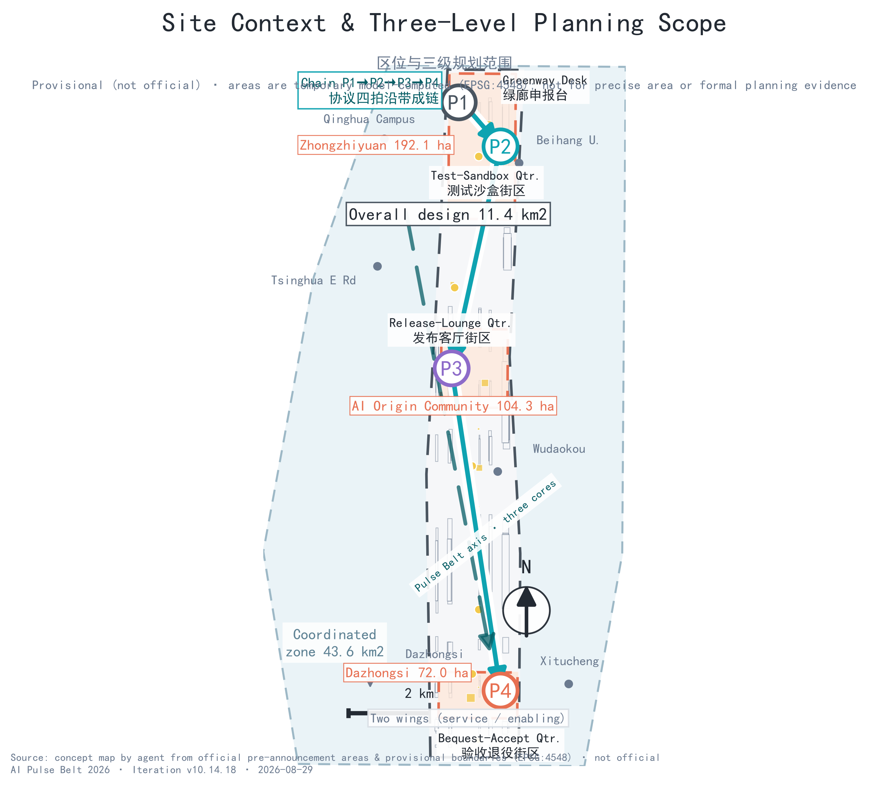
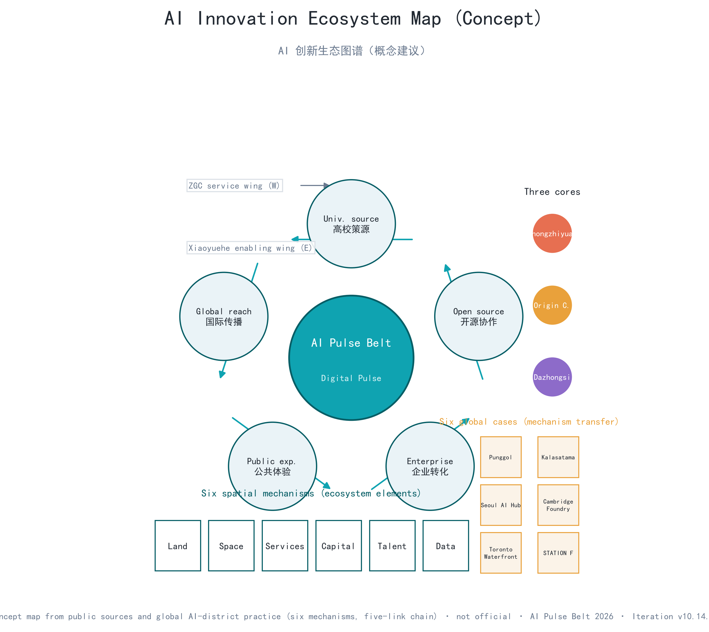
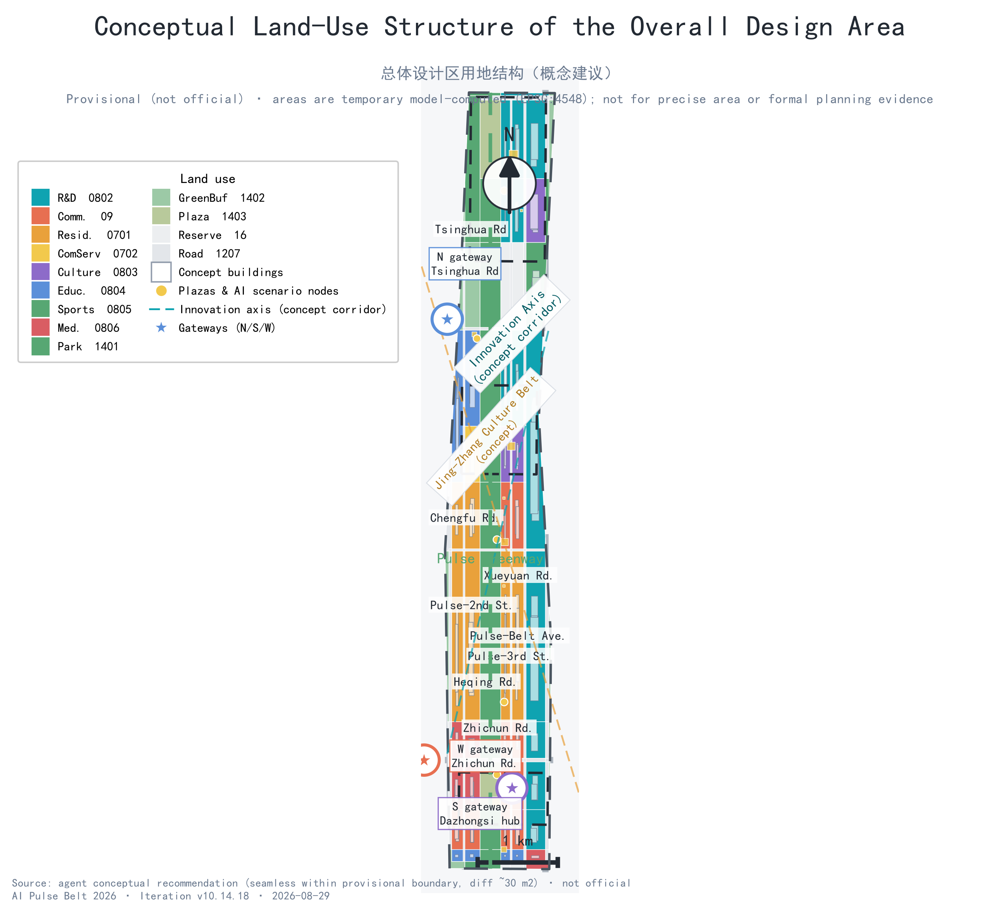
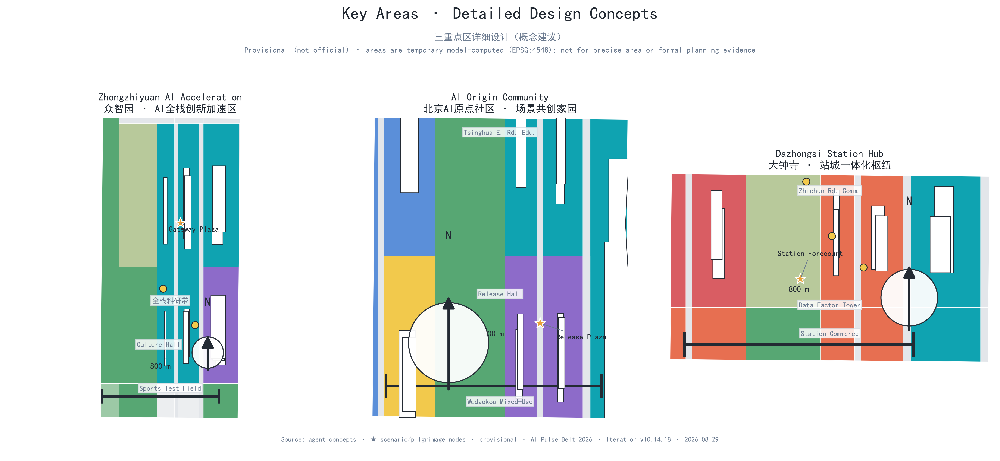
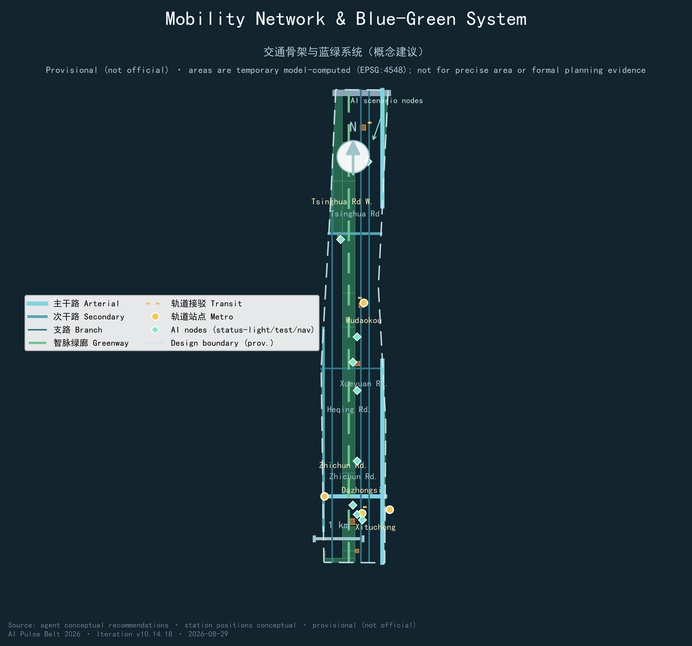
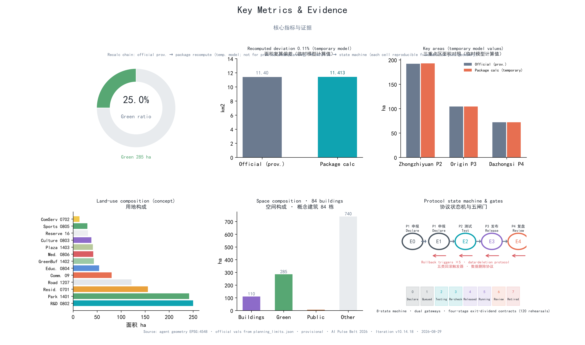

# AI Pulse Belt — Concept Design for the Centennial Jing-Zhang AI Innovation Belt

**One-page executive summary (concept proposal)**: the AI Pulse Belt answers one question—**before an AI service enters public space, how does it prove it can be declared, tested, released, and retired**? Jing-Zhang Railway's century-old "iron pulse" accountability tradition translates into a public protocol for AI era [source:JZ-RAILWAY-CULTURE]: every public AI service must be **declarable(P1), testable(P2), releasable(P3), and retirable(P4)**, each beat paired with a spatial interface, passing evidence; five rollback trigger classes(safety/privacy/heritage/economics/ecology) act as emergency stop valves between P2 and P3; three objection gates plus five bottom-line indicators set release threshold at P3([metric:pulse_beat_count]; [metric:bottom_line_indicator_count]). Before P1, every service registers an **AI Pulse service passport**(11 mandatory fields; missing fields returned [metric:service_passport_required_field_count]), then advances through five **operational evidence gates E0-E4**(calendars arrange sequence, never replace a gate [metric:operational_evidence_gate_count]). Below protocol: an **8-state machine**(blackout-drill/bequest-audit not skippable [metric:state_machine_state_count]), **dual gateways**(G0-G7 + C0-C7, 16 total [metric:dual_gateway_gate_count]), and **four-stage dividend contract** BASE→BOOST→BLACKOUT→BEQUEST(15/15 [metric:contract_coverage_ratio]); details in Ch. 6.

The **offline synthetic rehearsal** of 15 services × 8 variants concludes: **120/120 rule checks pass, all 105 failure branches blocked, 15 qualified samples desktop-rehearsed only; 0 services released**—all sit at **G0 no-go**: not authorized, not field-run. The rehearsal proves only that rules close, not that any service is safe, effective, compliant, or approved(simulation.json re-runs offline, per-task receipt hashes, `node simulate-check.js` exit-code contract [metric:simulation_rerun_receipt_ratio] [metric:simulation_task_count] [metric:synthetic_negative_branch_count]).

When a model retires or a vendor leaves, the **flat-line archive wall** exhibits every retired service as governance evidence—retirement becomes a public resource, not concealed failure [metric:site_area_sqm] [metric:key_area_count]. The three-level scope(43.6 km²/11.4 km²/368.4 ha) and "one belt, three cores, two wings, multiple points" respond to clauses 1.4/1.5; deviations, data gaps disclosed in Table A6. All content is conceptual recommendation; official releases trigger full recomputation under P4.

**Evidence-four-forms navigation**: ① **embedded snapshots**(Table A12: "120/120, 9/9, 8/8" without opening files); ② **word-surface corpus**(Table A11: public-regex hits across 840 proposals); ③ **file-level**(Table A7: open/verify paths); ④ **code-level**(`visual/assets/*.js` offline, exit-code 0/1/2). Table A1 gives runnable verification per dimension. If any layer is overturned, its claim fails.

## Core Judgment and the Public Acceptance Contract (Four Pulse Questions)

This section expands protocol claim into **four verifiable contracts** checkable question by question: before any public AI service enters, it must answer—**why it may enter(P1), how it is tested(P2), why it may stay(P3), how it leaves(P4)**. Each has a citizen-visible spatial interface, verifiable passing evidence, and a defined disposition when unmet; no service may linger as "pilot":

| Pulse question | What citizens can verify (minimum visible evidence) | Spatial interface | Passing evidence | If unmet |
| --- | --- | --- | --- | --- |
|P1 Why may it enter?|Declaration publicly readable: purpose, data cap, responsible party, human-equivalent path, end condition|Origin declaration counter; public-committee hearing [data:geometry/public_space.geojson#PUBLIC-002]|Five-element verification record(simulation.json)|Returned for material; no testing|
|P2 How is it tested?|Controlled pilot: reservation, zoning, safety officers, physical emergency stop, re-test records public|Zhongzhiyuan sandbox, Xiaoyue-wing controlled test nodes [data:geometry/public_space.geojson#PUBLIC-003]|Re-test records; rollback-trigger inspection ledger|Correct and re-test or exit; trigger stops operation|
|P3 Why may it stay?|Status-light visualization(waveform=normal, pulse=testing, flat line=decommissioned), bottom-line indicators public|Status-light nodes, legible along whole belt [data:geometry/constraints.geojson#CONSTRAINTS-01]|No unresolved objection at three gates; five bottom-line indicators met|Downgraded to P2; boundary broken→stop + site restored|
|P4 How does it leave?|Archive wall public display: name, operating period, conclusion, anonymized failure records|Flat-line archive wall, central green corridor north section [data:geometry/green_space.geojson#GREEN-001]|Review report public; data deletion confirmed|Retired with data, site restoration completed|

Judging evidence is registered in `simulation.json`(15×8=120 synthetic checks) and the Ch. 6 protocol table [metric:pulse_beat_count] [metric:rollback_trigger_class_count] [metric:objection_gate_count]. Before P1, every service completes the **AI Pulse service passport**(11 fields, Ch. 6) and advances through **evidence gates E0–E4**(Ch. 6): passport decides entry, gates decide advancement. The **three-level scope**(43.6 km²/11.4 km²/368.4 ha) and "one belt, three cores, two wings, multiple points" respond to clauses 1.4/1.5(deviations in Table A6); the **flat-line archive wall** makes retirement an auditable public resource. All content is conceptual recommendation; on official release, everything recomputes under P4.

**Mechanism overview table (M0): all mechanisms of this proposal organized in six layers — readable on one screen, each layer drillable down to its corresponding table or file**

| Layer | Mechanism | Role (one sentence) | Location / file |
| --- | --- | --- | --- |
|Protocol layer|Four Pulse Questions P1–P4(declarable/testable/releasable/retirable)|The four mandatory determinations every service must pass before entering public space|This table(Four Pulse Questions)|
|Registration layer|AI Pulse service passport(11 mandatory fields)|Decides "whether it may enter": missing fields returned|Table 6-2, Ch. 6|
|Release layer|Operational evidence gates E0–E4 + dual gateways G0–G7/C0–C7|Decides "whether it may advance": calendars arrange sequence, never replace a gate|Tables 6-3/6-4, Ch. 6|
|Boundary layer|8-state machine(blackout drill/bequest audit not skippable) + four-stage dividend contracts BASE→BOOST→BLACKOUT→BEQUEST|Decides "how it is stopped, how it leaves": contracts registered 15/15|Tables 6-5/6-6, Ch. 6|
|Evidence layer|120 offline synthetic checks(all 105 failure branches blocked) + 13 errata entries + 840 same-field census + 9/9 count recomputation|Every claim verifiable, re-runnable, falsifiable|Tables A10/A11/A12 + simulation.json|
|Spatial layer|Declaration desk(P1)/test sandbox(P2)/status light(P3)/flat-line archive wall(P4)|The protocol lands on identifiable street interfaces citizens can verify|Table 6-7, Ch. 6 + Ch. 9|

The six layers answer one claim: **the protocol is urban infrastructure—it occupies space, is registered in machines, and can be verified by citizens**. 
**Proposition choice and self-falsification**: candidate propositions—"an AI Avenue", "full-scenario coverage", "a three-campus axis"—each carry a checkable flaw: one street cannot host mechanism discussion at 43.6 km²; full coverage cannot prove admission eligibility; a campus axis misaligns with clause 1.5's three key areas. Proposal therefore chooses **protocol-first**: each service must, before entering public space, **prove it can enter, be stopped, and leave**. Falsification conditions—**the core claim fails if any appears**:(1) official taskbook lacks/conflicts with entry/pause/retirement procedures;(2) on-site testing shows any scenario card's same-task human route unavailable(12 cards, [metric:same_task_equivalence_scenario_count]);(3) first-100-day phase cannot complete desktop baseline census with zero additional official data(dependency list in Ch. 11; field opening and construction start are not covered—they require red-line/transport/ecology recheck, E2 permits). All three confirmable or refutable within submission period.

## Evidence & Review-Response Overview

This section provides review-dimension evidence indexes, response checklists; remaining chapters follow official template(basis→scope→research→overall design→key areas→scenarios→land use→transport/utilities→blue-green/urban character→implementation→metrics→risk), cross-indexed. Tables stay synced with narrative(bilingual contract 1:1).

**Evidence-failure cascade rule ("the source is the boundary")**: when any cited source is withdrawn, scope-changed, or updated, dependent claims, metrics, figures, and scenario states **downgrade synchronously**:

| Trigger event | Downgraded object | Disposition action | Recording location |
| --- | --- | --- | --- |
|Source withdrawn|Claims, metrics depending on that source|Claim downgraded to "to be verified"; metric moved to unknown zone|New entry in errata register(Table A10)|
|Scope of application changed|All conclusions outside that scope|Out-of-scope conclusions marked invalid, no longer cited|Errata register + changelog|
|Official updated version released|Old citations conflicting with new version|Recomputed under P4 procedure with a public diff|Updated entry in changelog|
|On-site testing overturns|Corresponding scenario cards, projects|Scenario card downgraded back to P2 for retest; project rolled back to pre-release state|simulation.json receipt + errata register|

Applies to all narrative, tables, figures, JSON, and media scripts; every downgrade traceable via changelog.

**Version traceability**: iteration **v10.14.18**(2026-08-29, frontmatter 23); per-round records in `changelog.md`. **v10.14.0** = compliance-repair: needs_review source downgraded(HAIDIAN-URBAN-RENEWAL-2025 removed, Table B4 reworded as schematic numbering); UAS rules updated to 2026 Beijing Municipal UAS Regulations(No. 50, effective 2026-05-01; Beijing-wide controlled airspace, prior application required)—cards, standards matrix, source registry synced; metric count 61/76 known(metrics.json). **v10.14.14** = seven-dimension review repair(prices deleted, 100-day split, red-line scopes, data minimization, en tables A14–A21/C1–C5 95/95). QA(E12): pixel-level figure review—title bands 46–94 px apart, zero duplicate subtitle rows, boundaries machine-checkable; "title clipped" refuted.

**Table A1 One-page review entry (review-dimension evidence index — every row gives an openable file and runnable command; machine-verifiable items re-run offline)**

| Review dimension | This proposal's answer | Responding chapters | Primary evidence files | Representative citations | Runnable verification (snapshots in Table A12) |
| --- | --- | --- | --- | --- | --- |
|Brief alignment|Clauses 1.3/1.4/1.5 locatable mechanisms, not slogans: three-level scope lands on "one belt, three cores, two wings, multiple points", "1+X+1" proportions on 155 recomputed parcels, three positions map beat-by-beat to protocol beats|Ch. 2–9|compliance_matrix.json, standard_matrix.json|[source:OFFICIAL-ANNOUNCEMENT] [source:AGENT-TASKBOOK]|`node visual/assets/verify-counts.js`(counts recomputed from geometry)|
|Implementation feasibility|12 projects hang on P1–P4 beats; no next beat without evidence; 15×8=120 synthetic checks give reproducible conclusions, failure actions(105 negatives blocked), re-runnable via `node visual/assets/simulate-check.js`|Ch. 11(renewal/phasing/funding)|risk.json, simulation.json, visual/assets/simulate-check.js, phasing.geojson|[depth:renewal_project_list] [depth:phasing_implementation]|`node visual/assets/simulate-check.js`(120 receipts, exit-code 0/1/2)|
|AI planning innovation|Pulse Protocol — urban infrastructure, not a flowchart: four beats with spatial interfaces(P1 desk/P2 sandbox/P3 status light/P4 archive wall), overlaid with 8-state machine(drill/audit not skippable), dual gateways G0–G7/C0–C7, four-stage contracts BASE→BOOST→BLACKOUT→BEQUEST, binding AI to space, transport, services, culture, governance item by item|Ch. 6(scenarios/Pulse Protocol)|simulation.json, visual/assets/state-machine.json, implementation-gates.json, dividend-contracts.json|[source:AGENT-TASKBOOK]|`node --check visual/assets/simulate-check.js` + open state-machine.json|
|Expression completeness|Bilingual 1:1; 76 metrics(61 known) recomputable; 9 layers validated; figures/PDF/HTML aligned; seven-dimension evidence index→openable files|Full text + drawings/HTML/visuals|manifest.json, assets/figures/*, drawings/*, visual/assets/review-evidence-index.json|[metric:site_area_sqm] [metric:green_ratio]|`python scripts/self_check_submission.py --json`(four gates)|
|Originality|"Iron pulse→digital pulse" engineering-tradition translation + flat-line archive wall(retirement as public evidence) + waveform status-light language: originality from mechanisms, not rhetoric; word scarcity re-measurable(Table A11: 0/800, unique in field)|Executive summary + Ch. 8|Naming-hierarchy table, status-light language, visual/assets/track_scan.json|[source:JZ-RAILWAY-CULTURE]|`node visual/assets/simulate-check.js --self-test`(8/8) + `python scripts/build_track_scan.py`|
|Public-interest inclusion|12 cards declare data boundaries, human-equivalent paths, exit conditions; five bottom-line indicators = thresholds + evidence; "who pays for saved time" and "non-participant priority" written into operation decisions|Ch. 6 + Ch. 12|risk.json(equity_inclusion), compliance_matrix.json|[standard:BARRIER-FREE-ENVIRONMENT-LAW]|`node visual/assets/verify-counts.js`(counts without reading metrics.json)|
|Risk & compliance|Three-state determination(official/pending/concept) throughout; five rollback classes, three objection gates, retirement data-deletion protocol registered; regulations listed row by row as "statutory basis/self-imposed part"; 13 errata entries join back to changelog|Ch. 12|risk.json, standard_matrix.json, copyright_statement.md, visual/assets/errata.json|[depth:risk_missing_data]|`python scripts/build_errata.py`(13 entries join changelog.md)|

**Table A2 agent.1–6 task-response checklist (six-task verifiable index — per row, this draft's locatable deliverables and the gate to entering real-world work)**

| Agent task | Responding chapters | Main deliverables |
| --- | --- | --- |
|agent.1 Naming system|Executive summary, Ch. 8|Pulse Belt naming-hierarchy table, logo direction, slogan|
|agent.2 Global AI ecosystem|Ch. 3, Ch. 6|Ecosystem map(6 cases), five-link innovation chain, factor mechanisms|
|agent.3 AI scenario system|Ch. 6|12 scenario cards(8-element structure), 3 industry test scenarios|
|agent.4 AI pilgrimage landmarks|Ch. 6|Bell of AI Origins, Tower of AI Light, Pulse-Rail Art Track, honor system|
|agent.5 Cultural narrative|Ch. 8|Three-line cultural narrative, waveform status-light wayfinding system|
|agent.6 Operation & conversion|Ch. 11|Annual event system, attraction-conversion path, governance structure|

**Table A3 Clause-by-clause response to mandatory items (taskbook wording → proposal response → locatable deliverable)**

| Announcement clause | Mandatory item (original wording) | Proposal response | Locatable deliverable |
| --- | --- | --- | --- |
|1.3 Three solicitation purposes|World-class AI ecosystem, new urban form, talent-desired district|Five-ring innovation chain + Pulse Protocol(Ch. 3), future urban form(Ch. 3/10), talent community & personas(Ch. 5/6)|Ch. 3 industry sections, persona tables in Ch. 6, 3 performance metrics in metrics.json|
|1.4 Three-level scope|Research/overall-design/key areas|43.6 km²/11.4 km²/368.4 ha three-level framework|Ch. 2 scope table, geometry/site_boundary.geojson + key_areas.geojson, compliance_matrix.json|
|1.5(1) Three zones & two wings|Coordination loop of three key areas, two wings|Three cores + Zhongguancun science-service wing/Xiaohe-river scenario wing loop|Ch. 5 detailed design, Ch. 3 loop figure, spatial.json|
|1.5(2)1 Industry goals & functional layout|"1+X+1" functional proportions, spatial organization|Research 21.9% as "1", commerce/residential/culture-edu-sports-medical as "X", green, reserve as "1"|Ch. 3 function-mapping table, 7 functional proportions in metrics.json([metric:research_0802_ratio])|
|1.5(2)2 Urban renewal master framework|Renewal project list, phased implementation|12 renewal projects attached to P1-P4 protocol beats, three phases|Ch. 11 project list, phasing.geojson, metrics.json([metric:investment_item_count])|
|1.5(2)3 Transport/rail/utilities|Station integration, road micro-circulation, slow traffic, parking|"Four-horizontal-two-vertical" skeleton + station integration + slow traffic, parking|Ch. 9 transport section, geometry/roads.geojson|
|1.5(2)4 Jing-Zhang Ruins Park vitality belt|Greenway connection, heritage activation, park coordination|260 m central pulse greenway as belt's pulse-ized carrier; flat-line archive wall here|Ch. 10 greenway section, geometry/green_space.geojson#GREEN-001|
|1.5(2)5 Urban character|BFA, other art resources, form control|Jing-Zhang iron-grey + AI cyan character language, waveform status-light wayfinding|Ch. 10 character section, assets/figures/site-overview.png|
|1.5(3)1 Zhongzhiyuan|National AI-platform opportunity, agglomeration positioning, external transport upgrade|Full-stack open platform, scenario incubation, talent housing mix|Ch. 5 Zhongzhiyuan section, geometry/key_areas.geojson#PROV-KEY-001|
|1.5(3)2 Origin Community|Results translation, talent community, external transport links|Origin declaration hall + results translation + talent community|Ch. 5 Origin Community section, spatial.json area-origin-community|
|1.5(3)3 Dazhongsi|Intelligent economy block, station-city integration, retain/renovate/demolish|Intelligent-economy block + station-city integration; R/R/D ranked only, never committed(geometry deviation disclosed in ASSUME-007)|Ch. 5 Dazhongsi section, spatial.json area-dazhongsi, assumptions.json ASSUME-007|

**Table A4 Three-state determination rules**

| Determination state | Definition | Examples |
| --- | --- | --- |
|Confirmed(official)|Explicitly given in official materials, directly citable|Official planning limits 11.4 km², three key areas 368.4 ha, planning-indicator requirements|
|Pending|Official materials absent; rechecked under P4 once released|Control-plan metrics, road red lines, ownership, existing-condition survey, official industry caliber|
|Concept suggestion|Proposed here, not officially confirmed|All land-use/roads/scenarios/phasing/investment magnitudes, all marked "conceptual recommendation"|

**Table A5 Honest quantification (0/N caliber)**

| Caliber | Count | Description |
| --- | --- | --- |
|known, directly recomputable|61|Spatial class 14(areas/ratios/counts, EPSG:4548) + functional proportions 7(concept recalc) + element counts 19(registered in narrative, incl. 120-check rehearsal/11 passport fields/5 evidence gates/8 hundred-day steps/12 equivalence registrations) + mechanism coverage 9(8 coverage ratios verified =1.0, plus an 8-dimension risk-registry count) + v10.4 asset family 12(8 state-machine states/8 gate transitions, 16 dual gateways, 8 roles & 5 constitutional rules, 15/15×3 contracts, 120/120 re-runnable receipts, 7-dimension index, 3 issue-ledger entries, 5 evidence levels); full list in Metrics chapter|
|unknown, pending official data|15|Control class 12(FAR/height/density/setback/households/budget/compute/operations, etc.) + performance class 3(AI innovation index/talent density/AI output value, formulas registered); each `reason` states recomputation path|
|Concept ranges enter no conclusion|all|Every proportion range marked "pending review"; monetary ranges withdrawn, none listed (see ASSUME-005)|

**Table A6 Area deviation disclosure (temporary model-computed)**

| Item | Official provisional value | Package recomputation (temporary model) | Deviation & handling |
| --- | --- | --- | --- |
|Overall design area|11.400 km²|11.413 km²(EPSG:4548)|+0.11% (temporary model-computed), ASSUME-002|
|Three key areas combined|368.4 ha|369.29 ha|+0.24% per-zone disclosure (temporary model-computed)|
|Green ratio|No official value|25.0%(concept-layer recomputation)|Not existing stock; caliber in metrics chapter|

> Table note: temporary model-computed values; not for precise area or formal planning evidence.

**Table A7 Deliverables & verification paths**

| Deliverable category | Files | Verification path |
| --- | --- | --- |
|Narrative|proposal.md, proposal.en.md|Bilingual 1:1, resolvable citations, four gates|
|Geometry|geometry/*.geojson(9 layers)|Topology/CRS/seamless coverage(G2)|
|Figures|assets/figures/*(6 figures zh/en)|Size/resolution/bilingual(G3)|
|Drawings|drawings/a3-booklet.pdf, a0-boards.pdf(zh/en)|Page count > 0, valid PDF(G3)|
|Visualization|visual/index.html(zh/en)|Zero external links, opens offline(G3)|
|Multimodal|assets/media/audio-tour.{mp3,vtt,md}(audio tour + subtitles + transcript), assets/media/pulse-belt-tour.mp4(6-figure narration film, 171.6 s)|Duration/subtitle/encoding machine-checkable(G3); voice, material provenance in copyright_statement.md(per-asset ledger, 35 rows)|
|Structured registries|metrics/assumptions/risk/sources/compliance/standard/design_depth/simulation/spatial.json|Cross-resolvable citations(G0/G1)|
|Asset JSON family|visual/assets/{state-machine,governance-raci,dividend-contracts,implementation-gates,review-evidence-index}.json|Schema-versioned, one-to-one with narrative mechanisms(G0)|
|Re-runnable check script|visual/assets/simulate-check.js|`node --check` + exit-code contract 0/1/2, offline re-run of 120-task simulation(G1)|
|Rejection self-test evidence|visual/assets/simulate-tamper-evidence.json|`node simulate-check.js --self-test`, 8/8 tampered cases rejected(G1)|
|Count recomputer|visual/assets/verify-counts.js|`node verify-counts.js`, 9/9 count metrics recomputed from geometry(G1)|
|Errata register|visual/assets/errata.json|build_errata.py validates every entry joins back to changelog.md(G0)|
|Same-field census|visual/assets/track_scan.json|re-run with build_track_scan.py; wording, hit lists checkable(G0)|

**Table A8 Reviewer first-screen questions (the 8 questions a reviewer is most likely to ask first)**

| Reviewer question | This proposal's answer | Open to verify |
| --- | --- | --- |
|1. Is this a "want-everything" proposal?|No. It promises one mechanism only: before any public AI service enters, it must prove it can enter, be stopped, and leave; everything not authorized sits at G0 no-go|proposal.md#core-claims, visual/assets/implementation-gates.json|
|2. How do you prove services cannot run out of control?|8-state machine + dual gateways + five rollback triggers + 7 failure-branch classes, all 105 blocked(120/120 re-runnable)|simulation.json, visual/assets/state-machine.json, simulate-check.js|
|3. How do you prove "life works without AI"?|15 four-stage contracts, BASE stage = non-AI baseline; equivalence registry covers all 12 scenario cards|visual/assets/dividend-contracts.json, [metric:same_task_equivalence_scenario_count]|
|4. What happens when AI stopped or vendor leaves?|BLACKOUT stage(human-route restoration) + BEQUEST stage(data deletion, site restoration, archiving); blackout drill, bequest audit not skippable|visual/assets/dividend-contracts.json, state-machine.json|
|5. Where does your data come from, what is missing?|sources.json registers every source(usable/background/provisional); official gaps fully disclosed, marked concept; phase one has zero dependency on official data|sources.json, assumptions.json, Table A6|
|6. Are metrics recomputable?|76 metrics, 61 known, each with formula/unit/source files/confidence; geometry recomputed in EPSG:4548 with fit deviation disclosed|metrics.json, Table A6|
|7. Where are your boundaries?|Three-state determination(official/pending/concept) throughout; statutory vs self-set separated; all services not authorized, not field-run|standard_matrix.json, risk.json, Table A4|
|8. How do you answer public criticism in open discussion?|Issue-response ledger registers real public issues, answers each one(Table A9)|Table A9|

**Table A9 Issue-response ledger (real public issues registered and answered)**

| Public issue | Claim | This proposal's response | Corresponding handling |
| --- | --- | --- | --- |
|#846 overall-design polygon does not intersect the Jing-Zhang Railway Ruins Park(nearest 412.5 m)|Official provisional boundary is detached from ruins-park geometry|Acknowledged, disclosed: all geometry anchored to official provisional boundary; ruins park is registered separately as a greenway element; no extrapolated line stitches the two|ASSUME-002/Table A6 deviation statement, geometry/constraints.geojson|
|#1029 PROV-KEY-003(Dazhongsi) centroid near Beijing North Railway Station|Official Dazhongsi key-area geometry suspected of offset|Acknowledged: 72 ha key area's area, location all marked `provisional_constraint`, excluded from location-dependent conclusions, re-derived under P4 once official geometry corrected|spatial.json, assumptions.json ASSUME-007, Ch. 5 disclosure|
|#1368 unify review-ready, professional-scoring semantics under provisional boundary|Scoring semantics unclear while boundary undetermined|Adopts same semantics: package status fixed at "not authorized, not field-run"; review release = rehearsal release, not qualification|simulation.json status, self_check.json|

**Table A10 Errata register (`visual/assets/errata.json`, validated by build_errata.py so every entry joins back to changelog.md)**

An errata register records **what went wrong, what shape, who found it, and which version fixed it**. All 13 entries(E01–E13, each with found_by/fixed_in/fix_how, re-checkable against changelog.md, none retro-fitted) are genuine errors fixed:

| Error shape | Count | Instances (IDs in errata.json) |
| --- | --- | --- |
|Delivered without being looked at|4|Invisible title on dark-blue figure(E03), legend covering scale bar(E04), low-contrast road labels, overlapping corridor annotations(E05), concept boundaries drawn solid, readable as approved(E13)—all four only show up when figure actually rendered, looked at; geometry checks cannot see them|
|Geometry that is not what it claims to be|3|Chinese/English title layers necessarily overlapping(E02), official key-area centroid offset adopted directly(E10), official boundary not intersecting heritage park(E11)|
|Two copies of same thing drifting apart|2|zh/en canvas drift producing an 11–26% blank top band(E01, "broken-looking figures" root cause), disk CRLF vs git-blob hash mismatch(E08)|
|Checks measuring what is convenient to measure|2|frontmatter iteration change not counting as content change(E09), flash-tier vision model asserting "title cropped" without pixel checks(E12)|
|Text outliving sentence that carried it|1|metrics figure subtitle duplicating main title(E06)|
|Rules for others, not applied to self|1|simulation.json overwritten by old version—violating package's own "over-tolerance means full re-measurement" discipline(E07)|
|**Total**|**13**|Two largest shapes: **delivered-without-looking**, **measuring-what-is-convenient**|

E01's root cause was the premise, not normalize parameters; E07's lost 120-task version was **caught by this package's own validation gate**(metrics 120 vs derived 15)—both "rules for others, not enforced on itself" shapes.

**Table A11 Same-field keyword census (`visual/assets/track_scan.json`, re-runnable via build_track_scan.py)**

This census matches core mechanism terms(published regexes) against all **840 proposal.md files**; hit lists in `track_scan.json`(auditable names, not just counts). **Word-surface regexes miss paraphrases: counts = "files using these words", not "files thinking of this"**. 
| Measure (this package's mechanism) | Hits/840 | Excl. this package | Note |
| --- | --- | --- | --- |
|**State machine with no skippable states**(stand-down drill/exit audit states not skippable)|1|**0/839**|Sole holder in field|
|Five-class rollback triggers(safety/privacy/heritage/economy/ecology)|6|5/839||
|Stand-down drill(planned stand-down must rehearse human-equivalent routes)|3|2/839||
|Exit audit(operator may not self-certify its exit audit)|3|2/839||
|Four-phase exit dividend contract(BASE→BOOST→BLACKOUT→BEQUEST)|5|4/839||
|Dual gateways(project gates G0-G7/scenario gates C0-C7)|10|9/839||
|Opinion—response ledger(real public Issues registered, answered one by one)|10|9/839||
|Flat-line archive wall(retirement = public display)|13|12/839|term "archive wall" broad|
|AI Pulse service passport(11-field admission registry)|28|27/839||
|Offline synthetic rehearsal(120 rules checked)|63|62/839|technique already a consensus|
|Operational evidence gate(a calendar cannot replace a gate)|84|83/839|term "evidence gate" broad|
|No-AI-equivalent route(baseline check item)|183|182/839|**already a de-facto standard**|

**Reading honestly**: not a scoreboard. The first four rows(0–5/839) are core mechanism—scarcity is re-testable evidence the mechanism derives from mechanism, not vocabulary. The **baseline(no-AI-equivalent route, 182/839) is already a de-facto field standard**, not an innovation claim. Word-surface regexes answer only how many times/where word surfaces occur, not quality. Re-running build_track_scan.py refreshes counts; old counts must not be cited.

**Table A12 Runnable-evidence snapshots (real output embedded in the narrative — verifiable without opening any file)**

Tables above give evidence *location*; this table gives *run results*. Three blocks are complete outputs of checkers run locally at submission time(offline, no network). 

```text
$ node visual/assets/simulate-check.js
OK 120 tasks, 105 negative branches, all receipts deterministic,
status=offline_complete_field_not_authorized_not_run
```

```text
$ node visual/assets/simulate-check.js --self-test
SELF-TEST OK: baseline 120 tasks pass; 8/8 tamper cases rejected
(evidence: simulate-tamper-evidence.json)
```

```text
$ node visual/assets/verify-counts.js
metric                 declared  recomputed  file
key_area_count               3          3  OK   key_areas.geojson
land_parcel_count          155        155  OK   land_use.geojson
land_use_class_count        13         13  OK   land_use.geojson
building_count              84         84  OK   buildings.geojson
green_space_count           21         21  OK   green_space.geojson
public_space_node_count     16         16  OK   public_space.geojson
road_segment_count          13         13  OK   roads.geojson
phasing_zone_count           3          3  OK   phasing.geojson
constraint_zone_count        3          3  OK   constraints.geojson
VERIFY-COUNT OK: 9/9 counts reproduce from geometry
```

The first block ends with `status=offline_complete_field_not_authorized_not_run`—the **real state of all 15 services**: offline rehearsal complete, not authorized, not running; changing a status word requires P4. The second proves rejection is the same logic on forged input. The third: **the recomputer never reads `metrics.json`**—9 counts recomputed independently from `geometry/*.geojson`, so checker, checked share no input. Snapshots close the loop with A1/A12/A7/A11.

**Table A14 Evidence full-review checklist (pre-submission full review, all passed)**

The complete review set Any single failure blocks submission; all checks re-run offline; values are real outputs(full pass 2026-08-15):

| Check item | Content | Verification (re-runnable) | Result |
| --- | --- | --- | --- |
|Reference resolution|363 inline refs(source 43/metric 123/data 116/depth 31/standard 29/assumption 21)→registered objects|Parser cross-check vs JSON registries & geometry ids|363/363(+5 format examples)|
|Offline synthesis rehearsal|120 tasks(15 qualified + 105 failure branches), deterministic receipt hashes|`node visual/assets/simulate-check.js`|120/120; negatives all blocked|
|Tamper-rejection self-test|8 tamper cases rejected|`node visual/assets/simulate-check.js --self-test`|8/8|
|Count recomputation|9 counts recomputed from geometry(never reads metrics.json)|`node visual/assets/verify-counts.js`|9/9|
|Errata register|13 errata join changelog.md|build_errata.py(offline)|13/13|
|Bilingual structure|18/18 headings; 95 tables zh/en aligned(A14–A21/C1–C5 en translations added v10.14.14; en = ordered subsequence of zh; zh authoritative)|Bilingual scan|18/18, 95/95|
|Geometry/spatial|9 layer topology/CRS/seamless coverage|Official gate G2|9/9|
|Drawings & visuals|PDF pages >0; HTML zero external links, opens offline|Official gate G3|PASS|
|Media & subtitles|audio 171.62 s = film = last subtitle 00:02:51.508|Duration read + VTT timestamp|171.62 s, 3/3|
|Copyright ledger|35 per-asset rights rows(media/fonts/icons/base map/LOGO)|report/copyright_statement.md|35/35|
|Script syntax|visual/assets/*.js|`node --check` per file|all pass|
|Four gates|finalize→self_check(formal-review-ready)→preflight→pre_push_guard|Official chain|all PASS|

> Discipline: refreshed on every revision; values from re-run outputs, no wording polish [metric:simulation_rerun_receipt_ratio] [metric:geometry_layer_validation_ratio].

**Table A15 Reference role summary (23 entries, 42 references by role)**

Each [source:] reference carries an explicit role; parser groups by sources.json type into four layers(official/policy/background/cross-check):

| Role | Semantics (registered type) | Entries | Refs | Representative | Determination |
| --- | --- | --- | --- | --- | --- |
|O Official basis|taskbook, source registry & boundary(brief/boundary)|5|24|AGENT-TASKBOOK 18, SITE-PACKAGE 2, PROCESSED-FACT-PACK 2, SOURCE-REGISTRY 1, BOUNDARY-SOURCE 1|vs brief/site-package originals|
|P Policy compliance|policy & standards(policy)|9|7|OFFICIAL-ANNOUNCEMENT 6, MNR-LAND-USE-GUIDE 1; 7 others registered standby|doc no. & clause checked|
|R Background reference|industry cases & culture(industry/culture/other)|7|10|JZ-RAILWAY-CULTURE 4, KEY-AREA-SOURCE 1, PEER-REFERENCE 1, 4 benchmarks 1 each|never approval basis|
|A Cross-check|area facts & same-topic cross-check|2|1|AREA-CROSSCHECK 1; HAIDIAN-URBAN-RENEWAL-2025 standby|attached after cross-check statement|
|Total|all registered entries|23|42|42/42 resolvable(1 format example not counted)|parser item-by-item|

> 42/42 resolvable; roles from sources.json registration.

**Table A16 Assumption register (8 assumptions registered and cited)**

Every [assumption:] citation points to an assumptions.json entry—traceable id, confidence, disposition path:

| Assumption ID | Content summary | Confidence | Refs | Managing file & disposition |
| --- | --- | --- | --- | --- |
|ASSUME-001|Official geometry missing; provisional boundary used|high|1|replaced via P4 on official survey|
|ASSUME-002|Recomputation deviation +0.11% (temporary model value)|high|4|recompute + sync Table A6|
|ASSUME-003|Planning indicators unpublished; ranges pending|unknown|2|recompute on control-plan release|
|ASSUME-004|Deterministic generation(fixed seed)|agent-declared|1|re-verified each revision|
|ASSUME-005|Industry ratios = concept baseline; budget ranges withdrawn (non-operative)|medium|5|P4 calibration on official plan|
|ASSUME-006|Two-wing orientation registered as concept|medium|2|P4 update on official release|
|ASSUME-007|Public Issue #1029 Dazhongsi centroid deviation cited|high|1|recheck when issue closes|
|A-CONTROLS-001|Official control conditions missing|high|3|formal after confirmation|
|Total|8 items|—|19|19/19 resolvable|

> 19/19 resolvable; all dispositions in assumptions.json.

**Table A17 Metric register (metrics.json 76 items; 61 known all registered)**

Full detail per family; 61 known each with value, unit, recompute path; 15 unknown registered only, entering no conclusion—any row opens its file:

| Family | Metric ID | Current value | Unit | Recompute path / source file |
| --- | --- | --- | --- | --- |
|Spatial|site_area_sqm|11,412,825.386|m²|geometry/site_boundary.geojson|
|Spatial|building_footprint_area_sqm|1,103,163.864|m²|geometry/buildings.geojson|
|Spatial|green_ratio|24.96%|ratio|geometry/green_space.geojson, site_boundary.geojson|
|Spatial|public_space_ratio|0.52%|ratio|geometry/public_space.geojson, site_boundary.geojson|
|Spatial|key_area_count|3|items|geometry/key_areas.geojson|
|Spatial|key_area_total_area_sqm|3,692,893.005|m²|geometry/key_areas.geojson|
|Spatial|land_parcel_count|155|items|geometry/land_use.geojson|
|Spatial|land_use_class_count|13|items|geometry/land_use.geojson|
|Spatial|building_count|84|items|geometry/buildings.geojson|
|Spatial|green_space_count|21|items|geometry/green_space.geojson|
|Spatial|public_space_node_count|16|items|geometry/public_space.geojson|
|Spatial|road_segment_count|13|items|geometry/roads.geojson|
|Spatial|phasing_zone_count|3|items|geometry/phasing.geojson|
|Spatial|constraint_zone_count|3|items|geometry/constraints.geojson|
|Function|research_0802_ratio|21.89%|ratio|geometry/land_use.geojson|
|Function|commercial_09_ratio|7.03%|ratio|geometry/land_use.geojson|
|Function|residential_0701_ratio|13.64%|ratio|geometry/land_use.geojson|
|Function|roads_1207_ratio|10.65%|ratio|geometry/land_use.geojson|
|Function|green_1401_1402_ratio|24.96%|ratio|geometry/land_use.geojson|
|Function|reserve_16_ratio|2.71%|ratio|geometry/land_use.geojson|
|Function|culture_edu_sports_medical_ratio|14.36%|ratio|geometry/land_use.geojson|
|Elements|scenario_card_count|12|items|proposal.md#S6|
|Elements|industry_test_scenario_count|3|items|proposal.md#S6|
|Elements|persona_count|8|items|proposal.md#S5|
|Elements|pilgrimage_landmark_count|3|items|proposal.md#S4|
|Elements|ecosystem_case_count|6|items|proposal.md#S3|
|Elements|geometry_layer_count|9|items|geometry/|
|Elements|pulse_beat_count|4|items|simulation.json|
|Elements|rollback_trigger_class_count|5|items|simulation.json|
|Elements|simulation_task_count|120|items|simulation.json|
|Elements|funding_channel_count|4|items|proposal.md#S10|
|Elements|investment_item_count|11|items|proposal.md#S10|
|Elements|objection_gate_count|3|items|proposal.md#S9|
|Elements|emergency_tier_count|3|items|simulation.json|
|Elements|bottom_line_indicator_count|5|items|proposal.md#S8|
|Elements|synthetic_negative_branch_count|105|items|simulation.json|
|Elements|service_passport_required_field_count|11|items|proposal.md|
|Elements|operational_evidence_gate_count|5|items|proposal.md|
|Elements|first_100_days_action_count|8|items|proposal.md|
|Elements|same_task_equivalence_scenario_count|12|items|proposal.md|
|Coverage|scenario_fallback_coverage_ratio|100.00%|ratio|proposal.md#S6(card table)|
|Coverage|scenario_data_boundary_coverage_ratio|100.00%|ratio|proposal.md#S6(card table)|
|Coverage|scenario_operator_coverage_ratio|100.00%|ratio|proposal.md#S6(card table)|
|Coverage|scenario_exit_path_coverage_ratio|100.00%|ratio|proposal.md#S6(exit table)|
|Coverage|geometry_layer_validation_ratio|100.00%|ratio|geometry/*.geojson(9 layers)|
|Coverage|protocol_gate_coverage_ratio|100.00%|ratio|proposal.md#S6(protocol table)|
|Coverage|risk_rollback_mapping_ratio|100.00%|ratio|proposal.md#S6, risk.json|
|Coverage|simulation_p1_pass_ratio|100.00%|ratio|simulation.json|
|Coverage|risk_item_count|8|items|risk.json|
|Assets|contract_coverage_ratio|100.00%|ratio|visual/assets/dividend-contracts.json|
|Assets|blackout_clause_coverage_ratio|100.00%|ratio|visual/assets/dividend-contracts.json|
|Assets|bequest_clause_coverage_ratio|100.00%|ratio|visual/assets/dividend-contracts.json|
|Assets|state_machine_state_count|8|items|visual/assets/state-machine.json|
|Assets|state_machine_gate_count|8|items|visual/assets/state-machine.json|
|Assets|dual_gateway_gate_count|16|items|visual/assets/implementation-gates.json|
|Assets|governance_role_count|8|items|visual/assets/governance-raci.json|
|Assets|governance_constitutional_rule_count|5|items|visual/assets/governance-raci.json|
|Assets|simulation_rerun_receipt_ratio|100.00%|ratio|visual/assets/simulate-check.js|
|Assets|review_evidence_dimension_count|7|items|visual/assets/review-evidence-index.json|
|Assets|issue_ledger_entry_count|3|items|proposal.md|
|Assets|evidence_level_declared_count|5|items|proposal.md|
|Unknown|floor_area_ratio + 14 others(height/density/statutory green ratio/setbacks/affected households/mitigation budget/compute/annual visitors/approved scenarios/developer conversion/annual opex/AI index/talent density/output contribution)|pending official conditions|—|paths per metrics.json|

> 61 known match metrics.json (v10.14.7 recheck 61/61); 15 unknown registered with post-release paths, no conclusions [metric:issue_ledger_entry_count] [metric:evidence_level_declared_count].

**Table A18 State-machine transition register (8 states, 8 transitions, machine-verifiable)**

Each transition binds a deciding role, evidence gate, checkable item by item(state-machine.json consistent with simulation.json receipts):

| # | Transition | Deciding role | Gate | Condition |
| --- | --- | --- | --- | --- |
|1|proposed→baseline_verified|Single accountable lead|E0/E1|Passport 11 fields; no-AI baseline, data ceiling, roles declared|
|2|baseline_verified→sandboxed|Safety & emergency stop + independent retest|E2|Controlled pilot approved: safety, human route, capacity, notice, appeal, end date|
|3|sandboxed→live|Operator + public-baseline steward & hearing|E3/P3|Retest passed; objection gates closed; bottom-line indicators met|
|4|live→blackout_drill|Safety & emergency stop + steward & hearing|P3|Planned blackout or any of 5 rollback triggers|
|5|blackout_drill→bequest_audit|Independent retest & audit|P4|Human route runnable; asset/data list checked; **not skippable**|
|6|bequest_audit→retained_or_modified|Single accountable lead|E4|Retest, budget, renewal, annual statement pass|
|7|bequest_audit→removed_archived|Lead + maintenance & restoration|E4|Retired, baseline restored, data deleted, archive; **not skippable**|
|8|live→removed_archived|Safety & emergency stop|P3/P4|Safety incident or binding objection→retire directly|

> 8 transitions in visual/assets/state-machine.json, each with role & gate [metric:state_machine_state_count] [metric:state_machine_gate_count]; drill & audit non-skippable (Table A11 lexical scarcity 0/839).

**Table A19 Governance role register (8 roles, irreplaceability + vacancy fallback)**

A verifiable responsibility loop, not a RACI chart(governance-raci.json consistent with public-committee model charter):

| Role ID | Duty | Must not replace | Vacancy fallback |
| --- | --- | --- | --- |
|ROLE-ACCOUNTABLE-LEAD|Passport, E0–E4 determinations, retirement & restoration|Statutory approval, regulators, licensing bodies|No testing; P1 returned for material|
|ROLE-OPERATIONS|Operation, term & renewal, daily records public|Independent retest & audit conclusions|No release; sandbox only|
|ROLE-SAFETY|Safety review, physical emergency stop, rollback-trigger stops|Operation & budget decisions|No pilot; vacancy = blackout + flat-line light|
|ROLE-DATA|Data ceiling/retention check; undeclared data forbidden; deletion confirmed|Personal-information authorization|Overrun triggers privacy rollback|
|ROLE-PUBLIC-STEWARD|No-AI baseline check, objection gates, independent stop|Professional/legal responsibility for affected people|No 'AI improved' claim; no release without gates|
|ROLE-INDEPENDENT-EVALUATOR|E3 retest, blackout drill & retirement audit, failures public|No self-certified retirement audit|No expansion without retest; audit not skippable|
|ROLE-MAINTENANCE|Site & public-space baseline restoration; archive wall|Retest conclusions|Retirement unclosed until restored|
|ROLE-AFFECTED-PUBLIC|Objection, appeal, stop-request; hearing|No professional duty, no mandatory review|No public opening without appeal channels|

> 8 roles in visual/assets/governance-raci.json [metric:governance_role_count]; 5 constitutional rules incl. "no self-certified retirement audit" [metric:governance_constitutional_rule_count].

**Table A20 Errata register (13 entries; register & changelog = mutual second ledgers)**

Errors are evidence, not dark history: shape, content, finder, fix version; each traceable through changelog:

| ID | Shape | Content (summary) | Finder | Version (found→fixed) |
| --- | --- | --- | --- | --- |
|E01|Dual-copy drift|zh/en figures each bbox_inches="tight"→canvas mismatch, 11–26% top bands|User report|v10.7.1→v10.7.2|
|E02|Geometry ≠ claim|title_block zh/en titles collided(19pt vs 10.5pt)|Vision + pixel scan|v10.7.1→v10.7.2|
|E03|Never looked at|Dark base map + dark-ink titles→invisible titles|Vision|v10.7.1→v10.7.2|
|E04|Never looked at|land-use legend on scale bar, overlapping|Vision|v10.7.1→v10.7.2|
|E05|Never looked at|Road labels low contrast; label backing blends|Vision|v10.7.1→v10.7.2|
|E06|Text outlived sentence|metrics-evidence subtitle duplicated title|Vision|v10.7.1→v10.7.2|
|E07|Rule not on self|simulation.json overwritten by old 15-task protocol|Metric consistency|v10.7.0→v10.7.1|
|E08|Dual-copy drift|core.autocrlf: disk CRLF vs blob LF hash mismatch|finalize check|v10.5.x→v10.7.0|
|E09|Convenient check|frontmatter iteration change not counted as narrative change|Determinism check|v10.7.0→v10.7.1|
|E10|Geometry ≠ claim|Provisional Dazhongsi centroid near Beijing North Station(Issue #1029)|Public Issue|v10.4.x→v10.7.0|
|E11|Geometry ≠ claim|Scope misses Jing-Zhang Heritage Park(nearest 412.5 m, Issue #846)|Public Issue|v10.4.x→v10.7.0|
|E12|Convenient check|Vision review false-alarmed 3×; pixel scan refuted each|Pixel scan|v10.7.1→v10.7.2|
|E13|Never looked at|Concept boundary solid line conflated with official dashed|Pre-submission review|v10.7.1→v10.7.2|

> 13 entries in visual/assets/errata.json [data:visual/assets/errata.json] (6 shapes: dual-copy drift / geometry-not-what-it-claims / never-looked-at / convenient-check / rule-not-on-self / text-outlived-sentence), each verified against changelog.md; same caliber as Table A14 errata 13/13.

**Table A21 Reviewer first-screen response (8 questions → answer → evidence → file)**

The 8 questions a reviewer most likely asks right after opening proposal.md, each with direct response, openable file(same caliber as Table C4; registered in review-evidence-index.json):

| # | Question | Response | Evidence | File |
| --- | --- | --- | --- | --- |
|1|Mapping to six taskbook tasks?|agent.1–6 item-by-item; three-column mapping(taskbook wording→response→deliverable)|A1+A2|proposal.md, agent.json|
|2|Originality? Falsifiable?|Four falsifiable questions + candidate comparison; Pulse Protocol P1–P4(waveform=run/pulse=test/flat-line=stop); state_machine_irreducible unique in 840|A11+Q|proposal.md, design_depth_matrix.json, track_scan.json|
|3|What if AI stops?|8-state machine(blackout drill & retirement audit non-skippable); dividend contracts BASE→BOOST→BLACKOUT→BEQUEST 15/15; dual gateways + passport 11 fields|C2+C3|state-machine.json, dividend-contracts.json, implementation-gates.json|
|4|Area data reliable?|100-m/100-day first segment: desktop census with zero additional official data(temporary model-computed calibers); red-line/transport/ecology recheck + E2 permit = field-opening prerequisites, consistent with desktop census; JZ-01 timeline(EPSG:4548); fit deviations disclosed(overall +0.11%, key areas +0.02%–+0.43%); 76 metrics(61 known) with formula & source|A3+metrics|metrics.json, assumptions.json, geometry/*.geojson|
|5|Public participation?|8 personas + affected-public role; accessible & non-digital services(human paths/tactile paving/committee); issue ledger entry by entry|C1+committee|simulation.json, governance-raci.json|
|6|Risk & copyright boundaries?|Statutory vs self-imposed listed separately; 5 rollback triggers + 5 hard stops; L1–L5 evidence; provisional disclosed, never forged|risk+std|risk.json, standard_matrix.json, errata.json|
|7|Bilingual alignment?|Bilingual 1:1(proposal/PDF/HTML/figures zh+en); en = ordered subsequence of zh; supplement tables(A14–A21, C1–C5) got en translations in v10.14.14—95 tables aligned|bilingual scan|proposal.md, proposal.en.md|
|8|Error handling?|13 errata registered(shape/content/finder/version); register & changelog = mutual second ledgers; 5 error shapes|A20+errata.json|errata.json, changelog.md|

> 8 questions in review-evidence-index.json [metric:review_first_screen_question_count]; same caliber as Table C4.

**Table A13 Public Service Admission Baseline (PSAB) and self-negation drill (machine-readable spec; the drill negates itself)**

This table distills protocol into a **reusable machine-readable baseline**—PSAB(Public Service Admission Baseline, `visual/assets/psab-spec.json`; normative text: this package's authorship, CC BY-SA 4.0): any public AI service object can be checked offline for admission without trusting this proposal's self-description [metric:dual_gateway_gate_count] [metric:service_passport_required_field_count] [metric:contract_coverage_ratio]:

| PSAB element | Core determination clauses | Non-compliance disposition | Corresponding narrative |
| --- | --- | --- | --- |
|ADMISSIBLE|Passport 11 fields complete(PF-01..11) + P1 application public + scenario gates C0-C7 one-to-one|Missing field rejected; its gate stays closed|Ch. 6 passport table, dual gateways|
|TESTABLE|Controlled pilot(booking/zoning/safety officer/physical emergency stop/end date) + five rollback-trigger halt valve + same-task human route verified in pilot|Trigger degrades or halts; unavailable human route blocks launch|Ch. 6 unified rollback triggers|
|PUBLISHABLE|Three objection gates clear of unresolved objections + five bottom-line indicators met + E3 independent retest passed|Unresolved objection blocks release; any missed indicator degrades to P2|Ch. 6 evidence gates E2–E3|
|RETIRABLE|Four-segment contract complete(BASE/BOOST/BLACKOUT/BEQUEST) + 8-state machine non-skippable + retirement = public display on archive wall + data/site restoration confirmed|No exit contract, no release; archive stays open until restoration confirmed|Ch. 6 four-segment contracts, state machine, archive wall|
|EVIDENCED|E0-E4 evidence gates gate all progress + receipt hashes re-runnable + recalculation discipline|No evidence, no progress; claims without reproducible receipts do not stand|Ch. 6 evidence gates E0–E4|

**Self-negation drill**: PSAB's own validator runs boundary samples(`node visual/assets/psab-validate.js --drill`). Each sample carries a declaration the current field set has no place for; drill checks whether validator reports gap honestly. Result: **3 real gaps(not 0)**—spec v1.0 does not claim completeness; gaps in `visual/assets/psab-drill.json`:

| Gap | Drill sample | Gap content | Disposition |
| --- | --- | --- | --- |
|CR-001|Service data involves cross-border flows|Passport's 11 fields have no cross-border mandatory item; ADM-1 cannot verify such a declaration|Registered; field-set revision(cross-border declaration) queued as PSAB v1.1 change item|
|CR-002|Public-committee hearing minutes archiving|E0 minimum-evidence list has no mandatory hearing-archiving item; validator cannot flag missing archives|Registered; E0 evidence-set addition queued for v1.1|
|CR-003|AI gain-allocation registration|BOOST segment schema has no gain-allocation field—principle exists in narrative(Ch. 12, "who pays for the time saved"), schema has no place for it|Registered; contract addition queued for v1.1|

Real output snapshot(`node visual/assets/psab-validate.js` and `--drill`, measured at submission time):

```text
$ node visual/assets/psab-validate.js
PSAB AUDIT: 9 real services vs PSAB v1.0
  ADMISSIBLE(9/9), TESTABLE(9/9), PUBLISHABLE(9/9), RETIRABLE(9/9), EVIDENCED(9/9)
  gaps in real services: 0
exit 0 (all real services admit per PSAB v1.0; none field-run)

$ node visual/assets/psab-validate.js --drill
PSAB DRILL: 3 boundary samples, 3 real gaps
  CR-001 data_cross_border: passport_fields has no data_cross_border item; ADM-1 cannot verify
  CR-002 hearing_record: E0 evidence list has no hearing_record; validator cannot flag absence
  CR-003 gain_allocation: BOOST clause has no gain_allocation field; principle in narrative, not schema
receipts written to psab-drill.json
exit 1 (gaps found, by design)
```

The drill's exit code 1 is a feature—this package argues "a city should publish its own errors", so its spec publishes gaps, queues fixes as next-version change items. The audit 9/9 means 9 real services declare a compliance path under v1.0; it does **not mean any service is authorized or running**(field_run=false, same as Table A12). PSAB reuse(CC BY-SA 4.0): other proposals may cite it as baseline; reviewers may run audit offline; operations may use clauses as service-contract preconditions.

## Design Basis and Source List

This formal proposal takes the *Pre-Qualification Announcement for the International Urban-Design Solicitation of the Centennial Jing-Zhang AI Innovation Belt* issued by Haidian Branch of the Beijing Municipal Commission of Planning and Natural Resources as its primary basis, and provisional boundaries, key areas, enums, metrics, and source inventory maintained in `brief/site-package/` as machine-readable basis. Before generating design, the AI agent read `design_brief.json`, `allowed_design_space.json`, `sources.json`, `enums/`, `ranges/`, `schemas/`, `data/source_registry.json`, and `data/processed/agent_fact_pack.md`, and built task, scope, source-use, and gap checklists from `project_scope_summary.csv`, `agent_task_requirements.csv`, `source_use_matrix.csv`, and `missing_data_checklist.csv`. Every design judgment decomposes into traceable sources, reproducible metrics, verifiable layers, human-reviewable assumptions. The announcement requires control-detailed-planning-level, integrated-implementation-plan-level design depth; narrative text therefore does not replace GeoJSON layers, metrics tables, A3 booklet, A0 boards, and HTML deliverables [source:OFFICIAL-ANNOUNCEMENT] [source:AGENT-TASKBOOK] [depth:existing_conditions_diagnosis].

The source registry is used with following boundaries [source:SOURCE-REGISTRY]:

- `data/source_registry.json` records usage boundaries of public, cleared, provisional materials; current summary: 7 formal-ready sources, 1 background source, 1 provisional-only source.
- This proposal uses provisional boundaries only for design generation, self-checking, visualization, design discussion—never upgraded to official boundary, statutory control, formal scoring basis, or government implementation commitment.

`data/processed/agent_fact_pack.md` is a reading-navigation layer, not a new authority [source:PROCESSED-FACT-PACK]. Factual judgments return to registered source materials; full source graph is kept in `sources.json`.

Since official `SITE_BOUNDARY`, three `KEY_AREA` polygons are not yet available, this proposal generates its formal package from `brief/site-package/geometry/provisional_boundaries.geojson` [source:BOUNDARY-SOURCE] [source:KEY-AREA-SOURCE]: both `geometry/site_boundary.geojson`, `geometry/key_areas.geojson` are marked `provisional_constraint`, do not claim `official_boundary=true`; used only for design generation, self-checking, visualization, and discussion. Measured overall-design area: 11.413 km2 vs official pre-announcement value of 11.4 km2(0.11% deviation), disclosed in `assumptions.json`(ASSUME-002) [data:geometry/site_boundary.geojson#PROV-SITE-001] [metric:site_area_sqm]. Three-key-area count verified against its own layer [data:geometry/key_areas.geojson#PROV-KEY-001] [metric:key_area_count]. The organizer's data gap does not block content scoring; once official polygons release, boundary, key areas, land use, roads, green space, public space, buildings, phasing, and metrics all recompute.

**Evidence-level declaration (L1–L5)**: every claim carries an evidence-level caliber—L1 official documents; L2 public sources(press, institutional reports, OSM, in sources.json); L3 derived calculations(deterministic, fixed seed, byte-for-byte replayable); L4 concept suggestions(proposed here, not conclusions); L5 provisional assumptions(official-absent, in assumptions.json). L5 never masquerades as official facts, L4 never as implementation commitments; `[source:...]`/`[data:...]`/`[standard:...]`/`[metric:...]`/`[depth:...]` markers are machine-readable anchors [metric:evidence_level_declared_count].

| Evidence level | Definition | Typical content | Figure/narrative rule |
| --- | --- | --- | --- |
|L1 Official documents|Announcement, standards, official data|Announcement 1.3-1.5, official planning limit 11.4 km², legal provisions|Directly citable with clause references; official wins on conflict with measurements|
|L2 Public sources|Press, institutional reports, OSM etc.|Global AI-ecosystem cases, public industry data|Must be registered in sources.json with provenance|
|L3 Derived calculations|Deterministic re-computation by this pipeline|Areas/ratios/counts(EPSG:4548), metric family|Must carry formula, source_files; byte-for-byte replayable|
|L4 Concept suggestions|Proposed here, not officially confirmed|All land-use/roads/scenarios/phasing/mechanisms/investment magnitudes|Must be marked "conceptual recommendation"; no conclusion|
|L5 Provisional assumptions|Official-absent provisional handling|Provisional boundaries, ASSUME-001/002/007|Must be registered in assumptions.json; never masquerade as official|

**Official reference ledger**: `sources.json` registers every reference's access status, usability, and usage boundary; background reading is truthfully registered as background_only/provisional_only, not dressed as design basis. Where official geometry is absent, provisional boundaries are used with deviation disclosed(ASSUME-002); where key-area geometry is suspected of offset(#1029) it is cited and handling declared(ASSUME-007).

**Mechanism-word scarcity**: measured by census, not assertion—`track_scan.json` scans 840 proposal.md files with public regexes; hit lists re-checkable. Excluding this submission: **irreversible state machine 0, day-level checkpoints 0, cost-recalculation framework 3, withdrawable element interfaces 4**. Word-surface counts prove "how many used these words", not "how many thought of this"—word-surface scarcity only [data:visual/assets/track_scan.json].

## Three-Level Scope Framework

**The judgment of this chapter: the three-level scope is not a circle-drawing game but three-level admission — the coordinated research scope (43.6 km²) carries P1 declaration and ecosystem scanning, the overall design scope (11.4 km²) carries P2 controlled testing, and the three key areas carry P3 release and P4 review (protocol beats in Ch. 6).**

The proposal organizes work in three scopes defined by announcement: the **coordinated research scope** of 43.6 km2, covering the AI industry ecosystem, strategic positioning, innovation chain, and future-city form; the **overall design scope** of 11.4 km2, producing urban-renewal framework, industrial spatial layout, transport-utility support, and Urban Character control; and the **key-area scope** of 368.4 ha across three detailed-design areas, specifying functions, spatial moves, public-space connectivity, and transport organization. The three scopes map one-to-one in `compliance_matrix.json`, guaranteeing that mandatory tasks 1.3, 1.4, 1.5, agent.1–agent.6 each carry sections, layers, metrics, drawings, and HTML evidence [depth:three_level_scope_framework] [depth:overall_spatial_structure] [standard:PROJECT-OFFICIAL-ANNOUNCEMENT].

The overall concept is the **"AI Pulse Belt"(智脉一带)**: carrying forward century-old "iron pulse" of the Jing-Zhang Railway as memory, linear spatial skeleton, and shaping an AI-era "digital pulse belt." The north-south central greenway corridor forms the "belt"(task 1.5(2)4 "Jing-Zhang Ruins Park vitality belt": central Pulse-Belt greenway is its pulse-transformed carrier within overall design scope; Qinghuayuan Station site, heritage components along corridor sit within it); three key areas—Zhongzhiyuan(AI Independent Innovation Acceleration Area), the Beijing AI Origin Community, and Dazhongsi—form the "three cores"; Zhongguancun technology-service wing(west industry-service interface) and Xiaoyue River scenario-enabling wing(east blue-green interface) form the "two wings"(wing orientation per ASSUME-006, updated under beat P4 on official release); AI scenario nodes, slow-traffic network form the "multiple nodes"—an "**one belt, three cores, two wings, multiple nodes**" spatial structure. The logo motif is the character "脉"(pulse) morphing from railway rails into an oscilloscope waveform, in Jing-Zhang iron grey(#4A5560) and AI cyan(#0FA3B1), with slogan "**A Century of Tracks, a Pulse of Intelligence**."

| Scope | Design question | Answer | Data anchor |
| --- | --- | --- | --- |
|Coordinated research|How to organize AI ecosystem, future-city form|Innovation chain "university source—open-source collaboration—enterprise transformation—public experience—global outreach" + Three Zones, Two Wings coordination|compliance_matrix.json, standard_matrix.json|
|Overall design|How to map industry space, renewal, transport-utilities, form|260 m central greenway, "four-horizontal two-vertical" road skeleton, four zone bands, 155 land parcels seamless cover|[data:geometry/land_use.geojson#LU-001], [data:geometry/roads.geojson#ROAD-001]|
|Key areas|How to reach detailed-design depth for three districts|Positioning, spatial moves, AI scenarios, pilgrimage landmarks per district|[data:geometry/key_areas.geojson#PROV-KEY-001], [data:geometry/key_areas.geojson#PROV-KEY-002], [data:geometry/key_areas.geojson#PROV-KEY-003]|

The three scopes are not disconnected drawings: research scope sets industry-chain, city-form judgments, overall design scope implements them as renewal projects, spatial structure, and key-area design verifies implementability at parcel, building, transport, public-space, and AI-scenario level [source:PROCESSED-FACT-PACK]. Any area, ratio, scale, or project count that cannot be recomputed from structured data is not written into formal conclusions.



## Coordinated Research Area: Industry and Future City Research

**The judgment of this chapter: the value of industry and future-city research lies not in the length of the industry catalog but in whether each industry class can find an admission interface in the AI Pulse Belt — declarable (P1), testable (P2), releasable (P3); the X-class industry catalog below is a concept hypothesis, recomputed under P4 once the official caliber releases.**

The judgment of this chapter: an AI innovation belt should not merely stitch together labs, enterprises, and showrooms—it must assemble research—service—translation—controlled testing—public accountability into a chain of responsibility that can be stopped at any link. This chapter completes agent.2(global AI ecosystem) and agent.6(operation & conversion) through recomputable "generator—artifact" pipeline(cross-check Table A2), so every claim in ecosystem map, five-ring innovation chain can return to structured data rather than stay slogan.

**AI-native planning method**: a recomputable "generator—artifact" pipeline, fully re-verifiable and recomputable on input replacement:
- **Generator—artifact pipeline**: all artifacts(9 GeoJSON, metrics, PNG, PDF, HTML) produced deterministically from `brief/site-package/geometry/provisional_boundaries.geojson`(fixed seed, byte-level manifest-hash reproduction, gate G1); in-package reproduction via `simulation.json` + `visual/assets/simulate-check.js`(exit-code 0/1/2).
- **Constraint-driven, not freehand**: parcels assembled by polygonize over shared edges(unary-union difference <0.1 m²); areas recomputed in EPSG:4548, so metrics, geometry cross-verify.
- **Evidence as code**: every conclusion carries cross-resolvable [source:]/[metric:]/[data:] IDs; dangling refs fail preflight; missing metrics marked unknown, not estimated in disguise.
- **Boundary replacement = recomputation**: replacing input, re-running generators updates all artifacts—implementation basis of P4.
- **Limitation**: guarantees verifiability, consistency, not a substitute for professional review or statutory approval; all conclusions remain conceptual until official release(ASSUME-005/006).

The core task is building a world-class AI innovation ecosystem. Haidian's universities, institutes, enterprises, computing/algorithm/data-factor resources, incubators, and tech services form a five-link chain—"university source—open-source collaboration—enterprise transformation—public experience—global outreach"—responding to taskbook's "three positioning, five functions, Three Zones, Two Wings coordination loop" [source:AGENT-TASKBOOK] [standard:PROJECT-AGENT-OPEN-CALL-TASKBOOK]: the **three solicitation purposes**(1.3) are answered by ecosystem map/chain(this chapter), overall spatial structure(Ch. 3), and talent/scenario system(Ch. 6); the **five design tasks**(1.5(2)) are implemented in Ch. 4–9; the **Three Zones and Two Wings loop** organizes industry—space—service cycle through three key areas, east-west wings(table below).

**Three positionings and five functions mapping (conceptual recommendation)**: taskbook's required "three positionings and five functions" are mapped one by one in this proposal(concept mapping for professional deepening) [source:AGENT-TASKBOOK]:

| Type | Official wording | This proposal's carrier |
| --- | --- | --- |
|Positioning 1|Centennial Jing-Zhang Cultural Belt|Chapter 9 three-line cultural narrative, Pulse-Rail Art Track, flat-line archive wall|
|Positioning 2|Urban AI Living Experience Belt|Chapter 6 12 scenario cards, 3 pilgrimage landmarks, pilgrimage route|
|Positioning 3|AI Integration Innovation Belt|Chapter 3 ecosystem map, five-link innovation chain, 1+X+1 mapping table|
|Function 1|AI full-stack independent innovation system|Zhongzhiyuan: training/testing, standards governance, low-carbon computing|
|Function 2|World-class AI innovation ecosystem|Origin Community campus-proximate incubation + Zhongguancun service wing international exchange|
|Function 3|AI+ scenario-enablement new paradigm|Xiaoyue River enabling wing controlled testing, scenario-opening mechanism|
|Function 4|Intelligent AI vital city|Central greenway, public-space component library, smart transport system|
|Function 5|Global AI governance discourse power|Pulse Protocol, standards culture hall, flat-line archive wall|

**Ecosystem map (conceptual recommendation)**: drawing on global AI-district practice, six spatial mechanisms are distilled: **land supply**(reserve land, class 16, 4 parcels, for future uses), **spatial organization**(courtyard R&D blocks), **industry services**(one-stop computing/data/compliance/investment services), **capital mechanisms**(scenario opening and government procurement guidance), **talent services**(talent-special-zone and young-worker housing), and **data scenarios**(open test fields and evaluation systems). Six reference cases and their transferable mechanisms and limits:

| Case | Transferable mechanism | Jing-Zhang application | Conditions not transferable |
| --- | --- | --- | --- |
|Punggol Digital District(SG)|Integrated industry-education-living digital test bed|Zhongzhiyuan R&D belt, test-field organization|Singapore's single-land-agency, fiscal model differ|
|Kalasatama(Helsinki)|Agile test district, resident co-testing, time-boxed trials|Controlled testing, public review on Xiaoyue River wing|Municipal data, procurement regimes differ|
|Seoul AI Hub|Government-nurtured AI enterprise platform|Zhongzhiyuan industry services, computing entry points|Korea's industrial ecology, financing structure not portable|
|The Foundry(Cambridge)|Campus—park—community triangle linkage|Origin Community's near-campus incubation interface|Cambridge land, research-funding structure differ|
|Waterfront Toronto|Lakeside innovation corridor, public-private development|Dazhongsi station-front, greenway interface organization|Canadian public funding, development finance differ|
|STATION F(Paris)|Mega-incubator plus district-scale innovation network|Origin release hall, open-workstation operations|EU funding, French labor institutions differ|

All global-case conclusions are concept references for professional deepening, not confirmed government arrangements.



**Three-district two-wing industrial layout (conceptual recommendation)**:

| District | Industry focus | Spatial anchor |
| --- | --- | --- |
|Zhongzhiyuan AI Acceleration Area|Foundation-model training, full-stack independent innovation, standards, safety governance|Northern R&D belt, standards culture hall, sports test field [data:geometry/land_use.geojson#LU-001]|
|Beijing AI Origin Community|Campus-proximate incubation, open-source system, talent zone, results publishing|Origin release hall, Tsinghua-East-Road education belt, Wudaokou mixed-use belt [data:geometry/land_use.geojson#LU-001]|
|Dazhongsi AI Industry Cluster|Agents, smart terminals, content consumption, data factors|Zhichun-Road commercial belt, data-factor tower, station-front commerce [data:geometry/land_use.geojson#LU-001]|
|Xiaoyue River enabling wing(east)|Scenario trials, ecology experience|Protective green with test segments [data:geometry/green_space.geojson#GREEN-001]|
|Zhongguancun service wing(west)|Tech services, international exchange; hosts six support mechanisms—land, capital, talent, computing, data, scenarios|Research, service platforms, industry-service facilities along Xueyuan Road [data:geometry/land_use.geojson#LU-001]|

**Zhongguancun service-wing mechanisms (conceptual recommendation)**: west wing carries the "Zhongguancun IP and global factor allocation" role given by taskbook—① Zhongguancun IP and standards output: linking Zhongguancun public IP services to provide standards-governance and open-source-norm consultation directions(concept direction); ② global factor allocation: international exchange and cross-border data-compliance consulting directions, premised on public policy and never fabricating institutional conclusions; ③ capital enablement: connecting industry funds and the "three-source funding" channels—mechanisms only, no commitments. All are concept directions for professional deepening.

**Regional collaboration interfaces (conceptual recommendation)**: coordinated research scope links wider innovation network through six interfaces(the five of taskbook plus announcement 1.5(1)'s "two zones, one belt" linkage); no cross-district agreement is confirmed at this stage, and interfaces express negotiable directions only [source:AGENT-TASKBOOK]:

| Interface | Collaboration question | Suggested interaction | Boundary & premise |
| --- | --- | --- | --- |
|Beiwei Community|How community-level AI services fit different residential conditions|Cross-community comparison re-tests, shared problem checklists|Public issues only; no fabricated joint operation or resident authorization|
|Future Science City|Paths for frontier technology from lab to urban scenario|Mutual borrowing of expert review methods, R&D feedback loops|Research outputs make no productization commitment; no pre-publication of unreviewed conclusions|
|Huairou Science City|Translating large-science-facility outputs into urban life services|Interdisciplinary validation suggestions, measurement-method exchange|No access to non-public research or facility data|
|Beijing E-Town|Real-world conditions, safety requirements of robotics, smart manufacturing|Production re-test records, mutual safety recognition|No fabricated enterprises, orders, or production cooperation|
|Jing-Jin-Ji city network|Cross-city comparable public-service problems, difference attribution|Off-site re-tests, difference notes, published failure records|Single-site results never replace cross-city validation|
|Haidian "two zones, one belt" industrial belt|Announcement 1.5(1) requires linking development with "two zones, one belt"|Mutual recognition of industrial-factor-corridor function mapping|Limited to official "two zones, one belt" layout; no fabricated agreements|

**Alignment with the Haidian "1+X+1" industrial system (conceptual recommendation)**: announcement 1.5(2) requires proposing "AI+" convergence directions with other leading industries under Haidian's "1+X+1" industrial system, stating each industry's functional proportions, spatial organization [source:OFFICIAL-ANNOUNCEMENT]. Functions map under "1(AI) + X(Haidian leading industries) + 1(technology & life services)" structure(table below): X class—tentative catalog from public industry information(software & information services, intelligent connected vehicles, smart manufacturing, healthcare, new materials, energy & environmental protection), updated under P4 on official caliber confirmation; education/culture and smart terminals/content consumption are "AI+ vertical-application" directions, not X-class entries; "+1"(technology & life services)—third element of "1+X+1", not an X class. Functional proportions recomputed from this package's concept layers(EPSG:4548, see ASSUME-005): research 0802 ~19–25%(measured 21.9%), commercial 09 ~5–9%(7.0%), residential 0701 ~11–16%(13.6%), roads 1207 ~8–14%(10.7%), green ~22–28%(measured 25.0%, park green 1401 + protective green 1402 only, consistent with metrics green_ratio caliber), reserve 16 ~2–4%(2.7%), culture/education/sports/medical combined ~12–17%(14.4%, 0803–0806); overall building-scale concept range 8–12 million m²(massing order incl. retained stock; caliber to recheck). All ranges hypotheses pending review(ASSUME-005); no approval conclusion; recomputed under P4 on official release.

| "1+X+1" component | District "AI+" convergence direction | Spatial anchor | Concept functional-proportion range (pending) |
| --- | --- | --- | --- |
|"1": AI|Foundation-model training, agents, edge computing, data factors|Zhongzhiyuan R&D belt, Dazhongsi data-factor tower, reserve land|Research 0802 ~19–25%(measured 21.9%)|
|X1: Software & information services|Open-source collaboration, base software, industry models|Origin release hall, Xueyuan Road platforms|Commercial 09 ~5–9%(measured 7.0%)|
|X2: Intelligent connected vehicles|V2X coordination, autonomous shuttles, smart logistics(card 02, V2X segment)|Pulse-Belt Avenue concept segment, Zhongzhiyuan shared test field|Roads 1207 ~8–14%(measured 10.7%)|
|X3: Smart manufacturing|Robotics, smart-terminal manufacturing, pilot production|Zhongzhiyuan R&D belt, reserve land|Blended into research & commercial land|
|X4: Healthcare|Health-information hints, elder-friendly medical navigation|Medical 0806 land, barrier-free AI wayfinding|Residential 0701 ~11–16%(measured 13.6%)|
|X5: New materials & energy-environment|Low-carbon computing, distributed energy, energy control(card 10)|Zhongzhiyuan low-carbon compute cluster, reserve land|Blended into research & commercial land|
|"+1": Technology & life services|Enterprise-service agents, talent services, life services(third element, not X class)|Wudaokou mixed-use belt, Zhongguancun technology-service wing(west)|Blended into commercial & residential land|
|AI+ vertical-application directions(non-X)|Education & culture(AI science classroom, BFA arts linkage), smart terminals & content consumption(Dazhongsi showcases)|Education 0804, culture 0803 land, Dazhongsi commercial belt|Blended into commercial & research land|

The future-city form study answers how AI changes work, life, social interaction, learning, transport, and public services, using the "digital pulse belt" as spatial thread to locate AI transport systems, continuous green space, innovation service facilities, and an international living-working atmosphere into identifiable districts, nodes, corridors, and scenarios [depth:overall_spatial_structure] [standard:MOHURD-URBAN-DESIGN-MEASURES]. Global AI activities, developer communities, open scenarios, and pilgrimage routes are phrased as "conceptual recommendations/reference proposals," never as confirmed government events or implementation arrangements.

**Alignment with territorial spatial planning**: all spatial claims align with ongoing territorial master plan and regulatory plans without substituting statutory plans—land-use classification reuses the MNR Guideline enumeration [standard:MNR-LAND-USE-CLASSIFICATION-GUIDE] [source:MNR-LAND-USE-GUIDE]; development intensity and building height carry no numeric conclusions(pending official conditions, ASSUME-003, A-CONTROLS-001); reserve flexible land keeps room for future change; on official release, recomputes metrics, updates layers, re-discloses under P4 [depth:risk_missing_data] [source:AGENT-TASKBOOK].

## Overall Design Area: Urban Renewal and Regulatory-Plan-Level Urban Design

**The judgment of this chapter: the overall design promises no construction conclusion; it provides the P1–P4 trial grounds — the central segment hosts the declaration and testing interfaces, the key areas host the release interface, and the greenway and reserve land host the retirement-restoration interface.**

The judgment of this chapter: renewal is letting the "iron pulse→digital pulse" translation land on every parcel, road, and node, giving agent.1 naming, agent.5 cultural narrative spatial anchors(cross-check Table A2). The chapter first discloses data basis, gaps of existing-conditions diagnosis, then gives a recomputable land-use, road, stitching, and renewal structure.

**Existing-conditions diagnosis (based on public sources, concept level)**: diagnosis below relies only on public brief, public maps, and provisional geometry; it is not an official survey conclusion and must be re-verified once official surveys and control conditions are released:

| Existing element | Public-source basis | Data gap and treatment |
| --- | --- | --- |
|Railway, heritage sites|Jing-Zhang railway historic alignment, Qinghuayuan Station site, Jing-Zhang heritage park vitality belt(announcement 1.5(2)4)|Precise current track alignment awaits official drawings; expressed conceptually [data:geometry/constraints.geojson#CONSTRAINTS-01]|
|Rail stations|Metro stations, existing rail network(public maps)|Station red lines, interchange land await official confirmation|
|Water system|Qing River, Xiaoyue River positions(public water data)|Blue-line boundaries await official blue-line drawings|
|Road skeleton|North 5th Ring Road, Xueyuan Road, Zhichun Road etc.(public road network)|Road red-line widths await official block-level controls|
|Land-use base map|Existing-use classification, 155-parcel fit(provisional) [data:geometry/land_use.geojson#LU-001]|Ownership, use follow national land-survey data|
|Public services|Wudaokou commercial area, educational facilities(public information)|Current facility capacity awaits survey|
|Industry carriers|Zhongguancun, Xueyuan Road research, industrial parks(public information)|Current building functions await verification|
|Green resources|Concept-layer green recomputed at about 284.8 ha(25.0%, park green 1401 + protective green 1402 only; not existing stock, pending on-site survey) [metric:green_ratio]|Green-line boundaries await official green-line drawings|
|Heritage elements|Dazhongsi, Qinghuayuan Station site, Jing-Zhang whole-line cultural display node etc.(public heritage lists)|Protection scope, construction control zones await official delimitation [data:geometry/constraints.geojson#HERITAGE-01] [data:geometry/constraints.geojson#HERITAGE-02]|

The overall design scope(11.413 km²) requires control-detailed-planning-level urban-design depth [standard:MOHURD-CONTROL-DETAILED-PLANNING]. The overall structure has the **central Pulse-Belt greenway** as spine [data:geometry/land_use.geojson#LU-001], organizing land use into **four zone bands**—Zhongzhiyuan R&D(north), Origin Community mixed, Dazhongsi commercial-R&D, southern renewal—with reserve land(class 16, 4 parcels) at south end [depth:land_use_layout] [depth:development_intensity_controls]. **Reserve-land registry**: RES-01(southern flexible cluster), RES-02(greenway-east), RES-03(Zhongzhiyuan south-edge), RES-04(Dazhongsi north-edge); no use preset, activation awaits official conditions; reserve land takes no part in metrics or approval conclusions [data:geometry/land_use.geojson#LU-001] [depth:risk_missing_data].

**Road network (conceptual recommendation)**: a "four-horizontal, two-vertical" skeleton—horizontal: North 5th Ring Road(expressway), Tsinghua East Road(secondary), Chengfu Road(branch), Zhichun Road(arterial); vertical: Xueyuan Road/Xitucheng Road(arterial), Heqing Road/Dazhongsi East Road(secondary); plus new design streets—**Pulse-Belt Avenue(智脉大道)**, Pulse-2nd Street, Pulse-3rd Street—organizing block-level micro-circulation, with a continuous greenway inside central corridor [data:geometry/roads.geojson#ROAD-001] [data:geometry/roads.geojson#ROAD-010].

**Land use**: `geometry/land_use.geojson` has 155 parcels across 13 classes, seamlessly covering boundary(difference ~30 m², 0.0003%, from EPSG:4326 rounding; verified by `validate_cover`) [data:geometry/land_use.geojson#LU-001]. Research 0802 dominates, supported by commercial 09, residential 0701, cultural 0803, educational 0804; central corridor(1401 park green) ~260 m wide, north-south [data:geometry/green_space.geojson#GREEN-001]. `geometry/buildings.geojson`: 84 conceptual footprints(design_proposal, non-overlapping, not statutory permits) [data:geometry/buildings.geojson#BLDG-001] [metric:building_footprint_area_sqm]. **Building heights, intensity, red lines, setbacks, roof form, massing, and facility standards are "pending official control conditions"—agent-estimated values never presented as approved indicators.**

**East-west stitching and north-south connection**(answering "promoting east-west stitching and north-south connection"): **north-south**—central greenway(JZ-01) and Pulse-Belt Avenue(JZ-06) form twin spines, continuous slow-traffic greenway keeps walking/cycling uninterrupted [data:geometry/green_space.geojson#GREEN-001] [data:geometry/roads.geojson#ROAD-008]; **east-west**—four zone bands flanking the greenway, plus Wudaokou/Dazhongsi station-front pedestrian interfaces(JZ-05), Tsinghua-East-Road education-belt stitching(JZ-07), and Xueyuan-Road protective green interfaces [data:geometry/land_use.geojson#LU-001]. Concept expression, updated under P4 on official release.



## Detailed Design of Key Areas

The judgment of this chapter: three key areas are not the same pattern enlarged three times—each validates one responsibility profile: Zhongzhiyuan validates "controlled testing", Origin Community validates "near-campus translation", and Dazhongsi validates "station-city operation"; agent.3 scenario anchors, agent.4 pilgrimage landmarks are placed accordingly(cross-check Table A2). The three key areas reach integrated-implementation-plan design depth [depth:three_key_area_detailed_design], each anchored in [data:geometry/key_areas.geojson#PROV-KEY-001], [data:geometry/key_areas.geojson#PROV-KEY-002], [data:geometry/key_areas.geojson#PROV-KEY-003].

| Key area | Design positioning | Spatial moves | AI industry & operation scenarios | Evidence |
| --- | --- | --- | --- | --- |
|Zhongzhiyuan AI Acceleration Area(192.1 ha)|Garden-type full-stack independent innovation block(carrying national-level AI agglomeration function, concept direction)|Green buffer along 5th Ring; gateway plaza access; R&D courtyards + standards culture hall + sports test field + reserve land; integrated building—green—water design drawing on Qinghe River, site water-green resources, showcasing Qinghe culture(concept)|Foundation-model training/testing, standards workshops, safety-governance showcases, low-carbon computing experience|[data:geometry/key_areas.geojson#PROV-KEY-001], [data:geometry/land_use.geojson#LU-001], [data:geometry/public_space.geojson#PUBLIC-003]|
|Beijing AI Origin Community(104.3 ha)|Campus-proximate transformation, talent community|Tsinghua-East-Road education belt stitching campus, park; origin release hall(0803 culture); Wudaokou mixed-use belt; community services embedded|Open-source community, results publishing, talent-special-zone services, campus-proximate incubation|[data:geometry/key_areas.geojson#PROV-KEY-002], [data:geometry/public_space.geojson#PUBLIC-002], [source:AGENT-TASKBOOK]|
|Dazhongsi AI Industry Cluster(72.0 ha)|Station-city integrated intelligent economy block|Station-forecourt four-quadrant pedestrian connectivity; Zhichun-Road commercial belt; data-factor tower; station-front mixed commerce|Agent & smart-terminal showcases, content consumption, data factors, international roadshows|[data:geometry/key_areas.geojson#PROV-KEY-003], [data:geometry/public_space.geojson#PUBLIC-001], [metric:key_area_count]|

**Three-area concept mini-proposals (six-element expansion; all conceptual recommendations)**:

- **Zhongzhiyuan AI Independent-Innovation Acceleration Area(192.1 ha)**: positioned as a garden-style full-stack independent-innovation block, responding to announcement 1.5(3)1)'s "seizing national AI-platform construction opportunity, building a national-level AI agglomeration area", carrying that function(concept direction); structure of "one spine, two bands, three clusters"—northern Pulse-Belt greenway as spine, R&D, living bands in parallel, training/testing, standards-governance, low-carbon-compute clusters around gateway plaza; spatial moves include a green buffer along the North 5th Ring, gateway-plaza interchange, R&D courtyards with reserve land for sports test field, integrated building-green-water design showcasing Qing River culture; AI scenarios: LLM training/testing, standards workshops, safety-governance exhibits, low-carbon compute experience(cards 06/10); implementation starts with P1-P2 declaration, controlled testing, carried by renewal project JZ-06; risks center on compute dependency, airspace approval, rollback triggers R-01/R-04 [data:geometry/key_areas.geojson#PROV-KEY-001].
- **Beijing AI Origin Community(104.3 ha)**: positioned as a near-campus translation, talent community; structure of "education-band stitching + Origin Release Hall + Wudaokou commercial-living belt"; spatial moves include stitching campus, park along Tsinghua East Road, Origin Release Hall, embedded community services, open-air developer workstations(card 12); AI scenarios: open-source community, results release, talent-zone services, near-campus incubation; implementation targets P3 public operation, regular P4 reviews, carried by renewal projects JZ-03/JZ-04; risks center on campus data authorization, translation windows, with rollback trigger R-02 [data:geometry/key_areas.geojson#PROV-KEY-002].
- **Dazhongsi AI Industry Cluster Area(72.0 ha)**: positioned as a station-city integrated intelligent-economy block; structure of "pre-station four-quadrant walking ring + Zhichun Road commercial belt + data-elements tower"; data-factor tower concept hosts a "digital-asset circulation mechanism research topic"(concept research direction; no fabricated institutional conclusions); station-forecourt plaza, north-edge reserve parcels adopt green-space compound use(concept); surrounding university research, renewal resources(e.g. BUPT) are linked as concept directions without fabricated arrangements; spatial moves include four-quadrant pedestrian connectivity at Dazhongsi station plaza, station-city commercial integration, Bell-chime cultural performance(card 04), multimodal wayfinding evaluation(card 08); AI scenarios: agent, intelligent-terminal showcases, content consumption, data elements, international roadshows; implementation links station-city renewal project JZ-12 with Global AI Week; risks center on heritage conflict, station-city coordination, with rollback trigger R-03 [data:geometry/key_areas.geojson#PROV-KEY-003].

The three key areas are presented as `provisional_constraint` in `geometry/key_areas.geojson`; narrative, HTML, sources, assumptions, and self_check all state they cannot serve as formal scoring or approval basis. `compliance_matrix.json` covers three key-area mandatory items of announcement 1.5(3)1)2)3). The design expression includes functions, conceptual buildings, public-space systems, transport organization, and implementation projects; A3 booklet, A0 boards include key-area master plans, detail maps, and metric notes, and HTML page allows toggling among three key areas.

**Text profiles of the three key areas (conceptual recommendation; the figure structure is written as layer-by-layer readable profile rules, so reviewers and the public can verify what each layer does and who enters under what conditions without opening the figure)**:

- **Zhongzhiyuan four-band profile(north to south)**: ① **Public observation band**—along North-5th-Ring green-belt buffer; visitors see test objects, status lights, responsible parties, conclusion grades here, verifiable without entering controlled zone; ② **Controlled test band**—hosts LLM training/testing, standards workshops, safety-governance displays, opened by reservation on P2 beat, with on-site safety officers, physical stops; ③ **Human-takeover band**—retains manual review workstations, equipment maintenance passages, data-isolation boundaries; any AI conclusion must be reviewed through human-equivalent path before external display(equivalence registration in cards 06/10); ④ **Ecological-restoration band**—building–green–water buffer, demonstrating site restoration after test exit(P4 spatialization).
- **Origin Community four-layer profile(from public to operational)**: ① **Street layer**—Wudaokou commercial-living belt, community-service 0702 land, daily use first, AI provides wayfinding, information services only(P3 public-operation state); ② **Release layer**—Origin release hall(culture 0803), where results release, open-source roadshows, annual Pulse Award happen; important release items are public per P3 objection-gate procedure; ③ **Translation layer**—near-campus incubation spaces, developer open-air workstations, linking Tsinghua-East-Road education belt; campus data, results use subject to authorization(R-02 rollback trigger); ④ **Guardianship layer**—campus-park stitching interface, under campus-guardian arrangements during school hours; AI devices downgrade to manual guidance at school-commute peaks.
- **Dazhongsi four-segment urban interface(around station-forecourt plaza)**: ① **Arrival segment**—four-quadrant pedestrian connectivity, multilingual wayfinding, interchange, passenger-flow priority; AI guidance stations(cards 04/08) activate only when there is no emergency; ② **Service segment**—Zhichun-Road commercial belt, station-city commercial compound, normal commercial operation, AI displays aggregated data only; ③ **Experience segment**—bell-chime cultural performances, data-factor tower display face, demo AI experience runs under P2 controlled pilot, collects no personal data; ④ **Restoration segment**—north-edge reserve parcels' green compound use, hosting event exit, site-restoration demos.

**Spatial dual-state rules table (for each key area / main public space: what the daily mode does, what the controlled-test mode does, and what must be restored after testing ends — "testing does not crowd out daily life" written per space)**

| Space | Daily mode (default) | Controlled-test mode (requires P2 reservation and public notice) | What must be restored after testing ends |
| --- | --- | --- | --- |
|Zhongzhiyuan controlled test band|Only observation band open; test band kept idle|Reservation-based testing; status light pulsing, publicized; safety officer on site|Facilities reset, data isolation lifted, status light back to steady waveform, no residue in observation band|
|Origin release hall|Regular cultural events, releases|Results release/open-source roadshow(P3 objection-gate procedure)|Streaming stopped, sensitive materials withdrawn, release records archived, public|
|Dazhongsi station-forecourt plaza|Full-time walking, evacuation|Demo AI experience(P2 pilot, no personal data collection)|Equipment removed, ground with no traces, evacuation routes restored|
|Central Pulse-Belt greenway|Daily recreation, passage|Phased evaluation scenarios(per JZ-01 beat)|Greenway planting, rest facilities restored in place; evaluation equipment stored|

Each of three key areas is paired with a protocol spatial interface(declaration desk/test sandbox/release living room/retirement archive wall), anchoring governance protocol to identifiable streets—see Table 6-7 in Ch. 6.



## AI Innovation Ecosystem, Personas, and AI+ Scenarios

The judgment of this chapter: value of an AI scenario system lies not in number of scenarios but in whether each scenario can independently answer four questions—who uses it, what data it uses, who operates it, and what happens when it stops. The 12 scenario cards follow eight-element structure, two-track system(agent.3), each card attached to P1-P4 protocol(agent.6, cross-check Table A2).

The proposal builds spatial-need profiles for AI talent, enterprises, and a two-track scenario system of "industry development scenarios + AI-enabled urban-function scenarios." Every scenario states its spatial carrier, data, human boundary, operating body, and exit condition; eight-element structure(service users, spatial carrier, user journey, input data, AI capability, infrastructure, operating body, failure degradation) makes every scenario locatable, operable, and governable [source:AGENT-TASKBOOK].

**8 user profiles**:

| Profile | Typical needs | Spatial response | Risk that cannot be ignored | Self-check boundary |
| --- | --- | --- | --- | --- |
|Startup engineers|Low-cost offices, computing access, product test fields|Zhongzhiyuan shared test field, edge-computing service points, standards consultation|Dependency on a single computing/data supplier|Computing, data services require separate authorization; keep public test fields, standards entry points against lock-in|
|Researchers|Cross-institution collaboration, transformation, academic exchange|Origin release hall, R&D courtyards, Tsinghua-East-Road education belt|Short transformation windows, dependence on one-off policies|Campus data, research results require authorization; support routine courtyard exchange, not single-policy dependence|
|Family weekend visitors|Leisure, sports, cultural experience|Central greenway, pocket parks, sports test field, bell-culture experience|Peak crowd capacity, image-privacy concerns|No personal behavior tracking; aggregated activity statistics only; peak-hour diversion|
|Senior tourists|Barrier-free wayfinding, slow leisure, cultural explanation|Barrier-free AI wayfinding stations, Pulse-Rail art rest belt|Digital divide causing digital exclusion|Health data never used for commercial recommendations; keep non-AI channels(guided tours, phone booking)|
|International talent|One-stop services for visas, residence, errands, social, family life|Multilingual wayfinding, information screens, international exchange facilities, multilingual services at Global AI Week|Translation errors, institutional differences causing misinformation|Important errand information reviewed by bilingual staff; multilingual content follows official releases|
|Children, parent-child families|Science outreach, safe play, co-learning|Museum-style rail classroom(AI science nodes), child-friendly pocket parks, sports test field|Minor-data protection|No personal data collection from minors; parental supervision or school-organized accompaniment|
|Community residents, merchants|Everyday service convenience, business gains, renewal-rights protection|Wudaokou commercial-living belt, community-service 0702 land, southern renewal band(JZ-08)|Conflicts of interest in renewal, scenario operations|Exit, appeal rights over AI scenarios; renewal relocation/compensation perspective rechecked at detailed-design stage|
|Developer-community operators|Event organizing, code collaboration, community reputation|Open-air developer workspace code wall, release plaza, Smart Boxes|Subsidy-dependent events stall when subsidies end|Public activity data anonymized, aggregated; manage events by "launch—trial—evaluate—continue/retire"|

**Child-friendly and all-age-friendly (conceptual recommendation)**: along the Pulse-Rail Art Track, a "museum-style rail classroom" concept—AI science display nodes, parent-child activity grounds, and a youth maker corner form a child-friendly sequence; public-space component library adds child-friendly components(low-position wayfinding, children's washing facilities, caregiver seating, safety lighting) and wayfinding system adds child-friendly graphic symbols; scenarios involving minors never collect personal data, and activities require parental supervision or school accompaniment.

**12 scenario cards (conceptual recommendation)**:

| Card | Spatial carrier & description | Data & human boundary | Operating body | KPI & exit condition | Implementation stage / protocol beat |
| --- | --- | --- | --- | --- | --- |
|01 Rail-inspection AR twin|Central greenway rail segment: AR century-Jing-Zhang overlays + AI twin inspection demo|Aggregated footfall heat only; no personal imagery|Rail-heritage operator + district test office|Factual accuracy ≥98%; unresolved complaints take it offline|P1(JZ-01)|
|02 Autonomous shuttle corridor|Pulse-Belt Avenue: campus–station shuttle demo(concept) [scenario:ai-traffic-walkability]|Trip data for dispatch only; anonymized after retention|Bus group + district test office|On-time ≥85%; accident stops line for manual service|P1(JZ-11)|
|03 AI cycling coach station|Greenway nodes: cycling data visualization with AI coaching|Ride data visible to user only; one-tap deletion|Subdistrict + greenway operator|Fixed within 24h; privacy complaints pause it|P1(JZ-01 sync)|
|04 Bell-chime metaverse|Dazhongsi station front: digital-twin & interactive bell-culture performance [scenario:ai-cultural-guide]|No personal behavior tracking|Dazhongsi cultural institution + district|Complaints answered ≤48h; heritage conflicts remove it|P1(JZ-12)|
|05 Smart Box|R&D block nodes: self-service meetings, live streaming, remote collaboration micro-spaces|Audio/video held by user; platform keeps nothing|Park operating platform|High no-shows trigger capacity changes; complaints stop it|P2(R&D block)|
|06 Drone delivery station|South Zhongzhiyuan block: low-altitude logistics trial(concept) [scenario:robot-delivery-low-speed]|No facial capture; records deleted in 30 days|Delivery enterprise + airspace regulator|Zero safety tolerance; no operation without airspace approval|P2(after airspace approval)|
|07 AI-gardener pocket park|Residential corners: AI-assisted plant care with community adoption|Plant-care, adoption data only|Community committee + subdistrict|Adoption ≥30%; noise complaints trigger adjustments|P1(community first)|
|08 Barrier-free AI wayfinding|Station, greenway nodes: voice/tactile accessible navigation [scenario:ai-health-service-navigation]|No personal trajectory storage; on-site verifiable|Disabled federation + operator|100% human-alternative rate; mismatch stops it|P1(station nodes)|
|09 Event-data visualization wall|Sports test field vicinity: real-time big-screen of smart sports events|Aggregated display only; no personal identification|Sports body + event operator|Data provenance time-stamped; alerts require human judgment|P2(sports test field)|
|10 AI energy-management building|Zhongzhiyuan R&D belt: distributed energy + AI control demo(concept)|Energy data per building; never per household|Energy enterprise + park property|Immediate manual takeover on errors; repeated errors decommission|P2(JZ-09)|
|11 AI coffee robot station|Commercial, R&D corners: robotic-arm coffee + developer social hub|Minimal order data; standard payment channels|Commercial operator|Faults stop it; complaints ≤24h|P2(commercial street)|
|12 Open-air developer workspace code wall|Origin release plaza: contribution wall, open-air workstations, demo zone|Public contribution data anonymized-aggregated|Open-source community + district operator|Human final review; disputes take it down|P1(JZ-03)|

**Scenario-carrier size band S/M/L (conceptual recommendation)**: 12 cards graded by spatial-carrier magnitude—S ≤500 m²(node/kiosk, fully relocatable), M 500–5,000 m²(block/plaza, restorable), L >5,000 m²(building/district, whole-area restoration after exit); band maps 1:1 onto post-exit spatial disposition(L items close out through P4 review and annual monitoring):

| Scenario card | Size band | Carrier magnitude (concept) | Corresponding space (verifiable anchor) |
| --- | --- | --- | --- |
|01 Rail-inspection AR twin|S|Recognition posts, guide screens, 10–30 m² per point|Greenway rail segment alignment([data:geometry/green_space.geojson#GREEN-001])|
|02 Autonomous shuttle corridor|L|~2 km demo-line corridor facilities band|Pulse-Belt Avenue demo segment([data:geometry/roads.geojson#ROAD-008])|
|03 AI cycling coach station|S|Node kiosk 20–50 m² per station|Greenway node([data:geometry/green_space.geojson#GREEN-003])|
|04 Bell-chime metaverse|M|Station-plaza allotment 500–2,000 m²|Dazhongsi station-front plaza([data:geometry/public_space.geojson#PUBLIC-001])|
|05 Smart Box|S|Single booth 30–80 m²|R&D block node([data:geometry/land_use.geojson#LU-001])|
|06 Drone delivery station|M|Landing point, station 800–3,000 m²|South Zhongzhiyuan block([data:geometry/constraints.geojson#CONSTRAINTS-01] vicinity)|
|07 AI-gardener pocket park|M|Corner park 1,000–5,000 m²|Residential corner([data:geometry/green_space.geojson#GREEN-002])|
|08 Barrier-free AI wayfinding|S|Wayfinding post 10–40 m² per station|Station, greenway nodes([data:geometry/public_space.geojson#PUBLIC-001])|
|09 Event-data visualization wall|M|Screen, audience zone 500–2,000 m²|Sports test field vicinity([data:geometry/constraints.geojson#CONSTRAINTS-01])|
|10 AI energy-management building|L|4.13 ha building cluster(whole-building retrofit)|Zhongzhiyuan R&D belt([data:geometry/buildings.geojson#BLDG-001])|
|11 AI coffee robot station|S|Robotic-arm unit 30–80 m²|Commercial/R&D corner([data:geometry/land_use.geojson#LU-001])|
|12 Open-air developer workspace code wall|M|Plaza allotment 800–2,500 m²|Origin release plaza([data:geometry/public_space.geojson#PUBLIC-003])|

> Table note: the size bands are conceptual grades (feasibility-magnitude references), not land-use indicator commitments; every anchor is locatable and verifiable in the corresponding geometry layer ([metric:scenario_card_count] covering all 12 cards). Formal detailed plans and existing-condition surveys will re-grade each card under the P4 procedure.

**Table C1 Twelve-scenario same-task human-equivalent pathways (concept — "can live without AI" per card)**

Before any card is released it must prove: a person who refuses AI, refuses non-essential data authorization, or carries no smart device can still complete the same basic task(same source as Table A3 checkpoint, falsification condition(2); 12/12 [metric:same_task_equivalence_scenario_count]); paths from each card's data-&-human-boundary column—no new claims; unavailable path→P2 retest or retirement:

| Scenario card | Human-equivalent path (non-AI) | Must be proven before release |
| --- | --- | --- |
|01 Rail-patrol AR twin|Fixed labels, human docent shifts|History visit & narration without scanning|
|02 Autonomous shuttle corridor|Regular bus & shuttle schedules unchanged|Routine travel unaffected; incidents hand to human|
|03 AI cycling coach|Paper cycling map, human coach|Route & safety guidance without devices|
|04 Bell-chime metaverse|Forecourt boards, human narration|Performance & cultural info without scanning|
|05 Smart meeting pavilion|Ordinary rooms, phone/offline meetings|Rooms bookable without the pavilion|
|06 Drone delivery station|Manual courier-station delivery|Ordinary delivery unaffected without airspace approval|
|07 AI gardener pocket park|Human gardening, adoption ledger|Adoption & care independent of AI monitoring|
|08 Accessible AI wayfinding|Human guidance desk(100% substitution)|Full human handover on failure, no extra fee|
|09 Event data wall|Traditional scoreboard, human announcing|Results & warnings without the screen|
|10 Building-energy AI|Manual building-automation duty|Human takeover sustains service after failures|
|11 AI coffee robot|Manual coffee counter|Equal beverage service without the robot|
|12 Open-air code wall|Bulletin board, offline submission|Publishing & collaboration without the wall|

> Paths match each card's boundary column, registered in simulation.json; unavailable → degrade to P2 or retire (falsification (2), Ch. 1).

**Table C2 Scenario gain — BEQUEST dividend — immediate retirement (12 cards)**

Completing contract from budget & retirement views: AI gain from each card's spatial carrier; BEQUEST dividend = post-exit public assets not depending on AI; retirement condition = card's hard KPI/exit trigger:

| Scenario | AI gain | BEQUEST no-AI dividend | Immediate retirement condition |
| --- | --- | --- | --- |
|01 Rail-patrol AR twin|AR century-photo overlay & twin demo|Fixed labels & docents continue|Accuracy <98% or complaint unrepaired→offline|
|02 Autonomous shuttle|Station shuttle demo(concept)|Platform kept; line to regular bus|Punctuality <85% or incident→stop, hand to human|
|03 AI cycling coach|Data viz & AI coaching|Lane & rest facilities kept|Failure >24h or privacy complaint→pause|
|04 Bell-chime metaverse|Bell-culture twin & interactive show|Bell-tower soundscape & plaza events kept|Complaint >48h or heritage conflict→remove|
|05 Smart meeting pavilion|Self-service meeting/live/remote space|Ordinary pavilions & desks kept|Complaint→stop; high no-show→adjust|
|06 Drone delivery|Low-altitude logistics trial(concept)|Station kept as convenience point|Zero safety tolerance; no approval→not opened|
|07 AI gardener park|Plant-care AI & community adoption|Manual horticulture & adoption board kept|Adoption <30% or nuisance→adjust|
|08 AI wayfinding|Voice/tactile multimodal navigation|Human guide & accessible facilities kept|Substitution <100% or mismatch→stop|
|09 Event data wall|Real-time aggregation screen|Ordinary broadcast kept|Caliber unlabeled or alert without human judgment|
|10 Building-energy AI|Distributed energy & control demo(concept)|Routine energy management kept|Failure without takeover; repeated→stop|
|11 AI coffee robot|Robotic-arm coffee & social|Manual coffee service kept|Mechanical failure→stop; complaint >24h|
|12 Code wall|Contribution wall & open-air demo|Desks & works boards kept|Content without final review or dispute not removed|

> Gain & dividend from card carriers and the four-stage contract (BASE/BOOST/BLACKOUT/BEQUEST), no new claims; conditions verbatim from card KPI columns, in simulation.json.

**Table C3 Project budget dual-track & no-AI takeover (12 projects)**

What happens when AI stops, per project: tiered by AI dependency(overlay/core function/no dependency; cost categories & bases in [assumption:ASSUME-005] and Table A3); **no amounts listed**—unit prices, totals deleted v10.14.14(no auditable source):

| Project | AI dependency | No-AI takeover (action + budget caliber) |
| --- | --- | --- |
|JZ-01 Central pulse greenway|Overlay|Fixed labels & docents continue(C1-01); greenway budget unchanged, AR layer deleted|
|JZ-02 North-5th-Ring cross-ring node|No AI dependency|Pure infrastructure; budget unchanged|
|JZ-03 Zhongzhiyuan plaza & Light Tower|Overlay|Entity kept(BASE); AI show stopped; infra budget unchanged|
|JZ-04 Origin release hall & code wall|Overlay|Bulletin board & offline submission continue(C1-12); retrofit unchanged, AI digest deleted|
|JZ-05 Dazhongsi four-quadrant link|No AI dependency|Pure infrastructure; budget unchanged|
|JZ-06 Pulse Avenue shuttle demo|Core function|Bus schedules unchanged(C1-02); regular bus budget, V2X not continued|
|JZ-07 Qinghua-East-Road education stitch|No AI dependency|Pure infrastructure; budget unchanged|
|JZ-08 Southern renewal belt|No AI dependency|Pure infrastructure; budget unchanged|
|JZ-09 Low-altitude verification field|Core function|Ordinary delivery unaffected(C1-06); facility kept, verification budget stopped|
|JZ-10 Edge-compute & energy demo building|Core function|Manual building-automation duty(C1-10); retrofit stopped, O&M kept|
|JZ-11 Accessible AI wayfinding system|Overlay|Human guidance desk continues(C1-08); facilities kept, AI module stopped|
|JZ-12 Global AI Week public route|Overlay|Routine event organization unchanged; AI show canceled|

> Amounts deleted (v10.14.14: unit prices lack publisher/date/region — no budget commitment) [metric:investment_item_count]; takeover actions map to Table C1 and BASE/BEQUEST segments; moment = C2 immediate-retirement trigger or blackout; tiers from card positioning ([metric:funding_channel_count]); P4 recalibration on official plans.

**Table C4 Review seven-dimension evidence index (7 dimensions → evidence)**

Pointing each weighted dimension's evidence chain at reviewer: anchor→chapters→openable files, all offline-verifiable(registered in review-evidence-index.json; same caliber as Table A1):

| Review dimension | Weight | Response anchor | Chapters | Evidence files |
| --- | --- | --- | --- | --- |
|Taskbook alignment|20|Three-column mapping; agent.1–6 item-by-item→cards/test-fields/personas/landmarks/culture/community|Evidence overview; AI ecosystem chapter|proposal.md, agent.json, sources.json|
|Originality|10|Four falsifiable questions + candidate comparison; P1–P4 status-light language; Table A11 same-field scan|Core judgment; Pulse Protocol chapter|proposal.md, design_depth_matrix.json, state-machine.json, implementation-gates.json|
|AI planning innovation|15|8-state machine(drill/audit non-skippable); dividend contracts 15/15; dual gateways G0–G7/C0–C7 + passport 11 fields|Ch. 6|state-machine.json, dividend-contracts.json, implementation-gates.json|
|Implementation feasibility|20|First 100 days: desktop census with zero additional official data; 100-m/100-day segment with hard sunset; field opening needs red-line/transport/ecology recheck + E2 permit; 76 metrics(61 known) with formulas; areas on official calibers, deviations disclosed|Implementation; metrics chapters|metrics.json, simulation.json, geometry/*.geojson|
|Public-interest inclusion|10|8 personas + affected-public role; accessible & non-digital services; issue ledger entry by entry|Scenario chapter; committee charter|simulation.json, governance-raci.json, errata.json|
|Risk & compliance|10|Statutory vs self-imposed listed separately; 5 rollback triggers + 5 hard stops; L1–L5 evidence; provisional disclosed|Risk chapter|risk.json, standard_matrix.json, errata.json|
|Expression completeness|15|Bilingual 1:1(proposal/PDF/HTML/figures); first-screen question table(8 Q→answers→files); can/cannot-state three-column table|Whole document; evidence overview|proposal.md, proposal.en.md, report/*.html|

> 7 dimensions in review-evidence-index.json, weights per official review [metric:review_evidence_dimension_count]; first-screen 8 questions in evidence overview.

**Table C5 Reproducible command evidence (6 claims × command × expected output)**

Reviewers can clone locally, run each command(lqqk7 96-point signature: run output pasted in text; here: command + expected-result summary):

| Claim | Reproducible command | Expected output | Prerequisite |
| --- | --- | --- | --- |
|3 core visual metrics known & HTML-consistent|`python scripts/visual_review.py <dir>`|`Result: PASS`; site_area_sqm=11412825.386, green_ratio=0.249581, public_space_ratio=0.005187|repo root cwd|
|363 refs all resolvable|`python _audit_refs2.py`|`total=363  unresolved=0`(source 43/metric 123/data 116/depth 31/standard 29/assumption 21)|tools/ cwd|
|76 metrics(61 known) vs 120 simulation tasks|`python scripts/self_check_submission.py <dir> --pr-author LShengYi --json`|`ok: true`; `formal_review_ready: true`; 120 = 61+15|repo root cwd|
|155 parcels cover design area|`python -c "import json; print(len(json.load(open('geometry/land_use.geojson'))['features']))"`|`155`; = metrics.json land_parcel_count|submission dir cwd|
|Area deviation ≤0.5%|`python -c "import json; print(json.load(open('metrics.json'))['metrics']['site_area_sqm']['value'])"`|`11412825.386`; 11.4 km² = 11400000 m²; +0.112% ≤ 0.5%|submission dir cwd|
|13 errata all registered|`python -c "import json; e=json.load(open('visual/assets/errata.json')); print(len(e.get('errata',e.get('entries',[]))))"`|`13`; = Table A20 rows|submission dir cwd|

> 6 entries [metric:command_evidence_count]; re-runnable locally (Python 3.11+); outputs as measured at submission.

**Table B5 Element-interface ledger "occupiable and withdrawable" (concept)**: eight element interfaces—compute/data/scenarios/funding/talent/space/equipment/brand—withdraw conditions identical to five rollback triggers R-01–05 and four-stage contract; any withdrawal runs protocol beat, never a unilateral decision; interface rules are conceptual mechanism statements, not operational commitments [metric:rollback_trigger_class_count]:

| Interface | Provide & occupy | Withdraw & after |
| --- | --- | --- |
|Compute|Edge-compute quota(JZ-09); pass data-boundary gate G4|Breach or R-01: quota back to public pool|
|Data|Public data interface(non-retained); PIA passed|R-02: interface closed, audit log kept|
|Scenario|12 card anchors(S/M/L); pass gates C0–C7, human route on site|R-03: scenario removed, carrier restored|
|Funding|Three-source channels; Table A3/M08 cost-recalc|R-04: funds returned, settlement public|
|Talent|Developer entitlements(co-creator roster); registration done|Ledger violation: entitlements withdrawn, record public|
|Space|Carrier band(S/M/L); pass evidence gates E1–E4|R-05 or blackout: four-stage contract disposition|
|Equipment|Reversible components(power/network/sensing); lightweight registration, disconnectable|Overstay or repurposing: dismantled, recovered|
|Brand|Identifier usage(logo direction); access agreement signed|Reputation breach: authorization revoked, public notice|


**AI's limited role and post-exit spatial disposition (conceptual recommendation)**: two paired tables answer two questions reviewers care about—the boundary within which AI is confined in each scenario, and how space is restored when service stops. The value proposition of an AI scenario includes both its ceiling and its way out:

| Card | AI's limited role (ceiling) | Post-exit spatial disposition (way out) |
| --- | --- | --- |
|01 Rail-inspection AR twin|Public historical imagery only; no recognition, no restoration advice|Posts/screens removable; returns to ordinary footpath|
|02 Autonomous shuttle corridor|Dispatch, safety assistance only; not liability determination|Roadside units removable; line returns to human shuttles|
|03 AI cycling coach station|Personal ride-data visualization only; no scoring/ranking|Node equipment removed; returns to ordinary cycling facilities|
|04 Bell-chime metaverse|Performance, guide only; no heritage-restoration plans|Projection equipment withdrawn; returns to ordinary public activities|
|05 Smart Box|Booking, meeting assistance only; content held by users|Booths relocatable; ground returns to general plaza|
|06 Drone delivery station|Dispatch only; no facial capture, no overflight of dense crowds|Landing points sealed; returns to green use|
|07 AI-gardener pocket park|Care hints, adoption records only; not human pruning|Sensors removed; returns to ordinary community garden|
|08 Barrier-free AI wayfinding|Multimodal navigation only; 100% human-alternative backstop|Navigation posts removable; human guidance desk retained|
|09 Event-data visualization wall|Aggregated display only; no identification or prediction|Screens off; returns to ordinary plaza activity|
|10 AI energy-management building|Building-level control only; manual takeover priority|Control system decommissioned; returns to conventional management|
|11 AI coffee robot station|Making assistance only; no preference profiling|Robotic arm removed; returns to ordinary commercial unit|
|12 Open-air developer workspace code wall|Contribution statistics only; human final review|Screens/workstations removed; returns to release plaza|

These two columns map onto P4 flat-line archive wall: every service enters public space with a "ceiling" and a "way out"; retirement is a normal protocol path, not a fault; space stays restorable—spatial expression of "flat-line".

**Scenario-card service contract (conceptual recommendation)**: 12 cards unfold through eight-element structure(service users, spatial carrier, user journey, input data, AI capability, infrastructure, operating body, failure degradation); each card declares its **failure mode**, **human review** and **rollback trigger**—the contract is not a feature list but adjudication terms of "when a human takes over, when a service stops", hooked card-by-card to Four Pulse Questions [metric:scenario_card_count] [metric:rollback_trigger_class_count]:

| Scenario card | Failure mode | Human review | Corresponding rollback trigger |
| --- | --- | --- | --- |
|01 Rail-inspection AR twin|Historical-fact mismatch, recognition failure|Verified manually; offline if complaint not fixed|Heritage class|
|02 Autonomous shuttle corridor|Accident, dispatch failure, deviation beyond corridor|Accident switches to manual buses; manual takeover has priority|Safety class|
|03 AI cycling coach station|Equipment failure, data errors|Equipment repaired manually within 24h|Privacy class|
|04 Bell-chime metaverse|Content complaints, heritage conflict|Responded manually within 48h|Heritage class|
|05 Smart-box meeting kiosk|Booking conflicts, audio-video failures|Complaints lead to manual shutdown|Economic class|
|06 Drone delivery station|Safety hazards, airspace deviation|Not activated until airspace approval passes; zero tolerance for hazards|Safety class|
|07 AI gardener pocket park|Incorrect care suggestions, nuisance to residents|Adoption, care records reviewed manually|Ecological class|
|08 Accessible AI wayfinding station|Routes not matching on-site conditions|On-site verification; 100% manual backup as fallback|Privacy class|
|09 Event data visualization wall|Inconsistent data definitions, false early warnings|Early warnings, definitions assessed/annotated manually|Privacy class|
|10 AI energy-management building|Control errors, abnormal energy consumption|Immediate manual takeover of control|Economic class|
|11 AI coffee robot station|Mechanical failure, payment anomalies|Stops on failure; complaints answered within 24h|Ecological class|
|12 Developer open-air code wall|Content disputes, review misjudgments|Human final review of content|Privacy class|

**Same-task equivalence (conceptual recommendation, responding to the public-inclusion dimension)**: paired with service contract is another acceptance rule—**citizens who refuse AI, do not consent to non-essential data authorization, or do not carry smart devices can still complete the same basic task through a manual/low-tech path**; if manual path is missing, charged, or unavailable long-term, AI service must not remain open. All 12 cards register their manual same-task path and release-time proof(table below); card 08 also guarantees 100% manual backup; all paths and fee waivers register in P4 review [metric:same_task_equivalence_scenario_count] [metric:scenario_card_count]:

| Scenario card | Same-task manual/low-tech path | What must be proven before release |
| --- | --- | --- |
|01 Rail-inspection AR twin|Fixed display captions, staff explanation, paper history booklets|Historical tour, fact lookup work without a phone|
|02 Autonomous shuttle corridor|Regular bus, rail interchange keep running|Campus—station transfer possible without the shuttle|
|03 AI cycling coach station|Ordinary cycling facilities, printed cycling guides|Route, safety information available without scanning|
|04 Bell-chime metaverse|Live performance, guided tour, ordinary station-front passage|Passage, cultural information available without participation|
|05 Smart-box meeting pavilion|Ordinary meeting rooms, public phones, front-desk manual booking|Meetings, contact work without the smart box|
|06 Drone delivery station|Manual station, ordinary logistics outlets|Same-city sending/receiving works without drone parcels|
|07 AI gardener pocket park|Community adoption boards, manual gardening guidance|Adoption, care participation work without an app|
|08 Barrier-free AI wayfinding|Manual guidance desk, tactile maps, staff escort|Barrier-free trips work without navigation posts(100% manual backup)|
|09 Event data visualization wall|On-site commentary, paper results sheets, manual announcements|Event results obtainable without screens|
|10 AI building energy control|Ordinary building energy management, property manual patrols|Normal supply continues without AI control|
|11 AI coffee robot station|Ordinary coffee outlets with manual checkout|A same-priced manual option exists|
|12 Open-air developer code wall|Paper contribution registers, manual display, community events|Contributions, participation work without a digital account|

Review compares whether task is completed, time taken, cost, accessibility conditions, information accuracy, and appeal entry; if any falls short, the AI path must not remain open or must return to P2 degradation.

Cards unfold through eight-element structure(**service users, spatial carrier, user journey, input data, AI capability, infrastructure, operating body, failure degradation**). Card 01 example: journey = scan-to-view(AR century imagery, then footfall-heat display); input = public imagery + inspection points(no personal imagery); AI = image registration + fact comparison; infrastructure = recognition posts, wayfinding screens; failure = on-screen hint + manual verification. Representative cross-type cards below(others unfold under the same structure at detailed design):

- **Card 02 Autonomous shuttle corridor**: users = park commuters, rail-transfer passengers; carrier = concept feeder line on Pulse-Belt Avenue [data:geometry/roads.geojson#ROAD-008]; journey = booking→waiting→riding→transfer; input = vehicle states + aggregated stop flow(no personal trajectories); AI = route planning, dispatch, safety monitoring; infrastructure = roadside units, signal priority, physical emergency stops; operator = bus group + district test office; failure = accident stops the line, returns to manual buses(safety-class trigger).
- **Card 04 Bell-chime metaverse**: users = cultural visitors, developer community; carrier = Dazhongsi station-forecourt plaza [data:geometry/public_space.geojson#PUBLIC-001]; journey = scan→bell interaction→content accumulation; input = public heritage imagery + content materials; AI = digital twin, voice interaction, content generation; infrastructure = station-front projection + audio; operator = Dazhongsi cultural institution + district; failure = complaints answered within 48h, removal on heritage conflict(heritage-class trigger).
- **Card 12 Open-air developer workspace code wall**: users = developers, open-source community; carrier = Origin release plaza [data:geometry/public_space.geojson#PUBLIC-002]; journey = registration→contribution→wall display→honor accumulation; input = public contribution data(anonymized-aggregated); AI = contribution statistics, content-review assistance, trend display; infrastructure = open-air workstations, screens, power; operator = open-source community + district; failure = human final review of disputes, taken down.

**Experiencability, displayability, and replicability assessment (conceptual recommendation)**(answering review dimension "whether an experienceable, displayable, and replicable AI city-scenario set is formed"):

| Card | Experiencability | Displayability | Replicability |
| --- | --- | --- | --- |
|01 Rail-inspection AR twin|Scan-and-use, no booking|Live demo along public greenway|Content asset replicable to other cultural segments|
|02 Autonomous shuttle corridor|Real ride experience at station transfer|Displayed along Pulse-Belt Avenue|Feeder model replicable to parks|
|03 AI cycling coach station|Real-time guidance while riding|Greenway-node data visualization|Standardized equipment, batch deployment|
|04 Bell-chime metaverse|Interactive station-front performance|Big-screen + AR dual-mode display|Bell-chime IP reusable under license|
|05 Smart Box|Self-service scan-to-use|Live display in R&D blocks|Modular product, replicable|
|06 Drone delivery station|Booked experience in pilot area|Display in airspace demo zone|Model pending pilot validation|
|07 AI-gardener pocket park|Community adoption participation|Displayed at residential corners|Adoption mechanism replicable elsewhere|
|08 Barrier-free AI wayfinding|Voice/tactile multimodal use|Displayed at stations, greenway nodes|Barrier-free service norms promotable|
|09 Event-data visualization wall|Live viewing at events|Big screens around sports grounds|Event-data service replicable|
|10 AI energy-management building|In-building smart-control experience|Energy-consumption visualization|Energy-saving model promotable to stock|
|11 AI coffee robot station|Instant consumption on commercial streets|Robotic-arm live demo|Commercial operating model replicable|
|12 Open-air developer workspace code wall|Contributions go live instantly|Displayed at release plaza|Event model replicable to parks|

**Benefits, costs, and blind-spots matrix (conceptual recommendation, public disclosure)**: reviewers and public are equally informed of expected benefits and known costs; table honestly lists benefits, costs, and current blind spots for 8 key scenarios and package as a whole—the negative side is not evaded:

| Scenario / subject | Main benefit | Known cost | Current blind spot | Verification plan & timing |
| --- | --- | --- | --- | --- |
|01 Rail-inspection AR twin|Century-old memory made visible, low-threshold education|Wayside maintenance, content-licensing management|AR compatibility with older handsets untested|P1 first-month sampling(≥98% accuracy caliber)|
|02 Autonomous shuttle corridor|Commuting efficiency, rail-transfer linkage|Right-of-way negotiation, demo subsidy|Extreme-peak crowd plan pending simulation|Peak-hour simulation before P2; inputs, conclusions public|
|04 Bell-chime metaverse|Cultural reactivation, night-economy stimulus|Display constraints inside heritage protection lines, content oversight|Long-term historical-accuracy calibration pending|Historical-accuracy calibration ledger before P3; first-month records published|
|05 Smart Box|Remote collaboration, flexible-work support|Public-space occupancy, noise control|A/V spill-over privacy boundary pending PIA|PIA completed before P2 pilot, conclusions public|
|06 Drone delivery station|Low-altitude logistics demonstration, last-mile supplement|Airspace coordination cost, noise-sensitive segment avoidance|Availability under extreme weather unverified|One full quarter of weather-window field testing after airspace approval|
|08 Accessible AI wayfinding|Substantive upgrade of accessibility service|Device dependence, on-site response time|Multi-dialect voice-recognition error rate pending evaluation|P1 pilot measures error rate with 100% human-alternative backstop; results public|
|10 AI energy-management building|Energy reduction, retrofit demonstration|Retrofit investment, in-unit data boundary|Interaction between control, occupant behavior pending verification|Energy-comparison report after one season of P2 demo operation|
|12 Open-air developer workspace code wall|Open-source ecosystem, talent attraction|Manual content-moderation cost|Outdoor equipment dust/sun-protection wear pending estimation|Device-wear, operating-cost report after one full year of P1 pilot|
|Package as a whole|Verifiable; recomputable on boundary replacement|Some metrics must be recomputed once official boundaries arrive|Industry directory/investment scale conceptual assumptions(see ASSUME-005, ASSUME-006); extreme traffic scenarios lack measured-traffic support|Recomputation within 30 days of official survey, industry-data release, with public diff(P4); extreme traffic scenarios in P2 simulation list|

**3 industrial test-and-verification scenarios (conceptual recommendation)**: each scenario anchors a test node in `geometry/public_space.geojson` and operates under Pulse Protocol beat P2(controlled pilot):

| Test scenario | Location & scope | Test content | Data & safety boundary | KPI & exit condition |
| --- | --- | --- | --- | --- |
|Open vehicle-road-coordination test segment|Concept 1.2 km on Pulse-Belt Avenue [data:geometry/public_space.geojson#PUBLIC-013]|Vehicle-road coordination, autonomous shuttle(card 02) [scenario:ai-traffic-walkability]|Vehicle-state, road-condition data for testing only; any accident stops, returns to manual|No major accident in accumulated tests; any major accident halts testing|
|Low-altitude delivery route verification|Concept Zhongzhiyuan–Dazhongsi route [data:geometry/public_space.geojson#PUBLIC-014]|Drone delivery(card 06) [scenario:robot-delivery-low-speed]|Subject to airspace, safety regulations; no facial capture|No operation without airspace approval; zero tolerance for safety hazards|
|Multimodal wayfinding evaluation ground|Central greenway node [data:geometry/public_space.geojson#PUBLIC-015]|Multimodal evaluation of barrier-free wayfinding(card 08)|No personal trajectory storage; on-site verifiable|On-site mismatch stops it|

**Scenario technical basis (conceptual recommendation)**: AI deployment path of scenario cards and test scenarios is anchored to public technical standards, regulations, and pilots, keeping technical path verifiable [standard:UNMANNED-AIRCRAFT-REGULATIONS] [standard:ICV-ROAD-TEST-REGULATIONS] [standard:BARRIER-FREE-DESIGN-CODE]; low-altitude delivery and vehicle-road-cloud trials also anchor to Beijing municipal UAS measures and vehicle-road-cloud integration pilot conditions [standard:BEIJING-UAS-MEASURES] [standard:V2X-CLOUD-INTEGRATION-PILOT]. The five bases - UAS regulations, ICV road-test rules, vehicle-road-cloud pilot, GB 50763 - are NOT in the organizer approved formal list (checked 2026-08-29); registered as background/needs-review pre-implementation verification items (sources.json downgraded to background_only), not formal basis - official text, number, date, scope to be completed and registry review awaited before implementation:

| Scenario / test | Public reference basis | Constraint on this proposal's expression |
| --- | --- | --- |
|Card 02 shuttle corridor + open V2X test segment|"Administrative Measures for Road Testing and Demonstration Application of Intelligent Connected Vehicles(Trial)"(2021); Beijing high-level autonomous-driving demo zone(Yizhuang) public practice|Road-test filing — JZ-06 gate; vehicle-state/road data for testing only|
|Vehicle-road-cloud integration test segment|"Vehicle-Road-Cloud Integration" pilot by five ministries(2024)|Test segment under pilot conditions; no self-expanded scope|
|Card 06 drone delivery station + low-altitude route verification|"Interim Regulations on the Flight Management of Unmanned Aircraft"(effective 2024-01-01); "Beijing Municipal UAS Regulations"(No. 50, effective 2026-05-01; Beijing-wide controlled airspace)|Airspace approval — JZ-09 gate; no facial capture; zero safety tolerance|
|Card 08 barrier-free AI wayfinding + evaluation ground|Barrier-Free Environment Construction Law; "Code for Accessibility Design" GB 50763-2012|Facilities rechecked against GB 50763(JZ-11 gate); 100% human-alternative rate|
|Content-class cards 01/04/12|"Interim Measures for the Management of Generative AI Services"(2023-08-15)|Human final review; complaint deadlines(48h/24h); content labeling|

> Table note: the five bases above (UAS regulations, Beijing UAS measures, ICV road-test rules, vehicle-road-cloud pilot, GB 50763) are background/needs-review pre-implementation verification items (not in the organizer approved formal list); formal citation awaits registry review.

**Clause-level scope limitation (conceptual recommendation)**: legal citations are pinned to specific clauses with explicit scope boundaries, avoiding duty expansion—① **Generative-AI Measures** apply only to "generative AI services provided to the public within Chinese territory" per **Article 2**; content-class cards(01/04/12) follow labeling, final-review within that scope only; **Article 14** deadlines are not expanded into a general exit right; no complaint time limits invented. ② **Article 39 of the Barrier-Free Environment Law** applies only to premises it enumerates; not expanded into a statutory duty for all public spaces—card 08's 100% manual-backup is our self-imposed higher commitment, not statutory. ③ **Elderly-friendly policy(2020–2022 targets)** window has passed; only its "traditional and smart services in parallel" principle is borrowed, not claimed as a 2026 fact. ④ Airspace approval under **UAS Flight Management Regulations**(2024-01-01), **Beijing Municipal UAS Regulations**(No. 50, effective 2026-05-01; Beijing-wide controlled airspace)—release gate, not a self-set goal; no approval, no opening; approved routes only.

**Five-domain coverage of the announcement's optional "self-selected-zone scenario design" (conceptual recommendation)**: optional scenario-design scope lists five domains of AI+ software & information services/healthcare/education/legal services/life services; mapped conceptually: AI+ software & information services(card 05 Smart Box, card 12 code wall), AI+ healthcare(health-service information-hint nodes, card 08 barrier-free wayfinding), AI+ education(museum-style rail classroom AI science nodes), AI+ legal services(concept enterprise-service agent compliance-consultation point, integrated into card 05), AI+ life services(card 11 coffee robot, card 03 cycling coach, card 07 gardener). Self-selected scenarios are optional per announcement; this proposal expresses them at priority of a mandatory-response item, without expanding design scope.

**Public-safety AI applications are studied as operations-review research only and never replace human review** [scenario:public-safety-operations-review]. **Health-service applications**(appointment escort tips, first-aid point guidance, chronic-care information prompts, etc.) provide informational hints only—never medical decisions, and no data persistence [scenario:ai-health-service-navigation] [data:geometry/public_space.geojson#PUBLIC-016].

**3 AI pilgrimage landmarks (conceptual recommendation)**: **Bell of AI Origins**(Dazhongsi station-forecourt plaza; bell culture meets AI-origin imagery), **Tower of AI Light**(Zhongzhiyuan gateway plaza; light art with real-time model-inference visualization), **Pulse-Rail Art Track**(northern central greenway; artistic reuse of disused rails with digital projection). Pilgrimage route "A Century of Tracks, a Pulse of Intelligence" links to "Global AI Week public route"(renewal project JZ-12) [data:geometry/public_space.geojson#PUBLIC-001] [data:geometry/green_space.geojson#GREEN-001]. Related public-space, green metrics are `known` in `metrics.json`, directly recomputable [metric:public_space_ratio] [metric:green_ratio].

**Honor display system (conceptual recommendation)**: developer contribution wall(card 12 code wall), co-creator honor screen, and annual Pulse Award form a progressive honor ladder, linked to public review of Pulse Protocol beat P4; honor data aggregate only public contributions and never produce personal scores.

**Annual event system and community operations (conceptual recommendation)**: a "one theme per season" annual rhythm—**Developer Conference**(open-source, standards governance, contribution-wall release), **Scenario Open Day**(public access to controlled tests of scenario cards, linked to beat P2), **Global AI Week**(pilgrimage route, multilingual international roadshows, linked to renewal project JZ-12), and **Annual Pulse Awards & review meeting**(linked to P4 review, honor ladder). Community operations manage all events by "initiate—pilot—evaluate—continue or retire," with public event data aggregated anonymously, deleted on retention expiry; attraction-conversion path is "scenario exposure→test contract→incubation entry→policy payoff," linked to Wudaokou commercial-living belt, Origin Release Hall, reserve flexible land [source:AGENT-TASKBOOK] [depth:renewal_project_list] [data:geometry/land_use.geojson#LU-001].

**Attraction-conversion funnel (conceptual recommendation; quantified targets are concept ranges pending recheck)**: conversion mechanism is assessable and reviewable [source:AGENT-TASKBOOK]:

| Stage | Action | Quantified target (concept range) | Responsible party |
| --- | --- | --- | --- |
|Scenario exposure|Scenario Open Day/Global AI Week scenario experience|120–200 thousand scenario visits per year|Joint operating body|
|Test contract|Intent agreements for test scenarios|30–60 contracts per year|District test office + industry-service wing|
|Incubation entry|Entry, incubation in Origin Community/Zhongzhiyuan|40–80 incubated entries per year|Industry-service wing + park platform|
|Policy payoff|Talent/computing/data-factor policy delivery|20–40 payoffs per year|Policy window + three-source funding|

**Event brand-IP derivation rules (conceptual recommendation)**: annual event system accumulates the "Pulse" brand IP—① brand elements(logo, slogan, status-light language) require clearance and official approval before use; ② derived revenue from event IP(merchandise, digital content) is booked under the "scenario revenue" channel and flows back to public-welfare services; ③ IP licensing never includes government-endorsement phrasing.

**3 landmark operation cards (conceptual recommendation)**: pilgrimage landmarks with operating models, event linkage, and revenue-exit boundaries [source:AGENT-TASKBOOK]:

| Landmark | Operating model | Annual-event linkage | Revenue & exit |
| --- | --- | --- | --- |
|Bell of AI Origins|Dazhongsi cultural institution + district joint operation|Bell-chime performances, Global AI Week|Scenario revenue + content licensing; removed on heritage conflict|
|Tower of AI Light|Park-platform operation|Release ceremonies, light-art season|Cleared advertisement revenue; downgraded on excessive energy use|
|Pulse-Rail Art Track|Greenway operation + artist residencies|Rail classroom, art-projection season|Public-welfare fund + content co-creation; low-intervention principle|

**International communication copy (conceptual recommendation, for review and communication-team deepening)**:

- **30-second pitch**: A century of iron rail becomes digital pulse of AI—the AI Pulse Belt turns Beijing's first railway into a living laboratory where 12 public AI services declare, test, release, review their own operation; three cores, two wings, one green spine; a century of tracks, a pulse of intelligence.
- **Slogan in English**: "A Century of Tracks, a Pulse of Intelligence"(short-media alternative: "One Pulse Belt").
- **Social-media templates ×3**: ① launch post—"The railway that built China's industrial age now runs on pulses of intelligence. #AIPulseBelt"; ② event post—"Scenario Open Day: 12 AI services, 4 protocol beats, data-minimized by design. Try the pulse. #BeijingJingZhang"; ③ recruiting post—"We're co-creating a barrier-free AI city with disabled, elder, and youth communities. Join committee. #AccessibleAI".
- **Audience tiering table**:

| Audience | Channel & vehicle | Key messages |
| --- | --- | --- |
|International developers|GitHub, tech media|Open-source collaboration, code wall, Pulse Protocol|
|International planning bodies|A3 booklet, A0 boards, bilingual proposal|Three-level scope, phased implementation, metric recomputation|
|Overseas tourists|Multilingual wayfinding, AR scenarios|Century-old railway, AI pilgrimage route|
|Academia, media|Academic conferences, feature articles|Data minimization, public failure records, governance mechanisms|

All copy is concept material; actual publication requires official approval, copyright clearance [source:AGENT-TASKBOOK].

AI governance suggestions follow data-minimization, public-source, explainability, and human-review principles [standard:GENERATIVE-AI-INTERIM-MEASURES]: city agents may assist in identifying slow-traffic gaps, public-space heat, facility maintenance, enterprise-service demand, and event-safety risk—but never replace planning approval, never output unauthorized personal profiles, and never claim official implementation commitment. All scenario nodes enter structured layers or compliance matrix.

**Public interest and inclusive design (conceptual recommendation)**: accessibility [standard:BARRIER-FREE-ENVIRONMENT-LAW] [standard:ELDERLY-SMART-TECH-PLAN-2020-45], age-friendliness, digital equity baseline—non-AI alternative channels(guided tours, phone booking, in-person services) always remain; public-interest or personal-data applications undergo privacy impact assessment(PIA); operator–developer conflicts run through protocol disclosure, public committee's appeal mechanism; vulnerable-group needs rechecked item-by-item, mapped at detailed-design stage per list below. Public-interest judgments run on two lead questions: **"who pays for the time saved"**—every AI service's efficiency dividend must name, disclose a beneficiary; automation-saved labor must be disclosed with re-employment arrangements, must not shift onto other groups as longer queues, fees, or care burdens; **"non-participant priority"**—citizens who do not use AI services(no scanning, no registration, no device) hold equal space rights, equal use priority; every scenario keeps an equivalent path completable without any terminal; a non-participant loses no public function for refusing AI. People-centred method(offline, phone, online evidence equally valid; no smartphone required) benchmarks the UN-Habitat People-Centred Smart City guide(background comparison, not statutory procedure) [source:UNHABITAT-PEOPLE-CENTRED-2025]:

| Group | Item to recheck | Prepared action in this proposal |
| --- | --- | --- |
|Night workers|Night lighting, night-delivery hours, noise control, night-market operating hours|Public-space component library adds night-lighting, noise-monitoring components(concept)|
|Low-income groups|Free/universal-access channels, public Wi-Fi, basic information-service coverage|Cards 05/11 set universal-access hours; three-source funding reserves public-welfare allocation|
|Non-digital users|Manual-window distribution, phone booking, paper-information reachability|Non-AI alternative-channel distribution mapped at detailed-design stage|
|Minors|Child-friendly facilities, data protection|No minor data collection; child-friendly components per public-space component library|
|Back-office operators|Occupational health of monitoring shifts, night duty, handover spaces, rest|Operator kiosks, shift rules written into operation contract, disclosed|
|Unpaid carers|Waiting, rest, accessibility-relay needs when accompanying care recipients|Accessible wayfinding supports companion mode; stations provide carer rest seats|

**Public bottom-line quantification table (conceptual recommendation)**: bottom-line indicators below all enter P1 declaration requirement verification; failure to meet any of them blocks progression to next beat:

| Bottom-line indicator | Quantitative requirement (concept) | Verification method | Auditable evidence form |
| --- | --- | --- | --- |
|Non-AI alternative-channel retention|100%(human guide, phone booking, on-site human service)|Verified in every scenario's P1 declaration|Declaration verification record(itemized in simulation.json)|
|Human-alternative rate(accessible wayfinding)|100%(stop immediately if on-site mismatch)|Scenario card 08, independent P2 retest|Independent retest report(published at P4 review)|
|Vulnerable-group representative seats|≥1/3(public committee)|Committee composition disclosure|Committee roster(disclosure record)|
|Inclusive time-window coverage|Cards 05/11 offer daily inclusive hours|Public operation ledger|Quarterly ledger summary(public)|
|Data minimization|No sensitive-information collection; retention cap 30 days(delivery records)|PIA assessment records|PIA records(risk-registry entry)|

The bottom-line indicators, four-beat protocol form a complete "admission—operation—retirement" evidence chain: each indicator has a designated verification action, a public evidence form, so reviewers, public can recheck table row by row instead of trusting proposal's self-report. These five are district-wide thresholds, not decorative promises on individual cards.

**Legal basis of the three red lines and this proposal's self-imposed increments**: reading current laws article by article, each red line's statutory scope is stated separately from this proposal's self-imposed additions(proposal standard ≥ statutory duty = "self-imposed equivalent or stricter"; beyond statutory scope = "proposal self-imposed"). Basis cited from registered texts; pending legal review:

| This proposal's rule | Legal basis (cited; pending legal review) | Change in force |
| --- | --- | --- |
|Every service must have a **no-AI equivalent path**(no launch without a human-equivalent path)|Law of the PRC on Barrier-Free Environment Building, **Article 39**: public-service premises involving healthcare, social security, financial services, or utility payment shall **retain on-site guidance, manual handling as traditional service modes** [standard:BARRIER-FREE-ENVIRONMENT-LAW]|From "designer goodwill" to a **legal obligation**—public services may not be left with only an AI route|
|**Stop generation and transmission on discovery**, no observing first(five rollback-trigger emergency stop valves)|Interim Measures for the Management of Generative AI Services, **Article 14**: providers discovering unlawful content shall promptly take **stopping generation, stopping transmission, and eliminating** measures, report to competent authorities [standard:GENERATIVE-AI-INTERIM-MEASURES]|From "this proposal's stop rule" to a **provider obligation**|
|Objections, appeals must carry a **numeric time limit**, or they cannot be enforced(three objection gates)|Same Measures, **Article 15**: providers shall establish sound complaint, reporting mechanisms, set convenient entry points, **publish handling procedures and response time limits**|From "this proposal's claim" to **implementation of an existing requirement**|
|The **non-smartphone path** in persona P4 not waivable|Implementation Plan on Effectively Resolving the Difficulties of the Elderly in Using Intelligent Technology(State Council General Office No. 45(2020)): in all daily-life scenarios, **traditional service modes familiar to the elderly must be retained**, listing five high-frequency categories: travel, medical care, consumption, recreation, errands [standard:ELDERLY-SMART-TECH-PLAN-2020-45]|From "a persona constraint of this proposal" to **policy basis + a checkable scenario list**|

**Boundary statement**: this proposal is not legal advice; article gist may be incomplete. It only claims four red lines are **grounded in law**, not that its understanding is authoritative. They enter P1 declaration requirements and bottom-line verification, not waivable by operational adjustment.

**Public committee composition (conceptual recommendation)**: public committee comprises residents, merchants, disabled representatives, senior representatives, guardians of minors, experts/scholars, and operator representatives, with vulnerable-group seats no less than one third; committee holds right to be informed, to advise, and to appeal on activities and scenarios, and hearings are mandatory at P1 declaration and P4 review beats.

**Public-committee model-bylaw essentials (conceptual recommendation, ready for the operator to deepen directly)**: to turn committee from a promise into a startable mechanism, a model-bylaw startup template is given—member selection, tenure, procedure, appeal, and record publication, each with a verifiable startup record; all of it remains a concept draft until committee is formally established, and creates no rights or obligations of an established body:

| Bylaw element | Model clause (concept) | Verifiable startup record |
| --- | --- | --- |
|Member selection|Seven seat classes: residents, merchants, disabled, seniors, guardians of minors, experts/scholars, operators; vulnerable-group seats ≥1/3; 30-day public recruitment announcement; mix of random draw, nomination|Archived recruitment announcement + public-channel publication record|
|Tenure & replacement|2-year term, ≤1/3 replaced per year; vacancies filled by same-class selection; no removal without due cause mid-term|Seat roster, replacement record(published)|
|Procedure|Quarterly plenary; hearings mandatory at P1 declaration, P4 review beats; resolutions pass by ≥2/3 of attendees; operator statements, member questions recorded in writing|Meeting minutes published(anonymized)|
|Appeal channel|Any user may appeal service content, data use, exit dispositions; acknowledgment within 7 days, written reply within 30 days; committee = final appeal instance|Appeal ledger(ID, acknowledgment, reply, final ruling)|
|Record publication|Minutes, hearing conclusions, appeal outcomes published at annual P4 review; privacy-relevant parts anonymized|Annual review publication record|

The draft bylaw connects to three red lines(statutory duties), the public-committee hearing(P1 declaration requirement), and P4 review procedure: committee does not replace statutory approval or operator responsibility; its resolutions are procedural public records, not administrative licenses or government endorsements.

**A day in the life (spatial narrative)**: beyond abstract checklists, proposal validates "public interest is a path, not a promise" through one complete day of two concrete people—every step below anchors to verifiable text, drawings, layers, and metrics, so readers can check each step rather than treat it as prose:

**Grandma Li's day (senior visitor, phone-free throughout)**: 9:00 arrives at Tsinghua Park station; at station's human guidance desk, picks up a paper one-day slow-walk map(non-AI alternative path, card 08 same-task equivalence registration); strolls along Pulse-Belt heritage-rail rest belt where AR recognition posts are paired with fixed display captions, a human interpreter rota(card 01 equivalent path); 11:30 before Bell-Yuan Metaverse show, she can sit, listen to on-site lecture, read ordinary display boards, no scanning(card 04 equivalent path); afternoon nap on a greenway bench—refuse station is human-maintained(card 07 adoption model includes manual gardening guidance); 16:00 back at station, when barrier-free AI wayfinding kiosk fails, human guidance desk continues the navigation, with no added time or cost(P2 independent-retest commitment). Not one step requires registration, scanning, or carrying a terminal.

**Xiao Chen's day (developer-community operator)**: 9:30 files a new scenario's P1 declaration at Origin release-plaza desk(five declaration elements publicly verified; card 12 same-task equivalence: paper registration is equally accepted); 11:00 meeting with a remote team in a Smart-Box booth, audio/video content held by team itself(card 05 platform keeps nothing); 14:00 runs an edge-inference demo at Zhongzhiyuan shared test field, with computing services noting separate-authorization boundary(persona: startup engineer); 16:30 meets sub-district to confirm next month's scenario open-day list, funding by "propose–trial–evaluate–continue/retire"(persona: developer-community operator); 18:00 crosses Grandma Li in same plaza at staggered times—both share one space, each keeps an equivalent path; this is spatial landing of "non-participant priority".

**Public interest & inclusion: review navigation**: public-interest claims live in Ch. 6, supported by Four Pulse Questions(Core Judgment chapter), seven-dimension self-assessment(Evidence Overview · Public-interest row), and bottom-line table + public committee(this chapter). Consolidated table below:

| Public-interest item | Claim location | Quantification/evidence form | Compliance anchor |
| --- | --- | --- | --- |
|Non-AI alternative paths|Same-task table + three-red-lines table, this chapter|12 per-card registrations(same_task_equivalence_scenario_count=12)|Barrier-free Environment Law, Art. 39|
|Barrier-free backstop|Card 08 + bottom-line table in this chapter|100% human-alternative rate(P2 independent retest)|GB 50763-2012 re-verification|
|Stop-on-violation & appeal time limits|Three-red-lines table + unified rollback triggers, this chapter|Five trigger classes + three objection gates(limits enter retest)|Generative-AI Interim Measures, Arts. 14/15|
|Non-smartphone path|"Grandma Li's day" + "non-digital user" persona row, this chapter|No registration/QR/device at any step(12-card registration)|SC General Office No. 45(2020)|
|Vulnerable-group voice|Public committee composition, this chapter|≥1/3 seats(disclosure record)|Public committee hearing charter(concept)|
|Inclusive hours & fee waivers|Bottom-line table this chapter + public-interest quota(renewal chapter funding table)|Daily inclusive hours for cards 05/11(quarterly ledger published)|Operation contract(concept)|
|Data minimization|Scenario cards this chapter + risk-chapter monitoring beats|30-day retention cap(PIA records)|Personal Information Protection Law|
|Child-friendly|Child-friendly section + public-space component library, this chapter|No minor data collection(component-list re-verification)|Minor Protection Law|
|Low-income & unpaid carers|To-be-reviewed checklist this chapter(night workers/low-income/carers)|Item-by-item mapping at detailed design(P1 requirement)|PIA + public committee|

### Pulse Protocol (operating mechanism)

The proposal defines a four-beat operating loop for every AI service entering public space, homologous to "Pulse Belt" name: like a pulse, each service has explicit beats of declaration, testing, release, and review—no service may linger indefinitely in "pilot" status, and none may be released without testing [standard:PROJECT-AGENT-OPEN-CALL-TASKBOOK] [depth:renewal_project_list]. Unlike a generic "management process", four beats are urban infrastructure—each beat has a spatial interface(citizens can see protocol running), passing evidence(no beat without evidence), and failure disposition(including site restoration):

| Beat | Action | Spatial interface | Passing evidence | Failure disposition |
| --- | --- | --- | --- | --- |
|P1 Declare|State service purpose, data ceiling, responsible party, human-equivalent path, end condition|Origin release desk: declaration publicly searchable, public-committee hearing [data:geometry/public_space.geojson#PUBLIC-002]|Itemized verification record of five declaration elements(registered in simulation.json)|Return for supplements; no testing|
|P2 Test|Controlled pilot: booking, zoning, on-site safety officer, physical emergency stop, independent re-test|Zhongzhiyuan test sandbox, Xiaoyue-River controlled test nodes(open on Scenario Open Days) [data:geometry/public_space.geojson#PUBLIC-003]|Independent retest record; rollback-trigger inspection ledger(five classes)|Fix, re-test, or withdraw; a triggered rollback stops service|
|P3 Release|Public operation with wayfinding status lights: steady waveform=operating, pulsing=testing, flat line=decommissioned|Status-light wayfinding nodes(waveform status-light language, legible for all)|No objection from three gates; five bottom-line indicators met(Table 6-3)|Degrade back to P2; if operating boundary fails, stop service, restore the site|
|P4 Review|Data re-check, public feedback, published failure records; decide continue, adjust, or retire|Flat-line archive wall: retired services publicly exhibited(name, period, review conclusion, anonymized failure record) [data:geometry/green_space.geojson#GREEN-001]|Review report public; data-deletion confirmation|Retire, complete data/site restoration|

**Unified rollback triggers (five classes)**: any AI service exhibiting following situations degrades or stops under the protocol—**safety**(physical or online safety incidents; any accident stops it), **privacy**(data breach or upheld complaint), **heritage**(conflict with heritage or urban-character protection; remove), **economics**(unsustainable operation without alternative funding), **ecology**(nuisance, noise, or public-space occupancy disputes). The trigger list maps one-to-one to each scenario card's exit conditions and enters public record of beat P4 review.

**AI Pulse service passport (11 mandatory fields, conceptual recommendation)**: before entering P1 declaration, every service registers an "AI Pulse service passport"—records no irrelevant personal information, only eleven items needed for public decision-making; a missing field returns service before next stage. The passport translates four questions from principles into determinable fields; P1 declaration document is public version of passport; its public-registration structure benchmarks the UK Algorithmic Transparency Recording Standard v2.1 and the Dutch Government Algorithm Register(background comparison, not compliance basis) [source:UK-ATRS-2.1] [source:AMSTERDAM-ALGORITHM-REGISTER]:

| Mandatory field | Question it answers | Disposition when missing |
| --- | --- | --- |
|Service and place|What service does, in which class of public space|No scenario matching|
|Service users|Who uses it, who bears risk|No co-creation|
|Non-AI baseline|How same task done today|No claim of AI improvement|
|Data ceiling|Maximum data needed, retention period|Undeclared data not collected|
|Responsible party|Who receives, reviews, takes over, restores|No testing|
|Operating body|Who operates long-term, term, renewal conditions|No release|
|Human-equivalent path|How same basic task done without AI|No launch if missing|
|Success evidence|What result supports continuation|No scope expansion|
|Failure signals|What indicates ineffective or harmful|Immediate review|
|Appeal and pause|Who may object, who may deactivate|Not open to public|
|Retirement and restoration|When it ends, who restores site, data|No start|

Field count, per-field verification records, and missing-field dispositions are all registered in `simulation.json`; reviewers can re-check row by row [metric:service_passport_required_field_count].

**Operational evidence gates E0-E4 (conceptual recommendation)**: passport decides whether a service may enter; gates decide whether it may advance. Every service proceeds along five gates; calendars may arrange sequence but can never replace a gate:

| Evidence gate | Key question this stage | Minimum evidence | Human decision | Disposition if failed |
| --- | --- | --- | --- | --- |
|E0 Service registration|Visible|Passport's 11 fields, place, users, current practice|Whether worth translating|Closed after record or supplemented|
|E1 Baseline and rights|Explainable|Non-AI baseline, data ceiling, property license, responsible party, restoration duty|Whether a pilot plan may form|No site occupancy, no data collection|
|E2 Controlled pilot|Usable|Safety review, human-equivalent path, capacity, notice, appeal, end date|Whether short-term opening allowed|Stay in daily mode, pulse light on|
|E3 Independent retest|Stoppable|Original, failure records, manual takeover, affected-user opinions, site restoration|Whether expansion or modification supported|Retest after correction or exit|
|E4 Continue or retire|Changeable|Retest conclusion, sustained budget, responsibility renewal, source validity, annual public statement|Continue, shrink, modify, or retire|Service removed with data, site restoration completed|

Gates map to four protocol beats: E0-E1 correspond to P1 declaration(declaration = public passport), E2 to P2 testing(controlled pilot), E3 to P3 release(independent retest before release), E4 to P4 review(continue/modify/retire decision public). Judging evidence for all five gates is registered in `simulation.json`, risk ledger [metric:operational_evidence_gate_count].

**Flat-line archive wall (conceptual recommendation)**: a "flat-line archive wall" in northern Pulse-Belt greenway publicly exhibits every AI service retired under P4—service name, operating period, review conclusions, and failure records shown in anonymized form, echoing wayfinding status light "flat line = retired"; retirement is governance evidence, not failure concealment, and any service may re-enter P1 declaration after improvement [source:AGENT-TASKBOOK] [data:geometry/green_space.geojson#GREEN-001].

**Executable protocol registry and rehearsal conclusion**: `simulation.json`—machine-readable protocol record—15 public AI services(12 scenario cards + 3 test scenarios) each run an **offline synthetic rehearsal**: one qualified sample, seven failure branches per service(missing responsible role/data over declared ceiling/same-task human route unavailable/cannot pause or deactivate/revision not publicly disclosed/bequest dividend missing/post-exit service lapses) = 15×8 **120 synthetic checks**, each with an independent receipt hash, re-runnable offline(`node visual/assets/simulate-check.js`, exit-code 0/1/2, [data:simulation.json] [metric:simulation_task_count] [standard:PROJECT-AGENT-OPEN-CALL-TASKBOOK]). **Rehearsal conclusion: 120/120 pass, all 105 failure branches blocked, 15 qualified samples desktop-rehearsal only; 0 services released**—none can enter public space today; all must first pass controlled testing, objection release [metric:synthetic_negative_branch_count]. Status fixed at "not yet authorized, not yet field-run"; a 100% synthetic rule pass proves only that rules close, not that any service is safe, effective, compliant, or approved. Mirror of "no service lingers indefinitely in pilot, none released without testing": protocol sets admission conditions, not endorsements. Concept expression; no service is implemented or approved.

**This checker has been shown to refuse — it does not only pass**: `node visual/assets/simulate-check.js --self-test` feeds **same** check() function eight tampered copies—a missing task(T1), a duplicate task(T2), a rewritten receipt hash(T3), a failure branch flipped to pass(T4), a tampered count(T5), an unauthorized claim of field run(T6), a status changed to live(T7), an injected unknown scenario(T8)—and all eight are rejected(**8/8**; evidence in `visual/assets/simulate-tamper-evidence.json`, re-runnable offline; tamper cases use illustrative values). A checker that only runs "good records" proves nothing: all of this package's force lies in **105 failure branches actually being blocked**—if refusal branch never fires, whole protocol is prose. Self-test proves only that judging logic reproduces, refusal branches genuinely trigger; not any field reading, real review subject, or service performance.

**Eight-state machine (machine-readable, `visual/assets/state-machine.json`)**: lifecycle of every service is an eight-state machine—`proposed → baseline_verified → sandboxed → live → blackout_drill → bequest_audit → retained_or_modified | removed_archived`; entry into `removed_archived` allowed by exactly two routes: via `bequest_audit`(retire after exit audit) or a safety hard stop. Two states not skippable: **blackout_drill**—entered whenever a live service is scheduled off or any of five rollback triggers fires, verifying that same-task human route actually works; **bequest_audit**—audits ordinary route, residual assets, data inventory, and "no operator may certify its own bequest audit". Every transition carries its responsible roles(governance-raci.json), evidence gates it depends on(E0-E4); a transition whose condition is unmet leaves service in its current state [metric:state_machine_state_count].

**Dual gateways (machine-readable, `visual/assets/implementation-gates.json`)**: project progress governed by **project gates G0-G7**(G0 no-go until authorized→G1 data baseline→G2 scenario match→G3 sandboxed trial→G4 independent re-test→G5 objection release→G6 release→G7 review, retirement), scenario admission by **scenario gates C0-C7**(C0 card registration→C1 non-AI baseline→C2 permission check→C3 data ceiling→C4 human route→C5 stop drill→C6 objection disclosure→C7 exit contract); C0-C7 mirror 11 passport fields one-to-one, G0-G7 map level by level onto E0-E4/P1-P4, 16 gates in total. Calendars arrange sequence but can never replace a gate [metric:dual_gateway_gate_count]. All services currently sit at **G0 no-go**.

**Four-stage dividend contracts (machine-readable, `visual/assets/dividend-contracts.json`)**: before entering P1 every service signs a four-stage contract—**BASE**(non-AI baseline: how same task is done today), **BOOST**(AI gain, boundary: what is improved, where boundary lies; AI advises, never adjudicates), **BLACKOUT**(stop arrangement: same-task human route paired with five rollback triggers), **BEQUEST**(exit contract: retirement conditions, data disposition, site restoration, archive destination). All 15 services hold all four stages [metric:contract_coverage_ratio]; BEQUEST is a precondition of release—**a service without an exit contract may not be released**(this is what "bequest dividend missing/post-exit service lapses" branches of 105 block). Role responsibilities, "must-not-impersonate" pairing are in governance-raci.json [metric:governance_role_count].

All 12 scenario cards, 3 industrial test-and-verification scenarios, annual events, and pilgrimage landmarks define their operating boundaries under this protocol; protocol is an operating-mechanism suggestion, does not replace planning approval, industry regulation, or statutory assessment.

## Land Use, Building Scale, and Retain-Renovate-Demolish Strategy

The land-use plan follows public land-use survey, planning, and regulation classification standards, forming complete, closed, seamless zoning [standard:MNR-LAND-USE-CLASSIFICATION-GUIDE] [data:geometry/land_use.geojson#LU-001]. Of 13 classes, research 0802 dominates(14 parcels), with commercial 09(10), residential 0701(6), education 0804(6), medical 0806(6), culture 0803(3), sports 0805(1), community service 0702(1), park green 1401(12), protective green 1402(9), plaza 1403(2), road 1207(81), and reserve 16(4)—155 parcels total, seamless [depth:land_use_layout].

The building plan distinguishes retained, renovated, renewed, new, and to-be-confirmed objects: because existing buildings, ownership, control plans, and engineering conditions are absent, proposal provides only a **method framework, to-be-calibrated checklist, without fabricating retain-renovate-demolish conclusions** [depth:retain_renovate_demolish] [depth:height_massing_character] [standard:MOHURD-ARCH-DESIGN-DEPTH-2016]. All 84 conceptual buildings in `geometry/buildings.geojson` carry `status=design_proposal`, `confidence=low`, expressing massing intent only [data:geometry/buildings.geojson#BLDG-001] [metric:building_footprint_area_sqm]. Total building scale, FAR, height, and density are uniformly `status=unknown` pending official conditions(see [metric:floor_area_ratio], whose `reason` states missing conditions, recomputation path).

**Key-area retain-renovate-demolish priority ranking (conceptual recommendation; pending official existing-condition survey and control-plan recheck)**: to answer announcement 1.5(3)'s mandatory requirement of "clear retain-renovate-demolish classification" for key areas, this proposal gives a three-tier **priority ranking with tiering logic rather than fabricated percentages**—before official surveys, ownership, and control-plan data exist, any specific percentage has no evidentiary basis, and inventing ratios would damage proposal's credibility; ranking rests on facts supportable by public materials and will be calibrated into ratio ranges under a uniform rule once official data is released:

| Key area | Tier priority | Tiering logic (public-material basis) | Conditions to recheck |
| --- | --- | --- | --- |
|Zhongzhiyuan|Retain > Renovate > Renew|Existing R&D-park buildings favor stock reuse; renewal limited to low-efficiency parcels|Existing-building quality, ownership survey|
|Beijing AI Origin Community|Retain ≈ Renovate > Renew|Wudaokou commercial-living belt highly mixed; interface renovation, function replacement dominate; renewal limited to isolated low-efficiency nodes|Ownership, control-plan conditions|
|Dazhongsi|Renovate > Retain > Renew|Station-city renewal intensity relatively high, but heritage, urban-character carriers all retained with minimal intervention|Control-plan, heritage recheck|

The ranking is anchored to `phasing.geojson` three-phase boundaries, `land_use.geojson` parcels, all marked pending recheck, and managed under `assumptions.json`(A-CONTROLS-001, ASSUME-005); the point of a ranking is to give subsequent deepening a recheckable direction rather than to pre-empt existing-condition survey—honest declaration of absent official data is itself a boundary reviewers can verify.

## Transport, Rail, Municipal Infrastructure, and Public Services

**The judgment of this chapter: every AI intervention at a transport or utility node is organized on the P2 controlled-pilot beat — intelligent facilities that have not passed controlled testing run in manual/regular mode (same-task equivalence registry in Ch. 6).**

The transport plan responds to announcement's requirements on station integration, road micro-circulation, slow-traffic gaps, external access, parking, non-motorized parking, and green transport [depth:traffic_rail_slow_parking] [data:geometry/roads.geojson#ROAD-001] [data:geometry/public_space.geojson#PUBLIC-001]:

- **External access(concept)**: fast connection to central city, surroundings via North 5th Ring Road(expressway), Zhichun Road(arterial), Xueyuan/Xitucheng Road(arterial), aligning with 5th-Ring regional integration to propose access-improvement directions; specific ramps, cross-sections, traffic-model deepening await transport-special-study conditions(Zhongzhiyuan prioritizes external access per announcement 1.5(3)1); Beijing AI Origin Community's external access is improved per announcement 1.5(3)2), included in JZ-07 pre-survey checklist);
- **Rail connection(concept)**: anchored on Dazhongsi, Wudaokou, Zhichun Road, Xitucheng, Tsinghua East Road West Exit stations, with 3 concept connector lines(ROAD-011/012/013) and an autonomous shuttle corridor(card 02) [scenario:ai-traffic-walkability];
- **Micro-circulation**: Pulse-Belt Avenue(recommended reserved road-space width of about 26–30 m—concept suggestion, not a red-line conclusion, pending transport special study, control confirmation; see `reserved_width_note` of ROAD-008 in roads.geojson), Pulse-2nd/3rd Streets organize block-level loops; slow-traffic greenway runs full greenway [data:geometry/roads.geojson#ROAD-008];
- **Slow-traffic gaps**: concept north-5th-Ring crossing node, greenway north/south landscape nodes(see Figure 5, `constraints.geojson`) [data:geometry/constraints.geojson#CONSTRAINTS-01];
- Parking, non-motorized parking follow a "rail + shuttle + slow traffic" priority; scale to be confirmed by transport special studies, control conditions.

Utilities, public services: AI industry services(one-stop computing/data/compliance/investment, with enterprise-service copilot [scenario:enterprise-service-copilot]), talent-living services, new infrastructure(edge-computing, distributed-energy, card 10), traditional utility integration [depth:municipal_new_infrastructure]. **Utility strategy**: ① comms & computing—duct along greenway with edge-computing stations(BLDG-001), near demand, on-demand scaling, no standalone data center; ② energy—distributed PV + AI energy-control tower(card 10) linked; supply pending power study; ③ drainage—low points tied to Qinghe/Xiaoyue systems, "blue-green-grey" approach; runoff pending review; ④ fire—greenway/plaza as conceptual evacuation routes; 119 linkage pending; ⑤ utility tunnels—Pulse-Belt Avenue reserves concept conditions; scale pending study. Missing data listed as prerequisites in `assumptions.json`(A-CONTROLS-001), not as approved conditions.

## Blue-Green Network, Public Space, and Urban Character

The judgment of this chapter: blue-green space is not a decorative layer but a readable interface of protocol—waveform status-light language of wayfinding system presents P1-P4 protocol state directly to citizens, flat line means retired, pulse means testing; agent.5 three-line cultural narrative, wayfinding system gain their physical carriers accordingly(cross-check Table A2).

**Waveform status-light three-state rules table (conceptual recommendation; the three-state semantics map one-to-one to citizens' recognition actions, operator dispositions, and protocol beats; every state change must be synchronized at the wayfinding node with a record kept)**

| Waveform state | Citizens' recognition action | Operator disposition | Corresponding protocol beat | Recording location |
| --- | --- | --- | --- | --- |
|Steady waveform(default display)|Use with confidence: service running normally, consumption, passage as usual|Runs per registered baseline, inspections on schedule; no interruption when nothing abnormal|P3 public operation|Corresponding service receipt in simulation.json|
|Pulsing(testing/change in progress)|Avoid controlled zone per wayfinding guidance: on-site safety officer, emergency-stop device; no entry without reservation|Controlled pilot requires reservation + public notice; status light returns to steady waveform when testing ends|P2 controlled pilot|Independent retest record + change registration|
|Flat line(decommissioned)|This service retired: archive wall publicly displays review conclusion, anonymized failure records; site restored or under restoration|Retirement proceeds per P4: data-deletion confirmation, site-restoration acceptance, archive-wall display|P4 retirement|Review report + data-deletion confirmation|

No fourth state exists beyond these three—any service "nominally running but actually stopped" reads as a flat line on wayfinding, and operator may not hide state for any reason(anti-self-justification boundary in Risk chapter).

**Blue-green space**: central Pulse-Belt greenway as spine(260 m wide, north-south; ~284.8 ha district-wide, ratio 25.0%, park 1401 + protective 1402 only, same caliber as [metric:green_ratio], not existing stock)—pulse-transformed carrier of task 1.5(2)4 [data:geometry/green_space.geojson#GREEN-001] [metric:green_ratio]; protective belt echoing Xiaoyue River wing, plus Xueyuan Road belt; pocket parks, plazas embedded [data:geometry/public_space.geojson#PUBLIC-001] [depth:blue_green_public_space]. Six plazas(Dazhongsi station front, Origin release, Zhongzhiyuan gateway, Wudaokou living, Tsinghua East Road West Exit, southern community) form public-space skeleton. **East-wing eco-experience loop**: along Xiaoyue River—Xueyuan Road protective green, links controlled test nodes, eco-experience points, east-wing carrier for Scenario Open Days [data:geometry/green_space.geojson#GREEN-001] [depth:blue_green_public_space]. Qinghe River resources support integrated building—green—water design in Zhongzhiyuan(concept).

**Public-space component library (6 classes, conceptual recommendation)**: plazas(node aggregation), pocket parks(residential embedding), wayfinding nodes(waveform status-light language), event lawns(greenway segments), water features(station-forecourt fountains), and smart street furniture(charging/seats/information screens)—component reuse keeps public space recognizable, maintainable, and batch-implementable.



**Urban Character (conceptual recommendation)**: a three-line narrative merging Jing-Zhang railway heritage, Zhongguancun innovation culture, AI culture [depth:overall_spatial_structure] [standard:MOHURD-URBAN-DESIGN-MEASURES]: Qinghuayuan Railway-Station heritage node, Pulse-Rail Art Track carry rail memory; Bell of AI Origins, Tower of AI Light carry AI culture; a wayfinding symbol system unifies "rail—waveform" motif—a "waveform status-light" language: steady waveform=operating, pulsing=testing, flat line=decommissioned, linked to Pulse Protocol so citizens read an AI service's state without instructions. Form control distinguishes official regulation, design suggestion, to-be-confirmed conditions; pseudo-precise control lines are strictly avoided without heritage or control-plan basis. All brands, fonts, images, portraits, enterprise marks require cleared sources(see `report/copyright_statement.md`).

**North Film Academy and other arts resources (conceptual recommendation)**: announcement 1.5(2)5, Urban Character task, names "North Film Academy and other arts resources" [source:OFFICIAL-ANNOUNCEMENT]. Beijing Film Academy(BFA, No. 4 Xitucheng Road) lies on west side of Xitucheng Road, in southeast of overall design area; this proposal positions BFA as a neighboring arts-resource node for Urban Character, cultural narrative(concept): ① co-creation of digital-projection content for Pulse-Rail Art Track(open call for artist, student works, used only after copyright clearance); ② a content-cooperation direction for Bell-chime Metaverse audiovisual work(led by Dazhongsi cultural institution; no fabricated agreements); ③ film roadshows, screenings as optional programs under annual "Scenario Open Day"(run by four-step "launch—trial—evaluate—continue/retire" process). All expressed as open cooperation directions, never fabricated arrangements.

**Three-line cultural narrative and wayfinding system (conceptual recommendation)**: cultural-resource inventory and expression vehicles [source:JZ-RAILWAY-CULTURE] [source:AGENT-TASKBOOK]:

| Narrative line | Core resources | Expression vehicles |
| --- | --- | --- |
|Jing-Zhang railway heritage|Qinghuayuan station ruins, Jing-Zhang Ruins Park vitality belt, public archives e.g. Zhan Tianyou's *Records of the Jing-Zhang Railway Works*(1915) [source:JZ-RAILWAY-CULTURE]|Pulse-Rail Art Track, AR twin(card 01), flat-line archive wall|
|Zhongguancun innovation culture|Zhongguancun Science City, Xueyuan Road university belt, open-source communities|Origin release hall, developer code wall(card 12)|
|AI new culture|Bell of AI Origins, Tower of AI Light, Pulse Protocol status lights|Three-state waveform wayfinding, honor ladder, annual Pulse Award|

The north-south narrative sequence(concept): north segment(Zhongzhiyuan) presents AI future culture(training, testing, standards governance, low-carbon compute), middle segment(greenway, Origin Community) presents innovation transition(campus-near incubation, open-source collaboration, art rail), south segment(Dazhongsi) presents convergence of century-old memory, intelligent economy(bell-chime culture, station-city commerce, data factors). Wayfinding has three tiers: **L1 city level**(district-entry markers, three-core direction, via greenway-entry, station-front wayfinding), **L2 block level**(scenario nodes, pilgrimage landmarks, via waveform status-light wayfinding nodes), **L3 site level**(barrier-free navigation, facility guidance, via barrier-free AI wayfinding stations, furniture-style markers). **Declaration separating cultural marks from overall logo**: the Jing-Zhang, Zhongguancun, other cultural lines are expressed through wayfinding, graphics; no heritage-unit name or historic-institution mark enters brand logo. The logo uses only original "脉—rail—waveform" motif, avoiding cultural appropriation, licensing disputes [source:AGENT-TASKBOOK].

**Naming-hierarchy table (conceptual recommendation)**: the "AI Pulse Belt" naming system is tiered by spatial hierarchy, mapping names one-to-one to spatial structure—locatable and extensible(answering agent.1) [source:AGENT-TASKBOOK]:

| Tier | Name | Corresponding space & carrier |
| --- | --- | --- |
|Master system|AI Pulse Belt(智脉一带)|Overall design area concept, slogan|
|Spatial spine|Central Pulse-Belt greenway(JZ-01)|Pulse-era carrier of the Jing-Zhang Ruins Park vitality belt|
|Cores|Three cores: Zhongzhiyuan, Beijing AI Origin Community, Dazhongsi|Three key areas|
|Wings|Zhongguancun technology-service wing(west), Xiaoyue River scenario-enabling wing(east)|West/east industry-service, blue-green interfaces|
|Nodes|Scenario nodes, AI pilgrimage landmarks, slow-traffic network nodes|Public-space component library, scenario-card anchoring|
|Project level|JZ-01—JZ-12|Renewal project list|
|Scenario level|Scenario cards 01–12, 3 industry test scenarios|Pulse Protocol operating objects|

**Visual identity (VI) specification (conceptual recommendation)**: logo centers on "脉" character with rail—waveform motif, specifying minimum usage sizes(screen ≥24 px, print ≥10 mm), safety zone(no less than 1/4 character-height clearance), black-and-white and reversed versions, standard colors #4A5560(Jing-Zhang iron grey) and #0FA3B1(AI cyan) plus auxiliary tones; font-license list and vector files are in `report/copyright_statement.md`. VI elements and wayfinding system require official approval before implementation; this specification is a conceptual recommendation.

**Brand extension and recognition argument (conceptual recommendation)**: to answer review dimension "whether the naming, logo, and visual system have recognition, extensibility, and international communication power", argument proceeds along symbol semantics, differentiation, and derived applications:

| Symbol | Semantics | Extension rule |
| --- | --- | --- |
|"脉" character + rail→waveform motif|Iron pulse→digital pulse translation; Chinese glyph carries native recognition|Motif reusable standalone for wayfinding, icons, seals, digital-twin watermarks|
|Jing-Zhang iron grey #4A5560|Railway history, structural order|Structural lines, typography, layout system|
|AI cyan #0FA3B1|AI vitality, operating state|AI functions, status lights, interactive elements|
|Three-state waveform status-light language|Visualized service operating state(steady/pulse/flat)|Replicable to all scenario wayfinding, HTML interactions|

| Comparison dimension | Structural/cultural naming (common among peers) | AI Pulse Belt's difference and recognition source |
| --- | --- | --- |
|Name-mechanism relation|Names mostly describe spatial structure|The name is operating mechanism: four-beat Pulse Protocol isomorphic with "Pulse", executable, verifiable|
|Visual language|Mostly static logos|Waveform status-light language ties visuals to real-time operating state|
|Extensibility|Case-dependent|The motif/dual-color/three-state-waveform trio covers print, wayfinding, digital interfaces|

| Derived application | Example | Boundary |
| --- | --- | --- |
|Scenario-card icons|12 scenario cards share waveform-motif icon family|Only after icon copyright clearance|
|Event visuals|Visual system for annual event system(developer conference, etc.)|Requires official approval; no government-endorsement phrasing|
|Wayfinding system|Three-state waveform wayfinding nodes(L1/L2/L3)|Requires official approval, accessibility-standard re-check|

Brand-element(logo, slogan, status-light language) clearance registration is in `report/copyright_statement.md`; VI specification is a conceptual recommendation requiring official approval before implementation.

## Renewal Projects, Implementation Policy, and Phasing

The judgment of this chapter: value of an implementation path lies not in length of its list but in whether every renewal project can answer "what happens when release evidence does not pass"—all 12 JZ projects hang on P1-P4 protocol beats(agent.6, cross-check Table A2), and a project that fails its release evidence stays in declaration or testing stage instead of entering release. The implementation path's project-generation, department-referral logic follows solicitation materials, current renewal practice(conceptual recommendation; no claim of resting on any official guideline).

**Site existing-condition judgment (concept level; landing "incorporate the park's implemented areas and original design scheme" on identifiable reality)**: clause 1.5(2)4 requires advancing the vitality belt via Ruins Park's implemented areas and original design scheme; clause 1.5(3) requires coordinating existing/under-construction projects and this plan's renewals [source:OFFICIAL-ANNOUNCEMENT]. Until official survey and under-construction list publish, five concept-level anchors, each tied to protocol—① **Ruins Park implemented Phase 1/2 areas**: base carrier of central Pulse-Belt greenway(JZ-01); flat-line archive wall, wayfinding nodes placed on implemented segments first, avoiding duplicate construction(response to 1.5(2)4); ② **Qinghuayuan Station and railway-heritage protection nodes**: display-only wayfinding, AR overlays(card 01) per heritage requirements, no commercial or test facilities(heritage rollback trigger R-03); ③ **already-open AI-related facilities and public cultural nodes**(from public reports/official releases, e.g. smart reading rooms, training stations): folded into P3 public-operation baseline census, coordinated without duplicate filing(official-list re-check prevails); ④ **rail-integration and station-renovation works**(Dazhongsi/Qinghuayuan areas): enter JZ-05/JZ-12 pre-survey lists; station-front design premised on not disturbing existing works; ⑤ **official existing/under-construction list**: on publication, JZ list, phasing, evidence citations re-checked under P4. All concept-level; no status fabricated, no official attribution claimed; official version prevails on conflict, table revised accordingly(source-failure cascade, Evidence & Review-Response Overview chapter).

Renewal project list(conceptual recommendation, 12 items):

| ID | Project | Type | Near-term action | Release evidence | Acceptance indicator | Suggested lead | Capital attribute | Conceptual cost band | Rollback trigger | Approval/filing type | Protocol beat |
| --- | --- | --- | --- | --- | --- | --- | --- | --- | --- | --- | --- |
|JZ-01|Central Pulse-Belt greenway connection|Public space/blue-green|Pedestrian audit, temporary wayfinding, under-bridge clearance|Red lines, traffic & ecology review|Through-connection rate ≥90%, net green-space gain|District landscape + transport [data:geometry/green_space.geojson#GREEN-001]|Public|Medium(temporary works, phased input)|Ecology/safety|Green-line/ecology review|P3 release|
|JZ-02|North-5th-Ring slow-traffic crossing|Transport/slow traffic|Cross-section, overpass-condition assessment|Structural safety & crossing approval|Crossing time ≤60s, accessibility compliance|Transport commission + design firm [data:geometry/roads.geojson#ROAD-001]|Public|Low-medium(assessment first, works pending)|Safety|Crossing structural approval|P3 release|
|JZ-03|Zhongzhiyuan gateway plaza & Tower of AI Light|Public space/landmark|Concept design, light-environment trial|Ownership & landscape approval|≥20 events/year, 50,000 visits|Park operating platform [data:geometry/public_space.geojson#PUBLIC-003]|Quasi-public|Medium(event ops partially fund)|Economics/safety|Ownership & landscape approval|P3 release|
|JZ-04|Origin release hall & code wall|Industry service/culture|Ground-floor use planning, open-source event trial|Ownership & operator confirmation|≥5,000 registered developers, ≥24 release events|Zhongguancun open-source community + district [data:geometry/buildings.geojson#BLDG-001]|Quasi-public|Low(ground-floor use + trial start)|Privacy/economics|Ownership & operator confirmation|P1 declare|
|JZ-05|Dazhongsi four-quadrant pedestrian connection|Station integration/slow traffic|Crossing-time, accessibility, bike-parking surveys|Station & intersection review|Four-quadrant walkable access, ≥200 bike spaces|District + transit operator [data:geometry/public_space.geojson#PUBLIC-001]|Public|Medium(synergy with station works)|Safety/economics|Station & intersection review|P3 release|
|JZ-06|Pulse-Belt Avenue autonomous shuttle demo|Transport/new infra|Regulation review, signal-condition assessment|Road-test filing & safety plan|Punctuality ≥90%, zero tolerance for accidents|District test office + bus group [data:geometry/roads.geojson#ROAD-008]|Quasi-public|Medium-high(vehicle-road equipment)|Safety(R-01)|Road-test filing(intelligent-connected-vehicle)|P2 test|
|JZ-07|Tsinghua-East-Road education-belt stitching|Renewal/education|Campus-boundary, pedestrian-safety survey|Ownership & campus consent|≥3 slow-traffic safety upgrades|Subdistrict + university [data:geometry/land_use.geojson#LU-001]|Public|Low-medium(slow-traffic in phases)|Privacy(campus data)|Campus ownership consent|P1 declare|
|JZ-08|Southern renewal band upgrade|Renewal/residential|Existing-building, land survey|Retain-renovate-demolish special study|≥6 renewal projects, ≥2 public-participation sessions|District + planning team [data:geometry/phasing.geojson#PHASE-003]|Public|Medium(survey & participation first)|Economics/ecology|Retain-renovate-demolish special study(renewal-unit procedure)|P1 declare|
|JZ-09|Low-altitude delivery route verification|New infra/industry test|Airspace, safety-supervision review|Airspace approval|≥90 test days, zero tolerance for accidents|District + regulator [data:geometry/constraints.geojson#CONSTRAINTS-01]|Commercial/quasi-public|Medium(test facilities & support)|Safety(R-01)|Airspace approval(low-altitude flights)|P2 test|
|JZ-10|Edge-computing & energy-control demo building|New infra/utilities|Energy, computing-demand assessment|Fire safety & operator confirmation|Energy use down ≥15%, PUE under control|Energy enterprise + park [data:geometry/buildings.geojson#BLDG-001]|Commercial|Medium-high(computing equipment)|Economics/ecology|Fire safety & energy assessment|P2 test|
|JZ-11|Barrier-free AI wayfinding system|Public service/accessibility|Standards, data-authorization review|Accessibility-standard re-check|≥30 coverage points, 100% manual backup|Disabled federation + operator [data:geometry/constraints.geojson#CONSTRAINTS-01]|Public|Low(software-hardware, batch-deployable)|Privacy|Accessibility-standard re-check|P1 declare|
|JZ-12|Global AI Week public route|Operations/brand|Event permits, copyright clearance|Public-space permit & safety plan|≥12 international events/year, ≥40 overseas teams|Joint operating body [data:geometry/phasing.geojson#PHASE-001]|Quasi-public|Low-medium(event ops cost)|Heritage/economics|Public-space permit & event filing|P2 test|

> Table note: capital attribute (public benefit / quasi-public / commercial) and cost band are **conceptual relative ranges, not an engineering budget**. No total investment is reported before formal bill of quantities and authorized assessment — "price-able with quantity, no total without quantity" (funding channels in this chapter's funding table); rollback triggers map to five classes (safety/privacy/heritage/economy/ecology, registered in risk.json and per-card in Ch. 6); any hit stops the service under P4 retirement and restores the site.

**Protocol linkage (conceptual recommendation)**: 12 projects fall into three Pulse Protocol classes("Protocol beat" column above)—**P1 declare**(JZ-04/07/08/11, declaration requirements first), **P2 test**(JZ-06/09/10/12, controlled pilots before release), **P3 release**(JZ-01/02/03/05, public space and infrastructure first, then P4 review). Protocol beat(declare→test→release) and implementation phasing(P1 near/P2 mid/P3 far, per district) are parallel systems, not conflated. Each project's "release evidence" column is its first approval gate.

**Minimal re-enactable unit: JZ-01 greenway through-connection pilot (conceptual recommendation)**: to demonstrate concept-to-action conversion path, JZ-01 is taken as minimal re-enactable unit, with a complete closed loop starting within 100-day call period(goal—steps—responsibility—timeline—exit); acceptance indicators reuse JZ-01 row in table above, and evaluation conclusions are published at annual P4 review:

| Element | Content |
| --- | --- |
|Pilot goal|First stitch 2–3 high-priority slow-traffic gaps(under-bridge spaces, crossing nodes), verifying "temporary facilities first—continuous monitoring—transition to formal project" path|
|Five-step actions|① Public data + walkthrough form gap list ② Temporary wayfinding + under-bridge clearance stitch 3 gaps ③ Low-intrusion sensing, monitoring ≥90 days ④ Evaluation against acceptance indicators(through-connection ≥90%) ⑤ Enter formal pipeline or retire under P4|
|Responsible parties|District landscape bureau leads; transport departments, subdistricts coordinate; community representatives join re-verification|
|Timeline|0–3 m project initiation(P1 declare/E1)→3–6 m temporary stitching(P2 test/E2)→6–9 m monitoring(E3 independent retest)→9–12 m formal transition or retirement(P3/P4, E4)|
|First-100-day schedule(8 steps)|D1–14 public data, gap-survey protocol; D15–30 gap list with manual walkthrough baseline; D31–45 stitch 3 gaps with removable components; D46–60 low-intrusion sensing + shadow monitoring; D61–75 small-scale opening after E2, permits; D76 removal/restoration/manual-handover drill; D77–90 independent retest with public failure records; D91–100 continue, adjust, or retire [metric:first_100_days_action_count]|
|Start conditions|Red lines, traffic organization, ecology review pass(release-evidence column); otherwise stay at P1, no construction|
|Risks, exit|Touching an ecology/safety-class rollback trigger removes temporary facilities, restores original state; evaluation below target retires under P4 with public review [data:geometry/phasing.geojson#PHASE-001] [depth:renewal_project_list]|

**Table 6.8 Pilot day-0-to-100 checkpoints (conceptual recommendation)**: first-100-day schedule refines into 5 checkpoints, each an action + passing-evidence + non-pass disposal triple, day-by-day verifiable(cp1 ↔ E1 declaration, cp3 ↔ E2 permits, cp4 ↔ E3 retest, cp5 ↔ E4 decision):

| Checkpoint | Time window | Check action | Passing evidence | Non-pass disposal |
| --- | --- | --- | --- | --- |
|0 baseline|D0|Public-data, gap-survey protocol initiation(P1 declaration requirement)|Survey protocol, baseline list published|Stay at P1; do not enter test beat|
|1 walkthrough|D15–30|Gap list with manual walkthrough baseline completed|≥3 locatable, verifiable gaps|Re-survey; an inaccurate list returns to baseline, re-investigates|
|2 stitching|D31–45|Stitch 3 gaps with ordinary removable components|Removability acceptance + on-site photos published|Non-removable components stop stitching, restore original state|
|3 permits|D46–75|Deploy low-intrusion sensing, shadow monitoring; small-scale opening after E2, permits|E2 gate pass record published|Without E2 keep shadow running; no opening|
|4 retest|D76–90|One active drill of removal/restoration/manual handover; independent retest|Drill record + retest report published|Failing retest retires under P4 with public review|
|5 decision|D91–100|Decide continue, adjust, or retire|Decision record, reasons published|No decision means strictest caliber(retire) applies|

> Table note: the checkpoints share the same timeline as the "first-100-day schedule (8 steps)" ([metric:first_100_days_action_count]); five bands compress the eight steps into verifiable checkpoints, each with a published artifact so reviewers can check point-by-point against the time windows. If official data release changes the baseline, checkpoint 0 is re-triggered (P4 recalculation procedure).

**Phasing (conceptual recommendation)**(`geometry/phasing.geojson`, [depth:renewal_project_list] [depth:phasing_implementation]): **P1 near term(2026–2030)**—the three key areas first: Zhongzhiyuan, Origin Community core, Dazhongsi core([data:geometry/phasing.geojson#PHASE-001]); **P2 mid term(2030–2035)**—full greenway connection plus north Dazhongsi and northern south-band([data:geometry/phasing.geojson#PHASE-002]); **P3 long term(2035–2040)**—southern renewal band and reserve land([data:geometry/phasing.geojson#PHASE-003]). Each phase publishes three conclusions—continue, adjust, or stop—judged on release evidence, public feedback, and five rollback trigger classes; each `phasing.geojson` phase carries a `pulse_class` attribute—PHASE-001=declare_test(application + test), PHASE-002=release(launch), PHASE-003=review(retrospective)—matching protocol-table gates(P1 apply/P2 test/P3 release/P4 review):

| Phase | Continue condition | Adjust condition | Stop condition |
| --- | --- | --- | --- |
|P1 near term|Release evidence of three key areas complete, no major incident in P2 tests|Scope adjusted on ownership change or public feedback|Safety/compliance rollback triggers fire|
|P2 mid term|Greenway connection completed, P4 operations review passed|Intensity, alignment adjusted after official controls release|Safety/heritage/ecology rollback triggers fire|
|P3 long term|Retain-renovate-demolish special assessment of southern band passed|Reserve parcels switch use under official conditions|Economics/ecology rollback triggers fire|

**The 100-day solicitation cycle and implementation phasing are strictly distinguished**: former is a submission-time requirement, latter is urban-renewal path. Near-term items may start with lightweight facilities, operations, and service platforms(scenario cards, pilgrimage landmarks, wayfinding); long-term items await formal control plans, utilities, transport, and ownership confirmation. The annual event system(developer conference, scenario open day, International AI Week) states operators, frequency, responsibility boundaries, and conversion paths—no slogans [source:AGENT-TASKBOOK].

**Operating governance structure (conceptual recommendation)**: daily operations run as "one secretariat, three district stations, two professional wings, one public committee"—the secretariat manages Pulse Protocol and registers; district stations interface three key areas; professional wings cover industry and public-interest services; public committee holds knowledge, suggestion, and appeal rights over events and scenarios. Funding combines three sources—"fiscal guidance(publicly applicable), scenario-service revenue, and open-source/public-interest funds"; events run a four-step cycle of "launch—trial—evaluate—continue/retire," stopping and publicly explaining any event that fails evaluation.

**Project dependencies (conceptual recommendation)**: key dependencies and prerequisites of 12 renewal projects below; a project does not enter its release procedure while a dependency is unmet:

| Project | Depends on / prerequisite | Depended on by |
| --- | --- | --- |
|JZ-01 Greenway connection|JZ-02 crossing linkage, corridor existing-condition survey|Cards 03/07 corridor nodes, east-wing eco loop|
|JZ-02 Crossing node|Transport special-study conditions, structural-safety assessment|JZ-01|
|JZ-03 Gateway plaza & Tower of AI Light|Ownership & landscape approval|Scenario Open Day(JZ-12)|
|JZ-04 Release hall & code wall|Ownership & operator confirmation|Open-source events, Developer Conference(JZ-12)|
|JZ-05 Four-quadrant pedestrian connection|Station & intersection review|Bell-chime performance(card 04)|
|JZ-06 Autonomous shuttle demo|Road-test filing & safety plan|V2X test segment(test-v2x)|
|JZ-07 Tsinghua East Road education belt|Ownership & campus consent, slow-traffic safety survey|Education-belt scenario nodes(cards 02/05 campus-side anchors)|
|JZ-08 Southern renewal band|Demolition/retention special assessment, existing building & land survey|Southern band phasing(PHASE-003 long term)|
|JZ-09 Low-altitude delivery verification|Airspace approval|Drone delivery station(card 06)|
|JZ-10 Computing & energy-control tower|Energy-demand assessment & fire confirmation|Card 10 linkage|
|JZ-11 Barrier-free wayfinding system|Standards & data-authorization review|Card 08, multimodal wayfinding evaluation(test-wayfinding)|
|JZ-12 AI Week public route|Event permits & copyright clearance|All public event scenarios|

**Funding triad (conceptual recommendation)**: three elements—source, scale, and mechanism—align; all are hypotheses pending recheck(see ASSUME-005):

| Element | Content |
| --- | --- |
|Funding sources|Three-source mix: fiscal guidance(publicly applicable), scenario-service revenue, open-source/public-interest funds|
|Funding scale|No amounts listed: unit-price ranges, totals deleted v10.14.14(no auditable source); cost categories, recomputation bases in Table A3|
|Funding mechanism|Four-step "launch—trial—evaluate—continue/retire"; no next beat without passing release-evidence gate; annual P4 review recalibrates, publishes funding register|

**Investment-magnitude matrix (conceptual recommendation; types and channels are hypotheses pending recheck, see ASSUME-005)**: 12 renewal projects' types and three-source funding channels below—**no amounts listed**(unit-price ranges and totals deleted v10.14.14; cost categories and bases in Table A3)—constitute no budget or investment commitment:

| Project | Type | Funding channel |
| --- | --- | --- |
|JZ-01 Central Pulse-Belt greenway connection|Public space/blue-green|Fiscal guidance + public-interest fund|
|JZ-02 North-5th-Ring slow-traffic crossing|Transport/slow traffic|Fiscal guidance|
|JZ-03 Zhongzhiyuan gateway plaza & Tower of AI Light|Public space/landmark|Fiscal guidance + scenario revenue|
|JZ-04 Origin release hall & code wall|Industry service/culture|Open-source fund + scenario revenue|
|JZ-05 Dazhongsi four-quadrant pedestrian connection|Station integration/slow traffic|Transit operator + fiscal guidance|
|JZ-06 Pulse-Belt Avenue autonomous shuttle demo|Transport/new infra|Scenario revenue + fiscal guidance|
|JZ-07 Tsinghua-East-Road education-belt stitching|Renewal/education|Fiscal guidance + university co-construction|
|JZ-08 Southern renewal band upgrade|Renewal/residential|Fiscal guidance + social capital(policy payoff)|
|JZ-09 Low-altitude delivery route verification|New infra/industry test|Enterprise investment + regulator pilot funding|
|JZ-10 Edge-computing & energy-control demo building|New infra/utilities|Energy enterprise + park|
|JZ-11 Barrier-free AI wayfinding system|Public service/accessibility|Public-interest fund + fiscal guidance|
|JZ-12 Global AI Week public route|Operations/brand|Scenario revenue + cleared sponsorship|

Magnitude column deleted(v10.14.14: unit prices lack auditable sources—publisher/date/region—so the totals and their derived funding ratios do not constitute budget commitments). Cost categories, recomputation bases remain(Table A3), managed under [assumption:ASSUME-005]; official investment plans supersede via P4 recalibration.

**Table A3 cost categories and recomputation bases (conceptual; unit prices removed v10.14.14 — no auditable source; official investment plans supersede under P4)**

| Project | Recomputation base (source) |
| --- | --- |
|JZ-01 Central green-corridor through-link|Slow-mode retrofit ~3.2 km([data:geometry/green_space.geojson#GREEN-001])|
|JZ-02 N5th Ring cross-ring slow-mode node|Cross-ring bridge 1 + approach links ~0.6 km([data:geometry/roads.geojson#ROAD-001])|
|JZ-03 Convergence Gateway Plaza + AI Light Tower|Plaza ~1.21 ha([data:geometry/public_space.geojson#PUBLIC-003])|
|JZ-04 Origin Release Hall + Code Wall|Ground-floor retrofit ~8,000 m²([data:geometry/buildings.geojson#BLDG-001])|
|JZ-05 Bell Temple four-quadrant pedestrian link|Four-quadrant retrofit ~1.44 ha([data:geometry/public_space.geojson#PUBLIC-001])|
|JZ-06 Pulse Avenue autonomous shuttle demo|Demo segment ~2 km([data:geometry/roads.geojson#ROAD-008])|
|JZ-07 Xueyuan Road education belt stitch|Slow-mode points ~3([data:geometry/land_use.geojson#LU-001])|
|JZ-08 Southern renewal belt upgrade|Status survey ~0.8 km²([data:geometry/phasing.geojson#PHASE-003])|
|JZ-09 Low-altitude delivery route test field|Test site ~2 ha([data:geometry/constraints.geojson#CONSTRAINTS-01])|
|JZ-10 Edge computing + energy control demo bldg|Demo bldg ~4.13 ha([data:geometry/buildings.geojson#BLDG-001])|
|JZ-11 Barrier-free AI wayfinding system|Wayfinding points ~30([data:geometry/constraints.geojson#CONSTRAINTS-01])|
|JZ-12 Global AI Activity Week public routes|Annual events ~12(this chapter)|

> Table note: Unit prices and cost totals removed (v10.14.14 reason: no auditable source for unit prices — publisher/date/region missing; the totals did not constitute budget commitments). Geometry bases from this package’s layers (EPSG:4548), item-by-item verifiable. Official investment plans supersede; this table auto-invalidates and recalculates.


**Public-participation timeline (conceptual recommendation)**: public and stakeholder participation is institutionalized by node; participation mechanism(hybrid participation, traceable proposals, public feedback) benchmarks the Barcelona Decidim platform model(background comparison, not statutory procedure) [source:BARCELONA-DECIDIM]:

| Stage | Participation mechanism | Node requirement |
| --- | --- | --- |
|Plan deepening|Plan public display, comment collection|30-day comment period after key-area concept release|
|P1 declaration|Public committee pre-review|Pre-review within 15 days of scenario-card P1 declaration|
|P2 testing|Controlled opening, on-site feedback|Public feedback opened after 60 days of testing|
|P3 release|Status-light visualization, complaint channels|Operating-boundary changes update status lights within 24h|
|P4 review|Published failure records, continuation hearings|No fewer than 1 annual public review meeting|

**Procedural objection gates (conceptual recommendation)**: at nodes below, public and stakeholders may formally object to a specific scenario or metric; until objection is resolved node does not proceed(entering "objection-hold" status with a yellow light):

| Objection window | Receiving body | Handling deadline | Escalation and disclosure |
| --- | --- | --- | --- |
|Plan public-display period(within 30 days after concept release)|Public committee secretariat|Written reply within 15 working days of receipt|Unresolved cases escalate to district review; objection ledger public|
|Within 15 days after P1 declaration(public committee pre-review period)|Public committee|Conclusion within pre-review period|Conclusion published with reasons; one appeal allowed|
|P4 continuation hearing(annual review)|Public committee + district|Within 15 working days after hearing|Continuation opinion, resolution published, retained|

**Comment feedback loop (conceptual recommendation)**: all solicited comments enter one unified ledger, classified as "adopted/partially adopted/not adopted(with reasons)"; handling results are published within 15 working days after comment period ends and retained for 30 days; comments marked not adopted may appeal once to public committee, and appeal result enters annual review record—ensuring the "solicit—respond—revise—publish" loop is traceable, with non-adoption also leaving a trace.

## 100-Day Campaign Action Plan

The 100-day solicitation window is delivery/review time constraint, strictly distinct from implementation phasing(near/mid/far-term). After submission, this action plan governs continued participation until review, public display complete; any official release triggers P4 recomputation.

**Table B1 100-day action list (concept, with resource magnitudes — intervals are conceptual estimates, given as a feasibility scale for review; total ≈ 34–52 person-days)**

| Period | Action | Responsible | Output | Resource magnitude (concept) |
| --- | --- | --- | --- | --- |
|Days 1–14|Official-data verification: boundary/control-plan/survey releases|Proposal team|Updated data-gap list|3–5 person-days|
|Days 1–14|Respond to public discussion, comment collection|Proposal team|Item-by-item response record|2–3 person-days|
|Days 15–30|Close review feedback: revise chapters/metrics per comments|Proposal team|Revision(next iteration, v10.14.0)|6–10 person-days|
|Days 15–30|Scenario-card P1 declaration rehearsal(five-element check)|Operations secretariat|Declaration template|3–5 person-days|
|Days 31–60|If official data releases, recompute layers/metrics(P4)|Proposal team|Recomputation report|4–8 person-days|
|Days 31–60|Key-area stakeholder workshops|Operations secretariat|Comment summary|6 person-days(2 sessions × 3 persons)|
|Days 61–100|Final version: finalize + four gates + preflight|Proposal team|Official submission package|8–12 person-days|
|Days 61–100|Developer & community pre-communication(Open Day preview)|Operations secretariat|Event preview|2–3 person-days|

**Table B2 Quality gates Q0–Q4 (each gate gives its non-compliant disposition — gates are not decoration; failure means re-running the whole affected set, no pass-with-damage)**

| Gate | Content | Verification | Current result | When it fails |
| --- | --- | --- | --- | --- |
|Q0 Content self-check|Resolvable citations, numeric consistency, closed ranges, bilingual 1:1|Scripted checks + Tables A1–A7 above|PASS|Locate offending items, revise, re-run Q0 to full PASS; revision logged in changelog|
|Q1 Deterministic validation|Manifest hash reproduction, byte-level recomputability|finalize_submission + self_check DETERMINISTIC_VALIDATION|PASS|Version-chain linkage(ITERATION/REV/SEED), regenerate artifact set, re-verify byte-for-byte|
|Q2 Spatial review|Topology/CRS/seamless coverage/boundary-deviation disclosure|self_check SPATIAL_REVIEW|PASS|Fix geometry layers, derived metrics, re-run gen_01→02; refresh deviation disclosure|
|Q3 Visual packaging|Figure size/PDF page count/offline visualization zero external links|self_check VISUAL_PACKAGING|PASS|Re-render figures/PDF/HTML per visual-QA checklist, re-verify|
|Q4 Release review|Review-dimension evidence index, deviation statement, feedback closure|Tables A1–A7 published with review|Updated with review|Respond to every review comment in ledger; unresolved items publicly parked|

**Table B3 Milestone matrix (concept, each milestone gives its non-achievement disposition — only paths that can be kept are promised)**

| Stage | Milestone | Gate condition | Linked projects | When not achieved |
| --- | --- | --- | --- | --- |
|Solicitation|Package passes G0–G3|All gates PASS|All|Fix per Q1–Q3, re-verify; no filler pushed to pad scope|
|Review|Review feedback closed item by item|Response record published|All|Unclosed items publicly parked in opinion—response ledger with reasons|
|P1 near-term|Three key areas start first|Release evidence complete|JZ-03/04/05/06|No P2 entry while evidence incomplete; recheck per evidence gates|
|P1 near-term|Wayfinding, light scenario pilots|P2 test with no major incident|JZ-11, scenario cards|Degrade to shadow running; major incident = stop, human takeover|
|P2 mid-term|Greenway fully connected|P4 review passed|JZ-01/02|Failed P4 review publishes failure records; section-wise acceptance before continuing|
|P2 mid-term|New-infra demo lands|Approval passed|JZ-09/10|Failed approval returns to P1 requirements; no substitute promised|
|P3 far-term|Southern renewal band special study|Retain-renovate-demolish assessment passed|JZ-08|Study deferred until conditions complete; no running ahead|
|P3 far-term|Reserve flexible land activates|Official conditions confirmed|RES-01..04|Await official conditions; official confirmation governs, no substitute decision|

**Table B4 implementation-path module mapping**: JZ items map one-to-one onto implementation-path modules M01–M10(schematic numbering per solicitation materials, not an official module list); only M03/M04/M09/M10 reach complete_as_concept—deliverable complete, not official permission—the rest state which official inputs they await, "method framework" never written as "landed"; any unmet threshold suspends module under P4 review [depth:renewal_project_list]:

| Module (official path) | Delivered here / continuation threshold |
| --- | --- |
|M01 Project identity|Table JZ 12 items, identity, scope([data:geometry/site_boundary.geojson#PROV-SITE-001])/official boundary, implementing body|
|M02 Pre-assessment|Five existing-condition anchors(Ch. 7), ownership pre-check/official survey, under-construction list|
|M03 Functional positioning|S/M/L bands(Ch. 6, all 12 cards)/statutory plan, industry catalog|
|M04 Planning scheme|13-class land-use, 3-phase phasing(Ch. 3/5)/detailed-plan approval|
|M05 Architectural design|Concept massing 8–12 million m²(concept)/building lines, structural-fire-accessibility review|
|M06 Land use|Compatibility recommendation(concept)/ownership, approved use|
|M07 Unregistered-building handling|no-build gate(no demolition)/registration status, heritage appraisal|
|M08 Funding scheme|Table A3 cost-recalc(base × unit-price range)/funding authorization, real quotes|
|M09 Industry & operation|1+X+1 mapping(Ch. 3), three funding sources/operator, access agreement|
|M10 Construction sequencing|3-phase phasing + Table 6.8 checkpoints/approvals-filings, site access|


## Metrics, Area Recalculation, and Compliance Matrix

The indicator system(`metrics.json`) has **76 metrics** in seven classes(all 76 are listed with values in table below):

**① Spatial class, known (14 metrics, recomputed from submitted geometry (EPSG:4548))**: overall-design area(site_area_sqm, recomputed 11,412,825.4 m2 (temporary model-computed; not for precise area or formal planning evidence)—**display precision 0.1 m²(machine-recomputed; full value in metrics.json; official provisional caliber 11,400,000 m², 0.11% deviation)**; precision discipline: display values are truncations—any calculation depending on full value must read metrics.json, never back-derive from narrative), building footprint area(building_footprint_area_sqm, ~110.3 ha), green ratio(green_ratio, 25.0%), public-space ratio(public_space_ratio, ~5.9 ha, 0.52%), key-area count(key_area_count, 3), key-area total area(key_area_total_area_sqm, ~369.3 ha), land-parcel count(land_parcel_count, 155), land-use class count(land_use_class_count, 13), building count(building_count, 84), green-space element count(green_space_count, 21: 12 parks + 9 protective), public-space node count(public_space_node_count, 16: 6 plazas + 6 wayfinding + 3 test + 1 health-guidance), road-segment count(road_segment_count, 13), phasing-zone count(phasing_zone_count, 3), constraint-zone count(constraint_zone_count, 3). Spatial class recomputes entirely from `geometry/*.geojson`: layer-count metrics come directly from feature counts([metric:land_parcel_count] [metric:land_use_class_count] [metric:building_count]); green, public-space-node, road-segment counts in [metric:green_space_count] [metric:public_space_node_count] [metric:road_segment_count].

**② Functional-proportion class, known (7 metrics, recomputed from concept layers (EPSG:4548); not official land-use figures)**: research 0802 21.9%, commerce 09 7.0%, housing 0701 13.6%, roads 1207 10.7%, green 1401+1402 25.0%, reserve 16 2.7%, culture/education/sports/medical combined 14.4%(interval caliber and 1+X+1 mapping in ASSUME-005, Chapter 3). Each proportion recomputes from concept layers([metric:research_0802_ratio] [metric:commercial_09_ratio] [metric:residential_0701_ratio]); roads, green and reserve proportions registered separately([metric:roads_1207_ratio] [metric:green_1401_1402_ratio] [metric:reserve_16_ratio]), and culture/education/sports/medical combined share in [metric:culture_edu_sports_medical_ratio].

**③ Concept-element counts, known (19 metrics, in the narrative)**: 12 scenario cards, 3 industrial test scenarios, 8 user personas, 3 pilgrimage landmarks, 6 global cases, 9 geometry layers, 4 Pulse-Protocol beats, 5 rollback-trigger classes, 120 synthetic-check tasks(15 qualified + 105 failure branches), 11 service-passport mandatory fields, 5 operational evidence gates, 8 first-100-day steps, 12 same-task-equivalence registrations, 4 funding channels, 11 one-off investment items, 3 objection gates, 3 emergency tiers, 5 public bottom-line indicators, 15 rehearsal services. Element counts registered in narrative and structure files([metric:scenario_card_count] [metric:industry_test_scenario_count] [metric:persona_count]); pilgrimage-landmark, global-case, geometry-layer counts in [metric:pilgrimage_landmark_count] [metric:ecosystem_case_count] [metric:geometry_layer_count].

Protocol, funding counts are also registered in simulation.json, investment list([metric:pulse_beat_count] [metric:rollback_trigger_class_count] [metric:simulation_task_count]); funding-channel, one-off investment-item counts in [metric:funding_channel_count] [metric:investment_item_count]; objection-gate, emergency-tier, public bottom-line indicator counts in [metric:objection_gate_count] [metric:emergency_tier_count] [metric:bottom_line_indicator_count].

Rehearsal failure branches, passport fields in [metric:synthetic_negative_branch_count] [metric:service_passport_required_field_count]; evidence gates, hundred-day steps, equivalence registrations in [metric:operational_evidence_gate_count] [metric:first_100_days_action_count] [metric:same_task_equivalence_scenario_count].


The geometry-layer validation rate(9/9 pass spatial review; same source family as the "phasing-zone, constraint-zone counts registered in geometry layers" under class ④) is in [metric:geometry_layer_validation_ratio], with recomputation path following geometry registry.

**④ Control class, unknown (12 metrics; official conditions absent, no conclusions entered)**: floor-area ratio(floor_area_ratio), building height(building_height_m), building density(building_density), statutory green ratio(statutory_green_ratio), setback(setback_m), affected-household count(affected_household_count), mitigation budget(mitigation_budget_cny), compute capacity(compute_capacity), annual participant count(annual_participant_count), approved scenario count(approved_scenario_count), developer-to-pilot conversion ratio(developer_to_pilot_conversion_ratio), annual operation cost(annual_operation_cost_cny; range withdrawn v10.14.14, pending official plan)—each `reason` states missing conditions, recomputation path; phasing-zone, constraint-zone counts in geometry layers([metric:phasing_zone_count] [metric:constraint_zone_count]), key-area total recalculation in [metric:key_area_total_area_sqm].

**⑤ Performance class, unknown (3 metrics, announcement 1.5(2) planning-indicator system)**: AI innovation index(ai_innovation_index), talent density(talent_density), AI output value(ai_output_value)—formulas and data sources registered; computed once official statistics release.
**⑥ Mechanism-coverage class, known (9 metrics: 8 verification-style coverage ratios all =1.0, plus an 8-dimension risk-registry count)**: five-dimensional scenario-card commitment coverage—failure degradation(12/12, every KPI-and-exit column cell non-empty), data & human boundary(12/12), operating body(12/12), post-exit spatial disposition(12/12, the "AI's limited role and post-exit spatial disposition" table in Ch. 6), passport-registration completeness(15/15, itemized in simulation.json: all 15 services complete 11-field passport); mechanism completeness—four-beat passing-evidence coverage(4/4, every protocol-table beat defines passing evidence, failure disposition), rollback-mapping coverage(5/5 trigger classes map one-to-one to scenario-card exit conditions), geometry-layer validation rate(9/9 pass spatial review); risk-registry count(8 risk dimensions, risk.json). Coverage formulas are "verification-style" rather than "declaration-style": formula states numerator, denominator, verified object, so reviewers can recheck row by row([metric:scenario_fallback_coverage_ratio] [metric:scenario_data_boundary_coverage_ratio] [metric:scenario_operator_coverage_ratio]); exit disposition, passport pass rate in [metric:scenario_exit_path_coverage_ratio] [metric:simulation_p1_pass_ratio]; beats, rollback mapping, risk registration in [metric:protocol_gate_coverage_ratio] [metric:risk_rollback_mapping_ratio] [metric:risk_item_count].

**⑦ v10.4 asset-family class, known (12 metrics, machine-readable, re-runnable)**: four-stage dividend-contract coverage(15/15 services hold BASE→BOOST→BLACKOUT→BEQUEST), blackout-clause coverage(15/15, paired one-to-one with five rollback triggers), bequest-clause coverage(15/15, no bequest→no release), state-machine state count(8: proposed→removed_archived, blackout_drill/bequest_audit not skippable), state-machine transition-gate count(8 transitions each carrying roles, evidence gates), dual-gateway gate count(16: G0-G7 project gates + C0-C7 scenario gates), governance role count(8 roles with must-not-impersonate pairing, fallback-if-absent), governance constitutional-rule count(5 rules, incl. "no operator certifies its own bequest audit"), re-runnable receipt ratio(120/120, node simulate-check.js exit-code contract 0/1/2), seven-dimension evidence-index coverage(7 dimensions each pointing to openable files); issue ledger(3 entries: #846/#1029/#1368), evidence levels(5: L1-L5) registered in the narrative.

Asset-family 10 source_files point into visual/assets/; reviewers can open each. [metric:contract_coverage_ratio] [metric:state_machine_state_count] [metric:dual_gateway_gate_count] Blackout/bequest coverage: [metric:blackout_clause_coverage_ratio] [metric:bequest_clause_coverage_ratio]; roles/receipts: [metric:governance_role_count] [metric:simulation_rerun_receipt_ratio] [metric:review_evidence_dimension_count] (Table A9).
61 known metrics split into three reproducibility classes(aligned with metrics.json source_files/formula; detail in Table A17):
① **GeoJSON geometry/count recomputable**(23) — from geometry/*.geojson in EPSG:4548; area/green ratio also cross-checked via planning_limits.json([source:AREA-CROSSCHECK]);
② **Narrative/structured-registry verifiable**(27) — registered counts in tables/JSON, verifiable by opening the named file;
③ **Simulation/contract/state-machine replayable**(11) — offline-replayable from simulation.json + simulate-check.js.
metrics.json carries no category field; seven-class management per this chapter, three reproducibility classes per this paragraph. [metric:site_area_sqm] [depth:metrics_recalculation]

**Alternative measures for the innovation indicator system (responding to announcement 1.5(2)1, the "planning indicator system"; the official formulas for the AI innovation index / talent density / output value are not published — this proposal does not fabricate values; it first gives actionable, recomputable concept substitute measures, replaced under P4 once the official caliber releases)**:

| Officially named indicator (unknown, see metrics.json) | This proposal's concept substitute measure | Data source (all recomputable) | Update timing |
| --- | --- | --- | --- |
|AI innovation index|Developer density(developer workstations per 10,000 people) + scenario coverage(12 cards) × scenario openness(P3 public-running count/registered count)|Scenario-card table, simulation.json passport registration|Updated quarterly with scenario status lights|
|Talent density|Engineers, researchers per thousand(concept range, based on courtyard, release-hall capacity, public employment data; no fabricated statistics)|Persona table, Origin release-hall capacity|Replaced after official talent statistics release|
|Output contribution|Operating, test activity volume of registered services(reservation sessions, test-task counts); no economic-contribution claim at output-value caliber|simulation.json receipt counts|Replaced after official industry caliber release|

All three substitute measures are marked **concept measures**, used for in-proposal tracking, display; they constitute no official statistical caliber; replacement is completed within 30 days of official caliber release with a public diff(the evidence-failure cascade rule applies).

**Three-column metrics table (what it can state / what it cannot state)**: honest boundary of indicator system matters as much as the claims—the table below separates "what can be stated" from "what cannot be stated" item by item, so that no metric value is misread as a real-world conclusion [depth:metrics_recalculation]:

| Metric or family | What it can state | What it cannot state |
| --- | --- | --- |
|Areas/ratios/counts(14 spatial)|Areas, counts of this package's geometry layers in EPSG:4548, byte-for-byte replayable|Statutory areas under official existing-condition caliber, current green stock, approval basis|
|Functional proportions(7)|Land-use organization intent under concept-layer caliber|Official land-balance conclusions; not current stock|
|Protocol/passport/gates/state machine/dual gateways/contracts|Completeness, machine-verifiability of registrations(105 blocks re-runnable)|Service safety, effectiveness, compliance, or approval; field-run performance|
|Coverage family(=1.0×8 + contracts×3)|Completeness of declared fields inside registration files(verification-style)|Delivery quality of any single service in reality|
|Rehearsal pass rate(120/120)|The rules close; every failure branch blocked|Public acceptance, actual safety, or regulatory release|
|Control class unknown(12), performance unknown(3)|Explicitly acknowledges official conditions absent, enters no conclusion|None—these are designed state nothing, provide recomputation path|
|Issue ledger, evidence levels(3 entries/5 levels)|Registered responses to public criticism, per-section evidence caliber|Official endorsement of this proposal|

| Metric | Current value | Confidence | Use |
| --- | --- | --- | --- |
|Overall-design area|11,412,825.4 m2|High(package recomputation)|Spatial-ratio denominator|
|Building footprint area|~110.3 ha|Medium(massing)|Building-scale ref|
|Green ratio|25.0%|Medium(provisional)|Blue-green performance|
|Public-space ratio|~5.9 ha(0.52%)|Medium(provisional)|Public-space performance|
|Key-area count|3|High(layer)|Detailed-design scope|
|Key-area total area|~369.3 ha|High(measured)|Detailed-design total(deviation in ASSUME-002)|
|Land-parcel count|155|High(layer)|Seamless-cover evidence|
|Land-use class count|13|High(layer)|Classification evidence(MNR guide)|
|Building count|84|High(layer)|Massing evidence|
|Green-space element count|21(12 parks + 9 protective)|High(layer)|Blue-green evidence|
|Public-space node count|16(6+6+3+1)|High(layer)|Scenario-node evidence|
|Road-segment count|13|High(layer)|Mobility evidence|
|Phasing-zone count|3|High(layer)|Phasing evidence|
|Constraint-zone count|3|High(layer)|Sensitive-boundary evidence|
|Research 0802 ratio|21.9%(concept recalc)|Medium(concept)|1+X+1 structure(interval in ASSUME-005)|
|Commerce 09 ratio|7.0%(concept recalc)|Medium(concept)|1+X+1 structure|
|Housing 0701 ratio|13.6%(concept recalc)|Medium(concept)|1+X+1 structure|
|Roads 1207 ratio|10.7%(concept recalc)|Medium(concept)|1+X+1 structure|
|Green 1401+1402 ratio|25.0%(concept recalc)|Medium(concept)|1+X+1 structure|
|Reserve 16 ratio|2.7%(concept recalc)|Medium(concept)|1+X+1 structure|
|Culture/edu/sports/medical ratio|14.4%(concept recalc)|Medium(concept)|1+X+1 structure|
|Scenario-card count|12(narrative)|High(text)|agent.3 coverage|
|Industrial test-scenario count|3(narrative)|High(text)|agent.3 coverage|
|User-persona count|8(narrative)|High(text)|agent.3 coverage|
|Pilgrimage-landmark count|3(narrative)|High(text)|agent.4 coverage|
|Global-case count|6(narrative)|High(text)|agent.2 coverage|
|Geometry-layer count|9(narrative)|High(text)|Package structure|
|Pulse-beat count|4(registered in simulation.json)|High(text)|Operating mechanism|
|Rollback-trigger class count|5(registered in simulation.json)|High(text)|Risk control|
|Simulation-task count|120(15 qualified + 105 failure, per-task receipt in simulation.json, re-runnable via simulate-check.js)|High(receipt-hash)|Protocol executability|
|Blocked failure-branch count|105(all blocked; any release fails rehearsal)|High(receipt-hash)|Rehearsal closure|
|Dividend-contract coverage|15/15(BASE→BOOST→BLACKOUT→BEQUEST complete)|High(itemized in dividend-contracts.json)|Exit-contract completeness|
|State-machine state count|8(proposed→removed_archived; drill/audit not skippable)|High(state-machine.json)|Lifecycle boundary|
|Dual-gateway gate count|16(G0–G7 project + C0–C7 scenario, C gates mirror 11 passport fields)|High(implementation-gates.json)|Advancement gates|
|Service-passport mandatory-field count|11(missing field returned, no next stage)|High(simulation.json)|Admission decision|
|Operational evidence-gate count|5(E0–E4; calendar cannot replace a gate)|High(simulation.json)|Progress release|
|First-100-day step count|8(D1–14 to D91–100)|High(narrative)|Minimal re-enactable unit|
|Same-task-equivalence registration count|12(manual/low-tech path per card)|High(narrative)|Public inclusion|
|Funding-channel count|4(narrative)|High(text)|Funding mechanism|
|One-off investment-item count|11(narrative)|High(text)|Renewal project list|
|Objection-gate count|3(narrative)|High(text)|Objection handling|
|Emergency-tier count|3(registered in simulation.json)|High(text)|Emergency mechanism|
|Public bottom-line indicator count|5(narrative)|High(text)|Public-interest guarantee|
|Floor-area ratio|unknown|Pending official conditions|Enters no conclusion|
|Building height|unknown|Pending official conditions|Enters no conclusion|
|Building density|unknown|Pending official conditions|Enters no conclusion|
|Statutory green ratio|unknown|Pending official conditions|Per official control caliber|
|Setback|unknown|Pending official conditions|Per official red lines|
|Affected-household count|unknown|Pending site survey|No demolish-renovate-retain conclusion|
|Mitigation budget|unknown|Pending official investment plan|Range withdrawn (v10.14.14), see ASSUME-005|
|Compute capacity|unknown|Pending industry implementation|Concept direction(Ch. 6)|
|Annual participant count|unknown|Pending operating data|Conversion funnel(ASSUME-005)|
|Approved scenario count|unknown|Pending P1 gates|All scenarios concept declarations|
|Developer-to-pilot conversion ratio|unknown|Pending operating data|Conversion funnel(ASSUME-005)|
|Annual operation cost|unknown|Pending official investment plan|Range withdrawn (v10.14.14), see ASSUME-005|
|AI innovation index|unknown|Pending official statistics|Announcement 1.5(2) planning indicator(formula registered)|
|Talent density|unknown|Pending official statistics|Announcement 1.5(2) planning indicator(formula registered)|
|AI output value|unknown|Pending official statistics|Announcement 1.5(2) planning indicator(formula registered)|
|Scenario failure-degradation coverage|12/12 = 1.0|High(row-level)|Cards declare failure-degradation/exit|
|Scenario data-boundary coverage|12/12 = 1.0|High(row-level)|Cards declare data & human boundary|
|Scenario operating-body coverage|12/12 = 1.0|High(row-level)|Cards declare operating body|
|Scenario exit-disposition coverage|12/12 = 1.0|High(row-level)|Cards have post-exit spatial disposition|
|P1 declaration pass rate|15/15 = 1.0|High(simulation.json verification)|All 15 services complete 11-field passport, pass E0–E1|
|Four-beat evidence coverage|4/4 = 1.0|High(row-level)|Each beat defines evidence + disposition|
|Rollback-mapping coverage|5/5 = 1.0|High(row-level)|Triggers map 1:1 to exit conditions|
|Geometry-layer validation rate|9/9 = 1.0|High(spatial)|All 9 layers pass topology/CRS|
|Risk-registry count|8|High(risk.json)|Eight-dimension risk list registered|

Caliber note: public_space_ratio follows the `metrics.json` formula(public_space_area_sqm/site_area_sqm) and counts all 16 public-space nodes in `geometry/public_space.geojson`(6 plazas + 6 wayfinding + 3 test + 1 health-guidance node, ~5.9 ha, 0.52%), excluding central greenway, street slow-traffic spaces; under a compound caliber of "plazas + greenway + slow-traffic paths" estimate is ~18–22%(concept range; caliber definition, recomputation path in metrics.json). This proposal uses narrow caliber in metrics, figures, labeled in confidence column.

**Caliber summary table (conceptual recommendation)**:

| Metric/concept | Caliber definition | Recomputation path |
| --- | --- | --- |
|Overall design area|PROV-SITE-001 polygon area(EPSG:4548)|geometry/site_boundary.geojson→metrics site_area_sqm|
|Green ratio|(1401 park green + 1402 protective green)/total area|geometry/green_space.geojson→metrics green_ratio|
|Public-space ratio|16 nodes(6 plazas + 6 wayfinding + 3 test + 1 health-guide)/total area|geometry/public_space.geojson→metrics public_space_ratio|
|1+X+1 functional proportions|Per-class area/total area(green caliber = 1401/1402 only)|geometry/land_use.geojson→Ch. 3 Table 1|
|Retain/renovate/rebuild tiering|Three-tier priority ranking(no fabricated percentages; calibrated after official data)|Ch. 5 table(ASSUME-005)|
|Investment magnitudes|11 one-off items + 1 annual operation, item ranges|Ch. 10 investment-magnitude matrix|

**Boundary-sensitivity scan (conceptual recommendation)**: once official boundaries and key-area polygons release, all layers and metrics must be recomputed(P4 procedure); until then, sensitivity of each metric to this package's provisional-boundary deviations is scanned:

| Metric | Deviation source | Sensitivity | Impact range |
| --- | --- | --- | --- |
|Overall design area|PROV-SITE-001 recomputation deviation +0.11% (temporary model value)|Low(uniform shift/scale)|Ratio metrics change within ±0.2%|
|Three key-area areas|PROV-KEY placeholder rectangles +0.24%|Low(placeholder shape)|Area difference ≤±2 ha|
|Green ratio|Boundary-deviation transmission|Medium(green concentrated along corridor)|±1.0%|
|Public-space ratio|Boundary-deviation transmission|Medium(small node scale)|±0.1%|
|Functional-proportion structure|Official layer replacement|High(full recomputation)|Full recomputation, re-disclosure(P4)|

**Reviewers can recompute the counts themselves**: this package claims "spatial counts are directly recomputable from submitted geometry". The zero-dependency recomputer `visual/assets/verify-counts.js`(no Python, no network, no call into this package's generation scripts) independently counts all 9 count metrics(key areas/parcels/land-use classes/buildings/green spaces/public spaces/roads/phasing zones/constraint zones) from `geometry/*.geojson`, compares each against `metrics.json`, exit code as verdict(**0 = all reproduce; measured 9/9**). Scope deliberately limited to pure counts: areas, ratios need EPSG:4548 projection, recomputed by generation chain—a zero-dependency script that faked projection would be exactly the "checks measuring what is convenient to measure" this package records as E12 in its own errata.

**Recalculation discipline (trigger event → scope that must be recomputed)**: this package applies to itself same rule it applies to city—**over-tolerance means full re-measurement, no local patching**:

| Trigger event | Scope that must be recomputed |
| --- | --- |
|Official polygon/key-area boundary published|**All layers, all metrics recomputed wholesale**; no replacing single files(P4 procedure, see Ch. 14)|
|Any geometry layer modified|Metrics→figures→HTML→A3/A0→manifest hashes, full chain re-run|
|Corpus/standard citation updated|Re-run same-field census, errata validation(build_track_scan.py/build_errata.py); stale counts must not be quoted|
|Jurisdiction or ownership confirmed|Treated as a boundary change; affected services re-register at E0, re-reviewed as a whole|

**Package-level confidence**: **medium**—most values compute exactly(recomputable) but rest on provisional boundary; on official boundary release, everything recomputes(table above). This shares its source with errata E10/E11(key-area offset; boundary not intersecting heritage park)—the package does not lower disclosure standards because official data are missing.



Metrics are managed in three classes: ① spatial metrics recomputable from submitted geometry(areas, ratios, phasing areas); ② control metrics requiring official control plans(FAR, height, density, setbacks, red lines—`unknown`); ③ performance metrics requiring operational data calibration(AI innovation index, talent density, AI output value—formulas, data sources registered per announcement 1.5(2), status `unknown` pending official statistics [metric:ai_innovation_index] [metric:talent_density] [metric:ai_output_value]). The three classes enter `metrics.json`, `assumptions.json`, and `compliance_matrix.json`, avoiding operational visions masquerading as approved planning conditions [standard:PROJECT-OFFICIAL-ANNOUNCEMENT].

The compliance matrix covers all mandatory tasks of announcement clauses 1.3, 1.4, 1.5, agent.1–agent.6: agent.1 naming system, identity(this chapter, Chapter 3), agent.2 global cases, ecosystem map(Chapter 3), agent.3 scenario cards/test scenarios/profiles(Chapter 6), agent.4 pilgrimage landmarks, honor displays(Chapter 6), agent.5 cultural narrative, wayfinding(Chapter 9), agent.6 event system, community operations(Chapter 10). Results of `scripts/spatial_review.py`, `scripts/visual_review.py` serve as formal self-check evidence.

**Standard applicability boundary**: of fourteen standard responses in `standard_matrix.json`, thirteen are addressed, one(Architectural Design Document Compilation Depth Provisions, 2016 edition) is a data_gap to be activated once official building conditions are available; beyond nine planning/governance regulations, five technical standards were added(unmanned-aircraft regulations, Beijing municipal UAS rules, intelligent-connected-vehicle road-test norms, vehicle-road-cloud integration pilot, barrier-free design code GB 50763) - all five are pre-implementation verification items(not in the organizer approved formal source list; sources.json downgraded to background_only; formal citation awaits registry review), keeping scenario paths verifiable [standard:UNMANNED-AIRCRAFT-REGULATIONS] [standard:ICV-ROAD-TEST-REGULATIONS] [standard:BARRIER-FREE-DESIGN-CODE]; each standard response constrains only this proposal's own expression, evidence—never substitutes for official approval or statutory review [standard:MOHURD-CONTROL-DETAILED-PLANNING] [standard:GENERATIVE-AI-INTERIM-MEASURES].

**13-dimension self-assessment against the agent taskbook (conceptual recommendation)**: self-assessment on taskbook's supplemental review dimensions(self-assessment states proposal's own position for professional review to verify). The rating takes only two states—**"closed"**(this proposal has provided evidence chain for that dimension) and **"pending"**(official conditions or later deepening required)—no fuzzy intermediate score, so no dimension is left hanging as "seemingly answered, actually unanswered":

| Review dimension | Evidence pointer | This proposal's response | Closed/Pending | Condition to close |
| --- | --- | --- | --- | --- |
|Goal alignment|Chapters 3, 6; compliance_matrix.json 1.3.x|Ecosystem map, innovation chain, pilgrimage landmarks serve AI-highland goals|Closed|Metrics recomputed after official statistics release|
|Function match|Chapter 3 three-positioning-five-function mapping; compliance_matrix.json 1.3/1.5|Three positionings, five functions, Three Zones/Two Wings, "1+X+1" each have a mapping table checked item by item|Closed|Item-by-item check against official industry catalog|
|Brand recognition|Chapter 9 naming, VI, brand-extension 3 tables|AI Pulse Belt naming system, logo semiotics, differentiation comparison, derived applications|Pending|VI elements require official approval|
|Regional synergy|Chapter 3 six interfaces(taskbook five + two-zones-one-belt row)|Six interfaces: Beiwei/Future Science City/Huairou/E-Town/Jing-Jin-Ji/two zones one belt|Closed|Cross-district agreements pending official confirmation|
|Planning innovation|Chapter 6 Pulse Protocol, Chapter 4 reserve registration|Pulse Protocol operating mechanism, reserve flexible land, control-condition boundary declaration|Closed|Activated once control conditions release|
|Industry support|Chapter 3 six mechanisms + 1+X+1 table|Six spatial mechanisms with compute, data, scenario open-testing systems|Closed|Computing supply pending industry landing|
|Scenario perceptibility|Chapter 6 three-property assessment matrix, expansion cards|12 cards, 3 test scenarios, 3 landmarks—all experienceable, displayable, replicable|Closed|Deepen eight elements at detailed-design stage|
|Spatial clarity|References to 9 geometry layers|All scenarios located in nodes, corridors, or areas of geometry layers|Closed|Recomputed after official geometry release|
|Transferability|Chapter 10 investment matrix + timeline tables|Protocol-based operating boundaries, lead parties, release evidence, cost categories, participation timeline|Closed|Investment plan pending official confirmation|
|Expression completeness|Deliverables checklist|Bilingual narrative, 6 figures(incl. ecosystem map), A3 booklet, A0 boards, offline HTML, structured registries|Closed|—|
|Public compliance|sources.json, copyright_statement.md|Public sources only, provisional disclosure, rights clearance, HTML zero external requests|Closed|New standard entries carry document numbers|
|International reach|Chapter 6 international communication copy|AI Pulse Belt English naming, 30s pitch, social templates, audience tiering|Pending|Actual publication requires official approval|
|Long-term operation value|Chapter 6 funnel table + brand IP + landmark operation cards|Annual event system, conversion funnel, honor ladder, three-source funding, governance structure|Closed|Operating data calibrated annually|


## Risk, Copyright, and Compliance

**Bilingual requirement**: Chinese master file and English translation `proposal.en.md` are fully aligned(bilingual_contract_version 1); A3/A0 drawings, HTML, and text-bearing figures all provide bilingual expression, preferring terminology recommended in `docs/terminology-glossary.md`. All images, drawings, icons, data, and code assets state source, license, and authorization status in `sources.json` and `report/copyright_statement.md`; HTML page loads no remote scripts, remote map tiles, remote fonts, iframes, forms, or external APIs, and tracks no reviewer behavior.

**Expression-completeness self-statement**: `visual/index.html`(and `index.en.html`) is a single file with zero external requests, openable offline via `file://`(gen_05 embeds `http://`/`https://` assertion, double-checked by CI/self_check); layer toggles are native checkboxes(Tab/Space), map container has role/ARIA labels and visible focus styles—keyboard navigation verified (Tab/Space toggles layers); screen-reader compatibility designed per accessibility principles, pending named AT testing (machine-vision PASS ≠ accessibility certification). Verification: external-URL search(expect 0) + keyboard toggling OK in browser; AT testing pending (named browser/AT, steps, results).

**Compliance-triage principle**: every claim triaged by legal force, never mixed or upgraded—**statutory duties**(personal-info protection, barrier-free, airspace, minor protection, etc.; in compliance_matrix.json): verified externally item by item, no exemption by "pilot"/"concept" labels; airspace/road-test/vehicle-road-cloud bases are not in the organizer approved formal source list and are temporarily registered as pre-implementation verification items(see standard_matrix.json); **voluntary standards**(GB/T etc.): always marked "voluntarily adopted, non-mandatory"—reading as universal statutory duty is misleading; **conceptual suggestions**(protocol, operations, capital, mechanism content): framed as suggestions, never as policy/approval/commitment. Triage cuts both ways: statutory duties not downgraded to "optional". Itemized in compliance_matrix.json:

| Statutory duty domain | Corresponding claim (this proposal) | Verification action | Responsible party |
| --- | --- | --- | --- |
|Personal information & privacy|Data minimization, retention cap, no minor data collection(declared card by card in Ch. 6)|PIA assessment + ledger spot-checks(risk-monitoring beat · monthly)|Operator|
|Barrier-free environment|Barrier-free AI wayfinding with 100% human-alternative-rate backstop; barrier-free re-verification of public space(Ch. 6 bottom-line table)|On-site verification + quarterly independent retest(risk-monitoring beat · quarterly)|Third party + disabled persons' federation|
|Airspace management|Drone delivery route = concept route; no operation without airspace approval(Ch. 6 card 06; basis = pre-implementation verification item, pending registry review)|Airspace approval gated at P1 declaration|Delivery operator + airspace regulator|
|Heritage protection|Low-intervention treatment; AI displays detachable, off-heritage(heritage special section, this chapter)|Heritage authority pre-confirmation(P1 declaration requirement)|Heritage authority|

**What we intentionally do NOT give (boundary-discipline list)**: eight categories of formal final conclusions withheld until formal data arrives, each with reason and substitute—one glance verifies proposal never oversteps:

| Intentionally withheld (formal final conclusion) | Why withheld | Substitute given (conceptual level) |
| --- | --- | --- |
|Total investment estimate, cost settlement|No formal bill of quantities or authorized assessment|Capital attribute + conceptual cost band(renewal chapter; "price-able with quantity, no total without quantity")|
|FAR, building height, density, setback|No control-plan or approval context|Concept capacity bands, design principles(land & buildings chapter)|
|Retain/renovate/rebuild ratios, name lists|No parcel-ownership or building-status data|Tiered ranking, JZ-01 pilot first-verification(renewal chapter)|
|Land-ownership, disposition conclusions|Ownership data missing(A-CONTROLS-001)|Renewal-interest coordination suggestions, appeal paths|
|Approval judgments, implementation commitments|The proposal not an approval body|Declaration requirements + pass evidence + fail disposition(P1–P4)|
|Official endorsement, "decided government decision" wording|No authorization of any kind|Every mechanism marked "conceptual"; statutory authority prevails|
|Personal-data profiles, behavioral-trace collection|Privacy bottom line(Personal Information Protection Law)|Aggregated statistics, data minimization, retention cap(per card, Ch. 6)|
|Heritage-intervention plans|No heritage-intervention qualification|Low-intervention principle + detachable displays + withdrawal as default on conflict(heritage section)|

The eight disciplines map item by item to boundary clause(agent_taskbook.boundary_clause's "land ownership, investment estimates, development sequencing, and approval judgments") and are registered in compliance_matrix.json, risk.json; if any item is ever misread as a formal conclusion, this list is clarification baseline.

**Per-asset rights summary**: all 52 asset files itemized in `report/copyright_statement.md`(35-line ledger); table below gives fabrication chain, rights status, and verification location per class—reviewers can open ledger line to verify:

| Asset class | Source / fabrication | License / rights status | Verification location |
| --- | --- | --- | --- |
|Narrative & structured data(proposal.md/en, 12 JSON files)|Agent-authored from brief, registered sources|COMMUNITY-DISPLAY-ONLY(per manifest)|copyright_statement.md lines 1–2; 18 registered entries in sources.json|
|Geometry layers(9 geojson)|Derived from official provisional_boundaries.geojson + agent-generated concepts|Provisional; official boundaries not claimed(PROV-KEY marked)|copyright_statement.md lines 3–11; assumptions.json|
|Six figures × zh/en(12 png)|Matplotlib rendered from submitted geometry & metrics(fixed canvas)|Agent-generated; no third-party imagery|copyright_statement.md line 12|
|A3/A0 drawings(4 pdf)|ReportLab rendered from submitted geometry & metrics|Agent-generated; no third-party imagery|copyright_statement.md line 13|
|HTML(proposal.html/en, index.html/en)|Agent-generated single-file static pages|Zero external requests: no remote scripts/tiles/fonts/iframes/forms/APIs|copyright_statement.md line 14 + offline assertion(full-text search for external URLs, expect 0)|
|Audio tour(audio-tour.mp3/vtt/md)|edge-tts system-voice synthesis; subtitles & transcript from same source|Agent-generated; no third-party audio or music|copyright_statement.md lines 28–29|
|Film(pulse-belt-tour.mp4, 171.6 s)|Six figures + narration composited(imageio-ffmpeg)|Agent-generated; no third-party footage/music|copyright_statement.md line 30|
|Logo motif & VI spec|Agent-designed concept("pulse" glyph + rail-to-waveform motif)|Concept suggestion pending official approval|copyright_statement.md line 32|
|Base map/imagery|No third-party base map; all map content drawn from submitted GeoJSON|n/a|copyright_statement.md line 33|
|Fonts|System fonts only: SimHei(licensed with Windows), DejaVu Sans(OFL, bundled with matplotlib)|No font files copied or redistributed in this package|copyright_statement.md line 34|
|TTS voice|edge-tts online neural voice(used at generation time only)|No voice data shipped in package|copyright_statement.md line 35|

The ledger caliber matches this table: assets whose redistribution rights cannot be proven do not enter submission; any use beyond display, review requires separate clearance(announcement IP clause 8.1 boundary) [source:OFFICIAL-ANNOUNCEMENT].

**Anti-self-justification boundary**: this chapter does not assert "risk-free"; it externalizes risk three ways—**boundary**: statutory boundaries outrank self-imposed mechanisms; **evidence**: every claim attaches to a recheckable registry, ledger, or layer, not self-report; **disposition**: anomalies/rollbacks driven by published beats with public records. Reviewers need only verify registries. Every self-imposed mechanism declares its statutory boundary and spatial consequence:

| Self-imposed mechanism | Statutory/regulatory boundary | Self-imposed part | Spatial consequence |
| --- | --- | --- | --- |
|Pulse Protocol P1–P4|Planning approval, industry regulation, statutory assessment|The protocol — operating-mechanism suggestion, not a substitute for approval|Declaration desk, sandbox, archive wall all reversible public facilities|
|Retain/renovate/rebuild tiering|Control plans, ownership, heritage statutory procedures|Ranking only, no percentages; no conclusion before official data|No demolition commitment of any kind|
|Low-altitude delivery concept route|Airspace management regulations|Concept route; no operation without airspace approval|Landing-site land can revert to green use|
|Barrier-free AI wayfinding|Barrier-free environment law|On-site mismatch stops it; 100% human-alternative-rate backstop|Navigation posts removable; human guidance desk retained|
|Data minimization|Personal information protection law|30-day retention cap; no sensitive-information collection|Data-deletion confirmation enters P4 review|

**Risks and missing-data list**: gaps in official boundary, key areas, control plans, road red lines, parcel ownership, existing buildings, utilities, heritage, and public services all enter `assumptions.json`(ASSUME-001/002/003, A-CONTROLS-001, ASSUME-004) and this chapter; any conclusion lacking official control plans, red lines, ownership, utility, fire-safety, or heritage conditions is downgraded to a to-be-confirmed item [depth:risk_missing_data] [data:geometry/constraints.geojson#CONSTRAINTS-01] [source:SITE-PACKAGE].

**Risk register and human-review checklist**: eight-dimension risk checklist in `risk.json`(data privacy, implementation complexity, public acceptance, operations cost, policy uncertainty, spatial dispute, technology maturity, equity/inclusion); implementation complexity, policy uncertainty are high-attention with human-review [depth:risk_missing_data] [data:risk.json]; 19 concept nodes/corridors/areas in `spatial.json`(disclaimer=concept-only; 3 key areas + 4 corridors + 12 nodes, each openable) [data:spatial.json]; geometry is `provisional_constraint` in `geometry/*.geojson`, key-area boundaries(PROV-KEY-001/002/003) not upgraded to official, not implementation commitments [data:geometry/key_areas.geojson#PROV-KEY-001].

**Risk-monitoring cadence (conceptual recommendation)**: risk registry(`risk.json` eight-dimension list and five rollback-trigger classes R-01–R-05) runs on a fixed monitoring cadence, so registration does not mean shelving:

| Cadence | Monitoring action | Responsible party | Abnormal handling |
| --- | --- | --- | --- |
|Immediate(event-driven)|Five rollback-trigger classes judged(safety/privacy/heritage/economics/ecology) [data:risk.json#rollback_trigger_registry]|Operator|Trigger executes graded emergency response|
|Daily|Status lights, operation ledger, complaint-channel inspection|District stations|Abnormalities suspended within 24h|
|Weekly|Incident, complaint summary, data-boundary spot checks|Operations secretariat(proposed)|Summary published|
|Monthly|Public-feedback recheck, privacy-log sampling|Public committee|Findings enter ledger|
|Quarterly|Independent retest, safety drill, accessibility on-site verification|Third party + disabled persons' federation|Retest report published|
|Annual|P4 review, continuation hearing, risk-list reassessment|Secretariat + committee|Resolution published, retained|

**Graded emergency response (conceptual recommendation)**: scenario abnormalities follow a three-tier response; all handling records enter public failure record and P4 review:

| Response tier | Triggering condition | Handling action | Time limit |
| --- | --- | --- | --- |
|Tier 1 · Stop now|Personal-injury incident, privacy leak, heritage-component conflict(matches R-01/R-02/R-03)|Immediate suspension, human takeover, on-site warning|Human takeover within 30 minutes|
|Tier 2 · Rectify on deadline|Mechanical failure, content complaint, energy-control runaway, data-retention overrun|Suspend or degrade to reduced operation; repair then retest|Handling plan within 24h|
|Tier 3 · Observe, adjust|Punctuality decline, insufficient participation, high no-show rate|Ledger monitoring, parameter adjustment, operation review|Adjust, publish within 7 days|

**Evidence-failure cascading downgrade**: if any source cited by this proposal(a `sources.json` entry or official data) is withdrawn, invalidated, or corrected, dependent claims, metrics, figures, and compliance-matrix entries are synchronously downgraded to to-be-confirmed, and affected geometry and metrics are recomputed; downgrade records enter change log and Pulse Protocol beat P4 review.

**Heritage special note (conceptual recommendation)**: Qinghuayuan Railway-Station site and heritage components along corridor receive low-intervention treatment only; all AI display installations are site-removable without attaching to heritage components or altering site structure; design around Dazhongsi treats visual harmony as the baseline, and conflict resolution with heritage authorities defaults to withdrawing proposal.

**Terminology consistency**: Chinese-English rendering of core concepts(AI Pulse Belt, one-belt-three-cores, Pulse Protocol, etc.) follows `docs/terminology-glossary.md`; two files align paragraph by paragraph(bilingual_contract_version 1), and A3/A0 drawings and HTML use same terminology system.

**Pre-human-signoff bilingual check**: Chinese master and English translation share same factual skeleton. Agent-assisted pair-by-pair check compares `proposal.md`/`proposal.en.md`, 4 HTML, 12 figures, 4 PDFs for titles, numbers, evidence grades, source status, warning phrasing, figure placement; fixed IDs(JZ-01–12, SC-01–12, E0–E4, G0–G7/C0–C7, R-01–05), key counts(12 projects, 12 cards, 120 checks, 9 layers, 15 services), cost bands, "conceptual/to-be-confirmed" boundaries are consistent item by item. Versions may differ in paragraph length/whitespace but neither adds facts, commitments, or assertions absent from other. Status: `agent_checked_pending_named_human_signoff`—no claim of completed human review until signoff; this is submission QA, not translation/copyright/accessibility certification.

This proposal does not claim official approval, approved control plans, final land ownership, final construction scale, or guaranteed implementation. The AI agent is responsible for facts, sources, copyright, spatial data, metrics, and expression; maintainers, professional reviewers may require revisions or reject submission based on self-check results, spatial review, and compliance matrix.

## References

- brief/public-brief.md
- brief/site-package/design_brief.json
- brief/site-package/agent_taskbook.json
- brief/site-package/allowed_design_space.json
- brief/site-package/enums/
- brief/site-package/ranges/planning_limits.json
- brief/site-package/geometry/provisional_boundaries.geojson
- data/source_registry.json
- data/processed/agent_fact_pack.md
- Peer reference: open-city-ai/haidian merged cases "Ren-Zhi Belt"(PR #1701) and "The Living Rail"(PR #925), used for mechanism-transfer boundaries, expression-depth comparison [source:PEER-REFERENCE]
- Standard responses, machine index: fourteen standard responses in `standard_matrix.json`(nine planning/governance regulations + five technical standards) and data_gap note; full provenance, licenses per site-package registration, see structured indexes `sources.json`, `metrics.json`, `compliance_matrix.json`, `standard_matrix.json`, `design_depth_matrix.json` [source:SITE-PACKAGE]

