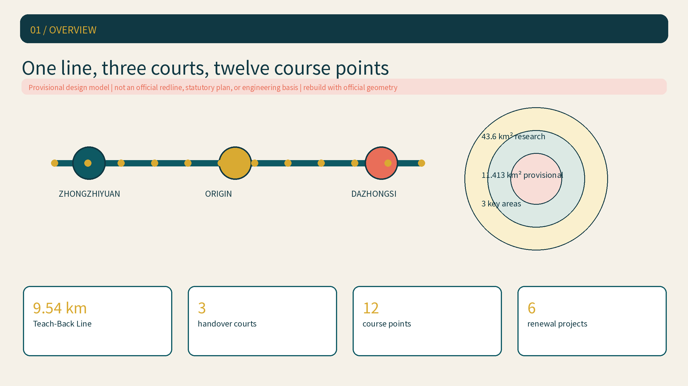
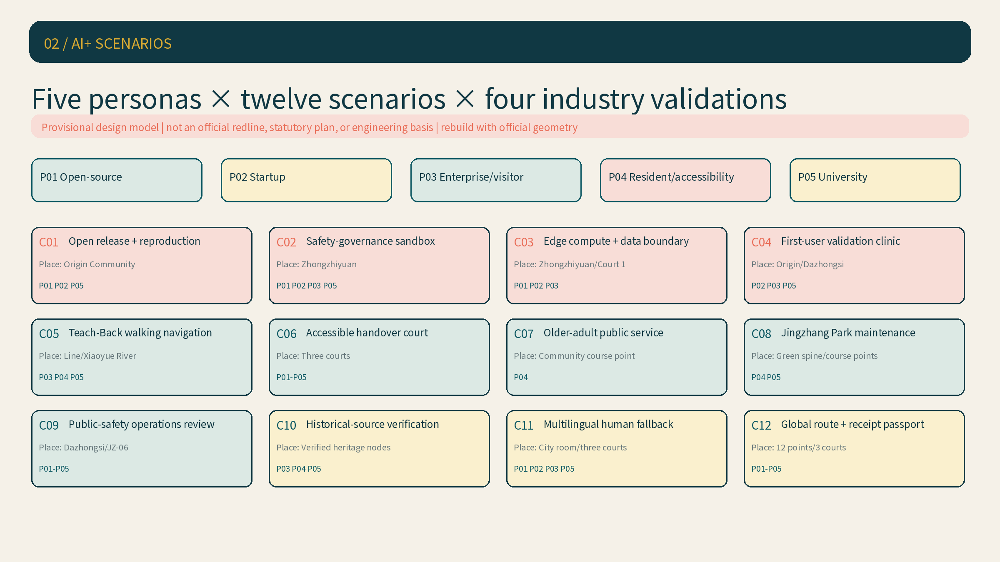
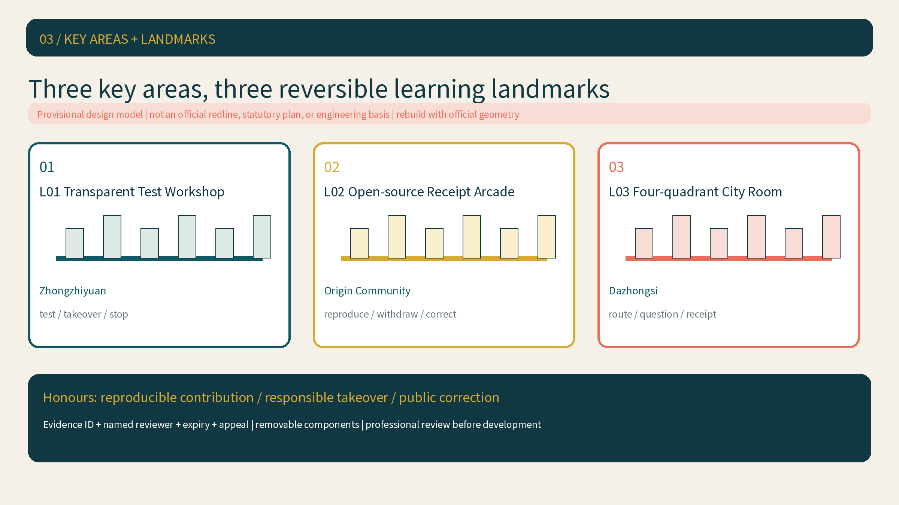
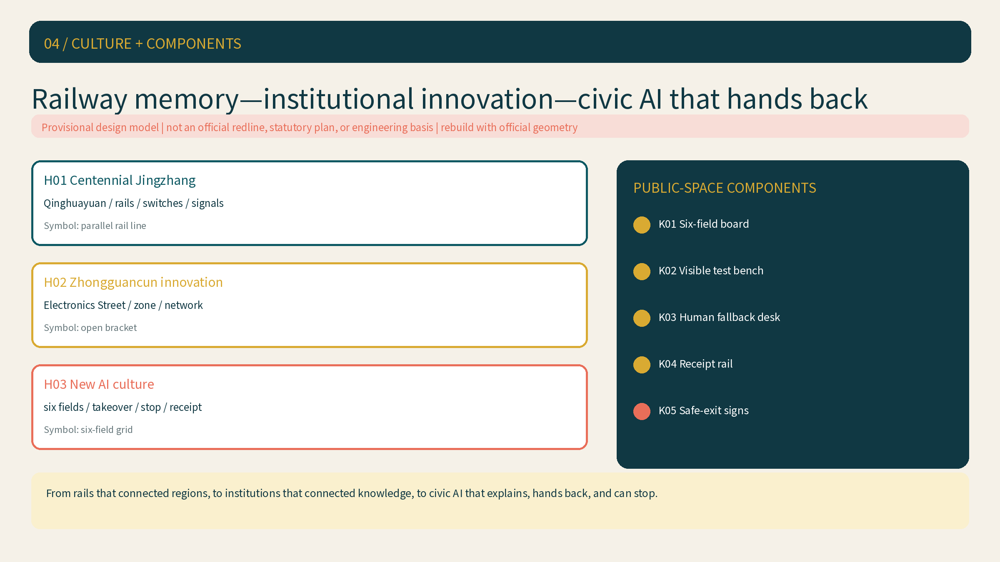
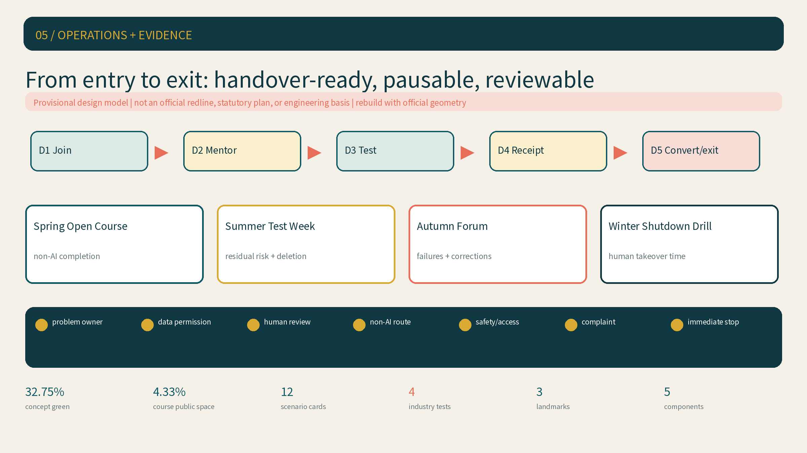

# Jingzhang LEARNLINE

> **One-sentence proposition:** Every AI project entering the city must teach back what problem it addresses, what minimum data it uses, who reviews it, and how the same service continues when AI is suspended.
>
> **Precision statement:** The package uses repository-supplied provisional geometry as a recomputable design model. It is not an official redline, statutory plan, or engineering basis. When official geometry is released, all nine spatial layers, metrics, figures, HTML files, and drawing sets must be rebuilt together.

## Design Basis and Source List

The proposal takes the official open-call announcement and the Agent Taskbook as its objective basis, with the site package, source registry, and professional-standard snapshots defining the working boundary [source:OFFICIAL-ANNOUNCEMENT] [source:AGENT-TASKBOOK] [depth:existing_conditions_diagnosis]. Full provenance, rights, permitted use, and limitations are recorded in `sources.json`. Statutory controls, road redlines, ownership, utilities, fire safety, heritage constraints, and building decisions remain pending official data.

The spatial model uses the repository's provisional overall boundary and three provisional key areas [source:BOUNDARY-SOURCE] [source:KEY-AREA-SOURCE]. Recomputed areas test internal consistency only. Any external use must retain the phrase “provisional design model.” Dashed boundaries, areas, and key-area locations are not approval conclusions [data:geometry/site_boundary.geojson#SITE-001] [metric:site_area_sqm].

LEARNLINE is governed by a six-field Teach-Back City covenant: problem, minimum necessary data, named human reviewer, non-AI path, pause/exit condition, and public course receipt. It turns transparency, takeover, suspension, and learning into gates that every open scenario must pass [standard:GENERATIVE-AI-INTERIM-MEASURES] [standard:BARRIER-FREE-ENVIRONMENT-LAW].

## Three-Level Scope Framework

The three scopes form one evidence chain rather than three disconnected drawing sets: the 43.6 sq km coordinated research area frames industry and future-city strategy; the approximately 11.413 sq km provisional overall model organizes renewal, mobility, blue-green systems, and facilities; and the three provisional key areas test whether space, scenarios, and operations close the loop [source:OFFICIAL-ANNOUNCEMENT] [depth:three_level_scope_framework].

| Level | Core question | LEARNLINE response | Review evidence |
| --- | --- | --- | --- |
| Coordinated research | How does an AI ecosystem connect to urban life? | Three positions, five functions, three areas and two wings, plus five regional interfaces | Function matrix, global cases, ecosystem chain |
| Overall design | How do industry and public interest become spatial? | One line, three courts, twelve course points, blue-green walking network | Nine GeoJSON layers, metrics, project phases |
| Key areas | How does each district build a distinct capability? | Verification, translation, and public-facing prototypes | Three-area figure, JZ projects, RACI |

The spatial concept is “one line, three handover courts, twelve public course points, and one continuous learning loop.” The 9.54 km Teach-Back Line links the courts along the Jingzhang heritage park. Course points host everyday scenarios. The learning loop connects deployment, human takeover, public feedback, repair, and exit [data:geometry/roads.geojson#ROAD-001] [metric:teach_back_line_length_m].

## Coordinated Research Area: Industry and Future City Research

### Position-function-area-node-role matrix

The three positions address Jingzhang heritage continuity, tangible everyday AI, and integrated innovation. The five functions are assigned to areas, nodes, and role types rather than left as slogans [standard:PROJECT-AGENT-OPEN-CALL-TASKBOOK] [depth:overall_spatial_structure].

| Five functions | Position | Primary interface | Spatial nodes | Operator roles to confirm |
| --- | --- | --- | --- | --- |
| Full-stack autonomous AI | AI Integration and Innovation Belt | Zhongzhiyuan + Zhongguancun Service Wing | Safety sandbox, edge-compute station | Research, test, compute, and safety-service roles |
| World-class AI ecosystem | AI Integration and Innovation Belt | AI Origin Community + Service Wing | Open-source hall, translation street | University transfer, incubation, legal, and IP roles |
| AI+ scenario paradigm | Urban AI Life Experience Belt | Xiaoyue River Wing + three key areas | Twelve course points, service street | Scenario owner, community service, evaluator roles |
| Intelligent and vibrant city | Urban AI Life Experience Belt | Dazhongsi + Xiaoyue River Wing | Roadshow room, walking guidance, public route | District operation, mobility, accessibility roles |
| Global AI governance voice | Jingzhang Culture Belt + AI Integration Belt | Zhongzhiyuan + public receipt network | Takeover Bell, Receipt Wall, annual forum | Governance research, public, safety, ethics roles |

### Regional interfaces

These interfaces define what could be exchanged and how it could be tested. They do not claim agreements, confirmed participants, or government commitments. A public course, joint test question, or open evidence pack is the minimum viable starting unit [source:AGENT-TASKBOOK].

| Interface | Proposed exchange | Spatial/operational connector | Evidence status |
| --- | --- | --- | --- |
| Beiwei Community | Community-service needs, non-AI paths, resident feedback methods | Xiaoyue River course point + quarterly receipt session | Taskbook direction; counterpart and authorization pending |
| Future Science City | Research outputs, engineering validation needs, talent courses | Origin Community hall + themed test week | Concept interface; no partnership claimed |
| Huairou Science City | AI for science, research instruments, trusted-data questions | Zhongzhiyuan sandbox + joint public course | Concept interface; data rights remain separate |
| Beijing E-Town | Manufacturing, robotics, and industrial scenario needs | Dazhongsi roadshow room + scenario demand list | Concept interface; no company list presumed |
| Beijing-Tianjin-Hebei network | Cross-regional talent, scenario demand, and review methods | Global Teach-Back Forum + reusable covenant template | Taskbook direction; mechanism to be co-created |

### Six global AI innovation ecosystems

The comparison shifts from governance registers alone to ecosystems that connect research, talent, enterprise, testing, and translation. Only mechanisms supported by primary institutional pages are used; promotional scale claims and investment promises are not imported.

| Case | Published ecosystem mechanism | Transferable move for LEARNLINE |
| --- | --- | --- |
| Vector Institute, Toronto | University research, talent programs, industry partners, AI engineering, and adoption [source:CASE-VECTOR] | Connect university talent in the Origin Community to joint projects through the Service Wing |
| Mila Ventures, Montreal | Research talent, venture training, acceleration, enterprise links, and early support [source:CASE-MILA] | Gate translation through research, team, first scenario, and a public receipt |
| AI Singapore | 100 Experiments, engineering apprenticeships, and real industry problems [source:CASE-AISINGAPORE] | Make Test Week both a talent program and minimum viable prototype review |
| Seoul AI Hub | Startup support, AI talent, shared exchange space, and international networks [source:CASE-SEOUL] | Combine shared space, enterprise service, and international display in the courts |
| AI Sweden | Partner network, technical infrastructure, shared testbed, data, and legal support [source:CASE-AISWEDEN] | Place technical testing, data responsibility, and regulatory dialogue side by side |
| appliedAI, Munich | Science, industry, public-sector, and startup collaboration for adoption and capability [source:CASE-APPLIEDAI] | Use cross-role project teams in the Service Wing without prescribing vendors |

### Eight-element ecosystem chain

Land and space provide reversible containers. Industry provides testable problems. Funding is staged and exit-ready. Talent learns through real projects. Compute and data open only under authorization. Every scenario needs a human reviewer, a pause mechanism, and a receipt. The Zhongguancun Service Wing connects legal, IP, funding readiness, standards, safety, and international links through role types that remain subject to confirmation.

| Element | Minimum offer | Evidence to advance | Failure or pause rule |
| --- | --- | --- | --- |
| Land | Reversible low-impact test space | Site authorization and use boundary | No authorization, no deployment |
| Space | Courts, course points, test benches | Accessibility and fire-safety screening | Shift to online/indoor fallback if unsuitable |
| Industry | Testable problem statement | Beneficiary, affected party, and baseline | Return if the problem cannot be verified |
| Funding | Staged support role | Public milestone and stop clause | Do not advance without the gate |
| Talent | Apprentices, researchers, product and service staff | Named mentor and human reviewer | Pause when responsibility is absent |
| Compute | Authorized development/test resources | Usage, energy, and security boundary | Degrade immediately when scope is exceeded |
| Data | Minimum, revocable data package | Source, license, retention, deletion evidence | Use synthetic/open data if rights fail |
| Scenario | Three low-risk tests + twelve course points | Metrics, feedback, and non-AI rehearsal | Suspend and publish a review on trigger |

## Overall Design Area: Urban Renewal and Regulatory-Plan-Level Urban Design

The provisional boundary stays visually subordinate. The Teach-Back Line forms a north-south public spine, and three east-west seams connect universities, communities, metro access, and industry. Land use, buildings, roads, green space, public space, and phasing derive from the same boundary so diagrams and evidence remain closed [data:geometry/land_use.geojson#LU-001] [data:geometry/buildings.geojson#BLDG-001] [metric:building_footprint_area_sqm].

Renewal uses three intensities: operations and wayfinding that can start first; reversible light structures after professional review; and permanent construction only after official planning, ownership, utilities, and engineering inputs. Building height, FAR, density, road redlines, and parcel decisions remain pending official data [standard:MOHURD-CONTROL-DETAILED-PLANNING] [depth:development_intensity_controls].

## Detailed Design of Key Areas

Each area has its own spatial language. Zhongzhiyuan is a visible test workshop with modular benches, test windows, and a low-carbon river edge. The Origin Community is an open translation street with active ground floors, shared steps, and a publishing arcade. Dazhongsi is a public city room with a station gateway, four-quadrant walking seam, and international roadshow space [data:geometry/key_areas.geojson#PROV-KEY-001] [depth:three_key_area_detailed_design].

| Key area | Core question | Distinct spatial move | First verifiable output |
| --- | --- | --- | --- |
| Zhongzhiyuan AI Acceleration Area | How are models and safety jointly tested? | Test workshop + Qinghe interface + takeover rehearsal | Three test protocols, pause rehearsal, safety receipt |
| Beijing AI Origin Community | How does research become usable service? | Open-source hall + translation street + campus-park seam | Open-source contribution, first-user test, translation receipt |
| Dazhongsi AI Cluster | How do AI-native services face the public? | Station city room + four-quadrant walk + data salon | Public experience, international roadshow, non-AI service record |

## AI Innovation Ecosystem, Personas, and AI+ Scenarios

Urban agents enter a course point only when named human responsibility and a non-AI route for the same task are both available. They may help identify walking breaks, maintenance needs, and service demand, but may not perform facial recognition, individual tracking, automated enforcement, or commercial resident profiling. Any real pilot still requires separate confirmation of data, venue, and professional permissions [standard:BARRIER-FREE-ENVIRONMENT-LAW] [standard:GENERATIVE-AI-INTERIM-MEASURES].

### Five personas and entry routes

Personas are not marketing segments. They test who may benefit, who may be harmed, and who can still complete the task when AI fails. The five personas map directly to all twelve cards [standard:PROJECT-AGENT-OPEN-CALL-TASKBOOK].

| ID | User and goal | Main spatial entry | Primary harm risk | Same-task non-AI route |
| --- | --- | --- | --- | --- |
| P01 Open-source developer | Reproduce, publish, and accept public challenge | Origin publishing hall; Zhongzhiyuan sandbox | Unclear rights; overstated test claims | Human code review, offline reproduction checklist, paper receipt |
| P02 Startup team | Find a first verifiable problem and compliant setting | Translation street; edge-compute station | Vendor lock-in, data overreach, no pilot exit | Human consultation, public problem list, phased exit window |
| P03 Enterprise or international visitor | Understand capability limits and submit a real need | Dazhongsi city room; global course route | Promotion replacing evidence, misleading translation, information asymmetry | Fixed bilingual signs, human guide, written status note |
| P04 Nearby resident, older adult, or disabled user | Complete everyday public services safely and equally | Xiaoyue River course points; three handover courts | Digital exclusion, excessive monitoring, inaccessible fallback | Human desk, phone/paper service, fixed accessible wayfinding |
| P05 University teacher or student | Connect research and courses to real public problems | Origin Community, Zhongzhiyuan, Jingzhang Park course points | Unclear academic rights; experiment risk spilling outward | Named mentor, human ethics/safety review, offline teaching pack |

### Reviewable C01-C12 scenario cards

C01-C04 are explicitly marked as industry test and validation scenarios; C05-C09 are public-service courses; C10-C12 are culture and international-communication courses. Every card completes the six-field contract and adds persona, place, operator, baseline/KPI, and failure response. All KPIs are future pilot-entry or process measures, not claims of current performance [data:geometry/public_space.geojson#PUBLIC-001] [metric:public_course_point_count].

#### C01 Open-source release and reproduction course | Industry validation 1

- **Problem and spatial node:** Close the gap between a visible demo and a reproducible result; located in the Origin Community publishing hall and Handover Court 2.
- **Minimum data and permission:** Team-submitted code, documentation, public or synthetic test data, licence inventory, and model/data cards; reject unclear training data, personal information, or uncleared work.
- **Role-based human review and operation:** R is the open-source course operator role, A the release-admission committee role, and C the IP and safety reviewer role; a named human signs every release.
- **Same-task non-AI route:** Use an offline reproduction checklist, human code walkthrough, and on-site rerun.
- **Personas:** P01, P02, P05.
- **Baseline/KPI/public receipt:** Record reproduction time and missing items before entry; every release pack must state licences, data limits, reproduction outcome, and human review, with public pass/fail/withdrawn/corrected status.
- **Pause threshold and failure response:** Take the pack offline when rights are unclear, a key claim cannot be reproduced, or a safety risk appears; retain withdrawal and correction history.

#### C02 Safety-governance sandbox | Industry validation 2

- **Problem and spatial node:** Expose model overreach, prompt injection, bias, and takeover gaps before entry into a real setting; located in the visible Zhongzhiyuan test workshop.
- **Minimum data and permission:** Synthetic or explicitly authorised fixed test sets, threat models, scripts, and logs; prohibit production data, real resident data, and unauthorised network calls.
- **Role-based human review and operation:** R is the sandbox operator role, A the test-admission committee role, and C the security, privacy, and domain reviewer role; C may directly stop a severe-risk test.
- **Same-task non-AI route:** Fixed test sheets, human judgement, and offline replay can complete the risk check independently.
- **Personas:** P01, P02, P03, P05.
- **Baseline/KPI/public receipt:** Freeze the risk list and scope before entry; retain every test item, human conclusion, takeover action, and residual risk, and publish a receipt without exploit details.
- **Pause threshold and failure response:** Isolate the environment, delete temporary data, and return the test for repair if unauthorised data, uncontrolled output, incomplete logs, or an absent reviewer is found.

#### C03 Edge-compute and data-boundary station | Industry validation 3

- **Problem and spatial node:** Test whether a small edge service can stay within energy, latency, retention, and shutdown limits; located in reversible equipment bays at Zhongzhiyuan and Handover Court 1.
- **Minimum data and permission:** Aggregated usage, energy, latency, error, and deletion logs; no device-owner identity, individual trajectory, or unrelated content.
- **Role-based human review and operation:** R is the technical operator role, A the scenario-owner role, and C the data, safety, energy, and facility reviewer role; the data steward is named on the admission card.
- **Same-task non-AI route:** Static information cache, human service desk, and paper guidance maintain basic service after power-off.
- **Personas:** P01, P02, P03.
- **Baseline/KPI/public receipt:** Measure the manual flow and device baseline first; usage, energy, takeover, retention, and deletion records must be complete and any exceedance traceable.
- **Pause threshold and failure response:** Degrade or power down when a published energy/data/latency limit is exceeded, deletion cannot be verified, or the responsible role is absent; publish the anomaly and recovery conditions.

#### C04 First-user validation and translation clinic | Industry validation 4

- **Problem and spatial node:** Translate a technical result into one verifiable, exit-ready first-user problem rather than an investment promise; located on the Origin translation street and in the Dazhongsi roadshow room.
- **Minimum data and permission:** Problem statement, rights status, voluntarily provided user feedback, and minimum-prototype record; confidential material requires separate clearance and stays outside the public pack.
- **Role-based human review and operation:** R is the translation-service role, A the project-initiator role, and C the IP, user-research, and industry reviewer role; conflicts of interest are disclosed.
- **Same-task non-AI route:** Human consultation booking, paper problem list, and face-to-face first-user interview complete the same step.
- **Personas:** P02, P03, P05.
- **Baseline/KPI/public receipt:** Record the problem, beneficiary, and current practice before entry; every admitted project completes at least one named human feedback record, evidence status, and continue/exit decision.
- **Pause threshold and failure response:** Return the project if rights are unclear, marketing exceeds evidence, participation is coerced, or conflicts are undisclosed; event exposure does not count as validation.

#### C05 Teach-Back Line walking-navigation course

- **Problem and spatial node:** Help the public complete a continuous walk along the line, three east-west seams, and key-area entrances; located on ROAD-001 and the Xiaoyue River scenario wing.
- **Minimum data and permission:** Human-surveyed segments, barriers, opening status, and anonymous aggregated feedback; do not collect individual trajectories or require phone location.
- **Role-based human review and operation:** R is the public-space operator role, A the district-coordination role, and C the transport and accessibility reviewer role.
- **Same-task non-AI route:** Fixed high-contrast signs, paper maps, and on-site staff provide the same route information.
- **Personas:** P03, P04, P05.
- **Baseline/KPI/public receipt:** Manually record travel time, breaks, and detours before the pilot; the route must remain usable when AI is off, and complaints, misdirection, and corrections enter a quarterly receipt.
- **Pause threshold and failure response:** Stop dynamic recommendation and return to a human-confirmed route when road status is unknown, a suggestion enters a hazardous area, or non-AI signage is missing.

#### C06 Accessible handover court

- **Problem and spatial node:** Let people with different sensory, mobility, or cognitive needs understand the course point, request help, and exit; covers the three handover courts and key entrances.
- **Minimum data and permission:** Human facility checks, public standards, and anonymous summaries of voluntary feedback; do not collect diagnoses, health records, or identity labels.
- **Role-based human review and operation:** R is the court operator role, A the public-space owner role, and C the accessibility professional and user-representative role.
- **Same-task non-AI route:** High-contrast, large-text, and paper signs, human explanation, and a service desk remain available; tactile and acoustic measures await professional design confirmation.
- **Personas:** P01-P05, with P04 tested first.
- **Baseline/KPI/public receipt:** Complete a human arrival-stay-understand-exit check before opening; every critical instruction must be human-reviewed, available in an alternative medium, and linked to a complaint channel.
- **Pause threshold and failure response:** Do not open a function if any critical step depends only on AI, an alternative medium is unavailable, or professional review is incomplete; publish the repair item.

#### C07 Older-adult-friendly public-service assistant

- **Problem and spatial node:** Allow older residents to consult, register, and seek help without installing an app or learning prompts; located at Xiaoyue River community course points.
- **Minimum data and permission:** Current service request and voluntarily supplied contact details; do not retain conversation by default or collect health data, household profiling, or faces.
- **Role-based human review and operation:** R is the community-service role, A the service-scenario owner role, and C the older-adult service, privacy, and accessibility reviewer role.
- **Same-task non-AI route:** Human counter, telephone, paper form, and assisted-service instructions complete the same service.
- **Personas:** P04 and accompanying family or carers.
- **Baseline/KPI/public receipt:** Measure human-service completion and waiting time first; human takeover time, non-AI completion, complaints, and deletion records must remain inspectable.
- **Pause threshold and failure response:** Stop the service and prioritise human remedy if a vulnerable user is forced into AI, cannot reach a person, data is retained beyond scope, or an error affects rights.

#### C08 Jingzhang Park maintenance learning point

- **Problem and spatial node:** Convert observed green-space, facility, and walking-environment anomalies into verifiable maintenance tickets; located on the conceptual Jingzhang Park spine and course-point public spaces.
- **Minimum data and permission:** Facility ID, human inspection record, environmental images stripped of faces and plates, and public weather data; do not track individuals.
- **Role-based human review and operation:** R is the park-maintenance role, A the blue-green-space operator role, and C the landscape, ecology, and flood-safety reviewer role.
- **Same-task non-AI route:** Human patrol, paper repair request, and fixed telephone contact remain available.
- **Personas:** P04, P05.
- **Baseline/KPI/public receipt:** Establish a human facility inventory before opening; every machine suggestion requires human confirmation, with false positives, action, and unclosed tickets published quarterly.
- **Pause threshold and failure response:** Stop the recognition module if images cannot be de-identified, a suggestion may harm plants or facilities, false positives exceed the stated limit, or the professional role is absent.

#### C09 Public-safety operational review course

- **Problem and spatial node:** Test whether large-event and public-space prompts can support human response without automated enforcement; located in the Dazhongsi city room and the JZ-06 event route.
- **Minimum data and permission:** Exercise script, environment-level counts, human incident records, and anonymous complaints; prohibit faces, identity inference, individual trajectories, and enforcement databases.
- **Role-based human review and operation:** R is the event-safety operator role, A the event-governance committee role, and C the public-safety, fire, privacy, and accessibility reviewer role; decisions remain human-only.
- **Same-task non-AI route:** Human patrol, public address, fixed evacuation maps, and an offline command plan operate independently.
- **Personas:** P01-P05.
- **Baseline/KPI/public receipt:** Freeze the manual plan before rehearsal; every prompt needs human confirmation, action, and cancellation records, and the shutdown drill produces a public review.
- **Pause threshold and failure response:** Stop the model and switch to the manual plan if identity recognition, automatic penalty, an unexplained high-risk alert, or false positives above the stated limit occur.

#### C10 Jingzhang historical-source verification course

- **Problem and spatial node:** Make railway stories traceable and correctable rather than using history as technology decoration; placed along the line and at verified cultural nodes such as Qinghuayuan Station.
- **Minimum data and permission:** Registered government publications, rights-cleared archive metadata, and curatorial notes; unauthorised images, marks, portraits, and archival originals stay out.
- **Role-based human review and operation:** R is the culture-course operator role, A the content-governance role, and C the railway-history, heritage, and copyright reviewer role.
- **Same-task non-AI route:** Fixed bilingual labels, human guides, and printed material provide the full story.
- **Personas:** P03, P04, P05.
- **Baseline/KPI/public receipt:** Create a claim-by-claim source table before publication; every fact has a source ID, human review, correction channel, and traceable version history.
- **Pause threshold and failure response:** Remove and mark content pending review when facts are disputed, rights are unclear, generated text is untraceable, or heritage boundaries are unverified.

#### C11 Multilingual visitor service with human fallback

- **Problem and spatial node:** Help international visitors understand routes, event status, risk, and assistance; located in the Dazhongsi city room, three courts, and global course route.
- **Minimum data and permission:** Public event information, approved glossary, and text voluntarily entered for the current task; do not retain voice by default or profile voiceprint or nationality.
- **Role-based human review and operation:** R is the multilingual-service role, A the content-publisher role, and C the professional translation, public-safety, and accessibility reviewer role.
- **Same-task non-AI route:** Fixed Chinese-English signs, human interpreter duty, and paper emergency cards provide the same critical information.
- **Personas:** P03 plus international members of P01, P02, and P05.
- **Baseline/KPI/public receipt:** Establish a human glossary and FAQ first; all official or safety wording is human-reviewed, with source text, translation, version, and complaint handling inspectable.
- **Pause threshold and failure response:** Stop machine translation and issue a correction after a safety mistranslation, false official commitment, unclear source version, or unavailable human transfer.

#### C12 Global Teach-Back route and receipt passport

- **Problem and spatial node:** Join twelve course points, three courts, and four seasonal events into a selectable and exit-ready public learning route; corresponds to JZ-06 and ROAD-001.
- **Minimum data and permission:** Anonymous paper or digital stamps, public event status, and voluntary registration details; continuous location or identified trajectories are never participation conditions.
- **Role-based human review and operation:** R is the event-operator role, A the event-governance committee role, and C the transport, public-safety, accessibility, privacy, and international-communication reviewer role.
- **Same-task non-AI route:** Paper passport, fixed route map, on-site volunteers, and manual check-in operate independently.
- **Personas:** P01-P05.
- **Baseline/KPI/public receipt:** Complete human accessibility and capacity checks before an event; each stop's status, complaints, shutdowns, participation route, and unresolved issues form a bilingual receipt.
- **Pause threshold and failure response:** Shorten, postpone, or cancel the route when capacity, transport, weather, or safety conditions fail, an accessible alternative breaks, or registration data exceeds scope; publish the reason and next action.

## Land Use, Building Scale, and Retain-Renovate-Demolish Strategy

The land-use model covers the provisional boundary without internal overlap and follows public classification standards. The building layer tests conceptual footprints and capacity only; it does not identify ownership or demolition objects [standard:MNR-LAND-USE-CLASSIFICATION-GUIDE] [data:geometry/land_use.geojson#LU-001]. Until existing-building, ownership, heritage, and structural evidence is available, the method is retain first, reversible light retrofit second, and permanent action only on a confirmed trigger [depth:retain_renovate_demolish].

Permanent buildings, underground space, bridges, tunnels, and rail interfaces require discipline-specific review. Current drawings show functional relationships, walking links, and reversible prototypes only; engineering scale and investment are outside the authorized claim.

## Transport, Rail, Municipal Infrastructure, and Public Services

Walking and cycling form the primary experience. The Teach-Back Line provides north-south continuity, three east-west seams connect key areas to surrounding destinations, and station thresholds follow arrival, pause, understand, and continue [data:geometry/roads.geojson#ROAD-001] [depth:traffic_rail_slow_parking]. Dazhongsi four-quadrant access, the North Fifth Ring crossing, and rail interchange remain conceptual problem statements, not traffic-engineering conclusions.

Municipal and digital infrastructure is small-scale, distributed, and observable. Edge-compute nodes must disclose energy, safety, data boundaries, and operational responsibility. Public services retain a basic path during network or system failure [data:geometry/constraints.geojson#CONSTRAINTS] [depth:municipal_new_infrastructure].

## Blue-Green Network, Public Space, and Urban Character

Within the provisional model, the conceptual green spine is **3,737,700.314 sqm (32.75%)** and public course space is **494,175.339 sqm (4.33%)**. Both are recomputed in EPSG:4548 and describe internal design allocation only; neither is an official area nor a statutory ratio [data:geometry/green_space.geojson#GREEN-001] [data:geometry/public_space.geojson#PUBLIC-001] [metric:green_ratio].

The character narrative moves from railway signal to knowledge handover to public receipt. Deep teal represents heritage and reliable governance, warm gold marks learning and transfer, and coral is reserved for pause, human takeover, and risk. Zhongzhiyuan uses a workshop language, the Origin Community an open arcade, and Dazhongsi a station city room. They share a brand grammar without duplicating one facade [depth:blue_green_public_space].

### agent.4 | AI pilgrimage landmarks, honour display, and public-space component library

In this proposal, a “pilgrimage landmark” is not a permanent monument. It is a learning node where the public can see testing, challenge, takeover, and correction. Every item uses removable components; no permanent build proceeds before siting, structure, transport, fire, accessibility, and heritage conditions receive professional confirmation [standard:PROJECT-AGENT-OPEN-CALL-TASKBOOK] [data:geometry/public_space.geojson#PUBLIC-001].

| Landmark | Area / space type | Public experience and first receipt | Operating responsibility | Reversibility and pending review |
| --- | --- | --- | --- | --- |
| L01 Transparent Test Workshop | Zhongzhiyuan / visible test edge | Observe fixed tests, human takeover, and shutdown rehearsal; publish scope and residual risk | Sandbox operator R; test-admission committee A | Demountable benches and enclosure; safety, fire, loading, energy, and accessibility review pending |
| L02 Open-source Receipt Arcade | Origin Community / publishing arcade | Reproduce an open result and inspect pass, fail, withdrawal, and correction history | Open-source course operator R; release-admission role A | Replaceable displays, seats, and low-voltage terminal; IP, campus interface, egress, and accessibility pending |
| L03 Four-quadrant Teach-Back City Room | Dazhongsi / station city room | Choose a bilingual route, submit a question, and inspect public receipts with human guidance available | Event operator R; event-governance committee A | Removable light stage, signs, and desk; rail, fire, capacity, heritage, and accessibility pending |

The honour system avoids an “AI ranking wall.” It displays three time-limited public honours: **Reproducible Contribution** for human-verified open work, **Responsible Takeover** for a timely stop or human transfer, and **Public Correction** for voluntary withdrawal, repair, and review. Every entry carries an evidence ID, named reviewer role, expiry date, and appeal route; it is removed when evidence expires, rights are withdrawn, or two update cycles are missed. Admitting failure and stopping responsibly therefore become visible civic values.

| Component | Purpose and AI-off state | Reversible construction | Accessibility / professional boundary |
| --- | --- | --- | --- |
| K01 Six-field course board | Permanently shows problem, data, human review, non-AI route, pause, and receipt; readable without power | Insert-based bilingual panel | High contrast, large text, not colour-only; user review required |
| K02 Visible test bench | Supports offline tests, human walkthrough, and takeover rehearsal | Standard modular frame, independent of permanent structure | Seated/standing use; electrical, loading, and fire review pending |
| K03 Human fallback desk | Continues consultation, registration, translation, and complaints after AI shutdown | Mobile low counter and paper cabinet | Wheelchair approach plus hearing/writing options; service flow needs accessibility review |
| K04 Public receipt rail | Shows pass, fail, pause, correction, and unresolved items | Replaceable card cassettes; no third-party marks | Reachable paper copy and read-aloud version; rights registered item by item |
| K05 Safe-exit sign family | Points to a human desk, non-AI route, exit, and complaint channel | Replaceable wall, floor, and freestanding signs | Kept distinct from statutory fire/transport signs; never presented as an official instruction |

### agent.5 | Jingzhang history—Zhongguancun innovation—new AI culture system

The narrative moves from **railways connecting places**, through **institutions connecting knowledge**, to **civic AI that can explain and return power**. Government publications document Jingzhang railway heritage, Qinghuayuan Station, rails, switches, signal lamps, and the north-south/east-west public-space network. They support conceptual curation and node verification only, not heritage designation or site survey [source:CULTURE-JINGZHANG-PLANNING] [source:CULTURE-JINGZHANG-PHASE1] [source:CULTURE-JINGZHANG-PHASE2].

| Layer | Registered resources and meaning | Spatial carrier | Display / review rule |
| --- | --- | --- | --- |
| H01 Centennial Jingzhang | Qinghuayuan Station, rails, switches, signal lamps, longitudinal rail connection, and east-west stitching | Historic segments of the Teach-Back Line, verified Qinghuayuan nodes, fixed labels | Source every fact; separately clear archival images and objects; heritage boundary awaits professional review |
| H02 Zhongguancun innovation culture | From Electronics Street and early science-service organisations to the experimental zone, science park, and multi-actor innovation network | Origin open-source arcade, translation street, first-user clinic | Explain institutional evolution, not company promotion; copy no marks and invent no partnership or funding [source:CULTURE-ZGC-EXHIBITION] [source:CULTURE-ZGC-HISTORY] |
| H03 New AI culture | Six-field covenant, human takeover, same-task non-AI route, shutdown rehearsal, and public receipt | Three courts, twelve course points, honour rail, and four seasonal events | Identify as an original proposal concept; never present model output as an official conclusion or achieved performance |

Wayfinding has three levels. Level 1, `LEARNLINE`, is the corridor brand and carries only route and shared governance grammar. Level 2, `H01/H02/H03`, marks the cultural chapters with a parallel rail line, open bracket, and six-field receipt grid. Level 3 is the bilingual node label, always showing source, status, human review, and update date. Cultural signs may not use the coral pause/risk colour as decoration or override statutory transport, fire, heritage, or accessibility signs.

The main international line is: **“From rails that connected regions, to institutions that connected knowledge, to civic AI that explains, hands back, and can stop.”** The fixed status line is: **“Concept proposal. Historical labels require a source and human review.”** English copy does not call a conceptual node “approved,” “official landmark,” or “implemented”; the C10 historical review and C11 translation review maintain versions.

## Renewal Projects, Implementation Policy, and Phasing

The six projects use role-based RACI. A is accountable, R operates, C provides professional review, and I is informed. Every role is a type to be confirmed and does not imply institutional authorization [data:geometry/phasing.geojson#PHASE-001] [depth:renewal_project_list].

| Project | Accountable role | Operating role | Human review and data responsibility | Safety/accessibility and pause | Minimum public receipt KPI |
| --- | --- | --- | --- | --- | --- |
| JZ-01 Walking-break repair | District coordination | Public-space operations | Mobility reviewer; scenario owner holds data duty | Mobility/accessibility reviewer; A pauses | Break list, non-AI signs, one shutdown drill |
| JZ-02 Qinghe innovation edge | Park coordination | Blue-green operations | Ecology reviewer; minimum data | Ecology/flood reviewer; A pauses | Quarterly maintenance and incident receipt |
| JZ-03 Near-campus translation street | Campus-park coordination | Translation services | Tech-transfer reviewer; rights holder owns data | IP/accessibility reviewer; A pauses | Provenance, first-user test, exit record |
| JZ-04 Dazhongsi four-quadrant walk | Station-city coordination | District operations | Mobility reviewer; no individual tracking | Mobility/fire/accessibility reviewer; A pauses | Route map and manual crowd inspection |
| JZ-05 Public service and edge compute | Scenario committee | Technical operations | Named human takeover; scenario owner is data controller | Safety/privacy role has immediate stop power | Usage, energy, takeover, deletion receipt |
| JZ-06 Global AI event route | Event governance committee | Event operations | Content/translation review; registration data owner | Safety/accessibility role may stop | Participation, access, complaints, incidents, repair |

The three phases have hard gates. “Institution first” requires the covenant, three low-risk lessons, a takeover roster, and one non-AI rehearsal. “Reversible space” requires twelve course points, accessibility screening for three courts, and two consecutive quarterly receipts. “Conditional expansion” starts only after official geometry, planning, ownership, utilities, and a real operator are confirmed by professional teams. Missing accountability, uncleared data, unusable non-AI service, major safety/accessibility defects, or two missed receipts triggers suspension and return to the prior phase [depth:phasing_implementation].

### agent.6 | Developer community, event brand, and conversion operating kit

The developer community follows a reversible five-step chain: join, mentor, test, public receipt, and conversion or exit. Exit never deletes an already published failure or correction record. Every named institution is a role type to be confirmed, not an established government programme or partnership.

| Step | Admission and minimum output | A / R / C / I | KPI and public receipt | Pause / exit condition |
| --- | --- | --- | --- | --- |
| D1 Join | One-page problem card, rights status, minimum data, code-of-conduct acknowledgement, complaint contact | A community admission; R community operations; C rights/safety/accessibility; I selected team and public | 100% material completion; publish accepted, returned, or rejected and reason category | No entry when provenance is unclear, human review is refused, or no complaint route exists |
| D2 Mentor match | Named mentor role, problem boundary, conflict disclosure, three checkpoints | A community governance; R mentor operations; C domain/ethics review; I team | Mentor, scope, checkpoints, and conflict status inspectable | Pause for undisclosed conflict, absent mentor, or scope overreach |
| D3 Scenario test | Enter one of C01-C04 with data permission, human takeover, non-AI route, and shutdown rehearsal | A scenario-opening committee; R test operations; C data/safety/industry/accessibility; I affected roles | Admission, result, residual risk, and shutdown record for every test | Isolate and exit after data overreach, failed takeover, unusable non-AI route, or severe risk |
| D4 Public receipt | Bilingual problem, method, result, failure, correction, unresolved item, and version | A evidence governance; R receipt editor; C original reviewers/translator; I public | Pass and fail published together; complaint and revision carry deadline and status | Do not publish and return if conclusions are untraceable, success-only, or rights-uncleared |
| D5 Convert / exit | Talent, enterprise, or international handover sheet, or archived exit sheet; no funding or contract promise | A conversion admission; R translation service; C IP/user/international communication; I team and scenario role | Continue, conditional-continue, or exit decision with owner for every project | Exit when rights are unclear, the user problem fails, evidence is weak, or external claims are false |

Scenario opening has seven mandatory gates: a real problem owner role, minimum data with clear provenance and permission, named human review, a same-task non-AI route, safety and accessibility review, a complaint channel, and a role with immediate stop authority. Event branding, space, or attraction resources cannot substitute for a missing gate.

`LEARNLINE` is the parent brand. `OPEN COURSE`, `TEST WEEK`, `TEACH-BACK FORUM`, and `SHUTDOWN DRILL` are four event submarks. A submark appears only on material with a completed six-field contract and a visible concept/test/paused/closed status. It may not be combined with a third-party mark to imply sponsorship or use unproven phrases such as “officially designated” or “implemented project.” Team material, model captures, people, and event photographs require item-level permission and are removed when permission is withdrawn.

| Conversion path | Prior evidence | Handover role type and output | KPI | Exit protection |
| --- | --- | --- | --- | --- |
| Talent | Real course, named mentor record, and D4 receipt | University/research/employment-service role to be confirmed; capability and responsibility record | At least one verifiable work, mentor assessment, and continue/exit decision | No exposure ranking; participant may withdraw non-essential personal data |
| Enterprise | Verifiable user problem, lawful data, first-user feedback, and shutdown plan | Scenario-owner/industry-service role to be confirmed; conditional handover sheet | Evidence, permission, cost assumption, risk, and next gate complete | No order, funding, or venue promise; archive and exit when conditions fail |
| International | Substantively equivalent bilingual evidence pack, glossary, status line, and human translation review | International-exchange/professional-network role to be confirmed; bilingual project card | Claim, qualifier, source, and version aligned | Pause communication after an official-status mistranslation, unclear rights, or unavailable human response |

The annual loop is a handover-ready operating matrix. Attendance is capacity information, not a core success metric.

| Event / chain | Admission material | A / R / C / I | Resource assumption and data duty | Complaint route | KPI and review output | Exit trigger |
| --- | --- | --- | --- | --- | --- | --- |
| Spring Open Course | Problem card, course board, teacher/human-fallback roster, venue and material permission | A course governance; R course operations; C content/accessibility/safety; I participants | Reversible classroom and paper pack; course operator holds minimum registration data and deletes it on schedule | Human desk plus paper/telephone route | Non-AI completion, takeover time, complaint closure; bilingual course receipt | Missing human fallback, uncleared critical material, or failed accessible route |
| Summer Test Week | C01-C04 entry pack, threat/test scope, shutdown script | A test admission; R sandbox operations; C data/safety/industry; I affected roles | Isolated test bays and synthetic/authorised data; scenario owner is data controller | Independent safety/privacy reporting route | Test coverage, residual risk, takeover and deletion record; risk receipt | Unauthorised data, incomplete logs, severe risk, or absent owner |
| Autumn Teach-Back Forum | D4 receipts, bilingual agenda, conflict and copyright inventory | A forum governance; R event operations; C evidence/translation/accessibility; I public | Reversible venue and remote pack; registration role deletes data on schedule | Bilingual human desk plus post-event appeal | Failure/correction share and unresolved-item closure; forum receipt | Promotion replacing evidence, false status translation, ownerless complaint, or over-capacity |
| Winter Shutdown Drill | Manual plan, contacts, fixed signs, restoration conditions | A safety governance; R scenario operations; C public safety/fire/accessibility/privacy; I all users | Offline/power-off window; collect no new personal data | Exercise observer plus paper complaint | Takeover time, non-AI completion, misleading points; shutdown review | Stop and repair if manual service fails or evacuation/safety conditions are inadequate |
| Developer conversion chain | Complete D1-D4 record, rights and exit status | A conversion admission; R translation service; C IP/user/industry/international; I team and scenario role | Mentor, test bay, and handover template all to be confirmed; team and scenario each hold their own data duty | Independent appeal email/telephone role plus in-person desk | Continue/conditional/exit distribution and reasons; handover or exit sheet | Weak evidence, invented partnership/funding, data overreach, or constrained exit right |

## Metrics, Area Recalculation, and Compliance Matrix

The single reconciled result is: provisional overall boundary **11,412,825.386 sqm**; Teach-Back Line **9,540 m**; conceptual green spine **3,737,700.314 sqm (32.75%)**; public course space **494,175.339 sqm (4.33%)**; three handover courts, twelve course points, and six renewal projects are structured metrics [metric:site_area_sqm] [metric:green_space_area_sqm] [metric:public_space_area_sqm].

The compliance matrix maps announcement tasks 1.3-1.5 and agent.1-agent.6. The standard matrix records evidence and gaps. The design-depth matrix links each requirement to machine evidence and human-readable outputs [depth:metrics_recalculation]. FAR, height, density, road redlines, and parcel-level decisions remain pending official data.

## Risk, Copyright, and Compliance

Primary risks are absent accountability, excessive data, failed human fallback, non-suspendable pilots, and receipts that report success only. The six-field covenant, RACI, phase gates, and exit rules turn those risks into checkable actions. All spatial moves are conceptual suggestions for professional development; they do not replace formal planning or constitute approval, funding, or engineering feasibility [depth:risk_missing_data].

Chinese web pages embed a subset of Noto Sans CJK SC for portable rendering under the SIL Open Font License 1.1. The drawing PDFs embed the required glyphs from the same font. Case sources are used only to compare mechanisms; no third-party images, trademarks, or promotional materials are copied. Any later font, map, image, portrait, company mark, or event asset must receive a new provenance and rights record [source:FONT-NOTO-CJK].

## References

- Official announcement and taskbook: [source:OFFICIAL-ANNOUNCEMENT] [source:AGENT-TASKBOOK]
- Site package, registry, and provisional geometry: [source:SITE-PACKAGE] [source:SOURCE-REGISTRY] [source:BOUNDARY-SOURCE]
- North American and Asian ecosystem cases: [source:CASE-VECTOR] [source:CASE-MILA] [source:CASE-AISINGAPORE]
- European and Seoul ecosystem cases: [source:CASE-SEOUL] [source:CASE-AISWEDEN] [source:CASE-APPLIEDAI]
- Jingzhang railway culture and public-space sources: [source:CULTURE-JINGZHANG-PLANNING] [source:CULTURE-JINGZHANG-PHASE1] [source:CULTURE-JINGZHANG-PHASE2]
- Zhongguancun innovation culture and institutional history: [source:CULTURE-ZGC-EXHIBITION] [source:CULTURE-ZGC-HISTORY]
- Full URLs, access dates, rights, and limitations are in `sources.json`; complete formulas are in `metrics.json`.
