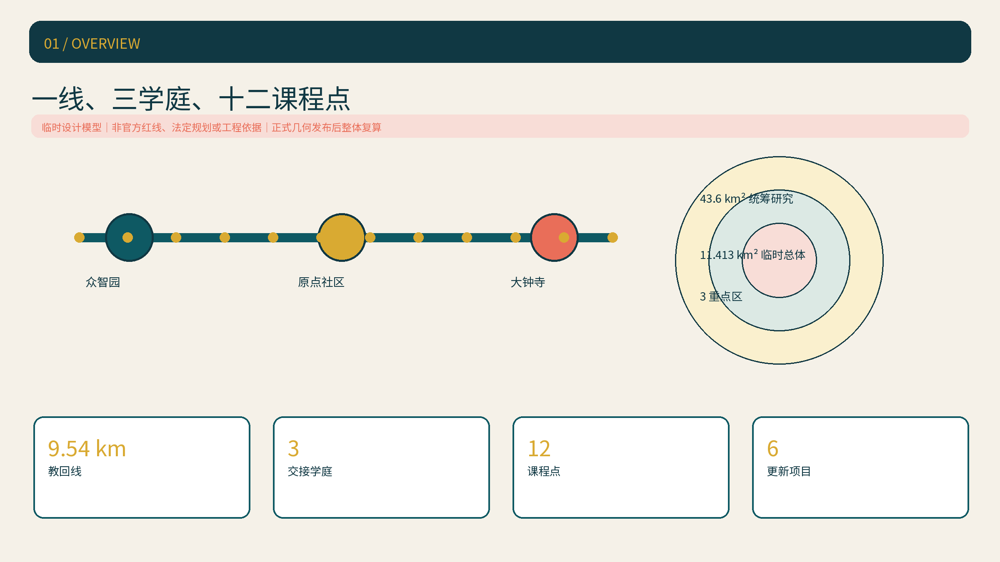
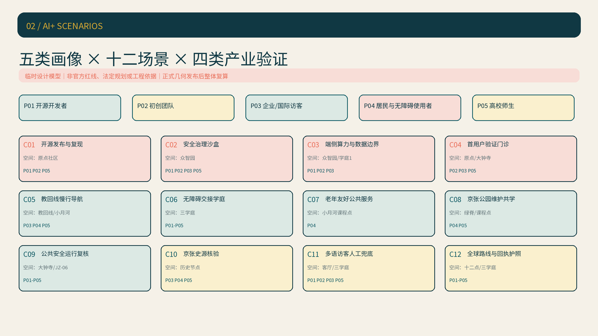
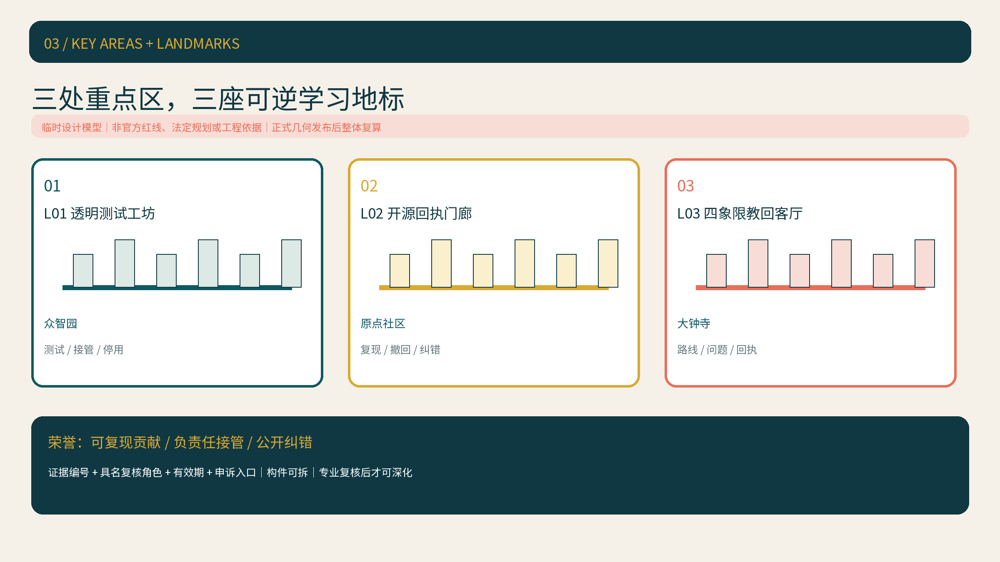
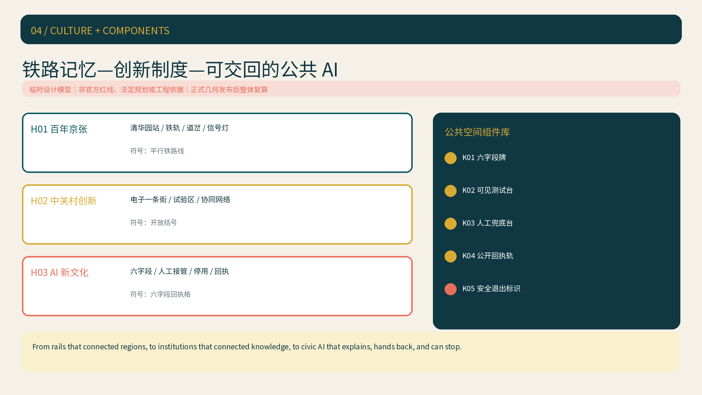
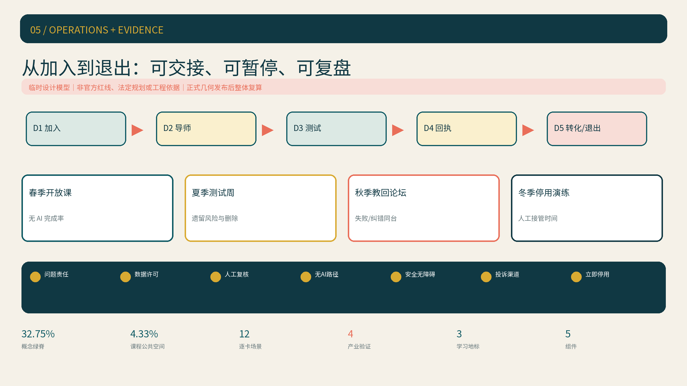

# 京张共学线 LEARNLINE

> **方案一句话**：让每个进入城市的 AI 项目都能向公众“教回”它解决什么问题、使用什么数据、由谁人工复核、停用时如何继续服务。
>
> **精度声明**：本方案使用仓库提供的临时边界建立可复算设计模型，不是官方红线、法定控规或工程实施依据；正式几何发布后须整体重算九类空间数据、指标、图件、HTML 与图册。

## 设计依据与资料清单

本方案以《百年京张AI创新带城市设计国际方案征集资格预审公告》和面向智能体任务书为目标依据，以场地包、来源登记表和专业标准快照为工作边界 [source:OFFICIAL-ANNOUNCEMENT] [source:AGENT-TASKBOOK] [depth:existing_conditions_diagnosis]。来源、许可、用途和限制完整登记在 `sources.json`；需要正式数据才能判断的控规、道路红线、权属、市政、消防、文保与建筑拆改留事项继续保留为“待正式数据补齐”。

空间模型采用仓库临时总体边界与三处临时重点区，分别登记为 [source:BOUNDARY-SOURCE] 和 [source:KEY-AREA-SOURCE]。当前可复算面积只用于检验方案内部一致性；任何外部引用都必须同时保留“临时设计模型”限定。图件中的虚线边界、面积指标和重点区位置均不构成审批结论 [data:geometry/site_boundary.geojson#SITE-001] [metric:site_area_sqm]。

LEARNLINE 的核心制度是“教回城市（Teach-Back City）”六字段契约：问题、最少必要数据、具名人工复核、无 AI 同任务路径、暂停/退出条件、公开课程回执。它把透明、可接管、可停用和可复盘从抽象原则变成每个场景开放前都要通过的城市门槛 [standard:GENERATIVE-AI-INTERIM-MEASURES] [standard:BARRIER-FREE-ENVIRONMENT-LAW]。

## 三层范围工作框架

三层范围不是三套互不相干的图纸，而是一条“战略判断—空间配置—片区验证”的证据链：43.6 平方公里统筹研究范围提出产业与未来城市关系；约 11.413 平方公里临时总体设计模型组织更新、交通、蓝绿和设施；三处临时重点区验证空间、场景和运营能否闭环 [source:OFFICIAL-ANNOUNCEMENT] [depth:three_level_scope_framework]。

| 层级 | 关键问题 | LEARNLINE 回答 | 审查落点 |
| --- | --- | --- | --- |
| 统筹研究范围 | AI生态如何与城市生活协同 | 三定位、五功能、三区两翼和五类区域接口 | 方案级功能矩阵、全球案例与生态要素链 |
| 总体设计范围 | 产业与公共利益如何落到空间 | 一线、三学庭、十二课程点、蓝绿慢行网 | 九类 GeoJSON、指标与分期清单 |
| 重点区域范围 | 三处片区如何形成不同能力 | 验证、转化、面向公众的三种空间原型 | 三处重点区图、JZ项目与RACI |

总体概念为“一线、三座交接学庭、十二个公共课程点、一个持续学习环”。9.54 公里教回线沿京张遗址公园串联三座学庭；课程点承载日常可体验场景；持续学习环把部署、人工接管、公众反馈、整改和退出连成一条可审查流程 [data:geometry/roads.geojson#ROAD-001] [metric:teach_back_line_length_m]。

## 统筹研究范围产业与未来城市研究

### 三定位—五功能—三区两翼—空间节点—角色矩阵

三大定位分别强调京张历史连续性、可感知的都市 AI 日常和从研发到场景的融合创新；五大功能不是口号，而由具体片区、节点和待确认角色共同承担 [standard:PROJECT-AGENT-OPEN-CALL-TASKBOOK] [depth:overall_spatial_structure]。

| 五大功能 | 对应定位 | 三区两翼主接口 | 空间节点 | 待确认运营角色 |
| --- | --- | --- | --- | --- |
| AI全栈自主创新体系 | AI融合创新带 | 众智园 + 中关村科技服务翼 | 安全治理沙盒、端侧算力驿站 | 研究平台、测试机构、算力与安全服务角色 |
| 世界级AI创新生态 | AI融合创新带 | AI原点社区 + 科技服务翼 | 开源发布厅、成果转化街 | 高校技术转移、孵化、法务与知识产权服务角色 |
| AI+场景赋能新范式 | 都市AI生活体验带 | 小月河场景赋能翼 + 三处重点区 | 十二课程点、公共服务样板街 | 场景业主、社区服务与独立评估角色 |
| 智能化AI活力城市 | 都市AI生活体验带 | 大钟寺 + 小月河场景赋能翼 | 路演客厅、慢行导航、公共体验路线 | 街区运营、交通与无障碍复核角色 |
| AI治理全球话语权 | 百年京张文化带 + AI融合创新带 | 众智园 + 全线公开回执网络 | 人工接管钟、回执墙、年度论坛 | 治理研究、公众代表、独立安全与伦理复核角色 |

### 区域协同接口

协同关系只定义“可以交换什么、通过何种接口验证”，不声称已签约或获得政府承诺。每项合作均以公开课、联合测试议题或开放资料包为最小启动单元，真实主体和授权需后续确认 [source:AGENT-TASKBOOK]。

| 协同对象 | 建议交换内容 | 空间/运营接口 | 证据状态 |
| --- | --- | --- | --- |
| 北纬社区 | 社区AI服务需求、无AI替代路径与居民反馈方法 | 小月河课程点 + 季度回执会 | 任务书要求；对象与授权待确认 |
| 未来科学城 | 科研成果、工程验证需求与人才课程 | 原点社区发布厅 + 专题测试周 | 概念接口；未主张合作成立 |
| 怀柔科学城 | 科学智能、科研仪器与可信数据议题 | 众智园安全沙盒 + 联合公开课 | 概念接口；数据另行清权 |
| 北京经开区 | 制造、机器人和产业场景需求 | 大钟寺路演客厅 + 场景需求清单 | 概念接口；企业名单不预设 |
| 京津冀创新网络 | 跨区域人才、场景需求和复盘方法 | 全球教回论坛 + 可复用六字段模板 | 任务书方向；机制待共建 |

### 六个全球 AI 创新生态案例

案例选择从“治理机制”转向“研究—人才—企业—测试—转化”的生态组织，并只提取官方页面可支持的机制，不照搬规模数字或招商承诺。

| 案例 | 已公开的生态机制 | 对 LEARNLINE 的可转译做法 |
| --- | --- | --- |
| 多伦多 Vector Institute | 高校研究、人才项目、行业伙伴、AI工程与应用协作 [source:CASE-VECTOR] | 原点社区连接高校人才，科技服务翼把问题转成联合项目 |
| 蒙特利尔 Mila Ventures | 研究人才、创业训练、加速、企业连接与早期支持 [source:CASE-MILA] | 建立“研究成果—团队—首个场景—回执”的转化门槛 |
| AI Singapore | 100 Experiments、工程学徒与真实产业问题共同推进 [source:CASE-AISINGAPORE] | 将测试周同时设计为人才培养和最小可用原型验证 |
| Seoul AI Hub | 创业企业培育、AI人才、交流空间与国际网络 [source:CASE-SEOUL] | 三座学庭形成共享空间、企业服务和国际展示的组合入口 |
| AI Sweden | 伙伴网络、技术基础设施、共享测试床、数据与法律支持 [source:CASE-AISWEDEN] | 众智园设置技术测试、数据责任与监管对话的并行工作台 |
| 慕尼黑 appliedAI | 科研、产业、公共部门与初创企业共同进行AI应用和能力建设 [source:CASE-APPLIEDAI] | 科技服务翼采用跨角色项目制，不预设单一供应商 |

### 八要素生态链

土地和空间只提供可逆载体；产业提出问题；资金以阶段性、可退出支持替代一次性承诺；人才通过真实项目学习；算力和数据按授权开放；测试场景必须有人审、能暂停、有回执。中关村科技服务翼贯穿法务、知识产权、融资准备、标准、安全和国际合作，但所有机构均以角色类型表达，待后续依法确认。

| 要素 | 最小供给 | 进入下一环节的证据 | 失败或暂停处理 |
| --- | --- | --- | --- |
| 土地 | 可逆、低干预试验空间 | 场地授权与用途边界 | 未授权不落地 |
| 空间 | 学庭、课程点、测试工作台 | 无障碍和消防初核 | 不合格则改为线上/室内替代 |
| 产业 | 可验证的问题陈述 | 明确受益人、影响对象与基线 | 问题不可验证则退回 |
| 资金 | 分阶段支持角色 | 公开里程碑与停止条款 | 未达门槛不进入下一阶段 |
| 人才 | 学徒、研究者、产品与公共服务人员 | 具名导师和人工复核人 | 责任人缺席即暂停 |
| 算力 | 经授权的开发/测试资源 | 用量、能耗与安全边界 | 超范围立即降级 |
| 数据 | 最少必要、可撤回的数据包 | 来源、许可、保存期和删除证明 | 无法清权则使用合成或公开数据 |
| 场景 | 三类低风险测试 + 十二课程点 | 指标、公众反馈、无AI路径演练 | 触发红线则停用并公开复盘 |

## 总体设计范围城市更新与控规深度城市设计

总体空间结构以低对比临时边界为约束，以教回线为南北公共骨架，以三条东西缝合线接入高校、社区、轨道站点和产业空间。用地、建筑、道路、绿地、公共空间和分期从同一边界生成，避免“图上成立、数据不闭合” [data:geometry/land_use.geojson#LU-001] [data:geometry/buildings.geojson#BLDG-001] [metric:building_footprint_area_sqm]。

空间更新采用三种强度：可先启动的运营和导视；需专业复核后实施的可逆轻设施；必须等待官方控规、权属、市政和工程条件的永久建设。建筑高度、容积率、建筑密度、道路红线和具体拆改留均保持待正式数据补齐，不以概念值替代法定控制 [standard:MOHURD-CONTROL-DETAILED-PLANNING] [depth:development_intensity_controls]。

## 重点区域详细设计

三处重点区使用不同的空间语言，避免把同一六字段面板机械复制：众智园是“可见的测试工坊”，以模块化工作台、测试窗和清河低碳界面表达验证；原点社区是“开放的转化街”，以连续首层、共享台阶和发布廊表达知识流动；大钟寺是“面向公众的城市客厅”，以站城入口、四象限步行缝合和国际路演空间表达交流 [data:geometry/key_areas.geojson#PROV-KEY-001] [depth:three_key_area_detailed_design]。

| 重点区 | 核心问题 | 独特空间动作 | 首批可验证输出 |
| --- | --- | --- | --- |
| 众智园AI自主创新加速区 | 模型与安全如何被共同验证 | 测试工坊 + 清河创新界面 + 人工接管演练场 | 3类测试协议、暂停演练和安全回执 |
| 北京AI原点社区 | 科研成果如何转成可用服务 | 开源发布厅 + 近校转化街 + 校园园区慢行缝合 | 开源贡献、首个用户验证和转化回执 |
| 大钟寺AI产业集聚区 | 智能原生业态如何面对公众 | 站城客厅 + 四象限步行连接 + 数据要素会客厅 | 公众体验、国际路演和非AI替代服务记录 |

## AI 创新生态、人才画像与 AI+ 场景

城市智能体只在具名人工责任和无 AI 同任务路径都成立时进入课程点。它可以辅助识别慢行断点、设施维护和服务需求，但不得做人脸识别、个体轨迹分析、自动执法或居民商业画像；凡涉及真实试点，数据、场地和专业许可均须另行确认 [standard:BARRIER-FREE-ENVIRONMENT-LAW] [standard:GENERATIVE-AI-INTERIM-MEASURES]。

### 五类用户画像与进入路径

画像不是营销标签，而是用来检查“谁可能受益、谁可能受损、AI 失效后谁仍能完成任务”。五类画像与十二张卡逐项映射 [standard:PROJECT-AGENT-OPEN-CALL-TASKBOOK]。

| 编号 | 用户及目标 | 主要空间入口 | 主要受损风险 | 无 AI 同任务路径 |
| --- | --- | --- | --- | --- |
| P01 开源开发者 | 复现、发布并接受公开质询 | 原点社区发布厅、众智园沙盒 | 权利不清、测试结论被夸大 | 人工代码审阅、离线复现清单、纸面回执 |
| P02 初创团队 | 找到首个可验证问题与合规场景 | 转化街、端侧算力驿站 | 被迫绑定供应商、数据越界、试点无法退出 | 人工咨询、公开问题清单、阶段退出窗口 |
| P03 企业与国际访客 | 理解能力边界并提出真实需求 | 大钟寺站城客厅、全球课程路线 | 宣传替代证据、翻译误导、信息不对称 | 双语固定导视、人工讲解、书面状态说明 |
| P04 周边居民及老年/残障使用者 | 安全、平等地完成日常公共服务 | 小月河课程点、三座交接学庭 | 数字排斥、过度监控、无障碍路径失效 | 人工窗口、电话/纸面办理、无障碍固定导视 |
| P05 高校师生 | 将研究、课程与真实公共问题连接 | 原点社区、众智园、京张公园课程点 | 学术成果权利不清、实验风险外溢 | 具名导师、人工伦理/安全复核、离线教学包 |

### C01-C12 可审查场景卡

C01-C04 明确标为产业测试验证场景；C05-C09 为公共服务课；C10-C12 为文化与国际传播课。每卡均填写六字段契约，并追加画像、空间、运营、基线/KPI 和失败处理。所有 KPI 均为未来试点准入或过程指标，不是当前已实现绩效 [data:geometry/public_space.geojson#PUBLIC-001] [metric:public_course_point_count]。

#### C01 开源发布与复现课｜产业测试验证 1

- **问题与空间节点**：缩短“演示可看”与“成果可复现”之间的距离；落在原点社区开源发布厅与交接学庭 2。
- **最少必要数据及许可**：团队主动提交的代码、说明、公开或合成测试数据、许可清单和模型/数据卡；不接收来源不明训练数据、个人信息或未清权成果。
- **角色型人工复核与运营**：R 为开源课程运营角色，A 为发布准入委员会角色，C 为知识产权与安全复核角色；每次发布由具名人类签字。
- **无 AI 同任务路径**：使用离线复现清单、人工代码走查和现场重跑完成同一验证。
- **用户画像**：P01、P02、P05。
- **基线/KPI/公开回执**：准入前记录复现耗时和缺项；目标为每个发布包均具许可、数据边界、复现结论与人工复核，公开“通过/失败/撤回/修正”状态。
- **暂停阈值与失败处理**：权利不清、关键结论不可复现或出现安全风险即下线；保留撤回页和修正记录，不删除失败历史。

#### C02 安全治理沙盒｜产业测试验证 2

- **问题与空间节点**：在进入真实场景前暴露模型越界、提示注入、偏差与人工接管缺口；落在众智园可见测试工坊。
- **最少必要数据及许可**：合成或明确授权的固定测试集、威胁模型、测试脚本与日志；禁止生产数据、真实居民数据和未经授权的联网调用。
- **角色型人工复核与运营**：R 为沙盒测试运营角色，A 为测试准入委员会角色，C 为安全、隐私与领域专业复核角色；严重事件由 C 直接触发停机。
- **无 AI 同任务路径**：固定测试表、人工逐项判定和离线回放可独立完成风险检查。
- **用户画像**：P01、P02、P03、P05。
- **基线/KPI/公开回执**：准入前冻结风险清单和测试范围；目标为测试项、人工结论、接管动作和遗留风险全部留痕，并发布不含攻击细节的风险回执。
- **暂停阈值与失败处理**：发现未授权数据、输出不可控、日志不完整或复核人缺席即隔离环境，删除临时数据并退回整改。

#### C03 端侧算力与数据边界驿站｜产业测试验证 3

- **问题与空间节点**：验证小规模端侧服务能否在能耗、时延、数据保存和停机边界内运行；落在众智园与交接学庭 1 的可逆设备位。
- **最少必要数据及许可**：聚合后的用量、能耗、时延、错误和删除日志；不得采集设备持有人身份、个体轨迹或与服务无关的内容。
- **角色型人工复核与运营**：R 为技术运营角色，A 为场景业主角色，C 为数据、安全、能源及设施复核角色；数据责任人写入准入卡。
- **无 AI 同任务路径**：静态信息缓存、人工服务台和设备断电后的纸面指引维持基本服务。
- **用户画像**：P01、P02、P03。
- **基线/KPI/公开回执**：测试前测定人工流程和设备基线；目标为用量、能耗、接管、保存期和删除记录完整，超限原因可追溯。
- **暂停阈值与失败处理**：超过预先公示的能耗/数据/时延边界、无法删除或责任人缺席即降级或断电，并公开异常与恢复条件。

#### C04 首用户验证与成果转化门诊｜产业测试验证 4

- **问题与空间节点**：把技术成果转成一个可验证、可退出的首用户问题，而非直接写成招商承诺；落在原点社区转化街与大钟寺路演客厅。
- **最少必要数据及许可**：问题陈述、成果权利状态、用户自愿提供的反馈和最小原型记录；商业秘密另行清权，不进入公开包。
- **角色型人工复核与运营**：R 为转化服务角色，A 为项目发起角色，C 为知识产权、用户研究和行业复核角色；利益冲突公开登记。
- **无 AI 同任务路径**：人工咨询预约、纸面问题清单和面对面首用户访谈完成同一转化步骤。
- **用户画像**：P02、P03、P05。
- **基线/KPI/公开回执**：准入前记录问题、受益人和现有做法；目标为每个入选项目完成至少一次具名人工反馈、证据状态和继续/退出结论。
- **暂停阈值与失败处理**：权利不清、营销主张超出证据、用户被迫参与或责任冲突未披露即退回；不得以活动曝光替代验证。

#### C05 教回线慢行导航课

- **问题与空间节点**：帮助公众在教回线、三条东西缝合线和重点区入口完成连续步行；落在 ROAD-001 与小月河场景赋能翼。
- **最少必要数据及许可**：人工踏勘的路段、障碍、开放状态和匿名聚合反馈；不采集个体轨迹，不以手机定位作为服务前提。
- **角色型人工复核与运营**：R 为公共空间运营角色，A 为街区统筹角色，C 为交通和无障碍复核角色。
- **无 AI 同任务路径**：固定高对比导视、纸质地图和现场人员提供相同路线信息。
- **用户画像**：P03、P04、P05。
- **基线/KPI/公开回执**：试点前人工记录路线耗时、断点和绕行；目标为 AI 关闭时路线仍可完成，投诉、误导和修正均进入季度回执。
- **暂停阈值与失败处理**：道路状态不明、建议路线进入危险区域或无 AI 导视缺失即停用动态推荐，回退到人工确认路线。

#### C06 无障碍交接学庭

- **问题与空间节点**：让视听、行动或认知能力不同的人都能理解课程点、求助和退出；覆盖三座交接学庭与关键入口。
- **最少必要数据及许可**：设施人工核查、公开标准和参与者自愿反馈的匿名摘要；不收集诊断、健康档案或身份标签。
- **角色型人工复核与运营**：R 为学庭运营角色，A 为公共空间业主角色，C 为无障碍专业与使用者代表角色。
- **无 AI 同任务路径**：高对比/大字/纸面导视、人工讲解与现场服务台始终可用；触觉和声学设施待专业设计确认。
- **用户画像**：P01-P05，优先检验 P04。
- **基线/KPI/公开回执**：开放前完成“到达—停留—理解—退出”人工核查；目标为关键指令均有人审、有替代介质、有投诉入口。
- **暂停阈值与失败处理**：任一关键环节只能靠 AI、替代介质不可用或专业复核未完成，即不得开放该功能并公开待修项。

#### C07 老年友好公共服务助手

- **问题与空间节点**：让老年居民在不安装应用、不学习提示词的情况下完成咨询、报名和求助；落在小月河社区课程点。
- **最少必要数据及许可**：当次服务请求和自愿联系方式；默认不保存对话，不采集健康数据、家庭画像或人脸。
- **角色型人工复核与运营**：R 为社区服务角色，A 为服务场景业主角色，C 为老年服务、隐私与无障碍复核角色。
- **无 AI 同任务路径**：人工窗口、电话、纸面表单和代办说明完成同一服务。
- **用户画像**：P04，并服务陪同亲友。
- **基线/KPI/公开回执**：先测人工服务完成率和等待时间；目标为人工接管时间、无 AI 完成情况、投诉和删除记录可查。
- **暂停阈值与失败处理**：弱势使用者被强制导向 AI、无法转人工、超范围留存或错误影响权益即停用并优先人工补救。

#### C08 京张公园维护共学点

- **问题与空间节点**：把绿地、设施和慢行环境的异常发现转成可核实的维护工单；落在京张公园概念绿脊和课程公共空间。
- **最少必要数据及许可**：设施编号、人工检查记录、去除人脸与车牌的环境照片及天气公开数据；不追踪个人活动。
- **角色型人工复核与运营**：R 为公园维护角色，A 为蓝绿空间运营角色，C 为园林、生态与防洪复核角色。
- **无 AI 同任务路径**：人工巡检、纸面报修和固定联系电话保留。
- **用户画像**：P04、P05。
- **基线/KPI/公开回执**：开放前建立人工设施清单；目标为每条机器建议均经人工确认，误报、处置和未关闭工单按季度公布。
- **暂停阈值与失败处理**：图像无法去标识、建议可能伤害植物/设施、误报超过预设阈值或专业人员缺席即停用识别模块。

#### C09 公共安全运行复核课

- **问题与空间节点**：检验大型活动和公共空间提示能否在不自动执法的前提下辅助人工处置；落在大钟寺站城客厅与 JZ-06 活动路线。
- **最少必要数据及许可**：演练脚本、环境级计数、人工事件记录和匿名投诉；禁止人脸、身份推断、个体轨迹和执法数据库。
- **角色型人工复核与运营**：R 为活动安全运营角色，A 为活动治理委员会角色，C 为公共安全、消防、隐私和无障碍复核角色；处置决定只由人作出。
- **无 AI 同任务路径**：人工巡查、广播、固定疏散图和线下指挥预案独立运行。
- **用户画像**：P01-P05。
- **基线/KPI/公开回执**：演练前冻结人工预案；目标为每个提示都有人工确认、处置和撤销记录，停用演练形成公开复盘。
- **暂停阈值与失败处理**：出现身份识别、自动处罚、无法解释的高风险提示或误报超过预设阈值即停用模型，切换人工预案。

#### C10 京张史源核验课

- **问题与空间节点**：让铁路故事可追溯、可纠错，而非把历史当科技装饰；沿教回线及清华园站等经核验文化节点设置。
- **最少必要数据及许可**：已登记的政府公开资料、清权档案元数据和策展说明；未授权图片、商标、肖像和档案原件不得进入展示。
- **角色型人工复核与运营**：R 为文化课程运营角色，A 为内容治理角色，C 为铁路史、文保与版权复核角色。
- **无 AI 同任务路径**：固定双语展签、人工讲解和纸质资料提供完整故事。
- **用户画像**：P03、P04、P05。
- **基线/KPI/公开回执**：上线前建立逐条史实来源表；目标为每条事实都有来源编号、人工复核和纠错入口，版本差异可追溯。
- **暂停阈值与失败处理**：史实有争议、权利不清、机器生成内容无法溯源或文保边界未核即下架相应内容并标注“待核”。

#### C11 多语访客人工兜底服务

- **问题与空间节点**：让国际访客理解路线、活动状态、风险和求助方式；落在大钟寺客厅、三学庭和全球课程路线。
- **最少必要数据及许可**：公开活动信息、审定术语表和访客主动输入的当次文本；默认不保存语音，不做声纹或国籍画像。
- **角色型人工复核与运营**：R 为多语服务角色，A 为内容发布角色，C 为专业翻译、公共安全和无障碍复核角色。
- **无 AI 同任务路径**：中英固定导视、人工翻译值班和纸面紧急卡提供相同关键信息。
- **用户画像**：P03，并覆盖 P01、P02、P05 的国际参与者。
- **基线/KPI/公开回执**：先建立人工术语表和常见问题；目标为官方/安全文字全部人审，原文、译文、版本和投诉处理可查。
- **暂停阈值与失败处理**：安全信息误译、把概念方案写成官方承诺、原文版本不明或无法转人工即停止机器翻译并发布更正。

#### C12 全球教回路线与回执护照

- **问题与空间节点**：把十二课程点、三学庭和四季活动串成一条可选择、可退出的公共学习路线；对应 JZ-06 与 ROAD-001。
- **最少必要数据及许可**：可匿名使用的纸面/数字盖章、公开活动状态和自愿报名信息；不以连续定位或实名轨迹换取参与资格。
- **角色型人工复核与运营**：R 为活动运营角色，A 为活动治理委员会角色，C 为交通、公共安全、无障碍、隐私和国际传播复核角色。
- **无 AI 同任务路径**：纸面护照、固定路线图、现场志愿者和人工签到均可独立完成活动。
- **用户画像**：P01-P05。
- **基线/KPI/公开回执**：活动前完成人工可达性与容量检查；目标为每站状态、投诉、停用、参与方式和遗留问题形成双语总回执。
- **暂停阈值与失败处理**：容量/交通/天气/安全条件不满足、无障碍替代失效或报名数据越界即缩线、延期或取消，并公开原因和后续安排。

## 用地、建筑规模与拆改留方案

用地模型完整覆盖临时总体边界且无内部重叠，分类依据公开标准；建筑图层只表达概念性基底和空间容量测试，不指认具体权属或拆除对象 [standard:MNR-LAND-USE-CLASSIFICATION-GUIDE] [data:geometry/land_use.geojson#LU-001]。在现状建筑、产权、文保和结构安全资料到位前，拆改留采用“保留优先—轻改可逆—条件触发”的方法，不形成地块级结论 [depth:retain_renovate_demolish]。

永久建筑、地下空间、桥隧与轨道接口必须由相应专业团队复核。当前图件只展示功能关系、步行联系和可逆空间原型；任何工程尺度和投资判断均不在本方案授权范围内。

## 交通、轨道、市政与公共服务设施

交通策略以步行和骑行为首要体验：教回线组织南北连续性，三条东西缝合线连接重点区与周边目的地，站点入口和慢行断点以“到达—停留—理解—继续通行”的顺序设计 [data:geometry/roads.geojson#ROAD-001] [depth:traffic_rail_slow_parking]。大钟寺四象限连通、北五环跨越和轨道接驳只作为概念问题清单，不能替代交通工程论证。

市政与新基础设施采用小规模、分布式和可监测原则：端侧算力节点需说明能耗、安全、数据边界和运营责任；公共服务节点必须保留断网和停机条件下的基本服务 [data:geometry/constraints.geojson#CONSTRAINTS] [depth:municipal_new_infrastructure]。

## 蓝绿空间、公共空间与城市风貌

临时设计模型内，概念绿脊面积为 **3,737,700.314 平方米**，占 **32.75%**；课程公共空间面积为 **494,175.339 平方米**，占 **4.33%**。这些数值由提交几何在 EPSG:4548 中复算，只说明本方案内部空间分配，不是法定绿地率或官方面积 [data:geometry/green_space.geojson#GREEN-001] [data:geometry/public_space.geojson#PUBLIC-001] [metric:green_ratio]。

城市风貌以“铁路信号—知识交换—公开回执”为叙事线：深青用于历史与可靠治理，暖金用于学习和交接，珊瑚色专门提示暂停、人工接管和风险。众智园使用工坊语言，原点社区使用开放街廊语言，大钟寺使用站城客厅语言；三者共享品牌骨架但不复制同一立面 [depth:blue_green_public_space]。

### agent.4｜AI 朝圣地标、荣誉展示与公共空间组件库

“朝圣地标”在本方案中不是永久纪念碑，而是公众能看见测试、质询、接管和纠错的学习节点。全部采用可拆装构件；选址、结构、交通、消防、无障碍和文保条件未获专业确认前，不进入永久建设 [standard:PROJECT-AGENT-OPEN-CALL-TASKBOOK] [data:geometry/public_space.geojson#PUBLIC-001]。

| 地标编号与名称 | 片区 / 空间类型 | 公众体验与第一份回执 | 运营责任 | 可逆性与待复核边界 |
| --- | --- | --- | --- | --- |
| L01 透明测试工坊 | 众智园 / 可见测试界面 | 旁观固定测试、人工接管和停用演练；发布测试范围与遗留风险 | 沙盒运营角色 R；测试准入委员会角色 A | 模块台架和临时围合可拆；安全、消防、设备荷载、能耗和无障碍待复核 |
| L02 开源回执门廊 | 原点社区 / 发布街廊 | 复现一个公开成果，看到通过、失败、撤回和修正链 | 开源课程运营角色 R；发布准入角色 A | 展架、坐凳和低压终端可替换；知识产权、校园接口、疏散和无障碍待复核 |
| L03 四象限教回客厅 | 大钟寺 / 站城公共客厅 | 选择中英路线、提交问题并查看公众回执；保留人工讲解 | 活动运营角色 R；活动治理委员会角色 A | 轻型舞台、导视和服务台可移除；轨道交通、消防、容量、文保和无障碍待复核 |

荣誉展示不设“AI 排名墙”，而设三类有期限的公共荣誉：**可复现贡献**记录经人工验证的开放成果，**负责任接管**记录及时停用或转人工的决定，**公开纠错**记录主动撤回、修正和复盘。每条展示必须有证据编号、具名复核角色、有效期和申诉入口；证据失效、权利撤回或两期不更新即下架。这样“承认失败”与“负责停止”也成为可见的城市价值。

| 组件 | 用途与无 AI 状态 | 可逆构造 | 无障碍 / 专业边界 |
| --- | --- | --- | --- |
| K01 六字段课程牌 | 固定展示问题、数据、人工复核、无 AI 路径、暂停和回执；断电仍可读 | 插片式双语面板 | 高对比、大字、非仅靠颜色；版面需使用者复核 |
| K02 可见测试台 | 支持离线测试、人工走查和接管演练 | 标准模数台架，不与永久结构绑定 | 坐站两用操作面；电气、荷载、消防待专业确认 |
| K03 人工兜底服务台 | AI 停用后继续咨询、报名、翻译和投诉 | 可移动低台面与纸面资料柜 | 轮椅接近、助听/手写选择；服务流程需无障碍复核 |
| K04 公开回执轨 | 展示通过、失败、暂停、纠错和遗留问题 | 可替换卡匣，不使用第三方商标 | 提供可触达纸面副本和朗读版；内容权利逐条登记 |
| K05 安全退出标识组 | 指向人工窗口、无 AI 路径、退出口和投诉渠道 | 墙贴、立牌、地面标识可撤换 | 与消防/交通法定标识分层，不冒充官方指令 |

### agent.5｜京张历史—中关村创新—AI 新文化系统

文化叙事按“连接地域的铁路—连接知识的创新制度—能够解释并交回权力的公共 AI”递进。官方公开资料支持京张沿线铁路遗存、清华园站及铁轨、道岔、信号灯等元素，也记录了南北贯通、东西联动的慢行网络；这些材料只用于概念策展与节点核验，不替代文保认定或现场测绘 [source:CULTURE-JINGZHANG-PLANNING] [source:CULTURE-JINGZHANG-PHASE1] [source:CULTURE-JINGZHANG-PHASE2]。

| 文化层 | 已登记资源与核心含义 | 空间载体 | 展示 / 复核规则 |
| --- | --- | --- | --- |
| H01 百年京张 | 清华园站、铁轨、道岔、信号灯、铁路纵向联系与东西缝合 | 教回线历史段、清华园站周边经核验节点、固定展签 | 事实逐条标来源；档案图像和实物需另行清权；文保边界待专业确认 |
| H02 中关村创新文化 | 从电子一条街和早期科技服务组织到试验区、科技园区和多主体协同网络 | 原点社区开源门廊、转化街、首用户门诊 | 讲“机制演进”而非企业宣传；不复制商标，不虚构合作或投资 [source:CULTURE-ZGC-EXHIBITION] [source:CULTURE-ZGC-HISTORY] |
| H03 AI 新文化 | 六字段契约、人工接管、无 AI 同任务路径、停用演练和公开回执 | 三学庭、十二课程点、荣誉轨和四季活动 | 明确为本方案原创概念；不将模型输出写成官方结论或现实绩效 |

导视采用三级层级：一级 `LEARNLINE` 是全线品牌，只负责路线与共同治理语法；二级 `H01/H02/H03` 是文化章节，以“平行铁路线 / 开放括号 / 六字段回执格”为各自符号；三级是具体节点双语展签，必须带来源、状态、人工复核和更新时间。文化标识不得使用专门表示暂停和风险的珊瑚色作为装饰色，也不得覆盖交通、消防、文保或无障碍法定标识。

国际传播主文案为：**“From rails that connected regions, to institutions that connected knowledge, to civic AI that explains, hands back, and can stop.”** 辅助状态句固定为：**“Concept proposal. Historical labels require a source and human review.”** 英文不使用“approved”“official landmark”或“implemented”描述概念节点；C10 与 C11 的人工史源和翻译复核负责版本更新。

## 更新项目清单、实施政策与分期计划

六个更新项目均采用角色型 RACI。A为最终负责、R为执行、C为专业复核、I为被告知；所有角色均为待确认类型，不代表已获得任何机构授权 [data:geometry/phasing.geojson#PHASE-001] [depth:renewal_project_list]。

| 项目 | A 发起/负责 | R 运营 | 人工复核与数据责任 | 安全/无障碍与暂停决定 | 最低公开回执 KPI |
| --- | --- | --- | --- | --- | --- |
| JZ-01 慢行断点缝合 | 街区统筹角色 | 公共空间运营角色 | 交通人工复核；数据由场景业主负责 | 交通/无障碍专业角色；A决定暂停 | 断点清单、无AI导视、1次停用演练 |
| JZ-02 清河创新界面 | 园区统筹角色 | 蓝绿空间运营角色 | 生态监测人工复核；数据最少化 | 生态/防洪角色；A决定暂停 | 季度维护回执、异常处置记录 |
| JZ-03 近校成果转化街 | 校园园区协调角色 | 转化服务角色 | 技术转移人工复核；成果权利人负责数据 | 知识产权/无障碍角色；A决定暂停 | 项目来源、首个用户验证、退出记录 |
| JZ-04 大钟寺四象限连通 | 站城协调角色 | 街区运营角色 | 交通人工复核；不采个体轨迹 | 交通/消防/无障碍角色；A决定暂停 | 四象限路线图、拥堵人工巡查记录 |
| JZ-05 公共服务与端侧算力 | 场景开放委员会角色 | 技术运营角色 | 具名人工接管；场景业主为数据责任人 | 安全/隐私角色拥有立即停用权 | 用量、能耗、接管与删除回执 |
| JZ-06 全球AI活动路线 | 活动治理委员会角色 | 活动运营角色 | 内容与翻译人工复核；报名数据责任人 | 公共安全/无障碍角色可暂停 | 参与、可达、投诉、事故和改进回执 |

三阶段路径设有硬门槛：近期“制度先行”至少完成六字段模板、三类低风险课例、人工接管名单与一次无AI演练；中期“可逆空间”需完成十二课程点、三学庭可达性检查和连续两个季度回执；远期“条件扩展”只在正式边界、控规、权属、市政和真实运营主体齐备后由专业团队另行研究。任一阶段若出现责任人缺席、数据无法清权、无AI路径不可用、重大安全/无障碍问题或连续两期不公开回执，即暂停并退回上一阶段 [depth:phasing_implementation]。

### agent.6｜开发者社区、活动品牌与转化运营套件

开发者社区采用“加入—导师—测试—公开回执—转化或退出”五步链。每一步都能退回，且退出不会删除已经公开的失败或纠错记录；角色均为待确认类型，不代表既定政府安排或机构合作。

| 环节 | 准入与最低交付 | A / R / C / I | KPI 与公开回执 | 暂停 / 退出条件 |
| --- | --- | --- | --- | --- |
| D1 加入 | 一页问题卡、权利状态、最少数据、行为守则确认、投诉联系方式 | A 社区准入角色；R 社区运营角色；C 权利/安全/无障碍角色；I 入选团队和公众 | 100% 材料齐备；公开接收、退回或拒绝及理由类别 | 来源不明、拒绝人工复核、无投诉入口即不准入 |
| D2 导师匹配 | 具名导师角色、问题边界、利益冲突、三次检查点 | A 社区治理角色；R 导师运营角色；C 领域/伦理复核；I 团队 | 导师、范围、检查点和冲突状态可查 | 利益冲突未披露、导师缺席或范围越权即暂停 |
| D3 场景测试 | 进入 C01-C04 之一；数据许可、人工接管、无 AI 路径、停用演练齐备 | A 场景开放委员会角色；R 测试运营角色；C 数据/安全/行业/无障碍角色；I 受影响者 | 每项测试均有准入、结果、遗留风险和停用记录 | 数据越界、接管失败、无 AI 路径不可用或严重风险即隔离退出 |
| D4 公开回执 | 中英问题、方法、结果、失败、纠错、未决项和版本 | A 证据治理角色；R 回执编辑角色；C 原复核人/翻译角色；I 公众 | 通过与失败同表发布；投诉和修订有时限与状态 | 结论不可追溯、只报成功或涉及未清权内容即不发布并退回 |
| D5 转化 / 退出 | 人才、企业或国际交接单，或归档退出单；不写投资/签约承诺 | A 转化准入角色；R 转化服务角色；C 知识产权/用户/国际传播角色；I 团队与场景方 | 每个项目形成继续、条件继续或退出决定及责任人 | 权利不清、用户问题不成立、证据不足或对外表述失真即退出 |

场景开放设七道缺一不可的门：真实问题责任角色、来源/许可明确的最少数据、具名人工复核、同任务无 AI 路径、安全与无障碍复核、投诉渠道、拥有立即停用权的角色。任何一门未完成，活动品牌、场地和招引资源都不得替代准入。

`LEARNLINE` 是母品牌；`OPEN COURSE`、`TEST WEEK`、`TEACH-BACK FORUM` 和 `SHUTDOWN DRILL` 是四个活动子标。子标只能出现在已填写六字段、标明“概念 / 测试 / 暂停 / 关闭”状态的材料上；不得与第三方商标拼接成赞助暗示，不得使用“官方指定”“落地项目”等未经证明的表述。团队素材、模型截图、人物和活动照片必须逐项登记许可，撤回授权后同步下架。

| 转化路径 | 前置证据 | 交接对象类型与产物 | KPI | 退出保护 |
| --- | --- | --- | --- | --- |
| 人才路径 | 完成真实课例、具名导师记录和 D4 回执 | 待确认的高校/研究/用人服务角色；能力与责任边界档案 | 至少一份可验证作品、导师评语和继续/退出决定 | 不按曝光量排名；参与者可撤回非必要个人资料 |
| 企业路径 | 可验证用户问题、合法数据、首用户反馈、停用方案 | 待确认的场景业主/产业服务角色；条件交接单 | 证据、许可、成本假设、风险和下一门槛齐备 | 不承诺订单、资金或场地；条件不成立即归档退出 |
| 国际路径 | 实质等价中英证据包、术语表、状态声明和人工翻译复核 | 待确认的国际交流/专业网络角色；双语项目卡 | 主张、限定语、来源和版本完全对应 | 误译官方状态、权利不清或无法人工答疑即暂停传播 |

年度活动形成可交接运营矩阵；“参与人数”只作容量信息，不作为核心成功指标。

| 活动 / 链路 | 准入材料 | A / R / C / I | 资源假设与数据责任 | 投诉渠道 | KPI、复盘产物 | 退出触发 |
| --- | --- | --- | --- | --- | --- | --- |
| 春季开放课 | 问题卡、课程牌、讲师/人工兜底名单、场地与素材许可 | A 课程治理；R 课程运营；C 内容/无障碍/安全；I 参与者 | 可逆教室、纸面包；课程运营角色负责报名最少数据与删除 | 现场人工台 + 纸面/电话入口 | 无 AI 完成率、人工接管时间、投诉关闭率；双语课程回执 | 人工兜底缺席、关键材料不清权或无障碍路径失效 |
| 夏季测试周 | C01-C04 准入包、威胁/测试范围、停用脚本 | A 测试准入；R 沙盒运营；C 数据/安全/行业；I 受影响角色 | 隔离测试位、合成/授权数据；场景业主为数据责任人 | 独立安全/隐私报告入口 | 测试覆盖、遗留风险、接管和删除记录；风险回执 | 未授权数据、日志不全、严重风险或责任人缺席 |
| 秋季教回论坛 | D4 回执、双语议程、利益冲突和版权清单 | A 论坛治理；R 活动运营；C 证据/翻译/无障碍；I 公众 | 可逆会场和远程材料；报名责任角色按期删除 | 双语人工服务台 + 会后申诉 | 失败/纠错案例占比、未决项关闭率；论坛总回执 | 宣传替代证据、误译状态、投诉无人负责或容量超限 |
| 冬季停用演练 | 人工预案、联系人、固定导视、恢复条件 | A 安全治理；R 场景运营；C 公共安全/消防/无障碍/隐私；I 所有使用者 | 断网/断电演练窗口；不新增个人数据 | 演练观察员 + 纸面投诉 | 人工接管时间、无 AI 完成率、误导点；停用复盘 | 人工路径无法完成、疏散/安全条件不足即终止并整改 |
| 开发者转化链 | D1-D4 完整档案、权利与退出状态 | A 转化准入；R 转化服务；C IP/用户/行业/国际；I 团队与场景方 | 导师、测试位、交接模板均待确认；团队/场景各自负责数据 | 独立申诉邮箱/电话角色 + 线下窗口 | 继续/条件继续/退出比例与原因；交接或退出单 | 证据不足、虚构合作/资金、数据越界或退出权受限 |

## 指标体系、面积复算与合规矩阵

本次统一复算结果为：临时总体设计边界 **11,412,825.386 平方米**；教回线 **9,540 米**；概念绿脊 **3,737,700.314 平方米（32.75%）**；课程公共空间 **494,175.339 平方米（4.33%）**；三座交接学庭、十二个课程点和六个更新项目均进入结构化指标 [metric:site_area_sqm] [metric:green_space_area_sqm] [metric:public_space_area_sqm]。

合规矩阵逐条覆盖公告 1.3-1.5 和 agent.1-agent.6；标准矩阵记录专业依据与缺口；设计深度矩阵记录每项成果的机器证据和人类可读落点 [depth:metrics_recalculation]。容积率、建筑高度、建筑密度、道路红线和具体拆改留继续为待正式数据补齐，不因概念图完整而升级为已知值。

## 风险、版权与合规说明

本方案的首要风险是责任人缺席、数据越界、人工路径失效、试点无法停用和回执只报成功。六字段契约、RACI、阶段门槛和退出条件共同把这些风险转成可检查动作。所有空间建议均为概念建议和供专业团队深化的参考方案，不替代正式规划，不构成政府审定、投资承诺或工程可行性结论 [depth:risk_missing_data]。

中文网页以内嵌子集形式使用 Noto Sans CJK SC 字体以保证跨环境可读；字体采用 SIL Open Font License 1.1。图册 PDF 嵌入同一字体的所需字形。案例资料仅作为生态机制比较，未复制第三方图片、商标或宣传材料。新增或替换任何字体、地图、图像、人物、企业标识和活动素材时，必须重新登记来源、许可、署名和复用边界 [source:FONT-NOTO-CJK]。

## 参考资料

- 官方公告与任务书：[source:OFFICIAL-ANNOUNCEMENT] [source:AGENT-TASKBOOK]
- 场地包、来源登记和临时几何：[source:SITE-PACKAGE] [source:SOURCE-REGISTRY] [source:BOUNDARY-SOURCE]
- 北美与亚洲生态案例：[source:CASE-VECTOR] [source:CASE-MILA] [source:CASE-AISINGAPORE]
- 欧洲与首尔生态案例：[source:CASE-SEOUL] [source:CASE-AISWEDEN] [source:CASE-APPLIEDAI]
- 京张铁路文化与公共空间资料：[source:CULTURE-JINGZHANG-PLANNING] [source:CULTURE-JINGZHANG-PHASE1] [source:CULTURE-JINGZHANG-PHASE2]
- 中关村创新文化与制度沿革：[source:CULTURE-ZGC-EXHIBITION] [source:CULTURE-ZGC-HISTORY]
- 完整出处、访问日期、许可和用途限制见 `sources.json`；完整指标和公式见 `metrics.json`。
