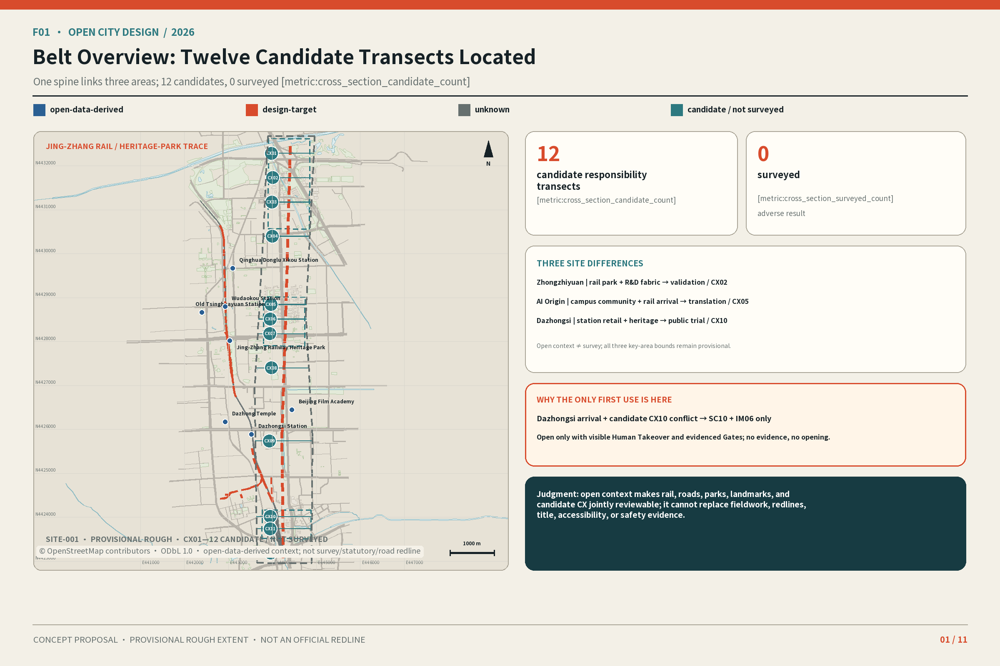
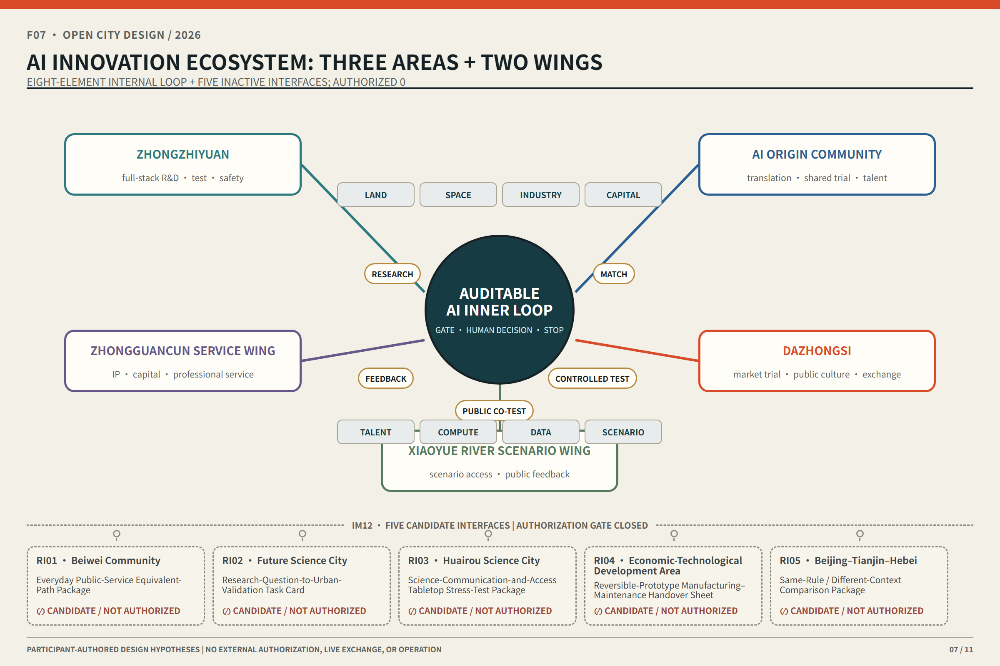
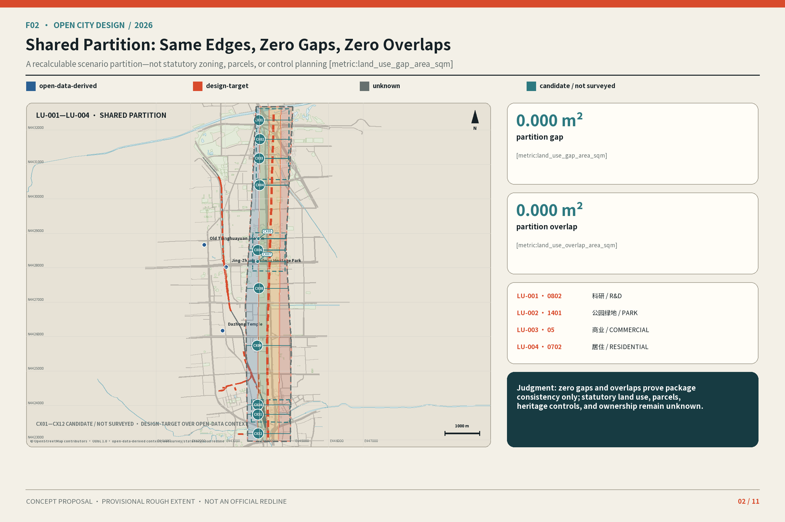
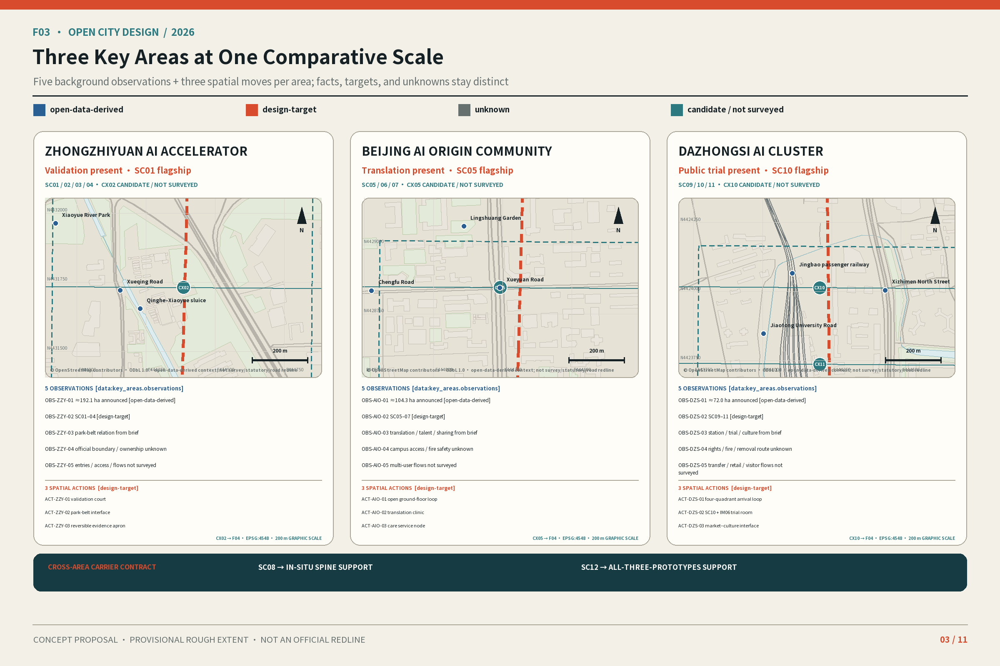
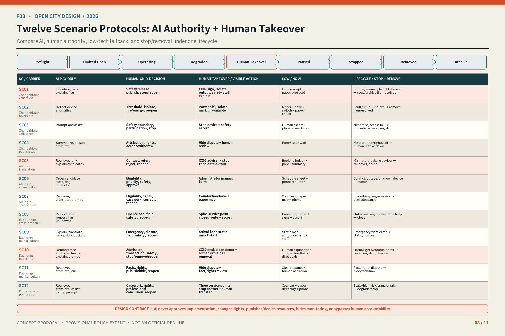
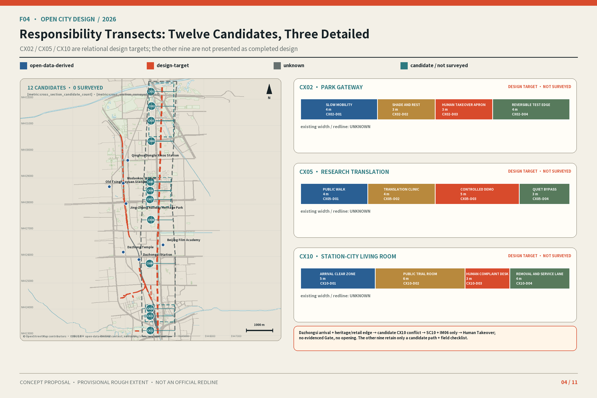
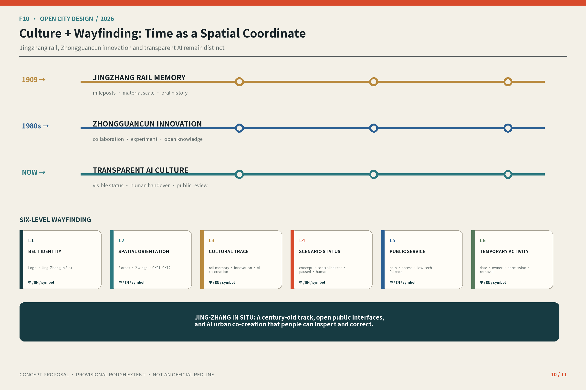
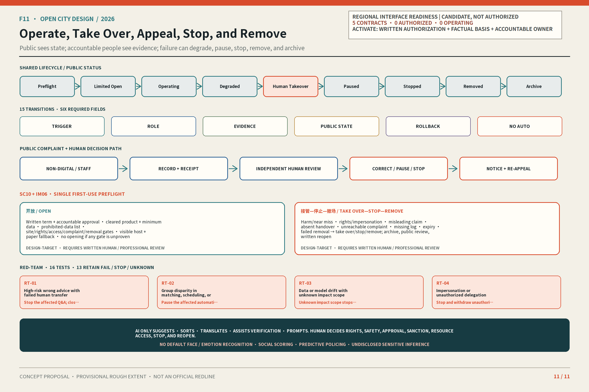
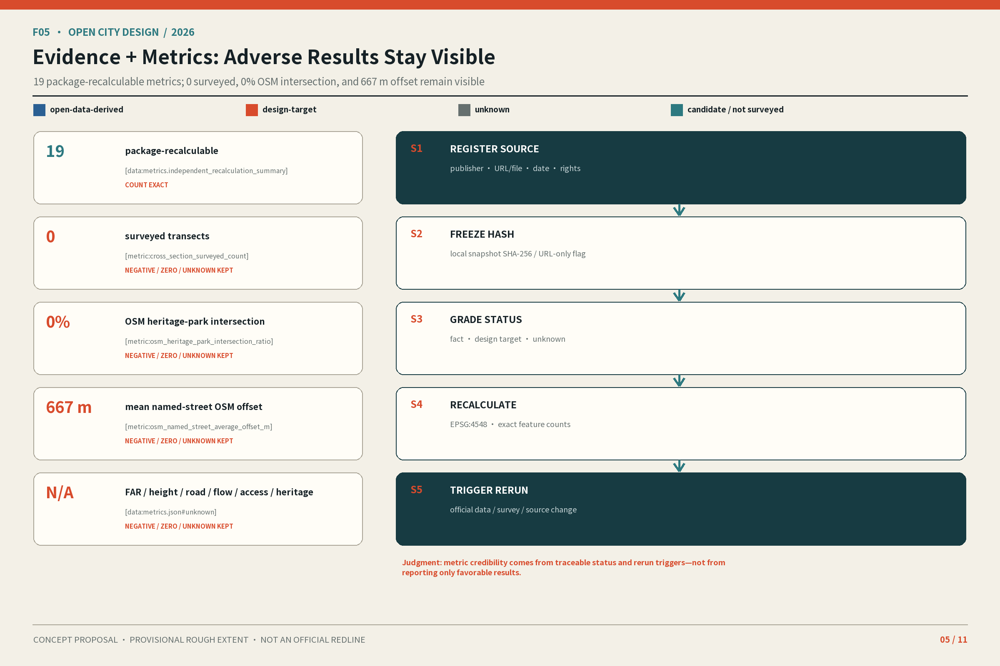

# Jing-Zhang In Situ: Making AI Visible, Human-Takeover-Ready, Verifiable, and Withdrawable

**Thesis:** Jing-Zhang In Situ turns AI into three urban interfaces the public can see, take over, verify, and withdraw. **People present, evidence present, and responsibility present** test access, sources, failures, accountability, and withdrawal together. This is a conceptual recommendation, not an approved plan, government commitment, or engineering conclusion.

Four primary messages organize the submission: (1) threefold presence; (2) one spine + three prototypes + twelve candidate cross-sections; (3) SC01/SC05/SC10 + nine supports; and (4) seven packages + one time-bounded reversible first use. Read F01→F03→F08→F11 in 30 seconds, check space/scenario/exit in three minutes, then use the remaining F figures, T01–T07, matrices, and sources for the fifteen-minute path.

## Design Basis and Source List

The announcement, agent taskbook, site package, registry, and local standard snapshots define the task and claim strength. Processed material is navigation only.[source:DATA-SRC-OFFICIAL-ANNOUNCEMENT-20260509] [source:DATA-SRC-AGENT-TASKBOOK-20260518] [source:REPO-SOURCE-REGISTRY]

The Phase 2 freeze records source, date, scope, reuse boundary, transformation, SHA-256, grade, and prohibited uses. The early OSM group is the 2026-08-14 boundary-mismatch check: only query/response hashes remain, its raw response is unregistered and not package-replayable, and it produces only the two low-confidence 0% and 667 m warnings below. It never enters required design GeoJSON or becomes survey evidence.[source:DATA-SRC-PROVISIONAL-BOUNDARY-BASIS-20260814] [data:sources.json#r5_evidence_separation]

A separate group is the 2026-08-28 R3 site-recognition background: four fixed OSM/Overpass queries and raw responses, retrieval times, query/raw/derived hashes, and ODbL 1.0 rights records are packaged and replayable. They support only road/rail clues, parks, cleared landmarks, and coarse building morphology; they neither produce nor backfill 0%/667 m, enter required design GeoJSON, nor support official boundaries, heritage controls, road redlines, or survey.[source:DATA-SRC-OSM-CONTEXT-20260828] [data:visual/assets/r3-site-context-qa.json] [data:sources.json#r5_evidence_separation]

No official polygons exist for the three scopes or key areas. SITE/KEY_AREA are rough provisional constraints for graphics, checks, and scenario comparison; they establish no redline, rights, approval, statutory use, precise area, or feasibility. Official boundaries trigger one-batch recalculation of layers, metrics, F01–F11, HTML, and PDFs.[source:DATA-SRC-PROVISIONAL-BOUNDARIES-20260605] [data:geometry/site_boundary.geojson#SITE-001]

Regulatory plans, parcel rights, building surveys, structure, fire, daylight, utilities, heritage, road sections, flows, parking, municipal capacity, enterprise/talent baselines, and field surveys remain unavailable. The proposal therefore does not fill unknown FAR, height, density, demolition, redlines, cost, bridge/tunnel, underground, or approval claims.[standard:PROJECT-OFFICIAL-ANNOUNCEMENT] [depth:existing_conditions_diagnosis]

## Three-Level Scope Framework

### Overall concept, naming, and visual identity

“Jing-Zhang” links railway heritage and public memory; “In Situ” requires public access, traceable evidence, and accountable takeover. **Jing-Zhang In Situ** is the only canonical English name. F06 may omit the hyphen only inside the graphic logo; prose and public copy may not create another name or imply implementation. Two tracks, twelve ticks, three nodes, and open arcs express the spatial grammar without corporate marks or unauthorized railway identity.[standard:PROJECT-AGENT-OPEN-CALL-TASKBOOK] [depth:overall_spatial_structure]

### Three Positionings, Five Functions, and Three Zones and Two Wings

The three positionings are a Century-Old Jing-Zhang Cultural Belt, an Urban AI Life-Experience Belt, and an AI Convergence-Innovation Belt. T01 translates the five functions into inspectable mechanisms.

| T01 function | Main carrier | In-situ test |
| --- | --- | --- |
| Full-stack independent AI innovation | Zhongzhiyuan | Controlled tests, failure records, human stop |
| World-class AI innovation ecosystem | AI Origin + Zhongguancun wing | Matching, shared pilots, talent support, refusals |
| New AI+ scenario paradigm | Xiaoyue River wing + 12 cross-sections | Public co-test, low-tech alternative, appeal |
| Vibrant AI-enabled city | Park, public ground floors, station-city interfaces | Everyday access, legible status, withdrawal |
| Global voice in AI governance | Shared by three zones | Open sources, responsibility, review, stop |

### Twelve Everyday Cross-Sections

The heritage park is the **in-situ spine**. CX01–CX12 are locatable, auditable `candidate_not_surveyed` paths—not engineering alignments, centerlines, or fieldwork—and retain ID, coordinates, type, rationale, users, conflict, sources, and checklist.[depth:three_level_scope_framework] [data:geometry/roads.geojson#SPINE-001] [data:geometry/roads.geojson#CX01] Candidate totals are recomputed; surveyed=0 remains an adverse result.[metric:cross_section_candidate_count] [metric:cross_section_surveyed_count]

CX01–CX12 and SC01–SC12 are separate systems. The types are riverfront R&D, park gateway, research courtyard, campus public ground floor, research translation, talent life, community stitch, Xiaoyue accessible interface, rail–park connection, station-city living room, market–culture ground floor, and quiet care. Only three different types are developed: CX02 park gateway, CX05 research translation, and CX10 station-city living room. Their responsibility-cross-section band widths are all `design-target`; existing total width and road redline are `unknown`. The other nine remain candidate inventories.[metric:detailed_cross_section_count]

[data:geometry/roads.geojson#CX02] [data:geometry/roads.geojson#CX05] [data:geometry/roads.geojson#CX10]

## Coordinated Research Area: Industry and Future City Research

### Comparative mechanisms from global cases

T02 transfers only registered organizational mechanisms—not numbers, imagery, spatial conclusions, or partnership claims.

| T02 source | Mechanism for discussion | Local question |
| --- | --- | --- |
| Seoul AI Hub | Staged PoC and follow-up interface | How does a test leave review and choices? |
| one-north | Research cluster, living lab, public realm | How can R&D security coexist with access? |
| STATION F / F.ai | Cohort, office hours, access gradients | How are community and space accountable? |
| Maria 01 | Heritage reuse and incremental operation | How does heritage join innovation gradually? |
| Mila | Research, translation, talent, responsible AI | How does public interest enter conversion? |
| Dubai Future Accelerators | Challenge–pilot–evaluation | How does validation gain gates and stops? |
| Marineterrein | Reversible temporary use and exit | How can a failed trial restore the site? |

The first three mechanisms are supported by registered background sources.[source:CASE-SEOUL-AI-HUB-20250710] [source:CASE-SINGAPORE-ONE-NORTH-20230703] [source:CASE-STATION-F-FAI-20260211]

Heritage reuse and responsible governance remain background questions.[source:CASE-HELSINKI-MARIA-AREA] [source:CASE-MILA-IMPACT-20211118]

Challenge-led validation and reversible temporary use inform only gates.[source:CASE-DUBAI-FUTURE-ACCELERATORS] [source:CASE-AMSTERDAM-MARINETERREIN]

### Ecosystem map and eight enabling elements

F07 moves land, space, industry, capital, talent, compute, data, and scenarios through research→matching→controlled testing→public co-testing→feedback. Complaints, failures, costs, and revisions return to research. Land, capital, and compute remain authorization-dependent. External regions do not enter the internal loop: IM12 instead gives RI01–RI05 separate inactive contracts for purpose, minimum input, first deliverable, authorization Gate, and stop rule.[source:DATA-SRC-AGENT-TASKBOOK-20260518] [depth:overall_spatial_structure]

All five domains are participant-authored design hypotheses—not existing functions, partnership intent, or resource commitments. The present state is five contracts, zero authorized, zero operating, and zero field or live exchanges.[metric:regional_interface_contract_count] [metric:regional_interface_authorized_count]

| Target / interface purpose | Jing-Zhang output | Minimum inbound material | First deliverable | Current status / why it cannot start |
| --- | --- | --- | --- | --- |
| RI01 Beiwei Community: translate people-present into everyday public-service equivalence | SC08/SC12 four-path equivalence, Human Takeover, accessible complaint, and failure-handoff patterns | Authorized de-identified issue taxonomy; first-party service catalogue, window/scenario, and accessibility notice | *Everyday Public-Service Equivalent-Path Package* | Candidate / Not Authorized; no per-scope mandate, first-party facts, or accountable role |
| RI02 Future Science City: turn a public research question into a bounded, stoppable urban-validation task | TVS-1–3, evidence-field–professional-Gate–stop template, and low-tech checklist | Cleared public question, applicability/use limits, safety class, and data class | *Research-Question-to-Urban-Validation Task Card* | Candidate / Not Authorized; no disclosure permission, material rights, or scenario mandate |
| RI03 Huairou Science City: test science translation, access, and error rollback | F10 bilingual status, SC11 source review, and SC12 static/human fallback | Cleared public science summary, rights/access rules, cautions, and scenario boundary | *Science-Communication-and-Access Tabletop Stress-Test Package* | Candidate / Not Authorized; no content rights, access boundary, or accountable role |
| RI04 Economic-Technological Development Area: extend reversible-component responsibility to manufacture, maintenance, and removal | C01–C09 power-off/assembly, maintenance/human substitution, and SC10 stop logs | Supplier-neutral manufacturability, material/safety/maintenance/disassembly feedback, and failure conditions | *Reversible-Prototype Manufacturing–Maintenance Handover Sheet* | Candidate / Not Authorized; no confirmed entity, rights boundary, professional role, or manufacturing conclusion |
| RI05 Beijing–Tianjin–Hebei: compare different public urban contexts under one rule set | Nine states/fifteen transitions, evidence grades, negative results/takeover, and four result classes | First-party public rule/context, source rights, definitions, and non-comparability | *Same-Rule / Different-Context Comparison Package* | Candidate / Not Authorized; no per-context mandate, first-party facts, or cross-regional governance arrangement |

The complete bilingual contracts are at `visual/assets/regional-interface-contracts.json#/interfaces`. That file is authoritative for prohibited inputs, Jing-Zhang accountability, counterparty role types after authorization, review triggers, and per-interface stop rules. Any prohibited input, misleading partnership wording, or missing Gate produces only stop/withdrawal—never an “established coordination” result.

## Overall Design Area: Urban Renewal and Regulatory-Plan-Level Urban Design

Renewal uses three reversible verbs. **KEEP** retains buildings, mature trees, and services shown by survey to have public value. **OPEN** unlocks park edges, courtyards, and public ground floors only when rights, safety, and operations permit. **INTENSIFY** first raises use through shared time and reversible components; it does not presume more development.[standard:MOHURD-CONTROL-DETAILED-PLANNING] [source:DATA-SRC-MOHURD-CONTROL-DETAILED-PLANNING] [depth:retain_renovate_demolish]

This differentiated mechanism binds the renewal-space network to the threefold-presence responsibility system: every spatial move must state its public entry, evidence status, accountable role, and restoration path. It does not merely rename conventional zoning with “AI.”

Urban design provides the coordinating frame for planar and three-dimensional space, public space, transport and municipal systems, and city character. This phase translates that frame into auditable design recommendations only; it does not claim that project-specific controls have been approved.[standard:MOHURD-URBAN-DESIGN-MEASURES] [source:DATA-SRC-MOHURD-URBAN-DESIGN-MEASURES]

Provisional land use tests relationships among public access, innovation services, everyday care, and blue-green continuity. LU-001/LU-002 organize innovation and public interfaces; LU-003/LU-004 organize living and blue-green scenarios. Topological coverage does not prove statutory use.[data:geometry/land_use.geojson#LU-001] [data:geometry/land_use.geojson#LU-002]

The four scenario zones reuse exactly the same shared boundary coordinates: gap and overlap are both 0 sqm. This proves package-partition consistency only; it does not create statutory land use, parcels, regulatory controls, or ownership conclusions.[metric:land_use_gap_area_sqm] [metric:land_use_overlap_area_sqm]

FAR, height, density, building scale, and permanent construction await official controls and building records.[data:geometry/land_use.geojson#LU-003] [data:geometry/land_use.geojson#LU-004] [depth:development_intensity_controls]

## Detailed Design of Key Areas

All three prototypes use one 400 m × 400 m `design-target` comparison frame and the same plan–responsibility-cross-section–operating-state legend, but carry different responsibilities. The 400 m dimension is a common drawing frame, not a measured edge. Each area records five background observations and three spatial moves; every dimension is tagged `open-data-derived`, `design-target`, or `unknown`.[depth:three_key_area_detailed_design] [metric:key_area_count] [metric:background_observation_count] The spatial-move total is counted separately from structured fields.[metric:spatial_action_count]

### Zhongzhiyuan AI Independent Innovation Acceleration Area

**Background observations:** (1) the announcement names the area and states approximately 192.1 ha (`open-data-derived`); (2) Phase 1 fixes SC01–SC04 with SC01 flagship (`design-target`); (3) the brief asks how park-belt and innovation carriers relate; (4) the official polygon, ownership, and road redlines are unknown; and (5) entries, shade, gradients, flows, and accessible continuity were not surveyed. **Spatial moves:** validation court, park-belt interface, and reversible evidence apron, pairing controlled testing with spectatorship, slow mobility with human help, and equipment with power-off/removal conditions. CX02 is a responsibility-cross-section design target; river, energy, fire, and access conditions await verification.[data:geometry/key_areas.geojson#PROV-KEY-001] [data:geometry/roads.geojson#CX02]

### Beijing AI Origin Community

**Background observations:** (1) the announcement names the area and states approximately 104.3 ha (`open-data-derived`); (2) Phase 1 fixes SC05–SC07 with SC05 flagship; (3) translation, talent service, and sharing come from the brief; (4) campus access, ground-floor use, and fire conditions are unknown; and (5) resident, student, researcher, and delivery flows were not surveyed. **Spatial moves:** open ground-floor loop, research-translation clinic, and care-service node. A human adviser makes referrals while a non-smart entry, quiet bypass, and community hours remain available. CX05 is a responsibility-cross-section design target, not an existing or opened condition.[data:geometry/key_areas.geojson#PROV-KEY-002] [data:geometry/roads.geojson#CX05]

### Dazhongsi AI Industry Cluster

**Background observations:** (1) the announcement names the area and states approximately 72.0 ha (`open-data-derived`); (2) Phase 1 fixes SC09–SC11 with SC10 flagship; (3) station arrival, public experience, and cultural expression come from the brief; (4) station interfaces, commercial rights, fire, and removal routes are unknown; and (5) transfer, retail, stall, and cultural-visitor flows were not surveyed. **Spatial moves:** four-quadrant arrival loop, public trial room, and market–culture interface. The trial room hosts only the single SC10 + IM06 first-use trial. CX10 co-locates arrival, trial, human complaint, and removal without promising underground connection, leasing, or construction.[data:geometry/key_areas.geojson#PROV-KEY-003] [data:geometry/roads.geojson#CX10]

Canonical ownership is frozen by enumerated ID: Zhongzhiyuan has SC01, SC02, SC03, and SC04; AI Origin has SC05, SC06, and SC07; Dazhongsi has SC09, SC10, and SC11. SC08 is cross-area accessibility support for the whole in-situ spine, while SC12 is public-service and human-transfer support shared by all three prototypes; neither belongs to a contiguous numbered area.

## AI Innovation Ecosystem, Personas, and AI+ Scenarios

### Seven personas

| T03 ID | Role | Protected entry |
| --- | --- | --- |
| U1 | Researchers and R&D staff | Controlled test, evidence review |
| U2 | Start-up and product teams | Rights, refusal, removal |
| U3 | Operations, safety, professional review | Human takeover, logs |
| U4 | Residents, community workers, merchants | Low-tech fallback, appeal |
| U5 | Children, carers, educators | Supervision, content review |
| U6 | Older and disabled visitors, companions | Accessibility, human help |
| U7 | International developers and visitors | Bilingual status, permission limits |

U6's low-tech fallback uses the policy principle of running traditional service channels in parallel with smart-service innovation as background. It does not prove a Haidian service, demand figure, or implementation commitment; staffing, offline entry, and maintenance responsibility still require scenario-by-scenario verification.[source:DATA-SRC-ELDERLY-SMART-TECH-PLAN-2020-45] [depth:blue_green_public_space]

SC01–SC12 share one complete contract: purpose/carrier, users, inputs, sources, minimum data, output, AI authority, human-only decisions, notice, lawful basis or no collection, Human Takeover, low/no-AI route, complaint, logs, deletion, lifecycle, evaluation, dependencies, cost, maintenance, and exit. Machine authority lives in `visual/assets/phase3-protocol-contracts.json`. No reachable owner, complaint route, or high-risk closure means no entry or stop.[source:DATA-SRC-AGENT-TASKBOOK-20260518] [depth:municipal_new_infrastructure]

A scenario enters the corresponding scope analysis under the Interim Measures for Generative AI Services only when it actually provides generated text, images, audio, or video to the public within mainland China. Human Takeover, stop, and exit in this proposal remain design-contract safeguards: Article 14 is not expanded into a general opt-out right, and no statutory numeric response deadline is invented from Article 15.[source:DATA-SRC-GENERATIVE-AI-INTERIM-MEASURES] [depth:municipal_new_infrastructure]

The shared state machine uses nine IDs—`preflight / limited-open / operating / degraded / human-takeover / paused / stopped / removed / archive`—and 15 authoritative edges, never automatic progression. Each edge records bilingual trigger, role, evidence, public state, rollback, and prohibited automation. F10 fixes preflight as “Conceptual Recommendation / Pending Site Verification,” limited-open as “Controlled Test,” human-takeover as “Human Takeover,” and paused as “Paused.” Only a named owner plus safety professional may authorize `paused→limited-open`; `archive` is terminal and future use requires a new instance from preflight. AI may suggest, rank, translate, assist verification, or prompt; approval, rights change, sanction, resource denial, stop, and retest are human-only. Facial/emotion recognition, social scoring, predictive policing, and undisclosed sensitive inference are prohibited by default.

The three industrial testing-and-validation IDs remain locked: TVS-1 = SC01 model evaluation, TVS-2 = SC02 energy and thermal safety, and TVS-3 = SC03 embodied-AI accessibility co-testing. The 3+9 hierarchy does not remove those three professional validation obligations.

### Twelve scenario cards

Twelve resolvable swimlanes expand the flagships. **SC01:** provider → data steward → safety gate → affected public; source/protocol failure degrades, then unresolved issues go paused→stopped→removed→archive. **SC05:** user → human service → scenario owner → independent appeal reviewer; AI only ranks, paper/counter remains, and leakage, repeated mismatch, or absent adviser triggers takeover/pause. **SC10** stops at limited-open: provider → host → safety gate → complaint lead; harm, rights, misleading claims, absent takeover, or unreachable complaint leads human-takeover→stopped→removed→archive. All three use the same 15 edges and add no building, product, or pilot.

| T04 group | Carrier / users | AI and minimum data | Human, low-tech, appeal | Evaluation / exit |
| --- | --- | --- | --- | --- |
| Flagship SC01 | Zhongzhiyuan; U1/U2/U3 | Evaluation; cleared benchmark, synthetic data, logs | Safety release; offline script; incident log | Protocol/exception/takeover; unresolved issue stops |
| Flagship SC05 | AI Origin; U1/U2/U3 | Matching; voluntary summaries, public needs | Adviser decides; booking ledger; correction | Consent/refusal/mismatch; leak stops |
| Flagship SC10 | Dazhongsi; U2/U3/U4/U7 | Trial; cleared notice, voluntary feedback | Host; paper feedback; complaint | Exit/complaint; dispute removes |
| Support SC02/SC03/SC04 | Zhongzhiyuan; U1/U2/U3/U6/U7 | Thermal safety, accessibility co-test, standards; permitted data | Experts/safety host/facilitator; meter, escort, issue wall | Threshold, near miss, rights, or no maintainer stops |
| Support SC06/SC07 | AI Origin; U1/U2/U3/U4 | Scheduling and life guide; public/voluntary minima | Administrator/service staff; sheet, map, counter | Conflict, discrimination, or expiry downgrades |
| Support SC09/SC11 | Dazhongsi; U4/U6/U7 | Interchange and co-reading; verified transit and cleared archives | On-site/history review; static map and audio-text | Emergency, factual, or rights dispute hides/closes |
| Cross-area support SC08 | In-situ spine; U4/U6/U7 | Accessible route; field-verified path | Service point; paper map and human escort | Unknown route risk or unreachable human help closes |
| Cross-area support SC12 | All three prototypes; U4/U5/U6/U7 | Public FAQ with source and date | Service role; counter and human transfer | Expiry or risky error without transfer downgrades |

The backend boundaries remain explicit. **SC02** reads only cleared device telemetry and isolates for exceeded professional thresholds or incomplete logs. **SC03** collects voluntary tasks and environmental state, never an identity profile, and stops after a near miss or without a safety host. **SC04** summarizes only public standards, issues, and objections; a facilitator verifies each item, and misattribution, rights problems, or no maintainer takes it down.

**SC06** handles public time slots, equipment labels, and application state, returning to a manual sheet when permissions conflict. **SC07** uses public service information and active choices, pausing for stale, discriminatory, or unmaintained results.

**SC09** explains verified public transport information and switches to a static map during emergencies or data error. **SC11** uses cleared archives and consented oral material, hiding disputed or withdrawn material. Cross-area **SC08** requires a field accessibility audit and never continuously tracks identity; unknown route risk or unreachable human help closes it. All-prototypes **SC12** cites dated public FAQs, never final legal, medical, or fire advice, and downgrades when sources or human transfer fail. These nine support scenarios protect the flagships and the whole spine.

Data governance separates public/repository evidence, operational non-personal data, personal data, sensitive personal data, model inference/scoring, and logs/appeals, each with purpose, minimum fields, roles, access, deletion, boundary, audit, appeal, prohibited use, and evidence status. Inheritance plus overrides close 12 scenarios; all 12 controllers remain unknown. Nine core paths state `no personal data required`. Only seven conditional paths—SC04 attribution/reply, SC05 referral, SC06 booking, SC07 callback, SC10 complaint reply, SC11 identifiable oral contribution, SC12 human reply—require prior legal review and never make personal data necessary for core service. Sensitive-personal-data minima are zero and prohibited by default. Complaint paths keep non-AI entry, receipt, independent review, notice, and different-person re-appeal; unreachable complaints trigger Human Takeover/stop. Older, disabled, child, non-smart-device, non-Chinese-speaking, and AI-refusing users keep equivalent service, non-digital entry, human explanation, and exit. This is a `design-target`, not proof of staffing or completed legal/accessibility review.[source:DATA-SRC-BARRIER-FREE-ENVIRONMENT-LAW] [source:DATA-SRC-ELDERLY-SMART-TECH-PLAN-2020-45]

F08 compares AI authority, human-only decisions, visible takeover, low-tech alternatives, and lifecycle/removal across all 12 scenarios without changing SC01–SC12 or carrier mapping.[data:geometry/public_space.geojson#PUBLIC-001]

## Land Use, Building Scale, and Retain-Renovate-Demolish Strategy

Land use and buildings remain provisional scenarios. Public ground floors, footprints, permeability, setbacks, roofs, and reversible components may be developed only after rights, structure, fire, daylight, utilities, and heritage checks.[standard:MNR-LAND-USE-CLASSIFICATION-GUIDE] [source:DATA-SRC-MNR-LAND-USE-CLASSIFICATION-202311] [depth:land_use_layout]

The current footprint only recalculates a submitted scenario; it is neither surveyed condition nor approved envelope. Failure of any premise returns the proposal to a public-space or operational test.[data:geometry/buildings.geojson#BLDG-001] [metric:building_footprint_area_sqm] [depth:height_massing_character]

Development must first align source authority, survey date, current use, rights, accessible entries, structure, and fire conditions for each unit. Until then, map colors are scenarios only. They cannot support total floor area, FAR, coverage, density, acquisition, demolition, extension, or leasing lists.

## Transport, Rail, Municipal Infrastructure, and Public Services

Priority is walking, accessibility, cycling, public-transport connection, then necessary vehicles. Station work begins with ground-level legibility and human service. Without redlines, sections, flows, or parking data, no capacity, safety, bridge/tunnel, or underground conclusion follows.[depth:traffic_rail_slow_parking] [data:geometry/roads.geojson#SPINE-001]

Article 39 of the Barrier-Free Environment Construction Law retains on-site guidance and human-operated service only for public-service venues handling matters such as medical care, social security, finance, and living-payment services. Where this proposal carries human help into broader urban interfaces, it is a design target—not a claim that Article 39 applies universally or that venue compliance or an accessibility audit has been completed.[source:DATA-SRC-BARRIER-FREE-ENVIRONMENT-LAW] [depth:traffic_rail_slow_parking]

Small edge nodes may combine seating, shade, light, and status information, but qualified teams must confirm power, heat, noise, cybersecurity, fire, drainage, and maintenance. Every high-risk service must switch to a human or static mode.

Each cross-section now carries a field checklist: lawful path and ownership, existing width and obstructions, surface and gradient, crossing wait, shade/rest, wheelchair turning, day/night flows, maintenance, and emergency access. A finding becomes survey evidence only after date, method, coverage, consent, and accountable reviewer are registered. All items remain not surveyed in this phase; no capacity, accessibility pass rate, or parking demand is generated.[metric:pedestrian_flow_count] [metric:accessible_route_pass_rate]

## Blue-Green Network, Public Space, and Urban Character

Qinghe, Xiaoyue River, the heritage park, and neighborhood shade form a pending field hypothesis for cooling, movement, and encounter. Green/public ratios compare submitted geometry only and are not statutory. AI devices cannot replace canopy, drainage, lighting, seating, tactile paths, or maintenance.[depth:blue_green_public_space] [data:geometry/green_space.geojson#GREEN-001] [metric:green_ratio]

Absolute green-space area recalculates the scenario layer only.[metric:green_space_area_sqm]

Absolute public-space area and ratio likewise recalculate with the provisional boundary.[metric:public_space_area_sqm] [metric:public_space_ratio]

### Three landmarks, the Open Contribution Ledger, and component library

The Zhongzhiyuan Validation Court displays test evidence; the Beijing AI Origin Commons Stage supports open-source explanation and correction; the Dazhongsi City Window connects product trials, culture, and human service. The Open Contribution Ledger records code/tools, data/evidence, scenarios, public service, maintenance, accessibility, and cultural correction. Its only states are submitted, reviewed, adopted, revised, and withdrawn; display never automatically means an award.

C01–C09 are the evidence pillar, cross-section marker, human-help point, reversible test bench, accessible seat/shade, data notice, contribution rail, maintenance box, and quiet interface. They specify function, information, accessibility, and responsibility—not structural or construction feasibility.

### Culture, wayfinding, and international communication

The cultural narrative is origin–presence–co-creation; the spatial storyline is track–interface–echo. F10 has **six levels**: overall logo, spatial orientation, cultural trace, scenario status, public service, and temporary activity. Fixed status terms are “Conceptual Recommendation,” “Controlled Test,” “Paused,” “Human Takeover,” and “Pending Site Verification.” “24H human service” is prohibited without staffing evidence.

The international line is: **“JING-ZHANG IN SITU: A century-old track, open public interfaces, and AI urban co-creation that people can inspect and correct.”** Every public communication also states the conceptual status and never implies selection, approval, or construction.

## Renewal Projects, Implementation Policy, and Phasing

Near-term work is limited to source baseline, cross-section survey, responsibility protocol, and reversible prototypes. Medium-term discussion of public ground floors, blue-green mobility, components, and landmarks requires rights and professional conditions. Permanent work awaits regulatory, transport, municipal, and engineering studies. Phases are not approvals.[data:geometry/phasing.geojson#PHASE-001] [depth:phasing_implementation]

### Annual operation and conversion pathway

| T05 frequency | Candidate activity | Required evidence / cancellation |
| --- | --- | --- |
| Continuous / monthly | Issue and contribution ledger / public-interface walk | Problem, owner, revision; stop without maintainer |
| Quarterly / half-yearly | Validation open day / public-responsibility review | Test, complaint, takeover; cancel if gate fails |
| Annual | Candidate “Jing-Zhang In Situ Week” and “Global Urban AI Interface Forum” brands | Separate permits, rights, staff; not a government calendar |

The frontstage operating path uses the shared lifecycle. The public first sees the status and human entry; accountable roles then inspect trigger, evidence, and rollback. Complaint/appeal can enter through a counter, paper, telephone, or accessible digital channel, receive a record and receipt, move to independent human review, and end in correction, degradation, pause, stop, or removal with notice of the result. Every numeric response window is a `design-target`, not a statutory deadline or existing promise. A participant pathway ends with voluntary candidate referral; it promises no job, capital, procurement, space, or endorsement.

### Project implementation table

The front stage shows seven packages. Thirteen per-IM machine objects live at `design_depth_matrix.json#/items/11/implementation_projects`, each preserving responsible roles, dependencies, qualitative cost, evidence, maintenance, evaluation, Human Takeover, and stop/exit. S/M/L mean research/coordination, reversible operations, and work requiring engineering development—not investment estimates.[depth:renewal_project_list]

| T06 package | Backend IDs | Front-stage action | Gate / withdrawal |
| --- | --- | --- | --- |
| AP1 Evidence baseline and recalculation | IM01+IM13 | Lock authority, differences, hashes | Source conflict freezes derived metrics |
| AP2 Cross-sections and responsibility protocol | IM02+IM03 | Survey CX01–12; safeguard cross-area SC08; define human, appeal, stop | No permit or owner means no entry |
| AP3 Zhongzhiyuan prototype | IM04 | Controlled SC01/02/03/04 validation | Professional or safety failure stops |
| AP4 AI Origin prototype | IM05 | SC05/06/07 matching and service | Leak, mismatch, unclear facility returns to human |
| AP5 Dazhongsi prototype | IM06 | SC09/10/11 arrival, trial, and culture | Rights, safety, or complaint failure removes |
| AP6 Public interface and identity | IM07–IM10 | Landmarks, components, wayfinding, ledger, and all-prototypes SC12 | Rights, maintenance, fact, or consent failure removes |
| AP7 Operation and collaboration | IM11–IM12 | Candidate annual activity; five-domain first-exchange contracts RI01–RI05 | No per-interface authorization, first-party fact, or accountable role means no exchange, operation, or partnership claim |

### Implementation-maturity evidence and current NO-GO

The three detailed responsibility cross-sections now expose a normalized, recomputable design quantity rather than a false site total: CX02 is `4 + 3 + 3 + 4 = 14 m² per linear metre`, CX05 is `4 + 4 + 5 + 3 = 16 m²/m`, and CX10 is `5 + 6 + 3 + 4 = 18 m²/m`. Each band also records construction and operating interfaces, maintenance-accountability gaps, stop conditions, and recalculation triggers. Lawful alignment, rights, existing width, surveyed intervention length, field condition, operator, and unit rates remain `unknown`; the eight official references support a desktop review interface only and generate no project GIS/CAD.[source:DATA-SRC-R3E-JINGZHANG-CONTROL-PLAN-RESPONSE-20250208] [source:DATA-SRC-R3E-DAZHONGSI-HERITAGE-REGISTER-20171027] [source:DATA-SRC-R3E-JINGZHANG-PARK-PLANNING-INTERPRETATION-20211216]

The conceptual resource model is transparent but unpriced: `variable cost = Σ band width × surveyed intervention length × dated scoped unit rate`; fixed preparation, staffing, maintenance, removal, and contingency are added separately. There are zero credible unit-rate records, so every CNY input and total remains `null`. The handover table distinguishes candidate public review interfaces from appointments: no operator is appointed, all 12 controllers remain `unknown`, every accountable RACI slot awaits a written mandate, and the current decision is `NO_GO_ALL_OPENING_GATES_NOT_EVIDENCED`.[source:DATA-SRC-R3E-PARCEL-ACCESS-LIMITATION-2015] [source:DATA-SRC-R3E-QINGHUAYUAN-HERITAGE-TEXT-20260214]

Ten law/planning/heritage/accessibility/fire/data/operation checks are desktop review-ready with zero professional signatures. Six synthetic desktop exercises retain three negative, one `unknown`, and two zero outcomes; they verify only permitted state transitions and stop/removal logic, with zero field or live-operation drills. The auditable evidence and QA are `visual/assets/r3e-implementation-evidence.json` and `visual/assets/r3e-implementation-qa.json`; neither is a survey, signed review, formal estimate, approval, or measured performance.[source:DATA-SRC-R3E-GB55019-2021-ACCESSIBILITY] [source:DATA-SRC-R3E-GB55037-2022-FIRE] [source:DATA-SRC-R3E-DB11-1761-2020-WALK-CYCLE]

**Sole first use: SC10 + IM06 only.** `preflight` requires a written term, approval/roles, minimum/prohibited data, product/site/rights/accessibility/complaint/removal gates, staffed takeover, and low-tech fallback; any unverified gate means no opening. Harm/near miss, rights or impersonation, misleading claims, absent takeover, unreachable complaints, missing logs, or failed removal triggers takeover and a human pause/stop decision. Stop disconnects service, governs deletion/sealing, removes status/equipment, archives, and reviews. `archive` never reopens the instance; future use needs independent human/professional review, all gates re-evidenced, a new notice, and a new `run_instance_id` from preflight. Durations, windows, and thresholds remain `design-target` or `unknown`: not SC13, IM14, another pilot, a statutory deadline, commitment, or measured performance.

Sixteen independent adversarial tabletop tests cover wrong advice, bias/inequality, drift, impersonation, malicious input, network loss, power loss, sensor/interface failure, unavailable takeover, accessibility failure, language misdirection, unreachable complaint, removal failure, incomplete logs, rights withdrawal, and authority overreach. Twelve retain `fail_stop`, `unknown_stop`, or `fail_pause` outcomes instead of reporting universal success. Each traces affected SC, protocol fields, F08/F11, prose, and matrices; residual risk and retest conditions remain in `visual/assets/phase3-red-team.json`. A tabletop result is not field, safety, or legal validation.[depth:risk_missing_data]

## Metrics, Area Recalculation, and Compliance Matrix

The spatial-evidence baseline remains 21 known/documented metrics, 19 independently recalculable from package GeoJSON and structured fields. Areas and lengths use EPSG:4548 with a ≤0.5% tolerance; counts require exact equality.[metric:site_area_sqm] [metric:candidate_cross_section_total_length_m] This round adds two contract-state counts—five RI contracts and zero authorized—computed from one JSON; they do not count institutions, projects, partnerships, or performance.[metric:regional_interface_contract_count] [metric:regional_interface_authorized_count] [depth:metrics_recalculation]

Adverse, zero, and unknown results remain visible: 0 of 12 candidates are surveyed, while scenario land-use gap/overlap are both 0; those results return to count and topology metrics.[metric:cross_section_surveyed_count] [metric:land_use_gap_area_sqm] [metric:land_use_overlap_area_sqm] The early 2026-08-14 boundary-mismatch check records 0% heritage-park intersection and a 667 m mean offset to four named street proxies. Its raw response is unregistered, so the two values remain outside the 19 package-recalculable metrics and cannot alter the provisional boundary.[source:DATA-SRC-PROVISIONAL-BOUNDARY-BASIS-20260814] [metric:osm_heritage_park_intersection_ratio] [metric:osm_named_street_average_offset_m] Although the four 2026-08-28 R3 raw OSM snapshots are packaged and replayable, they belong to a separate site-recognition query group and do not backfill these values or formal metrics.[source:DATA-SRC-OSM-CONTEXT-20260828] FAR, height, road area, flows, accessibility pass rate, and heritage-control area remain `unknown`.[metric:floor_area_ratio]

F05 shows evidence authority and recalculation. The three matrices preserve detailed backend evidence. All 31 required outputs for agent.1–agent.6 receive individual section, figure, table, or structured-file anchors in `compliance_matrix.json`; repeated generic file lists no longer stand in for proof.[standard:MOHURD-ARCH-DESIGN-DEPTH-2016] [source:REPO-SOURCE-REGISTRY]

**Ten core claims review route:**

1. **Thesis/test:** three interfaces share people/evidence/responsibility present; introduction and F01/F06; conceptual-status limit.
2. **Evidence boundary:** provisional scope supports only generation/comparison; Design Basis and F01/F05; no redline, rights, or engineering inference.
3. **Spine/cross-sections:** heritage park organizes continuity and CX01–CX12 find breaks; Scope and F01/F04; position/performance await survey.
4. **Three prototypes:** Zhongzhiyuan validates, AI Origin translates, Dazhongsi hosts public trial; Key Areas and F03/F09; all polygons provisional.
5. **3+9 scenarios:** SC01/05/10 carry the full loop and nine add safeguards; T04/F08; twelve-scenario backend unchanged.
6. **Responsibility contract:** each SC keeps data, operator, human, low-tech, appeal, entry, evaluation, exit; T03/T04/F08; real performance unknown.
7. **Eight-element internal loop + five-domain interfaces:** internal Gates connect the eight elements; IM12 defines five differentiated, inactive RI01–RI05 exchange contracts; T02/F07; target functions are design hypotheses, not existing partnerships.
8. **Reversible renewal:** KEEP/OPEN/INTENSIFY precede permanence; F02/F04/F05; no invented FAR, height, redline.
9. **One first-use trial:** existing SC10+IM06 runs within a written window, then withdraws; T06/F08/F11; no new SC or IM.
10. **Seven packages/audit:** AP1–AP7 cover IM01–IM13 and anchor 6 agents/31 outputs; T06/F05/F11 and matrices; completeness means submission evidence only.

The human-readable 31-output route is six lines: agent.1 narrative / name / logo / structure / compliance (T01 / F01 / F06); agent.2 cases / ecosystem / industry-space / metrics-sources / index (T02 / F05 / F07); agent.3 personas / scenarios / space-operation / privacy-human boundary / index (T03 / T04 / F08); agent.4 public space / landmarks / contribution / components / index (F03 / F04 / F09); agent.5 culture / wayfinding / storyline / international copy / index (F10); agent.6 annual events / brand IP / developer and scenario operation / conversion / index (T05 / F06 / F11). The machine layer retains every original output key.

| T07 manual bilingual review | Finding |
| --- | --- |
| 13-section order, one thesis, four messages, ten claims | Same order and strength |
| Proper names, threefold presence, six-level wayfinding, fixed states | Compared item by item |
| SC/CX/IM/AP/U/C/TVS and F/T IDs | Same sets and groupings |
| Metric status, source markers, provisional boundary, figure position | No raised confidence or dropped limitation |
| Final snapshot scope and date | 2026-08-29, after generation: 2 Markdown files, 22 PNGs, 4 HTML files, and 4 PDFs reviewed pair by pair; both OSM groups retain equivalent source and limitation strength |

Exact section, figure/table, data, source, and limitation anchors live in `review_navigation.core_claims`. T07 records the manual parity conclusion and does not replace machine checks. Final path hashes, scope, criteria, and conclusion are recorded at `visual/assets/r5-final-snapshot-audit.json#/bilingual_audit`.

## Risk, Copyright, and Compliance

Key gaps are official boundaries, controls/rights, building conditions, transport/municipal/fire, heritage/ecology, enterprise/talent data, and real demand. Key risks are treating provisional data as official, AI bypassing humans, activities becoming promises, bilingual text weakening limits, and rights chains breaking. The response is to pause the claim, register the gap, await authorized input, and recalculate together.[depth:risk_missing_data]

The final 2026-08-29 snapshot audit runs after every current source retrieval and R4 generation step. Its path-level rights scope covers bilingual text/HTML, F01–F11, A3/A0, fonts and OFL, the cover, both OSM groups, R3-E metadata, data, and code; its bilingual scope compares claims, numbers, sources/limits, figure positions, HTML, and PDFs. Results and hashes are recorded in `visual/assets/r5-final-snapshot-audit.json`. Any new or regenerated asset reopens clearance. Medical, legal, fire, transport, structural, energy, and approval conclusions belong to accountable people or qualified teams. A passing self-check means only that the package may enter further review, not selection, approval, publication, or implementation.

Phase 3 still marks named operators, case-specific lawful basis, personal-data conditions, numeric complaint windows, on-site staffing, and accessibility/fire/energy/removal feasibility as `requires legal review`, `design-target`, or `unknown`. Controller, operator, and professional roles are accountability placeholders rather than existing appointments. Sources support boundary reasoning only; they do not prove compliance, consent, government/company cooperation, or funding.

This phase freezes the name; F/T/SC/CX/IM/C numbering; the threefold test; the fixed spatial grammar; the 3+9 portfolio; and seven-package mapping. Later work must not promote candidate collaboration into an existing partnership, replace design judgment with validator keywords, or draw fake precision. Questions needing fieldwork or authorization retain owner, trigger, and stop state until AP1 can review them in one batch.

## References

The announcement and taskbook delimit the task; standards delimit depth; the registry delimits use; provisional boundaries support only generation and recalculation. `REPO-PROCESSED-FACT-PACK` is navigation only; all seven cases are `background_only`. Readers can trace claims through `visual/assets/phase2-source-freeze.json`, `sources.json`, `assumptions.json`, `metrics.json`, GeoJSON, and the three matrices.[source:REPO-PROCESSED-FACT-PACK]

Reference order is direct source first, registry metadata second, processed pack only for navigation. If a source fails, exceeds permitted use, or conflicts with an authoritative version, the adjacent claim downgrades and enters AP1. A case, search snippet, or generated text never substitutes for an official attachment. Figure short codes must resolve to the same registry record, and the English text may not remove limits or increase certainty.

All spatial, scenario, identity, event, and collaboration content remains an open-co-creation recommendation for professional development. It neither replaces formal planning nor constitutes government approval or resource commitment.
