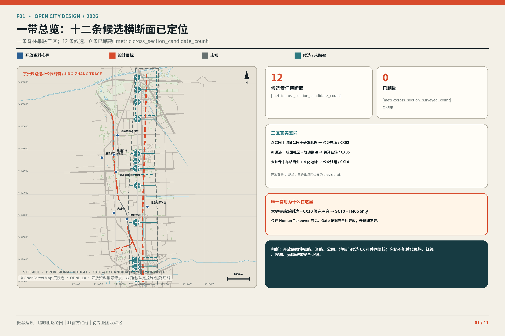
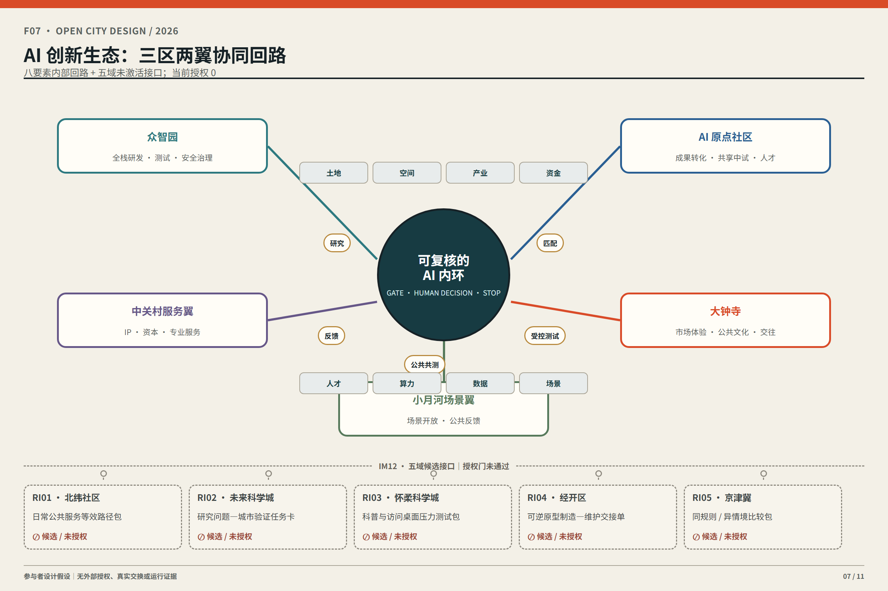
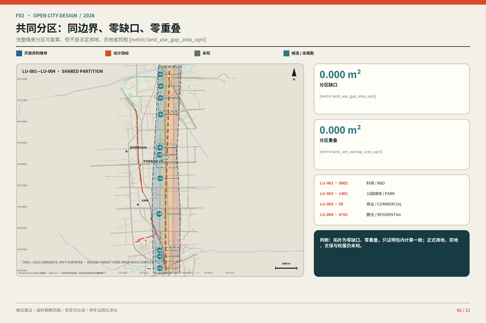
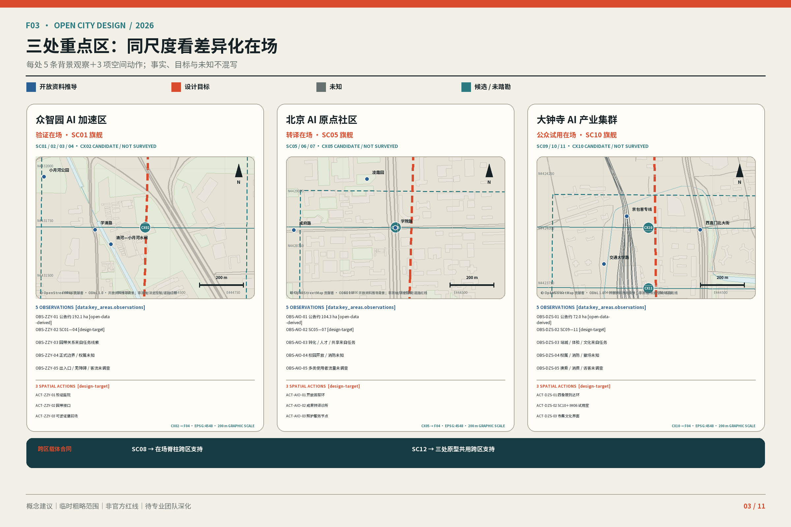
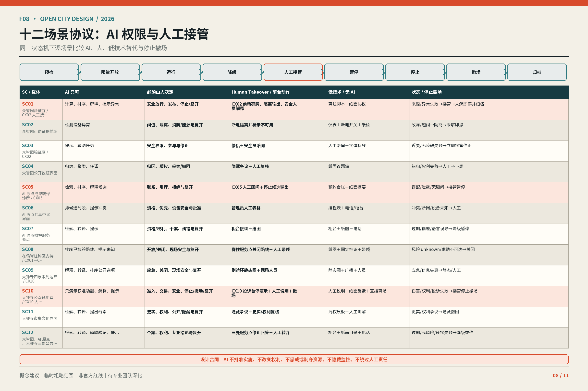
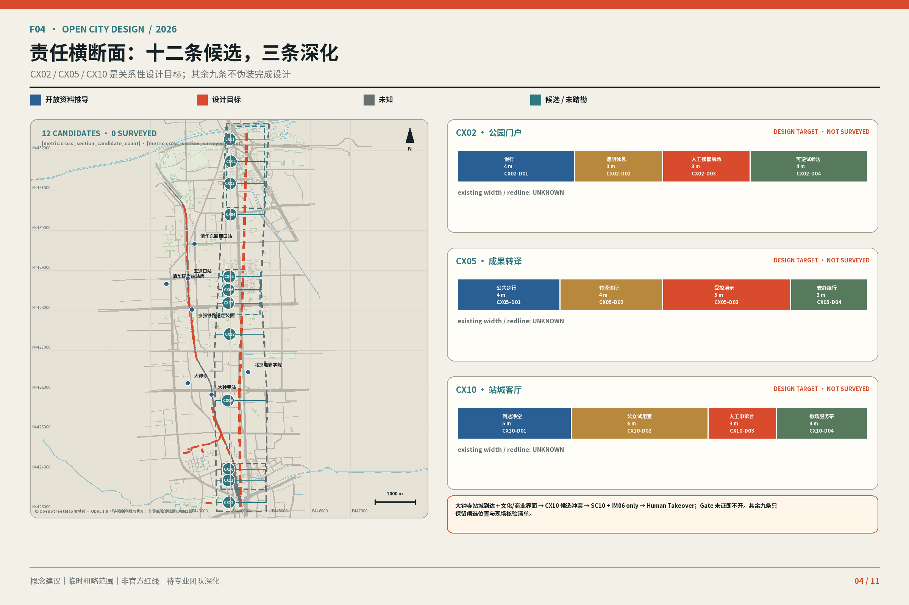
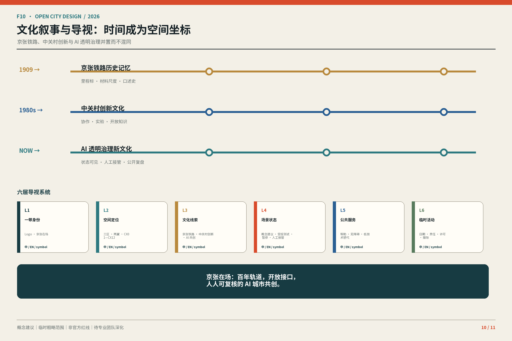
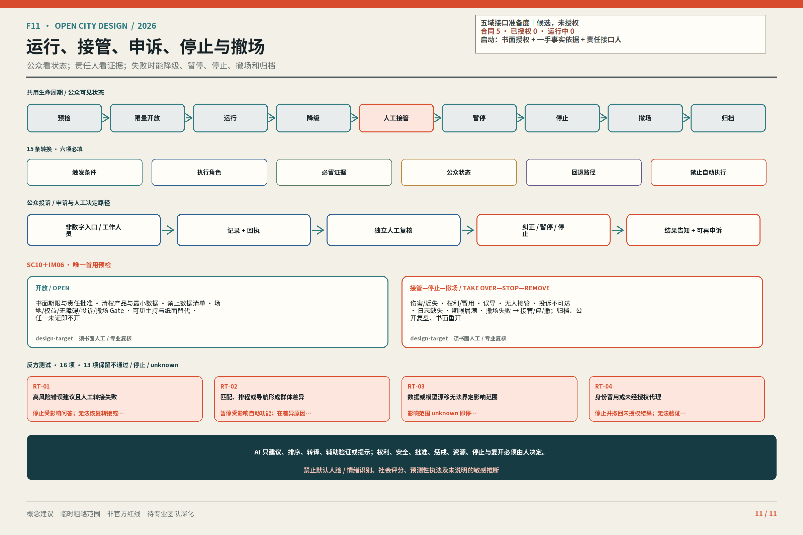
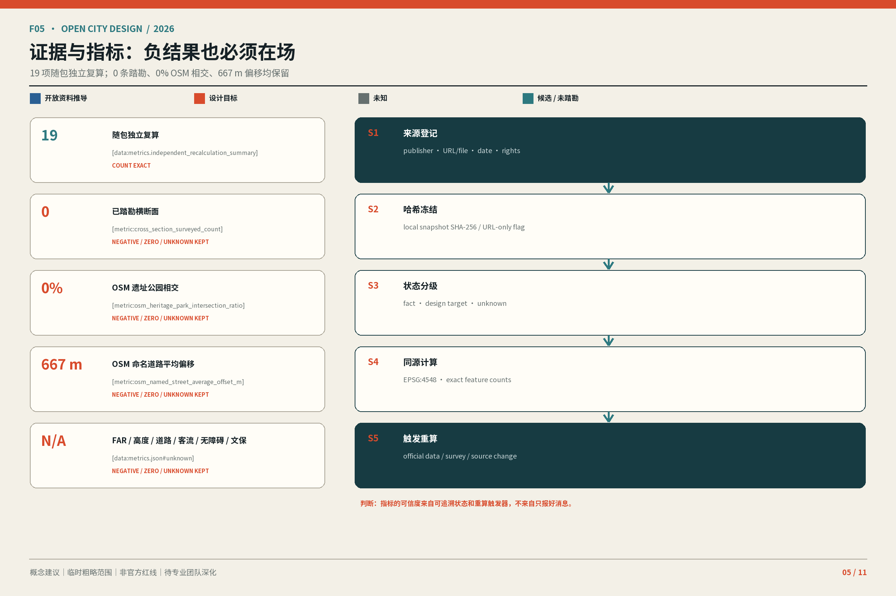

# 京张在场：把 AI 变成可见、可接管、可验证、可撤回的城市界面

**主命题**：京张在场把 AI 变成三处公众可见、可人工接管、可验证、可撤回的城市界面。**人在场、证据在场、责任在场**共同检验入口、来源、失败、责任与撤场。本方案是概念建议，不是获批规划、政府承诺或工程结论。

四个一级消息：①三重在场；②一条脊柱＋三处原型＋十二候选横断面；③SC01/SC05/SC10 三旗舰＋九支持；④七包＋一个限时可逆首用。30 秒读 F01→F03→F08→F11，3 分钟核对空间、场景、退出，15 分钟再读其余 F 图、T01—T07、矩阵和来源。

## 设计依据与资料清单

公告、智能体任务书、场地包、来源表和本地标准快照限定任务与表达；处理资料只导航。[source:DATA-SRC-OFFICIAL-ANNOUNCEMENT-20260509] [source:DATA-SRC-AGENT-TASKBOOK-20260518] [source:REPO-SOURCE-REGISTRY]

第 2 期冻结表登记来源、日期、时空范围、复用边界、转换链、SHA-256、等级与禁限用途。早期 OSM 组是 2026-08-14 边界错位核对：只留 query/response hash，原始响应未登记、不可随包重放；它只产生下文 0% 与 667 m 两项低置信度警示，不能进入 required design GeoJSON 或冒充测绘。[source:DATA-SRC-PROVISIONAL-BOUNDARY-BASIS-20260814] [data:sources.json#r5_evidence_separation]

另一组是 2026-08-28 R3 场地识别背景：四个固定 OSM/Overpass 查询及原始响应、检索时间、query/raw/derived hash 与 ODbL 1.0 权利记录均随包保存、可重放；只支持道路/铁路、公园、已清权地标与粗粒度建筑肌理表达，不产生或回填 0%/667 m，不进入 required design GeoJSON，也不支持正式边界、文保控制、道路红线或测绘。[source:DATA-SRC-OSM-CONTEXT-20260828] [data:visual/assets/r3-site-context-qa.json] [data:sources.json#r5_evidence_separation]

三层范围和三重点区尚无正式 polygon。SITE/KEY_AREA 是临时粗略约束，只供图件、自检、情景比较；不证明红线、权属、审批、法定用地、精确面积或工程可行性。正式边界到位后，同批重算图层、指标、F01—F11、HTML/PDF。[source:DATA-SRC-PROVISIONAL-BOUNDARIES-20260605] [data:geometry/site_boundary.geojson#SITE-001]

法定控规、逐栋现状、结构消防、日照管线、文保、道路断面、客流停车、市政、企业人才和现场调查仍缺失；不补 FAR、高度、密度、拆改留、红线、投资，也不判断桥隧、地下空间或审批。[standard:PROJECT-OFFICIAL-ANNOUNCEMENT] [depth:existing_conditions_diagnosis]

## 三层范围工作框架

### 总体概念、命名与品牌识别

“京张”连接铁路遗产与公共记忆；“在场”要求人可进入、证据可追溯、责任可接管。英文规范名唯一为 **Jing-Zhang In Situ**；F06 Logo 可省略连字符作图形变体，正文和外宣不得另造项目名，也不暗示实施。双轨、十二刻度、三节点、开放弧线表达空间语法，不用企业商标或未授权铁路标识。[standard:PROJECT-AGENT-OPEN-CALL-TASKBOOK] [depth:overall_spatial_structure]

### 三大定位、五大功能与三区两翼

三大定位为百年京张文化带、都市 AI 生活体验带、AI 融合创新带。T01 将五功能落到可核验机制。

| T01 功能 | 主要载体 | 在场检验 |
| --- | --- | --- |
| AI 全栈自主创新体系 | 众智园 | 受控测试、失败记录、人工停止 |
| 世界级 AI 创新生态 | AI 原点＋中关村翼 | 匹配、中试、人才服务与拒绝记录 |
| AI+ 场景赋能新范式 | 小月河翼＋十二横断面 | 公共共测、低技术替代与申诉 |
| 智能化 AI 活力城市 | 公园、公共首层与站城界面 | 日常可达、状态可读、可撤回 |
| AI 治理全球话语权 | 三区共同承担 | 来源、责任、复盘和停止公开 |

### 十二个生活横断面

遗址公园构成“一条在场脊柱”。CX01—CX12 均为可定位、可复核的 `candidate_not_surveyed`，不是工程线位、道路中线或现场成果；逐条保留 ID、坐标、类型、依据、用户、冲突、来源、核验项。[depth:three_level_scope_framework] [data:geometry/roads.geojson#SPINE-001] [data:geometry/roads.geojson#CX01] 候选数独立复算，踏勘数 0 保留负结果。[metric:cross_section_candidate_count] [metric:cross_section_surveyed_count]

CX 与 SC 分开编号。十二类型为河岸研发、公园门户、研发庭院、校园首层、成果转译、人才生活、社区缝合、小月河无障碍、轨道—公园连接、站城客厅、市集首层、安静照护。仅深化 CX02/CX05/CX10；剖面宽度是 `design-target`，现状总宽、道路红线 `unknown`，其余九条仍候选。[metric:detailed_cross_section_count]

[data:geometry/roads.geojson#CX02] [data:geometry/roads.geojson#CX05] [data:geometry/roads.geojson#CX10]

## 统筹研究范围产业与未来城市研究

### 全球案例机制比较

T02 只迁移已登记案例的组织机制，不迁移数字、图像、空间结论或合作承诺。

| T02 来源 | 可讨论机制 | 本地问题 |
| --- | --- | --- |
| Seoul AI Hub | 分阶段 PoC | 如何复盘和选择？ |
| one-north | 产研、living lab、公共空间 | 安全与可达如何共存？ |
| STATION F / F.ai | cohort、office hours、访问梯度 | 如何分层负责？ |
| Maria 01 | 遗产再用、渐进运营 | 遗产如何接入创新？ |
| Mila | 研究、转化、人才、责任 AI | 公益如何进入转化？ |
| Dubai Future Accelerators | challenge—pilot—evaluation | Gate 如何停止？ |
| Marineterrein | 可逆临时使用 | 失败如何恢复？ |

前三项来自登记背景源。[source:CASE-SEOUL-AI-HUB-20250710] [source:CASE-SINGAPORE-ONE-NORTH-20230703] [source:CASE-STATION-F-FAI-20260211]

遗产再用与责任治理仅作背景。[source:CASE-HELSINKI-MARIA-AREA] [source:CASE-MILA-IMPACT-20211118]

挑战制和可逆使用只启发 Gate。[source:CASE-DUBAI-FUTURE-ACCELERATORS] [source:CASE-AMSTERDAM-MARINETERREIN]

### 生态图与八要素机制

F07 以“研究—匹配—受控测试—公共共测—反馈”连接八要素，让投诉、失败、成本、修订返回研究端。土地、资金、算力仍待授权；外部区域不进入内部回路，而由 IM12 的 RI01—RI05 五项未激活合同分别定义交换目的、最小输入、首件交付、授权 Gate 与停止规则。[source:DATA-SRC-AGENT-TASKBOOK-20260518] [depth:overall_spatial_structure]

五域均是参与者提出的设计假设，不是对象既有职能、合作意向或资源承诺；当前合同 5、获授权 0、运行 0、真实交换 0。[metric:regional_interface_contract_count] [metric:regional_interface_authorized_count]

| 对象 / 接口目的 | 京张输出 | 对方最小输入 | 首件交付物 | 当前状态 / 不能启动的原因 |
| --- | --- | --- | --- | --- |
| RI01 北纬社区：把“人在场”转成日常公共服务等效路径 | SC08/SC12 的四路等效、人工接管、无障碍投诉与失败转接模板 | 经授权、去身份化的问题分类；一手服务目录、时段/场景与无障碍说明 | 《日常公共服务等效路径包》 | 候选 / 未授权；缺逐范围书面授权、一手事实与责任角色 |
| RI02 未来科学城：把公开科研问题转成有限、可停的城市验证任务 | TVS-1—3、证据字段—专业 Gate—停止模板与低技术核对 | 获准公开的问题、适用/用途约束、安全等级与数据等级 | 《研究问题—城市验证任务卡》 | 候选 / 未授权；无问题公开许可、材料权利及场景授权 |
| RI03 怀柔科学城：检验科普转译、访问与错误回退 | F10 双语状态、SC11 来源复核、SC12 静态/人工兜底 | 获准公开的科学摘要、权利/访问规则、警示与场景边界 | 《科普与访问桌面压力测试包》 | 候选 / 未授权；无内容权利、访问边界与责任角色 |
| RI04 经开区：把可逆构件责任延伸至制造、维护与撤场 | C01—C09 断电/拆装、维护/人工替代、SC10 停止日志 | 供应商中立的可制造、材料/安全/维护/拆除反馈与失效条件 | 《可逆原型制造—维护交接单》 | 候选 / 未授权；无对象确认、权利边界、专业角色或制造结论 |
| RI05 京津冀：用同一规则比较不同公开城市情境 | 九状态十五转换、证据等级、负结果/接管及四类比较台账 | 一手公开规则/情境、来源许可、口径与不可比项 | 《同规则 / 异情境比较包》 | 候选 / 未授权；无逐情境授权、一手事实或跨区治理安排 |

完整双语合同位于 `visual/assets/regional-interface-contracts.json#/interfaces`。禁入数据、京张侧责任、授权后对方角色、复核触发与逐接口停止规则以该文件为准；任何禁止输入、误导合作措辞或 Gate 缺失都只产生停止/撤回，不产生“已协同”结果。

## 总体设计范围城市更新与控规深度城市设计

更新用三个可回退动词：**KEEP** 保留经调查有公共价值的建筑、树阵、服务；**OPEN** 待权属、安全、运营允许后开放园边、院落、公共首层；**INTENSIFY** 用共享时段和可逆构件强化使用，不预设开发量。[standard:MOHURD-CONTROL-DETAILED-PLANNING] [source:DATA-SRC-MOHURD-CONTROL-DETAILED-PLANNING] [depth:retain_renovate_demolish]

每个空间动作须同时说明公众入口、证据状态、责任角色和恢复方式，不能只给传统功能分区换上 AI 名称。

城市设计统筹平面与立体空间、公共空间、交通市政和风貌；本期仅形成可复核建议，不声称已有批准的控制要求。[standard:MOHURD-URBAN-DESIGN-MEASURES] [source:DATA-SRC-MOHURD-URBAN-DESIGN-MEASURES]

临时用地仅检验公共开放、创新服务、生活照护和蓝绿连续：LU-001/LU-002 组织创新与公共界面，LU-003/LU-004 组织生活与蓝绿情景；完整覆盖不证明法定用途。[data:geometry/land_use.geojson#LU-001] [data:geometry/land_use.geojson#LU-002]

四块情景用地共享边界坐标，缺口和重叠均为 0 m²；这只证明包内拓扑一致，不构成法定用地、宗地、控规或权属结论。[metric:land_use_gap_area_sqm] [metric:land_use_overlap_area_sqm]

FAR、高度、密度、建筑规模和永久建设等待正式控规及逐栋资料。[data:geometry/land_use.geojson#LU-003] [data:geometry/land_use.geojson#LU-004] [depth:development_intensity_controls]

## 重点区域详细设计

三处原型共用 400 m × 400 m `design-target` 比较框和“平面—关系剖面—运营状态”图例，但责任不同；尺度非实测。每处登记 5 观察、3 动作，尺寸标 `open-data-derived`、`design-target` 或 `unknown`。[depth:three_key_area_detailed_design] [metric:key_area_count] [metric:background_observation_count] 动作按结构化字段计数。[metric:spatial_action_count]

### 众智园 AI 自主创新加速区

**观察**：①公告约 192.1 公顷（`open-data-derived`）；②SC01—SC04、旗舰 SC01；③园带须接创新载体；④polygon、权属、红线未知；⑤出入口、树荫、坡度、客流、无障碍未调查。**动作**：验证庭院、园带接口、可逆证据前场，组织测试旁观、慢行帮助、断电移除。CX02 仅是设计目标，河岸、能源、消防、接驳待核验。[data:geometry/key_areas.geojson#PROV-KEY-001] [data:geometry/roads.geojson#CX02]

### 北京 AI 原点社区

**观察**：①公告约 104.3 公顷（`open-data-derived`）；②SC05—SC07、旗舰 SC05；③任务要求转化、人才、共享；④校园边界、首层、消防未知；⑤各类人流未调查。**动作**：开放首层环、转译诊所、照护节点；人工顾问决定引荐，保留非智能入口、安静绕行、服务时段。CX05 只是设计目标。[data:geometry/key_areas.geojson#PROV-KEY-002] [data:geometry/roads.geojson#CX05]

### 大钟寺 AI 产业聚集区

**观察**：①公告约 72.0 公顷（`open-data-derived`）；②SC09—SC11、旗舰 SC10；③任务要求到达、体验、文化；④车站界面、权属、消防、撤场路线未知；⑤换乘、消费、摊位、访客流量未调查。**动作**：四象限到达环、公众试用室、市集文化界面；试用室只承载唯一 SC10＋IM06 首用。CX10 并置到达、试用、人工投诉、撤场，不承诺地下联通、招商或改造。[data:geometry/key_areas.geojson#PROV-KEY-003] [data:geometry/roads.geojson#CX10]

场景逐 ID 冻结：众智园 SC01—SC04，AI 原点 SC05—SC07，大钟寺 SC09—SC11；SC08 是在场脊柱跨区无障碍支持，SC12 是三原型共用的公共服务与人工转接支持。

## AI 创新生态、人才画像与 AI+ 场景

### 七类用户画像

| T03 ID | 角色 | 必保入口 |
| --- | --- | --- |
| U1 | 科研与研发人员 | 受控测试、证据复核 |
| U2 | 创业与产品团队 | 清权、拒绝与撤场 |
| U3 | 运营维护、安全与专业复核 | 人工接管、日志 |
| U4 | 居民、社区工作者与商户 | 低技术替代、申诉 |
| U5 | 儿童、照护者与教育者 | 监护、内容复核 |
| U6 | 老年人、残障访客及陪同者 | 无障碍、人工帮助 |
| U7 | 国际开发者与专业访客 | 双语状态、许可边界 |

U6 的低技术替代以“传统服务与智能化创新并行”为政策背景；不证明海淀已有服务、需求数字或实施承诺，仍须逐场景核验人员、线下入口和维护责任。[source:DATA-SRC-ELDERLY-SMART-TECH-PLAN-2020-45] [depth:blue_green_public_space]

SC01—SC12 共用完整合同：目的/载体、用户、输入、来源、最小数据、输出、AI 权限、人类专属决定、告知、合法依据或不采集、Human Takeover、低技术/无 AI、投诉、日志、删除、状态、评价、依赖、成本、维护、退出。机器权威在 `visual/assets/phase3-protocol-contracts.json`。无到场责任人、可达投诉或高风险闭环，即不进入/停止。[source:DATA-SRC-AGENT-TASKBOOK-20260518] [depth:municipal_new_infrastructure]

仅当场景确属境内公众生成内容服务，才判断《生成式人工智能服务管理暂行办法》适用性；Human Takeover、停止、退出是设计合同，不扩写第十四条或虚构第十五条法定数字期限。[source:DATA-SRC-GENERATIVE-AI-INTERIM-MEASURES] [depth:municipal_new_infrastructure]

共用状态机有 9 个 ID：`preflight / limited-open / operating / degraded / human-takeover / paused / stopped / removed / archive`、15 条权威边，不自动前进。每边写双语触发、角色、证据、公众状态、回退、禁止自动事项；F10 固定词对应 preflight＝“概念建议 / 待现场核验”、limited-open＝“受控测试”、human-takeover＝“人工接管”、paused＝“暂停服务”。同一实例仅 `paused→limited-open` 可由具名责任人和安全专业角色批准限量复测；`archive` 是终态，未来须新建实例取证。AI 只可建议、排序、转译、辅助验证、提示；实施批准、权利变化、惩戒、资源剥夺、停止、复测只由人决定。默认禁用人脸/情绪识别、社会评分、预测性执法和未说明敏感推断。

三项产业测试验证编号继续锁定：TVS-1＝SC01 模型评测，TVS-2＝SC02 能效与热安全，TVS-3＝SC03 具身智能无障碍共测；3+9 的竞争性层级不删除这组三项专业验证义务。

### 十二张场景卡

三旗舰以 12 条泳道展开合同。**SC01**：提交者→数据责任人→安全 Gate→受影响公众；来源/协议失效即 degraded，未解则 paused→stopped→removed→archive。**SC05**：用户→人工服务→场景责任人→独立申诉复核人；AI 只排序，自愿摘要可转纸面/柜台，泄露、持续误配或无顾问即接管/暂停。**SC10** 仅到 limited-open：产品方→现场主持→安全 Gate→投诉责任人；伤害、权利、误导、无人接管或投诉不可达即 human-takeover→stopped→removed→archive。三者共用 15 边，不新增建筑、产品或 pilot。

| T04 组合 | 载体 / 用户 | AI 与最小数据 | 人工、低技与申诉 | 评价 / 退出 |
| --- | --- | --- | --- | --- |
| 旗舰 SC01 | 众智园；U1/U2/U3 | 评测；清权基准/合成数据/日志 | 安全放行；离线脚本；登记 | 问题未解即停 |
| 旗舰 SC05 | AI 原点；U1/U2/U3 | 匹配；自愿摘要/公开需求 | 顾问决定；台账；纠错 | 泄露即停 |
| 旗舰 SC10 | 大钟寺；U2/U3/U4/U7 | 试用；清权说明/自愿反馈 | 主持；纸面反馈；投诉 | 争议即撤场 |
| 支持 SC02/03/04 | 众智园；U1/U2/U3/U6/U7 | 热安全、无障碍、标准；许可数据 | 专业人员；仪表/陪同/议题墙 | 越阈、近失、版权、失养即停 |
| 支持 SC06/07 | AI 原点；U1/U2/U3/U4 | 排程/导航；最小公开或自愿数据 | 管理员；表格/地图/柜台 | 冲突、歧视、过期即降级 |
| 支持 SC09/11 | 大钟寺；U4/U6/U7 | 换乘/共读；确认交通与清权档案 | 现场/史实复核；静态入口 | 应急、事实、权利争议即关闭 |
| 跨区 SC08 | 在场脊柱；U4/U6/U7 | 无障碍路线；现场核验 | 服务点；纸图/人工带领 | 风险未知或求助不可达即关闭 |
| 跨区 SC12 | 三原型；U4/U5/U6/U7 | 带来源、日期的 FAQ | 柜台/人工转接 | 过期或高风险误答即降级 |

逐卡边界：**SC02** 只读清权遥测，专业人员确认，越阈/日志不全即隔离；**SC03** 只采自愿任务和环境状态，不建画像，无安全员/近失即停；**SC04** 只归纳公开标准、Issue、异议，主持人确认，归因错误、版权问题或无人维护即下线。

**SC06** 只处理公开时段、设备标签和申请状态，由设施管理员审批；条件不明或权限冲突即转人工表格。**SC07** 只用公开信息和主动选择，过期、歧视或无人维护即暂停。

**SC09** 只释经确认的交通信息，应急/失真即切静态图；**SC11** 只用清权档案和同意口述，争议未解/权利撤回即隐藏。跨区 **SC08** 公开前须无障碍审计，不追踪身份，路线风险未知/人工求助不可达即关闭；跨三原型 **SC12** 只引带来源、日期的 FAQ，不替代法律、医疗、消防结论，过期/无法转人工即降级。九支持保护三旗舰和脊柱。

数据分公开/仓库证据、运营非个人、个人、敏感个人、模型推断/评分、日志/申诉六类，逐类登记目的、最小字段、角色、权限、删除、边界、审计、申诉、禁用、证据状态。12 场景以继承＋override 闭合，12 controller 仍 unknown。九条核心路径 `no personal data required`；仅七条条件路径为 SC04 署名/回复、SC05 引荐、SC06 预约、SC07 回访、SC10 投诉回复、SC11 可识别口述、SC12 人工回复，均须法律审查，不表示核心服务须采个人数据。敏感个人数据必需项 0、默认禁用。投诉保留非 AI 入口、回执、独立人工复核、告知、不同人员再申诉；不可达即 Human Takeover/停止。老年人、残障人士、儿童、非智能设备用户、非中文用户、拒绝 AI 者保留等效服务、非数字入口、人工解释、退出；这是 `design-target`，不宣称人员或法律/无障碍审查已就绪。[source:DATA-SRC-BARRIER-FREE-ENVIRONMENT-LAW] [source:DATA-SRC-ELDERLY-SMART-TECH-PLAN-2020-45]

F08 用同一 ID 横向比较 12/12 场景的 AI 权限、人工决定、前台接管、低技术替代和状态/撤场；它不改变 SC01—SC12 或载体映射。[data:geometry/public_space.geojson#PUBLIC-001]

## 用地、建筑规模与拆改留方案

用地和建筑均为临时情景。公共首层、基底、通透、退让、屋顶和可逆构件可深化；逐栋 KEEP/OPEN/INTENSIFY 须等待权属、结构、消防、日照、管线和文保套核。[standard:MNR-LAND-USE-CLASSIFICATION-GUIDE] [source:DATA-SRC-MNR-LAND-USE-CLASSIFICATION-202311] [depth:land_use_layout]

建筑基底只复算提交图层，不等于现状或获批包络；前提失败即退回公共空间或运营试验。[data:geometry/buildings.geojson#BLDG-001] [metric:building_footprint_area_sqm] [depth:height_massing_character]

深化前须逐单元核对资料权威、日期、用途、权属、入口、结构、消防，再判断保留、开放或强化。否则图色只代表情景，不能计算总建面、容积率、密度或形成征拆、加建、招商清单。

## 交通、轨道、市政与公共服务设施

交通优先步行、无障碍、骑行、公交接驳和必要机动车；站口先改善地面可读与人工服务。缺红线、断面、客流、停车资料时，不作容量、安全、桥隧或地下工程结论。[depth:traffic_rail_slow_parking] [data:geometry/roads.geojson#SPINE-001]

《无障碍环境建设法》第三十九条的人工办理限于所列公共服务场所；扩至其他城市界面只是设计目标，不声称条款普遍适用或已完成无障碍审计。[source:DATA-SRC-BARRIER-FREE-ENVIRONMENT-LAW] [depth:traffic_rail_slow_parking]

节点可设座椅、遮阴、照明、状态告知；供电、散热、噪声、网络、消防、排涝、维护须专业确认，高风险服务切人工或静态模式。

十二横断面逐条核验权属、宽度障碍、铺装坡度、过街、遮阴、轮椅回转、人流、维护、应急通行。来源、日期、方法、范围、同意、责任人齐全才升级为调查证据；本期全为“未踏勘”，不生成通行、无障碍或停车数字。[metric:pedestrian_flow_count] [metric:accessible_route_pass_rate]

## 蓝绿空间、公共空间与城市风貌

清河、小月河、遗址公园和社区树荫是待调查的降温、慢行、交往基础。绿色/公共空间比例仅为提交情景；AI 装置不能替代树冠、雨水、照明、座椅、盲道和维护。[depth:blue_green_public_space] [data:geometry/green_space.geojson#GREEN-001] [metric:green_ratio]

绿色空间绝对面积只复算情景图层。[metric:green_space_area_sqm]

公共空间绝对面积和比例同样随临时边界重算。[metric:public_space_area_sqm] [metric:public_space_ratio]

### 三地标、开放贡献谱与组件库

众智园验证庭公开测试证据，AI 原点发布台支持开源说明与纠错，大钟寺城市窗口连接试用、文化、人工服务。“京张开放贡献谱”记录代码、数据、场景、服务、维护、无障碍、文化校订；状态仅为提交、复核、采用、修订、撤回，不称获奖。

组件 C01—C09 为证据柱、横断面门标、人工帮助点、可逆测试台、无障碍座椅遮阴、数据告知牌、贡献展示轨、维护接口箱、安静界面；只定义功能、信息、无障碍与责任，工程可行性待深化。

### 文化、导视与国际传播

文化叙事为“来路—在场—共创”，空间故事为“轨迹—接口—回声”。F10 **六层**导视含 Logo、定位、文化、状态、服务、临时活动；固定词为“概念建议 / Conceptual Recommendation”“受控测试 / Controlled Test”“暂停服务 / Paused”“人工接管 / Human Takeover”“待现场核验 / Pending Site Verification”。无人员证据不得写“24H 人工服务”。

国际主文案：“**京张在场：百年轨道，开放接口，人人可复核的 AI 城市共创。**”外宣须显示概念状态，不暗示入选、批准或建成。

## 更新项目清单、实施政策与分期计划

近期仅做资料基线、横断面调查、责任协议和可逆原型；中期在权属、专业条件确认后讨论公共首层、蓝绿慢行、组件和地标；永久建设等待控规、交通、市政和工程专题。阶段不是批准时序。[data:geometry/phasing.geojson#PHASE-001] [depth:phasing_implementation]

### 年度运营与转化路径

| T05 频率 | 候选活动 | 必留证据 / 取消条件 |
| --- | --- | --- |
| 持续 / 每月 | Issue 与贡献台账 / 公共接口步行 | 问题、责任、修订；无维护者即停 |
| 每季 / 每半年 | 验证庭开放日 / 公共责任复盘 | 测试、投诉、接管；Gate 不过即取消 |
| 每年 | “京张在场周”与“全球城市 AI 接口论坛”候选品牌 | 逐项许可、清权、人员；不形成政府日程 |

前台显示状态牌和人工入口；责任角色核对触发、证据、回退。投诉/申诉可由柜台、纸面、电话或可访问数字入口进入，留记录/回执，经独立人工复核决定纠正、降级、暂停、停止或撤场并告知；响应窗口是 `design-target`，不是法定期限。后续只作自愿候选转介，不承诺岗位、资金、采购、空间或背书。

### 项目级实施表

前台只显示七包；13 个 IM 机器对象位于 `design_depth_matrix.json#/items/11/implementation_projects`，逐项保存角色、依赖、定性成本、证据、维护、评价、Human Takeover 和停止/退出。S/M/L 表示研究协调、可逆运营、待工程深化，不是投资估算。[depth:renewal_project_list]

| T06 包 | 后台 ID | 前台动作 | Gate / 撤回 |
| --- | --- | --- | --- |
| AP1 证据基线与重算 | IM01+IM13 | 锁定权威版本、差异与哈希 | 来源冲突即冻结派生指标 |
| AP2 横断面与责任协议 | IM02+IM03 | 调查 CX01—12；保障跨区 SC08；定人工、申诉、停止 | 无许可或责任人即不进入 |
| AP3 众智园原型 | IM04 | SC01/02/03/04 受控验证 | 专业条件或安全失败即停 |
| AP4 AI 原点原型 | IM05 | SC05/06/07 匹配与服务 | 泄露、误配、设施不明即人工回退 |
| AP5 大钟寺原型 | IM06 | SC09/10/11 到达、试用与文化 | 权利、安全或投诉失效即撤场 |
| AP6 公共界面与身份 | IM07–IM10 | 地标、组件、导视、贡献谱及跨三原型 SC12 | 权属、维护、史实或同意失败即移除 |
| AP7 运营与协同 | IM11–IM12 | 年度候选活动；RI01—RI05 五域首件交换合同 | 无逐接口授权、一手事实或责任角色，不得交换、运行或称合作 |

### 实施成熟度证据与当前 NO-GO

三条详化责任横断面只给出可复算的归一化设计目标量，不虚构场地总量：CX02 为 `4＋3＋3＋4＝每延米 14 m²`，CX05 为 `4＋4＋5＋3＝16 m²/m`，CX10 为 `5＋6＋3＋4＝18 m²/m`。每个带同时登记施工/运营接口、维护责任缺口、停止条件和重算触发器。合法线位、权利、现状总宽、实测干预长度、现场条件、operator 和单价仍为 `unknown`；8 份主管来源仅建立桌面审查接口，不生成项目 GIS/CAD。[source:DATA-SRC-R3E-JINGZHANG-CONTROL-PLAN-RESPONSE-20250208] [source:DATA-SRC-R3E-DAZHONGSI-HERITAGE-REGISTER-20171027] [source:DATA-SRC-R3E-JINGZHANG-PARK-PLANNING-INTERPRETATION-20211216]

概念资源模型透明但未定价：`变动成本＝Σ 带宽×实测干预长度×有日期和范围依据的单价`，另计前期、人员、维护、撤场和预备费。可信单价记录为 0，故所有 CNY 输入和总价继续为 `null`。移交表把候选公共审查接口与已任命主体严格分开：operator 未任命、12/12 controller 均 `unknown`、RACI 的 accountable 栏全部等待书面授权，当前结论为 `NO_GO_ALL_OPENING_GATES_NOT_EVIDENCED`。[source:DATA-SRC-R3E-PARCEL-ACCESS-LIMITATION-2015] [source:DATA-SRC-R3E-QINGHUAYUAN-HERITAGE-TEXT-20260214]

法律/规划/文保/无障碍/消防/数据/运营共 10 行仅达到桌面待复核状态，专业签署为 0。6 项合成桌面演练保留 3 项负结果、1 项 `unknown`、2 项零结果，只验证允许的状态转换和停止/撤场逻辑；现场或真实运营演练为 0。可审计证据与 QA 位于 `visual/assets/r3e-implementation-evidence.json` 和 `visual/assets/r3e-implementation-qa.json`，它们不是踏勘、签章、正式概算、批准或实测绩效。[source:DATA-SRC-R3E-GB55019-2021-ACCESSIBILITY] [source:DATA-SRC-R3E-GB55037-2022-FIRE] [source:DATA-SRC-R3E-DB11-1761-2020-WALK-CYCLE]

**唯一首用试验：SC10＋IM06 only。** `preflight` 须留书面期限、批准/角色、最小/禁止数据、产品/场地/权益/无障碍/投诉/撤场条件、人工值守、低技替代；任一 Gate 未证即不开。伤害/近失、权利或身份冒用、误导、无人接管、投诉不可达、日志缺失或撤场失败，即接管并由责任人暂停/停止。停止后断服务、依规封存/删除数据、撤状态和设备、归档、复盘；`archive` 后原实例不复开。未来须独立人工/专业复核、条件重证、新告知，并另建 `run_instance_id` 从 preflight 开始。时限、窗口、阈值是 `design-target`/`unknown`，不是 SC13、IM14、其他 pilot、法定期限、运营承诺或真实绩效。

16 项反方台面测试覆盖错误、偏差、漂移、冒用、恶意输入、断网断电、接口、无人接管、无障碍、语言误导、投诉不可达、撤场失败、日志不全、权利撤回、越权；12 项保留 `fail_stop`、`unknown_stop` 或 `fail_pause`，逐项追溯 SC、协议、F08/F11、正文、矩阵。残余风险和复测条件见 `visual/assets/phase3-red-team.json`；台面推演不是现场、安全或法律验证。[depth:risk_missing_data]

## 指标体系、面积复算与合规矩阵

原有空间证据仍为 21 项已知/记录指标、其中 19 项可随包复算；面积/长度用 EPSG:4548，误差 ≤0.5%，计数一致。[metric:site_area_sqm] [metric:candidate_cross_section_total_length_m] 本轮另增两项合同状态计数：RI 合同 5、授权 0，均从同一 JSON 自动计数，不代表机构、项目、合作或绩效。[metric:regional_interface_contract_count] [metric:regional_interface_authorized_count] [depth:metrics_recalculation]

不删不利、零值和未知：12 条候选已踏勘 0；情景用地缺口/重叠 0。[metric:cross_section_surveyed_count] [metric:land_use_gap_area_sqm] [metric:land_use_overlap_area_sqm] 早期 2026-08-14 边界错位核对记录遗址公园相交 0%、四条命名道路平均偏移 667 m；其原始响应未登记，故两项不计入 19 项随包复算，也不能修改 provisional 边界。[source:DATA-SRC-PROVISIONAL-BOUNDARY-BASIS-20260814] [metric:osm_heritage_park_intersection_ratio] [metric:osm_named_street_average_offset_m] 2026-08-28 R3 的四份原始 OSM 快照虽然随包、可重放，却属于另一组场地识别查询，不回填这两项值或正式指标。[source:DATA-SRC-OSM-CONTEXT-20260828] FAR、高度、道路面积、客流、无障碍通过率、文保控制面积仍 `unknown`。[metric:floor_area_ratio]

F05 展示证据与重算链；三矩阵保存逐项证据。六个 agent 的 31 项 required outputs 在 `compliance_matrix.json` 中逐项指向章节、F 图、T 表或结构化文件。[standard:MOHURD-ARCH-DESIGN-DEPTH-2016] [source:REPO-SOURCE-REGISTRY]

**十项核心 claim 审阅导航**：

1. **主命题与准则**：三处界面同受人在场、证据在场、责任在场检验；入口：导语、F01/F06；限制：概念状态。
2. **证据边界**：临时范围仅供生成比较，正式资料触发整包重算；入口：设计依据、F01/F05；不外推红线、权属、工程。
3. **脊柱与横断面**：遗址公园连南北，CX01—CX12 查东西断点；入口：三层范围、F01/F04；位置性能待调查。
4. **三处原型**：众智园验证、AI 原点转译、大钟寺公共试用；入口：重点区域、F03/F09；边界均 provisional。
5. **三旗舰＋九支持**：SC01/05/10 展开闭环，九项保护专业与公共安全；入口：T04/F08；不改十二场景。
6. **场景合同**：十二场景都有最小数据、角色、人工、低技、申诉、进入、评价、退出；入口：T03/T04/F08；绩效未知。
7. **八要素内环＋五域接口**：内部 Gate 连接八要素；IM12 以 RI01—RI05 定义五个差异化、未激活交换合同；入口：T02/F07；对象功能是设计假设，非既有合作。
8. **可逆更新**：KEEP/OPEN/INTENSIFY 先于永久建设；入口：F02/F04/F05；不补 FAR、高度、红线。
9. **唯一首用**：SC10＋IM06 限期运行，届满/失败即撤；入口：T06/F08/F11；不新增场景或项目。
10. **七包审计**：AP1—AP7 覆盖 IM01—IM13，锚定 6 agent、31 输出；入口：T06/F05/F11、三矩阵；完成仅指证据齐备。

31 项输出按六个入口阅读：agent.1 主叙事、名称、Logo、结构、合规（T01/F01/F06）；agent.2 案例、生态、产业空间、指标来源、视觉入口（T02/F05/F07）；agent.3 persona、十二场景、运营、隐私/人工边界（T03/T04/F08）；agent.4 公共空间、地标、贡献谱、组件（F03/F04/F09）；agent.5 文化、导视、空间故事、国际文案（F10）；agent.6 年度活动、品牌 IP、开发者、场景运营与转化（T05/F06/F11）。机器层保留逐 output 精确键名。

| T07 人工双语复核 | 结论 |
| --- | --- |
| 13 章顺序、1 主命题、4 一级消息、10 claims | 同序、同强度 |
| 专名、三重在场、六层导视、固定状态词 | 已逐项对照 |
| SC/CX/IM/AP/U/C/TVS 与 F/T 编号 | 集合及分组一致 |
| 指标状态、来源 marker、临时边界、图位 | 不提高置信度，不遗漏限制 |
| 最终快照范围与日期 | 2026-08-29，在生成后逐对复核 2 份 Markdown、22 幅 PNG、4 份 HTML、4 份 PDF；两组 OSM 的来源与限制同强度 |

十项 claim 的章节、图表、数据、来源、限制见 `review_navigation.core_claims`；T07 仅记人工 parity，不替代机器检查。最终逐路径哈希、范围、标准和结论见 `visual/assets/r5-final-snapshot-audit.json#/bilingual_audit`。

## 风险、版权与合规说明

缺口包括正式边界、控规权属、逐栋现状、交通市政消防、文保生态、企业人才、真实需求；风险是临时数据冒充 official、AI 越权、活动变承诺、双语弱化限制、许可链中断。相关声明须暂停，待授权资料后同批重算。[depth:risk_missing_data]

2026-08-29 最终快照审计在全部来源检索与 R4 生成完成后执行：版权台账逐路径覆盖双语正文/HTML、F01—F11、A3/A0、字体及 OFL、封面、两组 OSM、R3-E 元数据、数据与代码；双语审计逐对覆盖主张、数字、来源/限制、图位、HTML 与 PDF，结果和哈希见 `visual/assets/r5-final-snapshot-audit.json`。新增或再生成资产须重开清权。医疗、法律、消防、交通、结构、能源、审批结论只由责任人员或专业团队作出。自检通过不代表入选、批准、发布或实施。

协议把运营主体、个案法律依据、个人数据条件、投诉窗口、现场人工、无障碍/消防/能源/撤场可行性保留为 `requires legal review`、`design-target` 或 `unknown`。`controller`、`operator`、专业角色只是责任占位；来源不能证明合规、同意、合作或资金。

本期冻结名称、F/T/SC/CX/IM/C 编号、三重在场、空间语法、三旗舰九支持、七包映射。不得把候选协同写成既有合作、用关键词替代判断或补画伪精确几何。现场/授权问题保留责任人、触发、停止状态，资料到位后由 AP1 复核。

## 参考资料

公告与任务书限定任务，专业标准限定深度，来源登记表限定用途，临时边界只支持生成与复算。`REPO-PROCESSED-FACT-PACK` 仅导航，七案例均为 `background_only`；回溯入口为 `visual/assets/phase2-source-freeze.json`、`sources.json`、`assumptions.json`、`metrics.json`、GeoJSON 和三份矩阵。[source:REPO-PROCESSED-FACT-PACK]

引用遵循“直接来源优先、登记辅助、处理包只导航”。来源失效、越界或版本冲突时，claim 降级并进入 AP1；案例、搜索摘要或生成文本不能替代正式附件。图件短码须返回登记项，英文稿不得删限制或提置信度。

空间、场景、品牌、活动和协同均为开放共创建议，供专业团队深化；不替代正式规划，不构成政府审定或资源承诺。
