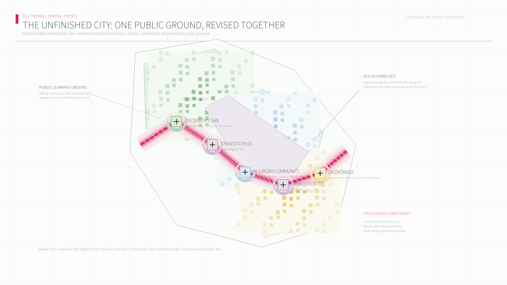
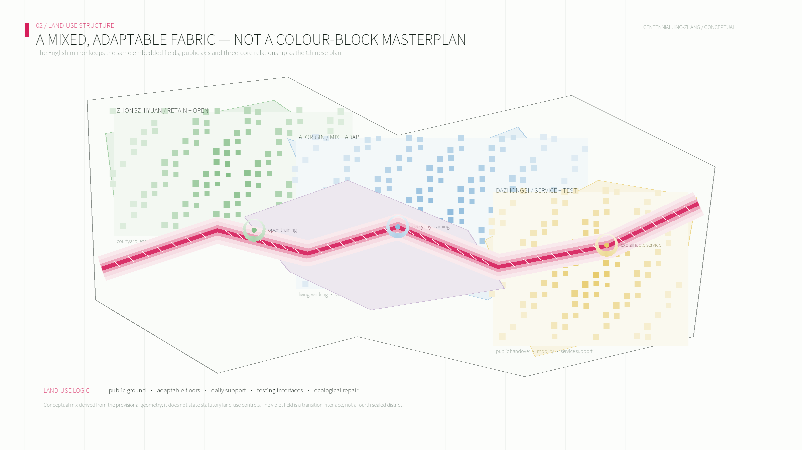
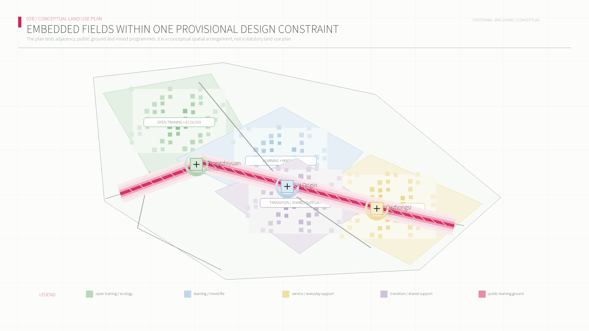
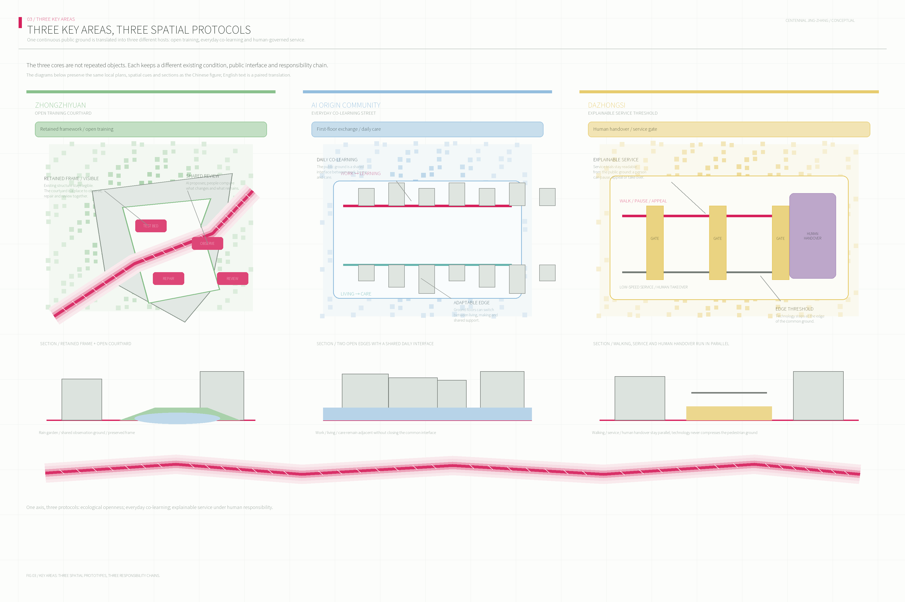
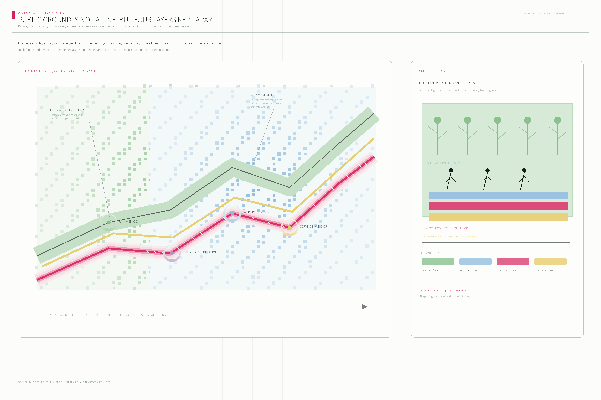
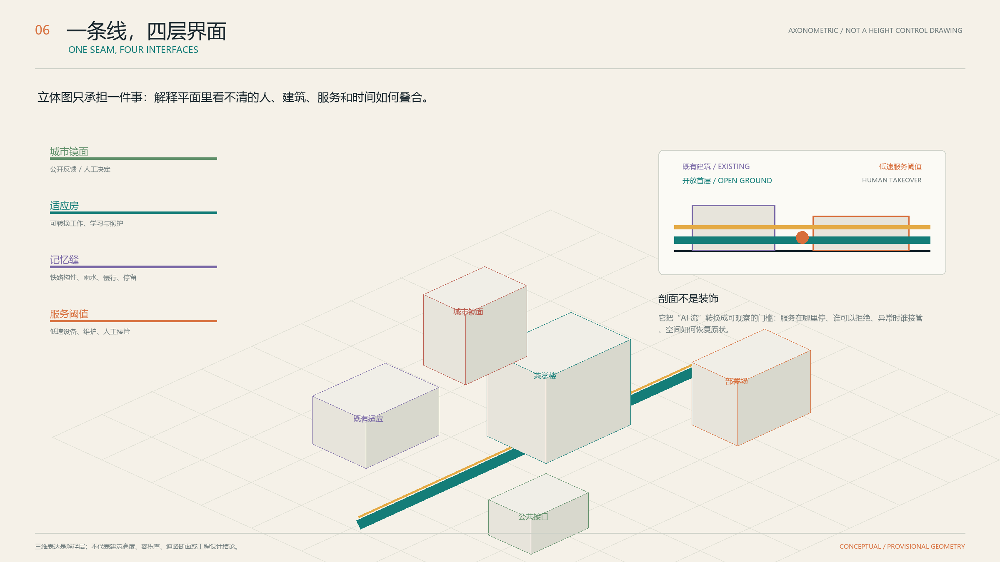
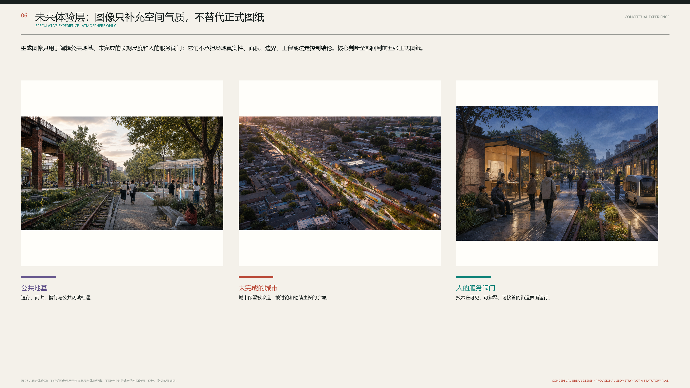
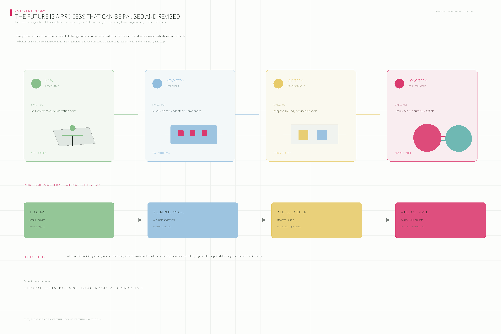

# The Unfinished City: A Jing-Zhang Urban Co-intelligence Experiment Belt

> **This is an unfinished city.**
>
> It is not less future-facing because it has not been entirely rebuilt. Its future remains available to the next evidence, the next deliberation, and the next user. Centennial Jing-Zhang is not treated as a heritage line dressed up as scenery, but as a method of renewal: inherited fabric can remain; daily life can be repaired after interruption; technology can be tested, explained, refused, and paused.
>
> The proposal does not offer a final image that substitutes for reality. It proposes a spatial prototype of urban co-intelligence: from one-off **urbanisation**, through **stock renewal** that respects existing life, toward a city able to keep learning, questioning, and revising itself. Every line in the drawings must answer a material question: where is it, who uses it, who maintains it, and how can it be reversed when disputed?[source:AGENT-TASKBOOK] [depth:overall_spatial_structure]

## Design Basis and Source List

This is a conceptual, open co-creation proposal based on the published brief, source registry, and provisional spatial constraints. It is not an official redline, statutory plan, engineering design, or implementation commitment.[source:OFFICIAL-ANNOUNCEMENT] [source:AGENT-TASKBOOK] [depth:existing_conditions_diagnosis]

## Three-Level Scope Framework

The coordinated research area addresses the innovation ecosystem; the overall design area organizes renewal and public infrastructure; the three key areas test the spatial proposition. All precision-sensitive calculations must be refreshed when official geometry arrives.[data:geometry/site_boundary.geojson#SITE-001] [data:geometry/key_areas.geojson#PROV-KEY-001] [depth:three_level_scope_framework]

## Coordinated Research Area: Industry and Future City Research

The proposal moves from urbanization, through stock renewal, toward urban co-intelligence: planning conditions through which a city can keep learning rather than a finished image. AI supports sensing, comparison, and collaboration; it never replaces human judgment.[source:AGENT-TASKBOOK] [standard:PROJECT-AGENT-OPEN-CALL-TASKBOOK] [depth:overall_spatial_structure]

Six public reference cases - MIT Media Lab, Singapore one-north, Barcelona 22@, Helsinki Kalasatama, Seoul Digital Media City, and the data-governance lesson of Toronto Waterfront - inform methods rather than local facts or templates.[source:CASE-METHODS] [source:SOURCE-REGISTRY]

## Overall Design Area: Urban Renewal and Regulatory-Plan-Level Urban Design

The structure is a continuous learning loop, not a spectacle axis: a north-south public spine connects three learning rooms while east-west interfaces connect service, community life, and real-world feedback. Renewal proceeds through retain, adapt, insert, connect, and re-evaluate actions.[data:geometry/land_use.geojson#LU-01] [data:geometry/buildings.geojson#BLDG-01] [depth:land_use_layout]

Figure 02 is a spatial-structure drawing: it only explains the hierarchy and relations between the public ground, three primary cores, and two transition nodes. It does not carry the reading burden of programme colours or urban blocks.[data:geometry/roads.geojson#ROAD-01] [data:geometry/public_space.geojson#PUBLIC-01]

Figure 03 is an independent conceptual land-use and public-space masterplan. Every programme field stays inside the temporary task-package range and tessellates through shared edges; streets, green space, and civic spaces are cut from the complete programme structure. Read the streets and public spaces first, then parks, adaptable living, commerce and innovation services, civic facilities, research/co-learning, and retained adaptive fabric. It does not claim a precise boundary, an existing-condition survey, or statutory land-use codes.[data:geometry/land_use.geojson#LU-01] [data:geometry/green_space.geojson#GREEN-01] [data:geometry/public_space.geojson#PUBLIC-01]

## Detailed Design of Key Areas

Zhongzhiyuan is an open training courtyard; the Beijing AI Origin Community is a daily co-learning district; Dazhongsi is an urban deployment field. Each is a conceptual spatial prototype and requires subsequent confirmation of property, controls, transit, and engineering conditions.[data:geometry/key_areas.geojson#PROV-KEY-002] [data:geometry/key_areas.geojson#PROV-KEY-003] [depth:three_key_area_detailed_design]

## AI Innovation Ecosystem, Personas, and AI+ Scenarios

The ecosystem is organized as accessible city capabilities: space, people, knowledge, computing, data, service, test settings, and public governance. Personas include researchers, residents, students and founders, care users, service workers, and visitors. Ten scenario cards connect memory annotation, walkability calibration, low-speed service, adaptive rooms, health navigation, co-learning, public product trials, civic review, environmental adjustment, and night-time urban rhythms to a place, an operator, a human review point, and a reversal path.[source:AGENT-TASKBOOK] [standard:GENERATIVE-AI-INTERIM-MEASURES] [depth:ai_ecosystem_and_scenarios]

## Land Use, Building Scale, and Retain-Renovate-Demolish Strategy

The land-use layer is a conceptual partition for internal design consistency: urban deployment, co-learning renewal, memory commons, and open training. Building actions use retain-adapt, adapt, and insert categories. Statutory FAR, height, density, ownership, and exact demolition decisions remain pending official information.[data:geometry/land_use.geojson#LU-02] [data:geometry/buildings.geojson#BLDG-04] [depth:retain_renovate_demolish]

## Transport, Rail, Municipal Infrastructure, and Public Services

The learning loop prioritizes walking, accessibility, and human-takeover service thresholds. It deliberately does not assert rail alignments, road redlines, utility capacity, or engineering feasibility without cleared inputs.[data:geometry/roads.geojson#ROAD-01] [data:geometry/constraints.geojson#CONSTRAINTS] [depth:traffic_rail_slow_parking]

The axonometric view supplements the plan by showing four simultaneous layers: the memory seam and public ground; adaptable rooms within existing buildings; service thresholds for low-speed assistance and human takeover; and a civic mirror for review and co-decision. It is a conceptual spatial prototype, not a height-control or engineering section.[depth:building_height_massing] [data:geometry/buildings.geojson#BLDG-05]

## Blue-Green Network, Public Space, and Urban Character

Blue-green space is a public ground for memory, testing, and deliberation. Three conceptual pilgrimage landmarks are the Time Platform, the Co-intelligence Hall, and the Open Protocol Tower - ongoing civic instruments rather than approved iconic buildings.[data:geometry/green_space.geojson#GREEN-01] [data:geometry/public_space.geojson#PUBLIC-01] [depth:blue_green_public_space]

## Renewal Projects, Implementation Policy, and Phasing

Near-term work makes the city legible; medium-term work makes it responsive through adaptive rooms and public interfaces; long-term work establishes co-intelligent governance, an annual learning cycle, and reversible agreements. Every action remains contingent on professional, ownership, funding, and approval processes.[data:geometry/phasing.geojson#PHASE-01] [depth:renewal_project_list] [depth:phasing_implementation]

## Metrics, Area Recalculation, and Compliance Matrix

Current geometry supports internal consistency checks only: approximately 11.41 km² of provisional design area, three key areas, 10 scenario nodes, and four urban instruments. Recalculated in EPSG:4548 from the same provisional geometry, the conceptual green-space ratio is **12.0714%** and the conceptual public-space ratio is **14.2495%**. They are internal consistency checks only; verified geometry would trigger recalculation, while statutory controls remain pending.[metric:site_area_sqm] [metric:green_ratio] [metric:public_space_ratio]

## How the story becomes space: from a second railway to four interfaces

The proposal is not trying to invent a louder AI slogan. It asks a concrete question: if urban co-intelligence is a new stage after urbanisation and stock renewal, which spatial relationships must change? The answer begins with the relationship between railway memory and everyday life, continues with the relationship between existing ground floors and public questions, and ends with the relationship between technical deployment and human authority.[depth:overall_spatial_structure] [depth:building_height_massing]

The “second railway” is neither a second physical track nor an invisible data line. It is a renewal infrastructure made of memory fragments, continuous walking, rain gardens, public test tables, service handover points and human review rooms. It follows the heritage memory as a continuous public seam but produces three different spatial consequences: Zhongzhiyuan turns it into an open training courtyard; the AI Origin Community turns it into daily co-learning ground floors and shared layers; Dazhongsi turns it into a threshold before technology enters the street. Drawing 01 proves the overall structure and three-level scope; Drawing 03 differentiates the three rooms; Drawings 08–10 break each room into a local plan, key section and scenario chain.[data:geometry/roads.geojson#ROAD-01] [data:geometry/public_space.geojson#PUBLIC-01]

Four interfaces form the proposal’s spatial grammar. The **memory seam** turns railway traces from an object to be viewed into a public ground that can be walked: retained fragments, shade, water and pause are held together. The **calibration yard** limits AI’s first entry to a visible, low-risk test: a courtyard, movable elements, an open period and a review wall, with a defined exit. The **threshold interface** separates pedestrians, low-speed service, loading and human takeover at the building edge. The **civic mirror** is a real room, window or street facility that exposes proposals, evidence, objections and the final human decision.[data:geometry/buildings.geojson#BLDG-05] [depth:traffic_rail_slow_parking]

## Detailed design logic of the three key areas

### Zhongzhiyuan: give research results back to public judgement

The spatial core is a test courtyard, not a closed exhibition hall. Existing buildings continue to host research, making and training; their ground floors open toward the courtyard, which contains small test tables, observation seats, rain gardens and reversible equipment. Teams explain the problem, limits and risks; the public can watch, try and object; an operator decides whether the experiment moves forward. Drawing 08 uses a central courtyard, adaptive buildings and the memory seam to make the relationship legible; its section shows memory, water, walking and pause; its scenario chain shows trigger, space, judgement and outcome.[depth:three_key_area_detailed_design] [data:geometry/key_areas.geojson#PROV-KEY-001]

### AI Origin Community: make everyday life the most important test

The community does not seek a uniform “future community” appearance. It opens continuous ground floors, shared learning layers and care interfaces within the existing neighbourhood. Adaptable rooms allow work, learning, care and small services to combine at different times, but this flexibility is not an automatic relocation promise; it requires ownership, fire-safety, accessibility and community review. A day-and-night learning street adds shade, lighting, quiet pause, accessibility and service points, extending learning into ordinary public life. Drawing 09 shows the parallel learning interfaces, adaptable rooms, civic mirror and ecological connection.[standard:BARRIER-FREE-ENVIRONMENT-LAW] [depth:three_key_area_detailed_design]

### Dazhongsi: make technical deployment a public threshold

The issue is not placing more smart devices, but making the conditions of entering the street explicit. The deployment street places product trials, service questions and public feedback along existing ground floors. A low-speed service lane stays legible beside the walking lane, with human takeover at handover points. The civic mirror does not score residents or decide for them; it shows where a recommendation came from, who may change it, when it can pause and how to appeal. Drawing 10 uses parallel service bands, a cross-street deployment field, a human-takeover line and a central civic mirror.[depth:traffic_rail_slow_parking] [depth:three_key_area_detailed_design]

## Scenarios are evidence of spatial change, not a programme list

The ten scenario cards are grouped into robot-and-street, AI-product-and-existing-building, and civic-governance-and-public-space tests. Every card names its place, trigger, limited AI role, human decision, exit condition and operator. A low-speed robot test does not mean fully autonomous delivery; it stays within the threshold, a limited period and low speed, returning to staff when children, accessibility, failure or dispute creates a conflict. An adaptable-room scenario does not let an algorithm alter a building; it offers combinations for owners, professionals and residents to review. Civic review does not turn sentiment into automatic policy; it turns feedback into an auditable spatial test.[depth:ai_ecosystem_and_scenarios] [standard:GENERATIVE-AI-INTERIM-MEASURES]

## From near-term pilots to long-term co-intelligence

The near-term achievement is not a future landmark. It is a short, usable, closable and reviewable piece of the second railway: one accessible memory seam, one test courtyard, one community ground floor, one service threshold and one civic mirror. Only after these small tests are used, contested and reviewed should they become medium-term building adaptations or street reallocations. Long-term co-intelligence therefore does not hand the city to AI. It establishes a planning culture that retains memory, permits failure, lets people refuse, and allows public rules to be revised.[depth:phasing_implementation] [data:geometry/phasing.geojson#PHASE-01]

## Twelve renewal projects: giving the overall concept a project library

The overall structure is not left as the nouns “one belt, three rooms and two wings.” It is broken into twelve conceptual projects that professional teams can deepen. They do not claim unverified parcels or investment commitments; they show how a concept becomes space, operation and phasing.

| Project | Spatial action | First-stage action | Operator and review question |
|---|---|---|---|
| P01 Continuous memory corridor | Stitch rail memory, walking, shade, rain and pause into public ground | Find breaks and make access continuous | Public-space maintenance; which segment is avoided? |
| P02 Time platforms | Turn platform scale and rail fragments into places to pause and tell stories | Add seats, signs, shade and reversible exhibits | Cultural operator; which narratives coexist? |
| P03 Test courtyard | Hold prototypes, demonstrations, trials and public review in a courtyard | Open one existing courtyard with a test table and observation area | Research + community; when does the test pause? |
| P04 Origin co-learning building | Add shared learning, training, care and small work to existing buildings | Release ground and shared layers, repair access | Community operator; who can enter and who is excluded? |
| P05 Adaptable rooms | Use partitions, shared equipment and time rules to respond to change | Test one room prototype without promising automatic relocation | Owner + professional team; is change reversible? |
| P06 Day-and-night learning street | Let learning, rest, care and quiet activity happen along the street | Test lighting, shade, night periods and quiet nodes | District operator; does night activity disturb residents? |
| P07 Service threshold | Separate walking, low-speed service, loading, charging and human takeover | Define a low-speed trial segment and handover point | Service operator; who takes over in an anomaly? |
| P08 Civic mirror | Put proposals, evidence, objections and decisions into a visible interface | Build a feedback wall, civic window or public workbench | Civic operator; who may alter the outcome? |
| P09 Open protocol tower | Turn results, rules, contribution and honour into an open learning system | Release a display layer in an existing building | Developer community; how can the protocol be challenged? |
| P10 Xiaoyue River feedback garden | Use rain, microclimate, shade and pause as environmental feedback | Build one observable ecological micro-renewal segment | Landscape maintenance; how is change explained? |
| P11 Low-speed service loop | Limit devices to a safe, bypassable, pausable public service circuit | Start with a short, staff-accompanied trial | Service operator; does equipment displace public space? |
| P12 Urban co-intelligence festival | Make annual events a mechanism for public trial, review and exchange | Establish open days, review sessions and co-making seasons | Joint operator; how does it avoid one-off publicity? |

These are not parallel items. P01–P02 make memory reachable; P03–P06 let AI enter learning and daily life; P07–P08 put deployment behind public judgement; P09–P12 turn tested experience into open protocols, ecological maintenance and long-term operations.[depth:renewal_project_list] [depth:phasing_implementation]

## One ordinary day: co-intelligence must serve daily life first

The proposal tests the future through a non-festival day. In the morning, a resident walks along the memory seam; an environmental interface only explains shade, construction and an accessible detour. It does not identify her or turn route preference into a score. In the morning, a student uses a shared room in the co-learning building while a researcher prepares a public test in the courtyard; the civic mirror shows the question, limitations and time slot rather than a generic “smart” screen. At noon, a low-speed service device completes a handover inside the threshold and pauses when pedestrian density is high. In the evening, residents join a quiet activity on the learning street and raise a question about seats, lighting and child safety. AI may help organise the feedback, but the next spatial adjustment is decided by the community, operator and professional team. At night, the civic mirror records the decision, evidence and review date, making the next renewal action traceable.[depth:ai_ecosystem_and_scenarios]

The scenario deliberately avoids a future of spectacle. The value of AI is not the number of devices, but whether an ordinary person without specialist knowledge can enter, understand, contribute, refuse and leave. Spatially, AI becomes five linked actions: identify a problem, propose a comparison, explain it publicly, decide with humans, and leave a reviewable record.

## Four scales at once: city, block, building and interface

At city scale, the second railway connects the three rooms and two wings as one public skeleton. At block scale, the memory seam is not a line but a continuous sequence of crossing, pause, rain and service nodes. At building scale, renewal begins with ground floors, shared layers, courtyards and service edges rather than an assumed change of image. At interface scale, the drawings must show how people enter, where a device stops, where staff take over and where feedback becomes public. Without all four scales, a proposal either returns to a slogan or becomes a set of isolated demonstration spaces.[depth:overall_spatial_structure] [depth:building_height_massing]

Height and massing are therefore controlled through relationships rather than invented numbers: existing buildings remain legible in the street; new insertions stay maintainable, replaceable and removable; public ground floors prioritise access, visibility and pause; service equipment does not dominate public space. Exact height, FAR, setbacks, fire safety and structural conditions remain for professional review when official base data is supplied.

## Human review is a spatial facility, not an appendix

The civic mirror, test courtyard and service threshold form a physical network of human review. The civic mirror exposes the question and decision; the test courtyard turns a recommendation into a small observable trial; the service threshold handles handover, anomaly and exit during daily operation. Together they form a clear loop: **question → AI organisation or simulation → professional and public review → small trial → observation and appeal → expand, modify or withdraw**. AI may assist comparison and explanation, but it does not replace ownership judgement, public authorisation, engineering safety or final governance.[standard:GENERATIVE-AI-INTERIM-MEASURES] [depth:risk_missing_data]

## Urban Co-intelligence: a planning method for the existing city

Urbanisation addressed the aggregation of population, industry and infrastructure. In the era of renewal, the central question is different: how can existing space be reused without displacing daily life, and how can different actors return to the same table of decisions? AI should not decide for the city. Its legitimate role is to help the city notice problems, compare options, organise deliberation and leave a reviewable record. This proposal therefore defines **urban co-intelligence** as a shift from one-time planning delivery to a public process that can learn, be questioned, be revised and be exited.

Co-intelligence is first a spatial proposition. Problems are raised at the memory seam, corners, ground floors and civic mirror; proposals are trialled in calibration yards and test courtyards; disputes are heard in accessible review rooms, open protocol towers and street-facing explanation windows; services can be paused at visible thresholds and human-takeover points. Without these physical hosts, terms such as data flow, feedback and co-decision remain rhetoric rather than urban form. [depth:overall_spatial_structure] [depth:ai_ecosystem_and_scenarios]

The proposal does not present co-intelligence as a proven administrative regime or a promise of future technical capacity. It is a spatial-operational prototype for further work with professional teams, managers, property holders and users: low-risk and closable pilots first; conditional adaptation and block collaboration second; only then possible cross-district shared rules. At every stage, continuity of daily life takes priority over technological display.

## From overall spine to real space: three urban fields, six stitches, four public layers

The overall structure is not an abstract central axis. Figure 01 breaks the provisional design field into three readable urban fields: Zhongzhiyuan in the north produces and publicly verifies capability; the AI Origin Community in the middle normalises capability in everyday life; Dazhongsi in the south governs deployment, explanation and human takeover. These are not simple industrial zones. They are different spatial consequences of one renewal spine under different existing urban conditions.

Six transverse stitches reconnect existing ground floors, lanes, courtyards, rainwater paths and public services on both sides: arrival stitches turn detours into accessible entries; blue-green stitches connect shade, sunken planting and permeable pauses; ground-floor stitches open negotiable existing interfaces; courtyard stitches link making, observation, discussion and rest; service stitches separate logistics, low-speed service and maintenance from primary pedestrian space; decision stitches make explanation, complaint, appeal, revision and staged conclusions visible on site.

The four public layers make these actions drawable and operable. The **memory layer** retains railway remnants, shade, reusable structures and daily-life networks. The **open-ground layer** prioritises continuous walking, rainwater, accessibility and staying. The **adaptive-building layer** permits changes to ground floors, shared levels and interiors only after professional review. The **reversible-service layer** contains test rigs, explanation windows, service thresholds and human takeover points that can close, be replaced and be reviewed. Figures 02 and 04 test these relationships in plan and section. [depth:retain_renovate_demolish] [depth:traffic_rail_slow_parking]

## Three key-area scripts: from formal difference to differences in daily behaviour

### Zhongzhiyuan: public testing is not a show; it asks whether a capability may enter the city

The Zhongzhiyuan courtyard is not a stage for technology. It is a bounded, observable public environment before a research outcome enters the surrounding city. A retained frame supports making, training and display; a test courtyard hosts removable equipment and furniture; rain gardens and seating offer different observation distances; an open review wall states purpose, limits, observations and the next decision. Teams must state the test content, intended users, data boundary and stop condition. Visitors do not need to surrender identity, provide ratings or accept tracking; the public right to see, understand and object is the basis of openness.

### AI Origin Community: adaptability is not automatic housing; it is spatial allowance for changing life

The AI Origin Community does not seek one future architectural image. It releases shareable space without interrupting living, care and small work. The co-learning street combines continuous ground floors, quiet learning interfaces, shared rooms, care interfaces, canopies and recognisable night-time walking. Adaptive rooms are not allocated by algorithms and do not alter ownership. They are interior prototypes to be negotiated by owners, community and professionals: temporary work, learning, care and small making can combine over time, while fire safety, accessibility, quiet boundaries and residential safety remain prior to efficiency.

### Dazhongsi: deployment enters daily life through a threshold, never by occupying the street

Dazhongsi translates market-facing products and services into an urban threshold. The service threshold separates walking, low-speed service, maintenance, charging and explanation; the civic mirror makes purpose, responsible actor, complaint route, human takeover and pause status visible through a room, window or corner facility; the human takeover point sits beside the service edge so equipment can leave primary pedestrian ground when conflict occurs. The key drawing conclusion is not how many devices may appear, but when they may not appear, who can stop them and how space still serves people after a stop.

## Ten scenarios: a full method from trigger to rollback

The scenario cards are not a procurement list and are not titled by what AI can do. Each card answers eight questions: place, existing condition, trigger, limited AI role, decision authority, spatial change, data/privacy boundary and fallback. S01 records multiple railway narratives at the time platform without forcing a single authoritative story. S02 identifies possible crowding, water, shade and accessibility issues at walking interfaces, while maintenance teams decide changes. S03 limits low-speed service to a threshold and returns to human control at conflict. S04 offers discussable room-use combinations without deciding ownership or allocation. S05 directs residents only to public service resources and does not create health profiles. S06 matches public learning resources while the community decides access and time. S07 allows limited public product trials with refusal rights. S08 distinguishes public discussion, professional advice and management decision. S09 supports maintenance observation in feedback gardens with minimised, aggregated environmental data. S10 coordinates public night learning without extending activity into residential quiet time.

## Drawing-to-text crosswalk: every concept needs an inspectable location

| Drawing | Spatial fact a reviewer should find | Related narrative and projects |
|---|---|---|
| Figure 00 Diagnosis | What is retained; why connection, trial and rollback are required | Design basis, co-intelligence, P01-P03 |
| Figure 01 Urban field | Three urban fields, memory rail, public ground and four interfaces | Second Railway, P01-P12 |
| Figure 02 Renewal actions | Retain/adapt, open ground, reversible insert and public review in existing fabric | Project list and phasing |
| Figure 03 Key areas | Three urban capabilities with plan, section, users and operations | Detailed key-area design |
| Figure 04 Public ground | Walking, blue-green, service edge and takeover in one section | Mobility, blue-green, P07/P10/P11 |
| Figure 05 Operating evidence | One ordinary day, four stages, physical hosts and rollback conditions | Scenario cards, implementation and risk |
| Figure 06 Experience layer | The same relationships at the scale of daily use | Clearly labelled concept layer, not site or engineering evidence |
| Figures 07-09 Key-area atlas | Local plan, key section, scenario chain and renewal handles for each key area | The three key-area scripts |

This crosswalk is also the next-iteration checklist. If a claim cannot return to a place, a drawing, a user and an exit route, it should not be presented as a design conclusion. If a drawing only shows colour blocks and cannot answer who uses or operates a space, it remains unfinished. [depth:overall_spatial_structure] [depth:risk_missing_data]

## Recalculation and deepening when official data arrive

When the organiser supplies exact boundaries, building surveys, road lines, rail conditions, water systems, municipal capacity, heritage controls, ownership and statutory parameters, this proposal must not merely replace its basemap. It requires a full recheck: the overall field must test continuity and stitch locations; key areas must adjust courtyards and thresholds to actual retained value, ground-floor conditions and ownership; mobility drawings must be tested against street sections, fire, accessibility and utilities; metrics must be recalculated in a common coordinate system; scenario cards must replace conceptual roles with real operating agreements.

In this sense, “unfinished” is not a defect but an honest renewal position. Unknown data are not hidden behind polished images. Relationships that can already be proposed are tested through verifiable, discussable and reversible prototypes. Once formal data arrive, the logic can be calibrated rather than discarded.

## Identity, Regional Synergy and Long-Term Operation: taskbook requirements as inspectable interfaces

The naming system is **“未完成的城市 / The Unfinished City”**, with the subtitle “百年京张城市共智化实验带 / Centennial Jing-Zhang Urban Co-intelligence Testbed.” The visual identity does not turn AI into one central object: a revisable rose axis stands for public learning ground; green, blue and yellow gradient fields stand for open training, everyday learning and explainable service; violet marks the negotiable transitions between knowledge and life, and life and service. The mark uses an “unfinished ring + growing public axis” as a reusable composition across drawing numbers, City Week, open days, contribution displays and the online workbench. This is a conceptual identity guide, not an official logo or authorised city brand.[source:AGENT-TASKBOOK] [depth:overall_spatial_structure]

Three positioning statements, five functions, three areas/two wings and external collaboration are organised as interfaces — where a capability originates, where it can be tested and how it returns to the city. North Latitude Community is a conceptual interface for public exchange and young communities; Future Science City for research and test-method exchange; Huairou Science City for major-science dialogue and long-horizon public communication; the Economic-Technological Development Area for industry validation and manufacturing-to-operation feedback; and the Jing-Jin-Ji region for annual review, case exchange and talent circulation. These are open collaboration propositions only and do not state participation commitments by any institution.

| Taskbook requirement | Inspectable response in this proposal | Spatial host and review method |
|---|---|---|
| Three positioning statements | AI high ground, pilgrimage and high-quality district become open training, contribution display and accessible public ground | Zhongzhiyuan test court, Time Platform and day-night learning street; annual public review |
| Five functions | Research, translation, display, service and daily life work as complementary fields rather than one segregated park | Three key-area scripts, ten scenario cards, service threshold and civic mirror |
| Three areas and two wings | Three key areas are primary cores; technology-service and Xiaoyue River scene-enabling wings are lateral calibration interfaces | Six transverse stitches, blue-green feedback garden and capability ledger |
| Regional synergy | External science and innovation districts are method, talent and case-exchange networks rather than invented project sponsors | City Week, co-making season and cross-city review; annual public record of scope, data boundary and outcomes |
| agent.1—agent.6 | Overall concept, ecosystem, scenarios, public-space landmarks, cultural narrative and long-term operation have prose, drawings, scenario cards and matrix evidence | compliance_matrix.json, A3/A0, offline visual page and annual-operation ledger |

Long-term operation uses a “city learning calendar,” not a one-off festival: spring co-making season opens low-risk prototypes; summer scenario open days test service thresholds and accessibility; autumn Unfinished City Week publishes proposals, objections, pauses and rollback outcomes; winter cross-city review retains reusable protocols. Each season requires a named operator, open resource and data boundary, non-digital participation, exit/handover conditions, and a decision to continue, modify or withdraw the next year. These are mechanisms for operating teams to develop, not funding or administrative commitments.[source:AGENT-TASKBOOK] [depth:phasing_implementation]

## Risk, Copyright, and Compliance

The package uses public or cleared sources, author-created narrative, generated diagrams, and local offline code. It does not use personal data, internal data, unlicensed imagery, trademarks, or guarantees of public approval or implementation. AI scenarios follow minimization, explainability, human review, pause, and non-discrimination principles.[source:SOURCE-REGISTRY] [standard:BARRIER-FREE-ENVIRONMENT-LAW] [depth:risk_missing_data]

## References

- Published announcement and Agent taskbook.
- Cleared site-package sources, registry, and standard snapshots.
- Public institutional pages for the six comparative cases, used as method references only.[source:CASE-METHODS]
