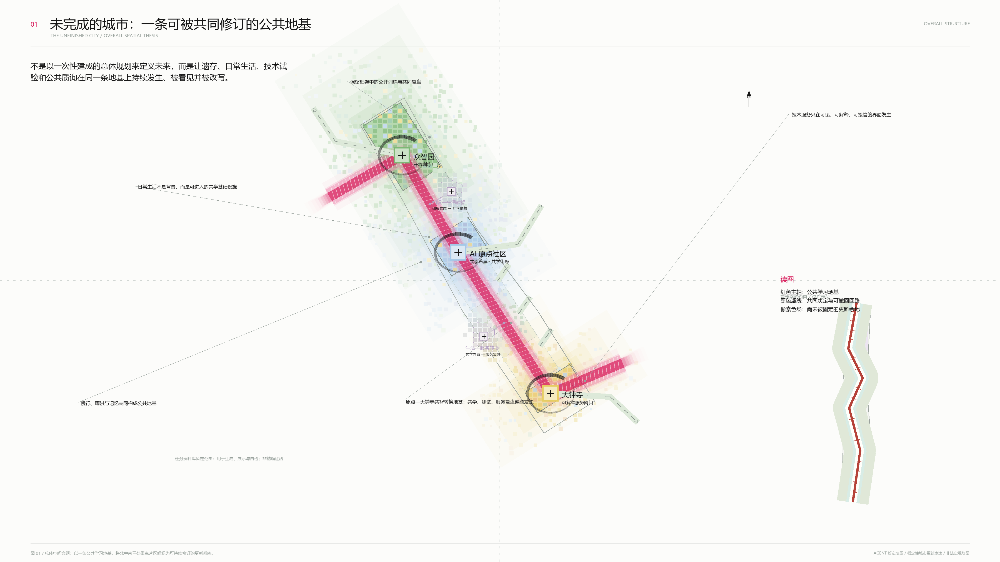
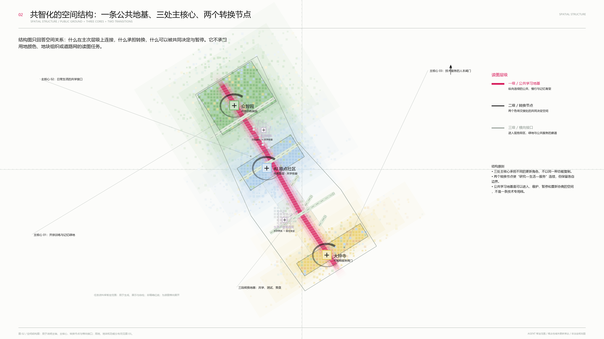
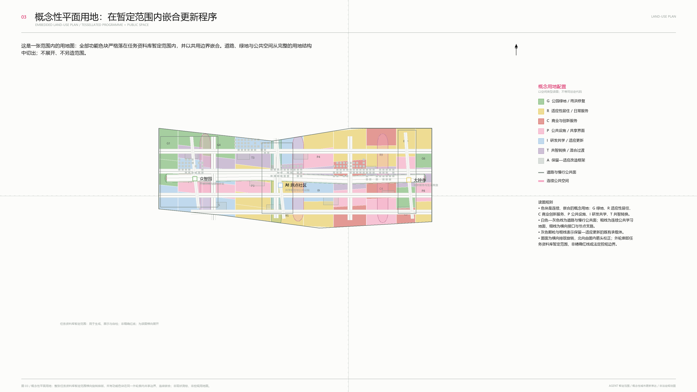
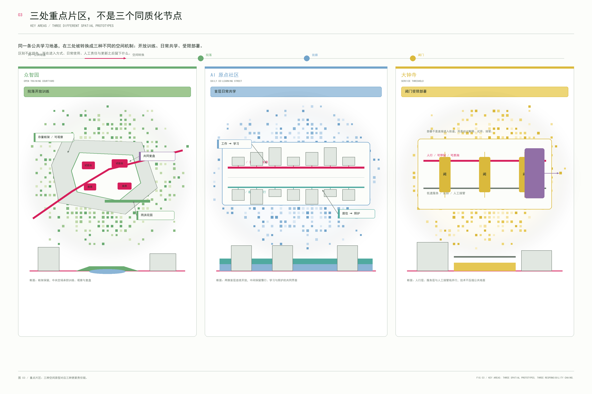
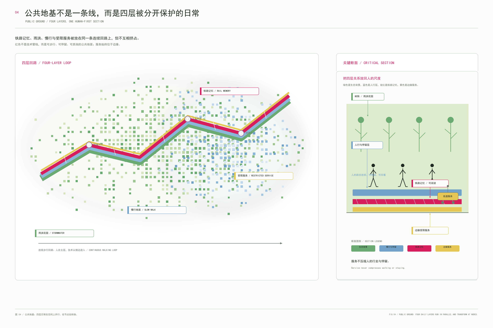
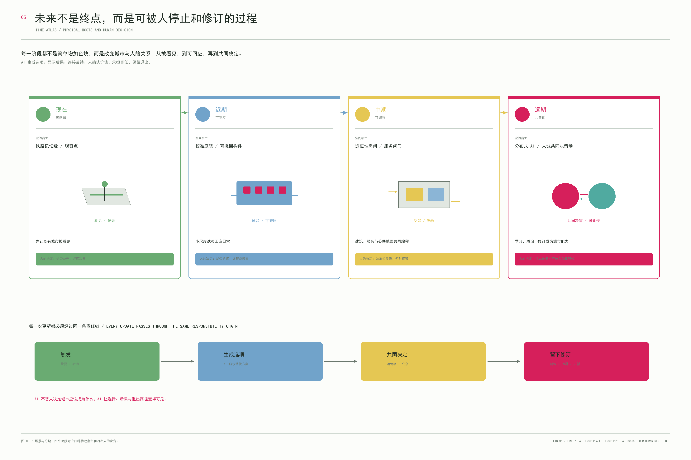

# 未完成的城市：百年京张城市共智化实验带

> **这是一座未完成的城市。**
>
> 它并不因尚未被全部重建而“不够未来”；恰恰相反，它把未来留给下一次证据、下一次协商和下一位使用者。百年京张在这里不是一条被包装成景观的旧线，而是一种城市更新的工作方式：遗存可以被保留，日常可以被打断后重新缝合，技术可以被试用、被解释、被拒绝，也可以被暂停。
>
> 本方案提出的不是一个替代现实的终局图像，而是“城市共智化”的空间原型——让城市从一次性扩张的**城市化**，经由尊重既有生活的**存量更新**，走向能够持续学习、质疑与改写自身的**共智化**。图纸中的每一条线都应回到一个真实问题：它落在什么空间、被谁使用、由谁维护、出现争议时如何退回。[source:AGENT-TASKBOOK] [depth:overall_spatial_structure]

## 设计依据与资料清单

本方案以公开任务书、公开来源登记与临时约束范围为依据，所有空间落地均为概念建议，供专业团队在取得精确边界、权属、控规与工程资料后深化。本方案不把临时边界表述为法定红线，也不提供工程或审批结论。[source:OFFICIAL-ANNOUNCEMENT] [source:AGENT-TASKBOOK] [depth:existing_conditions_diagnosis]

资料使用遵循“可追溯、可复核、不过度推断”三条底线：任务书用于识别应答对象与公共利益导向；来源登记用于辨别可引用、可展示与只能作为方法参照的材料；临时边界只承担概念推演、内部面积校核和图示定位，不承担行政认定。现状诊断聚焦既有铁路记忆、产业服务、社区日常、开放空间与未来技术之间的接口关系，而不虚构未公开的建筑状况、客流数据、产权条件或基础设施能力。图纸中的色块、节点、体量、线路均是可讨论的空间语言；在后续获得官方边界和专业基础资料后，应以同一套规则复算、删改或替换。[source:SOURCE-REGISTRY] [source:SITE-PACKAGE]

## 三层范围工作框架

统筹研究范围关注产业生态和未来城市范式；总体设计范围组织更新、公共空间和服务系统；三个重点区把抽象命题落到具体空间原型。提交边界为临时约束范围，面积与控制性结论均须在官方几何发布后再计算。[data:geometry/site_boundary.geojson#SITE-001] [data:geometry/key_areas.geojson#PROV-KEY-001] [depth:three_level_scope_framework]

三层范围不是三个互不相干的“圈”，而是尺度递进的工作法。第一层回答北京及中关村创新生态如何把研发能力转化为可被公众理解和检验的城市能力；第二层回答片区如何以慢行、公共界面、既有建筑再利用和开放空间，把这些能力编织进城市更新；第三层回答三个重点区分别用何种原型服务不同的人群、时间节律和治理问题。因而研究范围可以讨论趋势与网络，总体范围可以提出结构与接口，重点区才进入场地、首层、庭院、建筑适应与运营门槛。任何跨层推断都必须保留来源、假设和人工复核路径。

## 统筹研究范围产业与未来城市研究

方案提出从“城市化—存量更新—城市共智化”的转变：不再把未来理解为一次性完成的新城，而是设计城市持续学习的条件。京张遗址、公园、既有街道、社区和产业空间成为同一套公共学习基础设施；AI 的角色是增强感知、比较与协作，不替代人类判断。[source:AGENT-TASKBOOK] [standard:PROJECT-AGENT-OPEN-CALL-TASKBOOK] [depth:overall_spatial_structure]

六个生态案例被用作方法参照，而非复制对象：MIT Media Lab 的跨学科原型、Singapore one-north 的产学界面、Barcelona 22@ 的更新机制、Helsinki Kalasatama 的居民测试、Seoul Digital Media City 的内容产业接口，以及 Toronto Waterfront 的数据治理争议。由此形成“能力产生—真实试验—公共复盘—城市转化”的协同回路；具体机构、投资和政策均不作未经证实的承诺。[source:CASE-METHODS] [source:SOURCE-REGISTRY]

## 总体设计范围城市更新与控规深度城市设计

总体结构不是一条展示轴，而是一条连续学习回路：纵向连接三个重点区，横向进入科技服务与小月河真实生活界面，垂直上把公共首层、生产空间、服务基础层和记忆数据层组织为可转换关系。它通过保留、改造、插入、连接和再评估五个动作推进更新，而不以推倒重建作为默认答案。[data:geometry/land_use.geojson#LU-01] [data:geometry/buildings.geojson#BLDG-01] [depth:land_use_layout]

图 02 是空间结构图：它只回答公共地基、三处主核心与两个转换节点的层级和关系，不承担用地色块或街区图的阅读任务。[data:geometry/roads.geojson#ROAD-01] [data:geometry/public_space.geojson#PUBLIC-01]

图 03 为独立的概念性平面用地—公共空间总平面：所有功能色块严格落在任务资料库暂定范围内，以共享边界连续嵌合；道路、绿地与公共空间从完整用地结构中切出。图面先读道路与公共空间，再读公园绿地、适应性居住、商业与创新服务、公共设施、研发共学及既有改造肌理；它不声称精确边界、现状测绘或法定用地代码。[data:geometry/land_use.geojson#LU-01] [data:geometry/green_space.geojson#GREEN-01] [data:geometry/public_space.geojson#PUBLIC-01]

## 重点区域详细设计

众智园被定义为“开放训练院”：让研发、验证、展示和人工复盘形成可被看见的城市接口；AI 原点社区是“日常共学街区”：以可适应建筑、共同训练场和低门槛服务支持居民、学生与创业者；大钟寺是“城市部署场”：将 AI 新业态置于既有街道、商务、消费和公共议题之间。三者都以概念性空间原型表达，具体建筑拆改、交通组织和工程条件待正式资料确认。[data:geometry/key_areas.geojson#PROV-KEY-002] [data:geometry/key_areas.geojson#PROV-KEY-003] [depth:three_key_area_detailed_design]

## AI 创新生态、人才画像与 AI+ 场景

生态不以企业名单组织，而以八类可进入的城市能力组织：空间、人才、知识、算力、数据、资金服务、测试场景和公共治理。中关村科技服务翼提供能力配置界面，小月河场景赋能翼作为真实生活的校准器。[source:AGENT-TASKBOOK] [depth:ai_ecosystem_and_scenarios]

**用户画像：** 研究者与开发者、社区居民、学生与初创团队、无障碍与照护使用者、城市服务人员、来访者与国际合作伙伴。

| 场景卡 | 空间载体 | AI 的有限作用 | 人工复核与退出 |
|---|---|---|---|
| S01 城市记忆共同标注 | 记忆缝 | 整理多源叙事与冲突 | 公众、研究者共同确认，保留多叙事 |
| S02 步行舒适度校准 | 慢行界面 | 提示遮阴、拥挤、无障碍问题 | 运营者决定调整，试验可撤回 |
| S03 低速机器人服务测试 | 校准场 | 低速配送与维护辅助 | 人优先、人工接管、禁行时段 |
| S04 适应房用途再编排 | 既有建筑接口 | 提供用途组合建议 | 权属人与专业团队决定 |
| S05 社区健康导航 | 公共服务节点 | 导航至公开服务资源 | 高风险建议人工确认 |
| S06 共同学习匹配 | 共学街区 | 匹配课程、导师与设备 | 社区决定规则，支持匿名 |
| S07 AI 产品公共试用 | 部署场首层 | 真实环境测试 | 用户可拒绝，局限公开 |
| S08 公共议题复盘 | 城市镜面 | 汇总反馈并比较方案 | 人类讨论后决定下一步 |
| S09 环境微调 | 小月河界面 | 提示微气候和维护议题 | 运营团队执行并设回退值 |
| S10 夜间学习节律 | 公共节点 | 协助活动与服务调度 | 活动负责人负责，不自动扩张 |

三类产业测试验证场景分别检验机器人与街道、AI 产品与既有建筑、城市治理与公共空间的关系；每一类均将测试限制在可观察、可暂停、可回退的条件中。[standard:GENERATIVE-AI-INTERIM-MEASURES] [depth:ai_ecosystem_and_scenarios]

## 用地、建筑规模与拆改留方案

用地不是法定控制分区，而是为城市学习回路建立的概念性功能分层：城市部署与公共转化、共同学习与适应更新、记忆公共地基、开放训练与创新验证。建筑图层以“保留适应、改造、插入”三种策略表达空间潜力；建筑高度、容积率、基底密度和权属处于待正式数据补齐状态。[data:geometry/land_use.geojson#LU-02] [data:geometry/buildings.geojson#BLDG-04] [depth:retain_renovate_demolish]

这里的“用地”服务于更新决策而非替代控规：部署区优先组织可被看见、可被拒绝和可被复盘的公共产品入口；共学区把可转换的工作、学习、照护和小型服务置于步行可达关系；记忆公共地基为铁路遗存叙事、雨洪调节、停留与安静观察留出连续空间；开放训练区则承接阶段性的研发展示、试验准备与公共说明。保留适应意味着先识别可继续使用的结构、首层和院落；改造意味着在专业安全评估后调整服务能力；插入只适用于能够明确降低冲突、补齐公共性且可撤回的轻量组件。图示没有作出拆除承诺。

## 交通、轨道、市政与公共服务设施

交通策略以公共学习回路为人优先的慢行骨架，服务阈值处理站点、街道、建筑入口和低速机器人之间的转换。轨道线位、道路红线、市政容量和消防条件未获公开附件支撑，因此本方案只提出需要专业复核的空间接口，而不作工程结论。[data:geometry/roads.geojson#ROAD-01] [source:SITE-PACKAGE] [depth:traffic_rail_slow_parking]

公共学习回路首先是一条可步行、可停留、可识别、可绕行的连续体验，而不是单一的“智慧道路”。它将三处重点区的首层、口袋庭院、河岸与服务节点以多条可替代路径联系；自行车、无障碍出行、日常物流和低速设备只在明确的时段、速度、交接点与人工接管机制下共享空间。服务阈值被布置在建筑入口或场地边缘，用于完成问询、取件、登记、设备停靠和人工协助，避免把自动化推入儿童活动、安静休憩或高密度步行冲突区域。停车、市政、消防、轨道换乘和道路断面仅列为后续多专业协同校核事项。

立体表达补足平面无法说明的关系：底层是记忆缝、校准场和慢行公共地基；中层是可转换的适应房与既有建筑首层；交接层容纳低速服务、维护和人工接管；上层是可被复核的城市镜面与共同决策接口。它表达的是“不同时间层可以同时存在”的空间原型，不是建筑高度控制或工程剖面结论。[depth:building_height_massing] [data:geometry/buildings.geojson#BLDG-05]

## 蓝绿空间、公共空间与城市风貌

蓝绿系统不是景观背景，而是“记忆—试验—协商”的公共地基：记忆缝连接遗址与日常步行，校准场承载小尺度公共测试，城市镜面把维护、反馈和判断公开化。三处 AI 朝圣地标被定义为可持续发生事件的公共设施：**时间站台**（历史与未来叙事）、**共智穹厅**（公共议题复盘）、**开放协议塔**（贡献、荣誉与开源知识展示），均为概念建议，不是已批准建筑。[data:geometry/green_space.geojson#GREEN-01] [data:geometry/public_space.geojson#PUBLIC-01] [depth:blue_green_public_space]

## 更新项目清单、实施政策与分期计划

近期先建立记忆缝、城市学习入口、少量校准场和人工服务接口；中期推进适应房、开放训练院、日常共学街区、城市部署场和服务阈值；远期形成跨区运营、年度城市学习节律和可回退的更新协议。每项建议均依赖权属、资金、专业审批和运营主体确认，不能被理解为既定实施安排。[data:geometry/phasing.geojson#PHASE-01] [depth:renewal_project_list] [depth:phasing_implementation]

年度运营构想包括“未完成城市周”、开发者共作季、公众场景开放日与跨城复盘会。其转化路径是：公开问题—低风险试验—人工复盘—可复制方法—国际传播；不是招商或政策承诺。[source:AGENT-TASKBOOK] [standard:PROJECT-OFFICIAL-ANNOUNCEMENT]

## 指标体系、面积复算与合规矩阵

当前可复算的指标来自提交几何：临时设计范围面积约 11.41 平方公里、三处重点区、10 个场景节点与四类城市设施。按同一暂定几何在 EPSG:4548 下复算，概念绿地率为 **12.0714%**、概念公共空间率为 **14.2495%**；它们只用于内部一致性校核，正式边界发布后必须重算，法定强度指标保持待确认。[metric:site_area_sqm] [metric:green_ratio] [metric:public_space_ratio]

指标体系把“数值”降回到它应有的位置：它不是为方案制造确定性，而是帮助审核者追踪设计关系。范围面积来自临时多边形的投影面积；绿地率与公共空间率来自概念图层在同一边界内的面积比；重点区、场景卡、测试场与城市设施为明确计数。它们在 metrics.json 中记录公式、来源文件、置信度与假设，能随边界、保留建筑、道路和水系资料更新而再次生成。容积率、建筑规模、停车配比、投资额、碳排与客流等缺少必要输入的指标一律标注为未知，不以估算值包装为控制结论。合规矩阵、标准矩阵和设计深度矩阵对应列出证据位置与待确认项。

## 故事如何变成空间：从“第二条铁路”到四种界面

本方案的核心不是再发明一个更响亮的 AI 名词，而是回答一个具体问题：如果城市共智化不是屏幕上的服务，而是一种新的城市化阶段，那么它必须改变什么空间关系？我的判断是，首先要改变铁路记忆与日常生活的关系，其次要改变既有建筑首层与公共议题的关系，最后要改变技术部署与人的决定权之间的关系。[depth:overall_spatial_structure] [depth:building_height_massing]

因此“第二条铁路”不是第二条物理轨道，也不是一条虚拟数据线。它是一条由记忆构件、连续慢行、雨洪花园、公共测试台、服务交接点和人工复盘室共同组成的更新基础设施。它沿着遗址记忆建立连续性，却在三处重点区产生不同的空间动作：众智园把线变成开放训练的院落；AI 原点社区把线变成日常共学的首层和共享层；大钟寺把线变成技术进入街道前的部署门槛。图 01 证明整体结构和三层范围，图 03 证明三室的差异，图 08–10 进一步把每一室拆成局部平面、关键剖面与场景链。[data:geometry/roads.geojson#ROAD-01] [data:geometry/public_space.geojson#PUBLIC-01]

四种界面构成方案的空间语法。**记忆缝**把铁路遗存从被观看对象转成可穿行的公共地基：旧构件、树荫、雨水和停留并置，历史不是一块牌子，而是每天都会被经过的空间。**校准场**把 AI 的第一次进入限制在可观察的低风险范围内：一个院落、一组可移动家具、一段开放时段和一面复盘墙，任何试验都必须有退出条件。**阈值接口**位于建筑首层和街道交界处，明确把行人、低速服务、装卸和人工接管分层组织。**城市镜面**则是一个真实的房间、窗口或街角设施，展示建议、证据、异议和最终人工决定，让“人机共同决策”在空间上有可见的落点。[data:geometry/buildings.geojson#BLDG-05] [depth:traffic_rail_slow_parking]

## 三处重点区的详细设计逻辑

### 众智园：把研发成果交给公众判断

众智园的空间核心是一座“测试庭院”，而不是一个封闭的展示馆。既有建筑继续承担研发、制作和培训，首层通过可开启界面接入院落；庭院中设置小尺度试验台、观察座席、雨水花园和可撤回设施。研发团队在这里公开说明问题、限制和风险，公众可以旁观、试用、提出异议，人工运营者负责决定是否进入下一阶段。图 08 的平面以中央院落、两侧可适应建筑和左侧记忆缝表达这个关系；右上剖面说明旧构件、雨水、慢行和停留如何叠合；右下场景链说明“触发—空间—判断—结果”的闭环。[depth:three_key_area_detailed_design] [data:geometry/key_areas.geojson#PROV-KEY-001]

### AI 原点社区：把日常生活作为最重要的测试场

AI 原点社区不追求“未来社区”的统一外观，而是在既有街区中打开连续首层、共享学习层和照护接口。适应房允许办公、学习、照护和小型工作在不同时间组合，但不把这种弹性写成自动换房或自动调度的承诺；它必须经过权属、消防、无障碍和社区协商。昼夜学习街通过遮荫、照明、低噪停留、连续可达和服务节点，把学习从单一机构空间延伸到日常公共生活。图 09 将这些动作画成两个平行的共学界面、可变房间、城市镜面和生态连接，强调更新从首层和生活连续性开始，而不是从拆除开始。[standard:BARRIER-FREE-ENVIRONMENT-LAW] [depth:three_key_area_detailed_design]

### 大钟寺：把技术部署变成有门槛的公共事件

大钟寺的重点不是放置更多智能设备，而是把设备进入街道的条件公开化。部署街沿建筑首层布置产品试用、服务问询和公共反馈，低速服务带与人行带保持清晰关系，在交接点设置人工接管。城市镜面不对居民进行评分，也不自动替人做决定，而是让使用者看到建议来自什么资料、谁可以修改、何时暂停和如何申诉。图 10 的平面采用平行服务带、横向部署街、纵向人工接管线和中心城市镜面表达这一门槛关系；剖面同时保留建筑、公共地基和低速服务三个层次。[depth:traffic_rail_slow_parking] [depth:three_key_area_detailed_design]

## 场景不是功能清单，而是空间变化的证据

十张场景卡被分成三类测试：机器人与街道、AI 产品与既有建筑、城市治理与公共空间。每张卡都必须落在一个空间接口上，并写清触发者、AI 的有限作用、人工决定、退出条件和维护责任。例如“低速机器人服务测试”不意味着全域无人配送，而只在服务阈值内、限定时段和低速条件下运行，遇到儿童密集、无障碍冲突、故障或争议时回到现场工作人员；“适应房用途再编排”不意味着算法自动改造建筑，而是把组合建议交给权属人、专业团队和社区共同判断；“公共议题复盘”不等于自动舆情决策，而是把反馈转成可被审议的空间试验。[depth:ai_ecosystem_and_scenarios] [standard:GENERATIVE-AI-INTERIM-MEASURES]

## 从近期试点到长期城市共智化

近期最重要的成果不是建造一座未来地标，而是完成一小段可被体验、可被关闭、可被复盘的第二条铁路：修复一段可达的记忆缝，设置一座测试庭院，打开一个社区首层，建立一个服务阈值和一面城市镜面。只有当这些小试验被真实使用、出现分歧并完成复盘，才有资格进入中期的建筑适应和街道重分配。远期的“共智化”因此不是把全城交给 AI，而是形成一种新的规划工作方式：城市保留历史记忆，允许试验失败，允许人拒绝，允许公共规则被修订。[depth:phasing_implementation] [data:geometry/phasing.geojson#PHASE-01]

## 十二项更新项目：让总体概念具有建设抓手

总体图不能只停留在“一带、三室、两翼”的结构名词，因此将更新拆解为十二项可被专业团队继续深化的项目。它们不对应未经核实的具体地块，也不构成投资承诺，而是用来说明一个概念如何变成空间、运营和分期：

| 项目 | 空间动作 | 第一阶段的具体工作 | 运营者与复盘问题 |
|---|---|---|---|
| P01 连续记忆廊道 | 把铁路记忆、慢行、树荫、雨水和停留缝成一条公共地基 | 识别断点，先做连续可达与遮荫 | 公共空间维护者；哪一段最容易被绕开？ |
| P02 时间站台 | 把站台尺度和铁路构件转成可停留、可讲述、可观察的节点 | 设置座椅、展签、雨棚和可撤回展台 | 文化运营者；哪些叙事可以并存？ |
| P03 测试庭院 | 以院落承载原型、演示、试用和公共复盘 | 开放一个既有院落，划出测试台与观察区 | 研发团队+社区；试验何时暂停？ |
| P04 原点共学楼 | 在既有楼宇中叠加共享学习、培训、照护和小微工作 | 释放首层与共享层，补齐无障碍和服务入口 | 社区运营者；谁能进入、谁被排除？ |
| P05 适应房 | 用可变隔断、共享设备和时段规则应对生活变化 | 先做一套房间原型，不承诺自动换房 | 权属人+专业团队；改变是否可逆？ |
| P06 昼夜学习街 | 让学习、休息、照护和低噪活动沿街发生 | 试行照明、遮荫、夜间时段和安静节点 | 街区运营者；夜间活动是否影响居民？ |
| P07 服务阈值 | 将人行、低速服务、装卸、充电和人工接管分带 | 先划定低速试验段和人工交接点 | 服务运营者；异常时谁能接管？ |
| P08 城市镜面 | 把建议、证据、异议和决定放入可见的公共接口 | 设一面反馈墙、议事窗或公开工作台 | 议事运营者；谁有权修改结果？ |
| P09 开放协议塔 | 把成果、规则、贡献和荣誉变成开放展示与学习系统 | 释放既有建筑中的展示层 | 开发者社区；协议如何被质疑？ |
| P10 小月河反馈花园 | 用雨洪、微气候、遮荫和休憩作为环境反馈装置 | 先做一段可观察的生态微更新 | 生态维护者；环境变化如何被解释？ |
| P11 低速服务环 | 将低速设备限定在安全、可绕行、可暂停的公共服务回路 | 从短距离人工陪同测试开始 | 服务运营者；设备是否挤占公共性？ |
| P12 城市共智节 | 让年度活动成为试验公开、公众评议和跨城传播机制 | 形成开放日、复盘会和开发者共作季 | 联合运营者；活动如何不变成一次性宣传？ |

这些项目之间不是并列清单，而是一个从空间到规则的递进关系：P01–P02 让记忆重新可抵达，P03–P06 让 AI 进入学习与生活，P07–P08 让技术在进入街道前接受公共判断，P09–P12 再把经过验证的经验转成开放协议、生态维护与长期运营。[depth:renewal_project_list] [depth:phasing_implementation]

## 一个普通人的一天：共智化必须首先服务日常

方案用一个非庆典日场景检验未来是否真正落地。早晨，居民沿记忆缝步行，环境提示只告诉她前方的遮荫、施工和无障碍绕行信息；这些提示不记录她的身份，也不会把路径偏好自动变成评价。上午，学生在共学楼的共享房间使用设备，研究者在测试庭院准备一个公开试验；两者之间通过城市镜面看到的是问题、限制和预约时段，而不是一块只显示“智能”的屏幕。中午，低速服务设备在服务阈值内完成一次交接，遇到行人密度过高时由现场人员暂停。傍晚，社区居民在昼夜学习街参加低噪活动，提出一项关于座椅、照明和儿童安全的意见；AI 可以帮助整理意见，但下一步是否调整空间，由社区、运营者和专业团队共同决定。夜间，城市镜面记录这次决定、证据和待复盘时间，形成下一次更新的起点。[depth:ai_ecosystem_and_scenarios]

这个场景刻意没有把未来写成炫目的无人系统，因为真正决定城市是否共智的不是设备数量，而是一个普通人能否在没有专业背景的情况下进入、理解、贡献、拒绝和退出。由此，AI 的空间价值表现为五个连续动作：发现问题、提出建议、公开说明、人工决定、留下可复核记录。

## 四个尺度同时控制：城市、街区、建筑、界面

在城市尺度，第二条铁路把三个重点区和两翼组织成一个连续公共骨架；在街区尺度，记忆缝不只是一条线，而是由穿越、停留、雨洪和服务节点组成的连续带；在建筑尺度，更新优先发生在首层、共享层、院落和服务口，而不是先改变建筑外形；在界面尺度，必须能画出人如何进入、设备在哪里停、工作人员在哪里接管、反馈在哪里公开。四个尺度缺一不可：只有城市结构没有界面，方案会重新变成口号；只有界面没有总体结构，方案会变成孤立的样板空间。[depth:overall_spatial_structure] [depth:building_height_massing]

高度与体量因此采用“关系控制”而不是虚构数值：既有建筑保持可识别的街道连续性，新插入物控制在能够被拆除、维护和替换的范围内，公共首层优先保证可达、可视和可停留，服务设备不以体量压迫公共空间。具体高度、容积、建筑退界、消防和结构条件需在正式基础资料补齐后由专业团队复核，不在本方案中假装已经确定。

## 人工复核不是附加条款，而是空间设施

城市镜面、测试庭院和服务阈值共同构成“人工复核的物理网络”。城市镜面负责公开问题和决定；测试庭院负责把建议变成小范围、可观察的试验；服务阈值负责在日常运行中处理交接、异常和退出。三者之间由一个明确的闭环连接：**提出问题 → AI 整理或模拟 → 专业与公众审议 → 小范围实施 → 观察与申诉 → 扩展、修改或撤回**。这个闭环强调 AI 的责任边界：AI 可以协助比较和解释，但不能代替权属判断、公共授权、工程安全或最终治理决定。[standard:GENERATIVE-AI-INTERIM-MEASURES] [depth:risk_missing_data]

## 城市共智化：一种面向存量城市的规划方法

“城市化”解决的是人口、产业和基础设施如何聚集；进入存量更新阶段之后，城市面对的已不再主要是扩张问题，而是既有空间如何被重新使用、如何不挤出原有生活、如何把不同主体带回同一张决策桌的问题。AI 的价值不应被理解为替城市做决定，而应被理解为帮助城市看见问题、比较选择、组织协商和留下可回看记录。由此提出“城市共智化”：**把城市更新从一次性的方案交付，变成长期可学习、可质疑、可修订、可退出的公共过程。**

共智化首先是一项空间设计，因为每一个环节都需要物理宿主。问题在记忆缝、街角、建筑首层和城市镜面被提出；建议在校准场和测试庭院被试用；争议在可进入的复盘室、开放协议塔和街道解释窗被讨论；服务在清晰的服务阈值和人工接管点被暂停。若这些位置没有被画出来，“数据流”“反馈”“共同决策”就仍然只是概念词，而不是城市形态。[depth:overall_spatial_structure] [depth:ai_ecosystem_and_scenarios]

本案不把共智化描述成一个已被证明的行政制度，也不将其作为对未来技术能力的承诺。它提出的是可供专业团队、管理者、产权人和使用者进一步讨论的空间—运营原型：近期先做低风险、可关闭的公共试点；中期再以有条件的建筑适应和街区协作扩大；远期才可能形成跨区共享规则。任何阶段都以“保留原有生活连续性”优先于“展示技术先进性”。

## 从总体骨架到真实空间：三段城市场、六类横向缝合与四层公共界面

总体空间不是一条抽象的中轴线。图 01 将临时总体设计范围拆成北、中、南三个可阅读的城市场：北段众智园承担能力的**产生与公开验证**；中段 AI 原点社区承担能力的**日常化与低门槛使用**；南段大钟寺承担能力的**部署、解释和人工接管**。这三个段落不是产业功能的简单分区，而是同一条更新骨架在不同既有城市条件下的不同后果。

横向缝合不是新增一串广场，而是让铁路两侧已有的首层、街巷、院落、雨水路径和公共服务重新相遇。设计将其归纳为六类动作：到达缝合，把绕行、断头和不可识别的进入口转化为连续、无障碍、可停留的步行入口；雨洪缝合，把树荫、下凹绿地、雨水收集和透水停留带接回公共地基；首层缝合，优先打开既有建筑的可协商首层；庭院缝合，以小尺度院落连接研究、制作、观察、讨论与安静休憩；服务缝合，把后勤、低速服务、充换、维护和咨询从人行主空间中分离；决策缝合，让解释、投诉、申诉、修改和阶段结论在现场可见。

四层公共界面把这些动作转为可画、可建、可运营的空间语法。第一层是**既有记忆层**：保留铁路遗存、树荫、可再利用结构和已有生活网络。第二层是**开放地基层**：连续步行、雨洪、无障碍和停留优先。第三层是**适应性建筑层**：首层、共享层、庭院和室内通过专业评估后才允许用途调整。第四层是**可回退服务层**：测试台、解释窗、服务阈值和人工接管点以可关闭、可替换、可复盘为前提。图 02 和图 04 分别从平面动作和公共剖面证明这一关系。[depth:retain_renovate_demolish] [depth:traffic_rail_slow_parking]

## 三处重点区的空间剧本：从形式差异到日常行为差异

### 众智园：公开测试不是展示，而是把“能不能进入城市”变成可讨论的问题

众智园的院落不是为技术制造舞台，而是把研发成果在真正进入街区之前放入一个有边界的、可旁观的公共环境。空间顺序为：保留框架提供制作、培训与展示的背景；测试庭院放置可撤回的设备和家具；雨水花园与看台提供不同停留距离；开放复盘墙说明目的、限制、观察结果和下一次决策。研究团队必须在限定时段内说明试点内容、服务对象、数据边界和停止条件。市民不需要提供身份、参与打分或接受追踪；其可见、可理解、可提出异议的权利才是公共性的基础。

### AI 原点社区：适应性不是自动换房，而是支持生活变化的空间余量

AI 原点社区的核心不在于统一的未来建筑形象，而在于不破坏居住、照护和小型工作连续性的前提下，释放可以共同使用的空间。共学街由连续首层、安静学习界面、共享房间、照护接口、遮棚和夜间可识别的慢行系统构成。适应房不是由算法自动分配或改变产权，而是一种可经产权人、社区和专业团队协商的室内原型：临时工作、学习、照护和小型制作可以在不同时间组合，消防、无障碍、安静边界和居住安全永远先于效率。

### 大钟寺：部署不是占领街道，而是经由阈值进入日常

大钟寺把面向市场的产品和服务转译为一个城市门槛。服务阈值将人行、低速服务、维护、充换与解释分开布置；城市镜面以房间、窗口或街角设施的方式公开服务目的、责任主体、投诉渠道、人工接管人和暂停状态；人工接管点与服务侧带相邻，使设备在出现冲突时可以退出公共步行面。这里最重要的图纸结论不是“可以出现多少设备”，而是“设备何时不能出现、谁能叫停、空间停止后如何仍然服务于人”。

## 十个场景的完整工作法：从触发到回退

场景卡不是招商清单，也不以“AI 可做什么”为标题；每一张卡都使用相同的八个问题来约束自身：**发生在何处、既有条件是什么、谁触发、AI 只做什么、谁拥有决定权、空间发生何种变化、数据和隐私边界是什么、失败后如何回退。** 下列说明进一步将十个场景嵌回图纸：

1. S01 记忆共同标注发生在时间站台和记忆缝。AI 只协助整理多源叙事与矛盾点；历史解释由公众、研究者和文化运营者共同确认，保留并列叙事而非生成单一“正确版本”。
2. S02 步行舒适度校准发生在雨水花园、慢行交叉点和树荫缺口。AI 只提示可能的拥挤、积水、遮阴和无障碍问题；具体调整由现场维护与专业判断决定，试验性设施可撤除。
3. S03 低速服务测试发生在服务阈值内。AI 仅提供低速、限定路径的协助服务；儿童活动、密集步行、紧急情况和争议出现时立即由人接管，设备离开主步行面。
4. S04 适应房再编排发生在可协商的既有室内。AI 仅生成可供讨论的使用组合，不决定产权、租赁、室内改造或人员分配；方案必须经过安全、无障碍和社区协商。
5. S05 社区健康导航发生在公共服务节点。AI 只导向已公开的服务资源，不形成健康画像、不进行诊断；涉及敏感信息时由人工专业服务接手。
6. S06 共同学习匹配发生在共学街与共享层。AI 可提示课程、导师和设备的公开信息；社区决定开放对象、时段、费用和安静边界，并保留不使用数字工具的进入方式。
7. S07 产品公共试用发生在部署场首层。AI 产品只能在明确目的、限定人群、说明责任和退出按钮的条件下测试；拒绝使用不会影响其他公共服务的可获得性。
8. S08 公共议题复盘发生在城市镜面和复盘室。AI 只汇总允许公开的问题和不同方案；公众讨论、专业意见和管理决定保持可区分，并留下可查询的决策理由。
9. S09 环境微调发生在小月河反馈花园。AI 可提示需要维护的植被、积水、热舒适或照明问题；环境数据尽可能匿名、聚合和最小化，维护团队有权不采用建议。
10. S10 夜间学习节律发生在昼夜学习街。AI 可协助协调公开活动时段，但不得把夜间活力自动扩张至居住安静时段；每次活动都需要明确负责人、结束时间、扰动投诉与复盘入口。

## 图纸与文字的对应关系：每一个概念都必须有可检查的位置

| 图纸 | 评审应当看到的空间事实 | 对应文字与项目 |
|---|---|---|
| 图 00 诊断 | 保留什么、为何连接、为何要有试点和回退 | 设计依据、城市共智化、P01—P03 |
| 图 01 总体空间场 | 三段城市场、记忆轨、公共地基、四类界面 | 第二条铁路、P01—P12 |
| 图 02 更新动作 | 保留适应、打开地基、轻量插入、公共复盘如何进入既有织物 | 更新项目清单、分期计划 |
| 图 03 三处重点区 | 三种不同城市能力及其平面、剖面、使用者和运营逻辑 | 重点区详细设计 |
| 图 04 公共地基 | 慢行、蓝绿、服务侧带与人工接管如何同处一条剖面 | 交通、蓝绿空间、P07、P10、P11 |
| 图 05 实施证据 | 普通人的一天、四阶段、12 项项目的物理宿主与回退 | 场景卡、实施政策、风险说明 |
| 图 06 体验层 | 上述关系在使用者尺度上的未来日常 | 概念体验图，非现状和非工程依据 |
| 图 07—09 重点区图集 | 每一重点区的局部平面、关键剖面、场景链与更新抓手 | 众智园、原点社区、大钟寺三节 |

该对照表也是后续迭代的检查清单：若一条新论述无法回指到某处空间、某一张图、某位使用者和一种退出方式，它就不应被包装为方案结论；若一张图只能呈现色块而不能回答“谁如何使用、谁如何负责”，则该图仍须继续深化。[depth:overall_spatial_structure] [depth:risk_missing_data]

## 资料更新后的重算与深化机制

当组织方补充精确边界、既有建筑测绘、道路红线、轨道条件、水系、市政容量、遗产保护、用地权属和法定控制后，方案不应仅仅替换一张底图，而应启动一次完整的再校核。总体图需要重新判断记忆缝的连续可达性和横向缝合位置；重点区需要根据真实建筑保留价值、首层条件与产权关系调整院落和服务阈值；交通图需要通过道路断面、消防、无障碍和市政条件检验服务分带；指标表需要在统一坐标系下重算面积、绿地、公共空间和建筑改造量；场景卡需要将运营责任人和数据边界由概念角色替换为真实协议。

这意味着方案的“未完成”不是缺陷，而是一种对城市更新现实的诚实表达：对尚未获得的数据，不以精致图像假装已经解决；对已经可以提出的空间关系，则用可验证、可讨论、可退出的原型先行。正式资料到位后，本方案的逻辑可以被校准，而不必被推翻。

## 品牌、区域协同与长期运营：把任务书要求变成可检查的空间接口

本方案的名称系统为 **“未完成的城市 / The Unfinished City”**，副标题为“百年京张城市共智化实验带 / Centennial Jing-Zhang Urban Co-intelligence Testbed”。视觉识别不把 AI 画成单一中心：可被共同修订的玫红轴代表公共学习地基，绿色、蓝色、黄色三处渐变场分别代表开放训练、日常共学与可解释服务，紫色代表知识—生活、生活—服务之间可被协商的转换节点。标志使用“未闭合的环 + 可继续生长的公共轴”这一可复用构成，应用于图纸编号、城市周、开放日、贡献展示和线上工作台；这是一套概念性品牌规范，不构成官方 Logo 或已获授权的城市品牌。[source:AGENT-TASKBOOK] [depth:overall_spatial_structure]

三大定位、五大功能、三区两翼与外部协同不以口号平铺，而以“能力从哪里来、在何处试验、怎样回到城市”的接口矩阵组织。北纬社区提供跨区域公共交流与青年社群接口；未来科学城提供科研—试验方法的互鉴接口；怀柔科学城提供大科学装置、科学传播与长期议题的对话接口；经开区提供产业验证、可解释服务和制造—运营反馈的对话接口；京津冀则作为年度复盘、案例互认与人才交流的协同尺度。上述均为开放合作的概念建议，不代表任何机构已承诺参与。

| 任务书要求 | 本方案的可检查回应 | 落点与复核方式 |
|---|---|---|
| 三大定位 | AI 高地、朝圣地与高品质城区被转译为开放训练、贡献展示和可达的日常公共地基 | 众智园测试庭院、时间站台、昼夜学习街；年度公众复盘 |
| 五大功能 | 研发、转化、展示、服务、生活不按单一园区分隔，而在三处重点区形成互补 | 三处重点区脚本、十张场景卡、服务阈值与城市镜面 |
| 三区两翼 | 三处重点区为主核心；科技服务翼和小月河场景赋能翼为横向校准接口 | 六类横向缝合、蓝绿反馈花园、能力配置台账 |
| 区域协同 | 外部城市与科创片区不被虚构为项目主体，而作为方法、人才和案例的交换网络 | 城市周、共作季、跨城复盘会；每年公开记录参与范围、数据边界与成果去向 |
| agent.1—agent.6 | 总体概念、生态、场景、公共空间地标、文化叙事、长期运营均有正文、图纸、场景卡与矩阵证据 | compliance_matrix.json、A3/A0、离线网页与年度运营台账 |

长期运营采用“城市学习年历”而非一次性节庆：春季共作季开放低风险原型；夏季场景开放日让公众检验服务阈值与无障碍条件；秋季未完成城市周公布建议、异议、暂停与回退结果；冬季跨城复盘会沉淀可复用协议。每一季都必须有明确责任人、公开的资源与数据边界、非数字参与方式、退出或交接条件，以及面向下一年是否继续、修改或撤回的决定；这些是可供运营团队深化的机制建议，而非资金或行政承诺。[source:AGENT-TASKBOOK] [depth:phasing_implementation]

## 风险、版权与合规说明

方案使用公开或清权资料、提交方原创文字、原创代码和数据驱动图示。所有 AI 场景遵循数据最小化、可解释、人工复核、可暂停和不歧视原则；不使用个人隐私、内部数据、未授权图片、商标或人物肖像。临时边界、控规条件、遗产控制、工程可行性、权属与投资均被标为待专业确认。[source:SOURCE-REGISTRY] [standard:BARRIER-FREE-ENVIRONMENT-LAW] [depth:risk_missing_data]

风险并不因“智能”而消失，反而需要被设计为可见的公共议题。对于数据风险，场景优先处理匿名、聚合或用户主动提供的信息，并设置退出、纠错与人工说明；对于空间风险，机器人、临时装置和活动通过限速、限时、限区、可关闭方式控制；对于治理风险，城市镜面展示的是被允许公开的议题、证据与不同意见，而非对人的评分；对于更新风险，保留既有生活与经营的连续性优先于单次形象改造。引用的全球案例只作为方法坐标，不暗示合作、授权、落地或结果保证。所有图文的版权和生成方式在包内明示，供审核和后续协作使用。

## 参考资料

- 北京市规划和自然资源委员会海淀分局公开公告。
- 百年京张 AI 创新带智能体任务书摘录。
- 仓库来源登记、空间资料包和专业标准快照。
- 六个全球案例的公开机构网页，仅作为方法比较，不作为本地事实或复制模板。[source:CASE-METHODS]

参考资料在本方案中承担的角色不同：公开公告界定征集的公共语境和对 AI 创新、城市更新的要求；任务书提供六项 Agent 应答任务、三处重点区及两翼等工作框架；来源登记与资料包界定可安全使用的材料范围，并提示哪些信息尚未公开；标准快照用于检查无障碍、数据治理和公共利益表达的底线。[source:OFFICIAL-ANNOUNCEMENT] [source:AGENT-TASKBOOK]

MIT Media Lab、one-north、Barcelona 22@、Kalasatama、首尔 DMC 与多伦多滨水的网页只被读取为“原型、产学接口、存量更新、居民测试、内容产业和数据治理”六类方法线索，绝不被当作本地现状证据、合作承诺或形态模板。每处关键叙事、指标和几何都在正文、metrics.json、assumptions.json 或 sources.json 中留下索引；一旦官方边界、红线、权属、遗产与工程材料更新，引用关系、面积计算、图纸和可视化都应同步再审。[source:SOURCE-REGISTRY] [source:SITE-PACKAGE]
