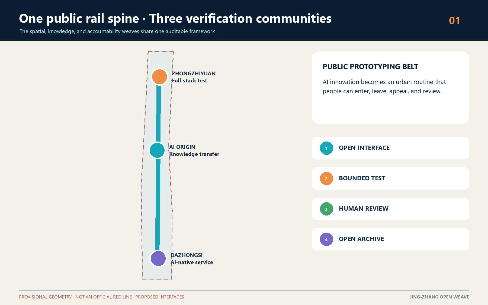
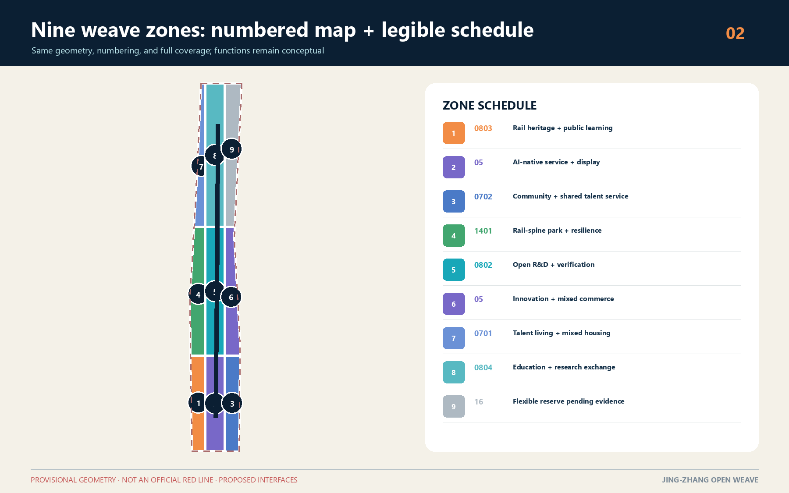
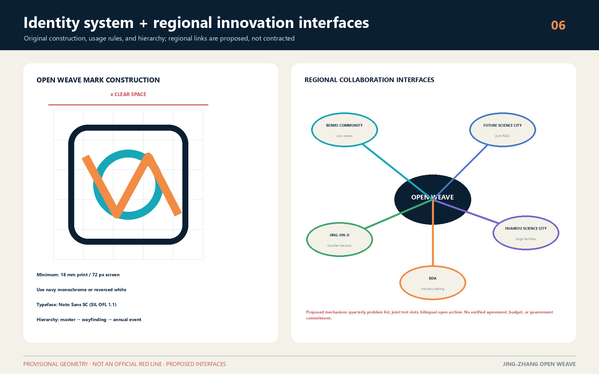
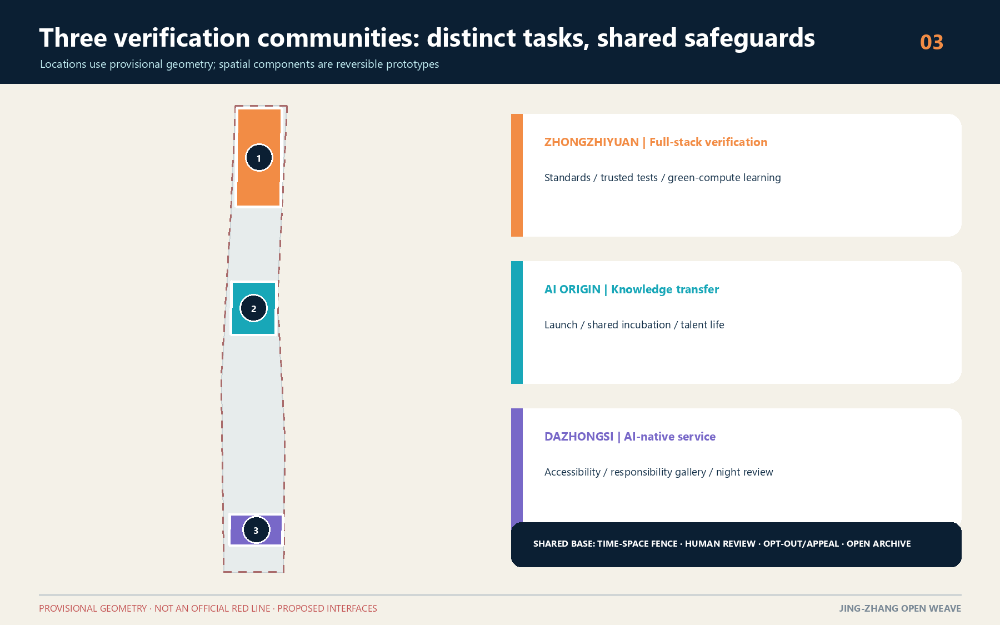
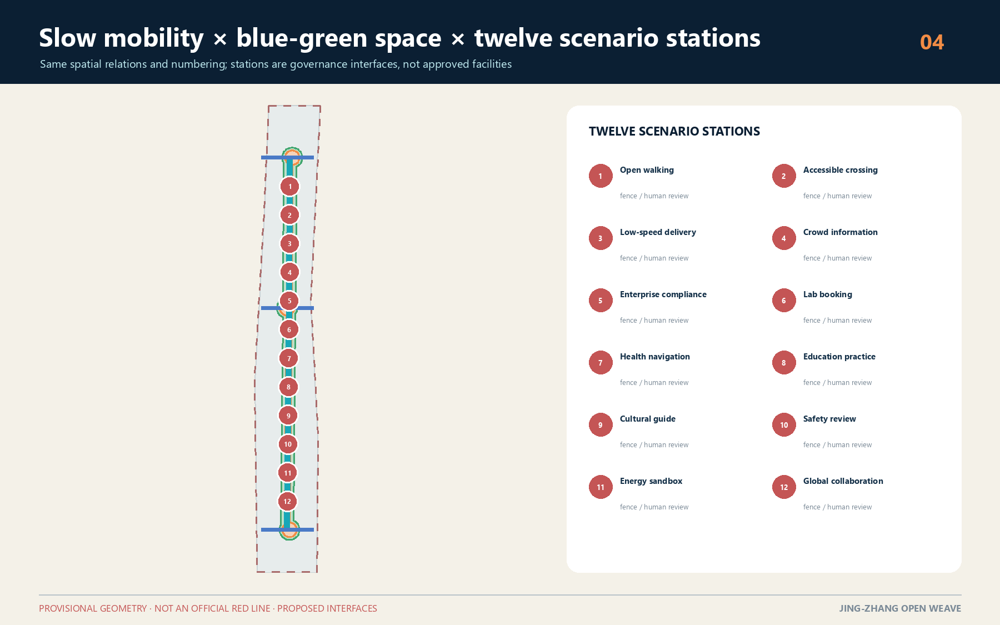
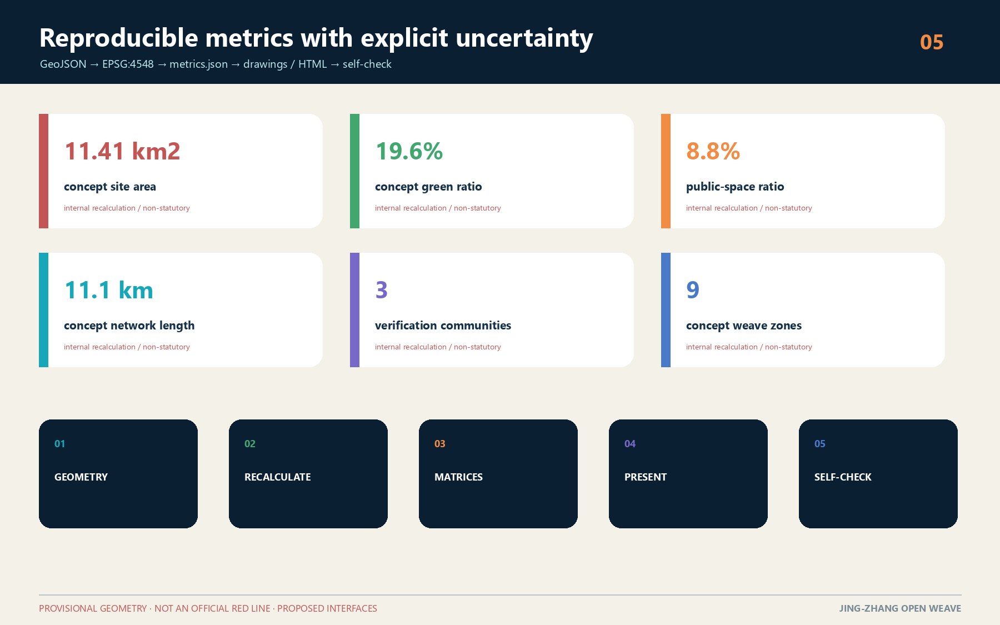

# Jing-Zhang Open Weave: A Verifiable Public Prototyping Belt for the AI City

Jing-Zhang Open Weave treats the centennial railway corridor as three connected systems: a spatial weave, a knowledge weave, and an accountability weave. The longitudinal thread is the Jing-Zhang Railway Heritage Park and its public-space sequence. The cross threads connect universities, innovation parks, neighbourhoods, rail stations, and blue-green spaces through walkable, cyclable, and shareable links. An AI service may enter public discussion only when its source, responsible party, operating boundary, human-review path, and exit condition can be understood.

> Scope warning: every spatial intervention in this proposal is a concept or reference scheme for later professional development. It is not an approved plan, engineering feasibility finding, investment commitment, property decision, or parcel-level retain-renovate-demolish determination. The overall boundary and three key areas use repository-provided provisional rough geometry. All areas and design conclusions must be recalculated when official survey and planning data are issued.

## 1 Design Basis and Source List

The proposal follows the open-call announcement for the three-level scope, objectives, and design tasks, while responding to the agent taskbook's principles, positioning, functions, and required answers. [source:OFFICIAL-ANNOUNCEMENT] [source:AGENT-TASKBOOK]

Evidence is organised in four tiers. Official notices and professional standards define the commission and the limits of professional claims. Rights-cleared task material defines AI-native scenarios, identity, and operations. The repository source registry records whether a source is formal, reference-only, or missing. Provisional geometry supports generation and internal checks only. [source:SOURCE-REGISTRY] [source:SITE-PACKAGE] [standard:PROJECT-OFFICIAL-ANNOUNCEMENT]

Case studies are used only to compare governance and operating mechanisms; they do not prove a red line, statutory control, or delivery promise for this site. Missing ownership, population, enterprise, utility, heritage, tree, and building-condition surveys remain explicit data gaps. The design therefore distinguishes verified inputs, internally recalculated concept metrics, and unknown statutory controls.

## 2 Three-Level Scope Framework

The Coordinated Research Area asks how Haidian's AI innovation chain and everyday urban life can evolve together. The Overall Design Area asks how industry, renewal, mobility, municipal systems, blue-green space, and character can share one spatial grammar. The Key-Area Detailed Design Area compares three verification communities in which these principles can be tested. These levels are not three separate drawings: the upper level defines open interfaces and safeguards, the middle level converts them into corridors and nodes, and the lower level makes their performance observable.

The spatial proposition is "one public rail spine, three verification communities, nine weave zones, and twelve scenario stations." The spine carries heritage interpretation, slow mobility, and public participation. The communities focus respectively on full-stack technology verification, knowledge transfer and talent life, and AI-native services and consumption. Nine concept zones fully cover the provisional overall boundary; twelve stations link each scenario to a place type, operator, schedule, review method, and stop rule. [depth:three_level_scope_framework] [data:geometry/land_use.geojson#LU-001] [metric:land_use_zone_count]

## 3 Coordinated Research Area: Industry and Future City Research

The industry strategy is a repeatable public-value cycle rather than a static company list: publish a problem, match capabilities, run a bounded test, invite public review, procure or transfer what works, and publish the learning. Five functions become shared infrastructure: a verification environment for full-stack innovation; cross-institution project brokerage for a world-class ecosystem; scenario permits and data stewardship for AI+ application; public experience routes for an intelligent and lively city; and bilingual archives, contributor records, and an annual open week for international discourse.

The Zhongguancun technology-service wing would connect intellectual property, standards, finance, and international partners. The Xiaoyue River scenario-enablement wing would connect daily-life needs and public-space feedback. MaRS, Knowledge Quarter London, Paris-Saclay, one-north, 22@ Barcelona, and Brainport Eindhoven are cited as mechanism references only: they illustrate how shared facilities, member networks, connectors, mixed urban programmes, industrial memory, and long-term partnerships may reinforce one another. [source:CASE-MARS] [source:CASE-KQ-LONDON] [source:CASE-BRAINPORT]

In this proposal, a future city is not seamless surveillance. Each public AI interface should disclose data categories, purpose, retention, human contact, and appeal. Each industrial test needs a time-space fence, a stop condition, and an after-action report. Each recommendation system must preserve a non-algorithmic route.

## 3A Identity System and Regional Innovation Interfaces

The original Open Weave master mark combines an open loop with a folded weave line. The loop represents a public interface that people may enter or leave; the folded line refers to both a railway switch and the letter W. It does not use an existing company, institutional, or government mark. The standard palette is navy, cyan, and orange; formal applications may use navy monochrome or reversed white. Clear space equals the frame stroke x. Minimum width is 18 mm in print and 72 px on screen. Chinese and bilingual text uses Noto Sans SC under the SIL Open Font License 1.1; the source, licence, and local font asset are registered in `sources.json` and the copyright statement.

The identity has three levels. The Open Weave master identity carries the belt-wide narrative and open archive. Railway-cultural wayfinding and the three verification-community identifiers inherit its grid and palette. The annual Open Weave Week sub-brand may change year and theme colour but may not replace the master. Trademark clearance, accessibility contrast, fabrication, and street-furniture applications remain tasks for professional development.

Regional collaboration is framed as a four-step proposed interface: publish a problem list, reserve joint participation slots, run bounded tests, and release a bilingual archive. Beiwei Community would bring civic needs and feedback; Future Science City would connect joint R&D; Huairou Science City would connect large scientific facilities and fundamental research; BDA would connect industry testing and supply chains; Jing-Jin-Ji would connect transfer and talent networks. Quarterly problem lists, short joint residencies, and an annual open week are proposals only. No signed agreement, funding, project, data-sharing arrangement, or government commitment is asserted. [source:AGENT-TASKBOOK] [source:SOURCE-REGISTRY]

## 4 Overall Design Area: Urban Renewal and Regulatory-Plan-Level Urban Design

The renewal method is "open with low disturbance." Nine concept zones cover the provisional boundary without gaps or overlaps and organise research, culture, education, living, community service, commerce, parks, and deliberate reserve space. They explain relationships and do not imitate an approved regulatory plan. Spatial actions are limited to four reference types: retain and open the ground floor; retain and repair links through passages or corners; renovate for shared laboratories or incubation; and discuss new prototypes only as capacity options.

Urban form follows three reference principles: a low and accessible interface along the rail spine, identifiable public nodes, and permeable blocks. Shared halls, visible making, public stairs, sheltered thresholds, and quieter residential edges support daily encounter without creating a spectacle district. Because approved floor-area ratio, height, density, green ratio, setbacks, and infrastructure capacity are unavailable, these controls remain unknown rather than being replaced by invented precision. [standard:MOHURD-CONTROL-DETAILED-PLANNING] [depth:development_intensity_controls] [metric:building_footprint_area_sqm]

Renewal value is ranked by improved public connection, shared capability, lower trial risk, retained historical readability, and reversibility. Parcel or building decisions require ownership, structural, fire, heritage, economic, and user research by qualified teams.

## 5 Detailed Design of Key Areas

The Zhongzhiyuan AI Independent Innovation Acceleration Area is proposed as a full-stack verification garden. Four components - a trusted technology test yard, standards co-creation hall, open hardware workshop, and green-computing learning garden - make technical work visible without turning public green space into an uncontrolled test site. Every activity registers its device, impact boundary, responsible operator, and stop condition. Its main spatial task is to repair cross-connections between the park, rail spine, and surrounding streets.

Beijing AI Origin Community is proposed as an open origin close to education and research. A launch living room, shared incubation floors, talent-life services, and a night learning route connect campus, innovation space, and neighbourhood. It is not a closed science park: selected halls, galleries, meeting rooms, and street corners become bookable civic interfaces. Residents and visitors retain an assisted offline route and may decline data collection.

Dazhongsi AI Industry Cluster is proposed as an AI-native urban interface around interchange, commerce, and content. An agent-service street, accessible experience station, responsible-content gallery, and night-safety co-governance point form four complementary anchors. Four-quadrant continuity states a pedestrian goal, not the feasibility of a bridge, tunnel, or underground project. All three locations derive from provisional key-area geometry. [data:geometry/key_areas.geojson#PROV-KEY-001] [depth:three_key_area_detailed_design] [metric:key_area_count]

## 6 AI Innovation Ecosystem, Personas, and AI+ Scenarios

Five service personas guide space and operations without representing personal records. Early-career researchers need affordable short experiments and cross-institution peers. Growth-stage teams need compliant testing, customer validation, and flexible space. Residents need understandable public services with opt-out and named responsibility. City operators need traceable tools with low false-positive rates and human takeover. International visitors and developers need bilingual wayfinding, open archives, and short-cycle collaboration.

Twelve scenario cards make an accountable urban routine: open-source walking guidance without location retention; accessible crossing assistance with human takeover; low-speed delivery within time-space fences; crowd information based on aggregation; a traceable enterprise compliance assistant; fair booking for shared laboratories; health-service navigation that does not diagnose; supervised education practice; sourced Jing-Zhang cultural interpretation; public-safety operational review that only assists judgement; authorised building-energy commissioning; and an international developer station with open outputs and licences.

Three contributor landmarks avoid monumental spectacle. The Origin Open-Source Rings record verifiable public contributions; the Centennial Code Marker aligns railway time with software versions; the Dazhongsi Responsibility Echo Hall archives failures, disputes, and corrections. Recognition follows public rules, peer review, and correction, and cannot be purchased. [depth:renewal_project_list] [source:AGENT-TASKBOOK]

## 7 Land Use, Building Scale, and Retain-Renovate-Demolish Strategy

The land-use layer is cut from a shared grid into nine seamless concept zones that fully cover the provisional boundary. Research and education occupy innovation interfaces; culture and commercial service increase the rail spine's legibility; community service and living support daily work-study-life patterns; parks provide a continuous public armature; and reserve areas deliberately state that insufficient evidence should delay a fixed answer. Codes use the national land-use classification subset only as a common vocabulary. [standard:MNR-LAND-USE-CLASSIFICATION-GUIDE] [data:geometry/land_use.geojson#LU-001]

Seven building groups demonstrate reference renewal actions: open ground floors, shared-lab conversion, community-service connection, innovation infill, incubation retrofit, commercial reprogramming, and reference talent living. They are not a property survey and not a demolition schedule. Formal work must add age, structural condition, ownership, leases, fire safety, energy, heritage value, and user evidence. Total floor area and floor-area ratio are not calculated because floor counts and approved controls are missing. The footprint metric is retained only as a reproducible check on the concept layer. [data:geometry/buildings.geojson#BLDG-001] [metric:building_footprint_area_sqm]

## 8 Transport, Rail, Municipal Infrastructure, and Public Services

The mobility concept is one north-south public innovation route, three east-west daily-life links, and multiple rail-interchange touchpoints. The main route connects the three communities and overlaps green space; cross links prioritise walking, cycling, and step-free continuity; interchange areas prioritise clear transfer, cycle parking, and all-weather pedestrian edges. The roads layer expresses relationships only. It does not define road red lines, junction design, bridges, tunnels, or underground works, and its centreline length is a data-quality metric rather than an engineering quantity. [data:geometry/roads.geojson#ROAD-001] [metric:road_centerline_length_m]

Municipal and digital infrastructure follows four layers: shared equipment interfaces, edge-compute kiosks, data stewardship and audit, and staffed operating positions. Power, cooling, noise, fire, cybersecurity, and privacy assessments precede any scale commitment. Every digital public-service point keeps an assisted, telephone, or offline alternative. This "one stop, two channels" rule prevents service exclusion and makes human takeover spatially visible. [depth:traffic_rail_slow_parking] [depth:municipal_new_infrastructure]

## 9 Blue-Green Network, Public Space, and Urban Character

The blue-green network uses the rail-spine landscape as a base, then adds three innovation gardens and east-west ecological links. Together they form a continuous system for walking, rest, learning, and low-risk public demonstration. Green-space and public-space layers are generated in the same projected coordinate system so their geometry can be checked together, but their overlap is not presented as statutory green land. Concept areas and ratios are internal recalculations with provisional-boundary caveats. [data:geometry/green_space.geojson#GREEN-001] [metric:green_ratio] [metric:public_space_ratio]

Urban character combines railway material memory, Zhongguancun's culture of open experimentation, and visible AI responsibility. Paving rhythm and robust components recall railway scale; ground floors show making, explanation, and public learning; status indicators and plain-language notices reveal when an AI service is active, what it does, and who is accountable. Unlicensed portraits, corporate marks, and historical images are excluded. Lighting remains low-energy and does not turn the corridor into a screen landscape.

## 10 Renewal Projects, Implementation Policy, and Phasing

Eight project families structure delivery: open-ground-floor micro-renewal, rail-spine walking repairs, three public living rooms, shared laboratory interfaces, talent-life services, accessibility and night safety, contributor recognition, and scenario-governance infrastructure. Priority follows public benefit, low data dependency, reversibility, and evaluability rather than construction value. Every project records a problem definition, spatial boundary, beneficiaries, data list, risk register, stop rule, named human owner, and open review.

Phase one develops the open-interface inventory, low-risk cultural guide, public notices, accessibility audit, and scenario-permit template. Phase two uses reversible spatial stitching and bounded trials in the three communities. Phase three considers architecture and engineering only after official boundaries, regulatory planning, municipal capacity, ownership, and professional assessment are available. The phasing layer is a concept sequence, not a government programme or investment promise. [data:geometry/phasing.geojson#PHASE-001] [metric:phase_count] [depth:phasing_implementation]

Long-term operation uses one annual open-source week, four seasonal themes, monthly public reviews, and regular developer stewardship. Spring publishes public problems, summer hosts bounded tests, autumn convenes an international open week, and winter archives successes and failures. All names, dates, budgets, and partners remain proposals.

## 11 Metrics, Area Recalculation, and Compliance Matrix

Metrics are separated into three classes. Announcement-scale approximations confirm the scope only. Internal consistency metrics are recalculated from provisional geometry. Statutory controls without official inputs stay unknown. Geometry is measured in EPSG:4548 and exchanged in EPSG:4326. Site area, building footprint, green and public-space areas and ratios, concept-line length, key-area count, zone count, and phase count can be reproduced from the submitted GeoJSON, but none converts the rough boundary into an official red line. [metric:site_area_sqm] [metric:green_space_area_sqm] [metric:road_centerline_length_m]

The compliance matrix covers announcement tasks and agent tasks. The standard matrix records mandatory professional references and any missing local text. The design-depth matrix links each required topic to narrative, drawing, geometry, metric, source, assumption, and self-check evidence. `MOHURD-ARCH-DESIGN-DEPTH-2016` remains a reference to be supplemented, so the submission does not claim to be an architectural construction document.

## 12 Risk, Copyright, and Compliance

The first risk is mistaking provisional geometry for an official boundary. Dashed treatment, lower contrast, text warnings, and manifest disclosures must remain visible. The second is privacy harm, algorithmic discrimination, or excessive automation. Mitigation uses data minimisation, aggregation, purpose limitation, human review, opt-out, and appeal. The third is treating concept building actions as property decisions; every action remains an archetype pending evidence. The fourth is public-space safety; each test needs a time-space fence, accessible alternative route, and immediate stop mechanism.

All writing, diagrams, GeoJSON, HTML, and PDF material in this package is generated by the AI agent from public or rights-cleared material and submitted under CC-BY-SA-4.0. External cases are represented by attributed mechanism summaries, not copied images, brands, or layouts. An empty constraints layer is intentional: absent official control-line data, the proposal does not invent road, heritage, utility, or ownership constraints. [data:geometry/constraints.geojson#CONSTRAINTS] [depth:risk_missing_data]

## 13 References

1. Official announcement for the Centennial Jing-Zhang AI Innovation Belt Open Call for Urban Design. [source:OFFICIAL-ANNOUNCEMENT]
2. Rights-cleared agent open-call taskbook excerpt. [source:AGENT-TASKBOOK]
3. Measures for Urban Design Management; regulatory-plan preparation rules; and national land-use classification guidance.
4. Repository source registry and provisional boundary package. [source:PROCESSED-FACT-PACK] [source:BOUNDARY-SOURCE]
5. Official institutional sources for MaRS, Knowledge Quarter London, Paris-Saclay, one-north, 22@ Barcelona, and Brainport Eindhoven, used for background mechanism research only.

