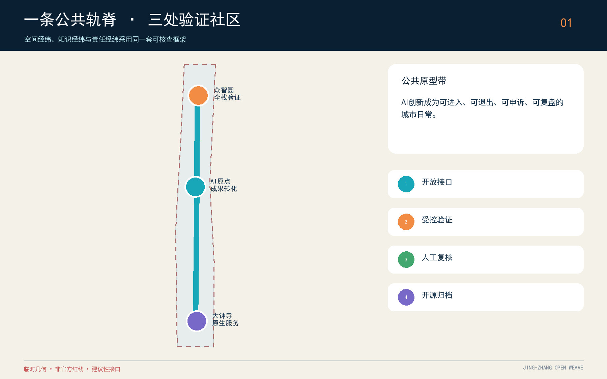
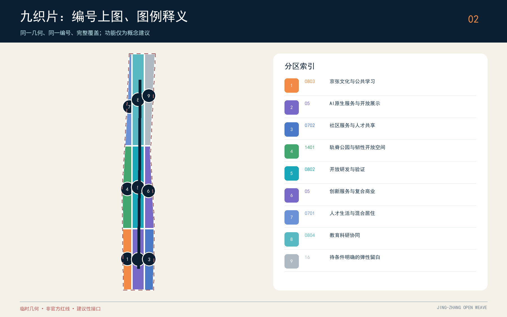
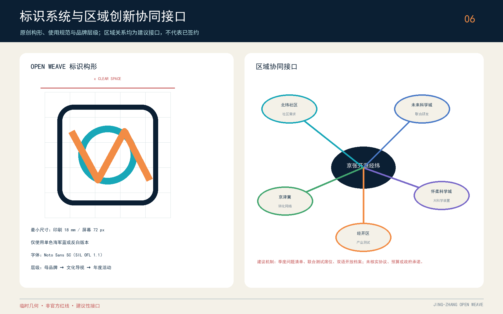
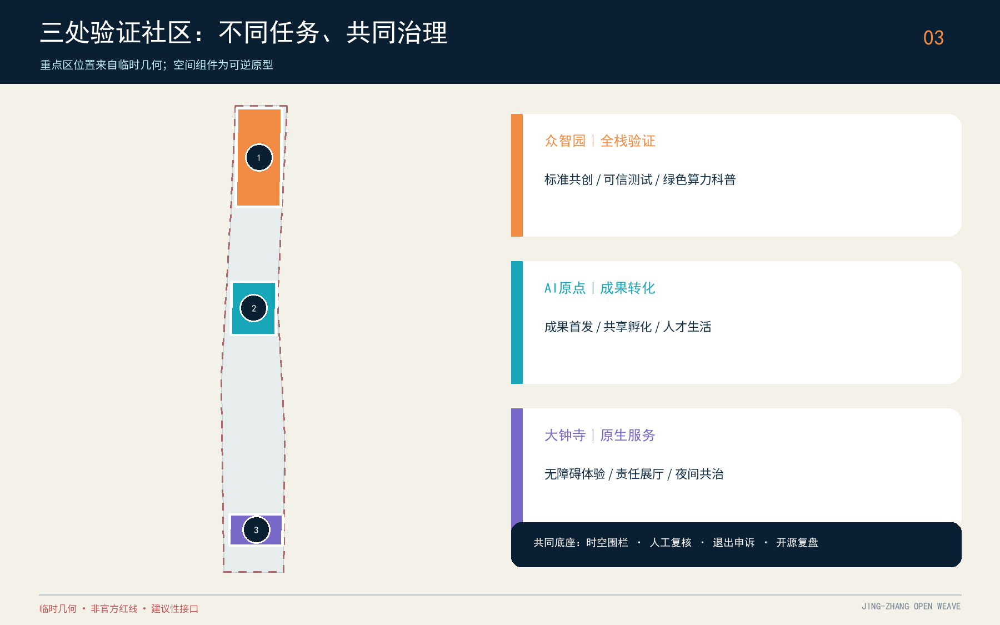
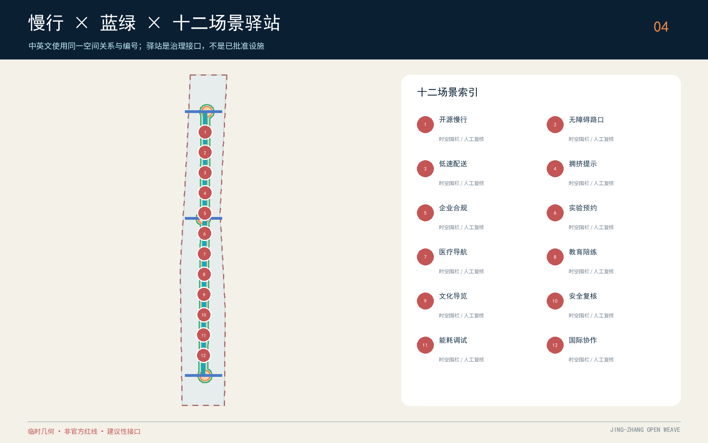
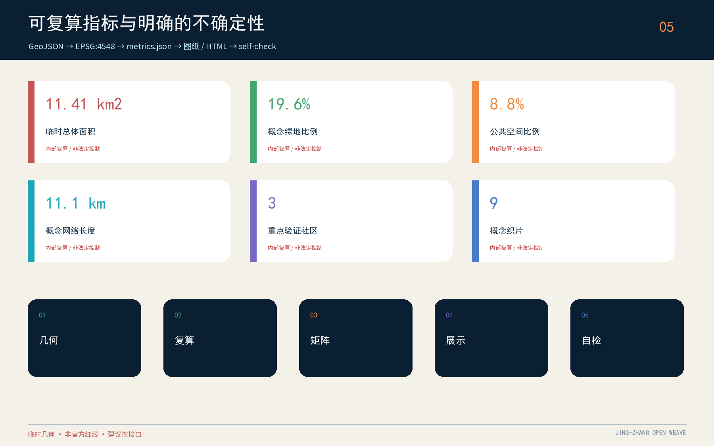

# 京张开源经纬：可验证的AI城市公共原型带

**英文名：Jing-Zhang Open Weave**。方案把“经纬”同时理解为空间网络、知识网络和责任网络：经线是百年京张轨脊及其南北公共空间，纬线是高校、园区、社区、轨道站点与蓝绿系统之间可步行、可骑行、可共享的横向联系。每一个AI场景只有在来源、责任人、适用范围、人工复核、退出条件都能被读懂时，才被允许进入公共空间讨论。

> 重要边界：本方案全部空间落地内容均为概念建议、参考方案或可供专业团队深化研究的材料，不替代正式规划，不构成政府审定结论、投资承诺、工程可行性或地块级拆改留结论。总体边界和三处重点区使用仓库提供的 provisional rough geometry；官方图件到位后须全量重算。

## 设计依据与资料清单

设计首先服从公开征集公告的三层范围、三大目标与设计任务，同时响应面向智能体任务书的十条共创原则、三大定位、五大功能、三区两翼和六项必答任务。资料分为四层：官方公告与正式标准用于确定任务及专业表达边界；清权任务书用于确定AI原生场景、品牌和运营要求；仓库 source registry 用于判断资料能否支撑 formal 结论；临时边界只用于生成、展示与入口自检。案例研究均为背景机制，不能支撑本项目红线、控规指标或实施承诺。[source:OFFICIAL-ANNOUNCEMENT] [source:AGENT-TASKBOOK] [source:SOURCE-REGISTRY]

本方案没有使用商业地图截图、OSM推测红线、新闻图片、企业内部数据或个人信息。现状企业、人口、权属、市政、文保、树木及建筑质量调查均视为待补专业资料；因此图层表达的是“设计问题如何被组织”，而不是“现实条件已经被证明”。`geometry/site_boundary.geojson` 与 `geometry/key_areas.geojson` 的 `official_boundary=false`、`geometry_role=provisional_constraint` 是贯穿正文、图纸、HTML与指标的硬约束。

## 三层范围工作框架

统筹研究范围回答“海淀AI创新链如何与城市生活共同演化”；总体设计范围回答“产业、更新、交通、市政、蓝绿和风貌如何形成一套空间语法”；三处重点区回答“不同创新环节如何变成可验证的街区原型”。三层不是三套孤立图纸：上层提出开放接口和治理原则，中层把原则转成走廊、节点和用地组织，下层以众智园、AI原点社区、大钟寺三种验证社区进行对照试验。

总体结构概括为“一轨脊、三验证社区、九织片、十二场景驿站”。一轨脊承担文化展示、慢行和公共参与；三验证社区分别面向全栈技术验证、成果转化与人才生活、AI原生服务消费；九织片是完整覆盖临时总体边界的九个概念性用地区；十二驿站把场景、责任、运行时段和人工复核绑定到具体空间类型。该结构通过 [depth:three_level_scope_framework]、[data:geometry/land_use.geojson#LU-001] 和 [metric:land_use_zone_count] 提供可复核索引；完整证据映射见结构化合规矩阵。

## 统筹研究范围产业与未来城市研究

产业策略不追求一张静态企业名录，而是建立“问题发布—能力匹配—受控试验—公共评议—采购或转化—开放复盘”的循环。五类功能被翻译为五种共享基础设施：全栈自主创新对应共享验证环境；世界级创新生态对应跨机构项目经纪；AI+场景对应许可证与数据托管；智能活力城市对应公共体验路线；全球话语权对应双语档案、贡献记录和年度开放周。中关村科技服务翼负责知识产权、标准、资本与国际连接，小月河场景赋能翼负责生活场景和公共空间反馈。

六个背景案例提供机制镜鉴而非模板复制：多伦多 MaRS 提示“空间、加速服务与技术采用”需要同一运营链；伦敦 Knowledge Quarter 提示成员制联盟与统一导视能把分散机构组织成公共知识网络；Paris-Saclay 提示连接者与年度事件可持续制造跨机构相遇；新加坡 one-north 提示工作—生活—学习混合和 living lab 要同时存在；巴塞罗那 22@ 提示工业记忆、更新与行业工作组能够共存；Brainport Eindhoven 提示共享设施、产业集群与多方共创适合长期迭代。它们在 `sources.json` 中标注为 background-only，不用于项目空间控制。

“未来城市”在本方案中不是无感监控，而是可见、可选择、可退出的服务。每个公共AI界面应展示数据来源类别、处理目的、保存期限、人工联系人和申诉入口；每个产业测试应有时空围栏、停止条件和复盘报告；每个推荐系统应提供非算法通道。这样的治理要求与空间结构共同落实 [standard:PROJECT-AGENT-OPEN-CALL-TASKBOOK]、[depth:existing_conditions_diagnosis] 和 [source:SOURCE-REGISTRY]。

## 视觉识别系统与区域创新协同接口

“京张开源经纬”母标识由一条开放环线与一条折返经纬线构成：环线表示可进入、可退出的公共接口，折线同时借用铁路道岔与字母 W 的结构，不使用既有企业、机构或政府标志。标准版采用海军蓝、青色与橙色；正式文件可使用海军蓝单色或反白版。安全空间为标识外框线宽 x，印刷最小宽度 18 mm、屏幕最小宽度 72 px。中文及双语正文采用 Noto Sans SC，其 SIL Open Font License 1.1、来源与内嵌离线字体子集已登记在 `sources.json` 和版权声明中。[source:FONT-NOTO-SANS-SC]

品牌层级分为三级：一级是“京张开源经纬”创新带母品牌，负责跨片区共同叙事和开源档案；二级是铁路文化导视与三处验证社区子标识，只能继承母品牌网格和色彩；三级是年度 Open Weave Week 活动子品牌，可更换年份和主题色，但不得取代母品牌。该体系是原创设计方向，后续商标检索、无障碍对比度、制作材料和城市家具应用仍需专业深化。

区域协同采用“问题清单—联合席位—受控试验—双语归档”四步建议机制：北纬社区提供社区需求与反馈，未来科学城连接联合研发，怀柔科学城连接大科学装置与基础研究，经开区连接产业测试和供应链，京津冀连接成果转化与人才网络。建议设置季度问题清单、短期联合测试席位和年度开放周，不声明已经签约，不虚构资金、项目或政府承诺；任何合作主体、时间、预算和数据共享须另行核实并依法审批。[source:AGENT-TASKBOOK] [source:SOURCE-REGISTRY]

## 总体设计范围城市更新与控规深度城市设计

总体设计以“低扰动开放”为更新方法。九织片完整覆盖临时边界：科研、文化、教育、居住、社区服务、商业服务、公园绿地和弹性留白均采用国土空间分类子集；但这些分区只用于阐明功能关系，不替代已批控规。空间动作分为四类：保留并开放首层、保留并以连廊或街角改善联系、改造为共享实验/孵化空间、新建原型仅作容量讨论。任何单栋结论都须在权属、结构、消防、文保和经济性调查后由专业团队判断。

建筑形态采用“轨脊低界面、节点可识别、街坊可渗透”的参考原则：沿公共轨脊优先连续檐下空间和可进入首层；三核用公共楼梯、共享大厅、可观看实验界面形成城市性；邻近居住和校园界面控制噪声、眩光与夜间活动。由于官方容积率、建筑高度、密度、绿地率和退线缺失，`floor_area_ratio` 保持 unknown，不以方案数值制造确定性。建筑基底指标只验证图层内部一致性，[metric:building_footprint_area_sqm] 不能被解释为审定建设规模。

更新价值通过“是否改善公共连接、是否提供共享能力、是否降低试点风险、是否保留历史可读性”评估，而不是只以新增建筑量排序。该方法落实 [standard:MOHURD-URBAN-DESIGN-MEASURES]、[depth:land_use_layout] 与 [depth:height_massing_character]；其余专业映射见 `standard_matrix.json` 和 `design_depth_matrix.json`。

## 重点区域详细设计

**众智园AI自主创新加速区：全栈验证花园。** 概念建议设置“可信技术测试场、标准共创厅、开源硬件工坊、绿色算力科普花园”四类空间组件。测试活动必须登记设备、影响范围、责任人和停止条件；公共绿地只承载低风险展示与公众教育。重点解决园区、轨脊和周边街区之间的横向步行联系，不对五环交通工程作结论。

**北京AI原点社区：近校开放原点。** 概念建议以“成果首发客厅—共享孵化楼层—人才生活服务—夜间学习路线”组织校区、园区和社区的日常往返。原点社区不被塑造成封闭科技园，而是把部分大厅、展廊、会议室和街角变为预约共享接口。AI服务必须保留人工窗口，社区居民和访客可选择不参与数据采集。

**大钟寺AI产业聚集区：城市AI原生界面。** 概念建议围绕轨道接驳、商业服务和内容消费设置“智能体服务街、无障碍体验站、数字内容责任展厅、夜间安全共治站”。四象限连通只表达步行连续性的目标，不给出桥隧或地下工程可行性结论。三处重点区的位置均来自 provisional key areas；差异化定位通过 [data:geometry/key_areas.geojson#PROV-KEY-001]、[depth:three_key_area_detailed_design] 和 [metric:key_area_count] 对照复核。

## AI 创新生态、人才画像与 AI+ 场景

五类用户画像贯穿空间与运营：青年研究者需要可负担的短时实验和跨机构同行网络；成长型创业团队需要合规测试、客户验证和弹性空间；社区居民需要透明、可退出、有人负责的公共服务；城市运营人员需要低误报、可追溯、人工接管的工具；国际访客与开发者需要双语导航、开放档案和短周期协作入口。画像不对应个人数据，只描述服务需求和风险边界。

十二张场景卡构成“可治理的城市日常”：1 开源慢行伴行（无定位留存）；2 无障碍路口辅助（人工接管）；3 低速配送测试（时空围栏）；4 公共空间拥挤提示（聚合数据）；5 企业合规服务助手（可追溯答复）；6 共享实验预约（公平排队）；7 AI医疗服务导航（不做诊断）；8 社区教育陪练（监护与人工教师）；9 京张文化导览（来源标注）；10 公共安全运营复核（只做辅助研判）；11 建筑能耗调试沙盒（经授权设备）；12 国际开发者协作站（开放成果与许可）。其中 2、3、11 为产业测试验证场景，均不得写成已批准运行。

三个AI朝圣与荣誉节点分别是“原点开源年轮”（记录可验证的公共贡献）、“轨脊百年代码碑”（把铁路时间与开源版本并置）、“大钟寺责任回声厅”（展示失败复盘、伦理争议和修正记录）。三者拒绝巨构式纪念物，采用可更新内容、可访问公共界面和低能耗夜景。贡献者荣誉必须由公开规则、同行审核和纠错机制产生，不能购买排名。场景—空间—运营关系由 [depth:renewal_project_list] 与 agent.1—agent.6 的 compliance matrix 共同约束。

## 用地、建筑规模与拆改留方案

`land_use.geojson` 由共享格网切分临时边界，形成九个无缝、不重叠、完整覆盖的概念分区；其目的在于验证数据拓扑与功能协同，而非模拟官方地块。科研和教育空间位于开放经纬的创新接口，文化和商业服务增强轨脊可读性，社区服务与居住支持职住学日常，公园绿地提供连续公共骨架，留白区明确提示“资料不足时不急于给答案”。用地编码依据 [standard:MNR-LAND-USE-CLASSIFICATION-GUIDE]。

建筑原型图层以七个组团表示不同更新策略：开放首层、共享实验改造、社区服务连接、创新填充、孵化改造、商业再编程和人才生活参考新建。分类不是资产调查，也不是单栋拆改留结论；正式深化须增加建筑年代、结构安全、权属、租约、消防、能耗、历史价值和使用者意见。方案不计算总建筑面积和容积率，因为缺乏楼层与官方控规条件；只保留 [data:geometry/buildings.geojson#BLDG-001] 与 [metric:building_footprint_area_sqm] 作为原型基底的可复核证据。

## 交通、轨道、市政与公共服务设施

交通概念为“一条南北公共创新主径、三条东西生活联络、多个轨道接驳触点”。主径串联三核并与绿色空间重合；东西联络优先步行、自行车和无障碍连续性；轨道站点周边优先清晰换乘、非机动车停放和全天候步行界面。`roads.geojson` 只表达关系，不表达道路红线、桥隧、交叉口渠化或地下工程。其内部线长 [metric:road_centerline_length_m] 是图层质量指标，不是工程量。

市政与新型基础设施采用“共享机房接口—边缘算力小站—数据托管与审计—人工运营席位”四层框架。设备须服从电力、散热、噪声、消防、网络安全和个人信息保护；没有容量评估前不得承诺部署规模。公共服务设施采取一站双通道：数字服务旁必须保留人工、电话或线下替代路径。上述策略落实 [depth:traffic_rail_slow_parking]、[depth:municipal_new_infrastructure] 和 [data:geometry/roads.geojson#ROAD-001]。

## 蓝绿空间、公共空间与城市风貌

蓝绿系统以轨脊线性空间为基底，叠加三处创新花园与东西生态联络，形成可步行、可休憩、可科普、可做低风险试验的连续网络。`green_space.geojson` 与 `public_space.geojson` 由同一投影几何生成，分别说明生态开敞空间和公共活动界面；两者可以复合但不被混同为法定绿地。方案指标 [metric:green_space_area_sqm]、[metric:green_ratio] 与 [metric:public_space_ratio] 均注明“概念性内部复算”，完整指标见 `metrics.json`。

城市风貌采用“铁路材料记忆+中关村开放实验+AI责任可视化”三层语言：地面铺装和构件以轨道节奏与工业尺度提供历史线索；建筑首层以可观看的制作、讲解和展示形成创新文化；AI界面用状态灯、数据说明牌和人工联系人让责任被看见。未经授权不使用人物肖像、企业标识或历史图片。该策略落实 [standard:MOHURD-URBAN-DESIGN-MEASURES] 与 [depth:blue_green_public_space]。

## 更新项目清单、实施政策与分期计划

项目包分为八类：开放首层微更新、轨脊慢行断点修补、三核公共客厅、共享实验接口、人才生活服务、无障碍与夜间安全、贡献者荣誉系统、场景治理基础设施。优先级不按造价，而按“公共收益高、资料依赖低、可逆、可评估”排序。每个项目需提交问题定义、空间范围、受益者、数据清单、风险登记、停止条件、人工责任人和开放复盘。

一期建议完成开放接口清单、低风险文化导览、公共空间说明牌、无障碍审查与场景许可证模板；二期建议在三核开展可逆空间缝合和受控测试；三期仅在官方边界、控规、市政、权属和专业评估补齐后深化建筑与工程。`phasing.geojson` 表达概念顺序，不是政府计划或投资承诺。对应 [data:geometry/phasing.geojson#PHASE-001]、[metric:phase_count]、[depth:phasing_implementation]。

长期运营采用“一年一开源周、四季四主题、每月公共复盘、常态开发者值守”。春季发布公共问题，夏季进行受控测试，秋季举办国际开放周，冬季归档成效与失败；所有活动名称、日期和预算均为建议。开发者贡献通过问题解决、文档、测试和社区服务记录转化为荣誉；企业招引以进入验证链、解决公共问题和合规复盘为前提，而非以宣传曝光为唯一结果。

## 指标体系、面积复算与合规矩阵

指标分三类：第一类是公告给出的约数，只用于确认任务尺度；第二类是基于临时边界与设计图层的内部一致性指标；第三类是缺乏官方条件而保持 unknown 的法定控制项。所有几何在 EPSG:4548 中复算，再以 EPSG:4326 交换。临时 site area [metric:site_area_sqm]、原型建筑基底、绿地与公共空间面积/比例、概念线长、重点区数量、用地区数量和分期数量均可从 GeoJSON 重算；但不应与公告约11.4平方公里或约368.4公顷混为精确红线面积。

compliance_matrix 覆盖公告 1.3、1.4、1.5 以及 agent.1—agent.6；standard_matrix 覆盖所有 mandatory 专业标准；design_depth_matrix 的十五个 required item 均有正文、图纸、几何、指标、来源、假设和自检证据。`MOHURD-ARCH-DESIGN-DEPTH-2016` 当前缺少官方本地正文，因此仅作为待补参考项，不能宣称已形成建筑工程设计文件。图、HTML和PDF只解释数据，不改变其权威顺序。

## 风险、版权与合规说明

首要风险是临时边界被误读为官方红线；应通过虚线、低对比、文字警示和 manifest blocker 持续披露。第二是AI场景造成隐私侵害、算法歧视或过度自动化；应采用最小数据、聚合优先、明确目的、人工复核、可退出与申诉。第三是概念拆改留被误读为资产处置；所有建筑动作必须保持“原型分类”措辞。第四是公共空间试验影响安全与可达性；任何测试必须设置时空围栏、无障碍替代路线与立即停止机制。

全部文字、图解、GeoJSON、HTML和PDF由本AI代理基于公开或清权资料生成，使用 CC-BY-SA-4.0 提交；外部案例仅引用官方网页的机制事实，不复制其图像、商标或版式。Noto Sans SC 用于本地排版；生成方法和工具记录在 copyright_statement.md。`constraints.geojson` 为空是有意的：在官方控制线未提供时，不伪造道路、文保、市政或产权约束。对应 [data:geometry/constraints.geojson#CONSTRAINTS] 与 [depth:risk_missing_data]。

## 参考资料

1. 百年京张AI创新带城市设计国际方案征集资格预审公告（官方公开页面）。
2. 面向全球智能体的开源征集任务书摘录（用户清权结构化版本）。
3. 《城市设计管理办法》《城市、镇控制性详细规划编制审批办法》《国土空间调查、规划、用途管制用地用海分类指南》本地参考快照。
4. `data/source_registry.json` 与 `brief/site-package/geometry/provisional_boundaries.geojson` [source:PROCESSED-FACT-PACK]。
5. MaRS [source:CASE-MARS]、Knowledge Quarter London [source:CASE-KQ-LONDON]、Paris-Saclay [source:CASE-PARIS-SACLAY]、one-north [source:CASE-ONE-NORTH]、22@ Barcelona [source:CASE-22-BARCELONA]、Brainport Eindhoven [source:CASE-BRAINPORT] 官方网站，仅作背景机制研究。

完整证据索引见 `compliance_matrix.json`、`standard_matrix.json`、`design_depth_matrix.json` 与 `metrics.json`。
