# JingZhang Intelligence Loop: An AI Innovation Belt on the Centennial Railway

## Design Basis and Source List

This formal proposal takes the "Pre-qualification Announcement for the International Open Call for Urban Design of the Centennial JingZhang AI Innovation Belt" issued by the Haidian Branch of the Beijing Municipal Commission of Planning and Natural Resources as its primary basis, and uses the temporary coarse boundary, key areas, enumerations, indicators, and source inventory registered by the maintainer in `brief/site-package/` as machine-readable inputs. Before generating the proposal, the AI agent must read `design_brief.json`, `allowed_design_space.json`, `sources.json`, `enums/`, `ranges/`, `schemas/`, `data/source_registry.json`, and `data/processed/agent_fact_pack.md`, and must use `project_scope_summary.csv`, `agent_task_requirements.csv`, `source_use_matrix.csv`, and `missing_data_checklist.csv` to establish the task list, scope, source use, and gap list. Every design judgment must be decomposed into traceable sources, recalculable indicators, verifiable layers, and manually reviewable assumptions. The announcement requires the proposal to reach the urban design depth of a regulatory detailed plan and the urban design depth of a comprehensive implementation plan; therefore, textual narrative cannot replace GeoJSON, indicator tables, the A3 booklet, the A0 boards, or the HTML electronic presentation.

The proposal is not an independent vision text; it organizes deliverables starting from the announcement, the agent-facing task book, and the site package. This section places only the most critical sources next to each judgment [source:OFFICIAL-ANNOUNCEMENT] [source:AGENT-TASKBOOK] [depth:existing_conditions_diagnosis]. The complete source and standard coverage is kept in `sources.json`, `standard_matrix.json`, and `design_depth_matrix.json`, and is not repeated as a machine index in the body text.

The use boundary of the source registry is as follows [source:SOURCE-REGISTRY]:

- `data/source_registry.json` registers the use boundary of public, clearance, and provisional sources.
- Current registration summary: 7 formal-usable sources, 1 background source, 1 provisional-only source.
- The agent must not upgrade background_only or provisional_only sources into an official boundary, statutory regulatory plan, formal scoring basis, or government implementation commitment.

`data/processed/agent_fact_pack.md` is a reading navigation layer for this proposal, not a new authoritative source [source:PROCESSED-FACT-PACK]. It helps the agent organize the three-level scope, three key areas, announcement tasks, agent.1-agent.6, source availability, and missing-data items into a readable proposal; factual judgments still need to return to the registered original materials [source:OFFICIAL-ANNOUNCEMENT] [source:AGENT-TASKBOOK], and the complete source relationships are preserved in `sources.json`.

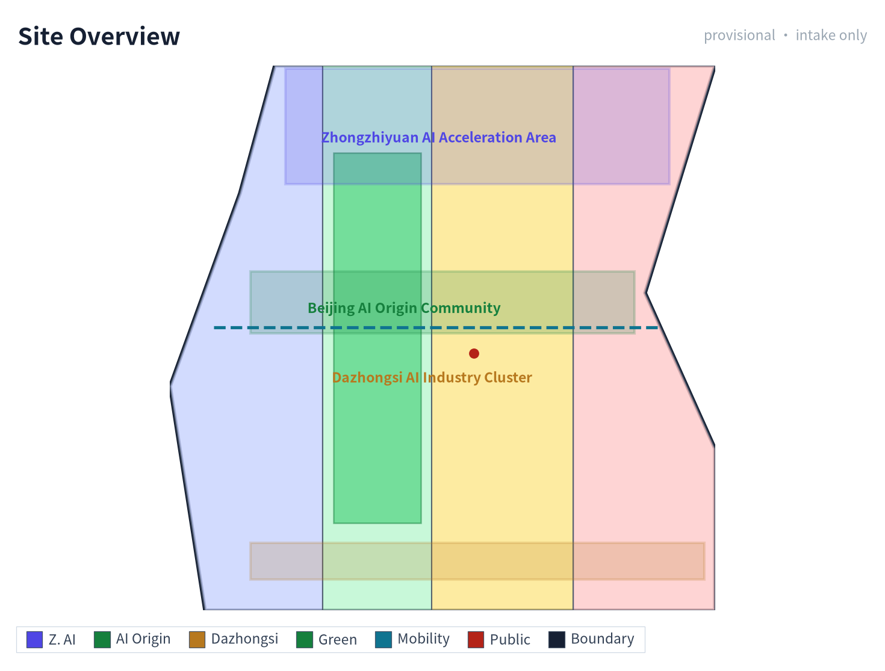

When the official `SITE_BOUNDARY` or the three `KEY_AREA` polygons have not yet been obtained, this scaffold uses `brief/site-package/geometry/provisional_boundaries.geojson` to generate a temporary formal package. `geometry/site_boundary.geojson` and `geometry/key_areas.geojson` in the submission package must both be labeled as `provisional_constraint` and `official_boundary=false`, and may only be used for proposal generation, self-check, visualization, and design discussion; they cannot serve as an official redline, approval basis, precise area basis, or statutory control conclusion. This organizer data gap itself does not block content scoring; after replacing with official polygons, the site boundary, key areas, land use, roads, green space, public space, buildings, phasing, and metrics must all be recalculated.

The scoreable status generated by this scaffold is: **provisional boundary, retaining precision warnings and awaiting recalculation after official data release; does not block content scoring**. Therefore, the spatial structure, scenarios, projects, and indicators in the body are written according to the principle of "discussable, reviewable, and recalculable after replacing the official boundary"; when the official boundary and key-area polygons are updated, the agent must rerun the scaffold, self-check, and drawing/HTML generation, not merely replace a single file.

Boundary interpretation can return to the overall scope layer and area recalculation [data:geometry/site_boundary.geojson#SITE-001] [metric:site_area_sqm]. The three key areas are checked by an independent layer and count indicator [data:geometry/key_areas.geojson#PROV-KEY-001] [metric:key_area_count]. This means readers can enter the evidence from the body text without first reading a string of machine identifiers.

## Three-Level Scope Framework

The proposal organizes work according to the three levels determined by the announcement: the coordinated research scope focuses on the AI industrial ecosystem, strategic positioning, innovation chain, and future urban form across 43.6 square kilometers; the overall design scope focuses on the 11.4 square kilometer urban area and industrial zones within 1-2 kilometers around the JingZhang Heritage Park, requiring an overall urban renewal framework, industrial spatial layout, transport and municipal support, and urban character control; the key area scope focuses on the three detailed design districts of 368.4 hectares, requiring clear functional uses, building scale, retain-renovate-demolish classification, public space connectivity, and transport organization. The three levels are mapped item by item in `compliance_matrix.json`, ensuring that announcement items 1.3, 1.4, 1.5 and the mandatory tasks agent.1-agent.6 each have a chapter, layer, indicator, drawing, and HTML evidence.

The depth items of the three-level framework are constrained by [depth:three_level_scope_framework] and [depth:overall_spatial_structure], spatial evidence is based on [data:geometry/site_boundary.geojson#SITE-001] and [data:geometry/key_areas.geojson#PROV-KEY-001], task basis is based on [standard:PROJECT-OFFICIAL-ANNOUNCEMENT], and scope indexing is based on the three-level scope table in `project_scope_summary.csv` within [source:PROCESSED-FACT-PACK].

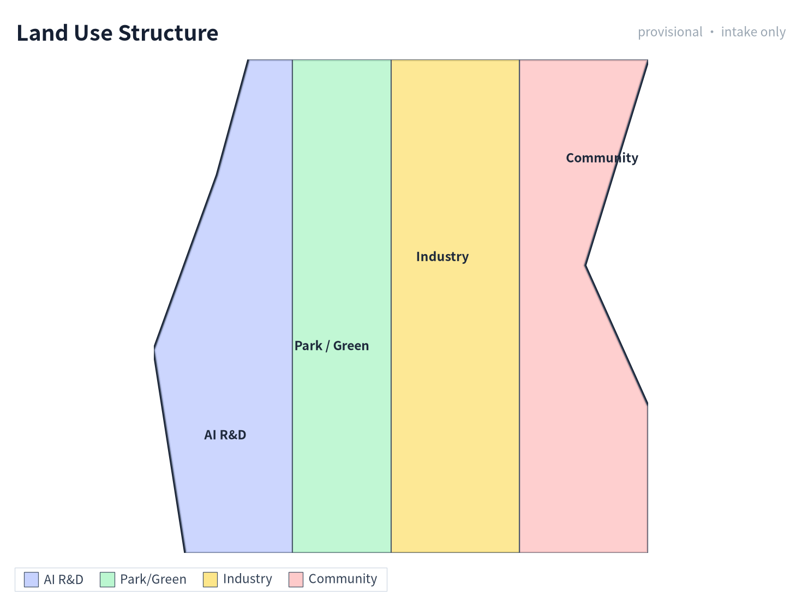

The three-level tasks are not a collection of disconnected drawings. The coordinated research determines industrial chain and urban form judgments; the overall design translates these judgments into renewal projects, spatial structure, and facility capacity; the key-area detailed design verifies the implementability of specific plots, buildings, transport, public space, and AI application scenarios. When generating the proposal, the agent must first lock the official or provisional boundary and constraints currently adopted by the submission, then generate land use, buildings, roads, green space, public space, phasing, and AI service nodes, and finally recalculate indicators from these layers and explain in the body which conclusions remain constrained by the provisional boundary. Any area, ratio, scale, or project count that cannot be recalculated from structured data must not be written as a formal conclusion.

The overall concept proposed by this proposal is the "JingZhang Intelligence Pulse Symbiosis Belt": taking the JingZhang Heritage Park as the historical and public-space spine, using the three key districts of Zhongzhi Garden, Beijing AI Origin Community, and Dazhongsi as innovation anchors, and taking universities, enterprises, communities, and rail stations as the everyday network, forming a spatial organization of "one belt, three cores, multi-node scenarios, and a blue-green slow-traffic composite loop". Here, "one belt" is not a newly drawn redline, but a translation of the three-level scope in the announcement into a working method; "three cores" correspond to the three key areas; "multi-node scenarios" correspond to operable nodes for AI+ public services, industrial services, and urban life; "composite loop" corresponds to the linkage of slow traffic, green space, public space, and activity routes.

| Level | Design Question | Proposal Response | Data Anchor |
| --- | --- | --- | --- |
| Coordinated research scope | How to organize the AI industrial ecosystem and future urban form | Build an innovation chain of "university sourcing - open-source collaboration - enterprise translation - public experience - international dissemination" | compliance_matrix.json, standard_matrix.json |
| Overall design scope | How to map industrial space, urban renewal, transport/municipal systems, and character | Land use, buildings, roads, green space, public space, and phasing layers jointly express the design | [data:geometry/land_use.geojson#LU-001], [data:geometry/roads.geojson#ROAD-001] |
| Key area scope | How to bring the three districts to detailed design depth | Respectively propose positioning, spatial moves, AI scenarios, and implementation dependencies | [data:geometry/key_areas.geojson#PROV-KEY-001], [data:geometry/key_areas.geojson#PROV-KEY-002], [data:geometry/key_areas.geojson#PROV-KEY-003] |

## Coordinated Research Area: Industry and Future City Research

The core task of the coordinated research scope is to build a world-class AI innovation ecosystem. The proposal should inventory Haidian's universities and research institutes, leading enterprises, computing-algorithm-data elements, incubation platforms, listed companies, unicorns, and sci-tech service resources, and propose a spatial synergy framework for the AI innovation chain, industrial chain, talent chain, and urban service chain. The naming scheme and logo design should serve the overall recognizability of the "Centennial JingZhang Cultural Belt, Urban AI Life Experience Belt, AI Fusion Innovation Belt", not stop at slogans; they should explain the relationship to the industrial ecosystem, public space, and cultural resources. The agent-facing task book also requires responding to the "five major functions" and "three zones, two wings" coordination, forming a naming system, visual identity, overall spatial structure diagram, scenario opening, and operation mechanism that can be further deepened; this section must label these requirements as coming from the agent open-call task with [source:AGENT-TASKBOOK] and [standard:PROJECT-AGENT-OPEN-CALL-TASKBOOK], not from statutory planning control.

Coordinated research does not add pseudo-precise redlines; it connects back to [data:geometry/land_use.geojson#LU-001], [data:geometry/public_space.geojson#PUBLIC-001], and [depth:overall_spatial_structure] through the urban character, public space, and building layout coordination required by [standard:MOHURD-URBAN-DESIGN-MEASURES], explaining that industrial strategy ultimately lands in a visible, reviewable spatial structure.

Future urban form research should answer how artificial intelligence changes work, life, social interaction, learning, transport, and public services. The proposal should translate AI transport systems, continuous green space, innovation service facilities, and an international living-working atmosphere into locatable functional zones, nodes, corridors, and scenarios, rather than vaguely describing a technology vision. The agent should write industrial strategy indicators, AI innovation index, talent density, spatial supply types, and AI+ vertical application key areas into the indicator system, and label which are official, which are design proposals, and which still await calibration against official data. If global AI activities, developer communities, open scenes, or pilgrimage routes are proposed, they should be written as "conceptual proposals / reference schemes / for professional teams to deepen", not as already-determined government activities or implementation arrangements.

## Overall Design Area: Urban Renewal and Regulatory-Plan-Level Urban Design

The overall design scope is required to reach the urban design depth of a regulatory detailed plan. The proposal must put forward an overall urban renewal spatial structure, inefficient-space identification, renewal project list, implementation policy recommendations, industrial function ratios, spatial organization models, total building scale, and comprehensive carrying-capacity assessment. `geometry/land_use.geojson` should fully cover the design boundary without overlap, `geometry/buildings.geojson` should express updated building footprints or retained building footprints, `geometry/roads.geojson` should express microcirculation, slow traffic, and rail connectivity, and `metrics.json` should recalculate core areas, ratios, and layer counts.

This section breaks regulatory-plan-depth content into reviewable objects according to [standard:MOHURD-CONTROL-DETAILED-PLANNING]: [data:geometry/land_use.geojson#LU-001] expresses land-use structure, [data:geometry/buildings.geojson#BLDG-001] expresses building footprints, [data:geometry/roads.geojson#ROAD-001] expresses transport organization, [metric:building_footprint_area_sqm] is used to recheck building footprint area, and [depth:land_use_layout] and [depth:development_intensity_controls] constrain deliverable depth.

The overall design must also support transport, rail, municipal, and supporting facilities. The proposal should propose spatial layout and implementation paths around rail-station integration, road microcirculation, non-motorized vehicle parking, parking supply, innovation service platforms, talent life services, new infrastructure, distributed energy, and edge computing. Content involving building height, development intensity, road redline, setbacks, and facility standards, if official control conditions are not yet available, should be written as "pending confirmation of formal regulatory-plan conditions", and the agent's inferred values must not be passed off as approved indicators.

## Detailed Design of Key Areas

Detailed design of key areas is mandatory. The Zhongzhi Garden AI Independent Innovation Acceleration Zone should propose a detailed plan around the national artificial intelligence platform, full-stack independent innovation, standard setting, safety governance, industrial display, external transport, Qinghe culture, low-carbon green innovation communication environment, and green-space AI scenarios. The Beijing AI Origin Community should propose a detailed plan around campus-adjacent innovation, achievement incubation and translation, talent special zones, open-source systems, brand activities, building retain-renovate-demolish, achievement display and release, residential life support, campus-park slow-traffic connection, and rail-station integration. The Dazhongsi AI Industry Cluster should propose a detailed plan around leading enterprises, intelligent agents, smart terminals, content consumption, data elements, digital assets, commercial services, planned green-space composite use, Dazhongsi Station integration, and four-quadrant pedestrian connectivity at intersections.

Detailed design of the three key areas must reference [data:geometry/key_areas.geojson#PROV-KEY-001], [data:geometry/key_areas.geojson#PROV-KEY-002], and [data:geometry/key_areas.geojson#PROV-KEY-003], and be checked by [depth:three_key_area_detailed_design] for whether it reaches the depth of a comprehensive implementation plan. If it only describes "building a demonstration zone" without evidence of function, buildings, transport, public space, and implementation projects, it should be considered incomplete.

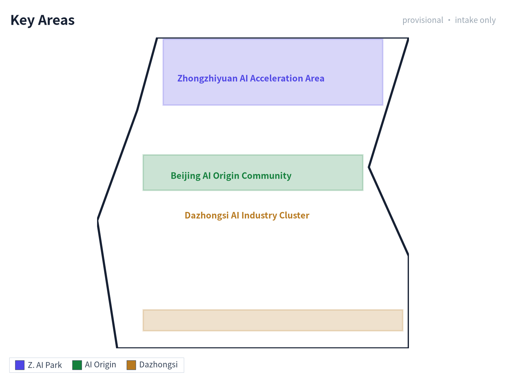

The three key areas must appear in `geometry/key_areas.geojson`. If the repository provides official polygons, they should be used as `official_constraint`; if official polygons are missing, `provisional_constraint` may be used temporarily, but the body text, HTML, sources, assumptions, and self-check must explain that it cannot serve as a formal scoring or approval basis. `compliance_matrix.json` should respectively cover announcement items 1.5.3.1, 1.5.3.2, and 1.5.3.3. Design expression should include functional uses, building scale, building form, retain-renovate-demolish classification, public space system, transport organization, slow-traffic connectivity, and implementation projects. The HTML page should be able to switch views of the three key areas, and the A3 booklet and A0 boards should at least include key-area master plans, local detail drawings, and indicator explanations.

| Key District | Design Positioning | Spatial Move | AI Industry and Operation Scenario | Evidence Reference |
| --- | --- | --- | --- | --- |
| Zhongzhi Garden AI Independent Innovation Acceleration Zone | Garden-style full-stack independent innovation block | Strengthen the Qinghe interface, industrial display, low-carbon innovation communication, and external transport organization; use green space to carry open testing and standard-governance display | Independent model testing, standard-setting workshops, safety-governance display, low-carbon computing experience | [data:geometry/key_areas.geojson#PROV-KEY-001], [depth:three_key_area_detailed_design] |
| Beijing AI Origin Community | Campus-adjacent achievement translation and talent community | Organize campus-park-block slow-traffic stitching; supplement achievement release, talent services, residential life, and open-source collaboration space | Open-source community, achievement release, talent special-zone services, campus-adjacent incubation | [data:geometry/key_areas.geojson#PROV-KEY-002], [source:AGENT-TASKBOOK] |
| Dazhongsi AI Industry Cluster | Urban intelligent economy and international exchange block | Focus on Dazhongsi Station integration, four-quadrant pedestrian connectivity, commercial services, and public environment renewal around key enterprises | Intelligent agent and smart terminal display, content consumption, data elements, and international roadshows | [data:geometry/key_areas.geojson#PROV-KEY-003], [metric:key_area_count] |

## AI Innovation Ecosystem, Personas, and AI+ Scenarios

The proposal should establish spatial demand personas for AI talent and enterprises, covering R&D offices, open-source collaboration, achievement release, enterprise services, talent housing, social learning, consumer life, sports and leisure, and international exchange. AI+ scenarios should form industrial development scenarios and AI-empowered urban function scenarios around the directions of transport, services, consumption, medical care, education, law, and life services proposed in the announcement. Each scenario should explain the service target, spatial location, data source, privacy boundary, manual review mechanism, and operating entity.

AI scenarios must land in spatial and governance boundaries: public-space scenarios reference [data:geometry/public_space.geojson#PUBLIC-001], slow-traffic and transport scenarios reference [data:geometry/roads.geojson#ROAD-001], and open-space scenarios reference [data:geometry/green_space.geojson#GREEN-001] and [metric:public_space_ratio], [metric:green_ratio]. These references let reviewers know that scenarios are not slogans but design objects located in specific layers and indicators. The agent-facing task book requires no fewer than 10 AI scenario cards, no fewer than 3 industrial test-verification scenarios, and no fewer than 5 user personas; the scaffold only provides the structure, and formal participants must write the scenario cards, persona tables, privacy boundaries, manual review, and operating entities into the body text, HTML, A3/A0, and compliance matrix.

| Persona | Typical Need | Spatial Response | Self-Check Boundary |
| --- | --- | --- | --- |
| Open-source developer | Release, collaborate, test, community reputation | Origin Community open-source release hall, public code wall, nighttime collaboration space | Do not collect individual behavioral trajectories; activity data is only aggregated statistics |
| Startup team | Low-cost office, computing access, product test field | Zhongzhi Garden shared test field, edge-computing service point, standard-governance consultation | Computing and data services require separate authorization |
| Leading-enterprise visitor | Display, business, international reception, recruitment | Dazhongsi international roadshow living room, rail-station connection, public space around key enterprises | Enterprise logos and cases must be clearance-sourced |
| Nearby resident | Commuting, leisure, community services, low-disturbance renewal | JingZhang Heritage Park slow-traffic loop, embedded community services, nighttime lighting and activity grading | Do not use resident personas for commercial recommendations |
| University faculty and student | Achievement translation, cross-campus collaboration, daily slow traffic | Campus-park slow-traffic stitching, achievement translation station, AI education experience point | Campus data and research achievements require authorization |

To meet the agent taskbook agent.3 requirement for a complete chain of "AI capability - data - space - operation - human fallback - - evaluation indicator", the 10 scenario cards are extended with spatial node ID, operating entity, data input/output, human-takeover mechanism, performance indicator, and scenario type; among them, **02, 03, and 08 are explicitly marked as Industrial Test-Verification Scenarios** (meeting the >=3 requirement). The full structured record of each scenario card (spatial object/node ID, scenario type, operating-entity status, data input/output, human takeover, KPI definition, and known/unknown/provisional status) is registered in the `scenario_cards` sub-table of `compliance_matrix.json`, and is referenced specifically via the `scenario_card_ids` field of agent.3/agent.4, so reviewers can trace card by card. **Note: `metrics.json` contains only 6 aggregate indicators recalculated directly from geometry layers (site_area / building_footprint / green_ratio / public_space_ratio / FAR / key_area_count); it does not contain per-card KPIs. The performance indicators of the scenario cards are currently proposed target values (provisional_estimated / design target), have no measured baseline yet, and are not entered into `metrics.json` as approved indicators.**

> Note: the "Operating Entity" column below is a *suggested division of labor*, pending confirmation — not a settled arrangement; the operating entities, data inputs/outputs, and performance indicators are illustrative suggestions and do not constitute an implementation commitment.

| Scenario Card | Spatial Node ID | Spatial Carrier | Operating Entity | Data Input | Data/Service Output | Human Takeover | Performance Indicator | Scenario Type |
| --- | --- | --- | --- | --- | --- | --- | --- | --- |
| 01 Open-Source Release Hall | SCN-01-OSREL | Beijing AI Origin Community open-source building | Haidian District S&T Committee + university open-source alliance + venue operator | University/community achievement entries, agenda, open-source license verification | Offline release events, online code wall, roadshow schedule | Agenda double-signed; disputes coordinated by Haidian S&T Committee | Releases/quarter, attendees, PR count | Public service |
| 02 Safety-Governance Sandbox | SCN-02-SAFTY | Zhongzhi Garden evaluation hall | National AI evaluation body (TBC) + Zhongzhi Garden operator | Models/data under test (with authorization), evaluation protocol | Evaluation report, risk-grade certificate, improvement suggestions | Certified evaluator on-site supervision; high-risk termination by operator | Evaluations/year, model coverage, risk findings | Industrial test-verification |
| 03 Edge-Computing Station | SCN-03-EDGE | Overall design scope node (TBC) | Computing service provider (TBD) + venue property | Inference requests, energy-consumption data | Inference results, compute-hour bills, energy report | Abnormal requests manually reviewed; degrade to offline on network loss | Compute-hours/month, PUE, availability | Industrial test-verification |
| 04 AI Slow-Traffic Navigation | SCN-04-SLOW | JingZhang Heritage Park slow-traffic belt | Park management + wayfinding service provider | Low-intrusion sensors (count/speed), public weather | Slow-traffic heatmap, breakpoint tips, detour suggestions | Peak-hour manual dispatch; on-site staff fallback for accessibility | Tips/day, breakpoint-fix closed-loop days | Public service |
| 05 Dazhongsi International Roadshow Living Room | SCN-05-RDSHOW | Dazhongsi international roadshow hall | Property + international event operator | Enterprise roadshow applications, media lists | Roadshow schedule, media coverage, negotiation docking | Foreign-related content review; sensitive topics suspended | Roadshows/year, international media count, deals signed | Operation activity |
| 06 Qinghe Low-Carbon Innovation Corridor | SCN-06-QHLOW | Zhongzhi Garden Qinghe interface | Park + riverway management unit | Stormwater sensors, cycling counts, carbon factors | Public living-room events, cycling/walking index, low-carbon display | Flood season: riverway management unit takes over; on-site safety on incidents | Events/year, cycling growth %, visitors | Public service |
| 07 Campus-Adjacent Achievement Translation Street | SCN-07-XYTR | Beijing AI Origin Community campus-park seam | Haidian District + university tech-transfer office + park operator | University achievement registration, IP evaluation, investment-financing intent | Roadshow, IP registration, incubation docking | Legal/IP by professional firms; financing by licensed institutions | Registrations/year, deals converted, incubation survival rate | Public service |
| 08 Data-Element Reception Hall | SCN-08-DATA | Dazhongsi data space | Data exchange (TBC) + property | Authorized data requests, compliance audit | Data products, compliance report, circulation certificate | Compliance officer review; sensitive fields forcibly desensitized | Data products, transactions, compliance pass rate | Industrial test-verification |
| 09 AI Life-Service Sample Street | SCN-09-LIFE | Community and commercial intersection block | Sub-district office + property + service providers | Resident service requests (desensitized) | Medical/education/legal consultation response | Elderly/disabled/children manually served; non-smart alternatives in parallel | Response time, satisfaction, special-group coverage | Public service |
| 10 Global AI Activity Week Route | SCN-10-WEEK | One-belt public-space system | Haidian District + partner bodies (TBD) | Event registration, venue booking | Route wayfinding, event calendar, media dissemination | Safety filed with public security/fire control; foreign-related events specially approved | Participants, media exposure, international guests | Operation activity |

### Multi-Agent Collaboration and AI-Assisted Planning Workflow

To form a verifiable workflow between the scenario cards and the spatial layers, this proposal proposes a 5-step multi-agent collaboration chain: (1) **Data-collection agent** aggregates public materials, registers sources, and tags provisional boundaries; (2) **Spatial-analysis agent** reads the GeoJSON layers and recalculates indicators, comparing them with `metrics.json`; (3) **Scenario-generation agent** completes each card following the scenario-card template (operating entity / input / output / human takeover / KPI) and writes into `compliance_matrix.json`; (4) **Compliance-verification agent** cross-checks source licensing, spatial boundaries, and honesty statements against `standard_matrix.json` and `sources.json`; (5) **Human planner takes over**, making the final decision on all `unknown` / `pending_control` fields and high-risk recommendations. The intermediate products of the whole workflow (collection list, indicator recalculation, scenario cards, compliance report) all land in structured files that reviewers can trace file by file; if any agent's output conflicts with a registered source, it must be downgraded to a to-be-confirmed item rather than a "pseudo-precise conclusion".

### Xiaoyue River Scenario-Empowerment Wing (one of the two wings)

Following the "coordinated research scope" requirement for "three zones, two wings" coordination, this proposal positions the Xiaoyue River corridor as the **Scenario-Empowerment Wing** (the other wing is the Zhongguancun Sci-Tech Service Wing), forming a "waterfront + AI experience" movement line complementary to the one-belt-three-cores. Its concrete experience path is, from south to north: the Xiaoyue River and JingZhang Heritage Park south-end confluence (start, with accessibility ramps and water-level tips) -> the Qinghe Low-Carbon Innovation Corridor junction (connecting to Zhongzhi Garden Scenario 06) -> 3 "Xiaoyue River scenario test points" along the route (respectively testing AI water-level warning, low-carbon cycling index, and nighttime safety perception) -> the north-end junction with Haidian Park / university open areas. Five categories of low-intrusion sensors (water level, PM2.5, noise, cycling count, nighttime pedestrian flow) are deployed along the route, and all data enter the compliance-audit channel of the "Data-Element Reception Hall" (Scenario 08); the experience path also serves as the southward extension of "AI Slow-Traffic Navigation" (Scenario 04) and the seasonal sub-venue of the "Global AI Activity Week Route" (Scenario 10). This wing is currently a conceptual proposal / reference scheme, to be deepened after the Xiaoyue River blue line, waterfront walkway property rights, and flood-control conditions are officially confirmed; any flood-safety judgment is taken over by the riverway management unit, and AI must not replace emergency decision-making.

### Zhongguancun Sci-Tech Service Wing (one of the two wings)

The Zhongguancun Sci-Tech Service Wing carries the function of "turning the AI outputs of the three cores into tradable, fundable, and landable services", and together with the Xiaoyue River Scenario-Empowerment Wing forms the "three zones, two wings" structure. It is positioned as the **service-side wing** (in contrast to the Xiaoyue River experience-side wing): it does not add large-scale construction, and instead focuses on interface renewal of existing sci-tech service buildings, functional-module insertion, and online-platform docking.

**Suggested spatial interfaces (4, all suggestions, pending ownership and property confirmation)**

| Interface | Suggested spatial carrier | Corresponding core | Input | Output | Stage deliverable (suggested) |
| --- | --- | --- | --- | --- | --- |
| IP and IP-rights service interface | Beijing AI Origin Community service building, ground floor (suggested) | AI Origin Community | Achievement registration, patent/software-copyright search | IP evaluation, licensing matchmaking, infringement warning | Service catalogue + annual service volume |
| Capital and investment-financing interface | Dazhongsi international roadshow hall supporting negotiation area (suggested) | Dazhongsi AI Industry Cluster | Roadshow applications, due-diligence material | Investment matchmaking, policy-redemption guidance | Quarterly roadshow schedule + matchmaking ledger |
| Talent and computing-power interface | Zhongzhi Garden evaluation hall shared pilot zone (suggested) | Zhongzhi Garden AI Acceleration Zone | Computing-power demand, position demand | Compute-hour scheduling, talent matching | Compute vouchers / talent service package |
| Policy and compliance interface | One-belt public-space wayfinding screens + online portal (suggested) | Shared by three cores | Compliance consultation, source-verification requests | Compliance checklist, source-registration status | Compliance Q&A library + annual update |

**Service modules (four, suggested)**: (1) IP/intellectual property (evaluation, licensing, infringement warning); (2) capital (roadshow, due-diligence docking, policy redemption); (3) talent (position matching, training, open-source contribution recognition); (4) computing power (hour scheduling, energy disclosure, PUE reporting). All four modules pass data through the compliance-audit channel of the "Data-Element Reception Hall" (SCN-08-DATA); foreign-related business must pass foreign-related content review.

**Input/output relation with the three cores**: the three cores output achievement entries, evaluation needs, computing-power needs, and activity agendas to this wing; this wing outputs IP evaluation conclusions, capital matchmaking results, talent allocation, and compliance status back to the three cores. All outputs are *advisory services*, not approval conclusions or implementation commitments.

**Suggested operating entities (pending confirmation)**: relevant Haidian District sci-tech service bodies + licensed IP/investment institutions + park property, dividing work by matter; the financing step is limited to licensed institutions, and unlicensed institutions must not intervene.

**Verifiable indicators (suggested definitions; baselines pending pilot measurement)**

| Indicator | Definition | Baseline | Measurement cycle | Suggested target | Status |
| --- | --- | --- | --- | --- | --- |
| Annual IP evaluation / licensing matchmaking cases | Cases registered through this wing with completed evaluation | To be measured | Annual | >= 60 cases/year | provisional_estimated |
| Roadshow - due diligence - matchmaking conversions | Items entering due diligence from roadshows and reaching intent | To be measured | Quarterly | >= 20 items/year | provisional_estimated |
| Compute-hour scheduling volume | Verified inference compute hours scheduled through this wing | To be measured | Monthly | >= 10,000 hours/month | design_target |
| Service satisfaction | Service-recipient questionnaire (desensitized, aggregated) | To be measured | Semi-annual | >= 85% | provisional_estimated |

This wing is currently a conceptual proposal, to be deepened after the relevant building ownership, property authorization, licensed-institution cooperation, and foreign-related activity approval conditions are officially confirmed; before such confirmation, the figures in the table are not commitment indicators.

AI governance recommendations generated by the agent must comply with data minimization, public sources, explainability, and manual review principles. Urban intelligent agents can assist in identifying slow-traffic breakpoints, public-space heatmaps, facility maintenance, enterprise service needs, and activity safety risks, but cannot replace planning approval, output unauthorized individual personas, or claim official implementation commitments. All AI scenario nodes should enter structured layers or the compliance matrix so reviewers can see their relationship to industry, space, and public interest.

## Land Use, Building Scale, and Retain-Renovate-Demolish Strategy

The land-use plan should be expressed according to public standards such as territorial-space survey, planning, and use-regulation classification, forming complete, closed, and seamless land-use zones. The building plan should distinguish retained, renovated, updated, newly built, or to-be-confirmed objects, and clarify the suggested level of building footprint, function, scale, character, roof, massing, and height control. If current buildings, property rights, regulatory plans, and engineering conditions are missing, the proposal can only propose methods and a to-be-calibrated list, and cannot fabricate retain-renovate-demolish conclusions.

Land-use classification is based on [standard:MNR-LAND-USE-CLASSIFICATION-GUIDE], building height, massing, interface, and character control are managed by [depth:height_massing_character], and the retain-renovate-demolish method is managed by [depth:retain_renovate_demolish]. The main evidence for land use and buildings is [data:geometry/land_use.geojson#LU-001], [data:geometry/buildings.geojson#BLDG-001], and [metric:building_footprint_area_sqm].

Building scale and intensity indicators must be consistent with `metrics.json` and the layers. If total building scale, floor-area ratio, building height, building density, green-space ratio, setbacks, and building control lines lack official conditions, they should be listed as unknown or pending_control in the indicator system, and fixed values must not be used to create a false sense of precision. The A3 booklet should provide a renewal project list and indicator recalculation table, the A0 boards should clearly express the key spatial structure and key districts, and the HTML page should provide linked viewing of indicators and layers.

## Transport, Rail, Municipal Infrastructure, and Public Services

The transport plan should respond to the announcement's requirements for rail-station integration, road microcirculation, slow-traffic breakpoints, external transport, parking, non-motorized vehicle parking, and green transport systems. The focus should cover the North Fifth Ring Road, JingZhang Heritage Park cross-ring nodes, Wudaokou, Tsinghua East Road West Exit, Dazhongsi Station, and transport links around key enterprises. Road and slow-traffic layers should remain within the submission boundary and be cross-checked with public space, green space, industrial nodes, and key districts; if the submission boundary is provisional, transport conclusions can only serve as temporary design discussion.

Transport and municipal professional depth are respectively constrained by [depth:traffic_rail_slow_parking] and [depth:municipal_new_infrastructure]; layer evidence references [data:geometry/roads.geojson#ROAD-001], [data:geometry/public_space.geojson#PUBLIC-001], and [data:geometry/constraints.geojson]. When road redlines, pipelines, fire protection, and municipal conditions are missing, they should be explained as pending in assumptions, rather than writing strategies as approved conditions.

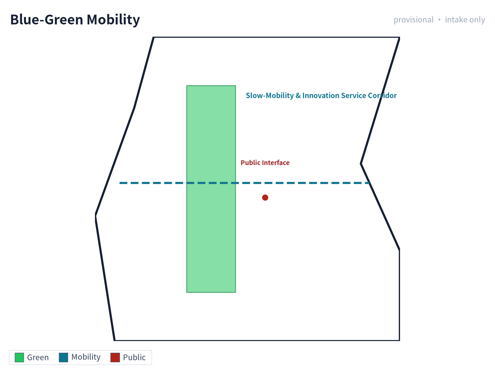

Municipal and public service facilities should cover AI industrial service facilities, innovation service platforms, talent life service facilities, new infrastructure, distributed energy, edge computing, and integration with traditional municipal facilities. The proposal should explain facility standards, spatial layout, service radius, operation model, and phased implementation logic. When engineering data such as pipelines, energy, drainage, flood control, and fire protection are missing, they should be listed as preconditions for formal deepening.

## Blue-Green Network, Public Space, and Urban Character

The blue-green network plan should take the JingZhang Heritage Park vitality belt as the spine, coordinate the Qinghe River, Xiaoyue River, and travel needs of surrounding universities, enterprises, and communities, and propose a north-south and east-west connected pedestrian, cycling, and green-space system. The proposal should identify slow-traffic breakpoints, overpass nodes, southern and northern landscape nodes of the park, and propose parking, sports, innovation communication, technology testing, application display, and public service composite-use strategies.

Blue-green public space is cross-checked by design depth items and green-space and public-space layers [depth:blue_green_public_space] [data:geometry/green_space.geojson#GREEN-001] [data:geometry/public_space.geojson#PUBLIC-001]. The design significance of green-space and public-space ratios is explained in the body, and complete recalculation is saved in `metrics.json`; the coordination of urban character, public space, and building control returns to the professional standards matrix [standard:MOHURD-URBAN-DESIGN-MEASURES].

The urban character plan should integrate the historical culture of the JingZhang Railway, the innovation culture of Zhongguancun, and the AI innovation culture, utilize cultural resources such as Tsinghua Garden Railway Station and Beijing Film Academy, and propose urban keynote, building character, roof form, massing, interface, and public art guidance. The agent should also propose signage, cultural symbols, international dissemination narratives, AI pilgrimage landmarks, contribution walls, or honor display systems, but all brands, fonts, images, portraits, and enterprise logos must have clearance-sourced origins. Character control should distinguish official control, design proposals, and pending conditions, and pseudo-precise control lines must not be given without cultural-heritage or regulatory-plan basis.

## Brand Visual System and Cultural Wayfinding

Following up on the "Urban Character" section's commitment to signage, cultural symbols, AI pilgrimage landmarks, contribution walls, and honor display systems, this section presents a brand visual system that is **original, clearance-cleared, and replicable**, ensuring that all visual output can shape a unified identity for "JingZhang Intelligence Loop" without introducing any unauthorized use of enterprises, institutions, individual portraits, or third-party brands. The system consists of six sub-systems; each sub-system produces one bilingual vector figure (PNG + SVG), totalling 12 figure files:

| Sub-system | Visual Carrier | Core Commitment | Figure Files |
| --- | --- | --- | --- |
| 01 Brand Identity | Ellipse orbit around the character "京" + 5-color palette + bilingual type stack | Logo and palette are original; all fonts are open-license or system-bundled | `assets/figures/brand-identity.png` / `.en.png` |
| 02 AI Innovation Ecosystem | University sourcing → open-source collaboration → enterprise translation → public experience → international dissemination (5-link closed loop) | Driven by the operating entity and annual activity system (see Renewal chapter) | `assets/figures/ecosystem-map.png` / `.en.png` |
| 03 Global AI City References | Helsinki / Amsterdam / Barcelona / Seoul / Montreal / Singapore (6 cities) | Public-reference material only; no government commitment or implementation arrangement | `assets/figures/global-ai-cases.png` / `.en.png` |
| 04 Three AI Pilgrimage Landmarks | Open-source release hall / international roadshow hall / Global AI Activity Week landmark (3 sites) | Conceptual proposal / reference scheme; not a confirmed government construction arrangement | `assets/figures/ai-landmarks.png` / `.en.png` |
| 05 Honor System + Component Library | 4-level contribution wall + 5 standardized components (bench / signage / charging post / computing kiosk / slow-traffic marker) | Standardized, replicable, low-intrusion; integrated into A3 booklet and A0 boards | `assets/figures/honor-component-library.png` / `.en.png` |
| 06 Cultural Wayfinding + Annual Operations | 4 cultural symbols (railway tie texture / AI node / railway arc / green loop) + Q1–Q4 seasonal rhythm | Symbols derived from JingZhang Railway and AI imagery; unified across signage and APP | `assets/figures/wayfinding-ops.png` / `.en.png` |

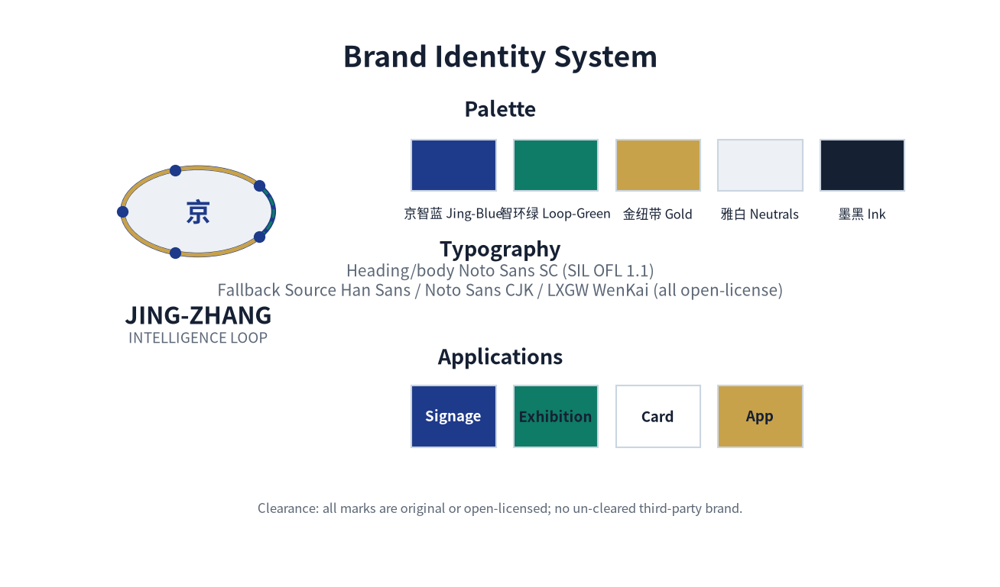

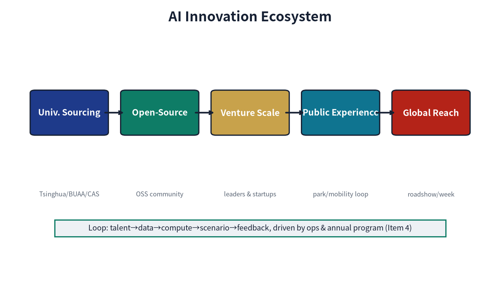

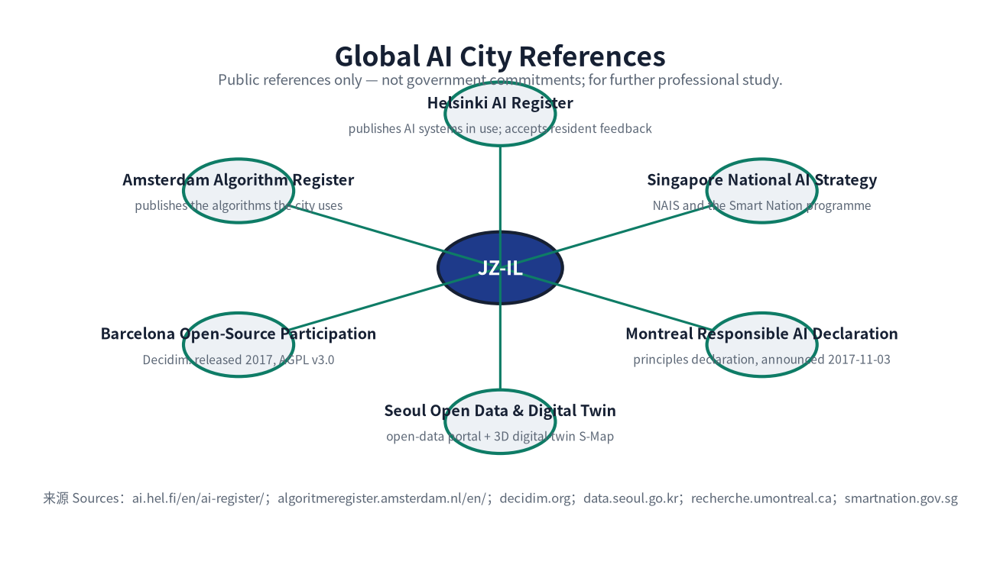

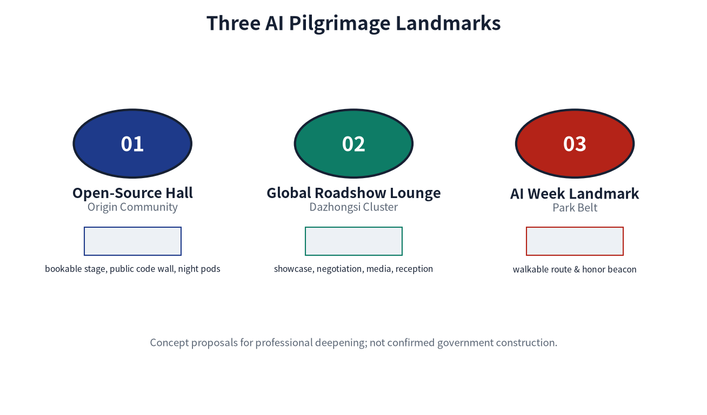

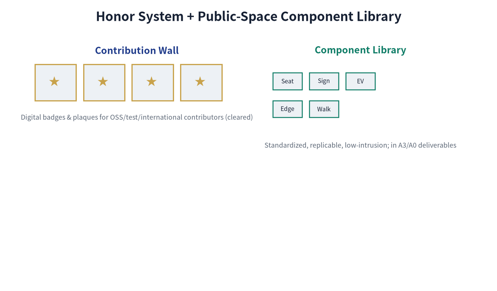

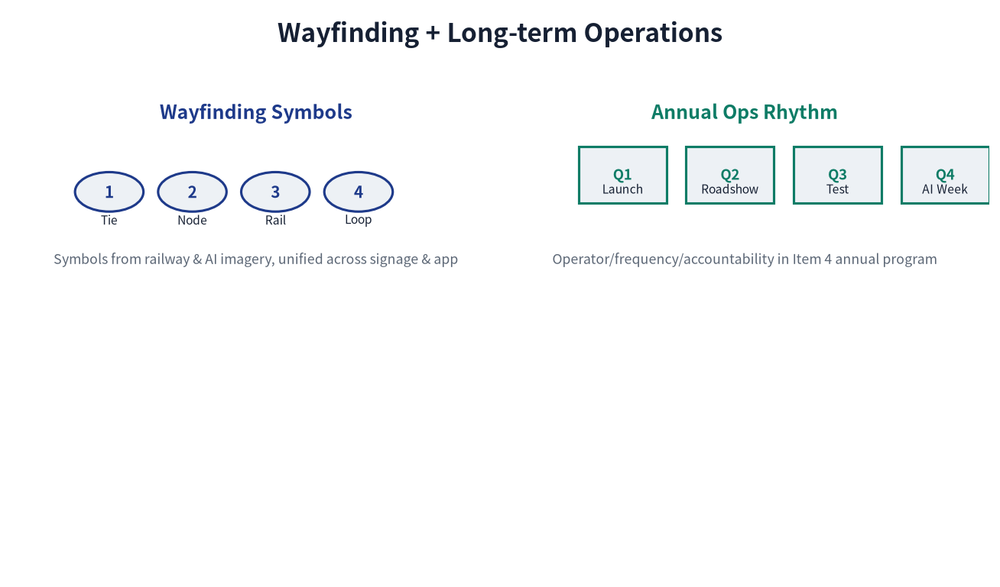

**Logo and palette.** The logo uses an elliptical orbit around the character "京" with four star nodes, symbolizing the centennial JingZhang Railway arc and the "ring + node" relationship of AI innovation nodes. The five-color palette (Jing-Blue / Loop-Green / Gold / Neutrals / Ink) is bilingually named to support both reviewers and future construction teams. The palette and logo contain no unauthorized elements from any enterprise, institution, artist, or third-party brand.

**Type stack.** All Chinese and Latin text uses **Noto Sans SC** (Regular / Bold, version 2.004, **SIL Open Font License 1.1**). The licence permits commercial use, modification, redistribution and embedding, so the figures, boards and web pages of this proposal remain fully cleared for publication beyond the review context. To guarantee correct rendering on any reviewer device, the four HTML pages embed a **per-page glyph subset** of this typeface inline as base64 (one Regular and one Bold face, distinguished explicitly by `font-weight`, with no remote font loading); the SVG `text` nodes in `visual/index.html` and the text in figures and PDFs use the same typeface or its vector outlines. Per-font, per-use licensing records are given in the `ASSET-FONTS` entry of `sources.json` and in `report/copyright_statement.md`.

**Originality and clearance statement.** All figures, logos, palette, type stack, and the "京" character composition in this section are original to this proposal or use open-source / public-domain material; they contain no enterprise LOGOs, individual portraits, unauthorized photography, or third-party brand symbols. "Global AI City References" cites public materials (URLs listed at the bottom of each figure: hel.fi, amsterdam.nl, barcelona.cat, data.seoul.go.kr, montrealdeclaration-responsibleai.com, smartnation.gov.sg, etc.) and does not constitute any government commitment or implementation arrangement. "Three AI Pilgrimage Landmarks" are conceptual proposals / reference schemes to be deepened by professional teams; they are not confirmed government construction arrangements. Each brand figure carries a footer disclaimer ("not a government commitment" or "not a confirmed government construction arrangement"), consistent with the Item 6 "Risk, Compliance, and Matrix Honesty" principle. The complete copyright and clearance statement is in `report/copyright_statement.md`.

**Relationship to operations and implementation.** The brand visual system serves as the visual anchor for the "annual activity system" and "operating entity" commitments in the Renewal and Implementation chapter: the "contribution wall / digital badge" of the honor system supports incentives for open-source contributors and testers; the "Q1 release season / Q2 roadshow season / Q3 test season / Q4 activity week" of cultural wayfinding matches the annual operations rhythm; the three AI pilgrimage landmarks correspond to the "Global AI Activity Week Route" scenario card. Any brand use must remain within the boundaries of the "annual activity system" and "operating entity" and must not be unilaterally extended to unauthorized commercial signage.

## Regional Coordination and the Beijing-Tianjin-Hebei Innovation Network

Building on the "Coordinated Research Area: Industry and Future City Research", this section clarifies the division of labor and coordination interfaces between JingZhang Intelligence Loop and surrounding innovation clusters and the Beijing-Tianjin-Hebei (Jing-Jin-Ji) city cluster, responding to the agent taskbook's requirement on regional linkage. All coordination is a suggested interface (not an established government arrangement); implementation must be premised on each entity's official planning and agreements.

| Coordination Object | Functional Positioning | Division of Labor / Interface with JingZhang Loop | Coordination Mechanism (suggested) |
| --- | --- | --- | --- |
| Beiwei Community | Adjacent residential and community-living bloc | Absorbs JingZhang Loop's slow-traffic commute, community-level service points, and public-participation closed loop; the daily-living hinterland of the "Key Areas" | Community council hall + co-built slow-traffic connecting signage |
| Future Science City | Central-SOE R&D headquarters and innovation source | Provides basic research and pilot resources; JingZhang Loop focuses on "open-source release + edge-computing station + scenario verification", forming a "source-verify-convert" relay | Joint open calls + mutual recognition of achievement registration |
| Huairou Science City | Major science facilities and frontier interdisciplinarity | Provides major S&T infrastructure and compute spillover; JingZhang Loop absorbs science-popularization, talent exchange, and activity-week linkage | Science Week + Global AI Activity Week mutual invitation |
| Economic-Technological Development Area (Yizhuang) | Smart manufacturing and industrial conversion | Provides manufacturing and mass-production scenarios; JingZhang Loop provides the incubation-to-production interface of the "Campus-Adjacent Achievement Translation Street" | Attraction-conversion chain + IP-evaluation interoperability |
| Beijing-Tianjin-Hebei City Cluster | Regional innovation factor flow | JingZhang Loop acts as a Beijing northwest innovation-corridor node, absorbing manufacturing / data / scenario spillover from Tianjin-Hebei and echoing Xiong'an New Area in innovation | Annual Activity Week + multilingual wayfinding regional linkage |

**Coordination principle.** The above coordination provides docking anchors only on reversible, low-threshold operating mechanisms such as "Open-Source Release Hall, Attraction-Conversion Chain, Global AI Activity Week"; it does not presuppose cross-administrative administrative consolidation. Any cross-entity implementation must return to each entity's (to-be-confirmed) responsible party and official planning for verification.

## Global AI Innovation City References (6)

Responding to the "five to eight global AI innovation city cases" requirement in the agent taskbook (agent.2), and following the global-vision commitments of the "Urban Character" and "Brand Visual System" sections, this section lists six international city references with publicly available sources. Each case is used only as conceptual reference and operational-mechanism comparison; none of them constitutes a government commitment or implementation arrangement. The overview figure is `assets/figures/global-ai-cases.png`.

| City | Verifiable public practice (this one item only, nothing beyond it) | Lesson Borrowed (Mechanism / Scenario) | Document-level Source |
| --- | --- | --- | --- |
| Helsinki | Municipal AI Register: publishes the AI systems the city uses and accepts resident feedback | Data-element governance -> Scenario card 08 Data-Element Reception Hall | `ai.hel.fi/en/ai-register/` (City of Helsinki) |
| Amsterdam | Municipal Algorithm Register (Algoritmeregister): publishes the algorithms the city uses | Algorithm-fairness audit -> AI slow-traffic navigation accessibility and fairness boundary | `algoritmeregister.amsterdam.nl/en/` (City of Amsterdam) |
| Barcelona | Open-source civic participation platform Decidim: released 2017, source code under GNU AGPL v3.0 | Public-feedback loop and open governance -> public feedback, pause and annual review mechanisms | `decidim.org`; corroborated by the European Commission page |
| Seoul | Municipal open-data portal (Open Data Plaza) + 3D digital-twin city platform S-Map | Digital expression of the blue-green slow-traffic composite loop and open data interfaces | `data.seoul.go.kr`; `smartcity.go.kr/en/boards/KeyCaseStudies/171` |
| Montreal | Declaration for a Responsible Development of AI: announced 2017-11-03 | Safety-governance sandbox responsibility boundary + human takeover | `recherche.umontreal.ca/...` (Universite de Montreal) |
| Singapore | National AI Strategy (NAIS) and the Smart Nation programme | National / city-level platform interfaces and phased implementation cadence | `smartnation.gov.sg/initiatives/national-ai-strategy` |

**Per-case verification record.** Every source above is a **document-level page** (not a portal home page), retrieved and read on 2026-08-29. Page title, publisher, publication/access date, reachability, the specific claim the source is able to support, and the licence/reuse boundary are recorded in the `document_level`, `page_title`, `publisher`, `supports_claims`, `supporting_quote` and `licence_reuse` fields of the corresponding entry in `sources.json`, so reviewers can check each one.

**Three unsupported statements removed (honest correction).** Earlier revisions described these cities as the source of a "city AI agreement", a "public-space digital twin" and "edge computing". Verification found **no document-level evidence supporting any of the three**, and they have been removed:

- **"City AI agreement"**: what Amsterdam verifiably operates is an **algorithm register**; no official instrument named a "city AI agreement" exists. Removed.
- **"Public-space digital twin"**: Barcelona's verifiable practice is the open-source participation platform Decidim; no official Barcelona public-space digital-twin project was found. Removed from the Barcelona row. The **digital-twin** concept in this proposal is now anchored to Seoul's S-Map, which is officially documented.
- **"Edge computing"**: Singapore's verifiable practice is the National AI Strategy and the Smart Nation programme; its official pages do not cover edge computing. **Edge computing appears in this proposal only as the submitter's own design proposal** (see Scenario card SCN-03 and the design-depth matrix), never as a factual claim about Singapore.

**Borrowing-mode statement.** These six cases are conceptual references for the operational mechanism and scenario design of this proposal, and do not replicate any city's statutory plan, built form, or government brand. Each case is cited as fact **only within the scope listed in its `supports_claims` field**; anything beyond that scope is not asserted as fact. All borrowings return to specific spatial nodes (blue-green composite loop, JingZhang Heritage Park slow-traffic belt), AI scenario cards (01-10), or operational mechanisms (annual activity system, Q1-Q4 cadence) of this proposal, and are not extrapolated into an overall plan clone.

## Renewal Projects, Implementation Policy, and Phasing

The implementation plan should form a reviewable renewal project list, explaining project location, type, function, responsible entity, dependencies, implementation stage, risks, and evaluation indicators. Policy recommendations should cover urban renewal coordinated implementation, spatial supply, operation mechanism, industrial services, public participation, data governance, and property-rights coordination. `geometry/phasing.geojson` should express phasing scope, and `compliance_matrix.json` should link each task to phasing and drawings.

The project list and phasing depth are managed by [depth:renewal_project_list] and [depth:phasing_implementation], and phasing spatial evidence is [data:geometry/phasing.geojson#PHASE-001]. If property rights, funding, implementation entities, and approval paths are absent, the proposal must write them as implementation risks rather than commitments to deliver.

> Note: the "Responsible Entity" column below is a *suggested division of labor*, not a settled arrangement; the final result is subject to government approval, attraction/recruitment, and property-rights confirmation, and does not constitute an implementation commitment.

| Project ID | Project Name | Type | Main Dependencies | Responsible Entity | Current Deliverable (Near-term) | Phase Gate | Acceptance Indicator | Exit Mechanism | Evidence Reference |
| --- | --- | --- | --- | --- | --- | --- | --- | --- | --- |
| JZ-01 | JingZhang Heritage Park slow-traffic breakpoint stitching | Public space / transport | Road redline, under-bridge space, transport organization recheck | Haidian District Urban Management Committee + JingZhang Park Management + local sub-district | Wayfinding completion + under-bridge space pilot signage | Road redline + under-bridge property-rights confirmation | Breakpoint-fix closed-loop days <= 7 | If under-bridge space cannot be opened, reroute detour | [data:geometry/roads.geojson#ROAD-001] |
| JZ-02 | Zhongzhi Garden Qinghe innovation interface | Blue-green space / industrial display | River blue line, ecology and flood-control conditions | Zhongzhi Garden operator + Haidian District Water Bureau | Riverside walkway signage + stormwater sensor pilot | River blue line + flood-control assessment | Flood-season safety drill passed | If flood control fails the standard, downgrade to landside display | [data:geometry/green_space.geojson#GREEN-001] |
| JZ-03 | Origin Community campus-adjacent achievement translation street | Urban renewal / industrial services | Campus boundary, property rights, ground-floor uses | Haidian District + university tech-transfer office + local sub-district | Ground-floor use guideline + one demonstration block | Campus boundary + property-rights confirmation | Signed-conversion count >= baseline | If ground-floor uses cannot be reorganized, switch to online services | [data:geometry/buildings.geojson#BLDG-001] |
| JZ-04 | Dazhongsi Station four-quadrant pedestrian connectivity | Rail integration / slow traffic | Rail station, road intersection, municipal pipelines | Beijing MTR + local sub-district + municipal authority | Crossing-facility siting study + temporary wayfinding | Rail + road + municipal-pipeline integrated review | Four-quadrant pedestrian connectivity 100% | If pipelines are too complex, implement in phases | [data:geometry/public_space.geojson#PUBLIC-001] |
| JZ-05 | AI public services and edge-computing nodes | New infrastructure / public services | Energy, computing, safety, and operating entity | Computing service provider (TBD) + venue property + Haidian District | One pilot station + energy PUE baseline | Energy + computing + safety + operating entity | PUE <= 1.3, availability >= 99% | If energy target fails, reduce scale | [data:geometry/constraints.geojson] |
| JZ-06 | Global AI Activity Week public route | Operation / branding | Public space permits, activity safety, copyright clearance | Haidian District + partner bodies | Wayfinding + one trial run | Public space permit + safety + clearance | Participants, media exposure, zero safety incidents | If clearance fails, downgrade to internal roadshow | [data:geometry/phasing.geojson#PHASE-001] |

**KPI scope, baseline, and target status (suggested).** The quantitative indicators below are all design-suggestion targets. Formal operating baselines are absent at present and must be calibrated after pilot/operational measurement; they are not used as approval or final-review basis, and retain the `provisional_estimated` flag:

- **Breakpoint-fix closed-loop days <= 7**: Measurement scope = calendar days from public/inspection report to closed-loop repair; Baseline = measured current-cycle status after the open call (to be supplemented); Measurement period = quarterly; Suggested target = achieved on the lightweight-pilot segment first, after the preconditions are confirmed.
- **Four-quadrant pedestrian connectivity 100%**: Measurement scope = accessible intersections / total intersections (PHASE-001 scope); Baseline = current-connectivity-gap survey (to be supplemented); Measurement period = annual; Suggested target = after rail + road + municipal-pipeline integration.
- **PUE <= 1.3**: Measurement scope = annual total station energy / IT-equipment energy; Baseline = industry reference value for comparable edge nodes (to be measured in this project); Measurement period = monthly; Suggested target = after one pilot station stabilizes.
- **Availability >= 99%**: Measurement scope = available time / total time; Baseline = to be measured; Measurement period = monthly.

#### Investment Estimate and Funding Channels (relative scale, indicative only)

Investment for JZ-01 to JZ-06 is expressed as a **relative scale** and is intended **only for feasibility ranking and phasing decisions**. **This table is not a budget, not a quotation, and not a funding commitment**, and provides **no monetary amount and no aggregate** (before the official regulatory plan, property rights, municipal and cost basis are determined, any monetary figure would be unsupported pseudo-precision). All amounts must be recalculated at the formal scheme stage by a cost or engineering consultancy with the appropriate qualifications, on the basis of official regulatory plan, property-rights and municipal conditions, and updated whenever those conditions change.

| Project | Relative investment scale | Main components | Indicative funding channel | Uncertainty | Recalculation trigger |
| --- | --- | --- | --- | --- | --- |
| JZ-01 | Low (lightweight pilot) | Wayfinding system, pilot under-bridge signage, gap survey | District urban-renewal fund + park O&M budget | Medium | After road redline confirmation and under-bridge property rights are clear |
| JZ-02 | Low-medium (riverside pilot) | Riverside walkway signage, storm sensing pilot, ecological repair | Urban-renewal fund + water authority programme | Medium-high | After river blue line and flood assessment are complete |
| JZ-03 | Medium-high (street-section retrofit) | Ground-floor use guidance, demonstration street section, tenant attraction | Social capital (owner/operator) + district industry guidance fund | High | After campus boundary and property rights confirm and re-tenantability is assessed |
| JZ-04 | High (main works) | Crossing siting study, construction, interim wayfinding | Transit-integration funding + municipal/district finance + transit entity | High | After the combined transit, road and utility scheme is fixed |
| JZ-05 | Medium (station retrofit) | Pilot station retrofit, compute and power distribution, energy monitoring | Attracted enterprise self-funding + energy performance contracting | Medium-high | After energy capacity, compute selection and operator are determined |
| JZ-06 | Medium (annual operation) | Wayfinding, trial-run organisation, safety and rights clearance | Event revenue + cleared sponsorship + district culture/brand budget | Medium | After public-space permit, safety assessment and rights clearance |

**Relative-scale note.** This table deliberately provides **no monetary amounts and no aggregate** — before the official regulatory plan, property rights, municipal conditions and cost basis are determined, any monetary figure would be an unsupported pseudo-precision. The relative scale follows the **scope of works and implementation depth** of each project: wayfinding/signage/pilot items are lightweight, street-section and crossing facilities are main-works level, and annual operation is operational level. It is used for feasibility ranking and phasing decisions only; JZ-04 (the crossing works) is the highest-cost item and JZ-03 the next.

**Estimation method.** This table **does not provide quantities, unit prices, contingencies or price points**: those require official regulatory plan, property rights, bill-of-work and price information that are not available at this stage. At formal stage, a cost or engineering consultancy with the appropriate qualifications must produce **an investment estimate (with estimation notes, contingencies, price points and uncertainty ranges)** on the basis of official materials, then recalculate and update this table. **This table is not a budget, not a quotation, and not a funding commitment.**

**Note on funding channels.**

**Note on funding channels.** The indicative channels above are **directions** corresponding to conventional practice in Chinese urban renewal, transit integration and new infrastructure. They do not represent any arrangement that has been secured, and they are not commitments. The specific channel, proportion and timing must be determined by the responsible entity through the statutory project-approval, approval and procurement processes.

#### Implementation Precondition Matrix

The six JZ projects are gated by three classes of preconditions. This matrix makes explicit which actions depend on which preconditions and what must be confirmed before any on-site activity may begin, so that pending conditions are never presented as settled arrangements:

| Project | Statutory precondition (official confirmation) | Technical precondition (professional review) | Property precondition (agreement or confirmation) | Current status |
| --- | --- | --- | --- | --- |
| JZ-01 | Road redline; lawfulness of under-bridge use | Traffic organisation review; structural safety assessment | Under-bridge ownership / management right | Statutory and property **both unconfirmed**; on-site pilot (wayfinding, under-bridge) may only proceed after these preconditions are confirmed (not a commitment; no authorisation of on-site work under uncertainty) |
| JZ-02 | River blue line; flood assessment; ecological control | Hydrology and flood review; sensor siting | Riverside land ownership | Statutory **unconfirmed**; on-site pilot (signage, sensing) may only proceed after these preconditions are confirmed (not a commitment; no authorisation of on-site work under uncertainty) |
| JZ-03 | Regulatory land use and intensity; legality of ground-floor use guidance | Structural and fire review | Campus boundary; ground-floor title | All three **unconfirmed**; on-site work may only begin after the preconditions are confirmed (not a commitment; no authorisation of on-site work under uncertainty) |
| JZ-04 | Road redline; transit protection zone; utility corridors | Crossing structural review; utility coordination | Land ownership in the four station quadrants | All three **unconfirmed**; on-site work may only begin after the preconditions are confirmed (not a commitment; no authorisation of on-site work under uncertainty) |
| JZ-05 | Planning conditions for energy and compute facilities; data-security compliance | Power supply capacity; PUE calculation; safety assessment | Station site ownership and operating authorisation | All three **unconfirmed**; on-site pilot may only begin after operator attraction and the preconditions are confirmed (not a commitment; no authorisation of on-site work under uncertainty) |
| JZ-06 | Public-space event permit; foreign-related activity approval | Safety assessment; crowd management | Venue use authorisation; copyright clearance | Permit and clearance **both unconfirmed**; on-site trial run may only proceed after these preconditions are confirmed (not a commitment; no authorisation of on-site work under uncertainty) |

#### Implementation Phasing (Near-term / Mid-term / Long-term)

Phasing is strictly distinguished from the 100-day open-call design cycle: the open-call cycle is the time requirement for submitting deliverables, while implementation phasing is the advancement path for urban renewal and project construction. This proposal assigns the six JZ projects to three time bands and labels the boundary between what can be initiated with lightweight measures and what must await preconditions:

| Time band | Scope | Initiated projects | Initiation conditions | Note |
| --- | --- | --- | --- | --- |
| Near-term 0-12 months | Lightweight pilots | JZ-01 wayfinding/under-bridge pilot, JZ-02 riverside signage/stormwater sensor, JZ-06 trial run | **All on-site actions are conditional: redline, blue line, ownership, permits, clearance and safety assessment must all be confirmed before any on-site activity begins.** This proposal covers research and written preparation only at this stage and does not authorise on-site work (not a commitment) | Suggested led by local sub-district + park management (pending confirmation); the timing of any start depends on the confirmation of the relevant preconditions after the open call (not a commitment) |
| Mid-term 1-3 years | Main renewal | JZ-03 ground-floor uses, JZ-04 crossing facility, JZ-05 edge-computing station | Requires official regulatory plan, road redline, municipal and energy conditions | In parallel with official regulatory-plan compilation and municipal overhaul |
| Long-term 3-10 years | Governance framework | Annual activity system matured, attraction-conversion chain running, international dissemination mechanism | Requires annual evaluation and strategy iteration | Suggested led by Haidian District (pending confirmation), as the annual review and strategy-update mechanism |

#### Phasing Acceptance Criteria and Verifiable Deliverables

So that phasing is not measured by time alone, this table lists, for each time band, the **verifiable deliverables, the acceptance method and the indicative responsible party**. All methods are procedural suggestions; the binding acceptance documents are those determined by the responsible entity through the statutory process.

| Time band | Verifiable deliverables | Acceptance method (procedural suggestion) | Indicative responsible party | If not achieved |
| --- | --- | --- | --- | --- |
| Near term 0-12 months | (i) slow-traffic gap survey report; (ii) wayfinding implementation drawings and completion records; (iii) pilot under-bridge signage; (iv) storm-sensing locations and data-interface specification; (v) activity-week trial-run record and safety review | Deliverables complete and signed off by the responsible party; sensor data routed into the existing compliance-audit channel; zero safety incidents in the trial run | Local subdistrict office + park management office (indicative, to be confirmed) | An unmet item rolls into the next band; main works do not start on the strength of incomplete items |
| Mid term 1-3 years | (i) ground-floor use guidance and demonstration street completion acceptance; (ii) crossing siting study and works acceptance; (iii) compute station acceptance with first-cycle PUE and availability measurement | Statutory acceptance procedures completed; KPIs measured over one full cycle and compared with design targets | Haidian District + university technology-transfer office + transit and utility bodies (indicative, to be confirmed) | Triggers the exit mechanism (see the "Exit mechanism" column of the project table) or downgrades to a light version |
| Long term 3-10 years | (i) annual activity system operating report; (ii) attraction-conversion chain statistics; (iii) annual review and strategy update document; (iv) public-feedback closed-loop ledger | Annual evaluation completed with the reasons for adjustments published; public-feedback response rate and pause mechanism traceable | Haidian District lead + annual review mechanism (indicative, to be confirmed) | Two consecutive years of shortfall triggers a strategy reassessment rather than continuing ineffective investment |

#### Implementation Risk Register

This register states conditions that are not yet in place as risks rather than as commitments to deliver. Probability and impact are subjective gradings (high/medium/low) used for ranking and contingency planning; they are not a quantified risk assessment.

| # | Risk | Probability | Impact | Response | Reassessment trigger |
| --- | --- | --- | --- | --- | --- |
| R1 | Official regulatory plan and road redline remain unconfirmed for a long period | High | High | Research and written preparation only; no on-site activity is scheduled (including lightweight pilots) until the regulatory plan and redline are confirmed | Official plan or redline issued for this area |
| R2 | Under-bridge ownership or management right unclear | Medium | Medium | Reroute, or implement land-side wayfinding only | Ownership confirmed or managing body identified |
| R3 | River blue line or flood assessment not satisfied | Medium | High | Downgrade to land-side display; drop riverside facilities | Flood assessment conclusion issued |
| R4 | Campus boundary or ground-floor title dispute | Medium | Medium | Move to online service; defer physical works | Boundary and title confirmed |
| R5 | Utility complexity forces phased delivery of the crossing works | High | Medium | Deliver in phases; complete interim wayfinding first | Combined utility scheme determined |
| R6 | Energy capacity or compute cost exceeds expectations | Medium | Medium | Reduce pilot scale or change the technical route | Power supply scheme and measured energy use determined |
| R7 | Event copyright or foreign-related content clearance fails | Medium | Medium | Reduce to an internal roadshow; stop external dissemination | Clearance conclusion issued |
| R8 | Personal-information compliance review not passed | Medium | High | Suspend the affected scenario; resume after the assessment | Personal-information impact assessment completed |
| R9 | Operating entity or responsibility allocation not settled | High | High | Defer until the responsible entity is identified | Responsible entity formally determined |
| R10 | Funding channel not secured | Medium | High | Reduce scope or defer until funding is in place | Project approval and funding arrangement granted |

**Note on the register.** R1, R5 and R9 are the principal sources of implementation uncertainty at present. All three are **matters led by the organiser or the responsible entity** and cannot be removed by the participant. The principle applied here is to make uncertainty explicit and provide alternative paths, rather than to present pending conditions as confirmed delivery commitments.

#### Annual Activity System (Q1-Q4 cadence)

Following the "Brand Visual System" chapter's commitment to an "annual activity system", this proposal provides the Q1-Q4 quarterly operational cadence, mapping scenario cards, operating entities, and conversion paths. The annual activities keep a conceptual reference relationship with the "Global AI Innovation City References" six cases and do not replicate their government programs:

| Quarter | Theme | Core scenarios | Operating entity | Conversion path | Risk boundary |
| --- | --- | --- | --- | --- | --- |
| Q1 (Jan-Mar) | Release season | Scenario 01 Open-Source Release Hall | Haidian District S&T Committee + university open-source alliance | Achievement release -> media coverage -> university PR inclusion | No individual behavior tracking; agenda double-signed |
| Q2 (Apr-Jun) | Roadshow season | Scenario 05 Dazhongsi International Roadshow Living Room + Scenario 07 Campus-Adjacent Achievement Translation Street | Property + international event operator + university tech-transfer office | Roadshow -> investment-financing docking -> signed landing | Foreign-related content review; financing by licensed institutions |
| Q3 (Jul-Sep) | Test season | Scenario 02 Safety-Governance Sandbox + Scenario 03 Edge-Computing Station + Scenario 08 Data-Element Reception Hall | National AI evaluation body (TBC) + computing service provider + data exchange | Model evaluation -> risk certificate -> compute-hour bill -> data product | High-risk termination by operator; sensitive fields desensitized |
| Q4 (Oct-Dec) | Activity week | Scenario 10 Global AI Activity Week Route | Haidian District + partner bodies | Route wayfinding -> media dissemination -> international guest invitation | Safety filed with public security/fire control; foreign-related events specially approved |

#### Developer Community, Scenario Opening, and Attraction-Conversion Chain

**Developer community mechanism.** Suggested jointly led by Haidian District S&T Committee and the university open-source alliance (pending confirmation), with open-source license verification, contribution wall, digital badge, and PR/Issue counting incentives; community activity data are used only for aggregate statistics, without individual behavior tracking and without commercial recommendation. Community operations dock directly with Scenario 01 Open-Source Release Hall and the "red-team testing" channel of Scenario 02 Safety-Governance Sandbox.

**Scenario opening rules.** Three-tier management: (a) **Industrial test-verification scenarios** (02, 03, 08) require authorization application + compliance audit, opening through an "apply-audit-sandbox-exit" process; (b) **Public service scenarios** (01, 04, 06, 07, 09) are free to the public with desensitized aggregate data release; (c) **Operation activity scenarios** (05, 10) require public security/fire control filing and foreign-related special approval, with sensitive topics suspended. All scenario "apply-audit-open" records enter the operation sub-table of `compliance_matrix.json`, traceable item by item.

**Attraction-conversion chain.** Suggested jointly built by Haidian District, university tech-transfer offices, and licensed investment institutions (pending confirmation), with the path "university achievement registration -> IP evaluation -> incubation docking -> investment-financing -> signed landing", corresponding to the legal/IP/financing service nodes of Scenario 07 Campus-Adjacent Achievement Translation Street; each step is operated by the corresponding licensed institution, and unlicensed institutions are not allowed to intervene in the financing step.

**International dissemination.** Suggested (pending confirmation) to establish an information-exchange and mutual-invitation mechanism with the "Global AI Innovation City References" six cases, and the media coverage and multilingual wayfinding of the annual activity week are suggested to be uniformly released by Haidian District and partner bodies (pending confirmation); any external release must return to `sources.json` to verify accessibility and licensing.

## Public Interest and Inclusivity

Following the scenario cards' requirements for "human takeover" and "special groups", and responding to the public_compliance and vulnerable-group inclusiveness requirements of the agent taskbook, this chapter gives the independent needs and risk responses of five vulnerable groups, the three-piece accessibility set of AI slow-traffic navigation, and the public-participation closed loop.

### Vulnerable-Group Needs and Risk Responses

| Group | Typical Needs | Space / Service Response | Risk and Boundary | Self-check / Fallback |
| --- | --- | --- | --- | --- |
| Elderly (>=60) | Low-intensity walking, clear wayfinding, nearby services, emergency help | Gentle-slope priority on JingZhang Heritage Park slow-traffic belt + rest seats along the route + embedded community services | Nighttime solo travel safety; no behavioral-profile collection | On-site security/volunteer patrol; one-button property call |
| Disabled (visual / hearing / mobility) | Accessible path, tactile/auditory cues, reachability | Accessibility ramps, tactile paving, vibration indicators, caption/sign-language APP, bookable on-site assistance | Breakpoint information must be truthful; no false "open" reporting | Disabled-person representatives participate in wayfinding acceptance |
| Children (<=14) | Safe school commute, parent visibility, slow-traffic priority | School-zone speed limits, AI slow-traffic navigation child mode, parent-side view of aggregated arrival/departure status only (no individual trajectory) | No precise child trajectory collection; location access limited to aggregated statistics and arrival/departure status query; guardian explicit authorization + on-device desensitization + retention <= 30 days + deletion on expiry + revocable at any time; non-smart fallback required; individual-tracking capability that fails minimum-necessity or retention rules is disabled | Parent authorization; school + sub-district double-sign; features failing minimum-necessity and retention are not enabled |
| Low-digital-skill population | Non-smart alternative channels, in-person consultation, paper wayfinding | Community service points with face-to-face consultation, paper maps, manual windows | No mandatory APP use for public services | Offline channels retained for all public services |
| Night workers (22:00-06:00) | Safe night walking, low-disturbance lighting, emergency response | Tiered smart lighting, nighttime safety-perception sensors (Scenario 06), 24h emergency contact | Noise-disturbance boundary; no full-time high-frequency collection | Property + sub-district emergency response; noise-complaint closed loop |

#### Accessibility and Inclusion Design Basis (National Standards)

The inclusion measures in this proposal do not invent their own thresholds; they align with the classifications and indicators of current national standards. The numbers, publication and effective dates below have been checked against information published by the responsible national authority. **Design and acceptance must follow the versions in force**; if a standard is revised or replaced, the corresponding provisions of this proposal are updated accordingly.

| Standard | Title | Published / Effective | Nature | Corresponding content in this proposal |
| --- | --- | --- | --- | --- |
| GB 55019-2021 | General Code for Accessibility of Buildings and Municipal Engineering Projects | Published 2021-09-08 / **effective 2022-04-01** | **Mandatory engineering construction code; all provisions must be strictly implemented.** Where provisions of existing standards conflict with this code, this code prevails | Accessible ramps, tactile paving, audible pedestrian signals, accessible toilets, accessible signage systems |
| GB 50763-2012 | Code for Accessibility Design | Published 2012-03-30 / effective 2012-09-01 | National standard (current); where inconsistent with GB 55019-2021, the latter prevails | Kerb ramps, tactile paving, wheelchair ramps, accessible routes, accessibility requirements for urban green space and squares |
| GB 50180-2018 | Standard for Urban Residential Area Planning and Design | Published 2018 | National standard; clause 4.0.4 is mandatory (residential areas at every living-circle level shall be provided with public green space) | Living-circle classification; service radius for public service facilities and public green space (see the next subsection) |

**Note on the basis.** The **numeric provisions of these standards (gradients, widths, handrail heights, tactile paving dimensions, and so on) are neither restated nor independently set in this proposal.** At formal design stages they must be implemented item by item by a design institute with the appropriate qualifications, in accordance with the standards in force. This proposal registers the standards as its design basis only, so that a concept design is never allowed to substitute for statutory technical requirements.

#### Service Radius and Coverage Measurement (straight-line approximation, to be recalculated)

Using the living-circle classification of GB 50180-2018, coverage is measured by **walking service radius** from public space and public service nodes:

| Living-circle level | Standard walking distance | Coverage definition | Measured on the current layers (straight-line) | Data status |
| --- | --- | --- | --- | --- |
| Five-minute living circle | 300 m | Share of the site within 300 m of the nearest public-space node | **2.5%** | Lower bound; does not represent design intent |
| Ten-minute living circle | 500 m | As above, threshold 500 m | **6.1%** | Lower bound; does not represent design intent |
| Fifteen-minute living circle | 800-1,000 m | As above, threshold 1,000 m | **18.1%** | Lower bound; does not represent design intent |

**Method and three important limitations (to be read together with the figures).**

1. **The layer is under-registered.** `geometry/public_space.geojson` currently registers only **one** "public interface" node, while the public-space system described in the narrative and the scenario cards (scenarios 01-10, the blue-green slow-traffic composite loop, the JingZhang Heritage Park slow-traffic belt, and others) contains considerably more. The figures above therefore measure **the current state of the layer, not the intent of the design**, and must not be used to judge the coverage performance of this proposal.
2. **Straight-line distance is not walking distance.** The measurement uses planar straight-line distance after latitude/longitude projection (converted at the latitude of the site centre) and does not account for network detours, barriers formed by the river or the railway, or the location of crossing facilities. Real walking coverage is typically **lower** than the straight-line figure.
3. **The site is of a different nature.** The overall design scope is approximately 11.35 km2 and is an industry and innovation belt rather than a single residential area. The living-circle classification and its relationship to residential population are used here **only as a methodological reference for service radius**, not as a determination of residential scale.

**Recalculation trigger.** Once public-space and public-service nodes are fully registered in the GeoJSON layers in line with the design, and once network data is available, the three coverage levels must be recalculated. Until that registration is complete, this table must not be cited as a basis for evaluating the performance of the proposal.

#### Group Needs, Spatial Carriers, Service Provision and Verifiable Indicators

To support acceptance and review, the needs of the five groups are mapped onto **specific spatial carriers, service provision and verifiable indicators**. All current values are `provisional_estimated` or `unknown_baseline`; **no measured baseline exists yet**, and the indicators must be calibrated against measurements taken during pilots or operation using the definitions below. The definitions themselves are methodological suggestions; the binding acceptance requirements are those determined by the responsible entity through the statutory process.

| Group | Core need | Spatial carrier | Service provision | Verifiable indicator (definition / baseline) |
| --- | --- | --- | --- | --- |
| Older people (60+) | Low-intensity continuous walking; nearby rest and assistance | Gentle-gradient sections of the JingZhang slow-traffic belt; rest points along the route; embedded community service points | Gentle-gradient priority navigation; seating; one-call assistance to property management | Share of gentle-gradient sections in the slow-traffic belt (baseline to be surveyed); spacing between rest points (suggested 500 m or less, to be verified); call response time (baseline to be measured) |
| People with disabilities (visual / hearing / mobility) | Continuous accessible passage; multi-sensory cues | Accessible ramps; tactile paving; audible crossing signals; accessible toilets | Accessibility-priority routing; vibration and voice cues; bookable on-site assistance | Number of barrier-free crossings / total crossings (baseline: survey of existing connectivity gaps, to be completed); tactile paving continuity rate (to be surveyed); pass rate in verification by representatives of people with disabilities (no baseline; to be established after pilots) |
| Children (14 and under) | Safe school travel; aggregated visibility to parents | Speed-restricted zones around schools; school-travel priority routes | AI slow-traffic navigation child mode; aggregated arrival/departure status for parents | Coverage of speed restriction on school-travel routes (to be surveyed); availability of the aggregated status query (to be measured); time to honour a consent withdrawal request (to be measured) |
| People with low digital skills | Access to public services without smart devices | Community service points; paper wayfinding boards; staffed counters | Face-to-face advice; paper maps; staffed counters | Number of public services covered by an offline channel / total (baseline to be surveyed); density of paper wayfinding points (to be surveyed) |
| Night workers (22:00-06:00) | Safe night travel; low-disturbance lighting; emergency response | Graded night-lighting sections; 24-hour service points | Graded smart lighting; night-safety sensing (Scenario 06); 24-hour emergency contact | Share of sections meeting night-lighting requirements (to be surveyed); emergency response time (to be measured); closure rate of noise complaints (baseline to be established) |

#### Personal Information Lifecycle Register (Scenarios 05/07/09/10 and children's arrival/departure)

For scenarios that involve personal information, this proposal maintains a unified **personal-information lifecycle register** that links collection, use, storage, deletion, data-subject rights, publication and security into one verifiable chain. The legal basis cites the Personal Information Protection Law of the People's Republic of China (PIPL, adopted 2021-08-20, effective 2021-11-01, registered in sources.json as LAW-PIPL-2021). The fields, retention periods and recipients below are **proposed design definitions and are subject to the entrusted-processing arrangements or PIPIA conclusions determined by the responsible entity under law**; this proposal neither restates nor rewrites the statutory text.

| Processing activity | Minimal fields (data items) | Legal basis (PIPL) | Retention and deletion | Data-subject rights | Recipients and publication limits | Security and human review | Activation conditions |
| --- | --- | --- | --- | --- | --- | --- | --- |
| SCN-05 Dazhongsi International Roadshow Lounge (roadshow applications / media lists) | Company name; contact person (name, title, contact details); roadshow topic and materials; media organisations and journalist lists (press cards, intended coverage) — **limited to what is necessary for organising the event** | Explicit consent of the applicant (PIPL art. 13(1)) + necessity for the event-organisation contract; data minimisation (art. 6) | 12 months after the event closes (subject to the responsible entity); earlier deletion on request; media lists deleted after settlement and coverage cycles | Access, copy, correction, deletion and withdrawal of consent (arts. 45-47, 15); withdrawal possible before foreign-content review | Only the event organiser/co-organiser, venue property management and security filings; publication limited to the confirmed schedule and coverage scope, **contact details never published** | Encrypted storage + least-privilege access; foreign-related content is subject to **human review** by the operator before publication | Explicit consent obtained + operator mandate confirmed; offline registration channel runs in parallel |
| SCN-07 Campus-adjacent Technology-Transfer Street (achievement registration / IP assessment / investment interest) | Achievement title, category and stage; inventor affiliation and name; IP status; contact details of interested investors — **limited to what is necessary for the transfer match** | Institutional consultation + explicit consent of the achievement owner/inventor; investor contact based on consent of the parties (art. 13(1)) | Retained for the life of the project; deleted on project close or withdrawal of interest; IP status follows the legal register | Access, correction, deletion and withdrawal by the inventor (arts. 45-47, 15) | University technology-transfer office, park operator, licensed investment institutions, professional law firms (all under confidentiality); publication limited to consented achievement notices (title/category/stage, **no contact details**) | Legal/IP reviewed by professional law firms; financing handled by licensed institutions; investment-interest fields encrypted with access control | Mandate confirmed + owner consent; compliance review passed by the university technology-transfer office |
| SCN-09 AI Lifestyle Service Street (resident service requests) | Service type; contact channel (phone/address as needed); preferred service time — **de-identified by default; no identity-irrelevant fields collected** | Resident's consent (withdrawable, art. 13(1)); de-identified statistics on statutory/public-interest grounds (art. 13(3)) | Service ledger retained 6 months (subject to confirmation with the subdistrict office), deleted on expiry or withdrawal; **de-identified aggregates** may be retained for statistics (not traceable to individuals) | Same as above (arts. 45-47, 15); withdrawal of consent **does not deny offline service** | Subdistrict office, property management, service providers; publication limited to de-identified summaries (response time, satisfaction), **individual requests never published** | End-device/transport encryption; requests from older people, people with disabilities and children are backed by **human service** | Resident's explicit consent + subdistrict mandate confirmed; non-digital channels run in parallel |
| SCN-10 Global AI Activity Week Route (event registration / venue booking) | Registrant name, ID category and number (for foreign-related identity-verification scenarios), contact details, booked time slot — **limited to event organisation and security filings** | Registrant consent + necessity for event organisation (art. 13(1)) + statutory duty for security filings (art. 13(3)) | Retained after the event for the period required by the security-filing rules (determined by the competent authority), then deleted; registration data **never used for marketing** | Same as above (arts. 45-47, 15); cancellations delete the booking information | Organiser, security-filing authorities, venue, media; publication limited to the confirmed schedule and guest list | Identity data encrypted and de-identified at rest; separate approval for foreign-related events; media dissemination subject to **human review** by the operator | Event approved (including foreign-related approval) + registrant consent; no collection before approval |
| Children's arrival/departure (parent-side aggregated status) | **Only** an aggregated "arrived/left" status (cohort-level, not individual) and a one-time device authorisation; **no precise trajectories and no individual profiles of children** | **Explicit consent of the guardian (PIPL art. 31, the special rule for children's personal information)** + necessity of the school-subdistrict coordination service | **Retention of 30 days or less, with automatic deletion on expiry (end-device de-identification)** | Guardian access and withdrawal; immediate stop and deletion on withdrawal (arts. 15, 47) | Only the school and the parent side; **never published, never transferred abroad, never used commercially** | End-device processing first (data stays on school premises) + cohort aggregation; guardian authorisation + school/subdistrict countersignature; abnormal access subject to **human review** | Guardian's explicit authorisation + school/subdistrict countersignature + minimisation and retention checks passed; **individual-tracking functions are not activated unless these conditions are met** |

**Unified principles.** (1) Minimisation first: no processing activity collects fields other than those listed; (2) deletion as the default: data is actively deleted once the purpose is achieved or no longer necessary (art. 19), and retention never exceeds what the purpose requires; (3) withdrawal without penalty: withdrawal of consent never results in denial of offline/human service; (4) strictest treatment of children: personal information of minors under 14 is always processed under guardian consent, shortest retention and end-device processing; (5) re-assessment on change: any change to fields, retention or recipients takes effect only after the responsible entity completes a fresh PIPIA (cases in art. 55).

### AI Slow-Traffic Navigation Accessibility Three-Piece Set

The "on-site staff fallback" of Scenario 04 AI Slow-Traffic Navigation is operationalized in this chapter as a three-piece set, ensuring that accessibility, aging-friendliness, and non-smart-device alternative channels exist in parallel:

1. **Accessible path.** AI navigation on the JingZhang Heritage Park slow-traffic belt and the Xiaoyue River Scenario-Empowerment Wing must output an "accessibility-priority" route (including slope, tactile paving, crossing acoustic signals, rest points), and give a "last 100 meters on-site guidance" hint at breakpoints; any AI-marked "open" path must be verified on-site by disabled-person representatives before release.
2. **On-site human service.** A service point (also serving as visitor center / property post) is set every 500 meters along the slow-traffic belt, providing wayfinding, wheelchairs, emergency calls, and human explanation; volunteers are added in peak hours; on-site service records are desensitized aggregates only.
3. **Non-smart alternative channels.** All AI navigation conclusions must be accompanied by three non-smart channels: paper wayfinding maps, community broadcast, and hotlines; the elderly and low-digital-skill population can go directly to a service point for routes; "please scan the code" must not be the only way to obtain information.

### Public-Participation Closed Loop

Public interest and inclusiveness require a participation closed loop that can be supervised and corrected. This proposal proposes a 4-step participation chain:

1. **Participation channels.** Establish a "JingZhang Intelligence Loop Public Participation" online platform (desensitized aggregates) + sub-district offline forums + monthly scenario-card open days (Scenarios 02/03/08 test season opens public observation simultaneously).
2. **Feedback reception.** All feedback enters the `public_feedback` sub-table of `compliance_matrix.json`, registered by the four-tuple "scenario-feedback-responsible party-response deadline"; response deadline <= 15 days.
3. **Correction mechanism.** If feedback involves safety, privacy, or discrimination risks, Haidian District + independent advisors evaluate within 7 days and decide whether to suspend the scenario node; the evaluation record is made public.
4. **Annual review.** Public participation data and scenario KPIs jointly enter the Q4 review of the annual activity system, and the annual participation report and improvement list are publicly released.

## Metrics, Area Recalculation, and Compliance Matrix

The indicator system should at least include overall design scope area, key area area, green-space and public-space ratios, building footprint, renewal project count, AI scenario nodes, slow-traffic connectivity indicators, industrial-space indicators, talent-service indicators, and self-check status. All known indicators must be recalculable from GeoJSON or credible sources; unknown indicators must give reasons and preconditions for formal submission. The results of `scripts/spatial_review.py` and `scripts/visual_review.py` are important evidence for formal self-check.

Indicator recalculation follows unified design-depth requirements [depth:metrics_recalculation]. The body focuses on explaining the design meaning of indicators, such as how the overall scope constrains spatial allocation and how blue-green and public-space ratios support daily communication; complete values, formulas, source files, and confidence levels are saved in `metrics.json`. Example key indicators can be rechecked from overall scope and green-space data [metric:site_area_sqm] [data:geometry/green_space.geojson#GREEN-001].

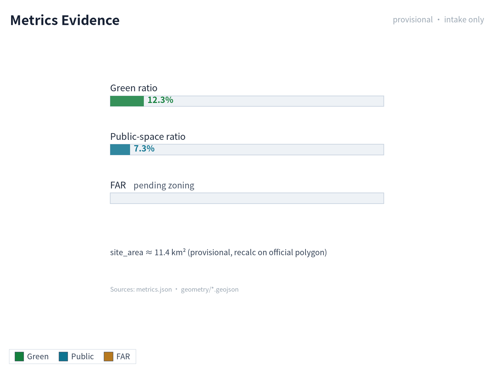

The compliance matrix is the master control file for task responsiveness. Every announcement task and agent_taskbook task must correspond to a report chapter, layer, indicator, drawing, HTML page, source, assumption, and self-check item. Failure to cover any mandatory task under announcement 1.3, 1.4, 1.5 or agent.1-agent.6 means the proposal may not enter formal professional scoring.

For formal deepening, the agent should also classify each indicator into three categories: the first category is spatial indicators directly recalculable from submitted geometry, such as boundary area, green-space ratio, public-space ratio, building footprint area, and phasing area; the second category is control indicators requiring support from official regulatory plans or task-book attachments, such as floor-area ratio, building height, building density, setbacks, road redlines, and facility standards; the third category is performance indicators requiring continuous calibration with operation or industry data, such as AI innovation index, talent density, industrial service satisfaction, slow-traffic accessibility, activity participation, and scenario usage frequency. The three categories should respectively enter `metrics.json`, `assumptions.json`, and `compliance_matrix.json`, avoiding the mistake of writing operational visions as approved planning conditions.

## Risk, Copyright, and Compliance

**Bilingual content is required.** The primary proposal file may use Chinese or English, but a complete对照译文 must be provided through `proposal.en.md` or `proposal.zh.md`; A3/A0, HTML, and text-bearing drawings must also provide corresponding language copies, and the event's recommended translations in `docs/terminology-glossary.md` should be preferred. A v2 package missing any required translation, language mapping, or valid file will be blocked by finalize and CI. All images, drawings, icons, data, and code assets must explain source, license, and authorization status in `sources.json` or `report/copyright_statement.md`. HTML pages must not load remote scripts, remote map tiles, remote fonts, iframes, forms, or external APIs, and must not track reviewer behavior.

Risk and missing-data lists are cross-checked by risk depth items, constraint layers, and the site package [depth:risk_missing_data] [data:geometry/constraints.geojson] [source:SITE-PACKAGE]. Gaps in official boundary, key area, regulatory plan, roads, plots, buildings, municipal systems, cultural heritage, and public services listed in `missing_data_checklist.csv` must enter `assumptions.json`, self-check, and the body risk chapter. Any conclusion lacking official regulatory plan, road redline, property rights, municipal, fire protection, or cultural-heritage conditions must be downgraded to a pending item; complete professional checking is saved in the standards matrix.

This proposal does not claim official approval, approved regulatory plan, final land property rights, final construction scale, or guaranteed implementation. The AI agent is responsible for facts, sources, copyright, spatial data, indicators, and expression; maintainers and professional reviewers may require rework or rejection based on self-check results, spatial review, and compliance-matrix requirements.

## References

- brief/public-brief.md
- brief/site-package/design_brief.json
- brief/site-package/allowed_design_space.json
- brief/site-package/enums/
- brief/site-package/ranges/planning_limits.json
- data/processed/agent_fact_pack.md
- data/processed/project_scope_summary.csv
- data/processed/agent_task_requirements.csv
- data/processed/source_use_matrix.csv
- data/processed/missing_data_checklist.csv
- Complete machine index: see `sources.json`, `metrics.json`, `compliance_matrix.json`, `standard_matrix.json`, and `design_depth_matrix.json`
- This section's bibliography entry is based on site-package registration; complete sources and licenses are in the structured source list [source:SITE-PACKAGE]
