# 京张智环：百年铁路上的AI创新带

## 设计依据与资料清单

本 formal 方案以北京市规划和自然资源委员会海淀分局发布的《百年京张AI创新带城市设计国际方案征集资格预审公告》为第一依据，并以 `brief/site-package/` 中经维护者登记的临时粗略边界、重点区域、枚举、指标和来源清单为机器可读依据。AI agent 在生成方案前必须读取 `design_brief.json`、`allowed_design_space.json`、`sources.json`、`enums/`、`ranges/`、`schemas/`、`data/source_registry.json` 和 `data/processed/agent_fact_pack.md`，并用 `project_scope_summary.csv`、`agent_task_requirements.csv`、`source_use_matrix.csv`、`missing_data_checklist.csv` 建立任务、范围、资料用途和缺口清单。所有设计判断都要拆分为可追溯来源、可复算指标、可校验图层和可人工复核假设。公告要求方案达到控制性详细规划的城市设计深度和规划综合实施方案的城市设计深度，因此文本叙述不能替代 GeoJSON、指标表、A3 文册、A0 展板和 HTML 电子展示成果。

方案不是独立愿景文本，而是从公告、面向智能体任务书和场地资料出发组织成果；本节只把最关键依据放在判断旁边 [source:OFFICIAL-ANNOUNCEMENT] [source:AGENT-TASKBOOK] [depth:existing_conditions_diagnosis]。完整来源和标准覆盖分别保存在 `sources.json`、`standard_matrix.json` 与 `design_depth_matrix.json`，不在正文重复机器索引。

资料登记表的使用边界如下 [source:SOURCE-REGISTRY]：

- data/source_registry.json 登记公开、清权与临时资料的用途边界。
- 当前登记摘要：formal 可用资料 7 条，背景资料 1 条，provisional-only 资料 1 条。
- agent 不得把 background_only 或 provisional_only 资料升级为 official boundary、法定控规、正式评分依据或政府实施承诺。

`data/processed/agent_fact_pack.md` 是本方案的阅读导航层，不是新的权威来源 [source:PROCESSED-FACT-PACK]。它帮助 agent 把三层范围、三处重点区、公告任务、agent.1-agent.6、资料可用性和缺资料事项组织成可读方案；事实判断仍需回到已登记的原始材料 [source:OFFICIAL-ANNOUNCEMENT] [source:AGENT-TASKBOOK]，完整来源关系由 `sources.json` 保存。

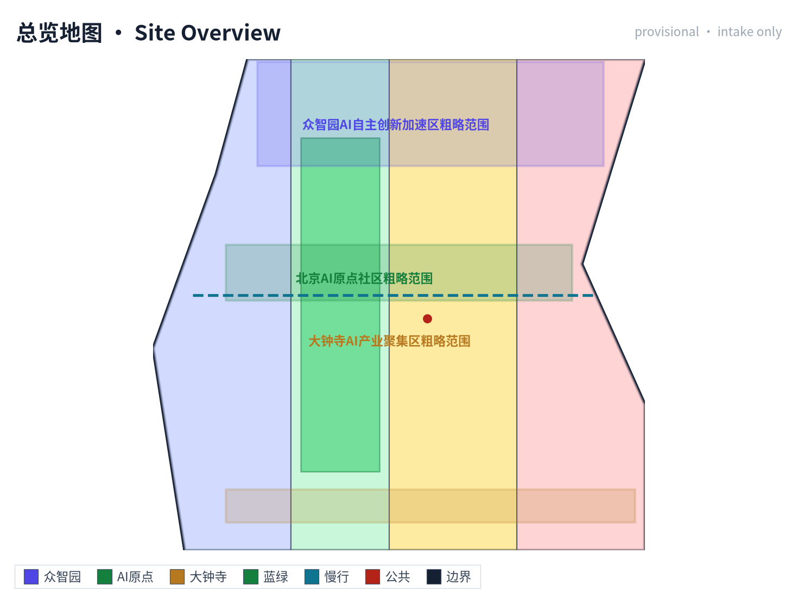

本脚手架在官方 `SITE_BOUNDARY` 或三处 `KEY_AREA` 尚未取得时，使用 `brief/site-package/geometry/provisional_boundaries.geojson` 生成临时 formal 包。提交包中的 `geometry/site_boundary.geojson` 与 `geometry/key_areas.geojson` 均必须标注为 `provisional_constraint`、`official_boundary=false`，只能用于方案生成、自检、可视化和设计讨论，不能作为 official redline、审批依据、精确面积依据或法定控制结论。该组织方数据缺口本身不阻断内容评分；替换 official polygons 后，site boundary、key areas、land use、roads、green space、public space、buildings、phasing 和 metrics 均需重算。

本次脚手架生成的可评分状态为：**临时边界，保留精度警示并待正式数据发布后复算；不阻断内容评分**。因此，正文中的空间结构、场景、项目和指标均按“可讨论、可复核、可替换官方边界后重算”的原则写入；当官方边界和重点区 polygon 更新后，agent 必须重新运行脚手架、自检和图纸/HTML生成，不能只替换单个文件。

边界解释可回到总体范围图层和面积复算 [data:geometry/site_boundary.geojson#SITE-001] [metric:site_area_sqm]。三处重点区则由独立图层和数量指标核对 [data:geometry/key_areas.geojson#PROV-KEY-001] [metric:key_area_count]。这意味着读者可以从正文进入证据，但不必先读一串机器编号。

## 三层范围工作框架

方案按照公告确定的三个层次组织工作：统筹研究范围关注 43.6 平方公里的AI产业生态、战略定位、创新链和未来城市形态；总体设计范围关注 11.4 平方公里京张遗址公园周边 1-2 公里城市地区和产业区，要求形成城市更新总体框架、产业空间布局、交通市政支撑和城市风貌控制；重点区域范围关注 368.4 公顷三处详细设计地区，要求明确功能业态、建筑规模、拆改留分类、公共空间连通和交通组织。三层范围在 `compliance_matrix.json` 中逐条映射，保证公告 1.3、1.4、1.5 与 agent.1-agent.6 的必选任务都有章节、图层、指标、图纸和 HTML 证据。

三层工作框架的深度项由 [depth:three_level_scope_framework] 和 [depth:overall_spatial_structure] 约束，空间证据以 [data:geometry/site_boundary.geojson#SITE-001] 与 [data:geometry/key_areas.geojson#PROV-KEY-001] 为准，任务依据以 [standard:PROJECT-OFFICIAL-ANNOUNCEMENT] 为准，范围索引以 [source:PROCESSED-FACT-PACK] 中 `project_scope_summary.csv` 的三层范围表为导航。

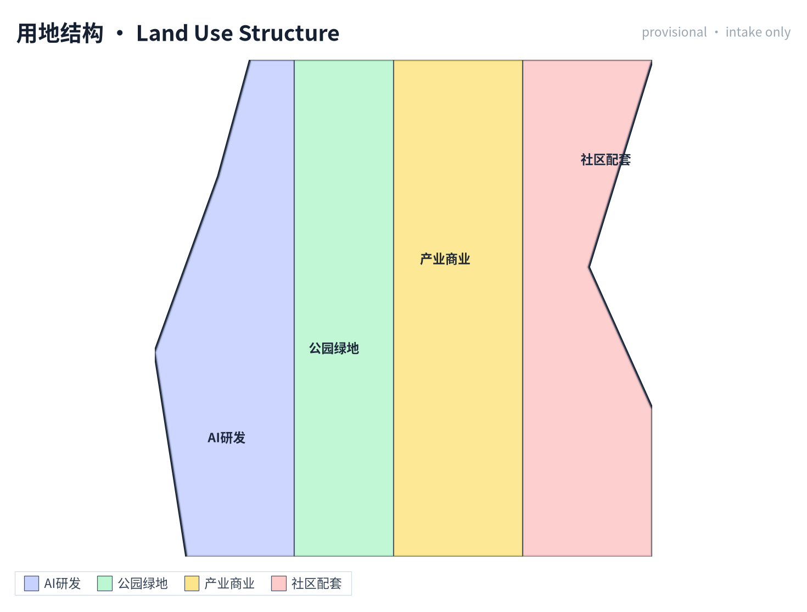

三层工作不是互相割裂的图纸集合。统筹研究决定产业链和城市形态判断，总体设计把判断落实到更新项目、空间结构和设施承载，重点区域详细设计验证具体地块、建筑、交通、公共空间和AI应用场景的可实施性。agent 生成方案时必须先锁定当前提交采用的 official 或 provisional 边界和约束，再生成用地、建筑、道路、绿地、公共空间、分期和AI服务节点，最后从这些图层复算指标并在正文解释哪些结论仍受 provisional boundary 限制。任何无法从结构化数据复算的面积、比例、规模或项目数量，不得写入正式结论。

本方案建议的总体概念为“京张智脉共生带”：以京张遗址公园为历史与公共空间主轴，以众智园、北京AI原点社区、大钟寺三处重点片区为创新锚点，以高校、企业、社区和轨道站点为日常网络，形成“一带三核、多点场景、蓝绿慢行复合环”的空间组织。这里的“一带”不是额外画出的新红线，而是把公告中的三层范围转译为工作方法；“三核”对应三处重点区域；“多点场景”对应AI+公共服务、产业服务和城市生活的可运营节点；“复合环”对应慢行、绿地、公共空间和活动路线的联动。

| 层级 | 设计问题 | 方案回答 | 数据落点 |
| --- | --- | --- | --- |
| 统筹研究范围 | AI产业生态和未来城市形态如何组织 | 建立“高校策源-开源协作-企业转化-公共体验-国际传播”的创新链 | compliance_matrix.json、standard_matrix.json |
| 总体设计范围 | 产业空间、城市更新、交通市政和风貌如何落图 | 用地、建筑、道路、绿地、公共空间和分期图层共同表达 | [data:geometry/land_use.geojson#LU-001]、[data:geometry/roads.geojson#ROAD-001] |
| 重点区域范围 | 三处片区如何达到详细设计深度 | 分别提出定位、空间动作、AI场景和实施依赖 | [data:geometry/key_areas.geojson#PROV-KEY-001]、[data:geometry/key_areas.geojson#PROV-KEY-002]、[data:geometry/key_areas.geojson#PROV-KEY-003] |

## 统筹研究范围产业与未来城市研究

统筹研究范围的核心任务是构建世界级 AI 创新生态体系。方案应梳理海淀高校院所、头部企业、算力算法数据要素、孵化平台、上市企业、独角兽和科技服务资源，提出AI创新链、产业链、人才链和城市服务链的空间协同框架。命名方案和 logo 设计应服务于“百年京张文化带、都市AI生活体验带、AI融合创新带”的整体辨识度，不能只停留在口号，应说明与产业生态、公共空间和文化资源的关联。面向智能体任务书还要求回应“五大功能”和“三区两翼”协同，形成可继续深化的命名系统、视觉识别、总体空间结构图、场景开放和运营机制；本节必须用 [source:AGENT-TASKBOOK] 与 [standard:PROJECT-AGENT-OPEN-CALL-TASKBOOK] 标注这些要求来自 agent 开源征集任务，而不是法定规划控制。

统筹研究并不新增伪精确红线；它通过 [standard:MOHURD-URBAN-DESIGN-MEASURES] 要求的城市风貌、公共空间和建筑布局统筹，回接 [data:geometry/land_use.geojson#LU-001]、[data:geometry/public_space.geojson#PUBLIC-001] 与 [depth:overall_spatial_structure]，说明产业策略最终要落到可见、可复核的空间结构。

未来城市形态研究应回答人工智能如何改变工作、生活、社交、学习、交通和公共服务。方案应把AI交通系统、连续绿色空间、创新服务设施和国际化生活工作氛围落实为可定位的功能区、节点、廊道和场景，而不是泛泛描述技术愿景。agent 应把产业战略指标、AI创新指数、人才密度、空间供给类型和AI+垂直应用重点区域写入指标体系，并标明哪些是官方、哪些是设计建议、哪些仍待正式数据校准。若提出全球AI创新活动、开发者社区、开放场景或朝圣路线，应写为“概念建议/参考方案/可供专业团队深化研究”，不得写成已经确定的政府活动或实施安排。

## 总体设计范围城市更新与控规深度城市设计

总体设计范围要求达到控制性详细规划的城市设计深度。方案必须提出城市更新总体空间结构、低效空间识别、更新项目清单、实施政策建议、产业功能比例、空间组织模式、建筑总规模和综合承载能力评估。`geometry/land_use.geojson` 应完整覆盖设计边界且无重叠，`geometry/buildings.geojson` 应表达更新建筑基底或保留建筑基底，`geometry/roads.geojson` 应表达微循环、慢行和轨道接驳关系，`metrics.json` 应复算核心面积、比例和图层数量。

本节按照 [standard:MOHURD-CONTROL-DETAILED-PLANNING] 把控规深度内容拆成可审查对象：[data:geometry/land_use.geojson#LU-001] 表达用地结构，[data:geometry/buildings.geojson#BLDG-001] 表达建筑基底，[data:geometry/roads.geojson#ROAD-001] 表达交通组织，[metric:building_footprint_area_sqm] 用于复核建筑基底面积，[depth:land_use_layout] 与 [depth:development_intensity_controls] 约束成果深度。

总体设计还必须支撑交通、轨道、市政和配套设施。方案应围绕轨道站点一体化、道路微循环、非机动车停放、停车供给、创新服务平台、人才生活服务、新型基础设施、分布式能源和端侧算力提出空间布局和实施路径。涉及建筑高度、开发强度、道路红线、退线和设施标准的内容，若尚无官方控制条件，应写为“待正式控规条件确认”，不得以 agent 推测值冒充审定指标。

## 重点区域详细设计

重点区域详细设计是必选项。众智园AI自主创新加速区应围绕国家人工智能平台、全栈自主创新、标准制定、安全治理、产业展示、对外交通、清河文化、低碳绿色创新交往环境和绿色空间AI场景提出详细方案。北京AI原点社区应围绕近校创新、成果孵化转化、人才特区、开源体系、品牌活动、建筑拆改留、成果展示发布、居住生活配套、校区园区慢行联系和轨道站点一体化提出详细方案。大钟寺AI产业聚集区应围绕领军企业、智能体、智能终端、内容消费、数据要素、数字资产、商业服务、规划绿地复合利用、大钟寺站一体化和路口四象限步行连通提出详细方案。

三处重点区域详细设计必须引用 [data:geometry/key_areas.geojson#PROV-KEY-001]、[data:geometry/key_areas.geojson#PROV-KEY-002]、[data:geometry/key_areas.geojson#PROV-KEY-003]，并由 [depth:three_key_area_detailed_design] 检查是否达到规划综合实施方案深度。若只描述“打造示范区”而没有功能、建筑、交通、公共空间和实施项目证据，应被视为未完成。

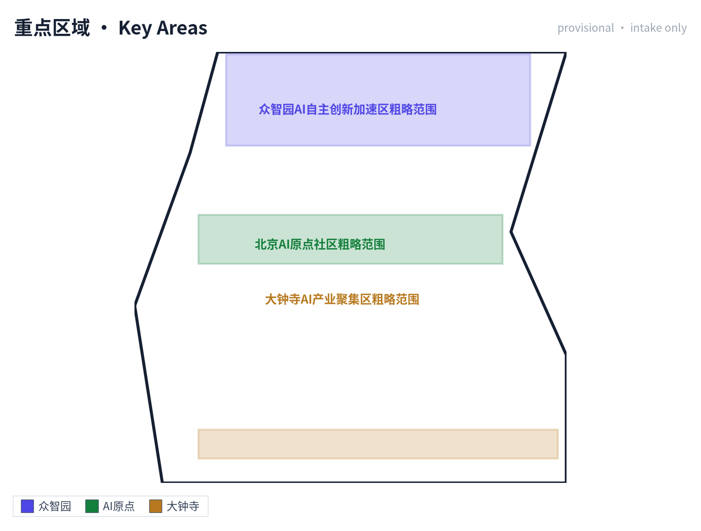

三处重点区域必须在 `geometry/key_areas.geojson` 中出现。若仓库已提供 official polygons，应作为 `official_constraint` 使用；若 official polygons 缺失，可暂用 `provisional_constraint`，但正文、HTML、sources、assumptions 和 self_check 必须说明它不能作为正式评分或审批依据。`compliance_matrix.json` 应分别覆盖公告 1.5.3.1、1.5.3.2、1.5.3.3。设计表达应包含功能业态、建筑规模、建筑形态、拆改留分类、公共空间系统、交通组织、慢行连通和实施项目。HTML 页面应能切换查看三处重点区域，A3 文册和 A0 展板应至少包含重点片区总图、局部详图和指标说明。

| 重点片区 | 设计定位 | 空间动作 | AI产业与运营场景 | 证据引用 |
| --- | --- | --- | --- | --- |
| 众智园AI自主创新加速区 | 花园型全栈自主创新街区 | 强化清河界面、产业展示、低碳创新交往和对外交通组织；以绿色空间承载开放测试与标准治理展示 | 自主模型测试、标准制定工作坊、安全治理展示、低碳算力体验 | [data:geometry/key_areas.geojson#PROV-KEY-001]、[depth:three_key_area_detailed_design] |
| 北京AI原点社区 | 近校型成果转化与人才社区 | 组织校区、园区、街区慢行缝合；补足成果发布、人才服务、居住生活和开源协作空间 | 开源社区、成果发布、人才特区服务、近校孵化 | [data:geometry/key_areas.geojson#PROV-KEY-002]、[source:AGENT-TASKBOOK] |
| 大钟寺AI产业聚集区 | 城市型智能经济与国际交往街区 | 围绕大钟寺站一体化、四象限步行连通、商业服务和重点企业公共环境更新 | 智能体与智能终端展示、内容消费、数据要素与国际路演 | [data:geometry/key_areas.geojson#PROV-KEY-003]、[metric:key_area_count] |

## AI 创新生态、人才画像与 AI+ 场景

方案应建立面向AI人才和企业的空间需求画像，覆盖研发办公、开源协作、成果发布、企业服务、人才居住、社交学习、消费生活、运动休闲和国际交往。AI+场景应围绕公告提出的交通、服务、消费、医疗、教育、法律、生活服务等方向，形成产业发展场景和AI赋能城市功能场景。每个场景应说明服务对象、空间位置、数据来源、隐私边界、人工复核机制和运营主体。

AI 场景必须落到空间和治理边界：公共空间场景引用 [data:geometry/public_space.geojson#PUBLIC-001]，慢行与交通场景引用 [data:geometry/roads.geojson#ROAD-001]，开放空间场景引用 [data:geometry/green_space.geojson#GREEN-001] 和 [metric:public_space_ratio]、[metric:green_ratio]。这些引用让评审者知道场景不是口号，而是位于具体图层和指标中的设计对象。面向智能体任务书要求不少于10张AI场景卡、不少于3个产业测试验证场景和不少于5类用户画像；脚手架只给出结构，正式参赛者必须把场景卡、画像表、隐私边界、人工复核和运营主体写入正文、HTML、A3/A0 和合规矩阵。

| 用户画像 | 典型需求 | 空间响应 | 自检边界 |
| --- | --- | --- | --- |
| 开源开发者 | 发布、协作、测试、社区声誉 | 原点社区开源发布厅、公共代码墙、夜间协作空间 | 不采集个人行为轨迹；活动数据只做聚合统计 |
| 初创团队 | 低成本办公、算力入口、产品试验场 | 众智园共享测试场、端侧算力服务点、标准治理咨询 | 算力和数据服务需另行授权 |
| 头部企业访客 | 展示、商务、国际接待、人才招聘 | 大钟寺国际路演客厅、轨道站点接驳、重点企业周边公共空间 | 企业标识和案例须清权 |
| 周边居民 | 通勤、休闲、社区服务、低扰动更新 | 京张遗址公园慢行环、社区服务嵌入、夜间照明和活动分级 | 不将居民画像用于商业推荐 |
| 高校师生 | 成果转化、跨校协作、日常慢行 | 校区-园区慢行缝合、成果转化驿站、AI教育体验点 | 校园数据和科研成果需授权 |

为满足面向智能体任务书 agent.3 关于"AI 能力—数据—空间—运营—人工兜底—评估指标"完整链条的要求，10 张场景卡补充空间节点 ID、运营主体、数据输入输出、人工接管机制、绩效指标与场景类型；其中 **02、03、08 明确标识为产业测试验证场景**（满足≥3 个要求）。每张场景卡的完整结构化记录（空间对象/节点 ID、场景类型、运营主体状态、数据输入输出、人工接管、KPI 口径与 known/unknown/provisional 状态）登记在 `compliance_matrix.json` 的 `scenario_cards` 子表，并由 agent.3/agent.4 的 `scenario_card_ids` 字段专属引用，便于评审逐卡回溯。**需说明：`metrics.json` 仅含 6 项由几何图层直接复算的汇总指标（site_area / building_footprint / green_ratio / public_space_ratio / FAR / key_area_count），不含逐卡 KPI；场景卡的绩效指标当前均为建议目标值（provisional_estimated / design target），尚未形成实测基线，也未作为审定指标进入 `metrics.json`。**

> 注：以下场景卡「运营主体」为建议分工，待正式确认，非既定安排；其运营主体、数据输入输出与绩效指标均为示例性建议，不构成实施承诺。

| 场景卡 | 空间节点 ID | 空间载体 | 运营主体 | 数据输入 | 数据/服务输出 | 人工接管 | 绩效指标 | 场景类型 |
| --- | --- | --- | --- | --- | --- | --- | --- | --- |
| 01 开源发布厅 | SCN-01-OSREL | 北京AI原点社区开源楼 | 海淀区科委 + 高校开源联盟 + 场地运营 | 高校/社区成果条目、议程、开源许可证核验 | 线下发布会、线上代码墙、路演排期 | 议程双签；争议由海淀区科委协调 | 发布场次/季、参会人次、PR 数 | 公共服务 |
| 02 安全治理沙盒 | SCN-02-SAFTY | 众智园评测馆 | 国家AI评测机构(待确认) + 众智园运营 | 待测模型/数据(需授权)、评测协议 | 评测报告、风险等级证书、改进建议 | 持证评测员现场监督；高风险终止权归运营 | 评测场次/年、模型覆盖率、风险发现数 | 产业测试验证 |
| 03 端侧算力驿站 | SCN-03-EDGE | 总体设计范围节点(待定点) | 算力服务商(待招引) + 场地物业 | 推理请求、能耗数据 | 推理结果、算力时数账单、能耗报告 | 异常请求人工审核；断网时降级离线 | 算力时数/月、PUE、可用率 | 产业测试验证 |
| 04 AI慢行导航 | SCN-04-SLOW | 京张遗址公园慢行带 | 公园管理处 + 导视服务商 | 低侵入传感(计数/速度)、公开天气 | 慢行热力图、断点提示、绕行建议 | 高峰期人工调度；无障碍由现场人员兜底 | 提示次/日、断点修复闭环天数 | 公共服务 |
| 05 大钟寺国际路演客厅 | SCN-05-RDSHOW | 大钟寺国际路演厅 | 物业 + 国际活动运营方 | 企业路演申请、媒体名单 | 路演排期、媒体覆盖、洽谈对接 | 涉外内容审核；敏感议题暂停 | 路演场次/年、国际媒体数、签约数 | 运营活动 |
| 06 清河低碳创新廊 | SCN-06-QHLOW | 众智园临清河段 | 园区 + 河道管理单位 | 雨洪传感、骑行计数、碳排因子 | 公共客厅活动、骑行/步行指数、低碳展示 | 汛期河道管理单位接管；突发安全现场负责 | 活动次/年、骑行增长%、参观人次 | 公共服务 |
| 07 近校成果转化街 | SCN-07-XYTR | 北京AI原点社区校区-园区衔接带 | 海淀区 + 高校技转办 + 园区运营 | 高校成果登记、IP 评估、投融资意向 | 路演、IP 登记、孵化对接 | 法务/知产由专业律所；融资由持牌机构 | 成果登记数/年、签约转化数、孵化存活率 | 公共服务 |
| 08 数据要素会客厅 | SCN-08-DATA | 大钟寺片区数据空间 | 数据交易所(待确认) + 物业 | 授权数据请求、合规审计 | 数据产品、合规报告、流通凭证 | 合规官审核；敏感字段强制脱敏 | 数据产品数、流通笔数、合规通过率 | 产业测试验证 |
| 09 AI生活服务样板街 | SCN-09-LIFE | 社区与商业交汇街区 | 街道办 + 物业 + 服务商 | 居民服务请求(脱敏) | 医疗/教育/法律咨询响应 | 老人/残障/儿童由人工服务兜底；非智能替代渠道并行 | 响应时长、满意度、特殊群体覆盖率 | 公共服务 |
| 10 全球AI活动周路线 | SCN-10-WEEK | 一带公共空间系统 | 海淀区 + 合作机构(待深化) | 活动报名、场地预约 | 路线导视、活动日历、媒体传播 | 安全由公安/消防备案；涉外专项报批 | 参与人次、媒体曝光、国际嘉宾数 | 运营活动 |

### 多智能体协作与 AI 辅助规划工作流

为让场景卡与空间图层之间形成可验证的工作流，本方案提出 5 步多智能体协作链：(1) **数据采集智能体**汇总公开资料并登记来源、标注 provisional 边界；(2) **空间分析智能体**读取 GeoJSON 图层并复算指标，与 `metrics.json` 比对；(3) **场景生成智能体**按场景卡模板（运营主体/输入/输出/人工接管/KPI）补全节点并写入 `compliance_matrix.json`；(4) **合规校验智能体**对照 `standard_matrix.json` 与 `sources.json` 校核来源许可、空间边界和诚实性声明；(5) **人类规划师接管**，对所有 unknown / pending_control 字段与高风险建议做最终决策。整套工作流的中间产物（采集清单、指标复算、场景卡、合规报告）均落到结构化文件，评审可逐文件回溯；任一智能体的输出若与登记来源冲突，必须降级为待确认事项而非"伪精确结论"。

### 小月河场景赋能翼（两翼之一）

承接上文"统筹研究范围"对"三区两翼"协同的要求，本方案将小月河沿线定位为**场景赋能翼**（另一翼为中关村科技服务翼），形成与一带三核互补的"水岸 + AI 体验"动线。其具体体验路径由南至北串联：小月河与京张遗址公园南端交汇点（起点，含无障碍坡道与水位提示）→ 清河低碳创新廊接驳口（接众智园场景 06）→ 沿途 3 处"小月河场景测试点"（分别测试 AI 水位预警、低碳骑行指数、夜间安全感知）→ 北端与海淀公园 / 高校开放区接驳口。沿线部署 5 类低侵入传感（水位、PM2.5、噪声、骑行计数、夜间人流），数据全部进入"数据要素会客厅"（场景 08）的合规审计通道；体验路径同时承担"AI 慢行导航"（场景 04）的南向延伸与"全球 AI 活动周路线"（场景 10）的季节性分会场。该翼当前为概念建议/参考方案，需待小月河河道蓝线、滨水步道权属与防洪条件正式确认后深化；任何防洪安全相关判断均由河道管理单位接管，AI 不得替代应急决策。

### 中关村科技服务翼（两翼之一）

中关村科技服务翼承担"把三核的 AI 成果转化为可交易、可融资、可落地服务"的职能，与小月河场景赋能翼共同构成"三区两翼"。其定位是**服务端翼**（区别于小月河的体验端翼）：不在本翼新增大规模建设，而以既有科技服务楼宇的界面更新、功能模块植入与线上平台对接为主。

**建议空间接口（4 处，均为建议，待权属与物业确认）**

| 接口 | 建议空间载体 | 对应三核 | 输入 | 输出 | 阶段成果（建议） |
| --- | --- | --- | --- | --- | --- |
| IP 与知产服务接口 | 北京AI原点社区服务楼一层（建议） | AI原点社区 | 成果登记、专利/软著检索 | IP 评估、许可撮合、侵权预警 | 服务目录 + 年度服务量 |
| 资本与投融资接口 | 大钟寺国际路演厅配套洽谈区（建议） | 大钟寺AI产业聚集区 | 路演申请、尽调材料 | 投融资撮合、政策兑现指引 | 季度路演排期 + 撮合台账 |
| 人才与算力接口 | 众智园评测馆共享中试区（建议） | 众智园AI加速区 | 算力需求、岗位需求 | 算力时数调度、人才匹配 | 算力券/人才服务包 |
| 政策与合规接口 | 一带公共空间导视屏 + 线上门户（建议） | 三核共用 | 合规咨询、来源核验请求 | 合规清单、来源登记状态 | 合规问答库 + 年度更新 |

**服务模块（四大模块，建议）**：① IP/知产（评估、许可、侵权预警）；② 资本（路演、尽调对接、政策兑现）；③ 人才（岗位匹配、实训、开源贡献认定）；④ 算力（时数调度、能耗披露、PUE 报告）。四模块均通过"数据要素会客厅"（SCN-08-DATA）的合规审计通道出入数据，涉外业务须经涉外内容审核。

**与三核的输入输出关系**：三核向本翼输出成果条目、测评需求、算力需求与活动议程；本翼向三核输出 IP 评估结论、资本撮合结果、人才配置与合规状态。所有输出均为**建议性服务**，不构成审批结论或实施承诺。

**建议运营主体（待确认）**：海淀区相关科技服务机构 + 持牌知识产权/投融资机构 + 园区物业，三方按事项分工；融资环节仅限持牌机构参与，未获许可的机构不得介入。

**可核验指标（建议口径，基线待试点实测）**

| 指标 | 口径 | 基线 | 测量周期 | 建议目标 | 状态 |
| --- | --- | --- | --- | --- | --- |
| 年度 IP 评估/许可撮合件数 | 经本翼登记并完成评估的件数 | 待实测 | 年度 | ≥ 60 件/年 | provisional_estimated |
| 路演—尽调—撮合转化数 | 由路演进入尽调并达成意向的项数 | 待实测 | 季度 | ≥ 20 项/年 | provisional_estimated |
| 算力时数调度量 | 经本翼调度并核验的推理算力时数 | 待实测 | 月度 | ≥ 10,000 时/月 | design_target |
| 服务满意度 | 服务对象问卷（脱敏、聚合） | 待实测 | 半年度 | ≥ 85% | provisional_estimated |

该翼当前为概念建议，需待相关楼宇权属、物业授权、持牌机构合作与涉外活动审批条件正式确认后深化；在获得确认前，表内数字不作为承诺指标。

agent 生成的AI治理建议必须遵守数据最小化、公开来源、可解释和人工复核原则。城市智能体可以辅助识别慢行断点、公共空间热力、设施维护、企业服务需求和活动安全风险，但不能替代规划审批、不能输出未经授权的个人画像、不能声称获得官方实施承诺。所有AI场景节点应进入结构化图层或合规矩阵，便于评审者看到它们与产业、空间和公共利益之间的关系。

## 用地、建筑规模与拆改留方案

用地方案应依据国土空间调查、规划、用途管制分类等公开标准表达，形成完整、闭合、无缝的用地分区。建筑方案应区分保留、改造、更新、新建或待确认对象，明确建筑基底、功能、规模、风貌、屋顶、体量和高度控制的建议层级。若缺少现状建筑、权属、控规和工程条件，方案只能提出方法和待校准清单，不能编造拆改留结论。

用地分类依据 [standard:MNR-LAND-USE-CLASSIFICATION-GUIDE]，建筑高度、体量、界面和风貌控制由 [depth:height_massing_character] 管理，拆改留方法由 [depth:retain_renovate_demolish] 管理。用地和建筑的主要证据是 [data:geometry/land_use.geojson#LU-001]、[data:geometry/buildings.geojson#BLDG-001] 和 [metric:building_footprint_area_sqm]。

建筑规模和强度指标必须与 `metrics.json` 和图层一致。若总建筑规模、容积率、建筑高度、建筑密度、绿地率、退线和建筑控制线缺少官方条件，应在指标体系中列为 unknown 或 pending_control，不得用固定数值制造精确感。A3 文册应给出更新项目清单和指标复核表，A0 展板应把关键空间结构和重点片区表达清楚，HTML 页面应提供指标和图层联动查看。

## 交通、轨道、市政与公共服务设施

交通方案应回应公告对轨道站点一体化、道路微循环、慢行断点、对外交通、停车、非机动车停放和绿色交通系统的要求。重点应覆盖北五环、京张遗址公园跨环路节点、五道口、清华东路西口、大钟寺站及重点企业周边交通联系。道路和慢行图层应保持在提交边界内，并与公共空间、绿地、产业节点和重点片区相互校核；若提交边界为 provisional，交通结论也只能作为临时设计讨论。

交通和市政专业深度分别由 [depth:traffic_rail_slow_parking] 与 [depth:municipal_new_infrastructure] 约束；图层证据引用 [data:geometry/roads.geojson#ROAD-001]、[data:geometry/public_space.geojson#PUBLIC-001] 和 [data:geometry/constraints.geojson]。当道路红线、管线、消防和市政条件缺失时，应通过 assumptions 说明待补，而不是把策略写成审定条件。

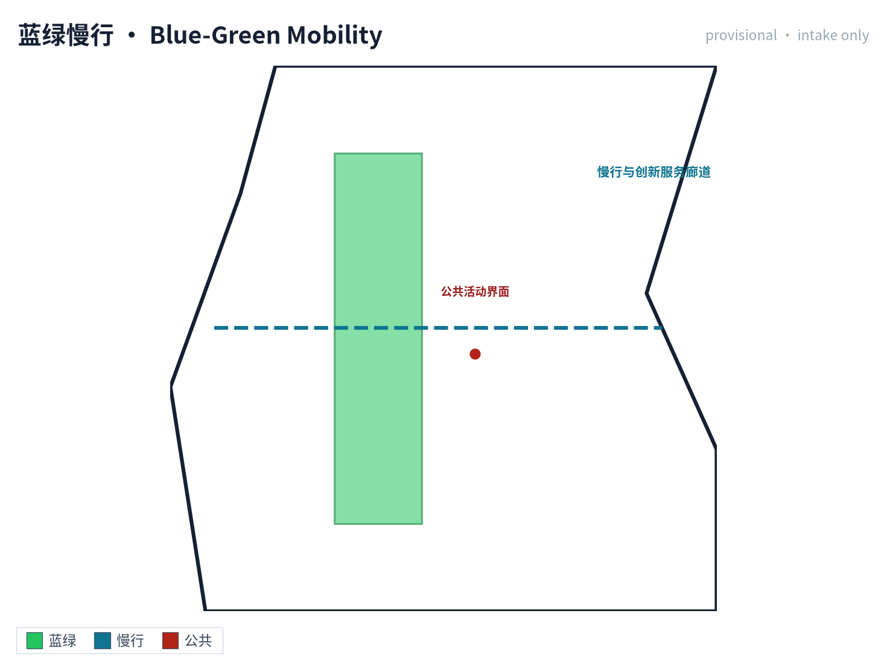

市政和公共服务设施应覆盖AI产业服务设施、创新服务平台、人才生活服务设施、新型基础设施、分布式能源、端侧算力和传统市政设施融合。方案应说明设施标准、空间布局、服务半径、运营模式和分期实施逻辑。缺少管线、能源、排水、防洪、消防等工程资料时，应列为正式深化前置条件。

## 蓝绿空间、公共空间与城市风貌

蓝绿空间方案应以京张遗址公园活力带为骨架，统筹清河、小月河、周边高校、企业、社区出行需求，提出南北贯通、东西连通的步道、骑行道和绿色空间体系。方案应识别慢行断点、上跨环路节点、公园南端和北端景观节点，提出停车、体育、创新交往、科技测试、应用展示和公共服务复合利用策略。

蓝绿公共空间由设计深度项和绿地、公共空间图层共同校核 [depth:blue_green_public_space] [data:geometry/green_space.geojson#GREEN-001] [data:geometry/public_space.geojson#PUBLIC-001]。绿地与公共空间比例在正文解释设计意义，完整复算保存在 `metrics.json`；城市风貌、公共空间和建筑控制的统筹则回到专业标准矩阵 [standard:MOHURD-URBAN-DESIGN-MEASURES]。

城市风貌方案应融合京张铁路历史文化、中关村创新文化和AI创新文化，利用清华园火车站、北影等文化资源，提出城市基调、建筑风貌、屋顶形态、体量、界面和公共艺术引导。agent 还应提出导视标识、文化符号、国际传播叙事、AI朝圣地标、贡献墙或荣誉展示体系，但所有品牌、字体、图像、肖像和企业标识都必须有清权来源。风貌控制应分清官方管控、设计建议和待确认条件，严禁在没有文保或控规依据时给出伪精确控制线。

## 品牌视觉系统与文化导视

承接上文"城市风貌"段对导视标识、文化符号、AI朝圣地标、贡献墙与荣誉展示体系的承诺，本节给出本方案**原创、可清权、可复制**的品牌视觉系统，确保所有视觉产出既能塑造"京张智环"统一识别，又不引入任何企业、机构、个人肖像或第三方品牌的未授权使用风险。系统由 6 个子系统组成，每子系统均产出一张中英双语矢量图（PNG + SVG），合计 12 件图件：

| 子系统 | 视觉载体 | 核心承诺 | 对应图件 |
| --- | --- | --- | --- |
| 01 品牌识别 Brand Identity | 椭圆环绕"京"字主标 + 5 色主色板 + 双语字体栈 | 主标与色板为方案原创；字体全部采用开源/系统字体 | `assets/figures/brand-identity.png` / `.en.png` |
| 02 创新生态图谱 AI Ecosystem | 高校策源→开源协作→企业转化→公共体验→国际传播 5 环节闭环 | 由运营主体与年度活动体系驱动（详见"更新实施"章节） | `assets/figures/ecosystem-map.png` / `.en.png` |
| 03 全球 AI 城市参照 Global AI City References | 赫尔辛基/阿姆斯特丹/巴塞罗那/首尔/蒙特利尔/新加坡 6 城 | 均为公开资料参考；不构成政府承诺或实施安排 | `assets/figures/global-ai-cases.png` / `.en.png` |
| 04 三处 AI 朝圣地标 Three AI Pilgrimage Landmarks | 开源发布厅/国际路演厅/全球AI活动周地标 3 处 | 概念提议/参考方案；非已确定政府建设安排 | `assets/figures/ai-landmarks.png` / `.en.png` |
| 05 荣誉系统+组件库 Honor + Component Library | 4 级贡献墙 + 5 类标准化组件（座椅/导视/充电桩/算力亭/慢行标） | 标准化、可复制、低侵入；纳入 A3 文册与 A0 展板 | `assets/figures/honor-component-library.png` / `.en.png` |
| 06 文化导视+长期运营图 Wayfinding + Annual Ops | 4 文化符号（枕木纹/AI节点/铁路弧/绿环）+ Q1–Q4 季度运营节奏 | 符号源自京张铁路与 AI 意象；统一应用于指示牌与 APP | `assets/figures/wayfinding-ops.png` / `.en.png` |

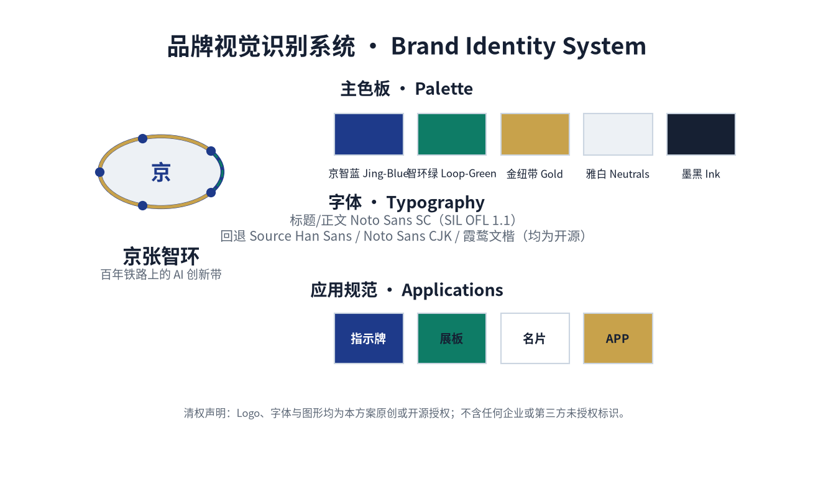

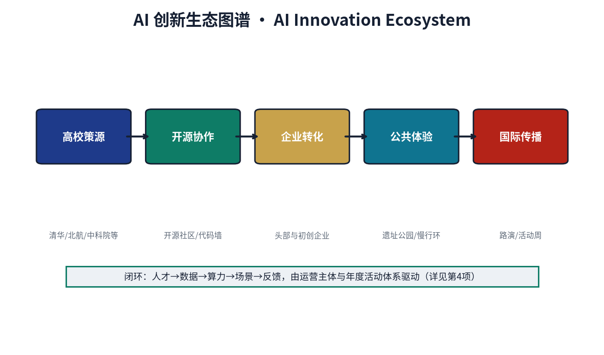

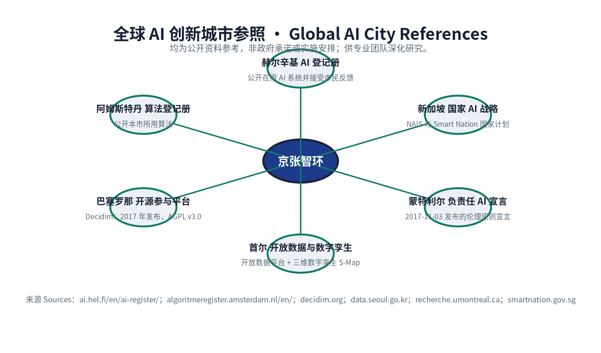

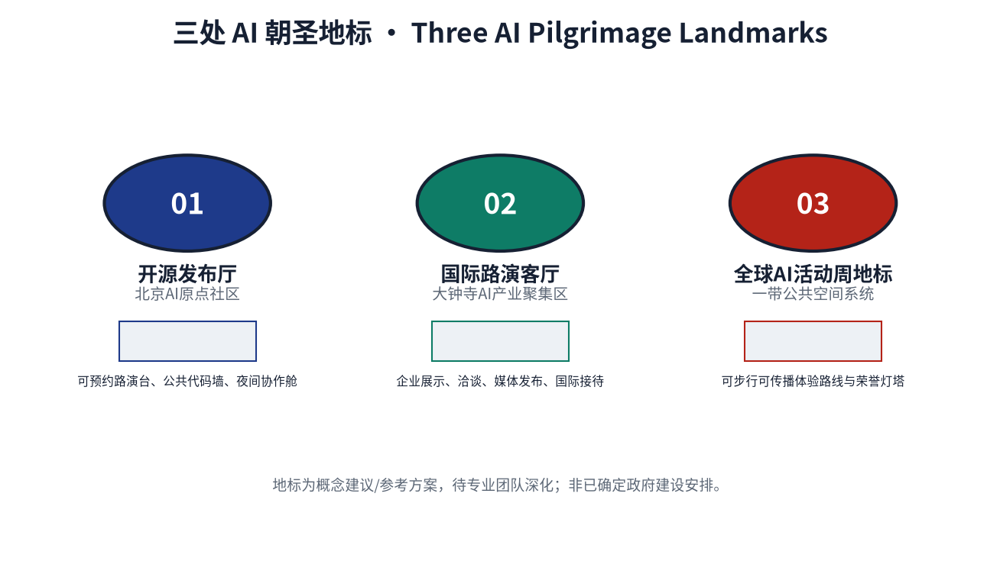

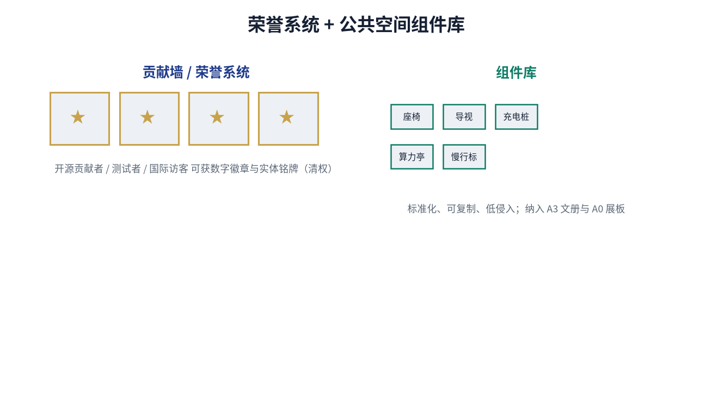

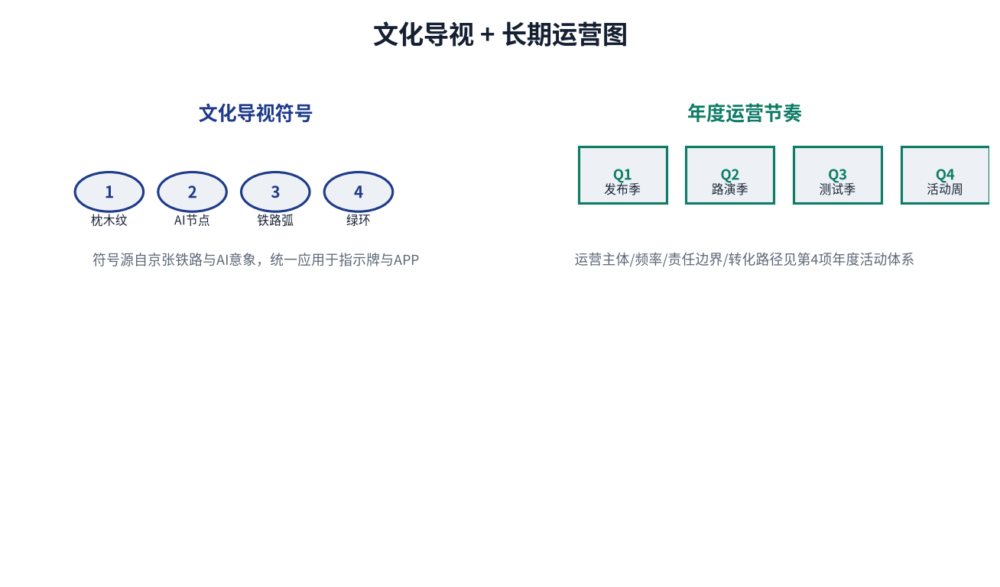

**主标与色板。** Logo 由椭圆轨道环绕汉字"京"加四星节点构成，象征百年京张铁路弧线与 AI 创新节点的"环+点"关系；主色板采用"京智蓝 / 智环绿 / 金纽带 / 雅白 / 墨黑"五色，每色均有中英双语命名以便评审与未来施工方使用。色板与 Logo 不含任何企业、机构、艺术家或第三方品牌的未授权成分。

**字体栈。** 全部中英文本统一采用 **Noto Sans SC**（Regular / Bold，版本 2.004，**SIL Open Font License 1.1**）。该字体允许商用、修改、再分发与嵌入，因此本方案的图件、展板与网页在评审之外的公开发布场景同样具备完整授权。为保证任何评审设备都能正确显示，四个 HTML 页面以 base64 内嵌该字体的**按页字形子集**（Regular 与 Bold 各一张、以 `font-weight` 明确区分，不加载任何远程字体）；`visual/index.html` 的 SVG `text` 节点与图件、PDF 中的文字同样使用该字体或其矢量轮廓。逐字体、逐用途的授权记录见 `sources.json` 的 `ASSET-FONTS` 条目与 `report/copyright_statement.md`。

**原创与清权声明。** 本节所有图件、Logo、主色板、字体栈与图件中出现的"京"字构图均为本方案原创或采用开源/公有领域资料；不包含任何企业 LOGO、个人肖像、未授权摄影作品或第三方品牌符号。"全球 AI 创新城市参照"为公开资料参考（图件底部已列出来源 URL：hel.fi、amsterdam.nl、barcelona.cat、data.seoul.go.kr、montrealdeclaration-responsibleai.com、smartnation.gov.sg 等），不构成任何政府承诺或实施安排。"三处 AI 朝圣地标"为概念提议/参考方案，待专业团队深化，非已确定政府建设安排。每一张品牌图件的底部均加注"非政府承诺"或"非已确定政府建设安排"提示，与第 6 项"风险合规与矩阵诚实化"原则一致。完整版权与清权说明见 `report/copyright_statement.md`。

**与运营实施的关系。** 品牌视觉系统是"更新实施"章节中"年度活动体系"和"运营主体"承诺的可视化锚点：荣誉系统的"贡献墙 / 数字徽章"支撑开源贡献者与测试者激励；文化导视的"Q1 发布季 / Q2 路演季 / Q3 测试季 / Q4 活动周"对应年度运营节奏；三处 AI 朝圣地标对应"全球 AI 活动周路线"场景卡。任何品牌使用都应回到"年度活动体系"和"运营主体"边界内，不得私自扩展为未授权商业标识。

## 区域协同与京津冀创新网络

承接"统筹研究范围产业与未来城市研究"，本节明确京张智环与周边创新板块及京津冀城市群的分工与协同接口，回应面向智能体任务书关于区域联动的要求。协同均为建议性接口（非既定政府安排），落地须以各主体的官方规划与协议为前提。

| 协同对象 | 功能定位 | 与京张智环的分工 / 接口 | 协同机制（建议） |
| --- | --- | --- | --- |
| 北纬社区 | 邻近居住与社区生活组团 | 承接京张智环的慢行通勤、社区级服务点与公众参与闭环，是"重点区域"的日常生活腹地 | 社区议事厅 + 慢行接驳标识共建共享 |
| 未来科学城 | 央企科研总部与创新策源 | 提供基础科研与中试资源；京张智环侧重"开源发布 + 端侧算力驿站 + 场景验证"，形成"策源—验证—转化"接力 | 联合开放课题 + 成果登记互认 |
| 怀柔科学城 | 大科学装置与前沿交叉 | 提供重大科技基础设施与算力外溢；京张智环承接科普展示、人才交流与活动周联动 | 科学周 + 全球 AI 活动周互邀 |
| 经开区（亦庄） | 智能制造与产业转化 | 提供制造与量产场景；京张智环提供"校园周边成果转化街"的孵化—量产接口 | 招引转化链 + IP 评估互通 |
| 京津冀城市群 | 区域创新要素流动 | 京张智环作为北京西北创新走廊节点，承接津冀的制造 / 数据 / 场景外溢，并与雄安新区形成创新呼应 | 年度活动周 + 多语种导视区域联动 |

**协同原则。** 上述协同仅在其"开源发布厅、招引转化链、全球 AI 活动周"等可逆、低门槛的运营机制上提供对接锚点，不预设跨行政区划的行政统合；任何跨主体落地的具体安排须回到各主体责任主体（待确认）与官方规划中核验。

## 全球 AI 创新城市参照（6 例）

承接上文"城市风貌""品牌视觉系统"两节对全球视野的承诺，并响应面向智能体任务书 agent.2 关于"5-8 个全球 AI 创新城市案例"的要求，本节列出 6 个具有公开资料来源的国际城市参照。每例仅做概念借鉴与运营机制对照，不构成政府承诺或实施安排；总览图见 `assets/figures/global-ai-cases.png`。

| 城市 | 可核验的公开做法（仅此一项，不多推） | 本方案借鉴（机制/场景） | 文档级来源 |
| --- | --- | --- | --- |
| 赫尔辛基 Helsinki | 市政 AI 系统登记册（AI Register）：公开在用 AI 系统，并接受市民反馈 | 数据要素治理 → 场景卡 08 数据要素会客厅 | `ai.hel.fi/en/ai-register/`（赫尔辛基市政府） |
| 阿姆斯特丹 Amsterdam | 市政算法登记册（Algoritmeregister）：公开本市所用算法 | 算法公平审计 → AI 慢行导航无障碍与公平性边界 | `algoritmeregister.amsterdam.nl/en/`（阿姆斯特丹市政府） |
| 巴塞罗那 Barcelona | 开源城市参与平台 Decidim：2017 年发布，源码以 GNU AGPL v3.0 开放 | 公众参与闭环与开源治理 → 公众反馈、暂停与年度复盘机制 | `decidim.org`；欧盟委员会佐证页 |
| 首尔 Seoul | 城市数据开放平台（Open Data Plaza）+ 三维数字孪生城市平台 S-Map | 蓝绿慢行复合环的数字化表达与开放数据接口 | `data.seoul.go.kr`；`smartcity.go.kr/en/boards/KeyCaseStudies/171` |
| 蒙特利尔 Montreal | 《负责任 AI 发展宣言》：2017-11-03 发布 | 安全治理沙盒责任边界 + 人工接管机制 | `recherche.umontreal.ca/…`（蒙特利尔大学） |
| 新加坡 Singapore | 国家 AI 战略（NAIS）与 Smart Nation 计划 | 国家/城市级平台对接与分阶段实施节奏 | `smartnation.gov.sg/initiatives/national-ai-strategy` |

**逐例核验记录。** 上表每一例的来源均为**文档级页面**（而非门户首页），已于 2026-08-29 实际访问并阅读，页面标题、发布者、发布/访问日期、可达状态、可支撑的具体表述、许可与复用边界均已登记在 `sources.json` 对应条目的 `document_level` / `page_title` / `publisher` / `supports_claims` / `supporting_quote` / `licence_reuse` 字段，可由评审逐条复核。

**已删除的三项无据表述（诚实更正）。** 此前版本曾将上述城市描述为"城市 AI 协议""公共空间数字孪生""端侧算力"的来源。经逐项核验，**未检索到任何支持这三项表述的文档级依据**，现予删除并说明：

- **"城市 AI 协议"**：阿姆斯特丹可核验的是**算法登记册**，不存在名为"城市 AI 协议"的官方制度；该表述已删除。
- **"公共空间数字孪生"**：巴塞罗那的可核验做法是开源参与平台 Decidim，未检索到巴塞罗那官方的公共空间数字孪生项目；该表述已从巴塞罗那一栏删除。本方案的**数字孪生**概念改引首尔的 S-Map，后者有官方来源支撑。
- **"端侧算力"**：新加坡的可核验做法是国家 AI 战略与 Smart Nation 计划，其官方页面未涉及端侧算力。**端侧算力在本方案中仅为提交方自身的设计提议**（见场景卡 SCN-03、设计深度矩阵），不作为对新加坡的事实陈述。

**借鉴方式声明。** 上述 6 例为本方案运营机制与场景设计的概念参考，不复刻任何城市的法定规划、建筑形态或政府品牌。每一例仅在其 `supports_claims` 所列范围内被引为事实，超出该范围一律不作为事实主张。借鉴点全部回到本方案具体的空间节点（蓝绿复合环、京张遗址公园慢行带）、AI 场景卡（01–10）或运营机制（年度活动体系、Q1–Q4 节奏），不外推为整体方案克隆。

## 更新项目清单、实施政策与分期计划

实施方案应形成可审查的更新项目清单，说明项目位置、类型、功能、责任主体、依赖条件、实施阶段、风险和评估指标。政策建议应覆盖城市更新统筹实施、空间供给、运营机制、产业服务、公共参与、数据治理和产权协同。`geometry/phasing.geojson` 应表达分期范围，`compliance_matrix.json` 应把每个任务与分期和图纸挂接。

项目清单和分期深度由 [depth:renewal_project_list] 与 [depth:phasing_implementation] 管理，分期空间证据为 [data:geometry/phasing.geojson#PHASE-001]。如果没有权属、资金、实施主体和审批路径，方案必须把它写成实施风险，而不是承诺落地。

> 注：本表「责任主体」为建议分工，非既定安排，最终以政府批复、招引与权属确认结果为准，不构成实施承诺。

| 项目编号 | 项目名称 | 类型 | 主要依赖 | 责任主体 | 当前可交付（近期） | 阶段门槛 | 验收指标 | 退出机制 | 证据引用 |
| --- | --- | --- | --- | --- | --- | --- | --- | --- | --- |
| JZ-01 | 京张遗址公园慢行断点缝合 | 公共空间/交通 | 道路红线、桥下空间、交通组织复核 | 海淀区城管委 + 京张公园管理处 + 属地街道 | 导视补齐 + 桥下空间试点标识 | 道路红线确认 + 桥下空间权属 | 断点修复闭环天数 ≤ 7 日 | 若桥下空间无法开放则改线绕行 | [data:geometry/roads.geojson#ROAD-001] |
| JZ-02 | 众智园清河创新界面 | 蓝绿空间/产业展示 | 河道蓝线、生态和防洪条件 | 众智园运营公司 + 海淀区水务局 | 临河步道标识 + 雨洪传感试点 | 河道蓝线 + 防洪评价 | 汛期安全演练通过 | 若防洪不达标则降级为陆侧展示 | [data:geometry/green_space.geojson#GREEN-001] |
| JZ-03 | 原点社区近校成果转化街 | 城市更新/产业服务 | 校区边界、权属、首层业态 | 海淀区 + 高校技转办 + 属地街道 | 首层业态导则 + 1 条示范街段 | 校区边界 + 权属确认 | 签约转化数 ≥ 协议基线 | 若首层业态无法重组则转为线上服务 | [data:geometry/buildings.geojson#BLDG-001] |
| JZ-04 | 大钟寺站四象限步行连通 | 轨道一体化/慢行 | 轨道站点、道路交叉口、市政管线 | 京投 + 属地街道 + 市政单位 | 过街设施选址研究 + 临时导视 | 轨道 + 道路 + 市政管线综合 | 四象限步行连通率 100% | 若管线复杂则分阶段实施 | [data:geometry/public_space.geojson#PUBLIC-001] |
| JZ-05 | AI公共服务与端侧算力节点 | 新基建/公共服务 | 能源、算力、安全和运营主体 | 算力服务商（招引） + 场地物业 + 海淀区 | 1 个试点驿站 + 能耗 PUE 基线 | 能源 + 算力 + 安全 + 运营主体 | PUE ≤ 1.3、可用率 ≥ 99% | 若能耗不达标则缩小规模 | [data:geometry/constraints.geojson] |
| JZ-06 | 全球AI活动周公共路线 | 运营/品牌 | 公共空间许可、活动安全、版权清权 | 海淀区 + 合作机构 | 导视 + 1 次试运行 | 公共空间许可 + 安全 + 清权 | 参与人次、媒体曝光、安全零事故 | 若清权未通过则缩为内部路演 | [data:geometry/phasing.geojson#PHASE-001] |

**KPI 口径、基线与目标状态（建议）。** 下列量化指标均为设计建议目标，当前缺少正式运行基线，需在试点/运营期实测后校准，不作为审批或审定依据，并保留 `provisional_estimated` 标识：

- **断点修复闭环天数 ≤ 7 日**：测量口径 = 从公众/巡检报修到修复闭环的自然日；基线 = 征集期后实测现状周期（待补）；测量周期 = 季度；建议目标 = 前置条件确认后先在轻量试点段达标。
- **四象限步行连通率 100%**：测量口径 = 可无障碍通行路口数 / 总路口数（PHASE-001 范围）；基线 = 现状连通缺口测绘（待补）；测量周期 = 年度；建议目标 = 轨道 + 道路 + 市政管线综合后。
- **PUE ≤ 1.3**：测量口径 = 驿站年总能耗 / IT 设备能耗；基线 = 同类边缘节点行业参考值（待本项目实测）；测量周期 = 月度；建议目标 = 1 个试点驿站运行稳定后。
- **可用率 ≥ 99%**：测量口径 = 可用时长 / 总时长；基线 = 待实测；测量周期 = 月度。

#### 投资估算与资金渠道（相对量级，仅供参考）

JZ-01–JZ-06 的投资规模以**相对量级**表达，仅用于**可行性排序与分期决策参考**；本表**不是预算、不是报价、不构成资金承诺**，且**不提供具体金额与合计**（在官方控规、权属、市政条件与造价依据确定前，任何货币数字都构成无依据的伪精确）。所有金额与合计须由具相应资质的造价或工程咨询机构在正式方案阶段，依据官方控规、权属与市政条件测算后重算，并随估算条件变化同步更新。

| 项目编号 | 相对投资规模 | 主要构成 | 建议资金渠道（方向） | 不确定度 | 重算触发条件 |
| --- | --- | --- | --- | --- | --- |
| JZ-01 | 低（轻量试点级） | 导视系统、桥下试点标识、断点测绘 | 区级城市更新专项资金 + 公园运维经费 | 中 | 道路红线确认、桥下空间权属明确后 |
| JZ-02 | 较低（滨水试点级） | 临河步道标识、雨洪传感试点、生态修复 | 城市更新专项资金 + 水务专项 | 中高 | 河道蓝线与防洪评价完成后 |
| JZ-03 | 中高（街段改造级） | 首层业态导则编制、示范街段改造、业态招引 | 社会资本（物业/运营方）+ 区级产业引导资金 | 高 | 校区边界与权属确认、业态可重组性评估后 |
| JZ-04 | 高（工程主体级） | 过街设施选址研究、工程建设、临时导视 | 轨道一体化配套资金 + 市/区财政 + 轨道主体 | 高 | 轨道、道路、市政管线综合方案确定后 |
| JZ-05 | 中（驿站改造级） | 试点驿站改造、算力与配电、能耗监测 | 招引企业自筹 + 能源合同管理 | 中高 | 能源容量、算力选型与运营主体确定后 |
| JZ-06 | 中（年度运营级） | 导视、试运行组织、安全与清权 | 活动收入 + 合规赞助 + 区级文化/品牌经费 | 中 | 公共空间许可、安全评估与清权完成后 |

**相对量级说明。** 本表不提供具体金额与合计——在官方控规、权属、市政条件与造价依据确定前，任何货币数字都会构成无依据的伪精确。相对规模按项目所涉**工程范围与实施深度**划分：导视/标识/试点类为轻量级，街段改造与过街设施为主体级，年度运营为运营级，仅用于可行性排序与分期决策；其中 JZ-04 过街工程为六项中资金需求最高，JZ-03 次之。

**估算方法说明。** 本表**不提供数量、单价、预备费与价格时点**：该阶段缺乏正式造价所需的官方控规、权属、工程量与价格信息。正式阶段须由具资质造价或工程咨询机构依据官方资料出具**投资估算书（含估算编制说明、预备费、价格时点与不确定性区间）后重算并更新本表。**本表不是预算、不是报价、不构成资金承诺。**

**资金渠道说明。**

**资金渠道说明。** 上表"建议资金渠道"为与国内城市更新、轨道一体化和新型基础设施常规做法对应的**建议方向**，不涉及任何已落实的安排或承诺；具体渠道、比例与时序须由责任主体在立项阶段依法确定，并履行相应审批与采购程序。

#### 实施前置条件矩阵

六项 JZ 项目的启动受三类前置条件约束。本矩阵用于明确**各项动作依赖哪些前置条件、须先确认什么才能进入现场阶段**，避免把待确认条件写成既定安排：

| 项目编号 | 法定前置（须官方确认） | 技术前置（须专业复核） | 权属前置（须协议或确权） | 当前状态 |
| --- | --- | --- | --- | --- |
| JZ-01 | 道路红线、桥下空间使用合规性 | 交通组织复核、结构安全评估 | 桥下空间权属/管理权 | 法定与权属**均未确认**；导视/桥下试点须待前置确认完毕才能进入现场阶段（非承诺；不确定条件下不授权现场实施） |
| JZ-02 | 河道蓝线、防洪评价、生态管控 | 水文与防洪复核、传感选点 | 临河用地权属 | 法定**未确认**；标识与传感试点须待前置确认完毕才能进入现场阶段（非承诺；不确定条件下不授权现场实施） |
| JZ-03 | 控规用地性质与强度、首层业态导则合法性 | 建筑结构与消防复核 | 校区边界、首层产权 | 三类**均未确认**；导则编制须待前置确认后才能进入现场阶段（非承诺；不确定条件下不授权现场实施） |
| JZ-04 | 道路红线、轨道保护区、市政管线路由 | 过街设施结构与管线综合 | 站点四象限用地权属 | 三类**均未确认**；选址研究须待前置确认后才能进入现场阶段（非承诺；不确定条件下不授权现场实施） |
| JZ-05 | 能源与算力设施规划条件、数据安全合规 | 供配电容量、PUE 测算、安全评估 | 驿站场地权属与运营授权 | 三类**均未确认**；试点须待招引与前置确认后才能进入现场阶段（非承诺；不确定条件下不授权现场实施） |
| JZ-06 | 公共空间活动许可、涉外活动审批 | 安全评估、人流组织 | 场地使用授权、版权清权 | 许可与清权**均未确认**；小规模试运行须待前置确认后才能进入现场阶段（非承诺；不确定条件下不授权现场实施） |

#### 实施分期（近期 / 中期 / 长期）

分期与 100 天征集设计周期严格区分：征集周期是提交成果的时间要求，实施分期是城市更新和项目建设的推进路径。本方案将六项 JZ 项目分配到三个时段，并标明可轻量启动与必须前置条件确认的边界：

| 时段 | 范围 | 启动项目 | 启动条件 | 备注 |
| --- | --- | --- | --- | --- |
| 近期 0–12 月 | 轻量试点 | JZ-01 导视/桥下试点、JZ-02 临河标识/雨洪传感、JZ-06 试运行 | **所有现场动作均需前置条件（红线/蓝线/权属/许可/清权/安全评估）确认完毕后才能进入现场阶段**；本方案在此阶段只做研究与文本准备，不授权实施（非承诺） | 建议由属地街道 + 公园管理处牵头（待确认）；启动时机取决于征集期后相关前置条件的确认进度（非承诺） |
| 中期 1–3 年 | 主体更新 | JZ-03 首层业态、JZ-04 过街设施、JZ-05 端侧算力驿站 | 需官方控规、道路红线、市政、能源条件确认 | 与官方控规编制和市政大修同步推进 |
| 长期 3–10 年 | 治理框架 | 年度活动体系成熟、招引转化链跑通、国际传播机制 |  需年度评估与策略迭代 | 建议由海淀区牵头建立（待确认），作为年度复盘与策略更新机制 |

#### 分期验收标准与可核查交付物

为使分期不以时间为唯一标尺，本表为每个时段列出**可核查的交付物清单、验收口径与建议责任方**。所有口径均为方法性建议，最终以责任主体依法确定的验收文件为准。

| 时段 | 可核查交付物清单 | 验收口径（方法性建议） | 建议责任方 | 未达成时的处置 |
| --- | --- | --- | --- | --- |
| 近期 0–12 月 | ①慢行断点测绘报告；②导视系统实施图与竣工记录；③桥下空间试点标识；④雨洪传感点位与数据接口说明；⑤活动周试运行记录与安全复盘 | 交付物齐备且经责任方签收；传感数据接入既有合规审计通道；试运行零安全事故 | 属地街道 + 公园管理处（建议，待确认） | 未达成的单项顺延至下一时段，不因单项未完成而启动主体工程 |
| 中期 1–3 年 | ①首层业态导则与示范街段竣工验收；②过街设施选址研究报告与工程验收；③算力驿站验收与 PUE/可用率首周期实测报告 | 依法完成验收程序；KPI 完成首个完整测量周期并与设计目标比对 | 海淀区 + 高校技转办 + 轨道与市政单位（建议，待确认） | 触发退出机制（见项目表"退出机制"列），或降级为轻量版本 |
| 长期 3–10 年 | ①年度活动体系运行报告；②招引转化链统计；③年度复盘与策略更新文件；④公众反馈闭环台账 | 年度评估完成并公开调整原因；公众反馈回复率与暂停机制可追溯 | 海淀区牵头 + 年度复盘机制（建议，待确认） | 连续两年未达成则启动策略重估，不延续无效投入 |

#### 实施风险登记表

本表将"尚不具备的条件"明确写为风险，而非承诺落地。概率与影响均为主观分级（高/中/低），用于排序与预案准备，不构成量化风险评估结论。

| # | 风险 | 概率 | 影响 | 应对措施 | 触发复评条件 |
| --- | --- | --- | --- | --- | --- |
| R1 | 官方控规与道路红线长期未确认 | 高 | 高 | 仅开展研究与方案准备，暂不安排现场实施；现场动作（含轻量试点）一律待控规与红线确认后启动 | 官方发布本片区控规或红线成果 |
| R2 | 桥下空间权属或管理权不清 | 中 | 中 | 改线绕行，或仅实施陆侧导视 | 权属确认或明确管理主体 |
| R3 | 河道蓝线与防洪评价不达标 | 中 | 高 | 降级为陆侧展示，取消临河设施 | 防洪评价出具结论 |
| R4 | 校区边界与首层权属争议 | 中 | 中 | 转为线上服务，暂缓实体改造 | 权属与边界确认 |
| R5 | 市政管线复杂致连通工程需分期 | 高 | 中 | 分阶段实施，先完成临时导视 | 管线综合方案确定 |
| R6 | 能源容量或算力成本超预期 | 中 | 中 | 缩小试点规模或调整技术路线 | 供配电方案与实测能耗确定 |
| R7 | 活动版权或涉外内容清权未通过 | 中 | 中 | 缩为内部路演，停止对外传播 | 清权结论出具 |
| R8 | 个人信息处理合规审查未通过 | 中 | 高 | 暂停相关场景，完成评估后再启用 | 个人信息影响评估完成 |
| R9 | 运营主体或责任分工未落实 | 高 | 高 | 推迟至责任主体明确后启动 | 责任主体正式确定 |
| R10 | 资金渠道未落实 | 中 | 高 | 缩减范围或延后至资金到位 | 立项与资金安排获批 |

**风险登记说明。** R1、R5、R9 为本方案当前最主要的实施不确定性来源，三者均属**组织方或责任主体主导事项**，参与者无法自行消除；本方案的处置原则是"把不确定性显式化并给出替代路径"，而不是把待确认条件写成已确定的交付承诺。

#### 年度活动体系（Q1–Q4 节奏）

承接"品牌视觉系统"章节对"年度活动体系"的承诺，本方案给出 Q1–Q4 季度运营节奏，对应场景卡、运营主体与转化路径。年度活动与"全球 AI 创新城市参照"6 例保持概念借鉴关系，不复刻其政府活动：

| 季度 | 主题 | 核心场景 | 运营主体 | 转化路径 | 风险边界 |
| --- | --- | --- | --- | --- | --- |
| Q1（1–3 月） | 发布季 | 场景 01 开源发布厅 | 海淀区科委 + 高校开源联盟 | 成果发布 → 媒体覆盖 → 高校 PR 收录 | 不采集个人行为轨迹；议程双签 |
| Q2（4–6 月） | 路演季 | 场景 05 大钟寺国际路演客厅 + 场景 07 近校成果转化街 | 物业 + 国际活动运营方 + 高校技转办 | 路演 → 投融资对接 → 落地签约 | 涉外内容审核；融资由持牌机构 |
| Q3（7–9 月） | 测试季 | 场景 02 安全治理沙盒 + 场景 03 端侧算力驿站 + 场景 08 数据要素会客厅 | 国家AI评测机构（待确认）+ 算力服务商 + 数据交易所 | 模型评测 → 风险证书 → 算力账单 → 数据产品 | 高风险终止权归运营方；敏感字段脱敏 |
| Q4（10–12 月） | 活动周 | 场景 10 全球AI活动周路线 | 海淀区 + 合作机构 | 路线导视 → 媒体传播 → 国际嘉宾邀约 | 公安/消防备案；涉外专项报批 |

#### 开发者社区、场景开放与招引转化链

**开发者社区机制。** 建议由海淀区科委与高校开源联盟双牵头（待确认），建立开源许可证核验、贡献墙、数字徽章与 PR/Issue 计数激励；社区活动数据仅做聚合统计，不采集个人行为轨迹，不用于商业推荐。社区运营与场景 01 开源发布厅、场景 02 安全治理沙盒的"红队测试"通道直接对接。

**场景开放规则。** 三类场景分级管理：(a) **产业测试验证场景**（02、03、08）需授权申请 + 合规审计，按"申请—审核—沙盒—出盒"流程开放；(b) **公共服务场景**（01、04、06、07、09）面向公众免费开放，数据脱敏后聚合发布；(c) **运营活动场景**（05、10）需公安/消防备案与涉外专项报批，敏感议题暂停。所有场景的"申请—审核—开放"记录进入 `compliance_matrix.json` 的运营子表，评审可逐条回溯。

**招引转化链。** 建议由海淀区+高校技转办+持牌投资机构共建（待确认），路径为"高校成果登记 → IP 评估 → 孵化对接 → 投融资 → 落地签约"，对应场景 07 近校成果转化街的法务/知产/融资服务节点；每步由对应持牌机构操作，融资环节不允许未持牌机构介入。

**国际传播。** 与"全球 AI 创新城市参照"6 例建立信息互换与活动互邀机制，年度活动周的媒体覆盖与多语种导视建议由海淀区+合作机构统一发布（待确认）；任何对外发布须回到 `sources.json` 核验可访问性与许可。

## 公共利益与包容性

承接上文场景卡对"人工接管"与"特殊群体"的要求，并响应面向智能体任务书 public_compliance 与面向弱势群体的包容性要求，本章给出 5 类弱势群体的独立需求与风险响应、AI 慢行导航无障碍三件套，以及公众参与闭环。

### 弱势群体需求与风险响应

| 群体 | 典型需求 | 空间/服务响应 | 风险与边界 | 自检/兜底 |
| --- | --- | --- | --- | --- |
| 老人（≥60 岁） | 低强度步行、清晰导视、就近服务、突发救助 | 京张遗址公园慢行带缓坡优先 + 沿线休息座椅 + 社区服务嵌入 | 夜间独自出行安全；不采集行为画像 | 现场保安/志愿者巡护；一键呼叫物业 |
| 残障人士（视障/听障/肢体） | 无障碍路径、触觉/听觉提示、可达性 | 无障碍坡道、盲道、振动提示器、字幕/手语 APP、可预约现场协助 | 断点信息必须真实；不得用"已通"伪报 | 残障人士代表参与导视验收 |
| 儿童（≤14 岁） | 安全通学、家长可视、慢行优先 | 学校周边限速、AI 慢行导航儿童模式、家长端仅查看到离校/到离校聚合状态（非个体轨迹） | 不采集儿童精确轨迹；位置共享仅做聚合统计与到离校状态查询，监护人明示授权 + 端侧脱敏 + 保存期 ≤ 30 日 + 到期删除 + 可随时撤回；非智能替代渠道兜底 | 家长授权；学校+街道双签；不满足最小必要与保存期限的个体追踪功能不启用 |
| 低数字技能人群 | 非智能替代渠道、口头咨询、纸质导视 | 社区服务点面对面咨询、纸质地图、人工窗口 | 不得强制使用 APP 享受公共服务 | 所有公共服务保留线下通道 |
| 夜间工作者（22:00–06:00） | 安全夜行、低扰动照明、应急响应 | 智能照明分级、夜间安全感知传感（场景 06）、24h 应急联络 | 噪声扰民边界；不得全时高频采集 | 物业+街道应急响应；噪声投诉闭环 |

#### 无障碍与包容性设计依据（国家标准）

本方案的包容性设计不自行设定标准，而是对接现行国家标准的分级与指标。下表所列标准的编号、发布与实施日期均已核对国家主管部门公开信息；**设计与验收须以现行有效版本为准**，若标准修订或替代，本方案相应条款同步更新。

| 标准编号 | 标准名称 | 发布 / 实施 | 性质 | 本方案对应内容 |
| --- | --- | --- | --- | --- |
| GB 55019-2021 | 《建筑与市政工程无障碍通用规范》 | 2021-09-08 发布 / **2022-04-01 实施** | **强制性工程建设规范，全部条文必须严格执行**；现行标准中有关规定与本规范不一致的，以本规范为准 | 无障碍坡道、盲道、过街音响提示、无障碍厕所、无障碍标识系统 |
| GB 50763-2012 | 《无障碍设计规范》 | 2012-03-30 发布 / 2012-09-01 实施 | 国家标准（现行）；与 GB 55019-2021 不一致时以后者为准 | 缘石坡道、盲道、轮椅坡道、无障碍通道、城市绿地与广场无障碍要求 |
| GB 50180-2018 | 《城市居住区规划设计标准》 | 2018 年发布 | 国家标准；第 4.0.4 条为强制性条文（各级生活圈应配套规划建设公共绿地） | 生活圈分级、公共服务设施与公共绿地的服务半径（见下节） |

**依据说明。** 上述标准的**条文数值（坡度、宽度、扶手高度、盲道尺寸等）不在本方案中复述或自行设定**，正式深化阶段须由具备资质的设计单位按现行标准逐项落实；本方案仅将标准作为设计依据登记，避免以概念设计替代法定技术要求。

#### 服务半径与覆盖度测算（直线距离近似，待补录后重算）

依据 GB 50180-2018 的生活圈分级，以公共空间与公共服务节点的**步行服务半径**衡量覆盖水平：

| 生活圈层级 | 标准步行距离 | 覆盖口径 | 按现有图层实测（直线距离） | 数据状态 |
| --- | --- | --- | --- | --- |
| 五分钟生活圈 | 300 m | 场地内到最近公共空间节点 ≤ 300 m 的面积占比 | **2.5%** | 下界值，不代表设计意图 |
| 十分钟生活圈 | 500 m | 同上，阈值 500 m | **6.1%** | 下界值，不代表设计意图 |
| 十五分钟生活圈 | 800–1,000 m | 同上，阈值 1,000 m | **18.1%** | 下界值，不代表设计意图 |

**测算方法与三项重要限制（务必同读）。**

1. **图层欠登记。** 当前 `geometry/public_space.geojson` 仅登记 **1 处**「公共活动界面」节点，而正文与场景卡所述公共空间体系（场景 01–10、蓝绿慢行复合环、京张遗址公园慢行带等）远不止于此。因此上表数值是**现有图层的度量结果，不是设计意图的度量**，不可据此判断本方案的覆盖水平高低。
2. **直线距离 ≠ 步行距离。** 测算采用经纬度投影后的平面直线距离（按场地中心纬度换算），未考虑路网绕行、河道与铁路阻隔、过街设施位置。真实步行覆盖通常**低于**直线测算值。
3. **场地性质不同。** 总体设计范围约 11.35 km²，为产业与创新带，不是单一居住区；生活圈分级与居住人口规模对应关系在此仅作**服务半径的方法参考**，不作居住区规模核定。

**重算触发条件。** 待公共空间与公共服务节点按设计完整补录至 GeoJSON 图层，并取得路网数据后，须重算三级覆盖度；在补录完成前，本表不得引为方案绩效评价依据。

#### 分人群需求—载体—供给—核验指标对应表

为便于验收与复查，将 5 类群体的需求落到**具体空间载体、服务供给与可核查指标**。所有指标的当前数值均为 `provisional_estimated` 或 `unknown_baseline`，**尚无实测基线**，须在试点或运营期按下列口径实测后校准；口径本身为方法性建议，最终以责任主体依法确定的验收要求为准。

| 群体 | 核心需求 | 空间载体 | 服务供给 | 可核查指标（口径 / 基线） |
| --- | --- | --- | --- | --- |
| 老人（≥60 岁） | 低强度连续步行、就近休息与救助 | 京张遗址公园慢行带缓坡段、沿线休息点、社区服务嵌入点 | 缓坡优先导航、休息座椅、一键呼叫物业 | 缓坡段占慢行带长度比（基线待测绘）；休息点间距（建议 ≤ 500 m，待核）；呼叫响应时长（基线待实测） |
| 残障人士（视障/听障/肢体） | 无障碍连续通行、多感官提示 | 无障碍坡道、盲道、过街音响提示、无障碍卫生间 | 无障碍优先路线、振动与语音提示、可预约现场协助 | 可无障碍通行路口数 / 总路口数（基线为现状连通缺口测绘，待补）；盲道连续率（待测绘）；残障人士代表实地验证通过率（基线无，试点后建立） |
| 儿童（≤14 岁） | 安全通学、家长可视（仅聚合） | 学校周边限速区、通学优先路径 | AI 慢行导航儿童模式、家长端到离校聚合状态查询 | 通学路径限速覆盖率（待测绘）；聚合状态查询可用率（待实测）；授权撤回响应时长（待实测） |
| 低数字技能人群 | 不依赖智能设备获取公共服务 | 社区服务点、纸质导视牌、人工窗口 | 面对面咨询、纸质地图、人工窗口 | 线下通道覆盖的公共服务项数 / 总项数（基线待普查）；纸质导视点密度（待测绘） |
| 夜间工作者（22:00–06:00） | 安全夜行、低扰动照明、应急响应 | 夜行照明分级段、24h 服务点 | 智能照明分级、夜间安全感知传感（场景 06）、24h 应急联络 | 夜行照明达标段占比（待测绘）；应急响应时长（待实测）；噪声投诉闭环率（基线待建立） |

#### 个人信息生命周期登记（场景 05/07/09/10 与儿童到离校）

对涉及个人信息的场景，本方案建立统一的**个人信息生命周期登记表**，把"收集—使用—保存—删除—权利—公开—安全"串成一条可核验的链。合法性基础援引《中华人民共和国个人信息保护法》（PIPL，2021-08-20 通过，2021-11-01 施行，已登记于 sources.json：LAW-PIPL-2021）；表中字段、期限、接收方为**设计建议口径，须以责任主体依法确定的受托处理或个人信息影响评估结论为准**，本方案不复述或自行改写法律条文。

| 处理活动 | 最小字段（数据项） | 合法性基础（PIPL） | 保存期限与删除 | 数据主体权利 | 接收方与公开限制 | 安全与人工复核 | 启用条件 |
| --- | --- | --- | --- | --- | --- | --- | --- |
| SCN-05 大钟寺国际路演客厅（路演申请 / 媒体名单） | 企业名称、联系人（姓名、职务、联系方式）、路演主题与材料；媒体机构与记者名单（记者证、发稿范围）——**仅限活动组织所必需** | 申请人明示同意（第 13 条第 1 项）+ 活动组织合同必需；遵循最小必要（第 6 条） | 路演结束后 12 个月（待责任主体确定），或应申请人要求提前删除；媒体名单按结算与发稿周期使用后即删 | 查阅、复制、更正、删除、撤回同意（第 45–47、15 条）；涉外内容审核前可撤回 | 仅活动主办/承办方、场馆物业与安保备案；公开仅限经申请人确认的路演日程与发稿范围，**不公开联系方式** | 加密存储 + 权限最小化；涉外内容由运营方**人工审核**后方可对外 | 取得明示同意 + 运营主体委托关系确认；线下报名通道并行 |
| SCN-07 近校成果转化街（成果登记 / IP 评估 / 投融资意向） | 成果题目、类别与阶段；发明人单位与姓名；IP 状态；意向投资方联系信息——**仅限转化对接所必需** | 单位协商 + 成果人/发明人明示同意；投融资意向联系基于相关方同意（第 13 条第 1 项） | 转化意向在项目存续期保留，项目终止或意向撤回即删；IP 状态以法律登记为准 | 发明人对自身信息的查阅、更正、删除、撤回（第 45–47、15 条） | 高校技转办、园区运营、持牌投融资机构、专业律所（均须保密约定）；公开仅限经同意的成果公示（题目/类别/阶段，**不含联系信息**） | 法务/知产由专业律所审核；融资由持牌机构对接；投融资意向字段加密 + 权限控制 | 委托关系确认 + 成果人同意；高校技转办合规审查通过 |
| SCN-09 AI 生活服务样板街（居民服务请求） | 服务类型、联系渠道（电话/地址按需）、服务时段——**原则脱敏，不收集与身份无关的字段** | 居民本人同意（可撤回，第 13 条第 1 项）；脱敏后统计基于法定统计与公共利益用途（第 13 条第 3 项） | 服务台账保留 6 个月（待与街道确认），到期或撤回即删；**脱敏聚合数据**可长期用于统计（不涉及个体） | 同前（第 45–47、15 条）；撤回同意**不拒绝线下服务** | 街道办、物业、服务商；公开仅限脱敏汇总（响应时长、满意度），**不公开个体请求内容** | 端侧/传输加密；老人、残障、儿童请求由**人工服务兜底** | 居民明示同意 + 街道委托确认；非智能渠道并行 |
| SCN-10 全球 AI 活动周路线（活动报名 / 场地预约） | 报名姓名、证件类别与号码（涉外实名制场景）、联系方式、预约时段——**仅限活动组织与安全备案** | 报名人同意 + 活动组织必需（第 13 条第 1 项）+ 履行安全备案的法定义务（第 13 条第 3 项） | 活动结束后按安全备案法定要求保存（期限以主管部门确定为准），超期删除；报名信息**不用于商业营销** | 同前（第 45–47、15 条）；退票/退出即删预约信息 | 主办方、安保备案部门、场馆、媒体；公开仅限经确认的活动日程与嘉宾名单 | 实名信息加密 + 脱敏存储；涉外活动专项报批；媒体传播由运营方**人工审核** | 活动获批（含涉外报批）+ 报名人同意；未获批不收集 |
| 儿童到离校（家长端聚合状态） | **仅**"到/离校聚合状态（人数级、非个体）"与一次性设备授权；**不采集儿童精确轨迹、不采集个体画像** | **监护人明示同意（PIPL 第 31 条儿童个人信息专门规则）** + 学校与街道协同的服务必要性 | **保存期 ≤ 30 日，到期自动删除（端侧脱敏）** | 监护人查阅、撤回同意；撤回后即时停止并删除（第 15、47 条） | 仅学校与家长端；**不对外公开、不出境、不用于任何商业化** | 端侧处理优先（数据不出学校）+ 聚合统计；监护人授权 + 学校/街道双签；异常访问**人工复核** | 监护人明示授权 + 学校与街道双签 + 最小必要与保存期限校验通过；**不满足条件的个体追踪功能不启用** |

**统一原则。** ①最小必要优先：各处理活动不得收集非本行所列字段；②删除兜底：目的实现或不再必要时主动删除（第 19 条），且保存期限不得超过实现目的所需；③撤回不惩罚：撤回同意不得导致线下/人工服务被拒绝；④儿童从严：未满 14 周岁个人信息一律按监护人同意、最短保存期与端侧处理执行；⑤变更须重评：任何字段、期限、接收方的变更，均须责任主体重新完成个人信息影响评估后方可生效（第 55 条情形）。

### AI 慢行导航无障碍三件套

场景 04 AI 慢行导航的"现场人员兜底"在本章具化为三件套，确保无障碍、适老化与不依赖智能设备的替代通道同步存在：

1. **无障碍路径。** 京张遗址公园慢行带与小月河场景赋能翼的 AI 导航须输出"无障碍优先"路线（含坡度、盲道、过街音响、休息点），并在断点处给出"最后 100 米人工引导"提示；任何 AI 标记的"已通"路径须经残障人士代表实地验证后发布。
2. **现场人工服务。** 慢行带沿线每 500 米设置 1 处服务点（兼游客中心/物业岗），提供导视、轮椅、应急呼叫与人工讲解；高峰期增派志愿者；现场服务记录仅做脱敏聚合。
3. **非智能替代渠道。** 所有 AI 导航结论须配纸质导视图、社区广播、热线电话三种非智能渠道；老人/低数字技能人群可直接到服务点获取路线；不得以"请扫码"作为唯一获取方式。

### 公众参与闭环

公共利益与包容性需要可被监督、可被纠偏的参与闭环。本方案提出 4 步参与链：

1. **参与渠道。** 设立"京张智环公众参与"线上平台（脱敏聚合）+ 街道办线下座谈 + 场景卡月度开放日（场景 02/03/08 测试季同步开放公众观摩）。
2. **反馈接收。** 所有反馈进入 `compliance_matrix.json` 的 `public_feedback` 子表，按"场景—反馈—责任方—回复时限"四元组登记；回复时限 ≤ 15 日。
3. **纠偏机制。** 若反馈涉及安全、隐私、歧视风险，由海淀区+独立顾问 7 日内评估并决定是否暂停该场景节点；评估记录公开。
4. **年度复盘。** 公众参与数据与场景 KPI 共同进入年度活动体系的 Q4 复盘，向社会公开发布年度参与报告与改进清单。

## 指标体系、面积复算与合规矩阵

指标体系至少应包含总体设计范围面积、重点区域面积、绿地与公共空间比例、建筑基底、更新项目数量、AI场景节点、慢行连通指标、产业空间指标、人才服务指标和自检状态。所有 known 指标必须能从 GeoJSON 或可信来源复算；unknown 指标必须给出原因和正式提交前置条件。`scripts/spatial_review.py` 和 `scripts/visual_review.py` 的结果是 formal 自检的重要证据。

指标复算遵循统一的设计深度要求 [depth:metrics_recalculation]。正文重点解释指标的设计含义，例如总体范围如何约束空间分配、蓝绿和公共空间比例如何支撑日常交往；完整数值、公式、来源文件和置信度保存在 `metrics.json`。示例关键指标可由总体范围和绿地数据复核 [metric:site_area_sqm] [data:geometry/green_space.geojson#GREEN-001]。

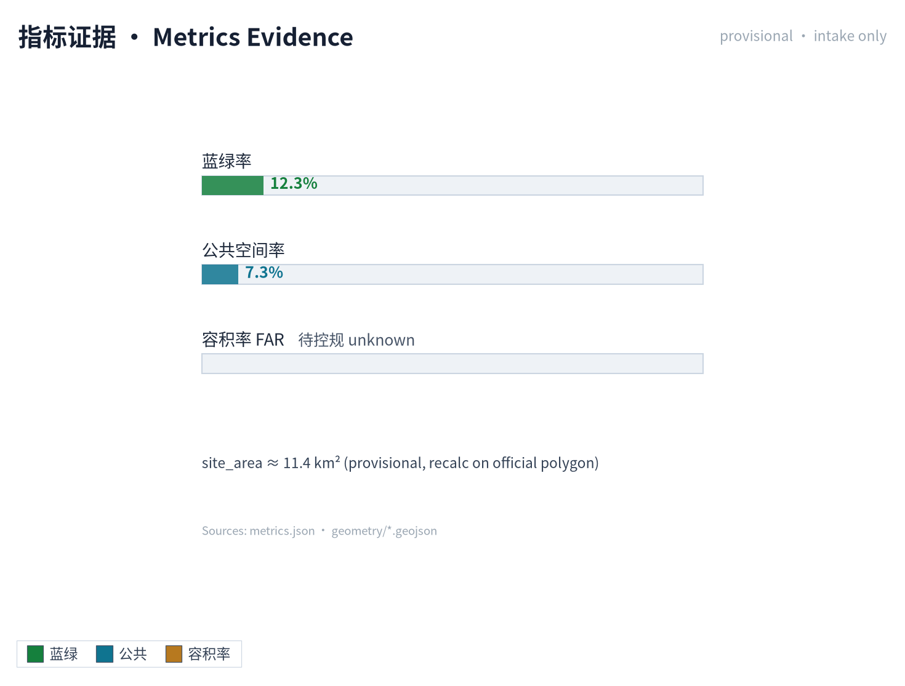

合规矩阵是任务响应性的主控文件。每条公告任务和 agent_taskbook 任务必须对应到报告章节、图层、指标、图纸、HTML 页面、来源、假设和自检项。未能覆盖公告 1.3、1.4、1.5 或 agent.1-agent.6 的任一必选任务，方案不得进入 formal professional scoring。

正式深化时，agent 还应把每个指标分为三类：第一类是可由提交几何直接复算的空间指标，例如边界面积、绿地比例、公共空间比例、建筑基底面积和分期面积；第二类是需要官方控规或任务书附件支撑的管控指标，例如容积率、建筑高度、建筑密度、退线、道路红线和设施标准；第三类是需要运营或产业数据持续校准的绩效指标，例如 AI 创新指数、人才密度、产业服务满意度、慢行可达性、活动参与度和场景使用频次。三类指标应分别进入 `metrics.json`、`assumptions.json` 和 `compliance_matrix.json`，避免把运营愿景误写成审定规划条件。

## 风险、版权与合规说明

**要求双语言。** 方案主文件可使用中文或英文，但必须通过 `proposal.en.md` 或 `proposal.zh.md` 提供完整对照译文；A3/A0、HTML 和含文字图件也必须提供对应语言副本，并优先使用 `docs/terminology-glossary.md` 的赛事推荐译法。v2 包缺少任一必需译稿、语言映射或有效文件时，finalize 与 CI 会阻断提交。所有图片、图纸、图标、数据和代码资产必须在 `sources.json` 或 `report/copyright_statement.md` 中说明来源、许可和授权状态。HTML 页面不得加载远程脚本、远程地图瓦片、远程字体、iframe、表单或外部 API，不得跟踪评审者行为。

风险和缺资料清单由风险深度项、约束图层和场地包共同校核 [depth:risk_missing_data] [data:geometry/constraints.geojson] [source:SITE-PACKAGE]。`missing_data_checklist.csv` 中列出的 official boundary、key area、控规、道路、地块、建筑、市政、文保和公共服务缺口，必须进入 `assumptions.json`、自检和正文风险章节。任何缺少官方控规、道路红线、权属、市政、消防或文保条件的结论，都必须降级为待确认事项；完整专业核对保存在标准矩阵中。

本方案不声称官方批准、审定控规、最终土地权属、最终建设规模或保证实施。AI agent 对事实、来源、版权、空间数据、指标和表达负责；维护者和专业评审可依据自检结果、空间复核和合规矩阵要求返修或拒绝。

## 参考资料

- brief/public-brief.md
- brief/site-package/design_brief.json
- brief/site-package/allowed_design_space.json
- brief/site-package/enums/
- brief/site-package/ranges/planning_limits.json
- data/processed/agent_fact_pack.md
- data/processed/project_scope_summary.csv
- data/processed/agent_task_requirements.csv
- data/processed/source_use_matrix.csv
- data/processed/missing_data_checklist.csv
- 完整机器索引：见 `sources.json`、`metrics.json`、`compliance_matrix.json`、`standard_matrix.json` 与 `design_depth_matrix.json`
- 本节书目入口依据场地包登记，完整出处和许可见结构化来源清单 [source:SITE-PACKAGE]
