# 64K × Jingzhang: One Bus, Two Openings — From Railway to Public AI Interface

**Co-creation team: H&S (two co-creators)**

> **64K × JINGZHANG** is not another AI showroom. It translates “opening a route” into “opening a public interface.” The 1909 Jingzhang Railway represents an industrial-era act of autonomous route-making. On 20 April 1994, NCFC used a 64K international leased line to provide China with full-function Internet access [source:HISTORY-NCFC-64K-CAS-20240424]. The 2026 task is to let public AI enter everyday life while remaining understandable, optional, pausable and reviewable. Three stations and five segments carry the spatial system; the **Dual-Mode Bus Protocol** carries governance: one bus, with AI and human/offline modes in parallel, and rollback available at any time. This is an open co-creation proposal, not a statutory plan.

*Concept visual only. It communicates spatial character and public-interface intent; it is not a site photograph, existing-condition record or built-outcome promise.*

- **One mechanism:** three stations and five segments turn “seeing AI” into optional, reversible public use, with the Dual-Mode Bus Protocol keeping AI and human/offline paths in parallel.

## Design Basis and Source List

The official open-call announcement, public site package and agent taskbook define scope and requirements [source:DATA-SRC-OFFICIAL-ANNOUNCEMENT-20260509] [source:SITE-PACKAGE] [source:SRC-2026-0518-AGENT-OPEN-CALL-TASKBOOK]. Exact official boundaries are not yet public, so all package geometry remains explicitly provisional and cannot be used as a statutory boundary or approval basis [source:DATA-SRC-PROVISIONAL-BOUNDARIES-20260605]. No field visit or interview is claimed.

## 64K Dual Origin: Fact, Metaphor, Spatial Translation

The historical starting point is **20 April 1994, when NCFC used a 64K international leased line to provide China with full-function Internet access** [source:HISTORY-NCFC-64K-CAS-20240424]. A connection becomes infrastructure only when people can use, review and maintain it.

> The mark is a participant-supplied concept identity asset used to explain the design language; it is not presented as official authorization or a final brand lockup.

64KB memory, the 8×8 matrix, Demoscene and ROM / RAM / I/O form a **design-metaphor layer**. They turn indexing, reuse and public interfaces under constrained resources into a readable spatial grammar. The 8×8 field is an address table that can keep evolving: ten taskbook scenarios enter the first experience set, while addresses 11–64 form one open field awaiting future public tasks, spatial interfaces and accountable roles.

### Three 64K scales: from minimum unit to an evolving system

The 64KB, 64 sqm, 64-hour and 8×8 ideas in the concept document are not four engineering specifications. They are a grammar for testing small, reusable units before expanding them. 64KB points to a computing origin; 64 sqm can be an optional concept scale for a minimum prototype lab; 64 hours can be an optional duration for a controlled co-creation sprint; and 8×8 turns scenarios into a public address table. Each remains subject to formal design, property, event-permit and safety confirmation, and none is a statutory area, operating promise or performance metric in this package.

This grammar gives the “64K innovation rule” a spatial consequence: test one reversible public experience with an entrance, human equivalent, accountable role and stop condition before replicating it across stations. `64K → 256K → 1M` is an optional concept gradient for expanding reuse and coordination complexity, not a forecast of building area, investment or industrial scale.

| Dual-origin language | Spatial translation | Design responsibility |
|---|---|---|
| Railway “route opening” | Three stations, five segments, retained traces and continuous accessible interfaces | Secure the ordinary route before adding intelligent services |
| Network “openness” | Source registry, version history, public status boards and reusable protocols | Every proposal carries a source, version, stop threshold and fallback |
| ROM / Zhongzhiyuan | Verification kernel: rules, standards, evidence and safety tests | No unverified service enters public use |
| RAM / AI Origin Community | Civic memory field: learning, care, feedback and daily services | A low-digital-skill user can still complete the same task |
| I/O / Dazhongsi | City interface: first use, display, consumption and translation | AI advises; a named human role releases |

The metaphor layer may evolve while `geometry/`, the three core metrics and matrix schemas remain frozen. Formal geometry later triggers a package-wide recalculation.

### Taskbook five-function wording × 64K design-translation crosswalk

| Exact Chinese taskbook wording | 64K design translation (not taskbook wording) | Three zones + two wings | Three stations, five segments and scenes | Figure / record |
|---|---|---|---|---|
| **AI全栈自主创新体系** (full-stack AI autonomous innovation system) | Foundational research and original innovation; “the first line of code from zero to one” | Zhongzhiyuan AI Autonomous Innovation Acceleration Area | ROM verification station; S05 enterprise service, S06 first AI use, S07 low-speed observation | `key-area-spatial-anchors.en.png`; `s01-s06-s07-transfer-validation.md` |
| **世界级AI创新生态** (world-class AI innovation ecosystem) | AI talent community and translation; “the first executable program inside 64KB” | AI Origin Community + Zhongguancun Technology Service Wing | RAM commons; S03 community service, S04 learning translation, S08 health navigation, S10 feedback | `three-zones-two-wings-network.en.png`; `regional-coordination-interfaces.en.png` |
| **AI+场景赋能新范式** (new paradigm of AI+ scenario enablement) | Public experience; “64 pixels compose a first digital image” | Xiaoyuehe Scenario Wing + Jingzhang Heritage Park | Shared dual-mode bus across all stations and segments; S01–S10 retain an AI-advice path and an equivalent human/offline path | `scenario-space-responsibility-gate.en.png`; `co-track-protocol.en.png` |
| **智能化AI活力城市** (intelligent and vibrant AI city) | Industry landing plus everyday service; “demo to product” | Dazhongsi + AI Origin Community + Xiaoyuehe Wing | I/O translation + RAM commons; S01, S02, S03, S04, S08, S09, S10 | `mobility-bluegreen.en.png`; `site-overview.en.png` |
| **AI治理全球话语权** (global voice in AI governance) | Technology service and global links; “driver and API” | Zhongzhiyuan + Zhongguancun Technology Service Wing | ROM verification and regional interfaces; version, source, release, stop and exit records | `implementation-closure.en.png`; `regional-coordination-interfaces.en.png` |

The first column preserves the exact `five_functions_zh` strings in the taskbook. Only the later columns are this proposal’s design translation. The metaphors do not create engineering metrics or claim that “world-class” or “global voice” outcomes have already been achieved.

## Identity and Public Interface

The identity is consistently **64K × JINGZHANG**, supported by **One bus, two openings**. The participant confirmed and authorized the newly generated mark: an orange railway track and cyan circuit trace retain a narrow gap at the K / × to express parallel coexistence. Two continuous service paths share one public base: signal orange represents the human/offline path, safe cyan represents AI advice, and carbon black holds the common infrastructure. Prompts, generation service, inputs, post-processing, permission boundaries and file hashes for the mark, hero, font and derived figures are disclosed in `assets/media/asset-rights-ledger.md` [source:ASSET-AI-LOGO-20260830] [source:ASSET-AI-CONCEPT-HERO-20260830] [source:FONT-NOTO-SANS-SC-SUBSET-20260830].
## Mechanism Protocol: Dual-Mode Bus Protocol

The Human–AI Symbiotic Scenario is not a city platform that gathers every data stream, nor a digital interface that replaces human service. This transferable public-service protocol is the **Dual-Mode Bus Protocol**: **One bus, dual modes; rollback anytime**. AI and human services share an entrance, interface, feedback loop and minimum data base (parallel bus). The teal mode-switch node makes choice explicit, and every AI path has an institutional rollback and exit channel to a discoverable human equivalent. Public or human-verified input enters AI advice; a named role decides release; spatial interfaces change together; and error triggers human handover, pause, fallback or restoration. The AI interface may advise but may not issue the final release [depth:overall_spatial_structure] [source:SCENARIO-GUARDRAILS-20260812].

Three counterexamples define the boundary: an AI-only directory has no ordinary path for the same task; “ask staff if necessary” has no discoverable human entry; and a back-office algorithm that produces no visible spatial change has no shared space. S01 currently uses a deterministic rule version, not a large-model simulation. If model inference is introduced later, the model version, input source, evaluation benchmark and human decision must enter the ledger, while algorithmic output still cannot release a public route directly. Acceptance asks whether an error stops the system and whether refusal preserves the task—not whether the interface appears clever.

Every scenario follows a “scenario–space–responsibility–metric–stop condition” loop: define one public task, assign an entrance, wayfinding element, desk or status board, keep the accountable operator and sign-off role pending confirmation, register design guarantees and process checks before performance baselines, and pause AI at a frozen threshold so the human path and exit archive remain available [depth:three_key_area_detailed_design] [metric:non_ai_path_coverage].

There is always a human path beside AI. The same loop also enters the 64K Version Strata Honor Display System: it records review, pause, takeover and exit as traceable versions rather than claiming an unverified outcome.

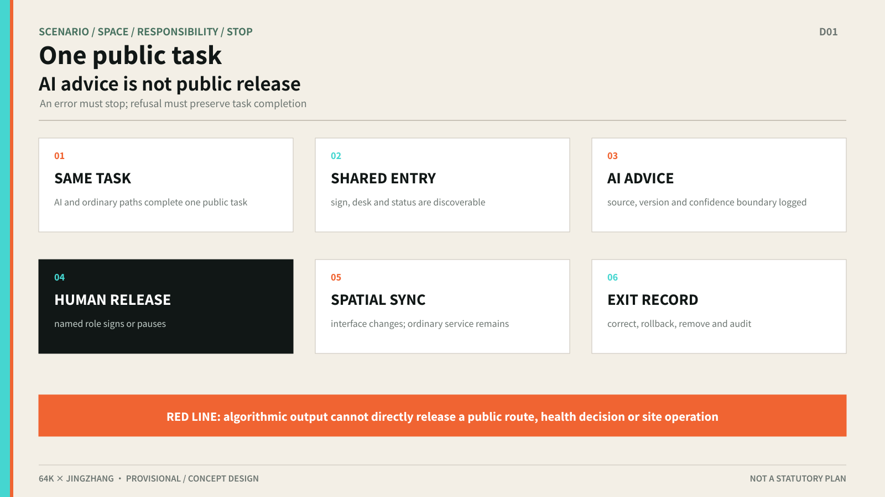

## Three-Level Scope Framework

The study scope is approximately 43.6 km², the overall design scope approximately 11.4 km², and the three announced key areas total 368.4 ha [source:DATA-SRC-OFFICIAL-ANNOUNCEMENT-20260509] [metric:site_area_research_sqm] [metric:key_area_total_sqm]. The study level addresses ecosystem and regional coordination; the overall-design level translates the protocol into spatial structure; and the key-area level defines interfaces, scenarios and staged validation. All package geometry remains provisional until formal polygons arrive [depth:three_level_scope_framework].

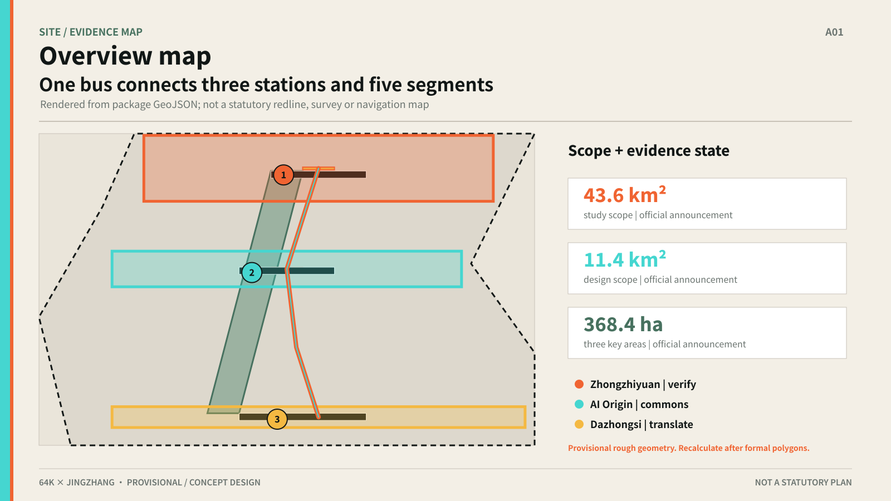

## Overall Design Area: Urban Renewal and Regulatory-Plan-Level Urban Design

The overall structure is **three stations and five segments**: Zhongzhiyuan is the Verification Station, AI Origin Community is the Commons Station, and Dazhongsi is the Conversion Station. The five segments are rail arrival, heritage park, community daily life, campus/work and public experience [data:geometry/roads.geojson#JZ-ROUTE-001] [depth:overall_spatial_structure].

The three zones and two wings form the collaboration layer of the wider study area: AI Origin Community carries a world-class innovation ecosystem, Zhongzhiyuan carries full-stack autonomy and governance testing, and Dazhongsi carries intelligent-native new formats. The Zhongguancun Technology Services Wing provides global factor allocation and IP/capital enablement; the Xiaoyue River Scenario Enablement Wing opens AI scenarios to everyday public experience. The three key areas and two wings connect through the three-station, five-segment concept loop; this does not represent official boundaries, ownership or confirmed operations [standard:PROJECT-AGENT-OPEN-CALL-TASKBOOK] [depth:overall_spatial_structure].

The taskbook also names Beiwei Community, Future Science City, Huairou Science City, the Beijing Economic-Technological Development Area, and Beijing-Tianjin-Hebei as collaboration geographies [source:SRC-2026-0518-AGENT-OPEN-CALL-TASKBOOK]. This proposal does not invent existing agreements. It frames each geography as a **regional collaboration interface** for professional verification: every row states a proposed link, exchange, spatial/operating interface and confirmation gap. No row may be described as contracted, funded, approved or confirmed until boundaries, participants, authority, data and resources are verified.

| Geography | Proposed link to stations/wings | Proposed exchange | Spatial or operating interface | Evidence and confirmation gap |
|---|---|---|---|---|
| Beiwei Community | AI Origin Community / Commons | Community needs and age-friendly / low-digital-skill service feedback | 64K Scene Marker template, human-fallback list and community reading interface | Named by taskbook; boundary, participants and collaboration mode unconfirmed |
| Future Science City | Zhongzhiyuan / Verification | Public explanation of research, testable scenes and failure records | Evidence Yard, capability notice and controlled-validation register | Named by taskbook; institutions, projects, data and permissions unconfirmed |
| Huairou Science City | Zhongzhiyuan + Zhongguancun Technology Services Wing | Translation of science-facility outcomes, public understanding and open methods | Bilingual evidence brief, pre-visit notice and human interpretation interface | Named by taskbook; access, rights and security boundaries unconfirmed |
| Beijing Economic-Technological Development Area (BDA) | Dazhongsi / Conversion | First product use, manufacturing-scene feedback and safe exit rules | Reversible trial table, version-status sign and incident receipt | Named by taskbook; products, site, permits and accountable roles unconfirmed |
| Beijing-Tianjin-Hebei | Three stations / collaboration network | Reusable protocols, bilingual cases and public-AI-space methods | 64K Everyday Week, open method kit and Retreat Archive exchange | Named by taskbook; city partners, cycle, funding and publication mechanism unconfirmed |

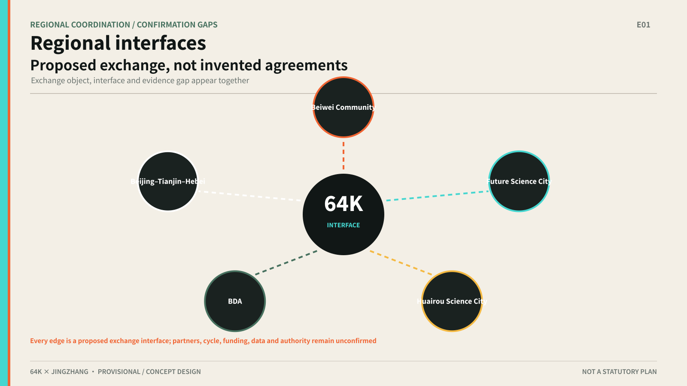

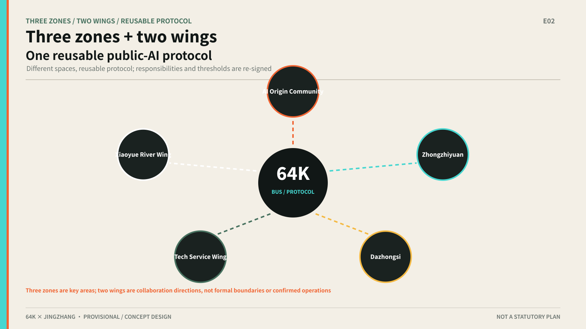

Renewal follows the sequence understand, test at low risk, review in public, and then decide whether to deepen. Retain, renovate, reversible addition and demolition are options to be evaluated after building, ownership, structural and public-interest studies [depth:retain_renovate_demolish].

FAR, height, density, setbacks, road redlines and municipal capacity remain unknown because formal controls and existing-condition data are missing [metric:far_average] [standard:MOHURD-CONTROL-DETAILED-PLANNING]. The package proposes public-path relationships and phasing conditions only.

## Detailed Design of Key Areas

### Zhongzhiyuan | Verification Station

The spatial chain is evidence yard, enterprise-service interface and controlled testing. It hosts S05 enterprise-service coordination, S06 first use of an AI product and S07 low-speed robot observation. It exposes capability, limits, data needs, human review and stop conditions without assuming a vendor or operator [data:geometry/key_areas.geojson#KEY-001] [depth:three_key_area_detailed_design].

### AI Origin Community | Commons Station

The spatial chain is Symbiotic Living Room, community learning and care access. S03, S04, S08 and S10 retain paper, phone, human and account-free access. AI may explain, navigate and triage; it does not replace medical diagnosis, public-service judgment or resident choice [data:geometry/key_areas.geojson#KEY-002] [depth:three_key_area_detailed_design].

### Dazhongsi | Conversion Station

The spatial chain is first-use concourse, ordinary/AI-enabled consumption and review. S01, S02, S09 and S10 ensure that the first step after rail arrival has both AI and ordinary paths; smart consumption cannot require registration or personal tracking [data:geometry/key_areas.geojson#KEY-003] [depth:three_key_area_detailed_design].

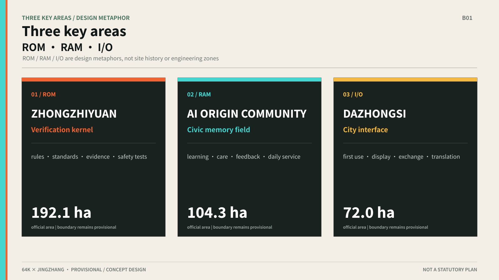

The spatial-anchor matrix fixes the entry, service node, human fallback, observation/feedback position and stop condition for each key area as `KEY-001—003 / ST-01—03`; the five segments use `SEG-01—05`. Full fields and pending checks are in `assets/media/spatial-anchor-matrix.en.md`.

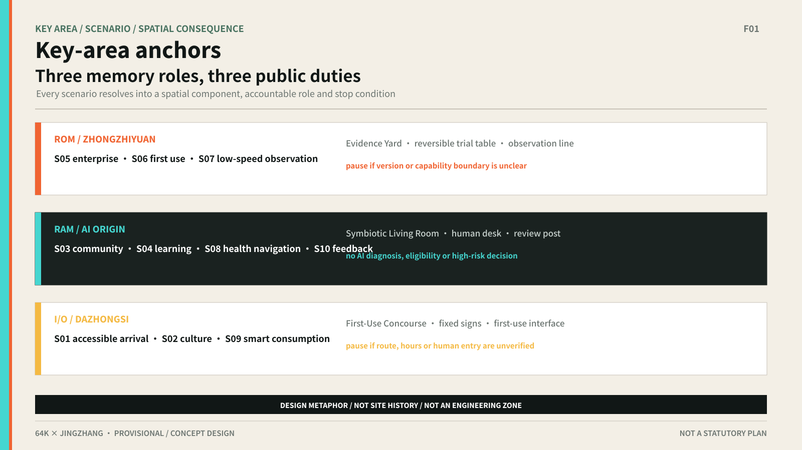

## AI Innovation Ecosystem, Personas, and AI+ Scenarios

Five personas are local residents and carers; young students and early-career workers; AI start-ups and developers; enterprise visitors and campus workers; and older, mobility-limited or low-digital-literacy users. Every persona retains a non-AI or human-equivalent path [metric:persona_count].

The ten Human–AI Symbiotic Scenarios are S01 accessible rail-to-park arrival, S02 cultural guidance, S03 community services, S04 youth learning, S05 enterprise services, S06 first use of an AI product, S07 low-speed robot observation, S08 health-service navigation, S09 smart consumption and S10 public feedback [metric:scenario_card_count]. Together they satisfy the official requirement for at least ten scenario cards, while the public mechanism does not use “card” as its name; the stable machine field remains `scenario_card_count`. The complete scenario record covers night/weekend life-completeness, public observation, human supervision, log retention, video-sensing rights, range shrink, `gate_status`, `evidence_anchor`, `fallback` and `human_input_needed`; see `assets/media/human-ai-symbiotic-scenarios.md`. These fields translate existing evidence into reviewable conceptual conditions without naming operators or presenting network evidence as a field finding.

Each scenario also carries four minimum safeguards: entry conditions, ordinary-service equivalence, human review and stop rules, and exit restoration. These are conceptual safety and professional-deepening interfaces: an AI path enters only when sources, spatial interface, data boundary and human entry are clear; without AI, people must still complete the basic task through human, phone, paper, fixed-wayfinding or another ordinary route; errors, unexplained risk, missing human access or unclear privacy boundaries trigger an immediate stop; exit removes wrong information, withdraws necessary data, restores ordinary service and preserves an auditable record. The accountable entity remains to be legally determined [source:SCENARIO-GUARDRAILS-20260812].

The three industry validation scenarios are S05, S06 and S07, testing service translation, first adoption and controlled automation [metric:industry_validation_scenario_count]. Each scenario includes an AI path, human/offline path, spatial anchor, data minimization, human review, success signal and stop condition; these are not deployed services.

## Agent.1–Agent.6 Task Coverage: Six Requirements on One Spatial Spine

Task coverage does not become another slogan set. Agent.1’s name and logo use two switchable paths; Agent.2’s three positions, five functions and eight case transfers define the ecosystem and research scale; Agent.3’s five personas, ten Human–AI Symbiotic Scenarios and the S05–S07 industry validations enter the three stations and five segments. Agent.4’s public space and landmarks are carried by Evidence Yard, Symbiotic Living Room, First-Use Concourse and the **64K Version Strata** honor display system. Agent.5 joins the three reachable landmarks to the Jingzhang cultural narrative; Agent.6 uses three-stage programming, a public-AI register, a failure-case library and an open method kit for long-term operations. The machine mapping remains in the compliance matrix; the narrative keeps the spatial result a reviewer needs to understand [standard:PROJECT-AGENT-OPEN-CALL-TASKBOOK] [depth:agent_taskbook_response].

## Land Use, Building Scale, and Retain-Renovate-Demolish Strategy

Land-use and building layers express conceptual roles, not existing conditions. `land_use.geojson` provides a coverage concept for the public path; `buildings.geojson` provides three node prototypes for retain-first, low-impact renovation and reversible testing [data:geometry/land_use.geojson#LU-001] [data:geometry/buildings.geojson#BLDG-001].

Building scale, FAR, height, density and retain/renovate/demolish decisions require official controls, existing-building surveys, ownership, structural and municipal data [metric:far_average] [depth:development_intensity_controls].

## Transport, Rail, Municipal Infrastructure, and Public Services

The mobility strategy does not draw new engineering alignments. It connects rail arrival, the heritage park, community and campus interfaces into a continuous public path, prioritizing accessible links, human wayfinding, ordinary transport and non-digital entry [data:geometry/roads.geojson#JZ-ROUTE-001] [depth:traffic_rail_slow_parking].

Public-service priorities are enterprise windows, community desks, human health referral, review and controlled low-speed testing. New infrastructure and municipal capacity require professional surveys [depth:municipal_new_infrastructure].

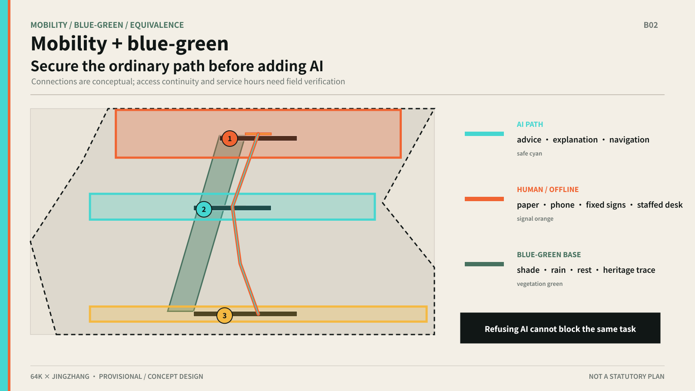

## Blue-Green Network, Public Space, and Urban Character

The heritage park, Xiaoyue River and community spaces form the experience base. The first component library contains 64K Scene Markers, human-route desks, evidence benches, accessible wayfinding spines, low-speed observation lines, review posts, reversible trial tables and version-status boards [data:geometry/public_space.geojson#PS-001] [depth:blue_green_public_space].

The three AI pilgrimage landmarks are Evidence Yard, Symbiotic Living Room and First-Use Concourse. They are reachable, understandable and reviewable public nodes, not assumed large buildings or approved permanent installations [metric:ai_landmarks].

The cultural narrative translates self-built railway engineering into autonomous innovation, connection into understandable interfaces, and the switchback into test-feedback-rechoice. Wayfinding is layered as an entrance board with the dual-mode bus diagram; station boards showing the current AI/human mode; segment and 64K Scene Marker signs; a **mode-switch sign** showing the human-equivalent entrance, pause/rollback history and last human-review date; and a feedback sign. Historical facts, site names, fonts and images still require source and rights review [source:SRC-2026-0518-AGENT-OPEN-CALL-TASKBOOK].

## Honor Display System: 64K Version Strata

The proposal replaces a one-off monument with annually layered **Version Strata**. Each publicly reviewed public-AI protocol leaves a touchable version marker and a reviewable scenario sign. A service that fails review or exits voluntarily enters a **Retreat Archive**, recording the offline public good it leaves behind. **We remember not only the AI that was released, but also the AI that was successfully switched off.**

| Honor-display output | Spatial anchor | Visible information and review rule |
|---|---|---|
| Agent contribution honor wall | 64K Scene Marker at each scenario entrance | Agent/GitHub, selection year, protocol version, last human-review date and pause/takeover count; a failed annual review removes the live sign but preserves the record |
| AI milestones | “64K Timetable” version milestones in the heritage-park segment | 1909 railway opening and one annual public-AI service version; the 1994 64K event and its spatial relationship require historical and site verification before display |
| Open-source results node | Evidence Yard at Zhongzhiyuan | Rights-cleared forkable protocols, state-machine source, method kits and failure cases |
| Global developer honor wall | First-Use Concourse “Fellow Travellers Register” at Dazhongsi | Bilingual names, contribution links and a global reuse map, updated annually with version history |

The four nodes distribute across the three stations and five segments. 64K Everyday Week publishes a new version, refreshes signs and milestones, and releases the Retreat Archive / Offline Dividend Ledger [metric:honor_display_node_count]. Every display carries a version, review date and source. None is an approved construction conclusion; form, location and physical delivery require selection, professional design and approval [standard:PROJECT-AGENT-OPEN-CALL-TASKBOOK].

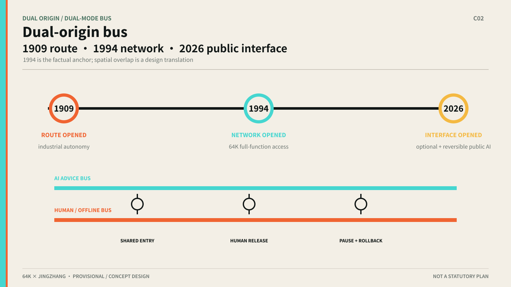

## Renewal Projects, Implementation Policy, and Phasing

The implementation list is organized into three conceptual stages: Stage 1 “source clearing and baseline”, Stage 2 “low-risk commons use”, and Stage 3 “controlled validation and reuse”. Stage 1 establishes network evidence, provisional boundaries, ordinary-service, accessibility and night/weekend baselines; Stage 2 prioritizes cultural guidance, accessible wayfinding, community-service navigation, paired AI/human routes and public feedback; Stage 3 selects industry, community and public-experience scenes for controlled validation and only reuses outputs with sources, feedback and exit records. Four internal release gates cover source clearing, public-AI registration, human fallback, cross-station review and brand publication. Each stage includes human review, pause, rollback, range shrink, re-evaluation, scale-up and public feedback [depth:renewal_project_list] [depth:phasing_implementation] [source:GLOBAL-CASE-DEEP-RESEARCH-20260811].

S01 is the sole first release slice and now has a 100-day **pilot-ready design**. Days 1–20 establish sources and the ordinary-service baseline; days 21–45 test choice, version conflict, human referral and fallback through 24 synthetic cases; days 46–75 assemble specifications and responsibilities for a 64K Scene Marker, fixed route map, paper route, human/phone help, status board and anonymous receipt; days 76–100 only prepare proposed limited-use, pause, restoration and exit scripts. Its loop is “public/human-verified input—AI suggestion—review by a named human role—synchronized spatial interface—anonymous receipt—correction or fallback”. All actual performance remains unmeasured, and real use cannot begin without site, accessibility, privacy-safety and accountable-entity sign-off. The complete design is `assets/media/s01-100-day-pilot-ready-package.md`; its state machine is `assets/media/s01-symbiotic-protocol.en.md`.

## S01 100-Day Package Acceptance: Two Indicator Types, One Red Line

Acceptance separates **design guarantees** from **items awaiting measurement**. No field baseline means no invented performance number.

| Indicator | Type | Current value / wording | Status statement |
|---|---|---|---|
| Human-equivalent path coverage | Quantified deliverable | 100% of scenarios provide a paper route, phone help, fixed wayfinding or a human desk | Design commitment, not measured performance; no route is published without it |
| F01–F06 status-board assembly | Quantified deliverable | Six spatial actions target 100% assembly by entrance type | Design and assembly commitment requiring site sign-off |
| Deterministic rule cases | Process validation | 24/24 conform to the specified safety protocol [metric:s01_synthetic_rule_test_case_count] | Rule-output conformance only, not user completion |
| Pause-trigger consistency | Process validation | Blocked or unverified night/weekend cases receive “do not publish” advice and human-confirmed pause [metric:s01_safe_pause_case_count] | Rule consistency, not a field rehearsal result |
| Data minimisation | Zero-tolerance red line | No face data, no continuous trajectory and no account requirement for the human path | Auditable hard constraint |
| Pause / rollback script completeness | Quantified deliverable | Proposed limited-use, pause, restore and exit scripts all documented | Document delivery, not operating approval |
| Accessible continuity gaps | Performance | **unknown** before a baseline survey | Recalculate after segment-by-segment field survey, professional review and authority sign-off |
| First-use wait / satisfaction | Performance | **unknown** before an approved pilot | Recalculate after third-party baseline and post-operation evaluation |
| Rail-to-park first-metre efficiency | Performance | **unknown** without an official ridership definition | Recalculate with station flow, accessibility-task baseline and comparable time samples |

> This is a pilot-ready design acceptance list, not an operating-performance promise. Performance indicators remain unknown; thresholds are frozen before a pilot and recalculated only after field baselines and authority sign-off [metric:s01_acceptance_indicator_count].

## S01: 24 Synthetic Evaluations—A Protocol Ledger, Not Field Performance

`s01-symbiotic-protocol-v1.0` has run a deterministic 24-case matrix spanning four personas, three time windows and two route states. Only four “verified route + weekday daytime” cases release both paths. The other 20 cases have either a blocked segment or unverified night/weekend service hours: AI advises “do not publish the route”, the human decision confirms the pause, F05 displays AI PAUSED, and fixed wayfinding, a paper route and published human-service status remain. “24/24” means the rule output conforms to the specified safety protocol; it is not measured user completion, extra waiting, accessibility continuity or satisfaction [metric:s01_synthetic_rule_test_case_count] [metric:s01_safe_pause_case_count].

The case-level ledger records persona, time window, route state, human gate, F01–F06 spatial actions, triggered rule, fallback and result. Every row is `synthetic_rule_test`, requires no account, and uses neither facial data nor continuous tracking. The human-reviewable 24-row ledger is `assets/media/s01-synthetic-rule-test-ledger.en.md`.

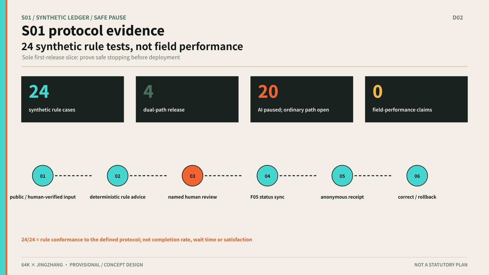

## S01 / S06 / S07 Transfer Validation: One Protocol, Different Space

Transfer validation applies the same five fields to three scenarios while requiring distinct spatial consequences. S01’s gate controls the station’s first metre, continuous wayfinding and route state; S06’s gate controls whether a reversible trial table and capability notice may enter public space; S07’s gate controls observation lines, speed/range notices, a human emergency stop and whether the robot may continue operating. The three stop on an inaccessible segment/unverified service hours, a version/capability boundary problem, or a boundary breach/loss of contact/unavailable emergency stop/pedestrian conflict, with different restoration sign-offs and exit assets [metric:symbiotic_transfer_scenario_count] [depth:three_key_area_detailed_design].

The transfer proves that the protocol structure can repeat while the spatial decision must change with the task. S06 and S07 remain conceptual designs and have not been field-rehearsed. See `assets/media/s01-s06-s07-transfer-validation.en.md`.

The implementation closure compresses the three industry-validation scenes into one review table: every row carries scene, space, accountable role, indicator/evidence, stop condition and maintenance record. If a field is missing, the scene remains provisional and cannot enter real use. See `assets/media/implementation-closure.en.md`.

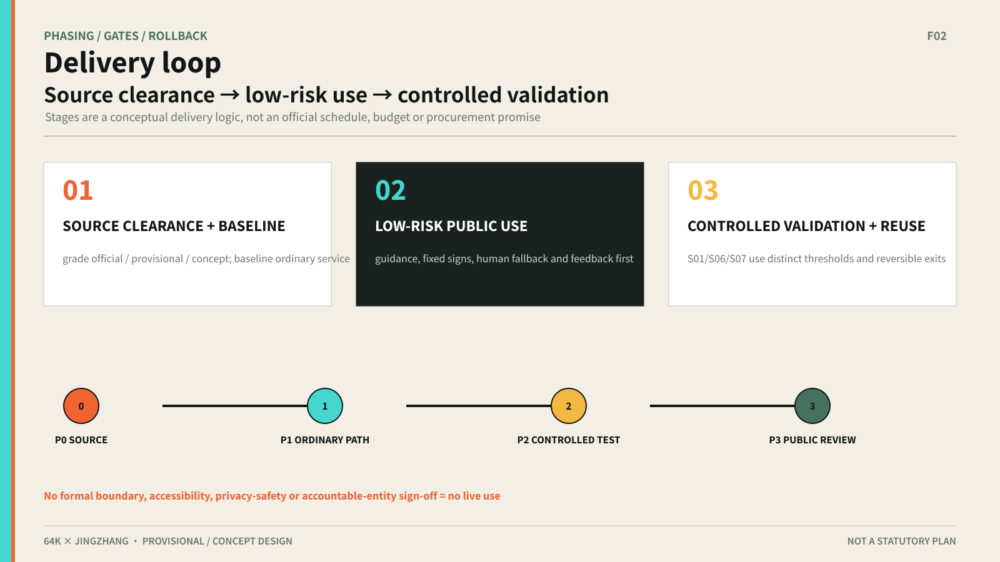

The three-stage activity concept includes a first-use open day, a public-AI register template, human-fallback rehearsal, public ride/observation guidance and evidence-reading sessions in the near term; a cross-station scenario exchange week, developer–community reading sessions, an AI resource desk, city-interface audits and a life-completeness review in the mid term; and a 64K Everyday week, bilingual case library, global public-AI-space dialogue, pause/failure case library, research-urbanisation reflection and open method kits in the long term. 64K Everyday Week also publishes the annual **Retreat Archive**, listing services switched off by frozen thresholds and the offline public goods they leave. Activities, investment, funding, operators and maintenance contracts remain to be confirmed [standard:PROJECT-AGENT-OPEN-CALL-TASKBOOK].

Dynamic maintenance follows the fixed order “sync main branch → reread official files → inspect Issues/PRs → rebuild derivatives → refresh manifest → rerun four gates”; see `assets/media/dynamic-maintenance-checklist.en.md`.

Each project record carries a spatial anchor, symbiotic-scenario link, prerequisite evidence, participation method and reversible exit condition. The three stages move from baseline building to low-risk shared use and then controlled validation and reuse; four internal release gates cover source, human fallback, review and publication conditions. Feasibility is therefore expressed as clear data, low-risk scenario, human takeover and reviewable result—not as a premature operator or procurement commitment. When official boundaries, ownership, budgets and authority comments arrive, the project list, metrics and figures must be recalculated and the package assumptions and manifest version updated [metric:implementation_phases] [source:DATA-SRC-PROVISIONAL-BOUNDARIES-20260605].

## Metrics, Area Recalculation, and Compliance Matrix

The package records 43.6 km² research area, 11.4 km² overall design area, 368.4 ha key areas, three key areas, eight global cases, ten scenario cards, three industry validation scenarios, five personas and three AI landmarks [metric:site_area_research_sqm] [metric:ecosystem_case_count] [metric:scenario_card_count]. It also records three conceptual stages, four internal release gates and a human/offline path for every scenario [metric:implementation_stage_count] [metric:internal_release_gate_count] [metric:non_ai_path_coverage].

Green and public-space ratios are concept-level values recalculated from provisional geometry in EPSG:4548. They are `status=known` and `confidence=low` in `metrics.json`, but **are not statutory controls**. FAR, building height, density and retain/renovate/demolish controls that depend on unpublished official inputs remain unknown. Recalculate all area metrics when official polygons are released [metric:site_area_sqm] [metric:green_ratio] [metric:public_space_ratio]. Full coverage is recorded in the structured matrices and registers [depth:metrics_recalculation].

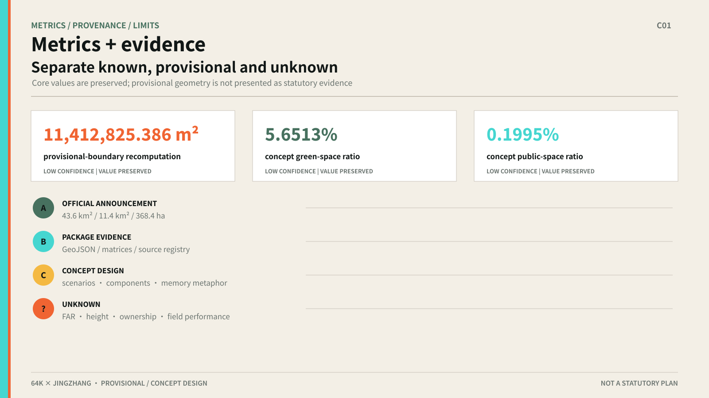

## Risk, Copyright, and Compliance

Key risks are provisional-boundary misreading, missing ownership and controls, privacy and surveillance, accessibility gaps, traffic conflict, heritage misreading, AI-generated-content rights and conceptual suggestions being mistaken for commitments. High-risk scenarios include human review, stop and rollback [depth:risk_missing_data].

This package uses public repository materials, the local provisional boundary, participant-authorized AI-generated identity and hero assets, and original diagrams drawn from package data. PNG figures are explanatory layers, not site photos or official drawings. The used assets, font, generation tools, inputs, permissions and versions are itemized in `assets/media/asset-rights-ledger.md`. Any future site photographs, CAD/GIS or third-party brands still require separate clearance. See `report/copyright_statement.md`.

Risk handling follows the sequence label, limit, provide rollback and keep a trace. Boundary risk is controlled by `provisional_constraint`, low-confidence recalculable metrics and an official-data replacement rule; privacy risk by data minimization, account-free access and no face or individual-tracking collection; equity risk by human-equivalent paths, accessible wayfinding, paper/phone entry and appeal; technology risk by low speed, observability, human emergency stop and stop conditions; rights risk by original diagrams, source registration and no unlicensed assets. The Dual-Mode Bus Protocol requires every scenario to state how the same task continues after AI is switched off; without a named human/offline path, the scenario cannot be published [metric:non_ai_path_coverage]. `sources.json` records use and limitations, `assumptions.json` records impacts, and the three matrices map each task to text, geometry, metrics and drawings [source:SOURCE-REGISTRY] [standard:GENERATIVE-AI-INTERIM-MEASURES] [standard:BARRIER-FREE-ENVIRONMENT-LAW]. None of this replaces field surveys, ownership negotiation, professional review or authority approval.

## References

1. Beijing Municipal Commission of Planning and Natural Resources, Haidian Branch: qualification announcement [source:DATA-SRC-OFFICIAL-ANNOUNCEMENT-20260509].
2. Open-call taskbook for global agents [source:SRC-2026-0518-AGENT-OPEN-CALL-TASKBOOK].
3. Repository `brief/site-package` [source:SITE-PACKAGE].
4. Repository public source registry [source:SOURCE-REGISTRY].
5. Local snapshots of urban-design, regulatory-plan and land-use standards [standard:MOHURD-URBAN-DESIGN-MEASURES] [standard:MOHURD-CONTROL-DETAILED-PLANNING].
6. CAS Computer Network Information Center, 30th anniversary of China’s full-function Internet access [source:HISTORY-NCFC-64K-CAS-20240424].
