# ALL SHIFTS JING-ZHANG

> **One city, every shift.** The innovation belt belongs not only to researchers, but also to the people who clean streets before dawn, maintain equipment, deliver meals, guard stations, run small shops and care for families. “All Shifts” brings those workers from the background into the shared design of space, services and AI governance.

## Design Basis and Source List

The official announcement and agent taskbook define scope, tasks and evidence boundaries; the repository site package is a structured guide, not a new statutory authority [source:OFFICIAL-ANNOUNCEMENT] [source:AGENT-TASKBOOK] [depth:existing_conditions_diagnosis]. The 43.6 km² research area, 11.4 km² overall design area and approximately 368.4 ha across three key areas come from the announcement. Submitted polygons are **provisional rough boundaries**, not official redlines.

The provisional overall polygon recalculates to 11,412,825.386 m² [data:geometry/site_boundary.geojson#SITE-001] [metric:site_area_sqm]. Key-area names and count have official textual support, but their polygons remain provisional [data:geometry/key_areas.geojson#PROV-KEY-001] [metric:key_area_count]. FAR, height, density, setbacks, road redlines, ownership, utilities, fire safety and heritage constraints remain unknown.

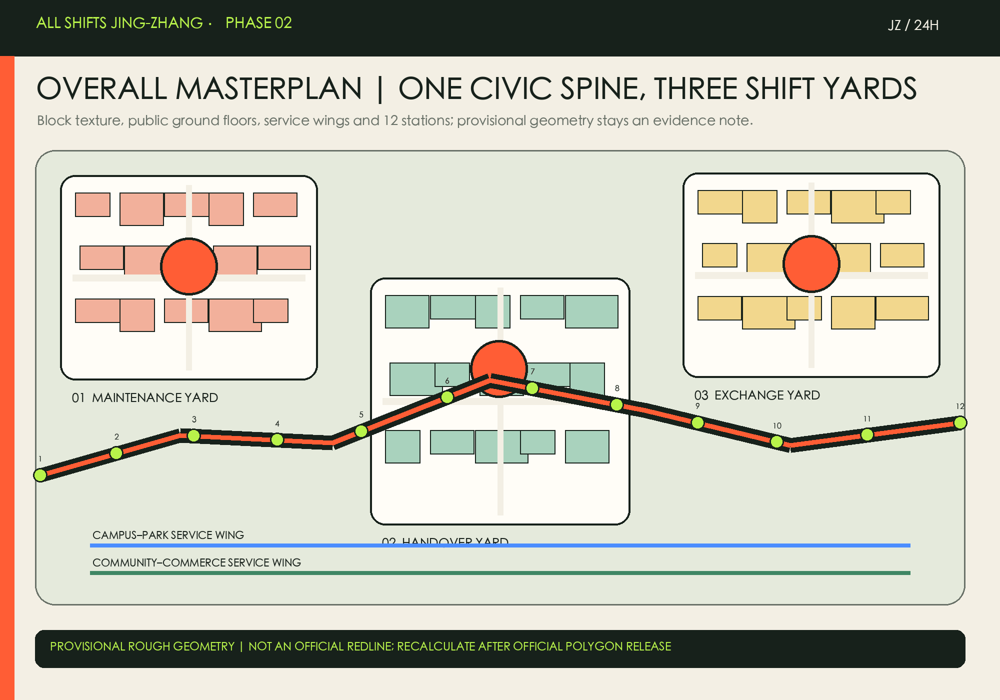

## Three-Level Scope Framework

The three levels form one chain: the 43.6 km² research level asks who counts in the innovation ecosystem; the 11.4 km² overall level asks how support enters urban renewal; the three key areas test how places work during daily shift changes [depth:three_level_scope_framework] [depth:overall_spatial_structure] [standard:PROJECT-OFFICIAL-ANNOUNCEMENT].

The concept is **one Shift Commons Spine, three Shift Yards, two service wings and twelve Shift Stations**. The stations provide no-scan rest, water, toilets, charging, staffed help and shift information. This is a conceptual service network, not a new statutory road or facility redline.

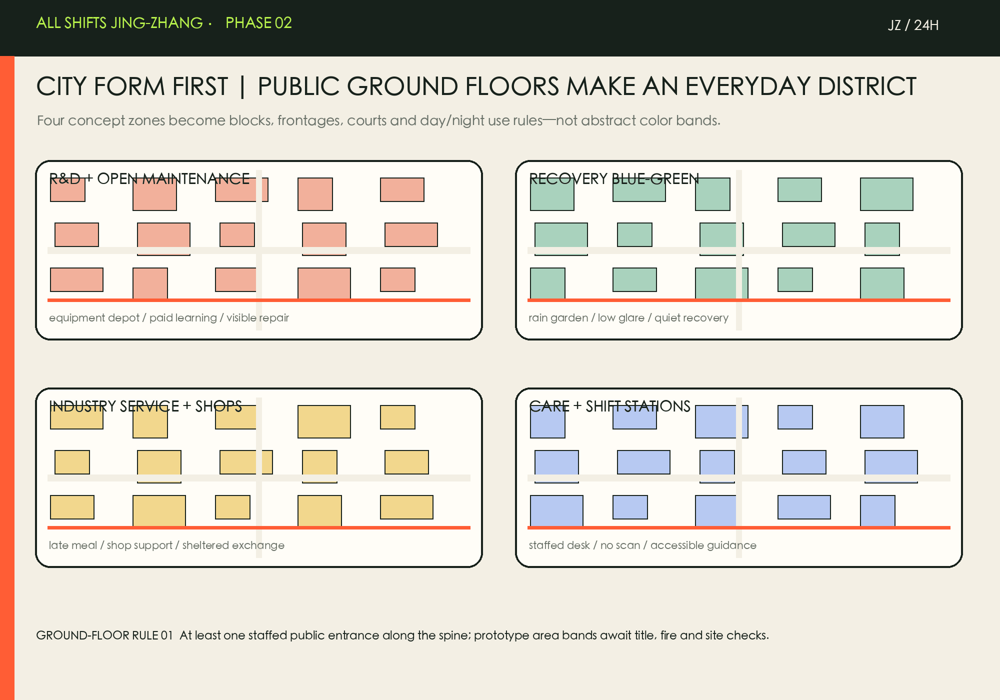

## Coordinated Research Area: Industry and Future City Research

The full AI stack includes not only models, compute, data and applications, but also installation, maintenance, cleaning, delivery, security, customer service and care. The name “Shift” evokes work shifts, working together, and railway services. Two parallel rail lines meet at a handover mark to form the **JZ / 24H** identity [source:AGENT-TASKBOOK] [standard:PROJECT-AGENT-OPEN-CALL-TASKBOOK].

| Case | Transferable mechanism | Jing-Zhang translation |
| --- | --- | --- |
| one-north, Singapore | A work-live-play-learn ecosystem uses public space programming to turn an R&D estate into an everyday district. | Transfer the co-location of research and everyday services, not its scale. |
| STATION F, Paris | Program-based services connect founders instead of treating the campus as office floor area alone. | Give frontline operators equally visible training, grievance and support programs. |
| MaRS, Toronto | A partnership and technology-adoption platform links ventures, institutions and urban challenges. | Turn equipment-maintenance and public-service needs into auditable challenge briefs. |
| Knowledge Quarter, London | A cross-institution knowledge cluster also prioritizes place, public access and people networks. | Expand the district definition of talent to the people who keep the city operating. |
| Maria 01, Helsinki | Adaptive reuse of former hospital buildings hosts a startup community. | Prioritize safe ground-floor reuse for shift stations and training rooms. |
| Cortex Innovation Community, St. Louis | District development and operations explicitly address inclusion, equity and design guidance. | Make labor dignity, accessibility and non-surveillance rules part of scenario admission. |

These are background mechanism references, never local control evidence [source:CASE-ONE-NORTH] [source:CASE-CORTEX]. The transfer combines mixed daily life, programs, partnerships, public access, adaptive reuse and equity admission.

## Overall Design Area: Urban Renewal and Regulatory-Plan-Level Urban Design

Four concept zones cover the provisional boundary: R&D and open maintenance learning; blue-green recovery and safe night-time open space; industry services and small-shop support; community care and Shift Station services [data:geometry/land_use.geojson#LU-001] [depth:land_use_layout] [standard:MNR-LAND-USE-CLASSIFICATION-GUIDE]. They are design propositions, not statutory land-use amendments.

The building rule is “identify before classifying”: retain and open safe, valued ground floors; renovate reusable but closed buildings; consider demolition only after professional surveys show unsafe and non-repairable conditions. The 310,807.184 m² footprint is concept geometry [data:geometry/buildings.geojson#BLDG-001] [metric:building_footprint_area_sqm]. Height, massing and retain-renovate-demolish decisions require official conditions [depth:height_massing_character] [depth:retain_renovate_demolish]. Development intensity remains unknown [standard:MOHURD-CONTROL-DETAILED-PLANNING] [depth:development_intensity_controls].

## Detailed Design of Key Areas

The three Shift Yards share one ethic and distinct roles; provisional polygons are only concept locators [depth:three_key_area_detailed_design]. Their north–south order and announced areas organise the working pack but do not anchor a station, road, title, or four-quadrant extent. In particular, `PROV-KEY-003` has not been location-verified against Dazhongsi Station or an official road polygon, so “Dazhongsi Exchange Yard” names a concept role, not the formal extent of the station intersection [data:geometry/key_areas.geojson#PROV-KEY-001] [data:geometry/key_areas.geojson#PROV-KEY-003] [source:KEY-AREA-LOCATION-REVIEW].

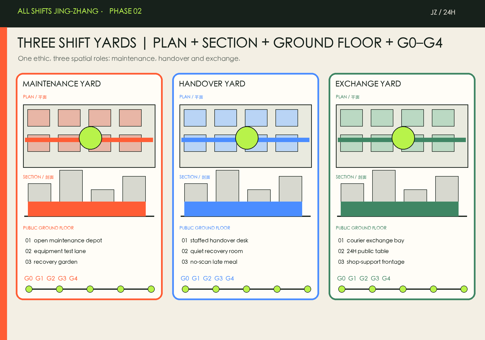

| Key area | Role | Spatial action | Launch scenarios |
| --- | --- | --- | --- |
| Zhongzhiyuan | **R&D meets maintenance** | Open Maintenance Depot, equipment test lane and recovery landscape at active ground floors | Maintenance copilot, paid reskilling, algorithm duty board |
| Beijing AI Origin Community | **Learning meets care** | Human handover, quiet room, near-campus learning and 24-hour neighborhood services | Human handover, accessible wayfinding, no-scan meals |
| Dazhongsi | **Exchange meets small business** | Public table, courier bay and small-shop support around interchange walking links | Courier exchange, shop copilot, emergency and grievance |

Announced areas are approximately 192.1 ha, 104.3 ha and 72.0 ha. All locations require site, title, fire, traffic and heritage verification.

## Phase 2 Deepening: From Concept Network to Operable Urban Space

This revision turns All Shifts into three legible urban forms: the Zhongzhiyuan **Maintenance Yard**, AI Origin **Handover Yard**, and Dazhongsi **Exchange Yard**. Each links plan, typical section, public ground floor and G0–G4 delivery gates. Public interfaces are district infrastructure, not leftover building area.

### Twelve Shift Stations: four prototypes

Stations use four **non-statutory prototype bands**: S (18–25 sqm), M (45–70 sqm), L (120–180 sqm) and XL (300–500 sqm), suggested as 3×XL + 3×L + 3×M + 3×S. Exact sites and areas require title, fire, accessibility and operational checks plus paid worker co-design; these bands are not approval quantities.

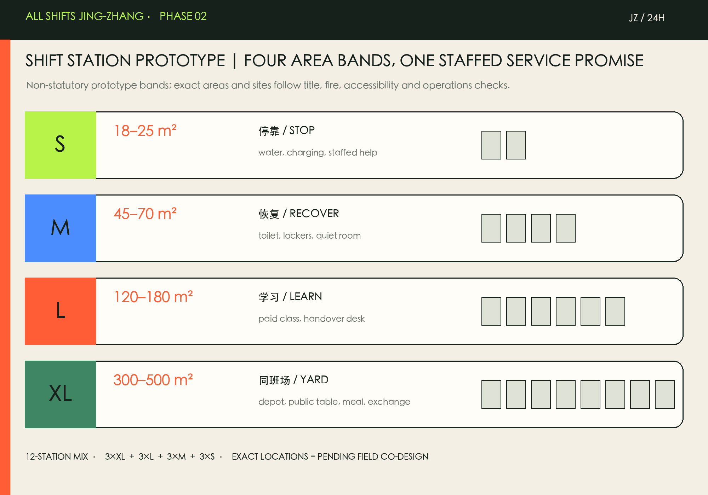

### Four handovers a day

06–10 supports morning handover and deliveries; 10–18 learning, repair and public service; 18–24 courier exchange, late meals and community use; 00–06 recovery, emergencies and equipment care. Space changes mode, while staffed escalation, no-scan access, accessible routes and public duty boards stay online.

### From concept to accountability

Delivery uses five gates: G0 paid co-design, G1 title/fire/access checks, G2 a 90-day reversible pilot, G3 independent privacy/labor/accessibility audit, and G4 scale—revise—stop. Relative CAPEX/OPEX compares effort, not cost; leads are actor types, not confirmed appointees.

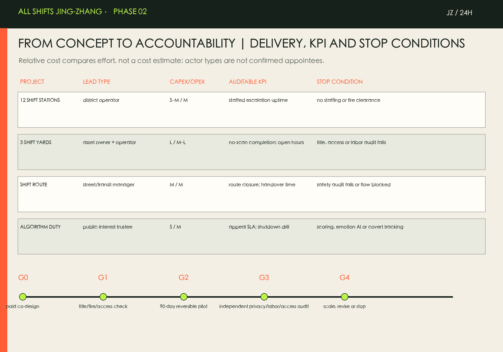

Auditable KPIs include staffed-escalation uptime, no-scan completion, median handover time, accessible-route closure hours, paid co-design sessions, appeal SLA and shutdown-drill pass rate. Personal scoring, emotion recognition, covert tracking, automated punishment or missing staffed access triggers shutdown.

The following generative images translate the proposal text into conceptual atmosphere and use relationships. They are not site photographs, final designs or official evidence.

## Phase 3: Zhongzhiyuan Maintenance Yard 90-Day Reversible Pilot Package

Zhongzhiyuan is the first prototype for “R&D meets maintenance”; it is **not a confirmed project, site, investment or construction scheme**. The official call asks this area to deepen the AI full-stack ecosystem, standards and safety governance, green-space scenarios, Qinghe culture and a garden-style innovation district. Exact parcels, title, buildings, fire, transport and utilities remain unavailable in public materials. This package therefore proposes only a removable, auditable, pausable 90-day method; it asserts no building or development quantity [source:OFFICIAL-ANNOUNCEMENT] [data:geometry/key_areas.geojson#PROV-KEY-001].

### Five reversible spatial components

After G1 site verification, five movable components temporarily organize a public ground floor: a staffed threshold, non-production maintenance bench, paid learning table, handover-and-appeal desk and recovery garden. They make maintenance visible, human help reachable, learning accessible and exit possible. They do not connect to production systems, collect personal performance data or imply permanent alteration. If title, fire, accessibility or safety conditions fail, components are not installed or are removed [standard:PROJECT-AGENT-OPEN-CALL-TASKBOOK].

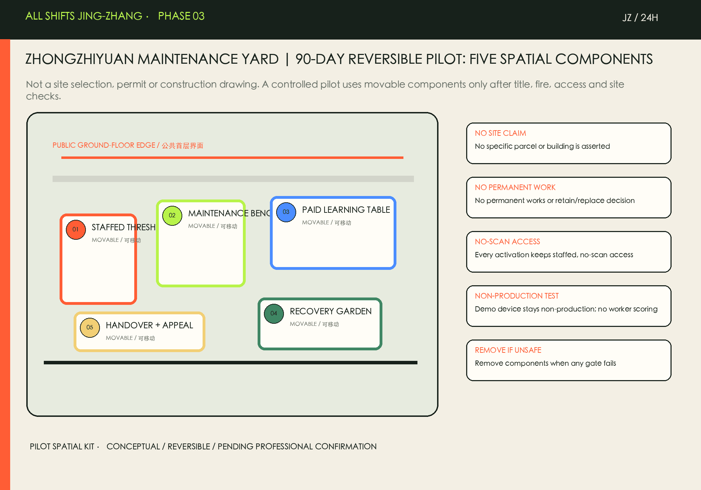

### 90-day rhythm and four-shift template

Days 01–14 are paid co-design: maintenance technicians, cleaning/property workers, researchers, access users and operations representatives define activation hours, kit, staffed handover and appeal path. Days 15–30 cover only site, duty, fire, accessibility, power and removal checks. Only on days 31–75 may booked and public sessions run non-production maintenance demonstrations, paid learning and staffed handover. Days 76–90 use independent review to scale, revise or stop. The 06–10, 10–18, 18–24 and 00–06 templates activate only where paid staffing and safety checks are complete; without staff or conditions, the service does not open [metric:pilot_day_count] [metric:pilot_gate_count].

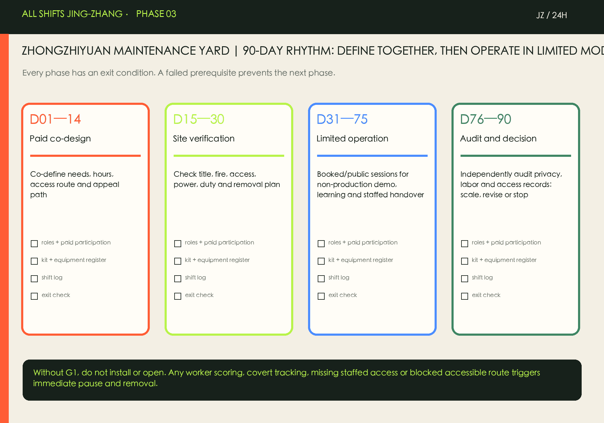

### A shift log is not worker scoring

The pilot records only service access, completed staffed handovers, accessible-route closure, resolved problems and appeal closure. Logs use time windows, de-identified events and public monthly summaries. Personal performance, emotion, precise traces and production work orders are prohibited. Every activation needs staffed, no-scan access. Personal scoring, emotion recognition, covert tracking, automated punishment, production-system connection, missing staffed access or unrepaired access blockage immediately pauses and removes the pilot for independent review [source:AGENT-TASKBOOK] [standard:GENERATIVE-AI-INTERIM-MEASURES].

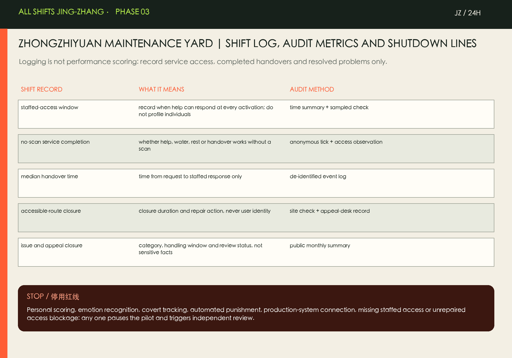

Pilot “success” is not a pre-set investment, efficiency or footfall number. It is evidence for five auditable questions: can service be used without a scan; is human escalation available; is handover timely; does the accessible route remain usable; and are problems handled traceably? Official geometry and specialist conditions remain required before any expansion, with final judgment by professional teams and participants.

### G1 site-verification checklist (local working edition)

Before any installation or opening within the 90-day pilot, seven domains must be checked on site: scope and authorisation; fire and personal safety; a continuous accessible route; power and equipment isolation; duty and paid participation; notices/data/appeal; and removal/incident readiness. Each domain needs verifiable evidence, an accountable role and a pass/hold decision. Any missing or failed item means no installation and no opening. G1 only asks whether a reversible pilot may begin; it never substitutes for approvals or specialist conclusions on design, fire, title, labor or accessibility [standard:BARRIER-FREE-ENVIRONMENT-LAW] [metric:g1_verification_domain_count].

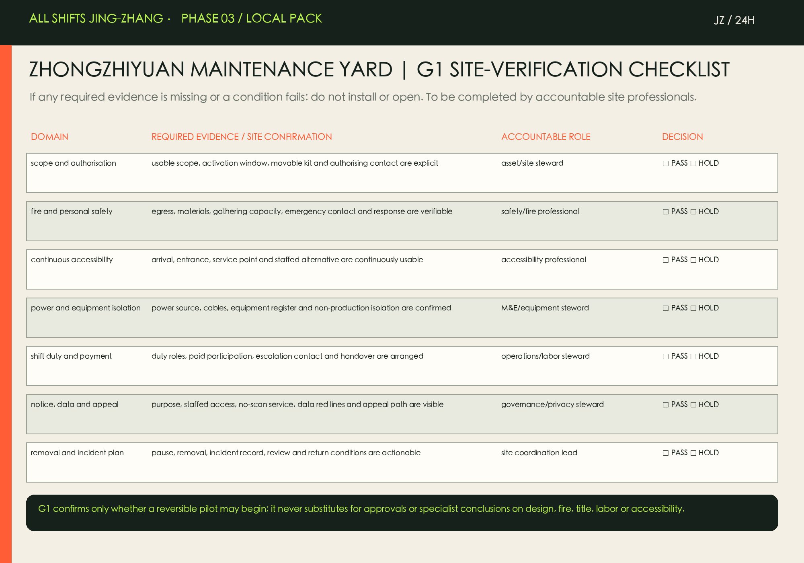

### Paid co-design workshop kit (local working edition)

Co-design is not unpaid interviewing. Maintenance technicians, cleaning/property workers, AI R&D, access/care users and asset/operations form five baseline role types. A five-step session—boundary and payment, a shared walk, issue cards, kit arrangement, and prioritisation/handover—produces requested service windows, an access-and-staffed-help map, a five-component kit, stop conditions, a G1 evidence-owner sheet and a public note. Payment, work-time status, personal-data handling and recording rules must be agreed in writing before the session; without agreement there is no recruitment or recording [source:AGENT-TASKBOOK] [metric:codesign_participant_role_count].

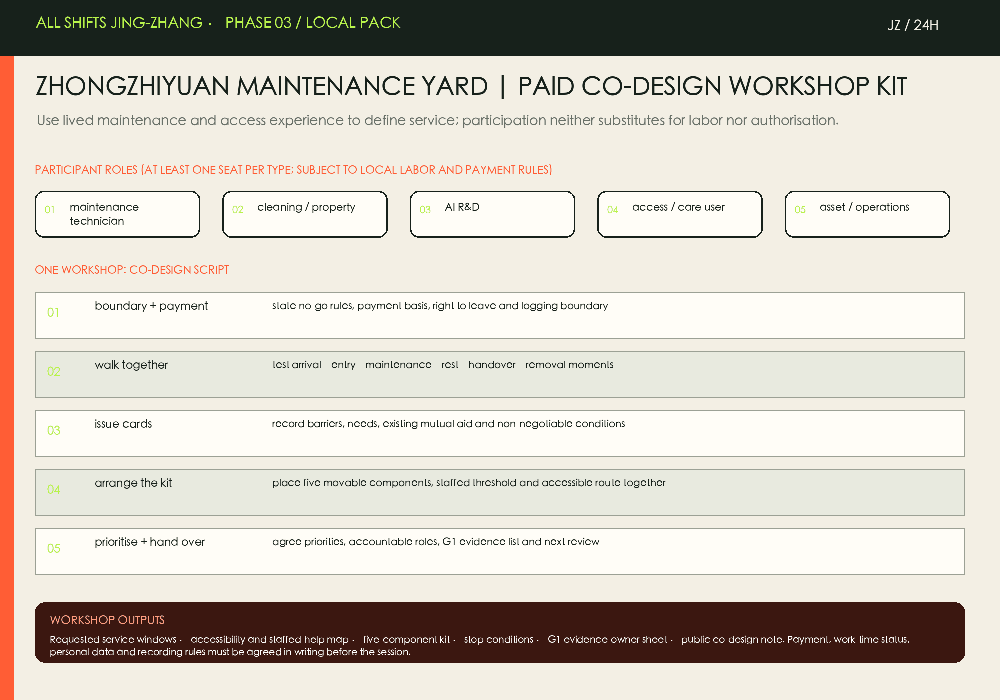

### Shift-log template (local working edition)

The shift form records only activation conditions, service access, staffed handover, route repair, issue/appeal handling, closing/removal and next review, aggregated by role and de-identified event. It never records names, personal performance, emotion, precise location or production work orders. Each shift checks staffed access, no-scan service, continuous accessibility, equipment isolation and removability; any shutdown line is marked as pause/remove and receives independent review [standard:GENERATIVE-AI-INTERIM-MEASURES] [metric:shift_log_record_category_count].

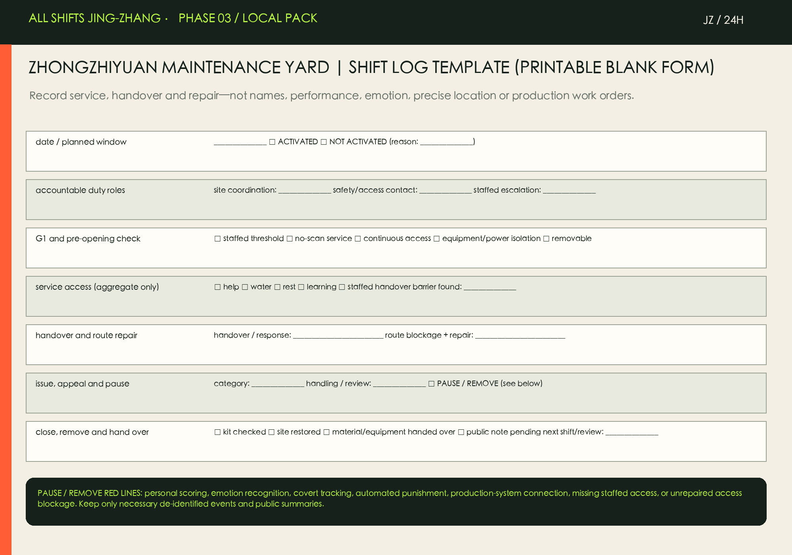

## Phase 3 Deepening: Three Areas × Daily Action Scripts

These daily scripts place the three Shift Yards within four parts of one day: 06–10 arrival and morning handover; 10–18 shared work, learning and care; 18–24 late meals, exchange and community service; and 00–06 recovery, emergency and safe departure. They are not confirmed rosters, footfall forecasts, field surveys or implementation authorisation. They organize existing personas, scenario cards and spatial prototypes as a conceptual workflow: how someone arrives, gets a service, hands over in space and turns to a person [metric:daily_script_area_count] [metric:daily_script_shift_count].

The Zhongzhiyuan Maintenance Yard lets maintenance technicians, researchers and staffed support hand over in a public ground floor: morning separates equipment arrival from walking; daytime shares the maintenance bench and learning table; evening uses a staffed desk for help and appeal; night checks removable components and restores the garden. AI only handles authorised equipment state or document support; it never records personal performance [source:AGENT-TASKBOOK].

AI Origin Handover Yard puts learners, caregivers and low-digital-literacy users in one service chain: visual, audio and staffed guidance support near-campus arrival; learning tables, rest seating and a service desk connect by day; no-scan meals, appeal and quiet recovery remain through the evening. AI offers only explainable orientation or service assistance; it never replaces care judgment or infers identity or emotion [standard:BARRIER-FREE-ENVIRONMENT-LAW].

Dazhongsi Exchange Yard organizes transfers, short rests and safe departure for couriers, small-shop operators and night workers: morning separates transfer, delivery and walking; daytime opens the Shift Table and small-shop interface; evening combines sheltered exchange, late meals and a walking route; night retains staffed help and appeal referral. AI only publishes aggregate orientation or assists shop operations with owner-controlled data; it never tracks personal routes, automatically punishes or blocks users [standard:GENERATIVE-AI-INTERIM-MEASURES].

At every yard and hour, staffed access, no-scan service, a continuous accessible route and public duty information stay online. Missing staffed access, blocked accessibility, covert tracking, personal scoring, automated punishment or production-system connection means pause and do not open. The scripts do not substitute for real site, fire, title, labor or professional-verification conclusions.

## Phase 5 Deepening: Three Areas × 84-Second Accessible Tour

The offline tour condenses the four action-script windows into an 84-second mute-comprehensible sequence: Zhongzhiyuan maintenance and staffed handover at 06:00–10:00; AI Origin learning, care and accessible wayfinding at 10:00–18:00; Dazhongsi transfer, short rest and help at 18:00–24:00; and recovery with safe departure at 00:00–06:00. The video uses only existing conceptual scenes, script diagrams and abstract route/service overlays. Chinese and English each have captions and a full transcript; no narration, music or scan is needed to understand it [metric:accessibility_tour_duration_seconds] [metric:accessibility_tour_time_window_count].

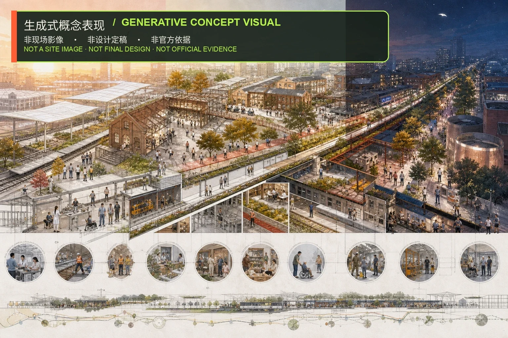

[Play the tour in the offline visual](visual/index.en.html#accessible-tour) · [中文文字稿](assets/media/three-area-access-tour-zh.md) · [English transcript](assets/media/three-area-access-tour-en.md)

The tour remains a design-research presentation: it does not confirm actual sites, rosters, footfall, opening hours or implementation authorisation. Every segment assumes AI assistance only, staffed access, no-scan service and a continuous accessible route. Missing staffed access, broken accessibility, covert tracking, personal scoring, automated punishment or production-system connection means pause rather than continue [metric:accessibility_tour_silent_equivalence_count].

## Three Key Areas Operating and Audit Upgrade Pack

To avoid “scenarios without operating evidence”, this upgrade gives the three Shift Yards one independently reviewable operating-and-audit pack: Zhongzhiyuan Maintenance Yard focuses on R&D, maintenance and paid learning; AI Origin Handover Yard focuses on learning, care and staffed service; Dazhongsi Exchange Yard focuses on transfer, delivery, small-business service and safe night departure. All three use G0 paid co-design, G1 site-and-duty verification, G2 reversible activation, G3 independent audit, and G4 scale–revise–stop. A failed check means no installation and no opening; a provisional extent never becomes an implementation site [metric:operations_audit_area_count] [metric:operations_audit_gate_count].

The pack replaces an “efficiency” narrative with five evidence dimensions: access and accessibility; human handover and appeal; data minimisation; labor and safety; and public continuity. Missing staffed access, an access blockage, personal scoring, emotion recognition, covert tracking, automated punishment, a production connection, or a failed safety condition pauses or removes the activity. The complete bilingual run cards and audit fields are in `report/three-area-operations-audit.en.md` and its counterpart; they are working templates awaiting site verification [standard:GENERATIVE-AI-INTERIM-MEASURES] [metric:operations_audit_dimension_count].

## Service Equivalence and Switchback Adoption (Optional Crosswalk)

This package connects SEB v0.5.0 and Switchback Protocol v0.3.0 to the existing G0–G4 working pack as an **optional protocol crosswalk**. They make “service continues when AI is off”, “who takes over”, and “when to pause or switch back” reviewable as fields. They do not constitute official adoption by the organisers, government or a professional body, and no conceptual scene in this package claims an SEB L0–L4 open level [source:SEB-V050-ISSUE] [source:SWITCHBACK-V030-ISSUE] [data:visual/assets/three-area-operations-audit.json#protocol_adoption].

| External field / meaning | Local placement | Adoption boundary |
| --- | --- | --- |
| SEB `node_schema` (including five required fields) | Future nodes declare an AI-off/no-scan/paper/cash equivalent route, a findable duty role, a G0–G3 gate and non-production mode | Field semantics only; empty `constraints.geojson` is not a node layer and no coverage result is claimed |
| Switchback `status` / `gate` / `ascent_grade` | `green_candidate`=fields complete/approval pending; a gated pilot enters yellow only after G2; safety, accessibility, staffed-service or data failure is red and switches back | Local G0–G4 is not external G0–G3 or L0–L4; paper G0 never claims an open level |
| Switchback `public_review_cycle_days` / `review_options` | A 90-day reversible pilot and quarterly handover audit use renew / reduce / pause / switch_back | Five minutes, 1/7 working days and 90 days are design targets pending verification, not measured results or commitments |

Versions, snapshot commits, SHA-256 values and licence boundaries are in `visual/assets/three-area-operations-audit.json` and `sources.json`; all three areas remain `concept_only`, and protocol fields cannot replace G1, G3 or G4 decisions [source:SEB-V050-ISSUE] [source:SWITCHBACK-V030-ISSUE] [metric:operations_audit_gate_count].

### Independent Evidence-Chain Recheck (Review Register)

For future site or professional review, this package adds an independent offline evidence-chain register: every claim is bound to source IDs, current byte snapshots, metric interpretation, accountable roles and stop conditions, while package-structure evidence is separated from pending external confirmation. It is a review working paper, not an official review decision; the boundary remains `optional_crosswalk_concept_only`, and provisional geometry, design targets and protocol fields are not presented as field facts, external levels, implementation authorisation or official endorsement [source:EVIDENCE-CHAIN-REVIEW] [data:visual/assets/evidence-chain-review.json#claims].

## AI Innovation Ecosystem, Personas, and AI+ Scenarios

| Persona | Core needs |
| --- | --- |
| AI researcher or founder | Late collaboration, trusted testing, daily services |
| MLOps and facility technician | Equipment documentation, fault coordination, paid learning |
| Cleaner and property worker | Rest, water, lockers, grievance and humane scheduling |
| Courier and delivery rider | Sheltered handover, charging, toilets and legible addresses |
| Night security and transit worker | Safe shift-change routes, warm meals and recovery |
| Small-business operator | Low-friction tools, compliance help and aggregate footfall |
| Caregiver and older resident | Human service, no-scan access, rest and care |
| Disabled or low-digital-literacy visitor | Accessible wayfinding, human handover and multimodal information |

The twelve scenario cards carry a spatial host, human fallback and data boundary [data:geometry/public_space.geojson#PUBLIC-001] [metric:scenario_card_count]:

| ID | Scenario | Spatial and governance rule |
| --- | --- | --- |
| SCN-01 | 24-hour Shift Station | Rest, water, toilets, lockers and charging; no scan required. |
| SCN-02 | Equipment Maintenance Copilot | Uses authorized equipment logs for fault finding; never scores workers. |
| SCN-03 | Human–AI Service Handover Desk | One-step human escalation with an auditable handover trail. |
| SCN-04 | Sheltered Courier Exchange | Separates delivery, short stay, rest and pedestrian flows. |
| SCN-05 | No-scan Late Meal Support | Retains cash and staffed counters for warm meals and essentials. |
| SCN-06 | Accessible Multimodal Wayfinding | Visual, audio, tactile and staffed guidance operate in parallel. |
| SCN-07 | Paid Reskilling Classroom | Equipment, data-safety and service training count as paid time. |
| SCN-08 | Public Algorithm Duty Board | Publishes purpose, data, duty owner, appeal and shutdown status. |
| SCN-09 | Safe Shift-change Route | Coordinates lighting, visibility, crossings and night transit information. |
| SCN-10 | Quiet Recovery Room | A low-stimulus short-rest space for sensory needs, night shifts and caregivers. |
| SCN-11 | Small-shop Operations Copilot | Owner-controlled data supports inventory, translation and compliance reminders. |
| SCN-12 | Emergency and Grievance Station | Provides staffed emergencies, labor-rights referral and system appeals. |

Three **testing briefs**, not deployments, cover equipment-first predictive maintenance, privacy-preserving shift-route assistance and human–AI service continuity [metric:test_scenario_count] [source:AGENT-TASKBOOK]. Tests prohibit worker scoring, emotion recognition, covert surveillance and removal of human access.

Four civic landmarks make shared labor visible: Shift Zero Pavilion, Hundred Professions Honor Wall, Open Maintenance Depot and the 24-hour Public Table [metric:landmark_count]. They celebrate team contribution without ranking individuals.

## Land Use, Building Scale, and Retain-Renovate-Demolish Strategy

The concept geometry contains about 1,408,600.768 m² of green space and 836,345.643 m² of public space, equivalent to 12.3423% and 7.3281% of the provisional boundary [data:geometry/green_space.geojson#GREEN-001] [metric:green_ratio] [metric:public_space_ratio]. These are design-geometry ratios, not statutory green or public-space controls.

A five-question gate tests safety, heritage/community value, accessibility, low-carbon reuse and a round-the-clock public interface. Building-by-building decisions await surveys. Urban-design guidance coordinates form but does not replace building, fire or accessibility review [standard:MOHURD-URBAN-DESIGN-MEASURES].

## Transport, Rail, Municipal Infrastructure, and Public Services

The Shift Commons Spine is a complete night-time walking–cycling–rail support chain: even lighting, visible crossings, sheltered stops, accessible guidance, night-transit information, Shift Stations and staffed help [data:geometry/roads.geojson#ROAD-001] [depth:traffic_rail_slow_parking]. It is not a road-redline or signal plan.

Infrastructure is maintenance-first: public equipment ownership and duty are visible, edge processing uses minimum necessary data, and every civic AI system has a physical human button and published shutdown state [depth:municipal_new_infrastructure] [standard:GENERATIVE-AI-INTERIM-MEASURES]. Cash, staffed, paper and voice channels remain available. The constraints layer is intentionally empty because no reviewable official controls for planning, heritage, parcels, roads/rail or utilities have been supplied; this section submits no constraint geometry and draws no statutory conclusion from an empty layer [source:SOURCE-REGISTRY] [depth:municipal_new_infrastructure].

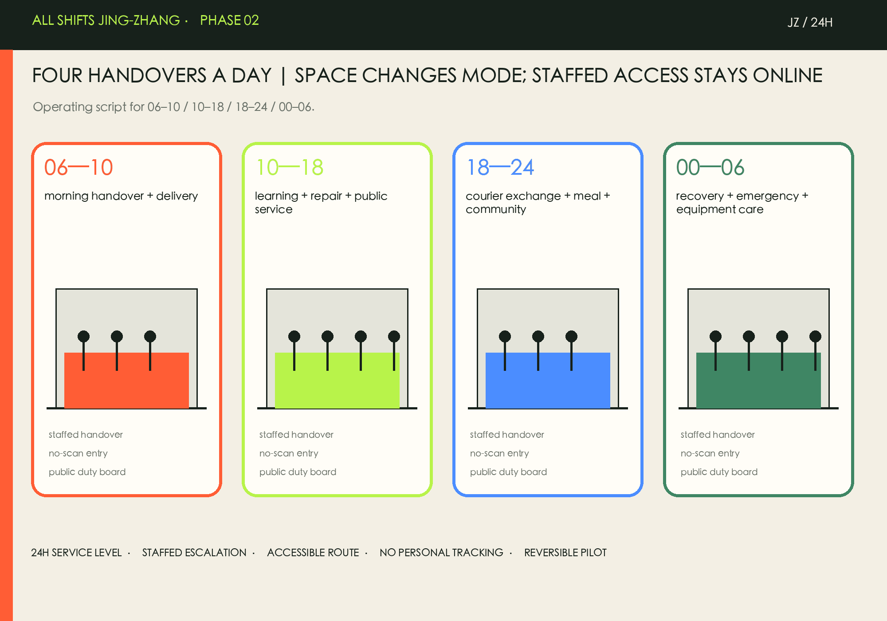

## Blue-Green Network, Public Space, and Urban Character

Blue-green space supports daytime ecology, night-shift safety and recovery, and shelter during extreme weather [depth:blue_green_public_space] [data:geometry/public_space.geojson#PUBLIC-001]. Lighting is even, low-glare and maintainable rather than screen-heavy “AI spectacle.”

The visual language borrows from railway operating logs: deep green infrastructure, handover orange, accessible-support lime, fine rail lines and timestamps. Personal workers are never ranked; team, event and repair contributions are displayed.

## Renewal Projects, Implementation Policy, and Phasing

| ID | Project | Phase | Main dependency |
| --- | --- | --- | --- |
| R-01 | 12 lightweight Shift Stations | Near term | Operations first; locations require survey |
| R-02 | Three Shift Yard ground-floor retrofits | Near term | Prioritize safe reusable buildings |
| R-03 | Safe shift-change route | Near term | Does not replace road/traffic approval |
| R-04 | Shift Zero Pavilion and Honor Wall | Mid term | Open design call and rights clearance |
| R-05 | Open Maintenance Depot | Mid term | Equipment and fire safety pending |
| R-06 | Accessible human-handover network | Mid term | Staffing and service SLA first |
| R-07 | Public Algorithm Duty Protocol | Long-term governance | Policy before software |
| R-08 | Annual All Shifts City Week | Long-term operation | Concept only; not a confirmed government event |

Phasing is “service first, space second, systems last”: 0–12 months begins paid co-design, lightweight stations, staffed handover and night-route audits; years 1–3 adapt safe existing ground floors; later digital expansion waits for formal planning and independent evaluation [data:geometry/phasing.geojson#PHASE-001] [depth:renewal_project_list] [depth:phasing_implementation].

Operations include quarterly handover audits, monthly open-maintenance days, semiannual accessibility and human-fallback drills, and an annual All Shifts City Week. Participation by workers is paid.

## Taskbook Adoption Register: Three Positions, Five Functions, Three Zones and Two Wings

The table preserves the taskbook names and binds each one to a spatial host, mechanism, accountable role type and current evidence. The structured bilingual attachment is `visual/assets/taskbook-operations-package.json`. This is an `optional_crosswalk_concept_only` register: it does not assert an external level, formal adoption, implementation authorisation or confirmed collaboration.

| Taskbook name | Spatial host | Industry/governance mechanism | Accountable role type | Current evidence and status |
| --- | --- | --- | --- | --- |
| Centennial Jing-Zhang Cultural Belt | Heritage-park public experience route; Qinghuayuan Station Old Site remains to be verified | Historic resources, public walking and a conservative heritage interface | Heritage reviewer, public-space operator, community representative | Announcement, taskbook and public park sources; field/heritage review pending |
| Urban AI Life-Experience Belt | Shift Commons Spine, three Shift Yards, twelve Shift Stations, Xiaoyuehe Scenario Wing | No-scan access, staffed handover, night recovery and reversible tests | District operator, worker representative, accessibility representative, service steward | Proposal diagrams, scenario cards and evidence chain; paid co-design and site review pending |
| AI-Integrated Innovation Belt | Zhongzhiyuan, AI Origin Community, Dazhongsi and Zhongguancun Tech-Service Wing | Open scenario intake, non-personal testing, developer community and conversion interfaces | Open-call steward, asset owner, operator, data-governance reviewer | Taskbook, case mechanisms and proposal; no enterprise, funding or investment commitment |
| AI Full-stack Self-reliant Innovation System | Zhongzhiyuan AI Self-reliant Innovation Acceleration Area | Open maintenance depot, equipment test lane, paid reskilling and non-production tests | MLOps/maintenance technician, developer, independent reviewer | Concept pack; not a production system |
| World-class AI Innovation Ecosystem | AI Origin Community + Zhongguancun Tech-Service Wing | Near-campus innovation, conversion, open knowledge and partner-entry rules | Researcher, student, open-call steward, IP reviewer | Taskbook and case mechanisms; no named tenant is asserted |
| AI+ Scenario-empowerment New Paradigm | Xiaoyuehe Scenario Wing, Shift Stations and public handover desks | Scenario card → spatial host → human review → stop condition | Scenario steward, operator, accessibility and data-governance reviewers | Three registered test cards; not approved deployment |
| Intelligent AI Vitality City | Dazhongsi AI Industry Cluster, blue-green network and public route | Intelligent-native retail/business, low-disturbance renewal and staffed public service | Small-business operator, courier, visitor and service steward | Concept proposal; transport, title and access review pending |
| Global Voice for AI Governance | Public Algorithm Duty Board, audit pack and Zhongguancun Tech-Service Wing | Published purpose, data boundary, duty, appeal and shutdown records | Public-interest trustee, data governance and independent audit | Reproducible method material; optional crosswalk concept only |

The **Zhongguancun Tech-Service Wing** is the western interface for global resource, IP/rights clearance and capital-related methods; the **Xiaoyuehe Scenario Wing** is the eastern interface for open scenarios, public experience and feedback. The Shift Commons Spine connects their inputs, spatial hosting, public tests and failure returns. Neither wing is a confirmed institution, partner or funding arrangement.

## Regional Coordination Interfaces: Triggers Without Fabricated Partnerships

Regional coordination follows four steps: public input, role review, conceptual output and a stop condition. Beiliwei Community, Future Science City, Huairou Science City, E-town and Jing-Jin-Ji are discussion interfaces only. No enterprise list, financial arrangement, policy support, transport arrangement or joint brand is implied.

| Interface | Concept trigger | Non-personal input | Auditable output | Boundary |
| --- | --- | --- | --- | --- |
| Beiliwei Community | A public, reviewable issue card starts a staffed walk-through | Needs cards, hours, accessibility issues and service failures | Spatial-service adjustment, issue record and stop condition | Does not represent community consent or collect personal traces |
| Future Science City | Test hypothesis, log fields, reviewer and removal condition are pre-registered | Public method, synthetic sample or authorised equipment log | Reproducible test card, failure modes and spatial-host requirements | No partner, compute or policy support is asserted |
| Huairou Science City | A versioned, sourced, independently reviewable method appears | Method, licence, scope and limitations | Method peer review, applicability boundary and open questions | No joint lab, funding or technology transfer is asserted |
| E-town | Data, fire safety, human fallback and non-production conditions pass review | Equipment state, service flow and aggregate failures | Maintenance-space need, handover card and failure path | No production-line access, procurement or investment is asserted |
| Jing-Jin-Ji | Participants agree in writing on topic, licence and review roles | Standards draft, cultural narrative, non-personal metrics | Bilingual method brief, interface suggestion and unresolved questions | No regional protocol, fiscal support or joint brand is asserted |

## AI Innovation Ecosystem Map: Eight Inputs Into Space and Operations

The map treats land, space, industry, funding, talent, compute, data and scenarios as interfaces rather than already-secured resources. It registers the supplier and user roles, flow, public boundary, test gate, failure handling and feedback to spatial/operational decisions.

| Layer | Supplier → user roles | Flow and public access | Data boundary | Gate and failure handling | Feedback to space/operations |
| --- | --- | --- | --- | --- | --- |
| Land | Asset/space information and planning research → professional team, community, operator | Public version, provisional status and non-approval scope → concept host | No unpublished title, redline or control | G1 title/site/fire/access; missing data freezes location claims | Adjust node type and staffed entrance, never infer statutory planning |
| Space | Designer, asset owner, public-space operator → workers, visitors, developers | Scenario card → component → use record → reversible adjustment; staffed, paper, voice and no-scan access | Record access, handover and failures only; no personal traces | G0 co-design and G1 site review; pause, hand over and remove on failure | Adjust ground-floor interface, route, rest point and maintenance load |
| Industry | Developer, maintainer, scenario proposer → shops, public service and workers | Open problem → non-production test → human review → method return | No internal enterprise data, personal data or named supplier | Complete card, roles and boundary; failure is not packaged as deployment | Return failure mode to spatial host, job and equipment list |
| Funding | Open-call or authorised sponsor/grant role → developer, co-designer, operator | Public rules → transparent application → auditable close-out | No unauthorised finance or trade secrets | Authorisation, conflicts, rights and pay; otherwise return | Tune resource categories by paid maintenance hours, not investment estimate |
| Talent | Developer community, trainer and paid co-design organiser → research, maintenance, care and access users | Need/skill → paid learning → capability record → retraining/exit | No ranking, emotion recognition or worker-profile trade | Informed, paid, optional and human-reviewed; otherwise no recruitment | Update shifts and service SLA by real maintenance load |
| Compute | Test-environment, equipment and platform role → developer, auditor, scenario operator | Public/synthetic sample → sandbox → human check → archive | No production connection; minimum sample by default | Permission, cost, logs and shutdown; rate-limit, stop and fall back to human | Adjust test hours and equipment hosting |
| Data | Data governance, scenario proposer and public-source maintainer → service, audit and public users | Source register → minimum input → human review → redacted summary | No personal trace, emotion, performance or unauthorised internal data | Purpose, licence, retention and reliability disclosure; isolate, delete and stop on breach | Shrink data/scenario when false positives or review load rises |
| Scenarios | Scenario, public-space, test and audit roles → workers, visitors, community, shops and developers | Open intake → G0/G1 → 90-day reversible test → G3 → scale/revise/stop | Non-personal, non-production, withdrawable; no automatic punishment | Three unified cards + independent evidence chain; stop and remove on failure | Return metrics to route, ground floor, staffing and rhythm |

## Three Industry Test Cards: Unified Evidence and Stop Rules

All three tests use non-personal, non-production input and require human review, auditable output and a clear spatial/operational decision impact.

| Test | Hypothesis and non-personal input | Spatial host | Human review and auditable output | Stop condition | Decision impact and wing link |
| --- | --- | --- | --- | --- | --- |
| TEST-01 Equipment-first predictive maintenance | Authorised equipment state, fault codes, maintenance windows and synthetic samples; remove names, IDs, traces and performance fields | Zhongzhiyuan Open Maintenance Depot / Equipment Test Lane, a concept type | Technician, operator and data governance review; fault categories, confirmation time and false/true error log, never a worker score | Scoring, covert tracking, unauthorised logs, unexplained output or safety risk | Tune maintenance desk, equipment list and training; Tech-Service Wing supplies method interface, Scenario Wing receives failure feedback |
| TEST-02 Privacy-preserving shift-route assistance | Anonymous issue cards, aggregate route/access observations, inspections and public transit information; no personal traces | Shift Commons Spine, heritage-park public route and Shift Stations | Accessibility representative, night worker, transport/public-space professional and operator review; route issues, staffed guidance and repair record | Missing human guidance, stored traces, blocked main flow or failed safety audit | Tune guidance, lighting, rest and staffed hours; Scenario Wing receives experience, Tech-Service Wing only shares methods |
| TEST-03 Human–AI service-continuity handover | Synthetic requests, anonymous failure categories, timestamps and human results; no identity retention | AI Origin Community Handover Desk and staffed Shift Station interface | Service worker, care/access representative, operator and independent reviewer; handover completeness, response time and appeal status | AI closes human access, misses an urgent request, blocks access or fails to disclose unreliability | Tune desk, signs, staffing and training; Scenario Wing opens tests, Tech-Service Wing exchanges methods |

## Agent.4 / Agent.5: Spatial Stitching and the Jing-Zhang–Zhongguancun–AI Culture Chain

East–west stitching is not a new alignment: the western **Zhongguancun Tech-Service Wing** provides public methods, rights clearance and partner-entry conditions; the **Shift Commons Spine** provides the public interface; the eastern **Xiaoyuehe Scenario Wing** receives scenario intake, experience feedback and test returns. The north–south public sequence is Zhongzhiyuan—AI Origin Community—Dazhongsi, not a road, rail or statutory boundary.

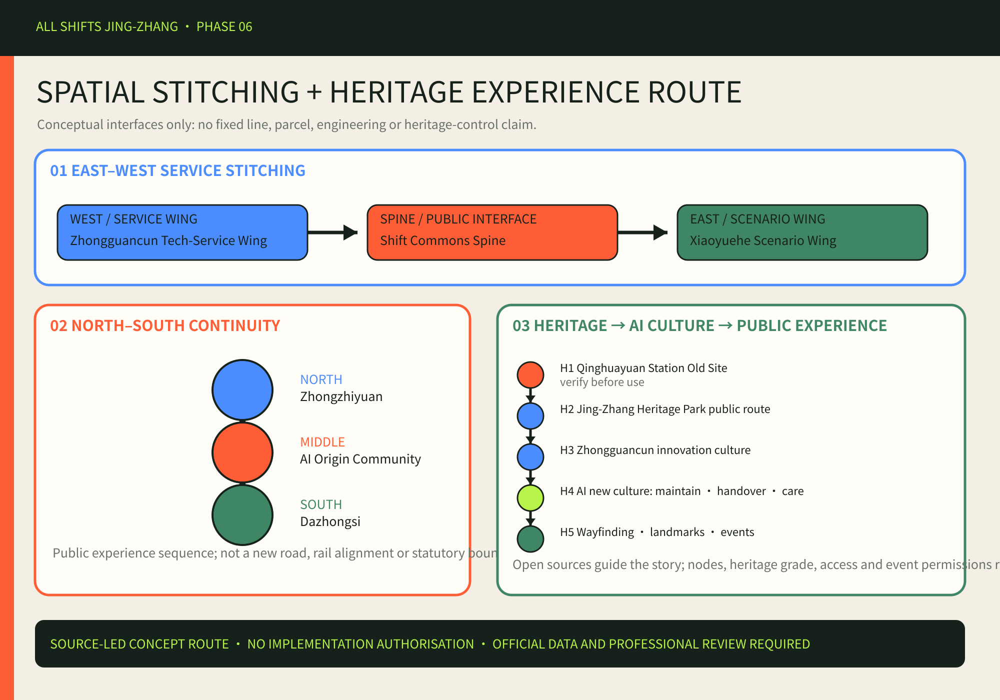

The culture narrative follows “public source → interpretation → experience → re-review” [source:JZ-PARK-OPENING] [source:JZ-PARK-PHASE2]:

| Narrative layer | Public-source anchor | Experience translation |
| --- | --- | --- |
| Jing-Zhang railway heritage resources | Public reports on Jing-Zhang Railway Heritage Park and taskbook requirements | Timestamps, rail lines and station memory; no unauthorised image or heritage-grade claim |
| Zhongguancun innovation culture | Official announcement and public AI innovation/scenario background | Open knowledge, near-campus innovation, conversion and public access |
| AI new culture | Taskbook and this package's authored evidence chain | Human fallback, auditable tests, visible maintenance and no worker surveillance |
| Wayfinding, landmarks and events | Authored diagrams and operations cards | Rail-line wayfinding, Shift Zero Pavilion, Honor Wall, open-maintenance days and bilingual method sharing |

Precise nodes, heritage grade, access conditions and event permissions remain pending verification; only G0/G1 and professional review can move them into later research.

## Agent.6 Long-term Operations and G0–G4 Responsibility/Resource Register

Long-term operation is a repeatable input–output–frequency–exit loop, not a one-off festival. The structured attachment records role-level RACI and resource categories across G0–G4; the operating map is:

| Operating item | Role type | Input → output | Frequency | Exit condition |
| --- | --- | --- | --- | --- |
| Event brand/IP | Brand steward + rights reviewer | Public theme/authorisation → bilingual pack and credit record | Annual theme, quarterly review | No release when rights or facts cannot be verified |
| Developer community | Community steward + worker representative | Public problems/paid seats → reproducible experiments and maintenance knowledge | Monthly open-maintenance day, quarterly audit | Pause without pay, appeal or provenance |
| Scenario intake/open tests | Scenario steward + data governance | Non-personal application/test card → G0/G1, 90-day test and failure record | Batches; G3 decision | Stop when data, safety or human fallback fails |
| Public experience | Public-space operator + accessibility representative | Hours/routes/staff/feedback → wayfinding and service receipt | Daily; semiannual drill | Close service when staffed access or route fails |
| International communication | Editor + independent evidence reviewer | Bilingual chain/licence/status → method brief and links | Quarterly/annual | Do not publish when concept/reviewed/selected/implemented is blurred |
| Partner entry | Open-call steward + conflict reviewer | Public application/capability/disclosure → role-level task card | Application batches | Return unauthorised, named-supplier or promise language |
| Pilot evaluation | Independent auditor + operator + worker/access representatives | Shift/failure/appeal/output logs → review and shutdown record | Every 90 days or major event | Stop without independent review or after a red line |
| Conversion path | Professional design team + operator + asset owner | Official data/survey/authorisation/reviewed concept → next research task | After G4 as project requires | Do not enter implementation without boundary, professional and title confirmation |

G0 requires paid co-design and human facilitation; G1 requires site, title, fire, accessibility and removal conditions; G2 is non-production and reversible only; G3 requires independent privacy, labour, accessibility and spatial-evidence review; G4 supplies professional input to scale, revise or stop. A failed gate is a return path, never an external level or implementation authorisation.

## Metrics, Area Recalculation, and Compliance Matrix

Metrics are separated into provisionally recalculable geometry, structured counts, and statutory unknowns [depth:metrics_recalculation] [metric:renewal_project_count]. `metrics.json` records status, formula, source, confidence and assumptions.

The compliance matrix maps announcement tasks 1.3–1.5 and agent.1–agent.6 to sections, geometry, metrics, drawings, HTML, sources and checks. Keeping FAR unknown is a safeguard against false precision [standard:MOHURD-CONTROL-DETAILED-PLANNING].

## Risk, Copyright, and Compliance

The largest risk is missing official polygons. A registered mismatch between provisional geometry and an OSM park feature cannot prove either one correct [source:BOUNDARY-SOURCE] [depth:risk_missing_data]. Other gaps cover controls, transport, buildings/title, utilities, heritage, public services and actual shift demand. Formal development requires official replacement data, fieldwork, paid worker co-design and professional review.

AI red lines are explicit: no covert surveillance, emotion recognition, personal scoring, worker-profile trading or automated punishment; no removal of staffed services; no testing framed as deployment. Pilots must be explainable, appealable, optional, stoppable and independently auditable.

Text, diagrams, web layout and boards are agent-authored. Third-party images, tiles, remote fonts, scripts, APIs, iframes and tracking are not embedded. Rights and sources are in `sources.json` and `report/copyright_statement.md`.

## References

- Official open-call announcement [source:OFFICIAL-ANNOUNCEMENT]
- Agent taskbook and repository site package [source:AGENT-TASKBOOK] [source:SITE-PACKAGE]
- Six official case-organization pages, used only for mechanism reference; see `sources.json`
- Structured evidence: `metrics.json`, `assumptions.json`, `compliance_matrix.json`, `standard_matrix.json`, `design_depth_matrix.json`
