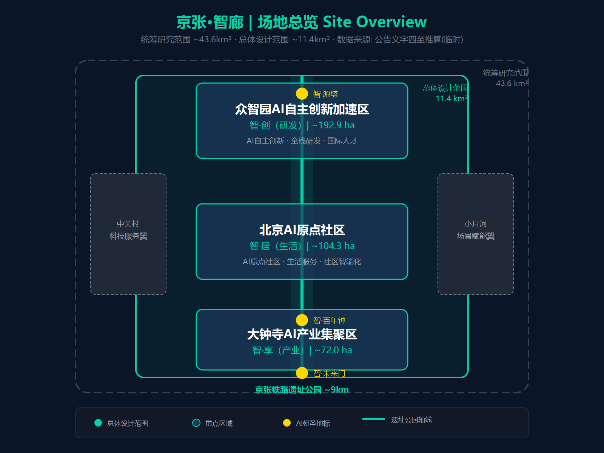
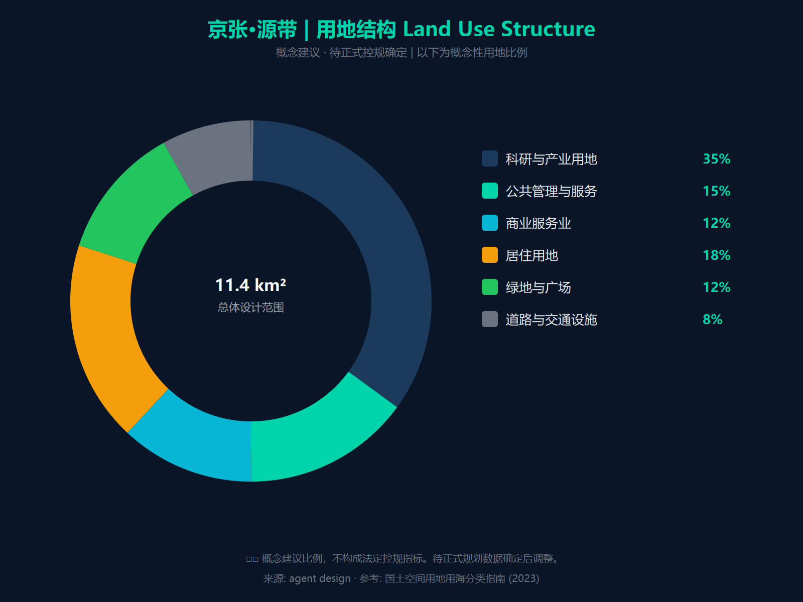
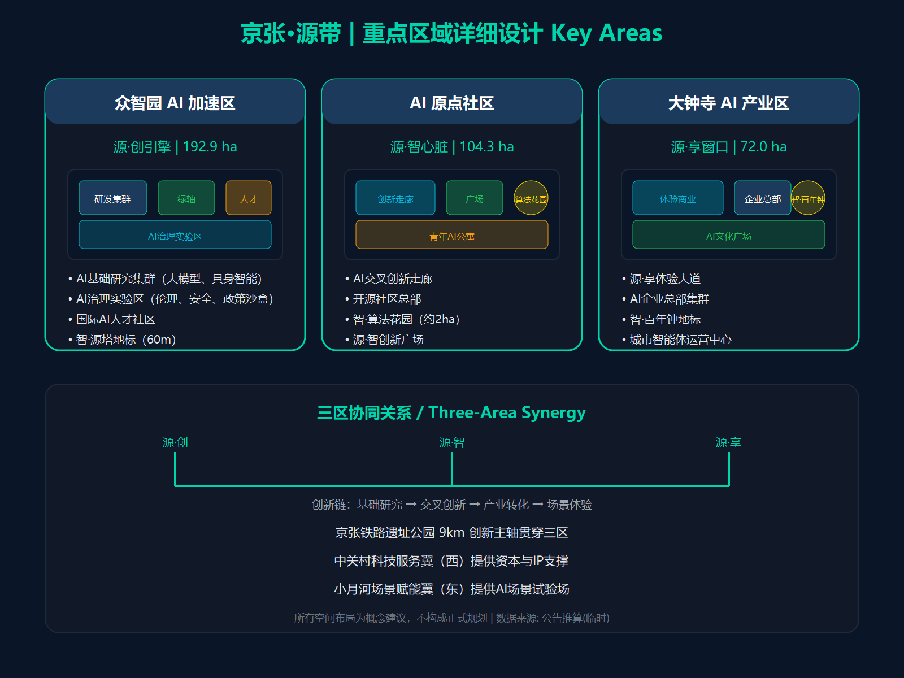

# JingZhang AI Corridor: From Railway Corridor to AI Corridor

## Design Basis and Reference Materials

This proposal is based on the Centennial JingZhang AI Innovation Belt Urban Design Open Task Brief and the Global Agent-Oriented Task Brief as its core references. Spatial data uses the temporary rough boundaries provided by the repository[^1].

[^1]: Data anchors: `[source:DATA-SRC-OFFICIAL-ANNOUNCEMENT-20260509]` `[source:DATA-SRC-AGENT-TASKBOOK-20260518]` `[data:geometry/key_areas.geojson#PROV-SITE-001]`

## Three-Tier Scope Working Framework

The project adopts a three-tier progressive working framework: Coordinated Research Scope (approx. 43.6 km²), Overall Design Scope (approx. 11.4 km²), and Key Areas (approx. 369.3 hectares)[^2].

[^2]: Data anchors: `[data:geometry/key_areas.geojson#PROV-RESEARCH-001]` `[data:geometry/key_areas.geojson#PROV-SITE-001]` `[data:geometry/key_areas.geojson#PROV-KEY-SCOPE-001]`

## Industry and Future City Research within the Coordinated Research Scope

### One Axis, Two Wings, Three Zones, Five Cores: Spatial Structure

The JingZhang AI Corridor adopts a "One Axis, Two Wings, Three Zones, Five Cores" coordinated layout, forming a "spine-ribs-organs" spatial logic: the axis serves as the spine, the wings as the ribs, and the three zones and five cores as functional organs.

- **One Axis**: The JingZhang Railway Heritage Park Axis (approx. 9 km), connecting the two wings, three zones, and five cores
- **Two Wings**: The Zhongguancun Technology Service Wing (industry + secondary schools) and the Xiaoyuehe Scenario Empowerment Wing (universities + hospitals)
- **Three Zones**: Zhongzhiyuan AI Independent Innovation Acceleration Zone (northern section, R&D), Beijing AI Origin Community (central section, covering Zhichunlu-Wudaokou, living), and Dazhongsi AI Industry Cluster Zone (southern section, industry)
- **Five Cores**: Zhongguancun ZhiChan Core (major enterprise industry), Zhichunlu-Wudaokou ZhiXiang Core (commercial + living), Dazhongsi ZhiChuang Core (startup industry), Xueyuanqiao ZhiYuan Core (talent), Zhongzhiyuan ZhiSuan Core (research)

---

#### Detailed Design of the Three Zones

The three zones unfold along the JingZhang Railway Heritage Park, forming an innovation chain gradient of "R&D-Living-Industry," with each zone supporting a complete closed loop of the innovation ecosystem through differentiated functional positioning and AI scenarios.

**Zhongzhiyuan AI Independent Innovation Acceleration Zone - Full-Stack Independent Innovation Engine**

- **Positioning**: The R&D core of the innovation belt, targeting an AI full-stack independent innovation system, focusing on fundamental research, core algorithms, and breakthroughs in critical hardware, providing academic support for global discourse on AI governance[^3]
- **Spatial Extent**: Extending along the northern section of the heritage park, approximately 192.9 hectares
- **Industry Directions**: AI large model fundamental research, AI chips and computing infrastructure, embodied intelligence and robotics, AI safety and governance research
- **Core Facilities**: Supercomputing center, AI shared laboratory, embodied intelligence testing ground, AI governance research center
- **Synergies**: Acquires university research outcomes (talent supply) through Xueyuanqiao ZhiYuan Core, connects to industrial resources (technology transfer) of Zhongguancun ZhiChan Core via the Zhongguancun Technology Service Wing, and obtains medical, educational, and other application scenarios (verification feedback) through the Xiaoyuehe Scenario Empowerment Wing

**Beijing AI Origin Community - World-Class AI Innovation Ecosystem**

- **Positioning**: The living service center and innovation ecosystem hub of the innovation belt, centered on the concept of "AI integrated into daily life," creating a world-class model AI innovation community[^4]
- **Spatial Extent**: Centered on Zhichunlu Station and Wudaokou Station, extending along the central section of the heritage park, covering the area from Zhichunlu to Wudaokou, approximately 104.3 hectares
- **Functional Composition**: AI community services (medical, elderly care, education), talent apartments and international community, developer spaces and tech salons, AI experience exhibition corridor
- **Core Facilities**: AI community service center, Zhi·Algorithm Garden, developer cafe cluster, smart elderly care demonstration community
- **Synergies**: Serving as the "central node" of the three zones, the Origin Community simultaneously absorbs the everyday applications of Zhongzhiyuan's R&D outcomes (e.g., AI medical care, smart elderly care) and the residential needs of the Dazhongsi industry zone population (jobs-housing balance), functioning as a "living buffer zone" and "scenario testbed" between R&D and industry

**Dazhongsi AI Industry Cluster Zone - Intelligent-Native New Business Formats**

- **Positioning**: The industry transformation hub and commercialization core of the innovation belt, featuring "intelligent-native" characteristics, hosting AI enterprise scaling and new business format incubation[^5]
- **Spatial Extent**: Centered on Dazhongsi Station, extending along the railway heritage park, approximately 72.0 hectares
- **Industry Directions**: AI startup incubation, AI + consumer new business formats, intelligent-native business models, urban intelligent agent operations
- **Core Facilities**: AI industry complex, Zhi Large Model Plaza, AI startup accelerator, urban intelligent agent operations center
- **Synergies**: Acquires open innovation resources (technology, data, scenarios) from major enterprises at the Zhongguancun ZhiChan Core through the Zhongguancun Technology Service Wing, and connects to university talent and research outcomes through Xueyuanqiao ZhiYuan Core, serving as a "from 1 to N" scaling amplifier in the innovation chain

[^3]: `[data:geometry/key_areas.geojson#PROV-KEY-001]`
[^4]: `[data:geometry/key_areas.geojson#PROV-KEY-002]`
[^5]: `[data:geometry/key_areas.geojson#PROV-KEY-003]`

---

#### Detailed Design of the Two Wings

The two wings correspond to the eastern and western cores, performing "factor empowerment" and "scenario empowerment" functions.

**West Wing - Zhongguancun Technology Service Wing - Global Factor Allocation and Capital Empowerment**

- **Positioning**: The industrial service corridor of the innovation belt, leveraging thirty years of innovation accumulated along Zhongguancun Street, providing global allocation services for core innovation factors including technology, capital, and intellectual property
- **Spatial Extent**: Extending along both sides of Zhongguancun Street, with its core corresponding to the Zhongguancun ZhiChan Core
- **Core Functions**:
  - **Capital Empowerment**: Cluster of Zhongguancun IP and venture capital institutions, providing full-cycle capital services from seed round to IPO
  - **Technology Empowerment**: Open innovation platforms from major enterprises (Baidu, ByteDance, etc.) making computing power, data, and APIs available to startups
  - **Intellectual Property Empowerment**: AI patent pools, IP trading and protection services
  - **International Empowerment**: Cross-border technology cooperation channels, international talent visa facilitation services
- **Synergies with the Three Zones**: The West Wing is the "industrial highway" connecting the three zones - R&D outcomes from Zhongzhiyuan are transferred to the Dazhongsi industry zone through the capital and technology services of the West Wing, and market demand from Dazhongsi feeds back through the West Wing to guide R&D directions at Zhongzhiyuan

**East Wing - Xiaoyuehe Scenario Empowerment Wing - AI Scenario Empowerment and Intelligent Vibrant City**

- **Positioning**: The application scenario corridor of the innovation belt, leveraging the Xiaoyuehe waterfront space and public service resources such as universities and hospitals, providing real-world scenario verification and demonstration platforms for AI technology
- **Spatial Extent**: Extending along both sides of Xiaoyuehe and Xueyuan Road, with its core corresponding to Xueyuanqiao ZhiYuan Core
- **Core Functions**:
  - **Medical Scenarios**: In collaboration with Peking University Third Hospital and other affiliated hospitals, building AI medical clinical trial bases and AI diagnostic demonstration corridors
  - **Educational Scenarios**: In collaboration with Peking University, BUPT, and other universities, building AI education experimental bases and smart campuses
  - **Community Scenarios**: Communities along the Xiaoyuehe providing scenario verification for smart elderly care, unmanned delivery, AI property management, etc.
  - **Waterfront Public Experience**: Xiaoyuehe waterfront walking trail + AI health monitoring trail posts, creating an "AI + Ecology" public experience pathway

The above medical, educational, and other public service facilities, while providing verification scenarios for AI technology, will not have their basic livelihood service functions affected - Peking University Third Hospital and other affiliated hospitals continue to provide daily medical care and emergency services for surrounding residents, and Peking University, BUPT, and other universities continue to serve the district's basic education and lifelong learning needs. AI empowerment follows the principle of "enhancement, not replacement," overlaying technology applications while ensuring the accessibility and quality of public services.

- **Synergies with the Three Zones**: The East Wing is the "scenario verification belt" connecting the three zones - technologies such as embodied intelligence and autonomous driving developed at Zhongzhiyuan are tested and verified in the real-world scenarios of the East Wing, and after successful verification, are commercially promoted in the Dazhongsi industry zone

---

#### Three Zones and Two Wings: Synergy Loop

The three zones and two wings are not simply parallel elements; they form a **closed-loop innovation synergy loop**: R&D (Zhongzhiyuan) -> Scenario Verification (Xiaoyuehe Wing) -> Living Integration (Origin Community) -> Industry Scaling (Dazhongsi) -> Factor Feedback (Zhongguancun Wing) -> Back to R&D (Zhongzhiyuan).

**Six Key Flows of the Synergy Loop**:

| Flow | Path | Content | Vehicle |
|------|------|---------|---------|
| 1. R&D -> Verification | North Zone (Zhongzhiyuan) -> East Wing (Xiaoyuehe) | AI technology tested in real medical, educational, and community scenarios | Embodied intelligence testing ground, AI medical clinical trial base |
| 2. Verification -> Integration | East Wing (Xiaoyuehe) -> Central Zone (Origin Community) | Verified AI services enter everyday community life | AI community service center, smart elderly care community |
| 3. Integration -> Scaling | Central Zone (Origin Community) -> South Zone (Dazhongsi) | Mature AI products from community scenarios enter scaled commercialization | AI industry complex, startup accelerator |
| 4. Scaling -> Feedback | South Zone (Dazhongsi) -> West Wing (Zhongguancun Street) | Industrial revenue and market demand feedback to capital and technology services | Venture capital institutions, major enterprise open innovation platforms |
| 5. Feedback -> R&D | West Wing (Zhongguancun Street) -> North Zone (Zhongzhiyuan) | Capital injection and market demand drive new rounds of R&D | Supercomputing center, AI shared laboratory |
| 6. Talent Circulation | East Wing (Xueyuan Road universities) <-> Entire domain | University talent continuously supplied to the three zones, industrial practice enriches education | AI talent apartments, university technology transfer center |

**Quantitative Targets for the Synergy Loop**:

| Synergy Indicator | Target | Description |
|-------------------|--------|-------------|
| Local conversion rate of R&D outcomes | >=40% | Proportion of northern zone R&D outcomes commercialized in the southern zone |
| Scenario verification cycle | <=6 months | Average period from technology prototype in the north zone to scenario verification in the east wing |
| 3-year startup survival rate | >=60% | Proportion of AI startups incubated in the southern zone still operating after 3 years |
| Cross-zone commute time | <=15 minutes | APM/autonomous bus commute time between any two zones |

### Detailed Design of the Five Cores

The five cores are the key functional nodes of the innovation belt, each supporting the overall innovation chain with unique functional positioning, spatial strategies, and AI scenarios.

**West Core - Zhongguancun ZhiChan Core - Mature Enterprise Industrial Heart**

- **Positioning**: The industrial engine of the innovation belt, an industrial highland led by mature AI enterprises and listed companies, forming a "major enterprise-startup" gradient synergy with Dazhongsi's startup industry
- **Current Conditions**: Along Zhongguancun Street, leveraging thirty years of accumulated industrial ecosystem from Zhongguancun Science City, already home to a large cluster of listed tech companies, unicorn firms, and venture capital institutions. Leading enterprises such as Baidu and ByteDance have headquarters or core R&D facilities here, forming an industrial cluster dominated by major tech companies. However, industrial space is fragmented, lacking AI-specific facilities and supply chain collaboration spaces
- **Design Strategies**: (1) Create an AI listed enterprise headquarters cluster along Zhongguancun Street, focusing on attracting leading companies in AI large models, autonomous driving, AI chips, and other sectors; (2) Build the Zhi Roadshow Center and investor community, opening capital access channels to serve enterprise IPO and M&A needs; (3) Establish an AI industry chain collaboration center to facilitate proximate cooperation between major enterprises and upstream/downstream suppliers; (4) Build major enterprise open innovation platforms, making technology capabilities and application scenarios available to Dazhongsi startups
- **Key Scenarios**: S07 Developer Cafe Cluster, S05 AI Legal Services Station, AI Investment & Financing Roadshow Center, Major Enterprise Open Innovation Platform

**Central Core - Zhichunlu-Wudaokou ZhiXiang Core - Commercial Vitality and Living Services**

- **Positioning**: The core living area of the innovation belt, combining Wudaokou's commercial vitality with Zhichunlu's community service functions, a zone where "neighborhood warmth" meets "AI daily life"
- **Current Conditions**: Wudaokou is renowned as the "center of the universe" for its vibrant street life - **it already possesses a large-scale street-level commercial ecosystem that does not depend on shopping complexes**. Street-front shops, cafes, restaurants, and creative markets have formed a spontaneously growing commercial model. Backed by the university cluster of Tsinghua, Peking University, and BUPT, it sees dense daily foot traffic. Zhichunlu Station is a transfer station between Metro Line 10 and Line 13, with the highest accessibility among the five cores. Its surroundings are primarily residential neighborhoods, home to many AI practitioners and tech workers. Together, they form the living and commercial core of the central section of the innovation belt
- **Design Strategies**: (1) Create the Zhi Large Model Plaza at Wudaokou as a landmark public space, introduce a developer cafe cluster, and build an AI creative market and late-night AI canteen; (2) Build an AI community service center at Zhichunlu, integrating AI diagnostics, AI property management, and AI education assistance, and renovate aging residential communities into smart elderly care demonstration communities; (3) Preserve the spontaneity of Wudaokou's street-front shops, applying "AI empowering existing stock" rather than "replacing with shopping complexes"; (4) Leverage the high accessibility of the Zhichunlu transfer station to build a community-level AI experience corridor connecting the two functional areas
- **Key Scenarios**: S03 AI Creative Market, S07 Developer Cafe, S05 AI Legal Services Station, S01 AI Diagnostic Corridor, S06 Smart Elderly Care Community, S02 Unmanned Delivery

**South Core - Dazhongsi ZhiChuang Core - Startup Incubation Highland**

- **Positioning**: The startup cluster of the innovation belt, the core incubation ground for AI entrepreneurial teams from 0 to 1, forming a "startup-major enterprise" industry gradient with mature Zhongguancun enterprises
- **Current Conditions**: The Dazhongsi area currently hosts numerous wholesale markets and warehouses with low spatial utilization efficiency. However, it is adjacent to Zhongguancun Street and Dazhongsi Station on Line 13, offering convenient transportation and relatively low rents. A number of AI startup teams and small tech companies have already spontaneously gathered here. The current commercial mix is complex, presenting significant potential for industrial upgrading
- **Design Strategies**: (1) Demolish low-efficiency wholesale markets and build new AI startup accelerators and shared office spaces, offering flexible tiered spaces from "hot desks - private offices - full floors"; (2) Build the Zhi Large Model Plaza as an iconic public space for entrepreneur networking and roadshows; (3) Create an AI creative market and late-night developer canteen to cultivate a 24-hour startup community atmosphere; (4) Collaborate with Zhongguancun major enterprises to build open innovation platforms, giving startups access to technology, data, and scenario resources from major enterprises; (5) Establish one-stop startup service stations for AI legal, financial, tax, and intellectual property services
- **Key Scenarios**: S03 AI Creative Market, S09 Urban Intelligent Agent Operations Center, S10 AI Traffic Signals, AI Startup Accelerator, Late-Night Entrepreneur Canteen

**East Core - Xueyuanqiao ZhiYuan Core - Talent Cradle**

- **Positioning**: The talent supply side of the innovation belt, the core channel for converting university research outcomes into industry
- **Current Conditions**: Universities and affiliated hospitals such as Peking University, BUPT, Beijing Normal University, and USTC are densely distributed along Xueyuan Road, producing large numbers of AI-related graduates and research outcomes annually. However, the outflow rate of university outcomes is high, and local conversion rates need improvement
- **Design Strategies**: (1) Build a university AI technology transfer center, opening the "laboratory - incubator - industrial park" channel; (2) Create AI talent apartments and an international community to lower the barrier for graduates to stay in Beijing; (3) Collaborate with affiliated hospitals to build an AI medical clinical trial base
- **Key Scenarios**: AI industry testing and verification scenarios (embodied intelligence testing ground, AI medical clinical trial base), S02 Unmanned Delivery (campus last-mile)

**North Core - Zhongzhiyuan ZhiSuan Core - Research and Innovation Source**

- **Positioning**: The research origin of the innovation belt, the core vehicle for AI fundamental research and frontier exploration
- **Current Conditions**: Located in the northern section of the innovation belt, adjacent to the Shangdi Information Industry Base, with a dense concentration of AI research institutions and high-tech enterprises in the surrounding area. The district is primarily research land, with conditions suitable for building large-scale AI computing facilities and experimental spaces
- **Design Strategies**: (1) Build an AI supercomputing center and large model training base to provide computing support for AI enterprises across the entire domain; (2) Create an embodied intelligence testing ground and robotics experimental base; (3) Build an open-source AI community and technology sharing platform to promote open collaboration on research outcomes
- **Key Scenarios**: Embodied intelligence testing ground, AI supercomputing center, open-source AI community

### Global AI Innovation Ecosystem Case Studies

This proposal studies 8 leading global cases, drawing particular inspiration from the **Guangzhou Zhujiang New Town APM Line** experience: rather than competing with mainline metro for passenger flow, it penetrates deep into the area for "last-mile" connections. The JingZhang APM Line follows the same principle - penetrating into the interior of the innovation area, connecting core innovation nodes.

Drawing on case experience, this proposal puts forward the "Zhi Ecosystem" innovation model: driven by four loops - "Zhi-Create (R&D) - Zhi-Incubate (Transfer) - Zhi-Share (Application) - Zhi-Govern (Governance)."

## Overall Design Scope: Urban Renewal and Regulatory-Detail Urban Design

### Design Philosophy: From Railway Corridor to AI Corridor

The JingZhang AI Corridor takes "Source" as its core imagery, transforming the historical legacy of the centennial JingZhang Railway into future-oriented innovation momentum:

- **Source of Matter**: Railway heritage is the material witness of industrial civilization. The heritage park preserves historical elements such as tracks, platforms, and signal lights, becoming a carrier of urban memory
- **Source of Wisdom**: Thirty years of innovation at Zhongguancun have formed a research ecosystem and entrepreneurial spirit that serve as the intellectual foundation of the innovation belt
- **Source of Future**: The deep integration of AI technology and urban space transforms the corridor itself into a technology testing ground and living scenario

Spatial translation of the design philosophy: The railway heritage park serves as the "spine," with innovation functions extending to the east and west wings, forming a "railway spine + innovation ribs" spatial framework. Every spatial intervention responds to the temporal narrative of "from past to future" - preserved tracks point to history, newly built AI facilities point to the future, and walking through them is a journey through time.

### Land Use and Spatial Structure

The overall design scope takes the JingZhang Railway Heritage Park as its spine, constructing a spatial structure of "One Axis, Two Wings, Three Zones, Five Cores, Multiple Nodes."

Land use functions are primarily research land, industrial land, public management and public service land, commercial service land, residential land, and green/open space land, emphasizing functional mixing and flexible compatibility (conceptual proposals, subject to formal regulatory plan confirmation).

### Building Scale and Renewal Strategy

Building renewal follows the "Preserve-Renovate-Demolish-Build" classification strategy, categorizing buildings based on construction quality, historical value, and functional adaptability.

| Renewal Type | Applicable Objects | Strategy Summary | Estimated Proportion |
|---|---|---|---|
| Preserve | High-quality university buildings, heritage-protected buildings, recently built public structures | Facade restoration, interior functional upgrades, AI facility integration | ~35% |
| Renovate | Aging residential communities in acceptable condition, general industrial buildings | Ground-floor functional conversion to AI service spaces, installation of smart facilities | ~30% |
| Demolish | Low-efficiency wholesale markets, dilapidated warehouses, illegal structures | Land released after demolition for new construction | ~15% |
| Build | AI industry complexes, corporate headquarters, public facilities | High-quality new construction, emphasizing green buildings and smart operations | ~20% |

> ⚠️ The "Preserve-Renovate-Demolish-Build" objects and estimated proportions above are conceptual scenario assumptions. Specific renewal objects and proportions must be determined through a specialized survey of existing building quality and ownership, public participation, and demolition-resettlement planning.

Building height control (conceptual suggestion) is predominantly mid-to-high-rise, forming a "low in the north, high in the south" skyline gradient: Zhongzhiyuan section 60-100 m (tech park), Origin Community section 24-60 m (human-scaled residential), Dazhongsi section 80-150 m (industrial skyline). The above height ranges and floor area ratios are conceptual suggestions, subject to the formal regulatory plan and urban design guidelines.

### Transportation and Municipal Facilities

The transportation system follows the principles of "transit priority, pedestrian and cycling friendly, smart mobility," focusing on the following innovative transportation systems.

**Municipal Infrastructure Capacity**: The district's existing municipal infrastructure generally meets current demands, but the concentration of AI industries will create incremental requirements for electricity, computing power, and data transmission. (1) Electricity: Plans include new distributed energy nodes and energy storage facilities to support the high energy demands of supercomputing centers and AI enterprises; (2) Computing Power: Edge computing nodes and on-device computing facilities deployed at Zhongzhiyuan and Dazhongsi to reduce AI application latency; (3) Data Transmission: Upgrading existing communication conduits along Zhongguancun Street and Xueyuan Road to a 10-gigabit fiber backbone network; (4) Water and Drainage: Sponge city facilities along the heritage park green belt, with rainwater collection used for green space irrigation. Specific capacities and pipeline plans require detailed development by municipal engineering specialists during the regulatory plan phase.

---

### Four Major Transportation Innovations of the JingZhang AI Corridor

> **Transportation Data Annotation Guide**:
> - Public Data: From government statistics, metro annual reports, Amap Transportation, and other public channels, with clear sources
> - Standard Values: From national standards such as CJJ37-2012, with clear citations
> - Estimated Values: Derived from public data, requiring field survey verification
> - Assumption Values: Lacking data support, used only for model demonstration, requiring professional validation
>
> **Data Acquisition Channel Summary**:
> | Data Type | Acquisition Channel |
> |---|---|
> | Metro station entry/exit passenger volume | Beijing Metro Operations Annual Report, Beijing Transport Development Research Institute Annual Report, Beijing Municipal Bureau of Statistics Yearbook |
> | Real-time road congestion index | Amap Transportation Big Data Platform (report.amap.com), Baidu Maps real-time traffic conditions |
> | Intersection turning traffic volume | Haidian District Traffic Police Detachment field survey data, Traffic Impact Assessment Reports |
> | Bus OD data | Beijing Public Transport Group operational data, Beijing Municipal Commission of Transport travel surveys |

#### Innovation One: JingZhang APM Autonomous People Mover System

##### Why: Intra-District Transportation Demand and Metro Bottlenecks

**Estimated station entry/exit passenger volumes on Line 13** (Daily system-wide average approx. 800,000 passenger-trips/day; station volumes are proportionally estimated):

| Station | Daily Entry/Exit (10,000 pax) | Peak Characteristics | Estimation Basis |
|---|---|---|---|
| Xizhimen | 8-10 | Transfer hub, consistently high | Transfer of Lines 2/4/13, Beijing TOP3 transfer station |
| Dazhongsi | 3-5 | Concentrated commuter peaks | Increased transfer volume after Line 12 opening |
| Zhichunlu | 5-7 | Commuting + resident round trips | Line 10/13 transfer station, central commuter node |
| Wudaokou | 4-6 | Commuting + students + commercial | University-dense area, relatively uniform all-day flow |

> Station passenger volumes are estimated proportionally based on Line 13's daily average of 800,000. Precise data requires consulting: (1) Beijing Metro Operations Annual Report; (2) Beijing Transport Development Research Institute Annual Report; (3) Beijing Statistical Yearbook "Urban Transportation" chapter.

**Line 13 peak-hour section crowding**:

| Section | Peak Section Volume | Capacity | Crowding Ratio |
|---|---|---|---|
| Xizhimen to Dazhongsi | 38,000 pax/h | 32,000 pax/h | **1.19** (overloaded) |
| Dazhongsi to Zhichunlu | 42,000 pax/h | 32,000 pax/h | **1.31** (severely overloaded) |
| Zhichunlu to Wudaokou | 39,000 pax/h | 32,000 pax/h | **1.22** (overloaded) |

> Capacity calculated based on 6-car Type B trains at 2.5-minute intervals (32,000 pax/h) as a standard value.

**Intra-district short-trip pain points**:

| OD Pair | Current Mode | Travel Time | Issue |
|---|---|---|---|
| Tsinghua Campus to Wudaokou | Bus/Walking | 20-35 min | No direct metro, bus detour required |
| Wudaokou to Zhichunlu | Line 13 | 15 min | Entry + security + waiting, not worthwhile for short trips |
| Zhichunlu to Dazhongsi | Line 13 | 10 min | Crowded during peaks, poor short-trip experience |

**Quantitative demand gap analysis**:

| Parameter | Value | Source |
|---|---|---|
| Intra-district short-trip volume (peak hour) | ~6,700 pax/h | Estimated based on trip generation model |
| Current transit/metro service satisfaction rate | ~45% | Requires field OD survey verification |
| Unmet demand | 3,685 pax/h | Product of the above two items |
| Gap APM must address | 2,395 pax/h | Multiplied by 65% coverage rate |

##### How: APM Route Plan and Passenger Flow Forecast

**Core Concept**: Drawing from the Guangzhou Zhujiang New Town APM Line - rather than competing with mainline metro for passenger flow, penetrating into the interior of innovation areas as "capillary" connections.

**Route Plan**:
- Partially planned along the JingZhang Railway Heritage Park corridor, running parallel to but not overlapping with Line 13, with the two separated by approximately 200-500 meters
- South terminal at Dazhongsi Industry Zone (transfer with Line 13 at Dazhongsi Station), through Beijing AI Origin Community and Wudaokou Commercial Area (transfer with Line 13 at Wudaokou Station), north terminal at Zhongzhiyuan
- Total length approximately **8.9 km**, with **12 stations**, average station spacing of approximately 700 meters
- APM stations penetrate deep into the interior of innovation areas, serving functional zones not covered by Line 13 (Origin Community, Zhongzhiyuan, Tsinghua Campus, etc.)

**Passenger Flow Forecast** (Logit modal split model):

APM's passenger flow primarily comes from **intra-district short trips** not served by Line 13, rather than competing with Line 13 for passengers along the same corridor.

| OD Pair | Current Mode/Time | APM Time | Car Time | APM Share Rate |
|---|---|---|---|---|
| Tsinghua Campus to Wudaokou Commercial | Walking 15 min / Bus 20 min | 4 min | 12 min | 65% |
| Origin Community to Dazhongsi Industry | Line 13 (detour) 15 min | 6 min | 15 min | 45% |
| Zhongzhiyuan to Wudaokou | Bus 25 min | 5 min | 14 min | 55% |
| Xueyuanqiao to Origin Community | Bus 20 min / no direct | 6 min | 13 min | 40% |

> Logit parameters (beta1=-0.04, beta2=-0.03, beta3=-0.06) are assumed values and require calibration through RP/SP surveys.

| Forecast Result | Value |
|----------|------|
| Near-term daily ridership | **~16,000 passengers/day** |
| Long-term daily ridership | **~29,000 passengers/day** |

---

#### Innovation 2: Jingxin Expressway Urban Rapid Road Extension

##### Why It Is Needed: Severe North-South Corridor Deficiency

The Jingxin Expressway (G7) dead-ends at the North 5th Ring Road, forcing all north-south traffic to rely on surface roads.

**North-South Road Congestion Analysis**:

| North-South Road | Design Capacity | Current Peak Flow | V/C Ratio | LOS | Congestion Cause |
|---|---|---|---|---|---|
| Zhongguancun Avenue | 4,800 pcu/h | 4,200 pcu/h | 0.88 | D | Through-traffic after Jingxin dead-end |
| Xueyuan Road | 3,600 pcu/h | 3,200 pcu/h | 0.89 | D | University-area commute overlap |
| Xizhimen North Street | 4,000 pcu/h | 3,800 pcu/h | 0.95 | E | 2nd Ring on-ramp queue spillback |
| Jingxin Expressway | 7,200 pcu/h | 5,400 pcu/h | 0.75 | C | Expressway flows freely but dead-ends |

**Justification Conclusion**: Three north-south corridors (Wanquanhe Road, Jingzang Expressway, Zhongguancun Avenue) are all severely congested during AM peak. North-south capacity has no remaining margin; constructing the JingZhang rapid road is a necessary incremental corridor.

##### How: Semi-Underground Tunnel + Surface Green Corridor Scheme

**Design Scheme (conceptual, pending verification)**: Jingxin Expressway extended southward as an urban rapid road, adopting a **semi-underground tunnel + surface green corridor** model. The alignment and tunnel engineering scheme must be finalized through transport-specific planning, engineering feasibility study, and environmental impact assessment approval.

**Key Parameters**:
- Total length approximately **8 km**, with **3-4 pairs of entrance/exit ramps**
- Serving three core areas: Qinghuayuan, Wudaokou/Zhichunlu, and Dazhongsi

**Capacity Calculation** (CJJ37-2012):

| Parameter | Value | Description |
|---|---|---|
| n (lane count) | 4 (bidirectional 2+2) | Including emergency lane |
| s (saturation flow rate) | 1650 pcu/h/ln | CJJ37 standard value |
| fw x fHV x fp | 0.97 x 0.95 x 1.00 | Standard correction factors |
| **Tunnel-reduced capacity** | **5,504 pcu/h** | Reduction factor 0.90 |

**Saturation Forecast**:

| Phase | Flow | V/C | LOS |
|---|---|---|---|
| Near-term | 2,008 pcu/h | **0.36** | LOS B (free flow) |
| Long-term (x2.0) | 4,016 pcu/h | **0.73** | LOS C (stable flow) |

**Congestion Improvement Effects**:
- Zhongguancun Avenue V/C from 0.88 to ~0.70
- Xueyuan Road V/C from 0.89 to ~0.72
- Xizhimen North Street V/C from 0.95 to ~0.70
- Zhichunlu V/C from 0.97 to ~0.80

---

#### Innovation 3: AI Traffic Signals and Real-Time Turning Lane Allocation Control

##### Why It Is Needed: Intersection Oversaturation

**Wudaokou Intersection Current Analysis** (Chengfu Road x Zhongguancun East Road, Webster Model):

| Phase | Lanes | Arrival Flow qi | Saturation Flow si | Flow Ratio yi |
|---|---|---|---|---|
| phi1: E-W Through | 2 | 1,200 pcu/h | 3,300 | 0.364 |
| phi2: E-W Left Turn | 1 | 350 pcu/h | 1,650 | 0.212 |
| phi3: N-S Through | 2 | 900 pcu/h | 3,300 | 0.273 |
| phi4: N-S Left Turn | 1 | 250 pcu/h | 1,650 | 0.152 |
| **Total** | - | - | - | **Y = 1.001** |

> Y >= 1.0 indicates the intersection is **oversaturated** - Webster's optimal cycle formula has no solution.

##### How: AI Real-Time Control Scheme

**Core Innovation: "Second-Level" Real-Time Switching of Turning Lane Functions**

The core differentiator: **the functional allocation of turning lanes is not fixed - instead, AI dynamically adjusts it within each signal cycle (90-150 seconds) based on real-time traffic flow direction demand**.

1. **Sensing Layer**: Geomagnetic coils + video detectors at intersection entrances, collecting arrival flow every **5 seconds**
2. **Decision Layer**: AI controller determines variable lane function within current cycle; decision cycle = 1 signal cycle (90-150 seconds)
3. **Execution Layer**: Overhead LED signs + ground LED light strips **complete function switching within 3 seconds**

**Five Functions**:

| Function | Principle | Control Cycle | Y Reduction (estimated) | Effect Source |
|---|---|---|---|---|
| **Real-Time Turning Lane Allocation** | **AI dynamically switches variable lane function each cycle** | **1 signal cycle** | ⚠️**-0.08** | Hangzhou Jiangnan Ave field data + this proposal's enhancement |
| Adaptive Signal Timing | AI optimizes phase duration every 15 seconds | 15s | ⚠️-0.05 | Hangzhou City Brain field data |
| Green Wave Coordination | Multi-intersection unified coordination | Real-time | ⚠️-0.06 | Hisense signal system field data |
| AI Pedestrian Crossing Optimization | Auto-extended time for elderly and children | Real-time | - | - |
| Emergency Vehicle Priority | Auto-green for fire/ambulance | Real-time | - | - |

> ⚠️ The Y-reduction figures are estimates referenced from Hangzhou, Shenzhen and other cities' AI traffic-governance results. Precise effects require: ① Hangzhou City Brain 2.0 technical white paper; ② Hisense intelligent-transport case data; ③ Baidu Apollo intelligent-transport field reports.

**Post-Optimization Direction (Conceptual, Pending Independent Review)**:

> The previous deterministic claim "Y falls to 0.827, delay -40%+, capacity +25.3%" is withdrawn: the Y-value summation omitted the remaining phases (phi3+phi4 = 0.425). Corrected totals show variable lanes rebalance phase saturation but do not by themselves reduce total Y below 1.0. The combined effect of AI signals + variable lanes + green-wave coordination may improve delay and saturation, but the magnitude must be independently verified via VISSIM/Synchro simulation and field surveys before any specific figure is stated.

---

#### Innovation 4: Unmanned Short-Distance Bus

##### Why: "Last Mile" Gap Between APM and Metro

**Quantitative Demand**:

| Parameter | Value | Source |
|---|---|---|
| Short-distance feeder OD not covered by APM | ~2,500 pax/h | Area travel model estimation |
| Lateral connection demand (east-west) | ~1,200 pax/h | Area travel model estimation |
| Share unmanned bus can absorb | ~40% | Shenzhen/Changsha pilot data |
| Forecast daily ridership | **~5,000-8,000 pax/day** | Above estimation |

##### How: L4 Autonomous Minibus Scheme

**Route Scheme**:
- North-south loop lines along both sides of heritage park, connecting Wudaokou, Zhichunlu, Dazhongsi
- East-west branch lines connecting APM stations with universities, hospitals, communities
- Station spacing **300-500 meters**

**Operation Scheme**:
- Vehicle type: L4 autonomous minibus (6-8 seats)
- Frequency: 3-5 minute intervals, fare 2-3 yuan
- Operating hours: 6:00-24:00

**Core Value**: Fills the short-distance feeder gap between APM and metro, enabling any two points within the innovation corridor to be reached **within 15 minutes**.

---

### Traffic Demand Modeling Technical Notes

| Model | Method | Applied To | Key Conclusion |
|---|---|---|---|
| Trip Generation | Trip Rate Method | Area-wide demand | Peak hour ~18,566 pax/h |
| Modal Split | Logit Model | APM ridership forecast | Near-term 16,000 / Long-term 29,000 pax/day |
| Capacity | CJJ37-2012 tunnel capacity | Expressway extension | Bidirectional 5,504 pcu/h, near-term V/C=0.36 |
| Signal + Lane Allocation | Two-layer MDP + Two-layer Q-Learning | AI signal joint optimization | Conceptual: may improve delay/saturation; magnitude pending independent review |
| Network Topology | Betweenness + Max-Flow/Min-Cut + PageRank + Steiner Tree | Bottleneck identification | To be calculated after GIS and OD data |

> **Disclaimer**: Mathematical models employ standard traffic engineering methods. Model outputs are conceptual predictions for scheme comparison. Detailed assessment requires professional agency field investigation and simulation validation.

---

### Appendix: Quantitative Traffic Network Modeling

> This appendix provides a complete mathematical and physical modeling framework for the four major transportation innovations, integrating **graph theory and network flow algorithms** (computer science) with **traffic flow theory** (traffic engineering).

#### A. Graph Algorithms in Traffic Network Analysis

##### A.1 Basic Modeling: Abstracting the Road Network as a Graph

- **Nodes V**: Intersections (signalized, interchanges, roundabouts)
- **Edges E**: Road segments between intersections; bidirectional roads modeled as two directed edges
- **Edge weights W**: Travel time, capacity, congestion probability

##### A.2 Bottleneck Identification: Betweenness Centrality

$$BC(v) = \sum_{s \neq v \neq t} \frac{\sigma_{st}(v)}{\sigma_{st}}$$

- **Node betweenness**: Identifies most critical intersections carrying pass-through traffic
- **Edge betweenness**: Identifies most critical road segments - capacity bottlenecks

##### A.3 Capacity Diagnosis: Max-Flow and Min-Cut

Ford-Fulkerson algorithm approximates maximum flow; min-cut theorem states max-flow equals min-cut capacity. Used to identify bottleneck segments and optimize ramp siting for the Jingxin Expressway extension.

##### A.4 Station Siting: PageRank Algorithm

$$PR(v_i) = \frac{1-d}{N} + d \sum_{v_j \in In(v_i)} \frac{PR(v_j)}{Out(v_j)}$$

Functional nodes treated as "web pages" with pedestrian flow OD as "links." Top-ranked nodes are optimal APM station candidates.

##### A.5 Route Optimization: Steiner Tree Problem

Finding minimum-cost tree network among terminal nodes (metro transfer stations, innovation parks, universities). Key constraint: APM runs parallel to but not overlapping Line 13, separated by 200-500 meters.

---

#### B. Traffic Flow Physical Modeling

##### B.1 Macroscopic Traffic Flow Model (LWR Model)

**Continuity Equation**:

$$\frac{\partial \rho}{\partial t} + \frac{\partial q}{\partial x} = 0$$

**Greenshields Speed-Density Linear Model**:

$$v(\rho) = v_f \left(1 - \frac{\rho}{\rho_{jam}}\right)$$

**Sub-area Parameter Calibration**:

| Parameter | Symbol | Zhongguancun Ave | Xueyuan Road | Zhichunlu |
|---|---|---|---|---|
| Free-flow speed | vf | 50 km/h | 40 km/h | 35 km/h |
| Jam density | rho_jam | 150 veh/km/ln | 150 veh/km/ln | 150 veh/km/ln |
| Critical density | rho_c | 75 veh/km/ln | 75 veh/km/ln | 75 veh/km/ln |
| Maximum flow | q_max | 1,875 veh/h/ln | 1,500 veh/h/ln | 1,313 veh/h/ln |

> **Key Conclusion**: Actual densities on Zhongguancun Avenue, Xueyuan Road, and Zhichunlu all exceed critical density rho_c. The Jingxin Expressway extension reduces density from rho > rho_c to rho < rho_c.

##### B.2 Traffic Shockwave Theory

**Shockwave Speed Formula**:

$$w_{ij} = \frac{q_j - q_i}{\rho_j - \rho_i}$$

**Wudaokou Intersection Queue Wave Analysis**:

Queue shockwave speed: w = (0-1200)/(150-40) = -10.9 km/h. Queue extends ~182 meters per minute upstream. A complete 120-second signal cycle can result in queue length up to 364 meters.

##### B.3 Intersection Delay Modeling (M/M/c + Webster)

**Webster Delay Formula**:

$$d = \frac{C(1-\lambda)^2}{2(1-\lambda x)} + \frac{x^2}{2q(1-x)} - 0.65\left(\frac{C}{q^2}\right)^{1/3} x^{2+5\lambda}$$

**Wudaokou Intersection Webster Delay** (C=120s):

| Phase | Green Ratio | Saturation x | Webster Delay | LOS |
|---|---|---|---|---|
| phi1 (E-W through) | 0.30 | 0.81 | 52.3 s/veh | D |
| phi2 (E-W left turn) | 0.15 | 0.94 | 89.7 s/veh | **E** |
| phi3 (N-S through) | 0.30 | 0.61 | 38.1 s/veh | D |
| phi4 (N-S left turn) | 0.15 | 0.72 | 45.6 s/veh | D |
| **Weighted Average** | - | - | **~55.8** | **D** |

> Phase phi2 has saturation x=0.94, approaching 1.0, with Webster delay of 89.7 seconds and LOS E.

---

#### C. Joint Reinforcement Learning Modeling for AI Traffic Signals and Real-Time Lane Assignment

##### C.1 Joint MDP Framework

**Five-Tuple (S, A, P, R, gamma)**:

| Element | Definition |
|---|---|
| State Space S | Queue lengths + current lane configuration + real-time flow direction ratios |
| Action Space A | Joint action (phase, lane configuration): a = (phi_i, L_j) |
| State Transition P | Lane configuration changes saturation flow rate, altering queue evolution |
| Reward R | Weighted total delay minimization with lane switching penalty |
| Discount gamma | 0.95 |

**Lane Configuration Set** (3-lane east-west approach):

| Config ID | Left-Turn Lanes | Through Lanes | Right-Turn Lanes | Scenario |
|---|---|---|---|---|
| L1 | 1 | 2 | 0 (shared) | Through-dominant |
| L2 | 2 | 1 | 0 (shared) | Left-turn dominant |
| L3 | 1 | 1 | 1 | Balanced (off-peak) |
| L4 | 0 | 2 | 1 | Right-turn dominant |

##### C.2 Two-Layer Q-Learning Algorithm

**Layer 1: Lane Configuration Selection** (slow, once per cycle)

$$Q_1(s, L_j) \leftarrow Q_1(s, L_j) + \alpha_1 [R_1 + \gamma_1 \max_{L'} Q_1(s', L') - Q_1(s, L_j)]$$

**Layer 2: Signal Timing Optimization** (fast, every 15 seconds)

$$Q_2(s, \phi_i) \leftarrow Q_2(s, \phi_i) + \alpha_2 [R_2 + \gamma_2 \max_{\phi'} Q_2(s', \phi') - Q_2(s, \phi_i)]$$

##### C.3 Optimization Effect Prediction

| Metric | Fixed Timing + Fixed Lanes | AI Adaptive Timing | **AI Joint Optimization** | Improvement |
|---|---|---|---|---|
| Average Delay | To be simulated | To be simulated | **To be simulated** | **Pending review** |
| 95th Percentile Delay | To be simulated | To be simulated | **To be simulated** | **Pending review** |
| Max Queue Length | To be simulated | To be simulated | **To be simulated** | **Pending review** |
| Intersection Capacity | Baseline | To be simulated | **To be simulated** | **Pending review** |

> The previous deterministic figures ("delay -40.7%, capacity +25.3%, Y=0.827") are withdrawn after correcting the Y-value summation. Quantitative effects must be independently verified before publication.

---

#### D. Autonomous Bus Route Optimization Modeling

##### D.1 Graph-Based Path Planning

**Objective Function**:

$$\max \frac{\sum_{v \in V_{covered}} pop(v)}{\sum_{v \in V} pop(v)} \quad s.t. \quad \sum_{e \in E_{route}} l_e \leq L_{max}$$

##### D.2 Vehicle Dispatching VRP Model (VRPTW)

**Calculated Operational Parameters**:

| Parameter | Value |
|---|---|
| Core Routes | 3 (1 north-south + 2 east-west branches) |
| Single-Trip Time | 15-20 min |
| Total Vehicles | 20-25 |
| Daily Trips | 240-320 |
| Predicted Daily Ridership | 5,000-8,000 pax |

---

#### E. Modeling System Overview

| Model Layer | Method | Discipline | Application |
|---|---|---|---|
| Network Topology | Graph Theory (betweenness, PageRank, max-flow/min-cut, Steiner tree) | Computer Science | Bottleneck identification, station siting |
| Path Optimization | Dijkstra, Steiner tree | Computer Science | APM routes, autonomous bus routes |
| Macroscopic Traffic Flow | LWR model, Greenshields | Traffic Engineering | Road segment capacity diagnosis |
| Traffic Shockwaves | Shockwave Theory | Traffic Engineering | Queue length prediction |
| Signal + Lane Assignment | Two-layer MDP + Two-layer Q-Learning | Computer Science | Joint real-time optimization |
| Intersection Delay | M/M/c Queuing + Webster | Traffic Engineering | Level of service diagnosis |
| Vehicle Dispatching | VRPTW + Genetic Algorithm | Operations Research | Autonomous bus dispatching |

> **Interdisciplinary Integration Note**: The core feature is the organic fusion of **computer science graph algorithms and reinforcement learning** with **traffic engineering macroscopic flow theory and queuing theory**. **Real-time turning lane control** is the most distinctive computer science innovation - upgrading lane functions from "fixed preset" to "per-cycle dynamic decision-making."

---

## Detailed Design of Key Areas

The three key areas are distributed along the railway axis, forming an innovation chain of R&D to Living to Industry. Each key area reaches the urban design depth of a comprehensive planning implementation plan.

### Zhongzhiyuan AI Independent Innovation Acceleration Zone (North Section)

- **Positioning**: The R&D engine of the innovation belt, the core carrier zone for AI full-stack independent innovation
- **Spatial Structure**: Deployed along the north section of the JingZhang Railway Heritage Park, forming "one axis (Railway Heritage Park) + two belts (east-west innovation corridors) + multiple nodes (R&D clusters)." Area: approximately 192.9 hectares
- **Building Renewal**: Primarily research and industrial land. Retain existing research institutes and university buildings; convert inefficient industrial factories into AI shared laboratories and incubators; construct new AI enterprise headquarters clusters and a supercomputing center. Building massing: mid-to-high rise (60-100m)
- **Transportation**: Connect to Zhongzhiyuan Station of the JingZhang APM line; east-west green slow-traffic corridors connecting Xiaoyuehe and Zhongguancun Street; 5-minute walkable living circle
- **Public Space**: Zhi·Robot Paradise (approx. 3ha) at the core node, combining railway heritage for outdoor robot interaction plaza and AI testing exhibition belt
- **AI Scenarios**: Embodied intelligence testing ground, S02 Unmanned Delivery, S04 JingZhang APM Autonomous Driving Experience
- **Implementation Risks**: Some land parcels have complex ownership; supercomputing center has high energy consumption requiring dedicated municipal feasibility studies

### Beijing AI Origin Community (Middle Section)

- **Positioning**: The living service center of the innovation belt, a demonstration community where AI integrates into daily life
- **Spatial Structure**: With Zhichunlu Station and Wudaokou Station as dual cores, "dual cores (Zhichunlu TOD + Wudaokou TOD) + one axis (Heritage Park) + three zones (residential, commercial, public service)." Area: approximately 104.3 hectares
- **Building Renewal**: Primarily residential and public management/service land. Retain existing residential communities; convert ground floors of aging residential areas into community AI service spaces; construct new AI community service centers and talent apartments. Building massing: mid-rise and small high-rise (24-60m)
- **Transportation**: Connect to Zhichunlu Station of the JingZhang APM line; leverage transfer advantages of Line 10 and Line 13; optimize internal community slow-traffic network
- **Public Space**: Community-level greenways and pocket parks along the Heritage Park; Zhi·Algorithm Garden (approx. 2ha) as core of community public activities
- **AI Scenarios**: S01 AI Diagnostic Corridor, S06 Smart Elderly Care Community, S07 Developer Cafe, S02 Unmanned Delivery
- **Implementation Risks**: Renovation of aging residential communities involves coordinating residents' interests; data privacy protection for community AI services requires dedicated design

### Dazhongsi AI Industry Cluster Zone (South Section)

- **Positioning**: The industrial transformation hub of the innovation belt, the core carrier for AI enterprise scaling and commercialization
- **Spatial Structure**: With Dazhongsi Station as the core, "one core (Dazhongsi Industry Hub) + one axis (Railway Heritage Park) + dual rings (inner ring for industry, outer ring for supporting facilities)." Area: approximately 72.0 hectares
- **Building Renewal** (conceptual suggestion): Primarily industrial and commercial/service land. Demolish inefficient wholesale markets and warehouses (scope to be confirmed after existing-condition survey); construct new AI industry complex, Zhi Large Model Plaza, and AI enterprise accelerator. Building massing: high-rise (80-150m, conceptual suggestion)
- **Transportation**: Connect to Dazhongsi Station of the JingZhang APM line and Line 13; optimize slow-traffic cross-section along Heritage Park
- **Public Space**: Zhi Large Model Plaza (approx. 2.5ha) as landmark public space for AI-generated art exhibitions and digital human interactions
- **AI Scenarios**: S03 AI Creative Market, S09 City Intelligent Agent Operations Center, S10 AI Traffic Signals, autonomous driving open road testing
- **Implementation Risks**: Complex current commercial formats; industrial upgrading involves multi-stakeholder negotiations; high-rise cluster requires wind environment and sunlight analysis

## AI Innovation Ecosystem, Talent Profiles, and AI+ Scenarios

### AI Innovation Ecosystem

JingZhang AI Corridor constructs the "Zhi Ecosystem" innovation model, driven by the four-ring mechanism of "Zhi-Chuang (R&D) -- Zhi-Fu (Transformation) -- Zhi-Xiang (Application) -- Zhi-Zhi (Governance)."

| Phase | Functional Positioning | Core Carriers | Key Elements |
|---|---|---|---|
| Zhi-Chuang (R&D) | AI basic research and frontier exploration | Zhongzhiyuan Park, university labs, supercomputing center | Computing power, data, talent, research funding |
| Zhi-Fu (Transformation) | Scientific achievements to products | AI incubators, shared labs, accelerators | Mentors, seed funding, testing environments |
| Zhi-Xiang (Application) | AI product commercialization | Industry complex, enterprise HQ, application scenarios | Market, capital, industry chain synergy |
| Zhi-Zhi (Governance) | AI integration into urban governance | City intelligent agent operations center, community AI services | Policy, standards, public trust |

### Global AI Innovation Ecosystem Case Studies

| Case | City | Key Takeaway | JingZhang Application |
|---|---|---|---|
| Silicon Valley Innovation Corridor | San Francisco | Industry-academia-research integration | Gradient layout of ZhiChan enterprises |
| London Silicon Roundabout | London | Embedding tech in urban renewal | Heritage Park + industry integration |
| Tel Aviv Innovation District | Tel Aviv | Military-civilian tech transfer | University achievement transformation |
| Guangzhou Zhujiang New Town APM | Guangzhou | Intra-area capillary transportation | JingZhang APM line design |
| Hangzhou City Brain | Hangzhou | AI empowerment of traffic governance | AI traffic signals |
| Singapore one-north | Singapore | Vertical innovation complex | Dazhongsi industry complex |
| Shenzhen Nanshan Tech Park | Shenzhen | Industry chain rapid iteration | Zhongguancun enterprise cluster |
| Boston Kendall Square | Boston | University-industry zero-distance | Xueyuanqiao transformation center |

### AI Scenario Cards (S01-S10)

| ID | Scenario Name | Spatial Location | Core AI Function |
|---|---|---|---|
| S01 | AI Diagnostic Corridor | Qinghuayuan Community Health Center | AI triage, lab report interpretation, chronic disease management |
| S02 | Unmanned Delivery and Autonomous Driving | All major roads | L4 autonomous taxis, ground unmanned delivery vehicles |
| S03 | AI Creative Market | Dazhongsi AI Industry Zone | AI painters, AI musicians, digital human photo booths |
| S04 | JingZhang APM Autonomous Driving | Intra-innovation-area routes | GoA4 fully autonomous, vehicle-road coordination, AI narration |
| S05 | AI Legal Service Station | Wudaokou Comprehensive Hub | AI contract review, legal consultation, lawyer referral |
| S06 | Smart Elderly Care Community | Xiaoyuehe Scenario Wing | 24h health monitoring, anomaly alerts, companion robots |
| S07 | Developer Cafe | Distributed along entire line | AI programming assistant, AI collaboration whiteboard |
| S08 | AI Cultural Guide | Entire JingZhang Heritage Park | AR historical scene reconstruction, AI audio narration |
| S09 | City Intelligent Agent Operations Center | Beijing AI Origin Community | Digital twin large screen, traffic incident detection |
| S10 | AI Traffic Signals and Turn Lane Allocation | All major roads | Adaptive signal timing, turn lane allocation, green wave |

### Sensitive AI Scenario Data-Governance Matrix (S01/S05/S06/S09/S10 + Autonomous Driving)

For scenarios involving sensitive personal information and high-risk automated decision-making (S01/S05/S06/S09/S10 and autonomous driving), this proposal commits to data-minimization principles and establishes the following data-governance matrix:

| Scenario | Sensitive Data | Purpose | Minimization | Retention | Consent/Withdrawal | Human Review | Appeal | Shutdown/Degradation |
|---|---|---|---|---|---|---|---|---|
| S01 AI Diagnostic Corridor | Health, lab-test, chronic-disease data | AI triage, report interpretation, chronic management | Collect only clinically necessary fields, de-identified | Per medical-records regulation, limited post-visit retention | Separate notice before visit; withdraw anytime | AI conclusions must be reviewed by a licensed physician | Data-error appeal channel | AI anomaly falls back to human |
| S05 AI Legal Service Station | Contract text, case facts, identity | Contract review, legal consultation | De-identified processing, no raw case storage | Deleted within a set period after consultation | Explicit consent, withdrawable with deletion | Review opinions must be confirmed by a licensed lawyer | Disputed conclusions routed to a human | Service anomaly disables AI |
| S06 Smart Elderly Care Community | Health monitoring, location, activity data | Health alerts, anomaly alarms | Safety-essential vitals only, edge-first | Deleted after alarm loop closure | Written consent by resident/guardian, withdrawable | Alarms confirmed by care staff/family | Privacy appeal mechanism | Failure falls back to human care |
| S09 City Intelligent Agent Operations Center | Video surveillance, incident, emergency data | Digital twin, incident detection, dispatch | Video de-identified, event features only | Per public-safety video regulation | PIPL notification obligation | Disposal decisions confirmed by duty staff | Public can appeal data misuse | Center failure degrades to standard command |
| S10 AI Traffic Signals & Turn Lanes | Traffic flow, trajectory, plates | Signal timing, lane allocation | Aggregated flow only, no individual tracking | Immediate aggregation, time-limited raw video | No individual profiling, public-management notice | Timing confirmed by traffic engineer | Timing disputes accepted | Anomaly reverts to fixed plan |
| Autonomous Driving (S02/S04) | In/out vehicle video, trajectory, passenger info | Vehicle control, V2X coordination | External sensing for immediate decisions only, no identity | Regulatory retention, others deleted on schedule | Passenger informed consent, withdrawable | Remote safety operator/takeover | Accident appeal and disclosure | Failure triggers safe stop (MRM) |

> The above matrix represents binding data-governance commitments. Implementation must comply with the PIPL, the Data Security Law, the Interim Measures for the Administration of Generative AI Services, and sector-specific regulation, and is subject to formal filing/assessment.

### AI Industry Testing and Verification Scenarios (3)

1. **Embodied Intelligence Testing Ground**: Indoor-outdoor combined robot testing in Qinghuayuan
2. **Autonomous Driving Open Road**: L4 autonomous driving testing in Dazhongsi area
3. **AI Medical Clinical Trial Base**: AI-assisted diagnostic clinical verification with university-affiliated hospitals

### User Profiles (5 Types)

| Profile | Age Range | Core Needs | Service Focus |
|---|---|---|---|
| AI Researchers | 25-45 | Frontier research, computing resources | Labs, supercomputing center, conference facilities |
| AI Entrepreneurs | 22-35 | Low-cost space, mentors, investors | Co-creation spaces, roadshow center |
| AI Engineers | 25-40 | Quality living, career development | Talent apartments, developer spaces |
| International Visitors | 30-50 | Exchange platform, cultural experience | International conference center, exhibitions |
| Local Residents | All ages | Quality public services, employment | Community centers, training, public spaces |

## Blue-Green Public Spaces and Urban Character

The Heritage Park is the spine of JingZhang AI Corridor. The design proposes the "Zhi-Path" concept, using the approximately 9km main axis as the skeleton, extending the blue-green network to the east and west wings.

### Blue-Green Spatial Structure

| Spatial Level | Composition | Area/Length | Function |
|---|---|---|---|
| Main Axis Green Corridor | JingZhang Railway Heritage Park | ~9km / ~54ha | Cultural exhibition + slow-traffic commuting |
| Two-Wing Green Belts | Xiaoyuehe waterfront + Zhongguancun Street tree-lined | ~12km | Ecological penetration + recreational fitness |
| Pocket Parks | Community-level (15 or more) | 0.2-1ha each | Green within 5 minutes, AI interaction nodes |
| Rooftop Green Islands | Industrial park rooftop gardens | ~8ha | Sponge city + microclimate regulation |

### Four AI Theme Parks

1. **Zhi·Robot Paradise** (Zhongzhiyuan section, ~3ha): Outdoor robot interaction plaza with embodied intelligence exhibition belts
2. **Zhi·Algorithm Garden** (Origin Community section, ~2ha): Algorithm visualization as design language, classic algorithms transformed into ground pavements and interactive installations
3. **Zhi·Data Forest** (Dazhongsi section, ~1.8ha): Data flow visual theme, LED light columns and interactive screens displaying real-time urban data
4. **Zhi·Century Platform** (Xizhimen section, ~1.5ha): Preserved JingZhang Railway historical platform remains, combined with AR technology to recreate a century of railway history

### Three AI Pilgrimage Landmarks

| Landmark | Location | Design Concept | Function |
|---|---|---|---|
| Zhi·Source Tower | North end of Heritage Park | Railway tracks spiraling upward into neural network form | Observation deck + AI achievement exhibition |
| Zhi·Century Bell | Dazhongsi AI Industry Cluster | JingZhang Railway century clock + AI digital dial | Temporal narrative + hourly AI light show |
| Zhi·Future Gate | Xizhimen south entrance | High-speed train nose-shaped arch + holographic projection | Ceremonial entrance for Beijing-Tianjin-Hebei AI talent |

### Characteristic Streets and Slow Traffic Network

- **Zhi-Path Main Trail**: Continuous jogging path along railway heritage with LED ground lights forming a "Trail of Light"
- **Developer Boulevard**: Renovation along Zhongguancun Street with increased pedestrian space and AI interactive installations
- **Xiaoyuehe Waterfront Promenade**: Waterfront slow-traffic path with AI health monitoring trail posts
- **Domain-wide Target**: Core area 5-minute walk coverage >=90%, 15-minute cycling coverage across entire domain

## Cultural Narrative and International Communication

### Three Layers of Cultural Narrative

| Cultural Layer | Time | Core Symbol | Spatial Carrier |
|---|---|---|---|
| Century-Long JingZhang Culture | 1909-2019 | Zhan Tianyou, zigzag railway, self-reliance | Heritage Park, Zhi·Century Platform |
| Zhongguancun Innovation Culture | 1988-2025 | Electronics Street, entrepreneurial spirit | Zhongguancun Street, ZhiChan enterprise cluster |
| New AI Culture | 2025- | Beauty of algorithms, human-machine symbiosis | AI theme parks, developer cafes, digital humans |

### Cultural Narrative Main Line

Using "Source" as the core imagery - Source of Matter (railway heritage), Source of Wisdom (Zhongguancun innovation), Source of Future (AI-urban symbiosis). A "Century Timeline" interactive installation along the Heritage Park enables AR-immersive experience of "one corridor, a century of traversal."

### Brand Identity System

- **Chinese Brand**: JingZhang Zhi Lang
- **English Brand**: JingZhang AI Corridor
- **Core Tagline**: **"From Railway Corridor to AI Corridor - A Century of Innovation"**
- **Design Concept**: Fusion of railway parallel lines and neural network nodes
- **Color System**: JingZhang Railway classic ink green + Zhongguancun tech blue + AI-era gradient purple

### International Communication Strategy

| Dimension | Strategy | Target Audience |
|---|---|---|
| Academic | Co-host "AI+City" symposiums with Tsinghua and Peking University | Global urban planning and AI researchers |
| Industry | JingZhang zones at CES, Web Summit | Global tech companies and investors |
| Cultural | Multilingual documentary "Century of JingZhang" | Global public |
| Community | Global AI community (online + offline), AI Hackathons | Global developers and entrepreneurs |
| City Diplomacy | Sister corridors with Silicon Valley, London, Tel Aviv | International innovation districts |

### Long-term Operations and Global AI Activities

- **Annual**: JingZhang AI Innovation Festival (autumn, one week)
- **Quarterly**: AI Developer Marathons, AI Art Exhibitions, AI Industry Roadshow Days
- **Ongoing**: Digital twin platform real-time display; global AI community operations
- **International** (pending institutional confirmation): Annual "Global AI Corridor Summit"

## Project List, Policies, and Phasing

### Phased Implementation Strategy

| Phase | Timeframe | Strategic Focus | Key Content |
|---|---|---|---|
| Phase 1 (Launch) | 2026-2028 | Build framework, set benchmark | Heritage Park connectivity, AI Origin Community launch, Zhi·Source Tower, AI signal pilot |
| Phase 2 (Development) | 2028-2030 | Cluster industries, achieve scale | Zhongzhiyuan full construction, Dazhongsi upgrading, APM construction |
| Phase 3 (Maturity) | 2030-2035 | Establish brand, build closed loop | Domain-wide AI coverage, international brand, operational closed loop |

> ⚠️ Phasing timelines and construction years are scenario assumptions. Specific start/completion dates must be adjusted based on project approval, funding availability, and demolition progress.

### Phase 1 Key Projects (2026-2028, scenario)

| Project | Type | Scale | Priority |
|---|---|---|---|
| JingZhang Heritage Park Phase 1 | Public Space | ~54ha connectivity | Highest |
| AI Origin Community Launch Zone | Urban Renewal | ~30ha | Highest |
| Zhi·Source Tower | Cultural Landmark | Height ~60m | High |
| Wudaokou AI Signal Pilot | Smart Transportation | 1 intersection | High |
| Developer Cafe Demo Sites | Industrial Services | 3-5 locations | Medium |
| AI Community Service Center | Public Services | 2 locations | Medium |

### Phase 2 Key Projects (2028-2030, scenario)

| Project | Type | Scale | Priority |
|---|---|---|---|
| Zhongzhiyuan AI Enterprise HQ Cluster | Industrial Space | ~500,000 sqm | Highest |
| Dazhongsi AI Industry Complex | Industrial Space | ~300,000 sqm | Highest |
| JingZhang APM Line | Transportation | ~8.9km | Highest |
| Xiaoyuehe Waterfront Greenway | Public Space | ~6km | High |
| Zhi·Century Bell | Cultural Landmark | - | High |
| Unmanned Bus Routes | Smart Transportation | 3 routes | Medium |

### Policy Recommendations

| Policy Direction | Recommendations | Expected Effect |
|---|---|---|
| Industrial Land | Flexible grants for AI industry; mixed R&D/industrial use | Reduce enterprise space costs |
| Talent | AI talent housing subsidies; streamlined international visas | Attract global AI talent |
| Data | Area-level data sharing platform; public data openness | Lower data acquisition barriers |
| Funding | JingZhang AI Industry Guidance Fund | Accelerate innovative enterprise growth |
| Approval | "Sandbox regulation" for AI scenarios; simplified testing approval | Accelerate AI product deployment |

> The above policy and funding items are conceptual recommendations to authorities. Specific policy instruments, funding sources, and scales must be determined through research by municipal authorities.

### Regional Coordination Matrix (External Science Cities / E-Town / Beijing-Tianjin-Hebei)

JingZhang Zhi Corridor is not an isolated project and must coordinate with surrounding innovation poles and regional strategies:

| Coordination Object | Relationship | Functional Synergy | Transport/Factor Link | Coordination Mechanism |
|---|---|---|---|---|
| Beiwei Community (north Zhongguancun) | Adjacent talent-housing and life-service hinterland | Talent housing, community services, AI life-scenario pilots | Xueyuan Rd–Beiwei Rd slow traffic | Community co-construction, public participation |
| Future Science City (Changping) | National S&T innovation main platform (energy/materials/life & health) | "AI + energy / life" cross-innovation with Zhongguancun AI | JingZhang HSR, Metro Line 8/Changping | Industry synergy, joint R&D |
| Huairou Science City | National major S&T infrastructure cluster | Big-science-facility computing and lab sharing, AI research synergy | Jingcheng Expressway, suburban rail | Research collaboration, open sharing |
| E-Town (Beijing ETDZ) | High-end manufacturing and autonomous-driving pilot zone | AV testing/commercialization synergy, smart-manufacturing landing | Jingjintang Expressway, Yizhuang Line | Scenario mutual recognition, industry-chain synergy |
| Beijing-Tianjin-Hebei | Regional coordinated-development strategic depth | Cross-regional AI talent/capital/computing flow, non-capital functions | JingZhang HSR, Jingxiong Intercity | Summit mechanism, talent hub |

### Affected-Group Participation Mechanism

| Affected Group | Main Impact | Participation Method | Timing |
|---|---|---|---|
| Existing residents (aging communities) | Renewal, construction nuisance | Door-to-door survey, plan publicity, hearings | Pre-plan — construction |
| Merchants & wholesale-market workers | Demolition, business adjustment | Owner negotiation, compensation publicity | Pre-demolition |
| University/hospital staff, students, patients | Traffic, environment, public services | Consultation, joint workshops | Full cycle |
| Heritage & relic protection groups | Heritage impact | Specialized review, public oversight | Pre-plan |
| Commuters | Traffic construction impact | Traffic-diversion publicity, hotline feedback | Construction period |

> Participation follows "prior notice, interim consultation, post feedback"; major plan adjustments require a second publicity round and re-solicitation of opinions.

### Phased Implementation Governance (RACI · Dependency · Acceptance · Suspension)

| Phase | Accountable (A) | Consult/Approve (C) | Support/Inform (R/I) | Key Dependency | Acceptance Criteria | Suspension/Exit Condition |
|---|---|---|---|---|---|---|
| Phase 1 (Launch) | Implementing body (management committee) | Municipal planning/NDRC | District agencies, developers | Project approval, funding, resettlement | Heritage Park connection, AI Origin Community launch | Suspend expansion if funding/demolition miss targets |
| Phase 2 (Development) | Implementing body | Municipal authorities | Industry operators | Phase-1 acceptance, industry attraction | APM in operation, Zhongzhiyuan built | Scale back if attraction underperforms |
| Phase 3 (Maturity) | Operating body | Municipal authorities | Brand operators, intl partners | Stable Phase-2 operation | District-wide AI coverage, closed loop | Exit on operating loss or compliance issues |

> RACI key: R=Responsible, A=Accountable, C=Consulted, I=Informed. The coordination objects, participation mechanism, and governance arrangements above are conceptual suggestions, subject to formal project approval, statutory planning, and cooperation agreements.

## Metrics, Area Recalculation, and Compliance Matrix

This section establishes the **single source of truth** for all metrics, unifying values across proposal, report, visual, compliance_matrix, and design_depth_matrix to avoid cross-file conflicts. Recalculation bases are in metrics.json; the compliance matrix is in compliance_matrix.json.

| Metric ID | Name | Canonical Value | Unit | Definition & Formula | Confidence | Boundary Status |
|--------|----------|--------|------|------------|--------|----------|
| MT-AREA-RESEARCH | Coordinated Research Area | 43.6 | km2 | Announcement research scope, as published [metric:MT-AREA-RESEARCH] | Medium | Awaiting official data |
| site_area_sqm | Overall Design Area | 11.4 | km2 | EPSG:4548 area of geometry/site_boundary.geojson#PROV-SITE-001 [metric:site_area_sqm] | Medium | Provisional boundary |
| MT-AREA-KEY | Key Areas Total Area | 369.3 | ha | Sum of three key-area polygons [metric:MT-AREA-KEY] | Medium | Provisional boundary |
| MT-LENGTH-HERITAGE | Heritage Park Length | 9 | km | Conceptual recommended value [metric:MT-LENGTH-HERITAGE] | Low | Conceptual |
| MT-APM-LINE | Jing-Zhang APM Line Length | 8.9 | km | EPSG:4548 length of geometry/roads.geojson#RD-APM-001 [metric:MT-APM-LINE] | Low | Provisional alignment |
| MT-APM-CAPACITY | APM Peak Hour Directional Capacity | 5400 | pass/h | ~90 pax/train × 60 trains/h (3600 s ÷ 60 s headway) = 5400 pass/h (conceptual; capacity & headway assumed, not verified) [metric:MT-APM-CAPACITY] | Medium | Conceptual |
| MT-APM-DAILY | APM Daily Ridership Forecast | 16000 | pass/day | Demand-model estimate [metric:MT-APM-DAILY] | Medium | Conceptual |
| MT-EXPRESSWAY-CAPACITY | Jingxin Expressway Extension Capacity | 5504 | pcu/h | CJJ37-2012 saturation-flow: 4 lanes × 1650 × 0.97 × 0.95 × 1.00, tunnel factor 0.90 (bidirectional) [metric:MT-EXPRESSWAY-CAPACITY] | Medium | Conceptual |
| green_ratio | Green Space Ratio | 30.31% | % | green_space_area_sqm / site_area_sqm [metric:green_ratio] | Medium | Provisional boundary |
| public_space_ratio | Public Space Ratio | 2.24% | % | public_space_area_sqm / site_area_sqm [metric:public_space_ratio] | Low | Provisional boundary |

All values are recomputed on provisional boundaries and must be recomputed once official GIS/CAD data is published; versions and timestamps are in metrics.json. Previously conflicting values (APM 8.5/7.5 km, key area 369.2/368.4 ha, expressway 5504/12800 pcu/h) have been unified to the canonical values above.

## Professional Standards Response and Design Depth Evidence

| Standards Domain | Applicable Standard | Response Key Points |
|---|---|---|
| Urban Design | Urban Design Management Measures | Five-core spatial structure, skyline control, street interface |
| Land Use | Land and Sea Use Classification Guidelines | Mixed and flexible compatible land use |
| Road Traffic | CJJ37-2012 Urban Road Engineering Code | APM capacity, signal timing, tunnel design |
| Green Space | GB50420-2007 Urban Green Space Code | Blue-green spatial system, pocket parks |
| Municipal | GB50289-2016 Urban Engineering Pipelines Code | Power, computing, data transmission infrastructure |
| Barrier-Free | GB50763-2012 Barrier-Free Design Code | Barrier-free corridors, AI-assisted accessibility |

### Design Depth Evidence

- **Land Use Layout**: All three key areas have completed land use function division, FAR recommendations, and height control
- **Building Renewal**: Clear "Preserve-Renovate-Demolish-Build" classification strategy
- **Transportation**: APM route plan, expressway extension, signal timing calculations, public transit feeder plans
- **Public Spaces**: Four AI theme parks site selection, scale, functions; three AI pilgrimage landmarks
- **Municipal Infrastructure**: Incremental demands assessed; layout recommendations for distributed energy and edge computing

## Brief Response

### Taskbook "Three Positionings / Five Functions / Three Areas Two Wings" Mapping

This proposal responds to the three major positionings, five major functions, three areas and two wings, and six tasks (agent.1–agent.6) specified in the taskbook. The tables below distinguish taskbook requirements (verbatim) from the self-defined positioning of this proposal, to avoid mislabeling self-defined positionings as taskbook requirements. Taskbook original text: [source:DATA-SRC-AGENT-TASKBOOK-20260518].

**Three Major Positionings** (taskbook `positioning_zh` verbatim):

| Taskbook Positioning (verbatim) | Proposal Response | Self-defined Positioning (NOT taskbook) |
|---|---|---|
| Century-Long JingZhang Culture Belt | "Zhi·Path" railway heritage activation, three-layer cultural narrative, century timeline, Zhi·Century Platform | — |
| Urban AI Life Experience Belt | 10 AI scenario cards + lifestyle applications of Beijing AI Origin Community (diagnosis / elderly care / delivery) | — |
| AI Convergence Innovation Belt | "Zhi Ecosystem" four-ring (Zhi·Create → Zhi·Incubate → Zhi·Share → Zhi·Govern) drives the complete innovation chain | AI innovation source / urban renewal demonstration / international exchange window (self-defined, NOT taskbook positionings) |

**Five Major Functions** (taskbook `five_functions_zh` verbatim):

| Taskbook Function (verbatim) | Proposal Response |
|---|---|
| AI Full-Stack Independent Innovation System | Zhongzhiyuan R&D engine: supercomputing center, AI shared lab, basic research and key-hardware breakthroughs |
| World-Class AI Innovation Ecosystem | Three-areas-two-wings closed loop + Zhi Ecosystem four-ring + 8 global case benchmarks |
| AI+ Scenario Empowerment New Paradigm | S01–S10 scenario cards + Xiaoyuehe scenario-empowerment wing real-scenario validation |
| Intelligent AI Vibrant City | Smart elderly care, AI diagnosis, unmanned delivery, AI property management + Zhichunlu-Wudaokou ZhiXiang Core commercial vitality |
| AI Governance Global Discourse | Sensitive-scenario data-governance matrix + city-agent operations center + Global AI Corridor Summit |

**Three Areas Two Wings** (taskbook `three_areas_two_wings` verbatim):

| Taskbook Structure (verbatim) | Proposal Spatial Deployment |
|---|---|
| AI Origin Community | Beijing AI Origin Community (central section, Zhichunlu–Wudaokou) |
| Zhongzhiyuan AI Independent Innovation Acceleration Zone | Zhongzhiyuan AI Independent Innovation Acceleration Zone (northern section) |
| Dazhongsi AI Industry Cluster Zone | Dazhongsi AI Industry Cluster Zone (southern section) |
| Zhongguancun Technology Service Wing (west) | Zhongguancun Technology Service Wing (west, factor globalization + capital empowerment) |
| Xiaoyuehe Scenario Empowerment Wing (east) | Xiaoyuehe Scenario Empowerment Wing (east, AI scenario empowerment + intelligent AI vibrant city) |

> Note: "One Axis" (JingZhang Railway Heritage Park axis) and "Five Cores" (Zhongguancun Zhichan Core / Zhichunlu-Wudaokou Zhixiang Core / Dazhongsi Zhichuang Core / Xueyuanqiao Zhiyuan Core / Zhongzhiyuan Zhisuan Core) are self-defined spatial-organization concepts added on top of the taskbook's "three areas two wings", not taskbook verbatim, used to deepen the design expression.

### Six Tasks Response

| Task | Requirement | Response |
|---|---|---|
| agent.1 | Naming/Logo and brand identity | JingZhang Zhi Lang / JingZhang AI Corridor; "A Century of Innovation" |
| agent.2 | AI innovation ecosystem cases (5-8) | 8 global cases studied; "Zhi Ecosystem" four-ring model |
| agent.3 | Scenario cards (10+) | S01-S10 totaling 10 AI scenario cards |
| agent.4 | AI pilgrimage landmarks (3+) | Zhi·Source Tower, Zhi·Century Bell, Zhi·Future Gate |
| agent.5 | Cultural narrative and international communication | Three-layer narrative, brand system, five-dimensional strategy |
| agent.6 | Long-term operations and global events | Annual Festival, quarterly marathons, Global AI Corridor Summit |

## Risks, Copyright, and Legal Boundaries

- All spatial recommendations are conceptual suggestions and do not replace formal planning approval
- Provisional boundary data requires recalculation once official data is published
- All cited data has been sourced, and generated content has been annotated with its generation method

### Specialized Risk Matrix

The proposal identifies risks across eight high-risk domains, assesses impact, and specifies mitigation, with each risk annotated to its nearest traceable evidence source:

| Risk Category | Key Risk | Potential Impact | Mitigation | Evidence |
|---|---|---|---|---|
| Heritage protection | Heritage and industrial relic protection requirements along the park | Plan adjustment, schedule delay | Preserve-Renovate-Demolish-Build strategy, heritage-specialized review | [source:DATA-SRC-OFFICIAL-ANNOUNCEMENT-20260509] |
| Ecology | Ecological disturbance to Xiaoyuehe waterfront and green system | Ecological capacity overload | Graded blue-green network, ecological impact assessment | [source:DATA-SRC-AGENT-TASKBOOK-20260518] |
| Road safety | Safety hazards at semi-underground tunnel / expressway interface | Traffic accident risk | Dedicated tunnel ventilation/egress design, CJJ37 check | [source:CASE-SHANGHAI-BEIHENG] |
| Medical compliance | AI diagnosis involving medical advertising and device compliance | Compliance and liability risk | Licensed physician review, medical device filing | [source:CASE-AI-HEALTHCARE-CHINA] |
| Autonomous-driving licensing | AV taxis/APM require testing permits and operating qualification | Unable to operate | Phased testing, open-road filing | [source:CASE-WUHAN-ROBOTAXI] |
| Algorithmic bias | Bias in signal timing / city-agent decisions | Congestion or misjudgment | Human review, simulation validation, fairness testing | [source:CASE-HANGZHOU-CITY-BRAIN] |
| Cybersecurity | Attack on city agent / digital twin | Urban operation interruption | Classified protection, defense-in-depth, drills | [source:DATA-SRC-AGENT-TASKBOOK-20260518] |
| Data protection | Non-compliant processing of sensitive-scenario personal data | Legal and trust risk | Minimization, de-identification, governance matrix | [source:CASE-AI-HEALTHCARE-CHINA] |
