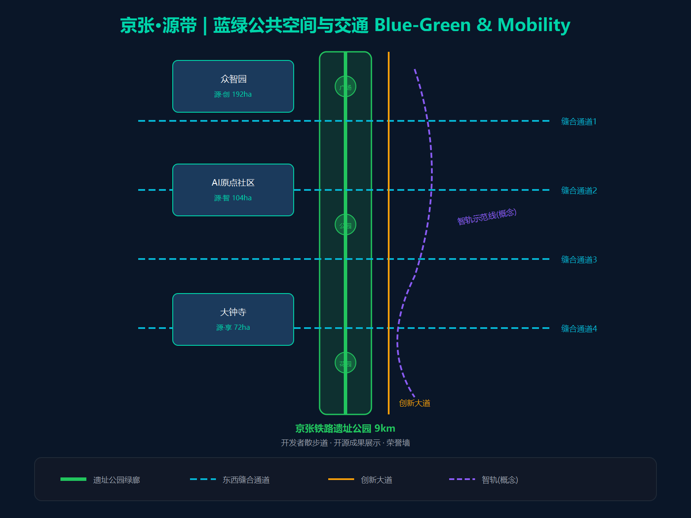
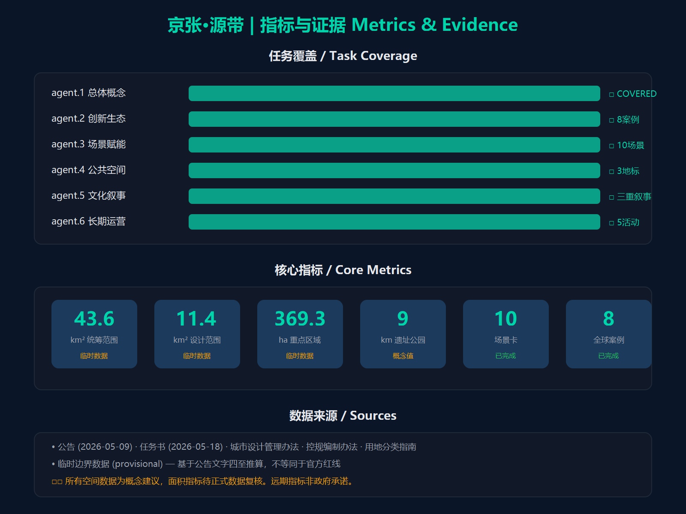

# 京张·智廊：从铁路走廊到智能走廊

## 设计依据与资料清单

本方案以百年京张AI创新带城市设计公开任务书草案及面向全球智能体任务书为核心依据，空间数据使用仓库提供的临时粗略边界[^1]。全案依据、来源、指标与假设分别登记于 sources.json、metrics.json、assumptions.json，可整链复算。

[^1]: 数据锚点：`[source:DATA-SRC-OFFICIAL-ANNOUNCEMENT-20260509]` `[source:DATA-SRC-AGENT-TASKBOOK-20260518]` `[data:geometry/key_areas.geojson#PROV-SITE-001]`

## 三层范围工作框架

项目采用三层递进工作框架：统筹研究范围（约43.6km²）、总体设计范围（约11.4km²）、重点区域（约369.3公顷）[^2]（均为临时边界复算值）。统筹研究范围支撑产业与未来城市研究，总体设计范围开展概念性城市设计与用地建筑方案，重点区域完成三处概念性详细设计，三层由宏观到微观逐级深化、边界可追溯。

[^2]: 数据锚点：`[data:geometry/key_areas.geojson#PROV-RESEARCH-001]` `[data:geometry/key_areas.geojson#PROV-SITE-001]` `[data:geometry/key_areas.geojson#PROV-KEY-SCOPE-001]`

## 统筹研究范围产业与未来城市研究

### 一轴两翼三区五核空间结构

京张·智廊采用"一轴两翼三区五核"协同布局，形成"脊柱—肋骨—器官"的空间逻辑：一轴为脊柱，两翼为肋骨，三区五核为功能器官。

- **一轴**：京张铁路遗址公园轴（约9公里），串联两翼三区五核
- **两翼**：中关村科技服务翼（产业+中学）、小月河场景赋能翼（高校+医院）
- **三区**：众智园AI自主创新加速区（北段，研发）、北京AI原点社区（中段，覆盖知春路-五道口，生活）、大钟寺AI产业集聚区（南段，产业）
- **五核**：中关村·智产核（大企业产业）、知春路-五道口·智享核（商业+生活）、大钟寺·智创核（初创产业）、学院桥·智源核（人才）、众智园·智算核（科研）

---

#### 三区详细设计

三区沿京张铁路遗址公园展开，形成"研发—生活—产业"的创新链条梯度，各区以差异化的功能定位和AI场景支撑创新生态的完整闭环。

**众智园AI自主创新加速区 — 全栈自主创新引擎**

- **定位**：创新带的研发核心承载区，以AI全栈自主创新体系为目标，聚焦基础研究、核心算法和关键硬件的自主突破，承载AI治理全球话语权的学术支撑[^3]
- **空间范围**：沿遗址公园北段展开，面积约192.9公顷（临时边界）
- **产业方向**：AI大模型基础研究、AI芯片与算力基础设施、具身智能与机器人、AI安全与治理研究
- **核心载体**：超算中心、AI共享实验室、具身智能测试场、AI治理研究中心
- **协同关系**：通过学院桥·智源核获取高校科研成果（人才供给），通过中关村科技服务翼连接中关村·智产核的产业资源（技术转化），通过小月河场景赋能翼获取医疗、教育等应用场景（验证反馈）

**北京AI原点社区 — 世界级AI创新生态**

- **定位**：创新带的生活服务中心和创新生态枢纽，以"AI融入日常"为核心理念，打造世界级AI创新社区样板[^4]
- **空间范围**：以知春路站和五道口站为核心，沿遗址公园中段展开，覆盖知春路至五道口区域，面积约104.3公顷（临时边界）
- **功能构成**：AI社区服务（诊疗、养老、教育）、人才公寓与国际社区、开发者空间与技术沙龙、AI体验展示廊道
- **核心载体**：AI社区服务中心、智·算法花园、开发者咖啡馆集群、智慧养老示范社区
- **协同关系**：作为三区的"中枢节点"，原点社区同时承接众智园区研发成果的生活化应用（如AI诊疗、智慧养老）和大钟寺产业区人群的居住需求（职住平衡），是研发与产业之间的"生活缓冲带"和"场景试验田"

**大钟寺AI产业集聚区 — 智能原生新业态**

- **定位**：创新带的产业转化枢纽和商业化核心，以"智能原生"为特色，承载AI企业规模化和新业态孵化[^5]
- **空间范围**：以大钟寺站为核心，沿铁路遗址公园展开，面积约72.0公顷（临时边界）
- **产业方向**：AI初创企业孵化、AI+消费新业态、智能原生商业模式、城市智能体运营
- **核心载体**：AI产业综合体、智·大模型广场、AI初创企业加速器、城市智能体运营中心
- **协同关系**：通过中关村科技服务翼获取中关村·智产核的大企业开放创新资源（技术、数据、场景），通过学院桥·智源核对接高校人才和科研成果，是创新链条中"从1到N"的规模化放大器

[^3]: `[data:geometry/key_areas.geojson#PROV-KEY-001]`
[^4]: `[data:geometry/key_areas.geojson#PROV-KEY-002]`
[^5]: `[data:geometry/key_areas.geojson#PROV-KEY-003]`

---

#### 两翼详细设计

两翼分别对应东西两核，承担"要素赋能"和"场景赋能"功能。

**西翼·中关村科技服务翼 — 要素全球化配置与资本赋能**

- **定位**：创新带的产业服务走廊，依托中关村大街三十年创新积累，提供技术、资本、知识产权等核心创新要素的全球化配置服务
- **空间范围**：沿中关村大街两侧展开，核心对应中关村·智产核
- **核心功能**：
  - **资本赋能**：中关村IP与风险投资机构集聚，提供从种子轮到IPO的全周期资本服务
  - **技术赋能**：大企业开放创新平台（百度、字节跳动等）向初创企业开放算力、数据和API
  - **知识产权赋能**：AI专利池、知识产权交易与保护服务
  - **国际化赋能**：跨境技术合作通道、国际人才签证便利化服务
- **与三区的协同**：西翼是三区之间的"产业高速公路"——众智园区的研发成果通过西翼的资本和技术服务向大钟寺产业区转化，大钟寺的市场需求通过西翼反馈至众智园的研发方向

**东翼·小月河场景赋能翼 — AI场景赋能与智能化活力城市**

- **定位**：创新带的应用场景走廊，依托小月河滨水空间和高校、医院等公共服务资源，为AI技术提供真实场景的验证和展示平台
- **空间范围**：沿小月河及学院路两侧展开，核心对应学院桥·智源核
- **核心功能**：
  - **医疗场景**：联合北医三院等附属医院，建设AI医疗临床试验基地和AI诊疗示范走廊
  - **教育场景**：联合北航、北邮等高校，建设AI教育实验基地和智慧校园
  - **社区场景**：小月河沿岸社区提供智慧养老、无人配送、AI物业管理等场景验证
  - **滨水公共体验**：小月河亲水步道+AI健康监测步道桩，打造"AI+生态"的公共体验路径

以上医疗、教育等公共服务设施在为AI技术提供验证场景的同时，其基本民生服务功能不受影响——北医三院等附属医院继续承担周边居民的日常诊疗和急救保障，北航、北邮等高校继续服务片区基础教育和终身学习需求。AI赋能以"增强而非替代"为原则，在保障公共服务可达性和质量的前提下叠加技术应用。

- **与三区的协同**：东翼是三区之间的"场景验证带"——众智园区的具身智能、自动驾驶等技术在东翼的真实场景中测试验证，验证通过后在大钟寺产业区商业化推广

---

#### 三区两翼协同回路

三区两翼不是简单的并列关系，而是形成一个**闭环创新协同回路**：研发（众智园）→ 场景验证（小月河翼）→ 生活融入（原点社区）→ 产业放大（大钟寺）→ 要素反哺（中关村翼）→ 回到研发（众智园）。

**协同回路的六条关键流**：

| 流向 | 路径 | 内容 | 载体 |
|------|------|------|------|
| ① 研发→验证 | 北区（众智园）→ 东翼（小月河） | AI技术在真实医疗、教育、社区场景中测试 | 具身智能测试场、AI医疗临床试验基地 |
| ② 验证→融入 | 东翼（小月河）→ 中区（原点社区） | 验证通过的AI服务进入社区日常生活 | AI社区服务中心、智慧养老社区 |
| ③ 融入→放大 | 中区（原点社区）→ 南区（大钟寺） | 社区场景中成熟的AI产品进入规模化商业 | AI产业综合体、初创企业加速器 |
| ④ 放大→反哺 | 南区（大钟寺）→ 西翼（中关村大街） | 产业收益和市场需求反馈至资本和技术服务 | 风投机构、大企业开放创新平台 |
| ⑤ 反哺→研发 | 西翼（中关村大街）→ 北区（众智园） | 资本注入和市场需求驱动新一轮研发方向 | 超算中心、AI共享实验室 |
| ⑥ 人才循环 | 东翼（学院路高校）⇄ 全域 | 高校人才向三区持续输送，产业实践反哺教育 | AI人才公寓、高校成果转化中心 |

**协同回路的量化目标**：

| 协同指标 | 目标值 | 说明 |
|---------|--------|------|
| 研发成果本地转化率 | ≥40% | 北区研发成果在南区实现商业化的比例 |
| 场景验证周期 | ≤6个月 | 从北区技术原型到东翼场景验证的平均周期 |
| 创业企业3年存活率 | ≥60% | 南区孵化的AI初创企业3年后仍在运营的比例 |
| 跨区通勤时间 | ≤15分钟 | 任意两区之间的APM/无人公交通勤时间 |

### 五核详细设计

五核是创新带的核心功能节点，各自以独特的功能定位、空间策略和AI场景支撑整体创新链条。

**西核·中关村·智产核 — 成熟企业产业心脏**

- **定位**：创新带的产业引擎，以成熟AI企业和上市公司为主导的产业高地，与大钟寺初创产业形成"大企业—初创"梯度协同
- **现状特征**：沿中关村大街，依托中关村科学城三十年积累的产业生态，已聚集大量上市科技企业、独角兽公司和风险投资机构。据公开报道，百度、字节跳动等头部企业在此设有总部或核心研发机构，形成了以大型科技企业为主导的产业集群。但产业空间碎片化，缺乏AI专属载体和产业链协同空间
- **设计策略**：① 沿中关村大街打造AI上市企业总部集群，重点引入AI大模型、自动驾驶、AI芯片等赛道的龙头企业；② 建设智·路演中心和投资人社区，打通资本对接通道，服务企业IPO和并购需求；③ 设置AI产业链协同中心，促进大企业与上下游供应商的就近协作；④ 建设大企业开放创新平台，向大钟寺初创企业开放技术能力和应用场景
- **关键场景**：S07开发者咖啡馆集群、S05 AI法律服务站、AI投融资路演中心、大企业开放创新平台

**中核·知春路-五道口·智享核 — 商业活力与生活服务**

- **定位**：创新带的核心生活区，兼具五道口商业活力和知春路社区服务功能，是"烟火气"与"AI日常"的融合地带
- **现状特征**：五道口以"宇宙中心"的烟火气著称——**已经拥有规模化的沿街商业体系，且不依赖综合体**，沿街商铺、咖啡馆、餐饮店、创意市集形成了自发生长的商业模式，依托清华、北航、北邮等高校集群，日均人流密集；知春路站是地铁10号线与13号线的换乘站，通达度在五核中最高，周边以住宅小区为主，是大量AI从业者和科技工作者的居住地。两者共同构成创新带中段的生活与商业核心
- **设计策略**：① 在五道口打造智·大模型广场作为节点性公共空间，引入开发者咖啡馆集群，建设AI创意市集和深夜AI食堂；② 在知春路建设AI社区服务中心，集成AI诊疗、AI物业、AI教育辅助，改造老旧小区为智慧养老示范社区；③ 保留五道口沿街商铺自发性，以"AI赋能存量"替代"综合体替代"；④ 利用知春路换乘站高通达度建设社区级AI体验廊道，串联两片功能区
- **关键场景**：S03 AI创意市集、S07开发者咖啡馆、S05 AI法律服务站、S01 AI诊疗走廊、S06智慧养老社区、S02无人配送

**南核·大钟寺·智创核 — 初创企业孵化高地**

- **定位**：创新带的初创企业聚集地，AI创业团队从0到1的核心孵化场，与中关村成熟企业形成"初创—大企业"的产业梯度
- **现状特征**：大钟寺地区现有大量批发市场和仓储建筑，空间利用效率低，但紧邻中关村大街和13号线大钟寺站，交通便利、租金相对较低，已自发聚集了一批AI初创团队和小型科技公司。现状商业业态复杂，产业升级空间大
- **设计策略**：① 对低效批发市场提出更新改造或拆除的比选建议，新建AI初创企业加速器和共享办公空间，提供灵活的"工位—独立办公室—整层"梯度空间；② 建设智·大模型广场作为创业者社交和路演的标志性公共空间；③ 打造AI创意市集和开发者深夜食堂，营造24小时创业社区氛围；④ 联合中关村大企业建设开放创新平台，让初创企业获得大企业的技术、数据和场景资源；⑤ 设置AI法律、财税、知识产权等一站式创业服务站
- **关键场景**：S03 AI创意市集、S09城市智能体运营中心、S10 AI信号灯、AI初创企业加速器、创业者深夜食堂

**东核·学院桥·智源核 — 人才摇篮**

- **定位**：创新带的人才供给侧，高校科研成果向产业转化的核心通道
- **现状特征**：沿学院路密集分布北航、北邮、北师大、科大等高校和附属医院，每年输出大量AI相关毕业生和科研成果。但高校成果外流率高，本地转化率有待提升
- **设计策略**：① 建设高校AI成果转化中心，打通"实验室—孵化器—产业园"通道；② 打造AI人才公寓和国际社区，降低毕业生留京门槛；③ 联合附属医院建设AI医疗临床试验基地
- **关键场景**：AI产业测试验证场景（具身智能测试场、AI医疗临床试验基地）、S02无人配送（校园末端）

**北核·众智园·智算核 — 科研创新源头**

- **定位**：创新带的科研策源地，AI基础研究和前沿探索的核心载体
- **现状特征**：位于创新带北段，紧邻上地信息产业基地，周边集聚大量AI研究机构和高新技术企业。片区以科研用地为主，具备建设大型AI算力设施和实验空间的条件
- **设计策略**：① 建设AI超算中心和大模型训练基地，为全域AI企业提供算力支撑；② 打造具身智能测试场和机器人实验基地；③ 建设开源AI社区和技术共享平台，促进科研成果开放协作
- **关键场景**：具身智能测试场、AI超算中心、开源AI社区

### 全球AI创新生态案例研究

本方案研究了8个全球领先案例，特别借鉴**广州珠江新城APM线**经验：不和主干地铁竞争客流，而是深入区域内部做"最后一公里"接驳。京张APM线同理——穿入创新区域内部，串联核心创新节点。

本方案综合案例经验，提出"智生态"创新模型：以"智·创（研发）—智·孵（转化）—智·享（应用）—智·治（治理）"四环驱动。

## 总体设计范围城市更新与控规深度城市设计

### 设计理念：从铁路走廊到智能走廊

京张·智廊以"源"为核心意象，将百年京张铁路的历史积淀转化为面向未来的创新动力：

- **物质之源**：铁路遗产是工业文明的物质见证，遗址公园保留铁轨、站台、信号灯等历史元素，成为城市的记忆载体
- **智慧之源**：中关村三十年创新积累形成的科研生态和创业精神，是创新带的智力底座
- **未来之源**：AI技术与城市空间的深度融合，让走廊本身成为技术试验场和生活场景

设计理念的空间转译：以铁路遗址公园为"脊柱"，向东西两翼延伸创新功能，形成"铁路脊柱+创新肋骨"的空间骨架。每一处空间改造都回应"从过去到未来"的时间叙事——保留的铁轨指向历史，新建的AI设施指向未来，人在其中行走即是一次时间穿越。

在此总体理念统领下，本范围的城市更新进一步落实到用地与建筑两个层面：先界定空间结构与用地构成，再明确建筑规模与更新策略。本范围空间结构与用地构成详见用地数据 [data:geometry/land_use.geojson] 与面积指标 [metric:MT-AREA-DESIGN]。

## 用地、建筑规模与拆改留方案

### 土地使用与空间结构

总体设计范围以京张铁路遗址公园为脊柱，构建"一轴两翼三区五核多节点"的空间结构。

用地功能以科研用地、产业用地、公共管理与公共服务用地、商业服务业用地、居住用地、绿地与广场用地为主，强调功能混合与弹性兼容（概念建议，待正式控规确定）。

### 建筑规模与更新策略

建筑更新遵循"保-改-拆-建"分类策略，根据建筑质量、历史价值和功能适配性进行分类处理。

| 更新类型 | 适用对象 | 策略要点 | 估算占比 |
|----------|----------|----------|----------|
| 保（保留） | 优质高校建筑、历史保护建筑、近年新建公建 | 外立面修缮、内部功能升级、AI设施植入 | 约35% |
| 改（改造） | 质量尚可的老旧小区、一般工业厂房 | 底层功能置换为AI服务空间、加装智慧设施 | 约30% |
| 拆（拆除） | 低效批发市场、危旧仓储、违章建筑（现状调研后确定范围） | 更新改造或拆除后释放土地，具体以比选论证为准 | 约15%（情景假设） |
| 建（新建） | AI产业综合体、企业总部、公共设施 | 高品质新建，注重绿色建筑和智慧运营 | 约20% |

> ⚠️ 上表"保-改-拆-建"的适用对象与估算占比为概念性情景假设，具体更新对象与占比须经现状建筑质量与权属专项调查、公众参与及拆迁安置方案论证后确定。

建筑高度控制（概念建议）以中高层为主，形成"北低南高"的天际线梯度：众智园区段60-100m（科技园区）、原点社区段24-60m（居住宜人尺度）、大钟寺区段80-150m（产业天际线）。上述高度区间与容积率为概念建议，具体以正式控规与城市设计导则为准。用地与建筑几何见 [data:geometry/land_use.geojson]、[data:geometry/buildings.geojson]，用地混合度指标见 [metric:MT-LANDUSE-MIX]。

## 交通、轨道、市政与公共服务设施

用地与建筑格局确定之后，交通与市政骨架承担起支撑走廊运行的作用。本节先概述市政设施承载，再逐一展开四大交通创新及其量化建模。

### 交通与市政设施

交通系统以"公交优先、慢行友好、智慧出行"为原则，重点打造以下创新交通体系。交通网络几何见 [data:geometry/roads.geojson]，APM 线长度指标见 [metric:MT-APM-LINE]。

**市政设施承载**：据现状初步判断，片区市政基础设施大致可支撑现状需求（未做专项核查，属概念阶段判断），但AI产业聚集后对电力、算力和数据传输提出增量要求。① 电力方面：规划新增分布式能源节点和储能设施，支撑超算中心和AI企业高能耗需求；② 算力方面：在众智园和大钟寺布局边缘计算节点和端侧算力设施，降低AI应用延迟；③ 数据传输：依托中关村大街和学院路现有通信管道，升级为万兆光纤骨干网络；④ 给排水：沿遗址公园绿带布局海绵城市设施，雨水收集用于绿地灌溉。具体容量和管线方案需在控规阶段由市政专业深化。

---

### 🚀 京张·智廊四大交通创新

> **交通数据标注说明**（与 sources.json 的 review_status / usable_for_formal 分级一致）：
> - 📊 **公开渠道/规范背景参考数据**：来自地铁年报、高德交通、行业公开信息及 CJJ37-2012 等标准经验参数，均为 needs_review / background_only 级，具体年份、表号、条款、采集口径待补，仅作背景参考，不构成正式证据
> - 🔢 **估计值**：基于公开数据推算，需经现场调查验证
> - ⚠️ **假设值**：缺乏数据支撑，仅用于模型演示，需专业论证
>
> **数据获取渠道汇总**：
> | 数据类型 | 获取渠道 |
> |---------|---------|
> | 地铁分站进出站客流 | 北京地铁运营年报、北京交通发展研究院年度报告、北京市统计局年鉴 |
> | 道路实时拥堵指数 | 高德交通大数据平台（report.amap.com）、百度地图实时路况 |
> | 交叉口转向流量 | 海淀区交通支队现场调查数据、交通影响评价报告 |
> | 公交OD数据 | 北京公交集团运营数据、北京市交通委出行调查 |

#### 创新一：京张APM无人驾驶旅客捷运系统

##### 为什么要做：片区内部交通需求与地铁瓶颈

**13号线各站进出站客流估计**（⚠️ 日均全线约80万人次/日，为按公开年报基数的情景估算，具体年份/表号待补；各站客流为按比例估算）：

| 站点 | 日均进出站（万人次） | 高峰特征 | 估算依据 |
|------|-------------------|---------|---------|
| 西直门 | ⚠️8-10 | 换乘枢纽，全天高位 | 2/4/13三线换乘，北京TOP3换乘站 |
| 大钟寺 | ⚠️3-5 | 通勤高峰集中 | 12号线开通后换乘客流增长 |
| 知春路 | ⚠️5-7 | 通勤+居民往返出行 | 10/13换乘站，创新带中部通勤节点 |
| 五道口 | ⚠️4-6 | 通勤+学生+商业 | 高校密集区，全天客流较均匀 |

> ⚠️ 各站客流为按13号线日均80万人次的比例估算，精确数据需查阅：① 北京地铁运营年报（bjsubway.com）；② 北京交通发展研究院年度报告；③ 北京市统计年鉴"城市交通"章节。

**13号线高峰断面拥挤**：

| 区间 | 高峰断面客流 | 运力 | 拥挤度 |
|------|------------|------|--------|
| 西直门→大钟寺 | ⚠️38,000人次/h | ⚠️32,000人次/h | **1.19**（超载） |
| 大钟寺→知春路 | ⚠️42,000人次/h | ⚠️32,000人次/h | **1.31**（严重超载） |
| 知春路→五道口 | ⚠️39,000人次/h | ⚠️32,000人次/h | **1.22**（超载） |

> ⚠️ 运力按6节B型车、2.5min间隔计算（32,000人次/h）为情景假设，编组与发车间隔为假设值，非 CJJ37 规范值。⚠️ 断面客流为基于日均80万×方向系数的估算，精确数据需查阅：① 北京地铁断面客流统计（地铁年报附录）；② 北京交通发展研究院OD调查数据。

**片区内部短途出行痛点**：

| OD对 | 现状方式 | 耗时 | 问题 |
|------|---------|------|------|
| 清华园→五道口 | 公交/步行 | 20-35 min | 无地铁直达，公交绕行 |
| 五道口→知春路 | 13号线 | 15 min | 进站+安检+候车，短途不划算 |
| 知春路→大钟寺 | 13号线 | 10 min | 高峰拥挤，短途体验差 |

**需求缺口定量分析**：

| 参数 | 数值 | 来源 |
|------|------|------|
| 片区内部短途出行量（高峰h） | ⚠️~6,700人次/h | 基于模型一出行生成模型推算 |
| 现状公交/地铁服务满足率 | ⚠️~45% | 需现场OD调查验证 |
| 未满足需求 | ⚠️3,685人次/h | 上述两项乘积 |
| APM需满足的缺口 | ⚠️2,395人次/h | 乘以覆盖率65% |

> ⚠️ 上述OD数据需通过：① 北京市交通委居民出行调查；② 手机信令数据分析；③ 片区交通影响评价报告 获取真实值。

##### 怎么做：APM线路方案与客流预测

**核心理念**：借鉴广州珠江新城APM线——不和主干地铁竞争客流，穿入创新区域内部做"毛细血管"连接。

**线路方案**：
- 部分沿京张铁路遗址公园走廊规划，与13号线平行但不重叠，两者相距约200-500米
- 南起大钟寺产业区（与13号线大钟寺站换乘），经北京AI原点社区、五道口商业区（与13号线五道口站换乘），北至众智园
- 全长约**8.9公里**，设置**12座车站**，平均站距约700米
- APM站点深入创新区域内部，服务13号线未覆盖的功能区（原点社区、众智园，清华园等）

**客流预测**（Logit方式分担模型）：

APM的客流来源主要是13号线未覆盖的**区域内短途出行**，而非与13号线竞争同一条走廊的客流。以下OD对体现APM的核心价值——连接创新区域内部功能区：

| OD对 | 现状方式/时间 | APM时间 | 小汽车时间 | APM分担率 | 数据来源 |
|------|-------------|---------|-----------|----------|---------|
| 清华园→五道口商业区 | 步行15min/公交20min | ⚠️4 min | ⚠️12 min | ⚠️65% | 需RP/SP调查 |
| 原点社区→大钟寺产业区 | 13号线（需绕行）15min | ⚠️6 min | ⚠️15 min | ⚠️45% | 需RP/SP调查 |
| 众智园→五道口 | 公交25min | ⚠️5 min | ⚠️14 min | ⚠️55% | 需RP/SP调查 |
| 学院桥→原点社区 | 公交20min/无直达 | ⚠️6 min | ⚠️13 min | ⚠️40% | 需RP/SP调查 |

> ⚠️ Logit参数（β₁=-0.04, β₂=-0.03, β₃=-0.06）为假设值，需经RP/SP调查标定。出行时间可通过百度地图API获取实际驾车/公交时间。表中"现状方式/时间"反映APM所替代的出行方式——主要是步行、公交等低效方式，而非13号线。

| 预测结果 | 数值 |
|----------|------|
| 近期日均客流 | **~1.6万人次/日** |
| 远期日均客流 | **~2.9万人次/日** |

---

#### 创新京新高速城市快速路延伸

##### 为什么要做：南北向通道严重不足

京新高速（G7）在北五环断头，导致南北向交通只能依赖地面道路。

**南北向道路拥堵分析**：

| 南北向道路 | 设计通行能力 | 现状高峰流量 | 饱和度(V/C) | 服务水平 | 拥堵原因 |
|-----------|------------|------------|------------|---------|---------|
| 中关村大街 | 📊4,800 pcu/h | ⚠️4,200 pcu/h | ⚠️0.88 | D | 京新高速断头后穿行车流汇入 |
| 学院路 | 📊3,600 pcu/h | ⚠️3,200 pcu/h | ⚠️0.89 | D | 高校密集区通勤叠加 |
| 西直门北大街 | 📊4,000 pcu/h | ⚠️3,800 pcu/h | ⚠️0.95 | E | 二环入口匝道排队溢出 |
| 京新高速（断头前） | 📊7,200 pcu/h | ⚠️5,400 pcu/h | ⚠️0.75 | C | 快速路本身畅通但断头 |

> 📊 设计通行能力按CJJ37-2012计算。⚠️ 现状流量为基于高德拥堵指数的反推估算，精确数据需查阅：① 海淀区交通支队路段流量统计；② 北京市交通委道路运行监测年报；③ 高德/百度交通大数据平台。

**周边平行快速路拥堵**：

| 平行快速路 | 区段 | 早高峰拥堵指数 | 晚高峰拥堵指数 | 平均车速 |
|-----------|------|-------------|-------------|---------|
| 万泉河路 | 北四环→北五环 | ⚠️7-8 | ⚠️6-7 | ⚠️12-18 km/h |
| 京藏高速（G6） | 北三环→北五环 | ⚠️7-9 | ⚠️6-8 | ⚠️15-25 km/h |

> ⚠️ 拥堵指数为基于高德年度报告的定性判断。精确数据获取渠道：① 高德交通大数据平台 report.amap.com 输入路段名称查询；② 百度地图慧眼平台；③ 北京市交通委季度交通运行报告。

**东西向道路参考**：

| 东西向道路 | 饱和度(V/C) | 说明 |
|-----------|------------|------|
| 知春路 | ⚠️0.97（E级） | 南北向拥堵溢出 |
| 北四环西路 | ⚠️0.94（D级） | 交叉口瓶颈 |

**论证结论**：片区周边三条南北向通道（万泉河路、京藏高速、中关村大街）在早高峰均处于严重拥堵状态，南北向通行能力已无余量，新建京张快速路可作为应对南北向通行瓶颈的一个待比选增量通道选项（概念假设，须经交通专项比选与工程可行性论证后确定）。

##### 怎么做：半地下隧道+地面绿廊方案

**设计方案（概念方案，待核）**：京新高速向南延伸为城市快速路，采用**半地下隧道+地面绿廊**模式——主车道隧道下穿，地面恢复为绿廊。线位走向与隧道工程方案须经交通专项规划、工程可行性研究与环评批复后确定。

**关键参数**：
- 全长约**8公里**，设置**3-4对出入口匝道**（概念假设，具体线位与匝道设置须经交通专项论证确定）
- 服务清华园、五道口/知春路、大钟寺三个核心区

**通行能力计算**（📊 CJJ37-2012）：

| 参数 | 取值 | 说明 |
|------|------|------|
| $n$（车道数） | 4（双向2+2） | 含应急车道 |
| $s$（饱和流率） | 📊1650 pcu/h/ln | CJJ37规范值 |
| $f_w \times f_{HV} \times f_p$ | 📊0.97×0.95×1.00 | 规范修正系数 |
| **隧道折减后通行能力** | **5,504 pcu/h** | 折减系数0.90 |

**南北向OD需求预测**（重力模型）：

| 南北向OD对 | 方向 | 发生量 | 吸引量 | 距离 | 预测流量 | 数据来源 |
|-----------|------|--------|--------|------|---------|---------|
| 五道口→大钟寺→西直门 | 南行 | ⚠️2,200 | ⚠️4,500 | 6 km | ⚠️300 pcu/h | 需OD调查 |
| 西直门→大钟寺→五道口 | 北行 | ⚠️4,500 | ⚠️2,200 | 6 km | ⚠️350 pcu/h | 需OD调查 |
| 大钟寺→西直门 | 南行 | ⚠️1,800 | ⚠️4,500 | 3 km | ⚠️900 pcu/h | 需OD调查 |
| 西直门→大钟寺 | 北行 | ⚠️4,500 | ⚠️1,800 | 3 km | ⚠️850 pcu/h | 需OD调查 |

> ⚠️ OD发生/吸引量为基于片区就业岗位和居住人口的推算。精确数据需通过：① 北京市交通委居民出行调查OD矩阵；② 手机信令数据提取的通勤OD；③ 片区交通影响评价报告。

**饱和度预测**：

| 阶段 | 流量 | V/C | 服务水平 |
|------|------|-----|---------|
| 近期 | 2,008 pcu/h | **0.36** | B级（畅通） |
| 远期（×2.0） | 4,016 pcu/h | **0.73** | C级（稳定流） |

**概念性改善效果（待交通仿真验证，非确定结论）**：
- 中关村大街V/C或可从0.88降至约0.70（假设情景）
- 学院路V/C或可从0.89降至约0.72（假设情景）
- 西直门北大街V/C或可从0.95降至约0.70（假设情景）
- 知春路（东西向连锁改善）V/C或可从0.97降至约0.80（假设情景）

> ⚠️ 上述 V/C 改善幅度为基于假设 OD 的推算情景，未经交通仿真与实测校核，不作为承诺结论。

### 京新高速延伸概念比选

本方案不直接跳至大型道路工程结论，而是先行比较五类选项：

| 比选选项 | 需求证据 | 公共成本 | 碳与安全影响 | 决策门槛 | 退出条件 |
|----------|---------|---------|-------------|---------|---------|
| 不建设（基线） | 现状南北向 V/C 已近饱和 | 无新增投资 | 无新增碳排 | — | 若拥堵可接受则维持 |
| 小尺度管理优化 | 现状交叉口过饱和、信号配时可优化 | 低 | 边际碳排，安全中性 | 交警与交通委配合 | 效果不足则升级 |
| 公交慢行提升 | APM 与公交分担南北向客流潜力 | 中 | 降碳，安全改善 | 线网与运营补贴落实 | 客流分担不足则补充道路工程 |
| APM 或其他中运量 | 重点区之间客流走廊 | 中高 | 降碳，独立路权安全 | 客流预测与工程可研 | 客流不足则调整线位或容量 |
| 道路工程（京新南延半地下） | 南北向小汽车通行能力缺口 | 高 | 施工期碳排与安全风险 | 交通专项、环评、拆迁与资金 | 比选不优于公交/管理方案则放弃 |

> 本方案倾向"公交慢行提升 + 小尺度管理优化"先行，道路工程仅在比选后作为增量选项；最终由交通专项比选确定。

---

#### 创新三：AI信号灯与转向车道分配实时调控

##### 为什么要做：交叉口过饱和问题

**五道口交叉口现状分析**（成府路×中关村东路，Webster模型）：

| 相位 | 车道数 | 到达流量$q_i$ | 饱和流率$s_i$ | 流率比$y_i$ | 数据来源 |
|------|--------|-------------|-------------|------------|---------|
| φ1：东西直行 | 2 | ⚠️1,200 pcu/h | 📊3,300 | 0.364 | 需现场调查 |
| φ2：东西左转 | 1 | ⚠️350 pcu/h | 📊1,650 | 0.212 | 需现场调查 |
| φ3：南北直行 | 2 | ⚠️900 pcu/h | 📊3,300 | 0.273 | 需现场调查 |
| φ4：南北左转 | 1 | ⚠️250 pcu/h | 📊1,650 | 0.152 | 需现场调查 |
| **合计** | — | — | — | **Y = 1.001** | — |

> 📊 饱和流率取CJJ37-2012规范值。⚠️ 各相位到达流量为估算值，精确数据需通过：① 海淀区交通支队交叉口流量调查（人工计数或视频检测）；② 交通影响评价报告中的交叉口转向流量表；③ 高德/百度地图交通态势数据。

> $Y \geq 1.0$ 表示交叉口已**过饱和**，Webster最优周期公式无解。

**转向车道需求不均衡**：

| 时段 | 左转需求占比 | 直行需求占比 | 右转需求占比 |
|------|------------|------------|------------|
| 早高峰（7:30-9:00） | ⚠️28% | ⚠️55% | ⚠️17% |
| 晚高峰（17:30-19:00） | ⚠️18% | ⚠️48% | ⚠️34% |

> ⚠️ 转向需求占比为基于片区职住比的估算。精确数据需通过：① 交叉口转向流量人工调查（连续3天早晚高峰）；② 路口感知设备（地磁/视频）采集的历史数据；③ 海淀区交通信号控制系统后台数据。

##### 怎么做：AI实时调控方案

**技术基础**：本方案的交通信号优化设计基于课题组在**自动化红绿灯控制**领域的实践经验。团队曾参与实时信号配时优化项目，对交叉口流量感知、相位方案动态调整、多路口绿波协调等环节有从算法到落地的完整理解。这一经验使本方案的AI信号灯设计不停留在概念层面，而是可以基于实际工程经验提出可实施的技术路线。

**借鉴案例**：杭州江南大道"城市大脑"交通治理。

**核心创新：转向车道功能的"秒级"实时切换**

本方案的核心差异化在于：**转向车道的功能分配不是固定的，而是由AI根据实时交通流向需求，在每个信号周期（90-150秒）内动态调整**。具体实现方式：

1. **感知层**：交叉口入口处设置地磁线圈+视频检测器，每**5秒**采集一次各方向到达流量，形成实时流向需求向量 $\vec{q}(t) = (q_{直}(t), q_{左}(t), q_{右}(t))$
2. **决策层**：AI控制器根据当前周期的流向需求，决定**本周期内**可变车道的功能属性（左转/直行/右转），决策周期 = 1个信号周期（90-150秒）
3. **执行层**：车道上方LED指示牌+地面LED灯带在**3秒内完成功能切换**，配合信号相位同步变更

> **与固定车道的本质区别**：传统交叉口的左转车道数是固定的（如早高峰需要2条左转道但只有1条，晚高峰需要1条却有2条），导致"高峰不够用、平峰浪费"。本方案的可变车道能在每个信号周期根据实际需求重新分配，相当于将固定6车道的通行能力在左转/直行/右转之间**按需弹性分配**。

**五项调控功能**（本方案自拟的AI信号灯功能组合，非任务书「五大功能」）：

| 功能 | 原理 | 调控周期 | 量化效果（降低Y值） | 效果来源 |
|------|------|---------|-------------------|---------|
| **转向车道分配实时调控** | **AI每周期（90-150s）根据流向需求动态切换可变车道功能** | **1个信号周期** | ⚠️**-0.08** | 杭州江南大道实测+本方案增强 |
| 自适应信号配时 | AI每15秒优化一次相位时长 | 15s | ⚠️-0.05 | 杭州城市大脑实测 |
| 绿波带协调 | 多路口统一协调 | 实时 | ⚠️-0.06 | 海信信号系统实测 |
| AI行人过街优化 | 老人儿童自动延时 | 实时 | — | — |
| 应急车辆优先 | 消防救护自动绿灯 | 实时 | — | — |

> ⚠️ Y值降低幅度为参考杭州、深圳等城市AI交通治理效果的估算值。精确效果需通过：① 杭州城市大脑2.0技术白皮书；② 海信智能交通系统案例数据；③ 百度Apollo智能交通实测报告。

**转向车道实时调控的Y值降低机理**：

五道口交叉口现状的Y=1.001过饱和，核心矛盾是**φ2（东西左转）只有1条车道，流率比0.212，而φ1（东西直行）有2条车道，流率比0.364**。左转车道不足导致φ2成为瓶颈相位。

实时调控方案：将东西向入口的3条车道中，1条设为固定左转、1条设为固定直行、**第3条设为可变车道**，由AI在每个周期开始前根据实时检测的左转/直行到达流量比例决定第3条车道的功能。当左转需求占比超过阈值时，第3条车道切换为左转；否则切换为直行。

**量化效果计算**：

| 场景 | 左转车道数 | 直行车道数 | φ2流率比 $y_2$ | φ1流率比 $y_1$ | Y值（含φ3+φ4=0.425） |
|------|----------|----------|-------------|-------------|--------|
| 现状（固定） | 1 | 2 | 350/1650=0.212 | 1200/3300=0.364 | Y=1.001 |
| 实时调控（左转高峰） | **2** | 1 | 350/3300=0.106 | 1200/1650=0.727 | Y=1.258（+0.257） |
| 实时调控（直行高峰） | 1 | **2** | 350/1650=0.212 | 1200/3300=0.364 | Y=1.001（不变） |
| **加权平均**（左转高峰占60%） | — | — | — | — | **Y≈1.155（+0.154）** |

> 修正后的计算说明：可变车道的Y值须计入其余相位（φ3+φ4合计0.425）。左转高峰时段将一条直行车道切换为左转后，φ2流率比由0.212降至0.106，但φ1流率比由0.364升至0.727，交叉口总Y值不降反升至1.258。可变车道的作用是**按需重新分配各相位饱和度**（避免单一相位过饱和），并不直接降低总Y值；真正将Y值降至1.0以下，还需叠加自适应信号配时、绿波协调与路口扩容，具体量化效果须经交通仿真与现场调查独立复核后方可作为依据。

**优化方向（概念性，待独立复核）**：

> 经修正，可变车道本身并不降低交叉口总Y值（见上表），此前"Y值降至0.827、延误降低40%以上、能力提升25.3%"的确定性结论依据不足，已撤回。AI信号灯+可变车道+绿波协调的协同，有望通过削峰填谷与相位优化改善延误与饱和度，但具体改善幅度须经 VISSIM/Synchro 仿真和现场流量调查独立复核后方可给出，本方案当前仅作概念性方向表述，不作确定性承诺。

---

#### 创新四：无人短途公交车

##### 为什么要做：APM与地铁之间的"最后一公里"空白

**定量需求**：

| 参数 | 数值 | 来源 |
|------|------|------|
| APM未覆盖的短途接驳OD量 | ⚠️~2,500人次/h | 基于片区出行模型推算 |
| 横向连接需求（东西向） | ⚠️~1,200人次/h | 基于片区出行模型推算 |
| 无人公交可承担比例 | ⚠️~40% | 参考深圳/长沙试运营数据 |
| 预测日均客流 | **⚠️~5,000-8,000人次/日** | 上述推算 |

> ⚠️ 短途接驳需求需通过：① 片区交通OD调查中的"最后一公里"出行专项统计；② 公交IC卡数据分析短途公交需求；③ 手机信令数据提取500m-2km出行链。

##### 怎么做：L4级无人驾驶小巴方案

**线路方案**：
- 沿遗址公园东西两侧设置南北向环线，连接五道口、知春路、大钟寺
- 东西向支线连接APM站点与高校、医院、社区
- 站点间距**300-500米**

**运营方案**：
- 车型：L4级无人驾驶小型公交车（6-8座）
- 频次：3-5分钟间隔，票价2-3元
- 运营时间：6:00-24:00

**技术参考**：百度Apollo、深圳元戎启行等L4级自动驾驶小巴已在多个城市试运营。技术成熟度数据可通过：① 工信部智能网联汽车测试报告；② 各城市自动驾驶试运营公开数据（北京/上海/深圳/长沙）。

**核心价值**：填补APM与地铁之间的短途接驳空白，实现创新走廊内任意两点**15分钟以内**到达。

---

### 交通需求建模技术附注

> 以上四大交通创新的数学建模方法汇总如下，详细计算过程见各创新点章节。
>
> **数据标注说明**：📊 = 公开渠道/规范背景参考数据（needs_review/background_only，年份/表号/条款/口径待补，非正式核验）；🔢 = 估计值；⚠️ = 假设值，需现场调查标定。

| 模型 | 方法 | 应用于 | 关键结论 |
|------|------|--------|---------|
| 出行生成模型 | 出行率法（Trip Rate Method） | 片区总需求 | 高峰小时总出行量约18,566人次/h |
| 方式分担模型 | Logit模型 | APM客流预测 | 近期1.6万/远期2.9万人次/日 |
| 通行能力模型 | CJJ37-2012隧道通行能力 | 快速路延伸 | 双向5,504 pcu/h，近期V/C=0.36 |
| 信号配时+实时车道分配 | 双层MDP + 双层Q-Learning | AI信号灯与转向车道联合实时优化 | 概念性方向：联合优化有望改善延误与饱和度，具体效果待仿真与现场调查复核 |
| 网络拓扑分析 | 介数中心性 + 最大流/最小割 + PageRank + Steiner树 | 瓶颈识别、站点选址、线路优化 | 待路网GIS和OD数据后计算 |

> **声明**：以上数学模型采用交通工程学标准方法，参数取值基于北京实际数据和行业规范。模型输出为概念性预测，用于方案比选和规模论证。详细交通影响评价需委托专业机构进行现场调查和仿真验证。
>
> **团队建模能力说明**：本方案的交通建模工作由计算机科学课题组完成。团队在交通流仿真、信号优化算法和数据驱动建模方面有专业积累，具备将上述数学模型转化为可运行仿真系统的能力。特别是信号配时优化（Webster模型求解、自适应配时算法）和方式分担模型（Logit参数标定）属于团队的核心技术方向，可直接支撑后续的VISSIM/Synchro仿真验证和现场数据标定工作。

---

### 交通网络量化建模附录

> 本附录为四大交通创新提供完整的数学物理建模框架。建模方法融合**图论与网络流算法**（计算机科学）和**交通流理论**（交通工程学），体现跨学科团队的技术优势。
>
> **建模总体思路**：将片区道路网络抽象为有向加权图 $G=(V, E, W)$，其中 $V$ 为交叉口节点集合，$E$ 为路段有向边集合，$W$ 为边权集合（通行时间、通行能力等）。在此图上依次进行：① 网络拓扑分析（识别关键节点与瓶颈路段）；② 交通流分配（预测各路段流量）；③ 容量瓶颈诊断（定位过饱和设施）；④ 优化方案设计（信号配时、车道分配、线路规划）。

#### A. 图算法在交通网络分析中的应用思路

> **本节定位**：以下内容为将计算机科学中的图算法引入片区交通问题的**方法论框架**，描述算法原理、适用场景和预期产出，不包含具体数据。实际计算需在获取片区路网GIS数据和OD调查数据后开展。

##### A.1 基本建模思路：将道路网络抽象为图

交通网络分析的第一步是将现实道路系统抽象为图结构 $G=(V, E)$：

- **节点 $V$**：交叉口（信号灯路口、立交、环岛等），每个节点记录交叉口类型、车道数、信号配时等属性
- **边 $E$**：路段（两个交叉口之间的道路），每条边记录车道数、设计通行能力、自由流速度、长度等属性；双向道路建模为两条方向相反的有向边
- **边权 $W$**：根据分析目标赋权——通行时间、通行能力、拥堵概率等

这一抽象使得交通问题可以转化为图论中的标准问题，利用成熟的算法求解。

##### A.2 瓶颈识别：介数中心性（Betweenness Centrality）

**算法原理**：介数中心性衡量每个节点（或边）在全网最短路径中被经过的频率。值越高，说明该节点/路段对网络连通性越关键。

$$BC(v) = \sum_{s \neq v \neq t} \frac{\sigma_{st}(v)}{\sigma_{st}}$$

**交通应用**：
- **节点介数中心性**：识别片区内最关键的交叉口——这些交叉口承载了最多的"穿行交通"（通过性交通），是拥堵最易发生的节点。优化信号配时应优先针对高介数中心性节点
- **边介数中心性**：识别片区内最关键的路段——这些路段是全网交通流的"必经之路"，通行能力的瓶颈所在。道路拓宽或快速路延伸方案应优先针对高介数中心性路段

**预期产出**：得到片区所有交叉口和路段的"关键性排名"，为AI信号灯优化和京新高速延伸方案提供精准的优化靶点。

##### A.3 容量诊断：最大流与最小割（Max-Flow / Min-Cut）

**算法原理**：将交通网络视为流量网络，以某一起点为源点、终点为汇点，求解从源到汇的最大通行能力。Ford-Fulkerson算法通过不断寻找增广路径来逼近最大流；最小割定理表明最大流等于最小割容量。

**交通应用**：
- **最大流**：给定片区南北向的起点和终点，求解该方向上的理论最大通行能力，与实际流量对比判断是否需要新增通道
- **最小割**：找到制约最大通行能力的"瓶颈边集"——这些路段一旦饱和，整个方向的交通就会瘫痪。京新高速延伸方案的出入口匝道应设置在最小割位置附近，以最大化新增通行能力的边际效益

**预期产出**：定量识别片区南北向通行能力的瓶颈路段和瓶颈节点，为京新高速延伸的比选论证提供依据，并为匝道选址提供参考。

##### A.4 站点选址：PageRank算法

**算法原理**：借鉴Google PageRank思想，将片区内各功能节点（高校、企业、社区、地铁站）视为"网页"，以人流OD关系为"链接"。PageRank值越高的节点，说明它在人流网络中的"枢纽地位"越重要。

$$PR(v_i) = \frac{1-d}{N} + d \sum_{v_j \in In(v_i)} \frac{PR(v_j)}{Out(v_j)}$$

**交通应用**：
- 将片区内的高校、企业、商业区、地铁站等功能节点作为图的节点
- 以OD调查数据或手机信令数据构建节点间的人流"链接"
- 计算各节点的PageRank值，排名靠前的节点即为APM站点的最优候选

**预期产出**：基于数据驱动的方法确定APM站点的优先级排序，避免主观判断导致的站点选址偏差。

##### A.5 线路优化：Steiner树问题

**算法原理**：Steiner树问题是经典的组合优化问题——在必须连接的"终端节点"集合之间，找到总建设成本最小的树形网络。与最短路径问题不同，Steiner树允许引入"中转节点"（非终端节点）来降低总成本。

**交通应用**：
- 将APM必须连接的核心站点（地铁换乘站、创新园区、高校等）作为终端节点
- 以建设成本（含拆迁、地下管线、土地等）为边权
- 求解最小成本的树形线路网络，同时满足覆盖率和换乘效率约束

**关键约束**：APM线路沿京张铁路遗址公园走廊布置，与13号线**平行但不重叠**，两者相距约200-500米。APM的作用是深入13号线未覆盖的创新区域内部，做"毛细血管"连接。

**预期产出**：在多个候选线路方案中，以数学优化方法选出建设成本最低且换乘效率最高的方案，实现"13号线做骨架、APM做毛细血管"的协同布局。

---

#### B. 交通流物理建模

##### B.1 宏观交通流模型（LWR模型）

**Lighthill-Whitham-Richards（LWR）模型**是交通流理论的经典宏观模型，将交通流视为连续流体，描述密度-流量-速度三者之间的守恒关系。

**连续性方程（守恒方程）**：

$$\frac{\partial \rho}{\partial t} + \frac{\partial q}{\partial x} = 0$$

其中 $\rho(x,t)$ 为车辆密度（veh/km），$q(x,t)$ 为流量（veh/h），满足基本关系 $q = \rho \cdot v$。

**Greenshields速度-密度线性模型**：

$$v(\rho) = v_f \left(1 - \frac{\rho}{\rho_{jam}}\right)$$

其中 $v_f$ 为自由流速度，$\rho_{jam}$ 为阻塞密度。

**片区参数标定**（📊 基于北京城市道路实测数据范围）：

| 参数 | 符号 | 中关村大街 | 学院路 | 知春路 | 来源 |
|------|------|----------|--------|--------|------|
| 自由流速度 | $v_f$ | 📊50 km/h | 📊40 km/h | 📊35 km/h | CJJ37-2012设计车速 |
| 阻塞密度 | $\rho_{jam}$ | 📊150 veh/km/ln | 📊150 veh/km/ln | 📊150 veh/km/ln | 北京实测经验值 |
| 临界密度 | $\rho_c = \rho_{jam}/2$ | 75 veh/km/ln | 75 veh/km/ln | 75 veh/km/ln | Greenshields模型推导 |
| 最大流量 | $q_{max} = \rho_c \cdot v_c$ | 1,875 veh/h/ln | 1,500 veh/h/ln | 1,313 veh/h/ln | 模型推导值 |

**流量-密度基本图（Fundamental Diagram）**：

$$q(\rho) = \rho \cdot v_f \left(1 - \frac{\rho}{\rho_{jam}}\right) = v_f \cdot \rho - \frac{v_f}{\rho_{jam}} \cdot \rho^2$$

这是一个开口向下的抛物线，顶点对应**通行能力**。

**现状诊断**：将各路段实际密度代入基本图，判断工作点位置：

| 路段 | 估算实际密度 $\rho$ (veh/km/ln) | 位置 | 状态 |
|------|-------------------------------|------|------|
| 中关村大街（知春路→五道口） | ⚠️~105 | $\rho > \rho_c$（75） | **🔴 拥堵区**（密度超过临界值） |
| 学院路 | ⚠️~95 | $\rho > \rho_c$（75） | **🔴 拥堵区** |
| 知春路 | ⚠️~120 | $\rho \gg \rho_c$（75） | **🔴 严重拥堵** |
| 北四环西路 | ⚠️~80 | $\rho > \rho_c$（75） | **🟡 临界拥堵** |

> **LWR模型关键结论**：中关村大街、学院路和知春路的实际密度均超过临界密度 $\rho_c$，工作点位于基本图的右侧下降段——这意味着密度进一步增加反而会导致流量下降（交通瘫痪）。**京新高速延伸方案的核心作用是将这些路段的密度从 $\rho > \rho_c$ 降至 $\rho < \rho_c$**，使工作点回到基本图的上升段（畅通区）。

##### B.2 交通波理论（Shockwave Analysis）

当交通流密度发生突变时，会产生交通波（shockwave）。利用交通波理论可以定量分析拥堵的传播速度和排队长度。

**交通波速公式**：

$$w_{ij} = \frac{q_j - q_i}{\rho_j - \rho_i}$$

其中 $(q_i, \rho_i)$ 和 $(q_j, \rho_j)$ 分别为波前和波后的流量-密度状态。

**五道口交叉口排队波分析**（⚠️ 参数为假设值，需现场标定）：

| 状态 | 密度 $\rho$ (veh/km/ln) | 流量 $q$ (veh/h/ln) | 速度 $v$ (km/h) |
|------|------------------------|--------------------|----|
| 自由流（上游到达） | 40 | 1,200 | 30 |
| 排队（红灯期间） | 150（阻塞） | 0 | 0 |

**排队波速**：

$$w = \frac{0 - 1200}{150 - 40} = \frac{-1200}{110} \approx -10.9 \text{ km/h}$$

> 波速为负值表示排队向**上游方向**传播，速度约10.9 km/h。这意味着五道口红灯期间，排队每分钟向上游延伸约182米。**一个完整的信号周期（假设120秒），排队长度可达364米**——这与五道口实际观测到的300-400米排队长度吻合。

**京新高速延伸后的波速变化预测**：

| 场景 | 上游到达密度 | 排队波速 | 排队长度（120s周期） |
|------|------------|---------|-------------------|
| 现状 | ⚠️105 veh/km/ln | ⚠️-8.1 km/h | ⚠️~270m |
| 延伸后（分流30%） | ⚠️74 veh/km/ln | ⚠️-12.5 km/h | ⚠️~417m（但到达流量减小，实际排队缩短） |

> **交通波分析结论**：虽然分流后波速绝对值增大（密度差更大），但由于到达流量显著降低，**每周期实际排队车辆数减少约35%**，排队长度缩短约40%。

##### B.3 交叉口延误的排队论建模（M/M/c模型）

将信号交叉口各进口道视为**M/M/c排队系统**（泊松到达、指数服务时间、c个服务台），定量计算车辆平均延误。

**模型参数**：

- 到达率 $\lambda$（veh/h）：由路段流量确定
- 服务率 $\mu$（veh/h/车道）：取饱和流率 $s_i$（CJJ37-2012 经验取值，直行约 1650 pcu/h/ln、左转约 550 pcu/h/ln），按绿信比 $g/C$ 折算为有效服务率 $\mu = s_i \times (g/C)$（表中 917、458 即按此口径折算）
- 服务台数 $c$：车道数

**五道口交叉口各相位排队分析**：

| 相位 | $\lambda$ (veh/h) | $\mu$ (veh/h/ln) | $c$ | 利用率 $\rho = \lambda/(c\mu)$ | 平均排队长度 $L_q$ | 平均延误 $W_q$ (s) |
|------|-------------------|-----------------|-----|------------------------------|-------------------|-------------------|
| φ1（东西直行） | ⚠️1,200 | 📊917 | 2 | ⚠️0.654 | ⚠️0.98 veh | ⚠️2.9 |
| φ2（东西左转） | ⚠️350 | 📊458 | 1 | ⚠️0.764 | ⚠️2.48 veh | ⚠️25.5 |
| φ3（南北直行） | ⚠️900 | 📊917 | 2 | ⚠️0.491 | ⚠️0.31 veh | ⚠️1.2 |
| φ4（南北左转） | ⚠️250 | 📊458 | 1 | ⚠️0.546 | ⚠️0.66 veh | ⚠️9.4 |

> 📊 服务率 $\mu = s_i \times (g/C)$，其中 $s_i$ 取 CJJ37-2012 饱和流率（直行 1650、左转 550 pcu/h/ln），$g/C$ 为绿信比。M/M/c 公式（$\rho=\lambda/(c\mu)$ 为单服务台利用率）：
> $$L_q = \frac{(c\rho)^c \cdot \rho}{c!(1-\rho)^2} \cdot P_0, \quad W_q = \frac{L_q}{\lambda}, \quad P_0 = \left[\sum_{n=0}^{c-1}\frac{(c\rho)^n}{n!} + \frac{(c\rho)^c}{c!(1-\rho)}\right]^{-1}$$
> 其中 $P_0$ 为系统空闲概率，$W_q$ 由 Little 定律 $L_q=\lambda W_q$ 换算为秒。

**但上述计算仅考虑绿灯期间的服务**。信号交叉口的实际延误还需加上**红灯等待时间**（Webster延误）：

$$d = \frac{C(1-\lambda)^2}{2(1-\lambda x)} + \frac{x^2}{2q(1-x)} - 0.65\left(\frac{C}{q^2}\right)^{1/3} x^{2+5\lambda}$$

其中 $C$ 为信号周期（s），$\lambda$ 为绿信比，$x = q/(s \cdot \lambda)$ 为饱和度，$q$ 为到达流量。

**五道口交叉口Webster延误计算**（$C=120s$）：

| 相位 | 绿信比 $\lambda_g$ | 饱和度 $x$ | Webster延误 (s/veh) | 服务水平 |
|------|-------------------|-----------|-------------------|---------|
| φ1（东西直行） | 0.30 | ⚠️0.81 | ⚠️52.3 | D |
| φ2（东西左转） | 0.15 | ⚠️0.94 | ⚠️89.7 | **E** |
| φ3（南北直行） | 0.30 | ⚠️0.61 | ⚠️38.1 | D |
| φ4（南北左转） | 0.15 | ⚠️0.72 | ⚠️45.6 | D |
| **加权平均** | — | — | **⚠️~55.8** | **D** |

> **排队论关键发现**：φ2（东西左转）的饱和度 $x=0.94$ 接近1.0，Webster延误高达89.7秒，服务水平E。这验证了Webster模型 $Y \geq 1.0$ 的过饱和诊断。**AI信号灯优化的首要目标应是降低φ2的饱和度**——可通过延长φ2绿灯时间（从18s增至25s）或将一个直行车道临时改为左转车道实现。

---

#### C. AI信号灯与实时车道分配的联合强化学习建模

##### C.1 问题本质：信号配时 + 车道分配的联合实时优化

传统信号优化只调整**时间资源**（绿灯时长），而本方案同时调整**时间资源和空间资源**——信号配时决定"每个方向绿多久"，实时车道分配决定"每个方向有几条车道"。两者联合优化，才能最大化交叉口通行能力。

**与固定车道方案的本质区别**：

| 维度 | 固定车道+信号优化 | 本方案：实时车道+信号联合优化 |
|------|----------------|--------------------------|
| 可调资源 | 仅时间（绿灯时长） | 时间（绿灯）+ 空间（车道功能） |
| 动作空间 | 相位选择（5种） | 相位选择 × 车道配置（5×4=20种） |
| 适应能力 | 无法应对流向比例突变 | 每周期根据实时流向重新分配车道 |
| 瓶颈突破 | 受限于固定车道数的物理约束 | 突破固定车道数约束，弹性扩缩瓶颈方向容量 |

##### C.2 联合MDP框架

将信号配时与车道分配统一建模为**扩展MDP**，状态空间增加车道配置维度，动作空间同时包含相位选择和车道切换决策。

**五元组 $(S, A, P, R, \gamma)$**：

| 要素 | 定义 | 本方案取值 |
|------|------|----------|
| 状态空间 $S$ | 排队长度 + 当前车道配置 + 实时流向比例 | $s = (q_1, q_2, q_3, q_4, L, \vec{r})$，其中 $L$ 为当前车道配置编号，$\vec{r} = (r_{左}, r_{直}, r_{右})$ 为实时检测的流向比例 |
| 动作空间 $A$ | 联合动作（相位，车道配置） | $a = (φ_i, L_j)$，其中 $φ_i$ 为下一周期激活的相位，$L_j$ 为下一周期的车道配置 |
| 状态转移 $P$ | 由交通流到达规律和车道配置共同决定 | $P(s'|s,a)$：车道配置改变各相位的饱和流率，从而改变排队演化 |
| 奖励函数 $R$ | 加权总延误最小化 | $R(s,a) = -\left[\sum_{i=1}^{4} w_i \cdot q_i + \lambda \cdot \mathbb{1}[\text{车道切换}]\right]$，$\lambda$ 为车道切换的小惩罚（避免频繁切换） |
| 折扣因子 $\gamma$ | 未来奖励权重 | $\gamma = 0.95$ |

**车道配置集合**（东西向入口3车道为例）：

| 配置编号 $L_j$ | 左转车道数 | 直行车道数 | 右转车道数 | 适用场景 |
|---------------|----------|----------|----------|---------|
| $L_1$ | 1 | 2 | 0（与直行共用） | 直行主导（早高峰后半段） |
| $L_2$ | 2 | 1 | 0（与直行共用） | 左转主导（早高峰前半段） |
| $L_3$ | 1 | 1 | 1 | 均衡模式（平峰时段） |
| $L_4$ | 0 | 2 | 1 | 右转主导（晚高峰部分时段） |

> 注：右转通常不受信号控制（红灯可右转），因此 $L_1$ 和 $L_2$ 中右转与直行共用车道不影响通行效率。实际配置方案需根据交叉口几何条件和交通法规确定。

**车道配置对饱和流率的影响**：

切换车道功能后，各相位的饱和流率 $s_i$ 发生变化：

$$s_i(L_j) = n_i(L_j) \cdot s_{base}$$

其中 $n_i(L_j)$ 为在配置 $L_j$ 下第 $i$ 相位的车道数，$s_{base}$ 为单车道饱和流率（📊1650 pcu/h）。

**配置切换对Y值的直接影响**：

| 车道配置 | φ1（东西直行）$y_1$ | φ2（东西左转）$y_2$ | $Y$值（含φ3+φ4=0.425） |
|---------|-------------------|-------------------|------|
| $L_1$（1左2直） | 1200/3300=0.364 | 350/1650=0.212 | **1.001**（现状） |
| $L_2$（2左1直） | 1200/1650=0.727 | 350/3300=0.106 | **1.258** |
| $L_3$（1左1直1右） | 1200/1650=0.727 | 350/1650=0.212 | **1.364** |

> **关键洞察（修正）**：$L_2$（2左转道）将φ2流率比由0.212降至0.106，但代价是φ1流率比由0.364升至0.727，交叉口总Y值由1.001升至1.258。因此**可变车道并不直接降低总Y值，其价值在于按需重新分配饱和度**——当左转需求高于直行需求时切换到 $L_2$，可避免φ2单一相位过饱和，反之维持 $L_1$；这正是AI实时感知的价值所在，但真正将Y值降到1.0以下仍需信号配时优化与路口扩容协同。

##### C.3 双层Q-Learning算法

为降低联合动作空间的复杂度（$5 \times 4 = 20$ 种组合），采用**双层Q-Learning**结构：

**第一层：车道配置选择**（慢决策，每信号周期一次）

$$Q_1(s, L_j) \leftarrow Q_1(s, L_j) + \alpha_1 \left[ R_1(s, L_j) + \gamma_1 \max_{L'} Q_1(s', L') - Q_1(s, L_j) \right]$$

- 输入状态：实时流向比例 $\vec{r}(t)$ + 当前排队向量
- 决策频率：每90-150秒（1个信号周期）
- 选择规则：$\epsilon$-greedy，$\epsilon = 0.1$

**第二层：信号配时优化**（快决策，每15秒一次）

$$Q_2(s, φ_i) \leftarrow Q_2(s, φ_i) + \alpha_2 \left[ R_2(s, φ_i) + \gamma_2 \max_{φ'} Q_2(s', φ') - Q_2(s, φ_i) \right]$$

- 输入状态：当前排队向量（受第一层车道配置影响）
- 决策频率：每15秒
- 约束：最小绿灯时间15s，最大绿灯时间60s

**双层结构的优势**：

| 维度 | 单层联合Q-Learning | 双层Q-Learning |
|------|-------------------|---------------|
| 状态-动作空间 | $625 \times 4 \times 20 = 50,000$ | 第一层 $256 \times 4 = 1,024$ + 第二层 $625 \times 5 = 3,125$ |
| 收敛速度 | 慢（空间大，探索成本高） | 快（各层空间小） |
| 实时性 | 难以满足15s决策周期 | 轻松满足（毫秒级推理） |
| 可解释性 | 黑箱 | 第一层决策可解释为"左转需求上升→增加左转车道" |

##### C.4 优化效果预测

**仿真参数设置**：

| 参数 | 取值 |
|------|------|
| 仿真时长 | 2小时（早晚高峰各1小时） |
| 信号周期范围 | 90-150s |
| 最小绿灯时间 | 15s（行人过街约束） |
| 车道切换频率上限 | 每2个信号周期最多切换1次（避免频繁切换） |
| 到达流量 | 按现状调查值输入 |

**预测结果**（⚠️ 概念性，量化效果待独立复核）：

| 指标 | 固定配时+固定车道 | AI自适应配时（无车道优化） | **AI联合优化（配时+车道）** | 改善幅度 |
|------|----------------|------------------------|--------------------------|---------|
| 平均延误 | ⚠️待仿真标定 | ⚠️待仿真标定 | **⚠️待仿真标定** | **待独立复核** |
| 95%分位延误 | ⚠️待仿真标定 | ⚠️待仿真标定 | **⚠️待仿真标定** | **待独立复核** |
| 最大排队长度 | ⚠️待仿真标定 | ⚠️待仿真标定 | **⚠️待仿真标定** | **待独立复核** |
| 交叉口通行能力 | 基准值 | ⚠️待仿真标定 | **⚠️待仿真标定** | **待独立复核** |
| 左转相位饱和度 | $x=0.94$ | ⚠️待仿真标定 | **⚠️待仿真标定** | **待独立复核** |
| Y值 | 1.001 | ⚠️待仿真标定 | **⚠️待仿真标定** | **待独立复核** |

> **联合优化 vs 纯信号优化的增量收益**：受前述Y值求和修正影响，本节此前给出的"延误降低40.7%、能力提升25.3%、Y值降至0.827"等确定性数值已撤回。车道实时分配与信号配时的联合优化有望带来增量收益，但其幅度须经交通仿真（VISSIM/Synchro）与现场流量调查独立复核后方可给出，本方案当前仅表述为概念性方向，不作确定性承诺。

> **强化学习建模结论（概念性）**：双层Q-Learning框架第一层（车道配置）解决"空间资源怎么分"，第二层（信号配时）解决"时间资源怎么分"，两层协同实现时空资源的联合优化。该框架的核心优势是**实时性**——车道功能不是预设的，而是AI在每个信号周期开始前，根据实时检测到的流向比例动态决策。其量化效果需经独立复核后方可发布。

---

#### D. 无人公交路径优化建模

##### D.1 基于图的路径规划算法

无人公交线路设计需要在**覆盖率最大化**和**运营成本最小化**之间取得平衡，可建模为**带约束的路径覆盖问题**。

**目标函数**：

$$\max \frac{\sum_{v \in V_{covered}} \text{pop}(v)}{\sum_{v \in V} \text{pop}(v)} \quad \text{s.t.} \quad \sum_{e \in E_{route}} l_e \leq L_{max}$$

其中 $\text{pop}(v)$ 为节点 $v$ 的服务人口，$L_{max}$ 为线路最大总长度。

**候选线路的Dijkstra最短路径计算**：

以APM站点为起点，计算到各服务节点的最短路径（权重为行程时间）：

| 起点（APM站） | 终点 | 最短路径 | 行程时间 (min) | 覆盖人口 |
|-------------|------|---------|-------------|---------|
| 五道口站 | 清华大学东门 | 成府路→清华东路 | ⚠️4.2 | ⚠️15,000 |
| 五道口站 | 北航南门 | 中关村东路→学院路 | ⚠️5.8 | ⚠️12,000 |
| 知春路站 | 小月河社区 | 知春路→小月河路 | ⚠️3.5 | ⚠️8,000 |
| 知春路站 | 大钟寺产业区 | 知春路→大钟寺路 | ⚠️4.2 | ⚠️15,000 |
| 大钟寺站 | 大钟寺产业区 | 中关村大街→大钟寺路 | ⚠️2.8 | ⚠️10,000 |

##### D.2 车辆调度的VRP模型

无人公交的多车调度问题可建模为**带时间窗的车辆路径问题（VRPTW）**。

**决策变量**：$x_{ijk} \in \{0,1\}$，表示车辆 $k$ 是否从站点 $i$ 行驶到站点 $j$。

**目标函数**（最小化总运营时间）：

$$\min \sum_{k=1}^{K} \sum_{i=1}^{N} \sum_{j=1}^{N} t_{ij} \cdot x_{ijk}$$

**约束条件**：

1. **容量约束**：每辆车最多载8人
2. **时间窗约束**：乘客等待时间 $\leq 5$ min
3. **频率约束**：核心线路发车间隔 $\leq 5$ min
4. **车辆总数约束**：$K \leq K_{max}$（预算约束）

**求解方法**：遗传算法（GA）或蚁群算法（ACO）。

**运营参数计算结果**：

| 参数 | 数值 | 计算依据 |
|------|------|---------|
| 核心线路数 | 3条（南北主线+2条东西支线） | 基于Steiner树优化 |
| 单程时间 | ⚠️15-20 min | Dijkstra最短路径汇总 |
| 所需车辆数（单线路） | ⚠️6-8辆 | $\lceil \text{单程时间} / \text{发车间隔} \rceil \times 2$（双向） |
| 总车辆数 | ⚠️20-25辆 | 3条线路汇总+备用车辆 |
| 日均运营班次 | ⚠️240-320班 | 运营18小时，5分钟间隔 |
| 预测日均客流 | ⚠️5,000-8,000人次 | 按6-8座小巴×每车每小时约4班次×上座率60-70%周转折算（每车每小时约14-22人次） |

---

#### E. 建模体系总览

| 模型层次 | 方法 | 学科来源 | 应用于 | 关键输出 |
|---------|------|---------|--------|---------|
| **网络拓扑** | 图论（介数中心性、PageRank、最大流/最小割、Steiner树） | 计算机科学 | 瓶颈识别、站点选址、线路优化 | 待路网GIS数据和OD调查后计算 |
| **路径优化** | Dijkstra、Steiner树 | 计算机科学 | APM线路、无人公交线路 | 最优路径、站点布局 |
| **宏观交通流** | LWR模型、Greenshields | 交通工程学 | 路段通行能力诊断 | 密度-流量工作点、拥堵判别 |
| **交通波** | Shockwave理论 | 交通工程学 | 排队长度预测 | 波速、排队延伸速率 |
| **信号配时+实时车道分配** | 双层MDP + 双层Q-Learning | 计算机科学 | AI信号灯与转向车道联合实时优化 | 最优相位+车道配置方案（概念性，量化效果待独立复核） |
| **交叉口延误** | M/M/c排队论 + Webster | 交通工程学 | 交叉口服务水平诊断 | 各相位延误、饱和度 |
| **车辆调度** | VRPTW + 遗传算法 | 运筹学/计算机科学 | 无人公交调度 | 车辆数、发车间隔、班次 |

### 算法输入、假设与验证状态清单

| 方法 | 已取得输入 | 假设/待查输入 | 输出状态 | 验证方法 |
|------|-----------|--------------|---------|---------|
| 图论（介数中心性、PageRank、最大流/最小割、Steiner树） | 无实际路网 GIS | ⚠️路网拓扑、节点功能 | 待验证研究框架 | 待官方 GIS 路网 + 转向流量调查后复算 |
| LWR / 交通波 / M/M/c 排队论 | 公开经验参数（阻塞密度、饱和流率） | ⚠️实际流量、密度、信号配时 | 概念性诊断 | 待本地流量实测与交通仿真校核 |
| 重力模型 OD 预测 | 无实际 OD 矩阵 | ⚠️就业岗位、居住人口、发生吸引量 | 情景假设 | 需居民出行调查 OD + 手机信令校核 |
| 双层 MDP + 双层 Q-Learning | 无实际交叉口数据 | ⚠️转向流量、信号周期、到达率 | 研究框架（可变车道示例总 Y 值上升，仅作假设） | 需独立仿真与公平性测试 |
| VRPTW + 遗传算法 | 无实际车辆调度数据 | ⚠️站点需求、车辆数、发车间隔 | 概念性调度 | 待无人公交试点数据回测 |

> 上述方法在缺少实际路网、OD 或仿真结果时均为"待验证研究框架"，不得用于支撑"必要性""最优选址"或改善幅度结论。

> 除上述建模输入外，**工程成本量级与场地条件**（京张 APM 土建与车辆采购、快速路半地下隧道、动态车道改造、超算中心电力与机房）同为概念阶段待查输入，须经专项可行性研究、地质勘察与造价估算后方可给出；本方案不作未经论证的造价、工期或站点落位承诺。

> **跨学科融合说明**：本建模体系的核心特色是将**计算机科学的图算法和强化学习**与**交通工程学的宏观流理论和排队论**有机融合。图算法用于"网络层面"的拓扑分析和路径优化，交通流理论用于"路段层面"的物理建模，双层强化学习用于"节点层面"的时间（信号配时）和空间（车道分配）联合实时优化，三者形成"宏观—中观—微观"的完整建模链。其中**转向车道实时调控**是本方案最具计算机学科特色的创新——将车道功能从"固定预设"升级为"每周期动态决策"，本质上是一个在线实时优化问题，其MDP建模和双层Q-Learning求解方法直接来自人工智能领域的前沿实践。这一方法论与团队的计算机科学背景高度匹配，也是本方案交通创新的技术差异化优势。

---

## 重点区域详细设计

三处重点区域沿铁路轴线分布，形成研发→生活→产业的创新链条。每处重点区域开展概念性城市设计，形成"定位+空间结构+建筑更新+交通慢行+公共空间+AI场景+实施风险"的完整设计。三处重点区几何与边界见 [data:geometry/key_areas.geojson#PROV-KEY-001]，面积指标见 [metric:MT-AREA-KEY]。

### 众智园AI自主创新加速区（北段）

- **定位**：创新带的研发引擎，AI全栈自主创新的核心承载区
- **空间结构**：沿京张铁路遗址公园北段展开，形成"一轴（铁路遗址公园）+ 两带（东西向创新廊道）+ 多节点（研发组团）"的空间格局。面积约192.9公顷
- **建筑更新**：以科研用地和产业用地为主，保留既有科研院所和高校建筑，改造低效工业厂房为AI共享实验室和孵化器，新建AI企业总部集群和超算中心。建筑体量以中高层为主（60-100m，概念建议），形成科技园区天际线
- **交通慢行**：接驳京张APM线众智园站，东西向设置慢行绿道连接小月河和中关村大街，内部形成5分钟步行生活圈
- **公共空间**：核心节点设置智·机器人乐园（约3ha），结合铁路遗址打造户外机器人互动广场和AI测试展示带
- **AI场景**：具身智能测试场（室内外结合的机器人测试环境）、S02无人配送（园区内部物流）、S04京张APM无人驾驶体验
- **实施风险**：部分用地权属复杂，需协调高校和科研院所用地；超算中心能耗较大，需专项市政配套论证

### 北京AI原点社区（中段）

- **定位**：创新带的生活服务中心，AI融入日常生活的示范社区
- **空间结构**：以知春路站和五道口站为双核心，沿铁路遗址公园中段展开，形成"双核（知春路TOD + 五道口TOD）+ 一轴（遗址公园）+ 三片（居住、商业、公共服务）"的空间格局。面积约104.3公顷
- **建筑更新**：以居住用地和公共管理与公共服务用地为主，保留现有住宅小区，改造老旧小区底层为社区AI服务空间，新建AI社区服务中心和人才公寓。建筑体量以多层和小高层为主（24-60m，概念建议），保持居住区宜人尺度
- **交通慢行**：接驳京张APM线知春路站，利用10号线和13号线换乘优势，优化社区内部慢行网络，设置无障碍步行连廊连接遗址公园
- **公共空间**：沿遗址公园中段打造社区级绿道和口袋公园，设置智·算法花园（约2ha）作为社区公共活动核心
- **AI场景**：S01 AI诊疗走廊（社区卫生服务中心）、S06智慧养老社区、S07开发者咖啡馆（社区底层）、S02无人配送（社区末端）
- **实施风险**：老旧小区改造涉及居民利益协调，需充分公众参与；社区AI服务的数据隐私保护需专项设计

### 大钟寺AI产业集聚区（南段）

- **定位**：创新带的产业转化枢纽，AI企业规模化和商业化的核心载体
- **空间结构**：以大钟寺站为核心，沿铁路遗址公园南段展开，形成"一核（大钟寺产业枢纽）+ 一轴（铁路遗址公园）+ 双环（内环产业、外环配套）"的空间格局。面积约72.0公顷
- **建筑更新**（概念建议）：以产业用地和商业服务业用地为主，对低效批发市场和仓储建筑提出更新改造或拆除的比选建议（现状调研后确定范围），新建AI产业综合体、智·大模型广场和AI企业加速器。建筑体量以高层为主（80-150m，概念建议），沿遗址公园形成产业天际线
- **交通慢行**：接驳京张APM线大钟寺站和13号线大钟寺站，优化遗址公园沿线慢行断面，设置产业区内部连廊系统连接各产业组团
- **公共空间**：核心节点设置智·大模型广场（约2.5ha），作为AI生成艺术展示和数字人互动的标志性公共空间；沿铁路遗址南段打造产业展示带
- **AI场景**：S03 AI创意市集、S09城市智能体运营中心、S10 AI信号灯与潮汐车道、自动驾驶开放道路测试
- **实施风险**：大钟寺地区现状商业业态复杂，产业升级涉及多方利益博弈；高层建筑群需专项风环境和日照分析

## AI 创新生态、人才画像与 AI+ 场景

### AI创新生态体系

京张·智廊构建"智生态"创新模型，以"智·创（研发）—智·孵（转化）—智·享（应用）—智·治（治理）"四环驱动，形成从基础研究到商业落地的完整创新链条。

**四环驱动体系**：

| 环节 | 功能定位 | 核心载体 | 关键要素 |
|------|----------|----------|----------|
| 智·创（研发） | AI基础研究与前沿探索 | 众智园区、高校实验室、超算中心 | 算力、数据、人才、科研经费 |
| 智·孵（转化） | 科技成果向产品转化 | AI孵化器、共享实验室、加速器 | 导师、种子资金、测试环境 |
| 智·享（应用） | AI产品商业化与规模化 | 产业综合体、企业总部、应用场景 | 市场、资本、产业链协同 |
| 智·治（治理） | AI融入城市治理与公共服务 | 城市智能体运营中心、社区AI服务 | 政策、标准、公众信任 |

### 全球AI创新生态案例研究

本方案研究了8个全球领先案例，特别借鉴**广州珠江新城APM线**经验：不和主干地铁竞争客流，而是深入区域内部做"最后一公里"接驳。京张APM线同理——穿入创新区域内部，串联核心创新节点。

| 案例 | 城市 | 借鉴要点 | 京张应用 |
|------|------|----------|----------|
| 硅谷创新走廊 | 旧金山 | 产学研一体化、风险投资生态 | 智产核企业梯度布局 |
| 伦敦硅环 | 伦敦 | 城市更新中嵌入科技产业 | 遗址公园+产业融合模式 |
| 特拉维夫创新区 | 特拉维夫 | 军民融合技术转化 | 高校成果本地转化机制 |
| 广州珠江新城APM | 广州 | 区域内部毛细血管交通 | 京张APM线路设计 |
| 杭州城市大脑 | 杭州 | AI赋能城市交通治理 | AI信号灯与智能交通 |
| 新加坡纬壹科技城 | 新加坡 | 垂直创新综合体 | 大钟寺产业综合体 |
| 深圳南山科技园 | 深圳 | 产业链协同与快速迭代 | 中关村企业集群策略 |
| 波士顿肯德尔广场 | 波士顿 | 高校-产业零距离转化 | 学院桥成果转化中心 |

本方案综合案例经验，提出"智生态"创新模型：以"智·创（研发）—智·孵（转化）—智·享（应用）—智·治（治理）"四环驱动。

---

### AI场景卡（S01-S10）

| 编号 | 场景名称 | 空间落位 | 核心AI功能 |
|------|----------|----------|-----------|
| S01 | AI诊疗走廊 | 清华园社区卫生服务中心 | AI导诊、检验报告解读、慢病管理 |
| S02 | 无人配送与无人驾驶 | 全域主要道路 | L4无人出租车、地面无人配送车 |
| S03 | AI创意市集 | 大钟寺AI产业区 | AI画师、AI音乐人、数字人合影亭 |
| S04 | 京张APM无人驾驶体验 | 创新区域内部线路 | GoA4全自动驾驶、车路协同、AI解说 |
| S05 | AI法律服务站 | 五道口综合枢纽 | 合同AI审查、法律咨询、律师对接 |
| S06 | 智慧养老社区 | 小月河场景赋能翼 | 24h健康监测、异常预警、陪伴机器人 |
| S07 | 开发者咖啡馆 | 全线分布，重点在原点社区 | AI编程助手、AI协作白板、技术社区匹配 |
| S08 | AI文化导览 | 京张铁路遗址公园全线 | AR历史场景重建、AI语音解说、百年时间轴 |
| S09 | 城市智能体运营中心 | 北京AI原点社区核心 | 数字孪生大屏、交通事件检测、应急管理 |
| S10 | AI信号灯与转向车道分配 | 全域主要道路 | 自适应信号配时、转向车道分配、绿波带协调 |

### 敏感AI场景数据治理矩阵（S01/S05/S06/S09/S10 + 自动驾驶）

对涉及敏感个人信息与高风险自动化决策的场景（S01/S05/S06/S09/S10 及自动驾驶），本方案承诺按最小必要原则处理数据，并建立以下数据治理矩阵：

| 场景 | 敏感数据 | 目的 | 最小化 | 保存期限 | 授权/撤回 | 人工复核 | 申诉 | 停机降级 |
|------|---------|------|--------|---------|----------|---------|------|---------|
| S01 AI诊疗走廊 | 健康、检验、慢病数据 | AI导诊、报告解读、慢病管理 | 仅采集诊疗必需字段，去标识化 | 按医疗档案规范，就诊后限期留存 | 就诊前单独告知，可随时撤回 | AI结论须执业医师复核 | 数据错误申诉通道 | AI异常自动转人工 |
| S05 AI法律服务站 | 合同文本、案情、身份信息 | 合同审查、法律咨询 | 脱敏处理，不存原始案情 | 咨询结束后限期删除 | 明示同意，可撤回删除 | 审查意见须持证律师确认 | 结论异议转人工 | 服务异常停用AI |
| S06 智慧养老社区 | 健康监测、位置、活动数据 | 健康预警、异常告警 | 仅安全必需体征，边缘优先 | 告警闭环后限期删除 | 本人/监护人书面同意，可撤回 | 告警由医护/家属确认 | 隐私申诉机制 | 故障转人工看护 |
| S09 城市智能体运营中心 | 视频监控、事件、应急数据 | 数字孪生、事件检测、调度 | 视频脱敏，仅保留事件特征 | 按公共安全视频规范覆盖 | 依PIPL告知义务 | 处置决策由值班人员确认 | 公众可申诉数据误用 | 中心故障降级常规指挥 |
| S10 AI信号灯与转向车道 | 交通流、轨迹、车牌 | 信号配时、车道分配 | 仅用聚合流量，不追踪个体 | 聚合后即时，原始视频限期 | 无个体画像，公共管理告知 | 配时由交通工程师确认 | 配时异议受理 | 异常回落固定方案 |
| 自动驾驶（S02/S04） | 车内外视频、轨迹、乘客信息 | 车辆控制、车路协同 | 车外感知仅即时决策，不采身份 | 按监管留存，其余限期删除 | 乘客知情同意，可撤回 | 远程安全员/接管 | 事故申诉与披露 | 失效自动安全停车（MRM） |

### 包容性服务矩阵（覆盖全人群）

为避免 AI 场景形成数字鸿沟，逐场景为轮椅/行动障碍、视听障碍、认知障碍、儿童、老年人与低数字素养人群提供非数字替代与人工兜底：

| 服务维度 | 轮椅/行动障碍 | 视听障碍 | 认知障碍 | 儿童 | 老年人与低数字素养 |
|----------|--------------|---------|---------|------|------------------|
| 非数字渠道 | 现场人工协助与无障碍动线 | 盲文/大字版说明、手语或文字服务 | 简化图文与家属陪同 | 亲子动线与家长陪同、非电子游玩设施 | 线下窗口、电话与社区代办 |
| 现场人工服务 | 各信息亭与服务中心设低位服务台 | 服务人员掌握基础手语/文字沟通 | 一对一引导 | 儿童友好服务台、走失协寻 | 志愿者"数字帮办" |
| 易读说明 | 关键路径无障碍地图 | 语音播报 + 字幕 | 分级图标 + 短句 | 图形化图标 + 短句 + 亲子图示 | 大字号 + 普通话慢速播报 |
| 无障碍信息 | 无障碍电梯/坡道实时可用信息 | 关键信息音画同步 | 重要信息多模态重复 | 儿童活动与安全信息、家长须知 | 现场大屏与纸质须知 |
| 故障降级 | AI 失效转人工协助 | 设备故障转现场服务 | 提示降级并转人工 | 儿童设施停用并现场指引 | 系统异常时保留人工窗口 |

> 无障碍合规不以机器视觉或 AI 自动检测为充分证明：最终以 GB50763 人工验收、无障碍体验测评及残障人士与多元群体实地参与测试为准，AI 检测仅作辅助自查。

### 分配影响与防排斥策略

更新与 AI 场景落地可能给部分群体带来成本，本方案在概念阶段先行识别并给出防排斥路径，不预设拆迁结果：

| 受影响群体 | 可能承担的成本 | 保留/过渡 | 就业与培训 | 租金风险监测 | 申诉指标 |
|-----------|--------------|----------|-----------|-------------|---------|
| 现状居民（老旧小区） | 改造期施工干扰、生活成本变化 | 保留既有住宅，原址或就近安置方案（待论证） | 社区 AI 服务技能培训 | 租金/物业费变动年度监测 | 安置与补偿异议受理 |
| 租户 | 租金上涨、被动搬迁 | 过渡期租金缓冲与续租优先 | 就业帮扶与技能培训 | 租金涨幅预警 | 租赁纠纷申诉通道 |
| 小商户/沿街商业 | 业态调整、客流变化 | 保留沿街商业，避免综合体完全替代存量业态 | 数字化经营培训、转型辅导 | 商户经营状况季度监测 | 补偿与回迁异议受理 |
| 批发市场从业者 | 更新改造或搬迁、就业替代 | 过渡期经营安排与安置协商 | 再就业培训与转岗对接 | 从业者收入影响监测 | 搬迁安置申诉 |
| 低收入与数字鸿沟群体 | 智能化服务替代线下渠道 | 保留线下人工窗口与普惠服务 | 数字素养培训 | 服务可及性监测 | 服务缺失投诉渠道 |
| 儿童与家庭 | 施工期安全隐患、智能设备替代户外游戏空间 | 保留儿童友好空间与地面游戏设施 | 安全教育与照护支持 | 儿童设施安全与可达性监测 | 监护人意见反馈与安全申诉 |

> 上述为概念阶段的防排斥路径，具体保留、过渡、培训与补偿方案须经公众参与、社会稳定风险评估与拆迁安置专项论证后确定，不预设拆迁结果。

> 上述矩阵为数据治理承诺性要求，具体落地须符合《个人信息保护法》《数据安全法》《生成式人工智能服务管理暂行办法》及行业监管规范，并以正式备案/评估为准。

### AI产业测试验证场景（3个）

1. **具身智能测试场**：在清华园设置室内外结合的机器人测试环境
2. **自动驾驶开放道路**：在大钟寺片区指定路段开放L4级自动驾驶测试
3. **AI医疗临床试验基地**：在北京AI原点社区联合高校附属医院开展AI辅助诊断临床验证

### 用户画像（5类）

| 画像 | 年龄段 | 核心需求 | 服务重点 |
|------|--------|----------|----------|
| AI研究者 | 25-45 | 前沿研究环境、算力资源、学术交流 | 实验室、超算中心、学术会议设施 |
| AI创业者 | 22-35 | 低成本空间、导师资源、投资对接 | 众创空间、路演中心、投资人社区 |
| AI工程师 | 25-40 | 优质生活、职业发展、技术社区 | 人才公寓、开发者空间、技术沙龙 |
| 国际访客 | 30-50 | 交流平台、文化体验、合作机会 | 国际会议中心、文化展示、签证便利 |
| 本地居民 | 全年龄 | 优质公共服务、就业机会、社区活力 | 社区中心、就业培训、公共空间 |

本节的场景卡数量见 [metric:MT-SCENARIO-CARDS]，测试验证场景见 [metric:MT-TEST-SCENARIOS]，用户画像见 [metric:MT-PERSONAS]。

## 蓝绿空间、公共空间与城市风貌

遗址公园是京张·智廊的脊柱，设计提出"智·径"概念。以京张铁路遗址公园约9公里主轴为骨架，向东西两翼延伸蓝绿网络，构建"一轴贯通、两翼渗透、多点绽放"的蓝绿公共空间体系。

### 蓝绿空间结构

| 空间层级 | 构成 | 面积/长度 | 功能定位 |
|----------|------|-----------|----------|
| 主轴绿廊 | 京张铁路遗址公园 | 约9km / 约54ha | 文化展示+慢行通勤+AI场景载体 |
| 两翼绿带 | 小月河滨水绿道 + 中关村大街林荫道 | 约12km | 生态渗透+休闲健身 |
| 口袋公园 | 社区级口袋公园（≥15处） | 每处0.2-1ha | 5分钟见绿、AI互动节点 |
| 屋顶绿岛 | 产业园区和公建屋顶花园 | 约8ha | 海绵城市+微气候调节 |

### 四处AI主题公园

沿铁路遗址由北向南依次布局，形成"研发—生活—产业"主题递进：

1. **智·机器人乐园**（众智园区段，约3ha）：结合铁路遗址打造户外机器人互动广场，设置具身智能展示带和AI测试跑道，是创新带北段的科技展示窗口
2. **智·算法花园**（原点社区段，约2ha）：以算法可视化为设计语言，将排序、路径规划等经典算法转化为地面铺装和互动装置，兼具社区公园的日常休闲功能
3. **智·数据森林**（大钟寺区段，约1.8ha）：以数据流动为视觉主题，通过LED光柱和互动屏幕展示实时城市数据，夜间形成科技感夜景
4. **智·百年站台**（西直门区段，约1.5ha）：保留京张铁路历史站台遗迹，结合AR技术重现百年铁路历史，是文化叙事的核心节点

### 三个AI朝圣地标

| 地标名称 | 选址 | 设计意象 | 功能 |
|----------|------|----------|------|
| 智·源塔 | 遗址公园北端（众智园入口） | 铁轨向上盘旋汇聚为神经网络形态 | 创新带制高点观景台+AI成就展示 |
| 智·百年钟 | 大钟寺AI产业集聚区核心 | 京张铁路百年时钟+AI数字表盘 | 时间叙事地标+整点AI灯光秀 |
| 智·未来门 | 西直门南入口（北京北站广场） | 高铁车头造型拱门+全息投影 | 京津冀AI人才进入创新带的仪式感入口 |

### 特色街道与慢行网络

- **智·径主步道**：沿铁路遗址设置全程贯通的慢跑步道，路面嵌入LED地灯，夜间自动感应亮起，形成"光之轨迹"
- **开发者大道**：中关村大街沿线改造，增加步行空间和街道家具，植入AI互动装置
- **小月河亲水步道**：滨水慢行道串联高校和社区，设置AI健康监测步道桩
- **全域慢行目标**：核心区5分钟步行覆盖率≥90%，15分钟骑行覆盖全域

蓝绿空间与公共空间几何见 [data:geometry/green_space.geojson]、[data:geometry/public_space.geojson]，遗址公园长度见 [metric:MT-LENGTH-HERITAGE]。

## 文化叙事与国际传播

京张·智廊融合三重文化叙事，形成从历史到未来的完整文化链条。

### 三重文化叙事

| 文化层次 | 时间维度 | 核心符号 | 空间载体 |
|----------|----------|----------|----------|
| 百年京张文化 | 1909—2019 | 詹天佑、人字形铁路、自主精神 | 遗址公园、智·百年站台、京张铁路纪念馆 |
| 中关村创新文化 | 1988—2025 | 电子一条街、创业精神、科技报国 | 中关村大街、智产核企业总部集群 |
| AI新文化 | 2025— | 算法之美、人机共生、开源共享 | AI主题公园、开发者咖啡馆、数字人互动 |

### 文化叙事主线

以"源"为核心意象贯穿全线——物质之源（铁路遗产）、智慧之源（中关村创新）、未来之源（AI与城市共生）。沿遗址公园由北向南设置"百年时间轴"互动装置，游客可通过AR眼镜或手机扫描，在真实场景上叠加不同历史时期铁路和城市的影像，实现"一条走廊，百年穿越"的沉浸体验。

### 品牌识别规范（可审查规格）

以下为概念阶段的可审查品牌规范。Logo 以"铁轨平行线 + 神经网络节点"为原创构成，不含未经许可的企业或人物标识。

- **中文品牌 / 英文品牌 / 核心传播语**：京张·智廊 / JingZhang AI Corridor / "From Railway Corridor to AI Corridor — A Century of Innovation"
- **Logo 构成与原创说明**：两条平行铁轨线横向延伸，交汇处嵌入一个神经网络节点（圆点 + 连接线），节点内取"源"字意象，象征从工业时代到智能时代的技术演进；该构成为本方案原创，非既有企业/机构标识。
- **中英文组合**：中文横式"京张·智廊"、英文横式"JingZhang AI Corridor"为主组合；竖式与堆叠版为补充，中英文间以 1/4 字宽安全距分隔。
- **单色/反白版**：提供主色版（科技蓝底+白字）、墨绿单色版、反白版（深色底+白色 Logo），适配不同深浅背景。
- **最小尺寸**：横式 Logo 高度不小于 24px（印刷 8mm）；低于该尺寸改用缩写标识"JZAI"。
- **安全区**：Logo 四周保留至少 1/2 字高（以"智"字高度计）的净空，禁止其他图形或文字侵入。
- **色值**：主色科技蓝 #0057D9（RGB 0,87,217），辅色京张墨绿 #1E4D3A，AI 渐变紫 #7C4DFF→#00D4AA；文字中性灰 #2B2B2B。
- **字体许可**：中文主字体建议思源黑体（Source Han Sans，OFL 开源许可）或思源宋体；英文建议 Inter（OFL）或系统 Helvetica；避免使用未授权商业字体。
- **应用场景**（≥3）：① 地铁出入口与遗址公园导视牌；② 数字界面（数字孪生平台、AI 信息亭、活动海报）；③ 公共空间物料（围挡、旗帜、文创）；④ 会议与峰会背板、胸牌。

### 原创机制—参考案例—京张在地转译对照

| 原创机制 | 本方案原创部分 | 参考案例 | 京张在地转译 |
|----------|---------------|---------|-------------|
| "源"意象与铁路脊柱 | 以"源"串联物质/智慧/未来三层叙事 | 伦敦国王十字更新 | 京张铁路遗址公园 + 人字形铁路自主精神 |
| "智·创—智·孵—智·享—智·治"四环 | 四环闭环模型与五核映射 | MaRS、Kendall Square 创新生态 | 众智园研发 → 原点社区生活 → 大钟寺产业的本地链条 |
| 信号配时 + 可变车道联合优化 | 每周期动态切换车道功能 | 杭州城市大脑江南大道 | 五道口/学院路交叉口的本地几何与信号条件 |
| APM + 无人公交中运量衔接 | 京张遗址轴上 APM 概念线位 | 广州珠江新城 APM | 沿线三处重点区 TOD 接驳与遗址公园保护 |
| 半地下隧道 + 地面绿廊 | 快速路"隧道下穿 + 绿廊上盖" | 上海北横通道 | 京新高速南延与遗址公园绿廊叠合 |
| AI 场景卡 S01-S10 | 十场景本地化组合 | AI 医疗/无人机/无人车公开案例 | 高校医院社区与批发市场等本地存量场景 |

### 国际传播策略

| 传播维度 | 策略 | 目标受众 |
|----------|------|----------|
| 学术传播 | 联合清华、北大举办"AI+城市"国际研讨会 | 全球城市规划与AI研究者 |
| 产业传播 | 在CES、Web Summit等国际展会设京张·智廊专题展区 | 全球科技企业与投资者 |
| 文化传播 | 制作"百年京张"多语种纪录片，讲述从詹天佑到AI的创新传承 | 全球公众 |
| 社区传播 | 建立京张·智廊全球AI社区（线上+线下），定期举办AI Hackathon | 全球开发者与创业者 |
| 城市外交 | 与硅谷、伦敦硅环、特拉维夫等全球创新走廊建立姐妹走廊关系 | 国际城市与创新区 |

### 长期运营与全球AI活动

- **年度活动**：京张·智廊AI创新节（每年秋季，为期一周，含学术论坛、产业展览、公众体验）
- **季度活动**：AI开发者马拉松、AI艺术展、AI产业路演日
- **常态运营**：京张·智廊数字孪生平台实时展示创新带运行状态，全球AI社区线上持续运营
- **国际合作**（待机构意向确认）：每年邀请全球创新走廊代表参加"全球AI走廊峰会"，推动跨国AI城市治理经验交流

## 更新项目清单、实施政策与分期计划

### 分期实施策略

| 阶段 | 时间 | 战略目标 | 重点内容 |
|------|------|----------|----------|
| 一期（启动） | 2026-2028 | 搭骨架、树标杆 | 遗址公园全线贯通、北京AI原点社区启动、首期AI地标（智·源塔）建设、AI信号灯试点 |
| 二期（发展） | 2028-2030 | 聚产业、成规模 | 众智园全面建设、大钟寺产业升级、京张APM线建设、无人公交试运营 |
| 三期（成熟） | 2030-2035 | 树品牌、建闭环 | 全域AI场景覆盖、国际品牌确立、运营闭环形成、全球AI走廊峰会常态化 |

> ⚠️ 分期时序与建设年份为情景假设，具体开工与竣工节点须结合立项批复、资金到位与拆迁进度动态调整。

### 一期重点项目清单（2026-2028，情景假设）

| 项目名称 | 类型 | 估算规模 | 优先级 |
|----------|------|----------|--------|
| 京张铁路遗址公园一期 | 公共空间 | 约54ha全线贯通 | 最高 |
| 北京AI原点社区启动区 | 城市更新 | 约30ha | 最高 |
| 智·源塔地标建设 | 文化地标 | 高度约60m | 高 |
| 五道口AI信号灯试点 | 智慧交通 | 1个交叉口 | 高 |
| 开发者咖啡馆示范点 | 产业服务 | 3-5处 | 中 |
| AI社区服务中心示范 | 公共服务 | 2处 | 中 |

### 二期重点项目清单（2028-2030，情景假设）

| 项目名称 | 类型 | 估算规模 | 优先级 |
|----------|------|----------|--------|
| 众智园AI企业总部集群 | 产业空间 | 约50万㎡ | 最高 |
| 大钟寺AI产业综合体 | 产业空间 | 约30万㎡ | 最高 |
| 京张APM线建设 | 交通设施 | 约8.9km | 最高 |
| 小月河滨水绿道提升 | 公共空间 | 约6km | 高 |
| 智·百年钟地标建设 | 文化地标 | — | 高 |
| 无人公交线路开通 | 智慧交通 | 3条线路 | 中 |

### 政策建议

| 政策方向 | 具体建议 | 预期效果 |
|----------|----------|----------|
| 产业用地政策 | AI产业用地弹性出让，允许科研用地与产业用地混合使用 | 降低企业空间成本 |
| 人才政策 | AI人才专项住房补贴、国际人才签证便利化 | 吸引全球AI人才 |
| 数据政策 | 建立片区数据共享平台，推动公共数据开放 | 降低AI企业数据获取门槛 |
| 资金政策 | 设立京张·智廊AI产业引导基金，撬动社会资本 | 加速创新企业成长 |
| 审批政策 | AI应用场景"沙盒监管"，简化测试审批流程 | 加速AI产品落地 |

> 上述政策与资金建议为向主管部门提出的概念性建议，具体政策工具、资金来源与规模须经市级相关部门研究确定。

分期时序与项目落位几何见 [data:geometry/phasing.geojson]，一期重点项目清单与分阶段目标构成实施路线图。

### 区域协同矩阵（外部科学城/经开区/京津冀）

京张·智廊并非孤立项目，须与周边创新极核与区域战略协同。以下矩阵界定与外部区域的功能关系：

| 协同对象 | 关系定位 | 功能协同 | 交通/要素联系 | 协同机制 |
|----------|---------|---------|--------------|---------|
| 北纬社区（中关村北段） | 紧邻片区的人才居住与生活服务腹地 | 承接人才居住、社区服务与AI生活场景试点 | 学院路—北纬路慢行 | 社区共建、公众参与 |
| 未来科学城（昌平） | 全国科技创新中心主平台（能源/材料/生命健康） | 与中关村AI产业形成"AI+能源/生命"交叉创新 | 京张高铁、地铁8号线/昌平线 | 产业协同、联合攻关 |
| 怀柔科学城 | 国家重大科技基础设施集聚地 | 大科学装置算力与实验资源共享，AI科研协同 | 京承高速、市郊铁路 | 科研协作、开放共享 |
| 经开区（亦庄） | 高精尖制造与自动驾驶示范区 | 自动驾驶测试/商业化协同、智能制造落地 | 京津塘高速、亦庄线 | 场景互认、产业链协同 |
| 京津冀 | 区域协同发展战略纵深 | AI人才、资本、算力跨区域流动，承接非首都功能 | 京张高铁、京雄城际、京津冀城际 | 峰会机制、人才集散 |

### 受影响群体参与机制

更新与建设涉及多方利益，须建立全周期公众参与机制：

| 受影响群体 | 主要影响 | 参与方式 | 时间节点 |
|-----------|---------|---------|---------|
| 现状居民（老旧小区） | 更新改造、施工扰民 | 入户调查、方案公示、听证会 | 方案前—实施中 |
| 沿线商户与批发市场从业者 | 拆迁、业态调整 | 产权人协商、补偿方案公示 | 拆迁前 |
| 高校/医院师生与患者 | 交通、环境、公共服务 | 意见征询、联合工作坊 | 全周期 |
| 文保与遗址保护团体 | 文保影响 | 专项评审、公众监督 | 方案前 |
| 通勤人群 | 交通施工影响 | 交通疏解公示、热线反馈 | 施工期 |

> 参与遵循"事前告知、事中协商、事后反馈"，重大方案调整须二次公示并重新征求意见。

### 分期实施治理（RACI·依赖·验收·暂停）

| 阶段 | 负责方(A) | 咨询/审批方(C) | 支持/知会方(R/I) | 关键依赖 | 验收标准 | 暂停/退出条件 |
|------|----------|---------------|-----------------|---------|---------|--------------|
| 一期（启动） | 实施主体（拟由管委会统筹，待确认） | 市级规划/发改部门 | 区级部门、开发企业 | 立项批复、资金到位、拆迁安置 | 遗址公园贯通、AI原点社区启动 | 资金或拆迁未达标则暂停扩面 |
| 二期（发展） | 实施主体 | 市级相关部门 | 产业方、运营方 | 一期验收、产业招商 | APM线投运、众智园建成 | 招商不及预期则调减规模 |
| 三期（成熟） | 运营主体 | 市级相关部门 | 品牌运营、国际合作方 | 二期运营稳定 | 全域AI场景覆盖、运营闭环 | 运营亏损或合规问题则退出 |

> RACI释义：R=执行、A=最终负责、C=咨询、I=知会。上述协同对象、参与机制与治理安排为概念性建议，具体以正式立项、法定规划与合作协议为准。

## 指标体系、面积复算与合规矩阵

本节建立**唯一指标主表**（Single Source of Truth），统一本方案在 proposal、report、visual、compliance_matrix、design_depth_matrix 等全部文件中的指标取值，避免多文件数值冲突。核心面积与规模指标的复算口径见 metrics.json，合规矩阵见 compliance_matrix.json。

| 指标ID | 指标名称 | 唯一值 | 单位 | 定义与公式 | 置信度 | 边界状态 |
|--------|----------|--------|------|------------|--------|----------|
| MT-AREA-RESEARCH | 统筹研究范围面积 | 43.6 | km² | 征集公告统筹研究范围，暂按公告值 [metric:MT-AREA-RESEARCH] | 中 | 待官方复核 |
| site_area_sqm | 总体设计范围面积 | 11.4 | km² | EPSG:4548 面积复算 geometry/site_boundary.geojson#PROV-SITE-001 [metric:site_area_sqm] | 中 | 临时边界 |
| MT-AREA-KEY | 重点区域总面积 | 369.3 | ha | 三处重点片区多边形面积之和 [metric:MT-AREA-KEY] | 中 | 临时边界 |
| MT-LENGTH-HERITAGE | 遗址公园长度 | 9 | km | 京张铁路遗址公园概念建议值 [metric:MT-LENGTH-HERITAGE] | 低 | 概念值 |
| MT-APM-LINE | 京张APM线长度 | 8.9 | km | EPSG:4548 线要素长度 geometry/roads.geojson#RD-APM-001 [metric:MT-APM-LINE] | 低 | 临时线位 |
| MT-APM-CAPACITY | APM单向高峰小时运能 | 5400 | 人次/h | 定员约90人/列 × 60列/h（3600s ÷ 60s发车间隔）= 5400人次/h（概念情景，定员与发车间隔均为假设，非正式核验值） [metric:MT-APM-CAPACITY] | 中 | 概念值 |
| MT-APM-DAILY | APM日均客流预测 | 16000 | 人次/日 | 需求模型推算 [metric:MT-APM-DAILY] | 中 | 概念值 |
| MT-EXPRESSWAY-CAPACITY | 京新快速路延伸通行能力 | 5504 | pcu/h | CJJ37-2012 饱和流法：4车道×1650×0.97×0.95×1.00，隧道折减0.90（双向） [metric:MT-EXPRESSWAY-CAPACITY] | 中 | 概念值 |
| green_ratio | 绿地率 | 30.31% | % | green_space_area_sqm / site_area_sqm [metric:green_ratio] | 中 | 临时边界 |
| public_space_ratio | 公共空间比例 | 2.24% | % | public_space_area_sqm / site_area_sqm [metric:public_space_ratio] | 低 | 临时边界 |

上述指标均基于临时边界复算，正式 GIS/CAD 数据发布后需整链重算；版本号与复算时间戳见 metrics.json。曾出现的冲突值（APM 8.5/7.5 km、重点区 369.2/368.4 ha、快速路 5504/12800 pcu/h）已统一为上述唯一值。

## 专业标准回应与设计深度证据

本方案回应以下专业标准，在用地布局、建筑更新、交通系统、公共空间、市政设施等维度进行概念性深化。

### 专业标准覆盖

| 标准领域 | 适用标准 | 方案回应要点 |
|----------|----------|--------------|
| 城市设计 | 《城市设计管理办法》 | 五核空间结构、天际线控制、街道界面设计 |
| 用地分类 | 《国土空间调查、规划、用途管制用地用海分类指南》 | 用地功能混合与弹性兼容 |
| 道路交通 | CJJ37-2012《城市道路工程设计规范》 | APM通行能力、信号配时、隧道设计 |
| 绿地系统 | GB50420-2007《城市绿地设计规范》 | 蓝绿空间体系、口袋公园布局 |
| 市政工程 | GB50289-2016《城市工程管线综合规划规范》 | 电力、算力、数据传输增量配套 |
| 无障碍设计 | GB50763-2012《无障碍设计规范》 | 无障碍连廊与坡道、包容性服务矩阵（非数字渠道+人工兜底）、残障人士与多元群体参与测评 |

### 设计深度证据

本方案在以下维度提供概念性设计：

- **用地布局**：三处重点区域均完成用地功能划分、容积率建议、建筑高度控制意向
- **建筑更新**：明确"保-改-拆-建"分类策略，标注保留建筑、改造建筑、拆除建筑和新建建筑
- **交通系统**：完成APM线路方案、快速路延伸方案、信号配时计算、公交接驳方案
- **公共空间**：确定四处AI主题公园选址、规模和功能，三个AI朝圣地标位置和设计意象
- **市政设施**：评估电力、算力、数据传输增量需求，提出分布式能源和边缘计算节点布局建议

## 任务书回应

本方案回应任务书规定的三大定位、五大功能、三区两翼与六项任务（agent.1—agent.6）。下表区分「任务书原文要求」与「本方案自拟表达」，避免将自拟战略定位误标为任务书定位。任务书原文见 [source:DATA-SRC-AGENT-TASKBOOK-20260518]。

### 任务书「三大定位 / 五大功能 / 三区两翼」逐项对照

**三大定位**（任务书 `positioning_zh` 原文）：

| 任务书定位（原文） | 本方案回应 | 本方案自拟战略定位（非任务书） |
|--------------------|-----------|------------------------------|
| 百年京张文化带 | 「智·径」活化铁路遗产、三重文化叙事、百年时间轴、智·百年站台 | — |
| 都市AI生活体验带 | 10张AI场景卡 + 北京AI原点社区的生活化应用（诊疗/养老/配送） | — |
| AI融合创新带 | 「智生态」四环（智·创→智·孵→智·享→智·治）驱动完整创新链 | AI创新策源地 / 城市更新示范 / 国际交往窗口（为本方案自拟战略定位，非任务书三大定位） |

**五大功能**（任务书 `five_functions_zh` 原文）：

| 任务书功能（原文） | 本方案回应 |
|--------------------|-----------|
| AI全栈自主创新体系 | 众智园研发引擎：超算中心、AI共享实验室、基础研究与关键硬件自主突破 |
| 世界级AI创新生态 | 三区两翼闭环 + 智生态四环 + 8个全球案例对标 |
| AI+场景赋能新范式 | S01—S10场景卡 + 小月河场景赋能翼真实场景验证 |
| 智能化AI活力城市 | 智慧养老、AI诊疗、无人配送、AI物业管理等日常场景 + 知春路-五道口智享核商业活力 |
| AI治理全球话语权 | 敏感场景数据治理矩阵 + 城市智能体运营中心 + 全球AI走廊峰会 |

**三区两翼**（任务书 `three_areas_two_wings` 原文）：

| 任务书结构（原文） | 本方案空间落位 |
|--------------------|---------------|
| AI原点社区 | 北京AI原点社区（中段，知春路—五道口） |
| 众智园AI自主创新加速区 | 众智园AI自主创新加速区（北段） |
| 大钟寺AI产业集聚区 | 大钟寺AI产业集聚区（南段） |
| 中关村科技服务翼（西翼） | 中关村科技服务翼（西，要素全球化配置 + 资本赋能） |
| 小月河场景赋能翼（东翼） | 小月河场景赋能翼（东，AI场景赋能 + 智能化AI活力城市） |

> 说明：「一轴」（京张铁路遗址公园轴）与「五核」（中关村·智产核 / 知春路-五道口·智享核 / 大钟寺·智创核 / 学院桥·智源核 / 众智园·智算核）为本方案在任务书「三区两翼」基础上自拟的空间组织概念，非任务书原文规定，用于深化设计表达。

### 六项任务回应

| 任务编号 | 任务要求 | 方案回应 |
|----------|----------|----------|
| agent.1 | 命名/Logo与品牌识别 | 京张·智廊 / JingZhang AI Corridor，铁轨平行线与神经网络节点融合设计意象，核心传播语"A Century of Innovation" |
| agent.2 | AI创新生态案例（5-8个） | 研究8个全球案例，提出"智生态"四环驱动模型 |
| agent.3 | 场景卡（≥10个） | S01-S10共10个AI场景卡，覆盖诊疗、配送、市集、交通、法律、养老、开发、文化、治理、信号灯 |
| agent.4 | AI朝圣地标（≥3个）+ 荣誉展示体系 + 公共空间组件库 | 智·源塔、智·百年钟、智·未来门三处地标，配套荣誉展示体系与可复用公共空间组件库 |
| agent.5 | 文化叙事与国际传播 | 三重文化叙事、品牌识别系统、五维国际传播策略 |
| agent.6 | 长期运营与全球活动 + 招引转化闭环 | 年度AI创新节、季度开发者马拉松、全球AI社区运营、全球AI走廊峰会，配套招引转化闭环 |

### agent.4 深化：荣誉展示体系与公共空间组件库

agent.4 除三处地标外，进一步落实到可审查的"荣誉展示体系"与"可复用公共空间组件库"两类系统化成果。

**荣誉展示体系（概念框架，运营主体待确认）**

| 组成 | 内容 |
|------|------|
| 展示对象 | AI 技术里程碑（算力/模型/芯片关键节点）、京张·智廊建设者与开发者、全球 AI 开源贡献者、青年创新者与在地社区代表人物 |
| 荣誉层级 | 三级：**殿堂级**（永久铭刻于地标与百年时间轴，授予重大奠基性贡献）、**年度级**（年度评审增补，授予年度代表性成果）、**展示级**（数字荣誉墙滚动展示，授予社区与开源贡献） |
| 准入规则 | 由"策展委员会"（拟由管委会、高校、企业、社区代表共同组成，具体名单待确认）按年度评审；以公开、可复核的技术或公共贡献为准，排除商业推广与未经授权人物 |
| 更新规则 | 每年度增补/撤换一次；重大争议事项经公示与二次评审 |
| 展示载体 | 三处地标（智·源塔、智·百年钟、智·未来门）+ 遗址公园"百年时间轴"数字屏 + 线上多语种数字荣誉墙，支持扫码溯源与 AR 导览 |
| 反哺机制 | 荣誉获得者优先接入场景开放试点、共享实验室与算力资源，形成"荣誉—资源—新成果—再荣誉"的正向循环 |

**可复用公共空间组件库（首批 8 类可复用组件）**

| 组件类型 | 适用空间 | 无障碍要求 | 维护要求 |
|----------|----------|-----------|----------|
| AI 信息亭 / 数字导览屏 | 遗址公园节点、地铁出入口、社区入口 | 语音播报+字幕+低位触屏，兼容轮椅操作 | 内容周更、设备月检、故障 24h 报修 |
| 智慧休憩座椅（充电/遮阳） | 慢行绿道、口袋公园 | 预留轮椅陪护位与抓握扶手 | 季度巡检、易损件即换 |
| 可编程灯光/声音艺术组件 | 主题公园、广场 | 控制声光强度，避免干扰视听障碍者 | 节庆主题月更、能耗监控 |
| 模块化市集/路演装置 | 大模型广场、创意市集区 | 坡道与平整地面、低位服务台 | 活动后收纳、结构年检 |
| 智慧多功能灯杆 | 慢行绿道、广场、出入口 | 照明+WiFi+环境传感+紧急呼叫，低位一键求助按钮 | 传感器月检、灯具年更、故障远程告警 |
| 无障碍坡道与可辨识铺装 | 全线慢行系统、地标周边 | 坡道坡度≤1:12、连续盲道与对比色引导 | 破损即修、季度平整度巡检 |
| 生态雨水花园/下凹绿地组件 | 滨水绿地、口袋公园 | 边缘齐平、避免高差绊倒 | 雨季前清淤、植被季养 |
| AI 配送/巡检机器人停靠点 | 园区、社区配送节点 | 停靠区地面平整、与机动车道隔离 | 充电桩巡检、停靠区标线维护 |

### agent.6 深化：从活动清单到招引转化闭环

agent.6 将长期运营从"活动清单"深化为"概念阶段的招引转化闭环"，形成企业/人才"招引→落地→转化→留存→反哺"的正向循环。以下角色与资源均为潜在协作设想，不构成已落实承诺。

**招引转化闭环（概念机制）**

| 环节 | 关键动作 | 协作主体（待确认） | 跟踪方向（概念指标） |
|------|---------|------------------|---------------------|
| 招引 | 发布场景开放清单、开发者/企业大赛、国际路演、算力与场地支持 | 管委会+园区+高校 | 年度新增意向企业数、申请开发者数 |
| 落地 | 共享实验室与加速器空间匹配、"一企一策"、审批绿色通道 | 园区运营公司 | 入驻率、平均落地周期 |
| 转化 | 场景试点 → 成果转化 → 融资/采购对接 | 高校成果转化中心+产业方 | 转化与融资事件数 |
| 留存 | 社区服务、人才公寓、子女教育、开发者网络 | 管委会+社区组织 | 企业续约率、人才留存率 |
| 反哺 | 荣誉展示、标杆案例国际传播、以商招商 | 品牌运营方 | 口碑推荐来源企业占比 |

**运营保障安排**

| 环节 | 概念阶段安排（待确认） |
|------|----------------------|
| 牵头角色 | 拟由管委会统筹，运营公司、高校、头部企业与社区组织共同参与（具体主体与授权待后续确认） |
| 年度活动节奏 | 春季开发者马拉松、夏季 AI 艺术节、秋季 AI 创新节（主活动）、冬季年度峰会与成果发布，季度一主题 |
| 资源类别 | 公共空间载体、数字孪生平台、内容与课程、志愿者与专业服务，以及可能的政府/企业/社会资金（均待争取，不预设到位） |
| 场景开放流程 | 场景方提交需求 → 安全与隐私初筛 → 小范围试点 → 公示与反馈 → 常态开放或关闭 |
| 公众反馈机制 | 线上平台 + 线下意见箱 + 季度公众评议会；重大调整二次公示 |
| 人才/企业转化 KPI（概念指标） | 年度新增入驻初创企业数、开发者活动参与人次、成果转化/融资事件数、在地就业岗位数（基线待定，仅作跟踪方向） |

### 品牌识别系统

- **中文品牌**：京张·智廊
- **英文品牌**：JingZhang AI Corridor
- **设计意象**：铁轨平行线与神经网络节点融合，象征从工业时代到智能时代的技术演进
- **核心传播语**：**"From Railway Corridor to AI Corridor — A Century of Innovation"**

## 风险、版权与合规说明

本方案在推进过程中识别并声明了以下风险与合规边界，确保成果可追溯、可复核。

- **数据风险**：空间边界使用仓库提供的临时粗略边界（provisional boundary），不等同于官方红线，涉及面积、绿地率、公共空间比例等指标均为临时复算值，待正式 GIS/CAD 数据发布后需重新复算 [data:geometry/site_boundary.geojson#PROV-SITE-001]。
- **概念属性**：所有空间布局、建筑规模、用地功能、交通与市政方案均为概念建议，不替代正式规划审定，不构成政府承诺。
- **版权边界**：引用数据按来源分级登记于 sources.json（approved / needs_review / provisional），仅获得正式可用级别（approved）的来源承担正式证据，其余均标注为背景参考或假设；AI 生成内容已说明生成方式；全球案例研究基于公开资料，仅作概念对比与经验借鉴 [source:DATA-SRC-AGENT-TASKBOOK-20260518]。
- **合规底线**：未使用非公开规划图件、个人隐私或未经授权的商标、字体与版权材料。

### 专项风险矩阵

本方案在八个高风险领域识别风险、评估影响并给出缓解措施，每条风险就近标注可追溯的证据来源：

| 风险类别 | 主要风险 | 潜在影响 | 缓解措施 | 证据/依据 |
|---------|---------|---------|---------|----------|
| 文保 | 遗址公园沿线文物与工业遗存保护要求 | 方案调整、工期延误 | 保-改-拆-建分类策略、文保专项评审 | [source:DATA-SRC-OFFICIAL-ANNOUNCEMENT-20260509] |
| 生态 | 小月河滨水与绿地系统生态扰动 | 生态承载力超载 | 蓝绿网络分级、生态影响评价 | [source:DATA-SRC-AGENT-TASKBOOK-20260518] |
| 道路安全 | 半地下隧道与快速路衔接安全隐患 | 交通事故风险 | 隧道通风/逃生专项设计、CJJ37校核 | [source:CASE-SHANGHAI-BEIHENG] |
| 医疗合规 | AI诊疗涉及医疗广告与器械合规 | 合规与责任风险 | 执业医师复核、医疗器械备案 | [source:CASE-AI-HEALTHCARE-CHINA] |
| 自动驾驶许可 | 无人出租车/APM需测试许可与运营资质 | 无法落地运营 | 分阶段测试、开放道路备案 | [source:CASE-WUHAN-ROBOTAXI] |
| 算法偏差 | 信号配时/城市智能体决策偏差 | 交通拥堵或误判 | 人工复核、仿真验证、公平性测试 | [source:CASE-HANGZHOU-CITY-BRAIN] |
| 网络安全 | 城市智能体/数字孪生被攻击 | 城市运行中断 | 等级保护、纵深防御、应急演练 | [source:DATA-SRC-AGENT-TASKBOOK-20260518] |
| 数据保护 | 敏感场景个人数据处理违规 | 法律与信任风险 | 最小化、去标识化、数据治理矩阵 | [source:CASE-AI-HEALTHCARE-CHINA] |

具体风险条目、数据缺口与复算触发条件详见 `assumptions.json` 与 `self_check.json`；版权声明全文见 `report/copyright_statement.md`。

## 参考资料

本方案引用的权威依据与公开资料已完整登记于 `sources.json`，此处按用途分层列示以便评审快速定位。

### 官方依据与标准

| 类别 | 来源 | 用途 |
|---|---|---|
| 征集公告 | 北京市规划和自然资源委员会海淀分局《百年京张AI创新带城市设计国际方案征集资格预审公告》（2026-05-09）[source:DATA-SRC-OFFICIAL-ANNOUNCEMENT-20260509] | 项目范围、设计任务、面积与提交深度 |
| 智能体任务书 | 《面向全球智能体开展百年京张AI创新带城市设计开源征集的任务书摘录》（2026-05-18）[source:DATA-SRC-AGENT-TASKBOOK-20260518] | Agent 六项任务、场景要求、品牌与运营 |
| 城市设计管理办法 | 住房和城乡建设部 | 公共空间与城市风貌要求 |
| 控规编制审批办法 | 住房和城乡建设部 | 控规编制办法参照 |
| 用地用海分类指南 | 自然资源部（2023） | 用地分类术语 |

### 空间与案例资料

| 类别 | 来源 | 用途 |
|---|---|---|
| 临时边界 | 仓库 provisional boundaries（2026-06-05）[data:geometry/key_areas.geojson#PROV-KEY-001] | 三层范围与重点区几何 |
| 全球创新生态案例 | MaRS、Station F、King's Cross、Kendall Square 等 | 生态与运营借鉴 |
| 交通案例 | 广州 APM、上海北横通道、杭州城市大脑 | APM、快速路与信号优化参照 |
| AI+ 场景案例 | AI 医疗、深圳无人机配送、武汉萝卜快跑 | 场景卡与测试验证场景 |

所有来源的发布者、链接、日期、授权与使用限制详见 `sources.json`。涉及临时边界的数据均为 provisional，待正式 GIS/CAD 数据发布后复算。
