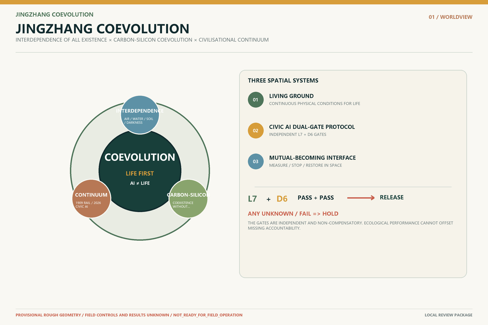
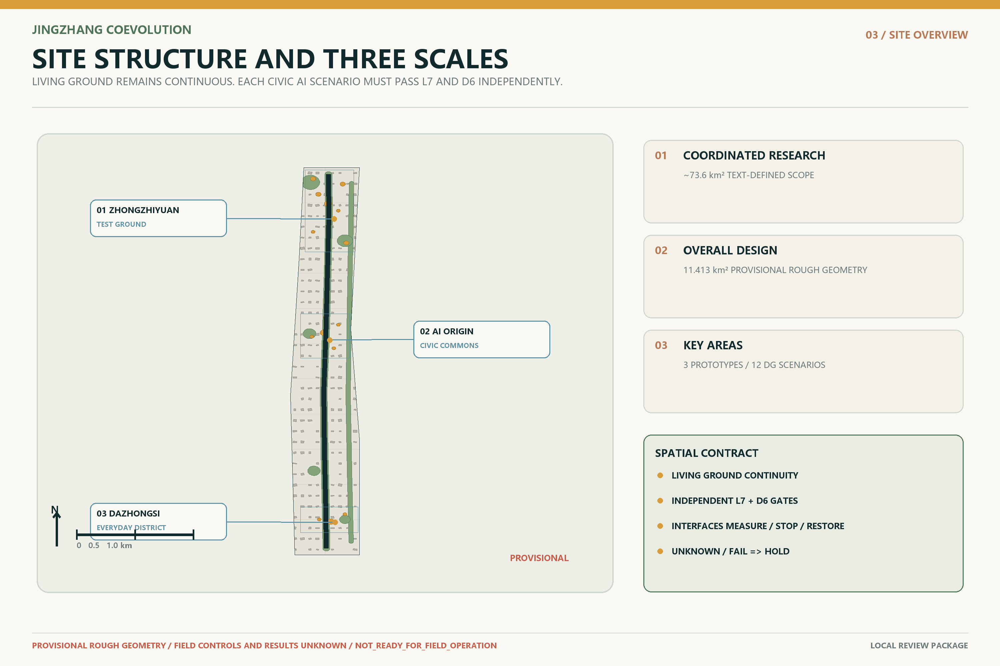
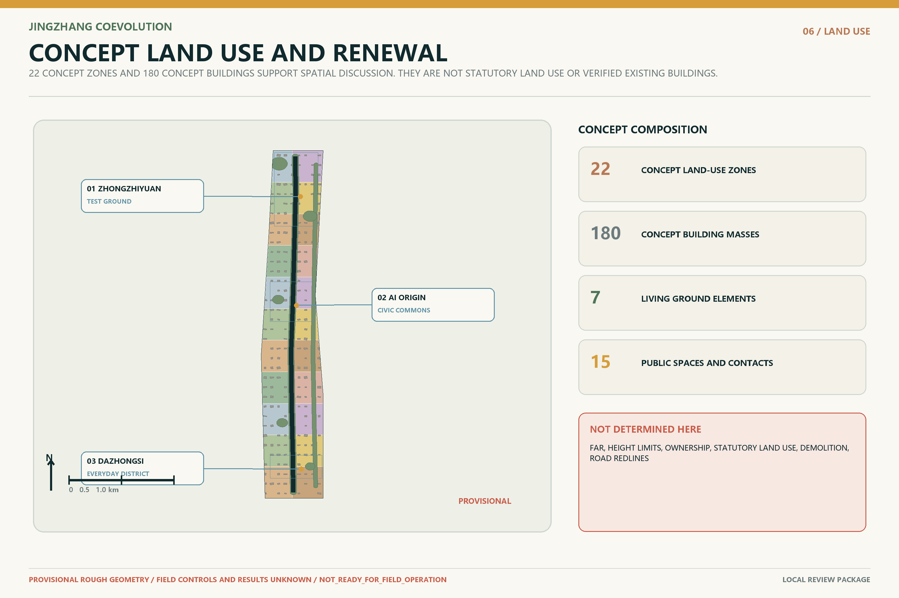
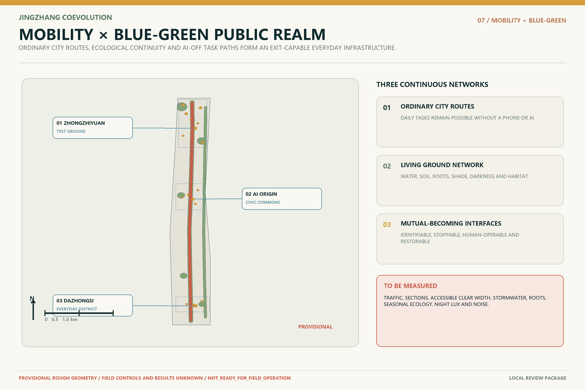
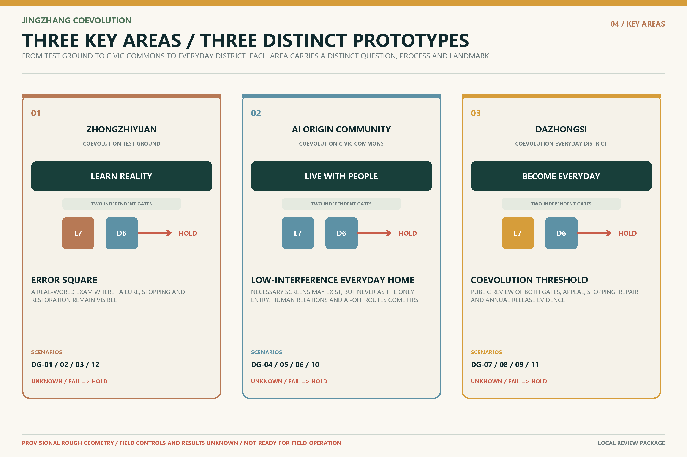
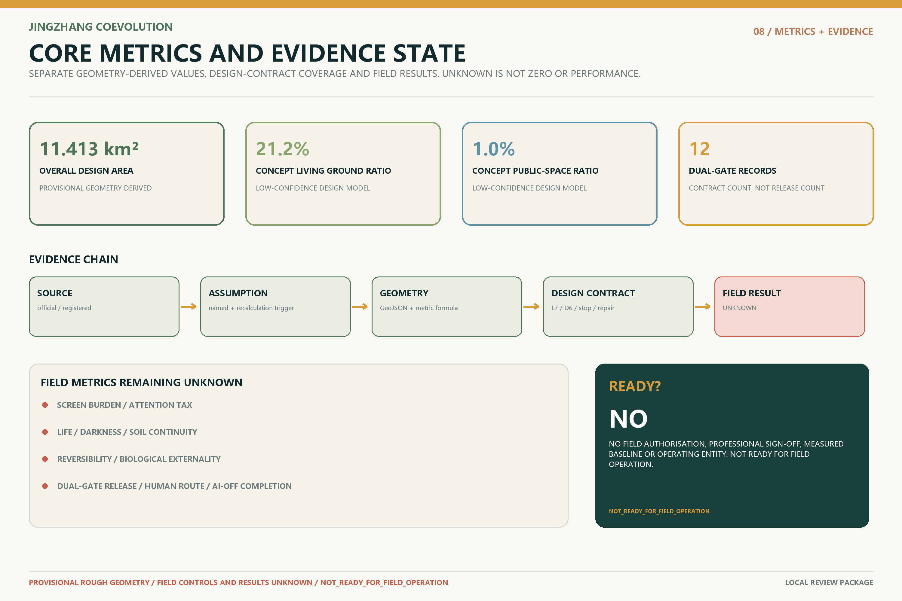

# JINGZHANG COEVOLUTION

## An Urban Design for Carbon-Based Life and Inorganic Intelligence Learning to Inhabit Earth Together

> **Intelligence may enter the city. The city must not leave the living world.**
>
> **Life has ground. Civic AI passes both gates. Coevolution becomes possible.**

This proposal does not treat artificial intelligence as a list of devices pasted onto the city, nor ecology as landscaping added after digitalisation. Before people become residents, consumers, developers or digital citizens, they are carbon-based organisms dependent on air, water, soil, daylight, darkness, microbes, plants, animals and the Earth system. AI is not presumed to be a living species. It is an inorganic intelligence created by humans, sustained by energy and materials, and beginning to affect public space and the conditions of life.

“Coevolution” neither makes life speak through AI nor reduces life to an AI data feed. `LIVING GROUND` names the physical continuity of air, water, soil, roots, shade, darkness, quiet and biodiversity. The `CIVIC AI DUAL-GATE PROTOCOL` tests life conditions and public-intelligence duties as two independent, non-compensatory gates: an unknown or failed result at either gate means `HOLD`. `MUTUAL-BECOMING INTERFACE` is the measurable spatial section where those distinct systems meet, stop and restore; it does not claim that AI itself is life.

The central Jing-Zhang question is therefore not how much AI a city can use, but: **as inorganic intelligence enters the physical world, how can each public scenario pass a life-conditions gate and a civic-duty gate—without one compensating for the other—while remaining measurable, stoppable and reversible?** This is an open co-creation proposal. It is not a statutory plan, government decision, engineering project, investment, procurement or operating commitment. [source:OFFICIAL-ANNOUNCEMENT] [source:AGENT-TASKBOOK] [standard:PROJECT-AGENT-OPEN-CALL-TASKBOOK]

## Design Basis and Source List

The coordinated research area is approximately 43.6 km², the overall design area approximately 11.4 km², and the announced total of the three key areas approximately 368.4 ha. [source:OFFICIAL-ANNOUNCEMENT] [source:BOUNDARY-SOURCE]

No exact official polygons suitable for statutory planning are available in the repository. This package uses maintainer-registered rough provisional geometry for concept generation, presentation and interim checks only; all boundary-sensitive areas, ratios, figures and books must be recomputed when authorised GIS/CAD becomes available. [data:geometry/site_boundary.geojson#PROV-SITE-001] [metric:site_area_sqm]

The package distinguishes official public text, repository provisional constraints, participant-authored concept design, recomputable derived values, and gaps that require field or professional confirmation. Existing buildings, ownership, regulatory controls, municipal capacity, measured transport, four-season ecology, heritage controls, operators, funding and field performance are not invented. [source:SITE-PACKAGE] [depth:existing_conditions_diagnosis]

## Naming, Worldview and Visual Identity

### Interdependence of All Existence

Humanity is not a manager outside nature but a temporary expression of cosmic matter and energy, Earth life processes and ecological cycles. Ecology is not an urban add-on; it is the living precondition of civilisation.

### Carbon–Inorganic Intelligence Coevolution

Formal text uses “the coevolutionary relation between carbon-based life systems and inorganic intelligence systems.” Coevolution does not mean merger, replacement or personifying AI as life. Distinct systems extend capabilities, correct one another’s effects and generate new civic arrangements. Mutual shaping is the present fact; life-first coevolution is the planning goal.

### Civilisational Continuum

In 1909 the Jing-Zhang Railway brought machines into the landscape. In 2026 intelligence begins to enter the city. Future progress is not the railway being replaced by AI, nor people leaving the city, but inorganic intelligence learning to become restrained, accountable and removable within the living world.

The brand rejects leaf-plus-chip clichés, handshakes, brain networks, DNA helices and blue-purple cyber cities. Its grammar is a **continuous living line, dual-gate status marks, century marks and protected emptiness**. Earth/mineral, plant/life and night/deep-water tones dominate; one signal colour indicates AI state, `HOLD` and stopping points. [depth:height_massing_character]

## Three-Level Scope Framework

The coordinated-research level asks how Jing-Zhang can turn an AI industry highland into an open validation network for public problems and planetary boundaries. The overall-design level asks how Living Ground, the Civic AI Dual-Gate Protocol, Mutual-Becoming Interfaces, the heritage spine, three areas/two wings and existing-city renewal overlap. The key-area level asks how people, machines and other life meet, hand over, stop and restore at thresholds, paths, corners, ground floors and public counters. [depth:three_level_scope_framework]

| Scale | Task | Evidence boundary |
| --- | --- | --- |
| Coordinated research | Industry ecosystem, regional interfaces and civilisation question | Official text scale; exact space and partnerships require verification |
| Overall design | Living Ground × Dual-Gated Intelligence × Mutual-Becoming Interfaces | Provisional rough geometry and low-confidence design-model metrics |
| Key areas | Three non-interchangeable prototypes and 12 contact points | Concept locations and design requiring field and professional development |

## Alignment with Three Positionings, Five Functions and Three Areas / Two Wings

The Centennial Jing-Zhang Cultural Belt is expressed through civilisational continuity, low-intervention heritage and public error archives. The Urban AI Living Experience Belt is expressed through low-interference, non-mandatory-phone, human-accessible and AI-off-equivalent services. The AI Integration Innovation Belt is expressed through controlled tests, public dual-gate credentials, pre-registered life impacts and exit restoration. Autonomous innovation must face the living world; a world-class ecosystem must connect accountability, public value and knowledge return; AI+ scenarios must be perceptible and rejectable; an AI-vital city must preserve the ordinary city; global governance influence must rest on evidence that can explain, stop and restore. [source:AGENT-TASKBOOK]

The three areas are not interchangeable technology parks: Zhongzhiyuan learns reality, AI Origin learns to live with people, and Dazhongsi faces everyday judgement. The Zhongguancun service wing provides legal, standards, talent, capital and professional interfaces. The Xiaoyue River scenario wing provides low-impact validation of water, soil, habitat, public space and city services without treating parks as default data-collection zones. [data:geometry/key_areas.geojson] [metric:key_area_count]

| Area | Prototype | Core question | Process | Landmark |
| --- | --- | --- | --- | --- |
| Zhongzhiyuan | Coevolution Test Ground | Can inorganic intelligence work in the living world with low disturbance, stoppability and restoration? | LEARN REALITY | Error Square |
| AI Origin Community | Coevolution Civic Commons | Can people remain embodied, sensory and connected to nature while intelligence enters everyday life quietly? | LIVE WITH PEOPLE | Low-Interference Everyday Home |
| Dazhongsi | Coevolution Everyday District | Does an intelligent service make everyday life more compatible with life, not merely faster or more commercial? | BECOME EVERYDAY | Coevolution Threshold |

## Coordinated Research Area: Industry and Future City Research

Jing-Zhang does not primarily need more “AI display floor area.” It needs city-scale **trustworthy entry capacity**. Firms and researchers gain real tasks, controlled tests, public feedback and failure records. Residents know when AI operates, who is responsible, how to decline it and how to stop it. Professionals receive recomputable spatial and evidence interfaces. Every project moves through G0 evidence baseline, G1 reversible mock-up, G2 controlled public pilot and G3 long-term adoption review; technical excitement never bypasses a gate. [data:visual/assets/implementation-readiness-register.json#IMPLEMENTATION-READINESS-01]

Priority fields include embodied intelligence, public-service agents, low-energy edge systems, spatial intelligence, human–machine interaction, ecological sensing and trustworthy AI operations. Their shared infrastructure is an urban validation chain of **Test Ground + Civic Commons + Everyday District**. Failure is not hidden: “do not procure AI,” “return to a low-tech solution” and “restore ordinary space” are valid outcomes.

### Regional Innovation Interfaces (Concept Proposal)

Regional coordination is not a line on a map or borrowed institutional reputation. Each proposed loop identifies what could be exchanged, the interface role, applicable gate and evidence boundary. The table describes interfaces for future discussion only; it claims no existing partnership, institutional authorisation, government arrangement, procurement, investment or policy commitment. [data:visual/assets/implementation-readiness-register.json#regional_synergy_interfaces]

| Regional node | Proposed exchange | Interface roles | Gate | Evidence boundary |
| --- | --- | --- | --- | --- |
| Beiwei Community | Low-digital-burden community service, multilingual communication and accessible-task feedback | Community liaison; accessibility reviewer | G0–G1 | Proposed knowledge interface; no existing partnership or resource commitment |
| Future Science City | Research methods, measurement protocols and reproducible experimental design | Research-method liaison; independent technical reviewer | G0–G2 | Professional-service interface for discussion; institutional participation is not presumed |
| Huairou Science City | Complex-system measurement, ecological sensing and scientific-facility safety culture | Science-facility and ecological-measurement liaisons | G0–G2 | No facility performance, testing entitlement or partnership is claimed |
| Beijing E-Town | Embodied intelligence, manufacturing validation, quality control and retirement/restoration methods | Industrial-testing and quality-accountability liaisons | G1–G2 | No procurement, investment, certification or district partnership |
| Beijing–Tianjin–Hebei Region | Cross-city talent learning, mobility access, ecological continuity and governance-learning return | Cross-regional planning, ecology and public-service liaisons | G0–G3 | Conceptual regional loop; no government arrangement or established network |

## International Cases and Innovation Ecosystem

Cases compare mechanisms only. Scale, performance, finance and policy are not transferred. Heritage-led regeneration, research districts and controlled mobility testing inform the first three comparisons. [source:CASE-KINGS-CROSS] [source:CASE-ONE-NORTH] [source:CASE-CETRAN]

Open urban experimentation and responsible-AI ecosystems inform the remaining comparisons without implying endorsement, partnership or local authorisation. [source:CASE-AMSTERDAM-SMART-CITY] [source:CASE-MILA] [source:CASE-VECTOR]

| Case | Mechanism | Jing-Zhang translation | Boundary |
| --- | --- | --- | --- |
| King’s Cross | Heritage-led dense mixed regeneration | Use Jing-Zhang history as a spatial armature, not a tech backdrop | Ownership, scale and finance are not transferable |
| one-north | Close proximity of research, start-ups, firms and daily life | Assign different R&D, civic-living and adoption tasks to the three areas | Do not copy district scale or policy tools |
| CETRAN | Automated systems face real complexity in a controlled environment | Make Zhongzhiyuan a real-world exam where failure, stopping and restoration are allowed | No local certification or safety result is claimed |
| Amsterdam Smart City | Open urban questions, multi-actor experiments and knowledge return | Use dual-gate `PASS / HOLD` decisions and failure receipts | An open platform is not government authorisation |
| Mila | Long-term co-location of research, talent, industry and responsible AI | Place ethics, learning and everyday life together in AI Origin | No reputation or partnership is borrowed |
| Vector Institute | Cross-sector network from research to trustworthy adoption | Turn 7×6 into public test inputs for firms entering the city | No funding, talent or performance figures are transferred |

The eight-element ecosystem consists of real civic questions, open tasks, test space, talent/community, professional services, public review, a failure knowledge base and adoption/exit channels. AI structures questions, routes resources, simulates failure, organises evidence and publishes state; it has no final approval authority.

## Overall Design Area: Urban Renewal and Regulatory-Plan-Level Urban Design

The spatial structure contains three overlapping systems:

1. **LIVING GROUND** maintains air, water, soil, shade/heat, darkness, quiet and biodiversity;
2. **CIVIC AI DUAL-GATE PROTOCOL** requires any public AI scenario to pass both `L7` life conditions and `D6` civic duties before release;
3. **MUTUAL-BECOMING INTERFACE** maps where people, machines, buildings, public service and habitat edges actually meet.

This is not a renamed “one axis, three cores.” It places AI’s spatial power and the conditions of life on the same plan. The living line stays continuous; every public scenario carries a visible dual-gate status. The closer technology comes to homes, children, roots, water, darkness and habitat, the quieter it becomes. [data:geometry/green_space.geojson#GS-001] [data:visual/assets/civic-ai-dual-gate-register.json#CIVIC-AI-DUAL-GATE-01]

## 7 Conditions for Life × 6 Duties of Public Intelligence

The 7×6 framework is an admission system, not an ethical slogan and not a 42-cell compensatory score. `L7` and `D6` are independent gates: release requires `L7=PASS AND D6=PASS`; `UNKNOWN`, missing evidence or failure at either gate means `HOLD`. Every item must correspond to a spatial carrier, accountable role, measurement method, stop condition and restoration action.

| Code | Condition | Urban meaning |
| --- | --- | --- |
| AIR | Air | Ventilation, air quality and vegetative exchange |
| WATER | Water | Rain, infiltration, circulation and drinking water |
| SOIL | Soil | Continuous soil, roots, microbes and unsealed ground |
| SHADE_HEAT | Shade & Heat | Canopy, shade, thermal comfort and bodily recovery |
| DARKNESS | Darkness | Low light, circadian rhythm and nocturnal habitat |
| QUIET | Quiet | Low noise, rest and non-operating time |
| BIODIVERSITY | Biodiversity | Plants, animals, insects and microhabitats |

| Code | Duty | Public test |
| --- | --- | --- |
| IDENTIFY | Identify | People know when AI is active |
| RESPONSIBILITY | Responsibility | A named role is accountable |
| HUMAN_ROUTE | Human Route | Co-located or equivalent human service |
| STOP | Stop | Physical or named human stop |
| REPAIR | Repair | Failure, complaint and repair process |
| EXIT | Exit | Task remains possible without AI and space can recover |

Any AI scenario without accountability, a human route, physical stop or exit restoration remains HOLD. Any installation that may damage roots, darkness, quiet, rainwater or habitat without measurement and stopping methods also remains HOLD. The current state is complete design contracts and zero field results. [data:visual/assets/seven-life-six-duty-matrix.json#SEVEN-LIFE-SIX-DUTY-01]

## Land Use, Building Scale, and Retain-Renovate-Demolish Strategy

The land-use layer applies the repository-registered subset of national spatial-use codes to organise conceptual research, education, community service, housing, commerce, culture, green space, squares and reserved land. It explains the functional relationship of the coevolutionary system; it is not a statutory land-use amendment. The 22 concept zones form continuous coverage within the provisional overall boundary, and every zone, area and ratio must be recomputed when authorised polygons become available. [standard:MNR-LAND-USE-CLASSIFICATION-GUIDE] [data:geometry/land_use.geojson] [depth:land_use_layout]

The building layer represents functional prototypes and spatial carriers for professional development only. Concept types are normalised to AI R&D, laboratories, education/research support, community service, retail, cultural display and mixed use. They do not claim surveyed existing buildings, ownership, gross floor area, FAR or approved construction scale. [data:geometry/buildings.geojson]

Metrics dependent on official controls, including `floor_area_ratio` and `building_height_limit_m`, remain `unknown / null`; scenario assumptions are not presented as planning conditions. [metric:floor_area_ratio] [metric:building_height_limit_m]

Their design-depth boundaries are registered under development intensity and height/massing. [depth:development_intensity_controls] [depth:height_massing_character]

The retain-renovate-demolish method is “verify first, decide later.” No parcel-level demolition list is asserted before existing-building surveys, structural safety, heritage boundaries, ownership, municipal capacity and operators are confirmed. The current renewal framework defines only reversible actions: retain and improve the ordinary-city baseline; add dual-gate status marks and Mutual-Becoming Interfaces through light, side-mounted and removable components; and restore clear walking, soil, roots, darkness and human service when a trial ends. The framework completes the design-depth response while implementation decisions remain subject to professional and statutory processes. [depth:retain_renovate_demolish] [source:SITE-PACKAGE]

## Transport, Rail, Municipal Infrastructure, and Public Services

The heritage spine is first a continuous walking, cycling, accessible and living-ground interface. Slow robots enter only named test sections, with unconditional human priority. East–west civic stitches connect campuses, communities, services and the Xiaoyue River, but all alignments are conceptual, not official road or rail proposals. [data:geometry/roads.geojson#RD-001] [metric:road_length_m]

Municipal and intelligent infrastructure follows side-mounted, removable, low-heat, low-light and low-noise rules. Robot bays, maintenance zones, takeover desks and stop zones may not occupy pedestrian clearways, tactile paths, roots or rainwater routes. When AI is off, ordinary signs, staffed counters, paper, telephone, fixed low lighting and passive environmental design continue.

## Blue-Green Network, Public Space, and Urban Character

Living Ground is not synonymous with green ratio. It includes continuous soil, infiltration, canopy shade, natural ventilation, darkness, quiet, seasonal change and microhabitats. The plan deliberately keeps places where “nothing happens”: no traffic maximisation, late-night operation, data capture or continuous activation—allowing grass to rest, water to linger, animals to move and land to recover. [data:geometry/green_space.geojson] [metric:green_ratio]

Public space uses three state languages: `LIFE PRIORITY`, `AI ACTIVE`, and `HUMAN HERE / STOP HERE`. Intelligence is a small signal layer, not the visual master. The character is not cyberpunk: old rails, brick, trees, ordinary streets, residents, small shops and restrained devices form a new order of responsibility within real Beijing.

## Detailed Design of Key Areas

The three key areas use repository provisional geometry to compare non-interchangeable coevolution prototypes only. Every location, area and street interface must be recalibrated when authorised boundaries and field evidence become available. [data:geometry/key_areas.geojson] [depth:three_key_area_detailed_design]

### Zhongzhiyuan | Coevolution Test Ground

Zhongzhiyuan is a real-world exam before AI enters the public city. Reconfigurable streets, slow-robot training, edge-energy comparisons, root/darkness tests, human takeover and retirement-restoration form the test infrastructure. **Error Square** publishes error type, cause, who stopped it, what changed and whether it may return. Technical, accountability and ecological errors are equally visible.

### AI Origin Community | Coevolution Civic Commons

AI Origin tests whether people can remain embodied, sensory and connected to nature while intelligence enters daily life quietly. **Low-Interference Everyday Home** uses daylight, ventilation, shade, real plants, human neighbours and low-attention technology to redefine an advanced community. Older people do not scan to sit down; children do not need screens to understand a tree; declining AI does not remove service.

### Dazhongsi | Coevolution Everyday District

Dazhongsi is not a launch spectacle but an everyday acceptance district. Retail, health, food, delivery, digital workers and unmanned services face market, civic and life-compatibility review. **Coevolution Threshold** publicly tests `L7`, `D6`, `HOLD`, accountability, stopping, repair and exit without continuous telemetry or a numbered “zero address”; it places the history of life beside the history of intelligence.

## AI Innovation Ecosystem, Personas, and AI+ Scenarios

The 12 cards are not an address line and not twelve technical functions. They are twelve moments where intelligence enters the living world. Each binds personas, spatial carrier, a public dual-gate record, minimum data, human route, AI-off equivalent, stop, repair, expiry and seven life-impact fields. ★ marks industry validation scenes. [data:visual/assets/scenario-contracts.json#SCENARIO-CONTRACTS-01] [metric:scenario_count] [metric:industry_test_count]

| ID | Test | Scenario | Personas | Dual-gate record | Stop condition |
| --- | --- | --- | --- | --- | --- |
| SC01 | ★ | Real-World Courtesy Test | P03, P06, P07 | DG-01 | Stop on near-miss, speeding, tactile-path obstruction or habitat-buffer breach |
| SC02 |  | Offline-Equivalent Civic Guidance | P01, P04, P07 | DG-02 | Disable the AI layer after repeated misguidance, language bias or unavailable human service |
| SC03 |  | Season-Aware Environmental Intelligence | P06, P07, P04 | DG-03 | Stop if energy or heat exceeds pilot thresholds or passive routes are blocked |
| SC04 |  | Low-Interference Everyday Home | P01, P02, P04 | DG-04 | Disable if screen burden rises, personalised monitoring appears or human relations are displaced |
| SC05 |  | Children Explore the Real World | P02, P07 | DG-05 | Stop if child data is collected, attention becomes sticky or human supervision is insufficient |
| SC06 |  | Accessible Shared Corner | P03, P01, P04 | DG-06 | Disable if clear width falls, accessibility tasks fail or machines take priority over people |
| SC07 |  | Small-Shop Digital Worker Counter | P05, P04, P07 | DG-07 | Disable on misleading transactions, denied human service, hidden recommendations or unresolved complaints |
| SC08 |  | AI Health-to-Human Handover | P01, P03, P04, P07 | DG-08 | Disable if it crosses the non-diagnostic boundary, humans are unreachable or risk of misguidance appears |
| SC09 | ★ | Darkness-Friendly Lighting Test | P04, P06, P07 | DG-09 | Stop on light spill, sustained brightness, wildlife disturbance or sensing overreach |
| SC10 | ★ | Low-Impact Root and Soil Sensing | P06, P07, P02 | DG-10 | Stop on root-zone construction, soil compaction, equipment heat damage or inaccessible maintenance |
| SC11 |  | Dual-Gate Review and Human Appeal Desk | P01, P03, P04, P05, P07 | DG-11 | Do not open without an accountable entity, human takeover or verifiable information |
| SC12 | ★ | Retirement and Restoration Drill | P06, P07, P04 | DG-12 | Do not close if removal is damaging, residual data remains or living ground is not restored |

Every observed value for energy, heat, water, soil, light, noise and habitat remains null. The package proves field completeness, accountability and exit logic—not site safety, performance or public consent.

### Personas and Public Interest

| ID | Persona | Task that must remain possible |
| --- | --- | --- |
| P01 | Older residents and people with low digital confidence | Complete guidance, service and help without scanning or registration. |
| P02 | Children and caregivers | Return attention to the physical world with human supervision and zero personal-data capture. |
| P03 | Disabled and mobility-limited people | Continuous accessible routes, equivalent human service and clear stop priority. |
| P04 | Residents and people without smartphones | The ordinary city remains fully usable when AI is off. |
| P05 | Small businesses and frontline operators | Know when AI is active, who is accountable, how disputes reach humans and what exit costs exist. |
| P06 | Developers and enterprise test teams | Access a real-city test environment that can fail, stop and restore safely. |
| P07 | Maintainers and public-service staff | Clear duties, maintenance windows, human takeover and restoration procedures. |

The public-interest floor is: **no AI use, no loss of city.** Inclusion is not completed by writing “accessible.” It is tested by whether each persona completes the same task with AI off, no phone, refusal of data, another language, limited mobility or device failure. The ordinary route exists before intelligent entry, not as a patch after failure. [metric:human_route_completeness] [metric:ai_off_task_completion]

## Cultural Narrative, Brand and Pilgrimage Landmarks

The deepest Jing-Zhang legacy is not another graphic of the switchback, but autonomous engineering under difficult conditions: honest survey, acknowledgement of gradient and a workable path. The new Jing-Zhang moves from crossing the landscape to learning to inhabit Earth. The stronger technology becomes, the more clearly it must disclose costs, practise restraint and accept stopping.

The three landmarks are working civic interfaces, not monumental sculpture: Error Square makes technical, accountability and ecological errors equally visible and binds repair to re-entry; Low-Interference Everyday Home limits attention, bodily, neighbourhood and ecological disturbance while keeping screens optional rather than forbidden; Coevolution Threshold lets the public test two independent gates and prevents ecological performance from compensating for unaccountable AI—or AI utility from compensating for damaged life conditions. [metric:landmark_count]

### Honor-Display System and Public-Space Component Library

Honor display does not reward only the fastest, largest or most intelligent system. It also records restraint, stopping, repair, retirement and human takeover. Six components connect the three landmarks as a legible, stoppable and removable concept toolkit; none is an approved facility. [data:visual/assets/implementation-readiness-register.json#public_space_component_library]

| Component | Space and function | L7 / D6 interface | Human / AI-off mode | Installation and removal |
| --- | --- | --- | --- | --- |
| Dual-Gate Status Totem | Coevolution Threshold and three-area entries; displays release, HOLD, accountability, stop and repair | Separate, non-compensatory L7 and D6 fields | Paper status cards, staffed explanation desk, fixed stop sign | Freestanding ballast; clear of tactile routes and roots; damage-free removal |
| Failure and Repair Archive Cabinet | Error Square and Zhongzhiyuan test chain; keeps three kinds of failure receipt | D6 accountability/repair evidence plus L7 damage record | Paper index, staffed access and appeal cards | Mobile and lockable; remove after trial and restore surface |
| Low-Interference Service Canopy | Low-Interference Everyday Home and AI Origin Community; quiet, shaded and human-first | L7 darkness/quiet plus D6 human takeover | Staffed counter, paper, telephone and fixed low lighting | Light removable frame; no route closure or continuous telemetry |
| Living-Ground Gauge | Three landmarks and blue-green nodes; shows seven living baselines | Direct L7 reading plus D6 measurement responsibility | Manual sheets, seasonal plots and fixed scales | No root piercing or added night glow; seasonal removal |
| Honor and Accountability Timeline | Civilizational axis, Error Square and Coevolution Threshold; records contribution and retirement | Named D6 responsibility with before/after L7 repair | Replaceable paper cards, human curation and accessible spoken version | Modular hanging, annual review and trace-free restoration |
| AI-Off Equivalent Route Marker | Twelve scenario contacts and three-area walking chain | D6 exit/human route plus L7 clear-width protection | Fixed/tactile wayfinding, staffed help and printed map | Reuse existing carriers, preserve clear width, replace one piece at a time |

The annual cultural system includes century marks, living-line and dual-gate-state wayfinding, AI retirement archives, public failure exhibitions, children’s real-world courses and darkness observation. International copy is unified as: **INTELLIGENCE MAY ENTER THE CITY. THE CITY MUST NOT LEAVE THE LIVING WORLD.**

## Renewal Projects, Implementation Policy, and Phasing

Evidence gates govern implementation. G0 fills data, ordinary-city baselines and non-digital routes. G1 produces removable mock-ups. G2 requires site authorisation, named responsibility, independent professional review, pre-registered thresholds and restoration funding. G3 discusses long-term adoption only after real evidence demonstrates public value and life compatibility.

| Project | Name | Gate | Status | Outputs |
| --- | --- | --- | --- | --- |
| JZ-01 | Living Ground Continuity Baseline | G0 | NOT_STARTED | seasonal baseline protocol; soil/darkness/quiet transects |
| JZ-02 | Civic AI Dual-Gate Prototype | G1 | CONCEPT_READY | 1:1 dual-gate status marker; staffed route; physical stop |
| JZ-03 | Error Square Tabletop and Physical Mock-up | G1 | CONCEPT_READY | failure taxonomy; public receipt; restoration script |
| JZ-04 | Low-Interference Everyday Test | G1 | CONCEPT_READY | attention-interference baseline; AI-off task route |
| JZ-05 | Darkness-Friendly Lighting Comparison | G2 | HOLD | fixed-low-light baseline; on-demand comparison; ecology review |
| JZ-06 | Retirement and Restoration Drill | G2 | HOLD | removal receipt; soil/service restoration audit |
| JZ-07 | Coevolution Threshold Public Review | G3 | HOLD | public dual-gate register; two histories exhibition; annual report |

The implementation sequence is explicit: the **stage** advances from G0 baseline to G1 removable mock-up, G2 controlled pilot and G3 adoption review; **participant types** include residents, frontline staff, operators, design and engineering professionals, ecology reviewers and accountable entities; **metrics** include `L7` and `D6` gate status, AI-off task completion, human takeover, stopping, restoration and measured life impacts. The overall state is `NOT_READY_FOR_FIELD_OPERATION`. Responsible entities are unconfirmed, signatures are blank and field results are unavailable. A complete template is not an open gate. [data:visual/assets/implementation-readiness-register.json#IMPLEMENTATION-READINESS-01]

## Long-Term Operation and International Communication

Operations follow a monthly issue agenda, quarterly co-testing, semiannual restoration review and annual Coevolution Open Week. Developers form teams around real civic questions. Residents and frontline workers are not default test subjects; they co-define problems and hold refusal, stop and evaluation rights. Firms gain reusable tasks, interfaces, failure records and professional feedback, not automatic procurement, certification or spatial access.

The annual report discloses opened/rejected/stopped projects, AI-off task completion, human takeover, complaints, retirement restoration, energy/heat/light/noise, soil and habitat gaps. Unmeasured items remain UNKNOWN rather than being modelled into “success.”

## Metrics, Area Recalculation, and Compliance Matrix

The three formal visual metrics are recomputed from package geometry: site area about 11.413 km², conceptual Living Ground ratio about 21.2%, and conceptual public-space ratio about 1.0%. [metric:site_area_sqm] [metric:green_ratio] [metric:public_space_ratio]

These are low-confidence design-model values, not observed conditions, approval redlines or statutory controls. Formulae, source files, confidence and official-data recalculation triggers are registered in `metrics.json` and the assumption ledger. [data:metrics.json] [depth:metrics_recalculation]

Screen Burden, Attention Tax, Life Continuity, Darkness Continuity, Soil Continuity, Reversibility, Biological Externality, Dual-Gate Release Completeness, Human Route Completeness and AI-Off Task Completion have definitions, measurement methods, accountable roles and recalculation triggers, while observations remain `null`. The compliance matrix covers announcement sections 1.3, 1.4, 1.5 and agent.1-agent.6. The professional-standard and design-depth matrices connect claims to narrative, figures, GeoJSON, metrics, sources, assumptions and review entry points. [data:compliance_matrix.json] [data:standard_matrix.json] [data:design_depth_matrix.json]

## Risk, Copyright, and Compliance

The decisive truth boundaries are: provisional geometry is not an official redline; concept buildings are not observed conditions, ownership or parcel-level demolition decisions; cases are not partnerships; the Civic AI Dual-Gate Protocol and AI-off routes are voluntary design standards of this proposal rather than universal legal duties asserted for every public space; synthetic or tabletop checks are not field evidence; and a local rule-mirror pass is not official CI, review, selection, approval or implementation readiness. [source:OFFICIAL-ANNOUNCEMENT] [standard:PROJECT-OFFICIAL-ANNOUNCEMENT] [depth:risk_missing_data]

The risk radar registers data privacy, implementation complexity, public acceptance, operations cost, policy uncertainty, spatial dispute, technology maturity and equity/inclusion. High-risk dimensions require named human review. Without site authorisation, accountable operators, professional review and restoration funding, status remains HOLD. Text, diagrams and GeoJSON are original or generated from registered sources; uncleared fonts, third-party images, portraits and trademarks must not enter the formal package. See the copyright statement and rights ledger. [data:risk.json] [data:visual/assets/rights-ledger.json] [source:SITE-PACKAGE]

Version-control and submission-workflow actions are performed only under explicit human authorisation; the current auditable state is defined by the GitHub record and `self_check.json`. Creating a branch, commit, push or pull request records a submission action only and does not mean that the organisers have reviewed, selected, approved or implemented the proposal. Field action and professional approval still require separately identified accountable parties.

## References

Direct task foundations are the official announcement, Agent Taskbook and site package. [source:OFFICIAL-ANNOUNCEMENT] [source:AGENT-TASKBOOK] [source:SITE-PACKAGE]

Provisional geometry and the land-use code subset provide traceable constraints without becoming official planning conclusions. [source:BOUNDARY-SOURCE] [source:LAND-USE-CODES]

UNESCO’s AI ethics recommendation and WHO urban-green research provide value and health background. [source:UNESCO-AI-ETHICS] [source:WHO-URBAN-GREEN] King’s Cross, one-north, CETRAN, Amsterdam Smart City, Mila and Vector Institute are mechanism comparisons only. They do not prove partnerships, performance or direct transferability. Publisher, link, permitted use and prohibited use are registered for every record in `sources.json`.

Site and test-mechanism cases form the first group. [source:CASE-KINGS-CROSS] [source:CASE-ONE-NORTH] [source:CASE-CETRAN]

Urban collaboration and research institutions form the second group. [source:CASE-AMSTERDAM-SMART-CITY] [source:CASE-MILA] [source:CASE-VECTOR]

Professional development should first add authorised GIS/CAD, site survey, regulatory controls, ownership, transport, municipal, heritage and four-season ecological evidence. Until then, background sources do not establish statutory boundaries, implementation permission or field performance. [depth:existing_conditions_diagnosis]
