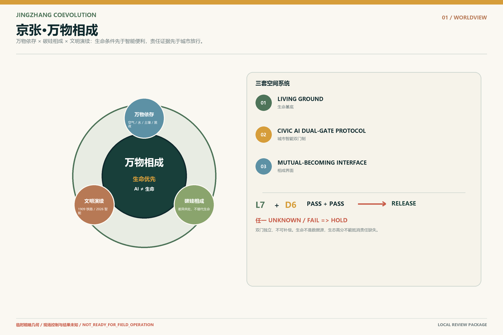
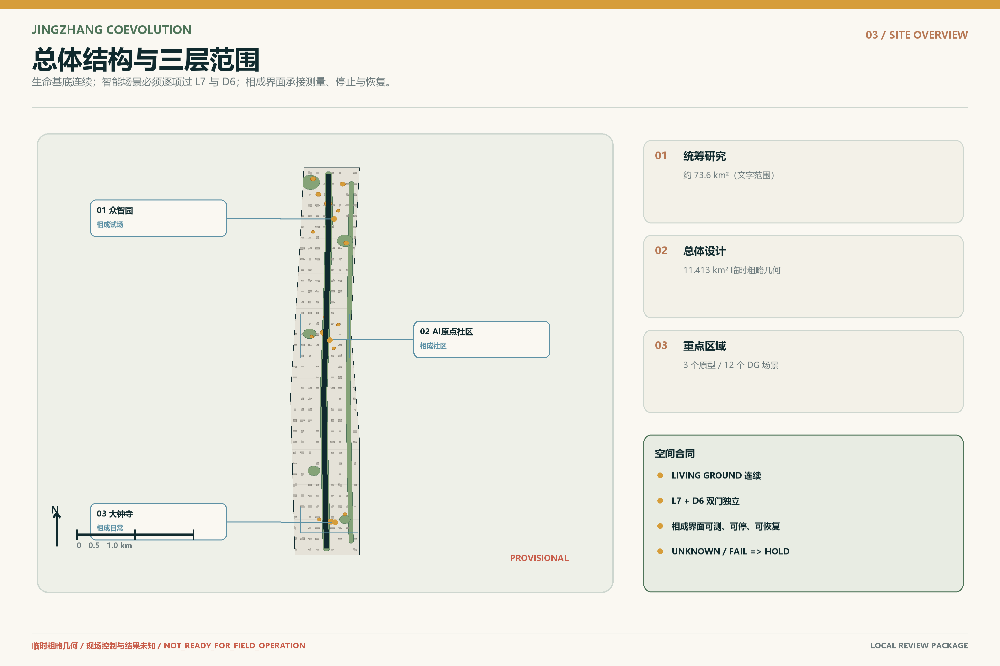
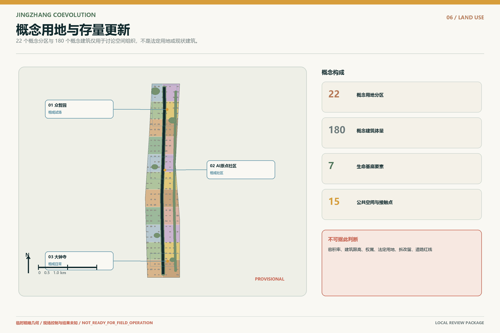
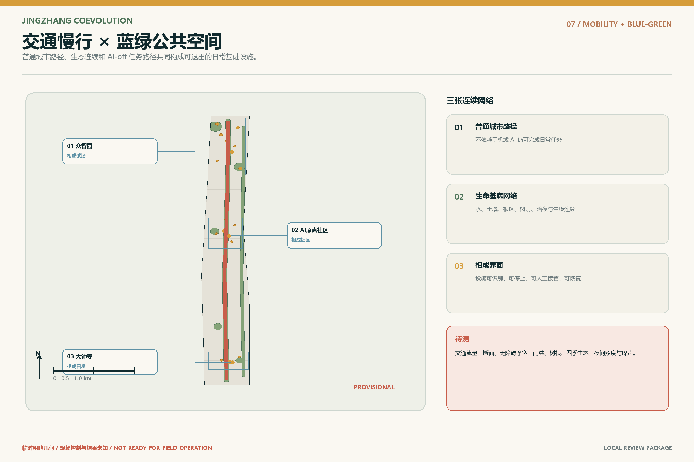
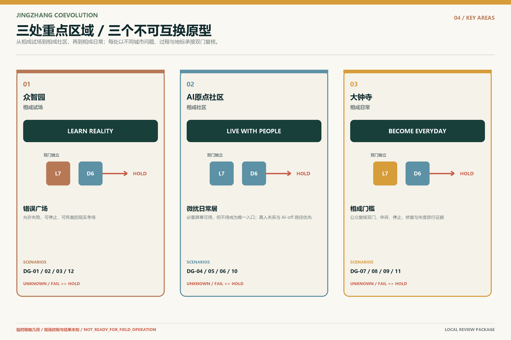
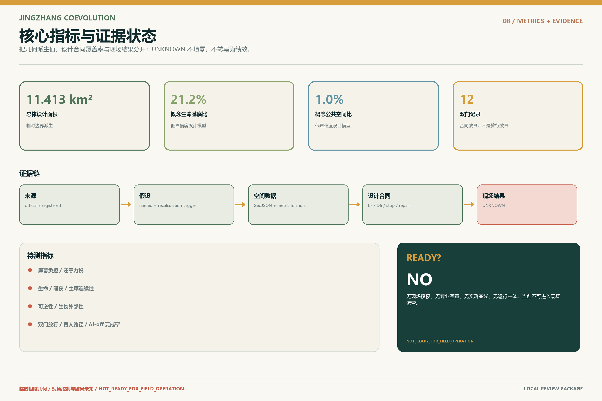

# 京张·万物相成

## 碳基生命与无机智能共同学习栖居地球的百年京张城市设计

> **智能可以进入城市，城市不能退出生命世界。**
>
> **生命有地，智能过双门，万物相成。**

本方案不把人工智能理解为贴在城市表面的设备清单，也不把生态理解为智能化之后补上的绿化。人在成为居民、消费者、开发者或数字公民之前，首先是依赖空气、水、土壤、阳光、黑夜、微生物、植物、动物和整个地球系统才能存在的碳基生命。AI并未被预设为生命；它是由人类创造、由能源与材料维持、正在进入公共空间并影响生命条件的无机智能系统。

“万物相成”不是让万物替AI说话，不把空气、水、土壤、树根、暗夜或动物降成传感数据，也不把AI称作生命新物种。`LIVING GROUND`首先是必须连续存在的生态物理条件；`CIVIC AI DUAL-GATE PROTOCOL`则把七项生命条件与六项智能责任设为两道互不补偿的门。生命门未知或不通过，责任再完整也不能放行；责任门无法落实，生态表现再好也不能补偿。

因此，百年京张面对的核心问题不是“城市能使用多少AI”，而是：**当无机智能开始进入真实世界，它如何在生命条件与智能责任互不补偿、影响可测、退出可逆的边界内，与万物相成？** 这是一套开放共创建议，不替代正式规划，不构成政府审定、工程实施、投资、采购或运营承诺。[source:OFFICIAL-ANNOUNCEMENT] [source:AGENT-TASKBOOK] [standard:PROJECT-AGENT-OPEN-CALL-TASKBOOK]

## 设计依据与资料清单

项目统筹研究范围约43.6平方公里，总体设计范围约11.4平方公里，三处重点区域公告面积合计约368.4公顷。[source:OFFICIAL-ANNOUNCEMENT] [source:BOUNDARY-SOURCE]

当前仓库未提供可用于法定规划的精确官方多边形，本包采用维护者登记的临时粗略边界，仅用于概念生成、展示与几何自检；所有依赖边界的面积、比例、图件和图册必须在正式GIS/CAD到位后整体复算。[data:geometry/site_boundary.geojson#PROV-SITE-001] [metric:site_area_sqm]

本包区分五类证据：官方公开文字、仓库临时约束、参与者概念设计、可复算派生值、仍待现场或专业确认的数据缺口。现状建筑、权属、控规、市政容量、交通实测、四季生态、文保控制、运营主体、资金与现场绩效均不作虚构判断。[source:SITE-PACKAGE] [depth:existing_conditions_diagnosis]

## 命名、世界观与视觉识别

### 万物依存

人类不是自然之外的管理者，而是宇宙物质与能量演化、地球生命过程和生态循环中的阶段性存在。生态不是城市附加项，而是文明存在的生命前提。

### 碳硅相成

正式文本使用“碳基生命系统与无机智能系统的相成关系”。相成不是融合、替代或把AI拟人化为生命，而是在保持差异的前提下相互扩展能力、彼此校正影响，共同生成新的城市文明。现实中二者彼此互塑；规划的目标，是把这种互塑引向生命优先的相成。

### 文明演续

1909年，京张铁路让机器进入山河；2026年，智能开始进入城市；未来的进步，不是铁路被AI替代，也不是人类退出城市，而是无机智能学习成为地球生命世界中克制、可问责、可退出的参与者。

品牌图形不采用叶片与芯片拼接、握手、神经大脑、DNA双螺旋或蓝紫赛博城市。其基本语法是：**连续生命线、双门准入刻度、百年演续刻度、保留空白。** 色彩以土壤矿物、植物生命、夜空深水为主，单一信号色只标识双门状态与停止位置。[depth:height_massing_character]

## 三层范围工作框架

统筹研究层回答：京张如何把人工智能产业高地转化为面向公共问题和生命边界的开放验证网络；总体设计层回答：生命基底、城市智能双门制、相成界面、遗产主线、三区两翼与存量更新如何叠合；重点区层回答：人、机器与其他生命在具体入口、路径、街角、首层和公共柜台如何相遇、接管、停止和恢复。[depth:three_level_scope_framework]

| 空间层级 | 任务 | 证据边界 |
| --- | --- | --- |
| 统筹研究范围 | 产业生态、区域协同、技术与城市文明关系 | 文字范围为官方；精确空间与合作关系待核验 |
| 总体设计范围 | 生命基底 × 智能过门 × 相成界面 | 使用临时粗略边界，指标为低置信度设计模型 |
| 重点区域范围 | 三个不可互换原型与12个接触点 | 点位和详细设计为概念建议，须现场和专业深化 |

## 任务书对齐：三大定位、五大功能与三区两翼

“百年京张文化带”通过文明演续、遗产低干预和公开错误档案体现；“都市AI生活体验带”通过低干扰、非强制手机、真人可达和AI-off等价体现；“AI融合创新带”则通过受控测试、双门公开凭据、生命影响预注册和退出恢复体现。五大功能被重新组织为：自主创新必须接受真实生命世界测试；世界级生态必须连接责任、公共价值和知识回流；AI+场景必须可被人直接感知和拒绝；AI活力城市必须保留普通城市；全球治理话语权必须建立在可解释、可停止和可恢复的证据上。[source:AGENT-TASKBOOK]

三区不做功能雷同的科技园：众智园学习现实，AI原点学习与人共同生活，大钟寺接受日常生活判断。中关村科技服务翼承担法律、标准、人才、资本和专业服务接口；小月河场景赋能翼承担水土、生境、公共空间和城市服务的低干扰验证，但不把公园默认为数据采集区。[data:geometry/key_areas.geojson] [metric:key_area_count]

| 区域 | 相成原型 | 核心问题 | 过程 | 地标 |
| --- | --- | --- | --- | --- |
| 众智园 | 相成试场 | 无机智能能否在真实生命世界中低扰动、可停止、可恢复地工作？ | LEARN REALITY | 错误广场 |
| AI原点社区 | 相成社区 | 人如何保持有身体、有感官、有自然关系的生活，同时让智能安静进入日常？ | LIVE WITH PEOPLE | 微扰日常居 |
| 大钟寺 | 相成日常 | 一项智能是否真的让日常生活更适合生命，而不只是更快、更高效、更商业化？ | BECOME EVERYDAY | 相成门槛 |

## 统筹研究范围产业与未来城市研究

京张需要的不是更多“AI展示面积”，而是城市级的**可信进入能力**：企业和研究团队可以获得真实任务、受控测试、公共反馈与失败记录；普通居民可以知道AI何时运行、由谁负责、如何不用、如何停止；专业团队可以获得可复算的空间与证据接口。每个项目按G0证据基线、G1可逆样机、G2受控公众试点、G3长期采用讨论推进，不因技术热度跳过任何门。[data:visual/assets/implementation-readiness-register.json#IMPLEMENTATION-READINESS-01]

产业方向聚焦具身智能、公共服务智能体、低能耗端侧系统、空间智能、人机交互、生态感知与可信AI运营。其共同基础设施不是一座封闭实验室，而是**相成试场 + 相成社区 + 相成日常**组成的城市验证链。失败不是被隐藏的负面结果；“不采购AI”“退回低技术方案”“恢复普通空间”都是有效结论。

### 区域创新协同接口（概念建议）

区域协同不是在图上连线或借用机构声誉，而是把可交换内容、接口角色、适用阶段和证据边界逐项写清。下表只提出待协商的知识与专业服务循环，不代表既有合作、机构授权、政府安排、采购、投资或政策承诺。[data:visual/assets/implementation-readiness-register.json#regional_synergy_interfaces]

| 区域节点 | 拟议交换内容 | 接口角色 | 阶段 | 证据边界 |
| --- | --- | --- | --- | --- |
| 北纬社区 | 低数字负担社区服务、多语言沟通与无障碍任务反馈 | 社区联络、无障碍评审 | G0–G1 | 拟议知识接口；不主张既有合作或资源承诺 |
| 未来科学城 | 研究方法、测量协议与可复现实验设计 | 科研方法联络、独立技术复核 | G0–G2 | 待协商专业服务接口；不推定机构参与 |
| 怀柔科学城 | 复杂系统测量、生态感知与科学设施安全文化 | 科学设施、生态测量联络 | G0–G2 | 不引用设施性能，不主张测试资格或合作关系 |
| 北京经济技术开发区 | 具身智能、制造验证、质量控制与退役恢复方法 | 产业测试、质量责任联络 | G1–G2 | 不代表采购、投资、认证或园区合作 |
| 京津冀区域 | 跨城人才学习、交通可达、生态连续性与治理经验回流 | 跨区域规划、生态、公共服务联络 | G0–G3 | 概念性区域循环；不构成政府安排或已建立网络 |

## 国际案例与创新生态

国际案例只比较机制，不复制规模、绩效、融资或政策环境。场地治理与测试机制参照 King's Cross、one-north 和 CETRAN 的公开材料。[source:CASE-KINGS-CROSS] [source:CASE-ONE-NORTH] [source:CASE-CETRAN]

城市协作与研究机构机制则参照 Amsterdam Smart City、Mila 和 Vector Institute 的公开材料。[source:CASE-AMSTERDAM-SMART-CITY] [source:CASE-MILA] [source:CASE-VECTOR]

| 案例 | 可核实机制 | 京张转化 | 不可照搬 |
| --- | --- | --- | --- |
| King’s Cross | 遗产与高密度混合更新并置 | 把京张历史作为空间骨架，而不是科技背景图 | 产权、规模与融资条件不可照搬 |
| one-north | 研发、创业、企业与生活配套近距离组织 | 三区承担不同的研发—生活—采用任务 | 不复制园区尺度和政策工具 |
| CETRAN | 自动系统在受控环境中接受真实复杂条件测试 | 众智园作为允许失败、可停止、可恢复的现实考场 | 不主张本地认证或安全结论 |
| Amsterdam Smart City | 开放议题、跨主体实验与知识回流 | 用双门制记录放行、HOLD与失败回执 | 不把开放平台等同于政府授权 |
| Mila | 研究、人才、产业与负责任AI长期共处 | AI原点社区把伦理、学习和日常生活放在一起 | 不借用机构声誉或合作关系 |
| Vector Institute | 研究到可信采用的跨行业网络 | 把七生六责转化为企业进入城市的公共测试输入 | 不引用其资金、人才或绩效数字 |

八要素创新生态由真实城市问题、开放任务、测试空间、人才与社群、专业服务、公共审查、失败知识库和采用/退出通道构成。AI只负责问题结构化、资源路由、失败模拟、证据整理和公开状态，不拥有最终批准权。

## 总体设计范围城市更新与控规深度城市设计

总体设计以存量更新为前提，不把临时几何写成控规结论，也不把概念建筑写成现状事实。相成城市系统把生命基底、智能责任和更新实施放在同一套空间证据链中：既保留京张遗产、普通街道、社区服务与现有城市肌理，也为可撤、可停、可恢复的智能试验预留明确接口。[standard:MOHURD-URBAN-DESIGN-MEASURES] [standard:MOHURD-CONTROL-DETAILED-PLANNING]

所有开发强度、容积率、高度、道路红线、权属与具体拆改留判断均保持未知，待官方控规、测绘、产权和专业条件到位后复核。[depth:overall_spatial_structure] [depth:risk_missing_data]

总体空间由三个叠合层构成：

1. **LIVING GROUND / 生命基底**：维持空气、水、土壤、树荫与热、黑夜、安静和多样生命的连续条件；
2. **CIVIC AI DUAL-GATE PROTOCOL / 城市智能双门制**：每个场景分别提交生命门 `L7` 与责任门 `D6` 的公开凭据，任一项未知、失败或无人承责即保持 `HOLD`；
3. **MUTUAL-BECOMING INTERFACE / 相成界面**：把人、机器、建筑、公共服务与生态边缘发生接触的位置画出来，并在剖面上标出测量、停止与恢复动作。

双门制不是42格综合评分，也不是以绿化高分抵消责任缺失的积分表。两道门独立判定、不能互相补偿；相成界面是两道门接受空间检验的具体接触面。

这不是“一轴三核”的重新命名，而是把AI的空间权力与生命条件放进同一张图。生命线必须连续，智能点必须可识别；越接近居住、儿童、树根、河岸、暗夜和微生境，技术越安静。[data:geometry/green_space.geojson#GS-001] [data:visual/assets/civic-ai-dual-gate-register.json#CIVIC-AI-DUAL-GATE-01]

## 七生六责与生命兼容准入

“七生六责”是本方案的空间准入框架。七项生命条件不是美化指标，六项智能责任也不是伦理口号；每一项都必须对应空间载体、责任角色、测量方法、停止条件和恢复动作。`L7`与`D6`分别形成两道独立硬门，任何`UNKNOWN`都保持`HOLD`，不得汇总成可相互抵消的总分。

| 编码 | 生命条件 | 城市设计含义 |
| --- | --- | --- |
| AIR | 空气 | 通风、空气质量与植物交换 |
| WATER | 水 | 雨水、渗透、循环与饮水 |
| SOIL | 土壤 | 连续土壤、树根、微生物与非硬化地面 |
| SHADE_HEAT | 树荫与热 | 树冠、遮阴、热环境与身体恢复 |
| DARKNESS | 黑夜 | 低照度、昼夜节律与夜间生境 |
| QUIET | 安静 | 低噪声、停歇与非运营时段 |
| BIODIVERSITY | 多样生命 | 植物、动物、昆虫与微生境 |

| 编码 | 智能责任 | 公众判断 |
| --- | --- | --- |
| IDENTIFY | 身份可见 | 公众知道AI正在工作 |
| RESPONSIBILITY | 责任有主 | 具名角色承担责任 |
| HUMAN_ROUTE | 真人可达 | 同地或等价人工服务 |
| STOP | 可以停止 | 物理或具名人工停止 |
| REPAIR | 可以修复 | 故障、投诉和修复流程 |
| EXIT | 可以退出 | 不用AI仍能完成任务并恢复空间 |

任何AI场景只要缺失具名责任、真人路径、物理停止或退出恢复，就保持HOLD；任何设施只要可能破坏根区、暗夜、安静、雨水或生境，而又没有测量与停止方法，也保持HOLD。七生六责的现有状态是设计合同完整、现场结果为零。[data:visual/assets/seven-life-six-duty-matrix.json#SEVEN-LIFE-SIX-DUTY-01]

## 用地、建筑规模与拆改留方案

本方案的用地表达采用仓库登记的国土空间分类子集，形成科研、教育、社区服务、居住、商业、文化、绿地、广场与留白等概念分区；其目的在于说明相成系统的功能组织和空间关系，而不是作出法定用地调整。临时总体边界中的22个概念分区形成连续覆盖，所有分区、面积和比例都必须在官方多边形发布后重算。[standard:MNR-LAND-USE-CLASSIFICATION-GUIDE] [data:geometry/land_use.geojson] [depth:land_use_layout]

建筑层仅表示可供专业团队深化的功能原型和空间载体。概念建筑类型统一映射为AI研发、实验室、教育科研配套、社区服务、商业服务、文化展示与混合功能，不代表现状建筑测绘、产权、建筑面积、容积率或批准建设规模。[data:geometry/buildings.geojson]

`floor_area_ratio`、`building_height_limit_m`等依赖官方控制条件的指标继续保持`unknown / null`，不以情景假设冒充规划条件。[metric:floor_area_ratio] [metric:building_height_limit_m]

其设计深度边界分别登记在开发强度与高度体量条目中。[depth:development_intensity_controls] [depth:height_massing_character]

拆改留坚持“先查证、后判断”。在取得现状建筑底图、结构安全、文保边界、权属、市政容量和运营主体之前，不列具体拆除清单，也不把任何概念体量写成新建决定。当前更新策略只定义三类可逆动作：保留并改善普通城市基线；以轻量、旁置、可拆的方式增加双门状态标记和相成界面；当试验终止时恢复步行净线、土壤、树根、暗夜和人工服务。该框架完整回应设计深度，但实施结论仍须专业团队和法定程序确认。[depth:retain_renovate_demolish] [source:SITE-PACKAGE]

## 交通、轨道、市政与公共服务设施

京张主线优先作为连续步行、骑行、无障碍和生命基底界面；低速机器人仅在具名试验段进入，且人具有无条件优先权。东西向公共缝合线把园区、社区、公共服务和小月河联系起来，但所有路线均为概念连接，不是官方道路或轨道方案。[data:geometry/roads.geojson#RD-001] [metric:road_length_m]

市政与智能基础设施采用“旁置、可撤、低热、低光、低噪”原则。机器人泊位、维护区、人工接管台和停止区不得侵占步行净线、盲道、树根和雨水路径。AI关闭后，普通导视、人工柜台、纸本、电话、固定低照明和被动环境设计继续工作。轨道、停车、消防、物流和市政接口均只提出协同原则，不代替交通工程、运营组织或专项审批。

## 蓝绿空间、公共空间与城市风貌

生命基底不等于绿地率。它至少包含连续土壤、雨水渗透、树冠遮阴、自然通风、暗夜、安静、季节变化和微生境。规划同时保留“什么都不发生”的地方：不追求流量、坪效、夜间运营、数据采集或持续激活，让草地休眠、雨水停留、动物活动、土地恢复。[data:geometry/green_space.geojson] [metric:green_ratio]

公共空间使用三种状态语言：`LIFE PRIORITY`、`AI ACTIVE`、`HUMAN HERE / STOP HERE`。智能状态只作小比例信号，不压过历史、植物、土壤和人的尺度。城市风貌拒绝赛博朋克；旧铁轨、砖石、树木、普通街道、居民、小店和低调设备共同构成真实北京中的一层新责任秩序。

## 重点区域详细设计

三处重点区使用仓库临时粗略范围，仅用于比较不同相成原型；所有落位、面积和街区界面须在官方边界与现场资料到位后重新校准。[data:geometry/key_areas.geojson] [depth:three_key_area_detailed_design]

### 众智园｜相成试场

众智园是AI进入物理世界前的现实考场。可重构街道、低速机器人训练、端侧能耗对照、根区与暗夜试验、人工接管和退役恢复共同构成测试设施。**错误广场**公开错误类型、原因、谁叫停、如何修正、能否返回；技术错误、责任错误和生态错误具有同等可见性。

### AI原点社区｜相成社区

AI原点不是人才宿舍区，而是验证人是否仍能作为有身体、有感官、有自然关系的居民生活。**微扰日常居**用自然光、通风、树荫、真实植物、真人邻里和低注意力技术重新定义“先进住宅/社区”；老人不需要扫码才能坐下，儿童不需要通过屏幕理解一棵树，拒绝AI的人不失去服务。

### 大钟寺｜相成日常

大钟寺不是AI首发秀场，而是日常生活验收区。商店、健康、餐饮、配送、数字员工和无人服务必须同时接受市场、公共性与生命兼容审查。**相成门槛**不做连续遥测或“零号”登记；它在实体接触面公开每个场景的`L7`与`D6`判定、HOLD原因、责任角色、停止回执和生态恢复证据，展示生命史与智能史两部历史。

## AI 创新生态、人才画像与 AI+ 场景

12张场景卡不是12个技术功能，也不组成一条“地址线”，而是12个“智能进入生命世界的城市接触点”。每张卡绑定画像、空间、双门记录、最小数据、真人路径、AI-off等价、停止、修复、期限和七字段生命影响；带★者为产业测试验证场景。[data:visual/assets/scenario-contracts.json#SCENARIO-CONTRACTS-01] [metric:scenario_count] [metric:industry_test_count]

| ID | 测试 | 场景 | 画像 | 双门记录 | 停止条件 |
| --- | --- | --- | --- | --- | --- |
| SC01 | ★ | 现实礼让训练场 | P03, P06, P07 | DG-01 | 近失事件、超速、盲道占用或生态缓冲越界即停 |
| SC02 |  | 断网仍可服务的公共问询 | P01, P04, P07 | DG-02 | 连续误导、语言歧视或人工服务不可达时停用AI层 |
| SC03 |  | 季节与能耗公开的环境智能 | P06, P07, P04 | DG-03 | 能耗或热排放超过试点阈值、自然路径被封闭时停止 |
| SC04 |  | 微扰日常居 | P01, P02, P04 | DG-04 | 屏幕负担增加、个性化监控或真人关系被替代时停用 |
| SC05 |  | 儿童真实世界探索 | P02, P07 | DG-05 | 出现儿童数据采集、注意力黏附或真人监督不足时停用 |
| SC06 |  | 无障碍共行街角 | P03, P01, P04 | DG-06 | 净宽下降、无障碍任务失败或机器优先于人时停用 |
| SC07 |  | 小店数字员工公示柜台 | P05, P04, P07 | DG-07 | 误导交易、拒绝人工、隐性推荐或投诉无法处理时停用 |
| SC08 |  | 智能健康转人工站 | P01, P03, P04, P07 | DG-08 | 超出非诊断边界、人工不可达或误导风险时停用 |
| SC09 | ★ | 暗夜友好照明试验 | P04, P06, P07 | DG-09 | 光溢出、持续高亮、野生动物干扰或传感越界时停止试验 |
| SC10 | ★ | 树根与土壤低扰动感知 | P06, P07, P02 | DG-10 | 根区施工、土壤压实、设备热害或维护不可达时停止 |
| SC11 |  | 双门复核与人工申诉台 | P01, P03, P04, P05, P07 | DG-11 | 无责任主体、无法人工接管或信息不可核验时不得开放 |
| SC12 | ★ | 退役与恢复演练 | P06, P07, P04 | DG-12 | 无法无损拆除、残余数据未清理或生命基底未恢复时不得结项 |

所有能耗、热、水、土壤、光、噪声和生境观测值均为null；这份包只证明字段、责任和退出逻辑存在，不证明现场安全、效果或公众同意。

### 人物画像与公共利益

| ID | 人物 | 必须完成的任务 |
| --- | --- | --- |
| P01 | 老年居民与低数字能力者 | 不扫码、不注册，也能完成问路、办理与求助。 |
| P02 | 儿童与照护者 | 把注意力带回真实世界，并保证真人介入和数据零采集。 |
| P03 | 残障人士与行动不便者 | 获得连续无障碍路径、等价人工服务与明确停机优先权。 |
| P04 | 普通居民与无手机使用者 | 智能关闭后，基础城市仍完整可用。 |
| P05 | 小店与一线运营者 | 知道AI何时工作、谁负责、争议如何转人工以及退出成本。 |
| P06 | 开发者与企业测试团队 | 在真实城市中获得可失败、可停止、可恢复的测试空间。 |
| P07 | 维护人员与公共服务人员 | 拥有清晰责任、维护窗口、人工接管和退役恢复流程。 |

公共利益底线是：**不使用AI，也不失去城市。** 包容性不以“设置无障碍”一句完成，而以每类画像在AI关闭、无手机、拒绝数据、语言不同、行动不便或设备故障时能否完成同一任务来验收。普通路径不是AI失败后的补丁，而是智能进入之前就存在的公共基线。[metric:human_route_completeness] [metric:ai_off_task_completion]

## 文化叙事、品牌与朝圣地标

京张最重要的历史遗产不是把“人字线”再次画成装饰，而是面对复杂条件、诚实勘测、承认坡度、找到可行路径的自主工程精神。新的京张从“跨越山河”走向“学习栖居地球”：技术能力越强，越要公开代价、保持克制并接受停止。

三处朝圣地标不是巨型雕塑，而是可工作的文明接口：错误广场把技术、责任、生态三类错误置于同等修复义务下；微扰日常居检验技术是否抢夺注意力、身体与邻里关系；相成门槛执行`L7`与`D6`互不补偿的公众复核。[metric:landmark_count]

### 荣誉展示体系与公共空间组件库

荣誉展示不只奖励“最快、最大、最智能”，也公开记录克制、停止、修复、退役和人工接管。六类组件把三处地标连接为可读、可停、可撤的概念工具包；任一组件均不得被解读为已批准设施。[data:visual/assets/implementation-readiness-register.json#public_space_component_library]

| 组件 | 适用空间与作用 | L7 / D6 接口 | 人工 / AI-off | 安装与撤除原则 |
| --- | --- | --- | --- | --- |
| 双门状态柱 | 相成门槛、三区入口；并列展示放行、HOLD、责任、停止和修复 | L7与D6分栏且不可相互补偿 | 纸本状态牌、人工解释台、固定停止标识 | 独立配重，不占盲道和根系区，可无损拆除 |
| 失败与修复档案柜 | 错误广场、众智园试验链；保留三类失败回执 | D6责任与修复证据，L7受损记录 | 纸本索引、人工借阅、现场申诉卡 | 可移动可上锁，试验后移除并恢复铺地 |
| 微扰服务廊架 | 微扰日常居、AI原点社区；安静遮阴、真人优先 | L7暗夜/安静，D6人工接管 | 人工柜台、纸本、电话、固定低照明 | 轻型可撤，不封路，不连续遥测 |
| 生命基底标尺 | 三处地标、蓝绿节点；展示七项生命基线 | L7直接可读，D6记录测量责任 | 人工观察表、季节样方、固定刻度 | 不穿根、不增夜光、季末可撤 |
| 荣誉与责任年表 | 文明轴、错误广场、相成门槛；记录贡献与退役 | D6具名责任，L7修复前后并列 | 可更换纸卡、人工策展、无障碍口述 | 模块化挂接，年度复核，无痕恢复 |
| AI关闭等价路径标识 | 十二个场景接触点与三区步行链 | D6可退出与真人路径，L7净宽保护 | 固定导视、触觉标记、人工求助、印刷地图 | 优先利用既有载体，不侵占净宽，可单件替换 |

年度文化系统包含百年演续刻度、生命线与双门状态导视、AI退役档案、公开失败展、儿童真实世界课程和暗夜观察。国际传播统一使用：**INTELLIGENCE MAY ENTER THE CITY. THE CITY MUST NOT LEAVE THE LIVING WORLD.**

## 更新项目清单、实施政策与分期计划

项目采用证据门而不是只按年份推进。G0只补资料、普通城市基线和非数字路径；G1制作可撤样机；G2必须取得现场授权、具名责任、独立专业复核、预注册阈值与恢复资金；G3在真实证据证明公共价值和生命兼容后，才讨论长期采用。

| 项目 | 名称 | 门 | 状态 | 交付 |
| --- | --- | --- | --- | --- |
| JZ-01 | 生命基底连续性基线 | G0 | NOT_STARTED | seasonal baseline protocol；soil/darkness/quiet transects |
| JZ-02 | 城市智能双门制原型 | G1 | CONCEPT_READY | L7/D6 public credential；staffed route；physical stop |
| JZ-03 | 错误广场桌面与实体样机 | G1 | CONCEPT_READY | failure taxonomy；public receipt；restoration script |
| JZ-04 | 微扰日常居任务测试 | G1 | CONCEPT_READY | interference baseline；screen burden；AI-off task route |
| JZ-05 | 暗夜友好照明对照试验 | G2 | HOLD | fixed-low-light baseline；on-demand comparison；ecology review |
| JZ-06 | 退役与恢复演练 | G2 | HOLD | removal receipt；soil/service restoration audit |
| JZ-07 | 相成门槛公众复核 | G3 | HOLD | dual-gate release decision；restoration evidence；two histories exhibition |

G0—G3是阶段门；参与主体目前只有角色类型、尚未具名；指标定义在`metrics.json`，所有依赖现场的观测值继续保持`UNKNOWN / null`。当前总体状态为`NOT_READY_FOR_FIELD_OPERATION`。所有责任主体未确认，所有签署为空，所有现场结果为零。即使模板完整，也不能解读为已开门。[data:visual/assets/implementation-readiness-register.json#IMPLEMENTATION-READINESS-01]

## 长期运营与国际传播

长期运营以“一月议题、一季共测、半年恢复复核、一年万物相成开放周”为节奏。开发者社区围绕真实城市问题组队，居民和一线人员不是默认测试对象，而是拥有拒绝、停止和评价权的共同定义者。企业获得可复用任务、接口、失败记录和专业反馈，不能因参与活动自动获得采购、认证或空间使用权。

年度公开报告至少披露：开放/拒绝/停止项目数、AI-off任务完成、人工接管、投诉、退役恢复、能源热光声、土壤和生境缺口。未测量项必须继续显示UNKNOWN，而不是从模型估算出“成功”。

## 指标体系、面积复算与合规矩阵

本包三项formal视觉指标均由包内临时几何复算：场地面积约11.413平方公里，概念生命基底比例约21.2%，概念公共空间比例约1.0%。[metric:site_area_sqm] [metric:green_ratio] [metric:public_space_ratio]

它们是低置信度设计模型，不是官方现状、审批红线或法定控制指标；其公式、来源文件、置信度和正式数据到位后的复算触发均登记在`metrics.json`与假设台账中。[data:metrics.json] [depth:metrics_recalculation]

屏幕负担、注意力税、生命连续、暗夜连续、土壤连续、可逆性、生物外部性、双门放行完整度、真人路径和AI-off任务完成等指标已经给出定义、测量方法、责任角色和复算触发，但观测值全部保持`null`。合规矩阵逐项覆盖公告1.3、1.4、1.5及agent.1-agent.6；专业标准矩阵和设计深度矩阵把每项主张连接到正文、图件、GeoJSON、指标、来源、假设和自检入口。[data:compliance_matrix.json] [data:standard_matrix.json] [data:design_depth_matrix.json]

## 风险、版权与合规说明

本方案最重要的诚实边界包括：临时边界不是官方红线；概念建筑不是现状、权属或拆改留决定；国际案例不是合作；城市智能双门制与AI-off路径是本方案自设的设计标准，不被表述为现行法律对所有城市空间的普遍义务；合成或桌面检查不是现场证据；本地规则镜像通过不等于官方CI、评审、入选、批准或可实施结论。[source:OFFICIAL-ANNOUNCEMENT] [standard:PROJECT-OFFICIAL-ANNOUNCEMENT] [depth:risk_missing_data]

风险雷达按数据隐私、实施复杂度、公众接受、运营成本、政策不确定、空间争议、技术成熟和公平包容八个维度登记。高风险项必须具名人工复核；未取得现场授权、责任主体、专业审查和恢复资金时，状态保持HOLD。视觉、图表、GeoJSON和文字为本方案原创或依据登记来源生成；字体、第三方图像、人物肖像和商标不得在未清权状态下加入正式包。详细权利边界见版权声明与权利台账。[data:risk.json] [data:visual/assets/rights-ledger.json] [source:SITE-PACKAGE]

版本控制与投稿工作流操作仅在获得明确人工授权后执行，当前可审计状态以 GitHub 记录和`self_check.json`为准。创建分支、commit、push 或 PR 只表示提交动作，不代表组织方已经评审、入选、批准或实施；现场行动和专业审批仍须由具名责任主体另行确认。

## 参考资料

本方案以征集公告、智能体任务书和项目资料包作为直接任务依据。[source:OFFICIAL-ANNOUNCEMENT] [source:AGENT-TASKBOOK] [source:SITE-PACKAGE]

临时边界与用地代码仅承担可追溯的生成约束，不升级为官方规划结论。[source:BOUNDARY-SOURCE] [source:LAND-USE-CODES]

UNESCO人工智能伦理建议和WHO城市绿色空间研究只作为价值与健康背景。[source:UNESCO-AI-ETHICS] [source:WHO-URBAN-GREEN] 所有案例只用于比较公开机制，不证明合作、绩效或可直接迁移性；每条来源的发布者、链接、用途与禁止用途均登记在`sources.json`。

案例来源分为场地与测试机制组。[source:CASE-KINGS-CROSS] [source:CASE-ONE-NORTH] [source:CASE-CETRAN]

城市协作与研究机构组成第二组。[source:CASE-AMSTERDAM-SMART-CITY] [source:CASE-MILA] [source:CASE-VECTOR]

正式专业深化时，应优先补充官方GIS/CAD、现状测绘、控规图则、权属、交通、市政、文保和四季生态资料；在这些资料到位之前，本包不从背景来源推导法定边界、实施许可或现场绩效。[depth:existing_conditions_diagnosis]
