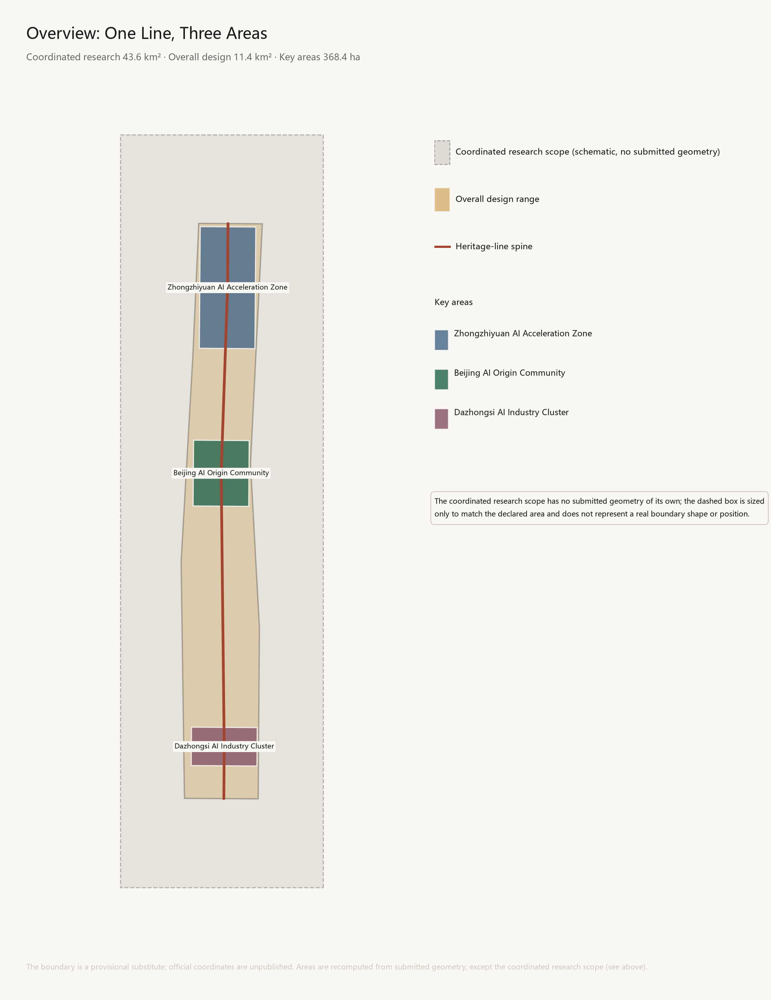
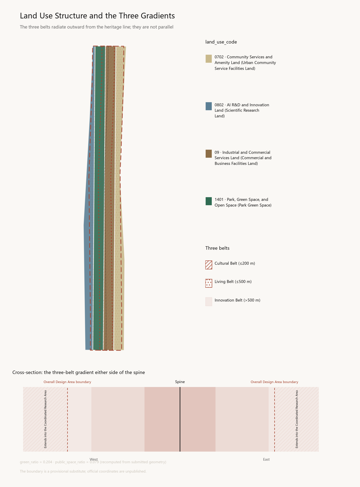
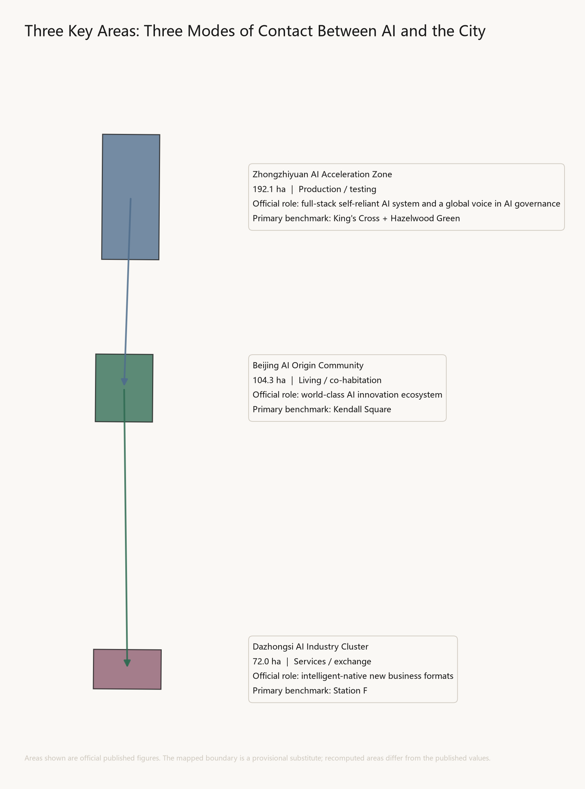
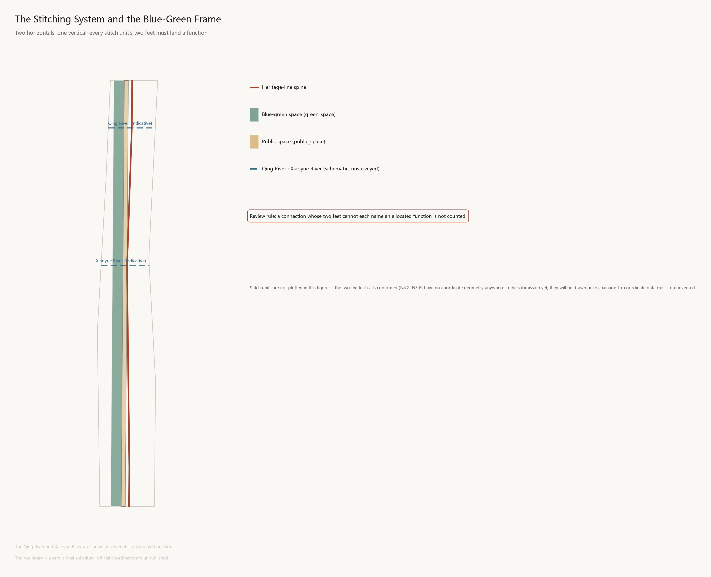
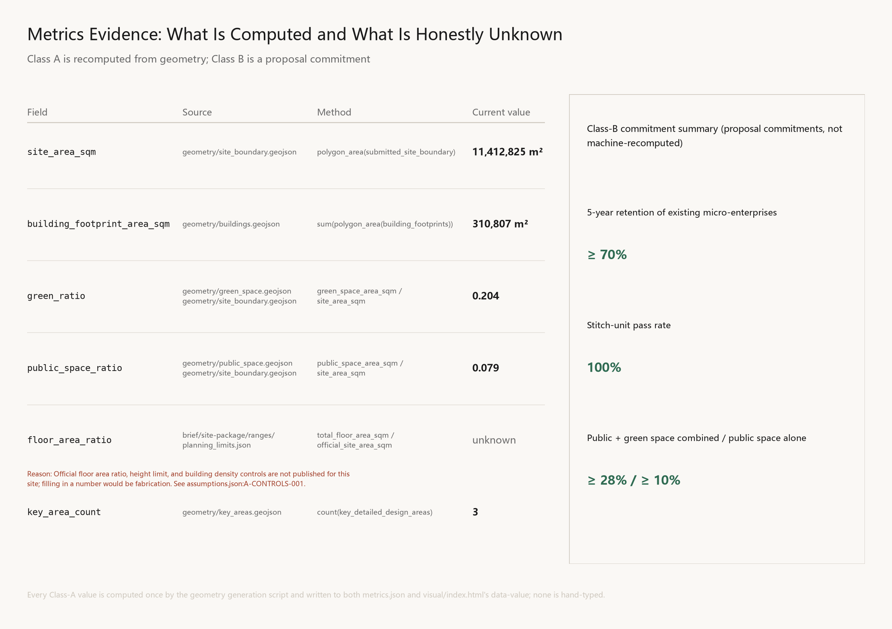

# The Zigzag

## Design Basis and Source List

This proposal is not a free-standing vision document. It organises its work from the official announcement, the agent open-call taskbook, and the site package, marking the basis beside each judgement [source:OFFICIAL-ANNOUNCEMENT] [source:AGENT-TASKBOOK] [depth:existing_conditions_diagnosis]. Full sources, standards coverage, and depth mapping are held in `sources.json`, `standard_matrix.json`, and `design_depth_matrix.json`; the main text does not repeat machine indices.

### Three levels of basis

| Level | Content | Role here |
|---|---|---|
| **Task basis** | Project announcement; agent open-call taskbook | Determines what is and is not undertaken [standard:PROJECT-OFFICIAL-ANNOUNCEMENT] |
| **Regulation and standards** | Urban design administrative measures; regulatory detailed planning standards; territorial land-use classification guide; interim measures for generative AI services; barrier-free environment law | Constrains the form and depth of outputs [standard:MOHURD-URBAN-DESIGN-MEASURES] [standard:MOHURD-CONTROL-DETAILED-PLANNING] [standard:MNR-LAND-USE-CLASSIFICATION-GUIDE] |
| **Site material** | Site package; three-tier scope table; missing-data checklist | Supplies spatial and quantitative basis [source:SITE-PACKAGE] [source:PROCESSED-FACT-PACK] |

### Missing material and its treatment

Gaps are declared explicitly rather than filled by estimation [depth:risk_missing_data] [data:geometry/constraints.geojson#CONSTRAINTS]:

| Missing | Status | Treatment |
|---|---|---|
| Official precise boundary coordinates | Unpublished | Provisional substitute boundary from the site package; areas governed by recomputation of the submitted geometry |
| FAR, height limits, site coverage | Recorded as missing in official material | **`floor_area_ratio` kept unknown with a reason field**; no invented figure |
| Regulatory plans, road lines, parcel ownership | Missing | The renewal project list gives rules and fields only, not specific parcels |
| Existing buildings, utilities, heritage conditions | Missing | Retain-renovate-demolish gives method of classification only, not building-level conclusions |
| Building-level vacancy and rent | Unavailable | Regional estimates used, with their estimated nature declared and retained |

**The proposal's position:** where material is missing, matters are written as pending confirmation rather than as settled conditions. Any conclusion lacking official regulatory, ownership, utility, or heritage conditions is downgraded in the text.

### Declaration on the nature of cited data

Sub-area rent and vacancy figures for Haidian are **regional estimates for comparative illustration, not building-level precise values**, drawn from Savills, JLL, Cushman & Wakefield, and Colliers reports together with Anjuke and Sohu listings. **This framing is not upgraded to measured data anywhere in this document.**

Innovation-ecosystem actors and relationships are compiled from public information as research into current industrial distribution. **No actor is asserted to have signed, moved in, or committed to move in**, and nothing here constitutes an investment-attraction outcome.



## Three-Level Scope Framework

The three tiers of scope are not three drawings at different scales. They are three different objects of judgement: the coordinated study scope answers what this belt carries within its region; the overall design scope answers what the belt itself becomes; the key areas answer how particular places are made. This section establishes one core idea, one spatial unit, and one review rule running through all three tiers, which the following sections develop at their own levels [source:OFFICIAL-ANNOUNCEMENT] [source:AGENT-TASKBOOK] [depth:three_level_scope_framework].



### 1.1 Naming and graphic core: The Zigzag

The Jing-Zhang Railway was completed in 1909. Its historical weight lies not in being "China's first railway" — it was not — but in being the first trunk line surveyed, designed, and built by Chinese engineers themselves. Facing steep gradients in the Guangou section, Zhan Tianyou rejected the spiral alignment then standard practice and adopted a switchback: the train enters a siding, reverses, and continues its climb on the other leg. On a map the trace forms the character 人 — *rén*, "human."

A century later, on the same line, the first functional requirement in the brief is an AI full-stack self-reliant innovation system.

The relationship between these two facts is not a rhetorical echo. It is the same proposition appearing twice on the same line, a hundred years apart: how a nation builds an autonomous technological system on its own ground when a decisive technology is held elsewhere. In 1909 the answer was the railway. Today it is artificial intelligence. **Everything in this proposal rests on that single judgement** [standard:PROJECT-OFFICIAL-ANNOUNCEMENT].

The thread is not metaphorical. The station nameplate on the Qinghuayuan Station building was written by Zhan Tianyou himself; the hand of that self-reliance is still on this line.

**The character holds at three levels simultaneously, without conflict between them:**

| Register | Meaning | Origin |
|---|---|---|
| Technical | Ascending by reversal; solving difficulty by ingenuity | The engineering principle of the switchback |
| Human | The glyph 人 means "human" | The fundamental subject of urban design |
| AI | Human-in-the-loop | The central proposition of AI governance |

The third matters most. The brief calls for a global voice in AI governance, and the core technical consensus in contemporary AI governance is precisely that the human must remain inside the decision loop. Here 人 is not decoration but a position statement: **the AI developed along this belt keeps people in the loop, not outside it.**

The name holds in both languages: 人字线 in Chinese, The Zigzag in English — the reversal is itself the name.

**The graphic logic is layered, not conflated.** The brief forbids conflating the cultural identity system with the belt's overall logo system. Accordingly: the belt logo is the zigzag base form, fixed; area marks are three opening angles (wide north, level centre, narrow south); programme marks add seasonal colour and year and may iterate annually. The zigzag is written in one stroke and stays legible at icon, seal, and paving-inlay scale; international audiences read a switchback, Chinese audiences simultaneously read "human"; and the opening angle is itself a variable able to encode area, year, or event.

**Naming uses chainage** — the railway's own language. The former Qinghuayuan Station is designated Zero Kilometre: built in 1910, it was the first station north of Xizhimen, and its nameplate was written by Zhan Tianyou; it lies within the AI Origin Community, consistent with the brief's own "origin"; and it sits at the highest talent density on the line. Chainage runs north and south from it, and nodes are numbered accordingly (Zigzag N2.4, S3.6 Dazhongsi Terrace). The wayfinding system is the physical form of the naming system; the two are not separately designed.

> **A binding constraint.** The former Qinghuayuan Station entered the cultural-relics survey register in 2012 and Beijing's first list of revolutionary heritage in 2021; it was the first station reached by the CPC Central Committee on entering Beijing. **No new commemorative content may be added to the building itself.** Zero Kilometre stands here solely as the datum for chainage and entails no physical intervention in the station fabric.

### 1.2 Relation to the completed phase one: this proposal claims no originality

One thing must be stated first, or everything after it fails.

Phase one of the Jing-Zhang Heritage Park opened in June 2023: 16.8 hectares, roughly 2.5 kilometres. **"Stitching" is already this project's official language** — phase one's public account describes building several new city streets to unblock traffic severed by the railway, increase exchange between residents on both sides, and stitch back together a city that had been cut open, summarising its achievement as turning a formerly enclosed space from the city's "back" into its "front." **The zigzag motif is already in use**, with a tribute to the switchback gradient and a commemorative mound among more than twenty design elements referencing the railway.

This proposal therefore does not advance "stitching" or "the zigzag" as original claims. Both are existing consensus and built fact on this line.

What this proposal advances is the missing link:

> Phase one delivered stitching at the level of **passage** — opening walls, adding streets, restoring crossings. This was necessary. But the Seoullo 7017 lesson shows passage-level stitching is insufficient: seventeen lateral connections were built, and it was still judged a failure because they plugged into no industry and no local economy.
>
> **This proposal supplies the missing link of functional landing** — the Zigzag stitch unit and its review rule, set out in 1.4. In phase one the zigzag is a commemorative formal motif; here it becomes a spatial unit carrying a binding constraint.

This positioning fixes the proposal's posture: it continues and deepens the completed phase one rather than starting over.

### 1.3 Three tiers of scope and three gradients

**The three tiers** — the overall scope is evidenced at [data:geometry/site_boundary.geojson#SITE-001] [metric:site_area_sqm], and the three key areas at [data:geometry/key_areas.geojson#PROV-KEY-001] [metric:key_area_count]:

| Tier | Area | Extent | Object of judgement |
|---|---|---|---|
| Coordinated study scope | 43.6 km² | 5th Ring Rd — Jingzang Expwy — Xizhimenwai St — Wanquanhe Rd | The belt's position and ecosystem relations within the region |
| Overall design scope | 11.4 km² | 1–2 km either side of the heritage park | Spatial structure, renewal framework, character, facility systems |
| Key areas | 368.4 ha (three) | Three sub-areas | Land use, function, buildings, delivery |

**The three belts are not three parallel strips.** The brief names three — the Centennial Jing-Zhang Cultural Belt, the Urban AI Living Experience Belt, and the AI Convergence Innovation Belt. The commonest treatment draws three parallel strips. This proposal holds that to be wrong: in reality the three do not run parallel but **radiate outward from the heritage line as gradients**. This is not a formal preference but a condition of the site — there is only one heritage corridor, immediately flanked by existing communities, with land capable of carrying industrial scale only beyond them [depth:overall_spatial_structure].

| Belt | Extent | Speed and time scale | Dominant content |
|---|---|---|---|
| Centennial Jing-Zhang Cultural Belt | c. 100–200 m either side | Slow · century scale | Heritage fabric, narrative, markers, exhibits |
| Urban AI Living Experience Belt | c. 500 m (5–10 minute walk) | Medium · daily scale | Community, talent housing, public services, AI living scenarios |
| AI Convergence Innovation Belt | Design scope out to the study area | Fast · industrial scale | R&D, pilot production, testing grounds, enterprise services, capital |

**The three key areas are differentiated by three modes of contact between AI and the city**, not by industrial hierarchy. This also aligns with the locational gradient from periphery to inner city:

| Key area | Area | Position | Basis |
|---|---|---|---|
| Zhongzhiyuan (north, at the 5th Ring) | 192.1 ha | AI **production / testing** | Largest, most peripheral, loosest land conditions; can host compute facilities, pilot lines, robotics testing grounds |
| Beijing AI Origin Community (centre, Wudaokou) | 104.3 ha | AI **living / co-habitation** | Highest talent and institutional density; Qinghuayuan Station is here, making "origin" literal |
| Dazhongsi AI Cluster (south, innermost) | 72.0 ha | AI **services / exchange** | Smallest, heaviest existing commercial stock; suited to adaptive reuse, enterprise services, capital interface |

Production — living — services: each segment has its own principal business, connected by Zigzag stitch units into a continuous chain rather than three islands.

### 1.4 The Zigzag stitch unit and its review rule

**This is the proposal's central design instrument.**

The benchmark study yields a critical correction: lateral stitching is not a matter of building more bridges. Seoullo 7017 shared this proposal's exact intent — reconnecting severed urban axes — and genuinely built seventeen lateral connections. It is nonetheless judged a failure, because those connections plug into no industry and no local economy. Conversely, the King's Cross architects' own word was "stitch," and it succeeded because both ends of its twenty new streets land a function: a college, firms, housing.

Accordingly, 人 does not remain a logo. It is the proposal's **basic spatial unit**:

| Component | Position | What must be delivered |
|---|---|---|
| **Apex** | On the heritage park line | A lateral crossing (at grade, underpass, or bridge) with a public node — station, square, marker, or exhibit |
| **First foot** | One side of the line | One defined functional landing |
| **Second foot** | The other side | A second defined functional landing, of a different type |

**Neither foot is assigned a fixed orientation.** What each lands is determined by the adjoining conditions at that point — where one side meets a campus it lands a campus interface, and where the other meets surviving industrial stock it lands incubation or testing; elsewhere the arrangement may reverse. Available landings include campus interfaces, community facilities, talent housing, public services, enterprise service points, incubation space, testing grounds, and industrial interfaces.

**No line-wide orientation rule is set, because real conditions differ from point to point.** The review rule requires only that each foot land an allocated function of a different type, never that a given side carry a given category.

> **Review rule (written into this proposal's self-check).** Any lateral connection whose two feet cannot each name an allocated function is **not counted in the stitching system and may not be presented as a design outcome.**
>
> Its purpose is to prevent this proposal from repeating Seoullo 7017. It also means the proposal will not express transport outcomes as "X new crossings added" — the number of crossings is not the outcome; whether there is somewhere to go at either end is.

**Spatial acceptance of the rule:** standing at the apex of the Zigzag Bridge, one should see the functional node at each of the two feet. If they cannot be seen, that stitch unit does not hold. This is verified by diagram at design stage and by measurement after completion.

The rule also constrains character in reverse: continuous long-frontage buildings either side of the line would seal off lateral sightlines and make the acceptance test impossible. **Massing control is therefore not an aesthetic matter here but the physical precondition for stitching** (section 9) [depth:height_massing_character].

**Committed metrics for the stitching system:** qualifying units ≥8 (roughly one per 1.1 km over 9 km, subject to land data); pass rate 100% — a connection without functions at both feet is excluded entirely, with no partial pass; end-function visibility from the apex 100%; mean spacing of lateral connections ≤1.2 km.

### 1.5 Pilgrimage landmarks

The brief requires at least three; the official announcement separately requires landmark landscape nodes at the park's southern end, northern end, and ring-road crossing. This proposal sets out **five** — the first three answering explicit requirements, the last two its own [data:geometry/public_space.geojson#PUBLIC-001].

| Node | Location | Requirement | Content |
|---|---|---|---|
| **Switchback Terrace** | Dazhongsi (south end) | Official: south end | Outward display and exchange interface; the historic bell and compute facilities alike are the city's "public time" devices |
| **Qinghe Terrace** | Zhongzhiyuan (north end) | Official: north end | Northern origin marker; display and viewing of Qing River culture |
| **Ring-road crossing node** | The 5th Ring crossing | Official: ring-road crossing | The only interface on the line addressed to vehicular speed; a folded landscape structure |
| **Zero Kilometre node** | **Outside** the former Qinghuayuan Station | This proposal's own | Chainage origin; open-source contribution inscription |
| **Zigzag Bridge** | Crossing Xueyuan Road | This proposal's own | Exemplar and acceptance object of the stitching rule |

**The boundary at Zero Kilometre must be restated.** The Qinghuayuan Station building is Beijing revolutionary heritage and accepts no new commemorative structure. Both the marker and the inscription sit at an adjacent public node **outside** the station, in visual relation to it but physically independent, low in profile and not competing for primacy. The station retains its own identity — Zhan Tianyou's nameplate, the historical site of 1949. **Two forms of self-reliance stand side by side, each holding independently, neither overwriting the other.**

The inscription records three categories — individual contributors, agent contributors (requiring nomination by a named person), and open-source projects — under published rules, adjudicated by a human committee, growing annually. It answers the nature of this call: **this is an urban design competition conducted with AI participation, and that fact should leave a spatial trace.**

### 1.6 Track declaration

Three tracks are declared:

1. **`jingzhang-heritage-narrative`** — where the proposal's principal proposition lies
2. **`ai-origin-community`** — the "living" segment and the location of Zero Kilometre
3. **`ai-traffic-walkability`** — the lateral connection system of the Zigzag stitch units

Noted for the record: `robotics-autonomous-mobility` is closely related to Zhongzhiyuan's positioning, and the Hazelwood Green evidence applies directly. Should the "production" segment warrant greater weight, it can replace the third declaration.

### 1.7 Evidential boundary of this section

This section establishes a core idea, a unit, and a rule; it contains no engineering conclusions. Boundary interpretation returns to the geometry layers and area recomputation. The proposal states no FAR, building height, road lines, or engineering implementation conclusions — official control figures (FAR, height limits, site coverage) are all recorded as missing in public material, and inventing them would be fabrication [depth:risk_missing_data] [data:geometry/constraints.geojson#CONSTRAINTS].

**The number and location of stitch units remain undetermined**, pending actual land and existing-building data. This section establishes the rule only and presupposes no result.

The chainage numbering and functional binding of stitch units are settled (N4.2 carries the S01 testing ground, for example), while their precise coordinates await chainage-to-coordinate data. Numbering is design intent; coordinates are survey output, and the two must not be conflated.

## Coordinated Research Area: Industry and Future City Research

The task across the 43.6 km² coordinated study area is to answer what this belt carries within its regional innovation system — not to draw a larger masterplan [source:AGENT-TASKBOOK] [standard:PROJECT-AGENT-OPEN-CALL-TASKBOOK]. Four parts follow: global benchmarks, the ecosystem graph, the three zones and two wings, and future urban form.

### 3.1 Global benchmarks: linear heritage × innovation districts

The brief asks for five to eight global AI innovation ecosystem cases. Sampling on "innovation ecosystem" alone would miss what is most particular here — **it is a line, and that line is heritage.** The criterion used is the intersection of two conditions: reuse of linear infrastructure heritage, and that heritage becoming the vehicle for an innovation economy. Five of the seven are direct conversions of railway or industrial facilities.

Failures and criticism are retained deliberately. **Linear-heritage conversion has a remarkably stable global failure pattern; a proposal that does not confront it is evading the real question.**

| Case | Origin | Spatial move | Transferable | Costs and criticism |
|---|---|---|---|---|
| **Station F, Paris** | 1929 Austerlitz rail freight hall by Freyssinet, inventor of prestressed concrete; listed 2012 | Retains the 310 m vault; **no green corridor — converted wholesale into an industrial container**, divided create / share / chill | Technical heritage can carry new technology industry directly, without first becoming landscape; the full chain under one roof lowers founders' search costs | Called the "malling" of startup culture; scale brings anonymity that erodes small communities |
| **King's Cross, London** | 67 acres of derelict railway lands | Architects' own word: stitching a lost piece of London back into the fabric; **40% of the site to parks, streets, public space**; 20 historic buildings restored, 20 new streets | **Cultural anchor before tech giants** — Central Saint Martins first, Google and Meta after; 40% affordable housing as institutional defence (Note: this 40% is a combined basis of parks, streets, and public space, not the single-item basis of this proposal's `public_space`; see §11.3) | The 40% figure differs between commitment and delivered readings; both are presented, neither adopted |
| **22@Poblenou, Barcelona** | Former Poblenou industrial district, from 2000 | Land-use reclassification from industry to knowledge-intensive use | Reclassification as the ignition mechanism | **The heaviest lesson:** the programme proceeded amid sustained contestation over the displacement of existing small industry and residents (specific figures removed for want of a verifiable primary source; see §13.4) |
| **High Line, New York** | Disused elevated freight line, Manhattan West Side | Purely landscape-led conversion to an elevated garden | Principally **inverse** | Co-founder: the intention was to serve the neighbourhood, and in the end they failed |
| **Hazelwood Green, Pittsburgh** | 178 acres of former steel works | **New buildings inserted within the mill's steel skeleton**; an 1887 roundhouse converted to an innovation hub | Insertion within an industrial frame; **robotics testing grounds must be reserved in land use**; a permanent history exhibit inside the research centre | Housing, retail, and sport came late — the industry-before-life sequencing problem |
| **Kendall Square, Boston** | East of MIT | High-intensity mixing within a very small radius | **Research across 50 innovation districts finds five to seven storeys optimal** — dense enough to concentrate people, low enough for human-scale interaction | High costs squeeze out early founders; the curse of success |
| **Seoullo 7017, Seoul** | 1970 Seoul Station overpass, converted 2017 | **Explicitly aimed at reconnecting the city centre's severed axes**, with 17 lateral walkways | Principally **cautionary** | Academic assessment notes seasonal disparity in programming and limited connection to the local economy; demolition has been urged |

#### Three cross-case conclusions

**One: the outcome depends on lateral permeability, not longitudinal length.**

| Case | Lateral connections | Functionality | Outcome |
|---|---|---|---|
| High Line | Few | None | Failed (per co-founder) |
| Seoullo 7017 | Many (17) | Weak | Failed (demolition urged) |
| King's Cross | Many (20 new streets) | Strong | Succeeded |
| Station F | N/A (single structure) | Strong | Succeeded |

**Seoullo proves count alone is insufficient; the High Line proves length alone is worse.** This conclusion directly produced the review rule in section 2.

**Two: what matters is not a complete industrial chain but the spatial density of the stretch from idea to investment.** The rate of innovation is set by walking distance between researchers, founders, and capital, not by the completeness of industrial categories. Two corollaries: sequence anchors education/culture → startups → giants; hold density in the range that produces human-scale interaction.

**Three: gentrification is the default outcome, not a side effect.** 22@ and the High Line are the same result via different routes. **No case avoided displacement because it was well designed** — only institutional defences worked.

#### Case-to-area mapping

| Key area | Primary benchmark | Core transferred device |
|---|---|---|
| Zhongzhiyuan (north) | King's Cross + Pittsburgh | Comprehensive development of large railway parcels; culture before industry; reserved robotics testing grounds |
| AI Origin Community (centre) | Kendall Square | Density threshold; compression of research–incubation–capital; walking distance first |
| Dazhongsi (south) | Station F | Wholesale conversion of large-span existing structures into industrial containers |
| The line itself | Seoullo 7017 (inverse) | Every lateral connection must land a function at both ends |

### 3.2 The AI innovation ecosystem graph: a four-flow model

The brief requires an ecosystem graph. Ecosystems are most commonly drawn in layers — basic research, transfer, application, capital. The problem is that **this describes a static composition, not a dynamic relationship**; reviewers cannot see how it operates or verify it.

A **four-flow model** is used instead: not what exists, but what moves.

| Flow | Definition | Typical Haidian paths |
|---|---|---|
| **Talent** | Graduates entering firms; professors leaving to found companies; senior staff departing to start new ones | Tsinghua → Zhipu; MSRA → Baidu; Baidu → Horizon |
| **Technology** | Laboratory work engineered into product; open models adopted; spin-outs inheriting parent technology | ICT, CAS → Cambricon; BAAI "Wudao" → ModelBest |
| **Goods** | Devices and compute along the chip → hardware → product chain | Cambricon → Baidu; GigaDevice → Horizon |
| **Capital** | Government guidance funds, VC, corporate strategic investment, park industrial investment | Beijing AI Fund → Zhipu; Zhongguancun Development Group → parks |

Nodes cover five categories: universities (Tsinghua, Peking, Renmin, Beihang, BIT, BUPT, BNU), institutes (CASIA, ICT, IMECAS, BAAI, Tsinghua AIR), companies, chips, and capital.

**The value of the four flows is verifiability** — every edge traces to a publicly documented event. A layered diagram cannot do this.

#### Three spatial conclusions from the graph

**One: the four flows have different radii, and therefore different spatial demands.** Talent has the shortest radius, depending heavily on physical proximity and informal contact; technology is medium; **goods has the longest — chips and compute dispatch across regions and need not be located nearby**; capital is also long, though first contact still requires meeting in person.

> **Spatial conclusion:** prioritise the short radius of talent flow — walkable mixed layouts — rather than a local closed loop for goods. **There is no need to build a complete local chip supply chain within the belt.**

**Two: compute is better connected to than duplicated.** Public information indicates that a public computing dispatch platform is under development in Beijing (a Level B source, §13.5). **This proposal claims no access permission and does not assert that the platform will be available to this belt**; the point is a proposed mechanism, and actual connection requires separate confirmation. Given the long radius of goods, the belt needs **compute access points and dispatch interfaces**, not machine halls in every key area. **This bears directly on land use — it avoids over-reserving land for unnecessary facilities.**

**Three: the break in the graph is the spatial opportunity.** The most fragile transition is **from technology to capital** — laboratory result to financing. Kendall Square's achievement was compressing precisely this distance. Dazhongsi's "full chain under one roof" is the spatial treatment of that break.

### 3.3 Three zones and two wings

#### The Zhongguancun science-service wing

Global allocation of factors; Zhongguancun IP and capital enablement. Located at Dazhongsi (the services/exchange segment) and its extension toward the Zhongguancun core, carrying **the confluence of capital and technology flows.**

The brief requires coverage of eight factor mechanisms:

| Factor | Mechanism direction | Spatial vehicle |
|---|---|---|
| Land | Adaptive reuse first, new land second | Dazhongsi existing stock |
| Space | Elastic supply — short lease, scalable | Full chain under one roof |
| Industry | Service formats rather than manufacturing | Dazhongsi street frontage |
| Capital | Connect to existing guidance funds and VC networks; establish nothing new | Switchback Terrace |
| Talent | Four-stage pathway: visit → residency → registration → retention | Section 6 |
| Compute | Access points connecting to the public dispatch platform | Shared ground-floor zone, Dazhongsi |
| Data | A compliance interface for data-factor circulation | Algorithm clinic |
| Scenarios | Application–decision–review loop for scenario opening | Section 6 |

> This table states mechanism direction and spatial vehicle only. **It contains no funding amounts, policy commitments, or company names.**

#### The Xiaoyue River scenario-enabling wing

AI scenario enablement and the intelligent, vital city. The Xiaoyue River is among the blue-green corridors named in the official announcement, running alongside the Xueyuan Road university belt.

**A local-data opportunity confirms the position here:** Xueyuan Road shows office rents of 165 and 18% vacancy, while Wudaokou one road away shows 235 and 6%. **The Xiaoyue River sits on this gradient.** Scenarios S14–S16 follow in section 6.

### 3.4 Local data baselines

| Sub-area | Residential rent | Office rent | Vacancy |
|---|---|---|---|
| Xibeiwang · Houchangcun | 78 | 140 | **22%** |
| Shangdi · Xi'erqi | 105 | 185 | 15% |
| Qinghe · Yongtai | 85 | 135 | 20% |
| Yiheyuan Rd · PKU · Wanliu | 115 | 150 | 19% |
| **Wudaokou · Tsinghua Science Park** | 118 | 235 | **6%** |
| **Xueyuan Road university belt** | 92 | 165 | **18%** |
| Zhongguancun core | 120 | 255 | 12% |
| Suzhou St · Haidian Huangzhuang | 112 | 240 | 14% |
| Zhongguancun South · Weigongcun | 90 | 160 | **19%** |

> **Nature of the data:** regional estimates for comparative illustration, not building-level precision (sources in section 1).
>
> **Basis correction:** Wudaokou vacancy was earlier estimated at 13% on a "greater Wudaokou" average and is now estimated at about 6% on a park-core basis. The difference arises from scope: the wider basis includes Grade B stock along Chengfu Road, the Wudaokou business area, and newly delivered or refurbishing projects; the park-core basis does not.
>
> **The specific floor area and occupancy figures for Tsinghua Science Park cited in an earlier version have been removed, as no auditable primary source can be supplied.** The judgement that this sub-area is close to fully let now rests on relative ranking within this estimate set (the lowest-vacancy segment in the district) and **carries no absolute-value endorsement.**

**Three judgements the data confirms:**

**One: Dazhongsi's adaptive-reuse strategy has a local supply basis.** Vacancy of 19% at Zhongguancun South and 22% at Houchangcun indicates genuine surplus; the Station F device is not a foreign import forced onto the site.

**Two: landing the Zigzag Bridge on Xueyuan Road puts it at the steepest economic gradient on the line.** A 42% rent differential and threefold vacancy gap is the most direct quantification of severance. **The bridge is not placed for a good view — it is placed where the value gradient is steepest.**

**Three: the anti-displacement metrics gain a local anchor.** If stitching succeeds, rents on the Xueyuan Road side will converge toward Wudaokou, and **that is precisely where displacement pressure will come from.** The rent cap exists to resist it — no longer an abstract worry but a specific risk with a measurable gradient behind it.

### 3.5 Urban form adapted to AI-era productive forces

The brief requires a new urban form adapted to AI-era productive forces. The argument here does not come from formal imagination but from the radius analysis in 3.2 [depth:overall_spatial_structure].

**Core proposition: the defining formal characteristic of the AI era is that the radius of people and the radius of things separate significantly for the first time.**

Industrial-era urban form was determined by the radius of goods — factories, warehouses, wharves, and railways together anchored where people had to be. **AI industry's goods (chips and compute) dispatch across regions, while human collaboration still depends on walking distance.** Three formal corollaries follow:

| Corollary | Content | Difference from conventional form |
|---|---|---|
| **One: density serves collaboration, not transport** | Built density should be organised by the frequency of human encounter, not freight efficiency | Conventional parks organise by logistics, producing superblocks, wide roads, low encounter rates |
| **Two: local completeness of the industrial chain ceases to be necessary** | A long goods radius makes local closure unnecessary; land should go first to human activity | Conventional development zones pursue local chain completeness |
| **Three: temporarily manageable public space becomes a factor of production** | AI industry needs real conditions to test in; city streets and riverbanks are themselves means of production | In conventional form, public space is only for consumption and movement |

**The third is the core of this proposal's view of form.** It means the design standard for public space must change: not only movement and rest, but **whether it can be temporarily closed, whether the community can veto that closure, and whether the review can be published.** The five-step scenario-opening loop in section 6 is the institutional counterpart of this formal position.

This view also explains why lateral stitching outranks longitudinal continuity here: **when the factor of production is human encounter, two severed sides are wasted capacity.** That Xueyuan Road and Wudaokou differ by 42% in rent across a single road is the price of exactly that waste.

### 3.6 Regional coordination: this belt's interfaces within the "three cities, one district"

Regional coordination is a named review dimension. This section answers one specific question: **within Beijing's existing innovation geography, what does this belt carry, and what does it not.**

#### 3.6.1 The existing framework and this belt's place in it

Beijing's principal platform for its international science and technology innovation centre is the "three cities and one district," each with a role set out in official statements [source:AGENT-TASKBOOK]:

| Platform | Official role | Relation to this belt |
|---|---|---|
| **Zhongguancun Science City** | Major original results and breakthroughs in key core technologies; the point of departure for innovation, the source of original innovation, and the main arena of self-reliant innovation | **This belt lies within it** — a spatial segment of Zhongguancun Science City, not a parallel platform |
| **Huairou Science City** | Large scientific facilities and cross-disciplinary platforms, forming a cluster of major national research infrastructure; a world-class carrier of original innovation | Supplies major-facility capacity this belt does not have |
| **Future Science City** | Future industries and the "two valleys, one park" build-out; a leading technology innovation hub. Sited at the junction of Zhongguancun and Huairou, it is the connective platform | The intermediate stage of technology innovation and result absorption |
| **Beijing Economic-Technological Development Area** | Absorbing and commercialising original results from the three science cities; the core node of the industrial innovation system | Where this belt's output lands for scaled manufacturing |

> **A judgement to state first:** this belt is not a fifth platform. It lies inside Zhongguancun Science City as a linear space of roughly nine kilometres. **Regional coordination here is not about allying with others but about identifying one's own segment within an existing division of labour.**

#### 3.6.2 Coordination interfaces through the four flows

The four-flow model of §3.2 has a second use here: it clarifies what this belt **exports and receives**.

| Flow | This belt's role | Partner | Interface |
|---|---|---|---|
| **Talent** | **Net export and recirculation** | Future Science City, BDA | Talent density is highest here (the Origin Community), but the belt cannot carry all resulting employment. Teams forming here and migrating outward as they scale is normal, and should be designed for |
| **Technology** | **Transfer and validation** | Huairou (upstream), BDA (downstream) | Huairou's large facilities produce fundamental results; this belt carries scenario validation and pilot production (Zhongzhiyuan); BDA takes volume production |
| **Goods** | **No local closure; deliberate external dependence** | The city-wide compute network | Compute connects to Beijing's public dispatch platform; no independent pool is built here (§3.2, §7.2) |
| **Capital** | **Entry point** | Jing-Jin-Ji venture networks | The Dazhongsi services segment carries the contact interface between capital and founders (§5.5) |

**The talent row matters most.** Conventional practice treats outward talent movement as loss. This proposal does not: **the belt's spatial conditions — near-full occupancy, high rents, small parcels — suit incubation rather than carrying capacity.** Teams moving to Future Science City or the BDA as they grow is the normal outcome of the division of labour, not a failure.

**This judgement has a spatial consequence:** the belt reserves no large parcels for scaled production, using land instead to raise the density of human encounter (§7.2).

#### 3.6.3 Relation to the Zhongguancun AI North Latitude Community

The North Latitude Community is a designated AI carrier space in Haidian, offering floor area and rent policy. **It and this belt are complementary, not competing:**

| | North Latitude Community | This belt |
|---|---|---|
| Provides | Carrier space and policy incentives | Scenarios, testing conditions, public interface |
| Spatial nature | Concentrated capacity | Linear, dispersed, embedded in the existing city |
| Meaning for founders | Cost of landing | Opportunity to validate |

**Interface design:** in the developer conversion pathway (visit → residency → registration → retention, §6.6), the registration stage connects explicitly to the North Latitude Community's existing capacity and policy, **with no parallel incentive scheme established within this belt.** This avoids duplicating policy and keeps the belt focused on what is genuinely scarce here — scenarios and validation conditions.

#### 3.6.4 At the Jing-Jin-Ji scale

At the regional scale this belt exports **rules**, not relocated industry.

The basis is Zhongzhiyuan's role in §5.3: a regime of testing that can be vetoed — the five-step scenario-opening loop, the community veto, published veto records. **Once this protocol works, other cities in the region can adopt it directly rather than each working it out afresh.**

Rules travel more readily than industry: relocation is constrained by land, cost, and supporting infrastructure, while exporting a rule requires only the text and a record of practice.

#### 3.6.5 Boundary of this section

**Everything above is coordination proposed at spatial and functional level and constitutes no agreed arrangement.**

- Interfaces with Huairou, Future Science City, and the BDA are inferred from their published roles; **no party has been approached or has confirmed anything**
- The policy connection with the North Latitude Community is a proposed mechanism; **no policy support or inclusion in any programme is claimed**
- The "three cities, one district" roles cited here come from published policy documents and official releases; sources in §13
- **No institution, company, or platform is asserted to have signed, moved in, or committed to participate**

## Overall Design Area: Urban Renewal and Regulatory-Plan-Level Urban Design

The task across the 11.4 km² overall design scope is to answer what the belt itself becomes. This section organises its outputs to the urban design depth of regulatory detailed planning [standard:MOHURD-CONTROL-DETAILED-PLANNING] [depth:overall_spatial_structure], while keeping missing statutory control figures explicitly unknown rather than filling them by estimate.

### 4.1 Overall spatial structure: one vertical, two horizontals, three segments, many units

| Element | Content | Basis |
|---|---|---|
| **One vertical** | The heritage park itself, roughly 9 km, carrying the cultural belt and the apex of every stitch unit | [data:geometry/site_boundary.geojson#SITE-001] |
| **Two horizontals** | The Qing River (north) and Xiaoyue River (centre-east), blue-green corridors perpendicular to the line | Blue-green spaces named in the official announcement |
| **Three segments** | Zhongzhiyuan (production/testing), AI Origin Community (living/co-habitation), Dazhongsi (services/exchange) | [data:geometry/key_areas.geojson#PROV-KEY-001] [metric:key_area_count] |
| **Many units** | At least eight Zigzag stitch units along the line, connecting the three gradients laterally | The review rule, section 2 |

**The organising logic is not "axis plus zones" but "line plus stitches."** The vertical is the object being stitched, not the point of force; the horizontals are the natural lateral basis — **watercourses run perpendicular to the railway by nature**; the segments are the industrial division; the stitch units are the operating instrument that joins the three.

### 4.2 Urban renewal framework

#### The test of renewal potential: vacancy, not judgement by eye

The brief requires a scientific analysis of renewal potential. Common practice judges by construction date or condition. This proposal uses **vacancy** as the primary test: vacancy registers directly the space **the market has already voted against with its feet.** An older building fully let carries a far higher social cost of renewal than a newer one standing twenty per cent empty. **Renewal should go where the market has failed, not where things merely look old.**

| Sub-area | Vacancy | Renewal potential |
|---|---|---|
| Xibeiwang · Houchangcun (near Zhongzhiyuan) | 22% | **High** — oversupply; adjust function rather than add more |
| Qinghe · Yongtai | 20% | **High** — office absorption difficult |
| Zhongguancun South · Weigongcun (near Dazhongsi) | 19% | **High** — mixed ageing office and housing |
| Xueyuan Road belt (Xiaoyue River) | 18% | **High** — mainly Grade B stock |
| Shangdi · Xi'erqi | 15% | Low — stable absorption |
| Zhongguancun core | 12% | Low |
| **Wudaokou · Tsinghua Science Park** | **6%** | **Lowest — not a renewal priority but a protection priority** |

> Regional estimates, not building-level precision (nature declared in section 1).

**A counter-intuitive conclusion follows:** the AI Origin Community is close to fully let, and its strategy should be gap-filling — talent housing, childcare, night-time space — **not large-scale clearance.**

#### Renewal intensity: heavy at both ends, light in the middle

| Segment | Intensity | Principal mode |
|---|---|---|
| North · Zhongzhiyuan | **High** | Functional adjustment — office supply exceeds demand; shift to pilot production, testing, display |
| Centre · Origin Community | **Low** | Gap-filling — near-fully let; add housing, childcare, 24-hour space |
| South · Dazhongsi, Weigongcun | **High** | Adaptive reuse — industrial containers and service frontage |
| Underused space along the line | Point-based | Below |

**This is not a formal arrangement:** full occupancy in the centre means the market has endorsed it and forcing renewal would be destructive; vacancy at both ends means the market has failed, and only there does renewal carry meaning.

#### Renewal pathway for underused space either side of the park

The brief requires this pathway explicitly. It is bound to the stitch unit in three steps: **identification** (a register of vacancies, temporary structures, blank walls, and dead back-of-house within 500 m either side) → **pairing** (each assigned to a foot of the nearest stitch unit) → **graded implementation**:

| Grade | Condition | Measure |
|---|---|---|
| First | At the feet of a stitch unit and currently vacant | Renew first; deliver the functional landing |
| Second | At the feet but currently in use | Open the frontage only; leave the fabric |
| **Third** | **Outside any stitch unit** | **Defer** |

**The third grade is this proposal's self-restraint:** underused space outside the stitching system is excluded from this round even where it appears to warrant work. Resources are finite, and whether the feet are delivered decides whether the proposal succeeds.

#### Integrating campus, park, and neighbourhood: convert interfaces, don't remove walls

Their separation is real — the eight Xueyuan Road universities are each walled, Tsinghua Science Park is self-contained, and the Wudaokou neighbourhood is a connective layer formed spontaneously. Adjacent, yet mutually impermeable.

| Type | Problem | Device | Landing |
|---|---|---|---|
| Campus | Walled; passable only at gates | A continuous public forecourt along the Xiaoyue River linking gateways | S15 |
| Park | Self-contained | Open the ground-floor frontage; bring shared resources to the street edge | S08 |
| Neighbourhood | Spontaneous; poor quality and amenity | Add a common room and low-cost startup space | S06, S16 |

**Proposed delivery model:** the Zigzag stitch unit as the minimum implementation unit, each delivered by the public body at the apex plus the landowners at the two feet. **A unit is small enough to advance one at a time, without waiting for the whole line.**

### 4.3 Live-work-retail-service balance

| Segment | Imbalance | Direction |
|---|---|---|
| North | Strong employment, weak housing; office oversupply | **Less office, more housing and amenity** — 22% vacancy makes further office pointless |
| Centre | Both strong; weak services and night provision | Add talent housing, childcare, 24-hour space |
| South | Weak retail and employment; idle stock | Add service formats and low-cost startup space |

### 4.4 Response to Haidian's "1+X+1" industrial system

- **The first "1" (artificial intelligence)** — across all three segments, with Zhongzhiyuan carrying the self-reliant base
- **"X" (AI+ vertical applications)** — the scenario system; the seventeen cards are X made spatial
- **The second "1" (technology and consumer services)** — the Dazhongsi services segment and the Zhongguancun science-service wing

### 4.5 Depth boundary of this section

This section reaches regulatory-plan urban design depth but **states no FAR, building height, road lines, or engineering implementation conclusions** [depth:risk_missing_data]. Official control figures are missing from public material and inventing them would be fabrication; control guidance appears in section 9, the level at which the official announcement expressly requires it.

### 4.6 Personas and Scenario-Card System
- Two disciplines that precede every card: a scenario must land on a specific location (district/gradient belt/zigzag unit); a scenario must state where "human-in-the-loop" holds a veto or discretion
- Seven personas P1–P7: graduate researcher / early-stage founder / robotics test engineer / long-term resident / enterprise-services & capital professional / heritage & study visitor / constrained user — each with representative group, activity radius, core needs, biggest fear
- Scenario cards S01–S13 (original 13) + S14–S16 (Xiaoyue River supplement) + one supplementary scenario from the operations draft (public-space service-robot trial) = 17 cards total; fixed fields: location / gradient belt / main actors / trigger / AI's role / human-in-the-loop landing point / spatial requirements / verifiable metrics
- S11 "seeing both ends from the bridge" is the acceptance sample for the whole set
- Coverage cross-check by persona and by district; known gap — P5 (services & capital) is covered by only 2 cards, sparser than the other personas

### 4.7 Urban Character
This subsection duplicates section 9, "Blue-Green Network, Public Space, and Urban Character," and has been consolidated there rather than repeated here: urban tone at §9.2; the control-guidance table (height / intensity / material palette / roof form / massing) at §9.3; the Qing and Xiaoyue River blue-green frame at §9.1; use of the Beijing Film Academy and other arts resources at §9.6. The landmark city-view node list is at §1.5, Pilgrimage Landmarks; each node's detailed design is at §4.10.

### 4.8 Metrics System (Class-B Committed Metrics, Presented Together)
- Class-A verified metrics (6 items, written to `metrics.json`; the prose does not repeat the values, only references them): `site_area_sqm` / `building_footprint_area_sqm` / `green_ratio` / `public_space_ratio` / `floor_area_ratio` (**status=unknown**, official control figures not published, see `assumptions.json:A-CONTROLS-001`) / `key_area_count` (fixed at 3)
- Class-B committed metrics, five groups (written into this section's prose as public commitments, not machine-recomputed):
  - Anti-displacement group — small-business 5-year retention rate ≥70% / talent/affordable-housing share ≥40% / rent increase cap ≤5% per year (conceptual parameter, pending verification) / public space plus green space combined share ≥28% / public space alone ≥10%
  - Stitching group — ≥8 qualifying units / 100% qualification rate / 100% two-end visibility at the apex / ≤1.2 km average lateral spacing
  - Jobs-housing & density group — ≤15-minute median walk to the lab / 5–7 storeys predominant / ≥60% of R&D seats within the 15-minute isochrone / ≤800 m longest leg of the childcare-housing-lab walking triangle
  - Ecosystem & operations group — ≥5 institution types under one roof / ≥100 open days per year / ≥0.6 seasonal-balance index / ≥20 new Zero-Kilometre entries per year
  - Human-in-the-loop group — 100% of scenario cards state a veto/discretion point / 100% of public-space AI applications have publicly checkable parameters / 100% of community-veto records are made public
- Each group states its basis (benchmark case or self-set) and local-verification status, without concealing that most target values still lack a local baseline

### 4.9 Belt Operating Mechanism (responds to agent.6)
- Two prior disciplines: do not build a new system, plug into existing mechanisms (Zhongguancun Forum, the AI Origin Community's existing policy, the shared compute-scheduling platform); the whole section is operating-mechanism advice, not a settled arrangement, and states no figures
- Annual event system: a four-season structure (spring — opening week / summer — open-source season / autumn — scenario-opening season / winter — Zero Kilometre annual induction) plus a routine weekly cadence
- Three-tier brand and visual-identity system: Belt logo (stable) / district identity (three opening-angle variants) / event identity (can refresh yearly)
- Developer-community four-stage conversion path: visit → reside → register → retain, with thresholds/offerings/conversion mechanisms per stage; compute quota connects to the shared scheduling platform
- Five-step AI scenario-opening loop: apply → initial review → community decision (veto power) → execution → public post-mortem; three verification-test scenario types (mapped to S01/S03/the supplementary public-space service-robot scenario)
- Public experience and landmark operation: each of the three landmarks has its own operating entity and opening mode; an honours-display system (individual contributors / AI-agent contributors / open-source projects, with the roll determined by a human committee)
- International outreach and attraction: anchored on the Zhongguancun Forum, no separate international brand built; a four-stage funnel (awareness / contact / landing / rooting)
- Three self-imposed prohibitions: no investment figures, company names, or fiscal commitments; no presenting proposals as settled; no overstating government commitments

### 4.10 Detailed Design of Pilgrimage Landmarks
> Of the five landmark nodes, the Zero Kilometre node, the Zigzag Bridge, Qinghe Terrace, and the Fifth Ring Road node all fall outside every key detailed-design area (only the Exhibition Deck sits inside Dazhongsi); keeping them under section 5, "Detailed Design of Key Areas," would contradict that section's own scope definition. They fit better here, as content that runs through the Overall Design Area as a whole.
- Zero Kilometre node: location and form of the inscription system (outside the station building, physically independent, sightline-linked); the boundary against the heritage-relic building itself (no new commemorative structure may be added to it)
- Zigzag Bridge (over Xueyuan Road): the spatial expression of acceptance sample S11 — the bridge-deck sightline must let someone standing at the apex see both feet's functions at once
- Exhibition Deck (Dazhongsi): a raised public platform built on the section logic of the zigzag switchback; the "public time device" narrative (the old bell paired with compute infrastructure); cross-referenced with §5.5's Dazhongsi detailed design
- Nodes (concept stage, feasibility pending): the north-end "Qinghe Terrace" and the elevated Fifth Ring Road node

### 4.11 Scenario–Space–Operations Mapping
> The mapping covers all 17 scenario cards, including the cultural-belt/on-line scenarios outside any key area (S11–S13) and Xiaoyue River (S14–S16) — not the content of a single key area — so it sits better between the scenario-card system (§4.6) and the operating mechanism (§4.9) in this section.
- Mapping rule: scenario card → spatial placement (district / gradient belt / zigzag unit) → operating-entity type → seasonal assignment
- Example: S01 street-level AI mobility test → Zhongzhiyuan zigzag N4.2 one foot → district operator + community assembly → autumn "scenario-opening season"
- This mapping guarantees every scenario card "has a place, an owner, and a time" — nothing floats free; §5.3–5.5's references to district scenarios all follow this mapping

## Detailed Design of Key Areas

The three key areas total 368.4 ha [data:geometry/key_areas.geojson#PROV-KEY-001] [metric:key_area_count] [depth:key_area_detailed_design]. This section follows the roles assigned officially and does not rewrite them.



> The detailed design of pilgrimage landmarks and the scenario–space–operations mapping have moved to §4.10 and §4.11 (see each section's note for why); this section keeps only the three key areas' own role correspondence, delivered positioning, and spatial structure.

### 5.1 Depth boundary of this section

The brief forbids stating FAR, building height, specific retain-renovate-demolish decisions, road lines, or engineering conclusions. **The appropriate depth here is the delivery of each area's role, its spatial structure, functional landings, and stitch unit configuration — not a detailed statutory code.**

Without ownership, existing-building, and regulatory data, this section supplies **configuration rules and methods of determination.** Once real geometry and ownership data arrive, specific locations and counts are added under the same rules; the structure does not need rewriting.

### 5.2 Correspondence between official roles and this proposal's division

The brief assigns each of the three zones and two wings a role. This proposal's production / living / services division classifies **modes of spatial contact**; the official roles classify **function**. The two dimensions must be mapped explicitly:

| Area | Official role | This proposal | Correspondence |
|---|---|---|---|
| **Zhongzhiyuan** | Full-stack self-reliant AI innovation system and **a global voice in AI governance** | Production / testing | Production and testing are the spatial form of full-stack self-reliance; **the governance voice arises from the practice of "testing that can be vetoed"** (5.3) |
| **AI Origin Community** | World-class AI innovation ecosystem | Living / co-habitation | **Ecosystem density derives from human density** — within one kilometre of Dongsheng Building sit more than thirty universities and institutes together with large numbers of AI researchers, developers, and students; living conditions are ecosystem conditions |
| **Dazhongsi** | Intelligent-native new business formats | Services / exchange | New formats need low-threshold existing space and full-chain proximity; services and exchange are their spatial precondition |

**This mapping must be stated explicitly**, or the three-segment division reads as a rewriting of the official positioning. It is not a rewriting; it translates functional roles into spatial operations.

### 5.3 Zhongzhiyuan AI Acceleration Zone (192.1 ha)

**Official role:** full-stack self-reliant AI innovation system and a global voice in AI governance
**Spatial conditions:** largest, most peripheral, adjoining the 5th Ring, with the loosest land conditions; adjacent to the Qing River; high vacancy in surrounding sub-areas (20–22%), with office supply already exceeding demand

#### Delivering the role

| Dimension | Content |
|---|---|
| Principal functions | Pilot lines, robotics testing grounds, industrial display, inspection and testing |
| Renewal mode | **Functional adjustment** — office supply already exceeds demand; add no more office, shift to pilot production, testing, and display |
| Live-work adjustment | **Less office, more housing and amenity** (22% surrounding vacancy makes further office pointless) |
| Primary benchmarks | King's Cross (comprehensive development of large railway parcels; culture before industry) + Hazelwood Green (new buildings within an industrial skeleton; reserved testing grounds) |

#### Spatial delivery of the governance voice

**This is the point most needing statement here.** A global voice in AI governance is not produced by declaration but by citable practice. The proposal's position: **establish here a regime of "testing that can be vetoed," and publish the veto records.**

| Element | Content | Reference |
|---|---|---|
| **Testing that can be vetoed** | The five-step scenario-opening loop; communities hold a veto over slot and segment, with written reasons required | 6.5; S01 |
| **Published records** | Takeover rate, complaints, and veto records published together | S01 metrics |
| **Human in the loop** | Every test carries an accompanying operator able to take over | Core statement, 2.1 |
| **Standards output** | The above practice consolidates into publishable testing and governance protocols | The source of this area's voice |

> **A nation's voice in AI governance comes from whether it can produce a set of rules tested in practice that also allow the public to say no.** This area's output is not only technology but that set of rules.

#### Spatial structure

- **Longitudinal:** the northern segment, linking Qinghe Terrace (north landmark) to the Origin Community
- **Lateral:** the Qing River as principal lateral corridor, perpendicular to the line and a natural basis for stitching
- **Stitch units:** the loosest land conditions on the line, and therefore the most units; N4.2 (the S01 testing ground foot) and N3.6 (S02 heat connection) are fixed
- **Testing grounds:** must be explicitly reserved in land use, in two types — enclosed test areas and temporarily manageable city side streets (the second purpose of side-street densification, 8.2)
- **Compute:** access points and dispatch interfaces, **with no independent compute pool proposed** (feasibility of connection pending confirmation) (basis in the four-flow radius analysis, 3.2)

#### Qing River culture

The brief requires that Qing River culture be revealed and displayed. Qinghe Terrace carries display and viewing; the riverbank serves as lateral corridor, and its cultural narrative sits alongside rather than beneath the "two reversals" of the main line — **one is a history of water, the other of a railway, meeting here.**

### 5.4 Beijing AI Origin Community (104.3 ha)

**Official role:** world-class AI innovation ecosystem
**Spatial conditions:** the highest talent and institutional density; the Qinghuayuan Station is here; **vacancy of only 6%, close to fully let**

#### Delivering the role: a protection priority, not a renewal priority

**This is the proposal's only inverted judgement among the three areas.**

Wudaokou · Tsinghua Science Park is the lowest-vacancy segment in this estimate set (about 6%). **If that relative ranking holds, the market has thoroughly endorsed this place, and forcing large-scale renewal would damage rather than improve it.** (A Level B source, §13.3; the judgement rests on relative ranking, not on absolute values.)

| Dimension | Content |
|---|---|
| Renewal intensity | **Low** — the lowest of the three segments |
| Renewal mode | **Gap-filling**, with no large-scale clearance |
| What is filled | Talent housing, childcare, 24-hour space, community canteens |
| Primary benchmark | Kendall Square (compression of research–incubation–capital; walking distance first) |

#### The spatial condition of an ecosystem: walking distance

The density of a world-class innovation ecosystem comes not from policy but from **walking distance between researchers, founders, and capital.** The core task here is therefore to secure accessibility rather than to add floorspace:

| Metric | Target | Scenario |
|---|---|---|
| Median walk from talent housing to laboratory | ≤ 15 minutes | S04 |
| Share of R&D workstations within the 15-minute isochrone | ≥ 60% | S04 |
| Longest edge of the childcare–housing–laboratory triangle | ≤ 800 m | S07 |

**All three are walking times, not radii** — a geometric radius ignores walls and railway severance and systematically overstates accessibility on a site cut open (8.4).

#### Spatial structure

- **Zero Kilometre:** the former Qinghuayuan Station is the chainage origin. **The building is on Beijing's first list of revolutionary heritage and carries no added commemorative structure**; the marker and inscription sit at an adjacent public node outside it
- **Stitch units:** the stretch between S0.4 and N0.8 is the principal connection between talent housing and laboratories
- **Night:** 24-hour shared research space concentrated away from housing, with noise thresholds set by resident assembly (S05)
- **Campus interfaces:** convert interfaces rather than remove walls (4.2)

### 5.5 Dazhongsi AI Industry Cluster (72.0 ha)

**Official role:** intelligent-native new business formats
**Spatial conditions:** smallest and innermost; the heaviest existing commercial stock; surrounding vacancy 19%

#### Delivering the role

| Dimension | Content |
|---|---|
| Principal functions | Enterprise services, capital interface, incubation, intelligent-native retail and business scenarios |
| Renewal mode | **Adaptive reuse** — 19% vacancy indicates genuine surplus, giving reuse a supply basis |
| Control on addition | New floorspace should be below floorspace demolished |
| Primary benchmark | Station F (large-span existing space converted wholesale into an industrial container; the full chain under one roof) |

#### Spatial preconditions for intelligent-native formats

Such formats share three characteristics: **small at the outset, fast-changing, low demand for spatial certainty but high demand for proximity.** Three preconditions follow:

**One. Elastic supply — short lease, scalable.** Fixed-partition office buildings do not fit; reconfigurable large space is required.

**Two. The full chain under one roof.** If founders and investors can meet only by appointment, the chance-encounter structure never forms (S08). Institution types under one roof ≥5 (R&D / incubation / capital / services / testing).

**Three. Walk-in from the street.** The algorithm clinic must front the street without access control (S09) — **SME owners will not book an appointment inside an office tower, but they will walk through an open door.**

#### Method of adaptive reuse

Following Station F: retain the large-span structure, **make no landscape of it, convert it wholesale into an industrial container**, divided internally create / share / live, with shared compute and testing on the ground floor.

Following Mill 19: **retain structure and envelope where possible and insert new buildings within**, the industrial frame carrying form and memory.

#### Anti-displacement: this area is the front line

**Dazhongsi carries the heaviest existing commercial stock and the densest incumbent micro-enterprise, making it the principal site of the anti-displacement mechanism.**

| Measure | Content |
|---|---|
| Retention zone | Designated within the adaptive reuse area |
| Rent | A cap on annual rent increases within the retention zone |
| Decision | The retention committee must include incumbent operators, not the development body alone |
| Transition | Transitional trading space during works |
| Metric | **Five-year retention of existing micro-enterprises ≥70%** — the core anti-displacement commitment |

> The 22@ lesson is most direct here: **the successful construction of a knowledge-economy district can coincide with large-scale displacement of the small industry that was already there.** If this area repeats that, the proposal has failed by its own standard.

#### Spatial structure

- **Switchback Terrace:** the southern landmark facing the inner city; public by day, available for launch events by evening
- **The bell and compute:** the Dazhongsi bell was public infrastructure for keeping and announcing time, forming a pair with contemporary compute facilities — **both are the city's public time devices.** This is the area's narrative core
- **Stitch units:** land is tight in the southern segment, and unit spacing should be below the line average

### 5.6 The two wings within the key areas

| Wing | Location | Content |
|---|---|---|
| **Zhongguancun science-service wing** | Dazhongsi and its extension toward the Zhongguancun core | The eight factor mechanisms (3.3); carrying the confluence of capital and technology flows |
| **Xiaoyue River scenario-enabling wing** | East of the Origin Community to the Xueyuan Road belt | S14–S16; a public experience route linking eight campus gateways |

**The Xiaoyue River wing spans the Origin Community and the Xueyuan Road belt**, the only spatial element outside the three key areas named in the brief. Its value lies in sitting at the steepest economic gradient on the line (Xueyuan Road 165 / 18% vacancy against Wudaokou 235 / 6%).

### 5.7 Principles for configuring stitch units across the three areas

| Area | Land conditions | Configuration principle |
|---|---|---|
| Zhongzhiyuan | Loosest, large parcels | Most units; new side streets in renewal parcels can form apexes |
| Origin Community | Tightest, near-fully let | Few units, precisely placed; prioritise existing rail stations as apexes (a concourse inherently crosses surface severance) |
| Dazhongsi | Highly built out | Spacing below the line average; use reuse opportunities to create foot functions |

**Qualifying units along the line ≥8, pass rate 100%.** Specific locations follow these principles once land data is available.

### 5.8 Questions this section has not resolved

1. **The location and number of stitch units are undetermined** — actual land and existing-building data are required; only configuration principles are given. The chainage numbering and functional binding of stitch units are settled (N4.2 carries the S01 testing ground, for example), while their precise coordinates await chainage-to-coordinate data. Numbering is design intent; coordinates are survey output, and the two must not be conflated.
2. **Testing grounds are not sited** — Zhongzhiyuan must reserve them, but without ownership data no parcel can be named.
3. **The precise siting of the Zero Kilometre node outside the station is undetermined** — on-site verification of available space and the heritage protection boundary is required.
4. **The convertibility of Dazhongsi's existing buildings is unassessed** — whether large-span structures actually exist and whether their condition permits reuse has not been verified on site. Whether the Station F device applies depends on this.
5. **Conditions along the Xiaoyue River are unverified on site** — channel section, usable bank width, and path continuity are all unknown.
6. **No building scale figures are given for any area**, only directions of constraint (7.3).

## AI Innovation Ecosystem, Personas, and AI+ Scenarios

This section is where the proposal's position lands. The brief requires at least ten AI scenario cards, at least three industrial testing and validation scenarios, at least five user personas, a scenario–space–operations mapping, and a focused response to the Xiaoyue River scenario-enabling wing and public experience routes [source:AGENT-TASKBOOK] [standard:PROJECT-AGENT-OPEN-CALL-TASKBOOK]. This proposal provides **seven personas, seventeen scenario cards, and three testing scenarios**, with two self-imposed rules applied to all of them.

### 6.1 Two self-imposed rules

**One. Every card must land in a specific place.** Descriptions such as "somewhere on the innovation belt" are not accepted; each must name the key area, the gradient belt, and — where a lateral connection is involved — the specific Zigzag stitch unit. Free-floating scenarios are not counted as outcomes [data:geometry/public_space.geojson#PUBLIC-001] [data:geometry/roads.geojson#ROAD-001].

**Two. Every card must locate the human in the loop.** The proposal's core statement is that the AI developed along this belt keeps people inside the loop. **If a scenario has AI running autonomously with people merely served by it, it contradicts the proposal's position and is excluded.** Each card must answer: at which step does a person hold veto or discretion?

The second rule carries a cost — it forces every card to answer an additional question. But if the core cannot hold at scenario level, the statement is empty. **"Keeping people in the loop," if it does not become an auditable clause, is only a sentence.**

### 6.2 Seven personas

| Persona | Population | Range | Core need | Greatest fear |
|---|---|---|---|---|
| **P1 Graduate researcher** | Master's, doctoral, and postdoctoral researchers at Tsinghua, Peking, Beihang, BUPT, USTB and neighbours | Origin Community (living belt), extending to Zhongzhiyuan | Walking distance between lab and home; space usable late at night; low-threshold cross-institution places | Being pushed into distant housing, with the commute eating research time |
| **P2 Early-stage founder** | Recently out of a lab or large firm; teams of 3–15; pre-first-round | Between Dazhongsi and the Origin Community | Physical proximity to investors and clients; shared compute and testing | Rents rising faster than funding — the local Kendall Square curse of success |
| **P3 Robotics test engineer** | Test and engineering staff at autonomy and embodied-intelligence firms | Zhongzhiyuan (innovation belt) | Testing grounds with real road conditions; certainty of booking | A site commandeered at short notice, or suspended after nuisance complaints |
| **P4 Long-standing resident** | Residents of existing communities along the railway, including former railway staff and families | Cultural and living belts; daily life inside the park | Not to be displaced; for the park to remain the park at their own door | A local repeat of 22@ and the High Line — costs rising, familiar shops disappearing |
| **P5 Services and capital professional** | Investment funds, legal and tax advisers, algorithm consultants, IP practitioners | Dazhongsi (services belt) | A structure producing chance encounters with founders; a gradient of meeting settings | Physical separation from founders, leaving only scheduled meetings |
| **P6 Study group and heritage visitor** | School groups, railway and engineering-history enthusiasts, professional visitors | The full cultural belt, centred on the former Qinghuayuan Station | A continuous thread making legible the relation between 1909 and today | Seeing only a restored station, with no sense of its relation to the laboratories beside it |
| **P7 Constrained user** | People with mobility, visual, hearing, or cognitive constraints; older people; those who do not use smart devices | The full line, chiefly daily use of the cultural and living belts | Continuously accessible routes; service channels not dependent on smart devices; a person to find in an emergency | That space and service become "intelligent" together and exclude them — facilities built but unreachable, services offered but unusable |

> **The proposal's position on P4.** The benchmark study concludes that no case avoided displacement through good design; only institutional defences worked. **P4 is not a constituency to be reassured; P4 is the criterion by which this proposal succeeds or fails.**

> **This proposal's position on P7.** The Barrier-Free Environment Construction Law is among this proposal's bases (§1), but citing a law is not the same as delivering it. **The characteristic error of an AI-themed innovation belt is to treat "intelligent" as the only mode of service.** P7 exists to put the same question to every scenario: can a person who does not use a smart device still accomplish the same thing here?

### 6.3 Seventeen scenario cards

Fixed fields: location / gradient belt / personas / trigger / role of AI / **human in the loop** / spatial requirement / verifiable metric.

#### Zhongzhiyuan · production and testing

**S01 The city street as testing ground**｜one foot of Zigzag N4.2｜innovation belt｜P3, P4
Autonomous mobility needs real road conditions that closed sites cannot supply. AI conducts testing within designated slots and segments, logging takeover events. **Human in the loop: slots and segments are approved through community deliberation, and residents hold a veto over scheduling**; each test carries an accompanying operator able to take over at any moment. Spatial requirement: a temporarily manageable side street (not an arterial), with an adjacent observation point and signage, clear boundaries, and rapid restoration. Metrics: annual test slots; number and published reasons for resident vetoes; manual takeover rate.

**S02 Where the waste heat goes**｜Zigzag N3.6｜innovation belt (source) → living belt (use)｜P4, P3
If compute facilities are located within the belt, unrecovered waste heat constitutes both waste and heat island. **This proposal does not assert that compute facilities must be sited here** — whether and where they are located depends on the wider compute network (§3.2). This scenario is conditional and holds only if such facilities are in fact sited here. AI performs load forecasting and heat dispatch. **Human in the loop: heating priority is jointly agreed by the community and the operator, with winter household heating taking precedence over compute expansion**; dispatch parameters are publicly inspectable. Spatial requirement: a utility corridor route to the living belt; terminal heat-exchange stations combined with community facilities. Metrics: annual heat recovered; households served; compliance record for the household-priority clause.

> This is not a technical clause but a position clause. **When compute and households compete for the same energy, this proposal stands with households.**

**S03 The semi-open pilot workshop**｜Zhongzhiyuan street frontage｜innovation belt｜P3, P6, P1
Pilot production is normally sealed off, leaving the public and students no view of industrial reality. **Human in the loop: public-facing visualisations are released only after engineer review; nothing streams automatically.** Spatial requirement: observation gallery and glazed frontage; visitor and production circulation physically separated. Metrics: annual opening hours; study-group visitors; participating firms.

#### AI Origin Community · living and co-habitation

**S04 Fifteen minutes: lab to home**｜between Zigzag S0.4 and N0.8｜living belt｜P1
Research time consumed by commuting is the leading cause of local talent loss. **Role of AI: none — this scenario deliberately introduces none. This proposal holds that not every scenario requires AI; commuting is a spatial problem.** Spatial requirement: talent housing within a fifteen-minute walking isochrone of laboratories; continuous shelter and night lighting along the route. Metrics: median walking commute; lab workstations within the isochrone.

**S05 The Origin Community at night**｜around the Zero Kilometre node｜living / cultural belt interface｜P1, P4
A genuine conflict exists between researchers active at night and residents' quiet. AI performs zonal regulation of lighting and noise. **Human in the loop: noise thresholds are set by resident assembly, not chosen by the algorithm**; on exceedance the system prompts rather than enforces. Spatial requirement: 24-hour shared research space concentrated away from housing; night circulation offset from residential areas. Metrics: night complaints; actual use-hour distribution.

**S06 The Xueyuan Road common room**｜the Zigzag Bridge foot facing Xueyuan Road｜living belt｜P1, P2
Eight adjacent universities along Xueyuan Road share no informal meeting place. **Role of AI: none — the place itself is the point.** Spatial requirement: **the bridge foot facing Xueyuan Road must land this function — a direct application of the stitching review rule**; open late; no spend threshold. Metrics: distribution of users by institution; share from other institutions.

**S07 Childcare for dual-career researchers**｜Origin Community｜living belt｜P1, P4
The child-rearing years of postdocs and young faculty coincide with peak research output. AI handles scheduling and pick-up coordination. **Human in the loop: every judgement involving a child is made by a person; AI handles scheduling only**, and parents may opt out at any time. Spatial requirement: childcare, housing, and laboratories forming a walkable triangle. Metrics: pre-school children covered; longest triangle edge.

#### Dazhongsi · services and exchange

**S08 The full chain under one roof**｜Dazhongsi｜innovation belt (services)｜P2, P5
If founders and investors can meet only by appointment, the chance-encounter structure never forms. AI prompts matches between resources and needs. **Human in the loop: matches are prompts only, never substitutes for judgement; no ranked recommendations, avoiding an implicit filter.** Spatial requirement: large-span existing commercial space converted wholesale into an industrial container (benchmarking Station F's 310 m vaulted hall), divided create / share / live, with shared compute and testing on the ground floor. Metrics: institution types under one roof; daily informal contacts.

**S09 The algorithm clinic**｜Dazhongsi street frontage｜innovation belt (services)｜P5, local SME owners
SMEs have AI needs but no capacity to judge, and are easily oversold. AI performs initial screening and drafting. **Human in the loop: final recommendations must be signed by a named human adviser; AI may not issue proposals to a business directly.** Spatial requirement: walk-in from the street, not inside an office tower; small meeting rooms; no access control. Metrics: businesses served; retention after adoption.

**S10 The old traders stay**｜Dazhongsi｜living / innovation belt interface｜P4, incumbent operators
The direct lesson of 22@: the programme proceeded amid sustained contestation over displacement of existing micro-enterprise (§13.4; no quantitative figure from this case is relied upon here). **Role of AI: none. Human in the loop: retention decisions are made by a committee including incumbent operators, not unilaterally by the development body.** Spatial requirement: a designated **micro-enterprise retention zone** with a cap on rent adjustment; transitional trading space during works. Metrics: **five-year retention of existing micro-enterprises — this proposal's core anti-displacement metric**; compliance with the rent cap.

#### The Xiaoyue River scenario-enabling wing

**S14 The riverbank as testing ground**｜along the Xiaoyue River, Xueyuan Road side｜living belt (blue-green corridor)｜P3, P1, P4
Service and delivery robots need continuous, low-traffic, genuinely peopled conditions; a riverside path suits exactly. **Human in the loop: riverside communities hold a veto over slots and reaches; morning exercise and school-run peaks are closed by default, openable only by application.** Spatial requirement: the path divided into pedestrian and device lanes, with passing space at nodes, connecting to one foot of an adjacent stitch unit. Metrics: annual test hours; human–machine conflict incidents; published veto records.

**S15 The public experience route at the campus gates**｜between the river and the Xueyuan Road cluster｜living belt｜P1, P6, P4
The brief explicitly requires a public experience route; eight adjacent universities remain enclosed, and the river becomes their shared forecourt. AI provides multilingual interpretation and live access information. **Human in the loop: content along the route is agreed jointly by staff and students, not pushed automatically by a platform.** Spatial requirement: a continuous riverside walk linking campus gateways, with small display and rest nodes and night lighting. Metrics: route continuity; campus gates linked; share of use after dark.

**S16 A low-cost startup interface on the blue-green belt**｜underused stock along the river｜living / innovation interface｜P2, P4
The Xueyuan Road belt runs 18% vacancy — surplus stock — while founders most lack a low-cost foothold. **Role of AI: none. Human in the loop: retain-or-adapt decisions include representatives of incumbent operators.** Spatial requirement: underused stock converted to small-scale startup space; riverside frontage opened; no wholesale demolition. Metrics: post-conversion vacancy; incumbent retention; startup survival.

#### On the line · cultural belt and stitching

**S11 Standing on the bridge, seeing both ends**｜the Zigzag Bridge｜cultural belt (apex) → living + innovation belts｜all personas
Whether stitching holds requires a scenario verifiable in daily use. **Role of AI: none.** Spatial requirement: sightlines designed so that a person at the apex sees the functional node at each foot — the common room facing Xueyuan Road at one, the enterprise service node at the other — **the spatial expression of the review rule**. Metrics: daily crossings; verification of end-node visibility (design-stage diagram plus post-completion measurement).

> **This card is the acceptance exemplar for the whole set. If both functional ends cannot be seen from the bridge, that stitch unit does not hold.**

**S12 The annual updating of Zero Kilometre**｜the adjacent node **outside** the former Qinghuayuan Station｜cultural belt｜P6, P1, the public
This open call is itself a new mode of urban production and should leave a continuing spatial trace. **Human in the loop: the register is adjudicated by a human committee; agent contributions require nomination by a named person.** Spatial requirement: the inscription sits outside the station, low in profile, in visual relation but physically independent. **The station itself — revolutionary heritage bearing Zhan Tianyou's nameplate — accepts no new commemorative structure.** Metrics: new entries annually; public nominations.

**S13 Two reversals**｜the full cultural belt from Zero Kilometre｜cultural belt｜P6, P4
Visitors typically see a restored station and cannot read its relation to the laboratories beside it. AI provides multilingual interpretation. **Human in the loop: historical narrative text is adjudicated by human historical advisers; AI does not generate statements of historical fact.** Spatial requirement: continuous narrative nodes juxtaposing the reversal of 1909 with the reversal of today, within walking distance of one another. **The narrative may take moving-image form, produced with staff and students of the Beijing Film Academy** — the official announcement expressly names its arts resources. Metrics: annual study-group visitors; continuity of walkable access between nodes.

**S17 Public-space service robot trial**｜inside Dazhongsi existing retail｜innovation belt (services)｜P3, P5, the public
The third testing and validation scenario, satisfying the requirement for at least three. It runs inside existing commercial premises in a shared human–machine environment, keeping risk controlled. **Human in the loop: the operator may terminate at any time; public complaints enter a next-day review that is published.** Metrics: daily operating hours; complaints; termination records.

### 6.4 Scenario–space–operations mapping

The brief requires this mapping. The rule applied:

> **Each card → one spatial location (key area / gradient belt / stitch unit) → one type of operating party → one seasonal assignment.**

Example: S01 street testing → one foot of Zigzag N4.2, Zhongzhiyuan → operated by the area operator plus the community assembly → assigned to the autumn scenario-opening season.

**This guarantees that no scenario is left floating: it has a place, a manager, and a time.**

| Season | Principal programme | Existing mechanism attached to | Main venue | Scenarios |
|---|---|---|---|---|
| Spring | Annual Open Week | **The Zhongguancun Forum "AI Theme Day"** — no separate opening ceremony | Three key areas plus the line | S11, S13 |
| Summer | Open-source season: competition plus residency | Existing open-source community arrangements with leading firms | Dazhongsi | S08, S09 |
| Autumn | Scenario-opening season | The five-step loop | Zhongzhiyuan | S01, S03, S14, S17 |
| Winter | Zero Kilometre induction and annual review | The inscription system | Zero Kilometre node | S12 |

**Each season has its own principal venue, matching the three-segment division — the annual distribution of activity is itself a demonstration of the structure.**

### 6.5 The five-step scenario-opening loop

This is where the proposal is most likely to separate itself — **most proposals will promise open scenarios but will not say what happens when a scenario is refused.**

| Step | Content | Responsible party |
|---|---|---|
| 1 Application | Firm submits scenario type, slot, segment, risk assessment | Applicant firm |
| 2 Initial review | Technical and safety compliance screening | Operator |
| **3 Community decision** | **Surrounding communities hold a veto over slot and segment, with written reasons required** | Community assembly |
| 4 Execution | Accompanying operator able to take over; takeover events logged | Applicant firm |
| **5 Published review** | **Takeover rate, complaints, and veto records published together** | Operator |

**Steps 3 and 5 are the crux.** Without a community veto, "opening scenarios" is the unilateral requisition of public space; without published veto records, the veto cannot be monitored.

These are also where the human-in-the-loop position lands operationally — **the veto is not a principle but a mandatory step in a process.**

### 6.6 Developer conversion pathway

The brief forbids omitting subsequent conversion pathways for talent, firms, and developers. The core here is the conversion loop, not community atmosphere:

```
Visit → Residency → Registration → Retention
```

| Stage | Threshold | Provided | Advancing |
|---|---|---|---|
| Visit | None | Open days, common room, competitions | Winners and selected projects gain residency eligibility |
| Residency | Project application | Short-term desks, compute quota, mentors | End-of-term assessment; those passing receive registration support |
| Registration | Business registration | Connection to existing rent-exemption policy; talent housing eligibility | Survival beyond the agreed period enters retention statistics |
| Retention | Continuing operation | Priority in scenario opening; enterprise service channel | Counted in the retention metric |

**Each stage requires an explicit threshold and exit assessment**, or residency degenerates into cheap desk space rather than incubation. Compute quotas are **proposed** to connect to existing public dispatch arrangements rather than establishing an independent pool within the belt. **Feasibility requires confirmation with the relevant parties; no arrangement is claimed.**

### 6.7 Coverage check and gaps

| Persona | Cards | Count |
|---|---|---|
| P1 Graduate researcher | S03, S04, S05, S06, S07, S12, S14, S15 | 8 |
| P2 Early-stage founder | S06, S08, S09, S16 | 4 |
| P3 Test engineer | S01, S02, S03, S14, S17 | 5 |
| P4 Long-standing resident | S01, S02, S05, S10, S11, S13, S14, S16 | 8 |
| P5 Services and capital | S08, S09, S17 | 3 |
| P6 Heritage visitor | S03, S11, S12, S13, S15 | 5 |
| P7 Constrained user | Laterally across all seventeen (see §6.9) | 17 |

| Key area | Cards | Count |
|---|---|---|
| Zhongzhiyuan | S01, S02, S03 | 3 |
| AI Origin Community | S04, S05, S06, S07 | 4 |
| Dazhongsi | S08, S09, S10, S17 | 4 |
| Xiaoyue River wing | S14, S15, S16 | 3 |
| On the cultural belt | S11, S12, S13 | 3 |

**Gap stated openly:** P5 is covered by three cards, still fewer than the others; should the world-class ecosystem requirement be judged underweight, this is where to add first.

**Human-in-the-loop committed metrics:** share of cards naming a human veto or discretion **100%**; share of AI applications in public space with publicly inspectable parameters **100%**; publication rate of community veto records **100%** [depth:metrics_recalculation].

### 6.8 Boundary of this section

No scenario here involves privacy intrusion, excessive surveillance, or anything beyond human review; no immature technology is presented as fully deployable; no non-public data, personal privacy, or named supplier is a precondition; no test scenario is presented as approved for operation. **All seventeen cards are design proposals and constitute no approved arrangement.**

Binding of cards to numbered stitch units is incomplete — S01, S04, S06, S11, and S14 are bound; the rest await land data. Target values for the verifiable metrics are set uniformly in section 11 rather than card by card, preventing contradiction between them.

### 6.9 Accessibility and digital inclusion review

This section applies a lateral review across all seventeen scenario cards and the principal spatial outputs. **The review is not supplementary explanation but a condition of admission for every output.**

#### 6.9.1 Five constraint types and their requirements

| Constraint | Spatial requirement | Service requirement | Where it lands here |
|---|---|---|---|
| **Mobility** | Lateral crossings at stitch unit apexes must be step-free throughout or provide a ramp alternative; paths between the feet must be continuous | A passable alternative route must remain during temporary management of testing grounds | S01 and S14 temporary closures must publish a diversion route |
| **Vision** | Detectable separation (material or level change) between the walking and device lanes; orientation cues at nodes | Audio interpretation; no purely visual information as sole guidance | S14 riverside lane separation, S15 experience route |
| **Hearing** | Audible warnings must be accompanied by visual warnings | Written communication available at service points | Equipment operation warnings in S01, S14, S17 |
| **Cognition** | Simple path and signage hierarchy; avoid dependence on complex decisions | Chainage numbers (N2.4) must be accompanied by everyday place names | §9.5 wayfinding must carry both |
| **Non-smartphone users / older people** | Physical entrances and staffed counters at key service points | **Every public-facing AI service must have a non-digital equivalent** | See 6.9.2 |

#### 6.9.2 Non-digital equivalents, item by item

**This is the section's central requirement.** Every public-facing service proposed here must have an equivalent achievable without a smart device:

| Scenario | Digital route | Non-digital equivalent |
|---|---|---|
| S09 Algorithm clinic | Online booking and screening | **Walk-in from the street, no access control, no appointment** (already a design requirement of this scenario) |
| S13 Two reversals | Multilingual audio guide | Physical interpretation panels; scheduled guided talks |
| S15 Public experience route | Live access information | Physical signage at junctions; staff at key nodes |
| S07 Childcare scheduling | Online scheduling | Telephone and in-person registration; parents may opt out (already a requirement) |
| S01/S14 Test slot notices | Published online | Physical notice boards on site, posted in advance |
| S12 Inscription nominations | Online nomination | Paper nomination on site, with assisted entry |
| Community decision on scenario opening | Online consultation | **On-site assembly as the primary route, online as secondary** — the veto must not be exercisable only online |

**The last row is a matter of principle.** If the community veto can be exercised only online, residents who do not use smart devices are excluded from the decision, and **for them the right does not exist.**

#### 6.9.3 Emergency assistance

Public space along the line must provide a means of emergency assistance independent of personal devices (physical call points or staffed positions), included in the apex and line components of the component library (§9.4). **During operation of testing grounds (S01, S14, S17), responsibility for response rests with the applicant firm and must be written into the scenario-opening application.**

#### 6.9.4 Verifiable metrics

| Metric | Target |
|---|---|
| Step-free continuity of lateral crossings at stitch unit apexes | **100%** |
| Share of public-facing AI services with a non-digital equivalent | **100%** |
| Share of cultural belt wayfinding carrying both chainage and everyday place names | **100%** |
| Share of temporary test closures publishing a diversion route | **100%** |
| Walking time to an emergency assistance point in public space | **≤ 3 minutes** |

> The first four are set at 100% for the same reason as the human-in-the-loop group: **once such requirements are allowed a discount, the discount falls precisely on those who need them most.**

#### 6.9.5 Boundary of this section

- This section does not replace professional accessibility design and acceptance; detailed provisions must follow current standards and undergo professional review
- **No site survey of existing accessibility conditions has been carried out**; this is a set of design admission requirements, not an assessment of current conditions
- The 3-minute walking time to emergency assistance is self-set, without external basis
- Cognitive accessibility signage lacks an established domestic reference; only principles are offered here

## Land Use, Building Scale, and Retain-Renovate-Demolish Strategy

This section organises land-use structure to the territorial classification standard [standard:MNR-LAND-USE-CLASSIFICATION-GUIDE] [data:geometry/land_use.geojson#LU-001] [depth:land_use_layout]. The basis for building scale and the retain-renovate-demolish classification appears later in this section [data:geometry/buildings.geojson#BLDG-001] [metric:building_footprint_area_sqm] [depth:retain_renovate_demolish].

### 7.1 How the land-use layer is generated

The land-use layer is not drawn category by category and then assembled. It is **a single complete partition of the overall design boundary**: seamless, non-overlapping, covering the boundary entirely. This constraint is enforced by the geometry generation script rather than by manual checking [depth:development_intensity_controls].

**One basis that must hold:** the heritage park is both green space and public space, and counting it in both layers double-counts. This proposal rules that **the park itself counts as green space, its hard-paved squares count as public space, and the two do not overlap.** The rule is enforced in code at generation time; a textual convention alone would not prevent double counting [metric:green_ratio] [metric:public_space_ratio].

### 7.2 Three principles of land-use layout

**One. Human activity takes precedence over the movement of things.** From the four-flow radius analysis in 3.2: the goods radius is long, chips and compute dispatch across regions and **need not be located nearby**; the talent radius is shortest and depends on walkability. Land allocation therefore **reserves no land for a complete local industrial chain and prioritises walkable mixed layouts.**

**Two. Connect to compute rather than build it (proposed, pending confirmation).** The belt needs access points and dispatch interfaces, not machine halls in every key area. **This directly reduces demand for large utility parcels.**

**Three. Temporarily manageable streets are a factor of production.** Densifying side streets serves not only traffic efficiency but the availability of testing ground — only a sufficiently dense network can release closable segments without disrupting principal traffic (S01, S14).

### 7.3 Building scale

**This proposal states no total planned building scale figure.** FAR, height limits, and site coverage are all missing from official material, and existing-building and ownership data are unavailable. Stating a total under those conditions would be writing an estimate as a conclusion.

What is given instead are the **constraints on scale**:

| Constraint | Content |
|---|---|
| Storey guidance | Predominantly 5–7 storeys in principal development areas (basis in section 9) |
| Method of intensity control | **No uniform FAR ceiling**; massing controlled jointly by storey count and frontage ratio |
| Massing | Limit single-building frontage along the heritage line; encourage breaks — **the physical precondition for stitching** |
| Direction of net change | North: less office, more housing. Centre: gap-filling, limited net addition. South: adaptive reuse, with new floorspace below demolished floorspace |

`floor_area_ratio` is **kept unknown with a reason field** in `metrics.json` (official control figures unpublished), referencing `A-CONTROLS-001` in `assumptions.json`. **An unexplained blank reads as missing data, not reasoned uncertainty.**

### 7.4 Retain-renovate-demolish classification

The brief requires a building-level classification. **This proposal gives the method and the order of tests, not building-level conclusions** — without existing-building, ownership, and heritage detail, per-building conclusions would be fabrication.

#### Order of tests (each overriding those below)

| Order | Test | Result |
|---|---|---|
| **1** | Protected heritage, historic building, or revolutionary heritage | **Yes → retain** (and accepts no added commemorative structure, as at Qinghuayuan Station) |
| **2** | Carries existing micro-enterprise within a retention zone | **Yes → retain or renovate**; demolition excluded (anti-displacement defence, S10) |
| **3** | At the feet of a stitch unit and currently vacant | **Yes → renovate**; deliver the functional landing first |
| **4** | Substantive structural or fire safety risk | **Yes → demolish or renovate**, on professional assessment |
| **5** | Otherwise | **Deferred from this round** |

**Orders 1 and 2 override any renewal intention.** This is the proposal's position on the question: **neither heritage nor existing livelihoods are traded against renewal returns.**

#### Treatment requirements

| Class | Requirement |
|---|---|
| **Retain** | Existing identity and use maintained; frontage may open, fabric untouched |
| **Renovate** | Structure and envelope retained where possible, interior reorganised; **following the Mill 19 device of inserting new buildings within an abandoned steel skeleton**, the industrial frame carrying form and memory |
| **Demolish** | Only where order 4 holds; new floorspace should not exceed floorspace demolished (south segment) |

### 7.5 Selection rules for the renewal project list

The brief requires a renewal project list. **Only the structure and selection rules are supplied, not specific parcels.**

**Selection rules (all three must hold):** ① within the feet or apex of a stitch unit; ② in a sub-area with vacancy above the district median (about 18%); ③ not affecting protected heritage fabric.

**List fields:** project number on the chainage system (e.g. N2.4-W01) / stitch unit / renewal grade / type of functional landing / type of delivery body / retain-renovate-demolish class.

> **This is a costly choice.** Omitting specific parcels may read as insufficient depth. But the brief forbids presenting unverified data as fact, and **fabricating a parcel list carries greater risk than being judged shallow.** The former can be questioned; the latter cannot be forgiven.

### 7.6 Questions this section has not resolved

1. Renewal potential rests on regional estimates and **holds at sub-area level; it cannot descend to parcels.**
2. The project list has rules but no entries, pending ownership and building data.
3. No total building scale figure is given, only constraints.
4. Retain-renovate-demolish gives method and test order only, with no building-level conclusions.
5. **The rent-cap mechanism behind order 2 lacks verification against domestic policy** — the King's Cross and 22@ experience arises under different property rights and policy conditions, and direct transferability is unverified. This is the section's weakest point.

## Transport, Rail, Municipal Infrastructure, and Public Services

This section sets out systemic organising principles and facility frameworks. **It makes no engineering judgements, states no road widths, and reaches no feasibility conclusions on bridges, tunnels, or underground space** [depth:mobility_transit_utilities] [data:geometry/roads.geojson#ROAD-001]. Existing rail lines and stations are referenced from public information; no new line or station is advocated.



### 8.1 Breaks in the active-travel network: the same thing as stitching

The brief requires focused, innovative solutions for breaks in the park's active-travel network.

**This is not a separate matter from the Zigzag stitch unit; it is the same matter under another name.** A break is a missing lateral connection; repairing breaks is establishing stitch units.

| Type | Cause | Treatment |
|---|---|---|
| **Lateral** | East–west severance by railway and arterials | The apex of a stitch unit — the lateral crossing |
| **Terminal** | Weak connection at the north and south ends | Carried by the Switchback Terrace (south) and Qinghe Terrace (north) |
| **Longitudinal** | The park built in phases, segments unjoined | Continuity along the line |

**Priority: lateral > terminal > longitudinal.**

This inverts conventional practice, which completes the line first. The basis is the benchmark conclusion in 3.1: **the High Line was longitudinally complete and laterally absent, and its co-founder acknowledged failure; Seoullo 7017 had seventeen lateral links whose functions were hollow, and failed too. Longitudinal length is not the deciding variable; lateral permeability is.**

**The test carries over from the stitching review rule:** a lateral crossing whose two ends cannot each name an allocated function is not counted among this proposal's break-repair outcomes.

> The proposal therefore does not express transport outcomes as "X new crossings added." **The number of crossings is not the outcome; whether there is somewhere to go at either end is.**

### 8.2 Road micro-circulation

| Segment | Problem | Direction |
|---|---|---|
| North · Zhongzhiyuan | Large parcels, sparse network; superblocks force detours | Densify side streets with renewal parcels, forming manageable small blocks |
| Centre · Origin Community | **Not a shortage of roads but roads that cannot be used** — impermeability caused by walls | Interface conversion before new roads (section 4.2) |
| South · Dazhongsi | Highly built out; side streets occupied and encroached by parking | Rationalise existing streets, prioritising active travel |

**The judgement about the centre is the important one:** eight universities and a science park are each enclosed; the network is continuous on the plan and broken in use. **Densifying the network does not solve a wall.**

**The second purpose of side streets:** scenarios S01 and S14 both require temporarily manageable low-order streets. Only a sufficiently dense network can release closable segments without disrupting principal traffic. **Side streets here are both movement infrastructure and a factor of production.**

### 8.3 Rail station integration

**No new rail lines or stations are advocated.** Rail planning belongs to sector-specific plans, and advocating new lines at urban design level oversteps; the brief also forbids engineering conclusions. What is advocated is the connection between existing stations and the stitching system.

| Principle | Content |
|---|---|
| **One. Stations are candidate apexes** | Stations inherently possess lateral crossing capacity — a concourse can pass beneath surface severance — and should be prioritised as apexes |
| **Two. Bring functions forward to the concourse** | Integration does not mean a megastructure. Public service functions come forward to the concourse and entrance surrounds, **not air-rights development** |
| **Three. Open entrances toward the park** | Where existing entrances face away, they should be reoriented or supplemented during renewal |

**The second is deliberate restraint.** "Rail integration" is often read as high-intensity development above stations, whereas the height guidance here is predominantly five to seven storeys. **High-intensity air-rights development conflicts with the proposal's density position and is not adopted.**

### 8.4 Four facility categories and layout standards

| Category | Composition | Layout principle | Location |
|---|---|---|---|
| **AI industry services** | Pilot lines, testing grounds, industrial display, inspection | On the outer innovation belt, requiring scale and manageable conditions | Zhongzhiyuan |
| **Innovation platforms** | Compute access points, data compliance interfaces, open-source space, shared laboratories | Requiring high accessibility | Dazhongsi, Origin Community |
| **Talent living services** | Talent housing, childcare, 24-hour space, community canteens | Walking time as the sole hard constraint | All three segments, chiefly the Origin Community |
| **New infrastructure** | Distributed energy, edge compute, waste-heat recovery, sensing | Attached to existing corridors; no separate land take | Along the line |

#### Layout standard: walking time, not service radius

Conventional practice uses a geometric service radius. This proposal uses **walking time** — a geometric radius ignores walls, railways, and arterials, and **on a site cut open by a railway it systematically overstates accessibility.**

| Facility | Standard | Source |
|---|---|---|
| Talent housing to laboratory | ≤ 15 minutes | S04 |
| Childcare to housing and laboratory | Longest triangle edge ≤ 800 m | S07 |
| Compute access to principal R&D | ≤ 10 minutes | Set by this proposal |
| Neighbourhood facilities | ≤ 5 minutes | Conventional |

**The substantive effect:** walking time automatically counts the value of repairing breaks into facility layout — **each lateral connection added improves accessibility on both sides at once. Transport and facilities become one matter.**

### 8.5 Integrating new and traditional infrastructure

**One · shared corridors.** Edge compute and distributed energy run within existing utility corridors, with no separate excavation or land take. The lowest-cost convergence and the proposal's principal position.

**Two · waste-heat recovery.** Compute waste heat feeds district heating (S02). **Key clause restated: heating priority is jointly agreed by the community and the operator, with winter household heating taking precedence over compute expansion, and dispatch parameters publicly inspectable.**

> **A necessary honesty:** the technical feasibility of S02 has not been calculated — recovery temperature, pipe distance economics, and seasonal matching are all untested. Whether corridor-attached edge compute is viable in heat dissipation, electrical capacity, and maintenance access is likewise unverified. **Statements of principle only; no technical conclusions.**

### 8.6 Parking, sport, and innovation-exchange facilities

| Facility | Position | Relation to stitching |
|---|---|---|
| **Parking** | **Concentrated at the feet, never along the heritage line** | Parking along the line would seal off lateral sightlines and active-travel continuity |
| **Sport** | Linear activity along the park; court sports at the feet | Linear sport suits the longitudinal; courts need the land at the feet |
| **Innovation exchange** | Entirely at the feet | The principal content of the "both feet must land a function" rule |
| **Technology testing** | Zhongzhiyuan and the Xiaoyue River | S01, S14 |
| **Application display** | Semi-open pilot workshop; Switchback Terrace | S03; landmark operations |

**The parking position carries a cost:** keeping parking off the line lengthens the walk for some users. The proposal accepts it, because **parking along the line is the direct opposite of the stitching system. The cost is unquantified and recorded as such.**

### 8.7 Questions this section has not resolved

No existing street network data is held (side-street density, break locations, road hierarchy all unverified); station locations and entrance orientations are not checked individually; neither waste-heat recovery nor corridor-attached edge compute is checked for feasibility; the cost of keeping parking off the line is unquantified; the 10-minute compute standard is self-set without basis; **bus and feeder services are not addressed — an omission of this section.**

## Blue-Green Network, Public Space, and Urban Character

This section sets out the blue-green frame and public space system as required by the official announcement [depth:blue_green_public_space] [data:geometry/green_space.geojson#GREEN-001] [data:geometry/public_space.geojson#PUBLIC-001]. The city's key and the guidance on height and massing follow in 9.2 and 9.3 [depth:height_massing_character] [metric:green_ratio] [metric:public_space_ratio].

### 9.1 Blue-green frame: two horizontals, one vertical

| Watercourse | Location | Role |
|---|---|---|
| **Qing River** | North, Zhongzhiyuan | Carries "green space serving AI development"; the brief requires Qing River culture be revealed and displayed |
| **Xiaoyue River** | Centre-east, Xueyuan Road side | **The spatial body of the Xiaoyue River scenario-enabling wing** (S14–S16) |

**The two watercourses and the railway form a frame of two horizontals and one vertical.** This frame is itself the natural basis for lateral stitching — **watercourses run laterally by nature, perpendicular to the railway.** Stitching is not a gesture forced onto the site; it follows the existing geography.

**Basis for green and public space:** the heritage park counts as green space, its hard-paved squares as public space, with no overlap. This is enforced in code at geometry generation.

### 9.2 The city's key: two moments of self-reliance

The brief requires a key fusing the railway's history, Zhongguancun's innovation culture, and AI culture.

The key here is **a century-long relay of self-reliance**: Zhan Tianyou's self-designed railway in 1909, and a self-reliant full-stack AI system on the same line today. **Zhongguancun's innovation culture is precisely the middle term** — from railway self-reliance, through Zhongguancun's technological self-reliance, to AI self-reliance is one continuous line, not a collage of three cultures.

The principle: **neither historicist nor futurist; one gesture — the reversal — carried throughout.**

### 9.3 Control and guidance requirements

> **Level note.** The brief forbids stating building height or FAR at the conceptual level. What follows is **guidance at the urban character level**, which the official announcement expressly requires ("for areas with renewal potential, set out control and guidance requirements for building height, intensity, character, roof form, and massing"). There is no conflict.

> **Every figure in this table is a conceptual-stage guidance parameter and scenario test value, requiring professional verification before use. None constitutes a regulatory detailed planning indicator, an approval condition, or any endorsed control requirement.** Official FAR, height limit, and site coverage figures are unpublished (§12.1), and nothing here may be cited as a substitute.

| Element | Guidance | Basis |
|---|---|---|
| **Height** | Predominantly **5–7 storeys**; preferably not above 6 within 200 m of the line (conceptual parameter, pending verification) | Research across 50 innovation districts finds 5–7 storeys optimal — dense enough to concentrate people, low enough for human-scale interaction |
| **Intensity** | **No uniform FAR ceiling** (official figures unpublished); massing controlled by storey count and frontage ratio together (conceptual parameter, pending verification) | Avoids inventing figures where data is absent |
| **Character** | Brick, concrete, and steel as the base palette, echoing railway industrial heritage; **no historicist pastiche or excessive tech styling** | The material fabric of the railway |
| **Roof form** | Folded roofs (single or double) preferred either side of the line, echoing the zigzag; the fifth elevation brought under control | Graphic and space share one origin |
| **Massing** | **Limit single-building frontage; encourage breaks along the line to form lateral view corridors** (conceptual parameter, pending verification) | Preserves the possibility of lateral stitching |

**The massing clause is the critical one.** Continuous long-frontage buildings either side of the line would seal off lateral sightlines and make the Zigzag Bridge's acceptance test impossible.

> **Character control here is not an aesthetic matter but the physical precondition for stitching.**

### 9.4 Public space component library

The brief requires a public space component library. Components are classified not by form but by **position within a stitch unit** — so the library shares an origin with the spatial structure rather than being a bolt-on product catalogue.

| Class | Position | Composition | Common requirement |
|---|---|---|---|
| **Apex components** | Stitch unit apex (on the line) | Lateral crossing, public node (square / marker / exhibit), chainage marker | Must preserve visibility of both feet; unified chainage numbering |
| **Foot components** | The two feet (orientation not fixed) | Common room, enterprise service point, testing-ground edge facilities, community interface | Must deliver a defined function, or the unit does not hold |
| **Line components** | Along the cultural belt | Narrative nodes, continuous paving, graded lighting, rest facilities | Unified reversal language |
| **Blue-green components** | Qing and Xiaoyue River banks | Pedestrian/device lane separation, passing space, riverside display nodes | Compatible with temporary management for testing (S14) |
| **Terminal components** | North and south ends, ring-road crossing | Landmark landscape structures, viewing and assembly facilities | Carry connection to the existing city network |

**Rule of use:** every stitch unit carries at least one apex component and two foot components. **Missing either, the unit is not counted as qualifying.**

### 9.5 Wayfinding and symbol system

Bound directly to the chainage naming system (section 2): every wayfinding element displays its chainage number (N2.4, S1.1), so users read their distance from Zero Kilometre at any point. **The wayfinding system is the physical form of the naming system; the two are not separately designed.**

Marks are layered, not conflated: the belt logo (zigzag base form, fixed); area marks (three opening angles); programme marks (seasonal colour and year, iterating annually). **The brief expressly forbids conflating the cultural identity system with the belt logo system, so each layer has its own standards and users.**

### 9.6 The Beijing Film Academy and arts resources

The brief expressly requires making full use of the Qinghuayuan Station and other cultural resources, **and of arts resources such as the Beijing Film Academy**. The Academy sits on Xitucheng Road, adjacent to the Xueyuan Road belt and the Xiaoyue River. **It brings something no other part of this proposal has: capacity for image production.**

Three directions: **image-making as an AI scenario** — film and media production is among the densest fields of generative AI application, a priority "AI+" vertical within the Xiaoyue River wing; **an image interface in public space** — open-air screening and display nodes along the S15 route, curated by Academy staff and students; **narrative in moving image** — the "two reversals" (S13) told through film rather than panels alone.

**These turn an arts resource into functional landings rather than a name mentioned once.** But it must be stated: **no approach has been made to the Academy**; all of the above are spatial and functional suggestions constituting no agreed arrangement.

### 9.7 Urban identity and international narrative

The belt's international narrative rests not on futurity but on **a specific, tellable historical fact**: a railway that reversed in order to climb a steep grade under its own design, and a century later became the site of a nation's self-reliant development of artificial intelligence.

**Its international legibility lies in requiring no prior cultural knowledge** — a switchback is an engineering gesture any listener understands; the pun on 人 is a second layer for Chinese audiences. **Neither layer depends on the other; both hold.**

### 9.8 Questions this section has not resolved

Folded-roof guidance lacks an implementation basis — **whether it conflicts with Beijing's existing fifth-elevation controls is unverified**; the ring-road node involves expressway jurisdiction and feasibility is unassessed, with a concept offered and no engineering conclusion; no approach has been made to the Beijing Film Academy; the component library's construction detail and cost are not addressed, lying beyond urban design depth.

## Renewal Projects, Implementation Policy, and Phasing

This section answers how the work can be delivered, not what it should look like. **All content here is guidance on implementation mechanisms and constitutes no settled policy arrangement, funding commitment, or timetable commitment** [depth:phasing_project_list].

### 10.1 The renewal project list: rules, not parcels

The brief requires a renewal implementation project list. **Only its structure and selection rules are supplied.**

**Selection rules (all three must hold):**
1. Within the feet or apex of a Zigzag stitch unit
2. In a sub-area with vacancy above the district median (about 18%)
3. Not affecting protected heritage fabric

**List fields:** project number on the chainage system (e.g. `N2.4-W01`) / stitch unit / renewal grade (first or second) / type of functional landing / type of delivery body / retain-renovate-demolish class.

> **This is a costly choice.** Omitting specific parcels may be judged as insufficient depth. But listing parcels without ownership and existing-building data is writing an estimate as a conclusion, which the brief expressly forbids. **This proposal chooses the approach that can be questioned over the one that cannot be forgiven.**

### 10.2 The implementation unit: the stitch unit, not the district

**This proposal takes the Zigzag stitch unit, not the key area, as its implementation unit.**

The reason is deliverability. District-level implementation requires every condition to mature at once — ownership, funding, delivery body, and sequencing all together — and any one of them stalling halts the whole district. A stitch unit involves only one apex and two feet: **small enough to advance one at a time, without waiting for conditions along the whole line.**

| Working group member | Position | Responsibility |
|---|---|---|
| Public body at the apex | On the heritage line | Lateral crossing and public node |
| Landowner at one foot | One side of the line | That foot's functional landing |
| Landowner at the other foot | The other side | That foot's functional landing |

**The cost of the unit approach:** overall coordination becomes harder, and units may diverge in standard. The counter is the component library (9.4) and the naming system (section 2), which supply common rules — **units may advance separately, but components and numbering must remain consistent.**

### 10.3 Phasing logic: by maturity of conditions, not by calendar

**No years are given.** The brief forbids presenting proposals as settled arrangements, and a statement such as "phase one complete by 2027" would overstep. What is given instead are the **tests for each phase** — where conditions are met a phase may begin; where they are not, it may not.

| Phase | Starting condition | Content | Basis for priority |
|---|---|---|---|
| **Pilot** | Currently vacant, single ownership, no heritage involved | Functional replacement of vacant stock (Dazhongsi south, Houchangcun side north); one stitch unit built as exemplar | Least resistance; produces an exemplar fastest |
| **Rollout** | The pilot exemplar passes acceptance, including stitch-unit qualification | Stitch units established in batches; the Xiaoyue River public experience route completed | An exemplar exists and standards are set |
| **Deepening** | Ownership consolidated; sector plans aligned | Comprehensive renewal in the three key areas; terminal and ring-road landscape nodes | Depends on external conditions; cannot be promised in advance |
| **Continuing** | No endpoint | Annual Zero Kilometre induction; routine scenario opening; retention tracking | Operation rather than construction |

**The pilot phase must build one stitch unit as exemplar, and it must pass qualification (both feet visible from the apex).** If the exemplar fails, rollout does not begin — **a gate this proposal sets on itself, preventing a faulty approach from being replicated at scale.**

### 10.4 Directions for implementation policy

**Only mechanism direction and type of responsible party are stated — no amounts, no named institutions, no promised policy.**

| Issue | Mechanism direction | Related metric |
|---|---|---|
| **Anti-displacement** | Designate micro-enterprise retention zones with a rent-adjustment cap; retention committees must include incumbent operators | Five-year micro-enterprise retention |
| **Housing** | Set a floor for talent/affordable housing among new homes | Talent housing share |
| **Public space** | Hold the combined basis (public plus green) at no less than the current 28%; set a 10% net-increase target on the single basis, as a condition of renewal | Combined and single-basis public space shares |
| **Scenario opening** | The five-step loop, with community veto over slot and segment | Veto record publication rate |
| **Factor connection** | Compute connects to the existing public dispatch platform; funding connects to existing guidance funds and VC networks, with nothing new established | — |

**A necessary honesty:** the **rent-cap instrument's viable pathway under domestic property rights and policy has not been verified.** The King's Cross and 22@ experience arises under different institutional conditions and direct transferability is unproven. **This is the proposal's weakest point at implementation level, and it is not concealed.**

### 10.4.1 Alternative instruments where the preferred mechanism proves unworkable

Both the rent cap and the community veto depend on legal and policy pathways that remain unverified. **This proposal does not assume they are workable, and provides for each an alternative requiring no new statutory authority.**

| Preferred mechanism | Precondition | Alternative if the precondition fails | Basis of the alternative |
|---|---|---|---|
| **Rent cap in retention zones** | An instrument capable of capping private leases exists | **Voluntary undertaking plus disclosure**: the delivery body voluntarily commits to a rent-adjustment range in the project agreement, with actual rent movement entering annual public disclosure. Force comes from publicity and reputation, not statute | Requires no new authority. **The assumption that delivery bodies are typically state-owned or park platforms is a general inference, unverified against ownership in this project**; the enforceability of their undertakings requires case-by-case confirmation |
| **Community veto** | A governance framework can confer binding veto effect | **Prior consultation plus recorded objection**: test applications pass through a community process; community views carry no binding veto, but objections must be recorded in writing and published alongside test results. Three successive objections of the same kind trigger suspension and review for that segment | Builds on existing resident consultation and disclosure mechanisms; creates no new power |

**Both alternatives trade enforceability for publicity.** They are weaker than the preferred mechanisms but can operate immediately within the current framework, and do not preclude upgrading once a preferred mechanism matures.

**Trigger and exit**: a preferred mechanism takes effect once it acquires explicit basis in a policy pilot or cooperation agreement, at which point the alternative becomes a fallback. Either mechanism should be reviewed for effectiveness after two years of operation, judged on retention rates and objection records.

### 10.5 Long-term operations: connect, don't duplicate

Haidian already operates an AI innovation apparatus — the Zhongguancun Forum and its AI Theme Day, designated AI innovation districts, existing capacity and rent-exemption policy, and a public computing dispatch platform under construction. **Erecting a separate annual system on top would be duplication.**

The annual programme takes **seasonal balance** as its objective (metric: lowest quarter ÷ highest quarter ≥ 0.6), answering the seasonal disparity identified at Seoullo 7017. The four-season structure and scenario assignments appear in 6.4.

The **developer conversion pathway** (visit → residency → registration → retention) appears in 6.6; each stage carries an explicit threshold and exit assessment, or residency degenerates into cheap desk space rather than incubation.

### 10.6 Questions this section has not resolved

1. **The domestic viability of the rent-cap instrument is unverified** (10.4).
2. **Phasing gives no dates and may be judged insufficiently specific** — a deliberate choice, reasoned in 10.3.
3. **Delivery bodies are unnamed**, only typed; naming them at competition stage is inappropriate and the brief forbids presenting policy arrangements as settled.
4. **Acceptance criteria for the exemplar stitch unit need elaboration** — currently only "both feet visible from the apex," with no defined measurement method.
5. **The ≥0.6 seasonal balance target is self-set**, with no local baseline.

## Metrics, Area Recalculation, and Compliance Matrix



### 11.1 Two classes of metric must be kept apart

This is the governing judgement of the section; everything else rests on it.

The validator recomputes **six fixed metrics** held in `metrics.json`. It does not recognise a field such as "micro-enterprise retention rate" — inserting one fails schema validation. Yet it is precisely that second kind on which reviewers judge a proposal.

| | **Class A: validated** | **Class B: committed** |
|---|---|---|
| Home | `metrics.json` | The body of `proposal.md` |
| Count | Six, fixed | Defined by the proposal |
| Judged by | Machine recomputation (EPSG:4548) | Human review |
| Failure | Self-check fails; cannot submit | The proposal fails to persuade |

**Class A decides whether you can submit; Class B decides whether you can win.**

### 11.2 Class A: basis for area recomputation

Method and source for the six fields [metric:site_area_sqm] [metric:building_footprint_area_sqm] [metric:key_area_count]:

| Field | Status | Method | Source |
|---|---|---|---|
| `site_area_sqm` | known | `polygon_area(site_boundary)`, EPSG:4548 | `geometry/site_boundary.geojson` |
| `building_footprint_area_sqm` | known | `sum(polygon_area(buildings))` | `geometry/buildings.geojson` |
| `green_ratio` | known | `green_space_area / site_area` | `green_space.geojson` + `site_boundary.geojson` |
| `public_space_ratio` | known | `public_space_area / site_area` | `public_space.geojson` + `site_boundary.geojson` |
| `floor_area_ratio` | **unknown** | — | Official control figures unpublished |
| `key_area_count` | known | count | `key_areas.geojson` |

> **Figures in the text are not typed by hand.** All areas and ratios are computed once by the geometry script, which simultaneously writes `metrics.json` and the `data-value` entries in `visual/index.html`. **Filling the two separately guarantees divergence; writing both from one computation guarantees agreement.** When geometry updates, the figures follow; the text defers to `metrics.json`. Current values are in `metrics.json` and are not retyped here.

#### Three technical constraints that must hold

**One. `land_use.geojson` must be seamless, non-overlapping, and cover the boundary completely.** It is generated by a shapely partition of `site_boundary`, not drawn category by category and assembled. This is a blocking self-check item.

**Two. Green space and public space must not overlap.** The heritage park is both, and counting it in both layers double-counts. The basis adopted: **the park itself counts as `green_space`, its hard-paved squares as `public_space`, with no overlap** [metric:green_ratio] [metric:public_space_ratio]. This is enforced constructively at geometry generation; a textual convention would not prevent double counting.

**Three. Where `floor_area_ratio` is unknown, a `reason` field is required**, stating the basis (official control figures unpublished) and referencing `A-CONTROLS-001` in `assumptions.json`. **An unexplained blank reads as missing data, not reasoned uncertainty.**

### 11.3 Class B: committed metrics

These do not enter `metrics.json`. They appear in the text as public commitments, in five groups.

#### Anti-displacement — answering 22@ and the High Line

| Metric | Target | Basis |
|---|---|---|
| Five-year retention of existing micro-enterprises | **≥ 70%** | 22@ failed by erasing most of its small industry; this is the core anti-displacement commitment |
| Talent/affordable housing share of new homes | **≥ 40%** | From King's Cross (the figure differs between commitment and delivered readings; the commitment reading is adopted and noted) |
| Annual rent-increase cap in retention zones | **≤ 5% (conceptual parameter, pending legal and policy verification)** | A viable instrument under domestic property rights is unverified. Alternative tools if rent control proves unworkable: §10.4 |
| Public space and green space combined | **≥ 28% (not below current)** | Recomputed at 28.36% (public space 7.94% + green 20.42%). In a built-up area, holding the existing stock is more realistic than pursuing increase |
| Public space alone | **≥ 10%** (currently 7.94%) | Requires a net addition of about 235,000 m²; sources below |
| Net public space added per qualifying stitch unit | **≥ 0.5 ha** | Eight units yield about 40,000 m²; the remainder comes from frontage released through adaptive reuse |

> **Note on basis (a correction to an earlier version).** An earlier version of this proposal committed to "public space ≥40% of total land," citing King's Cross. On checking, that 40% covers parks, streets, and public space combined, which is not the same basis as `public_space_ratio` in this proposal's `metrics.json`. The two are not directly comparable.
>
> The commitment is now two-tier: hold 28% on the combined basis, and set a 10% net-increase target on the single basis. **These figures correspond one-to-one with recomputed values from the submitted geometry, are immediately verifiable, and rest on no future assumption.**

> **This is the criterion group. If these four are not met, the proposal has failed by its own standard regardless of the quality of its spatial form.**

#### Stitching — answering the review rule

| Metric | Target |
|---|---|
| Qualifying stitch units | **≥ 8** (about one per 1.1 km over 9 km, subject to land data) |
| Pass rate | **100%** — a connection without functions at both feet is excluded entirely; no partial pass |
| End-function visibility from the apex | **100%** |
| Mean spacing of lateral connections | **≤ 1.2 km** |

> Seoullo 7017 built seventeen lateral connections and still failed. **This group deliberately does not maximise count; it requires a 100% pass rate.**

#### Live-work and accessibility

| Metric | Target | Source |
|---|---|---|
| Median walk from talent housing to laboratory | **≤ 15 minutes** | S04 |
| Share of R&D workstations within the 15-minute isochrone | **≥ 60%** | Set by this proposal |
| Longest edge of the childcare–housing–laboratory triangle | **≤ 800 m** | S07 |

> **Building storeys are not in this group.** The five-to-seven-storey density reference belongs to control guidance at the urban character level (9.3), not to committed metrics at the conceptual level, where the brief forbids stating building height. **The same finding is a strength at the right level and a violation at the wrong one.**

#### Ecosystem and operations

| Metric | Target | Basis |
|---|---|---|
| Institution types under one roof (Dazhongsi) | **≥ 5** | Benchmarking Station F's full-chain agglomeration |
| Days of public programming per year | **≥ 100** | Answering Seoullo 7017's seasonal disparity |
| Seasonal balance (lowest ÷ highest quarter) | **≥ 0.6** | As above |
| New Zero Kilometre inscription entries per year | **≥ 20** | Ensures the record keeps growing rather than being a one-off |

#### Human in the loop — answering the core statement

| Metric | Target |
|---|---|
| Share of scenario cards naming a human veto or discretion | **100%** |
| Share of AI applications in public space with publicly inspectable parameters | **100%** |
| Publication rate of community veto records for testing | **100%** |

> **"Keeping people in the loop," if it does not become an auditable metric, is only a sentence.**

#### Accessibility and digital inclusion — corresponding to §6.9

| Metric | Target |
|---|---|
| Step-free continuity of lateral crossings at apexes | **100%** |
| Share of public-facing AI services with a non-digital equivalent | **100%** |
| Share of wayfinding carrying both chainage and everyday place names | **100%** |
| Share of temporary test closures publishing a diversion route | **100%** |
| Walking time to an emergency assistance point | **≤ 3 minutes** |

### 11.4 Grading the provenance of targets

The proposal does not conceal differences in evidential strength:

| Grade | Metrics | Source |
|---|---|---|
| **Case-derived** | 40% affordable housing | King's Cross |
| **Inferred from failures** | 70% retention, 0.6 seasonal balance | 22@, Seoullo 7017 |
| **Self-set, no external basis** | ≥8 stitch units, 60% workstation coverage, 800 m triangle edge, 100 programme days, 5 institution types, 5% rent cap, 20 annual entries, 28% combined floor, 10% single-basis target, 0.5 ha net addition per unit, 3-minute emergency access, four 100% accessibility targets | Derived from the proposal's own logic |

**The third grade is the majority, and it is listed openly.** These figures are set so that the proposal's claims can be verified; no external standard is claimed for them.

### 11.5 Compliance matrix

`compliance_matrix.json` records item by item where the proposal responds to each requirement. The text marks correspondence through evidence anchors and does not repeat machine indices here.

**Anchor convention:** no single assertion carries more than three evidence anchors; where more basis is needed, the assertion is split across two sentences.

### 11.6 Questions this section has not resolved

1. **Most Class B targets are self-set**, with local baselines only partly supplied (rent and vacancy give a basis for risk identification, but there is no local historical data on micro-enterprise retention).
2. **The ≥8 stitch units figure is an estimate**, unverified against land conditions.
3. **The domestic viability of the rent-cap instrument is unverified** — the weakest link in the metrics system.
4. **Class A metrics change as geometry updates.** The text defers to `metrics.json`, never to any intermediate draft.

## Risk, Copyright, and Compliance

> Supplementary note: this section remains subject to the hard bilingual-delivery constraint — the primary proposal file must be accompanied by a complete parallel translation via `proposal.en.md`, and the A3/A0 drawings, HTML page, and any text-bearing figure must likewise have a matching-language copy; the HTML page must not load remote scripts, remote map tiles, remote fonts, iframes, forms, or external APIs, and must not track reviewers. Sections 12.1–12.5 below are the risk and compliance prose, effective alongside that constraint.

### 12.1 Risks in data and basis

Gaps are declared explicitly rather than filled by estimate [depth:risk_missing_data].

| Risk | Status | Treatment | Consequence |
|---|---|---|---|
| Official precise boundary unpublished | Missing | Provisional substitute boundary; areas governed by recomputation of submitted geometry | Areas may differ from official figures |
| FAR, height limits, site coverage | Recorded as missing officially | `floor_area_ratio` kept unknown with a reason, referencing `A-CONTROLS-001` | No development intensity conclusion possible |
| Regulatory plans, road lines, ownership | Missing | The project list gives rules and fields, not parcels | May be judged insufficiently deep |
| Existing buildings, utilities, heritage detail | Missing | Retain-renovate-demolish gives method and test order, not building-level conclusions | As above |
| Building-level vacancy and rent | Unavailable | Regional estimates with their nature declared | Sub-area judgement only; cannot descend to parcels |

**Position restated:** where material is missing, matters are written as pending confirmation rather than settled conditions. **Any conclusion lacking official regulatory, ownership, utility, or heritage conditions is downgraded in the text.**

### 12.2 Risks in the proposal itself

The proposal does not conceal its weak points:

| Risk | Explanation | Mitigation |
|---|---|---|
| **Anti-displacement metrics lack local basis** | The 70% retention and 5% rent cap derive from international cases, unchecked against Haidian conditions | Flagged in the text; recommend verification against local historical data before implementation |
| **The public space commitment previously used the wrong basis** | An earlier version compared King's Cross's 40% (a combined basis) against this proposal's single-item `public_space`; corrected in this version to 28% combined / 10% single | Corrected; the new figures correspond one-to-one with recomputed geometry |
| **Quantitative guidance parameters are unverified** | 5–7 storeys, no more than 6 within 200 m, and the 5% rent cap are conceptual parameters | Marked in place in §9.3 and §11.3; they constitute no regulatory or approval condition |
| **Rent-control viability unverified** | Whether a workable instrument exists under domestic property rights is unchecked | As above |
| **The ≥8 stitch units figure is an estimate** | Derived from dividing 9 km by walkable spacing, unverified against land conditions | To be adjusted once land data is available |
| **Waste-heat recovery and shared corridors uncalculated** | Technical feasibility untested | Statements of principle only; no technical conclusions |
| **Folded roofs may conflict with existing controls** | Whether they conflict with Beijing's fifth-elevation controls is unverified | To be adjusted once verified |
| **The ring-road node involves jurisdiction** | Expressway management rights; feasibility unassessed | Concept only, no engineering conclusion |
| **Community veto lacks domestic institutional basis** | Its viable pathway within existing community governance is unverified | The proposal's mechanism assumption most in need of reinforcement |
| **Key figures removed across two revisions** | The 22@ price increase and Tsinghua Science Park's floor area and occupancy were removed for want of auditable sources; related judgements now rest on relative ranking within regional estimates | Removed; the strength of those judgements is correspondingly downgraded to Level B |

### 12.3 Compliance statement

**This proposal contains none of the following**, corresponding item by item to the brief's prohibitions:

- No FAR, building height, road lines, or engineering feasibility conclusions on bridges, tunnels, or underground space (control guidance appears in 9.3, the level the official announcement expressly requires)
- No fabricated company lists, investment figures, output values, or fiscal commitments; named entities in the ecosystem graph are compiled from public information and **no entity is asserted to have signed, moved in, or committed to move in**
- No presentation of investment attraction, funding, or policy arrangements as settled
- No scenario involving privacy intrusion, excessive surveillance, or anything beyond human review; no test scenario presented as approved for operation
- No breach of heritage, green space, blue line, or traffic safety constraints; **the Qinghuayuan Station building, as revolutionary heritage, carries no added commemorative structure**
- No distortion of historical fact; culture is not treated as decoration for technology
- No conflation of the cultural identity system with the belt logo system (three-layer standards in 9.5)
- No exaggeration of government commitment or programme effect; no envisaged activity presented as confirmed
- No unauthorised alteration of corporate buildings or owned space; no trivialising or sensationalising of landmarks

### 12.4 Copyright, authorship, and materials statement

#### 12.4.1 Four sources of material, declared separately

This proposal's output does not come from a single source, and a blanket declaration would obscure the actual rights position. Four categories:

| Category | Content | Rights position |
|---|---|---|
| **1. Original narrative and design** | All body text, the concept core, the Zigzag stitch unit and its review rule, the three gradients, the naming and chainage system, 17 scenario cards, 7 personas, the metrics system, the logo construction | **Original work produced for this open call** |
| **2. Geometry derived from the site package** | `site_boundary.geojson`, `key_areas.geojson` | **Derived from the provisional substitute boundary supplied in the organiser's site package**; not original survey work. Status `provisional_only`, see `A-BOUNDARY-001`. Must be replaced and recomputed once official coordinates are published |
| **3. Geometry generated by this proposal** | `land_use`, `green_space`, `public_space`, `roads` (including the derived `SPINE-001`), `buildings`, `phasing`, `constraints` | **Generated by this proposal's scripts on the category 2 boundary.** `SPINE-001` is an indicative line derived from the three key area centroids, `confidence: low`, not a surveyed alignment |
| **4. Third-party factual data** | Rent and vacancy estimates, international case facts, information on existing local mechanisms | **Not original; figures and conclusions only are used.** Grading and limits in §13 |

> **A correction.** An earlier version of this proposal declared broadly that "all geometry is original." **That statement was inaccurate** — category 2 derives from the site package and is not original to this proposal. It is corrected here.

#### 12.4.2 Fonts and libraries

| Item | Name | Licence | Use |
|---|---|---|---|
| Chinese font | Noto Sans SC | **SIL Open Font License 1.1**, permitting embedding and redistribution | Font subset embedded in the HTML outputs, ensuring no missing glyphs offline |
| Drawing fonts | System fonts of the generating environment | System-supplied | PNG rendering; glyphs are rasterised and no font file is distributed |
| Libraries | matplotlib, shapely, pyproj, Pillow, jsonschema | **All open-source (BSD / MIT / PSF-class)** | Geometry computation and drawing generation; **all are runtime dependencies of the scripts and none is bundled into the submitted package** |

**The package contains no third-party library files.** The embedded font subset is a use permitted under the OFL.

#### 12.4.3 What is not used

- **No** unauthorised fonts, images, trademarks, personal likenesses, or corporate marks
- **No** copyrighted paper figures, photographs, or map base layers
- **No** third-party charts, layouts, or visual identities
- Institution and company names are objective references from public information; **no trademark graphics are used**

#### 12.4.4 Citation method

All third-party sources are used in paraphrase, with no passage reproduced at length. Data sources are used for their figures and conclusions only. **Item-by-item records and completeness grading appear in §13.1–13.5; Level B and C sources do not serve as formal factual endorsement.**

#### 12.4.5 On AI participation

This proposal was designed and written with artificial intelligence, and the model is declared truthfully in `agent.json`. **The proposal holds that this fact should be recorded rather than concealed** — the induction of agent contributors in the Zero Kilometre inscription (§2.5, S12) is the spatial expression of that position.

### 12.5 Limits of use

This is a conceptual and framework-level urban design output. It **does not constitute**: construction drawings or engineering documents, statutory planning outputs, a basis for investment decisions, or any commitment of rights or obligations by any party.

**All content touching specific parcels, individual buildings, ownership, funding, and sequencing must be developed further once corresponding official data and authority confirmation are obtained.**

## References

### 13.1 Note on source records

Sources are recorded item by item as required. **Completeness is graded in three levels, marked honestly and not filled in retrospectively:**

| Level | Meaning | Usable for |
|---|---|---|
| **A · Complete** | Publisher, title, date, nature, and basis all present | Formal factual basis |
| **B · Partial** | Publisher and content established, but precise URL or access date missing | Background evidence; not an endorsement of any single fact |
| **C · Pending** | Relayed from secondary channels; original not verified | Directional reference only; may not be cited as fact |

Retrieval took place during the design process, and precise access records were not retained for some sources. **Anything with an incomplete record is downgraded; no URL or date is fabricated.**

### 13.2 Task and policy basis (Level A)

| # | Publisher | Title | Nature | Used in |
|---|---|---|---|---|
| 1 | Organiser | Official announcement, Centennial Jing-Zhang AI Innovation Belt Urban Design | Task basis | Throughout [source:OFFICIAL-ANNOUNCEMENT] |
| 2 | Organiser | Agent-facing open-call taskbook | Task basis | Throughout [source:AGENT-TASKBOOK] |
| 3 | MOHURD | Urban Design Administrative Measures | Departmental regulation | §1, §4 |
| 4 | MOHURD | Regulatory detailed planning standards | Technical standard | §4 |
| 5 | MNR | Guide to land and sea use classification | Technical standard | §7; codes verified against the repository's `enums/land_use_codes.json` |
| 6 | CAC and others | Interim Measures for Generative AI Services | Departmental regulation | §6 compliance boundary |
| 7 | NPC Standing Committee | Barrier-Free Environment Construction Law | Statute | §6.9 |

### 13.3 Site and data

| # | Source | Level | Basis and limits |
|---|---|---|---|
| 8 | Site package and three-tier scope material [source:SITE-PACKAGE] | A | Boundary is provisional, for generation and display only, not a statutory line (§12.1, `A-BOUNDARY-001`) |
| 9 | Processed fact pack and missing-data checklist [source:PROCESSED-FACT-PACK] | A | As above |
| 10 | Haidian sub-area rent and vacancy estimates | **B** | **Regional estimates, not building-level precision.** Compiled from published reports by Savills, JLL, Cushman & Wakefield, and Colliers together with Anjuke and Sohu listings. **Original report titles, publication dates, and access dates were not retained**, so this is downgraded to background evidence. Used for sub-area renewal potential ranking (§4.2) and the economic gradient judgement (§3.4); **may not descend to parcel or building decisions**. **A restriction now applies: this data is used only for relative ranking between sub-areas (which is higher, which is lower); no judgement anywhere in this document rests on its absolute values.** **Further removed in this revision:** the specific floor area and occupancy figures for Tsinghua Science Park have been deleted from the document (no auditable primary source). This dataset now supports only relative ranking between sub-areas; no absolute value is used in argument anywhere in the document. |

> **Item 10 warrants explanation.** This data supports three of the proposal's judgements: that Dazhongsi's adaptive reuse has a supply basis, that the Zigzag Bridge sits at the steepest value gradient, and that anti-displacement has a local anchor. **Given the incomplete record, the evidential strength of these three should be read at Level B** — directionally credible, but the figures are not a basis for decisions. At implementation stage they must be re-verified against authoritative property data.

### 13.4 International benchmarks

All seven are compiled from public material. **Record completeness is marked honestly:**

| # | Case | Level | Key facts used | Record status |
|---|---|---|---|---|
| 11 | Station F, Paris | **B** | 1929 Halle Freyssinet rail freight hall; designer Eugène Freyssinet invented prestressed concrete; listed 2012; opened 2017; 310 m vault; some 1,000 startups | Compiled from official material and architectural criticism; **specific report titles and dates not retained** |
| 12 | King's Cross, London | **B** | 67 acres of railway lands; 40% to parks, streets, and public space; 20 historic buildings restored; 40% affordable among new homes; Central Saint Martins preceded tech firms | Compiled from developer and architect material. **The 40% affordable figure differs between commitment and delivered readings across sources; both are presented, neither adopted (§3.1)** |
| 13 | 22@Poblenou, Barcelona | **C** | The programme proceeded amid contested displacement of existing small industry and residents | **Neither the original property research nor the residents' association statement has a verified primary source. The specific price-increase figure cited in an earlier version has been removed from the document, as no verifiable source can be supplied.** This case indicates the existence and direction of gentrification risk only, and **carries no quantitative endorsement** |
| 14 | High Line, New York | **B** | Co-founder Robert Hammond publicly acknowledged failing to serve the original neighbourhood | Widely reported in public interviews; **the specific interview and date not retained** |
| 15 | Hazelwood Green / Robotics Row, Pittsburgh | **B** | 178 acres of former steel works; Mill 19 inserts buildings within a steel skeleton; CMU Robotics Innovation Center includes testing areas; robotics firms grew from fewer than five in 2010 to over 20 | Compiled from CMU releases, the project website, and regional reporting; **individual items not retained**. Employment figures are full-buildout projections, not realised |
| 16 | Kendall Square, Boston | **B** | Morphological research across 50 innovation districts identifies 5–7 storeys as optimal for innovation activity | Compiled from Aretian research; **report title and date not retained**. This finding is downgraded here to a conceptual parameter pending verification (§9.3) |
| 17 | Seoullo 7017, Seoul | **B** | 1970 Seoul Station overpass, converted 2017; 17 lateral walkways; 228 plant species in 645 planters; academic assessment notes seasonal programming disparity and limited local economic connection | Academic assessment appears in MDPI *Sustainability*; **volume, issue, pages, and DOI not retained**. Maintenance issues and demolition calls compiled from Korean media; **specific sources not retained** |

### 13.5 Existing local mechanisms (Level B)

| # | Subject | Facts used | Record status |
|---|---|---|---|
| 18 | Zhongguancun Forum and AI Theme Day | Held each March; convenes international academia and investors | Public information; **specific edition and dates not retained** |
| 19 | Beijing AI innovation districts | The AI Origin Community was among the first designated | Public release; **document name and date not retained** |
| 20 | Zhongguancun AI North Latitude Community | Over 100,000 m² of capacity; up to three years' rent exemption for qualifying firms | Public reporting; **source not retained** |
| 21 | Public computing dispatch arrangements | Public information indicates a platform is under development in Beijing | Public information; **source not retained**. **Cited only as an existing mechanism worth connecting to; no claim is made as to availability, access permission, or progress** |
| 22 | Jing-Zhang Heritage Park phase one | Opened June 2023; 16.8 ha; about 2.5 km; official language includes stitching back a city that had been cut open and turning the city's back into its front; includes a tribute to the switchback gradient | Public reporting; **specific sources not retained**. **This item supports the core claim in §2.2 that the proposal is not original; its record completeness should be noted** |
| 23 | Former Qinghuayuan Station | Built 1910; first station north of Xizhimen; nameplate written by Zhan Tianyou; entered the relics survey register in 2012; listed as revolutionary heritage in 2021; first station reached by the CPC Central Committee on entering Beijing | Public information; **sources not retained**. **This item directly supports the landmark constraint in §2.5 and must be verified against heritage authority records at implementation stage** |
| 24 | "Three cities, one district" roles | Zhongguancun Science City as source of original innovation and main arena of self-reliant innovation; Huairou as world-class carrier of original innovation; Future Science City as technology innovation hub and connective point; the BDA absorbing and commercialising results | Compiled from published policy statements and official releases on Beijing's international science and technology innovation centre; **document names and dates not retained**. Used in §3.6 |

### 13.6 This proposal's own outputs

| # | Item | Note |
|---|---|---|
| 25 | Global benchmark study (seven cases) | Original synthesis; underlying facts in 13.4 |
| 26 | Four-flow AI ecosystem graph | **Research into current industrial distribution and relationships**, compiled from public information. All named entities are publicly known; **no entity is asserted to have signed, moved in, or committed to move in**, and this is not an investment-attraction outcome |
| 27 | Drawing and diagram generation scripts | All drawings are produced by parametric scripts with bilingual output from a single run. **Submission rules restrict the proposal directory to specified file types, so the scripts are not included; they can be supplied separately for verification on request** |

### 13.7 Citation method and basis for reuse

- All third-party sources above are **used in paraphrase; no passage, chart, layout, or visual identity is reproduced**
- Data sources are used for their **figures and conclusions only**; no table format is copied
- Policy documents and statutes are cited in summary, never reproduced at length
- Institution and company names are objective references drawn from public information; **no trademark graphics or visual identities are used**
- **Level B and C sources do not serve as formal factual endorsement** and are background or directional reference only. Should this proposal proceed to implementation, they must be re-verified against authoritative originals
