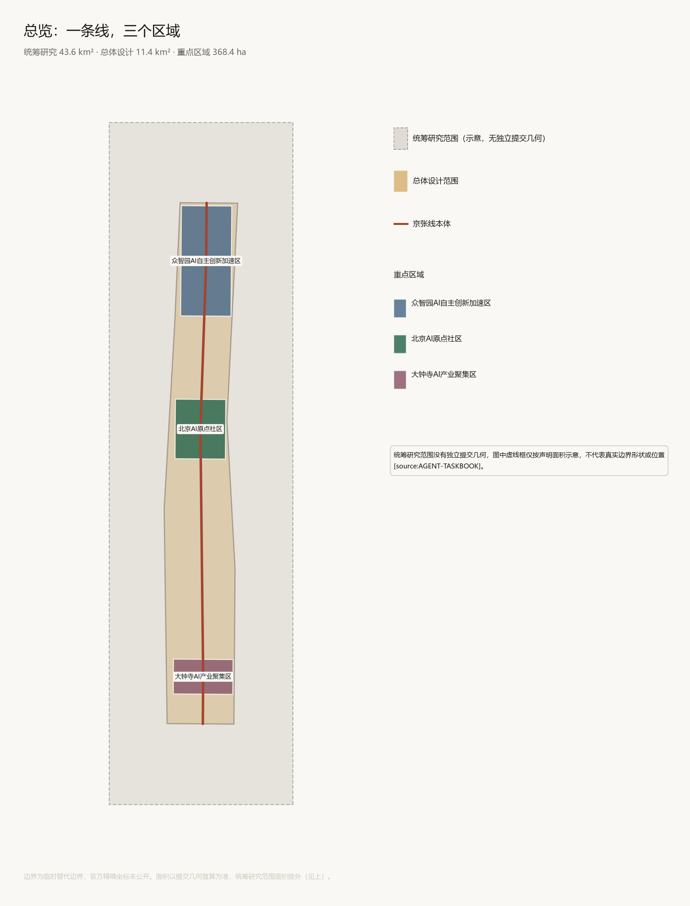
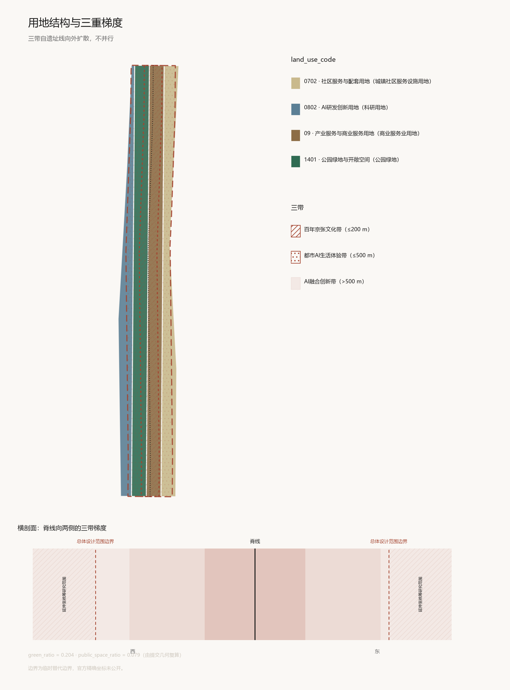
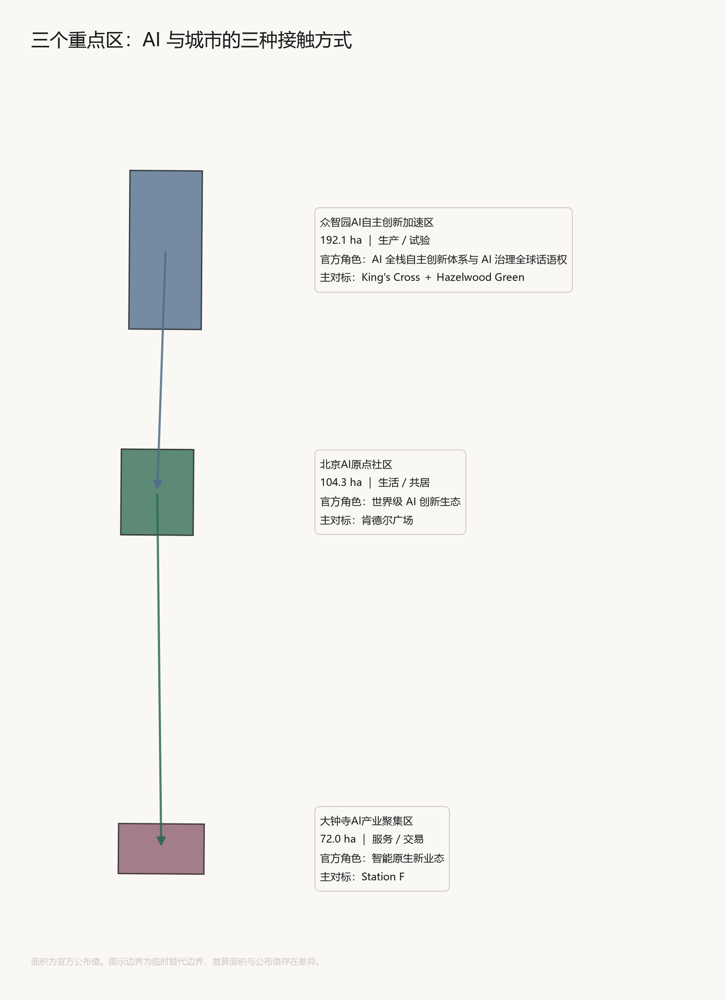
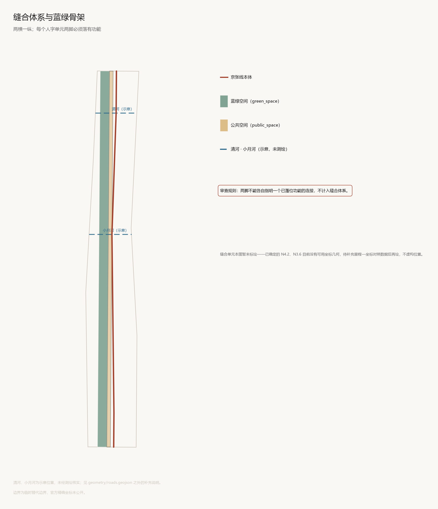
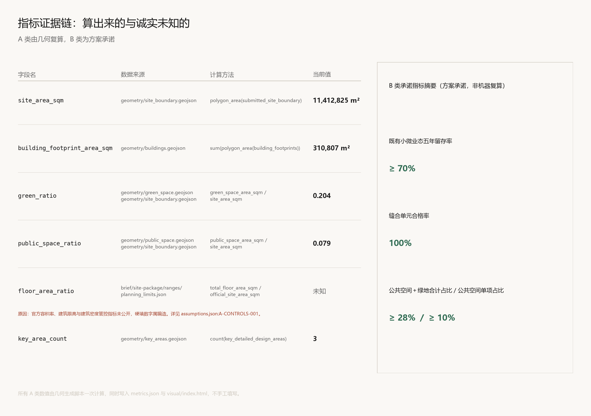

# 人字线 The Zigzag

## 设计依据与资料清单

本方案不是独立愿景文本。它从公告、面向智能体任务书与场地资料出发组织成果，并在判断旁边标注依据 [source:OFFICIAL-ANNOUNCEMENT] [source:AGENT-TASKBOOK] [depth:existing_conditions_diagnosis]。完整来源、标准覆盖与深度对照分别保存在 `sources.json`、`standard_matrix.json` 与 `design_depth_matrix.json`，正文不重复机器索引。

### 依据的三个层次

| 层次 | 内容 | 在本方案中的作用 |
|---|---|---|
| **任务依据** | 项目公告、面向智能体开源征集任务书 | 决定做什么、不做什么 [standard:PROJECT-OFFICIAL-ANNOUNCEMENT] |
| **法规与标准** | 城市设计管理办法、控规规范、国土空间用地分类指南、生成式人工智能服务管理暂行办法、无障碍环境建设法 | 约束成果形式与深度 [standard:MOHURD-URBAN-DESIGN-MEASURES] [standard:MOHURD-CONTROL-DETAILED-PLANNING] [standard:MNR-LAND-USE-CLASSIFICATION-GUIDE] |
| **场地资料** | 场地包、三层范围表、缺资料清单 | 提供空间与数量基础 [source:SITE-PACKAGE] [source:PROCESSED-FACT-PACK] |

### 关键资料的缺失与处置

本方案对资料缺口采取显式声明，不以估算填补 [depth:risk_missing_data] [data:geometry/constraints.geojson#CONSTRAINTS]：

| 缺失项 | 状态 | 本方案处置 |
|---|---|---|
| 官方精确边界坐标 | 未公开 | 使用场地包提供的临时替代边界，面积以提交几何复算为准 |
| 容积率、建筑限高、建筑密度 | 官方资料中为 missing | **`floor_area_ratio` 保持 unknown 并填写 reason**，不硬填数字 |
| 控规、道路红线、地块权属 | 缺失 | 更新项目清单只给规则与字段，不列具体地块 |
| 现状建筑、市政、文保详细条件 | 缺失 | 拆改留只给分类方法，不给单体结论 |
| 逐楼空置与租金数据 | 无 | 采用区域估算，并保留其估算性质的声明 |

**本方案的立场**：缺资料时，宁可写成待确认事项，不写成审定条件。任何缺少官方控规、权属、市政或文保条件的结论，都在正文中降级处理。

### 引用数据的性质声明

本方案引用的海淀分片区租金与空置率数据，为**区域估算，用于对比示意，非逐楼精确值**，来源为第一太平戴维斯、仲量联行、戴德梁行、高力国际的报告及安居客、搜狐租房行情。**此口径在全文中不升格为实测数据。**

本方案引用的创新生态主体与关系，为公开信息整理，性质是"现状产业分布与关系研究"，**不主张任何主体已签约、已入驻或承诺入驻**，不构成招商成果。



## 三层范围工作框架

三层范围不是三张比例尺不同的图。它们是三种不同的判断对象：统筹研究范围回答"这条带在区域中承担什么"，总体设计范围回答"这条带自己长成什么样"，重点区域回答"具体的地方怎么做"。本节确立贯穿三层的一个内核、一套空间单元和一条审查规则，后续各节分别在各自层级上展开 [source:OFFICIAL-ANNOUNCEMENT] [source:AGENT-TASKBOOK] [depth:three_level_scope_framework]。



### 1.1 命名与图形内核：人字线

1909 年，京张铁路建成。它的历史分量不在于"中国第一条铁路"——那不是事实——而在于它是中国人自主勘测、设计、施工的第一条干线铁路。在关沟段的陡坡面前，詹天佑没有采用当时通行的螺旋展线，而是用了折返方案：列车驶入岔道，换向，从另一侧继续爬升。轨迹在地图上形成一个「人」字。

一百年后，同一条线上，任务书的第一项功能要求是「AI 全栈自主创新体系」。

这两件事之间不是修辞上的呼应，而是同一个命题在同一条线上隔一百年出现了两次：当一项决定性技术被外部掌握时，一个国家如何在自己的土地上建立自主的技术体系。1909 年的答案是铁路，今天的答案是人工智能。**本方案的全部内容建立在这一句判断上** [standard:PROJECT-OFFICIAL-ANNOUNCEMENT]。

这条线索不是隐喻。清华园车站站房上的站名匾额，就是詹天佑本人题写的——自主的手迹至今仍在这条线上。

**「人」字同时在三个层面成立，且三层互不冲突：**

| 层 | 含义 | 来源 |
|---|---|---|
| 技术层 | 折返而上，以巧解难 | 人字形展线的工程原理 |
| 人本层 | 「人」的字形本身 | 城市设计的根本对象 |
| AI 层 | Human-in-the-loop，人在环中 | 人工智能治理的核心命题 |

第三层尤其关键。任务书要求"AI 治理全球话语权"，而当代 AI 治理最核心的技术共识，就是人必须留在决策回路中。「人字」在这里不是装饰，是一个立场声明：**这条创新带上发展的 AI，把人放在环里，不是环外。**

中英双语中都成立：中文是「人」字，英文是 The Zigzag——折返本身就是它的名字。

**图形逻辑分三层，不混淆。** 任务书禁止混淆文化标识系统与一带整体 Logo 系统，故：一带 Logo 为人字基本形，稳定不变；片区标识为三种开合角度变体（北宽、中平、南窄）；活动标识加季节色与年份，可年度迭代。人字形单笔可写，在图标、印章、路面嵌条等极小尺寸下仍可辨识；国际受众读作"折返"，中文受众同时读到"人"；折返角度本身是变量，可编码片区、年份或事件。

**命名体系采用里程制**——这是铁路自身的语言。清华园车站旧址设为「零公里」原点：它建于 1910 年，是出西直门站后向北的第一站，站名匾额由詹天佑题写；它位于 AI 原点社区范围内，与任务书给定的"原点"自洽；它是全线人才密度最高的位置。自零公里向南北计里程，节点按里程编号（人字 N2.4、S3.6 大钟寺台），导视系统即命名系统的物理呈现，两者不分设。

> **一处必须遵守的约束**：清华园车站旧址于 2012 年列入文物普查登记项目，2021 年列入北京市第一批革命文物名录，是中共中央抵京第一站。**其本体不得叠加任何新增纪念性内容。** 零公里在此仅作为里程计量基准，不构成对站房本体的任何物理干预。

### 1.2 与已建成一期的关系：本方案不主张原创

必须先说清一件事，否则后文全部失效。

京张铁路遗址公园一期已于 2023 年 6 月建成开放，占地 16.8 公顷，长约 2.5 公里。**"缝合"已经是这个项目的官方语言**——一期的公开表述即为"修建几条城市支路，疏通被铁路阻隔的交通，增加两侧居民的交流，缝合曾被切开的城市"，并将建设亮点概括为把原本封闭的空间"从城市背面转换为城市正面"。**"人字坡"也已被使用**——一期设有致敬人字坡的设计与纪念环丘，涉及京张铁路的元素设计达二十余处。

因此本方案不把"缝合"与"人字"作为原创主张提出。二者都是这条线上已有的共识与既成事实。

本方案主张的是被遗漏的那一环：

> 一期完成的是**通道层面**的缝合——打开围墙、增设支路、恢复道口。这是必要的。但首尔路 7017 的教训表明，通道层面的缝合并不足够：它建了十七条横向连接，仍因未接入产业与地方经济而被判失败。
>
> **本方案补上的是"功能落位"这一环**，即 1.3 节的人字缝合单元与其审查规则。人字在一期是一个致敬性的形式母题；在本方案中，它被转化为一个带强制约束的空间单元。

这一定位同时决定了本方案的态度：它是对已建成一期的接续与深化，不是另起炉灶。

### 1.3 三层范围与三重梯度

**三层范围**，总体范围见 [data:geometry/site_boundary.geojson#SITE-001] [metric:site_area_sqm]，三处重点区见 [data:geometry/key_areas.geojson#PROV-KEY-001] [metric:key_area_count]：

| 层级 | 面积 | 四至 | 本方案的判断对象 |
|---|---|---|---|
| 统筹研究范围 | 43.6 km² | 北五环—京藏高速—西直门外大街—万泉河路 | 这条带在区域创新体系中的位置与生态关系 |
| 总体设计范围 | 11.4 km² | 遗址公园两侧 1–2 km | 空间结构、更新框架、风貌与设施体系 |
| 重点区域 | 368.4 ha（三处） | 三个片区 | 用地、功能、建筑与实施 |

**三带不是三条平行线。** 任务书给出三带——百年京张文化带、都市 AI 生活体验带、AI 融合创新带。最常见的处理方式是在图上画三条平行带子。本方案认为这是错的：三带在现实中不并行，而是**从遗址线向外呈梯度扩散**。这不是形式选择，而是由现状决定的——遗产本体只有一条，紧贴它的是既有社区，再向外才是可承载产业规模的用地 [depth:overall_spatial_structure]。

| 带 | 空间范围 | 速度与时间尺度 | 主导内容 |
|---|---|---|---|
| 百年京张文化带 | 遗址线两侧各约 100–200 m | 慢速 · 百年尺度 | 遗产本体、叙事、碑刻、展陈 |
| 都市 AI 生活体验带 | 约 500 m（5–10 分钟步行圈） | 中速 · 日常尺度 | 社区、人才住房、公共服务、AI 生活场景 |
| AI 融合创新带 | 总体设计范围至统筹研究范围 | 快速 · 产业尺度 | 研发、中试、测试场、企业服务、资本 |

**三个重点区按 AI 与城市的三种接触方式划分**，而非按产业等级。这一划分同时对应从郊到城的区位梯度：

| 重点区 | 面积 | 定位 | 依据 |
|---|---|---|---|
| 众智园 AI 加速区（北，贴五环） | 192.1 ha | AI **生产／试验** | 面积最大、最外围、用地条件最松，可容纳算力设施、中试线与机器人测试场 |
| 北京 AI 原点社区（中，五道口） | 104.3 ha | AI **生活／共居** | 人才与院校密度最高，清华园车站在此，"原点"名实相符 |
| 大钟寺 AI 集聚区（南，最靠内城） | 72.0 ha | AI **服务／交易** | 面积最小、存量商业最重，宜做存量改造与企业服务、资本界面 |

生产—生活—服务，三段各有主业，由人字缝合单元连接，形成一条完整链条而非三个孤岛。

### 1.4 人字缝合单元与审查规则

**这是本方案最核心的设计工具。**

对标研究给出一条关键修正：横向缝合不等于多修几座桥。首尔路 7017 的设计初衷与本方案完全一致——重新连接被切断的城市轴线，且真的建了 17 条横向连接。它仍被判定失败，因为那些连接没有接入产业与地方经济。相反，伦敦 King's Cross 的建筑师用的词就是"把伦敦丢失的一块缝回城市肌理"，它成功的原因是 20 条新街道的两端都落有功能——学院、企业、住宅。

据此，「人」字不停留在 Logo 层面，它是本方案的**基本空间单元**：

| 构件 | 位置 | 必须落实的内容 |
|---|---|---|
| **顶点** | 京张遗址公园线上 | 一处横向穿越（地面、下穿或桥），并配置一个公共节点（站点、广场、碑或展陈） |
| **甲脚** | 遗址线一侧 | 一个明确功能落点 |
| **乙脚** | 遗址线另一侧 | 另一个明确功能落点，且与甲脚不同类 |

**两脚不预设方位。** 各脚落什么功能，由该处的实际毗邻条件决定——某处一侧是高校则落学院接口，另一侧是存量厂房则落孵化或测试；换一处则可能相反。可选的功能落点包括：学院接口、社区设施、人才住房、公共服务、企业服务点、孵化空间、测试场地、产业界面。

**不设全线统一的方位规则，是因为真实条件本来就逐处不同。** 审查规则只要求两脚各有一个已落位功能且互不同类，从不要求哪一侧必须是哪一类。

> **审查规则（写入本方案自检）**：任何一处横向连接，若两脚不能各自指明一个已落位的功能，则**不计入缝合体系，不得作为方案成果呈现**。
>
> 这条规则的作用，是防止本方案重蹈首尔路 7017 的覆辙。它也意味着本方案不会用"新增 X 处过街设施"作为交通成果的表述——过街设施的数量不是成果，两端有没有可去的地方才是。

**审查规则的空间化验收**：站在人字桥顶点，应能同时看见两脚各自的功能节点。看不见，该缝合单元即不成立。此项在设计阶段以图解核验，建成后以实测核验。

这条规则同时反向约束风貌：沿遗址线两侧若出现连续长面宽的建筑，横向视线被封死，验收标准无法成立。**因此体量管控在本方案中不是美学问题，是缝合能否成立的物理前提**（详见第 9 节）[depth:height_massing_character]。

**缝合体系的承诺指标**：合格单元 ≥8 处（9 km 线上平均约 1.1 km 一处，数量待用地数据校核）；合格率 100%——两脚未落实功能的连接一律不计入，不存在"部分合格"；顶点两端功能可视率 100%；横向连接平均间距 ≤1.2 km。

### 1.5 朝圣地标总览

任务书要求不少于 3 处朝圣地标；官方公告另要求景观节点聚焦遗址公园南端、北端及上跨环路。本方案设 **5 处**，前三处对应官方明确要求，后两处为本方案自主提出 [data:geometry/public_space.geojson#PUBLIC-001]。

| 节点 | 位置 | 对应要求 | 承担内容 |
|---|---|---|---|
| **展线台** | 大钟寺（南端） | 官方：南端 | 成果对外展示与交易界面；古钟与算力设施同为城市的"公共时间"装置 |
| **清河台** | 众智园（北端） | 官方：北端 | 北端起点标识；清河文化展示与眺望 |
| **上跨五环节点** | 五环路上跨处 | 官方：上跨环路 | 全线唯一面向车行速度的界面，折返形态立体装置 |
| **零公里节点** | 清华园车站旧址**外** | 本方案自主提出 | 里程原点；开源贡献碑刻体系 |
| **人字桥** | 跨学院路 | 本方案自主提出 | 缝合规则的样板与验收对象 |

**零公里节点的边界必须重申**：清华园车站站房是北京市第一批革命文物，本体不接受任何新增纪念性构筑。零公里标与开源贡献碑刻均设于站房**之外的相邻公共节点**，与站房保持视线关联但物理独立，形制低伏、不与站房争主次。站房本体维持其既有身份——詹天佑题写的匾额、1949 年的历史现场。**两种自主在此并置，但各自独立成立，互不覆盖。**

碑刻收录个人贡献者、智能体贡献者（须由具名人类提名）与开源项目三类，规则公开、名录由人类委员会审定、每年递增。它回应本次征集自身的性质：**这是一次由 AI 参与的城市设计征集，其成果应当在空间上留下痕迹。**

### 1.6 赛道声明

本方案声明三条赛道：

1. **`jingzhang-heritage-narrative`（京张遗产叙事）**——方案主线命题所在
2. **`ai-origin-community`（AI 原点社区）**——三段中承载"生活"一段，零公里所在
3. **`ai-traffic-walkability`（AI 交通与步行友好）**——对应人字缝合单元的横向连接体系

未选择但需说明：`robotics-autonomous-mobility` 与众智园定位高度相关，匹兹堡 Hazelwood Green 的经验直接适用。若评估认为"生产"一段分量应当加强，可用其替换第三条。

### 1.7 本节的证据边界

本节确立的是内核、单元与规则，不含任何工程结论。三层范围的边界解释可回到几何图层与面积复算；本方案不给出容积率、建筑高度、道路红线或工程实施结论——官方管控指标（容积率、限高、建筑密度）在公开资料中均为缺失，硬填属编造 [depth:risk_missing_data] [data:geometry/constraints.geojson#CONSTRAINTS]。

**缝合单元的具体数量与位置尚未确定**，需在拿到实际用地与现状建筑数据后落位。本节只确立规则，不预设结果。

缝合单元的里程编号与功能绑定已确定（如 N4.2 承担 S01 测试场），但其对应的精确坐标位置有待里程—坐标对照数据到位后确定。编号是设计意图，坐标是测绘结果，两者不可混为一谈。

## 统筹研究范围产业与未来城市研究

统筹研究范围 43.6 km² 的任务，是回答这条带在区域创新体系中承担什么，而不是画一张更大的总图 [source:AGENT-TASKBOOK] [standard:PROJECT-AGENT-OPEN-CALL-TASKBOOK]。本节由四部分组成：全球对标、生态图谱、三区两翼、未来城市形态。

### 3.1 全球对标：线性遗产 × 创新区

任务书要求 5–8 个全球 AI 创新生态案例。若只按"创新生态"选样，会漏掉本项目最特殊的条件——**它是一条线，而且这条线是一处遗产**。本方案的选样标准是两个条件的交集：线性基础设施遗产的再利用，且该遗产成为创新经济的空间载体。七个案例中五个直接由铁路或工业设施改造而来。

研究刻意保留失败案例与批评意见。**线性遗产改造在全球有一个高度稳定的失败模式，方案若不正面回应，即是回避真问题。**

| 案例 | 起点 | 空间动作 | 可迁移点 | 代价与批评 |
|---|---|---|---|---|
| **巴黎 Station F** | 1929 年奥斯特里茨铁路货运站，设计者为预应力混凝土发明人 Freyssinet，2012 年列为历史保护建筑 | 保留 310 m 连续拱顶，**不做绿廊，整体转为产业容器**，内分创造／分享／生活三段 | 技术遗产可直接承载新技术产业，不必先景观化；一个屋顶下集齐全链条降低创业者社交成本 | 被评为"创业文化的商场化"；规模带来的匿名性削弱小型社群 |
| **伦敦 King's Cross** | 67 英亩铁路场站废弃地 | 建筑师自述"把伦敦丢失的一块缝回城市肌理"；**40% 用地给公园街道与公共空间**，修复 20 栋历史建筑，新增 20 条街道 | **先文化锚点后科技巨头**——中央圣马丁先进驻，谷歌 Meta 后到；40% 可负担住房是制度性防线（注：该 40% 为公园、街道与公共空间合计口径，与本方案 public_space 单项口径不同，见 §11.3） | 可负担住房 40% 在"承诺"与"已建成"口径间有出入，本方案并列呈现不择一 |
| **巴塞罗那 22@** | 波布雷诺旧工业区，2000 年启动 | 用地重新分类，工业转知识密集产业 | 用地分类改革是启动器 | **最重的一课**：该计划在推进中伴随原有小型产业与居民置换的持续争议（具体数值因无可核查一手来源，已删除；见 §13.4） |
| **纽约 High Line** | 曼哈顿西侧废弃高架货运铁路 | 纯景观化，铁轨转高架花园 | 主要是**反向**的 | 联合创始人自承"我们本来是想为这个社区做的。最终，我们失败了" |
| **匹兹堡 Hazelwood Green** | 178 英亩原钢厂用地 | **在废弃钢骨架内部植入新建筑**；1887 年机车转盘车库改造为创新中心 | 工业骨架内嵌新建筑；**机器人测试场须在用地上预留**；研发中心内设永久历史展陈 | 住宅零售体育设施后期才补，"先产业后生活"的顺序问题 |
| **波士顿肯德尔广场** | MIT 东侧 | 极小半径内高强度混合 | **对 50 个创新区的研究显示 5–7 层是创新活动的最佳密度**——够密以聚人，又低到能产生人尺度互动 | 高成本挤出早期创业者，"成功者的诅咒" |
| **首尔路 7017** | 1970 年首尔站高架路，2017 年改造 | **明确以重新连接被切断的城市中心轴线为目标**，设 17 条横向步道 | 主要为**教训** | 学术评估指出文化活动季节性落差、与周边地方经济连接有限；已有拆除呼声 |

#### 三条横向结论

**结论一：成败取决于横向渗透率，不是纵向长度。**

| 案例 | 横向连接 | 功能性 | 结果 |
|---|---|---|---|
| High Line | 少 | 无 | 失败（创始人自承） |
| 首尔路 7017 | 多（17 条） | 弱 | 失败（呼吁拆除） |
| King's Cross | 多（20 条新街道） | 强 | 成功 |
| Station F | 不适用（单体） | 强 | 成功 |

**首尔路证明只有数量不够，High Line 证明只有长度更不够。** 这条结论直接产生了本方案第 2 节的审查规则。

**结论二：关键不是全产业链，是"从想法到投资"那一段的空间密度。** 决定创新发生率的是研究者、创业者与资本之间的步行距离，不是产业门类的完整度。两条推论：锚点排序为教育／文化 → 创业 → 巨头；建筑密度控制在能产生人尺度互动的区间。

**结论三：绅士化是默认结局，不是副作用。** 22@ 与 High Line 是两种路径下的同一结果。**没有任何一个案例是"因为设计得好，所以没有发生置换"**——只有制度性防线起作用。

#### 案例—片区映射

| 重点区 | 主对标 | 迁移的核心手法 |
|---|---|---|
| 众智园（北） | King's Cross + 匹兹堡 | 大规模场站用地整体开发；先文化后产业；预留机器人测试场 |
| AI 原点社区（中） | 肯德尔广场 | 密度阈值；研究—孵化—资本的空间压缩；步行距离优先 |
| 大钟寺（南） | Station F | 单体大跨存量整体转为产业容器 |
| 京张线本体 | 首尔路 7017（反向） | 每处横向连接两端必须落功能 |

### 3.2 AI 创新生态图谱：四流模型

任务书要求"AI 创新生态图谱"。生态最常见的画法是分层——基础研究、技术转化、产业应用、资本服务。问题在于**它描述静态构成，不是动态关系**，评审看不出这个生态怎么运转，也无法验证。

本方案改用**四流模型**：不画有什么，画什么在流动。

| 流 | 定义 | 海淀的典型路径 |
|---|---|---|
| **人流** | 毕业生进入企业、教授离职创业、大厂骨干出走创办新公司 | 清华 → 智谱；微软亚研 → 百度；百度 → 地平线 |
| **技术流** | 实验室成果工程化、开源模型被采用、衍生公司继承母体技术 | 中科院计算所 → 寒武纪；智源"悟道" → 面壁智能 |
| **物流** | 实体器件与算力沿"芯片→硬件→产品"链条流动 | 寒武纪 → 百度；兆易创新 → 地平线 |
| **现金流** | 政府引导基金、创投、大厂战投、园区产业投资 | 北京市 AI 基金 → 智谱；中关村发展集团 → 园区 |

节点覆盖高校（清华、北大、人大、北航、北理工、北邮、北师大）、院所（中科院自动化所、计算所、微电子所、智源研究院、清华智能产业研究院）、企业、芯片与资本五类。

**四流的价值在于可验证**——每条边都能追溯到公开可查的事件。分层画法做不到这一点。

#### 图谱推出的三条空间结论

**一、四流的空间半径不同，因此对空间的要求不同。** 人流半径最短，高度依赖物理邻近与非正式接触；技术流中等；**物流半径最长，芯片与算力可跨区域调配，不需要就近布置**；现金流亦长，但首次接触仍依赖面对面。

> **空间推论**：本带应优先保障人流的短半径（步行可达的混合布局），而非追求物流的本地闭环。**不必在带内自建完整芯片产业链。**

**二、算力宜接入而非自建。** 据公开信息，北京正在推进公共算力调度平台建设（B 级来源，见 §13.5）。**本方案不主张已获接入许可，也不主张该平台届时可供本带使用**；此处为机制建议，实际接入须另行确认。物流半径长意味着本带需要的是**算力接入点与调度界面**，不是每个片区自建机房。**这直接影响用地——避免为不必要的机房预留过多用地。**

**三、图谱中的断点即空间机会。** 四流中最脆弱的是**技术流到现金流的转换**——实验室成果到融资之间。肯德尔广场的经验正是把这一段的空间距离压到最短。大钟寺"一个屋顶下的全链条"就是针对这个断点的空间处置。

### 3.3 三区两翼

#### 中关村科技服务翼

要素全球化配置、中关村 IP 与资本赋能。空间落位对应大钟寺（服务／交易段）及其向中关村核心区的延伸，承载**现金流与技术流的交汇**。

任务书要求覆盖土地、空间、产业、资金、人才、算力、数据、场景八项机制：

| 要素 | 机制方向 | 空间载体 |
|---|---|---|
| 土地 | 存量更新为主，新增用地为辅 | 大钟寺存量商业 |
| 空间 | 可短租、可扩缩的弹性供给 | 一个屋顶下的全链条 |
| 产业 | 服务业态而非制造业态 | 大钟寺临街界面 |
| 资金 | 与既有引导基金和创投网络衔接，不新设 | 展线台 |
| 人才 | 四级转化路径：来访→驻留→注册→留存 | 见第 6 节 |
| 算力 | 接入公共算力调度平台，设接入点 | 大钟寺底层共享资源区 |
| 数据 | 数据要素流通的合规界面 | 算法诊室 |
| 场景 | 场景开放的申请—议决—复盘闭环 | 见第 6 节 |

> 本表只写机制方向与空间载体，**不涉及任何资金数额、政策承诺或企业名单**。

#### 小月河场景赋能翼

AI 场景赋能与智能化 AI 活力城市。小月河是官方公告明列的蓝绿空间之一，流经学院路高校带一侧。

**这里有一个被本地数据坐实的机会**：学院路高校带写字楼租金 165、空置 18%，而一路之隔的五道口租金 235、空置 6%。**小月河正处在这条落差带上。** 对应场景卡 S14–S16（见第 6 节）。

### 3.4 本地数据基准

| 片区 | 住宅租金 | 写字楼租金 | 空置率 |
|---|---|---|---|
| 西北旺·后厂村研发区 | 78 | 140 | **22%** |
| 上地·西二旗软件园 | 105 | 185 | 15% |
| 清河·永泰 | 85 | 135 | 20% |
| 颐和园路·北大·万柳 | 115 | 150 | 19% |
| **五道口·清华科技园** | 118 | 235 | **6%** |
| **学院路高校带** | 92 | 165 | **18%** |
| 中关村核心区 | 120 | 255 | 12% |
| 苏州街·海淀黄庄 | 112 | 240 | 14% |
| 中关村南·魏公村 | 90 | 160 | **19%** |

> **数据性质**：区域估算，用于对比示意，非逐楼精确值（来源见第 1 节）。
>
> **口径修正说明**：五道口空置率早期按"五道口大区"平均口径估为 13%，现按园区核心口径估为约 6%。差异源于口径范围不同——大区口径纳入了成府路沿线乙级楼宇、五道口商务区及新交付／改造中项目，园区核心口径不含。
>
> **本方案曾引用的清华科技园建筑面积与入驻率具体数值，因无法提供可审计一手来源，已从全文删除。** 该片区"接近满租"的判断改为基于本组区域估算的相对排序（全区最低空置率区段），**不承担绝对数值背书**。

**三条被数据坐实的判断：**

**一、大钟寺"存量改产业容器"有本地供给基础。** 中关村南 19%、后厂村 22% 的空置说明存量确实过剩，Station F 的做法不是硬套国外经验。

**二、人字桥落在学院路，是全线经济落差最大的一次缝合。** 租金相差 42%、空置相差三倍，这是"被割裂"最直接的量化证据。**人字桥不是选个好看的位置架桥——它架在全线价值梯度最陡处。**

**三、反置换指标有了本地锚点。** 如果缝合成功，学院路一侧租金将向五道口趋近，**挤出压力正来自这个方向**。租金上限机制要防的就是它——这不再是抽象担忧，是有梯度差可测算的具体风险。

### 3.5 适配 AI 新质生产力的未来城市形态

任务书要求提出"适配 AI 新质生产力的新型城市形态"。本方案的论证不来自形态想象，而来自 3.2 节的四流半径分析 [depth:overall_spatial_structure]。

**核心命题：AI 时代的城市形态特征，是"人的半径"与"物的半径"第一次显著分离。**

工业时代的城市形态由物流半径决定——工厂、仓储、码头、铁路共同锚定了人的位置。**AI 产业的物流（芯片与算力）可跨区域调配，人的协作却仍然依赖步行距离。** 这一分离带来三条形态推论：

| 推论 | 内容 | 与传统形态的差别 |
|---|---|---|
| **一、密度服务于协作，不服务于运输** | 建成区密度应按人的相遇频率组织，而非按货运效率组织 | 传统园区按物流组织，形成大街区、宽道路、低相遇率 |
| **二、"完整产业链就近布局"不再是必要条件** | 物流半径长意味着本地闭环不必要，土地应优先给人的活动 | 传统开发区追求产业链本地完整 |
| **三、可临时管控的公共空间成为生产要素** | AI 产业需要真实场景做测试，城市街道与河岸本身即生产资料 | 传统形态中公共空间只是消费与通行空间 |

**第三条是本方案形态观的核心。** 它意味着公共空间的设计标准要改变：不只考虑通行与休憩，还要考虑**可否临时封闭、可否被社区否决、可否复盘公开**。本方案的场景开放五步闭环（第 6 节）即为这一形态观的制度配套。

这一形态观同时解释了本方案为何把横向缝合置于纵向串联之上：**当生产要素是"人的相遇"时，被割裂的两侧就是被浪费的产能。** 学院路与五道口一路之隔却相差 42% 租金，正是这种浪费的价格体现。

### 3.6 区域协同：本带在"三城一区"中的接口

评审维度明列区域协同性。本节回答一个具体问题：**在北京已有的创新地理格局里，这条带承担什么、不承担什么。**

#### 3.6.1 已有格局与本带的位置

北京国际科技创新中心的主平台是"三城一区"，各自分工在官方表述中已经明确 [source:AGENT-TASKBOOK]：

| 平台 | 官方定位 | 与本带的关系 |
|---|---|---|
| **中关村科学城** | 聚焦重大原创成果和关键核心技术突破，发挥科技创新出发地、原始创新策源地和自主创新主阵地作用 | **本带在其范围内**，是中关村科学城的一个空间片段，不是并列平台 |
| **怀柔科学城** | 推进大科学装置和交叉研究平台，形成国家重大科技基础设施群，打造世界级原始创新承载区 | 提供本带不具备的重大装置能力 |
| **未来科学城** | 发力未来产业，推进"两谷一园"建设，打造全球领先的技术创新高地；地处中关村与怀柔的连接点，是枢纽型主平台 | 技术创新与成果承接的中间环节 |
| **北京经济技术开发区** | 承接转化三大科学城原创成果，夯实产业基础，作为产业创新体系的核心节点 | 本带产出的规模化制造与量产落点 |

> **首先要说清的判断**：本带不是第五个平台。它位于中关村科学城内部，是其中一条约 9 公里的线性空间。**区域协同对本带而言不是"与他者结盟"，而是"在既有分工里认清自己那一段"。**

#### 3.6.2 四流视角下的协同接口

第 3.2 节的四流模型在此有第二个用处——它能说清本带**输出什么、接收什么**：

| 流 | 本带的角色 | 协同对象 | 接口内容 |
|---|---|---|---|
| **人流** | **净输出与再循环** | 未来科学城、经开区 | 本带的人才密度最高（原点社区），但承载不了全部就业。研究者与创业者在此形成团队，规模化后向外迁移是正常的、也是应当被设计的 |
| **技术流** | **中转与验证** | 怀柔科学城（上游）、经开区（下游） | 怀柔的大科学装置产出基础成果，本带承担场景验证与中试（众智园），经开区承接量产 |
| **物流** | **不闭环，主动依赖外部** | 全域算力网络 | 算力接入北京公共算力调度平台，不在本带自建独立算力池（见 §3.2、§7.2） |
| **现金流** | **入口** | 京津冀创投网络 | 大钟寺服务段承担资本与创业者的接触界面（§5.5） |

**最重要的一条是人流那行。** 常规做法会把人才流出视为损失，本方案不这样看：**本带的空间条件（近乎满租、高租金、小地块）注定它适合"孵化"而非"承载"**。团队长大后迁往未来科学城或经开区，是分工的正常结果，不是失败。

**这一判断有空间后果**：本带不为规模化生产预留大面积用地，转而把土地用于提高人的相遇密度（§7.2）。

#### 3.6.3 与中关村 AI 北纬社区的关系

北纬社区是海淀已认定的 AI 承载空间，提供承载面积与租金政策。**本带与它是互补关系，不是竞争关系：**

| | 北纬社区 | 本带 |
|---|---|---|
| 提供 | 承载空间与政策优惠 | 场景、测试条件、公共界面 |
| 空间性质 | 集中承载 | 线性、分散、嵌入既有城市 |
| 对创业者的意义 | 落脚成本 | 验证机会 |

**接口设计**：本带的开发者转化路径（来访→驻留→注册→留存，§6.6）中，"注册"一级明确衔接北纬社区的既有承载与政策，**不在本带内另设一套优惠**。这既避免政策重复，也让本带专注于它真正稀缺的东西——场景与验证条件。

#### 3.6.4 京津冀层面

本带在京津冀协同中承担的是**规则输出**，不是产业转移承接。

依据是 §5.3 众智园的定位：一套"可被否决的测试"制度——场景开放五步闭环、社区否决权、否决记录公开。**这套规程一旦跑通，可被京津冀其他城市直接引用，而不必各自重新摸索。**

规则的可复制性高于产业的可转移性：产业转移受用地、成本、配套约束，规则输出只需要文本与实践记录。

#### 3.6.5 本节的边界

**以下内容均为空间与功能层面的协同设想，不构成任何已达成的合作安排。**

- 与怀柔、未来科学城、经开区的接口关系，为基于各自公开定位的推演，**未与任何一方接触或确认**
- 与北纬社区的政策衔接为机制建议，**不主张已获政策支持或已纳入任何计划**
- 本节引用的"三城一区"分工表述来自公开政策文件与官方发布，来源见 §13
- **本方案不主张任何机构、企业或平台已签约、已入驻或承诺参与**

## 总体设计范围城市更新与控规深度城市设计

总体设计范围 11.4 km² 的任务，是回答这条带自己长成什么样。本节按控制性详细规划的城市设计深度组织成果 [standard:MOHURD-CONTROL-DETAILED-PLANNING] [depth:overall_spatial_structure]，但对缺失的法定管控指标保持显式未知，不以估算填补。

### 4.1 总体空间结构：一纵、两横、三段、多单元

| 要素 | 内容 | 依据 |
|---|---|---|
| **一纵** | 京张遗址公园本体，全长约 9 km，是文化带与全部缝合单元的顶点所在 | [data:geometry/site_boundary.geojson#SITE-001] |
| **两横** | 清河（北）、小月河（中偏东），与遗址线垂直的蓝绿廊道 | 官方公告明列的蓝绿空间 |
| **三段** | 众智园（生产／试验）、AI 原点社区（生活／共居）、大钟寺（服务／交易） | [data:geometry/key_areas.geojson#PROV-KEY-001] [metric:key_area_count] |
| **多单元** | 沿线 ≥8 处人字缝合单元，把三重梯度横向串通 | 第 2 节审查规则 |

**结构的组织逻辑不是"轴+区"，是"线+缝"。** 一纵是被缝合的对象，不是发力点；两横是天然的横向基础——**水系的走向天然与铁路垂直**；三段是产业分工；缝合单元是把前三者连起来的操作单位。

### 4.2 城市更新总体框架

#### 更新潜力的判据：用空置率，不用目测

官方要求"科学分析更新潜力空间资源"。多数做法凭建成年代或建筑质量目测判断。本方案改用**空置率**作为主判据：空置率直接反映**市场已经用脚投票**的低效空间。一栋建成年代久但满租的楼，更新的社会成本远高于一栋新建但空置两成的楼。**更新应当去市场已经失效的地方，不是去看起来旧的地方。**

| 片区 | 空置率 | 更新潜力 |
|---|---|---|
| 西北旺·后厂村（近众智园） | 22% | **高**——新增供应过剩，宜调整功能而非再增供给 |
| 清河·永泰 | 20% | **高**——办公去化困难 |
| 中关村南·魏公村（近大钟寺） | 19% | **高**——老旧办公与住宅混合 |
| 学院路高校带（小月河） | 18% | **高**——乙级楼宇为主 |
| 上地·西二旗 | 15% | 低——去化稳定 |
| 中关村核心区 | 12% | 低 |
| **五道口·清华科技园** | **6%** | **最低——不是更新重点，是保护重点** |

> 数据为区域估算，非逐楼精确值（性质声明见第 1 节）。

**由此得出一条与直觉相反的结论**：AI 原点社区近乎满租，其策略应以"补缺"（人才住房、托育、夜间空间）为主，**不做大规模腾退**。

#### 更新强度：两头重，中间轻

| 段 | 强度 | 主导方式 |
|---|---|---|
| 北段·众智园 | **高** | 功能调整——办公供给已过剩，转向中试、测试与产业展示 |
| 中段·原点社区 | **低** | 补缺——近乎满租，补住房、托育、24 小时空间 |
| 南段·大钟寺、魏公村 | **高** | 存量改造——改产业容器与服务界面 |
| 沿线两侧低效空间 | 点状 | 见下 |

**这不是形式安排**：中段满租说明市场已经认可，强行更新是破坏；两头空置说明市场已经失效，更新才有意义。

#### 遗址公园两侧低效空间的更新路径

官方明确要求提出此路径。本方案与缝合单元绑定，分三步：**识别**（以遗址线为轴，两侧 500 m 内的空置、临时建筑、封闭围墙、消极后院建立台账）→ **配对**（每处就近归入一个缝合单元，明确承担该单元的哪一脚）→ **分级实施**：

| 级别 | 条件 | 措施 |
|---|---|---|
| 一级 | 位于缝合单元两脚，且现状空置 | 优先更新，落实功能落点 |
| 二级 | 位于两脚，但现状在用 | 界面开放为主，不动主体 |
| **三级** | **不在任何缝合单元范围** | **暂不更新** |

**第三级是本方案的自我克制**：不在缝合体系内的低效空间，即便看起来该改，也不列入本轮。资源有限，而两脚落实与否直接决定方案成败。

#### 校区、园区、街区的融合：不拆围墙，做界面转换

三者当前的隔离是真实的——学院路八校各自围墙封闭，清华科技园自成园区，五道口街区是市场自发形成的连接层。三者相邻却互不渗透。

| 类型 | 现状问题 | 融合手法 | 落点 |
|---|---|---|---|
| 校区 | 围墙封闭，仅门户可通 | 沿小月河设连续公共前厅，串联各校门户 | S15 |
| 园区 | 自成体系，与街区无交互 | 底层界面开放，共享资源前置到临街面 | S08 |
| 街区 | 自发形成，品质与配套不足 | 补公共客厅与低成本创业空间 | S06、S16 |

**统筹实施模式建议**：以人字缝合单元为最小实施单元，每个单元由"顶点所在的公共主体 + 两脚所在的产权主体"组成实施小组。**单元制的好处是它足够小，可以逐个推进，不必等全线条件成熟。**

### 4.3 职住商服均衡

| 段 | 当前失衡 | 更新方向 |
|---|---|---|
| 北段 | 职强住弱，办公过剩 | **减办公、增居住与配套**——22% 空置说明再增办公无意义 |
| 中段 | 职住皆强，服务与夜间配套弱 | 增人才住房、托育、24 小时空间 |
| 南段 | 商弱职弱，存量闲置 | 增服务业态与低成本创业空间 |

### 4.4 对海淀"1+X+1"产业体系的回应

- **前一个"1"（人工智能）**——三段全覆盖，众智园承担自主创新底座
- **"X"（AI+ 垂直应用）**——落在场景卡体系，17 张卡即为 X 的空间化
- **后一个"1"（科技服务业与生活服务业）**——落在大钟寺服务段与中关村科技服务翼

### 4.5 本节的深度边界

本节达到控规的城市设计深度，但**不给出容积率、建筑高度、道路红线或工程实施结论** [depth:risk_missing_data]。官方管控指标在公开资料中为缺失，硬填属编造；管控引导要求见第 9 节，那是官方公告明确要求的层级。

### 4.6 用户画像与场景卡体系
- 两条自律前置：场景须落到具体位置（片区/梯度带/人字单元）；场景须给出"人在环中"的否决权或裁量权落点
- 七类画像 P1–P7：在读研究者／早期创业者／机器人测试工程师／世居居民／企业服务与资本从业者／研学与遗产访客／受限使用者——每类含代表人群、活动范围、核心诉求、最怕的事
- 场景卡 S01–S13（原 13 张）+ S14–S16（小月河补充）+ 运营篇补充场景（公共空间服务机器人试运行）＝ 共 17 张；固定字段：位置/梯度带/主要人物/触发/AI 的角色/人在环中的落点/空间要求/可验证指标
- S11"站在桥上看见两端"为全套场景的验收样板
- 覆盖校核：按画像、按片区两张交叉表；已知缺口——P5（服务与资本）仅 2 张卡覆盖，密度低于其他画像

### 4.7 城市风貌
本小节内容与第九节《蓝绿空间、公共空间与城市风貌》同源重复，已合并到第九节，不在此重复正文：城市基调见 §9.2；管控引导要求表（高度／强度／风貌材料／屋顶形态／体量）见 §9.3；清河与小月河蓝绿骨架见 §9.1；北影等艺术资源利用见 §9.6。标志性城市景观节点清单见 §1.5《朝圣地标总览》，各节点的详细设计见 §4.10。

### 4.8 指标体系（B 类承诺指标集中呈现）
- A 类校验指标（6 项，写入 `metrics.json`，正文不重复数值，仅引用）：`site_area_sqm`／`building_footprint_area_sqm`／`green_ratio`／`public_space_ratio`／`floor_area_ratio`（**status=unknown**，官方管控指标未公开，见 `assumptions.json:A-CONTROLS-001`）／`key_area_count`（固定 3）
- B 类承诺指标五组（写入本节正文，作为公开承诺，非机器复算）：
  - 反置换组——小微业态五年留存率 ≥70%／人才可负担住房比例 ≥40%／租金年涨幅上限 ≤5%（概念参数，待校核）／公共空间与绿地合计占比 ≥28%／公共空间单项占比 ≥10%
  - 缝合组——合格单元数 ≥8 处／合格率 100%／顶点两端可视率 100%／横向连接平均间距 ≤1.2 km
  - 职住与密度组——步行至实验室中位时长 ≤15 分钟／建筑层数 5–7 层为主／15 分钟等时圈研发工位覆盖率 ≥60%／步行三角最长边 ≤800 m
  - 生态与运营组——同屋顶机构类型数 ≥5 类／年度开放天数 ≥100 天／活动季节均衡度 ≥0.6／零公里年度新增收录 ≥20 条
  - 人在环中组——场景卡标明否决权比例 100%／AI 应用参数公开可查比例 100%／社区否决记录公开率 100%
- 每组指标注明依据（对标案例或方案自设）与本地校核状态，不隐藏"多数目标值缺本地基准"的证据薄弱处

### 4.9 一带运营机制（对应 agent.6）
- 两条前置纪律：不新造体系，接入中关村论坛/AI 原点社区既有政策/公共算力调度平台等既有机制；全文为运营机制建议，不写已定安排、不写数额
- 年度活动体系：四季结构（春-开放周/夏-开源季/秋-场景开放季/冬-零公里收录）+ 常态化周节奏
- 品牌与传播视觉三层体系：一带 Logo（稳定）／片区标识（三种开合角度变体）／活动标识（可年更）
- 开发者社区四级转化路径：来访→驻留→注册→留存，各级门槛/提供/转化机制；算力配额接入公共调度平台
- AI 场景开放五步闭环：申请→初审→社区议决（否决权）→执行→复盘公开；三类测试验证场景（对应 S01/S03/公共空间服务机器人补充场景）
- 公共体验与地标运营：三处地标各自运营主体与开放模式；荣誉展示体系（个人贡献者/智能体贡献者/开源项目，名录由人类委员会审定）
- 国际传播与招引：以中关村论坛为主锚点，不另建独立国际品牌；四级漏斗（认知/接触/落地/扎根）
- 三条禁止事项自我约束：不写投资额/企业名单/财政承诺；不把设想写成已定；不夸大政府承诺

### 4.10 朝圣地标详细设计
> 五处标志性节点中，零公里节点、人字桥、清河台、上跨五环节点均不落在任一重点区范围内（只有展线台在大钟寺内），归入第五节"重点区域详细设计"会与其范围定义相互矛盾；作为总体设计范围层面的贯穿性内容，归入本节更准确。
- 零公里节点：碑刻体系位置与形制（站房外、物理独立、视线关联）；与革命文物本体的边界（不得叠加新增纪念性构筑）
- 人字桥（跨学院路）：验收样板 S11 的空间化表达——桥面视线设计须使站在顶点可同时看见两脚功能
- 展线台（大钟寺）：人字形展线剖面逻辑的立体公共平台；"公共时间装置"叙事（古钟与算力设施对照）；与第五节 §5.5 大钟寺详细设计相互引用
- 节点（概念阶段，可行性待评估）：北端"清河台"、上跨五环节点

### 4.11 场景—空间—运营映射
> 映射对象是全部 17 张场景卡，覆盖三个重点区之外的文化带/线上场景（S11–S13）与小月河（S14–S16），不是单一重点区的内容，归入本节的场景卡体系（§4.6）与运营机制（§4.9）之间更贴合。
- 映射规则：场景卡 → 空间落位（片区/梯度带/人字单元）→ 运营主体类型 → 季节归属
- 示例：S01 城市街道测试 → 众智园人字 N4.2 一脚 → 片区运营方＋社区议事会 → 秋季"场景开放季"
- 该映射保证每张场景卡"有地方、有人管、有时间"，不悬空；第五节 §5.3–5.5 对各重点区场景的引用均以此映射为准

## 重点区域详细设计

三个重点区共 368.4 ha [data:geometry/key_areas.geojson#PROV-KEY-001] [metric:key_area_count] [depth:key_area_detailed_design]。本节按官方给定的角色分工组织，不自行改写定位。



> 朝圣地标详细设计与场景—空间—运营映射已移至第四节 §4.10、§4.11（理由见各节说明），本节只保留三个重点区自身的角色对应、定位落实与空间结构。

### 5.1 本节的深度边界

任务书禁止给出容积率、建筑高度、具体拆改留、道路红线或工程实施结论。**本节的合理深度是各片区的定位落实、空间结构、功能落点与缝合单元配置，不是详细图则。**

缺权属、现状建筑与控规数据的条件下，本节给出的是**配置规则与判定方法**；真实几何与权属数据到位后，按同一规则补入具体位置与数量，不需改写结构。

### 5.2 官方角色与本方案分工的对应

官方为三区两翼各自指定了角色。本方案的"生产／生活／服务"三段分工是**空间接触方式**的划分，与官方的**功能角色**是两个维度，须显式对应：

| 片区 | 官方角色 | 本方案分工 | 对应关系 |
|---|---|---|---|
| **众智园** | AI 全栈自主创新体系与 **AI 治理全球话语权** | 生产／试验 | 生产与试验是全栈自主的空间形态；**治理话语权由"可被否决的测试"这一实践产生**（见 5.3） |
| **AI 原点社区** | 世界级 AI 创新生态 | 生活／共居 | **生态的密度来自人的密度**——以东升大厦为中心一公里圈内集聚了三十余所高校院所与大量 AI 研究者、开发者与在读学子；生活条件即生态条件 |
| **大钟寺** | 智能原生新业态 | 服务／交易 | 新业态需要低门槛的存量空间与全链条邻近，服务与交易是其空间前提 |

**这一对应必须写明**，否则本方案的三段式会被读成对官方定位的改写。它不是改写，是把功能角色翻译成空间操作。

### 5.3 众智园 AI 自主创新加速区（192.1 ha）

**官方角色**：AI 全栈自主创新体系与 AI 治理全球话语权
**空间条件**：面积最大、最外围、贴五环，用地条件最松；毗邻清河；空置率高（周边片区 20–22%），办公新增供应已过剩

#### 定位落实

| 维度 | 内容 |
|---|---|
| 主导功能 | 中试线、机器人测试场、产业展示、检验检测 |
| 更新方式 | **功能调整为主**——办公供给已过剩，不再增办公，转向中试、测试与展示 |
| 职住调整 | **减办公、增居住与配套**（周边空置 22%，再增办公无意义） |
| 主对标 | King's Cross（大规模场站用地整体开发、先文化后产业）＋ 匹兹堡 Hazelwood Green（工业骨架内嵌新建筑、测试场地预留） |

#### 治理话语权的空间落实

**这是本片区最需要说清的一条。** "AI 治理全球话语权"不产生于宣言，产生于可被引用的实践。本方案的主张是：**在这里建立一套"可被否决的测试"制度，并把否决记录公开。**

| 要素 | 内容 | 对应 |
|---|---|---|
| **可被否决的测试** | 场景开放五步闭环，社区对时段与路段有否决权，否决须书面说明理由 | 第 6.5 节；S01 |
| **记录公开** | 接管率、投诉、否决记录一并公开 | S01 指标 |
| **人在环中** | 每次测试须有随行操作员可随时接管 | 内核声明，第 2.1 节 |
| **标准产出** | 由上述实践沉淀为可对外发布的测试与治理规程 | 本片区的话语权来源 |

> **一个国家的 AI 治理话语权，来自它能不能拿出一套被实践检验过、且允许公众说不的规则。** 本片区的产出不只是技术，也是这套规则本身。

#### 空间结构

- **纵向**：京张线北段，串联清河台（北端地标）至原点社区
- **横向**：清河为主要横向廊道，与京张线垂直，天然构成缝合基础
- **缝合单元**：本片区为全线用地条件最松处，应配置最多缝合单元；已确定 N4.2（S01 测试场一脚）、N3.6（S02 余热接入）
- **测试场地**：须在用地上明确预留，包括封闭测试区与可临时管控的城市支路两类（后者见第 8.2 节支路加密的第二重用途）
- **算力**：设算力接入点与调度界面，**建议不自建独立算力池**（依据见 §3.2；接入可行性待确认）

#### 清河文化

官方要求挖掘与展示清河文化。清河台（北端地标）承担展示与眺望；清河沿岸作为横向廊道，其文化叙事与京张线的"两次自主"主线并置而非从属——**一条是水的历史，一条是铁路的历史，在此交汇。**

### 5.4 北京 AI 原点社区（104.3 ha）

**官方角色**：世界级 AI 创新生态
**空间条件**：人才与院校密度最高；清华园车站在此；**空置率仅 6%，近乎满租**

#### 定位落实：这里不是更新重点，是保护重点

**这是本方案对三个片区中唯一的"反向"判断。**

五道口·清华科技园在本组区域估算中是全区空置率最低的区段（约 6%）。**若该相对排序成立，则市场已经充分认可这个地方，强行大规模更新是破坏而非改善。**（该估算为 B 级来源，见 §13.3；判断依据是相对排序，不是绝对数值。）

| 维度 | 内容 |
|---|---|
| 更新强度 | **低**——全线三段中最低 |
| 更新方式 | **补缺**，不做大规模腾退 |
| 补什么 | 人才住房、托育、24 小时空间、社区食堂 |
| 主对标 | 肯德尔广场（研究—孵化—资本的空间压缩；步行距离优先） |

#### 生态的空间条件：步行距离

世界级创新生态的密度不来自政策，来自**研究者、创业者与资本之间的步行距离**。本片区的核心任务因此是保障可达性，而非增加建设量：

| 指标 | 目标 | 对应场景 |
|---|---|---|
| 人才住房至实验室中位步行时长 | ≤ 15 分钟 | S04 |
| 15 分钟等时圈覆盖研发工位占比 | ≥ 60% | S04 |
| 托育—住房—实验室步行三角最长边 | ≤ 800 m | S07 |

**注意这三条都是"时距"不是"半径"**——几何半径不考虑围墙与铁路阻隔，在被切开的场地上会系统性高估可达性（见第 8.4 节）。

#### 空间结构

- **零公里**：清华园车站旧址为全线里程原点。**站房本体为北京市第一批革命文物，不叠加任何新增纪念性构筑**；零公里标与开源贡献碑刻设于站房之外相邻公共节点
- **缝合单元**：S0.4 与 N0.8 之间为人才住房与实验室的主要联系区段
- **夜间**：24 小时研究者共享空间集中布置于远离住宅一侧，噪声阈值由居民会议设定（S05）
- **校园界面**：不拆围墙，做界面转换（见第 4.2 节）

### 5.5 大钟寺 AI 产业集聚区（72.0 ha）

**官方角色**：智能原生新业态
**空间条件**：面积最小、最靠内城；存量商业最重；周边空置率 19%

#### 定位落实

| 维度 | 内容 |
|---|---|
| 主导功能 | 企业服务、资本界面、孵化、智能原生消费与商务场景 |
| 更新方式 | **存量改造为主**——空置 19% 说明存量确实过剩，改造有供给基础 |
| 新增控制 | 新增建筑面积应低于拆除面积 |
| 主对标 | Station F（大跨存量整体转为产业容器；一个屋顶下集齐全链条） |

#### 智能原生新业态的空间前提

"智能原生"业态的共同特征是**初期规模小、变化快、对空间的确定性要求低但对邻近性要求高**。因此空间前提有三：

**一、可短租、可扩缩的弹性供给。** 固定分割的写字楼不适配，需要可重组的大空间。

**二、全链条在一个屋顶下。** 创业者与投资人若只能靠预约见面，偶遇结构不会发生（S08）。同一屋顶下的机构类型 ≥5 类（研发／孵化／资本／服务／测试）。

**三、临街可步入。** 算法诊室须临街、不设门禁（S09）——**中小企业主不会走进写字楼预约，但会走进一间开着门的屋子。**

#### 存量改造的手法

参照 Station F：保留大跨结构，**不做景观化，整体转为产业容器**，内部按创造／分享／生活三段划分，共享算力与测试资源置于底层。

参照匹兹堡 Mill 19：**结构与外壳尽量保留，内部植入新建筑**，工业骨架作为形式与记忆载体。

#### 反置换：本片区是主战场

**大钟寺存量商业最重，既有小微业态最密集，因此是反置换机制的主要落点。**

| 措施 | 内容 |
|---|---|
| 保留区 | 存量改造中划定小微业态保留区 |
| 租金 | 保留区商户租金年涨幅设上限 |
| 决策 | 留改决策委员会须含既有经营者代表，不由开发主体单方决定 |
| 过渡 | 改造期间提供过渡经营空间 |
| 指标 | **既有小微业态五年留存率 ≥70%**——本方案核心反置换承诺 |

> 22@ 的教训在此最直接：**知识经济区的成功建设，可以与原有小微产业的大规模置换同时发生。** 本片区若重蹈此辙，方案按其自身标准即为失败。

#### 空间结构

- **展线台**：南端地标，面向内城；日间公共，晚间可租作发布场地
- **古钟与算力**：大钟寺的钟是古代计时与报时的公共基础设施，与当代算力设施构成一组对照——**两者都是城市的"公共时间"装置**。此为本片区的叙事内核
- **缝合单元**：南段用地紧凑，缝合单元间距应小于全线平均

### 5.6 两翼在重点区中的落位

| 翼 | 落位 | 内容 |
|---|---|---|
| **中关村科技服务翼** | 大钟寺及其向中关村核心区延伸 | 八项要素机制（见第 3.3 节）；承载现金流与技术流的交汇 |
| **小月河场景赋能翼** | 原点社区东侧至学院路高校带 | S14–S16；公共体验路径串联八校门户 |

**小月河翼横跨原点社区与学院路带**，是三个重点区之外唯一被任务书点名的空间要素，其价值在于它处在全线经济落差最陡处（学院路 165 元／18% 空置 vs 五道口 235 元／6% 空置）。

### 5.7 三片区的缝合单元配置原则

| 片区 | 用地条件 | 配置原则 |
|---|---|---|
| 众智园 | 最松，地块大 | 单元数最多；可结合更新地块新设支路形成顶点 |
| 原点社区 | 最紧，近乎满租 | 单元数少而精；优先利用既有轨道站点作为顶点（站厅层天然具备横向穿越能力） |
| 大钟寺 | 建成度高 | 间距小于全线平均；优先利用存量改造机会创造两脚功能 |

**全线合格单元 ≥8 处，合格率 100%。** 具体位置待用地数据到位后按上述原则落位。

### 5.8 本节未解决的问题

1. **缝合单元的具体位置与数量未定**——需实际用地与现状建筑数据，本节只给配置原则。缝合单元的里程编号与功能绑定已确定（如 N4.2 承担 S01 测试场），但其对应的精确坐标位置有待里程—坐标对照数据到位后确定。编号是设计意图，坐标是测绘结果，两者不可混为一谈。
2. **测试场地的具体用地未落位**——众智园需明确预留，但缺权属数据无法指认地块。
3. **零公里节点在站房外的具体落位未定**——需现场核实可用空间与文物保护范围线。
4. **大钟寺存量建筑的可改造性未评估**——大跨结构是否实际存在、结构条件是否允许，未经现场核实。Station F 的手法能否适用取决于此。
5. **小月河现状条件未实地核实**——河道断面、两岸可用宽度、慢行贯通情况均未掌握。
6. **各片区建筑规模未给数字**，仅给约束方向（见第 7.3 节）。

## AI 创新生态、人才画像与 AI+ 场景

本节是本方案的立场落地处。任务书要求不少于 10 张 AI 场景卡、不少于 3 个产业测试验证场景、不少于 5 类用户画像，以及场景—空间—运营映射，并重点回应小月河场景赋能翼与公共体验路径 [source:AGENT-TASKBOOK] [standard:PROJECT-AGENT-OPEN-CALL-TASKBOOK]。本方案提供 **7 类画像、17 张场景卡、3 类测试验证场景**，并对全部场景执行两条自律。

### 6.1 两条自律

**一、每张场景卡必须落到具体位置。** 不接受"在创新带上"这样的描述——必须指明片区、所属梯度带，以及（若涉及横向连接）具体的人字缝合单元。悬空的场景不计入成果 [data:geometry/public_space.geojson#PUBLIC-001] [data:geometry/roads.geojson#ROAD-001]。

**二、每张场景卡必须给出人在环中的落点。** 本方案的内核声明是"这条创新带上发展的 AI，把人放在环里"。**如果一个场景里 AI 全自动运行、人只是被服务的对象，那它与本方案的立场矛盾，不予收录。** 每张卡必须回答：这里的人在哪个环节拥有否决权或裁量权。

第二条有代价——它逼迫每张卡回答一个额外的问题。但内核若在场景层面做不到，那句声明就是空的。**"把人放在环里"若不落成可核查的条款，就只是一句话。**

### 6.2 七类用户画像

| 画像 | 代表人群 | 活动范围 | 核心诉求 | 最怕的事 |
|---|---|---|---|---|
| **P1 在读研究者** | 清华、北大、北航、北邮、北科大等院校硕博生与博士后 | 原点社区（生活带），部分延伸至众智园 | 实验室与住处步行可达；深夜可用空间；跨校交流的低门槛场所 | 被迫搬远处租房，通勤吃掉研究时间 |
| **P2 早期创业者** | 刚出实验室或大厂，团队 3–15 人，未完成首轮融资 | 大钟寺与原点社区之间 | 与投资人、企业客户物理接近；共享算力与测试资源 | 租金上涨快于融资速度——肯德尔广场"成功者的诅咒"的本地版 |
| **P3 机器人测试工程师** | 自主移动、具身智能企业的测试与工程人员 | 众智园（创新带） | 真实道路条件的测试场地；场地预约的确定性 | 场地被临时占用，或因扰民投诉无限期暂停 |
| **P4 世居居民** | 铁路沿线原有社区居民，含原铁路系统职工及家属 | 文化带与生活带，日常活动即在遗址公园内 | 不被置换；公园继续是"自家门口的公园" | 22@ 与 High Line 在此重演——生活成本上升，熟悉的小店消失 |
| **P5 服务与资本从业者** | 投资机构、法务财税、算法咨询、知识产权服务 | 大钟寺（服务带） | 与创业者的偶遇结构；正式与非正式会谈的层次 | 与创业者物理隔离，只能靠预约见面 |
| **P6 研学与遗产访客** | 中小学研学团队、铁路与工程史爱好者、专业参访者 | 文化带全线，重点在清华园车站旧址 | 理解"1909 年的自主"与"今天的自主"之间关系的完整线索 | 只看到一座修好的老站房，看不懂它和旁边实验室的关系 |
| **P7 受限使用者** | 行动、视觉、听觉、认知受限者；高龄者；不使用智能终端者 | 全线，尤以文化带与生活带日常使用为主 | 连续可达的路径；不依赖智能终端的服务通道；紧急时能找到人 | 空间与服务同时"智能化"，把自己排除在外——设施建了但走不到，服务有了但用不了 |

> **本方案对 P4 的立场**：对标研究的结论是，没有任何一个案例靠"设计得好"避免了置换，只有制度性防线起作用。**P4 不是需要被安抚的对象，是方案成败的判据。**

> **本方案对 P7 的立场**：无障碍环境建设法是本方案的依据之一（见 §1），但引用法律不等于落实法律。**一个以 AI 为主题的创新带，最容易犯的错误是把"智能"当成唯一的服务方式。** P7 的存在是为了在每一处场景里追问同一个问题：不使用智能终端的人，在这里还能不能完成同样的事。

### 6.3 十七张场景卡

字段固定：位置／梯度带／人物／触发／AI 的角色／**人在环中**／空间要求／可验证指标。

#### 众智园 · 生产与试验

**S01 城市街道作为测试场**｜人字 N4.2 一脚｜创新带｜P3、P4
自主移动设备需要真实道路条件，封闭场地无法提供。AI 在划定时段与路段内自主移动测试并记录接管事件。**人在环中：测试时段与路段由社区议事程序批准，居民对时段安排拥有否决权**；每次测试须有随行操作员可随时接管。空间要求：一段可临时管控的城市支路（非主干道），相邻设观察点与说明牌，边界清晰可快速恢复常态。指标：年度测试时段总量；居民否决次数与理由（公开）；人工接管率。

**S02 算力设施的余热去处**｜人字 N3.6｜创新带（源）→生活带（用）｜P4、P3
若本带内布局算力设施，其余热不加利用即构成浪费与热岛。**本方案不主张算力设施必然落位于本带**——是否布局、布局何处，取决于算力网络的整体安排（见 §3.2）。本场景为条件式设想：仅在算力设施实际落位的前提下成立。AI 负责负荷预测与热量调度。**人在环中：供热优先级由社区与运营方共同约定，冬季民生用热优先于算力扩容**，调度参数公开可查。空间要求：算力设施与生活带之间的管廊路由；末端换热站结合社区服务设施设置。指标：年度回收热量；覆盖户数；民生优先条款执行记录。

> 这不是技术条款，是立场条款。**当算力与民生争夺同一份能源时，本方案明确站在民生一侧。**

**S03 半开放中试车间**｜众智园沿街界面｜创新带｜P3、P6、P1
中试环节通常完全封闭，公众与学生无从理解产业实况。**人在环中：面向公众的可视化界面须由工程师人工审核后发布，不自动直播。** 空间要求：沿街面设观察廊与玻璃界面；参观动线与生产动线物理分离。指标：年度开放时长；接待研学人次；企业参与家数。

#### AI 原点社区 · 生活与共居

**S04 十五分钟：从实验室到住处**｜人字 S0.4 与 N0.8 之间｜生活带｜P1
研究时间被通勤吞噬，是本地人才流失的首要原因。**AI 的角色：无——本场景刻意不引入 AI。本方案主张并非所有场景都需要 AI，通勤是空间问题。** 空间要求：人才住房布局于实验室步行 15 分钟等时圈内；沿途连续遮蔽与夜间照明。指标：人才住房中位通勤步行时长；15 分钟等时圈覆盖的实验室工位数。

**S05 深夜的原点社区**｜零公里节点周边｜生活带／文化带交界｜P1、P4
研究者深夜活跃与居民夜间安宁之间存在真实冲突。AI 负责夜间照明与噪声的分区调节。**人在环中：噪声阈值由居民会议设定，非算法自选**；越限时系统提示而非强制处置。空间要求：24 小时研究者共享空间集中布置于远离住宅一侧；夜间动线与住宅区错开。指标：夜间投诉数量；24 小时空间实际使用时段分布。

**S06 学院路的公共客厅**｜人字桥面向学院路一脚｜生活带｜P1、P2
学院路沿线八所高校毗邻却缺少共用的非正式交流场所。**AI 的角色：无——场所本身是目的。** 空间要求：**人字桥面向学院路的一脚必须落有此功能——这是缝合审查规则的直接应用**；开放至深夜；无消费门槛。指标：使用者所属院校数量分布；非本校使用者占比。

**S07 双职工研究者的托育**｜原点社区｜生活带｜P1、P4
博士后与青年教师的育儿期与科研产出高峰重叠。AI 处理排班与接送时段协调。**人在环中：所有涉及儿童的判断由人工作出，AI 仅处理排班**；家长可随时退出自动排班。空间要求：托育、人才住房、实验室构成步行三角。指标：覆盖学龄前儿童数；步行三角最长边长度。

#### 大钟寺 · 服务与交易

**S08 一个屋顶下的全链条**｜大钟寺｜创新带（服务段）｜P2、P5
创业者与投资人若只能靠预约见面，偶遇结构不会发生。AI 提供资源与需求的匹配提示。**人在环中：匹配结果仅作提示，不代替判断；不做排序推荐，避免形成隐性筛选。** 空间要求：存量大跨商业空间整体转为产业容器（对标 Station F 的 310 米拱顶大厅），内部按创造／分享／生活三段划分，共享算力与测试资源置于底层。指标：同一屋顶下机构类型数；创业者与投资人日均非正式接触次数。

**S09 算法诊室**｜大钟寺临街界面｜创新带（服务段）｜P5、周边中小企业主
中小企业有 AI 需求但无判断能力，易被过度销售。AI 做需求初筛与方案初拟。**人在环中：最终建议必须由具名的人类顾问签署；AI 不得直接向企业出具方案。** 空间要求：临街可步入，非写字楼内部；小尺度会谈间；不设门禁。指标：年度服务企业数；建议采纳后企业留存率。

**S10 老商户不搬走**｜大钟寺｜生活带／创新带交界｜P4、既有小微业态经营者
22@ 的直接教训：该计划在推进中伴随原有小微产业被置换的持续争议（见 §13.4，本方案不引用其量化数值）。**AI 的角色：无。人在环中：留改决策由包含既有经营者的委员会作出，不由开发主体单方决定。** 空间要求：存量改造中划定**小微业态保留区**，租金调整设上限；改造期间提供过渡经营空间。指标：**既有小微业态五年留存率（本方案核心反置换指标）**；租金年涨幅上限执行情况。

#### 小月河场景赋能翼

**S14 河岸即测试场**｜小月河沿岸，学院路一侧｜生活带（蓝绿廊道）｜P3、P1、P4
服务机器人与配送设备需要连续、低车流、真实人流的测试环境，河岸慢行道正合适。**人在环中：沿岸社区对时段与河段有否决权；晨练与放学高峰时段默认禁行，非申请可解。** 空间要求：河岸慢行道分设人行与设备通行区；节点处设避让空间；接入邻近人字缝合单元的一脚。指标：年度测试时长；人机冲突事件数；社区否决记录（公开）。

**S15 校门口的公共体验路径**｜小月河至学院路高校群之间｜生活带｜P1、P6、P4
任务书明确要求"公共体验路径"；八校毗邻却各自封闭，河道成为共用的公共前厅。AI 提供多语种导览与实时可达信息。**人在环中：路径沿线展示内容由各校师生共同议定，非平台自动推送。** 空间要求：连续贯通的滨河步道串联各校门户；沿线设小型展示与休憩节点；夜间照明保证可用性。指标：路径连续贯通率；串联校门数量；夜间使用时段占比。

**S16 蓝绿带的低成本创业界面**｜小月河沿岸低效存量空间｜生活带／创新带交界｜P2、P4
学院路带空置率 18%，存量空间过剩，而创业者最缺低成本落脚点。**AI 的角色：无。人在环中：存量空间的留改决策含既有经营者代表。** 空间要求：低效存量改造为小尺度创业空间；沿河界面开放；不设整体拆除。指标：改造后空置率；既有经营者留存率；创业主体存续率。

#### 线上 · 文化带与缝合

**S11 站在桥上看见两端**｜人字桥｜文化带（顶点）→生活带＋创新带｜全部画像
缝合是否成立，需要一个可被日常验证的场景。**AI 的角色：无。** 空间要求：桥面视线设计须使人站在顶点即可同时看见两脚各自的功能节点（一脚为面向学院路的公共客厅，另一脚为企业服务节点）——**这是审查规则的空间化表达**。指标：桥面日均通过人次；两端功能节点可视性核验（设计阶段图解＋建成后实测）。

> **本卡是全套场景的验收样板。若站在桥上看不见两端的功能，则该缝合单元不成立。**

**S12 零公里的年度更新**｜清华园车站旧址**外**相邻公共节点｜文化带｜P6、P1、公众
本次开源征集本身即是一种新的城市生产方式，应留下持续的空间痕迹。**人在环中：收录名录由人类委员会审定，AI 贡献须由具名人类提名。** 空间要求：碑刻体系设于站房之外，形制低伏，与站房保持视线关联但物理独立。**站房本体（革命文物、詹天佑题写匾额）不得叠加任何新增纪念性构筑。** 指标：年度新增收录条目数；公众参与提名人次。

**S13 两次折返**｜文化带全线，起于零公里节点｜文化带｜P6、P4
访客通常只看到一座修好的老站房，看不懂它与旁边实验室的关系。AI 提供多语种讲解。**人在环中：历史叙述文本由人类史学顾问审定，AI 不生成史实陈述。** 空间要求：沿文化带设连续叙事节点，把 1909 年的折返与今天的折返并置；节点间步行可达。**叙事可采用影像形式，由北京电影学院师生参与制作**——官方公告明列"以及北影等艺术资源"。指标：年度研学接待人次；叙事节点连续可达率。

**S17 公共空间服务机器人试运行**｜大钟寺存量商业内部｜创新带（服务段）｜P3、P5、公众
第三类测试验证场景，用以满足"不少于 3 个测试验证场景"的要求。在既有商业空间内部试运行，人机共处环境，风险可控。**人在环中：运营方可随时终止；公众投诉进入次日复盘并公开。** 指标：日均运行时长；投诉数；终止事件记录。

### 6.4 场景—空间—运营映射

任务书要求提供此映射。本方案的映射规则：

> **每个场景卡 → 一处空间落位（片区／梯度带／人字单元）→ 一个运营主体类型 → 一条季节归属**

例：S01 城市街道测试 → 众智园人字 N4.2 一脚 → 运营主体为片区运营方＋社区议事会 → 归属秋季"场景开放季"。

**这条映射保证没有任何场景是悬空的：它有地方、有人管、有时间。**

| 季 | 主活动 | 挂接的既有机制 | 主场地 | 归属场景 |
|---|---|---|---|---|
| 春 | 一带年度开放周 | **中关村论坛"人工智能主题日"**——不另设开幕式 | 三个重点区＋全线 | S11、S13 |
| 夏 | 开源季：开源大赛＋开发者驻留 | 依托头部企业共建开源社区的既有安排 | 大钟寺 | S08、S09 |
| 秋 | 场景开放季 | 场景开放五步闭环 | 众智园 | S01、S03、S14、S17 |
| 冬 | 零公里年度收录＋年度复盘 | 零公里碑刻体系 | 零公里节点 | S12 |

**四季各有主场地，对应三段分工——活动分布本身就是三段式结构的年度演示。**

### 6.5 场景开放的五步闭环

这是本节与其他方案最可能拉开差距处——**绝大多数方案会写"开放场景"，但不会写场景被拒绝时怎么办。**

| 步骤 | 内容 | 责任主体 |
|---|---|---|
| 1 申请 | 企业提交场景类型、时段、路段、风险评估 | 申请企业 |
| 2 初审 | 技术与安全合规初审 | 运营主体 |
| **3 社区议决** | **周边社区对时段和路段有否决权，否决须书面说明理由** | 社区议事会 |
| 4 执行 | 全程随行操作员可随时接管；记录接管事件 | 申请企业 |
| **5 复盘公开** | **接管率、投诉、否决记录一并公开** | 运营主体 |

**第 3 步和第 5 步是要害。** 没有社区否决权，"开放场景"就是单方面征用公共空间；没有否决记录公开，否决权无法被监督。

这两步也是本方案"人在环中"立场的运营落点——**否决权不是理念，是流程里的一个必经步骤。**

### 6.6 开发者转化路径

任务书禁止"缺少人才、企业、开发者后续转化路径"。本方案的核心是转化闭环，不是社区氛围：

```
来访 → 驻留 → 注册 → 留存
```

| 阶段 | 门槛 | 提供 | 转化到下一级 |
|---|---|---|---|
| 来访 | 无 | 开放日、公共客厅、开源赛事 | 赛事获奖或项目入选者获驻留资格 |
| 驻留 | 项目制申请 | 短期工位、算力配额、导师对接 | 期满评估，通过者获注册支持 |
| 注册 | 完成工商注册 | 衔接既有免租政策；人才住房申请资格 | 存续满约定期限进入留存统计 |
| 留存 | 存续经营 | 场景开放优先权；企业服务通道 | 计入留存率指标 |

**每一级都必须有明确的准入门槛与退出评估**，否则驻留会变成低价工位而非孵化机制。算力配额**建议**衔接既有公共算力调度机制，而非在本带内另建独立算力池。**衔接可行性待与相关主体确认，本方案不主张已获安排。**

### 6.7 覆盖校核与缺口

| 画像 | 覆盖场景卡 | 数量 |
|---|---|---|
| P1 在读研究者 | S03、S04、S05、S06、S07、S12、S14、S15 | 8 |
| P2 早期创业者 | S06、S08、S09、S16 | 4 |
| P3 测试工程师 | S01、S02、S03、S14、S17 | 5 |
| P4 世居居民 | S01、S02、S05、S10、S11、S13、S14、S16 | 8 |
| P5 服务与资本 | S08、S09、S17 | 3 |
| P6 研学访客 | S03、S11、S12、S13、S15 | 5 |
| P7 受限使用者 | 横向覆盖全部 17 张（见 §6.9） | 17 |

| 片区 | 场景卡 | 数量 |
|---|---|---|
| 众智园 | S01、S02、S03 | 3 |
| AI 原点社区 | S04、S05、S06、S07 | 4 |
| 大钟寺 | S08、S09、S10、S17 | 4 |
| 小月河翼 | S14、S15、S16 | 3 |
| 线上文化带 | S11、S12、S13 | 3 |

**缺口如实列出**：P5（服务与资本）覆盖 3 张，仍低于其他画像；若评审认为"世界级 AI 创新生态"分量不足，应优先补充此处。

**人在环中组的承诺指标**：场景卡中标明人类否决权或裁量权的比例 **100%**；涉公共空间的 AI 应用中参数公开可查的比例 **100%**；测试活动的社区否决记录公开率 **100%** [depth:metrics_recalculation]。

### 6.8 本节的边界

本方案不提出隐私侵害、过度监控或无法人工复核的场景；不把未成熟技术写成已可全面部署；不使用非公开数据、个人隐私或指定供应商作为必要条件；不把测试场景写成已批准运营。**全部 17 张卡均为设计建议，不构成任何已获批准的安排。**

场景卡与具体人字缝合单元的编号绑定尚不完整——S01、S04、S06、S11、S14 已绑定，其余待用地数据到位后补齐。可验证指标的目标值统一设定于第 11 节，不在各卡自行设定，避免互相打架。

### 6.9 无障碍与数字包容审查

本节对全部 17 张场景卡与主要空间成果执行一次横向审查。**审查不是补充说明，而是对每一处成果的准入条件。**

#### 6.9.1 五类受限情形与对应要求

| 情形 | 空间要求 | 服务要求 | 本方案的具体落点 |
|---|---|---|---|
| **行动受限** | 缝合单元顶点的横向穿越须全程无高差或有替代坡道；两脚之间路径连续 | 测试场地临时管控期间须保留可通行的替代路径 | S01、S14 的临时封闭必须公布替代绕行路线 |
| **视觉受限** | 慢行道与设备通行区之间设可探测的分隔（材质或高差）；节点处设定位提示 | 导览提供语音；不以纯视觉信息作为唯一指引 | S14 河岸人机分道、S15 体验路径 |
| **听觉受限** | 有声警示须同时有视觉警示 | 服务点提供文字沟通方式 | S01、S14、S17 的设备运行警示 |
| **认知受限** | 路径与标识层级简单；避免依赖复杂决策 | 里程编号（N2.4）之外须有通俗地名指引 | §9.5 导视系统须双轨标注 |
| **不使用智能终端／高龄** | 关键服务点须有实体入口与人工窗口 | **每一项面向公众的 AI 服务，必须有非数字等效通道** | 见 6.9.2 |

#### 6.9.2 非数字等效通道：逐项对照

**这是本节的核心要求。** 凡本方案提出的面向公众的服务，均须有不依赖智能终端即可完成的等效方式：

| 场景 | 数字方式 | 非数字等效通道 |
|---|---|---|
| S09 算法诊室 | 线上预约与初筛 | **临街可步入、不设门禁、无需预约**（本就是该场景的设计要求） |
| S13 两次折返 | 多语种语音导览 | 实体图文说明牌；定时人工讲解 |
| S15 公共体验路径 | 实时可达信息 | 路口实体指示牌；关键节点驻点人员 |
| S07 托育排班 | 线上排班系统 | 电话与现场登记；家长可退出自动排班（本就是该场景要求） |
| S01/S14 测试时段公告 | 线上发布 | 现场实体公告牌，提前张贴 |
| S12 碑刻收录提名 | 线上提名 | 现场纸质提名与代录 |
| 场景开放的社区议决 | 线上意见征集 | **现场议事会为主，线上为辅**——否决权不得只能通过线上行使 |

**最后一行是原则性的**：社区否决权若只能在线上行使，等于把不使用智能终端的居民排除在决策之外，**那条权利对他们就不存在。**

#### 6.9.3 紧急求助

沿线公共空间须设不依赖个人终端的紧急求助方式（实体呼叫点或驻点人员），位置纳入 §9.4 公共空间组件库的顶点组件与线上组件。**测试场地（S01、S14、S17）运行期间的求助响应责任在申请企业，须写入场景开放申请。**

#### 6.9.4 可核验指标

| 指标 | 目标值 |
|---|---|
| 缝合单元顶点横向穿越的无障碍连续率 | **100%** |
| 面向公众的 AI 服务具备非数字等效通道的比例 | **100%** |
| 文化带沿线导视同时标注里程编号与通俗地名的比例 | **100%** |
| 测试临时管控期间公布替代通行路径的比例 | **100%** |
| 公共空间紧急求助点的步行可达时距 | **≤ 3 分钟** |

> 前四项定为 100%，理由与"人在环中"组相同：**这类要求一旦允许打折，打折的部分正好落在最需要它的人身上。**

#### 6.9.5 本节的边界

- 本节不主张替代专业无障碍设计与验收，具体做法须依据现行规范并经专业审查
- **未对现状无障碍条件做实地踏勘**，本节为设计准入要求，不是现状评估
- 紧急求助点的步行时距 3 分钟为本方案自设，无外部依据
- 认知无障碍的具体标识做法缺国内成熟范式参照，本节只提原则

## 用地、建筑规模与拆改留方案

本节按国土空间用地分类标准组织用地结构 [standard:MNR-LAND-USE-CLASSIFICATION-GUIDE] [data:geometry/land_use.geojson#LU-001] [depth:land_use_layout]。建筑规模与拆改留分类的依据见本节后段 [data:geometry/buildings.geojson#BLDG-001] [metric:building_footprint_area_sqm] [depth:retain_renovate_demolish]。

### 7.1 用地结构的生成规则

用地图层不是各类分别绘制后拼合，而是**对总体设计范围边界做一次完整划分**：无缝、无叠、满铺边界。这一约束由几何生成脚本强制执行，不依赖人工核对 [depth:development_intensity_controls]。

**一条必须守住的口径**：遗址公园本体既是绿地也是公共空间，两个图层都算会双算。本方案规定——**遗址公园本体计入绿地，其硬质铺装广场部分计入公共空间，两者互不重叠**。此口径在几何生成时以代码强制，文字约定不足以防止双算 [metric:green_ratio] [metric:public_space_ratio]。

### 7.2 用地布局的三条原则

**一、人的活动优先于物的流转。** 由第 3.2 节四流半径分析得出：物流半径长，芯片与算力可跨区域调配，**不需要就近布置**；人流半径最短，高度依赖步行可达。因此用地分配上，**不为完整本地产业链预留土地，优先保障步行可达的混合布局**。

**二、算力宜接入而非自建（建议，待确认）。** 本带需要的是算力接入点与调度界面，不是每个片区自建机房。**这直接减少了对大型市政设施用地的需求。**

**三、可临时管控的道路是生产要素。** 支路加密不只是为通行效率，也是为测试场地的可获得性——一个足够密的支路网，才能在不影响主要交通的前提下腾出可临时封闭的路段（见 S01、S14）。

### 7.3 建筑规模

**本方案不给出区域规划建筑总规模的具体数字。** 理由：容积率、限高、建筑密度在官方资料中均为 missing，现状建筑与权属数据亦缺失。在此条件下给出总规模，属于把估算写成结论。

本方案给出的是**规模的约束条件**：

| 约束 | 内容 |
|---|---|
| 层数导向 | 主要建设区以 5–7 层为主导（依据见第 9 节管控引导） |
| 强度控制方式 | **不设统一容积率上限**，以层数与贴线率共同控制体量 |
| 体量约束 | 沿遗址线一侧限制单体面宽，鼓励断开——**这是缝合的物理前提** |
| 净增方向 | 北段减办公增居住；中段以补缺为主，净增有限；南段以存量改造为主，新增建筑面积应低于拆除面积 |

`floor_area_ratio` 在 `metrics.json` 中**保持 unknown 并填写 reason 字段**（官方管控指标未公开），并在 `assumptions.json` 挂 `A-CONTROLS-001`。**留空不写理由会被判为缺失，而非合理未知。**

### 7.4 拆改留分类方案

官方要求"明确建筑层面更新的拆改留分类方案"。**本方案给出分类方法与判定顺序，不给出单体结论**——缺现状建筑、权属与文保详细条件，逐栋结论属编造。

#### 判定顺序（自上而下，前一条否决后一条）

| 顺位 | 判据 | 结果 |
|---|---|---|
| **1** | 是否为文物、历史建筑或革命文物 | **是 → 留**（且不得叠加新增纪念性构筑，如清华园车站站房） |
| **2** | 是否承载既有小微业态且在保留区内 | **是 → 留或改**，不得拆（反置换防线，见 S10） |
| **3** | 是否位于缝合单元两脚且现状空置 | **是 → 改**，优先落实功能落点 |
| **4** | 是否结构安全或消防存在实质隐患 | **是 → 拆或改**，依专业鉴定 |
| **5** | 其余 | **暂不列入本轮** |

**顺位 1 与顺位 2 优先于任何更新意图。** 这是本方案在拆改留问题上的立场：**文物与既有生计，都不由更新收益来交换。**

#### 三类的处置要求

| 类别 | 处置要求 |
|---|---|
| **留** | 维持既有身份与使用；界面可开放，主体不动 |
| **改** | 结构与外壳尽量保留，内部重组；**参照匹兹堡 Mill 19 在废弃钢骨架内部植入新建筑的手法**，工业骨架作为形式与记忆载体 |
| **拆** | 仅在顺位 4 成立时；拆除后新增建筑面积不应超过拆除面积（南段） |

### 7.5 更新项目清单的入选规则

官方要求"更新实施项目清单"。**本方案只提供清单的结构与筛选规则，不列具体地块。**

**入选规则（三条同时满足）**：① 位于某个人字缝合单元的两脚或顶点范围；② 所在片区空置率高于全区中位（约 18%）；③ 不涉及文物本体。

**清单字段**：项目编号（里程制，如 N2.4-W01）／所属缝合单元／更新级别（一级／二级）／功能落点类型／实施主体类型／拆改留分类。

> **这是一处有代价的取舍。** 不列具体地块可能被视为深度不足。但任务书明令禁止把未经核实的数据写成事实，**编造地块清单的风险高于被评为深度不足。** 本方案选择前者可被质疑，不选择后者不可被原谅。

### 7.6 本节未解决的问题

1. 更新潜力判断依赖区域估算，**为片区级判断，不能下沉到地块**。
2. 更新项目清单只有规则没有条目，待权属与现状建筑数据到位后补齐。
3. 建筑总规模未给出数字，仅给约束条件。
4. 拆改留只有分类方法与判定顺序，无单体结论。
5. **顺位 2（小微业态保留）的租金上限机制缺乏国内政策依据核实**——King's Cross 与 22@ 的经验来自不同产权与政策环境，直接移植的可行性未经验证。这是本节最需要补强处。

## 交通、轨道、市政与公共服务设施

本节提出系统性的组织思路与设施体系。**不做工程判断，不给道路红线宽度，不做桥隧与地下空间可行性结论** [depth:mobility_transit_utilities] [data:geometry/roads.geojson#ROAD-001]。涉及现状轨道线路与站点处，以公开信息为准，本方案不主张新增线路或站点。



### 8.1 慢行系统断点：与缝合体系是同一件事

官方要求"聚焦公园慢行系统断点，创新提出交通系统优化的解决方案"。

**这与人字缝合单元不是两件事，是同一件事的两种说法。** 断点即缺失的横向连接；补断点即建立缝合单元。

| 断点类型 | 成因 | 处置 |
|---|---|---|
| **横向断点** | 铁路与城市干道形成的东西向阻隔 | 缝合单元的顶点，即横向穿越处 |
| **端头断点** | 南北两端与既有城市网络衔接不足 | 展线台（南）、清河台（北）承担衔接 |
| **纵向断点** | 遗址公园分段建设，段与段之间未贯通 | 沿线连续化 |

**优先级：横向 > 端头 > 纵向。**

这与常规做法相反——常规会先把一条线贯通再考虑横向。依据是第 3.1 节的对标结论：**High Line 纵向完整而横向缺失，被创始人自承失败；首尔路 7017 横向有 17 条但功能落空，同样失败。纵向长度不是成败变量，横向渗透率才是。**

**判定标准沿用缝合审查规则**：一处横向穿越，若两端不能各自指明一个已落位的功能，则不计入本方案的断点处置成果。

> 因此本方案不以"新增 X 处过街设施"表述交通成果。**过街设施的数量不是成果，两端有没有可去的地方才是。**

### 8.2 道路微循环

| 段 | 微循环问题 | 方向 |
|---|---|---|
| 北段·众智园 | 地块尺度大、路网稀，大街区导致绕行 | 结合更新地块加密支路，形成可管控的小街区 |
| 中段·原点社区 | **不是缺路，是有路不可走**——围墙造成的不可穿越 | 界面转换优先于新增道路（见第 4.2 节） |
| 南段·大钟寺 | 建成度高，支路被占用与停车侵占 | 存量道路功能梳理，优先保障慢行 |

**中段的判断是关键**：八所高校与科技园各自封闭，路网在图上连续，在使用上断裂。**加密路网解决不了围墙问题。**

**支路加密的第二重用途**：场景卡 S01 与 S14 都要求可临时管控的低等级道路。一个足够密的支路网，才能在不影响主要交通的前提下腾出可临时封闭的路段。**支路在本方案中既是通行设施，也是生产要素。**

### 8.3 轨道站点一体化

**本方案不提出任何新增轨道线路或站点。** 轨道规划权属于专项规划，城市设计层面主张新增线路属越界；任务书亦禁止给出工程实施结论。本方案主张的是既有站点与缝合体系的接驳关系。

| 原则 | 内容 |
|---|---|
| **一、站点即缝合单元的候选顶点** | 轨道站点天然具有横向穿越能力（站厅层可跨越地面阻隔），应优先作为缝合单元顶点 |
| **二、站厅层的功能前置** | 一体化不等于建综合体。主张把公共服务功能前置到站厅与出入口周边，**而非要求上盖开发** |
| **三、出入口朝遗址公园开放** | 既有站点出入口若背对遗址公园，应在更新中调整或增设朝向公园的开口 |

**第二条是有意的克制。** "轨道一体化"常被理解为站点上盖高强度开发，而本方案的高度导向是 5–7 层为主。**上盖高强度开发与本方案的密度立场冲突，因此不采用。**

### 8.4 四类设施体系与布局标准

| 类别 | 设施构成 | 布局原则 | 主要落点 |
|---|---|---|---|
| **AI 产业服务设施** | 中试线、测试场地、产业展示、检验检测 | 布局于创新带外围，需大尺度与可管控条件 | 众智园 |
| **创新服务平台设施** | 算力接入点、数据合规界面、开源社区空间、共享实验设施 | 需高可达性 | 大钟寺、原点社区 |
| **人才生活服务设施** | 人才住房、托育、24 小时空间、社区食堂 | 以步行时距为唯一硬约束 | 三段均需，原点社区为主 |
| **新型基础设施** | 分布式能源、端侧算力、余热回收、智能感知 | 依附既有市政通道，不单独占地 | 全线 |

#### 布局标准：以步行时距为准，不以服务半径为准

常规设施布局用"服务半径"这一几何指标。本方案改用**步行时距**——几何半径不考虑围墙、铁路与干道的阻隔，**在一个被铁路切开的场地上，几何半径会系统性高估可达性。**

| 设施 | 时距标准 | 来源 |
|---|---|---|
| 人才住房至实验室 | ≤ 15 分钟 | S04 |
| 托育至住房、至实验室 | 三角最长边 ≤ 800 m | S07 |
| 算力接入点至主要研发区 | ≤ 10 分钟 | 本方案自设 |
| 社区级生活设施 | ≤ 5 分钟 | 常规标准 |

**这条改动的实质意义**：用时距做标准，会自动把"补断点"的价值计入设施布局——**每补一处横向连接，两侧的设施可达性同时改善。交通与设施在此合为一件事。**

### 8.5 新型基础设施与传统三大设施的融合

**路径一·管廊共构。** 端侧算力与分布式能源设施依附既有市政管廊敷设，不单独开挖、不单独占地。这是最低成本的融合，也是本方案的主要主张。

**路径二·余热回收。** 算力设施余热接入供热系统（场景卡 S02）。**关键条款重申：供热优先级由社区与运营方共同约定，冬季民生用热优先于算力扩容，调度参数公开可查。**

> **一条必须诚实的说明**：S02 余热回收的技术可行性未经核算——回收温度是否满足供热需求、管路距离是否经济、季节匹配度如何，本方案均未测算。"端侧算力依附管廊"在散热、电力容量、检修条件上是否可行，亦未核实。**此处只作原则性主张，不作技术结论。**

### 8.6 停车、体育与创新交往设施

| 设施 | 布局主张 | 与缝合体系的关系 |
|---|---|---|
| **停车** | **集中于缝合单元两脚，不沿遗址线布置** | 沿线停车会封死横向视线与慢行连续性 |
| **体育** | 线性运动沿公园布置，球类场地置于两脚 | 线性运动适合纵向，场地型运动需两脚用地 |
| **创新交往** | 全部落在两脚 | 这是"两脚必须落功能"的主要落实内容 |
| **科技测试** | 众智园及小月河沿岸 | S01、S14 |
| **应用展示** | 半开放中试车间、展线台 | S03；地标运营 |

**停车那条是有代价的主张**：不沿遗址线布置停车，意味着部分使用者步行距离增加。本方案接受这个代价，因为**沿线停车是缝合体系的直接对立面。代价未量化，如实记录。**

### 8.7 本节未解决的问题

未掌握现状路网数据（支路密度、断点具体位置、道路等级均未核实）；轨道现状站点位置与出入口朝向未逐一核对；余热回收与端侧算力依附管廊两项技术可行性均未核算；停车不沿线布置的代价未量化；10 分钟算力接入时距为自设，无依据；**公交与接驳系统未涉及，属本节遗漏**。

## 蓝绿空间、公共空间与城市风貌

本节按官方公告要求，提出蓝绿骨架与公共空间体系 [depth:blue_green_public_space] [data:geometry/green_space.geojson#GREEN-001] [data:geometry/public_space.geojson#PUBLIC-001]。城市基调与高度体量的管控引导见 9.2 与 9.3 [depth:height_massing_character] [metric:green_ratio] [metric:public_space_ratio]。

### 9.1 蓝绿骨架：两横一纵

| 水系 | 位置 | 角色 |
|---|---|---|
| **清河** | 北段，众智园 | 承载"绿色空间服务人工智能"；官方要求挖掘与展示清河文化 |
| **小月河** | 中段偏东，学院路一侧 | **小月河场景赋能翼的空间本体**（S14–S16） |

**两条水系与京张线构成"两横一纵"的蓝绿骨架。** 这个骨架本身就是横向缝合的自然基础——**水系的走向天然是横的，与铁路垂直。** 缝合不是硬造出来的动作，是顺着既有地理逻辑做的。

**绿地与公共空间的口径**：遗址公园本体计入绿地，其硬质铺装广场部分计入公共空间，两者互不重叠。此口径在几何生成时以代码强制执行。

### 9.2 城市基调：两次自主

官方要求挖掘京张铁路历史文化、中关村创新文化，与 AI 创新文化相融合，提出城市基调。

本方案的基调是**"自主"的百年接力**：1909 年詹天佑自主设计京张铁路，今天同一条线上建设 AI 全栈自主创新体系。**中关村创新文化恰好是这两者之间的中间环节**——从铁路自主，到中关村的技术自主探索，到 AI 自主，是一条完整的线，不是三种文化的拼贴。

风貌落实原则：**不复古，不未来主义，用"折返"这一个动作贯穿。**

### 9.3 管控引导要求

> **层级说明**：任务书在总体概念层禁止给出建筑高度与容积率。以下为**城市风貌层面的管控引导**，是官方公告明确要求的内容（"对具备更新潜力的区域，提出建筑高度、强度、风貌、屋顶形态、体量等管控引导要求"），与该禁令不冲突。

> **本表全部数值为概念阶段的引导参数与情景测试值，须经专业校核后方可使用。它们不构成控制性详细规划指标、不构成审批条件，也不代表任何已获认可的管控要求。** 官方容积率、建筑限高与建筑密度指标未公开（见 §12.1），本表数值不得被引用为其替代。

| 要素 | 引导要求 | 依据 |
|---|---|---|
| **高度** | 主要建设区以 **5–7 层**为主导层数；遗址线两侧 200 m 内不宜超过 6 层（概念参数，待校核） | 对 50 个创新区的研究显示 5–7 层是创新活动的最佳密度——足够密以聚人，又低到能产生人尺度互动 |
| **强度** | **不设统一容积率上限**（官方管控指标未公开），以层数与贴线率共同控制体量（概念参数，待校核） | 避免在数据缺失下编造指标 |
| **风貌** | 以砖、混凝土、钢三种材料为基调，呼应铁路工业遗产的材料谱系；**禁止仿古与过度科技感包装** | 京张铁路的材料本体 |
| **屋顶形态** | 遗址线两侧宜采用**折面**（单折或双折），呼应人字动作；第五立面纳入管控 | 图形与空间同源 |
| **体量** | **单体面宽不宜过长，沿遗址线一侧鼓励断开，形成横向视线通廊**（概念参数，待校核） | 保证横向缝合的视线可能 |

**体量那条是全表的关键。** 如果沿遗址线两侧出现连续长面宽的建筑，横向缝合在视觉上就被封死，人字桥"站在顶点看见两脚"的验收标准也无法成立。

> **风貌管控在本方案中不是美学问题，是缝合能否成立的物理前提。**

### 9.4 公共空间组件库

任务书要求"公共空间组件库"。本方案的组件不按形态分类，按**在缝合单元中的位置**分类——这样组件与空间结构同源，不是一套外挂的产品目录。

| 组件类 | 适用位置 | 构成 | 共同要求 |
|---|---|---|---|
| **顶点组件** | 缝合单元顶点（遗址线上） | 横向穿越设施、公共节点（广场／碑／展陈）、里程标识 | 须保证两脚可视；里程编号统一 |
| **两脚组件** | 单元两脚（不分方位） | 公共客厅、企业服务点、测试场边界设施、社区设施界面 | 须落实明确功能，否则该单元不成立 |
| **线上组件** | 文化带沿线 | 叙事节点、连续慢行铺装、分级照明、休憩设施 | 折返形态语言统一 |
| **蓝绿组件** | 清河、小月河沿岸 | 人行与设备分道、避让空间、滨河展示节点 | 兼容测试场景（S14）的临时管控 |
| **端头组件** | 南北两端、上跨环路 | 标志性景观装置、眺望与集散设施 | 承担与既有城市网络的衔接 |

**组件库的使用规则**：任一缝合单元至少配置一个顶点组件与两个两脚组件。**缺任一者，该单元不计入合格数。**

### 9.5 导视标识符号系统

与命名体系的里程制直接绑定（见第 2 节）：所有导视牌统一显示里程编号（N2.4、S1.1），使用者在任一点都能读出自己距零公里的距离。**导视系统即命名系统的物理呈现，两者不分设。**

标识分三层，不混淆：一带 Logo（人字基本形，稳定不变）／片区标识（三种开合角度变体）／活动标识（加季节色与年份，可年度迭代）。**任务书明确禁止混淆文化标识系统与一带整体 Logo 系统，故三层各有使用规范与使用者。**

### 9.6 北影等艺术资源

官方明确要求"充分展示与利用清华园火车站等文化资源，**以及北影等艺术资源**"。北京电影学院位于西土城路，紧邻学院路高校带与小月河。**它带来的是本方案其他部分没有的东西：影像生产能力。**

三条利用方向：**影像作为 AI 场景**——影视制作是生成式 AI 应用最密集的领域之一，可作为"AI+"垂直应用重点场景，落在小月河翼；**公共空间的影像界面**——S15 公共体验路径沿线设露天放映与影像展示节点，由北影师生策展；**叙事的影像化**——"两次折返"（S13）以影像方式呈现，而非仅靠图文展板。

**这三条把艺术资源变成功能落点，不是在文本里提一句名字。** 但须说明：**北影的合作意向未经接触**，以上均为空间与功能层面的建议，不构成任何已达成的安排。

### 9.7 城市气质与国际传播叙事

本带的国际传播叙事不建立在"未来感"上，而建立在**一个具体的、可讲述的历史事实**上：一条为了在陡坡上自主爬升而折返的铁路，一百年后成为一个国家自主发展人工智能的现场。

**这个叙事的国际可读性在于它不需要文化前置知识**——折返是工程动作，任何国家的听者都能理解；而"人"字的双关是给中文受众的第二层。**一层不依赖另一层，两层都成立。**

### 9.8 本节未解决的问题

屋顶折面的管控引导缺乏实施依据——**是否与北京既有的第五立面管控要求冲突，未核实**；上跨五环节点涉及高速公路管理权属，可行性未评估，本方案只提出概念不作工程结论；北影合作意向未经接触；公共空间组件库的具体构造与造价未涉及，属城市设计深度之外。

## 更新项目清单、实施政策与分期计划

本节回答"怎么做得成"，而非"做成什么样"。**全节内容为实施机制建议，不构成任何已确定的政策安排、资金承诺或时间承诺** [depth:phasing_project_list]。

### 10.1 更新项目清单：给规则，不给地块

官方要求"更新实施项目清单"。**本方案只提供清单的结构与筛选规则。**

**入选规则（三条同时满足）**：
1. 位于某个人字缝合单元的两脚或顶点范围
2. 所在片区空置率高于全区中位（约 18%）
3. 不涉及文物本体

**清单字段**：项目编号（里程制，如 `N2.4-W01`）／所属缝合单元／更新级别（一级／二级）／功能落点类型／实施主体类型／拆改留分类。

> **这是一处有代价的取舍。** 不列具体地块可能被评为深度不足。但缺权属与现状建筑数据时列出地块，即是把估算写成结论，而任务书明令禁止把未经核实的内容写成事实。**本方案选择可被质疑的做法，不选择不可被原谅的做法。**

### 10.2 实施单元：以缝合单元为最小单位

**本方案不以片区为实施单元，以人字缝合单元为实施单元。**

理由是可推进性。片区级实施要求全片区条件同时成熟——权属、资金、主体、时序缺一不可，任何一环卡住整片停摆。而一个缝合单元只涉及"一个顶点 + 两个脚"，**规模足够小，可以逐个推进，不必等全线条件成熟。**

| 实施小组构成 | 对应位置 | 承担 |
|---|---|---|
| 顶点所在的公共主体 | 遗址线上 | 横向穿越与公共节点 |
| 一脚所在的产权主体 | 遗址线一侧 | 该脚功能落点 |
| 另一脚所在的产权主体 | 遗址线另一侧 | 该脚功能落点 |

**单元制的代价**：整体协调难度上升，容易出现各单元标准不一。对策是组件库（第 9.4 节）与命名体系（第 2 节）提供统一规范——**单元可以各自推进，但组件与编号必须一致。**

### 10.3 分期逻辑：按条件成熟度，不按时间表

**本方案不给出年份。** 任务书禁止把设想写成已确定安排，给出"2027 年完成一期"这类表述属越界。本方案给出的是**分期的判据**——满足条件即可启动，不满足则不启动。

| 期 | 启动条件 | 内容 | 优先依据 |
|---|---|---|---|
| **先行期** | 现状空置、权属单一、不涉文物 | 空置存量的功能置换（南段大钟寺、北段后厂村一侧）；单点缝合单元试做一处 | 阻力最小，可最快形成样板 |
| **展开期** | 先行期样板验收通过（含缝合单元合格性核验） | 沿线缝合单元成批建立；小月河公共体验路径贯通 | 有样板可循，标准已定 |
| **深化期** | 权属整合完成、专项规划衔接到位 | 三个重点区的成片更新；端头与上跨环路景观节点 | 依赖外部条件，不可提前承诺 |
| **持续期** | 无终点 | 零公里碑刻年度收录；场景开放常态运行；留存率跟踪 | 运营而非建设 |

**先行期必须先做一处缝合单元样板，且必须通过合格性核验（站在顶点能看见两脚功能）。** 样板不合格则不进入展开期——**这条是本方案对自己设的闸门，防止不合格的做法被批量复制。**

### 10.4 实施政策的方向建议

**本节只写机制方向与责任主体类型，不写数额、不指定机构、不承诺政策。**

| 议题 | 机制方向 | 对应指标 |
|---|---|---|
| **反置换** | 存量改造中划定小微业态保留区，租金调整设上限；留改决策委员会须含既有经营者代表 | 小微业态五年留存率 |
| **住房** | 新增住宅中划定人才／可负担住房比例下限 | 人才住房比例 |
| **公共空间** | 合计口径（公共空间＋绿地）不低于现状 28%；单项口径设 10% 净增目标，作为更新准入条件 | 公共空间与绿地合计占比、公共空间单项占比 |
| **场景开放** | 申请—初审—社区议决—执行—复盘公开五步闭环；社区对时段与路段有否决权 | 否决记录公开率 |
| **要素衔接** | 算力接入既有公共调度平台；资金衔接既有引导基金与创投网络，不新设 | — |

**一条必须诚实的说明**：反置换机制中的**租金上限工具，在国内产权与政策环境下的可行路径未经核实**。King's Cross 与 22@ 的经验来自不同制度环境，直接移植的可行性未经验证。**这是本方案实施层面最需要补强之处，不予掩饰。**

### 10.4.1 替代实施工具：当首选机制不可行时

租金约束与社区否决权两项，均依赖尚未核实的法律政策路径。**本方案不假设它们一定可行，为每项各备一条不依赖新增法定权限的替代工具。**

| 首选机制 | 依赖的前提 | 若前提不成立的替代工具 | 替代工具的依据 |
|---|---|---|---|
| **保留区租金上限** | 存在可对民间租约施加上限的政策工具 | **产权主体自愿承诺 + 公开披露**：由更新实施主体在项目协议中自愿承诺租金调整幅度，并将实际租金变动纳入年度公开披露。约束力来自公开与声誉，不来自法定强制 | 无需新增法定权限。**"实施主体多为国资或园区平台"为一般性推断，未经本项目权属核实**；其公开承诺的可执行性待逐案确认 |
| **社区否决权** | 存在可赋予社区法定否决效力的治理框架 | **前置协商 + 异议留痕**：测试申请须经社区议事程序，社区意见不具法定否决效力，但异议必须书面记录并与测试结果一并公开；连续三次同类异议触发该路段暂停复评 | 依托既有居民议事与信息公开机制，不新设权力 |

**替代工具的共同特征是把强制力换成公开性。** 它们的效力弱于首选机制，但可在现行框架下立即运行，且不妨碍未来首选机制成熟后升级。

**触发与退出**：首选机制在相关政策试点或合作协议中获得明确依据时启用；启用后替代工具转为兜底。任一机制运行满两年应复核一次实效，以留存率与异议记录为判据。

### 10.5 长期运营：接入既有机制，不另起炉灶

海淀已有在运转的 AI 创新机制——中关村论坛及其人工智能主题日、已获认定的 AI 创新街区、既有承载空间与免租政策、在建的公共算力调度平台。**在这些之上另设一套年度体系是重复建设。**

年度活动体系以**季节均衡**为设计目标（指标：最少季度 ÷ 最多季度 ≥ 0.6），针对首尔路 7017"文化活动存在季节性落差"的教训。四季结构与场景归属见第 6.4 节。

**开发者转化路径**（来访→驻留→注册→留存）见第 6.6 节；每一级都有明确准入门槛与退出评估，否则驻留会变成低价工位而非孵化机制。

### 10.6 本节未解决的问题

1. **租金上限工具的国内可行性未核实**（见 10.4）。
2. **分期未给时间，可能被评为不够具体**——这是主动取舍，理由见 10.3。
3. **实施主体未指定**，只写类型；征集阶段不宜代为指定，任务书亦禁止把政策安排写成已确定事项。
4. **缝合单元样板的合格性核验标准需细化**——目前只有"顶点可见两脚功能"一条，实测方法未定义。
5. **季节均衡度 ≥0.6 为自设**，无本地基准可比。

## 指标体系、面积复算与合规矩阵



### 11.1 两类指标必须分开

这是本节的统领判断，其余内容建立在它之上。

校验器只复算 **6 个固定指标**，写在 `metrics.json` 里。它不认识"小微业态留存率"这类字段——放进去会被判 schema 不合规。而恰恰是后者，才是评委判断方案好坏的依据。

| | **A 类：校验指标** | **B 类：承诺指标** |
|---|---|---|
| 归属 | `metrics.json` | `proposal.md` 正文 |
| 数量 | 固定 6 项，不可增删 | 由方案自定 |
| 判定 | 机器复算（EPSG:4548） | 人工评审 |
| 失败后果 | 自检不通过，无法提交 | 方案说服力不足 |

**A 类决定能不能交，B 类决定能不能赢。**

### 11.2 A 类：面积复算口径

六项字段的复算方法与数据来源 [metric:site_area_sqm] [metric:building_footprint_area_sqm] [metric:key_area_count]：

| 字段 | 状态 | 复算方法 | 数据来源 |
|---|---|---|---|
| `site_area_sqm` | known | `polygon_area(site_boundary)`，EPSG:4548 | `geometry/site_boundary.geojson` |
| `building_footprint_area_sqm` | known | `sum(polygon_area(buildings))` | `geometry/buildings.geojson` |
| `green_ratio` | known | `green_space_area / site_area` | `green_space.geojson` + `site_boundary.geojson` |
| `public_space_ratio` | known | `public_space_area / site_area` | `public_space.geojson` + `site_boundary.geojson` |
| `floor_area_ratio` | **unknown** | — | 官方管控指标未公开 |
| `key_area_count` | known | 计数 | `key_areas.geojson` |

> **正文中的数值不手工填写。** 所有面积与比例由几何生成脚本一次计算，同时写出 `metrics.json` 与 `visual/index.html` 的 `data-value`。**两处分别手填必然对不上；由同一次计算写出，则必然一致。** 几何更新时数值自动同步，正文引用以 `metrics.json` 为准。当前值参见 `metrics.json`，不在本节正文重复誊抄。

#### 三条必须守住的技术约束

**一、`land_use.geojson` 必须无缝、无叠、满铺边界。** 用 shapely 对 `site_boundary` 做完整划分生成，不是各类分别绘制后拼合。这是自检的 blocking 项。

**二、绿地与公共空间不得重叠。** 遗址公园本体既是绿地也是公共空间，两个图层都算即为双算。本方案口径：**遗址公园本体计入 `green_space`，其硬质铺装广场部分计入 `public_space`，两者互不重叠** [metric:green_ratio] [metric:public_space_ratio]。此口径在几何生成时以构造方式强制，文字约定不足以防止双算。

**三、`floor_area_ratio` 留 unknown 时必须写 `reason` 字段**，说明依据（官方管控指标未公开），并在 `assumptions.json` 挂 `A-CONTROLS-001`。**留空不写理由会被判为缺失，而非合理未知。**

### 11.3 B 类：承诺指标

这些不进 `metrics.json`，写入正文作为方案的公开承诺。五组，每组对应一条方案主张。

#### 反置换组 —— 对应 22@ 与 High Line 的教训

| 指标 | 目标值 | 依据 |
|---|---|---|
| 既有小微业态五年留存率 | **≥ 70%** | 22@ 的失败是"大部分小工业被抹掉"，本指标是核心反置换承诺 |
| 新增住宅中人才／可负担住房比例 | **≥ 40%** | 引自 King's Cross（该数字在"承诺"与"已建成"口径间有出入，按承诺口径采用并注明） |
| 保留区商户租金年涨幅上限 | **≤ 5%（概念参数，待法律政策校核）** | 国内产权环境下的可行工具尚未核实。若租金约束不可行，替代工具见 §10.4 |
| 公共空间与绿地合计占比 | **≥ 28%（不低于现状）** | 现状复算 28.36%（公共空间 7.94% ＋ 绿地 20.42%）。建成区内守住存量比追求增量更实际 |
| 公共空间单项占比 | **≥ 10%**（现状 7.94%） | 需净增约 23.5 万 m²，来源见下 |
| 每处合格缝合单元净增公共空间 | **≥ 0.5 ha** | 8 处约 4 万 m²；其余来自存量改造让出的临街界面 |

> **口径说明（此前版本的更正）**：本方案早期版本曾以"公共空间占总用地 ≥40%"作为承诺，援引自 King's Cross。经核对，该 40% 的口径是"公园、街道与公共空间"三项合计用地，与本方案 `metrics.json` 中 `public_space_ratio` 的单项口径不同，不可直接对标。
>
> 现改为两级承诺：合计口径守住现状 28%，单项口径设 10% 的净增目标。**这组数字与提交几何复算值一一对应，可即时核验，不依赖任何未来假设。**

> **本组是方案的判据组。若这四项不达标，无论空间形态多好，本方案按其自身标准即为失败。**

#### 缝合组 —— 对应审查规则

| 指标 | 目标值 |
|---|---|
| 合格人字缝合单元数量 | **≥ 8 处**（9 km 线上平均约 1.1 km 一处，待用地数据校核） |
| 缝合单元合格率 | **100%**——两脚未落实功能的连接一律不计入，不存在"部分合格" |
| 顶点两端功能可视率 | **100%** |
| 横向连接平均间距 | **≤ 1.2 km** |

> 首尔路 7017 建了 17 条横向连接仍被判失败。**本组刻意不追求数量最大化，而追求合格率 100%。**

#### 职住与可达组

| 指标 | 目标值 | 来源 |
|---|---|---|
| 人才住房至实验室中位步行时长 | **≤ 15 分钟** | S04 |
| 15 分钟等时圈覆盖的研发工位占比 | **≥ 60%** | 本方案自设 |
| 托育—住房—实验室步行三角最长边 | **≤ 800 m** | S07 |

> **建筑层数不列入本组。** 5–7 层的密度参照属城市风貌层面的管控引导（见第 9.3 节），不作为总体概念层的承诺指标——任务书在该层禁止给出建筑高度。**同一条结论，放对层级是加分，放错层级是违规。**

#### 生态与运营组

| 指标 | 目标值 | 依据 |
|---|---|---|
| 同一屋顶下的机构类型数（大钟寺） | **≥ 5 类** | 对标 Station F 的全链条集聚 |
| 年度对外开放活动天数 | **≥ 100 天** | 针对首尔路 7017 的季节性落差 |
| 季节均衡度（最少季度／最多季度） | **≥ 0.6** | 同上 |
| 零公里碑刻年度新增收录条目 | **≥ 20 条** | 保证记录持续生长而非一次性 |

#### 人在环中组 —— 对应方案内核声明

| 指标 | 目标值 |
|---|---|
| 场景卡中标明人类否决权或裁量权的比例 | **100%** |
| 涉公共空间的 AI 应用中参数公开可查的比例 | **100%** |
| 测试活动的社区否决记录公开率 | **100%** |

> **"把人放在环里"若不落成可核查的指标，就只是一句话。**

#### 无障碍与数字包容组 —— 对应 §6.9

| 指标 | 目标值 |
|---|---|
| 缝合单元顶点横向穿越的无障碍连续率 | **100%** |
| 面向公众的 AI 服务具备非数字等效通道的比例 | **100%** |
| 导视同时标注里程编号与通俗地名的比例 | **100%** |
| 测试临时管控期间公布替代通行路径的比例 | **100%** |
| 公共空间紧急求助点步行时距 | **≤ 3 分钟** |

### 11.4 目标值的来源分级

本方案不掩饰目标值的证据强度差异：

| 分级 | 指标 | 来源 |
|---|---|---|
| **有案例出处** | 40% 可负担住房 | King's Cross |
| **由失败案例反推** | 70% 留存率、0.6 季节均衡度 | 22@、首尔路 7017 |
| **本方案自设，无外部依据** | ≥8 处缝合单元、60% 工位覆盖、800 m 三角边、100 天活动、5 类机构、5% 租金上限、20 条年度收录、28% 合计口径下限、10% 单项口径目标、每单元 0.5 ha 净增、3 分钟求助时距、四项 100% 无障碍指标 | 由方案逻辑推导 |

**第三级占多数，如实列出。** 这些数字是本方案为使主张可验证而设定的，不宣称有外部标准支撑。

### 11.5 合规矩阵

`compliance_matrix.json` 逐条记录本方案对征集要求的回应位置。正文以证据锚点标注对应关系，不在此重复机器索引。

**锚点规范**：单个论断挂载的证据锚点不超过 3 个；同一论断需引用更多依据时，拆为两句分别挂载。

### 11.6 本节未解决的问题

1. **B 类目标值多为自设**，本地基准仅部分补齐（租金与空置率提供了风险识别依据，但无小微业态留存的本地历史数据）。
2. **缝合单元 ≥8 处为估算**，未经用地条件验证。
3. **租金上限工具的国内可行性未核实**——本方案指标体系中最脆弱的一条。
4. **A 类指标随几何更新而变**，正文数值以 `metrics.json` 为准，不以任何中间稿为准。

## 风险、版权与合规说明

> 补充说明：本节仍受"要求双语言"这条硬约束——方案主文件必须通过 `proposal.en.md` 提供完整对照译文，A3/A0、HTML 和含文字图件也须提供对应语言副本；HTML 页面不得加载远程脚本、远程地图瓦片、远程字体、iframe、表单或外部 API，不得跟踪评审者行为。以下 12.1–12.5 为风险与合规正文，与该约束并行有效。

### 12.1 数据与依据的风险

本方案对资料缺口采取显式声明，不以估算填补 [depth:risk_missing_data]。

| 风险项 | 状态 | 本方案处置 | 影响 |
|---|---|---|---|
| 官方精确边界未公开 | 缺失 | 使用场地包临时替代边界，面积以提交几何复算为准 | 面积数值可能与官方口径存在差异 |
| 容积率、限高、建筑密度 | 官方资料中为 missing | `floor_area_ratio` 保持 unknown 并填 reason，挂 `A-CONTROLS-001` | 无法给出开发强度结论 |
| 控规、道路红线、地块权属 | 缺失 | 项目清单只给规则与字段，不列地块 | 可能被评为深度不足 |
| 现状建筑、市政、文保详细条件 | 缺失 | 拆改留只给分类方法与判定顺序，不给单体结论 | 同上 |
| 逐楼空置与租金 | 无 | 采用区域估算并保留其估算性质声明 | 片区级判断，不可下沉到地块 |

**立场重申**：缺资料时宁可写成待确认事项，不写成审定条件。**任何缺少官方控规、权属、市政或文保条件的结论，均在正文中降级处理。**

### 12.2 方案自身的风险

本方案不隐藏自己的薄弱处：

| 风险 | 说明 | 缓解 |
|---|---|---|
| **反置换指标缺本地依据** | 70% 留存率、5% 租金上限均源自境外案例，未与海淀政策与产权环境校核 | 已在正文标注；建议实施前以本地历史数据校核 |
| **公共空间承诺曾口径错误** | 早期版本以 King's Cross 的 40%（三项合计口径）对标本方案 public_space 单项口径，已于本版更正为 28% 合计／10% 单项 | 已修正，新数值与提交几何复算值一一对应 |
| **定量引导参数未经专业校核** | 5–7 层、200 m 内不超过 6 层、5% 租金上限均为概念参数 | 已在 §9.3、§11.3 就地标注；不构成控规或审批条件 |
| **租金管制工具可行性未验证** | 国内产权环境下是否存在可行工具，未核实 | 同上 |
| **缝合单元 ≥8 处为估算** | 依据 9 km 线长除以步行可达间距，未经用地条件验证 | 待用地数据到位后调整 |
| **余热回收与管廊共构未核算** | 技术可行性未测算 | 仅作原则性主张，不作技术结论 |
| **屋顶折面可能与既有管控冲突** | 是否与北京第五立面管控要求冲突，未核实 | 待核实后调整 |
| **上跨五环节点涉权属** | 高速公路管理权属，可行性未评估 | 只提概念，不作工程结论 |
| **社区否决权缺本地制度依据** | 在国内既有社区治理框架下的可行路径未核实 | 本方案最需补强的机制假设 |
| **关键数值已两轮删减** | 22@ 房价涨幅、清华科技园面积与入驻率均因无可审计来源被删除；相关判断改为基于区域估算的相对排序 | 已删除，判断强度相应降级为 B 级 |

### 12.3 合规声明

**本方案不含以下内容**，与任务书禁止项逐条对应：

- 不给出容积率、建筑高度、道路红线、桥隧或地下空间的工程实施结论（管控引导要求见第 9.3 节，属官方明确要求的层级）
- 不编造企业名单、投资额、产值或财政承诺；生态图谱中的具名主体均为公开信息整理，**不主张任何主体已签约、已入驻或承诺入驻**
- 不把产业招商、资金支持或政策安排写成已确定事项
- 不提出隐私侵害、过度监控或无法人工复核的场景；不把测试场景写成已批准运营
- 不违反文保、绿地、蓝线或交通安全约束；**清华园车站站房作为革命文物，本体不叠加任何新增纪念性构筑**
- 不歪曲历史事实；不把文化只当作科技装饰
- 不混淆文化标识系统与一带整体 Logo 系统（三层标识规范见第 9.5 节）
- 不夸大政府承诺或活动效果；不把设想活动写成已确定安排
- 不擅自改造企业建筑或权属空间；不过度娱乐化、网红化地标

### 12.4 版权、作者与素材声明

#### 12.4.1 成果的四种来源，分别声明

本方案的成果不是单一来源，混在一起声明会掩盖真实的权利状况。以下分四类：

| 类别 | 内容 | 权利状况 |
|---|---|---|
| **一、原创叙事与设计** | 全部正文文字、概念内核、人字缝合单元及其审查规则、三重梯度、命名与里程体系、17 张场景卡、7 类画像、指标体系、Logo 构造方案 | **本次征集的原创产出** |
| **二、场地包派生几何** | `site_boundary.geojson`、`key_areas.geojson` | **派生自主办方场地包提供的临时替代边界**，非本方案原创测绘。状态为 `provisional_only`，见 `A-BOUNDARY-001`。官方精确坐标发布后须替换重算 |
| **三、本方案生成的几何** | `land_use`、`green_space`、`public_space`、`roads`（含派生要素 `SPINE-001`）、`buildings`、`phasing`、`constraints` | **由本方案脚本在类别二的边界基础上生成**。`SPINE-001` 为由三个重点区质心派生的示意线，`confidence: low`，非测绘线位 |
| **四、第三方事实数据** | 租金与空置率估算、国际案例事实、本地既有机制信息 | **非本方案原创，仅使用其数值与结论**，分级与限制见 §13 |

> **一处更正**：本方案早期版本笼统声明"全部几何原创"。**该表述不准确**——类别二派生自场地包，不属本方案原创。现予更正。

#### 12.4.2 字体与代码库

| 项 | 名称 | 许可 | 用途 |
|---|---|---|---|
| 中文字体 | Noto Sans SC | **SIL Open Font License 1.1**，允许嵌入与再分发 | HTML 成果的字体子集嵌入，保证离线环境无缺字 |
| 图纸字体 | 生成环境系统字体 | 系统自带 | PNG 图纸渲染，字形已转为图像，不涉及字体文件分发 |
| 绘图库 | matplotlib、shapely、pyproj、Pillow、jsonschema | **均为开源许可（BSD / MIT / PSF 类）** | 几何计算与图纸生成；**均为脚本运行依赖，未捆绑进提交成果** |

**提交包内不含任何第三方代码库文件。** 嵌入的字体子集为 OFL 协议下允许的用法。

#### 12.4.3 未使用的内容

- **未使用**未经授权的字体、图片、商标、人物肖像或企业标识
- **未使用**受版权保护的论文图像、摄影作品或地图底图
- **未使用**任何第三方图表、版式或视觉标识
- 机构与企业名称为公开信息中的客观事实指称，**不使用其商标图形**

#### 12.4.4 引用方式

所有第三方来源以转述方式使用，未整段复制原文。数据类来源仅使用其数值与结论。**逐项来源记录与完整度分级见 §13.1–13.5；B 级与 C 级来源不作为正式事实背书。**

#### 12.4.5 关于 AI 参与

本方案由人工智能参与设计与撰写，模型信息已在 `agent.json` 中如实声明。**本方案主张这一事实应当被记录而非隐藏**——零公里碑刻体系的智能体贡献者收录（§2.5、S12）即是这一立场的空间表达。

### 12.5 使用限制

本方案为城市设计概念与框架成果，**不构成**：施工图或工程设计文件、法定规划成果、投资决策依据、任何主体的权利义务承诺。

**所有涉及具体地块、单体建筑、权属、资金与时序的内容，均须在获得相应官方数据与主管部门确认后另行深化。**

## 参考资料

### 13.1 来源记录的说明

本节按评审要求逐项记录来源。**记录完整度分三级，如实标注，不做补齐：**

| 级别 | 含义 | 可用于 |
|---|---|---|
| **A · 完整** | 发布者、标题、日期、性质、口径齐全 | 正式事实依据 |
| **B · 部分** | 发布者与内容确定，但缺精确 URL 或访问日期 | 背景证据，不作单点事实背书 |
| **C · 待审** | 转述自二手渠道，原始出处未核 | 仅作方向参照，不得引为事实 |

本方案的检索发生在设计过程中，部分来源未留存精确访问记录。**凡记录不完整者一律降级，不补造 URL 与日期。**

### 13.2 任务与政策依据（A 级）

| # | 发布者 | 标题 | 性质 | 用于 |
|---|---|---|---|---|
| 1 | 主办方 | 百年京张 AI 创新带城市设计项目官方公告 | 任务依据 | 全文 [source:OFFICIAL-ANNOUNCEMENT] |
| 2 | 主办方 | 面向智能体的开源征集任务书 | 任务依据 | 全文 [source:AGENT-TASKBOOK] |
| 3 | 住房和城乡建设部 | 城市设计管理办法 | 部门规章 | §1、§4 深度定位 |
| 4 | 住房和城乡建设部 | 控制性详细规划编制相关规范 | 技术规范 | §4 深度定位 |
| 5 | 自然资源部 | 国土空间调查、规划、用途管制用地用海分类指南 | 技术标准 | §7 用地分类；编码经仓库 `enums/land_use_codes.json` 核对 |
| 6 | 国家网信办等 | 生成式人工智能服务管理暂行办法 | 部门规章 | §6 场景合规边界 |
| 7 | 全国人大常委会 | 无障碍环境建设法 | 法律 | §6.9 |

### 13.3 场地与数据

| # | 来源 | 级别 | 口径与限制 |
|---|---|---|---|
| 8 | 本次征集场地包及三层范围资料 [source:SITE-PACKAGE] | A | 边界为 provisional，仅用于生成与展示，非法定红线（见 §12.1、`A-BOUNDARY-001`） |
| 9 | 处理后事实包与缺资料清单 [source:PROCESSED-FACT-PACK] | A | 同上 |
| 10 | 海淀分片区租金与空置率估算 | **B** | **区域估算，非逐楼精确值。** 整理自第一太平戴维斯、仲量联行、戴德梁行、高力国际的公开报告及安居客、搜狐租房行情。**原始报告标题、发布日期与访问日期未留存**，故降级为背景证据。用于片区级更新潜力排序（§4.2）与经济落差判断（§3.4），**不得下沉到地块或单体决策**。**本方案已就此作出限制：该数据仅用于片区级相对排序（哪个片区更高、哪个更低），全文不再以其绝对数值支撑任何判断。** **本轮进一步删除：** 清华科技园建筑面积与入驻率的具体数值已从全文移除（无可审计一手来源）。本组数据现仅支撑片区间的相对排序，全文不再以任何绝对数值作论证。 |

> **第 10 条的处理是本节最需要说明的一处。** 该数据支撑了本方案三条判断（大钟寺存量改造有供给基础、人字桥落在价值梯度最陡处、反置换有本地锚点）。**在来源记录不完整的前提下，这三条判断的证据强度应按 B 级理解**——方向可信，数值不可作为决策依据。若进入实施阶段，须以权威房产数据重新核验。

### 13.4 国际对标案例

七个案例均整理自公开资料。**下表如实标注每条的记录完整度：**

| # | 案例 | 级别 | 使用的关键事实 | 记录状况 |
|---|---|---|---|---|
| 11 | Station F（巴黎） | **B** | 1929 年 Halle Freyssinet 铁路货运站；设计者 Eugène Freyssinet 为预应力混凝土发明人；2012 年列为历史保护建筑；2017 年开园；310 m 连续拱顶；约 1000 家初创企业 | 整理自官方资料与建筑评论；**具体报道标题与日期未留存** |
| 12 | King's Cross（伦敦） | **B** | 67 英亩铁路场站用地；40% 用地为公园、街道与公共空间；20 栋历史建筑修复；新增住宅中 40% 可负担；中央圣马丁先于科技企业进驻 | 整理自开发方与建筑师公开资料。**"40% 可负担"在不同来源间有"承诺"与"已建成"口径差异，本方案并列呈现不择一（见 §3.1）** |
| 13 | 22@Poblenou（巴塞罗那） | **C** | 该计划在推进过程中伴随原有小型产业与居民的置换争议 | **原始房产研究与居民组织表述均未核实一手出处。原方案曾引用的房价涨幅具体数值，因无法提供可核查来源，已从全文删除。** 本案例仅用于说明绅士化风险的存在与方向，**不承担任何量化背书** |
| 14 | High Line（纽约） | **B** | 联合创始人 Robert Hammond 公开承认未能服务原社区 | 该表述广见于公开访谈报道；**具体访谈出处与日期未留存** |
| 15 | Hazelwood Green / Robotics Row（匹兹堡） | **B** | 178 英亩原钢厂用地；Mill 19 在钢骨架内植入新建筑；CMU 机器人创新中心含测试专区；机器人企业数由 2010 年不足五家增至 20 余家 | 整理自 CMU 发布、项目官网与区域产业报道；**逐条报道未留存**。就业数字为满负荷预测值，非已实现数据 |
| 16 | Kendall Square（波士顿） | **B** | 对 50 个创新区的形态学研究显示 5–7 层为创新活动最佳建筑高度 | 整理自 Aretian 相关研究；**报告标题与发布日期未留存**。该结论在本方案中已降级为"概念参数，待校核"（§9.3） |
| 17 | 首尔路 7017（首尔） | **B** | 1970 年首尔站高架路，2017 年改造；17 条横向步道；228 种植物、645 个花钵；学术评估指出文化活动季节性落差与地方经济连接有限 | 学术评估见 MDPI *Sustainability* 相关论文；**卷期页码与 DOI 未留存**。维护问题与拆除呼声整理自韩国媒体报道，**具体出处未留存** |

### 13.5 本地既有机制（B 级）

| # | 内容 | 使用的事实 | 记录状况 |
|---|---|---|---|
| 18 | 中关村论坛及人工智能主题日 | 每年三月举办；国际学界与投资界汇聚 | 公开信息；**具体届次与日期未留存** |
| 19 | 北京人工智能创新街区 | AI 原点社区入选首批 | 公开发布；**文件名与发布日期未留存** |
| 20 | 中关村 AI 北纬社区 | 十万㎡以上承载空间；符合条件企业最高三年免租 | 公开报道；**出处未留存** |
| 21 | 公共算力调度机制 | 据公开信息，北京正在推进相关平台建设 | 公开信息；**出处未留存**。**本方案仅作为"宜衔接的既有机制"引用，不主张其可用性、接入许可或建设进度** |
| 22 | 京张铁路遗址公园一期 | 2023 年 6 月开放；16.8 ha；约 2.5 km；官方表述含"缝合曾被切开的城市""从城市背面转换为城市正面"；设有致敬人字坡的设计 | 公开报道；**具体报道出处未留存**。**此条支撑 §2.2 的核心声明（本方案不主张原创），其记录完整度应予注意** |
| 23 | 清华园车站旧址 | 建于 1910 年；出西直门后向北第一站；站名匾额由詹天佑题写；2012 年列入文物普查登记项目；2021 年列入北京市第一批革命文物名录；中共中央抵京第一站 | 公开信息；**出处未留存**。**此条直接支撑 §2.5 的地标边界约束，实施阶段须以文物主管部门正式资料核实** |
| 24 | "三城一区"分工 | 中关村科学城为原始创新策源地与自主创新主阵地；怀柔科学城为世界级原始创新承载区；未来科学城为技术创新高地与连接点；经开区承接转化三大科学城成果 | 整理自北京市国际科技创新中心建设相关公开政策表述与官方发布；**具体文件名与日期未留存**。用于 §3.6 |

### 13.6 本方案自身产出

| # | 内容 | 说明 |
|---|---|---|
| 25 | 全球对标研究（七案例） | 本方案原创综合，基础事实见 13.4 |
| 26 | AI 创新生态四流图谱 | 基于公开信息整理的**现状产业分布与关系研究**。所有具名主体均为公开已知，**不主张任何主体已签约、已入驻或承诺入驻**，不构成招商成果 |
| 27 | 图纸与图表生成脚本 | 所有图纸由参数化脚本生成，中英双语一次输出。**受提交规则限制（提案目录仅接受指定文件类型），脚本不随包提交，可按主办方要求另行提供以供复核** |

### 13.7 引用方式与复用依据

- 以上第三方来源**均以转述方式使用，未整段复制原文，未复制其图表、版式或视觉标识**
- 数据类来源仅使用其**数值与结论**，不复制表格形式
- 政策文件与法律条文以概括方式引用，不整段转载
- 机构与企业名称为公开信息中的客观事实指称，**不使用其商标图形或视觉标识**
- **B 级与 C 级来源不作为正式事实背书**，仅作背景与方向参照；若本方案进入实施深化阶段，须以权威原始资料重新核验
