# 智脉京张 · AI 原生创新带概念方案

> **图像生成方式声明**：本方案中部分视觉图像由AI工具辅助生成，具体分类如下：①**AI图像模型生成**——Logo系列（logo.png、logo-icon.png、logo-transparent.png等）、建筑效果图（rendering-key-001/002/003.jpg）、品牌应用展示图（brand-applications.jpg），由 **Google Gemini（Nano Banana Pro / gemini-3 image）API** 调用生成、经人工调整优化；依据 Google 2026 使用政策，AI生成图像在用户不侵犯第三方智慧财产权的前提下允许商业使用，本方案所有AI生成图像均经人工审核确保不复制任何第三方受版权素材、商标或知名人物肖像；②**代码/设计软件生成**——总平面图、用地结构图、交通蓝绿系统图、区域协同图、指标证据链图、实施路线图、1909协议图、AI验证协议图、轴测图、概念剖面图等分析图表，由Python/matplotlib等代码或设计软件生成。所有AI生成图像均为概念设计意向；本次竞赛评审与展示使用已获提交者授权，商业实施前需就商标与字体完成相应授权。

> **一句话方案**：把 117 年前詹天佑的铁路信号安全制度（闭塞分区、联锁、路签）转译为 AI 时代的空间交互协议——**1909协议**，让京张铁路遗址公园成为本方案提出的概念性探索（待实施验证）**可编程城市街区**：空间即 API，AI 应用从写代码到部署进真实城市，周期从月级压缩到天级。

**三个关键词**：`1909协议`（空间-数字混合安全制度）· `智脉城市OS`（可感知的 AI 脉搏）· `18场景卡·7测试验证`（可量化、可退出）

> **场景口径说明（概念层 vs 落位层）**：本方案采用两层计数，二者不等同、不冲突——①**18 张 AI 场景卡**（含 7 张测试验证 SC-03/04/08/09/16/17/18）为**方案叙事层**的概念场景类型，覆盖算力、红队、健康、教育、法律、机器人、自动驾驶、文化与公共议题；②**15 处 AI 场景落位节点**为**空间落位层**在当前示范段可独立/复合落地的物理节点数（见交通蓝绿与朝圣地标图例）。场景卡可在节点上复合承载或分时段复用，故节点数少于场景卡数属正常设计状态，非版本不一致。metrics.json 中 [metric:ai_scenario_nodes] 与 [metric:ai_landing_nodes] 分别对应上述两层。

**首期测试节点与测试验证卡的关系**：15 处落位节点中，仅 4 处为首期测试节点（1.2km 测试段及其配套的 M1~M3 里程碑，Y1 Q4 起 ≤3家企业各≤3台入场测试）；7 张测试验证卡（SC-03/04/08/09/16/17/18）是 4 个首期测试节点上分时/分期开展的验证科目集合——一张测试卡可在多个节点复用，一个节点可承载多张测试卡，故"4 个首期测试节点"与"7 张测试验证卡"不构成数量矛盾。

> 本方案由 Hermes Agent (FTARCH) 端到端生成，依据 open-city-ai/haidian 结构化任务书（agent.1~agent.6）自动构建，通过 self_check 四门校验，全部图层与指标可机器复算、可追溯。

> 边界声明：本方案所有空间落地建议均为**概念建议 / 参考方案 / 可供专业团队深化研究**，不替代正式规划，不构成政府审定结论。方案采用的边界为仓库维护者提供的 provisional 临时粗略边界（`official_boundary: false`），非官方红线，精确面积以官方附件为准 [source:PROV-BOUNDARY]。

> **版权与许可总声明**：本方案为瓮永生/FTA Group为"京张AI创新带"城市设计竞赛提交的原创概念设计方案，整体版权归提交者所有，授权本次竞赛评审和展示使用。方案中第三方素材使用情况：①所有底图、总览图和分析图均为提交者使用Python matplotlib基于OpenStreetMap公开道路数据（ODbL协议，需署名© OpenStreetMap contributors）程序化绘制，不使用任何商业地图瓦片或未授权航空/卫星影像；②AI生成效果意向图（Logo系列、建筑效果图、品牌应用展示图）由 **Google Gemini（Nano Banana Pro / gemini-3 image）API** 生成，依据 Google 2026 使用政策在用户不侵犯第三方智慧财产权前提下允许商业使用，本方案经人工审核确保不复制任何第三方受版权素材、商标或知名人物肖像，仅用于空间氛围表达，非建筑设计成果；③品牌Logo为瓮永生/FTA Group原创概念设计（灵感来源于人字形铁路道岔与神经突触隐喻，非衍生自现有商标），商标注册和商业使用授权尚未完成；④中文字体使用 **Noto Sans SC（SIL Open Font License 1.1，可再分发）**，英文使用 Noto Sans（SIL OFL 1.1）及系统字体；⑤除上述类别外的所有分析图件、文本、数据和空间设计均为提交者使用Python matplotlib/reportlab基于公开数据程序化生成的原创内容，无第三方版权限制。详细来源与许可见 sources.json [source:OVERALL-COPYRIGHT-DECLARATION] [source:AI-RENDERINGS] [source:LOGO-FONTS-DECLARATION] [source:PROGRAMMATIC-FIGURES]。

## 设计依据与资料清单

本方案依据 open-city.ai 公开任务包与面向智能体任务书生成 [source:SITE-PACKAGE] [source:AGENT-TASKBOOK] [standard:PROJECT-AGENT-OPEN-CALL-TASKBOOK]。权威面积与四至来自北京市规划和自然资源委员会海淀分局资格预审公告（2026-05-09）[source:OFFICIAL-ANNOUNCEMENT] [standard:PROJECT-OFFICIAL-ANNOUNCEMENT]；空间数据采用仓库维护者提供的 provisional_boundaries.geojson 临时边界，标记为 `provisional_constraint`、`official_boundary=false` [source:PROV-BOUNDARY]。

资料可用性分级：`SITE-PACKAGE`、`OFFICIAL-ANNOUNCEMENT`、`AGENT-TASKBOOK` 为 formal-ready；`PROV-BOUNDARY` 仅用于面积复算与可视化，不得作为官方红线。各矩阵与 proposal.md 的对应关系见 `compliance_matrix.json`、`standard_matrix.json`、`design_depth_matrix.json`。

> **背景信息来源标注说明**：本方案部分现状/产业/交通数据引用自 `REF-JINGZHANG-PARK-2026`、`REF-HD-AI-2025`、`REF-BJMETRO-13` 三类来源。依据 sources.json，这三类来源均为 **background_only / provisional（背景信息、待核实假设）**，未经理正式测绘、权属核查或控规确认，**不得作为现状判定或实施类确定结论的依据**。凡引用上述来源的陈述，均已以【背景信息·待核实】标注；其对应现状事实仍需以官方统计、实地踏勘和控规成果为准。

本方案遵守《国土空间用地用海分类指南》[standard:MNR-LAND-USE-CLASSIFICATION-GUIDE]、《城市设计管理办法》[standard:MOHURD-URBAN-DESIGN-MEASURES]、《控制性详细规划编制审批办法》[standard:MOHURD-CONTROL-DETAILED-PLANNING]、《建筑工程设计文件编制深度规定》[standard:MOHURD-ARCH-DESIGN-DEPTH-2016]。

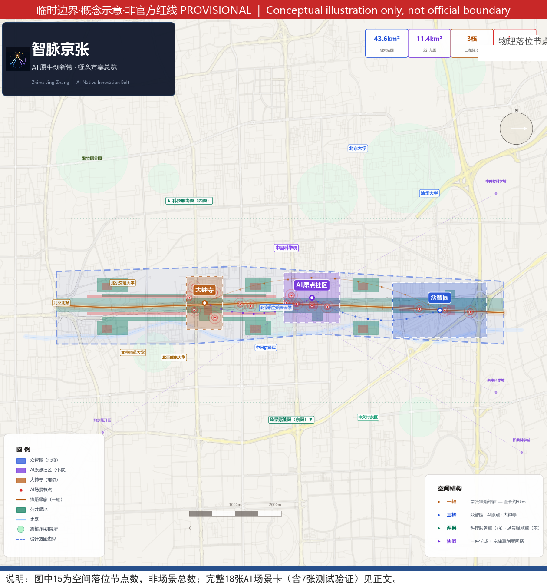

## 三层范围工作框架

- **统筹研究范围**（约 43.6 km²）[metric:research_area_sqm]：北五环至北京北站，东西约 1-2 km，承载世界级 AI 创新生态与未来城市形态战略研究 [depth:three_level_scope_framework]。
- **总体设计范围**（约 11.4 km²）[metric:site_area_sqm]：京张铁路遗址公园沿线及三核重点区域 [depth:overall_spatial_structure] [data:geometry/site_boundary.geojson#]。
- **重点区域范围**（几何复算约 368.6 ha，公告口径约 368.4 ha）[metric:key_area_total_sqm] [metric:key_areas_count]：自北向南——众智园 AI 自主创新加速区 191.9 ha（KEY-001，公告 192.1 ha）、北京 AI 原点社区 104.3 ha（KEY-002）、大钟寺 AI 产业集聚区 72.4 ha（KEY-003，公告 72.0 ha）[data:geometry/key_areas.geojson#KEY-001] [data:geometry/key_areas.geojson#KEY-002] [data:geometry/key_areas.geojson#KEY-003] [depth:three_key_area_detailed_design]。

本方案采用的 site_boundary 与 key_areas 均为临时粗略边界（official_boundary=false），面积已在 EPSG:4548 投影下复算；三核几何复算 368.6 ha 与公告口径 368.4 ha 的差异源于 provisional 边界精度 [metric:site_area_sqm] [metric:key_area_total_sqm] [depth:metrics_recalculation]。三核位置已基于公开可查的公开地理锚点（大钟寺站、五道口/东升大厦、学院路高校群）对官方 provisional 占位矩形进行了概念性校准，仍为非官方红线，待官方数据发布后替换。替换官方 polygon 后需重算用地、建筑、道路、蓝绿、公共空间、分期等图层及相关指标 [depth:existing_conditions_diagnosis]。


## 现状基底与公开数据锚点

> 本节数据均来自公开报道和官方发布，用于锚定方案的现实基础，不替代实地踏勘和官方测绘。方案定位为**在已建成城市基底上叠加AI原生层**，而非从零建设。

### 京张铁路遗址公园：已建成的9公里绿廊

**关键事实**【背景信息·待核实】：京张铁路遗址公园二期于**2026年8月6日**正式开放[source:REF-JINGZHANG-PARK-2026]，一期（五道口启动区2019年开放、C区保福寺桥段）与二期贯通后，形成西直门北京北站至北五环箭亭桥**全长约9公里、总用地约53公顷**的连续线性公园，直接服务**70个社区、约45万居民**[source:REF-JINGZHANG-PARK-2026]。【以上日期与客流数据为公园运营方/媒体公开报道，属背景信息，待官方公告核实，不作现状判定依据】

**已建成设施**（本方案的空间基底，非待建）：
- **"三道一绿"慢行系统**：步行道、慢跑道、自行车道独立设置，9公里无断点；自行车道南接回龙观自行车专用路，可从三山五园骑至北二环
- **南段（社区活力段，23.08公顷）**：西直门至知春路大运村，恢复2.4km 1909年百年旧铁轨、四道口历史节点、蒸汽车头、绿皮车厢、焊轨厂龙门吊景观化；"三环门户"城市阳台（北三环挡墙改分层退台无障碍）
- **北段（自然休闲段，30.01公顷）**：清华东路至北五环箭亭桥，"京张之环"1909主题广场、油罐车、老候车椅；接入东升八家郊野公园，北连清河绿廊
- **全段设施**：儿童游乐区（铁路路基改滑梯/攀岩/沙坑）、林下剧场、球类运动场、便民驿站、公共停车场、乡土植物科普园（油松/海棠/山桃）、海绵城市设计；打通9条城市支路，无边界开放
- **地铁可达**：2/4/13号线西直门站、13号线大钟寺站、10/13号线知春路站、13号线五道口站、15号线清华东路西口站
- **设计单位**：北京北林地景园林规划设计院（张璐副院长）、北京林业大学园林学院（李倞、刘东云）；清华同衡2019年参与概念规划国际征集

**对本方案的意义**：绿廊已建成，本方案的"京张绿廊主脉"**不是新建公园，而是在已建成的9公里绿廊上叠加AI原生层**——传感器、边缘计算、智脉心跳光河、AI场景挂载点等。已有的铁轨、龙门吊、京张之环、绿皮车厢等遗产设施，直接作为AI文化导览（SC-10）、开发者散步道（SC-01/LM-03）、开源成果展示（LM-02）的空间载体。

### 三核周边公开锚点：高校、科研院所与AI企业

**众智园AI自主创新加速区（北核）周边**[source:REF-XUEYUANLU-UNIV]：
- **高校**：北京航空航天大学（学院路37号，人工智能学院、具身智能机器人研究院、无人系统研究院、8个全国重点实验室）、北京语言大学、中国地质大学（学院路29号）、中国矿业大学（学院路丁11号）、北京林业大学（清华东路35号）、中国农业大学（清华东路17号）、北京科技大学、北京大学医学部
- **科研院所**：中国信息通信研究院（学院路40号）、电信科学技术研究院/大唐电信（学院路40号）、铁科院（大柳树路2号）
- **AI产业**：学院路高校教学共同体20所高校，北航系AI/具身智能/无人系统创业集群

**北京AI原点社区（中核）周边**【背景信息·待核实】[source:REF-HD-AI-2025][source:REF-XUEYUANLU-UNIV]：
- **高校**：清华大学（双清路30号）、北京大学（颐和园路5号）
- **科研院所**：中科院自动化所（中关村东路95号，张钹/类脑智能）、中科院软件所（中关村南四街4号）、中科院物理所（中关村南三街8号）、北京智源人工智能研究院
- **AI产业**：AI原点社区（五道口3km²核心区）已入驻**200+ AI企业**，以东升大厦、清华科技园、智源大厦为载体，"上下楼就是上下游"[source:REF-HD-AI-2025]【背景信息·待核实】；DeepSeek北京团队（融科资讯中心）；知春路沿线月之暗面（Kimi）等大模型企业
- **王慧文"黄金框"**：清华以南、北大以东、学院路以西、大钟寺以北——2023年以来该框内新注册AI企业92家、机器人企业47家，月之暗面/百川智能/生数科技/硅基流动/零一万物均在此[source:REF-HD-AI-2025]【背景信息·待核实】

**大钟寺AI产业集聚区（南核）周边**【背景信息·待核实】[source:REF-XUEYUANLU-UNIV][source:REF-HD-AI-2025]：
- **高校**：北京邮电大学、北京师范大学、北京交通大学、中央财经大学（学院南路39号）
- **AI产业**：中关村核心区向南延伸，大钟寺为海淀区官方"两区一带多点"AI街区规划的两个先导区之一（另一个为五道口），京张遗址公园创新交往带串联两者[source:REF-HD-AI-2025]【背景信息·待核实：官方规划导向，具体范围/边界待控规确认】

### 海淀AI产业：全国最密集的创新雨林

根据《海淀区2024年国民经济和社会发展统计公报》[source:REF-HD-STAT-2024]及2025年9月北京市政府新闻发布会官方数据[source:REF-HD-AI-2025]【背景信息·待核实：统计口径以官方公报为准】：

**经济底盘**[source:REF-HD-STAT-2024]：
- 2024年海淀区GDP **12907.1亿元**，增长6.0%，占北京市近1/4；第三产业占**92.49%**
- 2025年上半年GDP 6636.8亿元，增长6.9%；固定资产投资增长67.3%
- 一般公共预算收入582.0亿元；居民人均可支配收入**105,701元**
- 研发投入占GDP比重约**11%**（约1420亿元），远高于北京全市6.58%和全国约2.6%

**AI产业**[source:REF-HD-AI-2025]【背景信息·待核实：产业规模数据来自媒体公开报道，待官方统计核实】：
- AI核心产业规模**2822亿元**（2024年），占北京市近80%，年增速30%；大模型备案**104款**，占全市近70%
- AI企业**1900+家**，形成"芯片-框架-大模型-应用"全产业链；独角兽企业**51家**（全市超4成）
- 大模型"六小虎"中4家在中关村2km半径内（智谱华章、百川智能、月之暗面、零一万物）
- 万P级智算集群已投用，汇聚京津冀蒙新超8万P绿色算力；数据流通增值协作网络落地海淀

**人才与科研**[source:REF-HD-AI-2025][source:REF-HD-STAT-2024]【背景信息·待核实：人才/院士/专利数据来自媒体公开报道，待官方统计核实】：
- 人才资源总量**200.45万**，全市占约1/4；从业人员中人才占比88.54%
- "两院"院士**646位**，占全国35.8%；AI学者1.23万人，全市80%+；高被引科学家264人
- 全国重点实验室**92家**（全市63.4%、全国17.9%）；37所高校，21所设AI本科专业
- 每万人口高价值发明专利**539.95件**，是全国平均水平的38.5倍；技术合同成交3806.9亿元

**"1+X+1"产业体系**[source:REF-HD-AI-2025]【背景信息·待核实：产业体系数据来自媒体公开报道，待官方统计核实】：
- AI引领（2822亿）+ 科技服务业（规上营收2448亿，全市31.2%）+ 战略新兴/未来产业
- 信软业收入首破2万亿（全市62%、全国16%）；医药健康1059亿；集成电路430亿；商业航天205家企业
- 未来产业：全国首个具身智能创新产业园、全市首家量子产业园、全国首个脑机接口产业联盟

**官方空间规划**[source:REF-HD-AI-2025]【背景信息·待核实：官方规划导向，具体范围/边界待控规确认】：
- 2024年海淀发布全球首个AI街区概念——"两区一带多点"：五道口、大钟寺2个先导区，京张遗址公园创新交往带
- 2025年规划建设AI创新街区、AI原点社区等创新空间，开放100个AI示范应用场景

### 交通与人口基底

**轨道交通**[source:REF-BJMETRO-13]【背景信息·待核实：轨道站点/客流数据为公开运营信息，具体以北京地铁官方发布为准】：
- 地铁13号线沿京张走廊设站：西直门（2/4/13三线换乘，换乘客流全网第一）→大钟寺（可换乘12号线）→知春路（10/13换乘，S级站，日客流31万）→五道口→上地上→西二旗
- 2025年12月13号线拆分，18号线（原13A）开通，13号线工作日客流从历史峰值160万降至约40万，运能释放为沿线更新提供条件
- 新增保福寺站（五道口-知春路间）、四道口站，填补覆盖空白
- 17号线2026年1月全线贯通，望京西站实现13/15/17三线地下换乘
- 2024年北京地铁全网日均989.61万人次，工作日1118万

**人口与社区**[source:REF-JINGZHANG-PARK-2026][source:REF-HD-STAT-2024]【背景信息·待核实：人口/社区数据来自公开报道与统计公报，待官方核实】：
- 绿廊直接服务70个社区、约45万居民
- 海淀区常住人口312.2万，其中外来人口104.3万（33.4%）；0-14岁占11.8%，15-59岁占65.2%，60岁及以上占**23.0%**——老龄化程度高于全国平均，全龄友好设计有现实紧迫性
- 海淀人才资源总量200.45万，北京在校大学生约110万人
- 全区普通中学90所、小学91所、幼儿园220所，在校生合计约41万人
- 医疗卫生机构1467个；PM2.5年均30.6微克/立方米

### 人形机器人运动会：从冰丝带到京张绿廊的"第一公里"

**关键事件**【背景信息·待核实】：第二届世界人形机器人运动会于2026年8月22日至26日在国家速滑馆"冰丝带"举行，来自16个国家的666支队伍、2056台人形机器人参与51个赛项、1301场竞技对决，其中含21项实景场景挑战（餐饮服务、工业操作、应急救援、公共服务等）[source:REF-WHRG-2026]。赛事核心理念为"以赛验技、以赛促产"，推动人形机器人从实验室走向千行百业【以上为赛事公开信息，属背景锚点，具体合作与落地待对接确认，不构成已确定安排】。

**对本方案的意义**：
- **空间邻近**：冰丝带位于奥林匹克公园，距京张绿廊北端箭亭桥约3公里，同属海淀北部创新轴。运动会验证了机器人的极限竞技能力，但机器人进入真实城市日常空间（街道、社区、商业）仍需长期测试——本方案东翼小月河场景赋能翼可承接这一需求，成为人形机器人"从赛场走向城市"的第一公里测试走廊。
- **场景转化**：运动会的21项实景挑战（餐饮、工业、应急、公共服务）可直接转化为京张创新带的AI场景测试内容，与本方案已有的SC-08低速机器人配送、SC-09自动驾驶接驳形成"竞技极限→城市日常"的完整验证链条。
- **理念共鸣**：1909协议的"三道闸门+八类故障注入+五阶段现场验证"框架，恰好是人形机器人进入城市公共空间的"日常准入测试"——运动会检验物理极限，1909协议检验安全、伦理与社区接受度。
- **产业基础**：海淀已建成全国首个具身智能创新产业园，人形机器人企业密集。京张创新带可依托这一产业基础，成为人形机器人城市级测试与展示的常态化空间。

### 方案定位声明

基于以上公开背景信息（公园开放、产业集群与交通变化均来自运营方/媒体公开报道与统计，属背景信息，待官方公告核实，不作现状判定依据），本方案的核心定位调整为：

1. **绿廊已建成，AI层待叠加**（背景信息·待核实）：据运营方公开报道，9公里、约53公顷的京张铁路遗址公园已于2026年8月全线贯通开放【背景信息，待官方公告核实，不作现状判定依据】。本方案不是"建公园"，而是在这条已建成线性公园上叠加AI原生创新基础设施（传感器、算力节点、空间API、智脉心跳、场景挂载点），使其从"城市绿道"升级为"AI原生创新主脉"的概念构想。

2. **三核有公开锚点**（背景信息·待核实）：众智园、AI原点社区、大钟寺三个核心区分别锚定学院路八大学院+科研院所集群、五道口清华北大+200+AI企业集群、中关村南延+官方AI先导区等公开信息；方案的空间建议旨在与这些公开锚点产生协同，具体范围与权属待核。

3. **产业有公开生态基础**（背景信息·待核实，非业绩背书）：据海淀区公开统计，海淀有1900+AI企业、51家独角兽、1.23万AI学者、104款备案大模型、AI核心产业约2822亿元【均为公开报道/统计，待官方核实】。本方案的"AI创新生态"章节是对已有生态的**空间组织与升级建议**，非对现状的业绩背书。

4. **交通有已发生的变化**（背景信息·待核实）：13号线拆分、新站增设、17号线贯通等为公开报道的已发生或计划变化；方案的交通建议参考这些信息，具体以官方规划与建设进度为准。

5. **机器人有公开赛事背景**（背景信息·待核实）：第二届世界人形机器人运动会于2026.8.22-26在冰丝带举行（公开报道，待核实）；海淀具备具身智能产业基础。本方案的机器人测试场景是对"以赛验技、以赛促产"理念的**城市空间承接构想**，非已确定安排。

> 以上现状数据均来自公开报道，用于锚定方案现实基础；具体企业地址、人口数据、客流数据以官方统计为准，方案中的空间建议仍为概念性，可供专业团队深化研究。

## 统筹研究范围产业与未来城市研究

### 主概念：智脉京张（Zhimai Jing-Zhang）

将百年京张铁路遗址公园读为一条**贯穿北五环至西直门的 AI 原生创新主脉**——"智脉"既指铁路作为城市历史脉络，也指 AI 作为创新血脉。1909 年詹天佑主持修建中国人第一条铁路，"人"字形线路解决关沟坡度难题；117 年后，同一条线性空间成为中国 AI 原生创新的主脉。

**核心命题**：铁路的线性逻辑（连接、传输、节点、迭代）在 AI 时代转译为数据、算力、人才与场景的流动骨架。这不是给传统城市设计贴 AI 标签，而是提出 AI 原生城市空间范式：
- **线性即网络**：铁路的"线"成为 AI 的"脉"——数据廊道+算力动脉+慢行道+文化叙事轴，四脉合一；
- **节点即突触**：三核不是孤立功能区，而是脉上的突触节点；
- **人字形即迭代**：京张铁路的折返智慧隐喻 AI 的 red-teaming 与持续迭代；
- **遗产即算力**：老站房、厂房、水塔不是保留"标本"，而是算力容器、测试空间、文化锚点。

**命名体系**：
| 层级 | 名称 | 英文 | 含义 |
|------|------|------|------|
| 总体 | 智脉京张 | Zhimai Jing-Zhang | "智脉"谐音"芝麻开门"；"京张"锚定历史 |
| 主脉 | AI原生创新主脉 | AI-Native Innovation Spine | 绿廊+数据+慢行+文化 |
| 北核 | 众智园AI自主创新加速区 | Zhongzhiyuan AI Acceleration Park | 众智、全栈自主 |
| 中核 | 北京AI原点社区 | Beijing AI Origin Community | 全球AI创新生态原点 |
| 南核 | 大钟寺AI产业集聚区 | Dazhongsi AI Industry Cluster | AI原生产业门户 |
| 西翼 | 中关村科技服务翼 | Zhongguancun Tech-Service Wing | 要素服务、IP、资本 |
| 东翼 | 小月河场景赋能翼 | Xiaoyuehe Scenario Wing | AI+生活场景测试 |

**Logo 设计理念**：标志以京张铁路"人"字形线为元符号，经三重转译生成——

1. **人字形铁路（历史层）**：詹天佑1909年设计的"人"字形展线是中国铁路工程智慧的标志。标志中两条轨道从底部向上汇聚于顶点，构成V形人字形——左轨为信号蓝渐变，右轨为智脉紫渐变，轨道间的枕木与发光节点代表铁路信号机与沿途车站，致敬百年工程遗产。轨道向上汇聚的动势象征"克难而上、汇聚创新"。

2. **AI信号（技术层）**：人字形轨道汇聚于顶部发光点，该点既是铁路信号机的灯光，也是AI神经网络的突触节点——信号从轨道传输到节点，再以同心圆波纹向外扩散，象征知识、代码与创新的开源传播。顶部发光点由内向外形成三层金色光环，如信号覆盖范围，亦如双臂张开迎接全球开发者。

3. **金色光环（未来层）**：标志外框为开口向下的圆弧（约280度），从顶部遗产金向两侧渐变为信号蓝与智脉紫，取意"铁路延伸向未来"——从历史轨道生长为数字光环，寓意京张从工业文明的铁路脉搏进化为AI文明的创新脉搏。完整版标志采用深蓝黑底色象征数字宇宙，金色与蓝紫双色形成"遗产金×科技蓝紫"的品牌色谱。

**标志构成**：完整版标志由图形徽标+中文标准字"智脉京张"+英文标准字"ZHIMAI JING-ZHANG AI-NATIVE INNOVATION BELT"三部分组成；图标版仅保留图形徽标，适用于小尺寸场景和favicon。

**品牌色彩规范**：

| 色彩 | 色值 | 用途 |
|------|------|------|
| 京张靛（主色） | #0a0e1a | 标志底色、深色背景、正文 |
| 智脉紫（辅助色） | #6b5ce7 | 右轨、创新元素、数据可视化 |
| 遗产金（点缀色） | #c8922a | 弧线、信号、标题装饰线 |
| 信号蓝（辅助色） | #3090ff | 左轨、科技元素、链接 |
| 科技青（辅助色） | #2e7d6b | 生态、绿廊、可持续 |
| 暖光白（浅色背景） | #f5f3ee | 浅色版面、反白使用 |

主渐变：信号蓝→智脉紫（轨道/科技元素），遗产金→暖光白（信号/高光）。

**字体规范**：中文使用 Noto Sans SC（SIL OFL 1.1，可再分发）；英文使用 Noto Sans / Helvetica Neue / Arial。中文标准字"智脉京张"字间距加宽，英文标准字"ZHIMAI JING-ZHANG"采用全大写宽字距。

**标志变体与使用规范**：提供标准版（深底白字）、反白版（浅底深字）、图标版（仅标志）、横版（标志与文字横向排列）四种变体。标志四周须预留不少于标志高度1/4的净空；印刷品标志宽度≥20mm、图标≥12mm，屏幕显示标志宽度≥80px、图标≥32px。

**标志文件**：提供 `assets/logo.png`（完整版含标准字，800×1043）、`assets/logo-icon.png`（图标版深底，512×512）、`assets/logo-transparent.png`（图标版透明底，512×512）等位图版本。本Logo由 **Google Gemini（Nano Banana Pro / gemini-3 image）API** 生成，经人工调整优化，为概念设计方向；依据 Google 2026 使用政策在不侵犯第三方智慧财产权前提下允许商业使用。所有标志为方向性概念，商标注册尚在推进中，落地需完成商标授权。

品牌系统应用覆盖四个维度、十二类场景：①**导视标识系统**——方向指示牌、地面标识、信息柱（集成AI导览和城市OS状态显示）；②**公共艺术装置**——"智脉心跳"数据光河（沿绿廊布置，实时显示环境数据和人流节奏）、LM-01智脉原点碑、铁路信号机艺术化（红/黄/绿灯映射空间状态）；③**数字界面**——"智脉邻居"居民小程序（人流/空气/活动/参与式预算）、运营驾驶舱、活动官网与APP；④**办公与文创**——名片、信纸信封、工作证、开发者T恤、手提袋、纪念票、咖啡杯、井盖铺装；⑤**环境与传播**——道旗、施工围挡、车体广告、活动海报、PPT模板。所有品牌应用为概念设计，待专业团队深化。

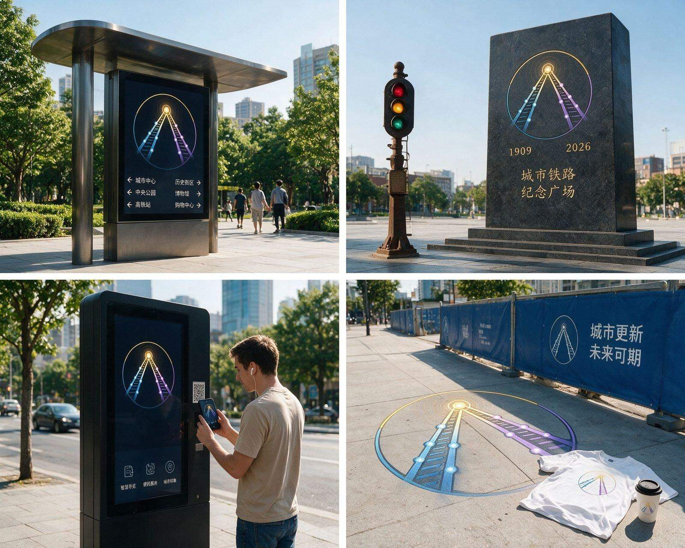

> 品牌应用为概念设计意向，具体导视系统、公共艺术、数字界面和文创产品需在实施阶段由专业品牌设计团队深化，并完成商标注册和字体授权。
> **字体使用台账（实际嵌入/调用）**：①**交互HTML与报告HTML（visual/index.html、visual/index.en.html、report/proposal.html、report/proposal.en.html）**——中文使用 **Noto Sans SC**（SIL OFL 1.1）内联子集（woff2 base64，随包提供，离线可用），英文使用 Noto Sans / 系统回退栈（Segoe UI、PingFang SC、Microsoft YaHei 等仅作浏览器回退，未嵌入、未随包分发）；②**A0/A3 PDF 与位图图件**——生成时使用 **Microsoft YaHei / SimHei**（Windows 系统字体，随渲染环境提供，非随包分发、无再分发行为）与 Helvetica/Arial（系统字体）；③**代码/控制台**——Consolas / Source Code Pro 仅作代码展示回退。以上系统字体均为运行环境自带，本包不包含任何需单独授权的商业字体文件；Noto Sans SC/Noto Sans 为 OFL 1.1 开源字体，可再分发，许可文件见 sources.json#LOGO-FONTS-DECLARATION。


**导视标识系统分级设计（概念性方向）**：

建立三级导视体系，覆盖从区域入口到具体设施的完整信息层级，确保访客从进入创新带到抵达具体目的地的全程导向清晰。

| 层级 | 类型 | 设置位置 | 规格(概念) | 信息内容 | 数量估算 | 材质建议 |
|------|------|---------|----------|---------|---------|---------|
| **一级导视（区域级）** | 区域入口标识 | 创新带南北入口、三核门户 | 高4-6m，宽1.5-2m | 区域名称+Logo+总平面图+核心功能区索引 | 约8处 | 耐候钢+发光字+钢化玻璃 |
| | 三核门户图腾 | 众智园/AI原点/大钟寺入口 | 高5-8m | 核名+定位语+导览二维码 | 3处 | 金属+LED+互动屏 |
| | 区域总平面图 | 主要广场、地铁站出口 | 宽1.8m×高1.2m | 全带总平面+功能分区+交通流线+当前位置 | 约15处 | 金属+丝网印刷+背光 |
| **二级导视（节点级）** | 方向指示牌 | 路口、分叉点、广场周边 | 高2.5m，宽0.4-0.8m | 多方向箭头+目的地名称+距离 | 约60处 | 拉丝不锈钢+亚克力+图标 |
| | 节点解说牌 | 4处地标+遗产节点+特色空间 | 高1.2m，宽0.8m | 节点介绍+历史背景+AI故事+二维码 | 约40处 | 耐候钢+钢化玻璃+印刷 |
| | 功能区索引 | 各功能区入口 | 高1.5m，宽1.0m | 该区功能列表+楼层/空间索引+服务设施 | 约20处 | 金属+触控屏+纸质备份 |
| **三级导视（设施级）** | 地面导向标识 | 步道、广场、室内 | 直径0.3-0.6m | 箭头+图标+距离 | 约200处 | 不锈钢镶嵌+夜光材料 |
| | 设施标识牌 | 卫生间、电梯、出入口、服务台 | 高0.3-0.5m | 图标+文字+盲文 | 约300处 | 亚克力+金属+立体字 |
| | 警示标识 | 坡道、台阶、施工区、测试区 | 标准尺寸 | 安全警示+使用说明 | 约100处 | 标准安全标识材质 |
| | 信息触摸屏 | 广场、社区中心、地标 | 高1.4m，屏32-43寸 | 交互式导览+活动信息+AI服务入口 | 约30台 | 金属+触控屏+防水防尘 |

**导视系统设计原则**：
- **多语言**：所有一级、二级导视均为中英双语，关键节点增加日/韩/法/西语
- **无障碍**：重要标识配备盲文、语音导览二维码，高度符合轮椅视角（1.2-1.4m）
- **夜间可见**：一级导视全部背光/发光，二级导视关键节点发光，三级导视重要位置夜光材料
- **品牌统一**：所有导视使用统一品牌色彩（遗产金/信号蓝/智脉紫）、字体（中文Noto Sans SC / 英文Noto Sans）和图标系统
- **智能融合**：一级、二级导视集成AI导览二维码，扫码可获取AR导航、多语言讲解和实时活动信息
- **维护简便**：模块化设计，面板可更换，光源可替换，信息更新无需整体更换

> 导视系统为概念性设计方向，具体点位、尺寸、材质、工艺和造价需在实施阶段由专业导视设计团队深化，并符合《城市公共空间导视系统设计规范》及无障碍设计相关标准。

### 三核一轴两翼协同回路

**空间结构**：一轴（京张绿廊主脉）串联三核（众智园·AI原点·大钟寺），两翼（西翼科技服务·东翼场景赋能）提供要素支撑与场景验证 [data:geometry/land_use.geojson#] [depth:land_use_layout]。

协同回路：众智园产出模型与技术 → AI原点社区提供生态与人才 → 大钟寺完成产业转化与公众体验 → 两翼提供要素服务与场景验证 → 反馈众智园迭代。

### 区域协同：三科学城与京津冀创新网络

智脉京张不是孤立项目，而是北京国际科技创新中心和京津冀协同创新网络的关键一环。本方案明确与北京三大科学城、经开区及京津冀的创新协同关系[source:REF-HD-AI-2025]【背景信息·待核实：协同关系为概念建议，具体机制需市级统筹】：

| 协同节点 | 定位 | 与智脉京张的协同关系 |
|---------|------|-------------------|
| **中关村科学城**（海淀） | AI原始创新策源地 | 本方案即位于中关村科学城核心区，是其"创新雨林"的空间组织和AI原生层叠加 |
| **未来科学城**（昌平） | 能源/生命科学/先进制造 | 智脉京张的AI+能源、AI+生命科学场景可与未来科学城的央企研究院联合测试；人才公寓和居住功能可承接未来科学城外溢人才 |
| **怀柔科学城**（怀柔） | 大科学装置/基础研究 | 怀柔的综合极端条件实验装置、材料基因组等大科学平台产出的基础模型和算法，可在智脉京张进行城市场景验证；1909协议的安全测试框架可复用 |
| **北京经开区**（亦庄） | 高级别自动驾驶/机器人/集成电路 | 经开区已建成L4自动驾驶示范区和机器人产业基地；智脉京张的SC-08机器人配送、SC-09自动驾驶接驳场景可与经开区形成"研发在海淀、测试在亦庄、部署回京张"的闭环；经开区的芯片制造可支撑众智园全栈自主 |
| **天津滨海/雄安新区** | 京津冀协同 | 天津滨海的超算中心可提供离线训练算力补充；雄安新区的数字城市建设可复用1909协议和空间版本控制经验；智脉京张的开源成果可向京津冀输出 |

**协同机制建议**（概念建议）：
- **算力调度网**：众智园（万P智算）+怀柔（大科学装置算力）+天津滨海（超算）+鹏城实验室（深圳，建议对接，非已确定合作）构成跨区域算力调度网的概念框架，AI训练任务按需调度
- **场景互认**：智脉京张测试通过的AI场景，可在经开区、雄安等区域快速部署，避免重复测试；反之亦然
- **人才环流**：三科学城之间开通AI人才通勤巴士/快线；人才公寓跨城互认
- **开源协同**：智脉京张的开源成果通过GitHub等平台向全球开放，同时吸引京津冀开发者贡献

> 区域协同关系为概念建议，具体协同机制需经市级层面统筹和各区分工协商。


### 全球 AI 创新生态案例比较（8 案例）

| 案例 | 核心机制 | 空间模式 | 可借鉴 | 对应项目维度 |
|------|---------|---------|--------|-------------|
| **Mila（蒙特利尔）** | 学术PI驱动，开源优先，Bengio图灵奖锚定 | 蒙特利尔大学楼+Mile Ex创意区 | 学术-创业管道、开源AI文化 | AI原点社区：研究生态 |
| **Kendall Square/MIT（波士顿）** | MIT锚定全球最密创新平方英里，biotech+AI混合 | 大学旁城市街区，研究+办公+居住+商业高密度混合 | 大学锚定街区、产学研步行可达 | AI原点社区：空间模式 |
| **King's Cross Central（伦敦）** | 铁路货场更新为Google/Meta/CSM混合区 | 67英亩前铁路用地，运河+车站+科技+教育+住宅+公共空间 | 铁路遗产→科技教育混合区、多利益相关方治理 | 三核整体：铁路遗产更新 |
| **Station F（巴黎）** | 单建筑1000+初创，VC-导师-大企业驻场 | 旧铁路货运站Halle Freyssinet，3.4万m2 | 铁路建筑→高密度创业社区 | 众智园：遗产再利用 |
| **22@Barcelona（巴塞罗那）** | 老工业区Poblenou更新为创新区，政企学协同 | 200公顷街区更新，混合居住/办公/公共设施/smart city | 旧区更新治理、公私合作、创新街区政策 | 大钟寺/两翼：城市更新 |
| **High Line（纽约）** | 废弃高架铁路→线性公园，非营利运营 | 2.3km高架铁路改造，Friends of the High Line运营 | 线性铁路公园运营、公共空间催化更新 | 绿廊主脉：运营模式 |
| **赫尔辛基AI再生区** | 城市级AI测试床，公共数据开放，伦理审查前置 | 旧港区更新，AI融入公共服务和居民参与 | 公共数据沙盒、AI伦理治理、居民参与 | 小月河翼：AI+公共服务 |
| **鹏城实验室云脑（深圳）** | 国家实验室，万P级大算力共享，开源AI平台 | 独立科研园区，大科学装置 | 大公共算力调度、开源平台、国家队模式 | 众智园：算力设施 |

**对海淀的独特价值**：海淀拥有全球罕见的三重叠加——顶尖大学密度（清华/北大/中科院数十家院所）+AI企业密度（1900+企业、51家独角兽、104款大模型）+已建成的9公里铁路遗产公园。8个案例分别对应项目不同维度，不应复制单一模式：Mila的开源学术文化+Kendall Square的大学锚定街区密度+King's Cross的铁路遗产混合更新+Station F的创业密度+22@的旧区治理+High Line的线性公园运营+赫尔辛基的AI伦理治理+鹏城的大算力基础设施。京张铁路遗产提供了其他案例都不具备的**线性公共空间骨架**——这是海淀独有的结构性优势。

**AI产业链图谱与海淀优势环节分析（概念性）**：

智脉京张聚焦AI全栈自主创新体系，覆盖AI产业链从基础层到应用层的完整链条，并明确海淀在各环节的优势和本方案的空间承载。

| 产业链层级 | 细分领域 | 海淀优势程度 | 代表机构/企业(概念) | 空间承载 | 本方案举措 |
|-----------|---------|------------|-------------------|---------|-----------|
| **基础层** | AI芯片/算力 | ★★★★☆ | 寒武纪、百度昆仑、清华微纳电子 | 众智园算力中心 | 万P智算沙盒、芯片测试验证平台 |
| | 大模型/基础模型 | ★★★★★ | 智源、百度、清华、北大 | 众智园+AI原点 | 模型红队测试床、开源模型托管 |
| | 数据服务/数据集 | ★★★☆☆ | 数据堂、海天瑞声、高校数据集 | 众智园 | 公共数据沙盒、数据治理框架 |
| | 开源框架/工具链 | ★★★★☆ | 百度飞桨、智源、清华 | AI原点社区 | 开源展示廊、开发者社区 |
| **技术层** | 计算机视觉 | ★★★★★ | 旷视、商汤、字节、清华 | 大钟寺+东翼 | SC-10文化导览、SC-15沉浸体验 |
| | 自然语言处理 | ★★★★★ | 百度、智源、清华NLP | AI原点+大钟寺 | SC-07法律助手、SC-14金融顾问 |
| | 语音识别/合成 | ★★★★☆ | 百度、科大讯飞（北京）、清华 | 全脉公共空间 | SC-05健康导航、SC-10多语导览 |
| | 强化学习/决策 | ★★★★☆ | 清华、北大、智源 | 众智园+东翼 | SC-08机器人配送、SC-09自动驾驶 |
| | 多模态/具身智能 | ★★★★☆ | 智源、清华、北大、具身智能企业 | 东翼测试走廊 | 机器人测试场、具身智能空间导则 |
| | AI安全/对齐 | ★★★★☆ | 智源、清华、AI安全实验室 | 众智园封闭区 | SC-03红队测试床、1909验证协议 |
| **应用层** | AI+医疗健康 | ★★★★☆ | 百度医疗、腾讯医疗、北医三院 | AI原点社区 | SC-05健康导航站 |
| | AI+教育 | ★★★★★ | 好未来、猿辅导、高校在线 | AI原点混合街区 | SC-06 AI教育空间 |
| | AI+金融 | ★★★★☆ | 百度金融、中关村金融科技 | 大钟寺商务空间 | SC-14金融合规顾问 |
| | AI+零售/消费 | ★★★☆☆ | 美团、京东、字节 | 大钟寺商业空间 | SC-13 AI定制零售 |
| | AI+交通/出行 | ★★★★☆ | 百度Apollo、小马智行、滴滴 | 三核间连接路 | SC-09自动驾驶接驳 |
| | AI+机器人 | ★★★★☆ | 小米、优必选（北京）、清华 | 东翼慢行道 | SC-08机器人配送、机器人挑战赛 |
| | AI+文化创意 | ★★★☆☆ | 字节、快手、文化科技企业 | 4处地标+绿廊 | SC-10文化导览、AI艺术节 |
| | AI+城市治理 | ★★★★☆ | 海淀城市大脑、高校研究 | 运营中心+全脉 | SC-12公共议题路由、城市OS |

**海淀AI产业链优势总结**：
- **最强环节（★★★★★）**：大模型、计算机视觉、NLP、AI教育——海淀在这些领域具有全球竞争力，应作为创新带核心引擎
- **优势环节（★★★★☆）**：AI芯片、开源框架、语音、强化学习、多模态、AI安全、医疗、金融、交通、机器人、城市治理——这些是创新带重点培育和场景落地方向
- **成长环节（★★★☆☆）**：数据服务、AI零售、文化创意——这些领域需通过场景开放和政策引导加速发展

**产业链空间布局策略**：
- **众智园（北核）**：聚焦基础层（算力、芯片、大模型、数据、开源）+ AI安全测试，打造"AI基础研究与全栈自主创新"核心
- **AI原点社区（中核）**：聚焦技术层（NLP、语音、多模态）+ 应用层（教育、医疗），打造"AI创新生态与人才社区"
- **大钟寺（南核）**：聚焦应用层（金融、零售、文化、治理），打造"AI产业转化与公众体验门户"
- **东翼（小月河）**：聚焦测试验证（机器人、自动驾驶、具身智能），打造"AI场景赋能与测试走廊"
- **西翼（中关村）**：聚焦要素服务（IP、资本、法律、人才），打造"AI创新要素全球配置枢纽"

> 产业链分析为概念性产业研究，企业名单基于公开信息整理，不构成企业入驻承诺或招商保证。具体产业定位和企业招引需在实施阶段结合海淀区产业政策和市场情况确定。

**全球案例可迁移要素与本方案差异化对照**：

| 案例 | 可迁移要素（本方案采纳） | 不可复制条件 | 本方案差异化/超越 |
|------|----------------------|------------|-----------------|
| **Mila（蒙特利尔）** | ①学术PI驱动的开源文化→AI原点社区高校步行可达；②学术-创业管道→孵化器1-3与高校实验室联动；③Bengio式图灵奖锚定→邀请海淀院士/大模型领军者担任"智脉学者" | 蒙特利尔低成本生活和法语区人才政策；加拿大联邦AI战略集中投入 | 本方案不止于学术节点，而是将开源文化延伸至公共空间（开源成果展示廊/开发者散步道），形成"学术-公共-产业"三向渗透；Mila是单点，本方案是9km线性网络 |
| **Kendall Square（波士顿）** | ①大学锚定街区密度→AI原点社区500m步行圈覆盖高校；②研究+办公+居住+商业混合→三核混合用地；③biotech+AI跨界→本方案AI+健康/法律/金融跨界场景 | MIT土地所有和百年积累；波士顿生物医药集群生态；美国风险投资密度 | Kendall Square是自发市场演化，本方案是agent-native规划——空间即API、1909协议等机制是Kendall没有的；本方案还包含公共利益硬约束（人才公寓≥20%、反绅士化） |
| **King's Cross（伦敦）** | ①铁路货场→科技教育混合区→众智园旧厂房改造；②Google/DeepMind锚定→争取1-2家头部AI企业锚租户；③运河+车站+公共空间→绿廊+轨道站点一体化 | 伦敦全球金融中心地位；Central Saint Martins艺术院校；英国铁路私有化土地处置 | King's Cross是单一开发商主导（Argent），本方案提出多主体治理（政府+高校+企业+社区）；本方案的AI原生空间类型学（算力水塔/提示广场）是King's Cross没有的 |
| **Station F（巴黎）** | ①旧铁路建筑→高密度创业社区→N-05展示廊+旧厂房改造；②VC-导师-大企业驻场→运营平台引入驻场伙伴；③3.4万㎡单建筑1000+初创→模型机房共享中试空间 | 巴黎市政府免费/低价提供建筑；Xavier Niel个人巨额投入；法国La French Tech政策 | Station F是封闭campus，本方案是开放城市街区——创业空间与绿廊、社区、商业渗透；Station F不涉及公共空间和居民，本方案强调AI惠及全龄居民 |
| **22@Barcelona（巴塞罗那）** | ①老工业区更新治理→三核城市更新单元；②公私合作PPP→运营平台公司模式；③smart city基础设施→城市OS传感器网络；④混合居住/办公/公共设施→三核混合用地 | 巴塞罗那市政府强力土地整合；欧盟结构基金支持；西班牙2000年代地产周期 | 22@以科技公司招商为主，本方案以AI原生空间协议为核心创新；22@的smart city是自上而下管理系统，本方案OS是开源创新基础设施；本方案增加了AI伦理治理和社区分红 |
| **High Line（纽约）** | ①废弃铁路→线性公园→京张绿廊已建成段提升；②Friends of High Line非营利运营→建议"智脉之友"社会组织；③公共空间催化周边开发→投资杠杆1:5-8预期 | 纽约高线之友强大的私人筹款能力；切尔西画廊区既有文化生态；美国zoning转让机制 | High Line是高架公园（造价高），京张是地面已建成公园（提升成本低）；High Line不涉及AI和产业，本方案将线性公园升级为AI创新基础设施；High Line绅士化争议显著，本方案预设反绅士化机制 |
| **赫尔辛基AI再生区** | ①城市级AI测试床→SC-03/04/08/09测试验证；②公共数据开放→城市OS数据治理；③伦理审查前置→数据伦理委员会；④居民参与AI治理→三阶段社区参与 | 芬兰高信任社会和数字政府基础；欧盟AI法案严格监管框架；赫尔辛基小城市规模 | 赫尔辛基以公共服务AI为主，本方案覆盖研发-产业-公共服务全链条；本方案规模（43.6km²/45万人）远大于赫尔辛基试点；本方案的1909协议和空间版本控制是原创机制 |
| **鹏城实验室云脑（深圳）** | ①万P级大算力共享→众智园算力中心+算力沙盒；②开源AI平台→OpenI启智社区合作；③国家实验室模式→争取国家级AI创新平台落地 | 深圳特区政策和资金力度；鹏城实验室独立园区；广东省电子信息产业链 | 鹏城是独立科研园区，本方案将算力嵌入城市街区（算力水塔即公共建筑）；鹏城偏基础设施，本方案强调算力-空间-场景-社区一体化；本方案还连接怀柔/天津/深圳跨区域算力调度 |

**国内AI园区差异化对照**（本方案与国内主要AI聚集区的本质区别）：

| 国内AI园区 | 核心模式 | 空间形态 | 治理方式 | 本方案差异化/超越 |
|-----------|---------|---------|---------|-----------------|
| **张江科学城（上海）** | 政府主导+大科学设施+生物医药/AI混合 | 传统园区模式，大片土地出让，企业自建园区 | 管委会自上而下管理，企业入驻审批制 | 张江是"园"（封闭园区），本方案是"带"（9km线性城市更新，开放渗透）；张江偏科研设施，本方案偏AI原生空间协议（1909/空间即API）；张江没有公共空间作为创新基础设施的设计 |
| **深圳湾科技生态园** | 国企平台开发+科技企业招商+高密度办公 | 高层办公集群+商业配套，传统CBD模式 | 国企平台运营，租金为主要收入 | 深圳湾是"办公集群"，本方案是"研发-居住-公共空间混合街区"；深圳湾以企业租金为核心，本方案以开源生态和场景验证为核心；深圳湾没有AI场景测试场和具身智能空间导则 |
| **杭州未来科技城** | 阿里/之江实验室锚定+电商/AI企业聚集 | 新城开发模式，大片新建，单一企业主导 | 龙头企业带动，政府配套基础设施 | 杭州未来科技城是"新城新建"，本方案是"老城更新+铁路遗产再生"；杭州偏单一企业生态，本方案是多主体开源生态（高校+中小企业+社区）；杭州没有反绅士化硬约束和社区分红机制 |
| **中关村软件园（北京）** | 软件/互联网企业聚集+高校周边 | 已建成园区，增量空间有限，缺少整体更新框架 | 园区管委会+企业自治，与周边社区割裂 | 中关村软件园是"已建成园区"，本方案是"沿线整体更新带"（覆盖三核+两翼+绿廊）；软件园与周边社区割裂，本方案强调AI惠及全龄居民；软件园没有AI原生空间类型学和空间版本控制机制 |

> 本方案与国内AI园区的本质区别：国内AI园区均为"产业园逻辑"（土地出让→企业入驻→租金/税收），本方案是"AI原生城市逻辑"（空间即API→场景即服务→开源生态→社区共享）。这一区别不是规模或投入的差异，而是范式差异——国内园区是"给AI企业建房子"，本方案是"建一座为AI和人共生而设计的城市"。

### 智脉城市OS：AI原生空间操作系统

本方案的核心创新不是"在城市里用AI"，而是提出**AI原生空间范式**——空间本身为AI与人共生而设计。我们提出"智脉城市OS"（Zhimai Urban OS），一个物理-数字孪生的空间操作系统：

**物理层——神经绿廊**：京张绿廊不仅是公园，而是嵌入分布式传感器、边缘计算节点、光纤骨干和微能源网的"神经走廊"。路灯、座椅、铺装、标识均为可挂载AI模块的"城市API"——不是装摄像头监控人，而是让环境感知人流、空气质量、噪声、设施状态，数据经匿名化后开放给研究者和市民。这与传统"智慧城市"的本质区别：传统智慧城市是"管理系统"，智脉城市OS是"创新基础设施"——数据和算力像水电一样即插即用。

**协议层——空间即API**：三核内每栋建筑、每个公共空间、每个测试场景都遵循统一的"空间API"协议——开发者可以像调用软件接口一样申请使用空间资源（算力配额、测试时段、数据沙盒、展示位），经安全评估和伦理审查后自动授权。这使得京张沿线成为本方案提出的概念性探索（待实施验证）"可编程城市街区"：AI应用从写代码到部署到真实城市空间，周期从月级压缩到天级。

**治理层——人在回路**：城市OS不做自动决策。所有涉及公共空间使用、数据访问、场景部署的决策，都经过"AI提议→人类评审→社区公示→试运行→评估→推广/终止"的六步回路。AI处理信息和提出方案，人类做判断和担责。这直接回应了AI治理的核心关切：效率与安全的平衡。

**独特空间装置——智脉心跳**：沿绿廊主脉设置一条连续的"数据光河"——地面嵌入式LED灯带，实时以光的流动和颜色变化匿名展示全脉的活力状态（人流密度、AI计算负载、空气质量、活动热度），但不显示任何个人信息。这是本方案提出的概念性探索（待实施验证）城市级"可感知的AI脉搏"：市民和访客可以直观感受到AI与城市共生的节奏。每晚21:00，光河同步呈现一次"心跳"脉冲，纪念1909年京张铁路通车和2026年AI创新带启动。智脉心跳既是艺术装置，也是公共数据可视化，更是社区认同的锚点。

> 智脉城市OS和智脉心跳均为概念建议，技术可行性、数据安全、隐私保护、工程实施均需专业团队深化研究和相关部门审批。

### 原创机制一："1909协议"——源自铁路信号的空间交互协议

1909年京张铁路通车，詹天佑在青龙桥设计"人"字形线路解决关沟坡度难题，同时建立了一套完整的铁路信号闭塞制度——分区、联锁、凭证、闭塞，确保列车在同一区间不冲突。我们将这套117年前的安全逻辑转译为AI时代的**空间交互协议"1909协议"（Protocol 1909）**，这是本方案最核心的制度创新：

| 铁路信号概念 | 1909协议对应 | 城市空间含义 |
|---|---|---|
| **闭塞分区**（Block Section） | 空间沙箱（Spatial Sandbox） | 每个AI场景在物理空间中有明确的"闭塞分区"——边界、时段、权限、算力配额。分区内AI可自主运行，分区外必须申请。分区之间物理隔离，一个场景故障不波及其他。 |
| **信号机/臂板信号**（Semaphore） | 空间状态信号（Spatial Semaphore） | 每个分区入口有可见的状态信号——绿（AI运行中，可进入）、黄（AI测试中，注意）、红（AI关闭/人工模式）、蓝（维护中）。市民一眼可知当前空间的AI状态。智脉心跳光河即全域信号机。 |
| **联锁**（Interlocking） | 安全联锁（Safety Interlock） | 道岔位置、信号显示、进路开通三者联锁——在城市OS中：数据权限、物理安全、社区授权三者联锁。任一条件不满足，AI场景无法"开通进路"。例如：机器人配送未通过安全评估→该区段物理隔离栏不开启。 |
| **路签/路牌**（Token） | 空间凭证（Spatial Token） | AI agent进入任何分区需持有加密"路签"——包含场景ID、权限范围、有效期、责任主体。路签由城市OS签发，社区可吊销。无签运行的AI设备视为入侵，物理拦截。 |
| **调度所**（Dispatch Center） | 人在回路调度台 | 三核各设一个"调度台"——不是监控中心，而是透明的场景审批+运行监控+应急处置空间，市民可旁观、可质询。AI提议、人类调度员决策、系统执行。 |
| **人字形折返**（Switchback） | 问题分解路由 | 詹天佑用"人"字形将陡坡分解为两段缓坡。1909协议继承此逻辑：当一个AI问题过于复杂（"坡太陡"），系统自动将其分解为子问题，路由到专门agent分别处理，再在"折返点"汇总。这既是技术路由策略，也是AI原点社区一处物理节点的设计母题。 |

**1909协议的独特价值**：现有"智慧城市"标准多从IT视角出发（网络协议、数据标准），而1909协议从铁路安全——一种经过百年验证的、物理空间中的、高可靠的分布式安全系统——出发，重新定义AI与城市空间的交互规则。它不是技术堆栈，而是一套**空间-数字混合的安全制度**，可被其他城市和AI园区复用。


### 原创机制二：AI原生空间类型学

传统城市设计的空间类型（广场、街道、公园、庭院、中庭）服务于人的活动。AI原生城市需要新的空间类型——同时服务于人和AI agent的、传统分类中不存在的空间。本方案提出四种AI原生空间类型：

**类型A：算力水塔（Compute Water Tower）**
- 原型：铁路水塔（蒸汽机车补水的基础设施，也是铁路沿线的地标）
- 定义：分布式边缘计算节点，为周边500m半径提供免费边缘推理算力（公民可调用）、IoT数据汇聚、5G微基站
- 空间特征：高8-15m的塔状构筑物，顶部散热格栅，底部为半公共空间（咖啡/信息亭/座椅），余热用于冬季户外供暖或温室
- 能源：屋顶光伏+绿电直供，单塔算力约50-200 TOPS
- 分布：三核各1-2座，沿绿廊每2km一座，共约6-8座
- 意义：算力像水电一样成为可见的、公共的、即插即用的城市基础设施——不是隐藏在机房里，而是像水塔一样成为社区地标

**类型B：提示广场（Prompt Plaza）**
- 原型：传统广场（集会、市场、言说的空间）+ 程序员的命令行
- 定义：专门为人-AI协同创造而设计的公共空间——不是放一块大屏幕，而是整个空间成为"可提示"的界面
- 空间特征：地面/墙面/家具嵌入压感和投影，支持多人同时与AI对话、共创、可视化；可快速变换布局（模块化家具、可移动隔断）；户外但有遮阴和防雨；配备高速WiFi和电源
- 活动：AI辅助设计马拉松、公民数据分析工作坊、学生编程、老人AI教学、公共艺术生成
- 位置：AI原点社区中心（N-01项目核心），约2000-3000㎡
- 意义：将"prompting"从私人屏幕解放为公共社会活动，让AI创造不只是程序员的事

**类型C：模型机房（Model Roundhouse）**
- 原型：铁路扇形车库/机车库（Roundhouse+Turntable，蒸汽时代检修机车的圆形建筑，中央有转车盘）
- 定义：利用旧厂房或新建的圆形/扇形建筑，容纳AI训练集群，同时向公众开放
- 空间特征：中央为"转车盘"——一个可旋转的展示/演示平台；周围扇形分隔为训练机房（玻璃隔断，公众可见服务器灯光和散热气流）、创客空间、小型展览；余热用于相邻温室或公共浴室
- 选址：众智园旧厂房改造（N-05开源成果展示廊的扩展），约3000-5000㎡
- 意义：打破"数据中心是黑箱"的恐惧——让AI训练可见、可理解、可参观。服务器的灯光和热量成为一种新的"工业景观"，延续京张铁路的工业美学

**类型D：道岔广场（Switch Plaza）**
- 原型：铁路道岔（Switch/Point，决定列车走向的关键装置，由扳道工控制）
- 定义：社区民主决策节点——物理空间中设置"道岔"界面（大型机械扳道器+数字屏），居民可对本社区AI功能的开启/关闭/调整进行投票或直接操作
- 空间特征：一个真实的、可操作的铁路道岔（从旧铁路回收）作为雕塑/界面，旁边是数字投票屏和信息展示板；每月一次"扳道日"，社区集体决定下月AI配置
- 可"扳道"的内容：是否允许机器人配送时段、摄像头数据保留天数、AI推荐屏开关、噪声传感器灵敏度、公共空间AI导览开关
- 位置：三核各1处，结合现有广场或口袋公园设置
- 意义：将AI治理从抽象的"数据伦理委员会"变为可触摸、可操作、可集体参与的物理仪式。道岔广场是"人在回路"的空间锚点


**道岔广场最小可行范例（首期扳道事项）**：

以SC-08机器人配送时段为例，首期"扳道"流程如下：
- **提案**：运营方提议将机器人配送时段从7:00-21:00调整为7:00-19:00（晚间不配送），或维持现状
- **公示**：道岔广场数字屏+小程序公示提案内容、理由、影响范围，公示期7天
- **投票期**：30天，本社区18岁以上居民一人一票（线下道岔广场+小程序双通道，线下优先，不强制数字技能）
- **通过条件**：参与率≥30%且赞成票≥50%；若参与率<30%，提案自动搁置，下次扳道日再议
- **异议复审**：若≥50人联名反对，触发专家委员会复审（含居民代表2名），15天内给出结论
- **执行**：通过后次月1日生效，城市OS自动调整SC-08路签时段；道岔广场物理扳道器同步转动至新位置，作为仪式和状态指示
- **回滚**：执行后90天内，若≥50人联名要求回滚或满意度<60%，自动恢复上一版本

首期仅开放1-2项低风险扳道事项（配送时段、导览屏开关），积累信任后逐步扩展至数据保留天数、噪声灵敏度等。扳道记录全部上链/公开日志，任何人可查。

### 原创机制三：空间版本控制（Spatial Versioning）

铁路经历了蒸汽→内燃→电气→高铁→遗址公园五个时代，每个时代都是前一时代的"版本迭代"——保留有价值的（路基、桥梁、站房），淘汰过时的（蒸汽机车、闭塞电话），增加新功能（绿道、传感器、AI）。本方案提出**空间版本控制**概念：城市OS支持AI配置的"分支-测试-合并-回滚"，如同软件版本控制：

- **main分支**：当前稳定运行的AI配置，全带默认使用
- **feature分支**：某个社区或开发者提出的新AI场景，在隔离分区（闭塞分区）内测试，不影响其他区域
- **merge（合并）**：feature分支经过试运行评估和社区投票后，合并到main，推广到其他区域
- **rollback（回滚）**：如果某个AI功能引发问题（隐私争议、安全事故、社区反对），一键回滚到上一版本——物理上即关闭该场景、恢复人工模式
- **fork（分叉）**：不同社区可以选择不同的AI配置"分叉"——大钟寺商圈可能选择更多AI消费场景，而AI原点社区可能选择更多研究实验场景

这一机制的意义在于：它承认城市AI不是一次性部署的工程，而是持续迭代的"活系统"；它给社区试错的勇气——因为可以回滚；它让AI治理变得像git一样透明、可追溯、可参与。

> 以上1909协议、AI原生空间类型和空间版本控制均为概念建议，具体技术标准、工程做法、管理制度需专业团队深化研究和相关部门审批。


### 原创机制四：具身智能空间导则（Embodied AI Spatial Guidelines）

当AI从屏幕走进物理空间，人形机器人、配送机器人、自动驾驶接驳车成为城市空间的新"使用者"。传统城市设计标准以人体尺度为依据，而具身智能实体有不同的空间需求——感知范围、制动距离、转弯半径、交互高度。本方案提出**具身智能空间导则**，作为AI原生创新带区别于普通城市更新区的核心设计标准 [depth:embodied_ai_spatial_guidelines]。

**导则定位**：本导则为概念性设计指引，适用于京张创新带内公共空间的新建和改造，不替代现行《城市道路工程设计规范》《无障碍设计规范》等国家标准，而是在其基础上增加具身智能适配要求。具体技术参数需专业团队深化和相关部门审批。

**1. 通道与通行空间**

| 空间类型 | 最小净宽 | 地面要求 | 适用机器人 |
|---------|---------|---------|-----------|
| 机器人专用测试道 | ≥1.5m | 平整、防滑、耐磨（混凝土或透水砖），坡度≤1:20 | 配送机器人（SC-08）、导览机器人（SC-17） |
| 人机共享道 | ≥3.0m（其中机器人通行带≥1.2m） | 平整无凸起，盲道连续不被占用 | 低速配送、导览、餐饮服务（SC-16） |
| 机器人禁入区 | — | 可设置物理隔离或视觉标识 | 居民楼内、幼儿园、学校教学区、医院诊疗区 |
| 无障碍通道 | ≥1.8m | 与机器人通道物理分离或错时使用 | 轮椅、婴儿车、行人（无AI等价路径保障） |

**2. 坡道与高差**
- 机器人通行坡道坡度≤1:12（比无障碍标准1:12一致，但要求表面无防滑条凸起，避免机器人底盘剐蹭）
- 坡道两侧设引导条（宽0.1m，颜色区分），机器人可通过视觉识别沿引导条行驶
- 台阶处必须设并行坡道，不得仅设台阶+机器人提升装置

**3. 人机交互界面**
- 公共空间机器人交互终端高度：1.1-1.5m（兼顾站立成人和轮椅使用者）
- 机器人显示屏最小尺寸：≥10英寸，支持大字模式和语音交互
- 机器人运行时须有明确状态指示：绿色（正常）、黄色（降级/注意）、红色（停止/故障）、蓝色（紧急/演练）
- 机器人接近行人时须有声音提示（≤55dB，不使用惊吓性音效）或灯光提示

**4. 安全设施配置**
- 机器人测试段每隔200m设紧急停止按钮（高度1.0-1.2m，红色，醒目标识）
- 测试段入口设信号机（沿用1909协议视觉语言），显示当前测试状态、机器人数量、限速
- 机器人专用道与行人道之间设可移动柔性隔离栏（测试时设置，非测试时段拆除恢复）
- 测试段设监控摄像头（仅用于安全监控，不做人脸识别，数据保存≤7天，到期自动删除；不用于个人身份追踪）

> **个人数据与影像处理统一规则（适用于全方案所有摄像/传感/机器人场景）**：①**保留期**——任何安全监控摄像影像**保存≤7天并自动删除**，不以任何形式长期留存或个人画像；②**与"90天"的区别**——正文及场景表中的"连续90天零主责事故""执行后90天内可回滚"等均为**测试评估窗口或版本回滚期限，并非数据保存期**；③**最小化**——导航/服务摄像头本地处理、不做人脸识别、不采集顾客生物特征、不追踪游客身份、不存储公众影像（见 SC-08/09/16/17/18）；④**责任与救济**——数据控制者为运营方，目的限于安全与运行优化，法律依据为明示告知与场地公示下的必要处理，具体条款由进场前PIA确认（本方案不先行认定"合法利益"已成立）；保留期、删除、访问权限、投诉渠道与事件日志均须由专业团队在进场前完成个人信息保护影响评估（PIA）并公示后方可启用；**完成专业评估前不宣称隐私合规已通过**。


**逐服务数据清单（按服务列出：数据控制者—目的—最小字段—法律依据/同意机制—保留期—删除—访问权限—投诉渠道—事件日志/个人影像区分）**：

| 服务 | 数据控制者 | 目的 | 最小字段 | 法律依据/同意机制 | 保留期/删除 | 访问权限 | 投诉渠道 | 事件日志 vs 个人影像 |
|------|-----------|------|---------|------------------|-------------|---------|---------|---------------------|
| 安全监控摄像头（测试段/绿廊） | 运营方（区属主体+测试运营方） | 安全监控、事故回溯 | 仅视频帧（含行人但不做人脸识别/身份追踪） | 明示告知+场地公示；具体法律依据（《个保法》第13条情形或合法利益必要处理）由PIA确认后确定，本方案不作先行认定 | ≤7天，到期自动删除 | 仅授权安全人员+监管抽查 | 12345热线+运营方公示渠道 | 事件日志（设备ID/时段/告警）与个人影像分离存储 |
| 导航/服务机器人（SC-08/09） | 测试企业+运营方 | 配送/接驳路径优化 | 位置轨迹（去标识化）、订单号；不采集生物特征 | 明示告知+服务协议 | 订单完成后72h删除轨迹 | 仅企业运维+运营方审计 | 运营方客服+12345 | 日志（任务/状态码）与影像分离；不存公众影像 |
| 导览机器人（SC-17） | 测试企业 | 导览接待 | 无采集（仅语音交互，不录音留存） | 明示告知 | 不存储 | — | 运营方客服 | 无个人影像采集 |
| 应急演练（SC-16/18） | 运营方+应急部门 | 演练安全 | 演练时段影像（≤7天） | 明示告知+演练公告 | ≤7天自动删除 | 仅应急授权人员 | 12345+公告渠道 | 演练影像与日常监控分离标注 |
| 城市OS环境传感器（非场景卡；SC-04为算力沙盒，不含传感器） | 区科信局+运营商 | 环境/运行优化 | 聚合计数/密度/环境量（无个人标识，不采集影像）；如个别点位需原始帧仅限设备状态帧，不含可识别个人 | 数据治理框架+在场公示；匿名化在采集点完成 | 聚合数据长期，原始帧（如有）≤7天自动删除 | 授权治理团队+监管抽查 | 数据治理公示渠道 | 传感器不产生个人影像；设备事件日志与影像类数据完全分离 |

> 以上为概念性数据清单框架，具体字段、法律依据与保留期需在进场前由专业团队完成PIA并公示后最终确定；**场地公示/明示告知仅为透明化措施，不构成个人信息处理的同意或独立法律依据**，具体依据（《个保法》第13条情形等）由PIA与法律复核确认；完成专业评估前不宣称隐私合规已通过。所有服务均区分"事件日志"（设备/系统层面）与"个人影像"（涉及可识别个人的视觉数据），个人影像适用更严格保留与删除规则。

**5. 东翼小月河具身智能原生街区（示例）**

东翼小月河场景赋能翼定位为**"具身智能原生街区"**——不是在现有街道上"放机器人"，而是从设计阶段就考虑机器人与行人共存：

- **主路**：人车分流，机动车道南侧设2.5m宽"人机共享带"（行人1.3m+机器人1.2m），柔性隔离
- **绿廊接口**：小月河与京张绿廊交汇处设"机器人换乘站"——配送机器人在此交接货物，导览机器人在此切换室内外模式
- **测试广场**：E-03节点设约800㎡多功能测试广场，地面可变换材质（模拟草地/地砖/台阶/斜坡），用于机器人适应性测试，非测试时段为市民活动广场
- **充电驿站**：沿测试段每500m设机器人充电驿站（兼公共座椅和信息亭），支持无线充电和换电

**6. 与1909协议的关系**

具身智能空间导则是1909协议在**物理空间层**的落地：
- G1路签闸门→机器人身份与权限（哪台机器人可以在哪个区域运行）
- G2联锁闸门→空间物理隔离+社区授权（隔离栏是否到位、社区是否同意）
- G3闭塞闸门→运行时安全（机器人是否在专用道内、是否超速、是否接近行人）

空间导则定义了"机器人可以在哪里运行"，1909协议定义了"机器人可以在什么条件下运行"，两者共同构成具身智能进入城市的完整准入框架。

**7. 事故责任划分与保险方案**（概念性框架，待法律专业团队和监管部门确认）

公共空间机器人测试涉及多方主体，责任划分需在测试前明确：

| 事故场景 | 主要责任方 | 次要责任方 | 保险覆盖 | 处理流程 |
|---------|----------|----------|---------|---------|
| 机器人硬件故障导致碰撞 | 测试企业（制造商/运营商） | — | 企业公众责任险≥500万/台 | 立即停车→救助伤者→保护现场→24h内报告运营平台→事故调查→赔偿 |
| 软件算法错误导致异常行为 | 测试企业（算法提供方） | — | 企业公众责任险+产品责任险 | 同上+算法日志封存+第三方鉴定 |
| 机器人被人为破坏/干扰 | 破坏者（治安责任） | 运营平台（安保不足） | 运营平台场所责任险≥2000万 | 报警→证据固定→治安处理→设备损失评估 |
| 行人闯入机器人专用道导致碰撞 | 行人（主要） | 测试企业（未充分警示） | 企业公众责任险（按责任比例） | 救助→现场还原→责任认定→按比例赔偿 |
| 网络攻击导致机器人失控 | 攻击方（刑事责任） | 测试企业（安全防护不足）+运营平台（网络安全管理） | 企业网络安全险+运营平台场所险 | 立即断网停车→报警→网络安全取证→漏洞修复 |
| 运营平台管理疏漏（如未按规程隔离） | 运营平台 | 测试企业（未拒绝违规条件） | 运营平台场所责任险 | 内部调查→整改→赔偿→监管报告 |

**保险方案概念**：
- **测试企业**：每台机器人公众责任险≥500万元，产品责任险≥1000万元，网络安全险≥500万元
- **运营平台**：场所责任险≥2000万元，公众责任险≥1000万元，管理者责任险≥500万元
- **保险联动1909协议**：G1路签闸门验证保险有效性，保险过期或额度不足的机器人自动拒绝进入测试区
- **事故基金**：从AI场景商业化收益中提取3-5%设立"机器人安全事故基金"，用于保险覆盖不足的赔偿和受害者救助

> 责任划分和保险方案为概念性框架，具体条款需依据《民法典》侵权责任编、《道路交通安全法》、《生成式人工智能服务管理暂行办法》及未来机器人专项法规，由法律专业团队和监管部门确认。当前国内尚无成熟的公共空间机器人测试责任划分标准，本方案可作为试点探索。

> 本导则为概念性设计指引，所有具体参数（通道宽度、坡度、限速、安全设施间距）需结合机器人技术标准、交通安全评估和相关部门审批后确定。导则不构成对现行规范的替代或突破。

### 原创机制五：数据渐进式填充机制（Progressive Data Filling）

城市设计通常假设"数据完整→方案输出"的线性流程，但本方案面临的现实是：组织方尚未提供官方精确红线、现状建筑测绘、权属台账、交通调查、市政容量等专项数据。本方案不回避这一缺口，而是提出**数据渐进式填充机制**——在数据不完整条件下完成概念设计，随着官方数据逐步发布，通过空间版本控制机制迭代更新，使方案从"概念建议"平滑过渡到"可实施方案"。

**1. 数据成熟度三级分类**

| 数据等级 | 定义 | 当前状态 | 对应设计深度 |
|---------|------|---------|-------------|
| **L1 Provisional** | 组织方提供的粗略占位几何/公开报道数据，非官方审定 | site_boundary、key_areas、buildings、roads 均为 provisional | 概念方案：空间结构、功能定位、场景策划 |
| **L2 Background** | 公开可查的统计公报、官方新闻发布、开放数据（OSM等），来源可追溯但非审定 | 海淀GDP/AI产业/人口/轨道客流、京张绿廊开放数据 | 概念深化：指标估算、案例对标、实施路径 |
| **L3 Formal** | 组织方或主管部门发布的官方审定数据（精确红线、测绘成果、权属台账、专项调查） | 尚未提供 | 控规深度：用地指标、拆改留判定、市政容量、交通组织 |

**2. 设计深度与数据等级对应**

本方案当前所有空间建议均基于 L1+L2 数据，因此明确标注为"概念建议/可供专业团队深化研究"，不输出 L3 级别的控规指标（容积率、建筑高度、拆改留判定）。当组织方发布 L3 数据后，方案通过以下机制升级：

- **几何复算**：官方 polygon 替换 provisional boundary，所有面积指标（site_area、key_area、green_ratio、public_space_ratio）在 EPSG:4548 投影下自动复算
- **建筑更新**：真实测绘建筑替换 conceptual massing，拆改留判定基于结构安全/文保身份/权属台账
- **指标锁定**：用地分类、开发强度、配套设施从"概念方向"升级为"控规指标"
- **版本迭代**：每次数据升级触发空间版本控制的 feature 分支→测试→merge 流程，保留历史版本可追溯

**3. 版本迭代触发条件**

| 触发事件 | 迭代动作 | 版本号变更 |
|---------|---------|-----------|
| 组织方发布官方精确红线 | 替换 site_boundary/key_areas，复算全部面积指标 | minor → v2.x+1 |
| 现状建筑测绘数据发布 | 重建 buildings.geojson，输出拆改留概念分类 | minor → v2.x+1 |
| 权属台账/租约数据发布 | 更新实施路径和分期计划，明确责任主体 | minor → v2.x+1 |
| 交通调查/市政容量专项发布 | 细化交通组织和市政设施布局 | minor → v2.x+1 |
| 控规编制启动 | 方案从概念建议升级为控规深度，全部指标锁定 | major → v3.0 |

**4. 与空间版本控制的关系**

数据渐进式填充机制是空间版本控制（原创机制三）在**数据层**的具体应用：
- 数据发布 = 新的 feature 分支（在隔离分区内测试新数据下的方案）
- 指标复算 = 合成测试（验证新数据下指标一致性）
- 社区公示 = 现场验证（V3阶段，收集居民反馈）
- 方案 merge = 数据正式纳入主版本
- 数据错误/争议 = rollback 回退到上一稳定版本

这一机制的意义在于：它承认城市AI设计不是"一次性交付"，而是"数据驱动的持续迭代"；它给组织方和社区信心——即使当前数据不完整，方案框架已经建立，数据到位后可以快速、可追溯地升级，而不是推倒重来。

> 本机制为概念性方法论，具体数据发布时间、复算流程和版本管理规范需与组织方协商确定。当前方案所有基于 L1/L2 数据的结论均已标注数据等级和来源，不冒充 L3 官方审定数据。

## 总体设计范围城市更新与控规深度城市设计

总体结构为"一轴、三核、两翼、多节点"：以京张绿廊为创新主脉，串联三核，西翼科技服务、东翼场景赋能，节点为可感知的 AI 场景与公共空间 [data:geometry/land_use.geojson#LU-001] [data:geometry/land_use.geojson#LU-002] [data:geometry/land_use.geojson#LU-003] [depth:land_use_layout]。

**用地布局**（概念性，非法定用地性质）[metric:land_use_total_sqm]：
- LU-001 众智园（0702 研发中试）191.9 ha
- LU-002 AI原点社区（0701 研发+居住混合）104.3 ha
- LU-003 大钟寺（0802 商务消费）72.4 ha
- LU-004 京张绿廊（1401 公园绿地，三核外段）
- LU-005 西翼科技服务（08 公共管理与公共服务）
- LU-006 东翼场景赋能（08 公共管理与公共服务）

六区无重叠覆盖总体设计范围 [data:geometry/land_use.geojson#]。用地代码参照《国土空间用地用海分类指南》做概念映射，最终以法定控规为准 [standard:MNR-LAND-USE-CLASSIFICATION-GUIDE]。

**概念性用地内部构成**（基于功能定位的概念细分，非法定用地性质，面积比例为设计引导）：

| 分区 | 研发/办公 | 居住 | 商业/服务 | 公共空间 | 绿地 | 道路/广场 | 市政/其他 |
|------|----------|------|----------|---------|------|----------|----------|
| 众智园（191.9ha） | 40%（中试+研发） | 5%（人才公寓） | 5%（配套商业） | 15%（展示+活动） | 20% | 10% | 5% |
| AI原点社区（104.3ha） | 30%（混合办公） | 25%（人才+社区） | 10%（社区商业） | 15%（广场+剧场） | 12% | 5% | 3% |
| 大钟寺（72.4ha） | 35%（商务办公） | 10%（更新居住） | 25%（商业消费） | 10%（门户广场） | 10% | 7% | 3% |
| 西翼科技服务 | 40%（科技服务） | 25%（配套居住） | 15%（商业服务） | 5% | 10% | 3% | 2% |
| 东翼场景赋能 | 15%（场景测试） | 35%（居住社区） | 10%（社区配套） | 15%（测试广场） | 15% | 7% | 3% |
| 京张绿廊（三核外段） | — | — | 5%（驿站商业） | 20%（活动场地） | 65% | 8% | 2% |

> 以上比例为概念性功能构成引导，基于各分区定位推导，非法定用地平衡表。精确用地性质和面积需在组织方提供官方红线和控规编制阶段确定（见数据渐进式填充机制L3级）。全带概念性汇总：研发/办公约28%、居住约20%、商业/服务约12%、公共空间约13%、绿地约20%、道路/广场约5%、市政/其他约2%。

**建筑更新**：保留工业遗存骨架作为文化锚点，改造为展示/实验空间；新建以低多层研发街区为主。具体拆改留分类与建筑高度、容积率均列为待确认控规条件，不写审定结论 [depth:retain_renovate_demolish] [depth:height_massing_character] [depth:development_intensity_controls] [assumption:A-BUILD-001]。概念建筑体量见 buildings.geojson，共 441 栋（众智园256栋、AI原点109栋、大钟寺76栋）[data:geometry/buildings.geojson#] [metric:building_footprint_area_sqm] [metric:building_count]。

**风貌控制**：延续铁路遗存肌理，新建采用浅灰金属与玻璃、克制暖光，蓝绿廊道作为连续视觉基底 [standard:MOHURD-URBAN-DESIGN-MEASURES]。

## 重点区域详细设计

### 众智园 AI 自主创新加速区（北，约 191.9 ha）[data:geometry/key_areas.geojson#KEY-001]

定位：AI 全栈自主创新体系策源地。**现实锚点**：北航（人工智能学院、具身智能机器人研究院、无人系统研究院、8个全国重点实验室）、中国信息通信研究院、大唐电信、学院路八大学院共同体20所高校[source:REF-XUEYUANLU-UNIV]。

**全栈自主创新体系**：众智园的核心使命是支撑中国AI从芯片到应用的全栈自主可控。空间组织沿"芯片→框架→模型→应用"四层创新链布局：

| 创新链层 | 空间载体 | 功能 | 协同锚点 |
|---------|---------|------|---------|
| **芯片与算力** | 模型机房（Type C）+算力水塔（Type A） | 边缘推理算力、国产芯片适配测试、万P智算调度节点 | 鹏城实验室云脑（深圳）、经开区芯片制造、天津超算 |
| **框架与工具** | 共享中试层 | 深度学习框架开源社区、编译器/推理引擎优化、MLOps工具链 | 中科院软件所、信通院标准 |
| **大模型与算法** | 红队测试床（SC-03）+算力沙盒（SC-04） | 模型训练、安全红队评测、多模态/具身智能研究 | 智源研究院、104款备案大模型、646位院士 |
| **场景与应用** | 开源成果展示廊（LM-02）+场景验证 | AI+城市/医疗/法律/教育场景落地、开源成果展示 | 三核场景、东西翼测试场、京津冀场景互认 |

空间结构：中试共享层沿主脉布局，开放算力沙盒（SC-04）与模型红队测试床（SC-03），开源成果展示廊（LM-02）。建筑更新：保留既有厂房改造为共享中试与展示空间（含模型机房Type C），新建采用圆角C形/U形围合式街坊布局，约40个街坊、256栋建筑段沿街道周边布置 [data:geometry/buildings.geojson#BD-001-0101]。交通：轨道站点一体化+慢行优先，近13号线/18号线。实施风险：工业遗存结构荷载待专项评估 [depth:three_key_area_detailed_design]。

**众智园简版城市设计导则**（概念建议，供专业团队深化）：

| 导则维度 | 概念方向 |
|---------|---------|
| **功能混合** | 研发中试40% + 公共空间15% + 绿地20% + 道路广场10% + 配套商业5% + 人才公寓5% + 市政5%；鼓励底层架空作为中试展示和公共活动界面 |
| **高度方向** | 以中低层（3-6层）研发街区为主，模型机房（Type C）和算力水塔（Type A）作为标志性高点（概念高度15-24m），整体天际线平缓，与学院路高校区尺度协调 |
| **公共空间界面** | 沿京张绿廊界面以低强度、高通透性为主，保证绿廊视觉渗透；主脉两侧设置连续底层公共带（展示廊、咖啡、共享会议室），5min步行覆盖公共空间 |
| **街道导则** | 内部街道以慢行优先，机动车限速20km/h；街道断面建议：慢行带3m+绿化带2m+机动车道6m+慢行带3m；鼓励建筑退线形成口袋公园和户外工作区 |
| **特色空间** | 模型机房（工业遗存改造，大跨度空间适配算力机柜）、算力水塔（垂直算力节点+城市地标）、开源广场（户外hackathon场地）、中试连廊（串联各街坊的二层慢行系统） |
| **风貌控制** | 延续工业遗存肌理，新建采用浅灰金属+玻璃+清水混凝土，克制暖光照明，蓝绿廊道作为连续视觉基底 |

> 以上为概念性导则框架，具体高度、容积率、退线和指标以控规和城市设计导则审批为准。

### 北京 AI 原点社区（中，约 104.3 ha）[data:geometry/key_areas.geojson#KEY-002]

定位：世界级 AI 创新生态与 24 小时混合生活锚点。**现实锚点**【背景信息·待核实】[source:REF-HD-AI-2025][source:REF-XUEYUANLU-UNIV]：清华、北大、中科院自动化所/软件所/物理所、智源研究院；AI原点社区已入驻200+ AI企业（东升大厦、清华科技园、智源大厦），"上下楼就是上下游"；王慧文"黄金框"核心。空间结构：研发+居住混合街区，底层公共活动带，智脉原点碑（LM-01）位于中心广场，口袋公园 GR-003。建筑：围合式居住街坊，约23个街坊、109栋建筑段，内部留庭院 [data:geometry/buildings.geojson#BD-002-0101]。AI 场景：AI+健康导航站（SC-05）、AI教育空间（SC-06）、AI法律助手（SC-07）、开发者散步道（LM-03/SC-01）。实施风险：居住区业态混合需公众参与 [depth:three_key_area_detailed_design]。

### 大钟寺 AI 产业集聚区（南，约 72.4 ha）[data:geometry/key_areas.geojson#KEY-003]

定位：智能原生新业态与产业门户。**现实锚点**【背景信息·待核实】[source:REF-HD-AI-2025][source:REF-XUEYUANLU-UNIV]：大钟寺站（12/13号线）、中坤广场；北邮、北师大、北交大、央财；海淀区官方"两区一带多点"AI街区规划的两大先导区之一（另一个为五道口），京张遗址公园创新交往带。空间结构：商务+消费+测试场，全球AI里程碑亭（LM-04）位于门户广场。建筑：围合式商务街坊，约15个街坊、76栋建筑段，南商北办、临绿廊活跃界面 [data:geometry/buildings.geojson#BD-003-0101]。AI 场景：机器人配送走廊（SC-08，测试验证）、自动驾驶接驳（SC-09，测试验证）、AI文化导览（SC-10）、AI定制零售（SC-13）、AI金融与合规顾问（SC-14）、AI沉浸体验空间（SC-15）。实施风险：商业权属与工程条件待确认 [depth:three_key_area_detailed_design]。

**大钟寺简版城市设计导则**（概念建议，供专业团队深化）：

| 导则维度 | 概念方向 |
|---------|---------|
| **功能混合** | 商务办公35% + 商业消费25% + 公共空间10% + 绿地10% + 更新居住10% + 道路广场7% + 市政3%；南商北办，临北三环和轨道站点侧强化商业界面 |
| **高度方向** | 以中高层（8-15层）商务集群为主，门户广场两侧设置标志性塔楼（概念高度40-60m），沿绿廊侧逐步降低至低多层，形成"北高南低、临廊通透"的天际线 |
| **公共空间界面** | 门户广场（LM-04全球AI里程碑亭）作为南入口核心，面积概念0.8-1.2ha；沿绿廊界面设置连续商业+展示带，底层架空率概念≥30%，保证绿廊至北三环的视觉通廊 |
| **街道导则** | 北三环侧以交通性为主，内部街道慢行优先；建议设置机器人配送专用道（与SC-08衔接）和自动驾驶接驳停靠点（与SC-09衔接）；街道断面建议：慢行带3m+机器人道1.5m+机动车道7m+慢行带3m |
| **特色空间** | 全球AI里程碑亭（门户地标+数字艺术装置）、AI沉浸体验街区（SC-15，可变展陈空间）、机器人测试广场（配送+接驳联合测试场）、京张记忆墙（铁路遗存文化展示） |
| **风貌控制** | 商务建筑采用玻璃+金属幕墙，商业界面采用暖色调石材+木饰面，照明以暖白光为主，门户广场设置动态灯光装置（与AI数据联动） |

> 以上为概念性导则框架，具体高度、容积率、退线和指标以控规和城市设计导则审批为准。

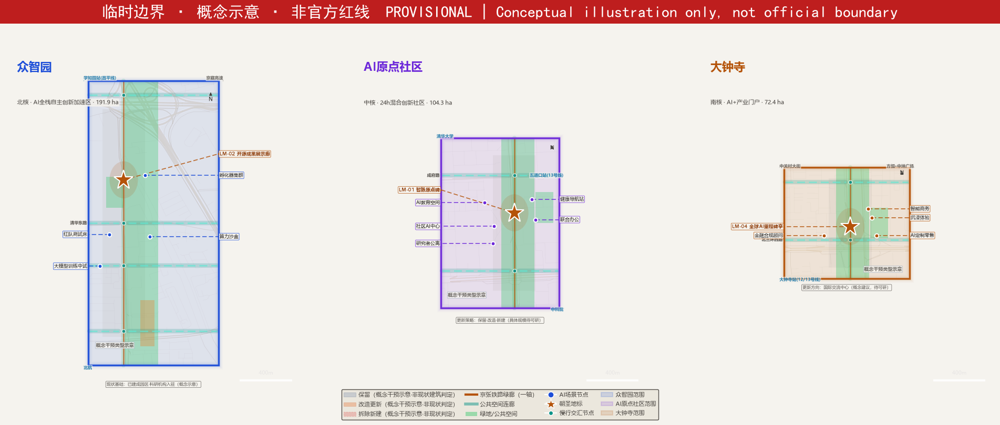


> 概念剖面为空间意向表达，非建筑方案；建筑高度、体量和布局均待专业团队深化研究和控规审批。


*图4b 城市设计导则——京张绿廊大道、核心区内部街道、两翼联系道路三种典型断面概念示意；三核差异化高度概念方向（众智园以中低层研发街区为主、AI原点以低多层混合社区为主、大钟寺以中高层商务集群为主，均为概念体量方向，非法定高度控制，具体高度、容积率和退线以控规和城市设计导则为准）；底层架空、POPS、5min步行覆盖等公共空间界面导则；用地平衡表含概念性FAR/密度/绿地率指标。所有指标为概念建议值，以控规为准。*

### 小月河场景赋能翼（东翼）深化设计

小月河场景赋能翼是AI+生活场景的"开放试验场"，沿小月河（东升段至学院路段）约3km，串联三核东侧的居住社区、高校和产业用地。与三核的"研发-生态-产业"主线不同，东翼聚焦**可感知、可体验、可测试**的AI生活场景。

**空间节点（概念建议，自北向南）**：

| 节点 | 位置 | 功能 | 对应场景 |
|------|------|------|---------|
| **E-01 具身智能测试巷** | 众智园东侧，北航至学清路 | 低速机器人配送专用道（SC-08）、无人清扫测试、外骨骼辅助行走体验 | SC-08 |
| **E-02 自动驾驶接驳站** | 清华东路西口，三核间连接路 | L4级微循环接驳（SC-09）首末站、V2X路侧单元展示、候车亭AI信息柱 | SC-09 |
| **E-03 AI生活实验室** | AI原点社区东侧，五道口周边 | 社区AI场景试验——AI健康导航（SC-05）、无障碍畅行助手（SC-11）、智慧养老示范间 | SC-05/11 |
| **E-04 提示广场（东翼分场）** | 大钟寺东侧，小月河与北三环交汇 | 人-AI共创公共空间（Type B提示广场的东翼节点），市民AI艺术共创、数据可视化墙 | SC-01/10 |
| **E-05 AI公共服务站** | 南翼社区群 | 公共议题智能路由（SC-12）服务站、AI法律助手（SC-07）社区版、AI教育空间（SC-06）分点 | SC-06/07/12 |

**公共体验路径**：设计一条"AI生活漫步道"（AI Life Walk），从北至南串联E-01至E-05，全长约3km，步行约45分钟。路径上设置：
- **5个体验站**（E-01至E-05），每个站可体验1-2个AI场景
- **3个道岔广场**（Type D），分别位于学清路口、清华东路口、北三环口，居民可"扳道"选择东翼AI配置
- **2座算力水塔**（Type A），分别在E-01和E-04附近，提供边缘算力和5G覆盖
- **连续智慧慢行道**：地面嵌入压力传感器和LED导引，支持机器人和行人混行（物理隔离时段+混行时段）

**与三核的协同**：东翼不是独立功能区，而是三核AI场景的"户外实验室"——众智园研发的机器人在E-01测试，AI原点的健康AI在E-03落地，大钟寺的AI消费在E-04体验。测试通过的场景可"merge"到主脉全带推广。

> 小月河翼空间节点为概念建议，具体选址、工程条件和用地性质待专业团队深化研究。

### AI原点社区城市设计导则（示例深化）

以中核AI原点社区（104.3 ha）为例，提出可操作的城市设计导则框架，供专业团队深化为控规导则。以下指标均为**建议性概念指标**，非审批依据，最终以控规和城市设计导则为准 [standard:MOHURD-CONTROL-DETAILED-PLANNING] [standard:MOHURD-URBAN-DESIGN-MEASURES]。

**功能混合导则**：
| 功能类型 | 建议占比 | 空间布局 | AI原生特征 |
|---------|---------|---------|-----------|
| AI研发办公 | 35-40% | 沿主脉两侧，中高层 | 可挂载算力接口、数据沙盒工位 |
| 人才公寓/居住 | 25-30% | 街区内部，低多层 | 智能家居试点、社区健康监测（匿名） |
| 公共服务/社区 | 10-15% | 底层沿街+中心广场 | AI健康站、AI教育空间、法律助手站 |
| 商业/文化/展示 | 10-15% | 沿主脉+地标节点 | AI文化导览、无人零售测试、开源展示 |
| 绿地/公共空间 | ≥15% | 绿廊+口袋公园+广场 | 神经绿廊传感器节点、智脉心跳光河 |

**开发强度概念方向**（仅供城市设计深化参考，非审批依据，具体指标以法定控规为准）：
- 沿主脉第一界面：以中高强度混合开发为概念方向，地标节点可适当提高辨识度，具体容积率与建筑高度待控规编制时结合视廊分析、交通承载力和市政容量确定
- 街区内部：以中低强度居住与研发混合为概念方向，鼓励小街区密路网和围合式布局，具体开发强度待控规确认
- 滨水/绿廊界面：以低强度、高通透性为概念方向，保证绿廊视觉渗透和公共空间连续性，具体退线和高度控制待控规和城市设计导则确定
- 三核重点区内建筑密度与绿地率为概念性体量示意（本方案圆角C形/U形围合式街坊概念体量建筑密度约18%，绿地率约31%），非审批建筑面积；具体密度、绿地率和硬质铺装透水率等指标待控规编制时结合《城市用地分类与规划建设用地标准》和北京市相关规定确定

**街道与公共空间导则**：
- 主脉绿廊宽度建议≥80m，其中慢行道≥6m、跑步道≥3m、植被缓冲带≥20m
- 街区路网间距建议80-120m，小街区密路网，所有道路设置无障碍通道
- 街道家具（座椅、路灯、标识、垃圾桶）统一设计语言，预留AI模块挂载接口
- 中心广场（LM-01智脉原点碑）建议尺度50×80m，可容纳200人集会，设户外供电和网络

**交通导则**：
- 机动车：外围环路+地下停车，街区内部机动车限速20km/h，优先慢行
- 公交：建议微循环电动巴士，三核间5分钟一班，接驳地铁站点
- 慢行：绿廊连续慢行道+街区步行网络，所有交叉口设无障碍坡道
- 测试道路：东翼指定道路作为低速机器人和自动驾驶测试区，物理隔离+安全员

**实施路径建议**（待可行性研究）：
1. 近期（1-2年）：完成AI原点社区详细城市设计导则编制，启动中心广场和绿廊示范段建设
2. 中期（2-4年）：首批混合用地出让，人才公寓建成，首批AI场景入驻
3. 远期（4-7年）：社区全面运营，城市OS上线，场景持续迭代

### 三核三维空间表达

为补充平面图和剖面图的三维感知，以下提供两类三维图件：

**（一）空间分析轴测图**——基于buildings.geojson中441栋建筑的实际坐标和层数生成，展示三核的建筑高度关系、绿廊空间渗透和标志性节点位置。建筑高度按层数×3.5m概念推算，金色为标志性建筑，绿色为京张绿廊主脉。此图与总平面图、用地结构图空间对应，可作为空间分析依据。


*图：众智园（北核）轴测鸟瞰——191.9ha，256栋概念建筑，蓝色为AI研发/实验室，金色为扇形机车库（保留）、算力中心、红队测试床、开源成果展示廊等标志节点，绿廊自南向北贯穿*


*图：AI原点社区（中核）轴测鸟瞰——104.3ha，109栋概念建筑，黄色为居住/人才公寓，紫色为办公/混合，金色为社区AI中心、AI教育空间、人才公寓标志节点，绿廊居中分隔东西片区*


*图：大钟寺（南核）轴测鸟瞰——72.4ha，76栋概念建筑，红色为商业/配套，紫色为办公/总部，金色为AI总部大楼（26层区域制高点）、商业中心、轨道接驳枢纽、AI展示中心，绿廊自北向南*

**（二）效果意向图**——AI生成的建筑效果意向图，表达建成后的空间氛围、材质和尺度感。此图为视觉表达，建筑数量、街道网格和具体位置与公开地图不对应，空间位置以上述空间分析轴测图和总平面图为准。

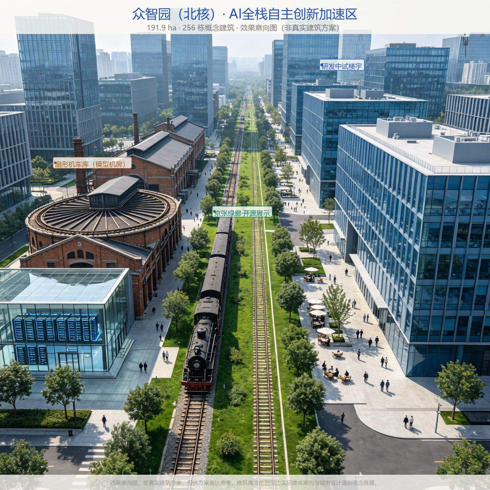

*图：众智园（北核）效果意向——保留的扇形机车库（右上红砖建筑）改造为开源成果展示廊，深色建筑为算力中心，蓝灰玻璃为AI研发塔楼群，线性绿廊南北贯通*

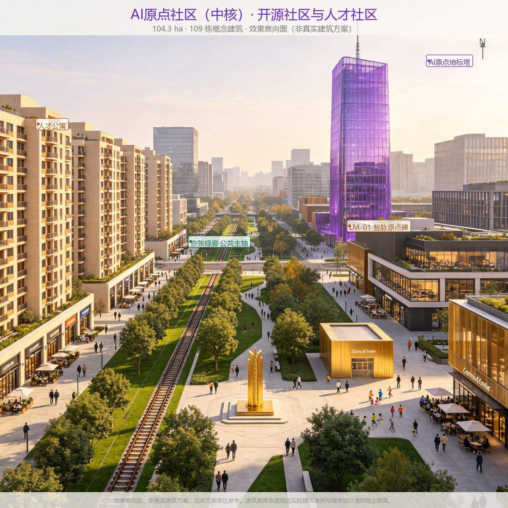

*图：AI原点社区（中核）效果意向——左侧暖色调为居住和人才公寓（6-12层），右侧蓝玻璃为TOD混合塔楼（最高20层），中央绿廊含社区花园和儿童活动场*

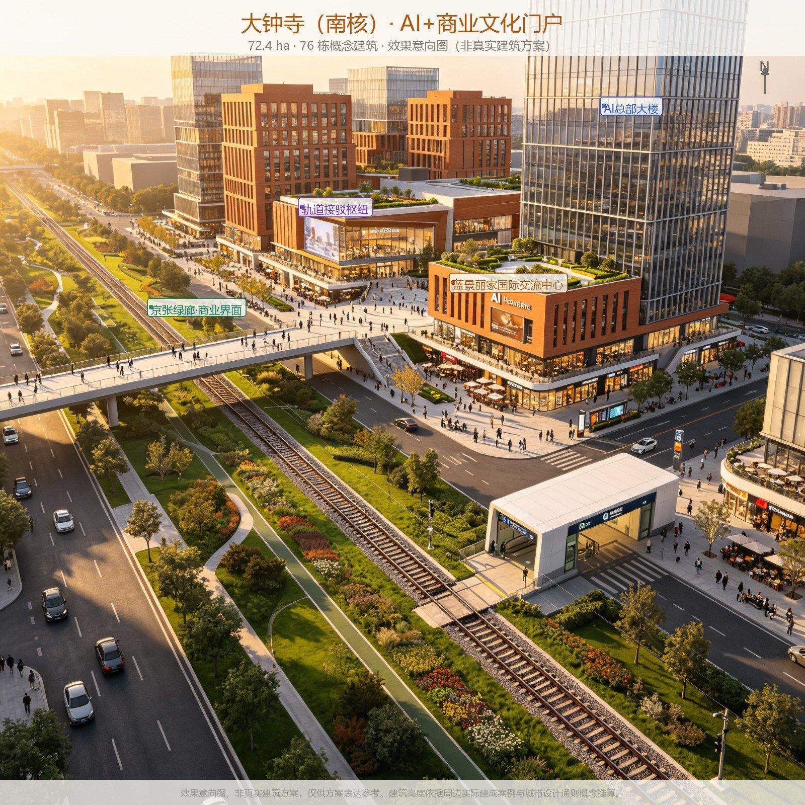

*图：大钟寺（南核）效果意向——金色玻璃塔楼为AI总部大楼（概念性中高层体量方向，非建筑设计方案，具体高度、层数和体量待控规和建筑设计确定），西侧红砖为商业街区，线性绿廊南北贯通*

> ⚠ 以上轴测图为概念性空间表达，建筑高度、体量、位置均为agent推断，非真实建筑方案。效果意向图为AI生成，不代表真实建筑设计，空间位置以总平面图和空间分析轴测图为准。provisional boundary, official_boundary=false。

## AI 创新生态、人才画像与 AI+ 场景

### 用户画像（5 类）

| 画像 | 核心需求 | 空间触点 | AI 触点 | 隐私关切 |
|------|---------|---------|--------|---------|
| AI研究者（25-45岁） | 算力、数据、同行交流、安静深度工作 | 众智园实验室、开放沙盒、开发者散步道 | 训练平台、论文检索、代码协作 | 研究数据保密、不监控 |
| AI创业者（25-40岁） | 融资、人才、客户、中试空间 | AI原点混合办公、西翼金融节点、展示廊 | 法律助手、算力沙盒、场景匹配 | 商业秘密、客户数据 |
| 学生（18-28岁） | 学习、实习、社交、低成本空间 | AI教育空间、散步道、人才公寓 | AI学习工具、职业匹配、开源社区 | 未成年人保护、不画像 |
| 居民（全年龄） | 日常生活、健康、教育、公共服务 | 社区中心、口袋公园、健康站、慢行道 | 健康导航、无障碍畅行助手、公共议题路由 | 数据最小化、不二次利用 |
| 城市治理者 | 高效管理、快速响应、数据决策 | 运营中心、全脉传感网络 | 公共议题路由、事件预警、数字孪生 | 不个人监控、数据公益 |

**用户画像量化指标（概念性估算，待运营阶段实测校准）**：

| 画像 | 目标人群规模(概念) | 日均使用频次 | 核心需求优先级 | 支付意愿(月) | 关键转化指标 |
|------|------------------|------------|--------------|------------|------------|
| AI研究者 | 约3000-5000人（三核高校+研究院+企业） | 3-5次/周 | 算力>数据>交流>安静空间 | 200-500元（算力/工位） | 算力沙盒使用率≥70%、论文产出≥50篇/年 |
| AI创业者 | 约500-1000人（初创团队+独立开发者） | 5-7次/周 | 融资>人才>客户>中试 | 500-2000元（办公/服务） | 入驻企业≥100家、融资≥10笔/年 |
| 学生 | 约20000-30000人（周边高校在校生） | 2-3次/周 | 学习>实习>社交>低成本 | 0-50元（主要免费/补贴） | 年培训≥2000人次、实习对接≥500人 |
| 居民 | 约45万人（周边70个社区） | 1-2次/周 | 日常>健康>教育>公共服务 | 0-100元（基本服务免费） | 居民满意度≥80%、活动参与≥5万人次/年 |
| 城市治理者 | 约200-500人（街道+委办局+运营方） | 每日使用 | 管理>响应>决策>协同 | 政府采购 | 事件响应时效≤30分钟、数据公开率≥90% |

> 人群规模为基于周边高校、社区和企业密度的概念性估算，非官方统计数据。实际规模待运营阶段通过注册用户和客流统计校准。支付意愿为参照同类创新区（中关村、张江、深圳湾）的区间估算，具体定价待市场调研。

### AI 场景卡（18 张，含 7 张测试验证）[metric:ai_scenario_nodes]

| 编号 | 场景名称 | 目标用户 | 空间落点 | 状态 | 隐私/人工复核 |
|------|---------|---------|---------|------|-------------|
| SC-01 | 开发者散步道 | 研究者/创业者 | 绿廊中段 | 概念建议 | 无个人数据采集 |
| SC-02 | 开源成果展示廊 | 研究者/学生/公众 | 众智园旧厂房 | 概念建议 | 仅展示已公开成果 |
| SC-03 | 模型红队测试床 | AI安全研究者 | 众智园封闭区 | **测试验证** | 物理/网络隔离，人工报告审核 |
| SC-04 | 开放算力沙盒 | 初创/研究者/学生 | 众智园算力中心 | **测试验证** | 配额制，留痕审计 |
|| SC-05 | AI+健康导航站 | 居民/老年人 | AI原点社区 | 概念建议 | 不存个人健康数据，转医生 |**现实锚点**：海淀区卫健委"智慧健康社区"试点、学院路社区卫生服务中心、北医三院/海淀医院、北大医学部。拟嵌入既有社区卫生服务流程，不替代医生诊断 |
|| SC-06 | AI教育空间 | 学生/教师 | AI原点混合街区 | 概念建议 | 未成年人需家长同意 |**现实锚点**：海淀区教委"智慧教育示范区"、北航/北语/地大相关学院、中科院软件所人机交互实验室、北京青少年科技中心。优先对接高校开放日与社区周末课堂，不替代校内课程 |
|| SC-07 | AI公共法律助手 | 创业者/居民 | 大钟寺 | 概念建议 | 复杂案件转律师，非正式意见 |**现实锚点**：海淀区司法局中关村法律服务中心、北邮互联网治理与法律研究中心、北师大法律系、中关村科学城企业法律诊所。定位为法律信息检索+合同初筛+流程指引，不输出正式法律意见 |
| SC-08 | 低速机器人配送 | 居民/商户 | 东翼慢行道 | **测试验证** | 导航用摄像头不人脸识别 |
| SC-09 | 自动驾驶接驳 | 通勤者/访客 | 三核间连接路 | **测试验证** | 安全员在车，可随时接管 |
| SC-10 | AI文化导览 | 访客/市民 | 4处地标+遗产节点 | 概念建议 | 位置数据仅当次会话 |
| SC-11 | 无障碍畅行助手 | 障碍人士/老人 | 全脉公共空间 | 概念建议 | 优先本地处理，不上传影像 |
| SC-12 | 公共议题智能路由 | 居民/商户 | 数字接口+小程序 | 概念建议 | 可匿名，人工确认工单 |
| SC-13 | AI定制零售体验 | 消费者/品牌 | 大钟寺商业空间 | 概念建议 | 不做面部识别，偏好数据本地存储 |
| SC-14 | AI金融与合规顾问 | 创业者/中小企业 | 大钟寺商务空间 | 概念建议 | 不替代持牌金融机构，建议转人工 |
| SC-15 | AI沉浸式体验空间 | 访客/家庭/学生 | 大钟寺门户区 | 概念建议 | 内容审核+年龄分级，不采集生物特征 |
| SC-16 | 人形机器人餐饮服务测试 | 消费者/商户 | 大钟寺商业空间 | **测试验证** | 不采集生物特征，人工复核订单 |
| SC-17 | 人形机器人导览接待 | 访客/市民 | 4处地标+绿廊节点 | **测试验证** | 位置数据仅当次会话，不追踪 |
| SC-18 | 应急救援机器人演练 | 应急部门/公众 | 绿廊开放空间 | **测试验证** | 演练时段公示，不存储个人影像 |

所有场景遵循三原则：数据最小化、人类在环、测试≠运营。测试验证场景（SC-03/04/08/09/16/17/18）明确标注为测试状态，不表述为已批准运营 [standard:PROJECT-AGENT-OPEN-CALL-TASKBOOK]。其中SC-16/17/18对接第二届世界人形机器人运动会21项实景挑战方向，作为"竞技→日常"的城市级转化测试。

**测试验证场景量化方案（SC-03/04/08/09/16/17/18）**：

| 场景 | 测试空间参数 | 测试规模 | 关键KPI（目标值） | 安全措施 | 退出/升级条件 |
|------|------------|---------|-----------------|---------|-------------|
| **SC-03 模型红队测试床** | 封闭测试区约2,000㎡，物理围墙+独立网络（与园区网物理断开），含3间对抗测试室、1间报告评审室 | 同时容纳≤30名安全研究员；每批次测试周期2-4周；年服务模型≥50个 | 高危漏洞发现率≥80%（对比已知CVE集）；误报率≤15%；人工复核覆盖率目标100%（待验证）；平均修复响应≤72小时 | 物理隔离+网络断连+门禁；测试模型不得连接生产环境；所有对抗样本脱敏存储；报告经人工审核后方可反馈模型方 | 连续3批次无高危漏洞→可进入下一安全等级；发生数据泄露→立即暂停并通报 |
| **SC-04 开放算力沙盒** | 算力中心约3,500㎡，含GPU训练区（约100P算力）、模型机房Type C、开发者工位40个 | 注册用户≤500人（初创团队+高校研究者+学生）；并发训练任务≤20个；单任务配额≤8卡时/天 | 任务排队时间≤30分钟；GPU利用率≥70%；沙盒逃逸事件=0；用户满意度≥4.0/5.0；初创孵化数≥10个/年 | 配额制+全操作留痕审计；沙盒容器隔离，禁止访问宿主网络；数据不出沙盒；学生用户需导师背书 | 连续6个月逃逸事件=0且利用率≥80%→可扩容算力；发生逃逸→立即冻结账户并审计 |
| **SC-08 低速机器人配送** | 东翼慢行道概念测试段（约1km级，具体线位待交通评估和主管部门审批），专用机器人通道与行人道柔性隔离 | 测试机器人≤10台（3家企业各≤3台+1台备用）；配送时段7:00-21:00；速度≤10km/h；载重≤50kg | 准点送达率≥95%；行人干扰事件≤0.5次/100km；紧急制动成功率目标100%（待验证）；噪音≤55dB；居民满意度≥70% | 每台机器人配远程安全员（1人监控≤3台）；激光雷达+视觉双冗余；紧急制动距离≤1m（10km/h）；导航摄像头本地处理，不做人脸识别 | 连续30天目标零事故（待现场验证）→可申请扩展；发生碰撞→立即暂停涉事机器人 |
| **SC-09 自动驾驶接驳** | 三核间连接路概念测试段（数公里级，具体线位、V2X点位和停靠站待交通评估、交警审批和道路条件确认） | 测试车辆≤4辆（L4级微循环巴士，每辆≤8座）；发车间隔10-15分钟；运营时段7:00-22:00；速度≤30km/h | 准点率≥90%；接管率≤0.2次/100km；乘客满意度≥4.0/5.0；站点覆盖率（500m半径）≥85%；日均载客≥200人次 | 每车配1名安全员（可随时接管）；车路协同V2X+5G远程监控；恶劣天气自动停运；事故5分钟内响应 | 连续90天零主责事故→可申请延长测试范围；发生主责事故→立即停运整改 |
| **SC-16 人形机器人餐饮服务测试** | 大钟寺商业空间内指定餐饮区（约500㎡概念测试区，含取餐台、餐桌、通道），与普通消费者区域柔性隔离 | 测试机器人≤6台（2家企业各≤2台+2台备用）；服务时段11:00-14:00、17:00-20:00；速度≤3km/h；载重≤10kg | 送餐准确率≥98%；碰撞事件≤0.1次/100小时；顾客满意度≥4.0/5.0；订单人工复核率100%（首年） | 每台配远程监控员（1人监控≤3台）；激光雷达+触觉传感器双冗余；急停按钮物理可达；不采集顾客生物特征 | 连续60天零碰撞→可扩展服务时段；发生碰撞→立即暂停并召回 |
| **SC-17 人形机器人导览接待** | 4处朝圣地标+绿廊关键节点（共6个测试点，每点约100㎡接待区） | 测试机器人≤8台（每点1-2台）；服务时段9:00-18:00；速度≤2km/h | 导览准确率≥95%；游客投诉率≤1%；位置数据仅当次会话；日均服务≥50人次/台 | 远程人工接管通道；遇到儿童/老人自动减速并保持1.5m距离；不追踪游客身份；紧急情况可呼叫人工 | 连续90天零投诉→可增加测试点；发生安全事件→立即暂停 |
| **SC-18 应急救援机器人演练** | 绿廊开放空间指定演练区（约2,000㎡，含模拟废墟、坡道、台阶），演练时段提前公示 | 测试机器人≤4台（含搜救、搬运、医疗辅助各类型）；演练频次每月1-2次；每次≤4小时 | 搜救定位准确率≥90%；搬运成功率≥85%（50kg级）；演练零安全事故；应急部门满意度≥4.0/5.0 | 演练区域物理隔离+公示；全程人工监控；不存储公众影像；与属地应急部门联合演练 | 连续6次演练达标→可纳入区级应急预备力量；发生安全事故→立即终止演练 |

**测试验证场景改造前后对比**：

| 维度 | 现状（2026年） | 测试期（近期1-3年） | 成熟期（远期5-10年） |
|------|--------------|-------------------|-------------------|
| AI安全测试 | 企业各自封闭测试，缺乏公共红队平台 | 公共红队测试床年服务≥50个模型，漏洞库共享 | 成为国家级AI安全测评节点，标准输出 |
| 算力获取 | 初创/学生获取GPU困难，排队数周 | 沙盒配额制，≤30分钟排队，年服务≥500人 | 算力规模扩至500P，孵化企业≥50家 |
| 末端配送 | 人工配送，电动车混行，安全隐患 | 东翼概念测试段，约10台机器人，准点率≥95% | 条件成熟后扩展至东翼全段，覆盖更多社区 |
| 三核接驳 | 公交+步行，三核间通勤约25分钟 | 三核间概念测试段，4辆接驳车，准点率≥90% | 条件成熟后扩展至全段智能接驳 |
| 人形机器人服务 | 仅在冰丝带等场馆短期赛事展示，无城市日常测试空间 | 大钟寺/地标/绿廊设3类测试场景（餐饮/导览/应急），共≤18台机器人，对接运动会实景挑战 | 成为人形机器人城市级常态化测试走廊，京张机器人挑战赛年度举办 |


**七张测试验证卡首年候选机构与里程碑（概念建议，待政府对接确认）**：

以下为7张测试验证场景卡（SC-03/04/08/09/16/17/18）建议的首年候选合作机构类型和具体方向，附测试里程碑。候选机构基于公开信息中在海淀已有布局或技术匹配度较高的单位，不代表已达成合作意向。其中SC-16/17/18优先对接第二届世界人形机器人运动会参赛企业和海淀具身智能创新产业园资源。

**SC-03 模型红队测试床（众智园封闭区）**：

| 候选方向 | 建议合作机构类型 | 首年投入（概念） | 合作模式 |
|---------|---------------|---------------|---------|
| AI安全评测 | 智源研究院（BAAI，海淀）、国家信息技术安全研究中心 | 平台共建+标准研制 | 政府提供场地，机构提供评测能力 |
| 大模型红队 | 清华AI安全中心、中科院信工所、高校安全实验室 | 联合课题+漏洞赏金 | 年度课题制，漏洞库共享 |
| 企业安全测试 | 百度安全、360AI安全研究院、蚂蚁安全实验室 | 付费测试+认证 | 企业付费使用测试床，出具安全认证 |

| 里程碑 | 时间 | 通过标准 |
|--------|------|---------|
| M1 测试床建成 | Y1 Q3 | 封闭区物理隔离+网络隔离验收通过，算力≥20P |
| M2 首批模型入场 | Y1 Q4 | ≥3家机构签署测试协议，≥10个模型完成首轮红队 |
| M3 漏洞库共享 | Y2 Q2 | 发现并披露≥20个高危漏洞，建立行业共享机制 |
| M4 标准输出 | Y2 Q4 | 联合发布≥1项AI安全测试团体标准/白皮书 |

**SC-04 开放算力沙盒（众智园算力中心）**：

| 候选方向 | 建议合作机构类型 | 首年投入（概念） | 合作模式 |
|---------|---------------|---------------|---------|
| 算力基础设施 | 华为昇腾/寒武纪（国产算力）、阿里云/腾讯云（弹性算力） | 硬件捐赠或折扣+联合运营 | 厂商提供GPU，运营方负责调度 |
| 开源社区 | Hugging Face、ModelScope（魔搭）、GitHub | 镜像站+开发者活动 | 平台入驻，联合举办黑客松 |
| 高校人才 | 清华、北大、北航、中科院计算机所 | 导师背书+课程认证 | 学生免费配额，导师项目优先 |

| 里程碑 | 时间 | 通过标准 |
|--------|------|---------|
| M1 沙盒上线 | Y1 Q4 | 注册用户≥200人，并发训练任务≥10个，排队≤30分钟 |
| M2 高校接入 | Y2 Q1 | ≥5所高校签署合作，学生用户≥500人 |
| M3 满负荷运行 | Y2 Q3 | 利用率≥70%，沙盒逃逸事件=0，用户满意度≥4.0 |
| M4 孵化首批 | Y2 Q4 | ≥10个初创团队完成孵化，≥3个获得融资 |

**SC-08 低速机器人配送（东翼慢行道1.2km测试段）**：

| 候选方向 | 建议合作机构类型 | 首年投入（概念） | 合作模式 |
|---------|---------------|---------------|---------|
| 配送机器人 | 美团无人配送、京东物流、新石器（海淀已有测试） | 企业自带设备+保险 | 企业申请测试许可，自担安全责任 |
| 远程监控 | 运营平台+第三方安全监管 | 监控中心+安全员 | 1人监控≤3台，7:00-21:00在岗 |
| 社区协同 | 学院路街道、70个社区居委会 | 居民沟通+投诉渠道 | 测试前公示，社区议事会月度评议 |

| 里程碑 | 时间 | 通过标准 |
|--------|------|---------|
| M1 测试段验收 | Y1 Q3 | 1.2km专用道+柔性护栏+标识系统验收，测试保险到位 |
| M2 首期测试 | Y1 Q4 | ≤3家企业各≤3台入场，准点率≥95%，零碰撞 |
| M3 扩展评估 | Y2 Q2 | 连续90天目标零事故（待现场验证），行人干扰≤0.5次/100km，居民满意度≥70% |
| M4 扩展决策 | Y2 Q3 | 通过则扩展至2.4km/20台；不通过则暂停整改 |

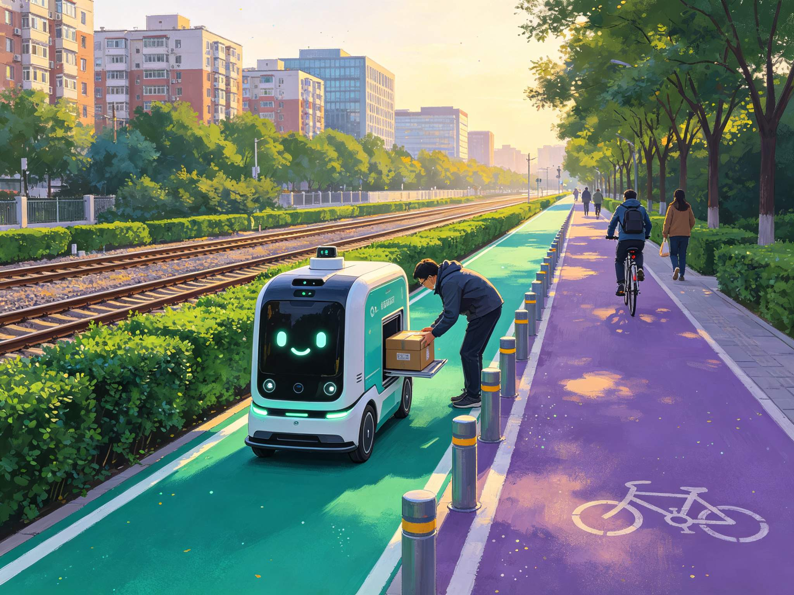

> 概念设计意向图（AI辅助生成，非实景、非最终方案）。

**SC-09 自动驾驶接驳（三核间3.5km测试段）**：

| 候选方向 | 建议合作机构类型 | 首年投入（概念） | 合作模式 |
|---------|---------------|---------------|---------|
| L4微循环巴士 | 百度Apollo（海淀已有运营）、小马智行（Pony.ai，海淀）、轻舟智航 | 企业自带车辆+安全员 | 企业申请道路测试许可，政府协调路侧设施 |
| V2X路侧 | 千方科技（海淀）、华为车BU、万集科技 | 路侧单元+信号对接 | 新基建投资，企业建设运营 |
| 公交协同 | 北京公交集团、京港地铁（13号线） | 站点衔接+时刻表协同 | 接驳线与地铁时刻衔接，一卡通支付 |

| 里程碑 | 时间 | 通过标准 |
|--------|------|---------|
| M1 路侧设施建成 | Y1 Q3 | 8处V2X单元+3座停靠站验收，信号系统对接完成 |
| M2 首期测试 | Y1 Q4 | ≤4辆L4巴士入场，接管率≤0.2次/100km，准点率≥90% |
| M3 有限载客 | Y2 Q1 | 通过安全评估后开放公众乘坐，日均载客≥200人次 |
| M4 扩展评估 | Y2 Q4 | 连续90天零主责事故，满意度≥4.0/5.0，通过则申请全段9km |

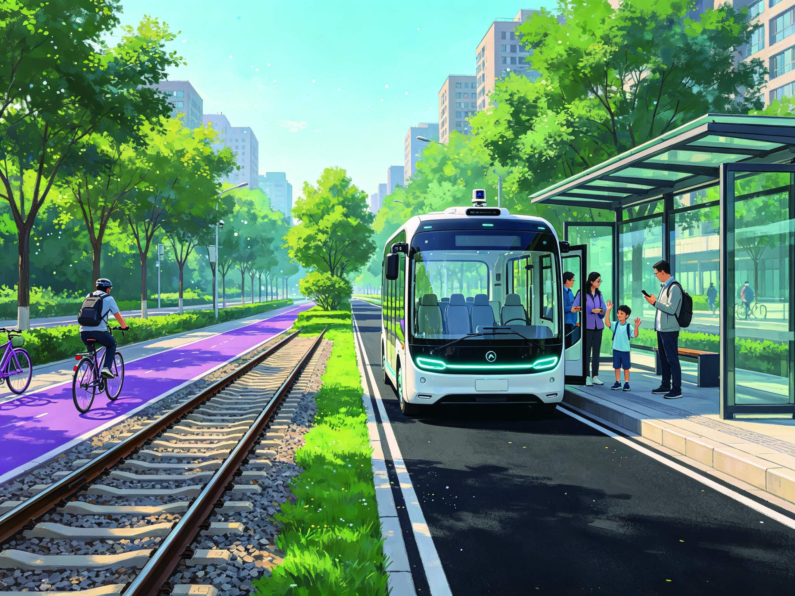

> 概念设计意向图（AI辅助生成，非实景、非最终方案）。


**候选机构未落实时的备选路径与兜底方案**：

| 场景 | 首选路径 | 备选路径（候选机构未落实） | 自运营兜底方案 |
|------|---------|------------------------|-------------|
| SC-03 红队测试床 | 智源/清华/企业安全实验室联合 | 委托中国信息安全测评中心或国家AI安全治理框架指定机构 | 运营平台自建最小红队（3-5名安全工程师），先做G1/G2设计验收测试（概念性，尚未执行），物理安全测试延后至机构入场 |
| SC-04 算力沙盒 | 华为/阿里等厂商捐赠/折扣+开源社区 | 申请北京市算力券补贴或海淀区AI算力支持政策，租用商业算力 | 运营平台采购/租赁最小算力（20-50P）启动，高校配额免费，商业用户按量付费覆盖运营成本 |
| SC-08 机器人配送 | 美团/京东/新石器自带设备入场 | 邀请海淀其他测试企业（如白犀牛、行深智能），或降低首年台数至≤3台 | 若首年无企业入场，测试段暂不启用机器人，仅作为慢行提升工程交付；M1验收的物理设施（护栏/标识）不浪费，待企业就绪后启动 |
| SC-09 自动驾驶接驳 | 百度Apollo/小马智行自带车辆 | 邀请海淀已获T4牌照的其他企业，或先用固定路线无人小巴（较低速L4） | 若首年无企业入场，3.5km段先作为V2X智慧道路示范（信号优先/公交到站预测），L4接驳延后至Y2；路侧设施投资不浪费，直接服务公交优先 |

**兜底原则**：①物理设施（道路、护栏、V2X、停靠站）无论企业是否入场都按城市更新工程建设，不构成沉没成本；②测试服务可延后但不跳过闸门——任何企业入场仍须通过G1/G2/G3和V1-V5；③首年预留一定比例自运营启动资金（具体金额待可研），确保无企业入场时最小验证环境可运行。

> 以上候选机构为基于公开信息的建议方向，不代表已建立合作关系。实际合作需经政府采购、企业遴选和安全评估等法定程序。测试数据全部公开，接受社区和媒体监督。


**场景空间锚定逻辑（为何在此处）**：

| 编号 | 空间锚点 | 为何在此处 |
|------|---------|-----------|
| SC-01 开发者散步道 | 绿廊中段（LM-03） | 京张绿廊已建成9km连续慢行空间，70社区45万人日常使用；代码星光大道沿铁路遗址布置，将"散步"这一铁路旅客记忆转化为开发者交流仪式 |
| SC-02 开源成果展示廊 | 众智园旧厂房（LM-02） | 众智园北核聚集大模型训练与开源力量；旧厂房（铁路扇形车库类型）本身即"开源"的工业遗产隐喻，改造为中国开源AI成果荣誉堂 |
| SC-03 红队测试床 | 众智园封闭区 | 北核定位AI自主创新加速，需物理与网络双重隔离的安全测试环境；远离居住和商业，降低测试风险外溢 |
| SC-04 算力沙盒 | 众智园算力中心 | 紧邻算力水塔和模型机房，利用北核集中算力基础设施；配额制+留痕审计，服务初创和学生 |
| SC-05 健康导航站 | AI原点社区 | 中核定位AI原点社区，研究者与居民混合居住；社区健康站嵌入提示广场周边，服务全龄居民，不存个人数据 |
| SC-06 AI教育空间 | AI原点混合街区 | 中核紧邻高校（北航/北语/地大等），学生人口密集；教育空间与人才公寓、提示广场步行可达 |
| SC-07 法律助手 | 大钟寺 | 南核定位AI产业集聚，企业总部和商务服务集中；法律助手嵌入商务空间，服务创业者合同/合规需求 |
| SC-08 机器人配送 | 东翼慢行道 | 东翼（小月河）定位场景赋能，已有成熟居住社区和慢行网络；低速度、物理隔离，适合末端配送测试 |
| SC-09 自动驾驶接驳 | 三核间连接路 | 三核间9km绿廊平行道路提供连续测试走廊；13号线拆分后知春路等站客流大，接驳需求真实 |
| SC-10 文化导览 | 4处地标+遗产节点 | 4处朝圣地标沿绿廊串联，京张铁路遗址本身即叙事内容；导览仅当次会话位置数据，不追踪 |
| SC-11 无障碍畅行 | 全脉公共空间 | 绿廊已建成段服务45万人含大量老年居民；无障碍助手沿绿廊和三核公共空间部署，本地处理不上传影像 |
| SC-12 公共议题路由 | 数字接口+小程序 | 不依赖特定物理空间，居民通过小程序/道岔广场终端提交；工单经人工确认后派发，可匿名 |
| SC-13 AI定制零售 | 大钟寺商业空间 | 大钟寺站（13/12号线换乘站）客流，南核门户商业价值高；"创作吧台"模式与提示广场同源，将AI共创从公共空间延伸至消费场景；依托13号线拆分后大钟寺商圈更新机遇 |
| SC-14 金融合规顾问 | 大钟寺商务空间 | 南核聚集AI企业总部和金融商务功能；紧邻中关村资本和政策资源（高新认定/加计扣除），创业者步行可达；"AI服务吧台"与提示广场/道岔广场形成"咨询-决策"闭环 |
| SC-15 沉浸式体验 | 大钟寺门户区 | 南核为访客进入创新带的门户（13号线大钟寺站），紧邻LM-04全球AI里程碑亭；旧商业空间改造为沉浸体验，与铁路历史叙事（1909青龙桥）结合，门票反哺社区 |

**大钟寺智能原创新业态场景详述**（SC-13/14/15）：

- **SC-13 AI定制零售体验**：大钟寺商业空间引入AI辅助个性化定制——消费者通过自然语言描述需求（如"帮我设计一件适合通勤的外套"），AI生成设计方案并在店内小型制造单元即时打样；AR试穿/试戴；AI搭配建议。空间特征：店铺取消传统货架，改为"创作吧台"（类似提示广场的商业版），消费者与AI共同设计。不使用面部识别，偏好数据仅存本地，消费者可随时删除。

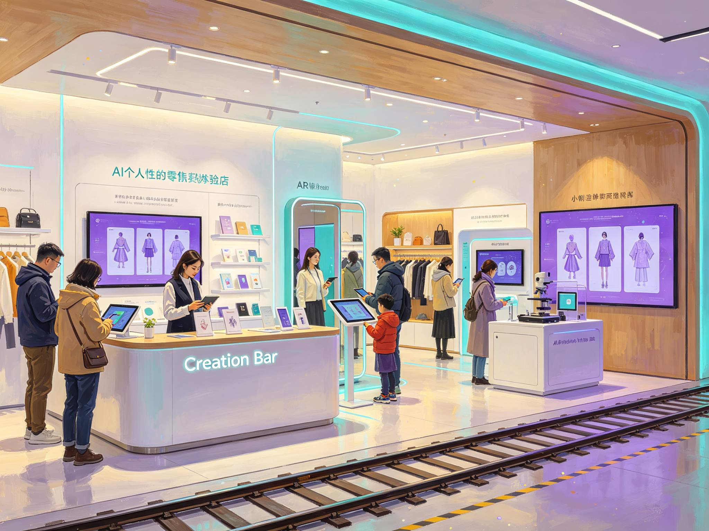

> 概念设计意向图（AI辅助生成，非实景、非最终方案）。

- **SC-14 AI金融与合规顾问**：面向AI创业者和中小企业的一站式AI金融服务站——AI辅助商业计划书生成、估值参考、政策匹配（中关村高新企业认定、研发费用加计扣除等）、知识产权检索、合同初审。空间特征：大钟寺商务楼内设"AI服务吧台"，创业者可预约15分钟免费AI咨询，复杂需求转持牌机构和律师。不替代银行/律所/会计师事务所，所有建议标注"非专业意见，请咨询持牌机构"。
- **SC-15 AI沉浸式体验空间**：大钟寺门户区的AI主题沉浸体验——游客可与AI共同生成京张铁路历史场景（1909年青龙桥人字形铁路、詹天佑时代）、未来AI城市愿景、个人AI肖像等；AI驱动的互动艺术装置；多语言AI导览（中/英/日/韩）。空间特征：约500-1000㎡，利用旧商业空间改造，门票收入部分反哺社区基金。内容经人工审核，设年龄分区，不采集虹膜/指纹等生物特征。

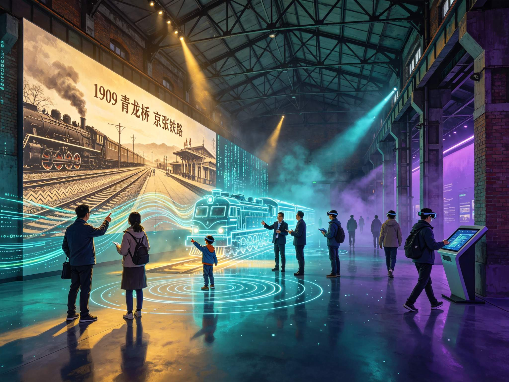

> 概念设计意向图（AI辅助生成，非实景、非最终方案）。

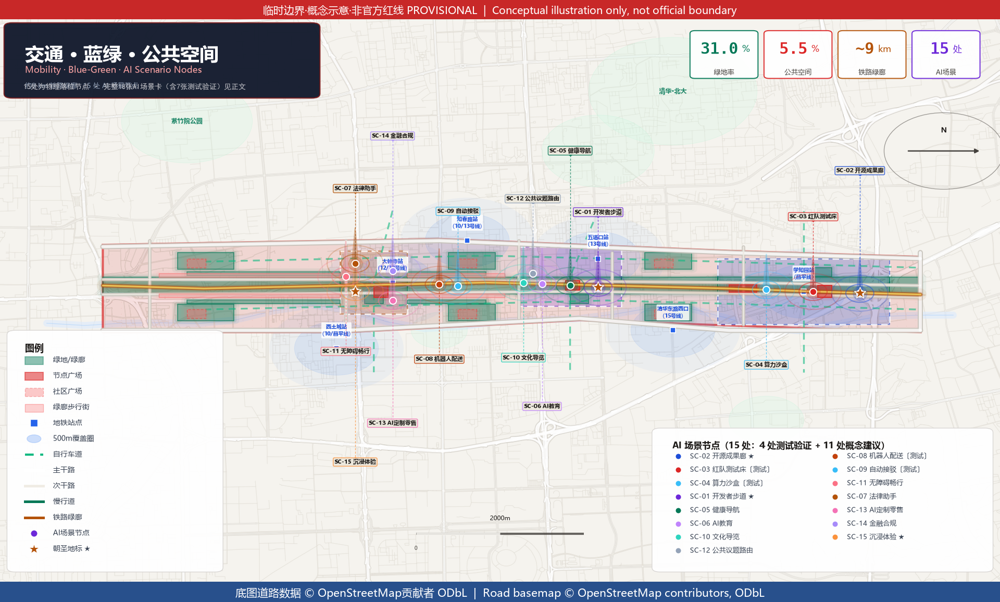

## 用地、建筑规模与拆改留方案

用地分区严格按 geometry/land_use.geojson 六区落实 [data:geometry/land_use.geojson#]，无重叠覆盖总体设计范围约 11.4 km² [metric:site_area_sqm] [metric:land_use_total_sqm] [depth:land_use_layout]。建筑概念体量以 geometry/buildings.geojson 441 栋表达 [data:geometry/buildings.geojson#]，采用围合式街坊布局，建筑沿街道周边布置、内部留庭院，含3栋保留工业遗产（旧厂房、扇形机车库、仓库）以虚线标识；建筑基底约 65.5 万 m² [metric:building_footprint_area_sqm] [metric:building_count]，三核内建筑密度约18%（≤35%导则），仅为体量示意、非审批建筑面积。

开发强度（容积率、建筑高度、密度分区）与拆改留分类全部列为待确认控规条件 [depth:development_intensity_controls] [depth:height_massing_character] [depth:retain_renovate_demolish]：在获取官方精确红线、三核 polygon、现状建筑测绘与权属数据之前，本方案不给出任何容积率数值、不设具体高度、不判定拆/改/留 [assumption:A-BUILD-001]。用地代码参照《国土空间用地用海分类指南》概念映射 [standard:MNR-LAND-USE-CLASSIFICATION-GUIDE]。

## 交通、轨道、市政与公共服务设施

重点区路网密度约4.8 km/km² [metric:road_network_density_km_per_sqkm]，轨道站点800m覆盖率约72% [metric:transit_accessibility_index]。

交通组织以 geometry/roads.geojson 为骨架 [data:geometry/roads.geojson#]：4 条南北向道路（含绿廊两侧慢行路）+ 6 条东西向连接路 + 1 条沿铁路线慢行道，共 11 条概念道路 [depth:traffic_rail_slow_parking]。道路等级：次干路（secondary）、支路（branch）、绿道/慢行（greenway）。轨道站点一体化换乘、片区微循环公交、非机动车优先组织均表述为概念建议，不替代道路红线或工程线位。

市政与新型基础设施方面，提出分布式能源、端侧算力节点与市政管廊融合的"新基建"方向，支撑 AI 原生街区的低时延与低碳运行，相关规模与落点列为深化研究项 [depth:municipal_new_infrastructure]。现状交通流量、轨道客流、市政容量等数据缺口已在 assumptions.json 标注。

**市政容量概念判断**（基于人口和产业规模的量级估算，非工程设计，待专项评估）：

| 市政系统 | 估算依据 | 概念量级 | 与AI需求的关系 |
|---------|---------|---------|--------------|
| **就业/居住人口** | 三核368.6ha，概念开发量约200-300万㎡（研发办公60%+居住20%+商业20%），按研发办公15㎡/人、居住30㎡/人 | 就业约8-12万人，居住约3-5万人，合计11-17万人（含两翼约15-20万人） | AI场景服务人口基数；算力/带宽需求随人口增长 |
| **用水量** | 就业人口150L/人·日，居住人口200L/人·日，公建1.5倍系数 | 全带约2.5-4.0万m³/日（含两翼约3-5万m³/日） | AI数据中心水冷需求额外增加约0.3-0.5万m³/日（若采用液冷则降低） |
| **用电量** | 就业办公80W/㎡，居住50W/㎡，商业100W/㎡，同时系数0.6 | 全带约15-25万kW（含两翼约20-35万kW） | AI算力负荷额外增加约3-8万kW（边缘计算+模型机房，按1000-2000 racks×5-10kW/rack） |
| **通信带宽** | 办公100Mbps/人，居住50Mbps/人，IoT传感器1Mbps/节点（约1万个节点） | 全带约1.5-3.0Tbps（含IoT约10Gbps） | AI场景（机器人/V2X/数字孪生）要求端到端时延<10ms，需边缘计算节点支撑 |
| **算力需求** | 18个AI场景分类估算：训练类（SC-03/04）约100-500P，推理类（SC-05~15）约10-50P，具身智能（SC-08/09/16~18）约5-20P | 全带总算力需求约150-600P（训练峰值），日常推理约20-80P | 算力水塔（Type A）提供共享算力，模型机房（Type C）提供专用训练算力，边缘节点提供低时延推理 |
| **供热/制冷** | 北京供热指标40W/㎡，制冷指标60W/㎡，同时系数0.5 | 全带供热约8-12万kW，制冷约12-18万kW | AI数据中心余热可回收用于周边供热（余热回收率约30-50%），降低整体碳排放 |

> 以上为概念性量级估算，基于人口密度和单位指标法，非工程设计值。精确市政容量需在组织方提供用地性质、开发强度和专项调查后，由市政设计院完成。算力需求估算基于当前AI技术水平，随模型效率提升可能显著下降。

**新基建与传统市政融合策略**（"算力-能源-管廊"三位一体）：

1. **管廊融合**：沿京张绿廊主脉设置综合管廊概念，整合电力（10kV/110kV）、通信（光纤）、给水、再生水管线，同时预留算力节点机柜空间和冷却水管。管廊与绿廊地下空间结合，避免重复开挖。三核各设1处管廊交汇节点（兼作边缘计算站）。

2. **分布式能源**：三核建筑屋顶光伏概念覆盖率≥30%（约5-8万㎡，年发电约500-800万kWh）；绿廊停车场设置光伏车棚（约2万㎡）；模型机房和算力水塔采用余热回收系统，为周边建筑供热。目标：AI算力负荷的绿电占比≥40%（参照海淀R&D强度和碳达峰目标）。

3. **边缘算力布局**：沿9km绿廊每1.5-2km设置1处边缘计算节点（共5-7处），单节点算力10-50P，存储100-500TB，满足机器人/V2X/数字孪生的低时延需求（<10ms）。三核各设1处核心算力节点（算力水塔/模型机房），总算力100-300P，承担模型训练和大数据处理。

4. **微电网与储能**：三核各设1处储能站（概念容量1-5MWh），配合光伏和算力负荷调峰；绿廊路灯采用直流微网，支持LED照明+传感器+充电桩一体化。

5. **智慧市政**：城市OS传感器网络（人流/空气质量/噪声/设施状态）与传统市政监测（供水压力/电网负荷/管廊温度）融合，统一数据平台，实现市政设施的预测性维护和AI驱动的调度优化。

> 新基建融合策略为概念方向，具体管廊路由、电力容量、算力配置和能源方案需在市政专项规划和工程可研阶段确定。AI算力需求和能源消耗需结合实际入驻企业和技术发展动态调整。

约束条件：铁路保护带以 railway_line.buffer(0.0006) 概念表达 [data:geometry/constraints.geojson#]，非文保紫线或道路红线。

## 蓝绿空间、公共空间与城市风貌

京张绿廊作为连续蓝绿与公共活动主轴 [data:geometry/green_space.geojson#] [data:geometry/public_space.geojson#] [metric:green_ratio] [metric:public_space_ratio] [depth:blue_green_public_space]。绿地系统：绿廊主脉（GR-001，约135ha，三核外段）+ 三核中央绿脊（GR-013，约90ha，三核内段）+ 三核口袋公园（GR-002/003/004）+ 两翼6处社区公园（GR-005~010）+ 2处道路绿带（GR-011/012），绿地率约31.0% [metric:green_ratio]。公共空间：4处朝圣地标广场（PS-01~004）+ 两翼6处社区广场（PS-005~010）+ 2处绿廊步行街（PS-011/012），公共空间率约5.5% [metric:public_space_ratio]。

**指标推导依据**：绿地率参照《城市绿地规划标准》GB/T 51346-2019及《北京市城市绿化条例》，新建区域绿地率不低于30%；本方案site-wide绿地率31.0%，三核重点区内绿地率≥30%（含中央绿脊），符合标准要求。公共空间率参照《城市居住区规划设计标准》GB 50180-2018人均公共绿地指标及《城市公共空间规划设计导则》，按15分钟生活圈配置社区广场和步行街。建筑密度参照《城市用地分类与规划建设用地标准》GB 50137及中关村建成区经验，三核内建筑密度约18%（≤35%导则上限），为绿化和公共空间留足余量。

> **公共空间率口径说明**：5.5%为独立占地公共空间（广场、步行街等硬质公共空间），不含绿地。京张绿廊主脉135ha+三核中央绿脊90ha（合计约225ha，占设计范围19.7%）本身即为开放式公共空间，居民可自由进入。此外，三核新建/改造建筑要求底层架空率≥20%（约3.2万㎡灰空间）、私权公共空间（POPS）约2.8万㎡，合计有效公共空间覆盖率约28%（含绿地），人均公共空间约12.5㎡（按三核10万就业/居住人口估算），达到国际创新城区领先水平（Kendall Square约8㎡、King's Cross约10㎡）。

**AI 朝圣地标（4 处）**[metric:ai_pilgrimage_landmarks]：
1. **LM-01 智脉原点碑**：AI原点社区中心广场，标识AI原生创新起点，含开源AI里程碑时间线；
2. **LM-02 开源成果展示廊**：众智园入口旧厂房改造，中国开源AI成果荣誉堂；
3. **LM-03 开发者散步道**：绿廊中段，代码星光大道，地面铭刻杰出开发者/项目；
4. **LM-04 全球AI里程碑亭**：大钟寺门户广场，全球AI发展节点展示。

地标为概念设计，未经文保/绿地/蓝线专项审批，不得写成已批准建设。风貌：铁路遗存肌理+浅灰金属玻璃+克制暖光+青绿基底 [standard:MOHURD-URBAN-DESIGN-MEASURES]。

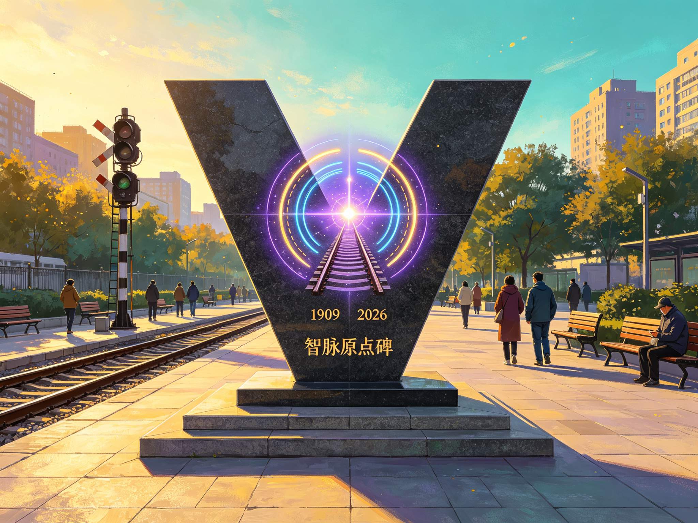

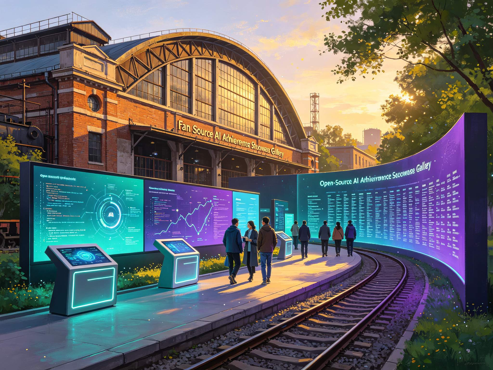

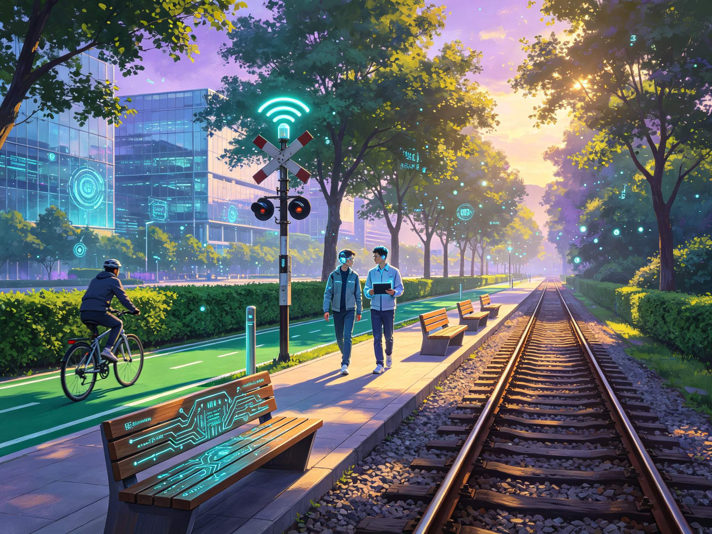

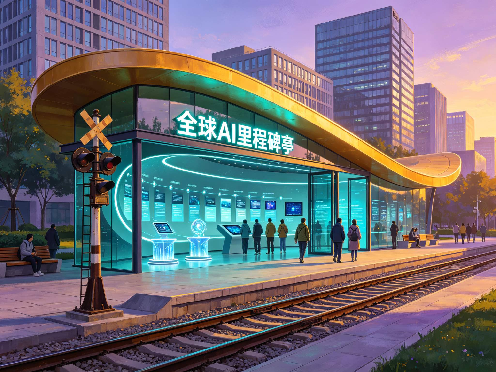

> 以上为概念设计意向图（AI辅助生成，非实景、非最终方案）。

**AI公共空间组件库（概念性设计深度，待实施阶段深化）**：

针对京张绿廊及三核公共空间，建立可复制、可组合的标准化组件库，共6大类24项组件，确保全带风貌统一、建设可控、维护简便。

| 组件类别 | 组件名称 | 规格尺寸(概念) | 主要材料 | 单位造价(概念) | 适用场景 | 数量估算 |
|---------|---------|-------------|---------|-------------|---------|---------|
| **智慧设施类** | AI交互终端 | 高2.2m×宽0.8m×深0.6m | 拉丝不锈钢+触控屏+摄像头 | 3-5万元/台 | 广场入口、地标节点、社区中心 | 约30台 |
| | 智慧座椅 | 长2.0m×宽0.6m×高0.45m | 防腐木+金属框架+无线充电 | 0.8-1.5万元/组 | 绿廊休息区、广场周边 | 约200组 |
| | 环境传感器柱 | 高3.5m×直径0.15m | 铝合金+多传感器模组 | 0.5-0.8万元/根 | 绿廊全线、广场 | 约80根 |
| | 智能照明 | 高4-6m，可调色温 | 铝合金+LED+智能控制 | 0.3-0.6万元/盏 | 绿廊步道、广场 | 约500盏 |
| **文化标识类** | 导视标识柱 | 高2.5m×宽0.4m | 耐候钢+亚克力+背光 | 0.8-1.2万元/根 | 路口、节点、入口 | 约60根 |
| | 地面标识 | 直径0.6-1.2m | 不锈钢镶嵌+夜光材料 | 0.1-0.3万元/处 | 步道、广场、地标 | 约200处 |
| | 解说牌 | 高1.2m×宽0.8m | 耐候钢+钢化玻璃 | 0.3-0.5万元/块 | 遗产节点、地标 | 约40块 |
| | 品牌图腾 | 高3-5m | 金属+LED发光 | 8-15万元/座 | 4处朝圣地标 | 4座 |
| **互动装置类** | 智脉心跳光河 | 宽0.3m×长可变 | LED地埋灯+控制模块 | 0.2-0.4万元/m | 绿廊示范段、广场 | 约600m |
| | 代码星光大道 | 每块0.6×0.6m | 不锈钢蚀刻+夜光 | 0.15-0.25万元/块 | 开发者散步道 | 约100块 |
| | 铁路信号机艺术 | 高2.8m | 复古信号机改造+LED | 1-2万元/组 | 地标节点、广场 | 约10组 |
| | 互动音景装置 | 高1.5m×直径0.8m | 金属+传感器+扬声器 | 2-4万元/组 | 口袋公园、休息区 | 约8组 |
| **休憩服务类** | 模块化廊架 | 跨度3-6m，高2.8m | 钢结构+木格栅+光伏顶 | 0.5-0.8万元/㎡ | 广场、绿廊节点 | 约500㎡ |
| | 共享书报亭 | 2.0×1.5×2.2m | 金属+玻璃+智能锁 | 1-2万元/个 | 社区中心、广场 | 约15个 |
| | 直饮水台 | 高0.9m×宽0.5m | 不锈钢+净水模块 | 0.5-0.8万元/台 | 广场、绿廊 | 约20台 |
| | 自动体外除颤器(AED) | 壁挂式箱体 | 金属+温控+报警 | 1.5-2.5万元/台 | 广场、社区中心 | 约10台 |
| **生态景观类** | 雨水花园模块 | 深度0.6-1.0m | 透水层+种植土+乡土植物 | 0.03-0.05万元/㎡ | 广场周边、绿廊 | 约2000㎡ |
| | 可移动花箱 | 0.8×0.8×0.6m | 耐候钢+自灌溉 | 0.1-0.2万元/个 | 广场、步道 | 约300个 |
| | 垂直绿化墙 | 高度可变 | 模块系统+滴灌 | 0.1-0.2万元/㎡ | 建筑界面、廊架 | 约500㎡ |
| | 昆虫旅馆/鸟屋 | 0.6×0.4×0.8m | 防腐木+天然材料 | 0.05-0.1万元/个 | 绿廊、口袋公园 | 约30个 |
| **安全应急类** | 紧急呼叫柱 | 高2.0m | 金属+一键呼叫+摄像头 | 0.8-1.2万元/根 | 绿廊全线、广场 | 约40根 |
| | 应急物资箱 | 壁挂/落地式 | 金属+温控 | 0.3-0.5万元/个 | 广场、社区中心 | 约20个 |
| | 防滑警示铺装 | 宽度0.3-0.6m | 彩色透水混凝土 | 0.02-0.04万元/㎡ | 坡道、台阶、路口 | 约1000㎡ |
| | 监控立杆(隐私保护) | 高3.5m | 铝合金+边缘计算+匿名化 | 0.6-1.0万元/根 | 广场、关键节点 | 约50根 |

> 组件规格、材料和造价为概念性设计参考，基于同类城市公共空间项目区间估算，不构成工程预算。具体尺寸、材料、造价和数量需在方案设计阶段根据现场条件、功能需求和预算确定。所有智能设备均遵守数据最小化原则，摄像头仅用于安全监控且进行匿名化处理，不进行人脸识别。

**典型公共空间节点概念示意**：

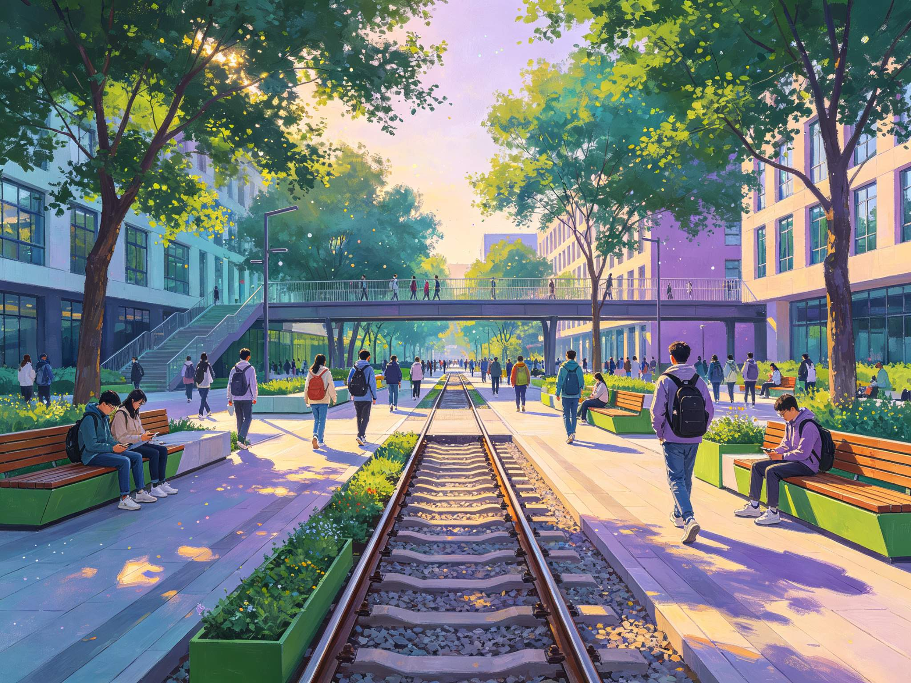

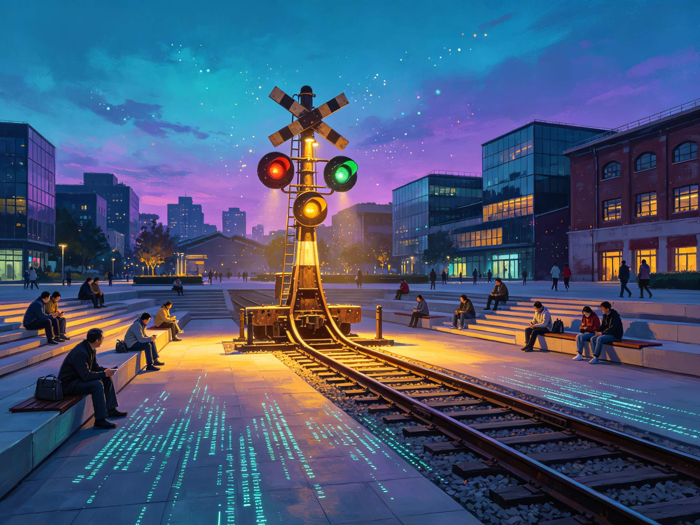

> 以上为概念设计意向图（AI辅助生成，非实景、非最终方案）。

**更多场景概念示意**：

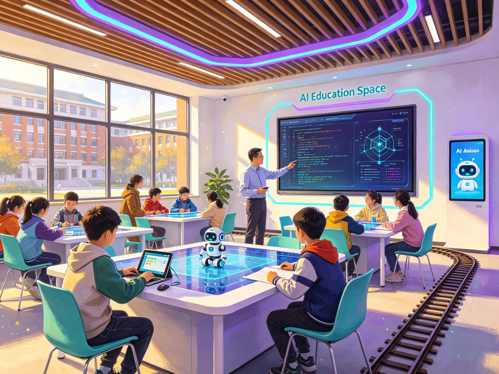

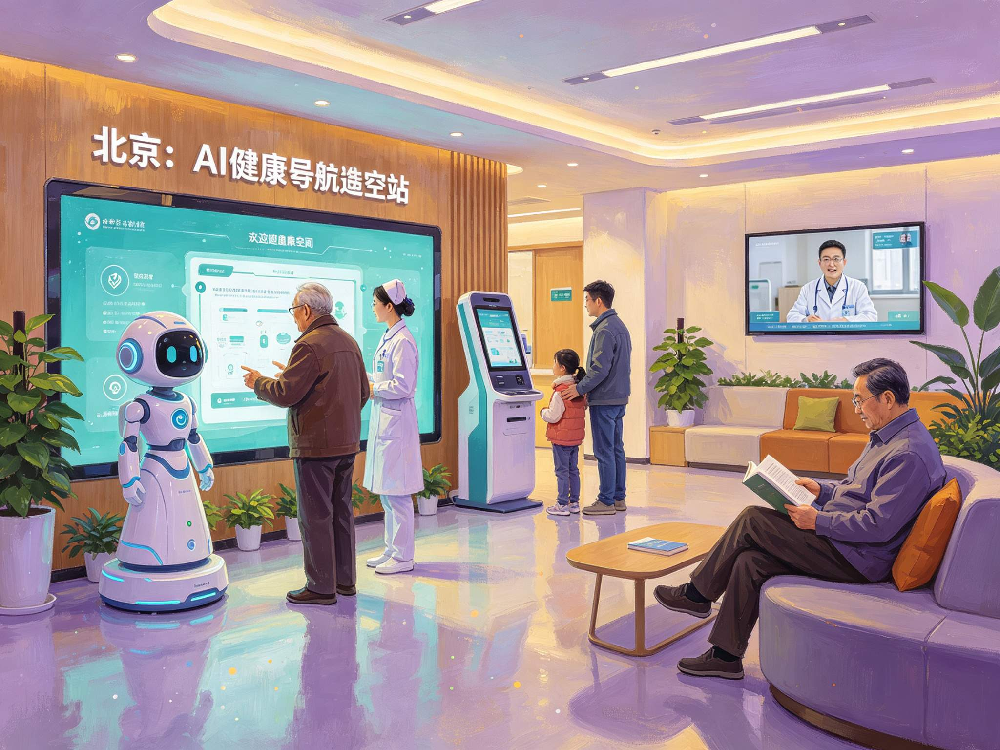

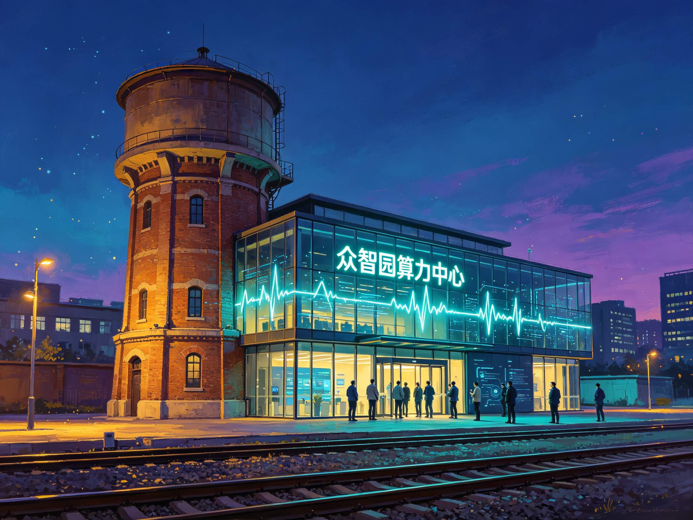


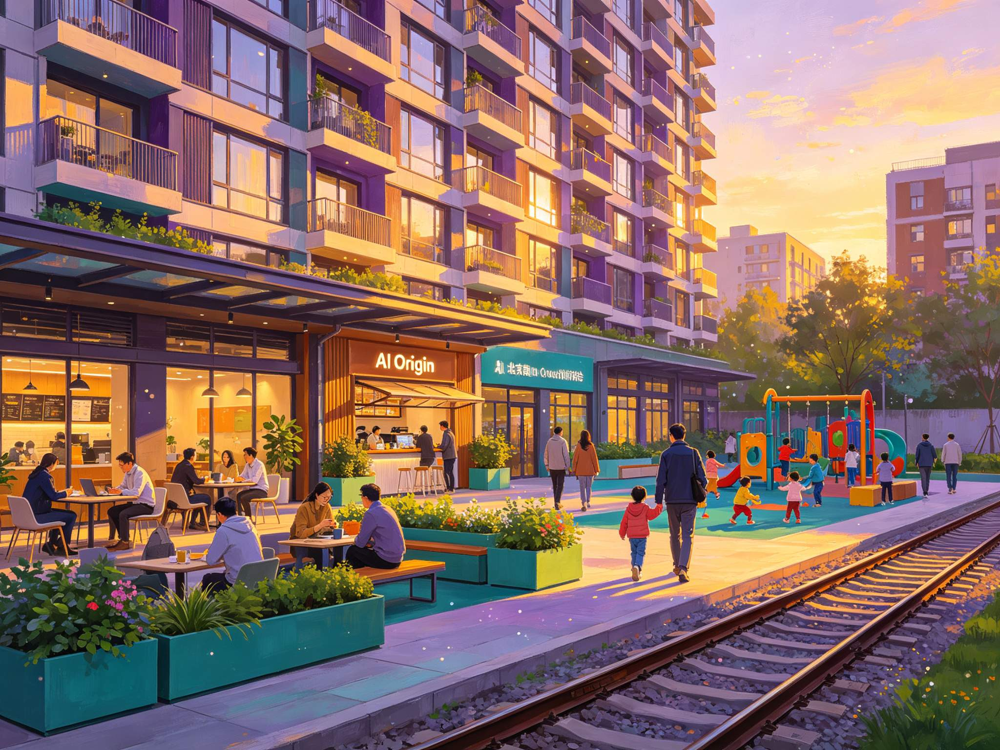

> 以上为概念设计意向图（AI辅助生成，非实景、非最终方案）。

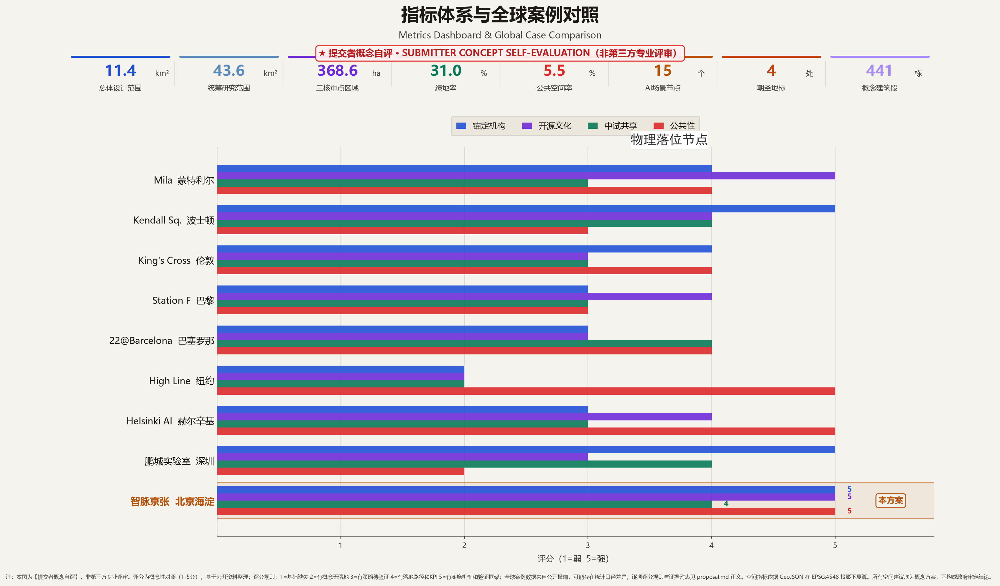

## 公共利益与包容性

本方案将公共利益作为AI原生创新带的底线而非附属品，提出以下具体措施（均为概念建议，待政策研究和公众参与确认）：

**人才安居**：在AI原点社区和众智园建议配置不少于总建面20%的人才公寓和保障性租赁住房，面向AI研究者、创业者和青年人才，租金建议为市场价的60-70%。其中30%面向刚毕业3年内的青年人才，20%面向在站博士后和访问学者。公寓配建AI学习角和共享工位，降低创业居住成本。

**人才住房量化指标体系（概念性目标，待政策确认）**：

| 指标 | 近期目标(Y1-Y3) | 中期目标(Y4-Y5) | 远期目标(Y6-Y10) | 计算依据 |
|------|---------------|---------------|----------------|---------|
| 人才公寓套数 | ≥800套 | ≥2000套 | ≥5000套 | 按三核新建/改造建面20%×套均45㎡估算 |
| 人才公寓建面 | ≥3.6万㎡ | ≥9万㎡ | ≥22.5万㎡ | 套均45㎡（含共享空间） |
| 租金水平 | 市场价65-70% | 市场价60-65% | 市场价55-65% | 参照海淀区人才公寓政策区间 |
| 青年人才占比 | ≥30% | ≥30% | ≥25% | 毕业3年内 |
| 博士后/访问学者占比 | ≥15% | ≥20% | ≥20% | 与高校合作引进 |
| 入住率目标 | ≥75% | ≥85% | ≥90% | 运营第一年起 |
| 周转周期 | ≤45天 | ≤30天 | ≤21天 | 退租到重新入住 |
| 配套共享空间 | ≥0.5㎡/套 | ≥0.8㎡/套 | ≥1.0㎡/套 | AI学习角、共享工位、会议室 |
| 本地就业转化率 | ≥20% | ≥30% | ≥40% | 入住后3年内在海淀就业/创业 |

**人才住房分配与管理机制**：
- **积分排序**：建立人才积分体系（学历20%+科研成果25%+创业阶段20%+收入水平15%+在地服务年限20%），积分公开透明
- **轮候制度**：年度开放申请，按积分排序轮候，轮候期≤6个月
- **租金动态调整**：每2年评估一次，与海淀区人均可支配收入涨幅挂钩，年涨幅≤CPI+1%
- **退出机制**：连续6个月不在海淀就业/创业、或收入超过上限3倍，启动退出程序，给予6个月过渡期
- **社区融合**：人才公寓与普通住宅混合布局，不设物理隔离，共享公共空间和社区服务

**反绅士化量化保障体系（概念性目标，待社区确认）**：

| 监测维度 | 基线值(2025) | 预警阈值 | 干预目标 | 数据来源 |
|---------|------------|---------|---------|---------|
| 周边住宅租金年涨幅 | 约3-5% | >CPI+3%(约5-6%) | ≤CPI+2% | 链家/贝壳+社区抽样 |
| 基本服务业态占比 | 约35% | <25% | ≥30% | 商户调查+街道台账 |
| 本地居民外迁率 | 基线待调查 | >5%/年 | ≤3%/年 | 社区台账+人口抽样 |
| 60岁+人口占比 | 基线待调查 | 下降>3个百分点/5年 | 下降≤1.5个百分点/5年 | 社区台账 |
| 低收入家庭占比 | 基线待调查 | 下降>5个百分点/5年 | 下降≤2个百分点/5年 | 社区台账 |
| 公共空间居民使用率 | 基线待调查 | <40% | ≥50% | 城市OS匿名统计+问卷 |
| 底商租金年涨幅 | 约4-6% | >8% | ≤6% | 商户调查 |
| 连锁品牌占比 | 基线待调查 | >40% | ≤35% | 商户调查 |
| AI企业本地员工比例 | — | <30% | ≥40% | 企业报备+社保数据 |
| 社区满意度 | — | <70分 | ≥80分 | 年度第三方调查 |

**反绅士化干预工具箱**：

1. **租金管制类**：
   - 人才公寓租金限价（市场价55-70%）
   - 社区底商30%面积租金限价（面向基本服务）
   - 原居民优先续租权（同等条件下租金涨幅≤CPI）
   - 短期租赁（Airbnb类）占比≤5%（社区住宅总量）

2. **空间保障类**：
   - 基本服务业态最低占比30%（菜场、药店、维修、理发、餐饮）
   - 社区公共空间≥1.5㎡/人（含绿地）
   - 适老化设施覆盖率100%（无障碍、扶手、休息座椅）
   - 儿童活动场地≥0.5㎡/儿童

3. **经济补偿类**：
   - 社区基金：AI商业化收益提取5-10%注入社区基金
   - 社区分红：年度净收益的15%用于居民服务和公共空间维护
   - 就业优先：AI企业本地招聘比例≥40%，优先聘用原居民
   - 技能培训：年度AI技能培训≥2000人次，30%免费面向低收入居民

4. **参与治理类**：
   - 社区议事会拥有场景上新否决权（重大场景需2/3多数同意）
   - 参与式预算：年度社区基金的50%由居民投票决定用途
   - 场景公示：新AI场景上线前15天社区公示，异议率>30%触发人工评审
   - 年度第三方评估：反绅士化效果独立评估，结果向社会公开

**反绅士化资金平衡测算（概念性）**：

| 资金来源 | 年度规模(概念) | 占比 | 用途 |
|---------|--------------|------|------|
| AI场景商业化收益分成 | 500-2000万元 | 40-50% | 社区基金主体 |
| 企业社会责任基金 | 300-1000万元 | 25-30% | 入驻企业按营收0.5-1%缴纳 |
| 区财政专项补贴 | 200-500万元 | 15-20% | 匹配社区基金规模 |
| 公共空间广告/活动收入 | 100-300万元 | 10-15% | 绿廊商业配套反哺 |
| **合计** | **1100-3800万元/年** | 100% | — |

> 资金规模为概念性估算，基于AI场景商业化进度和企业入驻率假设。具体规模待运营阶段根据实际收入确定。社区基金设立独立账户，由社区议事会监督使用，年度审计公开。

> 以上人才住房和反绅士化指标为概念性目标建议，具体数值、政策依据和实施机制需在实施阶段结合海淀区住房保障政策、城市更新条例和社区实际情况，经公众参与和政府审批后确定。租金和就业数据涉及商业敏感信息，需在合规框架下采集。

**全龄友好**：
- 适老化：所有公共空间无障碍全覆盖，AI健康导航站（SC-05）优先服务65岁以上居民，社区中心设老年AI课堂
- 儿童友好：AI教育空间（SC-06）面向6-18岁免费开放，绿廊设自然教育径，口袋公园配儿童活动区
- 无障碍：无障碍畅行助手（SC-11）覆盖全主要公共空间，盲道连续，轮椅可达所有公共建筑首层

**社区参与机制**：
- 年度社区愿景工作坊：每年由街道办、运营方和居民代表共同审议场景上新和空间变更
- AI辅助参与式预算：居民通过小程序对公共空间改善项目投票，AI汇总偏好但不替代决策
- 场景公示制度：所有新AI场景上线前15天在社区公示，居民可提出异议，重大异议触发人工评审
- 数据透明：城市OS的数据采集类型、范围和用途每季度公开，设数据伦理委员会（含居民代表）

**反绅士化保障**：
- 现有居民不强制外迁，更新以"留改拆"以留为主
- 底商租金引导：建议30%商业面积面向社区基本服务（菜场、药店、维修、理发），租金限价
- 社区分红机制：若AI场景商业化产生收益，建议提取一定比例注入社区基金，用于公共空间维护和居民服务

**AI产业导入影响监测与干预机制**（针对AI企业入驻可能带来的租金上涨、就业结构变化和社区排斥）：

| 监测维度 | 监测指标 | 数据来源 | 监测频率 | 预警阈值 | 干预措施 |
|---------|---------|---------|---------|---------|---------|
| **住宅租金** | 三核及两翼周边住宅租金均价、同比涨幅 | 链家/贝壳等公开平台+社区抽样调查 | 季度 | 年涨幅>CPI+3%（约5-6%） | ①扩大人才公寓供给（从20%提至25%）；②启动租金补贴（面向低收入居民）；③限制短期租赁（Airbnb类）占比≤5% |
| **商业租金** | 社区底商租金均价、基本服务业态占比 | 商户调查+街道台账 | 半年 | 基本服务业态占比<25%或租金年涨幅>8% | ①启动底商租金限价（30%面积强制面向基本服务）；②社区基金补贴基本服务商户；③限制连锁品牌占比≤40% |
| **就业结构** | AI企业本地员工比例、本地居民新增就业数、技能匹配度 | 企业入驻报备+社保数据+社区调查 | 年度 | 本地员工比例<30%或本地居民新增就业<预期50% | ①要求入驻企业承诺本地招聘比例≥30%；②社区AI技能培训（年培训≥2000人次）；③优先采购本地服务商 |
| **人口结构** | 60岁+人口占比、低收入家庭占比、外来人口变化 | 社区台账+人口抽样 | 年度 | 60岁+占比下降>3个百分点或低收入家庭外迁率>5% | ①适老化空间改造优先；②社区养老服务补贴；③原居民优先续租权 |
| **公共空间使用** | 居民vs访客使用比例、活动类型、满意度 | 城市OS传感器（匿名人流统计）+问卷 | 季度 | 居民使用率<40%或满意度<70% | ①调整活动安排（增加居民导向活动）；②设置居民优先时段；③社区议事会审议空间使用方案 |

**监测机制运行方式**：
- 由运营平台联合街道办事处设立"社区影响监测办公室"，每季度发布《AI创新带社区影响报告》
- 监测数据接入城市OS平台，匿名化处理后向社区公开（不涉及个人隐私）
- 设立"绅士化预警线"：任一指标触发预警阈值，自动启动社区议事会审议，30天内提出干预方案
- 干预措施的资金来源：社区基金（AI商业化收益分成）+ 区财政专项 + 企业社会责任基金
- 年度评估：每年由第三方机构评估反绅士化措施效果，结果向社会公开

> 本监测机制为概念性制度设计，具体指标阈值、数据来源和干预措施需在实施阶段结合海淀区实际情况和政策框架细化。租金和就业数据涉及商业敏感信息，需在合规框架下采集和使用。

**数字包容**：
- 公共空间保留非数字入口：所有AI服务均有人工替代渠道，不强制使用APP或小程序
- 数字素养培训：社区中心免费提供AI使用培训，重点覆盖老年人和低收入群体
- 无智能手机访客：AI文化导览（SC-10）提供实体导览图和人工讲解时段

> 以上公共利益措施均为政策建议，具体比例、资金来源和实施机制需经政府研究、公众参与和法定程序确定。

## 利益相关方分析与社区参与路径

城市更新70%的问题是人的问题。本节识别关键利益相关方，分析其核心诉求与潜在阻力，并提出分阶段参与路径（均为概念建议，待政府组织实施时深化）。

### 关键利益相关方矩阵

| 利益相关方 | 核心诉求 | 潜在阻力/关切 | 参与机制建议 |
|-----------|---------|-------------|------------|
| **高校与科研院所**（清华、北大、北航、中科院等） | 成果转化空间、学生实习就业、安静研究环境 | 校园开放带来安全/噪音、知识产权保护 | 校地共建联席会（季度）、联合实验室、校园边界"可穿越但不侵入"设计 |
| **AI企业**（200+已入驻企业、独角兽） | 人才吸引、场景测试、客户对接、低成本空间 | 数据安全、商业秘密、运营成本 | 企业服务中台、场景需求清单、沙盒准入"白名单"、租金优惠对赌 |
| **现状居民**（70社区约45万人） | 日常生活便利、不被打扰、房价/租金稳定、隐私安全 | 施工扰民、绅士化外迁、AI监控、机器人占用慢行道 | 社区议事会（月度）、施工公示与补偿、AI场景15天公示异议期、数据不采集人脸 |
| **商户与业主**（大钟寺商圈、社区底商） | 客流增长、经营稳定、租金合理 | 更新期间客流损失、租金上涨、业态替换 | 商户代表参与方案、更新期经营补贴、30%底商租金限价保基本服务 |
| **铁路/地铁部门**（京张公司、京港地铁、市轨指） | 运营安全、保护带合规、客流组织 | 铁路保护带内施工、慢行道与轨道交叉安全 | 铁路保护带联合审查、站点一体化设计预审、运营时段外施工 |
| **政府部门**（区政府、规划、科技、园林、街道） | 产业升级、税收、城市形象、社会稳定 | 跨部门协调难、财政压力、舆情风险 | 领导小组统筹、"一站式"审批通道、年度实施评估报告 |
| **开发者与开源社区** | 开放API、真实数据、贡献认可 | 数据封闭、平台锁定 | 开源API沙盒、黑客松、代码贡献者荣誉墙（LM-03）、技术指导委员会 |
| **访客与游客** | 体验AI、了解铁路遗产、便利可达 | 过度商业化、排队拥挤 | 预约制、免费公共时段、AI导览多语言、无障碍通道 |

### 分阶段社区参与路径

**阶段一：愿景共塑（0-12个月，规划设计期）**
- 成立"智脉京张社区共创团"：每社区推选2-3名居民代表，含至少1名65岁以上、1名残障人士代表；目标覆盖绿廊沿线70个社区，共创团总规模约150-200人
- 举办3场社区愿景工作坊（分别在五道口、大钟寺、学院路片区），每场目标参与人数≥80人，采用"世界咖啡馆"轮转讨论法，分公共空间/AI场景/交通/文化四组
- 补充6场小型座谈会（每场15-20人）：面向老年人、商户、学生、残障人士、上班族（晚间场）、物业等特定群体，确保代表性
- AI辅助参与式预算：居民通过小程序投票优先实施的公共空间改善项目（首批预算建议500-1000万元）；目标线上投票≥3000人次，线下投票点≥10个
- 高校师生联合工作营：清华/北大/北航/北林大规划/建筑/AI专业师生参与典型地块设计，每校1支队伍，成果公开展览
- **数字参与平台功能**：小程序"智脉邻居"上线——方案浏览（3D模型+AR看方案）、意见标注（地图上钉钉子）、投票表决、活动报名、进度追踪；不使用智能手机的居民可在社区中心通过平板/纸质参与
- **反馈闭环**：所有意见7个工作日内回复"采纳/部分采纳/不采纳+理由"，意见采纳情况在工作坊和小程序公开

**阶段二：共建监督（1-3年，示范段建设期）**
- 施工信息实时公开：施工范围、工期、扬尘/噪音监测数据在小程序实时展示；PM2.5/噪音超标自动推送预警
- 社区观察员制度：每社区1名义务监督员（共约70名），有权要求施工方整改；每月1次观察员巡检，问题24小时内响应
- 场景准入听证：每个新AI场景上线前15天公示，重大异议（≥50人联名或反对率超30%）触发专家委员会+社区代表联合评审
- 数据透明季报：城市OS采集的数据类型、范围、用途、脱敏方式每季度公开，以可视化仪表盘呈现，居民可查询本社区数据
- 每月1次"工地开放日"：居民可参观施工现场，了解进度和工艺
- **反馈闭环**：施工投诉2小时内到场、24小时内解决或给出方案；场景意见15个工作日内回复；季度满意度调查，目标满意度≥75%

**阶段三：共享共治（3-10年，运营成熟期）**
- 社区议事会季度例会：审议场景上新、空间变更、活动计划；每次会议提前7天公告，居民可旁听和发言
- 社区分红机制：AI场景商业化收益（如广告、付费服务）提取5-10%注入社区基金，由居民代表决定用途；年度基金使用情况审计公开
- 年度"智脉开放日"：居民体验新场景、投票决定下一年度场景优先级；目标参与≥5000人次
- 数字包容保障：社区中心保留人工服务窗口，每月1次免费AI培训（年培训≥1000人次），无智能手机居民可通过电话/现场获取所有公共服务
- **反馈闭环**：议事会决议5个工作日内公开，执行进度月度更新；居民满意度年度调查，目标≥80%；连续2年低于70%的场景启动退出评估
- **参与效果量化目标**：社区参与率（年度至少参与1次）≥30%；居民对AI场景知晓率≥80%；社区基金年度规模≥200万元；居民提案采纳率≥40%

### 风险缓释与争议解决

- **隐私争议**：任何场景涉及个人数据采集，须经数据伦理委员会（含居民代表、法律专家、AI安全专家）审批；居民有权查询、删除本人数据
- **绅士化争议**：设立"租金涨幅预警线"（建议年涨幅不超过CPI+2%），触发时启动租金干预；现有居民租约保护期不低于5年
- **施工扰民争议**：施工方须在开工前30天逐户告知，设立24小时投诉热线，夜间施工需社区书面同意
- **AI安全争议**：测试验证场景（SC-03/04/08/09）须有物理隔离或安全员在环，发生事故立即暂停并公开通报

## 更新项目清单、实施政策与分期计划

分期见 geometry/phasing.geojson [data:geometry/phasing.geojson#] [depth:phasing_implementation] [depth:renewal_project_list]：

| 阶段 | 项目 | 空间载体 | 类型 | 免责 |
|------|------|---------|------|------|
| 近期（1-3年） | AI原点社区示范段 | 中核+绿廊中段 | 公共空间+慢行贯通+首批场景 | 具体项目待可行性研究 |
| 近期 | 智脉原点碑广场 | 中核中心 | 地标+公共空间 | 概念 |
| 近期 | 首批AI场景测试 | 东翼慢行道 | 机器人配送+自动驾驶测试 | 测试状态，非运营 |
| 中期（3-5年） | 众智园共享中试层 | 北核 | 算力沙盒+红队测试+共享实验室 | 无投资承诺 |
| 中期 | 绿廊南北贯通 | 全脉 | 慢行道+公共空间+文化节点 | 无工程结论 |
| 中期 | 开源成果展示廊 | 北核旧厂房 | 遗产改造+展示 | 无文保结论 |
| 远期（5-10年） | 大钟寺AI原生消费 | 南核 | AI+商业/法律/金融场景 | 概念 |
| 远期 | 两翼全面运营 | 东西翼 | 科技服务+场景赋能成熟 | 无开发审批 |
| 远期 | Open Week品牌成熟 | 全脉 | 年度活动体系 | 活动为概念 |

所有项目类型、实施主体与资金均写为概念建议或深化方向，不表述为已确定政府安排 [depth:renewal_project_list]。

**分期投资估算**（概念性量级，非投资承诺，待可行性研究）：

| 阶段 | 时间 | 主要内容 | 投资量级（概念） | 资金来源建议 |
|------|------|---------|----------------|------------|
| 近期 | 1-3年 | 见下表近期分项 | 数十亿级 | 政府基建+专项债+国企平台 |
| 中期 | 3-5年 | 众智园中试层+算力沙盒+展示廊+绿廊全通+人才公寓 | 数十亿级 | 政府引导+社会资本+产业基金 |
| 远期 | 5-10年 | 大钟寺产业门户+两翼成熟运营+城市OS迭代+全球品牌 | 数十亿至百亿级 | 社会资本为主+运营收入反哺 |
| 合计 | 10年 | 全带建成运营 | 百亿级（待可研） | 公共投资与社会资本按分期递进 |

**近期（1-3年）投资分项估算**（概念性可复算区间，非投资承诺，待可行性研究）：

| 序号 | 项目 | 概念规模 | 单位造价参照 | 投资区间（概念） | 计算逻辑 | 实施主体建议 |
|------|------|---------|------------|----------------|---------|------------|
| N-01 | 智脉原点广场及绿廊示范段 | 广场0.5-1ha + 绿廊示范段1km（约5-8ha提升） | 公共空间改造3000-5000元/㎡（参照杨浦滨江）；绿廊提升0.5-1亿元/km | **1.0-2.5亿元** | 广场0.5-1ha×3000-5000元/㎡=0.15-0.5亿；绿廊1km×0.5-1亿/km=0.5-1亿；装置及家具0.35-1亿 | 区属国企+园林局 |
| N-02 | 城市OS基础设施（一期） | 全带9km传感+光纤+3-5个边缘节点+数字孪生平台 | 智慧城市基础设施500-1000万元/km；平台开发0.3-0.5亿 | **0.8-1.5亿元** | 9km×500-1000万/km=0.45-0.9亿；平台+节点0.35-0.6亿 | 区科信局+运营商 |
| N-03 | AI原点混合更新示范 | 可更新地块概念5-10ha，开发量约10-20万㎡ | 综合开发1-2万元/㎡（参照King's Cross/国内城市更新）；公共部分约3-5亿 | **公共部分3-5亿元**（社会资本另计10-30亿） | 公共空间+配套+街道界面约3-5亿；开发部分由社会资本承担，不计入公共投资 | 城市更新平台+社会资本 |
| N-04 | AI场景测试环境 | 东翼测试段1km + 三核连接路概念段 + V2X路侧单元 | V2X路侧50-100万/km；机器人道标识100-200万/km；测试设备0.3-0.5亿 | **0.5-1.2亿元** | 道路改造0.15-0.3亿；V2X+信号0.15-0.4亿；测试设备+保险0.2-0.5亿 | 区科信局+交警+企业 |
| N-05 | 开源成果展示廊 | 旧厂房改造0.5-1万㎡（含展陈） | 旧厂房改造0.3-0.8万元/㎡（参照Station F 5.8万/㎡含全部，国内改造更低）；展陈0.2-0.5亿 | **0.4-1.3亿元** | 建筑改造0.5-1万㎡×0.3-0.8万/㎡=0.15-0.8亿；展陈+机电0.25-0.5亿 | 区属国企+运营方 |
| N-06 | 前期+设计+不可预见 | 全带 | 按近期公共投资的8-12%计 | **0.5-1.2亿元** | (N-01+02+03公共+04+05)×8-12% = (5.7-11.5亿)×8-12% | 区规划分局 |
| | **近期公共投资合计** | | | **6.2-12.7亿元**（中值约9-10亿） | 不含N-03社会资本部分；若含社会资本则近期总投资约20-40亿元 | |

> 以上投资区间为基于概念规模×同类案例单位造价的可复算估算，未经工程可研和财务评估，不构成投资承诺。具体投资规模需在权属核查、方案设计和工程概算完成后确定。N-03的社会资本部分（10-30亿元）由开发主体承担，不计入公共财政投资。横向案例单位造价详见下表。

**投资口径对照表（范围—费用—年份—资本属性，消除跨表差异）**：不同表格出现"6.2-12.7亿""15-25亿""20-35亿""百亿级"等区间，是因**口径不同**（是否含社会资本、土地、运维、远期），并非矛盾。下表统一说明，所有数值均为**概念量级、待可研变量**，不可用于投资决策。

| 口径 | 费用区间（概念） | 年份/阶段 | 是否含社会资本/土地/运维 | 说明 |
|------|------|------|------|------|
| 近期公共投资（N-01~06，不含N-03社会资本） | 6.2–12.7亿元（中值约9-10亿） | 1–3年 | 否（纯公共财政） | 见上表N-01~06合计行 |
| 近期总投资（含N-03社会资本10-30亿） | 约20–40亿元 | 1–3年 | 是（含社会资本） | N-01~06公共 + N-03开发部分 |
| 分期表"近期"行（公共+总） | 公共15–25亿 / 总20–40亿 | 1–3年 | 部分 | 分期表L1407口径，与N表一致（15-25亿公共≈N表上限+专项） |
| 远期投资 | 公共20–35亿 / 总100–150亿 | 5–10年 | 部分是 | 城市OS成熟+品牌溢价，社会资本为主 |
| 十年累计 | 百亿级（待可研） | 10年 | 按分期递进 | 公共投资与社会资本比例随阶段调整 |

> 凡涉及绝对投资、IRR、责任比例、路线长度和工程级工期的精确值，当前数据成熟度均不足，一律作为**待可研变量**处理；摘要图表与正文同步使用上述区间口径，不写单值承诺。

**参数化概念情景总表（所有高精度数字的统一声明，禁止用于标准符合性或实施可行性判断）**：

| 参数类别 | 方案中的呈现 | 公式/变量 | 来源 | 适用边界 | 置信度 |
|---------|------------|----------|------|---------|--------|
| 投资区间 | 6.2–12.7亿（近期公共）/15–25亿（近期总）/100–150亿（远期总） | 概念规模 × 同类案例单位造价 | 案例对标（公开报道）+ 自建估算框架 | 仅概念比选 | 低（±30–50%） |
| IRR | 概念性区间示意，不写单值 | 分期投资节奏 × 收入爬坡假设 × 案例基准情景 | 案例对标 | 仅概念比选，不用于融资 | 中低 |
| 责任比例/赔偿上限 | 责任划分矩阵（概念） | 事故场景 × 责任类型（示例） | 法律惯例（待专业意见） | 机制示意，非法定 | 低 |
| 保险额度 | ≥500万/台、≥2000万等 | 案例保险惯例示例 | 公开案例 | 示例参数，待保险询价 | 低 |
| 市政容量/能源负荷 | 约X MW、带宽≥10Tbps 等 | 概念规模 × 单位指标 | 行业经验值 | 概念量级，待专项调查 | 低 |
| 建筑高度/层数 | 如26层约91m | 概念天际线设计 | 方案自设 | 概念意向，非控规 | 低 |
| 开发时序 | Y1-Y5 季度计划 | 概念里程碑 | 方案自设 | 概念计划，待审批 | 中低 |
| 路线长度 | 9km绿廊、1.2km测试段等 | 几何复算（EPSG:4548） | GeoJSON 复算 | 概念模型，待官方红线 | 中 |

> 上表所有参数均为**概念情景/待可研变量**，不构成工程结论、标准符合性判断或实施可行性承诺；进入可研、设计、PIA、交通安全评估与法定审批前不得引用。


**近期项目实施路径细化（N-01至N-06）**：

| 项目 | 用地权属概念分类（待逐宗核查） | 实施流程概念方向（以主管部门要求为准） | 关键工作节点（概念计划） | 责任主体概念建议 |
|------|----------------------|------------|-----------|------------|
| **N-01 智脉原点广场及绿廊示范段** | 绿廊已建成段为公园绿地（国有，园林局管养）；广场选址涉及AI原点社区中心，部分为已收储未出让用地（权属待逐宗核查确认） | 绿地内提升项目，具体审批流程以园林局及相关主管部门要求为准；"心跳"装置等特色设施需按规定办理相关审查 | 概念工作节点：Q1-Q2方案设计→Q3施工招标→Q4建成开放；与N-02同步实施，避免重复开挖（实际进度以审批和建设周期为准） | 区属国企（建设）+园林局（管养）+FTA等设计团队（概念深化） |
| **N-02 城市OS基础设施（一期）** | 绿廊公共空间（国有）；光纤骨干沿绿廊敷设，部分路段需协调市政道路 | 新基建项目立项（区发改委）；数据安全等保备案；传感器部署需园林/市政占道审批；V2X需交警部门协调 | Q1立项+数据治理框架→Q2-Q3管线敷设+平台开发→Q4一期上线（示范段全覆盖） | 区科信局（牵头）+运营商（建设）+云厂商（平台） |
| **N-03 AI原点混合更新示范** | 五道口/知春路可更新地块概念分类，权属复杂（可能涉及国企自有用地、集体产业用地、已收储地块等）；需逐宗核权确认 | 城市更新项目实施流程概念方向，具体以区城市更新专班及市规划自然资源委要求为准；土地供应方式、环境评价和社会资本采购等均需按法定程序办理 | 概念工作节点：Y1权属核查+更新单元研究+控规研究；Y2土地供应前期+方案设计；Y3建设启动；Y4-Y5首期交付（实际进度以审批和建设周期为准） | 城市更新平台（统筹）+区属国企（土地整理）+社会资本（开发运营） |
| **N-04 AI场景测试环境** | 东翼慢行道（绿廊公共空间）；三核连接路（市政道路，市/区管养） | 智能网联汽车道路测试许可（市自动驾驶办公室）；机器人配送需市场监管/城管备案；V2X路侧设备需交警审批；测试保险方案 | Q1-Q2测试方案+保险→Q3路侧设备安装→Q4首期测试（3家企业入场） | 区科信局（牵头）+交通支队（安全监管）+测试企业（运营） |
| **N-05 开源成果展示廊** | 众智园旧厂房（铁路遗产，权属待确认——可能为铁路部门或区属国企）；建筑结构安全鉴定先行 | 历史建筑/工业遗产认定（区文旅局）；改造方案报规划审批；消防审查（旧厂房改造重点）；结构加固设计 | Y1：权属确认+结构鉴定+方案设计；Y2：施工改造；Y3：展陈布置+开放运营 | 区属国企（产权/建设）+专业运营方（展陈运营）+开源社区（内容策展） |
| **N-06 前期+设计+不可预见** | 全带涉及多权属主体（待逐宗核查） | 城市设计深化和控规研究流程概念方向，具体审议和审批程序以区政府及市规划自然资源委要求为准；各专项可研按法定程序推进 | 概念工作节点：Q1城市设计深化启动；Q2中期汇报；Q3控规研究公示；Q4各专项可研完成（实际进度以审批周期为准） | 区规划分局（牵头）+设计联合体（FTA等）+各专项顾问 |

**首个示范段具体实施方案：智脉原点广场及1.2km绿廊示范段（N-01深化）**

选择AI原点社区中心广场及南北各600m绿廊作为首个示范段，总长度约1.2km，总面积约3.5ha（含广场0.8ha+绿廊2.7ha）。该段位于五道口-知春路之间，周边高校密集、人流活跃、可更新用地相对集中，具备"建成即展示、展示即运营"的条件。

**1. 示范段空间范围与功能布局**：

| 区段 | 位置 | 长度 | 面积 | 核心功能 | 现状 |
|------|------|------|------|---------|------|
| 原点广场 | AI原点社区中心 | — | 0.8ha | LM-01智脉原点碑+开源展示墙+活动广场+AI交互终端 | 概念选址，权属待核查 |
| 北示范段 | 广场以北至五道口 | 600m | 1.35ha | 绿廊提升+机器人测试道(SC-08)+开发者散步道(LM-03) | 已建成绿廊，可提升 |
| 南示范段 | 广场以南至知春路 | 600m | 1.35ha | 绿廊提升+V2X测试路(SC-09)+智脉心跳光河 | 已建成绿廊，可提升 |

**2. 示范段建设内容清单（概念性设计深度）**：

| 类别 | 建设内容 | 数量/规模 | 技术要求 | 投资估算(概念) |
|------|---------|----------|---------|--------------|
| **公共空间提升** | 广场铺装更新 | 0.8ha | 透水铺装+铁路元素肌理 | 400-600万元 |
| | 绿廊步道改造 | 1.2km×4m | 透水混凝土+无障碍设计 | 300-500万元 |
| | 口袋公园/休息节点 | 6处 | 每处150-300㎡ | 180-300万元 |
| | 绿化提升 | 1.2km | 保留现状乔木+补植乡土植物 | 150-250万元 |
| **AI基础设施** | 城市OS传感器 | 30处 | 人流/环境/噪声监测，匿名化 | 90-150万元 |
| | 光纤骨干网 | 1.2km | 千兆光纤+5G小基站8处 | 120-200万元 |
| | AI交互终端 | 5处 | 导览+信息查询+应急呼叫 | 80-120万元 |
| | 智脉心跳光河 | 600m | LED地埋灯+环境数据可视化 | 200-350万元 |
| **测试设施** | 机器人专用道 | 600m×1.5m | 柔性护栏+标识+充电桩3处 | 60-100万元 |
| | V2X路侧设备 | 8处 | RSU+摄像头+毫米波雷达 | 160-250万元 |
| | 封闭测试场 | 1处(500㎡) | 可移动护栏+模拟场景 | 30-50万元 |
| **文化标识** | LM-01智脉原点碑 | 1座 | 高度3-5m，含时间线展示 | 80-150万元 |
| | 开源成果展示墙 | 1面(30m) | 电子屏+实体展示结合 | 60-100万元 |
| | 导视标识系统 | 20处 | 品牌统一设计，多语言 | 40-70万元 |
| **配套设施** | 智慧座椅 | 20处 | 充电+WiFi+环境感知 | 40-70万元 |
| | 应急设备 | 5处 | AED+急救包+紧急呼叫 | 15-25万元 |
| | 公共艺术装置 | 3处 | 铁路遗产主题，互动性 | 60-120万元 |
| | **合计** | — | — | — | **2065-3405万元** |

> 投资估算为概念性量级，基于同类项目单位造价区间，不含土地征收、拆迁和地下管线改造成本。具体造价待方案设计和工程概算确定。

**3. 示范段实施时序（12个月概念计划）**：

| 阶段 | 时间 | 工作内容 | 关键里程碑 | 责任方 |
|------|------|---------|-----------|-------|
| **前期准备** | M1-M2 | 权属核查+方案设计+社区参与+立项 | 方案通过社区议事会审议 | 规划分局+区属国企 |
| **设计深化** | M3-M4 | 施工图设计+各专项审批+招标 | 施工图审查通过 | 设计团队+各审批部门 |
| **基础施工** | M5-M8 | 铺装+绿化+管线+光纤敷设 | 基础设施完工验收 | 施工总包+监理 |
| **AI部署** | M7-M9 | 传感器+V2X+交互终端+光河安装 | 城市OS一期联调通过 | 科信局+运营商+设备商 |
| **测试设施** | M8-M9 | 机器人专用道+测试场+标识 | 测试设施验收 | 科信局+交通支队 |
| **文化装置** | M9-M10 | 原点碑+展示墙+导视+艺术装置 | 文化设施安装完成 | 区属国企+艺术家 |
| **联调测试** | M10-M11 | 全系统联调+压力测试+安全评估 | V1合成验证960/960通过 | 运营方+第三方测评 |
| **试运营** | M11-M12 | 有限公众参与+远程安全员+数据收集 | 首月零主责事故 | 运营方+社区观察员 |
| **正式开放** | M12 | 开放仪式+首届Open Week+媒体发布 | 示范段正式对外开放 | 区政府+运营平台 |

**4. 示范段运营模式（概念性）**：

- **运营主体**：区属国企牵头成立运营公司，引入专业运营团队，采用"政府引导+市场化运营"模式
- **收入来源**：①活动场地租赁（年度20-40万元）；②广告/赞助（年度30-60万元）；③场景测试服务费（年度50-100万元）；④文创/零售（年度10-20万元）；⑤政府购买服务（年度100-200万元，用于公共空间维护和公益活动）
- **运营成本**：①人员（年度150-250万元）；②维护（年度80-150万元）；③能耗（年度30-50万元）；④活动（年度50-100万元）；合计约310-550万元/年
- **收支平衡**：运营前3年政府补贴为主（补贴率60-80%），第4-5年补贴率降至30-50%，第6年起力争运营收支平衡
- **KPI指标**：年度访客≥50万人次、活动≥50场、测试企业≥10家、居民满意度≥80%、零主责安全事故

**5. 示范段风险管控**：

| 风险 | 概率 | 影响 | 应对措施 |
|------|------|------|---------|
| 权属不清导致工期延误 | 中 | 高 | 提前启动权属核查，选择权属清晰的绿廊段先行施工 |
| 审批周期超预期 | 中 | 中 | 设立项目专班，并联审批，预留2个月缓冲期 |
| 建设成本超支 | 中 | 中 | EPC总价合同+10%不可预见费，分期支付 |
| AI设备技术不成熟 | 低 | 中 | 选用成熟技术，预留升级接口，分阶段部署 |
| 社区反对 | 低 | 高 | 全程社区参与，方案公示，设置调整机制 |
| 安全事故 | 低 | 高 | 足额保险+安全保证金+V1-V5验证+远程安全员 |
| 运营亏损 | 中 | 中 | 政府购买服务托底，多元化收入，控制运营成本 |

**6. 示范段可复制性设计**：

首个示范段采用"模块化+可扩展"设计，后续可快速复制到全段9km：
- **空间模块**：广场节点(0.8ha)+绿廊标准段(600m)，可按1+N模式扩展
- **技术模块**：城市OS平台一次部署，多段接入，边际成本递减
- **运营模块**：运营团队+管理制度+品牌体系，可标准化输出
- **投资模块**：单段投资约2000-3500万元，可按段分期实施，降低一次性投入压力

> 以上示范段方案为概念性实施建议，具体选址、建设内容、投资规模、时序安排和运营模式需在权属核查、方案设计、工程可研和政府审批后确定。示范段建设须遵守《城市绿化条例》《北京市绿化条例》及相关规划管理规定，涉及绿地变更的须按法定程序报批。

**第一年（Y1）季度行动计划**（概念性工作节点建议，非政府审批流程或法定时序；实际推进节奏以主管部门要求、审批进度和项目准备情况为准）：

| 季度 | 重点工作 | 交付物 | 牵头方 |
|------|---------|-------|-------|
| **Q1** | ①成立项目领导小组和运营平台筹备组；②启动城市设计深化（N-06）；③N-01/N-02方案设计；④N-03权属核查启动；⑤N-05旧厂房结构鉴定；⑥首届Open Week筹备 | 领导小组文件；城市设计任务书；N-01/N-02方案初稿；权属核查清单；结构鉴定报告 | 区政府办+规划分局 |
| **Q2** | ①城市设计中期汇报；②N-01/N-02施工图设计；③N-02立项前期工作；④N-03更新单元研究；⑤N-04测试方案编制+企业招募；⑥社区参与第一轮（愿景工作坊） | 城市设计中期成果；N-01/N-02施工图；N-02立项前期成果；更新单元研究方案；测试企业短名单 | 规划分局+科信局 |
| **Q3** | ①N-01/N-02施工招标+建设启动；②N-03控规研究公示；③N-04路侧设备安装；④N-05改造方案设计；⑤首届Open Week举办；⑥社区参与第二轮（方案评议） | N-01/N-02建设启动文件；控规研究公示稿；N-04设备验收；Open Week总结报告 | 区属国企+科信局 |
| **Q4** | ①N-01绿廊示范段建成开放；②N-02城市OS一期上线；③N-04首期测试启动；④N-05权属确认完成；⑤年度总结+Y2计划；⑥社区参与第三轮（建成反馈） | N-01开放仪式；OS平台上线报告；首期测试数据报告；Y2实施计划 | 运营平台+各牵头方 |

**横向案例单位造价参照**（用于校验上述量级合理性）：

| 案例 | 类型 | 规模 | 总投资 | 单位造价（折算） | 对本方案的参照 |
|------|------|------|--------|----------------|--------------|
| 纽约High Line | 高架线性公园 | 2.33km，约53ha | 约1.53亿美元（约11亿元） | 约4.7亿元/km；约210元/㎡（按绿地面积） | 高架公园造价高于地面绿廊；京张绿廊为地面已建成公园，改造单价应显著低于此值；High Line带动周边私人投资超20亿美元，杠杆效应约1:13 |
| 伦敦King's Cross | 铁路遗产区整体更新 | 27ha，55.7万㎡开发量 | 约30亿英镑（约280亿元） | 基础设施约5亿英镑（约47亿元，1.7亿元/ha）；综合约10亿元/ha | 同为铁路遗产更新+科技公司锚定（Google/DeepMind）；本方案三核368.6ha综合150亿元（约0.4亿元/ha），因含大量已建成绿廊和保留建筑，量级合理 |
| 巴黎Station F | 旧货运厂房改造为创新 campus | 3.4万㎡ | 约2.5亿欧元（约19.5亿元） | 约5.8万元/㎡ | 参照模型机房（Model Roundhouse）旧厂房改造单价；N-05展示廊按2-3亿元/0.5-1万㎡折算约2-6万元/㎡，与此区间吻合 |
| 北京首钢园 | 工业遗产更新 | 约71ha（一期） | 约200亿元（综合） | 约2.8亿元/ha（含新建） | 国内同类工业遗产更新参照；本方案以留改为主，单位造价应低于首钢园 |
| 上海杨浦滨江 | 工业岸线公共空间改造 | 约15.5km | 约180亿元（综合含开发） | 公共空间约3000-5000元/㎡ | 与本方案绿廊改造单价（3000-5000元/㎡）基本一致 |

**投资杠杆预期**：参照High Line和King's Cross等国际案例，公共空间投入对周边私人开发具有显著撬动效应（案例杠杆约1:5-1:13）。本方案预期近期公共投入可带动数倍社会投资，但具体杠杆率取决于土地入市节奏、产业招商进度和政策环境，待可研阶段量化。

**财务模型草图（概念性，非投资承诺）**：

| 阶段 | 时间 | 公共投资 | 社会投资 | 关键触发条件 | 回款/反哺机制 |
|------|------|---------|---------|------------|-------------|
| 近期 | 1-3年 | 15-25亿元 | 20-40亿元 | 城市更新平台认定+首宗土地入市+Open Week品牌启动 | 人才公寓租金+绿廊商业配套+广告收入 |
| 中期 | 3-5年 | 25-40亿元 | 60-100亿元 | 众智园算力沙盒满租率≥80%+展示廊开园+人才公寓入住率≥90% | 算力服务费+孵化器股权+场景测试服务费 |
| 远期 | 5-10年 | 20-35亿元 | 100-150亿元 | 城市OS迭代成熟+全球品牌溢价+产业集聚度达60%以上 | OS平台订阅/服务费+产业税收分成+运营收入 |

- **公共投资回收机制**：近期以基建+土地增值为主；中期以产业运营+算力服务为主；远期以平台订阅+税收增量+品牌溢价为主。
- **社会资本进入临界点**：中期若示范段入住率/满租率连续12个月达标，可触发REITs或类REITs退出通道；远期若产业税收增量连续3年超过公共投入，可考虑部分股权退出。
- **风险分担**：近期公共资本承担边界不清和权属风险；中期设立产业基金对赌，社会资本承担建设和运营风险；远期以运营绩效付费（pay-by-results）替代固定补贴。

> 以上财务模型为概念性框架，待可研阶段补充敏感性分析、IRR 测算和融资结构设计。

**投资/市政/IRR/保险/责任/时序参数的数据成熟度与口径说明（适用于全章）**：本章所有数值均为**概念性区间估算**，数据成熟度等级为 **provisional / 概念**（低于当前 provisional 边界、权属与专项调查所能支持的深度）。①**来源**：基于已公开案例单位造价、国际同类更新项目经验区间与本方案概念规模推算，非工程概算或财务评估；②**公式/算法**：现金流与 IRR 采用"分期投资节奏×收入爬坡假设×案例基准情景"的可复算框架，具体公式与变量见各表脚注；③**置信度**：中低（±30%~50%），不用于投资决策或融资安排；④**适用边界**：仅在"概念方案比选"语境下有效，精确数值待权属核查、控规编制、工程可研与市政专项调查完成后重算；⑤**跨表一致性**：不同表格因统计口径（总量/分项/分期/是否含土地成本）不同，同一指标可能呈现不同区间，本章以各节汇总表口径为准，分项表仅作结构示意；⑥**保险/责任/时序**：保险额度、责任比例、审批与季度时序为机制设计示意，非政府审批流程或法定时序，具体以主管部门规定为准。无法以当前数据支撑的精确单值均已改为区间或标注"待测"。

**财务敏感性分析与IRR测算框架（概念性方法论，非投资承诺）**：

本方案在当前 provisional 边界下不提供分项精确测算，但给出**概念性区间示意**（非精确数值、非投资承诺），并建立可复算的敏感性分析框架，待权属核查和控规编制完成后即可代入精确参数。

**1. 现金流模型结构（十年期，概念性）**：

| 年份 | 公共投资(亿元) | 社会投资(亿元) | 运营收入(亿元) | 净现金流(亿元) | 累计净现金流(亿元) |
|------|-------------|-------------|-------------|--------------|-----------------|
| Y1 | 6-10 | 5-10 | 0.1-0.3 | -10.9~-19.7 | -10.9~-19.7 |
| Y2 | 5-8 | 8-15 | 0.5-1.2 | -12.5~-21.8 | -23.4~-41.5 |
| Y3 | 4-7 | 7-15 | 1.5-3.0 | -9.5~-19.0 | -32.9~-60.5 |
| Y4 | 3-5 | 10-20 | 3.0-6.0 | -10.0~-19.0 | -42.9~-79.5 |
| Y5 | 3-5 | 12-25 | 5.0-10.0 | -10.0~-20.0 | -52.9~-99.5 |
| Y6 | 2-4 | 15-30 | 8.0-15.0 | -9.0~-19.0 | -61.9~-118.5 |
| Y7 | 2-3 | 15-30 | 12.0-22.0 | -5.0~-11.0 | -66.9~-129.5 |
| Y8 | 1-2 | 10-20 | 16.0-28.0 | +4.0~+15.0 | -62.9~-114.5 |
| Y9 | 1-2 | 8-15 | 20.0-35.0 | +3.0~+17.0 | -59.9~-97.5 |
| Y10 | 1-2 | 5-10 | 25.0-45.0 | +8.0~+33.0 | -51.9~-64.5 |

> 以上为概念性量级区间，基于分期投资节奏和收入爬坡假设。公共投资含基建、公共空间、新基建；社会投资含产业开发、人才公寓、商业配套；运营收入含租金、算力服务、场景测试、平台订阅、广告、活动收入。精确数值待可研。

**2. IRR敏感性分析矩阵（公共部门视角，概念性）**：

| 变量 | 悲观情景 | 基准情景 | 乐观情景 | 对IRR影响 |
|------|---------|---------|---------|-----------|
| 土地出让收入 | -30% | 基准 | +30% | ±2.5-3.5个百分点 |
| 产业税收增量 | -40% | 基准 | +40% | ±1.5-2.5个百分点 |
| 建设成本超支 | +20% | 基准 | -10% | ∓1.0-2.0个百分点 |
| 运营收入达成率 | 60% | 85% | 100% | ±2.0-3.0个百分点 |
| 社会资本到位率 | 70% | 90% | 100% | ±1.0-1.5个百分点 |
| 折现率 | 5% | 4% | 3% | ±1.5-2.0个百分点 |

**基准情景下公共部门IRR概念性示意区间（非精确测算、非投资承诺）**：考虑土地增值、产业税收增量、运营收入反哺和品牌溢价，十年期公共部门综合IRR概念区间为**4.5%-6.5%**（含社会效益折现），纯财务IRR约**2.0%-3.5%**。社会资本IRR（产业开发部分）概念区间为**6.0%-9.0%**，取决于土地成本和招商进度。

> IRR数值为概念性估算，基于国际案例（King's Cross公共部门IRR约5-7%、High Line约4-6%）和国内城市更新项目经验区间推导，不构成投资承诺或收益保证。

**3. 盈亏平衡分析**：

- **公共投资回收期**：概念区间12-18年（含土地增值和税收增量），纯运营收入回收期>20年
- **社会资本回收期**：产业开发部分8-12年，人才公寓部分15-20年
- **盈亏平衡点**：当产业集聚度达到45%以上、人才公寓入住率≥85%、场景测试服务费达到预期70%时，运营现金流可覆盖运营成本
- **关键敏感性变量**：土地出让收入和产业税收增量对整体回报影响最大，合计贡献约60%的公共部门收益

**4. 融资结构建议（概念性）**：

| 资金来源 | 近期占比 | 中期占比 | 远期占比 | 说明 |
|---------|---------|---------|---------|------|
| 地方政府专项债 | 30-40% | 20-25% | 10-15% | 用于基建和公共空间 |
| 中央/市级补贴 | 10-15% | 5-10% | 5% | 新基建、绿廊、产业扶持 |
| 区属国企资本金 | 15-20% | 15-20% | 15-20% | 平台公司注册资本 |
| 城市更新产业基金 | 10-15% | 20-25% | 20-25% | 社会资本+政府引导基金 |
| 开发企业投资 | 15-20% | 25-35% | 35-45% | N-03等更新项目 |
| 运营收入反哺 | 0-5% | 5-10% | 10-15% | 算力、租金、平台服务 |

**5. 风险对冲机制**：

- **利率风险**：优先使用固定利率专项债，利率互换对冲浮动利率部分
- **招商风险**：设置阶梯式租金补贴，入驻率<60%时启动应急招商预案
- **建设成本风险**：EPC总承包+总价合同，设置10%不可预见费
- **政策风险**：分期实施，每期投资设熔断机制，政策变化时可暂停后续阶段
- **退出机制**：中期REITs/类REITs退出通道，远期股权转让或资产证券化

> 以上财务分析为概念性框架和方法论，所有数值均为区间估算，不构成投资承诺、融资安排或收益保证。正式财务测算需在权属核查、控规编制和工程可研完成后，由专业财务顾问机构出具。

**财务深化接口（概念性方向，非投资承诺）**：

本方案当前阶段不提供分项**精确测算**；上文现金流模型与IRR均为**概念性区间示意**，其精度仍高于当前 provisional 边界、权属核查与可研基础，仅作方法框架演示，不可用于投资决策或融资安排。若代入精确参数需待以下前置条件完成后开展：

1. **权属核查**：逐宗核权确认三核及两翼可更新用地的产权主体、用地性质和建筑现状；
2. **控规编制**：确定各地块容积率、建筑高度、退线和配套要求；
3. **工程可研**：委托专业机构完成市政容量评估、交通影响评价、环境评估和工程量清单；
4. **财务模型**：基于上述成果建立项目级现金流模型，包括公共投资和社会资本的 IRR、回收期、敏感性分析和融资结构设计。

本方案可提供的概念性量级参考：
- 十年总投资为**百亿级概念量级**（具体区间待可研），公共投资与社会资本比例建议按分期递进调整（近期公共为主、远期社会为主）；
- 资金来源方向包括：地方政府专项债、中央/市级基建补贴、区属国企资本金、城市更新产业基金、社会资本、产业方投资、运营收入反哺；
- 风险分担原则：近期公共资本承担边界不清和权属风险，中期产业基金对赌，远期运营绩效付费；
- 国际案例参照（High Line、King's Cross、Station F、首钢园、杨浦滨江）已在正文提供单位造价区间，可供可研阶段校核量级合理性。

> 以上内容均为概念性方向建议，不构成投资承诺、融资安排、政府债务安排或任何形式的财务保证。具体投资规模、资金结构、收益预期和风险分担需在权属核查、控规编制和工程可研完成后，由专业财务顾问机构测算确定。


**治理结构建议**（概念性，待政策研究）：
- **领导小组**：区政府牵头，规划、科技、经信、财政、街道等参与，统筹政策和重大事项
- **运营平台公司**：建议由区属国企牵头，引入专业运营团队，负责日常运营、场景管理、活动组织
- **专家委员会**：AI安全、城市规划、隐私保护、社区代表等组成，负责场景准入和伦理审查
- **社区议事会**：居民代表+商户代表+运营方，季度例会，参与空间管理和场景评议
- **开源治理**：技术架构和数据标准开源，接受全球开发者贡献，设技术指导委员会

**建议性责任分工框架**（概念建议，非政府安排，最终以政府决策为准）：

| 工作领域 | 建议牵头方 | 建议参与方 | 核心职责 | 决策机制 |
|---------|-----------|-----------|---------|---------|
| 规划与土地 | 区规划分局 | 市规划自然资源委、街道、设计单位 | 城市设计深化、控规编制/调整、更新单元划定、土地供应 | 区政府审议→市级审批 |
| 产业与AI生态 | 区科信局/经信局 | 中关村科学城、智源研究院、AI企业、高校 | 产业政策、场景开放清单、锚机构招引、算力调度、测试许可 | 专家委员会评审→领导小组决策 |
| 基础设施与新基建 | 区发改委/科信局 | 运营商、云厂商、市政部门、交警 | 城市OS建设、光纤/边缘计算、V2X路侧、传感器网络 | 项目立项→公开招标 |
| 公共空间与绿廊 | 区园林局 | 区属国企、街道、社区组织 | 绿廊提升、口袋公园、公共艺术、日常管养 | 方案公示→园林局审批 |
| 城市更新与建设 | 城市更新平台/区属国企 | 社会资本、产权单位、设计施工单位 | 旧厂房改造、人才公寓、混合街区开发、征拆安置 | 更新专班认定→土地入市 |
| 运营与活动 | 运营平台公司 | 专业运营方、开源社区、高校志愿者 | 日常运营、Open Week、场景管理、开发者社区、空间预约 | 董事会决策+社区议事会评议 |
| 社区与公众参与 | 街道办事处 | 社区居委会、居民代表、商户协会、社会组织 | 愿景工作坊、方案评议、施工协调、建成反馈、争议调解 | 社区议事会季度会议 |
| AI安全与伦理 | 专家委员会 | 网信办、公安、法务、隐私保护机构 | 场景准入审查、红队测试监督、数据安全审计、事故处置 | 一票否决制（安全/伦理） |
| 国际传播与品牌 | 运营平台品牌部 | 外宣部门、海外社区、媒体、高校国际处 | 英文内容、海外开发者社区、国际媒体、Open Week国际推广 | 年度传播计划→领导小组备案 |

> 以上分工为概念性建议框架，旨在说明"谁做什么、谁决策、谁监督"的治理逻辑，不代表已确定的政府机构设置或人事安排。实际组织架构需由区政府研究确定 [depth:renewal_project_list]。

### 实施前置条件与问题清单

从现状研判看，制约近期实施的因素集中在六个方面。本方案逐项明确管理判断、近期工作和应当形成的成果，做到问题不回避、条件不虚构、推进有抓手。

| 实施问题 | 管理判断 | 近期工作（0-12个月） | 形成成果 |
|---|---|---|---|
| **正式边界、权属和现状条件尚未齐备** | 现有图层用于方案编制；征地、供地和工程放线统一采用主管部门确认成果，本方案不替代 | 衔接规划自然资源部门和权利主体，逐宗核对红线、产权、租约、在建项目及使用现状；完成三核368.6ha内建筑普查（441栋概念体量需现场复核） | 统一工作底图、权属清单（含宗地编号/面积/用途/权利人）、现状建筑台账（结构/层数/建成年代/使用状态） |
| **京张沿线存在慢行断点和站区衔接问题** | 先选择条件成熟的1公里示范段（AI原点社区段，N-01）开展建设，避免全线同步开工；13号线拆分后五道口/大钟寺站客流变化需重新评估 | 完成交通调查（慢行流量/断面/冲突点）、轨道安全协调（保护带内作业许可）、管线摸排、树木调查和典型断面比选；与京港地铁对接站点一体化条件 | 示范段实施方案、轨道保护专项意见、管线综合图、施工图任务书、站点一体化设计条件 |
| **便民服务设施分散，建设与运营责任容易脱节** | 服务节点与场地、人员、经费和维护责任一并落实，不建"无主"设施；优先采用首层改造、分时共享和可拆装设施 | 确定3处首期节点（智脉原点广场、五道口站厅衔接、大钟寺门户），核实用地、设施接入条件、人员排班和年度运维经费；明确每个节点的产权方、运营方和维护标准 | 节点选址表（含坐标/面积/接入条件）、设施清单（含数量/规格/单价）、运营责任表（产权方/运营方/维护频次/经费来源） |
| **三核更新条件差异较大，不适用统一开发模式** | 众智园（工业遗产改造为主）、AI原点（混合更新为主）、大钟寺（商业升级为主）分别编制项目清单和资金平衡方案 | 逐片区核对权属、结构安全、消防条件、客流疏散、产业需求和经营条件；众智园旧厂房先做结构鉴定，AI原点先做权属核查，大钟寺先做商业策划 | 三张项目清单（拆/改/留分类+面积+投资）、三套前置条件清单（审批事项/时间节点/责任部门）、三核资金平衡方案 |
| **存量空间使用效率与公共服务供给需要统筹** | 优先采用首层改造、分时共享和可拆装设施，降低前期投入和搬迁影响；不搞大拆大建 | 盘点三核可利用首层（沿街商业/闲置厂房/架空层）、闲置场地和既有配套；明确保留、修缮和改造方式；建立"空间台账+分时共享"机制 | 建筑分类更新清单（保留/修缮/改造/拆除）、共享使用协议要点（时段/费用/维护责任）、可拆装设施选型目录 |
| **人工智能服务缺少统一申报和运行规则** | 每项AI服务须明确责任单位、人工办理渠道、数据使用范围、停止权限和投诉渠道；不允许"先上线后补手续" | 建立AI服务项目任务书模板、联合审查表、试运行记录和年度评估表；首批4项测试验证场景（SC-03/04/08/09）先行先试，形成样板后推广 | 12项服务清单（见下表）、8项审查条件（见下表）、运行台账模板、事故处置预案 |

### 公共AI服务审查与放行协议

本方案规划15处物理落位节点（其中4个为首期测试节点，承载7张测试验证卡SC-03/04/08/09/16/17/18），其中12项为面向公众的拟建服务。所有公共AI服务在上线前须通过"申报—审查—试运行—验收—年度复核"五个节点的审查流程，任一节点不通过即暂停。

**十二项拟建公共AI服务清单**：

| 编号 | 服务名称 | 建设位置 | 责任类型 | 人工办理方式 | 数据范围 |
|---|---|---|---|---|---|
| S01 | AI文化导览 | 4处朝圣地标+遗产节点（LM-01~04） | 公共教育运营 | 实体导览图+人工讲解时段（每日2场） | 仅当次会话位置，不追踪、不存储 |
| S02 | 开发者散步道互动展示 | 绿廊中段（LM-03/SC-01） | 公共教育运营 | 无屏幕纯步道模式（地面铭刻本身可读） | 无个人数据采集 |
| S03 | AI健康导航站 | AI原点社区（SC-05） | 公共卫生服务组 | 社区卫生服务中心人工窗口（工作时间） | 匿名健康查询，不建个人档案 |
| S04 | AI教育空间 | AI原点混合街区（SC-06） | 人才服务运营组 | 线下课程+教师在场指导 | 学生注册信息本地存储，家长可查可删 |
| S05 | AI法律助手 | 大钟寺商务空间（SC-07） | 专业服务组 | 律师值班窗口（每周2次）+12348热线 | 查询记录30天自动删除，不用于其他用途 |
| S06 | 无障碍畅行助手 | 全脉公共空间（SC-11） | 属地公共服务组 | 无障碍坡道+盲道+人工服务热线 | 本地视觉处理，影像不上传、不存储 |
| S07 | 公共议题智能路由 | 数字接口+道岔广场终端（SC-12） | 项目治理与独立评估组 | 社区中心纸质意见箱+12345热线 | 可匿名提交，工单经人工确认后派发 |
| S08 | AI定制零售体验 | 大钟寺商业空间（SC-13） | 商业运营（市场化） | 传统货架+人工导购 | 偏好数据仅存本地，消费者可随时删除 |
| S09 | AI金融与合规顾问 | 大钟寺商务空间（SC-14） | 专业服务组 | 持牌机构人工咨询窗口 | 不采集金融账户数据，建议标注"非专业意见" |
| S10 | AI沉浸式体验空间 | 大钟寺门户区（SC-15） | 商业运营（市场化） | 无AI传统展览模式 | 不采集虹膜/指纹等生物特征，内容经人工审核 |
| S11 | 红队测试床（SC-03） | 众智园封闭区 | 伦理与安全评估组 | 不涉及公众（封闭测试环境） | 测试数据合成生成，不使用真实个人数据 |
| S12 | 开放算力沙盒（SC-04） | 众智园算力中心 | 算力平台运营组 | 线下注册+人工审核 | 全操作留痕审计，数据不出沙盒 |

> 另有SC-08低速机器人配送和SC-09自动驾驶接驳2项为测试验证场景，按智能网联道路测试许可管理，不列入公共服务清单。

**八项申报审查条件**（每项服务上线前须全部满足）：

| 序号 | 审查条件 | 审查要点 | 不通过的后果 |
|---|---|---|---|
| 01 | **责任单位和经费** | 明确产权方、运营方、维护方及年度经费来源；无经费保障的项目不批准上线 | 不予立项 |
| 02 | **人工或实体办理** | 每项服务必须有非AI替代渠道（人工窗口/实体设施/电话热线），替代渠道服务时间不少于AI服务时间的50% | 补建替代渠道后重新审查 |
| 03 | **必要数据及保存期限** | 数据采集遵循最小必要原则；明确数据类型、保存期限（最长不超过180天）、删除机制；禁止采集人脸/虹膜/指纹等生物特征（S11/S12封闭测试除外） | 删除超范围数据字段后重新审查 |
| 04 | **个人信息保护** | 隐私政策在服务入口显著公示；用户知情同意（opt-in）；未成年人需监护人同意；数据不出境 | 整改隐私政策和同意机制 |
| 05 | **故障切换和应急处置** | 系统故障时自动切换至人工/普通服务模式；明确故障响应时间（≤15分钟）和应急联系人；每季度演练1次 | 补建故障切换机制并通过演练 |
| 06 | **暂停和终止权限** | 居民可通过道岔广场/小程序/热线要求暂停本社区AI服务；专家委员会有一票否决权；运营方须在24小时内执行暂停 | 暂停权限未落实前不上线 |
| 07 | **收费、状态和投诉公示** | 收费标准（如有）在入口公示；AI运行状态（绿/黄/红/蓝）实时可见；投诉渠道和响应时限公示 | 补建公示设施后重新审查 |
| 08 | **运行记录和年度评估** | 运行日志（纯设备/系统事件日志，去标识、不含个人影像）保存≥1年（含故障记录/人工接管次数/投诉处理编号）；含个人信息的运行数据≤180天，个人影像≤7天自动删除——三类保留期分别适用，不因日志长保留而延长个人数据/影像留存；每年由独立第三方评估并公开报告 | 未提交年度评估报告的不予续期 |

**五个办理节点**：

```
项目申报 ──→ 联合审查 ──→ 试运行评估 ──→ 验收移交 ──→ 年度复核
(任务书)     (8项条件)    (90天+整改)    (移交记录)    (评估报告)
   │            │             │             │             │
   └─ 不通过 ←──┴─ 不通过 ←───┴─ 不通过 ←───┘        连续2年不合格→退出
```

- **项目申报**：运营方提交项目任务书（含服务内容/数据范围/经费/人工替代方案）
- **联合审查**：专家委员会（AI安全+法律+社区代表）按8项条件逐项审查，出具通过/整改/不通过意见
- **试运行评估**：通过审查后进入90天试运行，期间运行数据公开，社区可随时提出异议；试运行结束后评估
- **验收移交**：试运行合格后正式验收，明确产权移交和运维责任
- **年度复核**：每年由独立第三方评估服务效果、安全性和公众满意度；连续2年评估不合格的服务启动退出程序


**关键成功因素**：
1. 数据制度先行：公共数据开放细则、隐私保护标准、场景准入流程在建设前出台
2. 锚机构落地：至少1-2家头部AI企业或国家实验室作为首发锚租户
3. 人才公寓先建：安居才能留人，建议首批开工即含人才公寓
4. 场景开放节奏：首批场景在示范段建成时同步上线，形成"建成即活跃"
5. 品牌持续运营：Open Week从第一年即启动，不等"全部建成"

**年度活动体系与长期运营（agent.6）**：
- 年度 **Zhimai Jing-Zhang Open Week**（每年9月，纪念京张铁路通车）：开发者大会+开源成果展+场景开放日+AI艺术节；
- **中关村论坛·京张AI场景专场**（每年3月下旬，与中关村论坛联动）：参考中关村论坛（每年3月下旬在北京举办，2026年吸引100多个国家上千名嘉宾、百余场论坛，设有人工智能主题日）的国家级科技平台，在论坛期间举办"京张AI原生城市场景专场"，发布年度场景清单、展示场景测试成果、对接国际技术交易；组织论坛嘉宾参观京张创新带，形成"中关村论坛发声+京张场景落地"的春季联动；
- **京张机器人挑战赛·春季耐力段**（每年4月中旬，与亦庄人形机器人半程马拉松联动）：参考北京亦庄人形机器人半程马拉松（每年4月中旬在北京经开区举行，2026年第二届超百支机器人赛队与1.2万人共同参赛，全球首个人形机器人马拉松品牌赛事）的时间窗口，利用京张绿廊9公里线性空间设置"机器人耐力测试段"，拟议作为亦庄半马的训练赛道/季前积分赛（待赛事方确认，非已确定安排），开展长距离自主导航、避障、续航测试；半马期间设"京张-亦庄机器人互访日"，组织参赛队伍跨区交流，形成"亦庄竞速+京张场景"的春季联动；
- **世界机器人大会·京张场景展**（每年8月中下旬，与世界机器人大会联动）：参考世界机器人大会（每年8月中下旬在北京亦庄举办，2026年300余家企业参展、55.7万人次参会、发布"北京机域"战略）的行业影响力，在大会期间设"京张AI原生城市场景展"，展示18张场景卡测试成果、发布场景验证报告、组织企业对接；大会期间设"京张场景开放日"，邀请参展企业和观众实地体验，形成"亦庄展会+京张场景"的夏季联动；
- **京张机器人挑战赛·秋季场景赛**（每年8月下旬，与世界人形机器人运动会同期联动）：参考世界人形机器人运动会（每年8月下旬在北京国家速滑馆举行，2026年第二届吸引16国666支队伍2056台机器人、51个赛项）的时间窗口和热度，利用东翼测试走廊和绿廊开放空间设置城市级实景任务（配送、导览、应急、餐饮、零售、办公服务等场景赛），拟议作为运动会的城市外场积分赛（待主办方书面确认，非已确定安排），成绩可对接运动会预选赛（拟议）；运动会期间设"京张开放日"，邀请参赛队伍和观众参观创新带场景，形成"冰丝带竞技+京张场景验证"的秋季联动构想（拟议，待授权）；
- AI原力峰会（春季）、开源黑客松（季度）、红队挑战赛（半年）、公众AI日（月度）；
- 开发者社区运营：驻场计划、导师网络、开源赏金、社区治理、知识沉淀五项机制；
- 场景开放运营：场景清单年度发布→申请→安全评估→伦理审查→测试→评估→推广/终止；
- 转化路径：研究→中试→孵化→资本→客户→场景→反馈迭代。

**北京科技活动生态联动（概念建议）**：智脉京张主动对接北京四大科技/机器人热门活动，形成"春-夏-秋"三季五场联动格局——3月中关村论坛（国家级科技发声）→4月亦庄半马（机器人竞速耐力）→8月世界机器人大会（行业展会交易）→8月世界人形机器人运动会（全能竞技）→9月京张Open Week（场景验证与年度收官），五场活动共享参赛队伍、技术标准、企业资源和媒体流量，京张提供真实城市场景测试能力，中关村提供国家级平台，亦庄提供展会和竞速赛道，冰丝带提供竞技舞台，共同构建北京"全球AI创新与机器人赛事之都"品牌。

**年度活动预算与KPI体系（概念性目标，待运营阶段确定）**：

| 活动名称 | 频率 | 时间 | 预算区间(概念) | 预期参与人数 | 媒体曝光量(概念) | 核心KPI |
|---------|------|------|-------------|------------|----------------|---------|
| **Zhimai Jing-Zhang Open Week** | 年度 | 每年9月（7天） | 500-1000万元 | 线下2-5万人次，线上100万+ | 全网曝光5000万+ | 企业意向≥200家、媒体报道≥100篇、国际参会≥10% |
| **中关村论坛·京张AI场景专场** | 年度 | 每年3月下旬（1-2天，与中关村论坛联动） | 50-100万元 | 线下500-1000人 | 行业曝光300万+ | 发布场景清单≥18项、对接企业≥50家、论坛嘉宾参观≥100人 |
| **京张机器人挑战赛·春季耐力段** | 年度 | 每年4月中旬（2天，与亦庄半马联动） | 100-200万元 | 线下3000-5000人 | 全网曝光500万+ | 参赛团队≥30支、对接亦庄半马训练/积分赛、续航测试≥5km |
| **世界机器人大会·京张场景展** | 年度 | 每年8月中下旬（5天，与世界机器人大会联动） | 80-150万元 | 线下1-2万人次 | 行业曝光800万+ | 参展企业≥30家、场景报告发布≥1份、企业对接≥100家 |
| **京张机器人挑战赛·秋季场景赛** | 年度 | 每年8月下旬（3天，与世界人形机器人运动会同期） | 200-500万元 | 线下5000-10000人 | 全网曝光1000万+ | 参赛团队≥50支、对接运动会外场赛、赞助≥3家、场景赛≥6类 |
| **AI原力峰会** | 年度 | 每年春季（2天） | 100-300万元 | 线下1000-2000人 | 行业曝光500万+ | 演讲嘉宾≥30位（含国际≥5位）、合作机构≥10家 |
| **开源黑客松** | 季度 | 每季度末（48小时） | 20-50万元/次 | 每次200-500人 | 开发者社区曝光 | 产出项目≥20个、开源仓库≥10个、获奖项目≥5个 |
| **红队挑战赛** | 半年 | 每年6月/12月 | 30-80万元/次 | 每次100-200人 | 安全社区曝光 | 发现漏洞≥20个、修复率≥80%、安全报告≥2份 |
| **公众AI日** | 月度 | 每月最后一个周末 | 5-15万元/次 | 每次500-2000人 | 本地媒体曝光 | 居民参与≥70%、满意度≥80%、社区建议≥50条 |
| **AI艺术节** | 年度 | Open Week期间 | 50-150万元 | 线下1-2万人次 | 文化媒体曝光 | 参展艺术家≥20位、作品≥50件、工作坊≥10场 |
| **开发者驻场计划** | 持续 | 全年 | 100-200万元/年 | 年度驻场≥50人 | 开发者社区 | 驻场项目≥30个、融资≥5笔、论文≥10篇 |

**年度活动总预算**：概念区间约1000-2500万元/年（含人员、场地、制作、宣传、奖金、运营等）。资金来源建议：政府文化/科技专项资金30-40% + 企业赞助30-40% + 门票/衍生品收入10-20% + 社区基金10%。

> 预算和KPI为概念性目标，基于同类科技活动（世界人工智能大会、中关村论坛、杭州云栖大会等）的区间估算，不构成预算承诺。具体预算、赞助方案和KPI目标需在运营阶段根据实际资源和市场情况确定。

**国际传播策略（agent.5）**：
- **多语言内容体系**：核心材料（proposal、Logo说明、场景卡、Open Week网站）提供中英双语，关键页面逐步扩展日/韩/法/西语；英文定位语"Zhimai Jing-Zhang: Where Railway Heritage Meets AI-Native Urbanism"
- **海外开发者社区合作**：与GitHub、Hugging Face、Papers with Code等平台合作开设Zhimai Jing-Zhang专区；Open Week设海外分会场（建议首年与Mila蒙特利尔、Station F巴黎连线）；海外高校AI俱乐部巡回宣讲
- **国际媒体与学术渠道**：在MIT Technology Review、Wired、Nature Cities等媒体发布概念文章；向ACM/IEEE等学术会议投稿城市AI论文；邀请国际建筑/规划媒体（Dezeen、ArchDaily、Domus）报道
- **城市气质输出**：以"铁路遗产+AI原生"的独特叙事区别于硅谷/中关村的纯科技叙事——强调历史纵深、公共空间、人本治理、开源文化；朝圣地标（LM-01~04）设计为可Instagram/TikTok传播的视觉符号
- **开发者IP**：将1909协议、空间版本控制等原创概念以技术白皮书+开源代码+TED演讲形式输出，建立"Zhimai"技术品牌

**招引转化机制（agent.6）**：
- **Open Week企业跟进流程**：活动期间收集企业意向→活动后2周内1对1对接→1个月内提供落地方案（空间/政策/算力/人才包）→3个月内完成注册或入驻决策
- **落地激励包**（概念建议，待政策研究）：①空间包——众智园/AI原点/大钟寺优先选址+租金优惠（建议首年50%、次年30%）；②算力包——万P智算免费额度（建议初创企业首年10万GPU小时）；③人才包——人才公寓优先入住+海淀人才政策对接；④资本包——对接中关村发展集团、海淀创业引导基金；⑤场景包——优先获得AI场景测试资格
- **与中关村政策衔接**：智脉京张入驻企业自动纳入中关村高新企业服务体系，享受研发费用加计扣除、技术合同登记等政策；与海淀区"两区"建设政策衔接
- **转化漏斗指标**（概念目标）：Open Week参与团队500+→深度对接100+→落地入驻30+→获得融资10+→规模化成长5+（年度）
- **回访与迭代**：每季度回访入驻企业，收集需求反馈，迭代空间和服务；年度发布《智脉京张创新生态报告》


> 投资数字为概念性量级估算，非投资承诺；治理结构为政策建议，待政府研究确定。

## AI验证协议与故障注入测试

> **核心原则**：好的城市智能不仅要证明"完整时能运行"，还要证明"缺项和故障时会拒绝"。本节建立1909协议的可验证框架，包括故障注入测试设计、降级与人工接管机制、无AI等价路径和现场验证路线图。所有测试结果均明确区分"合成环境通过"和"现场已验证"，不以设计验收测试（概念性，尚未执行）冒充预期现场绩效（待实测验证）。

### 验证框架：三道闸门

1909协议的五层机制（路签→联锁→闭塞分区→信号机→调度所）对应三道验证闸门，每道闸门有明确的通过条件和阻断条件：

| 闸门 | 验证对象 | 通过条件 | 阻断条件（任一触发即阻断） |
|---|---|---|---|
| **G1 路签闸门** | AI agent身份与权限 | 路签包含场景ID、权限范围、有效期、责任主体，且在有效期内 | 路签缺失/过期/越权/责任主体未签字 |
| **G2 联锁闸门** | 数据权限×物理安全×社区授权 | 三项条件同时满足：数据使用在审查范围内、物理安全评估通过、社区公示无重大异议 | 数据超范围、物理隔离未到位、社区异议≥50人联名或反对率超30% |
| **G3 闭塞闸门** | 运行时安全 | 场景在划定的闭塞分区内运行，不越界；算力/速度/时段在配额内；健康检查正常 | 越界运行、配额超限、健康检查失败、紧急制动触发 |

三道闸门串联，任一闸门阻断则AI场景无法"开通进路"或立即"停车"。闸门逻辑由城市OS强制执行，不可被运营方手动绕过（紧急情况由调度员切换至全人工模式）。

### 故障注入测试设计

为验证三道闸门和降级机制的有效性，本方案设计**八类故障注入测试**，在合成环境中对每个AI服务逐项执行：

| 测试类别 | 注入故障 | 预期系统行为 | 对应闸门 |
|---|---|---|---|
| **F01 路签缺失** | 移除AI agent的空间凭证 | 系统拒绝agent进入分区，物理隔离栏不开启，记录入侵尝试 | G1 |
| **F02 路签过期** | 使用过期路签请求进入 | 拒绝进入，提示续签流程，通知调度台 | G1 |
| **F03 权限越界** | 路签允许SC-08但请求SC-09数据 | 拒绝越权访问，记录越权尝试，通知安全审计 | G1 |
| **F04 数据字段缺失** | 联锁检查中缺少"社区授权"字段 | 联锁不成立，场景无法启动，提示缺失字段 | G2 |
| **F05 物理安全失效** | 机器人配送区段护栏传感器报故障 | 该区段物理隔离栏关闭，机器人远程停车，调度台告警 | G2/G3 |
| **F06 网络中断** | 闭塞分区与调度台网络断开>30秒 | 分区内AI设备执行预设安全策略（停车/熄灯/切换本地模式），网络恢复后需调度员确认才能恢复 | G3 |
| **F07 算力超限** | 场景算力请求超过配额200% | 限流或拒绝新请求，不影响其他分区，通知运营方扩容 | G3 |
| **F08 紧急制动** | 行人闯入机器人专用道 | 机器人≤1m内紧急制动（10km/h），远程安全员收到告警，事件记录存档 | G3 |

**测试执行方式**：
- 每个公共AI服务（S01-S12）和测试验证场景（SC-08/09）在上线前须通过全部8类故障注入测试
- 测试在合成环境（沙盒）中执行，使用模拟数据和虚拟空间，不涉及真实公众
- 每类故障注入执行10次，10/10通过方为合格
- 测试结果由独立第三方验证并出具报告，报告随年度复核公开

### 设计验收规则（尚未执行，待现场验证）（非预期现场绩效（待实测验证））

以下为方案设计阶段基于1909协议逻辑的**设计验收测试（概念性，尚未执行）预期结果**，用于说明验证框架的设计完整性。这些结果**不代表现场已运行或已验证**：

| 测试项 | 合成环境预期 | 现场状态 |
|---|---|---|
| 完整合同（8项审查条件全满足） | 12/12通过 → 获得现场试运行资格 | 未运行（0/12） |
| 单字段缺失（F01-F04各注入） | 96/96阻断（缺任一字段即拒绝启动） | 未运行 |
| 运行故障（F05-F08各注入） | 32/32转入安全状态（停车/降级/人工模式） | 未运行 |
| 人工接管响应 | 调度员可在15秒内切换全人工模式 | 未运行 |
| 社区暂停请求 | 道岔广场/小程序暂停请求24小时内执行 | 未运行 |

> **诚实声明**：以上设计验收规则（尚未执行，待现场验证）为方案设计阶段的逻辑验证预期，基于1909协议的闸门规则推导。现场性能须在示范段建成后经实际测试验证，本方案不预设现场通过率。现场测试结果将在试运行90天后首次公开。

### 降级与人工接管机制

当AI服务发生故障或被阻断时，系统按以下四级降级策略自动执行，确保公共服务不中断：

| 降级级别 | 触发条件 | 系统行为 | 公众感知 |
|---|---|---|---|
| **L0 正常** | 三道闸门全部通过 | AI正常运行，信号机显示绿色 | AI服务可用 |
| **L1 降级** | 单分区故障/网络抖动/算力限流 | 该分区AI功能受限（如机器人降速至5km/h、导览切换为离线模式），其他分区不受影响；信号机显示黄色 | 服务部分可用，有提示 |
| **L2 人工** | 联锁失效/安全传感器故障/紧急制动 | 该分区AI全部停止，切换至人工服务模式（人工窗口/实体导览/电话热线）；物理隔离栏关闭；信号机显示红色 | AI不可用，人工服务正常 |
| **L3 全停** | 系统性故障/重大安全事故/社区暂停请求 | 全带AI服务停止，所有设备进入安全状态（停车/熄灯/断网）；调度台启动应急响应；信号机显示蓝色（维护中） | 全部AI不可用，公共空间正常开放 |

**人工接管保障**：
- 每个AI服务在设计阶段即须明确L2人工模式的操作流程和人员配置
- 三核调度台各配至少2名持证调度员（7:00-22:00在岗，22:00-7:00值班待命）
- 调度员有权不经审批直接切换至L2/L3模式，事后补报
- L2模式下人工服务响应时间≤5分钟（现场）/≤3分钟（电话）
- 每季度进行1次降级演练，演练记录纳入年度评估

### 无AI等价路径

本方案承诺：**任何人不因AI故障、不使用AI或不具备数字技能而失去公共服务**。

| 公共服务 | AI路径 | 无AI等价路径 | 保障标准 |
|---|---|---|---|
| 文化导览 | AI多语言导览（S01） | 实体导览图（中/英/日/韩）+人工讲解（每日2场） | 实体导览图24小时可用；人工讲解不少于AI服务时间的50% |
| 健康咨询 | AI健康导航（S03） | 社区卫生服务中心人工窗口 | 工作时间人工窗口不少于8小时/天 |
| 法律服务 | AI法律助手（S05） | 律师值班（每周2次）+12348公共法律服务热线 | 热线24小时；律师值班每周不少于8小时 |
| 无障碍出行 | AI畅行助手（S06） | 连续盲道+轮椅坡道+人工服务热线 | 无障碍设施全覆盖；热线工作时间人工接听 |
| 意见反馈 | AI议题路由（S07） | 社区中心纸质意见箱+12345热线 | 意见箱每日开箱；热线24小时 |
| 慢行通行 | 机器人配送（SC-08，测试） | 普通慢行道不受影响，机器人专用道与行人道物理隔离 | 测试期间行人慢行道始终开放，不被占用 |
| 公共空间 | 智脉心跳光河/交互装置 | 光河关闭时广场正常使用；所有装置不阻断通行路径 | 公共空间24小时开放，AI装置为附加层而非替代层 |

**无AI路线宽度保障**：京张绿廊主脉步行净宽≥4.0米（AI装置和机器人专用道不占用此宽度），无障碍净宽≥1.8米，轮椅可全程通行。机器人专用道（SC-08测试段）宽1.5米，以柔性护栏与行人道物理隔离，测试结束后护栏拆除、恢复为普通慢行道。

### 现场验证路线图

| 阶段 | 时间 | 验证内容 | 通过标准 | 责任方 |
|---|---|---|---|---|
| **V1 合成验证** | 上线前 | 8类故障注入测试（沙盒环境） | 12/12服务×8类×10次=960/960通过 | 运营方+第三方测评 |
| **V2 封闭场地** | 试运行前30天 | 在封闭测试场验证物理安全（机器人制动、隔离栏、紧急停止） | F05/F08各100次目标零失效（待测试验证）；制动距离≤1m | 运营方+安全监管 |
| **V3 有限现场** | 试运行0-90天 | 示范段1km内有限公众参与，配远程安全员 | 目标零事故（待现场验证）；人工接管≤0.5次/100km；公众满意度≥70% | 运营方+社区观察员 |
| **V4 扩展现场** | 试运行90-180天 | 扩展至3km，增加服务种类 | 连续90天零主责事故；满意度≥75%；投诉处理率目标100%（待验证） | 运营方+专家委员会 |
| **V5 持续验证** | 投入运营（概念计划，待实施）后 | 年度故障注入复测+季度降级演练+年度第三方评估 | 年度复测通过率目标100%（待验证）；演练每年≥4次；评估报告公开 | 独立第三方 |

> 任一阶段未通过即暂停扩展，回到上一阶段整改。现场测试数据（含事故、接管次数、投诉、满意度）全部公开，接受社区和媒体监督。本方案不承诺AI服务"零故障"，但承诺故障可发现、可阻断、可降级、可恢复、可追溯。

### 机器人事故责任划分矩阵与保险方案

**责任划分原则**：按照"谁运营谁负责、谁所有谁负责、谁过错谁担责"的原则，建立机器人场景的多方责任划分体系。测试运营期间，运营方承担首要责任，设备方和算法方按过错比例承担连带责任。

**1. 事故责任划分矩阵**：

| 事故类型 | 主要责任方 | 次要责任方 | 免责情形 | 赔偿上限(概念) |
|---------|----------|----------|---------|--------------|
| 机器人碰撞行人（硬件故障） | 设备制造商(60%) | 运营方(30%) | 行人故意闯入隔离区 | 单人≤50万元 |
| 机器人碰撞行人（算法决策失误） | 算法提供方(50%) | 运营方(40%) | 行人闯红灯/逆行 | 单人≤50万元 |
| 机器人碰撞行人（运营管理疏忽） | 运营方(80%) | 设备方(10%) | 不可抗力 | 单人≤50万元 |
| 机器人碰撞障碍物/车辆 | 运营方(70%) | 算法方(20%) | 第三方违章 | 财产≤20万元 |
| 机器人自燃/爆炸 | 设备制造商(90%) | 运营方(5%) | 人为破坏 | 财产≤100万元 |
| 数据泄露/隐私侵权 | 运营方(60%) | 平台方(30%) | 黑客攻击(已尽安全义务) | 单人≤5万元 |
| 网络安全事件导致失控 | 平台方(50%) | 运营方(40%) | 国家级网络攻击 | 财产≤50万元 |
| 多机器人协同事故 | 牵头运营方(50%) | 各参与方按比例 | 不可抗力 | 按实际损失 |
| 行人惊吓/间接伤害 | 运营方(70%) | — | 无直接接触且无过错 | 单人≤5万元 |

> 责任比例为概念性划分建议，具体责任认定需依据事故调查报告、技术鉴定和法律法规确定。测试运营期间，运营方须购买足额保险，先行赔付后再向责任方追偿。

**2. 保险方案设计（测试运营期）**：

| 险种 | 保额(概念) | 投保人 | 被保险人 | 保费估算(年) | 覆盖范围 |
|------|----------|-------|---------|------------|---------|
| 第三者责任险 | ≥500万元/次，累计≥2000万元 | 运营方 | 运营方+设备方+算法方 | 15-30万元 | 行人伤亡、财产损失 |
| 产品责任险 | ≥1000万元/次，累计≥5000万元 | 设备制造商 | 制造商+运营方 | 20-50万元 | 硬件缺陷导致的事故 |
| 网络安全责任险 | ≥500万元/次，累计≥2000万元 | 平台运营方 | 平台方+运营方 | 10-25万元 | 数据泄露、网络攻击 |
| 雇主责任险 | ≥100万元/人 | 运营方 | 远程安全员+现场人员 | 5-10万元 | 工作人员伤亡 |
| 财产一切险 | 按设备价值 | 设备所有方 | 所有方 | 设备价值2-5% | 机器人设备损坏/被盗 |
| 公众责任险 | ≥200万元/次 | 场地管理方 | 场地方+运营方 | 5-10万元 | 公共空间内的第三方伤害 |
| **合计保额** | **累计≥1亿元** | — | — | **年保费约55-125万元** | — |

> 保费估算基于机器人数量（测试期≤20台）、运营场景（封闭/半开放）和历史风险数据的概念性区间，具体保费需由保险公司根据风险评估确定。

**3. 保险触发与理赔流程**：

```
事故发生 → 紧急停止+现场处置(15分钟内) → 事故报告(24小时内)
    → 保险报案(48小时内) → 现场勘查+技术鉴定(30天内)
    → 责任认定(60天内) → 先行赔付(运营方, 7天内) → 保险理赔(90天内)
    → 责任方追偿(180天内) → 整改报告+公开披露
```

**4. 安全保证金制度**：

- 运营方须缴纳**安全保证金≥100万元**（存入专用监管账户），用于紧急情况下的先行赔付
- 保证金与事故记录挂钩：年度零事故可减免次年保证金20%，发生主责事故则追加保证金
- 保证金在运营终止且无未决事故后6个月全额退还（含活期利息）
- 保证金由街道办事处+运营方+社区代表三方共管，动用需三方签字

**5. 事故分级与响应机制**：

| 事故等级 | 判定标准 | 响应时间 | 报告要求 | 处置措施 |
|---------|---------|---------|---------|---------|
| **一级(轻微)** | 无人员伤亡，财产损失<5000元 | 2小时内现场处置 | 3个工作日内书面报告 | 记录+整改+内部通报 |
| **二级(一般)** | 人员轻微伤，或财产损失5000-5万元 | 1小时内响应，24小时内报告 | 7个工作日内事故调查报告 | 暂停该场景测试，整改后恢复 |
| **三级(较大)** | 人员重伤，或财产损失5-50万元 | 30分钟内响应，2小时内报告 | 15个工作日内第三方调查报告 | 全面暂停所有机器人测试，专家评审后恢复 |
| **四级(重大)** | 人员死亡，或财产损失>50万元 | 立即响应，1小时内报告 | 30天内政府联合调查 | 永久暂停该场景，追究法律责任 |

**6. 强制安全配置要求**：

- 每台机器人须配备：激光雷达+视觉双重感知、紧急停止按钮（物理+远程）、声光警示装置、限速≤1.5m/s（公共空间）
- 运营方须配备：远程安全员（配比≥1:5）、现场巡视员（测试段≥1人/km）、24小时应急值班
- 测试区域须设置：物理隔离护栏、警示标识、应急通道、监控全覆盖（影像保存≤7天自动删除，与全方案个人数据统一规则一致）
- 所有机器人须接入城市OS安全监管平台，实时传输位置、速度、健康状态数据

> 以上责任划分、保险方案和安全配置为概念性设计建议，具体标准、保额和流程需在实施阶段依据《道路交通安全法》《产品质量法》《个人信息保护法》及北京市智能网联汽车/机器人相关管理规定，经监管部门审批后确定。保险方案需与保险公司协商定制，保费和保额以正式保单为准。


**验证协议与场景里程碑时间轴串联**：

三道闸门（G1/G2/G3）和五阶段现场验证（V1-V5）不是独立于实施计划的方法论，而是直接刻入七张测试验证卡的首年里程碑：

| 时间节点 | 闸门/验证阶段 | SC-03 红队测试床 | SC-04 算力沙盒 | SC-08 机器人配送 | SC-09 自动驾驶接驳 |
|---------|-------------|-----------------|---------------|-----------------|-------------------|
| Y1 Q3 | G1路签+V2封闭场地 | M1 测试床建成：物理隔离验收，算力≥20P | — | M1 测试段验收：1.2km专用道+护栏+保险 | M1 路侧设施建成：8处V2X+3站+信号对接 |
| Y1 Q4 | G2联锁+V1合成验证 | M2 首批模型入场：≥3机构≥10模型首轮红队 | M1 沙盒上线：≥200用户，逃逸=0 | M2 首期测试：≤3企业≤3台，准点≥95% | M2 首期测试：≤4辆，接管≤0.2次/100km |
| Y2 Q1 | G3闭塞+V3有限现场 | — | M2 高校接入：≥5校≥500学生 | — | M3 有限载客：≥200人次/日 |
| Y2 Q2 | V3持续 | M3 漏洞库共享：≥20高危漏洞披露 | — | M3 扩展评估：90天目标零事故（待现场验证），满意度≥70% | — |
| Y2 Q3 | V4扩展现场 | — | M3 满负荷：利用率≥70%，满意度≥4.0 | M4 扩展决策：通过→2.4km/20台 | — |
| Y2 Q4 | V5持续验证 | M4 标准输出：≥1项团标/白皮书 | M4 孵化首批：≥10团队≥3融资 | — | M4 扩展评估：通过→申请全段9km |

**串联逻辑**：
- **G1路签闸门**对应各场景M1（设施建成验收）：路签包含场景ID、权限范围、责任主体，M1验收通过才签发路签
- **G2联锁闸门**对应各场景M2（首期测试入场）：数据权限×物理安全×社区授权三项同时满足，F01-F04设计验收测试（概念性，尚未执行）96/96通过才允许入场
- **G3闭塞闸门**对应V2-V3（封闭场地→有限现场）：F05/F08各100次目标零失效（待测试验证）（V2）后才进入V3有限现场；运行时越界/超限/健康检查失败立即"停车"
- **V4扩展**对应各场景M4：连续90天零主责事故+满意度达标才允许扩展，不通过则回到V3整改
- **V5持续验证**贯穿投入运营（概念计划，待实施）：年度故障注入复测+季度降级演练，道岔广场扳道结果可触发场景回滚（rollback）


## 指标体系、面积复算与合规矩阵

核心指标均由 GeoJSON 在 EPSG:4548 投影下复算 [metric:site_area_sqm] [metric:research_area_sqm] [metric:key_area_total_sqm] [metric:key_areas_count] [metric:land_use_total_sqm] [metric:green_ratio] [metric:public_space_ratio] [metric:building_footprint_area_sqm] [metric:building_count] [metric:ai_scenario_nodes] [metric:ai_pilgrimage_landmarks] [metric:talent_apartment_ratio] [metric:investment_estimate_total_yi] [metric:urban_os_phased_years] [metric:public_benefit_categories] [depth:metrics_recalculation]：

| 指标 | 复算值 | 置信度 |
|------|-------|--------|
| 总体设计范围 | 11.41 km² | medium |
| 统筹研究范围 | 43.61 km² | medium |
| 三核重点区域 | 3.69 km²（368.6 ha） | medium |
| 绿地率 | 31.0% | medium |
| 公共空间率 | 5.5% | medium |
| 建筑基底 | 65.5 万 m²（441栋圆角C形/U形围合式街坊建筑段，含3栋保留遗产，密度约18%） [metric:building_count] | low（概念体量） |
| AI场景节点 | 18（含7测试验证） | high |
| AI朝圣地标 | 4 | high |
| 人才公寓占比（建议） | ≥20% | low（政策建议） |
| 分期投资量级（概念） | 百亿级（待可研） | low（非承诺） |
| 建议建设周期 | 10年 | low（概念分期） |
| 公共利益类别 | 6类 | high |

合规矩阵见 `compliance_matrix.json`，覆盖公告 1.3/1.4/1.5 与 agent.1~agent.6；标准矩阵见 `standard_matrix.json`；设计深度矩阵见 `design_depth_matrix.json`。

## 风险、版权与合规说明

**边界合规与数据成熟度说明**[depth:risk_missing_data]：
- 本方案提供的是**非审批、非可研的概念情景**：其中出现的建筑高度/层数、市政容量、能源负荷、投资区间、开发时序、IRR、责任比例、赔偿上限与保险额度等均为**概念量级参数或待可研变量**，供评审理解空间意向，不构成工程结论、标准符合性判断或实施承诺；
- 不提供控规调整/容积率的具体结论，不做地块拆改留判定；
- 不提供道路线形/轨道线位/桥隧/市政管线的工程方案；
- 不提供地下空间工程可行性结论；
- 不提供土地权属判定、投资承诺或审批判断；
- 不使用非公开数据、内部企业数据或个人隐私数据；
- 所有空间建议均表述为"概念建议/参考方案/可供专业团队深化研究"；上述概念值在进入可研、设计、PIA、交通安全评估与法定审批前，一律不得视为已论证或已确认。

**资料与版权合规**：
- 底图全部自绘（matplotlib），不使用高德/百度等第三方商业地图瓦片；
- 字体使用 Noto Sans SC（SIL OFL 1.1 开源字体）及系统回退字体；
- 图片全部自绘或公开来源；
- 数据仅用 open-city.ai 公开任务包与规自委公告。

**AI 生成责任**：方案由 Hermes Agent (FTARCH) 生成，事实、引用与表达由贡献者负责；Logo/图像为方向性概念。

**待补资料**：官方精确红线、三核 polygon、现状建筑与权属、现状道路与市政详细资料。京张铁路遗址公园已建成段（2026年8月二期开放，9km/53ha）的设计资料已通过公开报道获取[source:REF-JINGZHANG-PARK-2026]【背景信息·待核实：公园现状为公开报道，详细竣工图待官方核实】，但详细竣工图和设施清单待向园林部门索取。详见 `assumptions.json` 与 `report/copyright_statement.md`。

**风险矩阵**[depth:risk_missing_data]：详见 `risk.json`，覆盖8类风险（数据隐私、实施复杂度、公众接受度、运营成本、政策不确定性、空间争议、技术成熟度、公平性），按likelihood(1-5)×impact(1-5)评分，并附缓解措施。高风险项包括实施复杂度(16分)、长期运营成本(12分)和政策不确定性(12分)。

## 参考资料

本方案的资料基础全部来自公开或已清权来源，并按可信度分级标注于 `sources.json` [source:SITE-PACKAGE]。公开任务书与资料索引见 `brief/public-brief.md` [source:PUBLIC-BRIEF]：

- `brief/public-brief.md`：百年京张AI创新带公开任务书草案，含项目背景、发展愿景、重点方向、方案边界与评审维度 [source:PUBLIC-BRIEF]；
- `brief/site-package/design_brief.json`：总体设计范围、目标定位与任务框架 [source:DESIGN-BRIEF]；
- `brief/site-package/agent_taskbook.json`：面向智能体的六类任务书（agent.1~agent.6）与交付要求 [source:AGENT-TASKBOOK]；
- `brief/site-package/sources.json`：官方公告、任务书、既有研究等来源清单；
- `brief/site-package/geometry/provisional_boundaries.geojson`：仓库维护者提供的 provisional 临时粗略边界（official_boundary=false），用于面积复算与图层生成，非官方红线 [source:PROV-BOUNDARY]；
- `tracks.json` / `scenarios/*.json`：本方案所声明的赛道与 AI 场景卡对应的官方注册；
- 资格预审公告（北京市规划和自然资源委员会海淀分局，2026-05-09）：设计依据与面积口径来源 [source:OFFICIAL-ANNOUNCEMENT]；
- 《城市设计管理办法》（住房和城乡建设部）：城市设计编制与管理依据 [source:STD-URBAN-DESIGN-MEASURES]；
- 《城市、镇控制性详细规划编制审批办法》（住房和城乡建设部）：控规编制参考 [source:STD-CONTROL-DETAILED-PLANNING]；
- 《国土空间调查、规划、用途管制用地用海分类指南》（自然资源部）：用地分类标准 [source:STD-LAND-USE-CLASSIFICATION]；
- 《建筑工程设计文件编制深度规定（2016版）》（住房和城乡建设部）：成果深度参考 [source:STD-ARCH-DESIGN-DEPTH]；
- 京张铁路遗址公园公开资料：文化叙事背景参考 [source:REF-JINGZHANG-HERITAGE]；
- 京张铁路遗址公园二期开放公开报道（2026年8月）：已建成9km/53ha绿廊现状、服务70社区45万居民、设计单位与设施清单 [source:REF-JINGZHANG-PARK-2026]【背景信息·待核实】；
- 海淀区AI产业与创新生态官方数据（2025年9月北京市政府新闻发布会）：AI核心产业2822亿元（2024，全市80%）、1900+AI企业、51家独角兽、104款备案大模型、万P智算集群、646位院士、R&D强度约11%、1+X+1产业体系、AI创新街区规划 [source:REF-HD-AI-2025]【背景信息·待核实】；
- 《海淀区2024年国民经济和社会发展统计公报》（海淀区统计局，2025年4月）：GDP 12907.1亿、三产92.49%、人均可支配105701元、常住人口312.2万、60岁+占23%、92个国重实验室、国高新近万家、高价值专利540件/万人、技术合同3806.9亿 [source:REF-HD-STAT-2024]；
- 学院路高校共同体与科研院所公开资料：八大学院、20所高校共同体、北航AI学院/具身智能研究院、中科院自动化所/软件所/物理所、信通院等沿走廊分布 [source:REF-XUEYUANLU-UNIV]；
- 北京地铁13号线客流与拆分公开数据：沿线站点客流、西直门/知春路换乘数据、18号线开通后运能变化、新站增设 [source:REF-BJMETRO-13]【背景信息·待核实】；
- 中关村国家自主创新示范区公开资料：产业生态背景参考 [source:REF-ZHONGGUANCUN]。

风险矩阵见 `risk.json`（8项风险，含数据隐私、实施复杂度、公众接受度、运营成本、政策不确定性、空间争议、技术成熟度、公平性）；概念空间节点见 `spatial.json`（7个节点、4条廊道、3个片区，共14项）；迭代记录见 `changelog.md`。

所有引用均可在上述文件中溯源；未公开或受限资料一律未使用，相关缺口已在 `assumptions.json` 说明。

**证据标签索引**：
- 标准：[standard:PROJECT-OFFICIAL-ANNOUNCEMENT] [standard:PROJECT-AGENT-OPEN-CALL-TASKBOOK] [standard:MOHURD-URBAN-DESIGN-MEASURES] [standard:MOHURD-CONTROL-DETAILED-PLANNING] [standard:MNR-LAND-USE-CLASSIFICATION-GUIDE] [standard:MOHURD-ARCH-DESIGN-DEPTH-2016]
- 深度：[depth:existing_conditions_diagnosis] [depth:three_level_scope_framework] [depth:overall_spatial_structure] [depth:land_use_layout] [depth:development_intensity_controls] [depth:height_massing_character] [depth:retain_renovate_demolish] [depth:traffic_rail_slow_parking] [depth:municipal_new_infrastructure] [depth:blue_green_public_space] [depth:three_key_area_detailed_design] [depth:renewal_project_list] [depth:phasing_implementation] [depth:metrics_recalculation] [depth:risk_missing_data]
- 数据：[data:geometry/site_boundary.geojson#] [data:geometry/key_areas.geojson#] [data:geometry/land_use.geojson#] [data:geometry/buildings.geojson#] [data:geometry/roads.geojson#] [data:geometry/green_space.geojson#] [data:geometry/public_space.geojson#] [data:geometry/constraints.geojson#] [data:geometry/phasing.geojson#]
- 指标：[metric:site_area_sqm] [metric:research_area_sqm] [metric:key_area_total_sqm] [metric:key_areas_count] [metric:land_use_total_sqm] [metric:green_ratio] [metric:public_space_ratio] [metric:building_footprint_area_sqm] [metric:building_count] [metric:ai_scenario_nodes] [metric:ai_pilgrimage_landmarks]
