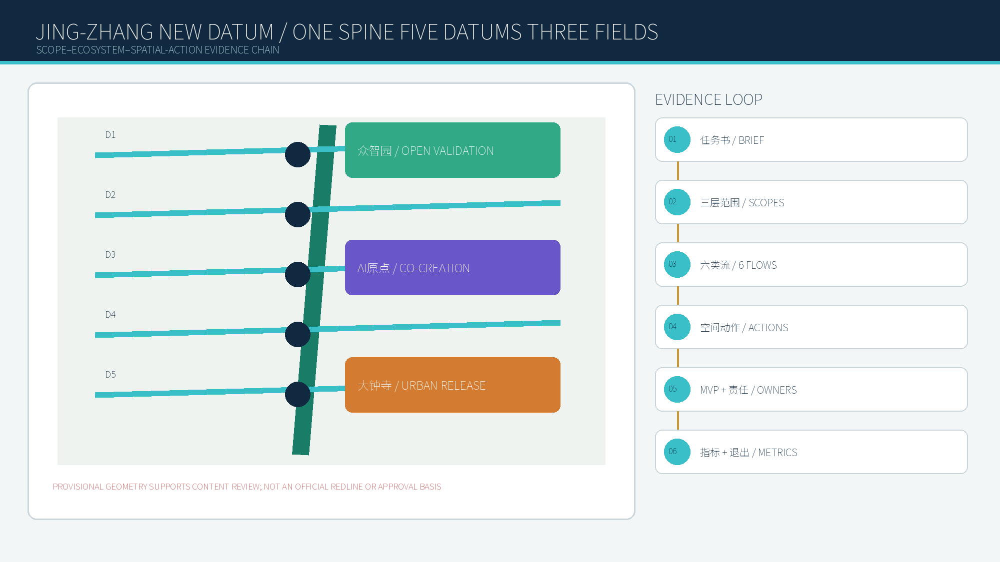
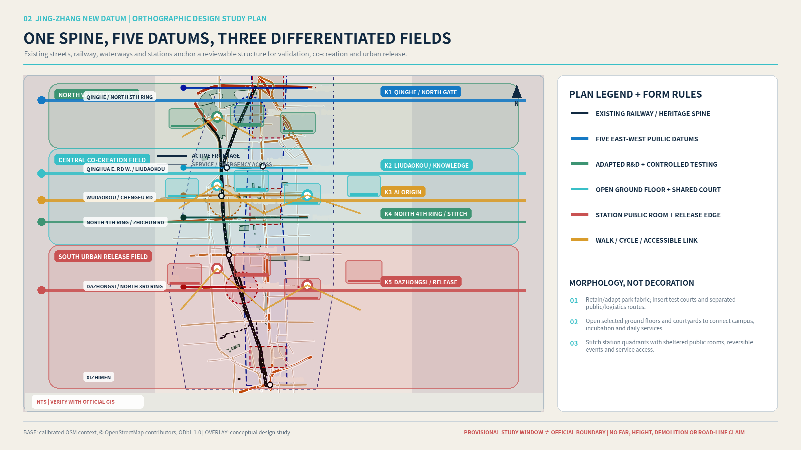
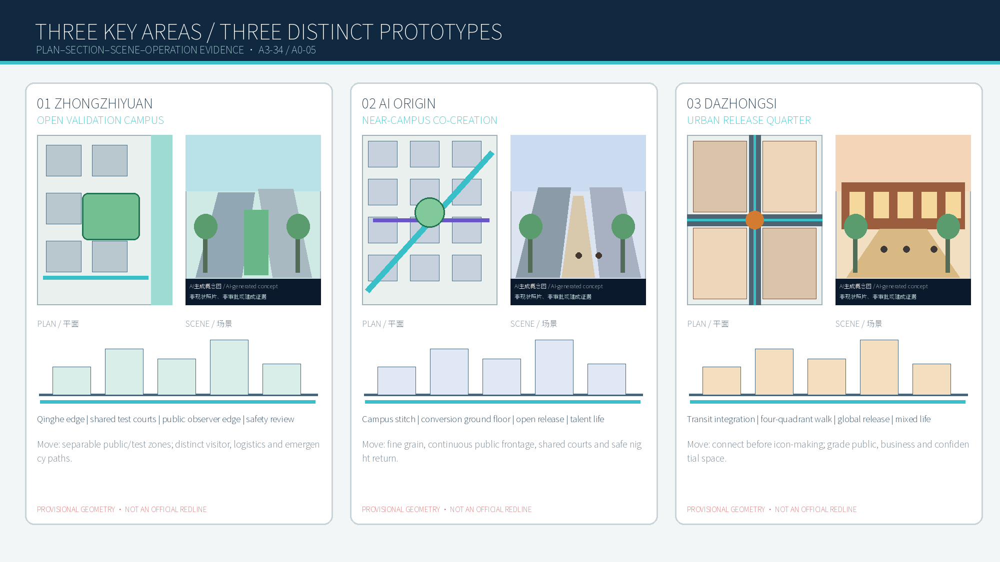
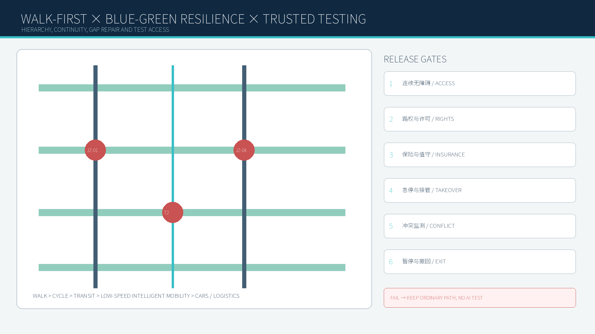
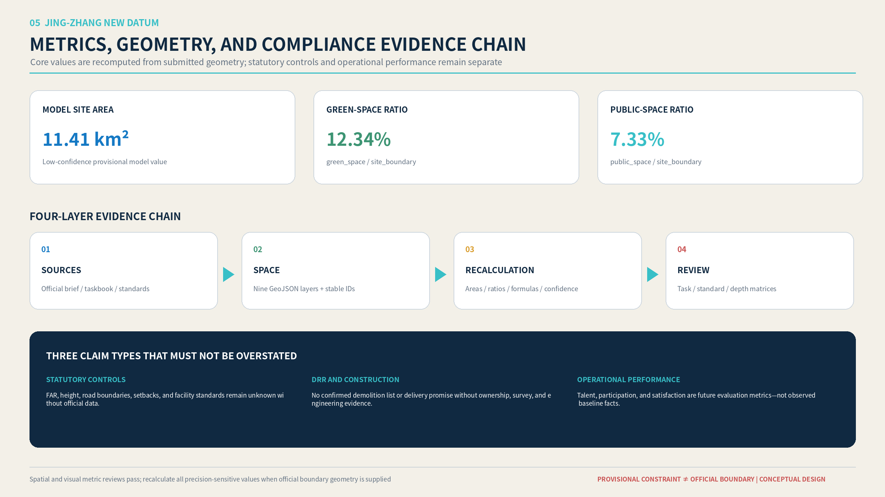

# Jing-Zhang New Datum: Centennial Jing-Zhang AI Innovation Belt

## Design Basis and Source List

This proposal responds to the official announcement for the Centennial Jing-Zhang AI Innovation Belt Open Call for Urban Design and the rights-cleared Agent taskbook. It uses the site package, source registry, professional standards, provisional geometry, and processed reading guides as separate evidence classes. Official text supports the project name, three-level scope, approximate area values, and required tasks. Repository provisional geometry supports temporary generation, visualization, and recalculation only; it does not constitute an Official Boundary, Official Planning Boundary, statutory control, or approval basis [source:OFFICIAL-ANNOUNCEMENT] [source:AGENT-TASKBOOK].

The design therefore distinguishes official facts, public background, provisional constraints, design proposals, and unknown controls. Every spatial claim is connected to a source, geometry layer, metric, assumption, or professional depth item. Missing official boundary, parcel, ownership, Regulatory Detailed Planning, municipal, fire-safety, and heritage-control data are not filled with invented precision. They remain explicit preconditions for professional development [source:SOURCE-REGISTRY] [depth:existing_conditions_diagnosis].

## Three-Level Scope Framework

The Coordinated Research Area addresses the 43.6-square-kilometre innovation ecology and future-city proposition. The Overall Design Area addresses approximately 11.4 square kilometres around the Jing-Zhang Railway Heritage Park, translating the strategic proposition into urban renewal, mobility, public space, industry, and infrastructure systems. The Key-Area Detailed Design Area covers the three named focus areas—Zhongzhiyuan, Beijing AI Origin Community, and Dazhongsi—with an announced total of 368.4 hectares. Exact polygons remain unavailable, so submitted geometry is a provisional constraint and every precision-sensitive value must be recalculated when organizer-supplied official geometry becomes available [data:geometry/site_boundary.geojson#SITE-001] [data:geometry/key_areas.geojson#PROV-KEY-001] [metric:site_area_sqm].

The three scopes operate as one decision chain. Regional industry and talent choices determine the spatial carriers required in the Overall Design Area; the three key areas then test whether those carriers can become credible plans, sections, public interfaces, operations, and measurable outcomes. The adopted structure is **One Spine, Five Datums, Three Fields**: one north-south heritage innovation public spine, five east-west urban datums, and three types of AI-enabled public fields [depth:three_level_scope_framework] [depth:overall_spatial_structure].

## Coordinated Research Area: Industry and Future City Research

Haidian already concentrates universities, research institutes, platform enterprises, start-ups, investors, professional services, and highly mobile talent. The proposal does not treat these assets as a list. It organizes a spatial innovation cycle: fundamental research and open-source collaboration; prototype and model validation; enterprise incubation and professional services; public demonstration and urban application; international exchange and rule-making. The Zhongguancun Technology Services Wing supports capital, intellectual property, legal, and global resource allocation, while the Xiaoyue River Scenario Enablement Wing supports AI-enabled mobility, public service, and urban-life testing [source:AGENT-TASKBOOK] [standard:PROJECT-AGENT-OPEN-CALL-TASKBOOK].

The future-city hypothesis is that an AI district should not be defined by screens, robots, or a technology-themed skyline. It should be defined by whether knowledge, people, services, and public space can cross institutional boundaries safely and conveniently. AI must become visible as a public capability with clear human review, accessibility, data minimization, and fallback service. The “New Datum” is therefore both a spatial structure and a six-part evaluation method: walking continuity, open ground floors, all-day use, cultural legibility, public value, and human-review capacity.

### Three Positions, Five Functions, Three Areas and Two Wings

The three positions form one value chain: the **AI Fusion Innovation Belt** connects university research, open-source work, validation, and enterprise conversion; the **Urban AI Life Experience Belt** makes public service and talent life accessible with human and non-digital alternatives; and the **Century-old Jing-Zhang Cultural Belt** builds identity through railway heritage, innovation history, and renewable public content. Five spatial functions—research, open validation, enterprise services, talent life, and cultural communication—are assigned to differentiated interfaces rather than repeated slogans [source:AGENT-TASKBOOK].

| Unit | Primary duty | Inputs / outputs | Explicit interface and spatial action | Boundary |
| --- | --- | --- | --- | --- |
| Zhongzhiyuan | Full-stack validation, standards, safety | Compute/models/test needs → review records and reusable protocols | JZ-02 Qinghe edge + T1 trustworthy-agent sandbox | Professional evaluator required |
| AI Origin | University conversion, open source, talent | Talent/research/code → prototypes, teams, service needs | JZ-03 conversion street + open-source release hall | No presumed IP or campus authorization |
| Dazhongsi | Enterprise release and international exchange | Firms/capital/customer scenarios → service leads, jobs, content | JZ-04 four-quadrant link + release hall | No promised investment or tenancy |
| Zhongguancun Services Wing | Legal, IP, finance, talent service interface | Verified service information → professionally reviewed cases | Staffed enterprise-service counter at AI Origin | **Proposed interface**, not an existing partnership |
| Xiaoyue River Scenario Wing | Urban-life validation interface | Community needs and scenario applications → feedback and withdrawal records | T3 trusted service station + community observer seat | **Proposed interface**, subject to approval |

Talent, compute, data, capital, scenarios, and public-service flows each have a return path. Data entering a sandbox is minimum-necessary, de-identified, synthetic, or authorized; capital is an expert-service connection, not a funding promise; public services retain staffed and paper routes. Evidence: **A3-20/A3-21; A0-04**.

### Six Global Cases: Adopt Mechanisms, Not Images

| Case | Comparable condition | Adopt | Do not transplant | Jing-Zhang translation |
| --- | --- | --- | --- | --- |
| Singapore one-north | Research, firms, start-ups, urban services | District network, shared launch space, walk/transit links | Land and governance model | Shared validation + cross-area service catalogue [source:CASE-ONE-NORTH] |
| Kendall Square | University research beside dense innovation district | Mixed R&D/living/retail and public open space | Market, ownership, intensity | Open ground floors + near-campus conversion [source:CASE-KENDALL] |
| Paris-Saclay | Multi-node research cluster | Single innovation gateway and campus-city public ground | National scale and investment | Distributed “One Spine, Five Datums” gateways [source:CASE-PARIS-SACLAY] |
| Barcelona 22@ | Industrial-area renewal | Mixed use and phased renewal | Regulation, housing, industry mix | Reversible retain-adapt-renew method [source:CASE-22BARCELONA] |
| Toronto MaRS | Urban research-commercialization hub | Professional services co-located with labs, work and events | Institutional brand and finance model | Dazhongsi release hall + services wing [source:CASE-MARS] |
| Brainport Eindhoven | Regional network of specialist campuses | Shared facilities and research-test-scale cycle | Manufacturing supply-chain base | Three-area specialization + transferable test protocol [source:CASE-BRAINPORT] |

These sources establish public mechanisms only; they do not establish collaboration with the project. Evidence: **A3-20; A0-04; `sources.json`**.

### Proposed Regional Interfaces

| Partner context | Theme / exchanged element | Jing-Zhang node | Responsibility | Evidence status |
| --- | --- | --- | --- | --- |
| BFSU AI Community | International talent, community feedback, bilingual content | Dazhongsi release hall | Urban-service proposal | Direction published; collaboration unconfirmed [source:REGION-BEIWAI] |
| Future Science City | Advanced energy and research translation | Zhongzhiyuan low-carbon validation | Thematic proposal | Regional role published; project link unconfirmed [source:REGION-FUTURE-SCIENCE] |
| Huairou Science City | Major facilities and original research | AI Origin Coordinate Hall | Research-communication proposal | Regional role published; project link unconfirmed [source:REGION-HUAIROU] |
| Beijing E-Town | AI+ industry and application scenarios | T1/T2 scenario desk | Industry-scenario proposal | Policy direction published; collaboration unconfirmed [source:REGION-ETOWN] |
| Beijing-Tianjin-Hebei innovation network | Research, industry, talent | Annual Public Life Week | Network proposal | Institutional role published; event link unconfirmed [source:REGION-JJJ] |

Every regional relationship follows issue proposal → mutual confirmation → professional review → limited pilot → public review. No joint release, co-built base, or committed input is claimed before confirmation. Evidence: **A3-21; A0-04**.

## Overall Design Area: Urban Renewal and Regulatory-Plan-Level Urban Design

The Jing-Zhang Railway Heritage Park becomes the innovation public spine rather than a residual linear green strip. Five east-west datums reconnect the fragmented urban fabric: the Northern Gateway Datum links Qinghe, Zhongzhiyuan, and the Fifth Ring Road; the Academy Co-Creation Datum connects campuses and research institutes; the AI Origin Datum links Wudaokou, university neighborhoods, and commercialization services; the Jimen Community Datum integrates education, health, and everyday public services; and the Dazhongsi Urban Release Datum links the transit station, four quadrants, public demonstration, and international exchange.

Three morphology prototypes translate the industry cycle into urban form. The **Open Validation Campus** adapts existing research-park fabric through shared test courts, controlled logistics, a public observation edge, and a Qinghe ecological interface. The **Near-Campus Co-Creation Street** uses smaller blocks, dense walking routes, open ground floors, shared courtyards, affordable collaboration spaces, and mixed daily services. The **Urban Release Quarter** uses transit integration, continuous pedestrian frontage, flexible event rooms, public living rooms, and all-day commercial and cultural programs. These are conceptual urban-design recommendations; Floor Area Ratio, Building Height, road boundaries, setbacks, ownership, and Demolish–Renovate–Retain decisions remain pending official data [data:geometry/land_use.geojson#LU-001] [depth:land_use_layout] [depth:development_intensity_controls].

## Detailed Design of Key Areas

The Zhongzhiyuan AI Independent Innovation Acceleration Area is designed as an Open Validation Campus. Its primary spatial move is a sequence from the Qinghe ecological edge to a public innovation lobby, shared testing courts, controlled technical zones, and a human-review center. Public visitors, researchers, equipment logistics, and emergency access use legible but different paths. Its identity comes from credible testing, safety governance, low-carbon infrastructure, and visible professional review rather than monumental form [data:geometry/key_areas.geojson#PROV-KEY-001].

The Beijing AI Origin Community becomes a Near-Campus Co-Creation Street. The proposal reconnects campus gates, neighborhoods, incubators, transit, and the heritage park through a fine-grained walking network. Open-source release rooms, flexible workspaces, intellectual-property and investment services, affordable food, housing support, and night-time study spaces occupy a continuous public ground floor. The key test is whether a student, researcher, resident, or start-up can move through the district without crossing a sequence of closed compounds [data:geometry/key_areas.geojson#PROV-KEY-002].

The Dazhongsi AI Industry Cluster becomes an Urban Release Quarter. Transit-station integration and four-quadrant pedestrian continuity precede architectural spectacle. An international presentation hall, enterprise demonstration spaces, AI-enabled retail and cultural programs, and a public event street create an urban interface for intelligent agents, terminals, content, and data-service enterprises. The provisional repository focus area is visibly displaced from mapped Dazhongsi station context, so the design uses a geographically anchored study window and awaits official polygon confirmation [data:geometry/key_areas.geojson#PROV-KEY-003] [depth:three_key_area_detailed_design].

## AI Innovation Ecosystem, Personas, and AI+ Scenarios

Five design personas test the proposal across a full day: university researchers and student developers; start-up teams; major-enterprise and international visitors; residents and families; and older or mobility-impaired users. These are design-validation roles, not profiles derived from tracked individuals or a completed public survey. Each persona tests arrival, work, collaboration, services, recreation, night-time safety, accessibility, and the availability of a non-digital alternative.

Ten local scenario cards are linked to the six standard scenario IDs. They cover an open-source release hall, trustworthy-agent sandbox, edge-computing service station, AI walking guidance, Dazhongsi international release hall, Qinghe low-carbon innovation corridor, near-campus commercialization street, data-governance living room, AI daily-service street, and a Global AI Public Life Week route. Every card states its user, time, spatial carrier, minimum necessary data, public value, risk, human reviewer, and fallback mode [standard:PROJECT-AGENT-OPEN-CALL-TASKBOOK] [data:geometry/public_space.geojson#PUBLIC-001].

Three Testing and Validation Scenarios provide deeper implementation logic. T1 is a trustworthy Urban Agent service sandbox at Zhongzhiyuan, testing explainability, error traceability, human takeover, and multi-model collaboration. T2 is a low-speed robot mixed-mobility loop, beginning in controlled areas and expanding only through time-limited, route-limited operation with emergency stopping and remote human takeover. T3 is a trusted AI public-service station for health navigation, education, legal orientation, and enterprise services, always retaining professional judgment and staffed alternatives. None of these scenarios implies that road testing, medical service, data circulation, or public-safety approval has been granted [depth:municipal_new_infrastructure] [depth:risk_missing_data].

## Land Use, Building Scale, and Retain-Renovate-Demolish Strategy

The submitted Land-Use Plan is a temporary design-model partition that allows geometry and metrics to be checked. It does not replace approved Regulatory Detailed Planning. The professional method is to begin with verified streets, rail, water, blocks, building footprints, public facilities, and heritage elements; then classify structures as retain, adapt, renew, potential replacement subject to evidence, or unknown. Reuse is prioritized where existing fabric can support affordable innovation, public ground floors, flexible testing, or community service. Removal is never inferred from visual age, low intensity, or an AI-generated image [standard:MNR-LAND-USE-CLASSIFICATION-GUIDE] [data:geometry/buildings.geojson#BLDG-001].

Total floor area, Floor Area Ratio, Building Height, Building Coverage Ratio, setbacks, parking supply, and parcel-level development rights remain unknown where official controls are missing. Massing studies are conceptual tests of sunlight, frontage, permeability, and public-space proportion. Formal DRR decisions require ownership records, measured surveys, structural assessment, heritage review, infrastructure capacity, relocation policy, and cost evaluation [depth:retain_renovate_demolish] [depth:height_massing_character].

## Transport, Rail, Municipal Infrastructure, and Public Services

The mobility hierarchy is walking first, cycling second, public transit third, low-speed intelligent mobility fourth, and private vehicles and logistics fifth. Continuous accessible routes must connect stations, crossings, park entrances, public ground floors, courtyards, and service destinations before autonomous shuttles or delivery robots are introduced. Each east-west datum includes cycle parking, interchange, shade, seating, wayfinding, and a staffed assistance point. Activity-day operations use time windows and reversible management instead of permanent oversizing [data:geometry/roads.geojson#ROAD-001] [depth:traffic_rail_slow_parking].

New Infrastructure is distributed rather than monumental: edge-computing and energy nodes, secure test connectivity, service-robot docking, environmental sensing, and public information points are integrated with ordinary municipal and public-service facilities. Every digital service must provide accessibility, privacy disclosure, human escalation, and a non-smart fallback. Road boundaries, bridges, utilities, drainage, flood safety, fire access, and power capacity remain subject to specialist confirmation [data:geometry/constraints.geojson#CONSTRAINTS] [depth:municipal_new_infrastructure].

## Blue-Green Network, Public Space, and Urban Character

The Jing-Zhang Railway Heritage Park is structured as a sequence of ecological movement space, quiet neighborhood space, active co-creation space, and controlled validation space. Qinghe and Xiaoyue River interfaces prioritize continuous ecological walking and cycling. Ring-road, railway, and major-intersection breaks are classified by conflict type rather than solved with one repeated bridge form. Event fields and quiet residential edges operate with differentiated time, lighting, sound, and service rules [data:geometry/green_space.geojson#GREEN-001] [data:geometry/public_space.geojson#PUBLIC-001] [metric:green_ratio].

Urban Character combines three narratives without reducing them to decorative motifs: the technological and civic meaning of the historic Jing-Zhang Railway; Zhongguancun's culture of experimentation, open learning, and commercialization; and an AI culture based on transparency, contribution, human review, and public benefit. Three pilgrimage landmarks are proposed as public institutions rather than iconic objects: the AI Origin Coordinate Hall, the “Century of Jing-Zhang / Century Ahead” Time Station, and the World Urban Agent Charter Square. Their content, annual programs, and public contribution records create identity over time [standard:MOHURD-URBAN-DESIGN-MEASURES] [depth:blue_green_public_space].

### Seven Public-Space Components and Four Brand Layers

| ID | Component | Minimum kit / location | Operations and exit |
| --- | --- | --- | --- |
| C1 | Innovation porch | Shelter, seat, power, bilingual map at datum/park junction | Remains ordinary rest space without operator |
| C2 | Open validation deck | Enclosable test surface, observers, emergency stop at Zhongzhiyuan | Closed without approval, insurance, and staff |
| C3 | Human-service island | Counter, paper process, accessible queue at T3 nodes | Operates independently when digital system is off |
| C4 | Low-carbon compute kiosk | Cabinet, thermal management, disclosure screen | No equipment before energy and safety review |
| C5 | Contribution datum wall | Replaceable licensed panels and withdrawal entry | Remove on expiry or sustained rights claim |
| C6 | Walking repair kit | Continuous surface, ramp, light, docking at gaps | Downgrade to wayfinding if traffic review fails |
| C7 | Blue-green learning station | Stormwater display, seating, interpretation at river/park edge | Flood and ecology constraints prevail |

Branding uses four layers: L1 “Jing-Zhang New Datum” wordmark and sleeper/data-tick motif; L2 green, blue-violet, and warm-orange zone bands; L3 five datum IDs and walking-time wayfinding; L4 content labels showing source, date, authorization, AI/real status, and withdrawal entry. Heritage, operating-event, and temporary enterprise content remain separate; corporate marks never become permanent civic wayfinding. Evidence: **A3-24/A3-25; A0-05; HTML `#components-brand`**.

## Renewal Projects, Implementation Policy, and Phasing

Six initial project packages organize implementation: heritage-park walking-gap repair; the Zhongzhiyuan Qinghe innovation edge; the AI Origin near-campus commercialization street; Dazhongsi four-quadrant pedestrian links; AI public-service and edge-computing nodes; and the annual Global AI Public Life Week route. Each package identifies location, public value, dependency, responsible partnership, risk, and evaluation method. These are project proposals, not confirmed budgets, land commitments, or government implementation decisions [data:geometry/phasing.geojson#PHASE-001] [depth:renewal_project_list].

Phasing separates reversible pilots from capital works. Near-term actions include wayfinding, temporary open-source and community programs, accessibility audits, staffed service pilots, and controlled testing. Medium-term actions adapt ground floors, courtyards, station approaches, and blue-green links after ownership and technical review. Long-term actions address major crossings, infrastructure renewal, and regulatory integration. Weekly developer schools and community AI clinics sustain daily use; quarterly Scenario Access Days test services; the annual public-life week connects the three zones and five datums. Public-space use, cross-district walking, accessibility, human-transfer success, youth participation, and complaint closure are more important than publicity volume [depth:phasing_implementation].

### MVP-to-Operation Implementation Matrix

| Item | MVP | Lead role / operator and reviewer | Current dependency | Phase/cadence | Pause or exit |
| --- | --- | --- | --- | --- | --- |
| JZ-01 | One reversible gap repair | Public-space coordinator / traffic + accessibility review | Road boundary, under-bridge rights, traffic | Near / quarterly | Safety failure or increased conflict |
| JZ-02 | One Qinghe edge segment | Park/river coordinator / landscape + water review | Blue line, flood, ecology | Near / seasonal | Flood or ecology conflict |
| JZ-03 | One ground-floor conversion desk | Renewal coordinator / operator + legal/IP advisers | Ownership, campus interface | Near / half-year | No operator or unmanaged disturbance |
| JZ-04 | One continuous four-quadrant path | Station coordinator / traffic, utility, accessibility review | Station, junction, utilities | Mid / gate review | Traffic or fire-safety failure |
| JZ-05 | One dual-route AI service node | Public-service coordinator / specialist + data review | Energy, compute, service authorization | Near / monthly audit | Overreach, unresolved complaint, no human route |
| JZ-06 | One-day public route | Event coordinator / safety + rights review | Venue permission, content rights, capacity | Annual | Missing permit, excess capacity, rights dispute |
| T1 | Three standardized tests | Scenario-platform lead / independent evaluator | Protocol and synthetic/authorized data | Near / each batch | No reliable human takeover |
| T2 | 100 m controlled loop | Park mobility lead / traffic + device owner | Road right, insurance, stop and staff | Mid / each release | Pedestrian conflict or loss of control |
| T3 | One staffed dual-track counter | Community-service lead / relevant professionals | Service authorization and paper route | Near / monthly | Replaces professional judgment or excludes users |
| Annual event | One-day minimum viable week | Multi-party forum / event, safety, rights, community review | Permission, rights, capacity, complaints | Annual review | Promotion displaces public value or disturbance persists |

Budgets, land ownership, statutory approval bodies, and named operators remain **unknown**. Evidence: **A3-26/A3-28; A0-06; HTML `#implementation-matrix`**.

### Seven-Step Participation-to-Service Path

1. Entry through online, paper, or assisted in-person channels.
2. Screening of purpose, space, data, rights, qualifications, and conflicts.
3. A limited pilot with bounded place, time, users, and data.
4. Public release only for authorized, explainable outcomes labeled as pilot/concept/non-approval evidence.
5. Handoff to verified legal, IP, finance, recruitment, housing, or learning services; the urban agent does not make final decisions.
6. Annual review using completion, accessibility, human transfer, complaint closure, and spatial impact.
7. Content withdrawal triggered by rights holders, community observers, or professional review, with an audit record and no unnecessary personal data retention.

This transferable operating proposal is not an existing administrative approval process. Evidence: **A3-27; A0-06; HTML `#conversion-path`**.

## Metrics, Area Recalculation, and Compliance Matrix

The three mandatory visual metrics are recomputed from submitted geometry: model site area, green-space ratio, and public-space ratio. Because the boundary is provisional, these are known finite design-model values with low confidence, not official area claims. The current model calculates approximately 11.41 square kilometres, a green-space ratio of 12.34 percent, and a public-space ratio of 7.33 percent. Values in GeoJSON, metrics, figures, and offline HTML must remain identical and must be recalculated when Official Boundary geometry is supplied [metric:site_area_sqm] [metric:green_ratio] [metric:public_space_ratio].

Metrics are managed in three groups. Geometry-derived spatial metrics are reproducible but retain the confidence of their input geometry. Statutory controls such as FAR, Building Height, road boundaries, and setbacks remain unknown until official documents are available. Operational indicators—talent participation, service completion, human takeover, accessibility, and public satisfaction—are proposed evaluation measures requiring future baseline data. Compliance, professional standards, and design depth remain auditable through three structured matrices [depth:metrics_recalculation].

## Risk, Copyright, and Compliance

The primary qualification risk is false certainty. Provisional geometry must never be described or drawn as an official redline. Generated renderings are conceptual presentation artifacts, not current-condition photographs, public testimony, approval evidence, or a promise of construction. No parcel-level demolition, ownership, statutory FAR, Building Height, utility, fire-safety, heritage-control, medical, road-testing, or data-compliance conclusion is made without the corresponding professional evidence. The submission remains locally reviewable and is not pushed, published, or opened as a Pull Request without the human principal designer's explicit authorization [source:SITE-PACKAGE] [depth:risk_missing_data].

All maps, images, fonts, scripts, and generated assets require provenance and rights statements. OpenStreetMap may provide contextual mapping with attribution but cannot support official boundary or statutory-control claims. AI-generated scenes must disclose their synthetic status and generation method. Offline HTML must not load remote scripts, fonts, map tiles, APIs, forms, trackers, or iframes. Bilingual narrative, figures, HTML, and drawings must be semantically equivalent; a duplicated Chinese file is not an English translation.

## References

- Official announcement for the Centennial Jing-Zhang AI Innovation Belt Open Call for Urban Design [source:OFFICIAL-ANNOUNCEMENT].
- Rights-cleared Agent taskbook and task coverage [source:AGENT-TASKBOOK].
- Repository site package, provisional geometry, schemas, enumerations, and planning-limit records [source:SITE-PACKAGE].
- Central Source Registry and processed reading guides [source:SOURCE-REGISTRY] [source:PROCESSED-FACT-PACK].
- Professional standards indexed in `standard_matrix.json`; full provenance and reuse limitations are recorded in `sources.json`.
