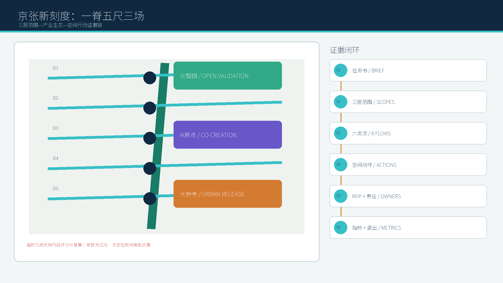
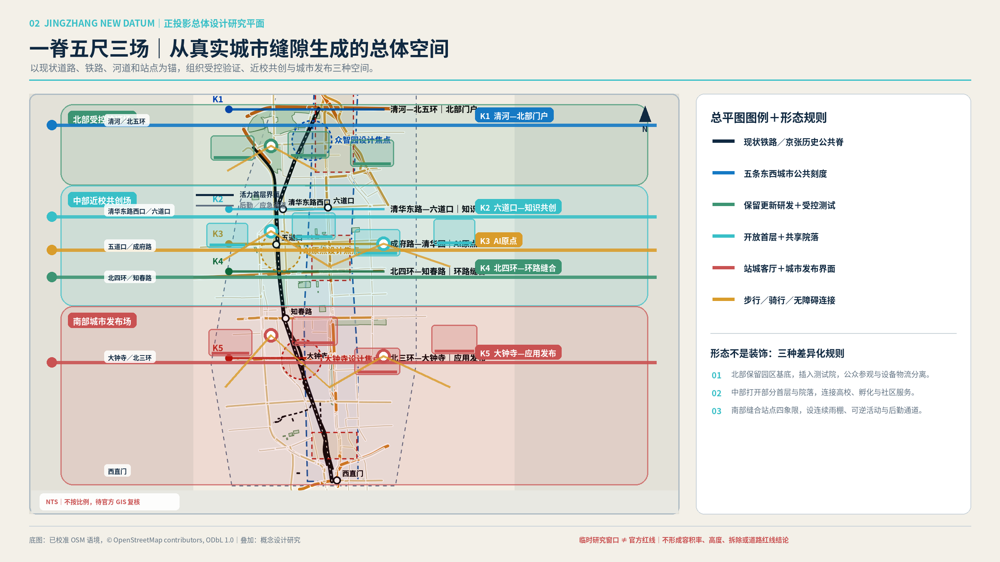
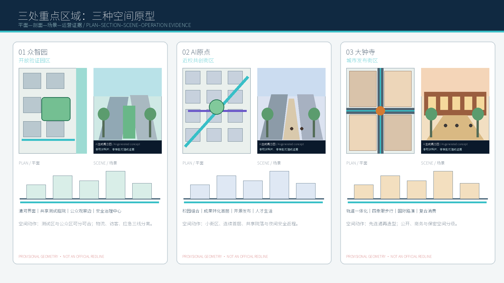
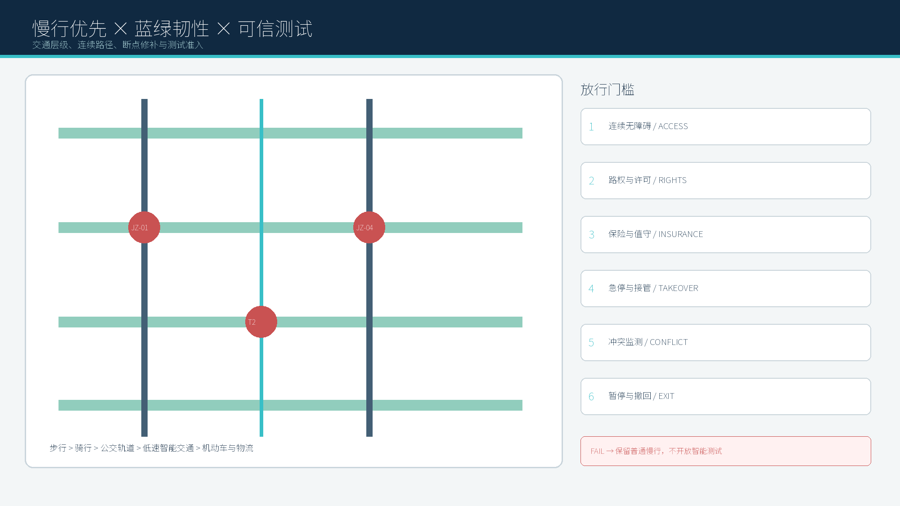
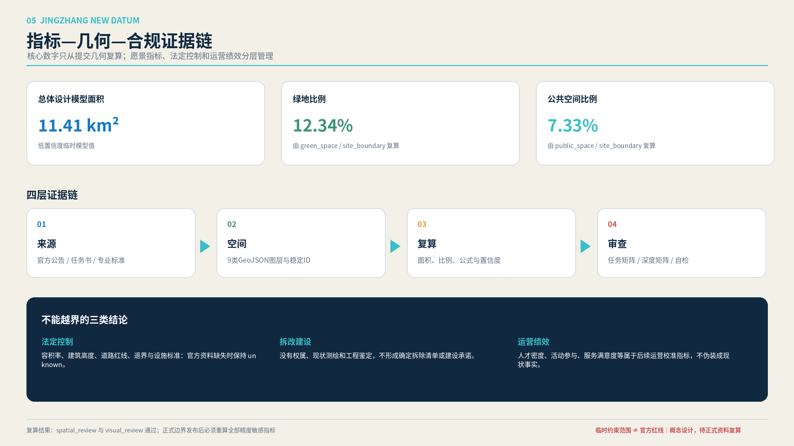

# 京张新刻度：百年京张AI创新带

## 设计依据与资料清单

本方案以北京市规划和自然资源委员会海淀分局发布的《百年京张AI创新带城市设计国际方案征集资格预审公告》为第一依据，并以 `brief/site-package/` 中经维护者登记的临时粗略边界、重点区域、枚举、指标和来源清单为机器可读依据。生成过程中读取 `design_brief.json`、`allowed_design_space.json`、`sources.json`、`enums/`、`ranges/`、`schemas/`、`data/source_registry.json` 和 `data/processed/agent_fact_pack.md`，用范围、任务、资料用途和缺口清单约束设计。所有设计判断被拆分为可追溯来源、可复算指标、可校验图层和可人工复核假设。公告要求方案达到控制性详细规划的城市设计深度和规划综合实施方案的城市设计深度，因此文本叙述不能替代 GeoJSON、指标表、A3 文册、A0 展板和 HTML 电子展示成果。

方案不是独立愿景文本，而是从公告、面向智能体任务书和场地资料出发组织成果；本节只把最关键依据放在判断旁边 [source:OFFICIAL-ANNOUNCEMENT] [source:AGENT-TASKBOOK] [depth:existing_conditions_diagnosis]。完整来源和标准覆盖分别保存在 `sources.json`、`standard_matrix.json` 与 `design_depth_matrix.json`，不在正文重复机器索引。

资料登记表的使用边界如下 [source:SOURCE-REGISTRY]：

- data/source_registry.json 登记公开、清权与临时资料的用途边界。
- 当前登记摘要：formal 可用资料 7 条，背景资料 1 条，provisional-only 资料 1 条。
- agent 不得把 background_only 或 provisional_only 资料升级为 official boundary、法定控规、正式评分依据或政府实施承诺。

`data/processed/agent_fact_pack.md` 是本方案的阅读导航层，不是新的权威来源 [source:PROCESSED-FACT-PACK]。它帮助 agent 把三层范围、三处重点区、公告任务、agent.1-agent.6、资料可用性和缺资料事项组织成可读方案；事实判断仍需回到已登记的原始材料 [source:OFFICIAL-ANNOUNCEMENT] [source:AGENT-TASKBOOK]，完整来源关系由 `sources.json` 保存。

本脚手架在官方 `SITE_BOUNDARY` 或三处 `KEY_AREA` 尚未取得时，使用 `brief/site-package/geometry/provisional_boundaries.geojson` 生成临时 formal 包。提交包中的 `geometry/site_boundary.geojson` 与 `geometry/key_areas.geojson` 均必须标注为 `provisional_constraint`、`official_boundary=false`，只能用于方案生成、自检、可视化和设计讨论，不能作为 official redline、审批依据、精确面积依据或法定控制结论。该组织方数据缺口本身不阻断内容评分；替换 official polygons 后，site boundary、key areas、land use、roads、green space、public space、buildings、phasing 和 metrics 均需重算。

本次方案采用的边界状态为：**临时边界，保留精度警示并待正式数据发布后复算；不阻断内容评分**。因此，正文中的空间结构、场景、项目和指标均按“可讨论、可复核、可替换官方边界后重算”的原则写入；当官方边界和重点区 polygon 更新后，必须同步重算空间图层、指标并更新图纸与 HTML，不能只替换单个文件。

边界解释可回到总体范围图层和面积复算 [data:geometry/site_boundary.geojson#SITE-001] [metric:site_area_sqm]。三处重点区则由独立图层和数量指标核对 [data:geometry/key_areas.geojson#PROV-KEY-001] [metric:key_area_count]。这意味着读者可以从正文进入证据，但不必先读一串机器编号。

## 三层范围工作框架

方案按照公告确定的三个层次组织工作：统筹研究范围关注 43.6 平方公里的AI产业生态、战略定位、创新链和未来城市形态；总体设计范围关注 11.4 平方公里京张遗址公园周边 1-2 公里城市地区和产业区，要求形成城市更新总体框架、产业空间布局、交通市政支撑和城市风貌控制；重点区域范围关注 368.4 公顷三处详细设计地区，要求明确功能业态、建筑规模、拆改留分类、公共空间连通和交通组织。三层范围在 `compliance_matrix.json` 中逐条映射，保证公告 1.3、1.4、1.5 与 agent.1-agent.6 的必选任务都有章节、图层、指标、图纸和 HTML 证据。

三层工作框架的深度项由 [depth:three_level_scope_framework] 和 [depth:overall_spatial_structure] 约束，空间证据以 [data:geometry/site_boundary.geojson#SITE-001] 与 [data:geometry/key_areas.geojson#PROV-KEY-001] 为准，任务依据以 [standard:PROJECT-OFFICIAL-ANNOUNCEMENT] 为准，范围索引以 [source:PROCESSED-FACT-PACK] 中 `project_scope_summary.csv` 的三层范围表为导航。

三层工作不是互相割裂的图纸集合。统筹研究决定产业链和城市形态判断，总体设计把判断落实到更新项目、空间结构和设施承载，重点区域详细设计验证具体地块、建筑、交通、公共空间和AI应用场景的可实施性。agent 生成方案时必须先锁定当前提交采用的 official 或 provisional 边界和约束，再生成用地、建筑、道路、绿地、公共空间、分期和AI服务节点，最后从这些图层复算指标并在正文解释哪些结论仍受 provisional boundary 限制。任何无法从结构化数据复算的面积、比例、规模或项目数量，不得写入正式结论。

本方案提出总体概念 **“京张新刻度 / JINGZHANG NEW DATUM”**：不把京张遗址公园理解为被城市背向包围的线性绿地，而是将其转化为衡量海淀下一代创新城区品质的公共基准。空间结构概括为 **“一脊五尺三场”**：一条京张遗址创新公共脊串联南北；五条东西向创新刻度把高校、园区、社区、轨道和公共服务缝合到遗址公园；三类场景场——知识共创场、城市生活场、开放验证场——让AI从封闭园区进入可见、可用、可治理的城市日常。三处重点片区分别承担技术验证、近校共创和产业展示功能，避免使用同一套空间语言简单复制。

五条刻度不是新的法定道路或用地边界，而是设计研究中的跨界连接单元：北部刻度连接清河、众智园和北五环门户，验证低碳算力与机器人开放测试；学院刻度连接高校、科研院所和京张遗址公园，承载开源发布与跨校协作；原点刻度缝合五道口、高校社区和成果转化空间；蓟门刻度把社区公共服务、教育医疗与遗址公园日常生活结合；大钟寺刻度围绕轨道站点和四象限步行系统组织智能经济展示与国际交往。五条刻度共同把传统“沿线开发”转变为“横向缝合”，其空间证据需在后续正式总图、节点平面和剖面中逐一定位 [depth:overall_spatial_structure] [data:geometry/roads.geojson#ROAD-001]。

“新刻度”同时是一套评估方法：每个节点都以步行连续性、首层开放度、全天使用、文化可读性、AI公共价值和人工复核能力六项尺度校核。技术不能只形成屏幕和装置；必须改变入口、首层、院落、街角、公园界面或服务流程，并能说明运营者、数据边界和退出机制 [standard:PROJECT-AGENT-OPEN-CALL-TASKBOOK] [depth:blue_green_public_space]。

| 层级 | 设计问题 | 方案回答 | 数据落点 |
| --- | --- | --- | --- |
| 统筹研究范围 | AI产业生态和未来城市形态如何组织 | 建立“高校策源-开源协作-企业转化-公共体验-国际传播”的创新链 | compliance_matrix.json、standard_matrix.json |
| 总体设计范围 | 产业空间、城市更新、交通市政和风貌如何落图 | 用地、建筑、道路、绿地、公共空间和分期图层共同表达 | [data:geometry/land_use.geojson#LU-001]、[data:geometry/roads.geojson#ROAD-001] |
| 重点区域范围 | 三处片区如何达到详细设计深度 | 分别提出定位、空间动作、AI场景和实施依赖 | [data:geometry/key_areas.geojson#PROV-KEY-001]、[data:geometry/key_areas.geojson#PROV-KEY-002]、[data:geometry/key_areas.geojson#PROV-KEY-003] |

## 统筹研究范围产业与未来城市研究

统筹研究范围的核心任务是构建世界级 AI 创新生态体系。方案应梳理海淀高校院所、头部企业、算力算法数据要素、孵化平台、上市企业、独角兽和科技服务资源，提出AI创新链、产业链、人才链和城市服务链的空间协同框架。命名方案和 logo 设计应服务于“百年京张文化带、都市AI生活体验带、AI融合创新带”的整体辨识度，不能只停留在口号，应说明与产业生态、公共空间和文化资源的关联。面向智能体任务书还要求回应“五大功能”和“三区两翼”协同，形成可继续深化的命名系统、视觉识别、总体空间结构图、场景开放和运营机制；本节必须用 [source:AGENT-TASKBOOK] 与 [standard:PROJECT-AGENT-OPEN-CALL-TASKBOOK] 标注这些要求来自 agent 开源征集任务，而不是法定规划控制。

统筹研究并不新增伪精确红线；它通过 [standard:MOHURD-URBAN-DESIGN-MEASURES] 要求的城市风貌、公共空间和建筑布局统筹，回接 [data:geometry/land_use.geojson#LU-001]、[data:geometry/public_space.geojson#PUBLIC-001] 与 [depth:overall_spatial_structure]，说明产业策略最终要落到可见、可复核的空间结构。

未来城市形态研究应回答人工智能如何改变工作、生活、社交、学习、交通和公共服务。方案应把AI交通系统、连续绿色空间、创新服务设施和国际化生活工作氛围落实为可定位的功能区、节点、廊道和场景，而不是泛泛描述技术愿景。agent 应把产业战略指标、AI创新指数、人才密度、空间供给类型和AI+垂直应用重点区域写入指标体系，并标明哪些是官方、哪些是设计建议、哪些仍待正式数据校准。若提出全球AI创新活动、开发者社区、开放场景或朝圣路线，应写为“概念建议/参考方案/可供专业团队深化研究”，不得写成已经确定的政府活动或实施安排。

### 三大定位—五大功能—三区两翼：一张协同底图

三大定位不是三句口号，而是同一条价值链的三个结果：**AI融合创新带**负责把高校策源、开源协作和企业转化组织为产业循环；**都市AI生活体验带**把公共服务、人才生活和可选择退出的AI体验组织为日常循环；**百年京张文化带**以铁路遗产、创新史和年度内容更新形成时间循环。五大功能被落实为五类空间接口：策源研发、开放验证、企业服务、人才生活、文化传播。三区承担不同主责，两翼提供专业服务与城市验证，不把“两翼”写成已获官方确认的合作关系 [source:AGENT-TASKBOOK]。

| 单元 | 主责功能 | 输入流 | 输出流 | 明确接口与空间动作 | 责任边界 |
| --- | --- | --- | --- | --- | --- |
| 众智园 | 全栈验证、标准与安全治理 | 算力、模型、测试需求 | 评测记录、可复用测试协议 | JZ-02清河创新界面 + T1可信智能体沙盒 | 方案建议；专业评测机构复核 |
| AI原点社区 | 高校成果转化、开源与人才服务 | 人才、科研成果、代码 | 原型、团队、知识产权服务需求 | JZ-03成果转化街 + 开源发布厅 | 不推定校企授权或成果权属 |
| 大钟寺 | 企业集聚、产品发布、国际交往 | 企业、资本、客户场景 | 订单线索、人才岗位、展示内容 | JZ-04四象限连通 + 国际路演客厅 | 不推定投资额或企业入驻 |
| 中关村服务翼 | 专业服务接口 | 法务、知识产权、融资、人才政策信息 | 经专业审核的服务工单 | 原点社区“企业服务柜台”；线上预约+线下人工并行 | **建议接口**，非既有合作承诺 |
| 小月河场景翼 | 城市生活验证接口 | 居民需求、公共服务问题、场景申请 | 试点反馈、撤回记录、迭代建议 | T3可信体验站 + 社区观察席 | **建议接口**，试点须另行审批 |

六类要素流形成可追踪回路：人才从高校/社区进入项目团队并回到学习网络；算力以授权服务进入测试，不落入公共展示；数据仅以最小必要、脱敏或合成形式进入沙盒；资本通过专业服务接口对接但不写金额承诺；场景经申请、审查、试点和撤回闭环；公共服务始终保留人工及非数字路径。证据页定位：**A3-20、A3-21；A0-04**。

### 全球案例校准：采用机制，不复制形象

| 案例 | 可比条件 | 可借鉴机制 | 不可直接移植边界 | 京张转译 |
| --- | --- | --- | --- | --- |
| 新加坡 one-north | 科研、企业、创业与城市服务复合 | 专题园区网络、共享启动空间、公共交通与步行联接 | 土地与治理制度不同 | 众智园共享验证设施 + 跨片区服务目录 [source:CASE-ONE-NORTH] |
| Cambridge Kendall Square | 高校科研与高密创新城区相邻 | 研发、居住、商业与公共开放空间协同 | 市场、产权与开发强度不可照搬 | 原点社区首层开放与近校转化街 [source:CASE-KENDALL] |
| Paris-Saclay | 多节点科研集群 | 统一创新入口、校园—城市公共首层、节点分工 | 超大尺度与国家级投资条件不同 | “一脊五尺”作为分布式入口而非封闭园区 [source:CASE-PARIS-SACLAY] |
| Barcelona 22@ | 旧工业区向创新城区更新 | 混合用途与分期更新 | 法规、住房和产业结构不同 | 保留—改造—更新分类与可逆首层 [source:CASE-22BARCELONA] |
| Toronto MaRS | 医研、创业、资本服务在城市核心集聚 | 商业化服务、实验/办公/活动空间共址 | 机构品牌和资金模式不可复制 | 大钟寺路演客厅 + 中关村专业服务翼 [source:CASE-MARS] |
| Brainport Eindhoven | 多专业园区形成区域网络 | 开放创新、共享设施、研究—测试—规模化循环 | 制造业供应链基础不同 | 三区分工 + 测试协议可迁移、项目不搬运 [source:CASE-BRAINPORT] |

以上资料只支撑公开可核验的机制比较，不证明本项目与案例机构存在合作。案例、边界和转译详见 **A3-20；A0-04**，完整链接与使用限制见 `sources.json`。

### 区域协同接口：建议关系而非合作事实

| 对象 | 协同主题 | 交换要素 | 京张接口节点 | 责任类型 | 证据状态 |
| --- | --- | --- | --- | --- | --- |
| 北外AI社区 | 工作—生活—社交场景 | 国际人才服务、社区反馈、双语内容 | 大钟寺国际路演客厅 | 城市服务建议 | 官方页面说明社区方向；合作未确认 [source:REGION-BEIWAI] |
| 未来科学城 | 先进能源与科研转化 | 低碳算力议题、科研需求 | 众智园低碳验证场 | 专题协同建议 | 区域定位可核验；项目关系未确认 [source:REGION-FUTURE-SCIENCE] |
| 怀柔科学城 | 大科学装置与原始创新 | 科研问题、成果展示需求 | AI原点坐标厅 | 科研传播建议 | 区域定位可核验；项目关系未确认 [source:REGION-HUAIROU] |
| 北京经开区 | AI+产业与应用场景 | 场景清单、规模化验证需求 | T1/T2场景登记台 | 产业场景建议 | 政策方向可核验；合作未确认 [source:REGION-ETOWN] |
| 京津冀协同创新网络 | 跨区域科研、产业、人才协同 | 专业评审、人才与成果需求 | 年度京张AI公共生活周 | 网络协同建议 | 机构职能可核验；活动合作未确认 [source:REGION-JJJ] |

所有跨区关系均采用“议题提出—双方确认—专业审查—有限试点—公开复盘”的进入条件；未取得对方确认前不使用联合发布、共建基地或既定投入等表述。证据页定位：**A3-21；A0-04**。

## 总体设计范围城市更新与控规深度城市设计

总体设计范围要求达到控制性详细规划的城市设计深度。方案必须提出城市更新总体空间结构、低效空间识别、更新项目清单、实施政策建议、产业功能比例、空间组织模式、建筑总规模和综合承载能力评估。`geometry/land_use.geojson` 应完整覆盖设计边界且无重叠，`geometry/buildings.geojson` 应表达更新建筑基底或保留建筑基底，`geometry/roads.geojson` 应表达微循环、慢行和轨道接驳关系，`metrics.json` 应复算核心面积、比例和图层数量。

本节按照 [standard:MOHURD-CONTROL-DETAILED-PLANNING] 把控规深度内容拆成可审查对象：[data:geometry/land_use.geojson#LU-001] 表达用地结构，[data:geometry/buildings.geojson#BLDG-001] 表达建筑基底，[data:geometry/roads.geojson#ROAD-001] 表达交通组织，[metric:building_footprint_area_sqm] 用于复核建筑基底面积，[depth:land_use_layout] 与 [depth:development_intensity_controls] 约束成果深度。

总体设计还必须支撑交通、轨道、市政和配套设施。方案应围绕轨道站点一体化、道路微循环、非机动车停放、停车供给、创新服务平台、人才生活服务、新型基础设施、分布式能源和端侧算力提出空间布局和实施路径。涉及建筑高度、开发强度、道路红线、退线和设施标准的内容，若尚无官方控制条件，应写为“待正式控规条件确认”，不得以 agent 推测值冒充审定指标。

## 重点区域详细设计

重点区域详细设计是必选项。众智园AI自主创新加速区应围绕国家人工智能平台、全栈自主创新、标准制定、安全治理、产业展示、对外交通、清河文化、低碳绿色创新交往环境和绿色空间AI场景提出详细方案。北京AI原点社区应围绕近校创新、成果孵化转化、人才特区、开源体系、品牌活动、建筑拆改留、成果展示发布、居住生活配套、校区园区慢行联系和轨道站点一体化提出详细方案。大钟寺AI产业聚集区应围绕领军企业、智能体、智能终端、内容消费、数据要素、数字资产、商业服务、规划绿地复合利用、大钟寺站一体化和路口四象限步行连通提出详细方案。

三处重点区域详细设计必须引用 [data:geometry/key_areas.geojson#PROV-KEY-001]、[data:geometry/key_areas.geojson#PROV-KEY-002]、[data:geometry/key_areas.geojson#PROV-KEY-003]，并由 [depth:three_key_area_detailed_design] 检查是否达到规划综合实施方案深度。若只描述“打造示范区”而没有功能、建筑、交通、公共空间和实施项目证据，应被视为未完成。

三处重点区域必须在 `geometry/key_areas.geojson` 中出现。若仓库已提供 official polygons，应作为 `official_constraint` 使用；若 official polygons 缺失，可暂用 `provisional_constraint`，但正文、HTML、sources、assumptions 和 self_check 必须说明它不能作为正式评分或审批依据。`compliance_matrix.json` 应分别覆盖公告 1.5.3.1、1.5.3.2、1.5.3.3。设计表达应包含功能业态、建筑规模、建筑形态、拆改留分类、公共空间系统、交通组织、慢行连通和实施项目。HTML 页面应能切换查看三处重点区域，A3 文册和 A0 展板应至少包含重点片区总图、局部详图和指标说明。

| 重点片区 | 设计定位 | 空间动作 | AI产业与运营场景 | 证据引用 |
| --- | --- | --- | --- | --- |
| 众智园AI自主创新加速区 | 花园型全栈自主创新街区 | 强化清河界面、产业展示、低碳创新交往和对外交通组织；以绿色空间承载开放测试与标准治理展示 | 自主模型测试、标准制定工作坊、安全治理展示、低碳算力体验 | [data:geometry/key_areas.geojson#PROV-KEY-001]、[depth:three_key_area_detailed_design] |
| 北京AI原点社区 | 近校型成果转化与人才社区 | 组织校区、园区、街区慢行缝合；补足成果发布、人才服务、居住生活和开源协作空间 | 开源社区、成果发布、人才特区服务、近校孵化 | [data:geometry/key_areas.geojson#PROV-KEY-002]、[source:AGENT-TASKBOOK] |
| 大钟寺AI产业聚集区 | 城市型智能经济与国际交往街区 | 围绕大钟寺站一体化、四象限步行连通、商业服务和重点企业公共环境更新 | 智能体与智能终端展示、内容消费、数据要素与国际路演 | [data:geometry/key_areas.geojson#PROV-KEY-003]、[metric:key_area_count] |

## AI 创新生态、人才画像与 AI+ 场景

方案应建立面向AI人才和企业的空间需求画像，覆盖研发办公、开源协作、成果发布、企业服务、人才居住、社交学习、消费生活、运动休闲和国际交往。AI+场景应围绕公告提出的交通、服务、消费、医疗、教育、法律、生活服务等方向，形成产业发展场景和AI赋能城市功能场景。每个场景应说明服务对象、空间位置、数据来源、隐私边界、人工复核机制和运营主体。

AI 场景必须落到空间和治理边界：公共空间场景引用 [data:geometry/public_space.geojson#PUBLIC-001]，慢行与交通场景引用 [data:geometry/roads.geojson#ROAD-001]，开放空间场景引用 [data:geometry/green_space.geojson#GREEN-001] 和 [metric:public_space_ratio]、[metric:green_ratio]。这些引用让评审者知道场景不是口号，而是位于具体图层和指标中的设计对象。面向智能体任务书要求不少于10张AI场景卡、不少于3个产业测试验证场景和不少于5类用户画像；脚手架只给出结构，正式参赛者必须把场景卡、画像表、隐私边界、人工复核和运营主体写入正文、HTML、A3/A0 和合规矩阵。

| 用户画像 | 典型需求 | 空间响应 | 自检边界 |
| --- | --- | --- | --- |
| 开源开发者 | 发布、协作、测试、社区声誉 | 原点社区开源发布厅、公共代码墙、夜间协作空间 | 不采集个人行为轨迹；活动数据只做聚合统计 |
| 初创团队 | 低成本办公、算力入口、产品试验场 | 众智园共享测试场、端侧算力服务点、标准治理咨询 | 算力和数据服务需另行授权 |
| 头部企业访客 | 展示、商务、国际接待、人才招聘 | 大钟寺国际路演客厅、轨道站点接驳、重点企业周边公共空间 | 企业标识和案例须清权 |
| 周边居民 | 通勤、休闲、社区服务、低扰动更新 | 京张遗址公园慢行环、社区服务嵌入、夜间照明和活动分级 | 不将居民画像用于商业推荐 |
| 高校师生 | 成果转化、跨校协作、日常慢行 | 校区-园区慢行缝合、成果转化驿站、AI教育体验点 | 校园数据和科研成果需授权 |

| 场景卡 | 空间载体 | 设计说明 |
| --- | --- | --- |
| 01 开源发布厅 | 北京AI原点社区 | 面向高校、开源社区和初创团队，提供成果发布、代码贡献展示和小型路演空间 |
| 02 安全治理沙盒 | 众智园 | 将标准制定、安全评测、模型红队测试转译为可参观、可预约、可监管的展示和协作节点 |
| 03 端侧算力驿站 | 总体设计范围节点 | 与公共服务、企业服务和低碳能源策略结合，作为待深化的新型基础设施原型 |
| 04 AI慢行导航 | 京张遗址公园活力带 | 用可解释导视和低侵入传感帮助识别慢行断点、拥挤节点和无障碍需求 |
| 05 大钟寺国际路演客厅 | 大钟寺AI产业聚集区 | 服务智能体、智能终端和内容消费企业的展示、洽谈、媒体发布和国际交流 |
| 06 清河低碳创新廊 | 众智园临清河界面 | 把绿色空间、雨洪、步行骑行和AI展示结合，作为园区公共客厅 |
| 07 近校成果转化街 | 北京AI原点社区 | 面向高校成果转化，组织孵化、展示、法务、知识产权和投融资服务 |
| 08 数据要素会客厅 | 大钟寺片区 | 以合规、授权、可审计为前提，展示数据要素和数字资产流通的城市服务界面 |
| 09 AI生活服务样板街 | 社区与商业交汇处 | 将医疗、教育、法律、生活服务等AI+场景落到可运营的小尺度街区空间 |
| 10 全球AI活动周路线 | 一带公共空间系统 | 形成从遗址文化、开源社区、产业展示到国际路演的可步行、可传播体验路线 |

十张场景卡按统一服务蓝图管理，而不是按“装了什么技术”分类。每张卡均设置六项字段：主要使用者、日常触发时刻、空间载体、最小必要数据、人工复核者和退出/降级方式。标准场景注册表中的六类能力与十张本地场景卡交叉映射：交通慢行评估服务于04、06和10；医疗健康导航服务于09；低速机器人配送服务于03和09；文化导览服务于04和10；企业服务 Copilot 服务于01、02、05、07、08；公共安全与活动运营复核服务于全部大型活动。这样既保持赛事标准场景可检索，又不把本方案压缩成六个通用功能标签 [source:AGENT-TASKBOOK] [standard:PROJECT-AGENT-OPEN-CALL-TASKBOOK]。

### 三个产业测试验证场景

| 编号 | 测试验证场景 | 空间载体与测试对象 | 准入与人工复核 | 成功指标（设计建议） |
| --- | --- | --- | --- | --- |
| T1 | 可信智能体城市服务沙盒 | 众智园“开放验证场”；测试政企服务智能体的可解释、容错、人工接管和多模型协同 | 由场景运营机构设定测试协议，敏感数据不进入公共展示；高风险动作必须人工确认 | 测试任务完成率、人工接管率、错误可追溯率、无障碍完成率 |
| T2 | 低速机器人混行试验环 | 京张遗址公园非核心游憩时段和园区内部慢行支路；测试配送、保洁、巡检与行人骑行混行 | 先封闭/半封闭测试，再限定时段开放；设置物理停车点、人工远程接管和紧急停机 | 冲突次数、礼让率、人工接管响应、对步行舒适度影响 |
| T3 | AI公共服务可信体验站 | 原点社区与大钟寺生活服务节点；测试教育、医疗导航、法律与企业服务的可用性 | 明示“辅助建议”属性，保留人工柜台与纸质路径；不以算法结果替代专业决定 | 服务完成时间、人工转接成功率、老年及残障用户可达性、投诉闭环率 |

三个测试场景以“开放但有边界”为共同原则。它们首先是空间原型：有清晰入口、观察区、测试区、人工值守点、设备停靠点和风险隔离界面；其次才是算法或设备应用。任何测试都不等同于取得道路测试、医疗服务、数据流通或公共安全许可，正式实施需要对应主管部门和专业机构另行审查 [depth:municipal_new_infrastructure] [depth:risk_missing_data]。

### 五类人物的24小时使用链

| 人物 | 08:00–12:00 | 12:00–18:00 | 18:00–24:00 | 最关键空间要求 |
| --- | --- | --- | --- | --- |
| 高校研究者/学生开发者 | 从校园步行进入原点社区，共享实验与开源协作 | 在成果转化街完成法务、知识产权、投融资和原型展示 | 参加小型发布会、社群课程和公园慢跑 | 校园—街区无门槛连接、低成本可预约空间、夜间安全返程 |
| 初创团队 | 在众智园测试场进行模型、机器人或终端验证 | 与企业服务 Copilot 和专业顾问完成合规及产业对接 | 在公共客厅进行非正式交流 | 测试区与公众区可分可合、物流和设备通道、灵活租期 |
| 头部企业及国际访客 | 轨道到达大钟寺，从城市展廊理解创新带 | 在路演客厅、企业展厅和合作空间开展交流 | 参加公开论坛、文化导览和城市消费 | 清晰抵达、双语导视、可公开与保密空间分级 |
| 周边居民与亲子家庭 | 使用公园慢行、托育教育和健康服务 | 在社区生活场使用运动、学习、配送和日常服务 | 参与文化活动，同时保持安静居住界面 | AI服务可选择退出、人工服务并行、噪声和活动时段分级 |
| 银发与行动不便者 | 无障碍到达健康导航和社区服务站 | 使用康养、休息、卫生间与低速接驳 | 在照明清晰的短环线散步并安全返家 | 连续无障碍路线、可坐可靠、人工求助点、不强制使用手机 |

人物画像不是对真实个人的行为跟踪，也不代表已完成公众调查；它们是依据任务书和城市服务逻辑建立的设计验证角色。后续深化应通过依法组织的调研、无障碍审查和运营试点进行校准 [source:AGENT-TASKBOOK] [depth:existing_conditions_diagnosis]。

### 三个AI朝圣地标与荣誉系统

1. **AI原点坐标厅**：位于原点社区的公共发布空间，以“可验证的贡献”而非企业广告构成年度知识档案；展示开源项目、研究突破和公共价值案例。
2. **京张百年—百年之后时间站**：依托铁路历史叙事设置可更新的城市时间轴，把交通现代化、中关村创新史和AI未来议题并置，形成全龄可读的文化入口。
3. **世界智能体公约广场**：位于众智园开放验证场的公众界面，围绕安全、透明、无障碍、人工复核和公共利益形成年度论坛与测试成果发布机制。

三处地标不追求夸张体量，而以公共空间、内容生产和年度事件形成长期识别。配套的“京张贡献刻度”每年由跨学科评议更新，区分研究贡献、开源贡献、城市公共价值和青年创新四类，所有入选标准、授权和撤回机制公开，不制造官方授勋或永久背书 [standard:MOHURD-URBAN-DESIGN-MEASURES] [depth:height_massing_character]。

### 年度运营与社区机制

运营采用“一周、一季、一年”三种节奏：每周的开发者夜校、社区AI门诊和开放实验室维持日常使用；每季度的场景开放日集中测试机器人、公共服务和无障碍体验；每年的京张AI公共生活周串联三片区和五条刻度，形成发布、测试、展览、运动和文化导览。空间由公共部门、园区/高校、专业运营机构和社区代表共同参与议程设置；涉及医疗、法律、公共安全和数据的服务必须保留专业人员最终判断。运营成效通过公共空间使用、跨区步行、服务可达性、人工转接、青年参与和投诉闭环等指标评估，不以流量或曝光量替代公共价值 [depth:phasing_implementation] [standard:PROJECT-AGENT-OPEN-CALL-TASKBOOK]。

agent 生成的AI治理建议必须遵守数据最小化、公开来源、可解释和人工复核原则。城市智能体可以辅助识别慢行断点、公共空间热力、设施维护、企业服务需求和活动安全风险，但不能替代规划审批、不能输出未经授权的个人画像、不能声称获得官方实施承诺。所有AI场景节点应进入结构化图层或合规矩阵，便于评审者看到它们与产业、空间和公共利益之间的关系。

## 用地、建筑规模与拆改留方案

用地方案应依据国土空间调查、规划、用途管制分类等公开标准表达，形成完整、闭合、无缝的用地分区。建筑方案应区分保留、改造、更新、新建或待确认对象，明确建筑基底、功能、规模、风貌、屋顶、体量和高度控制的建议层级。若缺少现状建筑、权属、控规和工程条件，方案只能提出方法和待校准清单，不能编造拆改留结论。

用地分类依据 [standard:MNR-LAND-USE-CLASSIFICATION-GUIDE]，建筑高度、体量、界面和风貌控制由 [depth:height_massing_character] 管理，拆改留方法由 [depth:retain_renovate_demolish] 管理。用地和建筑的主要证据是 [data:geometry/land_use.geojson#LU-001]、[data:geometry/buildings.geojson#BLDG-001] 和 [metric:building_footprint_area_sqm]。

建筑规模和强度指标必须与 `metrics.json` 和图层一致。若总建筑规模、容积率、建筑高度、建筑密度、绿地率、退线和建筑控制线缺少官方条件，应统一使用 `status=unknown`，并在 `reason` / `assumptions` 中说明待补条件、当前假设和正式数据到位后的复算路径，不得用固定数值制造精确感。A3 文册应给出更新项目清单和指标复核表，A0 展板应把关键空间结构和重点片区表达清楚，HTML 页面应提供指标和图层联动查看。

## 交通、轨道、市政与公共服务设施

交通方案应回应公告对轨道站点一体化、道路微循环、慢行断点、对外交通、停车、非机动车停放和绿色交通系统的要求。重点应覆盖北五环、京张遗址公园跨环路节点、五道口、清华东路西口、大钟寺站及重点企业周边交通联系。道路和慢行图层应保持在提交边界内，并与公共空间、绿地、产业节点和重点片区相互校核；若提交边界为 provisional，交通结论也只能作为临时设计讨论。

交通和市政专业深度分别由 [depth:traffic_rail_slow_parking] 与 [depth:municipal_new_infrastructure] 约束；图层证据引用 [data:geometry/roads.geojson#ROAD-001]、[data:geometry/public_space.geojson#PUBLIC-001] 和 [data:geometry/constraints.geojson#CONSTRAINTS]。当道路红线、管线、消防和市政条件缺失时，应通过 assumptions 说明待补，而不是把策略写成审定条件。

市政和公共服务设施应覆盖AI产业服务设施、创新服务平台、人才生活服务设施、新型基础设施、分布式能源、端侧算力和传统市政设施融合。方案应说明设施标准、空间布局、服务半径、运营模式和分期实施逻辑。缺少管线、能源、排水、防洪、消防等工程资料时，应列为正式深化前置条件。

## 蓝绿空间、公共空间与城市风貌

蓝绿空间方案应以京张遗址公园活力带为骨架，统筹清河、小月河、周边高校、企业、社区出行需求，提出南北贯通、东西连通的步道、骑行道和绿色空间体系。方案应识别慢行断点、上跨环路节点、公园南端和北端景观节点，提出停车、体育、创新交往、科技测试、应用展示和公共服务复合利用策略。

蓝绿公共空间由设计深度项和绿地、公共空间图层共同校核 [depth:blue_green_public_space] [data:geometry/green_space.geojson#GREEN-001] [data:geometry/public_space.geojson#PUBLIC-001]。绿地与公共空间比例在正文解释设计意义，完整复算保存在 `metrics.json`；城市风貌、公共空间和建筑控制的统筹则回到专业标准矩阵 [standard:MOHURD-URBAN-DESIGN-MEASURES]。

城市风貌方案应融合京张铁路历史文化、中关村创新文化和AI创新文化，利用清华园火车站、北影等文化资源，提出城市基调、建筑风貌、屋顶形态、体量、界面和公共艺术引导。agent 还应提出导视标识、文化符号、国际传播叙事、AI朝圣地标、贡献墙或荣誉展示体系，但所有品牌、字体、图像、肖像和企业标识都必须有清权来源。风貌控制应分清官方管控、设计建议和待确认条件，严禁在没有文保或控规依据时给出伪精确控制线。

### 七类公共空间组件与四层品牌导视

| 组件编号 | 组件 | 最小构成 | 首选位置 | 运维/退出条件 |
| --- | --- | --- | --- | --- |
| C1 | 创新门廊 | 遮雨、座椅、电源、双语地图 | 五条刻度与公园交点 | 无运营方时保留为普通休憩点 |
| C2 | 开放验证台 | 可围合测试面、观察席、急停点 | 众智园、园区内部支路 | 无审批/保险/值守不得开放测试 |
| C3 | 人工服务岛 | 柜台、纸质流程、无障碍等候 | T3及社区服务节点 | 数字系统停用时独立运行 |
| C4 | 低碳算力亭 | 设备柜、热管理、信息屏 | 产业服务节点 | 能源、安全条件未核定不安装设备 |
| C5 | 贡献刻度墙 | 可撤换展板、授权编号、撤回入口 | 三个朝圣地标 | 授权到期或异议成立即撤下 |
| C6 | 慢行修补包 | 连续铺装、坡道、照明、停靠 | 断点与四象限连通处 | 交通复核不通过则降级为导视 |
| C7 | 蓝绿学习站 | 雨洪可视化、坐凳、科普牌 | 清河/小月河及公园界面 | 防洪与生态条件优先 |

品牌系统分四层：L1城市品牌使用“京张新刻度 / JINGZHANG NEW DATUM”字标和轨枕—数据刻度母题；L2片区色带分别对应众智园青绿、原点蓝紫、大钟寺暖橙；L3路径导视以五条刻度编号和步行时间为主；L4内容标识必须显示来源、日期、授权、AI生成/实景状态和撤回入口。历史文化标识、运营活动标识、企业临时内容分层呈现，企业商标不得进入永久城市标识。组件与品牌详图：**A3-24、A3-25；A0-05；HTML `#components-brand`**。

## 更新项目清单、实施政策与分期计划

实施方案应形成可审查的更新项目清单，说明项目位置、类型、功能、责任主体、依赖条件、实施阶段、风险和评估指标。政策建议应覆盖城市更新统筹实施、空间供给、运营机制、产业服务、公共参与、数据治理和产权协同。`geometry/phasing.geojson` 应表达分期范围，`compliance_matrix.json` 应把每个任务与分期和图纸挂接。

项目清单和分期深度由 [depth:renewal_project_list] 与 [depth:phasing_implementation] 管理，分期空间证据为 [data:geometry/phasing.geojson#PHASE-001]。如果没有权属、资金、实施主体和审批路径，方案必须把它写成实施风险，而不是承诺落地。

| 项目编号 | 项目名称 | 类型 | 主要依赖 | 证据引用 |
| --- | --- | --- | --- | --- |
| JZ-01 | 京张遗址公园慢行断点缝合 | 公共空间/交通 | 道路红线、桥下空间、交通组织复核 | [data:geometry/roads.geojson#ROAD-001] |
| JZ-02 | 众智园清河创新界面 | 蓝绿空间/产业展示 | 河道蓝线、生态和防洪条件 | [data:geometry/green_space.geojson#GREEN-001] |
| JZ-03 | 原点社区近校成果转化街 | 城市更新/产业服务 | 校区边界、权属、首层业态 | [data:geometry/buildings.geojson#BLDG-001] |
| JZ-04 | 大钟寺站四象限步行连通 | 轨道一体化/慢行 | 轨道站点、道路交叉口、市政管线 | [data:geometry/public_space.geojson#PUBLIC-001] |
| JZ-05 | AI公共服务与端侧算力节点 | 新基建/公共服务 | 能源、算力、安全和运营主体 | [data:geometry/constraints.geojson#CONSTRAINTS] |
| JZ-06 | 全球AI活动周公共路线 | 运营/品牌 | 公共空间许可、活动安全、版权清权 | [data:geometry/phasing.geojson#PHASE-001] |

### MVP—运营—退出实施矩阵

| 对象 | MVP | 牵头角色 | 运营者/专业复核 | 当前输入与依赖 | 阶段/节奏 | 暂停或退出条件 |
| --- | --- | --- | --- | --- | --- | --- |
| JZ-01 | 1处可逆断点修补 | 属地公共空间协调角色 | 交通工程师+无障碍审查 | 红线、桥下权属、交通流 | 近期/季度复盘 | 安全审查失败或冲突增加 |
| JZ-02 | 1段清河创新界面样段 | 园区与河道协调角色 | 景观/水务专业机构 | 蓝线、防洪、生态本底 | 近期样段/季评 | 防洪生态条件不满足 |
| JZ-03 | 1个首层转化服务点 | 街区更新协调角色 | 专业运营机构+法务/IP顾问 | 权属、校区接口、首层条件 | 近期试点/半年评 | 无运营主体或扰民不可控 |
| JZ-04 | 1条四象限连续步行路径 | 轨道站区协调角色 | 交通/市政/无障碍复核 | 站点、市政、路口组织 | 中期/节点验收 | 无法满足交通与消防安全 |
| JZ-05 | 1个AI公共服务节点 | 公共服务协调角色 | 专业服务机构+数据安全复核 | 能源、算力、服务授权 | 近期/每月审计 | 越权、投诉未闭环或无人工路径 |
| JZ-06 | 1日公共路线测试 | 活动协调角色 | 活动运营+安全/版权复核 | 场地许可、内容授权 | 年度/活动后复盘 | 许可缺失、超容量或版权争议 |
| T1 | 3个标准化测试任务 | 场景平台主管 | 独立评测机构 | 测试协议、合成/授权数据 | 近期/每批评审 | 高风险动作不能人工接管 |
| T2 | 封闭时段100m试验环 | 园区交通平台主管 | 交通安全+设备责任方 | 路权、保险、急停、值守 | 中期/每次放行 | 行人冲突或设备失控 |
| T3 | 1个双轨服务柜台 | 社区服务平台主管 | 医疗/法律等对应专业人员 | 服务授权、人工柜台、纸质流程 | 近期/每月复盘 | 误导专业决定或排除非数字用户 |
| 年度活动 | 1日最小版公共生活周 | 多方议事组 | 活动运营+安全/版权/社区观察 | 许可、授权、容量、投诉通道 | 每年/年度复审 | 商业宣传替代公共价值或扰民不可控 |

预算、土地权属、法定审批主体和具体运营机构当前均为**未知**，不以估算或虚构名称填补。实施证据页：**A3-26、A3-28；A0-06；HTML `#implementation-matrix`**。

### 从参与到企业/人才服务的七步转化链

1. **参与入口**：个人、团队、社区或机构提交场景/活动申请，同时提供公开、纸质和现场辅助入口。
2. **筛选与认证**：核对目的、空间、数据、版权、专业资质与利益冲突；不满足即退回。
3. **有限试点**：限定地点、时间、人群和数据，以MVP验证公共价值和风险。
4. **公众发布**：只发布经授权且可解释的结果，清楚标注“试点/概念/非审批证据”。
5. **服务交接**：企业需求转至经核验的法务、知识产权、融资等专业服务；人才需求转至招聘、居住、学习等服务，不由城市智能体做最终决定。
6. **年度复审**：依据服务完成、无障碍、人工转接、投诉闭环与空间影响决定续期、修改或终止。
7. **内容撤回**：权利人、社区观察席或专业审查均可触发下架；保留撤回原因和审计记录，不保留不必要个人数据。

流程证据：**A3-27；A0-06；HTML `#conversion-path`**。该流程是可迁移的运营建议，不构成现行行政审批流程。

分期应与 100 天征集设计周期形成区分：征集周期是提交成果的时间要求，实施分期是城市更新和项目建设的推进路径。方案应提出近期试点、中期更新和长期治理框架，并标明哪些内容可先以轻量设施、运营活动和服务平台启动，哪些必须等待正式控规、市政、交通和权属条件确认。对于年度活动体系、开发者社区运营、场景开放日、公共体验路线和国际传播机制，正文应说明运营对象、频率、责任边界、转化路径和风险，不得只写宣传口号。

## 指标体系、面积复算与合规矩阵

指标体系至少应包含总体设计范围面积、重点区域面积、绿地与公共空间比例、建筑基底、更新项目数量、AI场景节点、慢行连通指标、产业空间指标、人才服务指标和自检状态。所有 known 指标必须能从 GeoJSON 或可信来源复算；unknown 指标必须给出原因和正式提交前置条件。`scripts/spatial_review.py` 和 `scripts/visual_review.py` 的结果是 formal 自检的重要证据。

指标复算遵循统一的设计深度要求 [depth:metrics_recalculation]。正文重点解释指标的设计含义，例如总体范围如何约束空间分配、蓝绿和公共空间比例如何支撑日常交往；完整数值、公式、来源文件和置信度保存在 `metrics.json`。示例关键指标可由总体范围和绿地数据复核 [metric:site_area_sqm] [data:geometry/green_space.geojson#GREEN-001]。

合规矩阵是任务响应性的主控文件。每条公告任务和 agent_taskbook 任务必须对应到报告章节、图层、指标、图纸、HTML 页面、来源、假设和自检项。未能覆盖公告 1.3、1.4、1.5 或 agent.1-agent.6 的任一必选任务，方案不得进入 formal professional scoring。

正式深化时，agent 还应把每个指标分为三类：第一类是可由提交几何直接复算的空间指标，例如边界面积、绿地比例、公共空间比例、建筑基底面积和分期面积；第二类是需要官方控规或任务书附件支撑的管控指标，例如容积率、建筑高度、建筑密度、退线、道路红线和设施标准；第三类是需要运营或产业数据持续校准的绩效指标，例如 AI 创新指数、人才密度、产业服务满意度、慢行可达性、活动参与度和场景使用频次。三类指标应分别进入 `metrics.json`、`assumptions.json` 和 `compliance_matrix.json`，避免把运营愿景误写成审定规划条件。

## 风险、版权与合规说明

**要求双语言。** 方案主文件可使用中文或英文，但必须通过 `proposal.en.md` 或 `proposal.zh.md` 提供完整对照译文；A3/A0、HTML 和含文字图件也必须提供对应语言副本，并优先使用 `docs/terminology-glossary.md` 的赛事推荐译法。v2 包缺少任一必需译稿、语言映射或有效文件时，finalize 与 CI 会阻断提交。所有图片、图纸、图标、数据和代码资产必须在 `sources.json` 或 `report/copyright_statement.md` 中说明来源、许可和授权状态。HTML 页面不得加载远程脚本、远程地图瓦片、远程字体、iframe、表单或外部 API，不得跟踪评审者行为。

风险和缺资料清单由风险深度项、约束图层和场地包共同校核 [depth:risk_missing_data] [data:geometry/constraints.geojson#CONSTRAINTS] [source:SITE-PACKAGE]。`missing_data_checklist.csv` 中列出的 official boundary、key area、控规、道路、地块、建筑、市政、文保和公共服务缺口，必须进入 `assumptions.json`、自检和正文风险章节。任何缺少官方控规、道路红线、权属、市政、消防或文保条件的结论，都必须降级为待确认事项；完整专业核对保存在标准矩阵中。

本方案不声称官方批准、审定控规、最终土地权属、最终建设规模或保证实施。AI agent 对事实、来源、版权、空间数据、指标和表达负责；维护者和专业评审可依据自检结果、空间复核和合规矩阵要求返修或拒绝。

## 参考资料

- brief/public-brief.md
- brief/site-package/design_brief.json
- brief/site-package/allowed_design_space.json
- brief/site-package/enums/
- brief/site-package/ranges/planning_limits.json
- data/processed/agent_fact_pack.md
- data/processed/project_scope_summary.csv
- data/processed/agent_task_requirements.csv
- data/processed/source_use_matrix.csv
- data/processed/missing_data_checklist.csv
- 完整机器索引：见 `sources.json`、`metrics.json`、`compliance_matrix.json`、`standard_matrix.json` 与 `design_depth_matrix.json`
- 本节书目入口依据场地包登记，完整出处和许可见结构化来源清单 [source:SITE-PACKAGE]
