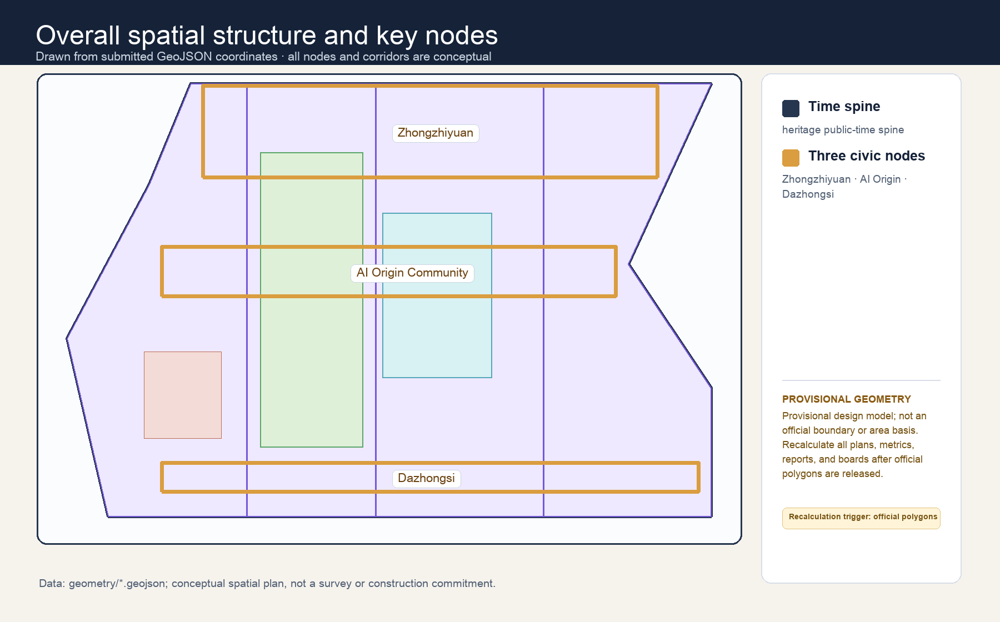
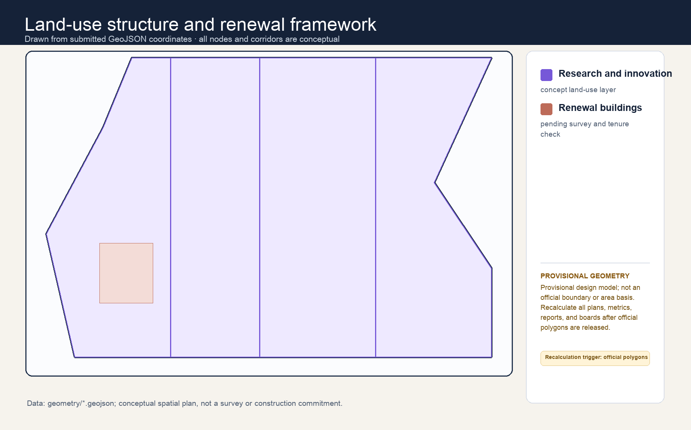
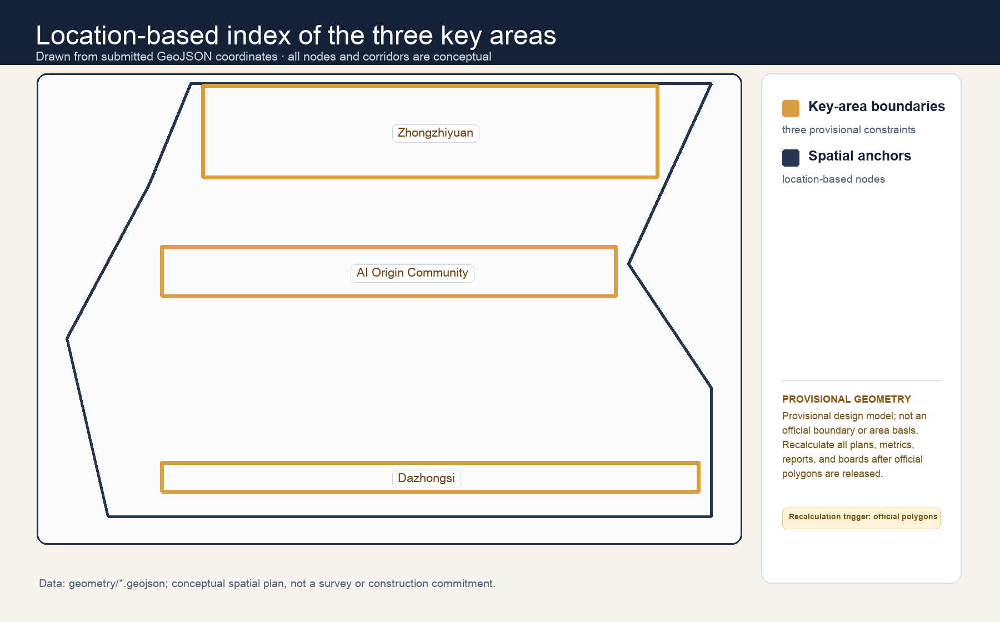
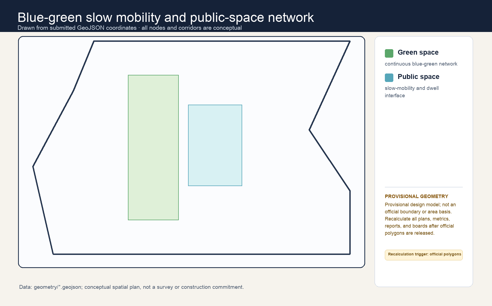
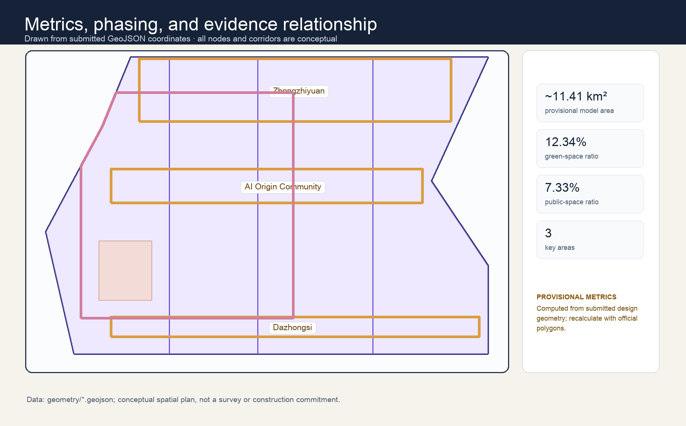

# Jing-Zhang Common Time / 京张共时

## Design Basis and Source List

This formal package is based on the public call, the cleared agent taskbook, the repository source registry and the submitted provisional geometry. It treats the exact site and key-area polygons, statutory controls, ownership, engineering conditions, and operating approvals as pending official information. Every spatial move is therefore a conceptual recommendation for later professional deepening, not an approved plan [source:OFFICIAL-ANNOUNCEMENT] [source:AGENT-TASKBOOK] [source:SOURCE-REGISTRY].

## Three-Level Scope Framework

At the 43.6 km² coordinated-research scale, the proposal organizes innovation, culture and everyday urban life. At the 11.4 km² overall-design scale, it establishes a public **Time Spine** around the heritage corridor. At the three provisional key areas, it tests six repeatable room types. The submitted boundary is a provisional constraint and all area-derived metrics must be recalculated once official geometry is published [data:geometry/site_boundary.geojson#SITE-001] [metric:site_area_sqm] [depth:three_level_scope_framework].

## Coordinated Research Area: Industry and Future City Research

The proposal’s distinction is simple: an AI district should be judged by who can use public space, when, and whether ordinary life still works when technology is absent. The civic calendar makes access, operators, service purpose, minimum data, human review and stop conditions visible. It links the three official positions—heritage, AI daily life and innovation—without treating technology demonstration as the city’s primary purpose [source:AGENT-TASKBOOK] [depth:overall_spatial_structure].

Eight case mechanisms are translated only as methods: One-North (research–life proximity), Station F (shared support), MaRS (innovation services), Kendall Square (public-realm networks), Helsinki Mobility Lab (bounded trials), Kalasatama (resident-defined questions), Seoul AI Hub (talent platforms), and Knowledge Quarter London (culture–knowledge alliances). No foreign statistic, policy, investment, or institutional commitment is projected onto Haidian.

## Overall Design Area: Urban Renewal and Regulatory-Plan-Level Urban Design

The **Time Spine** is an always-public walking, resting and wayfinding baseline. It does not require an account, device, data contribution or AI service. Six conceptual room types—Arrival, Repair, Learning, Quiet, Trial and Assembly—are distributed as adaptable public-interface components. Design layers organize conceptual land use, public space, roads, green space, buildings and phasing; they do not establish parcel controls, road lines, height, FAR or demolition decisions [data:geometry/land_use.geojson#LU-001] [data:geometry/public_space.geojson#PUBLIC-001] [depth:land_use_layout].

## Detailed Design of Key Areas

Zhongzhiyuan is **Prototype Time**, with supervised evaluation, repair and public explanation. AI Origin Community is **Everyday Time**, with learning, care-support and community navigation. Dazhongsi is **Exchange Time**, with cultural programming, small-business service and public exhibitions. Each has an always-public baseline, an optional enhanced mode, a named operating role, an opt-out route, and a stop/review trigger. They assert neither property access nor implementation approval [data:geometry/key_areas.geojson#PROV-KEY-001] [data:geometry/key_areas.geojson#PROV-KEY-002] [data:geometry/key_areas.geojson#PROV-KEY-003] [depth:three_key_area_detailed_design].

## AI Innovation Ecosystem, Personas, and AI+ Scenarios

The proposal serves five personas: residents, students, researchers/developers, small teams, and visitors/maintenance workers. Twelve scenario cards cover accessible walking support, heritage interpretation, appointment-free public-service orientation, intergenerational learning, repair coordination, small-business service discovery, environmental explanation, open-source demonstrations, low-risk logistics observation, public-event access, multilingual arrival support, and open feedback. They use no compulsory accounts, facial recognition, automated diagnosis, automated rights decisions, or undisclosed model training.

Three bounded evaluation scenarios are: (1) accessible wayfinding against an offline route, (2) heritage interpretation against an analogue guide, and (3) small-team service navigation against a staffed counter. In all three, a human reviewer, a visible withdrawal route, a minimum-data statement and a stop condition are mandatory [standard:PROJECT-AGENT-OPEN-CALL-TASKBOOK].

The six scenario contracts make those safeguards auditable: each specifies location type, candidate operator, minimum data, human review, offline equivalent, pause rule and metric. Prototype trials are conceptual only: they do not use unauthorised personal data, control traffic, or replace public-service decisions. Comparative references to Barcelona, Helsinki, Amsterdam, Seoul, Toronto and Singapore are used only to test governance methods and non-transferable conditions; they do not imply an institutional partnership, policy transfer or commitment in Haidian.

## Land Use, Building Scale, and Retain-Renovate-Demolish Strategy

The land-use partition is a conceptual coverage model for the submitted boundary. Existing buildings are not assigned a definitive retain/renovate/demolish status because ownership, condition, heritage, fire, accessibility and statutory evidence are not provided. The recommended sequence is: retain public value, share under agreement, make reversible light-touch adaptations, then assess any physical increase only through professional confirmation [data:geometry/buildings.geojson#BLDG-001] [depth:retain_renovate_demolish]. FAR, height, density and control lines remain pending official data.

## Transport, Rail, Municipal Infrastructure, and Public Services

The mobility proposition is **access first, AI second**: continuous pedestrian movement, shade/rest, readable bilingual information and human help form the baseline; optional AI windows never replace them. New mobility, power, drainage, fire, rail, curb or utility proposals are not asserted as engineering solutions. They are a coordination checklist for future specialists [data:geometry/roads.geojson#ROAD-001] [depth:traffic_rail_slow_parking] [depth:municipal_new_infrastructure].

## Blue-Green Network, Public Space, and Urban Character

The railway heritage narrative becomes a civic rhythm: arrival, pause, repair, learning, assembly and return. Three conceptual landmarks make this legible—the Common Clock, Repair Ledger and Open Calendar Wall—without copying historic structures or using protected imagery. Blue-green and public-space ratios are provisional design-model outputs, not existing-condition surveys or controls [data:geometry/green_space.geojson#GREEN-001] [metric:green_ratio] [metric:public_space_ratio].

## Renewal Projects, Implementation Policy, and Phasing

The conceptual first year has four cycles: listen and map; prototype under supervision; publicly review and repair; retain, revise or withdraw. Projects are lightweight and reversible until permissions, accessibility, heritage, safety, operations and data governance are professionally confirmed. A public programme is an invitation for later operators, not a government commitment [data:geometry/phasing.geojson#PHASE-001] [depth:phasing_implementation].

## Metrics, Area Recalculation, and Compliance Matrix

The three required visual metrics are calculated from submitted provisional geometry: site area approximately 11.41 km² (a provisional design-model value), green ratio 12.34%, and public-space ratio 7.33%. They are low-confidence design-model values and must be recomputed, along with all dependent geometry and artifacts, when official polygons arrive [metric:site_area_sqm] [metric:green_ratio] [metric:public_space_ratio] [depth:metrics_recalculation].

## Accountable Scenarios, Precedents, and Operating Interfaces

### Substantive task response and regional interfaces

The three areas and two wings are not parallel labels. Zhongzhiyuan carries full-stack research and safety governance; AI Origin carries talent, open-source practice, and transfer; Dazhongsi carries urban display, exchange, and native intelligent consumption. The Zhongguancun service wing supplies professional-service and factor interfaces, while the Xiaoyuehe wing reconnects low-threshold public experience to everyday slow mobility. The task matrix identifies the spatial carrier, industry mechanism, scenario, operating interface, evidence, and pending condition for every positioning and function. Suggested interfaces with Bewei Community, Future Science City, Huairou Science City, Yizhuang, and the Beijing–Tianjin–Hebei region are only proposed exchanges of research, validation, talent, terminals, events, or non-sensitive problem lists; they require confirmation by each party [source:AGENT-TASKBOOK] [data:geometry/key_areas.geojson#PROV-KEY-001].

### Brand, culture, and public-space kit

The identity direction for **Jing-Zhang Common Time** is a time spine crossing three nodes: navy for a trusted civic ground, mint for slow mobility and ecology, ochre for cultural memory, and gold for shared civic moments. It defines bilingual wordmarks, monochrome use, minimum size, clear space, and misuse rules, and remains distinct from cultural wayfinding and event sub-brands. The cultural storyline is “railway-connected time—Zhongguancun problem-solving time—AI returning time to people.” Wayfinding has three layers: direction, interpretation, and participation; unverified history, marks, portraits, and institutional relationships are not stated as fact. The Common-Time Marker, Open-Source Echo Hall, and Exchange Platform are conceptual landmarks with an accessible, maintainable, and pausable component kit, to be checked by professionals [source:AGENT-TASKBOOK] [depth:public_space_character].

### Global precedents, ecosystem map, and three trial contracts

Barcelona, Helsinki, Amsterdam, Toronto, Singapore, Seoul, and London are used as reviewable precedents for digital rights, algorithm registers, public oversight, open innovation, inclusive governance, and bilingual notice—not as copied institutions or claims of partnership. Land/space, industry, resources, talent, compute, data, and scenarios are mapped to the three areas and two wings. `report/narrative.md` contains the full source-linked table, mechanism, evidence, transfer limit, and non-transferable condition. The walking-gap diagnostic, safety-governance sandbox, and public-service answer assistant each specify a location type, input/output, minimum data, limitations, human review, complaint/opt-out, pause trigger, candidate responsibility, and measurable test. Their complete contract matrix is in `report/narrative.md`; none enters real operation before site permission, data protection, accessibility, and safety review [source:AGENT-TASKBOOK] [data:geometry/roads.geojson#ROAD-001].

### Annual operation and implementation upgrade

JZ-01 through JZ-06 should use a common template: candidate lead/collaborator, stage gate, dependency, deliverable, resource band, KPI, complaint/exit, and conversion path. The proposed annual loop is spring problem walks, summer developer safety sandboxes, autumn scenario open days, and winter international dialogue/archive. Each phase is permitted and reviewed first, tested in a limited way second, and publicly reflected on third; unauthorized data, a safety incident, or an unresolved complaint can pause it. Events, community, scenario opening, public experience, and international communication are concept operating frameworks, not investment, recruitment, or government commitments. Detailed deliverables, cost bands, and acceptance measures are in `report/narrative.md` [depth:renewal_project_list] [source:AGENT-TASKBOOK].

## Risk, Copyright, and Compliance

The package uses authored text, diagrams and static HTML, plus public or cleared source records declared in `sources.json`. Images are conceptual explanatory diagrams, not photographs, construction renderings, evidence of consent, or official maps. No remote assets, tracking, forms, map tiles or external scripts are loaded. The main risks are missing official geometry and controls, permissions, accessibility, heritage review, operations, data governance and public acceptance; each is a prerequisite for any real deployment [depth:risk_missing_data] [data:geometry/constraints.geojson#CONSTRAINTS].

## References

The authoritative source list, permitted-use limits, retrieval context and supporting standards are in `sources.json`, `standard_matrix.json`, `design_depth_matrix.json`, `assumptions.json` and the public repository site package [source:SITE-PACKAGE].
