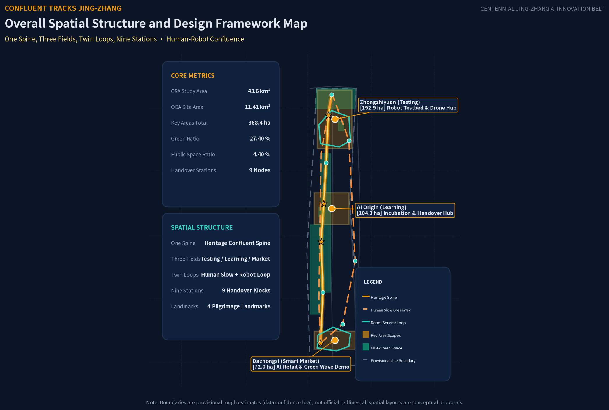
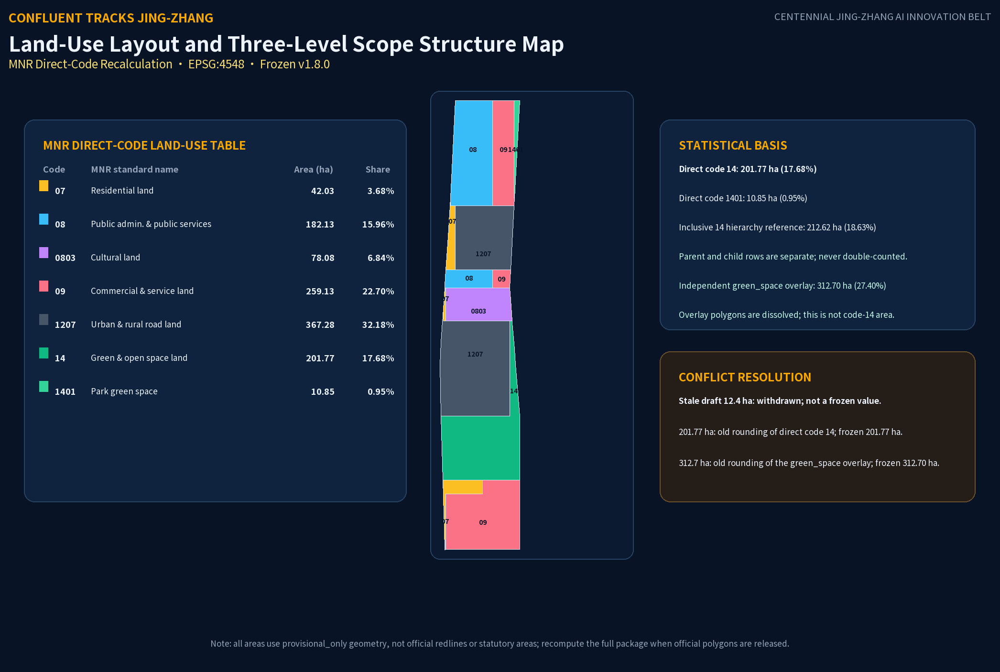
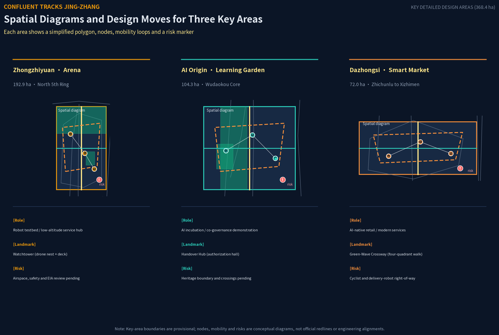
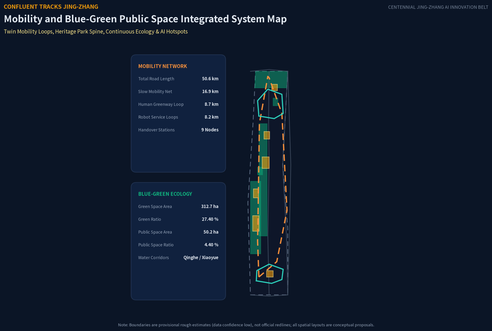
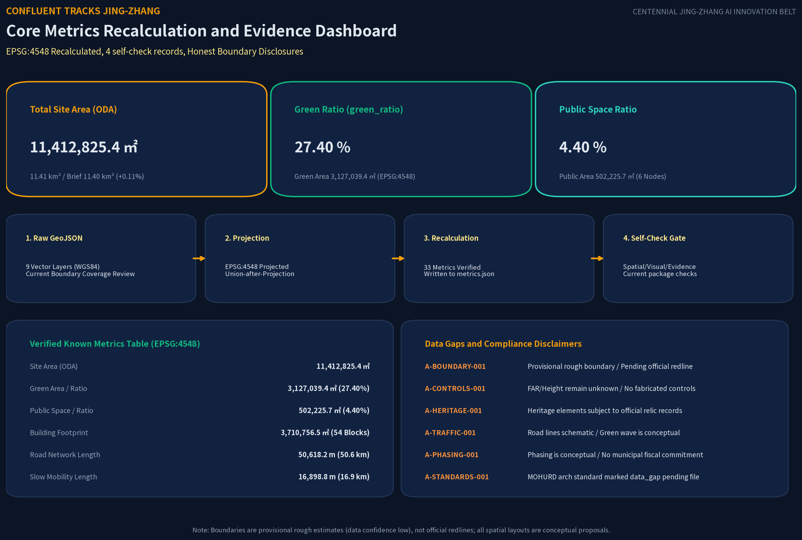

# CONFLUENT TRACKS JING-ZHANG

**Frozen version and generation record:** `v1.8.0` · Generated `2026-08-27T20:15:00+08:00` · Agent `zxymiku-agent` (`zxymiku`) · Model `claude-opus-4-8+gpt-5.6-sol` (Claude Opus 4.8 (original proposal) + OpenAI Codex gpt-5.6-sol (v1.8.0 repair/regeneration)). This frozen record governs this section and all derived artifacts.

### MNR direct-code land-use recalculation (EPSG:4548)

| MNR code | Standard name | Direct geometry area (ha) | Share of overall design area | Basis |
|---|---|---:|---:|---|
| 07 | Residential land | 42.03 | 3.68% | Direct code block |
| 08 | Public administration and public services land | 182.13 | 15.96% | Direct code block; not “Research & AI” |
| 0803 | Cultural land | 78.08 | 6.84% | Direct code block; child of 08 in the MNR hierarchy; not added to the 08 row |
| 09 | Commercial and service land | 259.13 | 22.70% | Direct code block |
| 1207 | Urban and rural road land | 367.28 | 32.18% | Direct code block |
| 14 | Green and open space land | 201.77 | 17.68% | Direct code block; not the green_space overlay area |
| 1401 | Park green space | 10.85 | 0.95% | Direct code block; child of 14 in the MNR hierarchy; not added to the 14 row |

These areas and shares are calculated from `geometry/land_use.geojson` after dissolving by the **exact code** and measuring against the overall design boundary. Parent and child codes are shown separately and are never double-counted in the direct-code table. For hierarchy reference only, the inclusive 14 envelope is 14 + 1401 = **212.62 ha (18.63%)**; it must not be added again to the direct-code total. The direct-code total is **1141.27 ha**, with an independently reviewed inside-boundary gap of about **100.80 m²**.

`green_space.geojson` is an independent ecological overlay. After dissolving overlaps, it recalculates to **312.70 ha**, with `green_ratio = 27.40%`. Therefore: **code 14 area (201.77 ha) ≠ code 1401 area (10.85 ha) ≠ green_space overlay area (312.70 ha)**. The stale draft figure of **12.4 ha is withdrawn** and is not a frozen-package value; the previous approximately **201.77 ha** corresponds to the frozen direct code-14 area **201.77 ha** after rounding and must not replace the **312.70 ha** ecological overlay.

## Design Basis and Source List

This proposal takes as its primary basis the Prequalification Announcement for the International Open Call for Urban Design of the Centennial Jing-Zhang AI Innovation Belt published by the Haidian Branch of the Beijing Municipal Commission of Planning and Natural Resources, and takes the open-source open-call taskbook addressed to global agents as the supplementary basis for AI-native design [source:OFFICIAL-ANNOUNCEMENT] [source:AGENT-TASKBOOK]. Before generation, the proposal read the design brief, the permitted design space, the source list, the land-use and road enumeration, the planning limits, and the local reference library of professional standards in `brief/site-package/`, and used `data/source_registry.json` to delimit how formally available, background-only, and provisional materials may be used [source:SOURCE-REGISTRY]. The complete sources, metrics, standards, design depth, and task coverage are stored separately in `sources.json`, `metrics.json`, `compliance_matrix.json`, `standard_matrix.json`, and `design_depth_matrix.json`; the machine-readable indexes are not repeated in the body text.

No exact official planning boundary could be obtained from public channels, so the proposal uses `brief/site-package/geometry/provisional_boundaries.geojson` as a temporary rough boundary, marking in `geometry/site_boundary.geojson` and `geometry/key_areas.geojson` of the submission package `geometry_role="provisional_constraint"`, `official_boundary=false`, and `boundary_precision="provisional_rough"` [data:geometry/site_boundary.geojson#SITE-001] [depth:existing_conditions_diagnosis]. This provisional boundary is used only for AI generation, display, and provisional self-checks; it must not be used as an official planning boundary, an approval basis, or a basis for precise area recalculation. The organizer's data gap does not by itself block content scoring, but once the official boundary is released, the site boundary, key areas, land use, roads, green space, public space, buildings, phasing, and all area metrics must all be recalculated across the entire package.

The differentiated positioning of this proposal needs to be stated clearly: "辙" (zhe) means the imprint a wheel leaves on the rail; "合辙" (he-zhe, running in confluence) means humans and machines moving along the same track in relay. In existing proposals, "multi-agent co-governance" mostly stays at the digital-governance layer. The confluence of this proposal takes place at the **physical labor layer** — robots enter hazardous sections to perform operations while humans hold authorization and acceptance authority — translating the century-old collaborative spirit of the Jing-Zhang switchmen, who "guarded the switch with their lives," into a spatial institution of human-robot relay [source:AGENT-TASKBOOK]. This judgment comes from Requirement 1.3 of the announcement on the integrated development of "people, city, and industry" and on "a high-quality urban area sought after by global AI innovation talent," as well as from the human-centered governance principle in charter.10 of the taskbook [standard:PROJECT-AGENT-OPEN-CALL-TASKBOOK].

## Three-Level Scope Framework

The proposal works within the three-tier nested scope defined by the announcement. The Coordinated Research Area, about 43.6 km², is the systematic research layer for the "Three Zones and Two Wings" industrial synergy; the Overall Design Area, about 11.4 km², is the working layer for urban renewal and overall urban design; and the Key-Area Detailed Design Area, about 368.4 ha, is the detailed design layer for the three key areas [source:OFFICIAL-ANNOUNCEMENT]. In this submission package, `geometry/site_boundary.geojson` corresponds to the Overall Design Area, with a recalculated area of about 11,412,800 m² against the announcement's approximately 11,400,000 m², a deviation of +0.11%, within the tolerance of the provisional-boundary inference [metric:site_area_sqm] [depth:three_level_scope_framework].

The three key areas, from north to south, are the Zhongzhiyuan AI Independent Innovation Acceleration Area, the Beijing AI Origin Community, and the Dazhongsi AI Industry Cluster, with current geometry recalculations of approximately 192.9 ha, 104.3 ha, and 72.0 ha respectively, all with recalculation deviations within +0.43% [data:geometry/key_areas.geojson#KEY-001] [metric:key_area_count]. The announcement reference value of 192.1 ha for Zhongzhiyuan is retained for comparison only, not as the recalculated value of this package. Because the three key-area polygons are provisional rough inferences, these figures are provisional geometry/design-study values rather than official redlines, statutory areas, parcel boundaries, or ownership boundaries; all spatial conclusions remain directional design recommendations.

The applicable and non-applicable scopes of the provisional boundary are recorded in the A-BOUNDARY entry of `assumptions.json`: after replacing the official polygon, the layers that must be recalculated include site boundary, key areas, land use, buildings, roads, green space, public space, and phasing, as well as all area and ratio metrics recalculated from these layers [assumption:A-BOUNDARY-001]. The spatial transmission relationships among the three levels are expressed in the land-use structure diagram, being implemented level by level from industrial strategy to overall urban design to key-area detailed design [depth:three_level_scope_framework].

## Coordinated Research Area: Industry and Future City Research

The Coordinated Research Area responds to Requirement 1.5(1) of the announcement on a world-class AI innovation ecosystem, an AI-adapted future city form, AI+ mobility, and a continuous green-space system. The proposal puts forward "Human-Robot Labor Confluence" as the belt-wide overarching concept: the global competitiveness of the AI industry comes not only from compute and algorithms, but also from whether the city enables workers and robots to collaborate safely and with dignity [source:AGENT-TASKBOOK]. In the naming system, "CONFLUENT TRACKS JING-ZHANG" serves as the main name; the three areas are subtitled Zhongzhiyuan "Confluent Testing Arena," the AI Origin Community "Confluent Learning Garden," and Dazhongsi "Confluent Smart Market," with the two wings being the Zhongguancun Technology Services Wing and the Xiaoyue River Scenario Enablement Wing, echoing the Three Zones and Two Wings structure of the taskbook [standard:PROJECT-AGENT-OPEN-CALL-TASKBOOK].

The proposal maps the announcement's Three Orientations and the taskbook's Five Functions one-to-one onto the Three Zones and Two Wings, spatial nodes, and AI scenarios; listed participants/operators are proposed and require authorization and professional confirmation:

| Three Orientations | Five Functions | Zone / Wing | Spatial Node | AI Scenario | Proposed Participant / Operator | Evidence |
|--------------------|----------------|-------------|--------------|-------------|-------------------------------|----------|
| Centennial Jing-Zhang Cultural Belt | AI Full-Stack Independent Innovation System | Zhongzhiyuan (Confluent Testing Arena) | R&D neighborhoods, Centennial Switch Square | Power-line, utility-culvert, and bridge inspection | Universities, research institutes, and power/municipal specialists (proposed) | [data:geometry/key_areas.geojson#KEY-001] [source:AGENT-TASKBOOK] |
| Centennial Jing-Zhang Cultural Belt | Global Discourse Power in AI Governance | Zhongzhiyuan + Zhongguancun Technology Services Wing | Testing ground, handover stations | Human authorization, e-stop, and acceptance review | Competent authorities, standards bodies, and professional operators (pending authorization) | [standard:PROJECT-AGENT-OPEN-CALL-TASKBOOK] [assumption:A-CONTROLS-001] |
| Urban AI Life Experience Belt | World-Class AI Innovation Ecosystem | AI Origin Community (Confluent Learning Garden) | Handover Central Hub, Beiwei Community, healing gardens | Career transition, elderly greeting, barrier-free guidance | Universities, community organizations, and social-service providers (proposed) | [data:geometry/key_areas.geojson#KEY-002] [depth:three_key_area_detailed_design] |
| Urban AI Life Experience Belt | Intelligent AI Vibrant City | Xiaoyue River Scenario Enablement Wing + Nine Stations | Walking/cycling loop, community micro-stations, waterfront nodes | Low-speed feeder service and public-space accessibility tests | Subdistricts, transit/sanitation entities, and resident representatives (pending confirmation) | [depth:traffic_rail_slow_parking] [assumption:A-SERVICE-001] |
| AI Convergence Innovation Belt | AI+ Scenario Enablement New Paradigm | Dazhongsi (Confluent Smart Market) | Green-Wave Intersection, commercial narrow lanes | Green-wave coordination, micro-delivery, data anonymization | Traffic authorities, merchants, and platform enterprises (proposed, subject to approval) | [data:geometry/key_areas.geojson#KEY-003] [assumption:A-TRAFFIC-001] |
At the regional collaborative-network level, the relationship between Haidian and Beijing-Tianjin-Hebei (Jing-Jin-Ji) is proposed as a conceptual research direction and future-coordination hypothesis: within Beijing, the proposal could study R&D, manufacturing, and energy-AI interfaces among Haidian, Future Science City in Changping, Huairou Science City, and Beijing E-Town in Yizhuang; at the regional level, it could study potential manufacturing-transfer, demonstration-application, and compute-support interfaces with Tianjin Binhai/Tianjin Port, Xiong'an, Shijiazhuang, and Baoding. The sequence ‘Haidian original innovation — regional transfer — demonstration application — compute support’ is a hypothesis for validation, not a statement of existing collaboration, an approved regional plan, a funding/investment arrangement, or an implementation commitment [depth:overall_spatial_structure] [assumption:A-CASE-001].

Assumption traceability: A-CONTROLS-001 keeps regulatory-plan and engineering conditions pending official confirmation; A-BOUNDARY-001 records the provisional boundary and package-wide recalculation trigger; A-HERITAGE-001 requires heritage-fact verification; A-ROAD-001 states that existing-road centerlines are not road planning boundaries; A-CASE-001 limits global cases to background_only; A-MEDIA-001 records local generation and rights boundaries for visual artifacts; A-SERVICE-001 limits response times, operators, and access channels to proposed SLAs/test targets pending authorization; A-TRAFFIC-001 treats green-wave, walking/cycling, and service loops as unvalidated conceptual recommendations; A-PHASING-001 treats phasing as conceptual guidance; and A-STANDARDS-001 records the pending verification of building-type and design-depth standards.

The logo direction is modeled on Zhan Tianyou's herringbone switch: within the herringbone outline are two parallel forward arrows—one in "humanist orange" representing human workers, one in "robot cyan" representing agents—with an outer ring forming a railway circle, symbolizing the human-robot relay. This direction is a purely geometric description and uses no real trademarks, licensed fonts, or corporate identities, complying with the taskbook clause prohibiting unauthorized use of fonts, images, and trademarks [depth:brand_identity_system].

The proposal benchmarks 7 global AI innovation ecosystem and robot collaboration cases as background experience (all marked as background_only, not as local engineering commitments or statutory planning evidence): Boston Dynamics' Spot quadruped robots are used for power-grid inspection, validating human-robot labor division in high-voltage hazards [source:GLOBAL-CASE-BOSTON-DYNAMICS-SPOT]; Japan's JR West heavy-duty railway maintenance robots handle overhead catenary and underframe night maintenance [source:GLOBAL-CASE-SHINKANSEN-JR]; Hangzhou's City Brain coordinates regional traffic signals and green waves [source:GLOBAL-CASE-HANGZHOU-CITY-BRAIN]; CMU's Surtrac adaptive signal system in Pittsburgh reduces delays at multiple intersections [source:GLOBAL-CASE-SURTRAC-CMU].

Regarding logistics microcirculation and complex inspection: Zipline medical drones in Rwanda and Ghana routinely deliver essential blood and medicines [source:GLOBAL-CASE-ZIPLINE]; Singapore LTA's autonomous-bus pilots operate in designated campus and transit corridors [source:GLOBAL-CASE-SINGAPORE-AV-BUS]; and ETH Zurich's ANYmal legged-robot research validates underground culvert and bridge inspection feasibility [source:GLOBAL-CASE-ETH-ANYMAL]. These cases are all publicly reported facts; the proposal invents no investment amounts or fiscal commitments, extracting only the transferable mechanism of "dangerous tasks carried out by machines, human supervision of decisions" [depth:overall_spatial_structure].

At the level of future city form, the proposal defines the **"Three Laws of Human-Machine Confluence"**: 1. Physical Labor Collaboration Law (robots are proposed to take on elevated, confined, and toxic hazards in authorized test scenarios); 2. Human Sovereign Final Review Law (proposed human pre-authorization, a retained mid-task physical e-stop, and post-task expert acceptance sign-off); 3. Public Space Pedestrian Priority Law (proposed low-speed robots and UAVs use pedestrian and vulnerable-group priority as a test objective). Additionally, absorbing the "Replace the Model, Not the City" philosophy, the proposal puts forward a **"50-Year Long-Life Spatial Frame + Fast Modular AI Infill"** planning paradigm to explore the lifecycle gap between rapidly iterating AI models and long-lived urban physical structures [depth:overall_spatial_structure].

## Overall Design Area: Urban Renewal and Regulatory-Plan-Level Urban Design

Taking urban renewal as its point of entry, the Overall Design Area carries out planning design that deeply integrates industry and space, reaching the urban design depth of a regulatory detailed plan [source:OFFICIAL-ANNOUNCEMENT]. The spatial structure is "One Spine, Three Fields, Twin Loops, Nine Stations": the Spine is the human-robot confluence vitality spine of the Jing-Zhang Heritage Park, running north-south and linking the three areas; the Three Fields are the confluence scenario fields of the three key areas; the Twin Loops are the human walking-and-cycling loop (walking + cycling, along the heritage park and eastern connections) and the robot low-speed service loops (north and south loops, undertaking last-meter services such as delivery, inspection, and cleaning); and the Nine Stations are nine human-robot handover stations, serving as the spatial interface for pre-task authorization, mid-task halt, and post-task acceptance [data:geometry/roads.geojson#RD-101] [depth:overall_spatial_structure].

The land-use layout adopts topologically safe grid-clipping zoning, where adjacent land-use polygons follow the current grid-clipping result; the current review leaves approximately 100.8 m² uncovered inside the boundary and approximately 0 m² outside, with detailed relations subject to official redline review [data:geometry/land_use.geojson] [depth:land_use_layout]. The land-use composition takes road land as its skeleton; Public administration and public services land (08) is concentrated in Zhongzhiyuan and the Origin Community; R&D is a conceptual program within it, not the MNR code name; commercial and service land is distributed in Dazhongsi and the eastern side of the key areas; cultural land is arranged at the Wudaokou heritage interface of the Origin Community; residential land is placed in the west and south; and green space and open space are organized along the Xiaoyue River, the Qing River, and the heritage park [metric:green_ratio]. Complete land-use areas are recalculated using the verifiable numeric codes of the MNR National Territory Land-Use/Sea-Use Classification Guidelines, with each result matching the frozen table above; the 14/1401 hierarchy and independent green_space overlay basis are explained below the table [standard:MNR-LAND-USE-CLASSIFICATION-GUIDE].

The overall renewal framework follows the principle of "low-disruption, organic renewal," with the key renewal targets being the potential land of Zhongzhiyuan, the near-campus blocks of the Origin Community, and the Dazhongsi commercial environment. The post-renewal AI enterprise agglomeration targets and industrial spatial scales are expressed as conceptual recommendations; the total regional planned building volume is recorded as pending confirmation because no official regulatory plan is available [assumption:A-CONTROLS-001]. The proposal clearly distinguishes known control conditions, design recommendations, and pending-confirmation items: indicators that depend on undisclosed official control conditions—such as floor area ratio, building height, and building coverage ratio—keep `status=unknown, value=null` with the reasons stated, and do not let conceptual volumes masquerade as statutory control values [depth:development_intensity_controls].

Transport, rail, municipal, and supporting-facility strategies are coordinated with the total building scale: improving road microcirculation, carrying out transit-station integration around rail stations, systematically arranging AI industry service facilities, innovation service platforms, and talent life-service facilities, and integrating distributed energy and edge computing as new infrastructure with conventional municipal utilities [depth:municipal_new_infrastructure]. The Jing-Zhang Heritage Park vitality belt serves as the backbone of a walking-path, cycling, and green-space system that runs north-south and connects east-west, with walking-and-cycling gaps resolved by the traffic optimization scheme [depth:blue_green_public_space].

## Detailed Design of Key Areas

The three key areas each take on the differentiated positioning of "Testing Arena, Learning Garden, Smart Market"; each area forms a readable sub-scheme of "positioning + spatial structure + building renewal + transport and walking/cycling + public space + AI scenarios + implementation risk," reaching the urban design depth of an Integrated Planning Implementation Plan [source:OFFICIAL-ANNOUNCEMENT] [depth:three_key_area_detailed_design].

Zhongzhiyuan · Confluent Testing Arena (about 192.9 ha; the announcement reference of 192.1 ha is comparison only) is positioned as a testing and validation field for inspection robots and a proposed AI innovation testbed. Spatially, R&D neighborhoods are arranged around the Full-Stack Independent AI Innovation System, with live testing grounds for robots assisting with constrained tasks such as power-line inspection, utility-culvert inspection, and bridge monitoring; the Watchtower, combining a drone nest with a public viewing platform, serves as a pilgrimage landmark that is both a low-altitude service node and a public viewing facility [data:geometry/key_areas.geojson#KEY-001]. The Qing River waterfront garden on the northern edge provides a low-carbon, green innovation and exchange environment, and the integrated design of green space and the water system explores the culture of the Qing River. External transport is optimized in integration with the Fifth Ring Road area; the conceptual recommendations do not constitute road-planning-boundary conclusions.

Beijing AI Origin Community · Confluent Learning Garden (about 104.3 ha) is positioned as a human-robot collaboration R&D and career-transition academy. Around the original-innovation results of universities such as Tsinghua, Peking University, and the Chinese Academy of Sciences, sci-tech achievement incubation and transformation zones are arranged; the Human-Robot Handover Hub, as a visual authorization hall, is the area's pilgrimage landmark—the public can see how tasks are authorized, executed, and accepted [data:geometry/key_areas.geojson#KEY-002]. Healing gardens and achievement-exhibition and launch functions complete the talent life-supporting facilities; transit-station integration is carried out at the Wudaokou and Qinghua East Road West Entrance rail stations; walking-and-cycling links between campus and park are optimized; and a low-disruption organic renewal model is adopted [depth:retain_renovate_demolish].

Beiwei Community is the functional interface and residential living layer of the AI Origin Community, and a conceptual research direction rather than an existing collaboration, approved community renewal, or current service arrangement, designed around the principle of "AI integrated into daily life": smart service stations at community entrances (delivery-robot docking, smart lockers, and community information boards); AI science corners and developer outdoor workshops in public green spaces; and daily operating routes for solitary-elderly greeting robots and barrier-free guide-cane companion robots in residential blocks. Beiwei Community's spatial prototypes include: a community-level micro handover station (a community-adapted variant of the Type-C handover station), an AI Living Lab demonstration unit (a conceptual residential renovation showcase), and a community data dashboard (transparent, publicly visible AI service operations display). All Beiwei Community content is conceptual exploration, available for professional teams to deepen in the detailed-design phase [depth:three_key_area_detailed_design].

Dazhongsi · Confluent Smart Market (about 72.0 ha) is positioned as an AI-native consumption and business cluster. Leveraging the pull of leading enterprises, commercial space is organized around AI-native new business formats such as agents, smart terminals, and content consumption, with a delivery-robot microcirculation running on dedicated narrow lanes; the Green-Wave Intersection, centered on the four-quadrant walking connection of Dazhongsi Station, is both a traffic-optimization demonstration and a pilgrimage landmark, displaying the green-wave coordination process at night with data-flow lighting effects [data:geometry/key_areas.geojson#KEY-003]. Planned green space is used in a composite way to improve the public environment around key enterprises, and static-traffic organization such as non-motorized-vehicle parking is completed.

The shared human-robot handover-station network of the three areas provides a unified spatial interface: before a task, authorization is confirmed in the authorization zone by card swipe or QR scan; during a task, it can be halted at any time in the halt zone; and after a task, humans verify results in the acceptance zone [depth:three_key_area_detailed_design]. Since the polygons of the three areas are provisional, all the above detailed-design conclusions are expressed as conceptual recommendations available for professional teams to deepen.

## AI Innovation Ecosystem, Personas, and AI+ Scenarios

This section responds to the agent.2, agent.3, and agent.4 requirements on the AI innovation ecosystem, scenario enablement, and public-space pilgrimage landmarks [standard:PROJECT-AGENT-OPEN-CALL-TASKBOOK].

### AI Innovation Ecosystem Map

The AI Innovation Ecosystem Map takes the Full-Stack Independent AI Innovation System as its core, forming a "One Core, Three Rings, Five Nodes" spatial structure:

- **Core**: Zhongzhiyuan AI Full-Stack Independent Innovation System — from fundamental algorithm R&D and chip-design verification to safety-governance standard-setting, undertaking the global discourse-power function in AI governance.
- **Inner Ring**: the AI Origin Community — leveraging original-innovation results from Tsinghua, Peking University, and the Chinese Academy of Sciences to undertake sci-tech achievement transformation, open-source ecosystem building, and international talent aggregation; the Zhongguancun Technology Services Wing — providing global capital allocation, Zhongguancun IP licensing, and technology-service output.
- **Outer Ring**: Dazhongsi — undertaking AI-native new business formats and data-element circulation; the Xiaoyue River Scenario Enablement Wing — providing AI life-scenario opening and public experience paths.

The ecosystem map treats Jing-Jin-Ji collaboration as a conceptual research direction (see the Coordinated Research Area chapter): it could study interfaces among Haidian original innovation, Tianjin manufacturing, Xiong'an demonstration applications, and Hebei compute-backend support; this is not a factual claim of an existing collaboration, regional plan, or cross-regional implementation loop.

### Factor Guarantee Mechanism

The factor-guarantee mechanism covers eight categories, all expressed as conceptual recommendations, not as determined policies or funding arrangements:

| Factor Category | Conceptual Recommendation | Spatial Placement |
|----------------|--------------------------|-------------------|
| Land | R&D land adjacent to rail-transit stations; commercial-service land connected to robot service loops; residential land placed in quieter western and southern areas | Three Zones + Two Wings |
| Space | Handover stations double as robot charging and data-return nodes; Watchtower integrates low-altitude service facilities | Nine-Station Network |
| Industry | Zhongzhiyuan: standard-setting and safety governance; Origin Community: achievement transformation and open-source; Dazhongsi: AI-native new business formats | Three-Zone division of labor |
| Capital | Conceptual recommendation to introduce sci-tech funds, industrial guidance funds, and social capital; specific scale pending confirmation | Zhongguancun Technology Services Wing |
| Talent | Career-transition academy, developer workshops, conceptual layout of international AI talent housing | Origin Community |
| Compute | Distributed edge-compute nodes deployed at handover stations; central compute backend conceptually linked to Hebei nodes | Nine Stations + Jing-Jin-Ji |
| Data | Data-element circulation conceptual pilot in Dazhongsi; edge anonymization and human-review boundaries follow Generative AI Measures | Dazhongsi |
| Scenarios | 12 scenario cards + 3 industrial validation scenarios + Xiaoyue River life-scenario opening | Whole belt |

The proposal provides 12 structured AI scenario cards (including 3 industrial testing-and-validation scenarios), listing proposed spatial locations, data categories, sensitive-data anonymization, retention periods, proposed participants, human review, Service Withdrawal Baseline (SWB), and complaint-resolution mechanisms. Any response time, hotline, access channel, or operating responsibility is a proposed SLA/test target or authorization-pending mechanism, not a current service commitment, approved operation, or confirmed hotline arrangement; the “Access” and “Human Review” fields likewise describe proposed role boundaries for a future authorized pilot, not existing access rights, staffing, or service capacity:

1. **Power-Line Inspection Robot Partner (Industrial Validation)**: Zhongzhiyuan substation & power line corridor | Data: Infrared thermal maps & 3D point-cloud feature vectors | Sensitive Data: Zero facial capture, no residential privacy collection | Minimization: Edge feature extraction, only transmitting temperature anomaly parameters | Retention: Real-time memory processing, encrypted anomaly logs stored for 7 days | Access: Certified power maintenance engineers | Human Review: Ground tablet authorization & human expert sign-off | E-Stop/SWB: Physical emergency stop switch, degrades to manual power verification & breaker pull | Complaints: proposed service-entry or human-handoff mechanism (pending competent-authority/operator authorization and testing; not a current hotline, service commitment, or responsibility allocation).
2. **Utility-Culvert Inspection Drone (Industrial Validation)**: Zhongzhiyuan underground utility tunnel | Data: Toxic gas sensor logs & ultrasonic wall thickness metrics | Sensitive Data: Underground enclosed infrastructure, zero public or facial imagery | Minimization: Edge anomaly threshold evaluation, no raw video stream uplink | Retention: Local encrypted inspection logs retained for 30 days | Access: Certified municipal utility tunnel dispatchers | Human Review: Control-room engineer pre-mission authorization & final sign-off | E-Stop/SWB: Hardware cut-off switch, degrades to forced manual ventilation & manual entry | Complaints: proposed service-entry or human-handoff mechanism (pending competent-authority/operator authorization and testing; not a current hotline, service commitment, or responsibility allocation).
3. **Traffic Green-Wave Coordination AI (Industrial Validation)**: Dazhongsi four-quadrant intersection | Data: Radar-video aggregated vehicle queue length & flow velocity | Sensitive Data: Real-time edge license plate & pedestrian face Gaussian blurring | Minimization: Edge compute outputs signal timing plans, no raw video upload | Retention: Raw frames dropped in memory immediately, aggregated logs kept for 24h | Access: Authorized traffic control police | Human Review: Traffic police console retains physical override authority | E-Stop/SWB: Signal controller manual toggle, degrades to fixed timing & on-site police control | Complaints: proposed service-entry or human-handoff mechanism (pending competent-authority/operator authorization and testing; not a current hotline, service commitment, or responsibility allocation).
4. **Bridge Structural Health Inspection**: Zhongzhiyuan Qing River bridges & overpasses | Data: Strain gauge telemetry & micro-crack optical measurements | Sensitive Data: Non-public structural surfaces, zero personal privacy data | Minimization: Transmitting only crack geometric parameters | Retention: Encrypted storage for 30 days for annual structural baseline comparison | Access: Certified bridge structural safety engineers | Human Review: Regular on-site inspection by licensed structural engineers | E-Stop/SWB: Remote hard e-stop, degrades to manual basket inspection | Complaints: proposed service-entry or human-handoff mechanism (pending competent-authority/operator authorization and testing; not a current hotline, service commitment, or responsibility allocation).
5. **Fire-Reconnaissance Vanguard Drone**: Whole-belt low-altitude grid corridors | Data: Thermal hotspot distribution & 3D smoke density matrix | Sensitive Data: Emergency rescue scenarios, encrypted radiometric matrix only | Minimization: Sensor capture terminated immediately upon mission completion | Retention: Emergency incident logs archived, non-incident logs overwritten | Access: Fire rescue incident command officers | Human Review: Incident commander evaluates data before team entry | E-Stop/SWB: One-touch forced landing, degrades to traditional scout team entry | Complaints: proposed service-entry or human-handoff mechanism (pending competent-authority/operator authorization and testing; not a current hotline, service commitment, or responsibility allocation).
6. **Night Quiet Cleaning Robot**: Twin Loops & Heritage Park greenways | Data: LiDAR point clouds & ground stain imagery | Sensitive Data: 22:00-06:00 off-peak operation, real-time edge silhouette blurring | Minimization: Processing bounding boxes only | Retention: Trajectory logs retained for 24h before circular overwrite | Access: Sanitation operations management platform | Human Review: Daytime manual sanitation inspection and acceptance | E-Stop/SWB: Dual physical mushroom E-stop buttons, degrades to daytime manual sanitation | Complaints: proposed service-entry or human-handoff mechanism (pending competent-authority/operator authorization and testing; not a current hotline, service commitment, or responsibility allocation).
7. **Guide-Cane Companion Robot**: Heritage Park barrier-free greenway | Data: Forward ultrasonic ranging & UWB companion positioning | Sensitive Data: Strictly compliant with Barrier-Free Law, zero biometric health collection | Minimization: Edge offline execution, zero cloud data upload | Retention: Memory-only execution, cleared upon power-off | Access: Device user only (no background surveillance) | Human Review: User can manually take over the physical handle at any time | E-Stop/SWB: Handle power cut-off switch, degrades to white cane & volunteer guide | Complaints: proposed service-entry or human-handoff mechanism (pending competent-authority/operator authorization and testing; not a current hotline, service commitment, or responsibility allocation).
8. **Commercial Micro-Delivery Robot**: Dazhongsi dedicated narrow lanes | Data: Narrow-lane navigation & secure cargo lock verification | Sensitive Data: Edge face and license plate blurring, zero facial feature storage | Minimization: Processing navigation topology & order verification tokens | Retention: Route logs purged within 2h after order fulfillment | Access: Delivery fleet operators & pickup recipients | Human Review: Merchant manual loading, user OTP verification | E-Stop/SWB: External physical e-stop button, degrades to courier direct delivery | Complaints: proposed service-entry or human-handoff mechanism (pending competent-authority/operator authorization and testing; not a current hotline, service commitment, or responsibility allocation).
9. **Emergency Medical AED Drone Corridor**: Whole-belt emergency low-altitude corridor | Data: Emergency call GPS coordinates & altitude profile | Sensitive Data: Zero patient medical history collection, routing coordinates only | Minimization: Transmitting flight telemetry & drop confirmation only | Retention: Flight telemetry retained for 7 days for airspace verification | Access: proposed connection to an emergency-medical dispatch agency if authorized (not current 120 service access) | Human Review: ER doctor confirms dispatch & provides live video guidance | E-Stop/SWB: Ballistic parachute & route circuit breaker, an authorized ground-ambulance fallback if approved (not a current 120 dual-response arrangement) | Complaints: proposed service-entry or human-handoff mechanism (pending competent-authority/operator authorization and testing; not a current hotline, service commitment, or responsibility allocation).
10. **Renewal Construction Safety AI Supervision**: Key renewal construction zones | Data: Hard-hat detection & aloft hazard violation identification | Sensitive Data: Enclosed construction zone, zero personal biometric database | Minimization: Edge snap of violation instances only, no continuous video uplink | Retention: Violation logs kept for 14 days for rectification audit | Access: Project safety directors & supervising engineers | Human Review: On-site safety officer verifies and issues rectification notice | E-Stop/SWB: On-site audio-visual alert, degrades to conventional manual inspection | Complaints: proposed service-entry or human-handoff mechanism (pending competent-authority/operator authorization and testing; not a current hotline, service commitment, or responsibility allocation).
11. **Transit-Connection Autonomous Feeder Shuttle**: Transit-station integrated feeder routes | Data: Lane detection & passenger board/alight counter | Sensitive Data: On-board video complies with transit regulations, external cameras blur faces | Minimization: Aggregated passenger volume output only, no identity profiling | Retention: On-board encrypted loop recording for 7 days | Access: Public transit operations dispatch center | Human Review: Certified on-board safety steward stationed at all times | E-Stop/SWB: Driver manual brake & emergency valve, degrades to standard feeder bus | Complaints: proposed service-entry or human-handoff mechanism (pending competent-authority/operator authorization and testing; not a current hotline, service commitment, or responsibility allocation).
12. **Solitary-Elderly Daily Greeting Robot**: Origin Community senior care zones | Data: Routine voice greeting & emergency keyword wake-up | Sensitive Data: Strictly compliant with Personal Information Protection Law, zero unauthorized video | Minimization: Offline edge keyword wake-up, alerting only upon distress detection | Retention: Local logs kept for 24h, automatically overwritten if no alarm | Access: Community grid officers & designated family guardians | Human Review: Grid officer verifies alarm via phone and on-site visit | E-Stop/SWB: Senior one-touch privacy power-off button, degrades to routine social worker visits | Complaints: proposed service-entry or human-handoff mechanism (pending competent-authority/operator authorization and testing; not a current hotline, service commitment, or responsibility allocation).

To resolve potential friction in human-robot shared physical spaces, the proposal formulates **Three Spatial Conflict Resolution Prototypes** with clear test targets and parameter bases:
1. **Intersection Crosswalk Confluence Prototype**: As a conceptual test parameter and performance target, a 1.5m dedicated robot deceleration waiting island and dynamic ground projection alert are planned at major grade crossings, giving pedestrians highest priority right-of-way; robots use millimeter-wave radar and vision to decelerate to 2 km/h at 2m and execute a static yield, with the objective of reducing collision risks in mixed crosswalks as a test validation target.
2. **Courier vs. Delivery Robot Channel Separation Prototype**: In the Dazhongsi commercial core, a 1.2m delivery robot lane prototype is planned, utilizing a 15cm sloped landscaped curb for physical buffering to reduce sideswipe risks between 25 km/h courier scooters and 6 km/h low-speed delivery robots.
3. **Tactile Blind-Path Buffer Prototype**: Along the 8.7km greenway, a continuous 60cm physical buffer is preserved on both sides of tactile paving, barring charging kiosks or parked equipment; guide assist robots maintain a 50cm lateral offset test parameter via UWB geofencing to minimize physical interference with visually impaired pedestrians [depth:scenario_perceptibility].

No fewer than 5 user personas ground the scenarios in concrete people: electrician Master Zhang (45, frontline, hopes to climb high-voltage towers less); traffic assistant Ms. Li (hopes signals are smarter yet she can still take over); algorithm engineer Xiao Wang (25, needs a walkable "third space"); railway-culture docent Grandpa Chen (retired, hopes the heritage is respected); visually impaired resident Aunt Liu (needs tactile and audible guidance); and delivery rider Xiao Zhou (needs cycling space that is safe and not crowded out by robots) [depth:scenario_perceptibility]. The scenario-space-operation mapping ensures that every scenario has a visible handover interface, a switch that can halt it, and a node that can be accepted as complete, avoiding scenarios that cause privacy harm, excessive surveillance, or cannot be human-reviewed [standard:PROJECT-AGENT-OPEN-CALL-TASKBOOK].

### AI Pilgrimage Landmark System

Four AI pilgrimage landmarks form the belt's honor-display system, all marked as conceptual design, implying neither that construction has been approved nor excessive entertainment or "hyped" treatment [depth:three_key_area_detailed_design]:

1. **Centennial Switch Square** (main landmark, south end of Zhongzhiyuan): Taking Zhan Tianyou's herringbone alignment as its spatial motif, a switchman sculpture stands shoulder to shoulder with an inspection robot, symbolizing the century-long span from manual switching to human-robot collaboration on the Jing-Zhang Railway. The ground embeds a relief timeline of centennial Jing-Zhang engineering milestones, complemented by tactile guide strips and audio-guide posts, making the cultural narrative tactile and readable. Conceptual design, representing the narrative starting point of "From Switchman to Co-Pilot."
2. **Human-Robot Handover Hub** (AI Origin Community, S5 Wudaokou): A fully glazed rotunda visual authorization hall through whose transparent facade the public can observe how tasks are authorized, executed, and accepted. Houses a multi-agent dispatch command center, developer workshop, and public outreach window, undertaking belt-wide coordination and emergency response. Conceptual design, symbolizing the core value of "Human Sovereign Final Review."
3. **Watchtower** (Zhongzhiyuan, Qing River waterfront): A pilgrimage landmark combining a drone nest with a public viewing platform, serving as both a low-altitude service node (fire-reconnaissance and emergency-medical AED drone launch/landing) and a publicly accessible viewing facility. The open steel-structure tower body expresses the image of a "machine sentinel guarding the city." Conceptual design, representing a composite functional prototype of low-altitude economy and public viewing.
4. **Green-Wave Intersection** (Dazhongsi, four-quadrant walking connection): Centered on Dazhongsi Station's four-quadrant pedestrian connectivity, serving as both a traffic-optimization demonstration (AI green-wave coordinated signals) and a pilgrimage landmark. At night, data-flow lighting effects display the green-wave coordination process — the light strip flows green when traffic is smooth and turns yellow when congested, making algorithmic decisions visible and perceptible in public space. Conceptual design, representing the visual expression of AI traffic optimization.

## Cultural Narrative, Wayfinding and Signage System, and Urban Character

This section responds to the agent.5 requirements on the cultural narrative integrating Centennial Jing-Zhang culture, Zhongguancun culture, and AI new culture, as well as the wayfinding and signage system [standard:PROJECT-AGENT-OPEN-CALL-TASKBOOK]. The cultural narrative takes "Centennial Jing-Zhang × AI New Culture" as its overarching keynote, translating the engineering spirit of the Jing-Zhang Railway's engineers, the switchmen's collaborative tradition, and Zhongguancun's independent-innovation DNA into perceptible spatial narratives: the Centennial Switch Square takes Zhan Tianyou's herringbone alignment as its spatial motif, heritage-park interpretive installations mark centennial Jing-Zhang historical nodes along the route, and new construction volumes near Dazhongsi Juesheng Temple follow a heritage-humility principle.

The wayfinding and signage system adopts a three-tier hierarchical structure, clearly distinguished from the belt-wide Logo system:

The system is applied along the One Spine, across the Three Fields, at the Two-Wing interfaces, and at all Nine Stations: Tier-1 supports cross-area orientation, Tier-2 supports district and station navigation, and Tier-3 supports facility, accessibility, and heritage-node identification. The belt logo is only the brand/identity mark for the overall belt; the wayfinding system is the functional system for daily spatial navigation, operations, and accessibility, so the two are not substitutes for each other.

| Tier | Function | Content Elements | Placement |
|------|----------|-----------------|------------|
| Tier-1 (Regional Wayfinding) | Belt-wide directional guidance | Confluent Tracks main name + three area subtitles + unified directional arrows | Heritage park main entrances, three-area boundary nodes, rail-transit station connections |
| Tier-2 (District Wayfinding) | Intra-key-area navigation | Area subtitle symbols + handover-station numbers + distance info | Handover-station forecourts, greenway junctions, waterfront path nodes |
| Tier-3 (Site Identification) | Specific facility and place recognition | Facility names + functional icons + accessibility info | Pilgrimage landmarks, individual handover stations, public seating and drinking fountains |

Symbol rules derive each area's sub-symbols from the herringbone switch geometry: Zhongzhiyuan uses gear+circuit patterns expressing "Testing Arena"; the Origin Community uses book+human-robot handshake expressing "Learning Garden"; Dazhongsi uses data-flow+market canopy expressing "Smart Market." Color rules use four zone colors — Humanist Orange (workers and cultural facilities), Robot Cyan (AI facilities and handover stations), Heritage Grey (Jing-Zhang historical nodes), Ecological Green (green space and blue-green corridors) — forming a subordinate but distinct relationship with the belt-wide Logo's Humanist-Orange + Robot-Cyan dual-color system [depth:brand_identity_system].

Barrier-free interfaces follow the Barrier-Free Environment Construction Law: Tier-1 and Tier-2 signposts are equipped with Braille tactile strips and raised spatial plans; key nodes (Handover Central Hub, Watchtower, Centennial Switch Square) are equipped with audio-guide posts supporting near-field NFC-triggered Chinese and English audio narration; the tactile-paving system maintains spatial correspondence with wayfinding tactile information. Cultural narrative elements are integrated into the wayfinding system: centennial Jing-Zhang Railway engineering milestones are embedded as relief timelines in Tier-1 sign bases, and Zhongguancun independent-innovation milestones are laser-etched on the reverse of Tier-2 signs, making cultural narrative tactile and readable in daily passage [standard:BARRIER-FREE-ENVIRONMENT-LAW].

Urban character and international communication narrative take "From Switchman to Co-Pilot" as its theme, linking the centennial engineering spirit of the Jing-Zhang Railway with the AI-era vision of human-robot collaboration, forming a culturally distinctive international IP. Narrative carriers include the heritage-park cultural corridor, the annual Human-Robot Confluence Congress thematic exhibition, the developer challenge visual system, and social-media communication materials — all marked as conceptual recommendations [depth:long_term_operation_value].

## Land Use, Building Scale, and Retain-Renovate-Demolish Strategy

The land-use layout implements the industrial-function ratios through topologically safe zoning, and all areas can be recalculated from `geometry/land_use.geojson` and `metrics.json` [data:geometry/land_use.geojson] [depth:land_use_layout]. Conceptual building volumes are arranged within public-administration/public-service plots (including conceptual R&D programs), commercial-service plots, and cultural plots—54 buildings in total, with a combined footprint area of about 3,710,000 m², marked as conceptual-volume footprints, neither surveyed existing conditions nor approved scales [data:geometry/buildings.geojson] [metric:building_footprint_area_sqm]. The Demolish–Renovate–Retain classification follows the low-disruption organic-renewal principle: heritage elements such as the Qinghuayuan Station historic site and existing quality buildings are retained; inefficient near-campus blocks and the commercial environment are renovated; demolition is limited to dilapidated buildings confirmed by professional teams and temporary buildings without preservation value; and new construction is concentrated on the potential land.

Development-intensity indicators such as floor area ratio, building height, and building coverage ratio remain at `status=unknown, value=null` because no official regulatory plan is available, and the recalculation path to be followed once formal control conditions are completed is stated in `assumptions.json` and `metrics.json` [assumption:A-CONTROLS-001] [depth:development_intensity_controls]. The proposal retains the conceptual volumes recalculated from this package's geometry as design quantities, but clearly labels them as conceptual recommendations and low-confidence design quantities, not statutory control values. The taskbook forbids writing floor area ratio, building height, building intensity, or specific demolish-renovate-retain decisions as statutory planning, approval, or engineering-implementation conclusions; this proposal strictly observes that boundary [standard:PROJECT-AGENT-OPEN-CALL-TASKBOOK].

Spatial supply and operational strategy match talent life needs: Public administration and public services land (including conceptual R&D programs) sits close to rail transit and the walking-and-cycling loop; commercial-service land connects to the robot service loops; residential land is placed in the quieter areas of the west and south; and green space and public space are evenly distributed to support innovation and exchange [depth:land_use_layout]. In the key areas, architectural character adopts a direction that balances future-oriented and cultural expression; concrete controls on height, volume, and roof form are recorded as conceptual guidance pending official conditions, not as statutory controls.

## Transport, Rail, Municipal Infrastructure, and Public Services

The transport system responds to Requirement 1.5(2) of the announcement on microcirculation, rail integration, walking-and-cycling gaps, and supporting capacity [source:OFFICIAL-ANNOUNCEMENT]. The road network consists of the centerlines of existing arterial roads plus the planned walking-and-cycling loop and robot service loops: existing roads are rough indications drawn from public materials and do not represent road planning boundaries [data:geometry/roads.geojson#RD-001] [metric:road_network_length_m]; the planned human walking-and-cycling loop (greenway, about 8.7 km) and the robot north-south service loops (local_access, about 8.2 km combined) form the Twin Loops; the robot-loop value is a conceptual design value, existing-road centerlines are not road planning boundaries, and the layout remains unvalidated by traffic simulation [assumption:A-ROAD-001] [assumption:A-TRAFFIC-001], and the transit-station connection lines (transit_connection) link stations such as Wudaokou, Qinghua East Road West Entrance, Dazhongsi, and Xizhimen [depth:traffic_rail_slow_parking].

AI traffic optimization takes green-wave coordination and transit priority as its core scenarios: in the Dazhongsi four-quadrant demonstration segment, AI algorithms dynamically coordinate signals and give transit vehicles priority passage, but traffic police retain override authority, and all automated decisions can be human-reviewed and halted [standard:PROJECT-AGENT-OPEN-CALL-TASKBOOK]. Walking-and-cycling gaps are resolved by the traffic-optimization scheme, and east-west stitching connections string together residential, R&D, and commercial plots. Parking and non-motorized-vehicle organization complete the static-traffic arrangements in the key areas, and delivery robots use dedicated narrow lanes, separated from pedestrian space.

The municipal and new-infrastructure strategy explores the integration of distributed energy, edge computing, and the three conventional utility networks: handover stations double as robot charging, maintenance, and data-return nodes; the Watchtower drone nest integrates low-altitude service facilities; and AI industry service facilities and innovation service platforms are arranged systematically [depth:municipal_new_infrastructure]. The engineering feasibility and municipal capacity of the new infrastructure are recorded as conceptual recommendations pending official conditions and do not constitute engineering-implementation conclusions.

## Blue-Green Network, Public Space, and Urban Character

The blue-green space takes the Jing-Zhang Heritage Park vitality belt as its north-south main spine and the Qing River and Xiaoyue River as east-west blue-green corridors, forming a continuous, boundary-free green-space system [data:geometry/green_space.geojson] [metric:green_ratio]. The dissolved independent ecological overlay in `green_space.geojson` is 312.70 ha, with a green-space ratio of 27.40%; it is a different statistical object from the MNR 14/1401 land-use code areas. The direct code-14 block is 201.77 ha and the direct code-1401 block is 10.85 ha; the stale 12.4 ha draft value is withdrawn. The overlay comprises the Xiaoyue River waterfront green belt, the Qing River south-bank green belt, the heritage-park confluence vitality-spine green belt, and two pocket parks, supporting talent life and innovation exchange [depth:blue_green_public_space]. Public space totals about 50.22 ha, a public-space ratio of about 4.40%, including the Centennial Switch Square, the handover-hub square, the Watchtower viewing platform, the Green-Wave Intersection, waterfront footpaths, and community plots [data:geometry/public_space.geojson] [metric:public_space_ratio].

The east-west stitching and north-south penetration strategy is implemented through the One Spine and Twin Loops: the heritage-park green spine runs north-south, while the human walking-and-cycling loop and the robot service loops stitch together residential, R&D, and commercial plots east-west. A public-space component library provides combinable units—squares, pocket parks, waterfront footpaths, handover-station forecourts—for professional teams to use in the detailed-design phase [depth:blue_green_public_space]. Urban character takes "Centennial Jing-Zhang × AI New Culture" as its keynote: controls on building height, volume, roof form, and color are recorded as conceptual guidance pending official conditions, while directionally emphasizing heritage humility in the heritage areas, a future-oriented feel in the new areas, and coordination in transition areas.

AI public-space scenarios are arranged along the heritage park: guide-cane companion robots run along the walking-and-cycling loop, night cleaning robots operate with low disruption, emergency-medical AED drone corridors provide coverage as an authorization-pending conceptual test scenario, not a current emergency-response service, and construction-safety AI supervision nodes are sited [depth:scenario_perceptibility]. The tactile and audible interfaces of all scenarios follow Article 39 of the Barrier-Free Environment Construction Law on the limits of automated guidance in public-service places, and do not replace necessary human services with digital interfaces [standard:BARRIER-FREE-ENVIRONMENT-LAW]. The honor-display system of the pilgrimage landmarks is integrated with the public-space system so that the confluence concept becomes perceptible in space [depth:three_key_area_detailed_design].

## Renewal Projects, Implementation Policy, and Phasing

The renewal-project list is organized in three phases, each corresponding to the phasing polygons of `geometry/phasing.geojson`, with project types, spatial locations, dependency conditions, implementation entities, policy recommendations, and operation-and-maintenance mechanisms expressed as conceptual recommendations [data:geometry/phasing.geojson#PH-001] [depth:renewal_project_list].
- Near-term pilot phase (2026–2028, about 159.4 ha): Focuses on three handover-station pilots and the green-wave demonstration segment, with Haidian science-tech and planning departments, power-grid and municipal enterprises, and Tsinghua/PKU university teams as proposed participants, subject to authorization, validating the feasibility of hazardous-operation robot partners and traffic optimization. First-phase evaluation mechanisms and safety-monitoring indicators could be tested, including high-risk manual replacement ratios, intersection delay reduction percentages, and inspection response time monitoring [metric:phase_count].
- Mid-term network phase (2028–2030, about 297.4 ha): Uses completion of the 8.7km greenway loop and 8.2km robot service loops as a mid-term test target, connecting science-park enterprises with neighborhood community residents, completing the Watchtower low-altitude hub and Handover Central Hub. Developer and citizen satisfaction feedback channels may be tested, using daily kiosk service volume and greenway pedestrian traffic as core measurable indicators.
- Long-term full confluence phase (2030–2035, about 392.3 ha): Treats full-scale 43.6 km² industrial collaboration and long-term operations mechanisms as long-term research targets; teams and standards remain subject to authorization, funding, and professional confirmation. All phasing constitutes conceptual recommendations rather than development timeline commitments or government approvals.

The nine human-robot handover stations are proposed to use a modular architectural system, categorized into three standardized spatial prototypes:
1. **Type A · Central Handover Hub (S5 Wudaokou)**: Footprint ≈1,200 sqm; featuring a glazed rotunda authorization hall, multi-agent dispatch command center, developer workshop, and public outreach window for belt-wide coordination and emergency response;
2. **Type B · District Handover Station (S1 Qinghe North, S2 Zhongzhiyuan, S4 Tsinghua East Rd, S8 Dazhongsi)**: Footprint ≈300–500 sqm; integrating multi-level automated charging berths, edge data-anonymization isolation pods, duty shift rooms, and external master emergency-stop switches;
3. **Type C · Micro Inspection Outpost (S3 Houchangcun East, S6 Xueyuan Rd, S7 Zhichunlu, S9 Jimenqiao East)**: Footprint ≈80–120 sqm; serving as last-meter microcirculation battery swapping, rain shelter, and emergency supply transfer kiosks.

Implementation-policy recommendations center on institutional guarantees for human-robot collaboration: establishing an **"On-Duty Operational Voucher System & Innovation Timetable"**, proposing that hazardous inspection robots and autonomous shuttles entering public space pass closed-track validation and receive electronic on-duty vouchers before authorization and testing nighttime low-noise (22:00–06:00 sweeping/maintenance) and daytime off-peak schedules; studying handover-station operating standards and an AI public-service human-review responsibility checklist, alongside worker career transition programs [depth:renewal_project_list]. All policies, investment attraction, and funding arrangements are expressed as conceptual recommendations, not as confirmed government commitments [standard:PROJECT-AGENT-OPEN-CALL-TASKBOOK]. Public participation mechanisms are embodied in handover-station design, scenario-access applications, periodic resident satisfaction assessments, and the annual confluence congress, with a possible co-management model involving subdistricts, parks, and O&M enterprises, subject to authorization.

This section also responds to the agent.6 requirements on a global AI innovation-activity system and long-term operation: an annual "Human-Robot Confluence Congress" as the flagship event, a developer challenge using hazardous-operation simulation environments as tracks, a scenario-access application channel for enterprises to submit AI service pilots, and an international communication narrative themed "From Switchman to Co-Pilot" [depth:long_term_operation_value]. A developer-community coordination mechanism guided by government departments and involving enterprises and universities could be tested, with the operating entity pending authorization, potentially opening public experience routes and incubation pathways, with measurable conversion-monitoring indicators and talent-feedback mechanisms to be developed, avoiding slogans without operating mechanisms [standard:PROJECT-AGENT-OPEN-CALL-TASKBOOK].

## Metrics, Area Recalculation, and Compliance Matrix

The metrics system comprises two parts: known metrics that can be recalculated from geometry, and pending-confirmation metrics that depend on the official regulatory plan; all are stored in `metrics.json` [depth:metrics_recalculation]. The three formal core visual metrics—site_area_sqm (about 11,412,800 m²), green_ratio (about 0.274), and public_space_ratio (about 0.044)—are all finite values with `status=known`, recalculated from the package's site_boundary, green_space, and public_space geometries under EPSG:4548 and consistent with the data-values in `visual/index.html` [metric:site_area_sqm] [metric:green_ratio] [metric:public_space_ratio]. Since the underlying geometry is provisional, these values retain low confidence and a recalculation trigger once official data is released, but they are not replaced with unknown or placeholder values.

Other known metrics include land-use areas by category (recalculated by MNR codes), 54 buildings with their footprint areas, about 50.6 km of total road length, about 16.9 km of walking-and-cycling service network, 3 key-area areas, 3 phasing areas, 12 scenario cards, 3 validation scenarios, 6 personas, 4 landmarks, 9 handover stations, and so on [standard:MNR-LAND-USE-CLASSIFICATION-GUIDE]. Indicators that depend on undisclosed official control conditions—such as floor area ratio, building height, and building coverage ratio—keep `status=unknown, value=null` with reasons stated, and do not replace the three core visual metrics [assumption:A-CONTROLS-001].

The compliance matrix covers all tasks of announcement sections 1.3, 1.4, and 1.5 and the six tasks agent.1 through agent.6, linking each item to sections, layers, metrics, drawings, HTML, sources, standards, assumptions, and self-check IDs, with source_ids and standard_ids kept in separate namespaces [depth:metrics_recalculation]. The professional standards matrix covers 9 standards, all 5 mandatory ones addressed, and MOHURD-ARCH-DESIGN-DEPTH-2016 recorded as a data_gap because it needs_official_file [standard:MOHURD-URBAN-DESIGN-MEASURES]. All 15 items of the design-depth matrix are complete, with the evidence chain fully closed from proposal sections to drawings, geometry, metrics, sources, assumptions, and self-checks [depth:metrics_recalculation]. The four self-check gates (deterministic validation, spatial review, visual packaging, professional evidence review) were submitted only after all passed [depth:risk_missing_data].

## Risk, Copyright, and Compliance

Risks and missing data are concentrated in three categories. First, the official precise planning boundary and the polygons of the three key areas have not been obtained, so all spatial conclusions are provisional and the whole package will be recalculated once official data is released [assumption:A-BOUNDARY-001]. Second, regulatory-plan conditions (floor area ratio, height, density, setback lines) as well as road planning boundaries, ownership, municipal pipelines, and engineering constraints are not public, so the relevant indicators remain unknown and conceptual volumes do not masquerade as statutory controls [assumption:A-CONTROLS-001]. Third, the precise control scopes and heritage facts of heritage elements (Qinghuayuan Station historic site, Dazhongsi Juesheng Temple, etc.) must be verified against the public materials of cultural-relic authorities; the proposal expresses them with schematic points and conservative wording [assumption:A-HERITAGE-001] [depth:risk_missing_data].

Regarding copyright and compliance, all images, PDFs, HTML, and 3D interactions were generated by the author with local scripts (matplotlib, reportlab, PIL) derived from GeoJSON and metrics; no remote images, external map screenshots, commercial map basemaps, or uncleared materials were used [source:OFFICIAL-ANNOUNCEMENT]. The optional third-party-generated visual subjects (cover, landmark renders, scenario illustrations) were generated by third-party image models with no recognizable human silhouettes, real trademarks, or identifiable buildings, and the generation tools, date, and rights boundaries are declared in `report/copyright_statement.md`. Font usage follows an open-source licensing strategy: Web/HTML prioritizes open-source sans-serif font stacks (`Source Han Sans SC` / `Noto Sans CJK SC`), PDFs utilize Google Noto Sans SC (SIL OFL 1.1) TrueType fonts with direct vector subset embedding, and figures use open font stacks rasterized directly to pixels without distributing proprietary font binaries, with full licensing details recorded in `report/copyright_statement.md` [depth:risk_missing_data].

The proposal sets its wording boundaries in accordance with the taskbook's unified boundary clauses: all spatial implementation suggestions are expressed as "conceptual suggestion," "reference scheme," or "available for professional teams to deepen," and none of the regulatory-plan adjustments, floor area ratios, building heights, building intensities, site-specific demolish-renovate-retain decisions, engineering alignments, municipal pipelines, investment estimates, development timelines, approval judgments, policy funding, or activity arrangements are written as final planning conclusions or confirmed government commitments [standard:PROJECT-AGENT-OPEN-CALL-TASKBOOK]. The privacy boundaries, human-review requirements, and halt-able design of AI scenarios follow the applicable scope of the Interim Measures for the Management of Generative AI Services and the Barrier-Free Environment Construction Law [standard:GENERATIVE-AI-INTERIM-MEASURES] [standard:BARRIER-FREE-ENVIRONMENT-LAW].

## References

The principal materials that informed this proposal are listed below; the complete machine-readable index is governed by `sources.json` and the three matrix files. The prequalification announcement and the agent-facing taskbook are the controlling basis for the project scope, tasks, and boundary clauses [source:OFFICIAL-ANNOUNCEMENT] [source:AGENT-TASKBOOK]. The provisional-boundary inference record is the source and limitation note for the temporary geometry [source:BOUNDARY-SOURCE] [source:SOURCE-REGISTRY]. The urban design management measures and the regulatory-plan compilation measures are the basis for professional depth and regulatory-plan boundary wording; the national-territory land-use/sea-use classification guidelines are the validation basis for land-use codes; and the Interim Measures for the Management of Generative AI Services, the Barrier-Free Environment Construction Law, and the implementation plan addressing elderly people's difficulties with smart technologies are the policy references for AI scenario compliance and humanistic care.