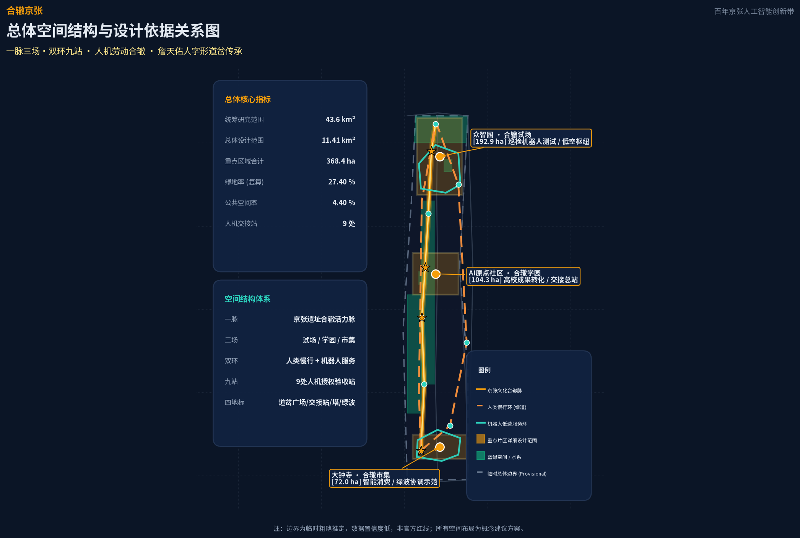
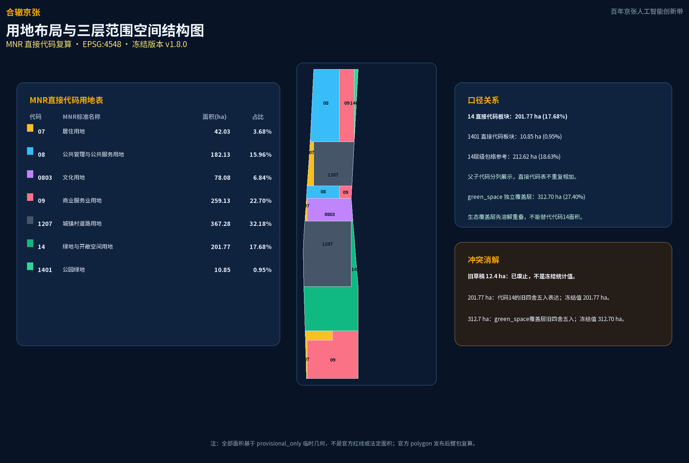
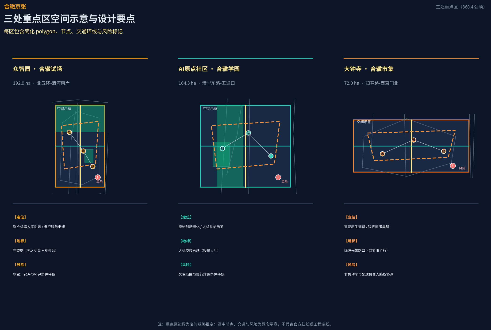
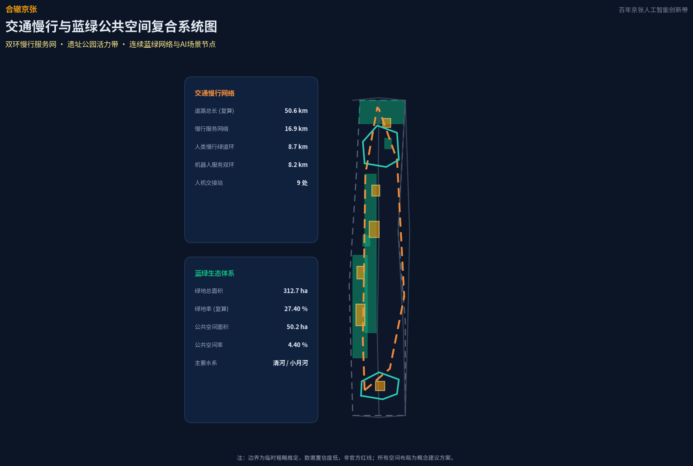
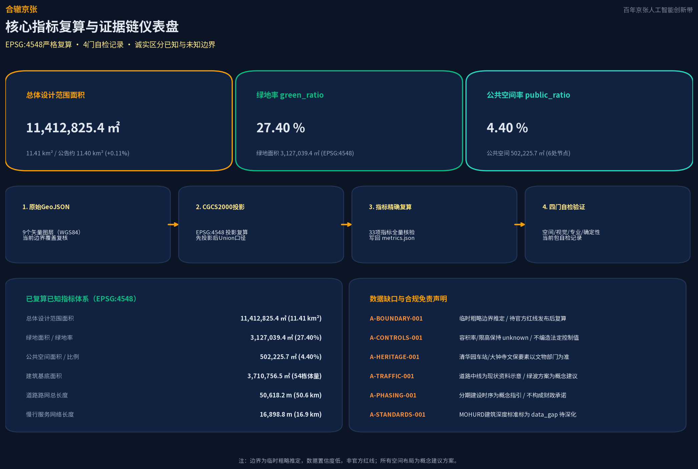

# 合辙京张 CONFLUENT TRACKS

**冻结版本与生成信息：** `v1.8.0` · 生成时间 `2026-08-27T20:15:00+08:00` · Agent `zxymiku-agent`（`zxymiku`）· 模型 `claude-opus-4-8+gpt-5.6-sol`（Claude Opus 4.8 (original proposal) + OpenAI Codex gpt-5.6-sol (v1.8.0 repair/regeneration)）。本节及派生成果均以该冻结版本为准。

### MNR 用地直接代码复算（EPSG:4548）

| MNR代码 | 标准名称 | geometry直接代码面积（ha） | 占总体设计范围 | 统计说明 |
|---|---|---:|---:|---|
| 07 | 居住用地 | 42.03 | 3.68% | 直接代码板块 |
| 08 | 公共管理与公共服务用地 | 182.13 | 15.96% | 直接代码板块；不是“科研用地” |
| 0803 | 文化用地 | 78.08 | 6.84% | 直接代码板块，MNR层级上属于08；不与08行相加 |
| 09 | 商业服务业用地 | 259.13 | 22.70% | 直接代码板块 |
| 1207 | 城镇村道路用地 | 367.28 | 32.18% | 直接代码板块 |
| 14 | 绿地与开敞空间用地 | 201.77 | 17.68% | 直接代码板块；不是green_space覆盖层面积 |
| 1401 | 公园绿地 | 10.85 | 0.95% | 直接代码板块，MNR层级上属于14；不与14行相加 |

这里的“面积/占比”均指 `geometry/land_use.geojson` 按**精确代码**溶解后相对总体设计范围的结果；父子代码仅分列展示，直接代码表不重复相加。若仅为层级参考，14的父级包络为 14 + 1401 = **212.62 ha（18.63%）**，但不得把它再加入直接代码合计。提交几何直接代码合计为 **1141.27 ha**，边界内独立复核未覆盖约 **100.80 m²**。

`green_space.geojson` 是独立的生态覆盖层；其多边形先溶解重叠后复算为 **312.70 ha**，对应 `green_ratio = 27.40%`。因此：**14代码面积（201.77 ha）≠ 1401代码面积（10.85 ha）≠ green_space覆盖层面积（312.70 ha）**。旧草稿图中的 **12.4 ha 已废止**，不是冻结版统计值；旧图中约 **201.77 ha** 对应的是本冻结版直接代码 `14` 的 **201.77 ha** 四舍五入结果，不能替代绿地覆盖层 **312.70 ha**。

## 设计依据与资料清单

本方案以北京市规划和自然资源委员会海淀分局发布的《百年京张AI创新带城市设计国际方案征集资格预审公告》为第一依据，以面向全球智能体的开源征集任务书为 AI 原生设计的补充依据 [source:OFFICIAL-ANNOUNCEMENT] [source:AGENT-TASKBOOK]。方案在生成前读取了 `brief/site-package/` 的设计简报、允许设计空间、来源清单、用地与道路枚举、规划限值与专业标准本地参考库，并以 `data/source_registry.json` 区分 formal 可用、背景与 provisional 资料的用途边界 [source:SOURCE-REGISTRY]。完整来源、指标、标准、设计深度和任务覆盖分别保存在 `sources.json`、`metrics.json`、`compliance_matrix.json`、`standard_matrix.json`、`design_depth_matrix.json`，不在正文重复机器索引。

当前公开渠道未取得官方精确红线，因此方案使用 `brief/site-package/geometry/provisional_boundaries.geojson` 作为临时粗略边界，并在提交包的 `geometry/site_boundary.geojson` 与 `geometry/key_areas.geojson` 中标注 `geometry_role="provisional_constraint"`、`official_boundary=false`、`boundary_precision="provisional_rough"` [data:geometry/site_boundary.geojson#SITE-001] [depth:existing_conditions_diagnosis]。该临时边界仅用于 AI 生成、展示与临时自检，不得作为官方红线、审批依据或精确面积复算依据；组织方数据缺口本身不阻断内容评分，但官方边界发布后 site boundary、key areas、land use、roads、green space、public space、buildings、phasing 与全部面积指标均需整包复算。

本方案的差异化定位需要明确说明：辙者，车轮碾过钢轨之迹；「合辙」即人与机器在同一条轨道上接力同行。既有方案中的"多智能体共治"多停留在数字治理层，本方案的合辙发生在**物理劳动层**——机器人进入危险区间执行作业、人类掌握授权与验收，是把百年京张扳道工"以生命守护道岔"的协作精神转译为人机接力的空间制度 [source:AGENT-TASKBOOK]。这一判断来自公告 1.3 对"人、城、产"融合发展和"全球AI创新人才向往的高品质城区"的要求，也来自任务书 charter.10 人本治理原则 [standard:PROJECT-AGENT-OPEN-CALL-TASKBOOK]。

## 三层范围工作框架

方案在公告确定的三层嵌套范围上展开工作。统筹研究范围约 43.6 平方公里，是"三区两翼"产业协同的系统研究层；总体设计范围约 11.4 平方公里，是城市更新与总体城市设计的工作层；重点区域范围约 368.4 公顷，是三处重点片区的详细设计层 [source:OFFICIAL-ANNOUNCEMENT]。本提交包的 `geometry/site_boundary.geojson` 对应总体设计范围，复算面积约 1141.28 万平方米，与公告约 1140 万平方米偏差 +0.11%，落在临时边界推定容差内 [metric:site_area_sqm] [depth:three_level_scope_framework]。

三处重点区自北向南为众智园 AI 自主创新加速区、北京 AI 原点社区、大钟寺 AI 产业聚集区，当前几何复算值分别约为 192.9 公顷、104.3 公顷、72.0 公顷，复算偏差均在 +0.43% 以内 [data:geometry/key_areas.geojson#KEY-001] [metric:key_area_count]。公告中的众智园参考值 192.1 公顷仅作对照，不作为本提交包的复算值。由于三处重点区 polygon 为临时粗略推定，上述数值均是 provisional geometry/design-study values，不是官方红线、法定面积、地块边界或权属边界；本节及后续重点区详细设计的空间结论仅作为方向性设计建议。

临时边界的适用范围与不可用范围已在 `assumptions.json` 的 A-BOUNDARY 条目中记录：替换 official polygon 后需要重算的图层包括 site boundary、key areas、land use、buildings、roads、green space、public space、phasing，以及全部由这些图层复算的面积与比例指标 [assumption:A-BOUNDARY-001]。三层范围的空间传导关系在用地结构图中表达，从产业战略到总体城市设计再到重点片区详细设计逐级落实 [depth:three_level_scope_framework]。

## 统筹研究范围产业与未来城市研究

统筹研究范围回应公告 1.5（1）关于世界级 AI 创新生态体系、适配人工智能的未来城市形态、AI+交通和连续绿色空间体系的要求。方案提出"人机劳动合辙"作为一带总体概念：AI 产业的全球竞争力不仅来自算力与算法，也来自城市能否让劳动者与机器人安全、有尊严地协作 [source:AGENT-TASKBOOK]。命名体系以"合辙京张 / CONFLUENT TRACKS JING-ZHANG"为主名，三区副题分别为众智园「合辙试场」、AI 原点社区「合辙学园」、大钟寺「合辙市集」，两翼为中关村科技服务翼与小月河场景赋能翼，呼应任务书三区两翼结构 [standard:PROJECT-AGENT-OPEN-CALL-TASKBOOK]。

方案将公告三大定位、任务书五大功能与三区两翼、空间节点和 AI 场景做一对一任务书映射；下表中的参与主体均为拟议参与者，须经授权与专业确认：

| 三大定位 | 五大功能 | 三区 / 两翼 | 空间节点 | AI 场景 | 拟议参与主体 / 运营方 | 证据 |
|----------|----------|-------------|----------|---------|------------------------|------|
| 百年京张文化带 | AI 全栈自主创新体系 | 众智园（合辙试场） | 研发街区、百年道岔广场 | 电力巡检、管廊检测、桥梁巡检 | 高校院所、科研企业、电力/市政专业单位（拟议） | [data:geometry/key_areas.geojson#KEY-001] [source:AGENT-TASKBOOK] |
| 百年京张文化带 | AI 治理全球话语权 | 众智园 + 中关村科技服务翼 | 测试验证场、交接站 | 人工授权、急停与验收审查 | 主管部门指导、标准研究机构、专业运营主体（待授权） | [standard:PROJECT-AGENT-OPEN-CALL-TASKBOOK] [assumption:A-CONTROLS-001] |
| 都市 AI 生活体验带 | 世界级 AI 创新生态 | AI 原点社区（合辙学园） | 人机交接总站、北纬社区、疗愈花园 | 职业转型、长者问候、无障碍导引 | 高校、社区、社会服务机构（拟议） | [data:geometry/key_areas.geojson#KEY-002] [depth:three_key_area_detailed_design] |
| 都市 AI 生活体验带 | 智能化 AI 活力城市 | 小月河场景赋能翼 + 九站网络 | 慢行环、社区微站、滨水节点 | 低速接驳、公共空间无障碍测试 | 街道、交通/环卫单位、社区居民代表（待确认） | [depth:traffic_rail_slow_parking] [assumption:A-SERVICE-001] |
| AI 融合创新带 | AI+ 场景赋能新范式 | 大钟寺（合辙市集） | 绿波光带路口、商业窄道 | 绿波协调、末端配送、数据脱敏 | 交管部门、商户、平台企业（拟议，需审批） | [data:geometry/key_areas.geojson#KEY-003] [assumption:A-TRAFFIC-001] |
在区域协同网络层面，方案将海淀与京津冀的联系作为概念研究方向和未来协调假设：在北京市内，可研究海淀与昌平未来科学城、怀柔科学城、北京经开区亦庄之间的研发、制造与能源 AI 分工；在京津冀层面，可研究天津滨海新区/天津港、雄安新区、石家庄与保定之间的制造转化、示范应用和算力支撑关系。上述“海淀原始创新—区域转化—示范应用—算力支撑”只是待验证的研究框架，不表示现有合作、已批准区域规划、资金/投资安排或实施承诺 [depth:overall_spatial_structure] [assumption:A-CASE-001]。

假设追踪说明：A-CONTROLS-001 约束控规与工程条件待官方确认；A-BOUNDARY-001 说明临时边界与整包复算触发；A-HERITAGE-001 约束文保事实核验；A-ROAD-001 说明现状道路中线不等于道路红线；A-CASE-001 将全球案例限定为 background_only；A-MEDIA-001 说明图片、PDF、HTML 与三维交互的本地生成和权利边界；A-SERVICE-001 将响应时限、运营主体和开放通道限定为拟议 SLA/测试目标；A-TRAFFIC-001 将绿波、慢行环与服务环限定为未经仿真的概念建议；A-PHASING-001 将分期限定为概念指引；A-STANDARDS-001 说明建筑类型与深度标准仍待正式文件复核。

Logo 方向以詹天佑人字形道岔为原型：人字形轮廓内嵌两个并进箭头，一为人文橙代表劳动者、一为机器人青代表智能体，外环为轨道圆，象征人机接力。该方向为纯几何图形描述，不使用任何真实商标、字体授权或企业标识，符合任务书禁止未经授权使用字体、图片、商标的条款 [depth:brand_identity_system]。

方案对标 7 个全球 AI 创新生态与机器人协作案例作为背景经验（均标为 background_only，不作为本地工程承诺或法定规划依据）：波士顿动力 Spot 四足机器人用于电网巡检，验证人机分工替代高危作业 [source:GLOBAL-CASE-BOSTON-DYNAMICS-SPOT]；日本 JR 西日本新干线重型检修机器人承担触网与车底夜间检修，验证高空作业机器人化替代 [source:GLOBAL-CASE-SHINKANSEN-JR]；杭州城市大脑以中台协调区域交通信号与绿波 [source:GLOBAL-CASE-HANGZHOU-CITY-BRAIN]；美国匹兹堡 CMU Surtrac 自适应信号系统在多个路口降低延误 [source:GLOBAL-CASE-SURTRAC-CMU]。

在微循环与复杂检测方面：卢旺达与加纳 Zipline 医疗无人机常态化配送急救药品 [source:GLOBAL-CASE-ZIPLINE]；新加坡 LTA 自动驾驶巴士在限定走廊试点运营 [source:GLOBAL-CASE-SINGAPORE-AV-BUS]；苏黎世 ETH ANYmal 腿足机器人验证地下管廊与桥梁巡检可行性 [source:GLOBAL-CASE-ETH-ANYMAL]。这些案例均为公开报道事实，方案不编造投资额或财政承诺，只提取“危险任务机器承担、人类掌握终审控制”的可转化机制 [depth:overall_spatial_structure]。

未来城市形态层面，方案提出**“人机合辙三律”**：一、物理劳动协作律（建议机器人在获授权的测试场景中承担高空、狭窄、高毒等高危作业）；二、人类主权终极复核律（AI 系统建议执行前由人类授权、执行中保留物理叫停、执行后由人类专家验收签发）；三、公共空间礼让行人律（拟议低速机器人与无人机在混合空间以优先避让行人与弱势群体为测试目标）。同时，方案吸收“换模型，不换城市”理念，提出**“50 年长寿命城市空间底座 + 模块化快速迭代 AI 插槽”**的规划范式，用于探索 AI 算法模型快速迭代与城市物理空间长期使用之间的寿命错配问题 [depth:overall_spatial_structure]。

## 总体设计范围城市更新与控规深度城市设计

总体设计范围以城市更新为抓手，开展产业与空间深度融合的规划设计，达到控制性详细规划的城市设计深度 [source:OFFICIAL-ANNOUNCEMENT]。空间结构为"一脉三场、双环九站"：一脉是京张遗址公园人机合辙活力脉，南北贯通串联三区；三场是三处重点区合辙场景场；双环是人类慢行环（步行+骑行，沿遗址公园与东部联系）和机器人低速服务环（南北两环，承担配送、巡检、清洁等末端服务）；九站是九处人机交接站，作为任务前授权、任务中可停、任务后验收的空间界面 [data:geometry/roads.geojson#RD-101] [depth:overall_spatial_structure]。

用地布局采用拓扑安全的网格裁剪分区，相邻用地多边形按当前网格裁剪结果共享边界；当前复核显示边界内约 100.8 平方米未覆盖、边界外约 0 平方米，细部关系仍待官方红线复核 [data:geometry/land_use.geojson] [depth:land_use_layout]。用地构成以道路用地为骨架，公共管理与公共服务用地（08）集中在众智园与原点社区，其中科研功能仅为概念性策划，不改变 MNR 标准名称，商业服务业用地分布在大钟寺与重点区东侧，文化用地布局在原点社区五道口遗产界面，居住用地安排在西部与南部，绿地与开敞空间沿小月河、清河与遗址公园组织 [metric:green_ratio]。完整用地面积按 MNR 国土空间调查、规划、用途管制用地用海分类指南的可校验数字代码复算，逐项结果与上方冻结版表格一致；14/1401 的层级关系与 green_space 独立覆盖层口径见表后说明 [standard:MNR-LAND-USE-CLASSIFICATION-GUIDE]。

更新总体框架以"低扰动、有机更新"为原则，重点更新对象为众智园潜力用地、原点社区近校街区与大钟寺商业环境。更新后的 AI 企业聚集目标与产业空间规模以概念建议表达，区域规划建筑总规模因缺少官方控规而记为待确认 [assumption:A-CONTROLS-001]。方案明确区分已知控制条件、设计建议与待确认事项：容积率、建筑高度、建筑密度等依赖未公开官方控制条件的指标保持 status=unknown、value=null 并说明原因，不以概念体量冒充法定控制值 [depth:development_intensity_controls]。

交通、轨道、市政和配套设施策略与建筑规模总量协调：改善道路微循环，围绕轨道交通站点开展一体化布局，AI 产业服务设施、创新服务平台与人才生活服务设施成体系布置，分布式能源与端侧算力作为新型基础设施与传统市政融合 [depth:municipal_new_infrastructure]。京张遗址公园活力带作为南北贯通、东西连通的步道、骑行道和绿色空间体系骨架，慢行断点由交通优化方案解决 [depth:blue_green_public_space]。

## 重点区域详细设计

三处重点区分别承担"试场、学园、市集"的差异化定位，每区形成"定位 + 空间结构 + 建筑更新 + 交通慢行 + 公共空间 + AI 场景 + 实施风险"的可读小方案，达到规划综合实施方案的城市设计深度 [source:OFFICIAL-ANNOUNCEMENT] [depth:three_key_area_detailed_design]。

众智园·合辙试场（约 192.9 公顷，公告参考值 192.1 公顷仅作对照）定位为巡检机器人测试验证场与面向 AI 创新集聚的概念测试区。空间上围绕 AI 全栈自主创新体系布置研发街区，设置电力巡检、管廊检测、桥梁监测等受限任务机器人的概念实测场地；守望塔作为无人机巢与公共观景台结合的朝圣地标，既是低空服务节点也是公众可进入的观景设施 [data:geometry/key_areas.geojson#KEY-001]。清河滨水花园在北缘提供低碳绿色的创新交往环境，绿地与水系一体化设计挖掘清河文化。对外交通结合五环路区域一体化优化，概念建议不构成道路红线结论。

北京 AI 原点社区·合辙学园（约 104.3 公顷）定位为人机协作研发与职业转型学院。围绕清华、北大、中科院等高校原始创新成果布置科技成果孵化区与转化区，人机交接总站作为可视化授权大厅是本区朝圣地标——公众可见任务如何被授权、执行与验收 [data:geometry/key_areas.geojson#KEY-002]。疗愈花园与成果展示发布功能完善人才生活配套，五道口与清华东路西口轨道站点开展一体化设计，校区园区之间慢行交通联系优化，采用低扰动有机更新模式 [depth:retain_renovate_demolish]。

北纬社区是 AI 原点社区的功能接口与居民生活界面，也是本方案的概念研究方向（不表示现有合作、已批准社区改造或现行服务安排），以"AI 融入日常"为设计方向：在社区入口设置智能服务驿站（快递机器人接驳、智能储物与社区信息发布），在公共绿地布置 AI 科普角与开发者户外工坊，在住宅街区配置独居长者问候机器人与无障碍导盲随行机器人的日常运行路线。北纬社区的空间原型包括：社区级人机交接微站（C 型交接站的社区化变体）、AI 生活实验室展示单元（概念性住宅改造样板间）与社区数据看板（公开透明的 AI 服务运行状态可视化）。所有北纬社区内容均为概念探索，可供专业团队在详细设计阶段进一步深化 [depth:three_key_area_detailed_design]。

大钟寺·合辙市集（约 72.0 公顷）定位为智能原生消费与商务集群。发挥领军企业牵引，围绕智能体、智能终端、内容消费等 AI 原生新业态组织商业空间，配送机器人微循环在专用窄车道运行；绿波光带路口以大钟寺站四象限步行连通为核心，既是交通优化示范也是朝圣地标，夜间以数据流灯效呈现绿波协调过程 [data:geometry/key_areas.geojson#KEY-003]。规划绿地复合利用，提升重点企业周边公共环境品质，非机动车停放等静态交通组织完善。

三区共同的人机交接站网络提供统一的空间界面：任务前在授权区刷卡或扫码确认、任务中在停机区可随时叫停、任务后在验收区由人类核验结果 [depth:three_key_area_detailed_design]。由于三区 polygon 为 provisional，以上详细设计结论均表述为可供专业团队深化的概念建议。

## AI 创新生态、人才画像与 AI+ 场景

本节回应 agent.2、agent.3、agent.4 对 AI 创新生态、场景赋能与公共空间朝圣地标的要求 [standard:PROJECT-AGENT-OPEN-CALL-TASKBOOK]。

### AI 创新生态图谱

AI 创新生态图谱以全栈自主创新体系为内核，形成"一核三环五节点"的空间结构：

- **内核**：众智园 AI 全栈自主创新体系——从基础算法研发、芯片设计验证到安全治理标准制定，承担 AI 治理全球话语权功能。
- **内环**：AI 原点社区——依托清华、北大、中科院等高校原始创新成果，承担科技成果转化、开源体系构建与国际人才聚集；中关村科技服务翼——提供资本全球化配置、中关村 IP 授权与科技服务输出。
- **外环**：大钟寺——承担智能原生新业态与数据要素流通功能；小月河场景赋能翼——提供 AI 生活场景开放与公共体验路径。

生态图谱将京津冀区域协同作为待验证的概念研究方向（详见统筹研究范围章节）：可研究海淀原始创新成果与天津制造、雄安示范应用、河北算力后台之间的潜在接口；这不是对既有协作、区域规划或跨区域实施闭环的事实陈述。

### 要素保障机制

要素保障机制覆盖八类，均以概念建议表达，不写成已确定政策或资金安排：

| 要素类别 | 概念建议内容 | 空间落位 |
|----------|-------------|----------|
| 土地 | 科研用地邻近轨道站点，商服用地接驳机器人服务环，居住用地安排在西、南部安静区域 | 三区 + 两翼 |
| 空间 | 人机交接站兼作机器人充电与数据回传节点，守望塔集成低空服务设施 | 九站网络 |
| 产业 | 众智园标准制定与安全治理、原点社区成果转化与开源、大钟寺智能原生新业态 | 三区分工 |
| 资金 | 概念建议引入科创基金、产业引导基金与社会资本，具体规模待确认 | 中关村科技服务翼 |
| 人才 | 职业转型学院、开发者工作坊、国际 AI 人才公寓概念布局 | 原点社区 |
| 算力 | 分布式端侧算力节点部署于交接站，中心算力后台概念建议联动河北节点 | 九站 + 京津冀 |
| 数据 | 数据要素流通概念建议在大钟寺试点，端侧脱敏与人工复核边界遵循生成式 AI 管理办法 | 大钟寺 |
| 场景 | 12 张场景卡 + 3 张产业验证场景 + 小月河生活场景开放 | 全线 |

方案提供 12 张结构化 AI 场景卡（含 3 张产业测试验证场景），逐场列出建议的空间位置、数据类别、敏感信息脱敏、保存期限、拟议参与主体、人工复核、拔线降级（SWB）与投诉处置机制；其中时限、热线、开放通道和运营责任均为建议 SLA/测试目标或待授权机制，不代表现行服务承诺、已批准运营或现行热线安排；“访问”“人工复核”等字段也仅描述未来获授权试点的拟议角色边界，不代表现有接入权限、人员配置或服务能力：

1. **电力巡检机器人搭档（产业验证）**：众智园变电与高压线走廊 | 数据：设备红外热图与点云特征向量 | 敏感信息：不采集人脸、不收集居民私密信息 | 最小化：端侧特征提取，仅回传设备温升异常参数 | 保存：内存实时处理，脱敏日志离线保存 7 天 | 访问：持证电力运维工程师 | 人工复核：地面平板人工授权、人类专家终审验收 | 急停/SWB：实体急停闸，拔线降级为人工验电拉闸 | 投诉处置：拟议服务入口或人工转接机制（待主管部门/运营主体授权与测试，不代表现行热线、服务承诺或责任分工）。
2. **市政管廊检测无人机（产业验证）**：众智园地下综合管廊 | 数据：管网有毒气体与超声波测厚数据 | 敏感信息：纯地下空间，不涉及公众位置或人脸影像 | 最小化：端侧异常报警计算，不回传无异常全景流 | 保存：巡检日志本地加密留存 30 天 | 访问：市政管网调度中心认证人员 | 人工复核：控制室专业工程师任务前签发与成果验收 | 急停/SWB：机身硬件切断阀，拔线降级为人工鼓风排毒后人工入廊 | 投诉处置：拟议服务入口或人工转接机制（待主管部门/运营主体授权与测试，不代表现行热线、服务承诺或责任分工）。
3. **交通绿波协调 AI（产业验证）**：大钟寺四象限路口 | 数据：雷视一体机车辆排队长度与流速聚合数据 | 敏感信息：端侧实时车辆遮挡与车牌自动脱敏，不存储车牌或人脸影像 | 最小化：边缘计算输出配时方案，不上传原始视频 | 保存：原始数据内存即时丢弃，聚合配时日志保留 24 小时 | 访问：交管指挥中心授权交警 | 人工复核：交警控制台保留物理 override 最高控制权 | 急停/SWB：信号机一键切换，拔线降级为固定时序配时与交警现场指挥 | 投诉处置：拟议服务入口或人工转接机制（待主管部门/运营主体授权与测试，不代表现行热线、服务承诺或责任分工）。
4. **桥梁结构健康巡检**：众智园清河桥梁与跨线结构 | 数据：结构应变传感器读数与微裂缝光学数据 | 敏感信息：非公共活动区，不采集个人隐私数据 | 最小化：仅提取裂缝几何特征 | 保存：加密存储 30 天以供年度结构对比 | 访问：桥梁安全专职工程师 | 人工复核：国家注册结构工程师定期现场复核 | 急停/SWB：遥控硬急停，拔线降级为人工挂篮现场检测 | 投诉处置：拟议服务入口或人工转接机制（待主管部门/运营主体授权与测试，不代表现行热线、服务承诺或责任分工）。
5. **消防侦察先遣无人机**：全带低空特许网格通道 | 数据：热源分布与空间三维烟雾浓度 | 敏感信息：突发应急救援场景，图像经端侧加密仅传输热成像测温矩阵 | 最小化：任务结束立即停止采集 | 保存：应急事件日志归档保存，非事件数据即时覆盖 | 访问：消防救援支队现场指挥员 | 人工复核：现场消防指挥员决策进场方案 | 急停/SWB：一键强制降落，拔线降级为传统侦察小队先行排查 | 投诉处置：拟议服务入口或人工转接机制（待主管部门/运营主体授权与测试，不代表现行热线、服务承诺或责任分工）。
6. **夜间低噪清扫机器人**：双环走廊与遗址公园绿道 | 数据：激光雷达避障与地面脏污图像 | 敏感信息：22:00-06:00 错峰作业，端侧实时识别人形并模糊化处理 | 最小化：仅提取障碍物空间包围盒 | 保存：运行轨迹日志保留 24 小时后循环覆盖 | 访问：环卫作业管理平台 | 人工复核：环卫班组日间人工巡查验收 | 急停/SWB：机身双侧物理 E-stop 蘑菇头，拔线降级为日间人工深度保洁 | 投诉处置：拟议服务入口或人工转接机制（待主管部门/运营主体授权与测试，不代表现行热线、服务承诺或责任分工）。
7. **导盲随行伴侣机器人**：遗址公园慢行环无障碍绿道 | 数据：前向超声波测距与 UWB 伴随定位 | 敏感信息：拟按无障碍环境建设法进行合规校验，不收集视障人士健康生理指标 | 最小化：端侧离线运行，数据完全不上传云端 | 保存：内存即时处理，关机即清零，无云端留存 | 访问：使用者本人（无后台监听） | 人工复核：使用者随时手动接管导盲手柄 | 急停/SWB：手柄机械断电开关，拔线降级为实体盲杖与人工志愿导引 | 投诉处置：拟议服务入口或人工转接机制（待主管部门/运营主体授权与测试，不代表现行热线、服务承诺或责任分工）。
8. **商圈末端配送机器人**：大钟寺商业专用窄道 | 数据：窄道路径规划与货仓解锁认证 | 敏感信息：端侧人脸与车牌自动高斯模糊，不记录行人面部特征 | 最小化：仅处理导航拓扑图与订单核销码 | 保存：订单履约后 2 小时清除行程细节 | 访问：配送运营平台与取件用户 | 人工复核：商户人工装车，用户验证取件 | 急停/SWB：机身外置急停按键，拔线降级为外卖骑手人工配送 | 投诉处置：拟议服务入口或人工转接机制（待主管部门/运营主体授权与测试，不代表现行热线、服务承诺或责任分工）。
9. **应急医疗 AED 救援无人机**：全带低空应急通道 | 数据：急救呼叫 GPS 坐标与航线高程数据 | 敏感信息：不得接收患者病历；仅在获授权的急救调度流程中处理敏感调度坐标 | 最小化：仅传输航路状态与定点投放状态 | 保存：飞行数据留存期限须由空域与医疗主管部门授权确定 | 访问：拟议接入急救调度机构（如获授权，不代表现行 120 服务接入） | 人工复核：急救医生调度确认并远程视频指导现场使用 | 急停/SWB：应急降落伞与航线熔断，拔线降级为经授权的地面救护车备援（不代表现行 120 双响应安排） | 投诉处置：拟议服务入口或人工转接机制（待主管部门/运营主体授权与测试，不代表现行热线、服务承诺或责任分工）。
10. **更新工地施工安全 AI 监督**：重点区更新施工现场 | 数据：未佩戴安全帽与高空违规作业违规识别 | 敏感信息：工地封闭区域，仅识别安全着装违规特征，不建立个人人脸库 | 最小化：端侧抓拍违规瞬间，无违规视频不回传 | 保存：安全违章记录保存 14 天以供整改复查 | 访问：项目安全总监与监理工程师 | 人工复核：专职安全员现场核实下发整改单 | 急停/SWB：声光现场告警，拔线降级为传统人工巡检监理 | 投诉处置：拟议服务入口或人工转接机制（待主管部门/运营主体授权与测试，不代表现行热线、服务承诺或责任分工）。
11. **轨道接驳低速微循环巴士**：站点一体化接驳线路 | 数据：车道线检测与乘客上下车客流计数 | 敏感信息：车内监控遵循公共交通法规，车外感知端侧模糊化人脸 | 最小化：输出断面客流总数，不分析个体身份 | 保存：车载硬盘循环录像保留 7 天 | 访问：公共交通运营调度中心 | 人工复核：随车配备持证安全员全程在岗 | 急停/SWB：主驾机械刹车与紧急制动阀，拔线降级为常规人工微循环巴士 | 投诉处置：拟议服务入口或人工转接机制（待主管部门/运营主体授权与测试，不代表现行热线、服务承诺或责任分工）。
12. **独居长者日常问候机器人**：原点社区与社区园地 | 数据：日常语音问候与语音求助关键词 | 敏感信息：严格遵循个人信息保护法，不私自采集健康体征，不拍摄居所私密影像 | 最小化：端侧关键词离线唤醒，仅求助时触发警报 | 保存：本地日志保留 24 小时，无求助则自动覆写 | 访问：社区网格长与长者指定监护人 | 人工复核：网格员收到求助信号后电话与上门二次核实 | 急停/SWB：长者一键静音关机键，拔线降级为社区社工定期上门探视 | 投诉处置：拟议服务入口或人工转接机制（待主管部门/运营主体授权与测试，不代表现行热线、服务承诺或责任分工）。

为解决物理空间中人机混合交汇带来的潜在冲突，方案提炼**三类空间冲突消解概念原型**并明确测试目标与参数依据：
1. **路口斑马线人机交汇消解原型**：作为待测试的概念参数与性能目标，在主要平交路口设置 1.5m 机器人专属减速等候岛与地面动态投光警示带，行人享有最高路权；机器人通过毫米波雷达与视觉在距人 2m 处执行降速至 2 km/h 并静态礼让，以降低混合交汇冲撞风险为验证目标。
2. **外卖骑手与配送窄道分道消解原型**：在大钟寺商圈，规划 1.2m 配送机器人专用道概念原型，利用 15cm 缓坡绿化路缘带实现微隔离物理缓冲，以降低 25 km/h 外卖电动车与 6 km/h 低速配送机器人的混行刮擦风险为测试目标。
3. **盲道触觉防侵占缓冲原型**：在全线 8.7km 慢行绿道中，提出盲道两侧预留 60cm 物理连续缓冲区的概念空间标准，不得布设充电设施或停泊设备；导盲伴随机器人通过 UWB 电子围栏保持 50cm 外侧伴随测试参数，以降低对视障人群通行的物理干扰为目标 [depth:scenario_perceptibility]。

不少于 5 类用户画像把场景落到具体的人：电工张师傅（45 岁一线，希望少上高压塔）、交通协管员李姐（希望信号更聪明但自己能接管）、算法工程师小王（25 岁，需要步行可达的第三空间）、铁路文化讲解员陈大爷（退休，希望遗产被尊重）、视障居民刘阿姨（需要可触可听的引导）、外卖骑手小周（需要安全不被机器人挤占的骑行空间）[depth:scenario_perceptibility]。场景-空间-运营映射保证每个场景都有可见的交接界面、可叫停的开关与可验收的节点，避免隐私侵害、过度监控或无法人工复核的场景 [standard:PROJECT-AGENT-OPEN-CALL-TASKBOOK]。

### AI 朝圣地标体系

四个 AI 朝圣地标构成本带的荣誉展示体系，均标注为概念设计，不暗示已批准建设，不过度娱乐化或网红化 [depth:three_key_area_detailed_design]：

1. **百年道岔广场**（主地标，众智园南端）：以詹天佑人字形线路为空间母题，扳道工雕塑与巡检机器人并肩而立，象征百年京张从人工扳道到人机协作的历史跨度。广场地面嵌入京张铁路百年工程里程碑浮雕时间线，配合导盲触觉带与语音导览桩，使文化叙事可触可读。概念设计，代表“从扳道工到领航员”的叙事起点。
2. **人机交接总站**（AI 原点社区，S5 五道口）：全玻璃穹顶可视化授权大厅，公众可透过透明立面观看任务如何被授权、执行与验收。内设多智能体指挥控制中心、开发者工作坊与市民科普视窗，承担全带统筹调度与综合应急功能。概念设计，象征“人类主权终极复核”的核心价值。
3. **守望塔**（众智园，清河滨）：无人机巢与公共观景台结合的朝圣地标，既是低空服务节点（消防侦察、应急医疗 AED 无人机起降）也是公众可进入的观景设施。塔身采用开放式钢结构，表达“机器哨兵守护城市”的意象。概念设计，代表低空经济与公共观景的复合功能原型。
4. **绿波光带路口**（大钟寺，四象限步行连通）：以大钟寺站四象限步行连通为核心，既是交通优化示范（AI 绿波协调信号）也是朝圣地标。夜间以数据流灯效呈现绿波协调过程——车流顺畅时灯带流绿，拥堵时灯带转黄，使算法决策在公共空间中可见可感。概念设计，代表 AI 交通优化的可视化表达。

## 文化叙事、导视标识系统与城市气质

本节回应 agent.5 对百年京张文化、中关村文化与 AI 新文化融合叙事及导视标识系统的要求 [standard:PROJECT-AGENT-OPEN-CALL-TASKBOOK]。文化叙事以"百年京张 × AI 新文化"为总基调，将京张铁路的工程师精神、扳道工协作传统与中关村自主创新基因转译为可感知的空间叙事：百年道岔广场以詹天佑人字形线路为空间母题，遗址公园沿线设置百年京张历史节点解说装置，大钟寺觉生寺周边以遗产谦逊原则控制新建体量。

导视标识系统采用三级层次结构，与一带整体 Logo 系统明确区分：

该导视系统沿“一脉三场”遗产公园主脉、三处重点区、两翼接口及全部九站应用：一级标识负责跨区寻路，二级标识负责片区与站点导向，三级标识负责设施、无障碍与文化节点识别。整体 Logo 只是“一带”的品牌/识别标记；导视系统则是面向日常运营、空间导航和无障碍使用的功能系统，二者不互相替代。

| 层级 | 功能 | 内容要素 | 设置位置 |
|------|------|----------|----------|
| 一级标识（区域导视） | 一带整体方向引导 | 合辙京张主名 + 三区副题 + 统一方向箭头 | 遗址公园主入口、三区交界节点、轨道站点接驳口 |
| 二级标识（片区导视） | 重点区内导航 | 各区副题符号 + 人机交接站编号 + 距离信息 | 交接站前区、绿道分岔口、滨水步道节点 |
| 三级标识（场地标识） | 具体设施与场所识别 | 设施名称 + 功能图标 + 无障碍信息 | 朝圣地标、交接站单体、公共座椅与饮水点 |

符号规则以人字形道岔几何为母题衍生各区子符号：众智园以齿轮+电路纹样表达"试场"、原点社区以书本+人机握手表达"学园"、大钟寺以数据流+市集棚架表达"市集"。色彩规则采用人文橙（劳动者与文化设施）、机器人青（AI 设施与交接站）、遗产灰（京张历史节点）、生态绿（绿地与蓝绿空间）四色分区，与一带整体 Logo 的人文橙+机器人青双色系统形成从属关系但不混淆 [depth:brand_identity_system]。

无障碍接口遵循无障碍环境建设法要求：一级与二级标识牌设置盲文触摸条与凸起的空间平面图；重要节点（交接总站、守望塔、百年道岔广场）配置语音导览桩，支持近场 NFC 触发中英文语音解说；盲道系统与导视标识的触觉信息保持空间对应关系。文化叙事元素融入导视系统：百年京张铁路的工程里程碑以浮雕时间线嵌入一级标识基座，中关村自主创新大事记以激光蚀刻方式呈现在二级标识背面，使文化叙事在日常通行中可触可读 [standard:BARRIER-FREE-ENVIRONMENT-LAW]。

城市气质与国际传播叙事以"From Switchman to Co-Pilot 从扳道工到领航员"为主题，将京张铁路百年工程精神与 AI 时代人机协作愿景串联，形成具有国际辨识度的文化 IP。叙事载体包括遗址公园文化长廊、年度人机合辙大会主题展、开发者挑战赛视觉系统与社交媒体传播素材，均标注为概念建议 [depth:long_term_operation_value]。

## 用地、建筑规模与拆改留方案

用地布局以拓扑安全分区落实产业功能比例，所有面积可从 `geometry/land_use.geojson` 与 `metrics.json` 复算 [data:geometry/land_use.geojson] [depth:land_use_layout]。建筑概念体量布置在公共管理与公共服务（含概念科研功能）、商服与文化地块内，共 54 栋，基底面积合计约 371 万平方米，标为概念体量基底、非现状测绘、非审批规模 [data:geometry/buildings.geojson] [metric:building_footprint_area_sqm]。拆改留分类采用低扰动有机更新原则：保留清华园车站旧址等文保要素与既有优质建筑，改造近校低效街区与商业环境，拆除仅限经专业团队确认的危房与无保留价值临时建筑，新建集中在潜力用地。

容积率、建筑高度、建筑密度等开发强度指标因缺少官方控规而保持 status=unknown、value=null，并在 `assumptions.json` 与 `metrics.json` 中说明待正式控制条件补齐后的复算路径 [assumption:A-CONTROLS-001] [depth:development_intensity_controls]。方案保留由本包几何复算的概念体量作为设计量，但明确标为概念建议与低置信度设计量，不等于法定控制值。任务书禁止把容积率、建筑高度、建筑强度或具体拆改留写成法定规划、审批或工程实施结论，本方案严格遵守该边界 [standard:PROJECT-AGENT-OPEN-CALL-TASKBOOK]。

空间供给与运营策略与人才生活需求匹配：公共管理与公共服务用地（含概念科研功能）邻近轨道交通与慢行环，商服用地与机器人服务环接驳，居住用地安排在西部与南部 quieter 区域，绿地与公共空间均衡分布以支撑创新交往 [depth:land_use_layout]。建筑风貌在重点区采取未来感与文化性并重的方向，具体高度、体量与屋顶形态管控因待官方条件而记为概念引导，不作为法定控制。

## 交通、轨道、市政与公共服务设施

交通系统回应公告 1.5（2）对微循环、轨道一体化、慢行断点与配套承载的要求 [source:OFFICIAL-ANNOUNCEMENT]。道路网络由现状主干道中线与规划慢行环、机器人服务环组成：现状道路为公开资料粗略示意，不代表道路红线 [data:geometry/roads.geojson#RD-001] [metric:road_network_length_m]；规划的人类慢行环（绿道，约 8.7 公里）与机器人南北服务环（local_access，合计约 8.2 公里）构成双环；机器人环线为概念设计值，现状道路中线不代表道路红线，且尚未经交通仿真验证 [assumption:A-ROAD-001] [assumption:A-TRAFFIC-001]，轨道站点接驳线（transit_connection）衔接五道口、清华东路西口、大钟寺、西直门等站点 [depth:traffic_rail_slow_parking]。

AI 交通优化以绿波协调与公交优先为核心场景：大钟寺四象限示范段由 AI 算法动态协调信号，公交车辆给予优先放行，但交警保留 override 权限，所有自动决策可人工复核与叫停 [standard:PROJECT-AGENT-OPEN-CALL-TASKBOOK]。慢行断点由交通优化方案解决，东西缝合联系串联居住、科研与商业地块。停车与非机动车组织在重点区完善静态交通，配送机器人使用专用窄车道与人行空间分离。

市政与新型基础设施策略探索分布式能源、端侧算力与传统三大设施融合：人机交接站兼作机器人充电、检修与数据回传节点，守望塔无人机巢集成低空服务设施，AI 产业服务设施与创新服务平台成体系布置 [depth:municipal_new_infrastructure]。新型基础设施的工程可行性与市政容量因待官方条件而记为概念建议，不构成工程实施结论。

## 蓝绿空间、公共空间与城市风貌

蓝绿空间以京张遗址公园活力带为南北主脉，清河与小月河为东西蓝绿廊道，形成连续无界的绿色空间体系 [data:geometry/green_space.geojson] [metric:green_ratio]。独立生态覆盖层 `green_space.geojson` 经溶解重叠后为 312.70 公顷，绿地率为 27.40%；该覆盖层与 MNR 14/1401 用地代码面积是不同统计对象。MNR 14 直接代码板块为 201.77 公顷，1401 直接代码板块为 10.85 公顷；旧草稿中的 12.4 公顷已废止。绿地覆盖层由小月河滨水绿带、清河南岸绿带、遗址公园合辙活力脉绿带与两处口袋公园组成，支撑人才生活与创新交往 [depth:blue_green_public_space]。公共空间面积约 50.22 公顷，公共空间率约 4.40%，包括百年道岔广场、交接总站广场、守望塔观景台、绿波光带路口、滨水步道与社区园地 [data:geometry/public_space.geojson] [metric:public_space_ratio]。

东西缝合与南北贯通策略通过一脉双环落实：遗址公园绿脉南北贯通，人类慢行环与机器人服务环东西缝合居住、科研与商业地块。公共空间组件库提供广场、口袋公园、滨水步道、交接站前区等可组合单元，供专业团队在详细设计阶段调用 [depth:blue_green_public_space]。城市风貌以"百年京张 × AI 新文化"为基调：建筑高度、体量、屋顶形态与色彩管控因待官方条件记为概念引导，但方向上强调遗产谦逊、新区未来感、过渡区协调。

AI 公共空间场景在遗址公园沿线布置：导盲随行机器人沿慢行环运行、夜间清扫机器人低扰动作业、应急医疗 AED 无人机航线覆盖（仅为待授权的概念测试场景，不代表现行急救响应服务）、施工安全 AI 监督节点布点 [depth:scenario_perceptibility]。所有场景的可触可听界面遵循无障碍环境建设法第 39 条对公共服务场所人工指导边界的要求，不以数字界面替代必要的人工服务 [standard:BARRIER-FREE-ENVIRONMENT-LAW]。朝圣地标的荣誉展示体系与公共空间系统结合，使合辙理念在空间中可感知 [depth:three_key_area_detailed_design]。

## 更新项目清单、实施政策与分期计划

更新项目清单按三期组织，每期对应 `geometry/phasing.geojson` 的分期多边形，项目类型、空间位置、依赖条件、实施主体、政策建议与运营维护机制以概念建议表达 [data:geometry/phasing.geojson#PH-001] [depth:renewal_project_list]。
- 近期试点阶段（2026-2028，约 159.4 公顷）：聚焦三处人机交接站试点与绿波示范段，可由海淀区科创与规划部门、电力与市政企业、清华北大高校团队作为拟议参与者，具体主体待授权确认，验证危险作业机器人搭档与交通优化的可行性。建议测试首期成效评估机制与安全监测指标，包括高危作业人工替代率、路口通行延误下降比例和巡检响应时长监测 [metric:phase_count]。
- 中期成网阶段（2028-2030，约 297.4 公顷）：实现双环贯通与九站网络成型，联动科技园区企业与街道社区居民，完成守望塔低空枢纽与人机交接总站建设。设立开发者与公众满意度反馈渠道，以交接站日均服务频次和绿道慢行流量为核心衡量指标。
- 远期全面合辙阶段（2030-2035，约 392.3 公顷）：以全域 43.6 平方公里产业协同和长期运营维护机制作为远期研究目标；相关团队与标准须经授权、立项和专业确认。分期均为概念建议，不构成开发时序承诺或政府审批判断。

九处人机交接站拟采用模块化建筑体系，划分为三种标准化空间原型：
1. **A型·人机交接总站（S5 五道口）**：占地约 1,200 ㎡，设全玻璃穹顶可视化授权大厅、多智能体指挥控制中心、开发者工作坊与市民科普视窗，承担全带统筹调度与综合应急；
2. **B型·片区交接站（S1 清河北、S2 众智园、S4 清华东路、S8 大钟寺）**：占地约 300-500 ㎡，集成立体充电泊位、端侧数据脱敏隔离舱、专业值守排班室与外置物理急停总闸；
3. **C型·巡检微哨所（S3 后厂村东、S6 学院路、S7 知春路、S9 蓟门桥东）**：占地约 80-120 ㎡，作为末端微循环快速换电、临时避雨与应急物资中转节点。

实施政策建议围绕人机协作的制度保障：推行**“人机合辙上岗凭证与准入时刻表”**，拟议要求进入公共空间的高危巡检机器人与无人车，在获授权前先经测试场封闭验证并取得电子上岗凭证，可测试夜间低扰动（22:00-06:00 集中清扫检修）与日间错峰时刻表；建议研究人机交接站运营标准与 AI 公共服务人工复核责任清单，健全劳动者职业转型支持体系 [depth:renewal_project_list]。所有政策、招商、资金安排均表述为概念建议或深化方向，不写成已确定政府承诺 [standard:PROJECT-AGENT-OPEN-CALL-TASKBOOK]。公众参与机制在交接站方案设计、场景开放申请、定期居民满意度评估与年度合辙大会中体现，运营维护主体可由街道、园区与运营维护企业协商提出，须经授权确认。

本节同时回应 agent.6 对全球 AI 创新活动体系与长期运营的要求：年度「人机合辙大会」作为品牌活动，开发者挑战赛以危险作业模拟环境为赛道，场景开放申请通道供企业提交 AI 服务试点，国际传播叙事以"From Switchman to Co-Pilot 从扳道工到领航员"为主题 [depth:long_term_operation_value]。可探索由政府部门指导、企业与高校院所参与的开发者社区协作机制，具体运营主体待授权，可探索开设公共体验路线与成果招引转化路径，并研究定期可衡量的成果转化监测指标与人才评估反馈机制，避免只写宣传口号而无运营机制 [standard:PROJECT-AGENT-OPEN-CALL-TASKBOOK]。

## 指标体系、面积复算与合规矩阵

指标体系由可从几何复算的已知指标与依赖官方控规的待确认指标两部分组成，全部存于 `metrics.json` [depth:metrics_recalculation]。三项 formal 核心视觉指标——site_area_sqm（约 1141.28 万平方米）、green_ratio（约 0.274）、public_space_ratio（约 0.044）——均为 status=known 的有限数值，从提交包的 site_boundary、green_space 与 public_space 几何在 EPSG:4548 下复算，并与 `visual/index.html` 的 data-value 一致 [metric:site_area_sqm] [metric:green_ratio] [metric:public_space_ratio]。由于底层几何为 provisional，这些值保留低置信度与官方数据发布后的复算触发条件，但不以 unknown 或占位值替代。

其余已知指标包括分用地面积（按 MNR 编码复算）、建筑数 54 与基底面积、道路总长约 50.6 公里、慢行服务网约 16.9 公里、重点区面积×3、分期面积×3、场景卡 12、验证场景 3、画像 6、地标 4、交接站 9 等 [standard:MNR-LAND-USE-CLASSIFICATION-GUIDE]。容积率、建筑高度、建筑密度等依赖未公开官方控制条件的指标保持 status=unknown、value=null 并说明原因，不替代三项核心视觉指标 [assumption:A-CONTROLS-001]。

合规矩阵覆盖公告 1.3、1.4、1.5 全部任务与 agent.1 至 agent.6 六项任务，逐条挂接章节、图层、指标、图纸、HTML、来源、标准、假设与自检 ID，source_ids 与 standard_ids 命名空间分离 [depth:metrics_recalculation]。专业标准矩阵覆盖 9 条标准，mandatory 5 条全部 addressed，MOHURD-ARCH-DESIGN-DEPTH-2016 因 needs_official_file 记为 data_gap [standard:MOHURD-URBAN-DESIGN-MEASURES]。设计深度矩阵 15 项全部 complete，证据链从 proposal 章节到图纸、几何、指标、来源、假设与自检完整闭合 [depth:metrics_recalculation]。自检四门（deterministic validation、spatial review、visual packaging、professional evidence review）运行至全 PASS 后提交 [depth:risk_missing_data]。

## 风险、版权与合规说明

风险与缺资料集中在三类：一是官方精确红线与三处重点区 polygon 未取得，全部空间结论为 provisional，官方数据发布后整包复算 [assumption:A-BOUNDARY-001]；二是控规条件（容积率、高度、密度、退线）与道路红线、权属、市政管线、工程约束未公开，相关指标保持 unknown，概念体量不冒充法定控制 [assumption:A-CONTROLS-001]；三是文保要素（清华园车站旧址、大钟寺觉生寺等）的精确控制范围与文物事实须以文物部门公开资料核实，方案中以示意点与保守措辞表达 [assumption:A-HERITAGE-001] [depth:risk_missing_data]。

版权与合规方面，全部图片、PDF、HTML 与三维交互由作者用本地脚本（matplotlib、reportlab、PIL）从 GeoJSON 与 metrics 派生生成，未使用远程图片、外部地图截图、商业地图底图或未清权素材 [source:OFFICIAL-ANNOUNCEMENT]。可选的第三方生成视觉主体（封面、地标渲染、场景插画）由第三方图像模型生成、无辨识度人物剪影、无真实商标或可辨识建筑，并在 `report/copyright_statement.md` 声明生成工具、日期与权利边界。字体方面遵循开源许可策略，Web/HTML 优先采用开源无衬线字体栈（`Source Han Sans SC` / `Noto Sans CJK SC`），PDF 采用 Google Noto Sans SC（SIL OFL 1.1）TrueType 字体进行矢量内嵌子集化输出，图件使用开源字体栈渲染并直接栅格化输出，不分发任何商业专有字体二进制文件，具体许可依据见 `report/copyright_statement.md` [depth:risk_missing_data]。

方案按照任务书统一边界条款设置表述边界：所有空间落地建议表述为"概念建议""参考方案""可供专业团队深化研究"，不把控规调整、容积率、建筑高度、建筑强度、具体地块拆改留、工程线位、市政管线、投资测算、开发时序、审批判断、政策资金或活动安排写成最终规划结论或已确定政府承诺 [standard:PROJECT-AGENT-OPEN-CALL-TASKBOOK]。AI 场景的隐私边界、人工复核与可叫停设计遵循生成式 AI 服务管理暂行办法与无障碍环境建设法的适用范围 [standard:GENERATIVE-AI-INTERIM-MEASURES] [standard:BARRIER-FREE-ENVIRONMENT-LAW]。

## 参考资料

影响本方案判断的主要材料如下，完整机器索引以 `sources.json` 和三个矩阵文件为准。资格预审公告与面向智能体任务书是项目范围、任务与边界条款的主控依据 [source:OFFICIAL-ANNOUNCEMENT] [source:AGENT-TASKBOOK]。provisional 边界推定记录是临时几何的来源与限制说明 [source:BOUNDARY-SOURCE] [source:SOURCE-REGISTRY]。城市设计管理办法与控规编制办法是专业深度与控规边界表述的依据；国土空间用地用海分类指南是用地代码的校验依据；生成式 AI 服务管理暂行办法、无障碍环境建设法与老年人智能技术困难实施方案是 AI 场景合规与人文关怀的政策参照。
